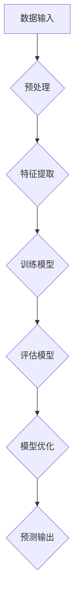
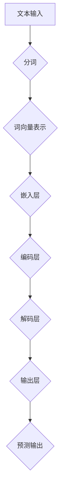

                 

### 《AI大模型创业：如何实现未来盈利？》

> **关键词**：AI大模型、盈利模式、创业实践、技术趋势、安全法律问题

> **摘要**：本文将探讨AI大模型在创业领域的应用与盈利模式，分析AI大模型的技术原理与核心算法，并结合实际案例，探讨AI大模型创业的风险与应对策略，以及未来趋势和挑战。文章旨在为AI大模型创业者提供全面的技术指导和实用建议。

### 《AI大模型创业：如何实现未来盈利？》目录大纲

**第一部分：AI大模型基础**

## 第1章：AI大模型概述

### 1.1 AI大模型的概念与历史

AI大模型是指利用深度学习和机器学习算法训练的大型神经网络模型。它们具有强大的数据处理和分析能力，可以应用于自然语言处理、计算机视觉、语音识别等多个领域。

#### **历史背景：**

- **1980年代**：神经网络的研究兴起，但受限于计算能力和算法效率，进展缓慢。
- **2000年代**：随着计算能力的提升和数据量的增加，深度学习重新受到关注。
- **2010年代**：AI大模型在图像识别、语音识别等领域取得突破性进展。
- **2020年代**：AI大模型在自然语言处理等领域取得重大突破，引发了广泛关注和应用。

### 1.2 AI大模型的技术原理

AI大模型的核心是神经网络，特别是深度神经网络。神经网络通过多层节点（神经元）进行数据传递和计算，从而实现对输入数据的映射和分类。

#### **关键概念：**

- **神经元**：神经网络的组成单元，具有输入、输出和激活函数。
- **层数**：神经网络分为输入层、隐藏层和输出层，层数越多，模型的复杂度和计算能力越强。
- **权重与偏置**：神经元之间的连接权值和偏置用于调整输入信号的强度。

### 1.3 AI大模型在商业中的应用

AI大模型在商业领域具有广泛的应用，如智能客服、图像识别、语音识别、推荐系统等。

#### **应用案例：**

- **智能客服**：利用自然语言处理技术，实现智能客服系统的自动化，提高客户服务质量。
- **图像识别**：利用计算机视觉技术，实现自动图像识别，提高生产效率和产品质量。
- **语音识别**：利用语音识别技术，实现语音输入到文本的转换，提高语音交互的便利性。
- **推荐系统**：利用机器学习算法，实现个性化推荐，提高用户体验和销售额。

## 第2章：AI大模型的核心算法

### 2.1 人工智能与机器学习基础

人工智能（AI）是指通过计算机模拟人类智能的技术，包括感知、学习、推理、决策等。机器学习是AI的核心技术，通过训练模型，使计算机能够自动学习并改进性能。

#### **关键概念：**

- **监督学习**：通过标记数据训练模型，使模型能够对未知数据进行预测。
- **无监督学习**：不使用标记数据，通过数据本身的特征进行学习。
- **强化学习**：通过奖励机制，使模型能够在动态环境中学习并做出最优决策。

### 2.2 深度学习算法详解

深度学习是机器学习的一种方法，通过多层神经网络进行数据建模和预测。其核心算法包括卷积神经网络（CNN）、循环神经网络（RNN）、生成对抗网络（GAN）等。

#### **核心算法：**

- **卷积神经网络（CNN）**：主要用于图像识别和图像处理。
- **循环神经网络（RNN）**：主要用于序列数据处理，如自然语言处理。
- **生成对抗网络（GAN）**：主要用于生成对抗和图像生成。

### 2.3 自然语言处理算法

自然语言处理（NLP）是AI的一个重要分支，旨在使计算机能够理解、生成和处理人类语言。关键算法包括词向量、序列标注、翻译模型等。

#### **关键算法：**

- **词向量**：通过将词语映射到高维向量空间，实现词语的相似性和语义理解。
- **序列标注**：通过标注序列中的词语，实现句法分析和语义分析。
- **翻译模型**：通过训练翻译模型，实现不同语言之间的自动翻译。

**第二部分：AI大模型的盈利模式**

## 第3章：AI大模型的盈利模式

### 3.1 AI大模型在不同行业的应用

AI大模型在金融、医疗、零售、制造等行业具有广泛的应用，为企业带来巨大的商业价值。

#### **应用场景：**

- **金融**：利用AI大模型进行风险评估、欺诈检测、股票预测等。
- **医疗**：利用AI大模型进行疾病诊断、药物研发、健康管理等。
- **零售**：利用AI大模型进行商品推荐、库存管理、客户服务优化等。
- **制造**：利用AI大模型进行生产优化、质量检测、设备维护等。

### 3.2 AI大模型的服务商业模式

AI大模型可以通过提供定制化的服务，帮助企业实现业务优化和增长。

#### **服务模式：**

- **咨询服务**：为企业提供AI解决方案和策略建议。
- **SaaS模式**：提供基于云平台的AI服务，用户按需付费。
- **定制开发**：为企业量身定制AI应用，实现个性化需求。

### 3.3 AI大模型的产品商业模式

AI大模型可以通过开发AI产品，直接面向消费者，实现盈利。

#### **产品模式：**

- **智能硬件**：结合AI技术，开发智能化的硬件产品，如智能音箱、智能摄像头等。
- **软件应用**：开发基于AI技术的软件应用，如智能客服、智能助手等。
- **在线服务**：提供在线服务，如智能诊断、智能翻译、智能推荐等。

**第三部分：AI大模型的创业实践**

## 第4章：AI大模型的创业实践

### 4.1 AI大模型创业团队组建

组建一支高效、专业的AI大模型创业团队至关重要。

#### **团队结构：**

- **技术团队**：负责AI大模型的研究、开发和实现。
- **产品团队**：负责产品规划、设计和推广。
- **市场团队**：负责市场调研、用户获取和业务拓展。
- **运营团队**：负责日常运营、客户服务和数据维护。

### 4.2 AI大模型创业项目策划

在项目策划阶段，需要进行全面的市场调研和需求分析，确保项目的可行性和市场前景。

#### **策划步骤：**

- **市场调研**：分析行业趋势、竞争对手、目标客户等。
- **需求分析**：确定产品功能、性能和用户体验。
- **技术选型**：选择合适的算法和框架，实现技术可行性。
- **风险评估**：评估项目风险，制定应对策略。

### 4.3 AI大模型创业风险与应对

AI大模型创业面临诸多风险，如技术风险、市场风险、资金风险等。

#### **风险类型：**

- **技术风险**：算法不稳定、模型效果不佳、系统崩溃等。
- **市场风险**：市场需求不足、竞争对手激烈、用户习惯改变等。
- **资金风险**：资金不足、投资失败、回报周期长等。

#### **应对策略：**

- **技术风险**：持续优化算法、加强团队技术能力、建立应急预案。
- **市场风险**：进行市场调研、制定差异化策略、提高品牌知名度。
- **资金风险**：合理规划资金使用、寻求投资合作、降低成本提高收益。

## 第5章：AI大模型的未来趋势

### 5.1 AI大模型的技术发展趋势

随着技术的不断进步，AI大模型将迎来更多的发展机遇。

#### **技术方向：**

- **多模态AI**：结合多种数据源，如图像、语音、文本等，实现更广泛的智能应用。
- **强化学习**：通过强化学习算法，使AI大模型能够更好地应对动态环境。
- **量子计算**：利用量子计算的优势，加速AI大模型的训练和推理。

### 5.2 AI大模型的商业前景

AI大模型在商业领域具有巨大的潜力，将为企业带来持续的创新和竞争优势。

#### **应用领域：**

- **智能制造**：通过AI大模型实现生产自动化、质量检测和设备维护。
- **智慧医疗**：利用AI大模型进行疾病预测、诊断和个性化治疗。
- **智慧城市**：通过AI大模型实现交通优化、能源管理和环境监测。
- **智慧金融**：利用AI大模型进行风险评估、欺诈检测和智能投顾。

### 5.3 AI大模型的社会影响

AI大模型的发展将对社会产生深远的影响，包括经济、教育、伦理等方面。

#### **社会影响：**

- **经济发展**：促进产业升级和经济增长，创造更多就业机会。
- **教育变革**：改变教育方式和内容，提高人才培养质量。
- **伦理挑战**：引发隐私保护、算法歧视、伦理道德等社会问题。

## 第6章：AI大模型的安全与法律问题

### 6.1 AI大模型的数据隐私保护

数据隐私保护是AI大模型发展的重要议题，需要建立完善的法律法规和行业标准。

#### **隐私保护措施：**

- **数据加密**：对数据进行加密处理，防止数据泄露。
- **隐私计算**：利用隐私计算技术，在不暴露数据的情况下进行数据处理和分析。
- **用户授权**：明确用户数据的授权范围和使用方式，确保用户知情权。

### 6.2 AI大模型的法律责任

AI大模型在应用过程中可能涉及法律责任的归属和责任划分。

#### **法律责任：**

- **侵权责任**：AI大模型侵犯他人合法权益，需承担侵权责任。
- **违约责任**：AI大模型未能履行合同义务，需承担违约责任。
- **产品责任**：AI大模型作为产品，存在缺陷导致损害，需承担产品责任。

### 6.3 AI大模型的伦理与社会责任

AI大模型的伦理问题涉及人类价值观、道德规范和社会责任等方面。

#### **伦理问题：**

- **算法歧视**：防止算法在决策过程中产生歧视，如性别、种族等。
- **数据偏见**：确保数据来源的多样性和公正性，避免数据偏见。
- **透明度**：提高AI大模型的透明度，使决策过程可解释和可信。

#### **社会责任：**

- **公平公正**：确保AI大模型的应用公平公正，不损害公共利益。
- **合作共赢**：与行业合作伙伴建立合作关系，实现共同发展。
- **持续创新**：持续推动AI大模型的技术创新，为社会发展贡献力量。

## 第7章：AI大模型创业案例研究

### 7.1 成功案例解析

通过分析成功案例，我们可以了解AI大模型创业的关键成功因素。

#### **案例解析：**

- **谷歌**：通过自主研发的AI大模型，实现搜索引擎的智能化和个性化。
- **微软**：利用AI大模型，提升办公软件的智能化和协同工作能力。
- **亚马逊**：通过AI大模型，优化物流和供应链管理，提高运营效率。

### 7.2 失败案例反思

通过反思失败案例，我们可以总结经验教训，避免类似错误。

#### **失败原因：**

- **技术不成熟**：AI大模型技术尚未成熟，导致项目失败。
- **市场需求不足**：产品未能满足市场需求，导致销售不佳。
- **管理不善**：团队管理不善，导致项目进度延误和资源浪费。

### 7.3 案例启示与创业策略

通过成功和失败案例的对比，我们可以得出以下启示和创业策略。

#### **启示：**

- **技术先行**：在创业初期，应重视技术研发，确保技术优势。
- **市场调研**：充分了解市场需求，确保产品有市场竞争力。
- **团队协作**：建立高效团队，分工明确，提高项目执行力。

#### **创业策略：**

- **差异化定位**：明确产品定位，打造差异化竞争优势。
- **持续创新**：保持技术领先，持续进行产品创新。
- **战略合作**：与行业合作伙伴建立战略合作，共同发展。

**第四部分：AI大模型创业工具与资源**

## 第8章：AI大模型开发工具与资源

### 8.1 深度学习框架介绍

深度学习框架是AI大模型开发的重要工具，常见的深度学习框架包括TensorFlow、PyTorch等。

#### **关键特性：**

- **易用性**：提供简单的API和丰富的文档，方便开发者使用。
- **灵活性**：支持自定义模型和算法，满足不同需求。
- **高性能**：优化算法和计算资源，提高模型训练和推理速度。

### 8.2 人工智能开源库与平台

人工智能开源库和平台为AI大模型开发提供了丰富的资源和工具。

#### **开源库与平台：**

- **NumPy**：提供高效的多维数组处理和数学函数。
- **Pandas**：提供数据操作和分析工具。
- **Scikit-learn**：提供常用的机器学习算法和工具。
- **Keras**：提供基于TensorFlow和Theano的简单易用的深度学习框架。

### 8.3 AI大模型相关的论文与书籍

阅读AI大模型相关的论文和书籍，有助于了解最新研究进展和理论知识。

#### **推荐书籍：**

- 《深度学习》（Ian Goodfellow、Yoshua Bengio、Aaron Courville）
- 《Python机器学习》（Sebastian Raschka、Vahid Mirjalili）
- 《强化学习》（Richard S. Sutton、Andrew G. Barto）

#### **推荐论文：**

- **“A Theoretical Comparison of Optimization Algorithms for Deep Learning”**：比较不同优化算法在深度学习中的应用。
- **“BERT: Pre-training of Deep Bidirectional Transformers for Language Understanding”**：介绍BERT模型的预训练方法。
- **“Generative Adversarial Nets”**：介绍生成对抗网络（GAN）的原理和应用。

## 第9章：AI大模型创业生态

### 9.1 AI大模型创业的生态系统

AI大模型创业生态系统包括技术、资本、人才等多个方面，共同推动创业发展。

#### **生态系统构成：**

- **技术生态**：包括深度学习框架、开源库、工具和平台等。
- **资本生态**：包括风险投资、政府补贴、创业投资等。
- **人才生态**：包括技术人才、管理人才、市场营销人才等。
- **产业生态**：包括企业、高校、科研机构等。

### 9.2 AI大模型创业的投资与融资

AI大模型创业需要充足的资金支持，投资与融资是关键环节。

#### **投资策略：**

- **天使投资**：为初创企业提供早期资金支持。
- **风险投资**：投资具有高增长潜力的初创企业。
- **政府补贴**：通过政策支持和补贴，鼓励企业进行技术研发和创新。

#### **融资渠道：**

- **股权融资**：通过出让股权换取资金支持。
- **债务融资**：通过借款或发行债券等债务工具筹集资金。
- **政府资金**：申请政府补贴、科研经费等。

### 9.3 AI大模型创业的国际合作与竞争

AI大模型创业涉及全球市场，国际合作与竞争至关重要。

#### **国际合作：**

- **技术合作**：与其他企业、高校和科研机构进行技术合作，共享资源和技术。
- **市场合作**：通过海外市场拓展，实现产品国际化。
- **人才交流**：引进海外人才，提升企业技术和管理水平。

#### **竞争态势：**

- **技术创新**：保持技术领先，提高产品竞争力。
- **市场份额**：扩大市场份额，提升品牌知名度。
- **国际化战略**：通过全球化布局，应对国际竞争。

## 第10章：AI大模型创业的未来

### 10.1 AI大模型创业的挑战与机遇

AI大模型创业面临诸多挑战和机遇，需要准确把握市场趋势和技术发展。

#### **挑战：**

- **技术挑战**：算法稳定性、模型效果、计算资源等。
- **市场挑战**：市场需求变化、竞争压力、用户信任等。
- **资金挑战**：资金不足、投资风险、回报周期等。

#### **机遇：**

- **技术创新**：不断突破技术瓶颈，实现技术升级。
- **市场需求**：新兴市场需求不断增长，为企业提供发展机遇。
- **政策支持**：政府政策支持，为企业发展创造良好环境。

### 10.2 AI大模型创业的创新思维

创新思维是AI大模型创业的核心竞争力，需要从多个角度进行创新。

#### **创新方向：**

- **技术创新**：研发新型算法、优化模型结构、提升计算效率。
- **产品创新**：开发具有差异化优势的产品，满足用户需求。
- **商业模式创新**：探索新的盈利模式，提高企业盈利能力。

### 10.3 AI大模型创业的发展方向

AI大模型创业将朝着更高效、更智能、更便捷的方向发展。

#### **发展方向：**

- **智能化**：利用AI大模型，实现更智能化的产品和服务。
- **个性化**：根据用户需求，提供个性化推荐和定制化服务。
- **跨界融合**：与其他行业跨界融合，创造新的商业模式和生态。

### 附录

**附录A：AI大模型创业资源列表**

#### **A.1 在线课程与教程**

- **Coursera**：提供丰富的AI和深度学习课程，如“深度学习专项课程”等。
- **edX**：提供由顶尖大学和机构开设的AI相关课程，如“MIT人工智能导论”等。
- **Udacity**：提供实用的AI和深度学习课程，如“深度学习工程师纳米学位”等。

#### **A.2 行业报告与研究报告**

- **IDC**：发布AI市场发展趋势报告，如《全球人工智能市场趋势报告》等。
- **CBInsights**：提供AI投资趋势和市场分析报告，如《AI创业公司报告》等。
- **麦肯锡**：发布AI在行业中的应用案例和研究报告，如《AI赋能企业》等。

#### **A.3 AI大模型相关的书籍与文献**

- **《深度学习》（Ian Goodfellow、Yoshua Bengio、Aaron Courville）**：全面介绍深度学习的基础理论和技术。
- **《Python机器学习》（Sebastian Raschka、Vahid Mirjalili）**：介绍Python在机器学习中的应用和实践。
- **《自然语言处理综论》（Daniel Jurafsky、James H. Martin）**：系统介绍自然语言处理的基础知识和技术。

**附录B：AI大模型核心算法Mermaid流程图**

#### **B.1 深度学习算法流程图**



#### **B.2 自然语言处理算法流程图**



**附录C：AI大模型核心算法伪代码讲解**

#### **C.1 神经网络算法伪代码**

```python
# 初始化模型参数
W = 初始化权重
b = 初始化偏置

# 定义激活函数
def sigmoid(x):
    return 1 / (1 + exp(-x))

# 前向传播
def forward_pass(x):
    z = x * W + b
    a = sigmoid(z)
    return a

# 反向传播
def backward_pass(x, y, a):
    dZ = a - y
    dW = (1/m) * dZ * x.T
    db = (1/m) * dZ
    return dW, db

# 梯度下降
def gradient_descent(W, b, dW, db, learning_rate):
    W -= learning_rate * dW
    b -= learning_rate * db
    return W, b
```

#### **C.2 循环神经网络算法伪代码**

```python
# 初始化模型参数
W = 初始化权重
b = 初始化偏置

# 定义激活函数
def sigmoid(x):
    return 1 / (1 + exp(-x))

# 前向传播
def forward_pass(x):
    h_t = 初始化隐藏状态
    for t in range(sequence_length):
        z_t = x_t * W_hh + h_{t-1} * W_xh + b_h
        h_t = sigmoid(z_t)
    return h_t

# 反向传播
def backward_pass(h_t, y, h_{t-1}, x_t, W_hh, W_xh, b_h):
    dZ = y - h_t
    dW_hh = (1/m) * dZ * h_{t-1}.T
    dW_xh = (1/m) * dZ * x_t.T
    db_h = (1/m) * dZ
    return dW_hh, dW_xh, db_h

# 梯度下降
def gradient_descent(W_hh, W_xh, b_h, dW_hh, dW_xh, db_h, learning_rate):
    W_hh -= learning_rate * dW_hh
    W_xh -= learning_rate * dW_xh
    b_h -= learning_rate * db_h
    return W_hh, W_xh, b_h
```

#### **C.3 生成对抗网络算法伪代码**

```python
# 初始化模型参数
W_G = 初始化生成器权重
W_D = 初始化判别器权重

# 定义生成器
def generator(z):
    x = f(z; W_G)
    return x

# 定义判别器
def discriminator(x):
    y = f(x; W_D)
    return y

# 前向传播
def forward_pass(z, x):
    x_hat = generator(z)
    y_hat = discriminator(x_hat)
    y_real = discriminator(x)

# 反向传播
def backward_pass(x_hat, x, y_hat, y_real):
    dG = x_hat - x
    dD = y_real - y_hat

# 梯度下降
def gradient_descent(W_G, W_D, dG, dD, learning_rate):
    W_G -= learning_rate * dG
    W_D -= learning_rate * dD
    return W_G, W_D
```

**附录D：AI大模型创业项目实战案例**

#### **D.1 项目一：聊天机器人开发**

**项目背景：**

随着互联网的普及，聊天机器人在客服、咨询、教育等领域得到广泛应用。本项目旨在开发一款基于AI大模型的智能聊天机器人，提供24/7在线服务。

**技术选型：**

- **自然语言处理**：利用NLP算法进行文本处理和语义理解。
- **深度学习**：采用RNN或Transformer模型进行文本生成和对话管理。
- **语音识别**：结合语音识别技术，实现语音输入和语音输出。

**开发流程：**

1. **需求分析**：明确聊天机器人的功能需求和业务场景。
2. **数据准备**：收集大量对话数据，进行数据清洗和预处理。
3. **模型训练**：利用预训练模型和自定义数据，训练聊天机器人模型。
4. **模型优化**：通过交叉验证和调参，优化模型性能。
5. **部署上线**：将模型部署到服务器，提供在线服务。

**项目成果：**

开发出一款具备自然语言处理和对话管理能力的智能聊天机器人，应用于企业客服、在线教育、在线咨询等领域，提高服务效率和用户体验。

#### **D.2 项目二：图像识别系统搭建**

**项目背景：**

图像识别技术在安防监控、医疗诊断、工业检测等领域具有广泛应用。本项目旨在搭建一款基于AI大模型的图像识别系统，实现自动化图像分类和目标检测。

**技术选型：**

- **计算机视觉**：利用计算机视觉算法进行图像预处理和特征提取。
- **深度学习**：采用CNN模型进行图像分类和目标检测。
- **目标检测算法**：采用Faster R-CNN、YOLO等算法，实现目标检测。

**开发流程：**

1. **需求分析**：明确图像识别系统的功能需求和业务场景。
2. **数据准备**：收集大量图像数据，进行数据清洗和标注。
3. **模型训练**：利用预训练模型和自定义数据，训练图像识别模型。
4. **模型优化**：通过交叉验证和调参，优化模型性能。
5. **部署上线**：将模型部署到服务器，实现图像识别功能。

**项目成果：**

搭建出一款具备图像分类和目标检测能力的图像识别系统，应用于安防监控、医疗诊断、工业检测等领域，提高工作效率和准确性。

#### **D.3 项目三：智能家居控制系统实现**

**项目背景：**

智能家居系统通过智能设备实现家庭自动化，提升生活品质。本项目旨在实现一款基于AI大模型的智能家居控制系统，实现智能设备的远程控制和管理。

**技术选型：**

- **物联网**：利用物联网技术，实现设备间的互联互通。
- **深度学习**：采用RNN或Transformer模型进行智能设备的行为预测和分类。
- **云平台**：利用云平台，实现数据的存储、分析和处理。

**开发流程：**

1. **需求分析**：明确智能家居系统的功能需求和业务场景。
2. **硬件选择**：选择合适的智能设备，进行硬件集成和调试。
3. **数据收集**：收集智能家居系统的运行数据，进行数据清洗和预处理。
4. **模型训练**：利用预训练模型和自定义数据，训练智能家居模型。
5. **部署上线**：将模型部署到云平台，实现智能家居控制功能。

**项目成果：**

开发出一款具备智能设备控制和管理功能的智能家居系统，实现远程监控、自动化控制和节能管理，提高用户的生活质量和便利性。

### 附录E：AI大模型创业相关数学公式

#### **E.1 神经元激活函数公式**

$$
f(x) = \frac{1}{1 + e^{-x}}
$$

#### **E.2 损失函数公式**

$$
J(\theta) = -\frac{1}{m} \sum_{i=1}^{m} [y_i \log(a^{(2)}_i) + (1 - y_i) \log(1 - a^{(2)}_i)]
$$

#### **E.3 优化算法公式**

$$
\theta = \theta - \alpha \frac{\partial J(\theta)}{\partial \theta}
$$

### 附录F：AI大模型创业法律问题FAQ

#### **F.1 数据隐私保护法规**

- **GDPR（欧盟通用数据保护条例）**：规定了个人数据的处理和保护规则。
- **CCPA（美国加利福尼亚州消费者隐私法案）**：规定了消费者对个人信息控制的权利。
- **个人信息保护法（中国）**：规定了个人信息收集、处理和保护的基本原则。

#### **F.2 AI模型法律责任**

- **侵权责任**：AI模型侵犯他人合法权益，需承担侵权责任。
- **违约责任**：AI模型未能履行合同义务，需承担违约责任。
- **产品责任**：AI模型作为产品，存在缺陷导致损害，需承担产品责任。

#### **F.3 AI伦理问题与解决方案**

- **算法歧视**：确保算法公平公正，避免歧视现象。
- **数据偏见**：加强数据质量控制，避免数据偏见。
- **透明度**：提高算法透明度，使决策过程可解释和可信。

### 附录G：AI大模型创业资源推荐

#### **G.1 在线课程与教程**

- **Coursera**：提供丰富的AI和深度学习课程，如“深度学习专项课程”等。
- **edX**：提供由顶尖大学和机构开设的AI相关课程，如“MIT人工智能导论”等。
- **Udacity**：提供实用的AI和深度学习课程，如“深度学习工程师纳米学位”等。

#### **G.2 行业报告与研究报告**

- **IDC**：发布AI市场发展趋势报告，如《全球人工智能市场趋势报告》等。
- **CBInsights**：提供AI投资趋势和市场分析报告，如《AI创业公司报告》等。
- **麦肯锡**：发布AI在行业中的应用案例和研究报告，如《AI赋能企业》等。

#### **G.3 AI大模型相关的书籍与文献**

- **《深度学习》（Ian Goodfellow、Yoshua Bengio、Aaron Courville）**：全面介绍深度学习的基础理论和技术。
- **《Python机器学习》（Sebastian Raschka、Vahid Mirjalili）**：介绍Python在机器学习中的应用和实践。
- **《自然语言处理综论》（Daniel Jurafsky、James H. Martin）**：系统介绍自然语言处理的基础知识和技术。

### 附录H：AI大模型创业社区与论坛

#### **G.4.1 知乎AI板块**

知乎AI板块聚集了大量AI领域的专业人士，提供丰富的讨论和知识分享。

#### **G.4.2 AI技术社区**

AI技术社区是一个专注于AI技术的在线社区，提供最新的技术动态和讨论。

#### **G.4.3 GitHub AI项目集**

GitHub AI项目集是AI开发者的宝库，提供了大量AI项目的源代码和文档，供开发者参考和学习。

