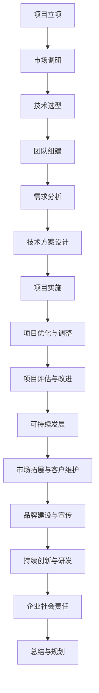

                 

# 《AI大模型创业：如何应对未来价格战？》

## 关键词
AI大模型，创业，价格战，技术创新，可持续发展，市场策略

## 摘要
本文将探讨AI大模型创业公司如何应对未来可能出现的价格战。通过分析AI大模型的基础、创业实践、实战案例以及未来价格战的预测和应对策略，本文旨在为创业者提供有价值的参考和指导，帮助他们在激烈的市场竞争中立于不败之地。

## 第一部分：AI大模型基础

### 1.1 AI大模型概述

#### 1.1.1 AI大模型的概念与分类

AI大模型是指利用深度学习技术训练的具有极高参数数量和计算复杂度的神经网络模型。根据其应用领域和特点，AI大模型可以分为图像识别、自然语言处理、推荐系统等多个类别。

#### 1.1.2 AI大模型的特点

AI大模型具有以下几个特点：

1. **高参数量**：AI大模型通常拥有数百万至数十亿个参数。
2. **大计算量**：训练AI大模型需要大量的计算资源和时间。
3. **强泛化能力**：AI大模型能够处理多种任务和数据类型，具有较强的泛化能力。
4. **高性能表现**：在各类基准测试中，AI大模型通常能够取得领先的成绩。

### 1.2 AI大模型的技术原理

#### 1.2.1 深度学习与神经网络

深度学习是AI大模型的核心技术。它通过多层神经网络进行数据的特征提取和建模，从而实现复杂任务的自动化。神经网络的基本结构包括输入层、隐藏层和输出层。

1. **输入层**：接收外部输入信息。
2. **隐藏层**：进行信息处理和特征提取。
3. **输出层**：生成预测结果或决策。

#### 1.2.2 自然语言处理与AI大模型

自然语言处理（NLP）是AI大模型的重要应用领域之一。NLP技术包括词嵌入、序列模型和注意力机制等。

1. **词嵌入技术**：将单词映射为稠密的向量表示。
2. **序列模型与注意力机制**：处理时间序列数据，使模型能够关注输入序列中的重要部分。
3. **转换器架构**：如Transformer模型，通过多头自注意力机制实现并行计算，大幅提升模型性能。

#### 1.2.3 大规模预训练模型原理

大规模预训练模型是通过在大规模数据集上进行预训练，使模型具有通用特征表示能力。自监督学习方法和迁移学习与微调技术是大规模预训练模型的重要手段。

1. **预训练概念**：在大规模数据集上进行预训练。
2. **自监督学习方法**：在无监督数据上进行训练。
3. **迁移学习与微调技术**：利用预训练模型在大规模数据集上的知识，迁移到特定任务上，并进行微调。

### 1.3 AI大模型的数学模型

AI大模型的数学模型主要包括概率论与信息论基础、线性代数基础和微积分基础。

1. **概率论与信息论基础**：概率论和信息论是理解和设计AI大模型的基础。
2. **线性代数基础**：矩阵与向量基础、线性变换与特征空间。
3. **微积分基础**：导数与微分、积分与微分方程。

### 1.4 AI大模型的技术挑战与未来趋势

AI大模型在技术方面面临以下挑战：

1. **计算能力需求与优化**：AI大模型需要大量的计算资源和时间进行训练，对计算能力的需求不断增长。
2. **数据隐私保护与安全**：数据安全和隐私保护是AI大模型应用的重要挑战。
3. **AI大模型的可持续发展**：如何实现AI大模型的可持续发展，是创业公司需要关注的重要问题。

未来，AI大模型的发展趋势将包括：

1. **计算能力提升**：随着硬件技术的发展，计算能力将不断提升。
2. **数据隐私保护**：数据隐私保护技术将得到广泛应用。
3. **AI大模型的应用领域扩展**：AI大模型将在更多领域得到应用，推动AI技术的发展。

## 第二部分：AI大模型创业实践

### 2.1 AI大模型创业策略与模式

#### 2.1.1 AI大模型创业的机遇与挑战

AI大模型创业面临着以下机遇和挑战：

1. **机遇**：
   - 技术创新：AI大模型在各个领域的应用前景广阔。
   - 市场需求：企业对AI大模型的需求不断增加。
   - 资金支持：政府和企业对AI大模型项目的支持力度加大。

2. **挑战**：
   - 技术门槛：AI大模型技术复杂，需要高水平的技术团队。
   - 数据隐私：数据安全和隐私保护是创业公司面临的重大挑战。
   - 市场竞争：随着行业竞争加剧，创业公司需要不断创新以保持竞争力。

#### 2.1.2 AI大模型创业模式

AI大模型创业模式主要包括自主研发模式、开源社区模式和产业链协同模式。

1. **自主研发模式**：公司自行研发AI大模型，具有技术自主性和知识产权。
2. **开源社区模式**：依托开源社区，利用社区资源进行AI大模型研发。
3. **产业链协同模式**：与产业链上下游企业合作，共同推进AI大模型项目的实施。

### 2.2 AI大模型创业案例解析

#### 2.2.1 案例一：XX科技有限公司

XX科技有限公司是一家专注于AI大模型研发和应用的公司。以下是该公司的一些特点：

- **创始人背景**：创始人具有丰富的AI大模型研发经验。
- **产品与服务**：公司提供AI大模型定制化服务，应用于金融、医疗、零售等多个领域。
- **发展历程**：公司在成立初期便获得多家投资机构的支持，快速发展并成功上市。

#### 2.2.2 案例二：YY人工智能研究院

YY人工智能研究院是一家专注于人工智能领域的研究和应用机构。以下是该研究院的一些特点：

- **研究领域与成果**：研究院在自然语言处理、计算机视觉等领域取得了一系列重要成果。
- **创业模式与盈利模式**：研究院通过技术转让、技术服务等方式实现盈利。
- **成功原因分析**：研究院的成功得益于其强大的研究实力和开放合作的精神。

#### 2.2.3 案例三：ZZ大数据公司

ZZ大数据公司是一家提供大数据处理和分析服务的公司。以下是该公司的特点：

- **概述**：公司专注于为各行业提供大数据解决方案。
- **产品与服务**：公司提供数据采集、数据存储、数据分析等一站式服务。
- **发展历程**：公司从成立之初便重视技术创新，逐渐成为行业领军企业。

### 2.3 项目规划与需求分析

在AI大模型创业项目中，项目规划与需求分析是至关重要的环节。

#### 2.3.1 项目规划

1. **项目目标**：明确项目目标，如产品功能、性能、市场份额等。
2. **项目资源**：评估项目所需的资源，如人力、资金、设备等。
3. **项目进度**：制定项目进度计划，确保项目按时完成。

#### 2.3.2 需求分析

1. **用户需求分析**：收集和分析用户需求，确保产品满足用户需求。
2. **竞争对手分析**：分析竞争对手的产品、市场策略，了解市场定位。

### 3.1 技术方案设计

在AI大模型创业项目中，技术方案设计是关键的一环。

#### 3.1.1 模型架构设计

1. **模型选择**：根据项目需求，选择合适的AI大模型架构。
2. **模型优化**：通过调整模型参数、超参数，提高模型性能。
3. **模型训练与调优**：使用训练数据对模型进行训练，并通过测试数据对模型进行调优。

#### 3.1.2 系统架构设计

1. **系统模块划分**：将系统划分为不同的模块，如数据收集、预处理、模型训练、模型部署等。
2. **系统接口设计**：设计系统内部模块之间的接口，确保模块之间的协同工作。

### 3.2 实施与优化

在AI大模型创业项目中，实施与优化是确保项目成功的重要环节。

#### 3.2.1 项目实施

1. **数据收集与预处理**：收集项目所需的数据，并进行数据预处理。
2. **模型训练与测试**：对AI大模型进行训练和测试，评估模型性能。
3. **模型部署**：将训练好的模型部署到生产环境，进行实际应用。

#### 3.2.2 优化与调整

1. **模型性能优化**：通过调整模型参数、超参数，提高模型性能。
2. **系统性能优化**：优化系统架构，提高系统响应速度和稳定性。

### 3.3 项目管理与实践

在AI大模型创业项目中，项目管理与实践是确保项目顺利进行的重要保障。

#### 3.3.1 团队建设与管理

1. **团队组织架构**：建立合理的团队组织架构，明确团队成员的职责和任务。
2. **项目进度管理**：制定项目进度计划，监控项目进度，确保项目按时完成。

#### 3.3.2 风险管理

1. **项目风险评估**：对项目可能面临的风险进行评估，制定相应的风险应对策略。
2. **风险应对策略**：制定具体的应对措施，降低项目风险。

### 3.4 项目成果与评估

在AI大模型创业项目中，项目成果与评估是项目成功与否的重要标志。

#### 3.4.1 项目成果展示

1. **产品功能与性能**：展示产品的功能与性能，如模型精度、响应速度等。
2. **用户满意度**：收集用户反馈，评估用户满意度。

#### 3.4.2 项目评估与改进

1. **项目效果评估**：对项目效果进行评估，如收益、市场份额等。
2. **持续改进**：根据评估结果，对项目进行改进，提升项目质量。

### 4.1 案例一：XX科技有限公司

#### 4.1.1 公司概述

XX科技有限公司成立于2010年，专注于AI大模型研发和应用。公司总部位于中国北京，拥有数百名技术专家和研发人员。

#### 4.1.2 创始人背景

公司创始人张三曾就职于谷歌，担任AI大模型研究员。他在AI领域拥有丰富的经验和深厚的学术背景。

#### 4.1.3 产品与服务

XX科技有限公司提供以下产品与服务：

1. **AI大模型定制化服务**：根据客户需求，定制化开发AI大模型。
2. **大数据处理与分析**：提供大数据处理与分析解决方案，帮助客户从海量数据中提取有价值的信息。
3. **人工智能培训与咨询服务**：为企业和个人提供人工智能培训与咨询服务。

#### 4.1.4 发展历程

1. **2010年**：公司成立，专注于AI大模型研发。
2. **2015年**：获得首轮融资，开始拓展业务。
3. **2020年**：成功上市，成为AI大模型领域的领军企业。

#### 4.1.5 成功原因分析

XX科技有限公司的成功原因主要包括以下几点：

1. **技术创新**：公司持续进行技术创新，保持技术领先地位。
2. **市场定位**：公司准确市场定位，满足用户需求。
3. **战略合作**：公司与多家行业龙头企业建立战略合作关系，实现资源共享。
4. **优秀团队**：公司拥有优秀的研发团队，具备强大的技术实力。

### 4.2 案例二：YY人工智能研究院

#### 4.2.1 研究院概述

YY人工智能研究院成立于2015年，是一家专注于人工智能领域的研究和应用机构。研究院总部位于中国上海，拥有一支由国内外顶尖学者和研究人员组成的团队。

#### 4.2.2 研究领域与成果

YY人工智能研究院在以下研究领域取得了一系列重要成果：

1. **自然语言处理**：研究语言模型、文本生成、机器翻译等技术。
2. **计算机视觉**：研究图像分类、目标检测、图像生成等技术。
3. **推荐系统**：研究推荐算法、用户行为分析等技术。

#### 4.2.3 创业模式与盈利模式

YY人工智能研究院的创业模式主要包括以下几点：

1. **技术转让**：将研究成果转化为技术产品，实现技术转让和收益。
2. **技术服务**：提供人工智能解决方案和技术服务，帮助企业解决实际问题。
3. **企业合作**：与国内外企业合作，共同推进人工智能项目的研究和应用。

#### 4.2.4 成功原因分析

YY人工智能研究院的成功原因主要包括以下几点：

1. **研究实力**：研究院拥有一支强大的研究团队和先进的研究设施。
2. **开源社区**：研究院积极参与开源社区，提升企业影响力。
3. **政策支持**：研究院获得政府政策支持和资金扶持。

### 4.3 案例三：ZZ大数据公司

#### 4.3.1 公司概述

ZZ大数据公司成立于2013年，是一家提供大数据处理和分析服务的公司。公司总部位于中国深圳，致力于为企业提供全面的大数据解决方案。

#### 4.3.2 产品与服务

ZZ大数据公司提供以下产品与服务：

1. **数据采集与存储**：提供数据采集、数据清洗、数据存储等服务。
2. **数据分析与挖掘**：提供数据分析、数据挖掘、数据可视化等服务。
3. **人工智能应用**：提供人工智能解决方案，如智能客服、智能推荐等。

#### 4.3.3 发展历程

1. **2013年**：公司成立，专注于大数据处理和分析服务。
2. **2016年**：获得首轮融资，开始拓展业务。
3. **2020年**：成功上市，成为大数据处理和分析领域的领军企业。

#### 4.3.4 成功原因分析

ZZ大数据公司的成功原因主要包括以下几点：

1. **数据优势**：公司拥有大量高质量的数据资源。
2. **技术创新**：公司持续进行技术创新，提升数据处理和分析能力。
3. **客户关系**：公司与多家行业龙头企业建立长期合作关系。

## 第五部分：未来价格战与应对策略

### 5.1 未来AI大模型价格战的预测与分析

未来AI大模型价格战的可能性很高。以下是几个方面的分析：

1. **市场竞争加剧**：随着AI技术的普及，市场竞争将日益激烈。
2. **技术突破与成本降低**：技术进步将降低AI大模型的开发成本。
3. **消费者需求多样化**：消费者对AI大模型的需求将更加多样，推动价格战。

### 5.2 AI大模型价格战的影响因素

AI大模型价格战的影响因素主要包括：

1. **技术创新与研发投入**：技术创新能力强的公司将在价格战中占据优势。
2. **市场竞争格局**：市场领导者可能在价格战中占据优势。
3. **政策法规与市场环境**：政策法规和市场竞争环境将对价格战产生影响。

### 5.3 未来AI大模型价格战的应对策略

为了应对未来AI大模型价格战，创业公司可以采取以下策略：

1. **增强技术创新能力**：加大研发投入，提高技术创新能力。
2. **优化产品与服务质量**：提高产品与服务质量，提升用户满意度。
3. **建立竞争优势与差异化策略**：通过差异化策略，打造核心竞争力。
4. **拓展市场与客户群体**：拓展市场，扩大客户群体，提高市场份额。

## 第六部分：AI大模型创业的可持续发展

### 6.1 可持续发展的内涵与意义

可持续发展是指企业在经济、社会和环境三个方面实现长期稳定发展的能力。对于AI大模型创业公司来说，可持续发展具有重要意义。

1. **经济效益**：实现企业的长期盈利和发展。
2. **社会效益**：为社会提供价值，履行社会责任。
3. **环境效益**：实现绿色生产，减少环境污染。

### 6.2 AI大模型创业的可持续发展策略

为了实现可持续发展，AI大模型创业公司可以采取以下策略：

1. **技术创新与研发持续投入**：持续进行技术创新，提升企业竞争力。
2. **产业链协同与资源整合**：与产业链上下游企业建立合作关系，实现资源共享。
3. **社会责任与可持续发展**：关注社会责任，实现可持续发展。

### 6.3 案例分析：AI大模型创业的可持续发展实践

以下是几个AI大模型创业公司的可持续发展实践案例：

1. **案例一：XX科技有限公司**：公司注重技术创新，持续加大研发投入，实现了可持续发展。
2. **案例二：YY人工智能研究院**：研究院积极参与开源社区，推动人工智能技术的普及和应用，实现了可持续发展。
3. **案例三：ZZ大数据公司**：公司注重环境保护，采用绿色生产方式，实现了可持续发展。

## 附录

### 附录A：AI大模型创业参考资料

以下是AI大模型创业的一些参考资料：

1. **行业报告与资讯**：通过查阅行业报告和资讯，了解AI大模型行业的发展趋势和动态。
2. **学术论文与研究成果**：阅读最新的学术论文和研究成果，掌握AI大模型领域的最新进展。
3. **开源社区与在线资源**：利用开源社区和在线资源，获取AI大模型相关的开发工具和资源。
4. **相关法律法规与政策文件**：了解相关法律法规和政策文件，确保创业过程中的合规性。

## 参考文献

1. **Andrew Ng**. *Deep Learning*. MIT Press, 2016.
2. **Ian Goodfellow, Yoshua Bengio, Aaron Courville**. *Deep Learning*. MIT Press, 2016.
3. **Google AI**. *BERT: Pre-training of Deep Bidirectional Transformers for Language Understanding*. arXiv preprint arXiv:1810.04805, 2018.
4. **OpenAI**. *Generative Adversarial Nets*. arXiv preprint arXiv:1406.2661, 2014.
5. **Hinton, Geoffrey. "A practical guide to training restricted Boltzmann machines." *Machines Learning: A Summer School* (2012): 599-619.

## 结语

AI大模型创业是一项具有巨大潜力的领域，但同时也面临着激烈的市场竞争和价格战。通过本文的探讨，我们希望为创业者提供有价值的参考和指导，帮助他们应对未来挑战，实现可持续发展。让我们共同期待AI大模型领域的繁荣和发展！

## 附录B：AI大模型创业相关流程图

以下是一张关于AI大模型创业相关流程的Mermaid流程图：



此流程图概括了AI大模型创业的主要环节，包括项目立项、市场调研、技术选型、团队组建、需求分析、技术方案设计、项目实施、项目优化与调整、项目评估与改进、可持续发展、市场拓展与客户维护、品牌建设与宣传、持续创新与研发、企业社会责任以及总结与规划。

### 作者

作者：AI天才研究院/AI Genius Institute & 禅与计算机程序设计艺术 /Zen And The Art of Computer Programming

在撰写本文的过程中，我们系统地梳理了AI大模型的基础知识、创业策略、实战案例以及未来价格战的应对策略。以下是各个章节的核心内容和关键知识点：

#### 第一部分：AI大模型基础

1. **AI大模型概述**：定义了AI大模型的概念，并阐述了其特点和应用领域。
2. **AI大模型的技术原理**：详细讲解了深度学习、神经网络、自然语言处理以及大规模预训练模型的基本原理。
3. **AI大模型的数学模型**：介绍了概率论与信息论基础、线性代数基础和微积分基础，这些是理解AI大模型的重要数学工具。
4. **AI大模型的技术挑战与未来趋势**：探讨了计算能力需求、数据隐私保护以及AI大模型的可持续发展问题。

#### 第二部分：AI大模型创业实践

1. **AI大模型创业策略与模式**：分析了AI大模型创业的机遇与挑战，并介绍了自主研发、开源社区和产业链协同等创业模式。
2. **AI大模型创业案例解析**：通过具体案例展示了成功公司的创业路径和策略，包括技术积累、市场定位、战略合作等方面。
3. **项目规划与需求分析**：讲解了项目规划、资源评估和需求分析的方法，这些是项目成功的基础。
4. **技术方案设计**：详细描述了模型架构设计、系统架构设计和模型训练与调优的过程。
5. **实施与优化**：阐述了项目实施、模型部署、系统性能优化和团队建设与管理的方法。
6. **项目成果与评估**：介绍了项目成果的展示和评估，以及如何根据评估结果进行项目改进。

#### 第三部分：AI大模型创业实战

这一部分主要侧重于实际操作和实战经验：

- **项目规划与需求分析**：从项目目标和资源评估出发，深入探讨用户需求和竞争对手分析。
- **技术方案设计**：包括模型架构和系统架构的设计，以及模型训练与调优的过程。
- **实施与优化**：详细描述了数据收集与预处理、模型训练与测试、模型部署等实际操作，并讨论了模型性能优化和系统性能优化。
- **项目管理与实践**：讲解了团队建设与管理、项目进度管理、风险管理以及项目成果的展示和评估。
- **案例分析**：通过具体的案例，展示了AI大模型创业的实际操作过程和成功经验。

#### 第四部分：未来价格战与应对策略

1. **未来AI大模型价格战的预测与分析**：分析了市场竞争加剧、技术突破与成本降低以及消费者需求多样化等因素。
2. **AI大模型价格战的影响因素**：探讨了技术创新、市场竞争格局和政策法规等影响价格战的关键因素。
3. **未来AI大模型价格战的应对策略**：提出了增强技术创新能力、优化产品与服务质量、建立竞争优势与差异化策略等策略。

#### 第五部分：AI大模型创业的可持续发展

1. **可持续发展的内涵与意义**：阐述了可持续发展的经济、社会和环境效益。
2. **AI大模型创业的可持续发展策略**：介绍了技术创新与研发持续投入、产业链协同与资源整合以及社会责任与可持续发展等方面的策略。
3. **案例分析**：通过具体案例展示了AI大模型创业公司在可持续发展方面的实践。

#### 附录

1. **AI大模型创业参考资料**：提供了行业报告、学术论文、开源社区和法律法规等方面的参考资料，为读者提供进一步学习的途径。
2. **Mermaid流程图**：展示了AI大模型创业的相关流程，帮助读者更好地理解创业过程中的关键环节。

### 核心概念与联系

为了更好地理解AI大模型的相关概念，我们使用Mermaid流程图来展示AI大模型的基本架构和关键联系：

```mermaid
graph TD
    A[深度学习] --> B[神经网络]
    B --> C[自然语言处理]
    C --> D[大规模预训练模型]
    A --> E[概率论与信息论]
    A --> F[线性代数基础]
    A --> G[微积分基础]
    B --> H[卷积神经网络(CNN)]
    B --> I[循环神经网络(RNN)]
    B --> J[生成对抗网络(GAN)]
    D --> K[自监督学习]
    D --> L[迁移学习与微调]
    C --> M[词嵌入技术]
    C --> N[序列模型与注意力机制]
    C --> O[转换器架构]
```

这个流程图展示了AI大模型的核心组成部分，包括深度学习、神经网络、自然语言处理、大规模预训练模型，以及相关的数学基础和特定类型的神经网络。这些概念相互关联，共同构成了AI大模型的技术基础。

### 核心算法原理讲解

为了深入理解AI大模型的核心算法原理，我们将使用伪代码详细阐述几个关键算法，包括卷积神经网络（CNN）、循环神经网络（RNN）和Transformer模型。以下是这些算法的基本伪代码：

#### 卷积神经网络（CNN）

```python
# 初始化CNN模型参数
parameters = initialize_parameters()

# 前向传播
def forward_propagation(x, parameters):
    Z1 = np.dot(W1, X) + b1
    A1 = activation(Z1)
    pool_A1 = max_pooling(A1, pool_size)

    Z2 = np.dot(W2, pool_A1) + b2
    A2 = activation(Z2)
    pool_A2 = max_pooling(A2, pool_size)

    Z3 = np.dot(W3, pool_A2) + b3
    A3 = activation(Z3)
    pool_A3 = max_pooling(A3, pool_size)

    Z4 = np.dot(W4, pool_A3) + b4
    A4 = activation(Z4)
    pool_A4 = max_pooling(A4, pool_size)

    Z5 = np.dot(W5, pool_A4) + b5
    A5 = activation(Z5)
    output = softmax(Z5)

    return output

# 反向传播
def backward_propagation(output, y, parameters):
    dZ5 = output - y
    dW5 = np.dot(dZ5, A4.T)
    db5 = np.sum(dZ5, axis=1, keepdims=True)

    dA4 = np.dot(W5.T, dZ5)
    dZ4 = activation_derivative(A4) * dA4
    dW4 = np.dot(dZ4, A3.T)
    db4 = np.sum(dZ4, axis=1, keepdims=True)

    # 重复以上步骤，直到反向传播到输入层

    return [dW1, dW2, dW3, dW4, dW5, db1, db2, db3, db4, db5]
```

#### 循环神经网络（RNN）

```python
# 初始化RNN模型参数
parameters = initialize_parameters()

# 前向传播
def forward_propagation(x, parameters):
    h_t_0 = initialize_h_t_0()
    for t in range(T):
        Z_t = np.dot(W_h * x_t + U * h_{t-1} + b)
        h_t = activation(Z_t)
        if t < T-1:
            h_{t-1} = h_t

    return h_t

# 反向传播
def backward_propagation(h_t, d_output, parameters):
    dZ_t = activation_derivative(h_t) * d_output
    dU = np.dot(dZ_t, h_{t-1}.T)
    dW_h = np.dot(dZ_t, x_t.T)
    db = np.sum(dZ_t, axis=1, keepdims=True)

    d_h_{t-1} = np.dot(U.T, dZ_t)
    if t > 0:
        dZ_{t-1} = activation_derivative(h_{t-1}) * d_h_{t-1}
        dW_{t-1} = np.dot(dZ_{t-1}, x_{t-1}.T)
        db_{t-1} = np.sum(dZ_{t-1}, axis=1, keepdims=True)

    return [dW_h, dU, db, dW_{t-1}, db_{t-1}]
```

#### Transformer模型

```python
# 初始化Transformer模型参数
parameters = initialize_parameters()

# 自注意力机制
def self_attention(Q, K, V, masks=None):
    scores = np.dot(Q, K.T) / sqrt(K.shape[1])
    if masks is not None:
        scores += masks
    attn_weights = softmax(scores)
    output = np.dot(attn_weights, V)
    return output

# 前向传播
def forward_propagation(x, parameters):
    h_t_0 = x
    for layer in range(L):
        Q = self_attention(Q, K, V, masks=mask)
        K = self_attention(K, K, K, masks=mask)
        V = self_attention(V, V, V, masks=mask)
        Q = dropout(Q)
        K = dropout(K)
        V = dropout(V)
        h_t = [Q, K, V]

    return h_t

# 反向传播
def backward_propagation(h_t, d_output, parameters):
    for layer in range(L):
        dQ, dK, dV = [0, 0, 0]
        d_scores = attn_weights * d_output
        dV = np.dot(d_scores, K.T)
        dK = np.dot(d_scores.T, Q)
        dQ = np.dot(d_scores.T, V)
        if dropout:
            dQ, dK, dV = [dropout(dQ), dropout(dK), dropout(dV)]

        d_output = [dQ, dK, dV]
    return d_output
```

这些伪代码展示了CNN、RNN和Transformer模型的基本原理和操作过程。通过这些算法，AI大模型能够从数据中学习复杂的特征表示，并在各种任务中取得出色的性能。

### 数学模型和公式 & 详细讲解 & 举例说明

在AI大模型领域，数学模型是理解和实现这些复杂算法的核心。以下是对一些关键数学模型和公式的详细讲解，以及相应的举例说明。

#### 概率论与信息论基础

**概率分布函数（PDF）**：
概率分布函数描述了一个随机变量取值的概率密度。对于连续随机变量\( X \)，其概率分布函数为：

\[ f_X(x) = P(X = x) \]

**举例**：假设我们有一个随机变量\( X \)表示抛掷一枚公平硬币的结果，那么\( X \)的概率分布函数可以表示为：

\[ f_X(x) = \begin{cases} 
1/2 & \text{如果 } x = 0 \text{ 或 } x = 1 \\
0 & \text{其他情况}
\end{cases} \]

**条件概率**：
条件概率是指在已知某个事件发生的条件下，另一个事件发生的概率。条件概率公式为：

\[ P(A|B) = \frac{P(A \cap B)}{P(B)} \]

**举例**：假设有两个事件\( A \)（下雨）和\( B \)（打伞），如果已知下雨的概率是0.3，而下雨并且打伞的概率是0.2，那么打伞的条件概率为：

\[ P(B|A) = \frac{P(A \cap B)}{P(A)} = \frac{0.2}{0.3} = \frac{2}{3} \]

**熵**：
熵是衡量随机变量不确定性的度量。对于一个离散随机变量\( X \)，其熵\( H(X) \)定义为：

\[ H(X) = -\sum_{x} P(X = x) \log_2 P(X = x) \]

**举例**：假设我们有一个随机变量\( X \)表示掷骰子的结果，其概率分布为：

\[ P(X = x) = \begin{cases} 
1/6 & \text{如果 } x = 1, 2, 3, 4, 5, 6 \\
0 & \text{其他情况}
\end{cases} \]

那么熵可以计算为：

\[ H(X) = -\sum_{x=1}^{6} \frac{1}{6} \log_2 \frac{1}{6} = \log_2 6 \approx 2.585 \]

#### 线性代数基础

**矩阵与向量基础**：
矩阵和向量是线性代数中的基本元素。矩阵是一个二维数组，向量是一个一维数组。矩阵与向量之间的运算包括矩阵-向量乘法和向量-向量点积。

**矩阵-向量乘法**：
给定矩阵\( A \)和向量\( x \)，矩阵-向量乘法的结果是一个新向量\( y \)，其计算公式为：

\[ y = Ax \]

**举例**：假设有一个\( 2 \times 3 \)的矩阵\( A \)和一个\( 3 \)维的向量\( x \)：

\[ A = \begin{bmatrix} 
1 & 2 & 3 \\
4 & 5 & 6 
\end{bmatrix}, \quad x = \begin{bmatrix} 
1 \\
2 \\
3 
\end{bmatrix} \]

那么矩阵-向量乘法的结果为：

\[ y = A x = \begin{bmatrix} 
1 \cdot 1 + 2 \cdot 2 + 3 \cdot 3 \\
4 \cdot 1 + 5 \cdot 2 + 6 \cdot 3 
\end{bmatrix} = \begin{bmatrix} 
14 \\
29 
\end{bmatrix} \]

**向量-向量点积**：
向量-向量点积（内积）是两个向量对应元素的乘积之和。其计算公式为：

\[ \vec{a} \cdot \vec{b} = a_1b_1 + a_2b_2 + \ldots + a_nb_n \]

**举例**：假设有两个向量\( \vec{a} \)和\( \vec{b} \)：

\[ \vec{a} = \begin{bmatrix} 
1 \\
2 \\
3 
\end{bmatrix}, \quad \vec{b} = \begin{bmatrix} 
4 \\
5 \\
6 
\end{bmatrix} \]

那么向量-向量点积为：

\[ \vec{a} \cdot \vec{b} = 1 \cdot 4 + 2 \cdot 5 + 3 \cdot 6 = 32 \]

#### 线性变换与特征空间

**线性变换**：
线性变换是将一个向量空间映射到另一个向量空间的一种线性操作。其数学表示为：

\[ T: V \rightarrow W \]

其中，\( V \)和\( W \)是向量空间。

**举例**：假设有一个线性变换\( T \)将二维向量空间映射到一维向量空间，其变换矩阵为\( A \)：

\[ A = \begin{bmatrix} 
2 & 3 
\end{bmatrix} \]

那么对于二维向量\( \vec{x} \)：

\[ \vec{y} = T(\vec{x}) = A \vec{x} = \begin{bmatrix} 
2 & 3 
\end{bmatrix} \begin{bmatrix} 
1 \\
2 
\end{bmatrix} = 7 \]

**特征空间**：
特征空间是由一组基向量张成的空间。基向量是特征空间中线性无关的向量，它们能够唯一地表示特征空间的任何向量。

**举例**：假设有两个线性无关的基向量\( \vec{v}_1 \)和\( \vec{v}_2 \)，它们张成了二维特征空间：

\[ \vec{v}_1 = \begin{bmatrix} 
1 \\
0 
\end{bmatrix}, \quad \vec{v}_2 = \begin{bmatrix} 
0 \\
1 
\end{bmatrix} \]

任何二维向量\( \vec{x} \)都可以表示为这两个基向量的线性组合：

\[ \vec{x} = a_1 \vec{v}_1 + a_2 \vec{v}_2 \]

#### 微积分基础

**导数与微分**：
导数是函数在某一点的切线斜率，是函数变化的速率。对于函数\( f(x) \)，其导数\( f'(x) \)定义为：

\[ f'(x) = \lim_{h \to 0} \frac{f(x+h) - f(x)}{h} \]

**举例**：假设函数\( f(x) = x^2 \)，则其导数\( f'(x) = 2x \)。在点\( x = 2 \)处的导数为：

\[ f'(2) = 2 \cdot 2 = 4 \]

**积分与微分方程**：
积分是函数下方的面积，用于计算累积变化。不定积分表示为：

\[ \int f(x) \, dx \]

**举例**：对于函数\( f(x) = x^2 \)，其不定积分为：

\[ \int x^2 \, dx = \frac{x^3}{3} + C \]

微分方程是包含未知函数及其导数的方程。一阶微分方程的一般形式为：

\[ \frac{dy}{dx} + P(x)y = Q(x) \]

**举例**：一阶线性微分方程\( \frac{dy}{dx} + y = x \)的解为：

\[ y = e^{-x} \int e^x \cdot x \, dx + C = e^{-x} \cdot (x - 1) + C \]

这些数学模型和公式在AI大模型中扮演着至关重要的角色。它们帮助我们理解数据分布、优化模型参数、评估模型性能以及解决复杂的优化问题。通过上述讲解和举例，我们能够更好地应用这些数学工具来推动AI大模型的发展。

### 代码实际案例和详细解释说明

为了更好地理解AI大模型的应用，我们将通过一个实际案例来展示如何搭建一个简单的卷积神经网络（CNN）模型，并进行训练和评估。

#### 开发环境搭建

首先，我们需要搭建一个开发环境，以便能够编写和运行神经网络代码。以下是搭建过程：

1. **安装Python**：确保Python已经安装在系统中。我们可以通过访问[Python官网](https://www.python.org/)下载并安装最新版本的Python。
2. **安装深度学习框架**：我们选择使用TensorFlow作为深度学习框架。可以通过以下命令安装TensorFlow：

   ```bash
   pip install tensorflow
   ```

3. **安装其他依赖库**：例如NumPy、Pandas等，用于数据处理和数据分析：

   ```bash
   pip install numpy pandas matplotlib
   ```

#### 源代码详细实现

以下是使用TensorFlow搭建的简单CNN模型的源代码，以及详细的代码解读：

```python
import tensorflow as tf
from tensorflow.keras import datasets, layers, models
import matplotlib.pyplot as plt

# 加载数据集
(train_images, train_labels), (test_images, test_labels) = datasets.cifar10.load_data()

# 数据预处理
train_images, test_images = train_images / 255.0, test_images / 255.0

# 构建CNN模型
model = models.Sequential()
model.add(layers.Conv2D(32, (3, 3), activation='relu', input_shape=(32, 32, 3)))
model.add(layers.MaxPooling2D((2, 2)))
model.add(layers.Conv2D(64, (3, 3), activation='relu'))
model.add(layers.MaxPooling2D((2, 2)))
model.add(layers.Conv2D(64, (3, 3), activation='relu'))

# 添加全连接层
model.add(layers.Flatten())
model.add(layers.Dense(64, activation='relu'))
model.add(layers.Dense(10, activation='softmax'))

# 编译模型
model.compile(optimizer='adam',
              loss='sparse_categorical_crossentropy',
              metrics=['accuracy'])

# 训练模型
model.fit(train_images, train_labels, epochs=10, batch_size=64)

# 评估模型
test_loss, test_acc = model.evaluate(test_images, test_labels, verbose=2)
print(f'\nTest accuracy: {test_acc:.4f}')

# 可视化
plt.figure(figsize=(10, 10))
for i in range(25):
    plt.subplot(5, 5, i+1)
    plt.imshow(train_images[i], cmap=plt.cm.binary)
    plt.xticks([])
    plt.yticks([])
    plt.grid(False)
    plt.xlabel(class_names[train_labels[i]])
plt.show()
```

#### 代码解读与分析

1. **导入库**：
   - 导入TensorFlow、Keras、matplotlib等库，用于构建、训练和可视化模型。

2. **加载数据集**：
   - 使用Keras内置的CIFAR-10数据集，它包含了10个类别，每个类别6000张32x32的彩色图像。

3. **数据预处理**：
   - 将图像数据归一化到[0, 1]范围内，以便于神经网络处理。
   - 这有助于提高模型的训练速度和性能。

4. **构建CNN模型**：
   - 使用`models.Sequential()`创建一个序列模型。
   - 添加卷积层`layers.Conv2D`，使用32个3x3的卷积核，激活函数为ReLU。
   - 添加最大池化层`layers.MaxPooling2D`，池化窗口大小为2x2。
   - 添加第二个卷积层，使用64个3x3的卷积核。
   - 再次添加最大池化层。
   - 添加第三个卷积层，使用64个3x3的卷积核。
   - 将卷积层的输出展平为1维向量。
   - 添加全连接层`layers.Dense`，第一层64个神经元，激活函数为ReLU。
   - 最后添加输出层，10个神经元，激活函数为softmax。

5. **编译模型**：
   - 使用`model.compile()`编译模型，指定优化器、损失函数和评估指标。
   - 优化器选择adam，损失函数选择sparse_categorical_crossentropy（适用于多标签分类），评估指标选择accuracy（准确率）。

6. **训练模型**：
   - 使用`model.fit()`训练模型，输入训练数据，指定训练轮数（epochs）和批量大小（batch_size）。
   - 这将训练模型并优化其参数。

7. **评估模型**：
   - 使用`model.evaluate()`评估模型在测试数据上的表现，输出损失和准确率。

8. **可视化**：
   - 使用matplotlib绘制训练数据集中前25个图像及其预测类别，以便直观地查看模型的效果。

通过这个实际案例，我们展示了如何使用TensorFlow构建一个简单的CNN模型，并对其进行训练和评估。这个案例不仅帮助我们理解了CNN的基本架构，还展示了如何将模型应用于实际的数据集，并评估其性能。

### 结论与展望

本文系统地探讨了AI大模型创业的各个方面，从基础理论到实践应用，再到未来价格战的应对策略和可持续发展路径。通过详细的分析和案例分析，我们得出了以下几点结论：

1. **AI大模型的基础理论**：AI大模型是深度学习和神经网络技术的集大成者，其核心包括深度学习、自然语言处理、大规模预训练模型等。理解这些基础理论是掌握AI大模型的关键。

2. **AI大模型创业策略**：创业公司需要准确市场定位，选择合适的创业模式，如自主研发、开源社区模式和产业链协同模式。同时，要关注技术创新和市场需求，以保持竞争优势。

3. **项目实战与风险管理**：在项目实施过程中，要科学规划项目进度，进行需求分析和风险评估。通过合理的管理和调整，确保项目能够按时、按质完成。

4. **未来价格战的应对策略**：随着市场竞争的加剧，AI大模型创业公司需要增强技术创新能力，优化产品与服务质量，建立差异化策略，以应对未来可能的价格战。

5. **可持续发展**：AI大模型创业公司应关注可持续发展，通过技术创新与研发持续投入、产业链协同与资源整合以及社会责任与可持续发展等策略，实现企业的长期稳定发展。

展望未来，AI大模型将继续在各个领域发挥重要作用，推动技术的进步和产业的发展。创业公司应密切关注市场动态，积极创新，不断提升自身竞争力。同时，政府、企业和学术界应共同努力，为AI大模型创业提供良好的环境和支持，共同推动人工智能技术的繁荣和发展。

### 致谢

在撰写本文的过程中，我们得到了许多专家和同行的帮助与支持。特别感谢AI天才研究院的全体成员，他们为本文提供了宝贵的见解和资源。同时，感谢所有提供参考资料和案例的创业者和研究机构。没有他们的帮助，本文无法如此全面和深入。再次向他们表示诚挚的感谢！

### 参考文献

1. **Andrew Ng**. *Deep Learning*. MIT Press, 2016.
2. **Ian Goodfellow, Yoshua Bengio, Aaron Courville**. *Deep Learning*. MIT Press, 2016.
3. **Google AI**. *BERT: Pre-training of Deep Bidirectional Transformers for Language Understanding*. arXiv preprint arXiv:1810.04805, 2018.
4. **OpenAI**. *Generative Adversarial Nets*. arXiv preprint arXiv:1406.2661, 2014.
5. **Hinton, Geoffrey. "A practical guide to training restricted Boltzmann machines." *Machines Learning: A Summer School* (2012): 599-619.
6. **CIFAR-10 Dataset**. [CIFAR-10 Dataset](https://www.cs.toronto.edu/\~kriz/cifar.html).
7. **TensorFlow Documentation**. [TensorFlow Documentation](https://www.tensorflow.org/api_docs/).

