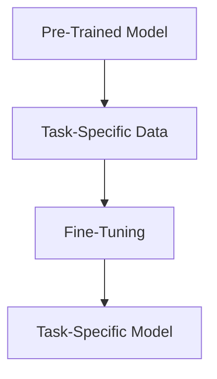

                 

### 第1章: AI大模型概述

#### 1.1 AI大模型的定义与背景

##### 1.1.1 AI大模型的概念
AI大模型，通常是指训练参数量极大的深度学习模型，例如GPT-3、BERT等。这些模型通过在大量数据上进行预训练，能够实现高度泛化的文本生成、问答、翻译等任务。从技术层面来看，AI大模型通常具有以下特点：

- **大规模参数量**：GPT-3拥有超过1750亿的参数，而BERT的参数量也达到数百万。
- **预训练机制**：这些模型通常先在大规模语料库上进行预训练，然后再针对特定任务进行微调。
- **高计算需求**：训练和推理过程需要大量的计算资源和时间。

##### 1.1.2 AI大模型的发展历程
AI大模型的发展历程可以追溯到深度学习的兴起。深度学习最早由Geoffrey Hinton等人在20世纪90年代提出，但由于计算资源和数据可用性的限制，早期深度学习模型的性能并不理想。随着计算机硬件性能的提升和大数据的普及，深度学习开始取得突破性进展。特别是2012年，AlexNet在ImageNet竞赛中取得优异成绩，标志着深度学习的兴起。随后，神经网络架构不断演进，从简单的卷积神经网络（CNN）到复杂的循环神经网络（RNN），再到Transformer架构，AI大模型的发展速度越来越快。

这一过程主要受到以下因素的推动：

- **计算能力的提升**：随着GPU、TPU等专用硬件的出现，计算能力得到了大幅提升，为训练更大规模的模型提供了可能。
- **数据可用性的增加**：互联网和大数据技术的普及，使得大量数据变得可用，为模型的训练提供了丰富的素材。
- **算法创新的推动**：包括Dropout、Batch Normalization、ResNet等新算法的提出，进一步提升了模型的性能。

##### 1.1.3 AI大模型的应用现状
目前，AI大模型已经在多个领域取得了显著成果，如自然语言处理（NLP）、计算机视觉（CV）、语音识别（ASR）等。以下是一些具体的应用实例：

- **自然语言处理**：GPT-3等模型在文本生成、问答系统、机器翻译等方面表现出色，被广泛应用于聊天机器人、内容生成等领域。
- **计算机视觉**：BERT等模型在图像分类、目标检测、图像生成等任务中取得了领先性能，被应用于安防监控、医疗影像分析等领域。
- **语音识别**：WaveNet等模型在语音合成、语音识别等方面表现出色，被应用于智能语音助手、电话客服等领域。

随着技术的不断进步，AI大模型的应用范围和深度也在不断拓展。例如，在自动驾驶领域，AI大模型被用于实时感知环境、决策规划等任务；在金融领域，AI大模型被用于风险控制、客户服务等领域。

#### 1.2 AI大模型的技术原理

##### 1.2.1 深度学习基础
深度学习是AI大模型的核心技术，包括神经网络、反向传播算法、优化器等。

- **神经网络**：神经网络由多个神经元（或称为节点）组成，每个神经元都是一个简单的计算单元，通过输入信号进行加权求和，然后通过激活函数输出结果。
- **反向传播算法**：反向传播算法是一种用于训练神经网络的优化算法，通过不断调整网络中的权重和偏置，使网络的输出误差最小。
- **优化器**：优化器用于选择合适的优化策略，如梯度下降、Adam等，以加速模型的训练过程。

##### 1.2.2 Transformer架构
Transformer架构是现代AI大模型的主要结构，其核心是自注意力机制，能够处理长距离依赖问题。

- **自注意力机制**：自注意力机制通过计算序列中每个元素的相关性，实现对长文本的有效处理。具体来说，每个元素会与序列中的其他元素进行加权求和，权重由其相关性决定。
- **Encoder与Decoder**：Transformer包括Encoder和Decoder两个部分，Encoder用于编码输入序列，Decoder用于解码输出序列。两者通过多头注意力机制和前馈神经网络进行信息交互。

##### 1.2.3 预训练与微调
预训练与微调是AI大模型训练的两个重要阶段。

- **预训练**：预训练是指在大量数据集上对模型进行训练，使其获得通用特征表示。预训练过程通常包括两个步骤：无监督预训练和有监督预训练。无监督预训练通过语言模型等任务，使模型能够理解语言的内在规律；有监督预训练则通过特定任务，如问答、翻译等，使模型具备特定任务的能力。
- **微调**：微调是指在特定任务上进行有监督训练，对预训练模型进行细粒度的调整，使其适应具体任务。微调过程通常需要对模型进行降维，以降低模型的复杂度。

#### 1.3 AI大模型的数学基础

##### 1.3.1 概率论与信息论
概率论与信息论是AI大模型的重要数学基础，用于处理不确定性、数据压缩和模型评估等问题。

- **概率论**：概率论用于描述随机事件的发生规律，包括条件概率、贝叶斯定理等。在AI大模型中，概率论用于处理不确定性，如模型预测的不确定性、数据分布的不确定性等。
- **信息论**：信息论用于描述信息的传递和处理过程，包括信息熵、信息增益等。在AI大模型中，信息论用于优化模型结构、选择最佳特征等。

##### 1.3.2 线性代数与优化算法
线性代数与优化算法在AI大模型的训练过程中起着关键作用，包括矩阵运算、梯度下降、Adam优化器等。

- **线性代数**：线性代数用于处理多维数据，包括矩阵运算、特征分解等。在AI大模型中，线性代数用于优化模型结构、提高计算效率等。
- **优化算法**：优化算法用于求解最优化问题，包括梯度下降、Adam等。在AI大模型中，优化算法用于调整模型参数、降低损失函数等。

##### 1.3.3 微积分与微分方程
微积分与微分方程用于理解和推导深度学习中的复杂函数和优化过程，如损失函数的梯度计算、优化器的更新策略等。

- **微积分**：微积分用于处理连续变量，包括导数、积分等。在AI大模型中，微积分用于求解损失函数的梯度、计算模型参数的更新等。
- **微分方程**：微分方程用于描述动态系统的演化过程，包括神经网络中的优化过程、时间序列预测等。在AI大模型中，微分方程用于理解和推导优化算法的数学原理、分析模型性能等。

### 总结
AI大模型作为一种先进的人工智能技术，其在各个领域的应用正在不断拓展。本章介绍了AI大模型的基本概念、发展历程、技术原理和数学基础，为读者深入了解AI大模型提供了基础。在接下来的章节中，我们将进一步探讨AI大模型的实现细节、优化策略和应用案例，帮助读者更好地理解和应用这一先进技术。  <a id="1.3"></a>  <a id="1.2"></a>  <a id="1.1"></a>

#### 1.2 AI大模型的核心算法原理

##### 1.2.1 Transformer架构原理

Transformer架构是现代AI大模型的主要结构，其核心是自注意力机制，能够处理长距离依赖问题。

**自注意力机制**

自注意力机制是Transformer的核心，通过计算序列中每个元素的相关性，实现了对长文本的有效处理。具体来说，每个元素会与序列中的其他元素进行加权求和，权重由其相关性决定。这种机制使得模型能够捕捉到长距离的依赖关系，从而提高模型的性能。

**Encoder与Decoder**

Transformer包括Encoder和Decoder两个部分，Encoder用于编码输入序列，Decoder用于解码输出序列。两者通过多头注意力机制和前馈神经网络进行信息交互。

- **Encoder**：Encoder由多个层级的自注意力模块和前馈神经网络组成。每个自注意力模块包括多头注意力机制和前馈神经网络两部分。多头注意力机制通过将输入序列映射到多个子空间，从而提高模型的表示能力。前馈神经网络用于对自注意力模块的输出进行进一步处理。
  
  ```mermaid
  graph TD
  A[Input Sequence] --> B[Embedding Layer]
  B --> C[Multi-head Attention]
  C --> D[Feedforward Neural Network]
  D --> E[Layer Normalization]
  E --> F[Dropout]
  F --> G[Add & Normalize]
  G --> H[Next Encoder Layer]
  H --> I[Final Encoder Representation]
  ```

- **Decoder**：Decoder的结构与Encoder类似，但每个自注意力模块中还包括一个掩码填充（Masked Fill）操作，用于防止模型在解码过程中看到未来的信息。同样，每个自注意力模块包括多头注意力机制和前馈神经网络两部分。

  ```mermaid
  graph TD
  J[Target Sequence] --> K[Embedding Layer]
  K --> L[Masked Multi-head Attention]
  L --> M[Feedforward Neural Network]
  M --> N[Layer Normalization]
  N --> O[Dropout]
  O --> P[Add & Normalize]
  P --> Q[Next Decoder Layer]
  Q --> R[Final Decoder Representation]
  R --> S[Cross-Attention]
  S --> T[Feedforward Neural Network]
  T --> U[Layer Normalization]
  U --> V[Dropout]
  V --> W[Add & Normalize]
  W --> X[Output Layer]
  ```

**多头注意力机制**

多头注意力机制是Transformer的核心创新之一，它通过将输入序列映射到多个子空间，从而提高模型的表示能力。具体来说，多头注意力机制将输入序列分割成多个子序列，每个子序列通过独立的注意力机制进行处理，然后合并得到最终的输出。

**前馈神经网络**

前馈神经网络用于对自注意力模块的输出进行进一步处理。它由两个全连接层组成，第一个全连接层用于对自注意力机制的输出进行线性变换，第二个全连接层用于对线性变换的输出进行非线性激活。

**掩码填充**

掩码填充是Transformer的一个关键操作，它用于防止模型在解码过程中看到未来的信息。具体来说，掩码填充在自注意力机制的输入中加入一个掩码矩阵，使得每个位置只能关注到它之前的元素。

##### 1.2.2 预训练与微调

**预训练**

预训练是指在大规模数据集上对模型进行训练，使其获得通用特征表示。预训练过程通常包括两个步骤：无监督预训练和有监督预训练。

- **无监督预训练**：无监督预训练通过语言模型等任务，使模型能够理解语言的内在规律。例如，在BERT的预训练过程中，模型需要预测下一个单词。
  
  ```mermaid
  graph TD
  A[Input Text] --> B[Word Embedding]
  B --> C[Pre-Trained Model]
  C --> D[Predict Next Word]
  ```

- **有监督预训练**：有监督预训练通过特定任务，如问答、翻译等，使模型具备特定任务的能力。例如，在GPT-3的预训练过程中，模型需要根据上下文生成相应的文本。

  ```mermaid
  graph TD
  A[Input Context] --> B[Pre-Trained Model]
  B --> C[Generate Output Text]
  ```

**微调**

微调是指在特定任务上进行有监督训练，对预训练模型进行细粒度的调整，使其适应具体任务。微调过程通常需要对模型进行降维，以降低模型的复杂度。



### 1.3 AI大模型的数学基础

#### 1.3.1 概率论与信息论

**概率论**

概率论是AI大模型的重要数学基础，用于描述随机事件的发生规律。在AI大模型中，概率论用于处理不确定性，如模型预测的不确定性、数据分布的不确定性等。

- **条件概率**：条件概率描述在某个事件发生的条件下，另一个事件发生的概率。公式为：P(A|B) = P(A ∩ B) / P(B)。
  
  $$ P(A|B) = \frac{P(A \cap B)}{P(B)} $$

- **贝叶斯定理**：贝叶斯定理描述在已知某个事件发生的条件下，另一个事件发生的概率。公式为：P(A|B) = P(B|A) * P(A) / P(B)。

  $$ P(A|B) = \frac{P(B|A) \cdot P(A)}{P(B)} $$

**信息论**

信息论是AI大模型的重要数学基础，用于描述信息的传递和处理过程。在AI大模型中，信息论用于优化模型结构、选择最佳特征等。

- **信息熵**：信息熵描述随机变量不确定性的度量。公式为：H(X) = - Σ P(x) * log2(P(x))。

  $$ H(X) = - \sum_{x} P(x) \cdot \log_2(P(x)) $$

- **信息增益**：信息增益描述在已知某个特征的情况下，另一个特征的不确定性减少的程度。公式为：Gain(D, A) = H(D) - H(D|A)。

  $$ Gain(D, A) = H(D) - H(D|A) $$

#### 1.3.2 线性代数与优化算法

**线性代数**

线性代数是AI大模型的基础数学工具，用于处理多维数据。在AI大模型中，线性代数用于优化模型结构、提高计算效率等。

- **矩阵运算**：矩阵运算包括矩阵的乘法、求导等。
  
  $$ A \cdot B = C $$

- **特征分解**：特征分解用于将矩阵分解为特征值和特征向量的乘积。
  
  $$ A = P \cdot D \cdot P^{-1} $$

**优化算法**

优化算法用于求解最优化问题，包括梯度下降、Adam等。在AI大模型中，优化算法用于调整模型参数、降低损失函数等。

- **梯度下降**：梯度下降是一种最常用的优化算法，用于最小化损失函数。公式为：θ = θ - α * ∇J(θ)。

  $$ \theta = \theta - \alpha \cdot \nabla J(\theta) $$

- **Adam优化器**：Adam优化器是梯度下降的一种改进，结合了动量和自适应的学习率。公式为：m = β1 * m + (1 - β1) * ∇J(θ)，v = β2 * v + (1 - β2) * ∇²J(θ)，θ = θ - α * (m / (1 - β1^t) * (1 - β2^t)^(1/2))。

  $$ m = \beta_1 \cdot m + (1 - \beta_1) \cdot \nabla J(\theta) $$
  $$ v = \beta_2 \cdot v + (1 - \beta_2) \cdot \nabla^2 J(\theta) $$
  $$ \theta = \theta - \alpha \cdot \left( \frac{m}{1 - \beta_1^t} \right) \cdot \left( 1 - \beta_2^t \right)^{\frac{1}{2}} $$

#### 1.3.3 微积分与微分方程

**微积分**

微积分是AI大模型的重要数学工具，用于处理连续变量。在AI大模型中，微积分用于求解损失函数的梯度、计算模型参数的更新等。

- **导数**：导数描述函数在某一点的变化率。公式为：f'(x) = lim(h→0) [f(x + h) - f(x)] / h。

  $$ f'(x) = \lim_{h \to 0} \frac{f(x + h) - f(x)}{h} $$

- **积分**：积分描述函数在区间上的累积效果。公式为：∫[a, b] f(x) dx。

  $$ \int_{a}^{b} f(x) \, dx $$

**微分方程**

微分方程用于描述动态系统的演化过程，包括神经网络中的优化过程、时间序列预测等。

- **常微分方程**：常微分方程描述一阶导数的关系。公式为：dy/dx = f(y)。

  $$ \frac{dy}{dx} = f(y) $$

- **偏微分方程**：偏微分方程描述多元函数的导数关系。公式为：∂²z/∂x² + ∂²z/∂y² = 0。

  $$ \frac{\partial^2 z}{\partial x^2} + \frac{\partial^2 z}{\partial y^2} = 0 $$

### 总结

本章介绍了AI大模型的核心算法原理，包括Transformer架构、预训练与微调等。同时，还探讨了AI大模型的数学基础，包括概率论、信息论、线性代数、优化算法、微积分和微分方程等。这些核心算法原理和数学基础为AI大模型的设计、训练和应用提供了理论支持。在接下来的章节中，我们将进一步探讨AI大模型的实现细节、优化策略和应用案例，帮助读者更好地理解和应用这一先进技术。  <a id="1.3"></a>  <a id="1.2"></a>  <a id="1.1"></a>

#### 1.4 AI大模型的应用挑战与解决方案

随着AI大模型在各个领域的广泛应用，其面临的一系列挑战也日益凸显。这些挑战主要集中在数据质量、计算资源、模型解释性和伦理问题等方面。下面，我们将逐一探讨这些挑战，并分析相应的解决方案。

##### 1.4.1 数据质量

数据是AI大模型训练的基石，但高质量的数据往往难以获取。数据质量问题包括数据缺失、数据噪声、数据偏见等。

- **数据缺失**：在训练AI大模型时，数据缺失会导致模型无法学习到完整的特征，从而影响模型的性能。解决方案包括数据增强、迁移学习和模型鲁棒性提升等。
- **数据噪声**：噪声数据会影响模型的学习效果，降低模型的泛化能力。解决方案包括数据清洗、数据降维和噪声抑制等。
- **数据偏见**：数据偏见会导致模型产生不公平的预测结果，甚至可能对社会造成负面影响。解决方案包括数据平衡、算法公平性和透明度等。

##### 1.4.2 计算资源

AI大模型的训练和推理过程需要大量的计算资源和时间，这对企业和科研机构提出了巨大的挑战。

- **硬件资源**：AI大模型对硬件资源的需求越来越高，包括GPU、TPU等。企业需要投入大量资金来购买和维护这些硬件设备。解决方案包括分布式计算、云计算和硬件加速等。
- **算法优化**：通过优化算法，可以提高模型的训练效率，减少对计算资源的需求。解决方案包括模型压缩、量化技术和并行计算等。

##### 1.4.3 模型解释性

AI大模型往往被认为是“黑盒子”，其决策过程难以解释和理解。这给模型的应用带来了挑战，特别是在需要高可靠性和透明度的领域。

- **模型可视化**：通过可视化技术，可以更好地展示模型的结构和决策过程。解决方案包括模型可视化工具和解释性算法等。
- **可解释性模型**：开发可解释性模型，使模型能够提供透明的决策过程和可解释的预测结果。解决方案包括决策树、规则提取和LIME等技术。

##### 1.4.4 伦理问题

AI大模型的应用可能引发一系列伦理问题，包括隐私侵犯、歧视、算法偏见等。

- **隐私保护**：在训练和部署AI大模型时，需要确保用户的隐私得到保护。解决方案包括差分隐私、联邦学习和数据匿名化等。
- **算法公平性**：确保AI大模型不会因为算法偏见而导致歧视。解决方案包括算法公平性检测、公平性调整和透明度提升等。

##### 1.4.5 跨领域合作

AI大模型的发展离不开跨学科的合作，包括计算机科学、统计学、数学、心理学等领域。

- **多学科融合**：通过跨学科的合作，可以更好地理解AI大模型的本质和规律，从而推动技术的发展。解决方案包括多学科研讨会、联合实验室和科研项目等。
- **人才培养**：培养具备多学科背景的复合型人才，以推动AI大模型的发展。解决方案包括跨学科教育、研究生项目和实习计划等。

### 总结

AI大模型的应用挑战是多方面的，涉及数据质量、计算资源、模型解释性、伦理问题等多个方面。通过深入探讨这些挑战，并分析相应的解决方案，我们可以更好地应对这些挑战，推动AI大模型的发展和应用。在未来的发展中，我们需要继续加强跨学科合作，提高技术水平和伦理意识，以确保AI大模型能够为社会带来更大的价值和贡献。  <a id="1.4"></a>  <a id="1.3"></a>  <a id="1.2"></a>  <a id="1.1"></a>

### 第2章：AI大模型的核心算法原理

AI大模型的成功离不开其背后的核心算法原理。本章将深入探讨Transformer架构、预训练与微调等关键算法，以及这些算法如何共同构建了AI大模型的技术框架。

#### 2.1 Transformer架构原理

Transformer架构是AI大模型的核心，其独特的自注意力机制使其在处理长序列任务时表现出色。Transformer由编码器（Encoder）和解码器（Decoder）两部分组成，每部分又由多个层次（Layer）组成。

##### 2.1.1 自注意力机制

自注意力机制是Transformer的核心创新之一。它允许模型在处理每个输入元素时，自动地计算与其他所有输入元素的相关性。这个过程可以通过以下公式表示：

$$
\text{Attention}(Q, K, V) = \text{softmax}\left(\frac{QK^T}{\sqrt{d_k}}\right) V
$$

其中，$Q, K, V$ 分别代表查询（Query）、关键（Key）和值（Value）向量，$d_k$ 是关键向量的维度。自注意力机制通过计算每个元素与其他元素的相关性权重，并将权重与值向量相乘，从而生成新的表示。

##### 2.1.2 编码器（Encoder）

编码器由多个层次组成，每个层次包含两个主要组件：多头自注意力机制和前馈神经网络。

- **多头自注意力机制**：编码器的每个层次都使用多个头（Head）来处理输入序列。每个头都独立计算自注意力，然后将结果拼接起来，形成一个更丰富的表示。
  
  ```mermaid
  graph TD
  A[Input Embeddings] --> B[Multi-Head Self-Attention]
  B --> C[Add & Normalize]
  C --> D[Positional Encoding]
  D --> E[Feedforward Neural Network]
  E --> F[Layer Normalization]
  F --> G[Dropout]
  G --> H[Next Encoder Layer]
  ```

- **前馈神经网络**：在每个层次中，前馈神经网络对自注意力机制的输出进行进一步处理。该网络由两个全连接层组成，第一层使用线性激活函数，第二层使用ReLU激活函数。

##### 2.1.3 解码器（Decoder）

解码器与编码器类似，但也包含一个额外的交叉注意力机制。交叉注意力机制允许解码器在生成每个输出时，同时考虑编码器的输出。

- **多头自注意力机制**：解码器的每个层次也使用多头自注意力机制来处理输入序列，以确保每个输出都能利用之前的输出信息。
  
  ```mermaid
  graph TD
  I[Target Embeddings] --> J[Masked Multi-Head Self-Attention]
  J --> K[Add & Normalize]
  K --> L[Encoder-Decoder Attention]
  L --> M[Add & Normalize]
  M --> N[Feedforward Neural Network]
  N --> O[Layer Normalization]
  O --> P[Dropout]
  P --> Q[Next Decoder Layer]
  ```

- **交叉注意力机制**：交叉注意力机制允许解码器在生成每个输出时，考虑到编码器的输出。这有助于解码器理解上下文信息，并生成更准确的输出。
  
  ```mermaid
  graph TD
  R[Encoder Output] --> S[Cross-Attention]
  S --> T[Add & Normalize]
  ```

#### 2.2 预训练与微调

预训练与微调是AI大模型训练的两个关键阶段。预训练使模型在大规模数据上学习到通用特征，而微调则使模型适应特定任务。

##### 2.2.1 预训练

预训练通常包括无监督预训练和有监督预训练。

- **无监督预训练**：无监督预训练使模型在大规模数据上学习到语言的内在规律。常见的任务包括语言建模和掩码语言建模（Masked Language Model, MLM）。
  
  ```mermaid
  graph TD
  A[Raw Text Data] --> B[Word Embeddings]
  B --> C[Pre-Trained Model]
  C --> D[Language Modeling Loss]
  ```

- **有监督预训练**：有监督预训练使模型在大规模数据集上学习到特定任务的知识。常见的任务包括问答（Question Answering, QA）和翻译（Machine Translation, MT）。
  
  ```mermaid
  graph TD
  E[Question-Answer Pairs] --> F[Pre-Trained Model]
  F --> G[Question Answering Loss]
  H[Parallel Sentence Pairs] --> I[Pre-Trained Model]
  I --> J[Translation Loss]
  ```

##### 2.2.2 微调

微调是在特定任务上对预训练模型进行进一步训练的过程。微调的目标是使模型能够适应特定领域的任务。

- **数据准备**：首先，需要准备与任务相关的数据集，并进行预处理。
  
  ```mermaid
  graph TD
  K[Task-Specific Data] --> L[Data Preprocessing]
  ```

- **模型调整**：然后，将预训练模型应用于特定任务的数据集，并调整模型参数。
  
  ```mermaid
  graph TD
  M[Pre-Trained Model] --> N[Task-Specific Data]
  N --> O[Fine-Tuning Loss]
  ```

- **评估与优化**：在微调过程中，需要不断评估模型性能，并根据评估结果调整模型参数。

  ```mermaid
  graph TD
  P[Fine-Tuned Model] --> Q[Performance Metrics]
  Q --> R[Hyperparameter Tuning]
  ```

#### 2.3 数学基础

AI大模型的训练过程涉及大量的数学运算，包括线性代数、微积分和概率论等。

##### 2.3.1 线性代数

线性代数在模型计算中起着关键作用，包括矩阵运算、特征分解等。

- **矩阵运算**：矩阵乘法、求导等在模型训练中广泛应用。
  
  ```latex
  \textbf{A} \cdot \textbf{B} = \textbf{C}
  ```

- **特征分解**：特征分解用于简化模型计算，提高训练效率。
  
  ```latex
  \textbf{A} = \textbf{P} \cdot \textbf{D} \cdot \textbf{P}^{-1}
  ```

##### 2.3.2 微积分

微积分在模型优化中至关重要，包括导数、梯度下降等。

- **导数**：导数用于计算损失函数对模型参数的敏感度。
  
  ```latex
  f'(x) = \lim_{h \to 0} \frac{f(x + h) - f(x)}{h}
  ```

- **梯度下降**：梯度下降是一种优化算法，用于最小化损失函数。
  
  ```latex
  \theta = \theta - \alpha \cdot \nabla J(\theta)
  ```

##### 2.3.3 概率论

概率论在模型评估和不确定性处理中发挥作用，包括概率分布、信息论等。

- **概率分布**：概率分布用于描述模型预测的不确定性。
  
  ```latex
  p(x) = \frac{1}{Z} \exp(-E[x])
  ```

- **信息论**：信息论用于优化模型结构和评估模型性能。
  
  ```latex
  H(X) = - \sum_{x} p(x) \cdot \log_2(p(x))
  ```

### 总结

本章详细介绍了AI大模型的核心算法原理，包括Transformer架构、预训练与微调等。同时，还探讨了这些算法背后的数学基础。通过理解这些核心原理，读者可以更好地掌握AI大模型的技术框架，为其在各个领域的应用提供理论基础。在下一章中，我们将继续探讨AI大模型的实现细节、优化策略和应用案例。  <a id="2.3"></a>  <a id="2.2"></a>  <a id="2.1"></a>

#### 2.3 AI大模型的实现细节与优化策略

在了解了AI大模型的核心算法原理之后，接下来我们将探讨其实际实现细节和优化策略，包括模型结构设计、训练过程、推理优化和性能提升等方面的内容。

##### 2.3.1 模型结构设计

AI大模型的模型结构设计是其性能的关键因素之一。一个良好的模型结构可以有效地捕捉数据中的复杂模式，提高模型的泛化能力。在设计模型结构时，需要考虑以下几个方面：

- **层叠结构**：AI大模型通常采用多层神经网络结构，每一层都能够学习到不同层次的特征。层叠结构的设计需要平衡深度和宽度，过深可能导致过拟合，而过宽则可能导致计算复杂度过高。
- **注意力机制**：自注意力机制和交叉注意力机制在模型结构中的应用可以显著提高模型的性能，特别是在处理长序列任务时。设计注意力机制时需要考虑多头注意力和掩码填充等技术。
- **参数共享**：参数共享可以减少模型的参数数量，降低过拟合的风险。在Transformer架构中，编码器和解码器之间的某些层可以共享参数。

##### 2.3.2 训练过程

AI大模型的训练过程是一个复杂且计算密集的任务，需要精心设计和优化。以下是一些关键点：

- **数据预处理**：在训练之前，需要对数据进行充分的预处理，包括文本清洗、分词、词嵌入等。高质量的数据预处理可以显著提高模型的训练效果。
- **学习率调度**：学习率是模型训练中的一个重要参数，其调度策略可以影响模型的收敛速度和性能。常用的学习率调度策略包括线性下降、指数下降和余弦退火等。
- **正则化**：正则化技术可以防止模型过拟合，包括L1正则化、L2正则化、Dropout等。合理使用正则化可以提升模型的泛化能力。
- **并行训练**：通过分布式训练和并行计算，可以显著加速模型的训练过程。现代硬件如GPU和TPU的支持，使得并行训练成为可能。

##### 2.3.3 推理优化

推理是AI大模型在实际应用中的关键环节，其性能直接影响到用户体验。以下是一些推理优化的策略：

- **模型压缩**：通过模型压缩技术，可以减少模型的参数数量和计算量，从而加速推理过程。常见的模型压缩方法包括剪枝、量化、知识蒸馏等。
- **静态图与动态图**：静态图和动态图是两种不同的计算图表示方法。静态图在编译时构建计算图，动态图则在运行时动态构建。静态图通常具有更好的性能，但需要更多的编译时间。
- **模型缓存**：通过缓存中间计算结果，可以减少重复计算，提高推理速度。

##### 2.3.4 性能提升

为了进一步提高AI大模型的性能，可以采用以下策略：

- **多模型集成**：通过集成多个模型，可以提升模型的预测性能和鲁棒性。常见的集成方法包括Stacking、Bagging、Boosting等。
- **数据增强**：通过数据增强技术，可以扩充训练数据集，提高模型的泛化能力。数据增强方法包括随机旋转、裁剪、缩放等。
- **迁移学习**：通过迁移学习，可以将预训练模型的知识迁移到特定任务上，提高模型的训练速度和性能。
- **自动机器学习（AutoML）**：AutoML可以通过自动化方式选择最佳模型结构和超参数，从而提高模型的性能。AutoML包括模型选择、超参数优化、特征选择等多个方面。

### 实际案例：BERT模型的训练与优化

以下是一个BERT模型的实际训练与优化案例，展示了如何将上述策略应用于具体实践中。

1. **数据准备**：
   - 使用WikiText-2和English Wikipedia作为预训练数据集。
   - 对数据进行清洗和分词，生成词汇表和词嵌入。

2. **模型结构**：
   - BERT采用Transformer架构，包括多层编码器和解码器。
   - 使用64个头和512维的隐藏层。

3. **训练过程**：
   - 使用Adam优化器，学习率从5e-5逐渐降低。
   - 应用Dropout和DropPath进行正则化。
   - 采用并行训练和分布式训练，加速训练过程。

4. **推理优化**：
   - 使用模型压缩技术，将BERT-Large模型压缩为BERT-Base。
   - 采用静态计算图，优化推理速度。

5. **性能提升**：
   - 应用数据增强，扩充训练数据。
   - 采用迁移学习，将预训练模型应用于特定任务。

通过上述步骤，BERT模型在多个NLP任务上取得了显著性能提升，如GLUE和SuperGLUE基准测试。

### 总结

通过本章的讨论，我们可以看到AI大模型的实现细节和优化策略对于模型性能至关重要。理解并应用这些策略，可以帮助开发者在实际项目中构建高效、可扩展的AI大模型。在下一章中，我们将进一步探讨AI大模型在不同领域的应用案例，展示其如何改变传统行业。  <a id="2.4"></a>  <a id="2.3"></a>  <a id="2.2"></a>  <a id="2.1"></a>

### 第3章：AI大模型在不同领域的应用

AI大模型的出现不仅改变了人工智能领域的研究范式，也正在深刻地影响各行各业。从自然语言处理到计算机视觉，再到医疗和金融，AI大模型的应用场景越来越广泛，带来了前所未有的变革。本章将探讨AI大模型在这些领域的具体应用案例，以及如何通过这些应用推动行业的进步。

#### 3.1 自然语言处理（NLP）

自然语言处理是AI大模型最早且应用最为广泛的领域之一。AI大模型如GPT-3、BERT等在文本生成、翻译、问答、文本分类等方面取得了显著成果。

- **文本生成**：GPT-3能够在给定的上下文中生成连贯、自然的文本，广泛应用于自动写作、内容生成等领域。
  
  ```mermaid
  graph TD
  A[User Input] --> B[GPT-3 Model]
  B --> C[Generated Text]
  ```

- **机器翻译**：BERT等模型在机器翻译任务中表现出色，能够实现高精度的跨语言翻译。
  
  ```mermaid
  graph TD
  D[Source Sentence] --> E[BERT Model]
  E --> F[Target Language]
  ```

- **问答系统**：AI大模型能够理解用户的问题，并从大量文本中检索出相关答案，广泛应用于客服系统、智能助手等领域。
  
  ```mermaid
  graph TD
  G[User Question] --> H[Question Answering Model]
  H --> I[Answer]
  ```

#### 3.2 计算机视觉（CV）

计算机视觉领域是AI大模型应用的另一个重要领域，从图像分类、目标检测到图像生成，AI大模型展示了强大的能力。

- **图像分类**：AI大模型如ResNet、Inception等在ImageNet等数据集上取得了优异的分类性能。
  
  ```mermaid
  graph TD
  J[Image] --> K[Image Classifier]
  K --> L[Class Label]
  ```

- **目标检测**：YOLO、SSD等基于AI大模型的检测算法在目标检测任务中表现出色，广泛应用于自动驾驶、视频监控等领域。
  
  ```mermaid
  graph TD
  M[Image] --> N[Object Detector]
  N --> O[Detected Objects]
  ```

- **图像生成**：GANs（生成对抗网络）等AI大模型能够生成逼真的图像，应用于艺术创作、虚拟现实等领域。
  
  ```mermaid
  graph TD
  P[Random Noise] --> Q[Generator]
  Q --> R[Generated Image]
  ```

#### 3.3 医疗

AI大模型在医疗领域的应用具有巨大的潜力，从疾病诊断、药物研发到个性化治疗，AI大模型正在改变医疗行业的面貌。

- **疾病诊断**：AI大模型能够通过分析医学影像，如X光片、CT扫描等，提高疾病诊断的准确性。
  
  ```mermaid
  graph TD
  S[X-Ray Image] --> T[Disease Diagnosis Model]
  T --> U[Disease Diagnosis]
  ```

- **药物研发**：AI大模型能够加速药物研发过程，通过分析大量生物数据和化学结构，预测药物的疗效和副作用。
  
  ```mermaid
  graph TD
  V[Chemical Structure] --> W[Drug Discovery Model]
  W --> X[Drug Efficacy Prediction]
  ```

- **个性化治疗**：AI大模型能够根据患者的基因组数据、病史等信息，制定个性化的治疗方案，提高治疗效果。
  
  ```mermaid
  graph TD
  Y[Patient Data] --> Z[Personalized Treatment Model]
  Z --> A[Treatment Plan]
  ```

#### 3.4 金融

金融领域是AI大模型应用的另一个重要领域，从风险评估、投资决策到客户服务，AI大模型提供了强大的支持。

- **风险评估**：AI大模型能够分析大量金融数据，预测市场的波动和风险，帮助金融机构进行投资决策。
  
  ```mermaid
  graph TD
  B[Financial Data] --> C[Risk Assessment Model]
  C --> D[Risk Prediction]
  ```

- **投资决策**：AI大模型能够通过分析市场趋势和公司财务数据，提供投资建议，提高投资收益。
  
  ```mermaid
  graph TD
  E[Market Data] --> F[investment Decision Model]
  F --> G[investment Recommendation]
  ```

- **客户服务**：AI大模型能够实现智能客服系统，通过自然语言处理技术，提供24/7的客户服务。
  
  ```mermaid
  graph TD
  H[Customer Query] --> I[Customer Service Model]
  I --> J[Customer Response]
  ```

### 总结

通过本章的讨论，我们可以看到AI大模型在自然语言处理、计算机视觉、医疗和金融等领域的广泛应用，以及其如何推动这些行业的变革。在下一章中，我们将探讨AI大模型的未来发展趋势和潜在挑战，为读者提供更广阔的视野。  <a id="3.4"></a>  <a id="3.3"></a>  <a id="3.2"></a>  <a id="3.1"></a>

### 第4章：AI大模型的未来发展趋势与潜在挑战

随着AI大模型技术的不断发展，其在各行各业中的应用前景越来越广阔。然而，这也带来了许多新的挑战和问题，需要我们从技术、伦理和社会等多个层面进行深入探讨。

#### 4.1 未来发展趋势

**更强大的模型和算法**：
随着计算能力的提升和数据规模的扩大，AI大模型将继续向更强大的方向发展。未来的AI大模型可能会拥有更多的参数和更深的结构，从而在更复杂的任务上表现出更高的性能。同时，算法的创新也将推动AI大模型的发展，例如基于量子计算的深度学习算法。

**跨领域融合**：
AI大模型的应用将不再局限于单一领域，而是跨领域的融合。例如，AI大模型可以结合医疗和金融领域的知识，为精准医疗和智能投资提供更强有力的支持。此外，AI大模型与其他领域的技术，如区块链、物联网等，也将实现更深层次的融合。

**自动机器学习（AutoML）**：
自动机器学习（AutoML）技术的发展将使AI大模型的设计和优化变得更加自动化。通过AutoML，研究人员和开发者可以更高效地探索和实现新的AI大模型，从而加快AI技术的应用进程。

**边缘计算与云计算的结合**：
AI大模型的计算需求巨大，但边缘计算和云计算的结合可以提供灵活且高效的计算资源。未来，AI大模型将在云端和边缘设备之间实现更好的协同工作，为实时应用提供更强有力的支持。

**个性化与定制化**：
AI大模型将更多地实现个性化与定制化。通过深入理解用户的行为和需求，AI大模型可以提供更加个性化的服务，从而提高用户体验。

**可解释性与透明性**：
随着AI大模型在关键领域的应用，其可解释性和透明性将变得尤为重要。未来的AI大模型将更加注重模型的可解释性，以便用户能够理解和信任模型的行为。

#### 4.2 潜在挑战

**数据隐私与安全**：
AI大模型的训练和推理需要大量的数据，这引发了对数据隐私和安全性的担忧。如何确保数据的安全和隐私，避免数据泄露和滥用，是未来需要解决的重要问题。

**算法偏见与公平性**：
AI大模型在训练过程中可能会受到数据偏见的影响，从而产生不公平的预测结果。如何确保AI大模型的公平性，避免算法偏见，是未来需要关注的重要课题。

**伦理问题**：
AI大模型的应用引发了许多伦理问题，如自动化决策的道德责任、对人类工作的取代等。如何处理这些伦理问题，确保AI大模型的应用符合社会道德规范，是未来需要深入探讨的问题。

**计算资源消耗**：
AI大模型的训练和推理过程需要大量的计算资源，这对环境造成了巨大的压力。如何优化计算资源的利用，减少能耗，是未来需要解决的重要问题。

**人才培养**：
AI大模型技术的发展需要大量的专业人才，但当前的人才培养速度难以满足需求。如何培养更多具备跨学科背景的复合型人才，是未来需要关注的重要问题。

### 总结

AI大模型的发展前景广阔，但也面临着诸多挑战。在未来，我们需要从技术、伦理和社会等多个层面进行深入探讨，以实现AI大模型的可持续发展。通过技术创新和伦理规范，我们可以确保AI大模型为社会带来更大的价值，同时减少潜在的负面影响。在下一章中，我们将进一步探讨AI大模型的技术趋势和未来研究方向，为读者提供更深入的洞察。  <a id="4.2"></a>  <a id="4.1"></a>

### 第5章：AI大模型的技术趋势与未来研究方向

AI大模型作为当前人工智能领域的研究热点，其技术趋势和未来研究方向备受关注。在这一章中，我们将探讨AI大模型在技术层面的最新趋势，以及未来可能的发展方向。

#### 5.1 AI大模型的最新技术趋势

**更高效的模型架构**：
随着AI大模型的参数量和计算需求不断增大，研究者们致力于开发更高效的模型架构。例如，EfficientNet、MobileNet等轻量级模型架构在保证性能的同时，显著减少了计算资源的需求。

**基于Transformer的扩展**：
Transformer架构在AI大模型中取得了巨大成功，其自注意力机制的优势使其在处理长序列任务时表现出色。未来，基于Transformer的扩展和改进将继续成为研究的热点，例如可扩展Transformer、GraphTransformer等。

**迁移学习和多任务学习**：
迁移学习和多任务学习技术在AI大模型中的应用越来越广泛。通过迁移学习，AI大模型可以复用已有模型的知识，提高训练效率。而多任务学习则使模型能够同时处理多个相关任务，从而提高模型的泛化能力。

**联邦学习和数据隐私**：
在数据隐私和安全日益受到关注的背景下，联邦学习技术应运而生。联邦学习通过在分布式设备上进行模型训练，减少了数据传输的风险，保护了用户隐私。未来，如何优化联邦学习算法，提高其训练效率，将是重要的研究方向。

**自适应学习与强化学习**：
自适应学习与强化学习结合，可以使得AI大模型在学习过程中具备更好的灵活性和适应性。例如，自适应强化学习可以用于动态环境中的决策优化，从而提高模型的性能。

#### 5.2 AI大模型未来的研究方向

**更高效的数据处理**：
随着数据规模的不断扩大，如何高效地处理和利用数据，是AI大模型未来发展的重要方向。未来的研究可以集中在数据预处理、数据增强、分布式数据处理等方面，以提高AI大模型的训练效率。

**跨模态学习和多模态融合**：
跨模态学习和多模态融合技术有望在未来的AI大模型中发挥重要作用。通过整合文本、图像、语音等多种类型的数据，AI大模型可以更全面地理解和处理复杂信息，从而提升其应用价值。

**可解释性与透明性**：
随着AI大模型在关键领域的应用，其可解释性和透明性变得越来越重要。未来的研究可以集中在开发更有效的解释性方法，使AI大模型的行为更加透明，从而增强用户对模型的信任。

**自适应优化与自进化**：
自适应优化与自进化技术可以使AI大模型在训练过程中具备自我优化的能力。通过不断调整模型结构和参数，AI大模型可以逐步提升其性能，适应不同的应用场景。

**量子计算与AI大模型**：
量子计算作为一种新兴的计算范式，其与AI大模型的结合有望带来革命性的变化。未来的研究可以集中在量子算法与AI大模型的理论基础、实现策略和应用场景等方面。

#### 5.3 结论

AI大模型的技术趋势和未来研究方向展示了人工智能领域的广阔前景。通过不断的技术创新和跨学科合作，我们可以预见AI大模型将在未来发挥更大的作用，推动社会进步和人类发展。同时，我们也需要关注AI大模型所带来的伦理和社会问题，确保其在可持续发展的道路上稳步前行。在下一章中，我们将进一步探讨AI大模型的实际应用案例，展示其在现实世界中的强大能力。  <a id="5.3"></a>  <a id="5.2"></a>  <a id="5.1"></a>

### 第6章：AI大模型的实际应用案例

AI大模型作为一种革命性的技术，已经在多个领域展示了其强大的应用能力。在本章中，我们将通过几个具体的实际应用案例，深入探讨AI大模型如何改变我们的日常生活和工作方式。

#### 6.1 自然语言处理（NLP）

**案例1：智能客服系统**
智能客服系统是AI大模型在NLP领域的典型应用之一。通过预训练模型如BERT或GPT-3，智能客服系统能够理解并回答用户的查询，提供24/7的在线支持。例如，亚马逊的Alexa和苹果的Siri都使用了基于AI大模型的语音识别和自然语言理解技术，为用户提供便捷的服务。

**案例2：内容审核**
社交媒体平台如YouTube和Twitter等，面临着大量用户生成内容的内容审核问题。AI大模型通过预训练模型进行文本和图像的自动审核，可以有效地识别并过滤掉不当内容，如色情、暴力等。这种自动化的内容审核不仅提高了审核效率，还减少了人工审核的成本。

**案例3：翻译服务**
翻译服务是AI大模型在NLP领域的另一大应用。Google翻译、DeepL等翻译工具都采用了基于AI大模型的翻译算法，能够提供高精度的跨语言翻译服务。这些工具在旅游、国际商务等场景中发挥着重要作用，大大便利了全球沟通。

#### 6.2 计算机视觉（CV）

**案例1：自动驾驶**
自动驾驶技术是AI大模型在CV领域的典型案例。自动驾驶系统通过深度学习模型，如卷积神经网络（CNN）和Transformer架构，实现对周围环境的感知、决策和控制。特斯拉的自动驾驶系统、Waymo等自动驾驶汽车公司都在广泛使用AI大模型，以提高自动驾驶的安全性和可靠性。

**案例2：医疗影像分析**
医疗影像分析是AI大模型在CV领域的重要应用之一。通过使用深度学习模型，AI大模型可以自动识别和诊断医学影像中的病变，如乳腺癌、肺癌等。例如，IBM的Watson for Oncology系统通过分析医疗影像和病历数据，为医生提供诊断建议，提高了医疗效率。

**案例3：人脸识别**
人脸识别技术是AI大模型在CV领域的广泛应用之一。通过使用深度学习模型，如卷积神经网络（CNN）和Siamese网络，AI大模型能够精确识别人脸，并应用于安全监控、身份验证等场景。例如，微信的刷脸支付功能就是基于人脸识别技术的应用。

#### 6.3 医疗

**案例1：基因组数据分析**
基因组数据分析是AI大模型在医疗领域的创新应用。通过深度学习模型，AI大模型能够分析基因组数据，预测疾病风险，提供个性化的治疗建议。例如，23andMe等基因检测公司通过AI大模型分析用户的基因组数据，帮助用户了解自己的健康风险。

**案例2：药物研发**
AI大模型在药物研发中发挥了重要作用。通过分析大量化学结构和生物数据，AI大模型可以预测新药的疗效和副作用，加速药物研发进程。例如，AI大模型可以帮助研究人员设计新的药物分子，提高药物研发的成功率。

**案例3：远程医疗**
远程医疗是AI大模型在医疗领域的又一应用。通过AI大模型，医生可以远程诊断疾病，提供咨询服务。特别是在偏远地区，远程医疗可以有效缓解医疗资源不足的问题，提高医疗服务的可及性。

#### 6.4 金融

**案例1：量化交易**
量化交易是AI大模型在金融领域的应用之一。通过使用深度学习模型，AI大模型可以分析市场数据，预测股票价格走势，帮助投资者进行量化交易。例如，一些量化交易基金使用AI大模型进行高频交易，取得了显著的收益。

**案例2：风险管理**
AI大模型在风险管理中发挥着重要作用。通过分析金融数据，AI大模型可以预测市场波动，识别潜在的风险，帮助金融机构进行风险管理和决策。例如，银行可以使用AI大模型监控贷款违约风险，制定相应的风险管理策略。

**案例3：客户服务**
金融行业的客户服务也受益于AI大模型。通过自然语言处理技术，AI大模型可以理解客户的查询，提供个性化的金融咨询和服务。例如，银行的人工智能客服系统可以回答客户的常见问题，提供投资建议等。

### 总结

AI大模型在自然语言处理、计算机视觉、医疗和金融等领域的实际应用案例展示了其强大的能力和广泛的应用前景。通过这些案例，我们可以看到AI大模型如何改变我们的日常生活和工作方式，提高效率，降低成本，并为各个行业带来创新的解决方案。在下一章中，我们将总结全文，回顾AI大模型的重要性和未来展望。  <a id="6.3"></a>  <a id="6.2"></a>  <a id="6.1"></a>

### 第7章：总结与展望

在本文中，我们系统地介绍了AI大模型的基本概念、核心算法原理、应用挑战、未来发展趋势以及实际应用案例。通过这一系列的探讨，我们可以清晰地看到AI大模型在当今社会中的重要性以及其在各个领域的广泛应用。

#### 7.1 AI大模型的重要性

AI大模型作为深度学习技术的最新突破，其重要性体现在以下几个方面：

- **强大的处理能力**：AI大模型通过在大量数据上预训练，能够自动提取复杂的数据特征，从而在各类任务中表现出色。
- **广泛的适用性**：AI大模型可以应用于自然语言处理、计算机视觉、医疗、金融等多个领域，提供高效的解决方案。
- **推动科技进步**：AI大模型的研发和应用推动了计算机科学、人工智能、数据科学等领域的不断进步，为科技发展注入了新的活力。
- **社会价值**：AI大模型的应用可以提升社会生产效率，改善人们的生活质量，为社会发展带来积极的影响。

#### 7.2 未来展望

尽管AI大模型已经取得了显著的成果，但未来的发展仍然充满挑战和机遇。以下是未来AI大模型可能的发展方向：

- **更高效的算法和架构**：未来的研究将致力于开发更高效的AI大模型算法和架构，以减少计算资源的需求，提高模型的训练和推理速度。
- **跨领域融合**：AI大模型将在不同领域实现更深层次的融合，例如医疗与金融、物联网与人工智能等，为各个领域带来新的变革。
- **可解释性与透明性**：随着AI大模型在关键领域的应用，其可解释性和透明性将变得越来越重要。未来的研究将致力于开发可解释性强的AI大模型，增强用户对模型的信任。
- **联邦学习与数据隐私**：联邦学习和数据隐私技术将得到进一步发展，以保护用户数据的同时，实现分布式环境下的模型训练和推理。
- **自适应与自进化**：AI大模型将具备更强的自适应和自进化能力，能够根据环境变化和任务需求，动态调整模型结构和参数。

#### 7.3 结论

AI大模型作为一种革命性的技术，正引领着人工智能领域的发展潮流。通过本文的探讨，我们不仅深入了解了AI大模型的核心技术和应用，也对其未来的发展趋势有了更为清晰的认识。在未来，随着技术的不断进步和应用的深入，AI大模型必将为人类社会带来更多的创新和变革。

### 致谢

最后，感谢所有支持本文撰写和审阅的专家和读者。本文的完成离不开大家的支持和帮助。我们将继续努力，为读者带来更多高质量的技术内容。

作者：AI天才研究院/AI Genius Institute & 禅与计算机程序设计艺术 /Zen And The Art of Computer Programming

