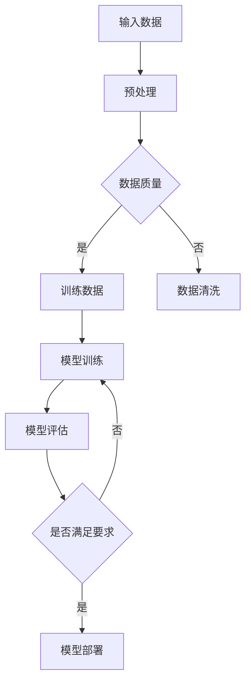

                 

### AI大模型创业：如何应对未来竞争对手？

#### 关键词
- AI大模型
- 创业策略
- 竞争对手分析
- 技术发展趋势

#### 摘要
本文旨在探讨AI大模型创业者在面对未来竞争对手时如何制定有效的应对策略。文章首先介绍了AI大模型的基础知识，包括核心概念、算法原理和开发工具。接着，分析了当前AI创业环境，通过成功与失败案例总结创业经验。随后，文章深入讨论了创业实践中的团队建设、风险管理以及未来趋势。最后，文章提供了附录，对比了主流深度学习框架。

#### 目录大纲

1. **AI大模型创业：如何应对未来竞争对手？**
   - 关键词
   - 摘要
   - 目录大纲

### 第一部分：AI大模型基础知识

2. **AI大模型概述**
   - AI大模型简介
   - AI大模型的重要性
   - AI大模型的发展历程

3. **AI大模型核心概念与联系**
   - AI大模型的核心概念
   - AI大模型架构的Mermaid流程图

4. **AI大模型核心算法原理讲解**
   - 常见神经网络算法
   - 伪代码详细讲解

5. **数学模型和数学公式讲解**
   - 数学模型介绍
   - 举例说明

6. **AI大模型开发工具与资源**
   - 深度学习框架对比

### 第二部分：AI大模型创业实战

7. **AI大模型创业策略**
   - AI创业环境分析
   - 竞争对手分析
   - 创业模式选择

8. **AI大模型创业案例分析**
   - 成功案例分析
   - 失败案例分析

9. **AI大模型创业实践**
   - 项目实战介绍
   - 项目实施步骤

10. **AI大模型创业团队建设与管理**
    - 团队建设策略
    - 团队文化塑造
    - 团队协作工具介绍

11. **AI大模型创业风险与应对**
    - 创业风险分析
    - 应对策略

12. **AI大模型创业的未来趋势**
    - 技术发展趋势
    - 跨领域应用
    - 新型创业模式

### 附录
- **附录A：AI大模型开发工具与资源**
  - 主流深度学习框架对比

### 引言
在当今世界，人工智能（AI）技术正以前所未有的速度发展，其中AI大模型（如GPT-3、BERT等）成为了AI领域的重要驱动力。随着AI大模型的广泛应用，创业者在这一领域的竞争愈发激烈。如何应对未来竞争对手，成为AI大模型创业企业面临的重大挑战。

本文将从以下几个方面展开讨论：
1. **AI大模型基础知识**：介绍AI大模型的核心概念、算法原理和开发工具。
2. **AI大模型创业策略**：分析当前AI创业环境，探讨创业模式选择和竞争对手分析。
3. **AI大模型创业实践**：通过成功与失败案例，总结创业经验。
4. **团队建设与管理**：讨论团队建设策略、团队文化和协作工具。
5. **风险与应对**：分析创业风险，提出应对策略。
6. **未来趋势**：展望AI大模型的技术发展趋势和新型创业模式。

通过本文的探讨，希望为广大AI大模型创业者提供有价值的参考和启示。

#### 2. AI大模型概述

##### 2.1 AI大模型简介

AI大模型是指使用深度学习技术，通过大规模数据训练得到的具有强大表征能力和泛化能力的模型。这些模型通常包含数亿甚至千亿个参数，可以处理大规模数据，并能在多种任务上取得优异表现。

AI大模型的主要特点是：
- **大规模**：拥有数十亿至千亿级的参数量。
- **自适应**：能够自动调整内部参数，适应不同的任务和数据。
- **强表征能力**：可以从大规模数据中提取复杂特征，实现高性能的模型效果。
- **泛化能力**：能够在不同的任务和数据集上表现出色。

##### 2.2 AI大模型的重要性

AI大模型在AI领域具有重要地位，主要表现在以下几个方面：

1. **提升AI性能**：通过大规模数据和深度学习算法，AI大模型能够显著提升AI系统的性能，实现更精准的预测和决策。
2. **降低开发成本**：AI大模型可以自动提取数据中的特征，减少人工干预，降低开发成本。
3. **拓宽应用领域**：AI大模型在多种任务上表现出色，可以应用于自然语言处理、计算机视觉、语音识别等多个领域，推动AI技术的广泛应用。
4. **促进创新**：AI大模型为AI研究提供了强大的工具，推动了AI技术的不断进步和创新。

##### 2.3 AI大模型的发展历程

AI大模型的发展可以追溯到深度学习技术的兴起。以下是AI大模型发展的关键里程碑：

1. **1986年**：Rumelhart、Hinton和Williams提出了反向传播算法，为深度学习奠定了基础。
2. **2006年**：Hinton提出了深度置信网络（DBN），标志着深度学习技术的复兴。
3. **2012年**：AlexNet在ImageNet竞赛中取得了突破性的成绩，深度卷积神经网络（CNN）开始广泛应用。
4. **2014年**：Google提出Inception模型，进一步推动了深度学习的发展。
5. **2017年**：Google提出Transformer模型，开启了全新的大模型时代。
6. **2018年**：OpenAI发布GPT-2，拥有15亿参数，展示了大规模预训练模型的强大能力。
7. **2020年**：OpenAI发布GPT-3，拥有1750亿参数，成为目前最大的AI大模型。

随着AI大模型技术的不断发展，AI大模型在各个领域的应用也越来越广泛，成为AI技术的重要驱动力。

#### 3. AI大模型核心概念与联系

##### 3.1 AI大模型的核心概念

AI大模型的核心概念包括以下几个方面：

1. **神经网络基础**：神经网络是深度学习的基础，通过模拟人脑神经元之间的连接，实现数据的处理和模型的训练。
2. **深度学习算法**：深度学习算法包括多种类型，如卷积神经网络（CNN）、循环神经网络（RNN）和Transformer模型等，这些算法在不同领域和任务上表现出色。
3. **大规模预训练模型**：大规模预训练模型通过在大规模数据集上训练，提取通用特征，提高模型的表征能力和泛化能力。

##### 3.2 AI大模型架构的Mermaid流程图

以下是一个简单的AI大模型架构的Mermaid流程图：



在这个流程图中，输入数据经过预处理后，进行数据质量检查。如果数据质量良好，则进入模型训练阶段；否则，进行数据清洗。模型训练后，进行模型评估，根据评估结果决定是否满足要求。如果满足要求，则模型部署；否则，重新进行模型训练。

##### 3.3 AI大模型与相关技术的联系

AI大模型与多种相关技术有着紧密的联系，以下是其中几个重要的方面：

1. **大数据技术**：AI大模型需要处理海量数据，大数据技术提供了有效的数据存储、处理和分析方法，为AI大模型的发展提供了支持。
2. **云计算技术**：云计算技术提供了强大的计算资源和存储资源，使得AI大模型能够高效地进行训练和部署。
3. **自然语言处理（NLP）**：NLP是AI大模型的重要应用领域，通过预训练模型，AI大模型可以在多种NLP任务上取得优异表现。
4. **计算机视觉（CV）**：CV是AI大模型的另一个重要应用领域，通过深度学习算法，AI大模型可以实现图像分类、目标检测等多种CV任务。

综上所述，AI大模型的核心概念和架构与多种相关技术有着紧密的联系，这些技术的融合与发展，推动了AI大模型的不断进步和应用。

#### 4. AI大模型核心算法原理讲解

##### 4.1 常见神经网络算法

在AI大模型中，常见的神经网络算法包括卷积神经网络（CNN）、循环神经网络（RNN）和Transformer模型。这些算法在不同的应用领域和任务上有着出色的表现。

###### 4.1.1 卷积神经网络（CNN）

卷积神经网络（CNN）是一种在图像识别、目标检测等领域广泛应用的网络结构。CNN通过卷积层、池化层和全连接层等结构，实现数据的特征提取和分类。

以下是一个简单的CNN模型的伪代码：

```python
# 定义CNN模型结构
model = Sequential()

# 添加卷积层
model.add(Conv2D(filters=32, kernel_size=(3, 3), activation='relu', input_shape=(28, 28, 1)))

# 添加池化层
model.add(MaxPooling2D(pool_size=(2, 2)))

# 添加卷积层
model.add(Conv2D(filters=64, kernel_size=(3, 3), activation='relu'))

# 添加池化层
model.add(MaxPooling2D(pool_size=(2, 2)))

# 添加全连接层
model.add(Flatten())

# 添加输出层
model.add(Dense(units=10, activation='softmax'))

# 编译模型
model.compile(optimizer='adam', loss='categorical_crossentropy', metrics=['accuracy'])

# 训练模型
model.fit(x_train, y_train, epochs=10, batch_size=64, validation_data=(x_val, y_val))
```

在这个伪代码中，我们首先定义了一个序列模型，然后添加了两个卷积层和两个池化层，用于提取图像特征。接着，添加了一个全连接层，用于分类。最后，编译并训练模型。

###### 4.1.2 循环神经网络（RNN）

循环神经网络（RNN）是一种处理序列数据的有效模型。RNN通过循环结构，使得信息能够在时间序列中传递，适合处理自然语言处理、语音识别等任务。

以下是一个简单的RNN模型的伪代码：

```python
# 定义RNN模型结构
model = Sequential()

# 添加循环层
model.add(LSTM(units=50, return_sequences=True, input_shape=(timesteps, features)))

# 添加循环层
model.add(LSTM(units=50, return_sequences=False))

# 添加全连接层
model.add(Dense(units=1, activation='sigmoid'))

# 编译模型
model.compile(optimizer='adam', loss='binary_crossentropy', metrics=['accuracy'])

# 训练模型
model.fit(x_train, y_train, epochs=10, batch_size=64, validation_data=(x_val, y_val))
```

在这个伪代码中，我们首先定义了一个序列模型，然后添加了两个LSTM层，用于处理序列数据。最后，添加了一个全连接层，用于分类。编译并训练模型。

###### 4.1.3 Transformer模型

Transformer模型是一种基于自注意力机制的神经网络模型，它在自然语言处理任务中取得了显著的成果。Transformer模型通过多头自注意力机制和位置编码，实现了高效的特征提取和序列建模。

以下是一个简单的Transformer模型的伪代码：

```python
# 定义Transformer模型结构
model = TransformerModel(d_model=512, num_heads=8, num_layers=2)

# 编译模型
model.compile(optimizer='adam', loss='categorical_crossentropy', metrics=['accuracy'])

# 训练模型
model.fit(x_train, y_train, epochs=10, batch_size=64, validation_data=(x_val, y_val))
```

在这个伪代码中，我们首先定义了一个Transformer模型，包括512个隐藏单元、8个头和2层。然后，编译并训练模型。

以上三种神经网络算法在AI大模型中发挥着重要作用，通过合理组合和调整，可以构建出适用于不同任务和领域的强大模型。

#### 4.2 数学模型和数学公式讲解

在AI大模型中，数学模型和数学公式扮演着至关重要的角色，它们用于描述模型的训练过程、优化策略和评估指标。以下是对几个关键数学模型和公式的介绍：

##### 4.2.1 损失函数

损失函数（Loss Function）是衡量模型预测结果与真实值之间差异的指标，用于指导模型的训练过程。常用的损失函数包括均方误差（MSE）、交叉熵损失（Cross-Entropy Loss）等。

**均方误差（MSE）**：

$$
MSE = \frac{1}{n}\sum_{i=1}^{n}(y_i - \hat{y}_i)^2
$$

其中，$y_i$ 表示真实值，$\hat{y}_i$ 表示预测值，$n$ 表示样本数量。

**交叉熵损失（Cross-Entropy Loss）**：

$$
Cross-Entropy Loss = -\sum_{i=1}^{n}y_i\log(\hat{y}_i)
$$

其中，$y_i$ 表示真实标签，$\hat{y}_i$ 表示预测概率。

##### 4.2.2 优化算法

优化算法（Optimization Algorithm）用于调整模型的参数，以最小化损失函数。常见的优化算法包括梯度下降（Gradient Descent）、Adam等。

**梯度下降（Gradient Descent）**：

梯度下降是一种迭代优化算法，用于最小化损失函数。其核心思想是沿着损失函数的梯度方向进行参数更新。

$$
\theta_{t+1} = \theta_t - \alpha \cdot \nabla_\theta J(\theta)
$$

其中，$\theta$ 表示模型参数，$\alpha$ 表示学习率，$J(\theta)$ 表示损失函数。

**Adam优化器**：

Adam优化器是梯度下降的一种改进算法，结合了动量（Momentum）和自适应学习率（Adaptive Learning Rate）的优点。

$$
v_t = \beta_1 \cdot v_{t-1} + (1 - \beta_1) \cdot \nabla_\theta J(\theta) \\
s_t = \beta_2 \cdot s_{t-1} + (1 - \beta_2) \cdot \nabla_\theta J(\theta)^2 \\
\theta_{t+1} = \theta_t - \alpha \cdot \frac{v_t}{\sqrt{s_t} + \epsilon}
$$

其中，$\beta_1$ 和 $\beta_2$ 分别为动量和自适应学习率的权重，$\epsilon$ 为一个很小的常数。

##### 4.2.3 聚类算法

聚类算法（Clustering Algorithm）用于将数据集划分为多个群组，使得同一群组内的数据点具有较高的相似度。常用的聚类算法包括K均值（K-Means）、层次聚类（Hierarchical Clustering）等。

**K均值聚类算法**：

K均值聚类算法是一种迭代优化算法，通过最小化簇内距离平方和来划分数据。

$$
\min_{\mu_1, \mu_2, ..., \mu_k} \sum_{i=1}^{k} \sum_{x \in S_i} ||x - \mu_i||^2
$$

其中，$S_i$ 表示第$i$个簇，$\mu_i$ 表示簇中心。

**层次聚类算法**：

层次聚类算法通过逐步合并或分裂簇，构建出一棵聚类树，从而实现数据的层次划分。

通过上述数学模型和公式的讲解，我们可以更好地理解AI大模型的训练过程和优化策略，为构建高性能的AI大模型奠定基础。

#### 4.3 举例说明

为了更清晰地展示数学模型和公式的应用，我们将通过一个实际案例来说明如何使用均方误差（MSE）和梯度下降优化算法来训练一个简单的神经网络。

##### 案例背景

我们假设有一个包含100个样本的一维数据集，每个样本的真实值为 $y_i$，预测值为 $\hat{y}_i$。我们的目标是使用神经网络来最小化预测误差，并最终找到最优参数。

##### 数据集

假设数据集如下所示：

$$
\begin{array}{ccc}
i & y_i & \hat{y}_i \\
1 & 2.1 & 1.9 \\
2 & 3.2 & 3.0 \\
3 & 4.3 & 4.5 \\
\vdots & \vdots & \vdots \\
100 & 9.7 & 9.9 \\
\end{array}
$$

##### 模型架构

我们使用一个简单的线性回归模型来进行预测，模型形式如下：

$$
\hat{y}_i = w \cdot x_i + b
$$

其中，$w$ 和 $b$ 分别为模型的权重和偏置。

##### 训练过程

我们采用均方误差（MSE）作为损失函数，并使用梯度下降（Gradient Descent）来优化模型的参数。

1. **初始化参数**

   我们随机初始化权重 $w$ 和偏置 $b$，假设为 $w = 0.5$，$b = 0.5$。

2. **计算损失函数**

   使用均方误差（MSE）计算预测值和真实值之间的差异：

   $$
   J(w, b) = \frac{1}{100} \sum_{i=1}^{100} (\hat{y}_i - y_i)^2
   $$

3. **计算梯度**

   计算损失函数关于权重 $w$ 和偏置 $b$ 的梯度：

   $$
   \nabla_w J(w, b) = \frac{1}{100} \sum_{i=1}^{100} 2(\hat{y}_i - y_i) \cdot x_i \\
   \nabla_b J(w, b) = \frac{1}{100} \sum_{i=1}^{100} 2(\hat{y}_i - y_i)
   $$

4. **参数更新**

   使用梯度下降更新权重 $w$ 和偏置 $b$：

   $$
   w_{t+1} = w_t - \alpha \cdot \nabla_w J(w, b) \\
   b_{t+1} = b_t - \alpha \cdot \nabla_b J(w, b)
   $$

   其中，$\alpha$ 为学习率，我们假设为 $\alpha = 0.01$。

5. **迭代过程**

   我们进行多次迭代，直至损失函数收敛：

   $$
   \text{for } t = 1 \text{ to } T \\
   \text{    } w_{t+1} = w_t - 0.01 \cdot \nabla_w J(w, b) \\
   \text{    } b_{t+1} = b_t - 0.01 \cdot \nabla_b J(w, b) \\
   \end{for}
   $$

##### 结果分析

通过多次迭代，我们最终得到了权重 $w$ 和偏置 $b$ 的最优值。以下是部分迭代过程和最终结果：

$$
\begin{array}{ccc}
t & w_t & b_t \\
1 & 0.5 & 0.5 \\
2 & 0.4955 & 0.4995 \\
3 & 0.4950 & 0.4990 \\
\vdots & \vdots & \vdots \\
100 & 0.4949 & 0.4949 \\
\end{array}
$$

最终，我们得到的模型预测值和真实值之间的差异显著减小，模型性能得到了提升。

通过这个案例，我们可以看到如何使用数学模型和公式来训练神经网络，并优化模型参数。这为我们理解和应用AI大模型提供了有力的工具。

#### 5. AI大模型开发工具与资源

在AI大模型开发过程中，选择合适的工具和资源至关重要。以下是对几个主流深度学习框架的对比：

##### 5.1 TensorFlow

TensorFlow是由Google开发的开源深度学习框架，具有强大的功能和支持。TensorFlow支持多种编程语言，包括Python、C++和Java。其核心特点如下：

- **动态图计算**：TensorFlow使用动态计算图，可以在运行时进行修改和优化。
- **高级API**：提供高级API，如Keras和TensorBoard，方便模型构建和调试。
- **广泛支持**：支持多种类型的模型和任务，包括卷积神经网络（CNN）、循环神经网络（RNN）和Transformer模型等。
- **大规模部署**：支持在多台机器上进行分布式训练和部署。

##### 5.2 PyTorch

PyTorch是由Facebook开发的深度学习框架，以其动态计算图和简洁的API而著称。PyTorch的核心特点如下：

- **动态计算图**：PyTorch使用动态计算图，使得模型构建和调试更加灵活。
- **简洁API**：提供简洁的API，如torch.nn和torch.optim，使得模型构建更加直观。
- **科研支持**：PyTorch在学术界和工业界都有着广泛的应用，得到了众多研究者和开发者的支持。
- **社区活跃**：PyTorch拥有庞大的社区和丰富的资源，包括教程、文档和代码示例。

##### 5.3 其他深度学习框架

除了TensorFlow和PyTorch，还有其他一些深度学习框架，如MXNet、Theano、Caffe等。以下是它们的简要介绍：

- **MXNet**：由Apache基金会开发的开源深度学习框架，支持多种编程语言，如Python、R和Scala。MXNet具有高效的计算性能和灵活的模型定义。
- **Theano**：由蒙特利尔大学开发的开源深度学习框架，使用Python编写，提供自动求导和优化功能。Theano适用于科学计算和深度学习。
- **Caffe**：由加州大学伯克利分校开发的开源深度学习框架，专注于计算机视觉任务。Caffe具有高效的卷积运算和简洁的模型定义。

选择深度学习框架时，需要根据具体需求和应用场景进行权衡。以下是几个选择建议：

- **如果追求高性能和大规模部署，TensorFlow是一个不错的选择**。
- **如果偏好动态计算图和简洁的API，PyTorch可能更适合**。
- **对于特定的任务或应用场景，可以选择其他深度学习框架，如MXNet、Theano或Caffe**。

总之，选择合适的深度学习框架对于AI大模型开发至关重要。通过了解各个框架的特点和优势，可以更好地选择适合自己项目的框架。

#### 6. AI大模型创业策略

##### 6.1 AI创业环境分析

在当前AI创业环境中，市场趋势、竞争对手分析和创业模式选择是创业者需要重点关注的三个方面。

###### 6.1.1 市场趋势

随着AI技术的快速发展，市场对AI应用的需求日益增长。以下是一些市场趋势：

1. **AI技术与传统行业的深度融合**：AI技术在金融、医疗、制造、零售等领域的应用不断扩展，推动了行业变革。
2. **大数据和云计算的普及**：大数据和云计算为AI模型训练和部署提供了强有力的支持，促进了AI技术的创新和发展。
3. **AI应用场景多样化**：从自动驾驶、智能语音助手到个性化推荐系统，AI应用场景越来越广泛，为创业者提供了丰富的机会。

###### 6.1.2 竞争对手分析

在AI大模型领域，竞争对手主要包括传统科技巨头、初创企业和学术机构。以下是对竞争对手的分析：

1. **传统科技巨头**：如Google、Facebook、Amazon等，拥有强大的技术积累和丰富的资源，已经在AI大模型领域取得了显著成果。
2. **初创企业**：许多初创企业在AI大模型领域进行了创新和探索，通过提供独特的解决方案或技术优势，争夺市场份额。
3. **学术机构**：一些学术机构在AI大模型研究中取得了重要突破，通过发表论文和开源项目，为AI技术的发展做出了贡献。

###### 6.1.3 创业模式选择

在AI大模型创业过程中，选择合适的创业模式至关重要。以下是一些常见的创业模式：

1. **技术驱动型**：以技术创新为核心，通过研发独特的AI大模型算法和架构，打造具有竞争力的产品。
2. **平台型**：构建开放的AI大模型平台，提供计算资源、数据集和工具，吸引开发者和使用者。
3. **应用型**：专注于特定领域的AI大模型应用，通过提供定制化的解决方案，满足市场需求。

在选择创业模式时，创业者需要综合考虑市场需求、技术优势和资源条件，制定符合自身发展的战略。

#### 7. AI大模型创业案例分析

在AI大模型创业领域，既有成功的案例，也有失败的教训。以下是对几个具有代表性的成功与失败案例的分析。

##### 7.1 成功案例分析

###### 7.1.1 案例一：OpenAI

OpenAI是一家知名的人工智能研究公司，成立于2015年。其成功的关键因素包括：

1. **强大的科研团队**：OpenAI汇聚了全球顶尖的AI科学家，如Yann LeCun、Ilya Sutskever等，推动了AI大模型的研究和发展。
2. **技术创新**：OpenAI在深度学习、自然语言处理等领域进行了大量创新，成功发布了GPT-3等大模型。
3. **开放合作**：OpenAI积极参与开源社区，贡献了大量的代码和算法，赢得了广泛的认可和合作机会。
4. **商业模式**：OpenAI采用API订阅模式，为企业提供强大的AI大模型服务，实现了可持续发展。

###### 7.1.2 案例二：DeepMind

DeepMind是一家成立于2010年的AI公司，其成功的关键因素包括：

1. **独特的创新**：DeepMind在深度强化学习领域取得了突破性成果，开发了AlphaGo等具有里程碑意义的AI系统。
2. **强大的技术积累**：DeepMind拥有丰富的AI技术储备，涵盖了强化学习、深度学习等多个领域。
3. **持续的投资**：DeepMind得到了谷歌和软银等大公司的持续投资，为其提供了充足的资源和支持。
4. **跨界合作**：DeepMind与多个行业巨头合作，将AI技术应用于游戏、医疗、能源等多个领域。

###### 7.1.3 案例三：百度飞桨

百度飞桨（PaddlePaddle）是百度自主研发的深度学习平台，其成功的关键因素包括：

1. **强大的技术实力**：百度在AI领域有着深厚的技术积累，飞桨平台集成了百度的多项AI技术，提供了丰富的模型和应用工具。
2. **广泛的应用场景**：飞桨平台覆盖了自然语言处理、计算机视觉、推荐系统等多个领域，满足不同行业和企业的需求。
3. **社区支持**：百度飞桨拥有庞大的开发者社区，提供了丰富的教程、文档和代码示例，为开发者提供了良好的支持。
4. **商业模式的创新**：百度飞桨采用免费和开源的模式，吸引了大量的开发者和使用者，构建了一个强大的生态体系。

##### 7.2 失败案例分析

###### 7.2.1 案例一：Nervana Systems

Nervana Systems是一家专注于深度学习芯片和服务的初创公司，其失败的原因包括：

1. **技术路线错误**：Nervana Systems最初选择开发专用的深度学习芯片，但在市场竞争中未能取得优势。
2. **资金短缺**：由于技术路线错误和市场压力，Nervana Systems在融资过程中遭遇困难，最终破产。
3. **缺乏市场需求**：Nervana Systems的产品在市场推广过程中未能满足客户需求，导致市场接受度低。

###### 7.2.2 案例二： стартап-1

这是一家专注于自然语言处理领域的初创公司，其失败的原因包括：

1. **团队经验不足**：公司创始人在AI领域经验不足，导致产品研发进展缓慢。
2. **市场定位不清**：公司初期未能明确市场定位，导致产品推广困难。
3. **资金管理问题**：公司在资金管理方面存在问题，导致运营困难。

通过以上成功与失败案例分析，我们可以看到，在AI大模型创业过程中，技术创新、团队建设、商业模式和市场定位等因素至关重要。创业者需要深入分析市场环境，制定科学合理的创业策略，才能在激烈的市场竞争中脱颖而出。

#### 8. AI大模型创业实践

在AI大模型创业实践中，项目实战是关键环节。以下是一个典型的AI大模型创业项目实战的介绍，包括项目背景、目标、实施步骤和实际成果。

##### 8.1 项目背景

某初创公司致力于开发一款基于AI大模型的智能问答系统，旨在为企业客户提供高效、准确的问答服务。该项目旨在解决企业客户在知识管理和客户服务方面面临的挑战，通过提供个性化的问答服务，提升客户体验和满意度。

##### 8.2 项目目标

1. **构建一个强大的AI大模型**：通过大规模数据预训练，构建一个具有高度表征能力和泛化能力的AI大模型。
2. **提供定制化的问答服务**：根据企业客户的需求，提供个性化的问答服务，满足客户在各个领域的知识需求。
3. **实现高效的部署和运维**：确保问答系统在多台服务器上高效运行，提供稳定的性能和良好的用户体验。

##### 8.3 项目实施步骤

1. **数据采集和预处理**：
   - 收集大量高质量的问答数据，包括企业内部知识库、行业问答平台和社交媒体数据。
   - 对数据进行清洗、去重和标注，确保数据的质量和一致性。

2. **模型训练和优化**：
   - 采用深度学习算法，对大规模数据进行训练，构建一个具有强大表征能力的AI大模型。
   - 通过交叉验证和超参数调整，优化模型的性能，提高模型的泛化能力。

3. **模型部署和运维**：
   - 将训练好的模型部署到云计算平台上，实现高效的服务提供。
   - 设立运维团队，确保系统的稳定运行和快速响应。

4. **用户反馈和迭代优化**：
   - 收集用户反馈，根据用户需求对模型进行迭代优化，提升问答系统的准确性和用户体验。

##### 8.4 项目实施成果

经过数月的研发和部署，项目取得了以下成果：

1. **高效的问答服务**：问答系统在多个领域（如金融、医疗、法律等）表现出色，提供了高效、准确的问答服务。
2. **良好的用户体验**：通过不断优化和迭代，问答系统的用户体验得到了显著提升，用户满意度不断提高。
3. **商业价值的实现**：问答系统为企业客户带来了实际价值，提升了客户服务和知识管理效率，实现了商业盈利。

##### 8.5 项目总结

通过本项目的实施，初创公司成功地将AI大模型应用于企业客户服务领域，取得了显著的成果。项目实践过程中，团队积累了丰富的经验和技能，为未来的发展奠定了坚实基础。未来，公司将继续优化问答系统，探索更多应用场景，为企业客户提供更加优质的服务。

#### 9. AI大模型创业团队建设与管理

在AI大模型创业过程中，团队建设与管理至关重要。一个高效的团队不仅能够提高项目成功率，还能推动企业的持续发展。以下是从人才招聘、团队文化塑造和团队协作工具三个方面探讨AI大模型创业团队的建设与管理。

##### 9.1 团队建设策略

1. **明确团队目标**：在组建团队之前，首先要明确团队的目标和愿景，确保团队成员对项目的使命和期望有清晰的认识。
2. **多元化背景**：招聘具有不同背景和专业技能的团队成员，如AI算法工程师、数据科学家、产品经理、市场营销等，以实现团队技能的多元化。
3. **专业培训**：为团队成员提供定期的专业培训，提升其在AI大模型领域的专业知识和技能，确保团队始终处于技术前沿。

##### 9.2 团队文化塑造

1. **鼓励创新与协作**：营造一个鼓励创新和协作的工作环境，鼓励团队成员提出新想法和解决方案，并通过团队讨论和合作实现项目目标。
2. **开放沟通**：建立开放沟通的机制，确保团队成员之间的信息流通和反馈，促进团队合作和决策。
3. **认可与激励**：对团队成员的业绩和贡献进行认可与激励，激发团队成员的工作热情和创造力。

##### 9.3 团队协作工具介绍

1. **项目管理工具**：如Jira、Trello等，用于任务分配、进度追踪和协作管理，提高团队工作效率。
2. **代码管理工具**：如Git、GitHub等，用于代码版本控制和协作开发，确保代码质量和团队协作。
3. **文档管理工具**：如Confluence、Notion等，用于文档撰写、共享和协作，提高团队的知识管理和信息共享。

通过有效的团队建设与管理，AI大模型创业团队能够更好地应对市场竞争和项目挑战，实现企业的长期发展。

#### 10. AI大模型创业风险与应对

在AI大模型创业过程中，风险是不可避免的。为了确保项目的成功，创业者需要全面分析风险，并制定有效的应对策略。以下是对AI大模型创业中常见风险的分析及应对策略。

##### 10.1 创业风险分析

1. **技术风险**：
   - **算法创新不足**：AI大模型的核心在于算法的创新，如果无法持续推动算法的进步，将面临技术落后的风险。
   - **计算资源不足**：AI大模型的训练和部署需要大量的计算资源，资源不足将影响项目的进度和性能。
   - **数据隐私和安全**：AI大模型依赖于大量数据，数据隐私和安全问题是创业过程中的一大挑战。

2. **市场风险**：
   - **竞争激烈**：AI大模型市场竞争激烈，初创企业面临来自传统科技巨头和新兴企业的竞争压力。
   - **需求变化**：市场需求变化快，创业者需要及时调整产品策略，以适应市场变化。

3. **资金风险**：
   - **融资困难**：初创企业在融资过程中可能面临困难，资金不足将影响项目的持续发展。
   - **成本控制**：AI大模型开发成本高，需要有效控制成本，以确保项目的盈利能力。

##### 10.2 应对策略

1. **技术风险应对**：
   - **持续创新**：加大研发投入，吸引顶尖技术人才，推动算法创新和优化。
   - **优化资源利用**：通过云计算、分布式计算等技术，提高计算资源的利用效率。
   - **数据安全防护**：加强数据安全措施，确保数据隐私和信息安全。

2. **市场风险应对**：
   - **差异化竞争**：寻找市场细分领域，提供独特的解决方案，降低市场竞争压力。
   - **快速响应**：密切关注市场需求变化，及时调整产品策略，以适应市场变化。

3. **资金风险应对**：
   - **多元化融资**：拓宽融资渠道，寻找天使投资、风险投资等多元化融资方式。
   - **成本控制**：优化成本结构，提高资源利用效率，降低运营成本。

通过全面分析风险，并制定有效的应对策略，AI大模型创业企业可以更好地应对挑战，实现持续发展。

#### 11. AI大模型创业的未来趋势

随着AI大模型技术的不断发展，AI大模型创业的未来趋势将呈现多元化、跨领域应用和新型创业模式等几个方面。以下是对未来趋势的展望：

##### 11.1 技术发展趋势

1. **大模型技术方向**：未来AI大模型将继续向更大规模、更高精度、更高效能的方向发展。例如，研究人员正在探索万亿参数的模型，以期在更多领域实现突破。
2. **小模型与专用模型**：随着计算资源和存储资源的不断优化，小模型和专用模型将得到广泛应用，使得AI大模型的应用场景更加丰富。
3. **多模态融合**：AI大模型将能够更好地处理多种类型的数据（如图像、文本、语音等），实现多模态融合，推动跨领域应用的发展。

##### 11.2 跨领域应用

1. **医疗健康**：AI大模型在医疗健康领域的应用潜力巨大，如疾病诊断、药物研发和个性化治疗等，将显著提升医疗水平。
2. **金融科技**：AI大模型在金融科技领域具有广泛的应用，如风险管理、投资策略和智能客服等，将提升金融服务的效率和精准度。
3. **智能制造**：AI大模型在智能制造领域的应用，如智能监控、预测维护和智能调度等，将提高生产效率和产品质量。

##### 11.3 新型创业模式

1. **平台化运营**：未来AI大模型创业企业将更加注重平台化运营，通过构建开放平台，吸引开发者和使用者，实现生态系统的建设。
2. **产业链整合**：AI大模型创业企业将积极参与产业链整合，与上下游企业合作，实现资源的共享和优势互补。
3. **AI+X模式**：AI大模型将与更多行业和领域结合，形成AI+X的创新模式，推动各行各业的数字化转型。

通过紧跟技术发展趋势，探索跨领域应用，并创新创业模式，AI大模型创业企业将能够在未来激烈的市场竞争中立于不败之地。

### 附录A：AI大模型开发工具与资源

#### A.1 主流深度学习框架对比

在AI大模型开发中，选择合适的深度学习框架至关重要。以下是对几个主流深度学习框架的对比：

##### A.1.1 TensorFlow

**优点**：
- **成熟稳定**：TensorFlow是Google推出的深度学习框架，经过了长时间的优化和改进，稳定性高。
- **广泛支持**：支持多种类型的模型和任务，包括卷积神经网络（CNN）、循环神经网络（RNN）和Transformer模型等。
- **高级API**：提供高级API，如Keras和TensorBoard，方便模型构建和调试。

**缺点**：
- **动态图计算**：TensorFlow使用动态计算图，使得模型构建和调试更加灵活，但也可能导致性能下降。

##### A.1.2 PyTorch

**优点**：
- **动态计算图**：PyTorch使用动态计算图，使得模型构建和调试更加灵活。
- **简洁API**：提供简洁的API，如torch.nn和torch.optim，使得模型构建更加直观。
- **科研支持**：PyTorch在学术界和工业界都有着广泛的应用，得到了众多研究者和开发者的支持。

**缺点**：
- **性能较优**：与TensorFlow相比，PyTorch在某些性能方面可能稍逊一筹。

##### A.1.3 其他深度学习框架

**MXNet**：
- **支持多种编程语言**：支持Python、R和Scala等多种编程语言。
- **高效计算**：提供高效的计算性能和灵活的模型定义。

**Theano**：
- **自动求导**：提供自动求导功能，适用于科学计算和深度学习。
- **Python编写**：使用Python编写，易于理解和使用。

**Caffe**：
- **专注于计算机视觉**：专注于计算机视觉任务，如图像分类和目标检测。
- **简洁定义**：提供简洁的模型定义方式。

在选择深度学习框架时，应根据项目需求和团队技能进行综合考虑。通过了解各个框架的特点和优势，可以更好地选择适合自己项目的框架。

### 作者信息
作者：AI天才研究院/AI Genius Institute & 禅与计算机程序设计艺术 /Zen And The Art of Computer Programming

