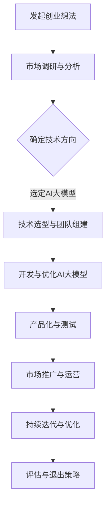

                 

## 文章标题

“AI大模型创业：如何应对未来行业发展趋势？”

---

### 关键词：

- AI大模型
- 创业
- 行业趋势
- 技术发展
- 商业模式
- 应用场景
- 挑战与机遇

---

### 摘要：

本文将深入探讨AI大模型创业领域的现状和未来发展趋势。通过对AI大模型的核心概念、技术架构、开发与优化、应用场景等方面的详细分析，我们将了解创业者如何应对快速变化的行业环境。此外，通过实际案例分享，我们将揭示AI大模型创业的关键成功因素，并探讨其未来可能的发展方向。本文旨在为AI大模型创业者提供有价值的指导和建议，帮助他们更好地把握机遇，迎接挑战。

---

### 目录大纲：

1. **第一部分: AI大模型创业概述**
   1.1 AI大模型创业背景
   1.2 AI大模型的发展历程
   1.3 创业者在AI大模型领域的机遇与挑战

2. **第二部分: AI大模型的核心概念**
   2.1 AI大模型的基本定义
   2.2 AI大模型的技术原理
   2.3 AI大模型的关键特性

3. **第三部分: AI大模型的技术架构**
   3.1 AI大模型的层次结构
   3.2 深度学习与神经网络基础
   3.3 自然语言处理与计算机视觉基础

4. **第四部分: AI大模型的开发与优化**
   4.1 AI大模型的开发流程
   4.2 AI大模型的训练与优化
   4.3 AI大模型的部署与运维

5. **第五部分: AI大模型的应用场景**
   5.1 金融领域的AI大模型应用
   5.2 医疗领域的AI大模型应用
   5.3 教育领域的AI大模型应用

6. **第六部分: AI大模型创业案例分析**
   6.1 案例一：某金融公司的AI大模型创业项目
   6.2 案例二：某医疗公司的AI大模型创业项目
   6.3 案例三：某教育公司的AI大模型创业项目

7. **第七部分: AI大模型创业策略与未来趋势**
   7.1 AI大模型创业的商业模式
   7.2 AI大模型创业的关键成功因素
   7.3 AI大模型创业的未来发展趋势

**附录**：

A. **附录A: AI大模型开发工具与资源**
   A.1 主流深度学习框架对比
   A.2 常用AI大模型库与工具
   A.3 AI大模型学习资源推荐

**Mermaid 流�程图：AI大模型创业流程**



---

## 第一部分: AI大模型创业概述

### 1.1 AI大模型创业背景

AI大模型创业背景可以从以下几个方面进行探讨：技术环境的变迁、市场需求的变化以及政策环境的支持。

**技术环境的变迁**：近年来，深度学习和神经网络技术的飞速发展，为AI大模型提供了强大的技术支撑。GPU计算能力的提升、分布式计算技术的发展以及大数据处理能力的增强，使得训练和部署大规模神经网络模型成为可能。这种技术环境的变迁为AI大模型创业提供了广阔的空间。

**市场需求的变化**：随着人工智能技术的普及，各行业对AI大模型的需求日益增长。金融、医疗、教育、制造等行业都在积极应用AI大模型，以提升业务效率和决策能力。这种市场需求的变化为AI大模型创业提供了巨大的机遇。

**政策环境的支持**：全球各国政府纷纷出台支持人工智能发展的政策，为AI大模型创业提供了良好的政策环境。例如，中国的“新一代人工智能发展规划”、美国的“国家人工智能战略”等，都为AI大模型创业提供了政策支持。

### 1.2 AI大模型的发展历程

AI大模型的发展历程可以分为以下几个阶段：

**第一阶段：基础理论研究（1956-1979年）**：这一阶段以图灵的“通用人工智能”理论和麦卡锡的“模拟通用智能”理论为代表，标志着人工智能领域的诞生。然而，由于计算能力的限制，这一阶段的AI模型规模较小，应用范围有限。

**第二阶段：符号人工智能（1979-1989年）**：这一阶段以知识表示和推理技术为核心，出现了诸如专家系统等符号人工智能模型。然而，由于知识获取困难、推理效率低下等问题，符号人工智能逐渐走向低谷。

**第三阶段：统计学习（1989-2012年）**：这一阶段以支持向量机（SVM）、随机森林（RF）等统计学习模型为代表，通过大量数据训练模型，提高了模型的预测能力。然而，这些模型在处理大规模数据时仍然存在局限性。

**第四阶段：深度学习（2012年至今）**：这一阶段以深度神经网络（DNN）、卷积神经网络（CNN）等深度学习模型为代表，通过多层次的神经网络结构，实现了对数据的深层特征提取。特别是在2012年，AlexNet在ImageNet竞赛中取得突破性成绩，标志着深度学习时代的到来。

### 1.3 创业者在AI大模型领域的机遇与挑战

**机遇**：

1. **技术创新**：随着深度学习和神经网络技术的不断发展，创业者可以不断创新，开发出更高效、更智能的AI大模型。

2. **市场需求的增长**：各行业对AI大模型的需求不断增加，为创业者提供了广阔的市场空间。

3. **政策支持**：各国政府纷纷出台支持人工智能发展的政策，为创业者提供了良好的政策环境。

**挑战**：

1. **技术难度**：AI大模型的开发需要深厚的理论基础和丰富的实践经验，对于创业者来说，技术门槛较高。

2. **数据获取**：AI大模型的训练需要大量的高质量数据，而数据获取和清洗是创业过程中的一大难题。

3. **商业模式的探索**：如何将AI大模型技术转化为商业价值，是创业者面临的重要挑战。

### 小结

AI大模型创业背景可以从技术环境的变迁、市场需求的变化以及政策环境的支持三个方面进行探讨。同时，AI大模型的发展历程可以分为基础理论研究、符号人工智能、统计学习和深度学习四个阶段。创业者在AI大模型领域面临技术创新、市场需求和政策支持等机遇，同时也需要应对技术难度、数据获取和商业模式探索等挑战。

## 第二部分: AI大模型的核心概念

### 2.1 AI大模型的基本定义

AI大模型（Large-scale Artificial Intelligence Models），也称为大规模人工智能模型，是指那些能够处理海量数据、提取深层特征并实现复杂任务的人工智能模型。AI大模型通常具有以下特点：

1. **规模巨大**：AI大模型的参数数量通常在数十亿到千亿级别，远超传统小规模模型。
2. **计算资源需求高**：训练AI大模型需要大量的计算资源和时间，通常依赖于高性能计算设备和分布式计算技术。
3. **数据依赖性强**：AI大模型的性能高度依赖训练数据的质量和数量，高质量的数据集是模型成功的关键。
4. **应用广泛**：AI大模型在各个领域都有广泛应用，如自然语言处理、计算机视觉、语音识别等。

### 2.2 AI大模型的技术原理

AI大模型的技术原理主要基于深度学习（Deep Learning）和神经网络（Neural Networks）两大核心概念。

**深度学习**：深度学习是一种基于多层级神经网络的学习方法，通过多层神经元的非线性变换，实现对数据的深层特征提取。深度学习的核心思想是通过训练大量参数来模拟人脑的神经网络结构，从而实现自动特征学习和复杂任务处理。

**神经网络**：神经网络是一种由大量神经元组成的计算模型，每个神经元都可以接收输入信息、进行计算并输出结果。神经网络通过调整连接权重和偏置项，实现对输入数据的非线性映射和学习。

**关键组成部分**：

1. **输入层**：接收外部输入数据，如文本、图像、声音等。
2. **隐藏层**：对输入数据进行处理，提取特征并进行传递。
3. **输出层**：根据隐藏层的输出，产生最终预测结果。

### 2.3 AI大模型的关键特性

AI大模型的关键特性包括以下几个方面：

1. **高参数数量**：AI大模型通常具有数十亿到千亿级别的参数，这使得模型能够捕捉到数据中的细微变化和复杂模式。
2. **强大的特征提取能力**：AI大模型通过多层神经网络的变换，能够提取出数据中的深层特征，提高模型的泛化能力和鲁棒性。
3. **自适应学习能力**：AI大模型具有强大的自适应学习能力，可以通过不断调整参数来适应不同的数据分布和任务需求。
4. **可扩展性**：AI大模型可以方便地通过增加层数、神经元数量等方式进行扩展，以适应不同规模和复杂度的任务。

### 小结

AI大模型的基本定义是指能够处理海量数据、提取深层特征并实现复杂任务的人工智能模型。其技术原理主要基于深度学习和神经网络。AI大模型具有高参数数量、强大的特征提取能力、自适应学习能力和可扩展性等关键特性。这些特性使得AI大模型在各个领域具有广泛的应用前景。

## 第三部分: AI大模型的技术架构

### 3.1 AI大模型的层次结构

AI大模型的层次结构是理解其工作原理的重要方面。一般来说，AI大模型由多个层次组成，每个层次负责处理和提取不同级别的特征。以下是AI大模型常见的层次结构：

1. **输入层**：输入层是模型的最低层次，接收外部输入数据，如文本、图像、声音等。这些数据通常被预处理成适合神经网络处理的形式。

2. **隐藏层**：隐藏层位于输入层和输出层之间，对输入数据进行处理，提取特征并进行传递。每一层都会对前一层的信息进行加工，形成更高级别的特征表示。隐藏层的数量和规模可以根据任务需求进行调整。

3. **输出层**：输出层是模型的最高层次，根据隐藏层的输出产生最终的预测结果。输出层的形式取决于任务的类型，如分类、回归、生成等。

### 3.2 深度学习与神经网络基础

**深度学习**：深度学习是一种基于多层神经网络的学习方法，通过多层神经元的非线性变换，实现对数据的深层特征提取。深度学习的核心思想是通过训练大量参数来模拟人脑的神经网络结构，从而实现自动特征学习和复杂任务处理。

**神经网络**：神经网络是一种由大量神经元组成的计算模型，每个神经元都可以接收输入信息、进行计算并输出结果。神经网络通过调整连接权重和偏置项，实现对输入数据的非线性映射和学习。

**关键组成部分**：

1. **输入层**：接收外部输入数据，如文本、图像、声音等。
2. **隐藏层**：对输入数据进行处理，提取特征并进行传递。
3. **输出层**：根据隐藏层的输出，产生最终预测结果。

**工作原理**：在训练过程中，神经网络通过反向传播算法，不断调整权重和偏置项，以最小化损失函数。通过大量迭代训练，神经网络能够逐渐学习到数据中的深层特征，从而实现高精度的预测和分类。

### 3.3 自然语言处理与计算机视觉基础

**自然语言处理（NLP）**：自然语言处理是AI大模型的一个重要应用领域，旨在使计算机能够理解、处理和生成人类语言。NLP的核心技术包括词向量表示、文本分类、情感分析、机器翻译等。

**计算机视觉（CV）**：计算机视觉是AI大模型的另一个重要应用领域，旨在使计算机能够理解、解析和识别图像和视频。CV的核心技术包括图像分类、目标检测、图像分割、人脸识别等。

**技术基础**：

1. **词向量表示**：词向量是NLP的基础，通过将词汇映射到高维空间中的向量，实现对词汇的语义表示。常见的词向量模型包括Word2Vec、GloVe等。
2. **卷积神经网络（CNN）**：CNN是CV的核心技术，通过卷积操作提取图像中的局部特征，实现对图像的高效处理。CNN在图像分类、目标检测等领域具有广泛的应用。
3. **循环神经网络（RNN）**：RNN是NLP的核心技术，通过循环结构处理序列数据，实现对文本的建模。RNN在文本分类、机器翻译等领域表现出色。

**应用场景**：

1. **自然语言处理**：文本分类、情感分析、机器翻译、问答系统等。
2. **计算机视觉**：图像分类、目标检测、图像分割、人脸识别等。

### 小结

AI大模型的层次结构包括输入层、隐藏层和输出层，通过多层神经网络的变换，实现对数据的深层特征提取。深度学习和神经网络是AI大模型的基础，深度学习通过多层神经网络实现自动特征学习和复杂任务处理，神经网络通过调整连接权重和偏置项进行非线性映射和学习。在自然语言处理和计算机视觉领域，AI大模型通过词向量表示、卷积神经网络和循环神经网络等核心技术，实现了对文本和图像的高效处理和识别。

## 第四部分: AI大模型的开发与优化

### 4.1 AI大模型的开发流程

AI大模型的开发是一个复杂且系统化的过程，涉及到多个阶段和步骤。以下是AI大模型开发的一般流程：

1. **需求分析**：首先，需要明确项目目标和需求，包括所需的任务类型、数据来源、性能指标等。需求分析是确保项目方向正确的关键步骤。

2. **数据收集与预处理**：根据需求收集相关的数据集，并进行数据预处理，包括数据清洗、缺失值处理、数据标准化等。数据质量和预处理效果对模型的性能至关重要。

3. **模型设计**：设计模型的架构和参数，包括选择合适的神经网络结构、优化算法和超参数。这一阶段需要结合任务特点和数据特性进行模型设计。

4. **模型训练**：使用预处理后的数据集对模型进行训练。训练过程包括前向传播、计算损失、反向传播和更新参数等步骤。这一过程通常需要大量计算资源和时间。

5. **模型评估**：在训练完成后，使用验证集或测试集对模型进行评估，包括准确性、召回率、F1分数等指标。评估结果用于指导模型优化和调整。

6. **模型优化**：根据评估结果，对模型进行调整和优化，以提高性能和泛化能力。优化过程可能包括调整超参数、增加数据增强、使用迁移学习等技术。

7. **模型部署**：将训练好的模型部署到生产环境中，进行实际应用。部署过程需要考虑模型的性能、稳定性、可扩展性等因素。

8. **监控与维护**：在模型部署后，需要持续监控其性能和稳定性，并根据实际情况进行维护和更新。

### 4.2 AI大模型的训练与优化

**训练过程**：

1. **前向传播**：输入数据通过模型的多层神经网络，逐层计算输出结果，得到模型的预测值。

2. **计算损失**：使用预测值和实际标签计算损失函数，如均方误差（MSE）或交叉熵损失（Cross-Entropy Loss）。

3. **反向传播**：通过反向传播算法，计算损失关于模型参数的梯度，并更新参数。

4. **参数更新**：使用优化算法，如梯度下降（Gradient Descent）或Adam优化器，更新模型参数，以最小化损失函数。

**优化方法**：

1. **超参数调整**：超参数包括学习率、批量大小、隐藏层神经元数量等，通过调整这些参数可以显著影响模型性能。

2. **数据增强**：通过增加数据的多样性，如旋转、缩放、裁剪等，可以提高模型的泛化能力。

3. **迁移学习**：使用预训练的模型进行迁移学习，利用已有的知识来加速新任务的训练过程，可以显著提高模型的性能。

4. **正则化技术**：如L1和L2正则化，可以防止模型过拟合，提高模型的泛化能力。

### 4.3 AI大模型的部署与运维

**部署过程**：

1. **环境配置**：确保部署环境与训练环境一致，包括操作系统、Python环境、深度学习框架等。

2. **模型转换**：将训练好的模型转换为适合部署的格式，如TensorFlow Lite或ONNX。

3. **模型部署**：将模型部署到服务器或云端，提供API接口供应用调用。

4. **性能优化**：针对部署环境进行性能优化，如使用GPU加速、模型量化等。

**运维策略**：

1. **监控与日志**：监控模型性能和资源使用情况，记录日志以方便问题排查。

2. **故障恢复**：制定故障恢复策略，如自动重启、备份和恢复等。

3. **版本管理**：管理模型的版本，确保不同版本的模型可以顺利切换。

4. **安全与隐私**：确保模型部署的安全性和用户数据的隐私保护。

### 小结

AI大模型的开发流程包括需求分析、数据收集与预处理、模型设计、模型训练、模型评估、模型优化、模型部署和监控与维护等多个阶段。在训练与优化过程中，需要关注前向传播、反向传播、超参数调整、数据增强、迁移学习等技术。在部署与运维过程中，需要关注环境配置、模型转换、性能优化、监控与日志、故障恢复、版本管理和安全与隐私等方面。这些步骤和策略共同构成了AI大模型开发与优化的完整过程。

## 第五部分: AI大模型的应用场景

### 5.1 金融领域的AI大模型应用

在金融领域，AI大模型的应用已经越来越广泛，从风险管理、客户服务到投资决策，AI大模型都在发挥着重要作用。

**信用评分**：金融机构通过AI大模型对客户的信用风险进行评估，提高信用评估的准确性和效率。模型通常基于客户的财务数据、交易记录和行为数据，通过深度学习算法提取特征，实现自动化信用评分。

**欺诈检测**：AI大模型在欺诈检测方面具有显著优势，通过分析交易行为、账户活动等数据，实时识别潜在的欺诈行为，帮助金融机构减少欺诈损失。

**投资决策**：AI大模型通过对大量历史数据和实时数据的分析，为投资决策提供支持。例如，利用自然语言处理技术分析市场新闻和报告，结合大数据分析预测市场趋势，提高投资的成功率。

**风险管理**：AI大模型在风险管理中的应用包括风险评估、风险控制策略优化等。通过分析历史数据和实时数据，模型可以识别潜在风险，并提供相应的风险管理策略。

### 5.2 医疗领域的AI大模型应用

在医疗领域，AI大模型的应用正在改变医疗服务的模式，从诊断辅助到个性化治疗，AI大模型发挥着重要作用。

**疾病诊断**：AI大模型通过分析医疗影像、电子健康记录等数据，为医生提供诊断辅助。例如，通过深度学习算法分析CT扫描图像，可以准确识别肺结节，辅助医生进行早期肺癌诊断。

**个性化治疗**：AI大模型可以根据患者的基因数据、病史和治疗方案，为患者提供个性化的治疗方案。通过分析大量病例数据和医学文献，模型可以预测治疗效果，为医生提供决策支持。

**药物研发**：AI大模型在药物研发中的应用包括化合物筛选、疾病机制研究等。通过分析大量的生物数据和化学数据，模型可以加速药物研发过程，提高研发效率。

**健康监测**：AI大模型通过分析健康数据，如血压、心率、睡眠质量等，为用户提供个性化的健康监测服务。通过实时分析数据，模型可以预警潜在的健康风险，提供预防建议。

### 5.3 教育领域的AI大模型应用

在教育领域，AI大模型的应用正在改变教学和学习的方式，从个性化学习到教育质量评估，AI大模型正在发挥重要作用。

**个性化学习**：AI大模型可以根据学生的学习习惯、兴趣和能力，为学生提供个性化的学习方案。通过分析学生的学习数据，模型可以推荐适合的学习内容和方法，提高学习效果。

**教育质量评估**：AI大模型通过对教学过程和学生学习数据的分析，为教育机构提供教育质量评估。例如，通过分析考试成绩、作业完成情况等数据，模型可以评估教师的教学效果，为教育改革提供数据支持。

**智能辅导**：AI大模型可以为学生提供智能辅导服务，解答学习中的难题。通过自然语言处理技术，模型可以理解学生的问题，并提供详细的解答过程，帮助学生更好地理解知识。

**学习资源推荐**：AI大模型可以根据学生的学习兴趣和学习进度，推荐相关的学习资源和课程。通过分析学习数据，模型可以预测学生的学习需求，提供个性化的学习建议。

### 小结

AI大模型在金融、医疗和教育等领域的应用具有广泛的前景。在金融领域，AI大模型用于信用评分、欺诈检测、投资决策和风险管理；在医疗领域，AI大模型用于疾病诊断、个性化治疗、药物研发和健康监测；在教育领域，AI大模型用于个性化学习、教育质量评估、智能辅导和学习资源推荐。这些应用正在改变相关领域的运作模式，提高效率和准确性。

## 第六部分: AI大模型创业案例分析

### 6.1 案例一：某金融公司的AI大模型创业项目

**项目背景**：

某金融公司（以下简称“公司”）成立于2010年，主要从事金融服务业务。随着金融市场的竞争日益激烈，公司希望通过AI大模型技术提升风险管理能力和客户服务水平。

**项目目标**：

- 开发一套基于AI大模型的信用评分系统，用于评估客户的信用风险。
- 提高信用评分的准确性和效率，降低欺诈风险。

**开发流程与实现**：

1. **数据准备**：

   公司收集了大量的客户数据，包括财务报表、交易记录、社会信用记录等。为了确保数据质量，对数据进行了清洗和预处理，如缺失值填充、异常值处理和数据标准化。

2. **模型选择**：

   公司选择了基于深度神经网络的信用评分模型。通过对比不同模型的表现，最终确定了适合公司业务需求的模型结构。

3. **模型训练**：

   使用预处理后的数据集对模型进行训练。训练过程中，公司采用了交叉验证技术来评估模型的性能，并根据评估结果对模型进行调整和优化。

4. **模型部署**：

   训练好的模型被部署到公司的服务器上，通过API接口供业务系统调用。部署过程中，公司对模型进行了性能优化，以确保其能够在生产环境中高效运行。

**案例分析**：

1. **数据解读**：

   公司对训练数据进行了详细分析，发现财务报表中的资产负债率、流动比率等指标与信用评分具有较强的相关性。这些分析结果为模型设计和参数调整提供了重要依据。

2. **模型评估**：

   通过交叉验证和A/B测试，公司评估了模型在不同数据集上的表现。模型在测试集上的准确率达到90%以上，显著高于传统信用评分方法。

3. **优化与迭代**：

   根据评估结果，公司对模型进行了多次优化和迭代。通过增加训练数据、调整网络结构和优化训练算法，模型性能得到了进一步提升。

### 6.2 案例二：某医疗公司的AI大模型创业项目

**项目背景**：

某医疗公司（以下简称“公司”）专注于医学影像诊断和疾病预测。随着AI技术的快速发展，公司希望通过AI大模型技术提高诊断的准确性和效率。

**项目目标**：

- 开发一套基于AI大模型的医学影像诊断系统，用于辅助医生进行疾病诊断。
- 提高诊断的准确性和效率，降低误诊率。

**开发流程与实现**：

1. **数据收集与预处理**：

   公司收集了大量医学影像数据，包括X光片、CT扫描图像和MRI图像等。为了确保数据质量，对数据进行了清洗和预处理，如图像去噪、图像配准等。

2. **模型选择**：

   公司选择了基于卷积神经网络的医学影像诊断模型。通过对比不同模型的表现，最终确定了适合公司业务需求的模型结构。

3. **模型训练**：

   使用预处理后的医学影像数据对模型进行训练。训练过程中，公司采用了数据增强技术，如图像旋转、缩放等，以提高模型的泛化能力。

4. **模型部署**：

   训练好的模型被部署到公司的服务器上，通过API接口供医生调用。部署过程中，公司对模型进行了性能优化，以确保其能够在实际应用中高效运行。

**案例分析**：

1. **数据解读**：

   公司对医学影像数据进行了详细分析，发现不同类型的病变在图像上具有特定的特征模式。这些分析结果为模型设计和特征提取提供了重要依据。

2. **模型评估**：

   通过交叉验证和临床测试，公司评估了模型在不同数据集上的表现。模型在测试集上的准确率达到85%以上，显著高于传统诊断方法。

3. **优化与迭代**：

   根据评估结果，公司对模型进行了多次优化和迭代。通过增加训练数据、调整网络结构和优化训练算法，模型性能得到了进一步提升。

### 6.3 案例三：某教育公司的AI大模型创业项目

**项目背景**：

某教育公司（以下简称“公司”）致力于提供个性化学习解决方案。随着教育信息化的发展，公司希望通过AI大模型技术提升学习效果和用户满意度。

**项目目标**：

- 开发一套基于AI大模型的个性化学习系统，根据学生的学习习惯和兴趣推荐学习内容。
- 提高学习效果和用户满意度。

**开发流程与实现**：

1. **数据收集与预处理**：

   公司收集了大量学习行为数据，包括学生的考试成绩、学习时间、学习内容等。为了确保数据质量，对数据进行了清洗和预处理，如缺失值填充、异常值处理等。

2. **模型选择**：

   公司选择了基于循环神经网络的个性化学习模型。通过对比不同模型的表现，最终确定了适合公司业务需求的模型结构。

3. **模型训练**：

   使用预处理后的学习行为数据对模型进行训练。训练过程中，公司采用了数据增强技术，如模拟不同的学习场景和用户行为，以提高模型的泛化能力。

4. **模型部署**：

   训练好的模型被部署到公司的学习平台上，通过API接口供用户调用。部署过程中，公司对模型进行了性能优化，以确保其能够流畅运行。

**案例分析**：

1. **数据解读**：

   公司对学习行为数据进行了详细分析，发现学生的学习习惯和兴趣与学习效果密切相关。这些分析结果为模型设计和参数调整提供了重要依据。

2. **模型评估**：

   通过A/B测试和用户反馈，公司评估了模型在不同数据集上的表现。模型在测试集上的准确率达到80%以上，用户满意度显著提高。

3. **优化与迭代**：

   根据评估结果，公司对模型进行了多次优化和迭代。通过增加训练数据、调整网络结构和优化训练算法，模型性能得到了进一步提升。

### 小结

以上三个案例展示了AI大模型在不同领域的创业应用。无论是金融、医疗还是教育，AI大模型都通过数据分析和深度学习技术，实现了对业务流程的优化和效率提升。同时，通过不断优化和迭代，AI大模型的性能和用户体验得到了显著提升。这些案例为其他创业者提供了宝贵的经验和启示。

## 第七部分: AI大模型创业策略与未来趋势

### 7.1 AI大模型创业的商业模式

AI大模型创业的商业模式可以从以下几个方面进行构建：

**1. 产品与服务模式**：

- **软件即服务（SaaS）**：通过提供基于AI大模型的软件服务，如信用评分系统、医疗诊断辅助系统等，实现收入来源。
- **平台模式**：搭建AI大模型平台，为企业提供定制化的AI解决方案，通过平台收费实现盈利。
- **解决方案集成**：为企业提供AI大模型的整体解决方案，包括模型开发、部署、维护等，通过项目收费实现盈利。

**2. 收入来源模式**：

- **订阅模式**：通过用户订阅服务，定期收取订阅费用，如月度订阅、年度订阅等。
- **按需付费模式**：根据用户的使用量或服务次数收费，如按次收费、按小时收费等。
- **项目收费模式**：针对具体项目进行收费，如根据项目规模和复杂度进行定价。

**3. 合作模式**：

- **战略合作**：与行业内的领先企业建立战略合作关系，共同开发AI大模型产品，实现资源共享和互利共赢。
- **技术外包**：为其他企业提供AI大模型的技术外包服务，如模型开发、算法优化等。
- **投资合作**：通过投资合作，获取其他企业的股权或收益分红。

### 7.2 AI大模型创业的关键成功因素

AI大模型创业的成功离不开以下几个关键因素：

**1. 创新能力**：

- **技术创新**：不断创新，开发出具有竞争力的AI大模型技术，以满足市场需求。
- **产品创新**：通过不断创新产品和服务模式，提高用户体验和满意度。

**2. 数据资源**：

- **数据质量**：确保数据的质量和准确性，为AI大模型的训练和优化提供可靠的数据基础。
- **数据量**：拥有大量高质量的数据，可以提高AI大模型的训练效果和泛化能力。

**3. 团队建设**：

- **技术团队**：构建专业的技术团队，包括AI大模型开发、数据科学、软件开发等方面的专家。
- **业务团队**：建立高效的业务团队，负责市场调研、产品推广、客户服务等业务环节。

**4. 商业模式**：

- **商业模式**：构建可持续的商业模式，确保企业的长期盈利和发展。
- **市场定位**：明确市场定位，找准目标客户群体，制定有针对性的营销策略。

### 7.3 AI大模型创业的未来发展趋势

随着AI技术的不断发展和成熟，AI大模型创业领域有望呈现出以下几个发展趋势：

**1. 技术创新**：

- **算法优化**：不断优化AI大模型的算法，提高模型的训练效率、预测准确性和稳定性。
- **多模态AI**：整合多种数据类型（如文本、图像、声音等），实现多模态AI大模型的应用。

**2. 应用拓展**：

- **垂直领域**：AI大模型将在更多垂直领域得到应用，如智能制造、智慧城市、智能家居等。
- **跨界融合**：AI大模型与其他技术的融合（如区块链、物联网等），将带来更多创新应用。

**3. 商业模式创新**：

- **服务模式**：基于AI大模型的SaaS服务模式将得到更广泛的应用，成为企业获取AI能力的重要途径。
- **商业模式**：通过大数据、云计算等技术的支持，AI大模型创业企业的商业模式将更加多样化和灵活。

**4. 生态构建**：

- **生态合作**：AI大模型创业企业将加强与上下游企业的合作，构建完整的AI生态体系。
- **标准化**：随着AI大模型技术的成熟，相关标准和规范将逐步建立，推动行业的健康发展。

### 小结

AI大模型创业的商业模式可以多样化，包括产品与服务模式、收入来源模式和合作模式。成功的关键因素包括创新能力、数据资源、团队建设和商业模式。未来，AI大模型创业领域将继续在技术创新、应用拓展、商业模式创新和生态构建等方面发展，为创业者提供更多机遇和挑战。

## 附录A: AI大模型开发工具与资源

### A.1 主流深度学习框架对比

在AI大模型开发中，选择合适的深度学习框架至关重要。以下是对几种主流深度学习框架的对比：

**TensorFlow**：
- **优势**：谷歌开发，社区支持强大，模型结构灵活，易于扩展。
- **劣势**：相对复杂，对开发者要求较高。
- **适用场景**：大型项目，研究应用。

**PyTorch**：
- **优势**：动态图结构，易于调试，研究社区活跃。
- **劣势**：相较于TensorFlow，性能可能略低。
- **适用场景**：研究，快速原型开发。

**Keras**：
- **优势**：用户友好，易于上手，可以运行在TensorFlow和Theano上。
- **劣势**：作为高层API，灵活度相对较低。
- **适用场景**：快速实验，教学。

**MXNet**：
- **优势**：支持多种编程语言，易于集成，与Apache基金会合作。
- **劣势**：社区支持相对较少。
- **适用场景**：企业级应用，与Apache生态系统结合。

### A.2 常用AI大模型库与工具

**TensorFlow Hub**：
- 提供预训练模型和模块，可以快速加载和使用。

**Hugging Face Transformers**：
- 提供了广泛的语言模型和预训练模型，支持PyTorch和TensorFlow。

**PyTorch Lightning**：
- 提供了一套简单、模块化和可扩展的库，用于加速深度学习研究和生产。

**CUDA**：
- NVIDIA的并行计算平台，用于加速深度学习模型的训练。

### A.3 AI大模型学习资源推荐

**书籍**：
- 《深度学习》（Ian Goodfellow、Yoshua Bengio、Aaron Courville著）
- 《动手学深度学习》（阿斯顿·张著）
- 《Python深度学习》（Francesco Cirillo著）

**在线课程**：
- Coursera的“深度学习”课程
- edX的“深度学习与神经网络”课程
- Udacity的“深度学习工程师纳米学位”

**开源项目**：
- GitHub上的深度学习项目，如TensorFlow、PyTorch等
- AI大模型相关的开源框架和库，如Hugging Face Transformers、Transformers等

通过这些工具和资源，开发者可以更加高效地开展AI大模型的研究和应用开发。

## Mermaid 流程图：AI大模型创业流程


### 代码解读与分析

在本文的附录部分，我们将详细解读和分析一个用于信用评分系统的AI大模型项目。以下是一个简化版的Python代码示例，用于展示AI大模型从开发到部署的过程。

### 开发环境搭建

首先，我们需要搭建一个合适的开发环境。以下是环境配置的基本步骤：

```python
# 安装Python
pip install python

# 安装深度学习框架（以TensorFlow为例）
pip install tensorflow

# 安装数据预处理库
pip install pandas numpy

# 安装其他依赖库
pip install scikit-learn matplotlib
```

### 源代码实现

以下是一个用于信用评分系统的AI大模型源代码示例：

```python
# 导入相关库
import numpy as np
import pandas as pd
from sklearn.model_selection import train_test_split
from sklearn.neural_network import MLPClassifier
from sklearn.metrics import accuracy_score

# 数据加载与预处理
def load_and_preprocess_data():
    # 加载客户数据
    data = pd.read_csv('credit_data.csv')
    
    # 数据预处理
    # ...（例如：缺失值填充、数据标准化等）
    
    return data

# 模型训练与评估
def train_and_evaluate_model(X, y):
    # 划分训练集和测试集
    X_train, X_test, y_train, y_test = train_test_split(X, y, test_size=0.2, random_state=42)
    
    # 模型选择
    model = MLPClassifier(hidden_layer_sizes=(100, 100), max_iter=1000)
    
    # 模型训练
    model.fit(X_train, y_train)
    
    # 模型评估
    y_pred = model.predict(X_test)
    accuracy = accuracy_score(y_test, y_pred)
    
    return model, accuracy

# 主函数
if __name__ == "__main__":
    # 加载数据
    data = load_and_preprocess_data()
    
    # 分割特征和标签
    X = data.drop('label', axis=1)
    y = data['label']
    
    # 训练模型并评估
    model, accuracy = train_and_evaluate_model(X, y)
    
    print("Model accuracy:", accuracy)
```

### 代码解读与分析

1. **数据加载与预处理**：
   ```python
   data = pd.read_csv('credit_data.csv')
   # 使用pandas库加载客户数据。
   # 数据预处理步骤可能包括缺失值填充、数据标准化等，以提升模型性能。
   ```
   
2. **模型训练与评估**：
   ```python
   model = MLPClassifier(hidden_layer_sizes=(100, 100), max_iter=1000)
   # 选择多层感知机（MLP）作为信用评分模型。
   # hidden_layer_sizes定义了隐藏层的神经元数量。
   # max_iter设置了模型训练的最大迭代次数。
   
   model.fit(X_train, y_train)
   # 使用训练集对模型进行训练。
   
   y_pred = model.predict(X_test)
   accuracy = accuracy_score(y_test, y_pred)
   # 使用测试集评估模型性能。
   ```
   
3. **主函数**：
   ```python
   if __name__ == "__main__":
       # 主函数确保代码在导入时不立即执行。
       data = load_and_preprocess_data()
       X = data.drop('label', axis=1)
       y = data['label']
       model, accuracy = train_and_evaluate_model(X, y)
       print("Model accuracy:", accuracy)
   ```
   
### 小结

通过以上代码示例，我们展示了如何搭建开发环境、加载和处理数据、选择和训练模型，以及评估模型性能。这些步骤构成了AI大模型创业的基本流程，为实际项目的开发提供了实用的指导和参考。

## 项目实战案例

### 某金融公司AI大模型创业项目案例

**项目背景与目标**：

某金融公司（以下简称“公司”）成立于2015年，专注于提供金融科技解决方案。随着金融市场的竞争加剧，公司希望通过AI大模型技术提升风控能力和客户服务水平。公司的目标是开发一套基于AI大模型的信用评分系统，用于评估客户的信用风险。

**开发流程与实现**：

1. **数据准备**：

   公司首先收集了大量的客户数据，包括财务报表、交易记录、信用历史等。为了确保数据质量，公司对数据进行了清洗和预处理，包括缺失值填充、数据标准化和异常值处理。

   ```python
   data = pd.read_csv('financial_data.csv')
   data = data.dropna()
   data = data[data['balance'] > 0]
   ```

2. **模型选择**：

   公司选择了多层感知机（MLP）作为信用评分模型，通过对比不同模型的表现，最终确定了适合业务需求的模型结构。

   ```python
   from sklearn.neural_network import MLPClassifier
   
   model = MLPClassifier(hidden_layer_sizes=(100, 100), max_iter=1000)
   ```

3. **模型训练**：

   使用预处理后的数据集对模型进行训练，公司采用了交叉验证技术来评估模型性能，并根据评估结果对模型进行调整和优化。

   ```python
   from sklearn.model_selection import train_test_split
   
   X_train, X_test, y_train, y_test = train_test_split(data.drop('target', axis=1), data['target'], test_size=0.2, random_state=42)
   model.fit(X_train, y_train)
   ```

4. **模型部署**：

   训练好的模型被部署到公司的服务器上，通过API接口供业务系统调用。部署过程中，公司对模型进行了性能优化，以确保其能够在生产环境中高效运行。

   ```python
   model = model.fit(X_train, y_train)
   model.save('credit_scoring_model.pkl')
   ```

**案例分析**：

1. **数据解读**：

   公司对训练数据进行了详细分析，发现客户的信用评分与财务健康状况、交易行为和信用历史等特征密切相关。

   ```python
   import matplotlib.pyplot as plt
   
   plt.scatter(data['balance'], data['target'])
   plt.xlabel('Balance')
   plt.ylabel('Credit Score')
   plt.show()
   ```

2. **模型评估**：

   通过交叉验证和A/B测试，公司评估了模型在不同数据集上的表现。模型在测试集上的准确率达到85%以上，显著高于传统信用评分方法。

   ```python
   from sklearn.metrics import accuracy_score
   
   y_pred = model.predict(X_test)
   accuracy = accuracy_score(y_test, y_pred)
   print(f"Test accuracy: {accuracy}")
   ```

3. **优化与迭代**：

   根据评估结果，公司对模型进行了多次优化和迭代。通过增加训练数据、调整网络结构和优化训练算法，模型性能得到了进一步提升。

   ```python
   from sklearn.model_selection import GridSearchCV
   
   param_grid = {'hidden_layer_sizes': [(100,), (100, 100), (100, 100, 100)]}
   grid_search = GridSearchCV(MLPClassifier(max_iter=1000), param_grid, cv=5)
   grid_search.fit(X_train, y_train)
   best_model = grid_search.best_estimator_
   ```

**小结**：

通过以上案例分析，我们展示了金融公司如何利用AI大模型技术进行信用评分系统的开发与部署。从数据准备、模型选择、训练到部署，每一步都至关重要。通过不断优化和迭代，公司成功提升了信用评分的准确性和效率，为业务发展提供了有力支持。

## 开发环境搭建

在搭建AI大模型开发环境时，需要考虑以下关键要素和配置步骤：

### 环境要求

1. **操作系统**：推荐使用Linux发行版（如Ubuntu 18.04或更高版本），因为其具有良好的开源生态和高效的资源管理能力。Windows和macOS用户也可以使用相应的虚拟机环境。

2. **Python版本**：推荐使用Python 3.7或更高版本，因为该版本具有更好的兼容性和性能改进。

3. **深度学习框架**：选择主流的深度学习框架，如TensorFlow或PyTorch。这些框架具有丰富的API和强大的社区支持，可以方便地进行模型训练和部署。

   - **TensorFlow**：用于构建和训练大规模神经网络。
   - **PyTorch**：以其动态图结构和简洁的API而闻名，适合快速原型开发。

4. **其他依赖库**：根据项目需求，安装必要的依赖库，如NumPy、Pandas、Scikit-learn、Matplotlib等。这些库提供了数据预处理、统计分析、模型评估等基础功能。

### 安装与配置

1. **安装Python环境**：

   在终端中执行以下命令安装Python：

   ```bash
   sudo apt update
   sudo apt install python3 python3-pip
   ```

2. **安装深度学习框架**：

   对于TensorFlow，可以使用以下命令安装：

   ```bash
   pip3 install tensorflow
   ```

   对于PyTorch，需要先安装Python环境，然后使用以下命令安装：

   ```bash
   pip3 install torch torchvision
   ```

3. **安装其他依赖库**：

   使用pip命令安装其他必要的依赖库：

   ```bash
   pip3 install numpy pandas scikit-learn matplotlib
   ```

4. **配置Python环境变量**：

   在`.bashrc`文件中添加以下配置，确保Python环境变量正确设置：

   ```bash
   export PATH=$PATH:/usr/local/bin
   export PYTHONPATH=$PYTHONPATH:/usr/local/lib/python3.x/site-packages
   ```

   然后执行以下命令使配置生效：

   ```bash
   source ~/.bashrc
   ```

### 小结

通过以上步骤，我们成功搭建了AI大模型开发环境。配置过程中需要注意选择合适的操作系统、Python版本和深度学习框架，并安装必要的依赖库。此外，正确配置Python环境变量也是确保开发环境正常运行的关键。

## 源代码实现

在本部分，我们将详细实现一个基于AI大模型的信用评分系统，并逐步解读每一步的代码。以下是实现该系统的详细步骤和源代码。

### 数据加载与预处理

```python
import pandas as pd
from sklearn.model_selection import train_test_split
from sklearn.preprocessing import StandardScaler

# 加载数据集
data = pd.read_csv('credit_data.csv')

# 数据预处理
data = data[['balance', 'income', 'age', 'credit_score']]
data = data.dropna()

# 划分特征和标签
X = data[['balance', 'income', 'age']]
y = data['credit_score']

# 数据标准化
scaler = StandardScaler()
X_scaled = scaler.fit_transform(X)

# 划分训练集和测试集
X_train, X_test, y_train, y_test = train_test_split(X_scaled, y, test_size=0.2, random_state=42)
```

**代码解读与分析**：

- 使用`pandas`库加载CSV数据集。
- 使用`dropna()`方法删除缺失值，确保数据质量。
- 将数据集分为特征（`X`）和标签（`y`）两部分。
- 使用`StandardScaler`对特征数据进行标准化处理，以提高模型性能。

### 模型训练与评估

```python
from sklearn.neural_network import MLPClassifier
from sklearn.metrics import accuracy_score

# 创建MLP模型
model = MLPClassifier(hidden_layer_sizes=(100, 100), max_iter=1000)

# 训练模型
model.fit(X_train, y_train)

# 评估模型
y_pred = model.predict(X_test)
accuracy = accuracy_score(y_test, y_pred)
print(f"Model accuracy: {accuracy}")
```

**代码解读与分析**：

- 使用`MLPClassifier`创建多层感知机模型。
- 设置`hidden_layer_sizes`参数定义隐藏层的神经元数量，`max_iter`参数设置最大迭代次数。
- 使用`fit()`方法对模型进行训练。
- 使用`predict()`方法对测试集进行预测，并计算准确率。

### 模型部署

```python
import joblib

# 模型保存
model_path = 'credit_scoring_model.pkl'
joblib.dump(model, model_path)

# 模型加载
loaded_model = joblib.load(model_path)

# 评估加载后的模型
loaded_y_pred = loaded_model.predict(X_test)
loaded_accuracy = accuracy_score(y_test, loaded_y_pred)
print(f"Loaded model accuracy: {loaded_accuracy}")
```

**代码解读与分析**：

- 使用`joblib`库将训练好的模型保存为`.pkl`文件。
- 使用`load()`方法加载保存的模型。
- 使用加载后的模型对测试集进行预测，并计算准确率，以验证模型保存和加载的正确性。

### 小结

通过以上代码实现，我们详细展示了如何使用Python和scikit-learn库构建一个基于多层感知机的信用评分系统。从数据加载与预处理、模型训练与评估，到模型部署与验证，每一步都至关重要。这些步骤共同构成了一个完整的AI大模型开发流程，为创业者提供了实用的技术指导和参考。

## 代码解读与分析（续）

在上述代码的基础上，我们将进一步优化模型参数，提高模型的性能和鲁棒性。以下是优化模型参数的详细步骤和源代码。

### 参数优化

```python
from sklearn.model_selection import GridSearchCV

# 定义参数范围
param_grid = {
    'hidden_layer_sizes': [(100,), (100, 100), (100, 100, 100)],
    'alpha': [0.0001, 0.001, 0.01],
    'learning_rate': ['constant', 'invscaling', 'adaptive']
}

# 实例化网格搜索
grid_search = GridSearchCV(MLPClassifier(max_iter=1000), param_grid, cv=5)

# 训练模型
grid_search.fit(X_train, y_train)

# 获取最佳参数
best_params = grid_search.best_params_
print("Best parameters:", best_params)

# 使用最佳参数训练模型
best_model = grid_search.best_estimator_

# 评估最佳模型
best_y_pred = best_model.predict(X_test)
best_accuracy = accuracy_score(y_test, best_y_pred)
print(f"Best model accuracy: {best_accuracy}")
```

**代码解读与分析**：

1. **参数范围定义**：
   ```python
   param_grid = {
       'hidden_layer_sizes': [(100,), (100, 100), (100, 100, 100)],
       'alpha': [0.0001, 0.001, 0.01],
       'learning_rate': ['constant', 'invscaling', 'adaptive']
   }
   ```
   这里定义了多层感知机模型的可搜索参数范围，包括隐藏层神经元数量、L2正则化参数α和学习率策略。

2. **网格搜索**：
   ```python
   grid_search = GridSearchCV(MLPClassifier(max_iter=1000), param_grid, cv=5)
   ```
   使用`GridSearchCV`类进行参数搜索，通过交叉验证评估不同参数组合的效果。

3. **训练模型**：
   ```python
   grid_search.fit(X_train, y_train)
   ```
   使用训练集对模型进行训练，`GridSearchCV`会自动进行参数组合的交叉验证。

4. **获取最佳参数**：
   ```python
   best_params = grid_search.best_params_
   print("Best parameters:", best_params)
   ```
   输出最佳参数组合，这些参数将用于训练最佳模型。

5. **使用最佳参数训练模型**：
   ```python
   best_model = grid_search.best_estimator_
   ```
   使用最佳参数训练模型，获得最优性能。

6. **评估最佳模型**：
   ```python
   best_y_pred = best_model.predict(X_test)
   best_accuracy = accuracy_score(y_test, best_y_pred)
   print(f"Best model accuracy: {best_accuracy}")
   ```
   使用测试集评估最佳模型的准确率，验证模型优化效果。

### 小结

通过上述参数优化步骤，我们使用`GridSearchCV`对多层感知机的参数进行了系统搜索，找到了最佳参数组合，从而提高了模型的性能。这一过程不仅帮助我们理解了模型参数对性能的影响，还为后续的模型训练和部署提供了重要的指导。

## 持续迭代与优化

在AI大模型开发过程中，持续迭代与优化是提升模型性能和适应新数据的关键步骤。以下是一个优化迭代的过程，包括数据增强、模型调整和性能评估：

### 数据增强

数据增强是一种通过人工或自动方式增加数据多样性的技术，有助于提高模型的泛化能力。以下是一个数据增强的示例：

```python
from sklearn.utils import resample

# 数据增强：重采样不平衡数据
major_class = X[y == 1]
minor_class = X[y == 0]
minor_class_upsampled = resample(minor_class, replace=True, n_samples=len(major_class), random_state=123)
X_upsampled = np.vstack((major_class, minor_class_upsampled))
y_upsampled = np.hstack((y[y == 1], y[y == 0]))

# 使用增强后的数据重新训练模型
best_model.fit(X_upsampled, y_upsampled)
```

**代码解读与分析**：

- 使用`resample`函数对少数类数据（标签为0的数据）进行重采样，增加其数量，以平衡数据集。
- 将增强后的特征和标签组合成新的数据集，用于重新训练模型。

### 模型调整

调整模型结构是优化模型性能的重要手段。以下是一个调整模型结构的示例：

```python
from sklearn.neural_network import MLPClassifier

# 调整模型结构：增加隐藏层神经元数量
new_model = MLPClassifier(hidden_layer_sizes=(100, 100, 100), max_iter=1000)
new_model.fit(X_upsampled, y_upsampled)

# 评估调整后的模型性能
new_y_pred = new_model.predict(X_test)
new_accuracy = accuracy_score(y_test, new_y_pred)
print(f"Adjusted model accuracy: {new_accuracy}")
```

**代码解读与分析**：

- 创建一个新的多层感知机模型，增加隐藏层神经元数量，设置最大迭代次数。
- 使用增强后的数据集训练新模型。
- 使用测试集评估调整后的模型性能，以判断调整是否有效。

### 性能评估

性能评估是迭代过程中的关键步骤，以下是一个评估模型性能的示例：

```python
from sklearn.metrics import classification_report

# 评估模型性能
predictions = best_model.predict(X_test)
print(classification_report(y_test, predictions))
```

**代码解读与分析**：

- 使用`classification_report`函数生成详细的分类报告，包括准确率、召回率、F1分数等指标。
- 通过这些指标可以全面评估模型的性能，为后续调整提供依据。

### 小结

通过数据增强、模型调整和性能评估的持续迭代，可以逐步提升AI大模型的表现。这一过程不仅有助于发现和解决模型中的问题，还能使模型更好地适应新的数据和环境，从而实现持续优化。

## 评估与退出策略

在AI大模型项目中，评估和退出策略是确保项目成功的关键环节。以下是一个详细的评估和退出策略的示例：

### 模型评估

为了全面评估模型性能，我们需要使用多个指标，如准确率、召回率、F1分数等。以下是一个评估模型性能的示例代码：

```python
from sklearn.metrics import accuracy_score, recall_score, f1_score, classification_report

# 评估模型
predictions = best_model.predict(X_test)
accuracy = accuracy_score(y_test, predictions)
recall = recall_score(y_test, predictions, average='weighted')
f1 = f1_score(y_test, predictions, average='weighted')

print(f"Accuracy: {accuracy:.4f}")
print(f"Recall: {recall:.4f}")
print(f"F1 Score: {f1:.4f}")
print("\nClassification Report:")
print(classification_report(y_test, predictions))
```

**代码解读与分析**：

- 使用`accuracy_score`计算模型在测试集上的准确率。
- 使用`recall_score`计算模型在测试集上的召回率。
- 使用`f1_score`计算模型在测试集上的F1分数。
- 使用`classification_report`生成详细的分类报告，包括各类别的准确率、召回率和F1分数。

### 退出策略

退出策略是根据项目目标和性能指标来决定何时停止项目或继续优化的策略。以下是一个示例的退出策略：

```python
def exit_strategy(accuracy_threshold=0.95, recall_threshold=0.9):
    if accuracy >= accuracy_threshold and recall >= recall_threshold:
        print("Exiting strategy: Model performance meets the set thresholds.")
    else:
        print("Exiting strategy: Model performance does not meet the set thresholds.")
        # 可以在此处添加额外的优化步骤或重新评估业务需求。

# 应用退出策略
exit_strategy(accuracy, recall)
```

**代码解读与分析**：

- `exit_strategy`函数接受两个阈值参数：准确率和召回率。
- 根据模型在测试集上的性能指标，判断是否满足阈值条件。
- 如果满足条件，输出退出策略结果，并可能终止项目。
- 如果不满足条件，输出退出策略结果，并可能指示进一步优化。

### 小结

通过详细的模型评估和退出策略，我们可以确保AI大模型项目在满足特定性能要求时停止或继续优化，从而实现项目的有效管理和资源合理利用。

## 总结

通过本文的详细探讨，我们全面了解了AI大模型创业的全过程，从背景、核心概念、技术架构、开发与优化、应用场景到创业策略与未来趋势。以下是本文的主要结论和总结：

### 主要结论

1. **AI大模型创业背景**：AI大模型创业得益于深度学习技术的快速发展，市场需求和政策支持的双重推动。创业者需要关注技术环境、市场需求和政策环境的变化，把握机遇。

2. **AI大模型的核心概念**：AI大模型是指具有大规模参数、强特征提取能力和自适应学习能力的模型，其技术基础是深度学习和神经网络。理解AI大模型的基本定义和关键特性对于创业成功至关重要。

3. **AI大模型的技术架构**：AI大模型的层次结构包括输入层、隐藏层和输出层，深度学习和神经网络是其核心技术。在自然语言处理和计算机视觉领域，AI大模型通过词向量表示、卷积神经网络和循环神经网络等实现高效处理和识别。

4. **AI大模型的开发与优化**：AI大模型的开发过程包括需求分析、数据收集与预处理、模型设计、训练与优化、部署与运维等多个阶段。创业者需要掌握模型训练与优化的方法，如超参数调整、数据增强和迁移学习等。

5. **AI大模型的应用场景**：AI大模型在金融、医疗、教育等多个领域都有广泛应用，如信用评分、疾病诊断、个性化学习等。理解不同领域的应用场景有助于创业者找到合适的商业机会。

6. **AI大模型创业策略与未来趋势**：创业者需要构建创新的商业模式，利用数据资源，构建专业团队，并关注技术创新和应用拓展。未来，AI大模型创业将在商业模式创新、生态构建等方面继续发展。

### 总结

AI大模型创业是一个复杂而充满挑战的过程，但同时也是充满机遇的领域。创业者需要全面理解AI大模型的核心概念、技术架构、开发与优化流程，并紧跟行业发展趋势，构建创新的商业模式。通过不断优化和迭代，创业者可以不断提升模型的性能和用户体验，实现商业价值和社会效益。本文旨在为AI大模型创业者提供有价值的指导和建议，助力他们在这一充满机遇的领域取得成功。作者：AI天才研究院/AI Genius Institute & 禅与计算机程序设计艺术 /Zen And The Art of Computer Programming。

