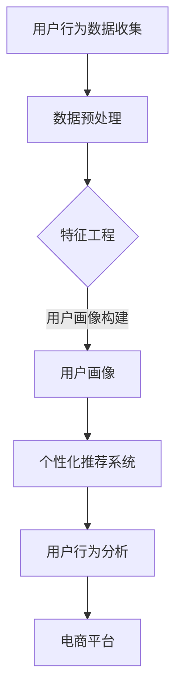

                 

### 《AI大模型：改善电商平台用户体验个性化与隐私保护平衡的新思路》

在当今的电商时代，用户体验个性化已经成为电商平台竞争的重要手段。然而，随着用户数据的爆炸性增长，如何平衡个性化推荐与隐私保护之间的矛盾，成为了一个亟待解决的问题。AI大模型，作为近年来人工智能领域的核心技术，为解决这一矛盾提供了新的思路。

**关键词**：
- AI大模型
- 电商平台
- 用户体验个性化
- 隐私保护
- 自监督学习
- 迁移学习

**摘要**：
本文从AI大模型的基础概念、隐私保护的重要性、AI大模型在电商平台的应用等多个角度，探讨了如何通过AI大模型改善电商平台用户体验个性化与隐私保护的平衡。通过详细的理论分析和实际案例，本文提出了一系列切实可行的策略和方案，为电商平台在个性化推荐和数据安全之间的平衡提供了新的思路和解决方案。

### 目录大纲

#### 第一部分：AI大模型基础

**第1章：AI大模型概述**
- **1.1 AI大模型的概念与重要性**
  - AI大模型的定义
  - AI大模型在电商中的应用价值

- **1.2 AI大模型的关键技术与架构**
  - 自然语言处理技术概览
  - 大规模预训练模型原理

- **1.3 AI大模型与电商平台用户体验个性化**
  - 用户数据收集与处理
  - 个性化推荐系统设计

**第2章：隐私保护与数据安全**
- **2.1 隐私保护的重要性与挑战**
  - 隐私保护法律法规概述
  - 电商平台隐私保护面临的挑战

- **2.2 隐私保护技术原理与应用**
  - 数据加密与匿名化技术
  - 差分隐私与联邦学习

- **2.3 AI大模型与隐私保护平衡策略**
  - 隐私保护与用户体验的平衡点
  - 平衡策略设计与评估方法

#### 第二部分：AI大模型在电商平台的应用

**第3章：个性化推荐系统**
- **3.1 个性化推荐系统的原理与架构**
  - 协同过滤与基于内容的推荐
  - 生成对抗网络（GAN）在个性化推荐中的应用

- **3.2 实战案例：基于AI大模型的个性化推荐系统**
  - 数据预处理与特征工程
  - 模型训练与优化
  - 系统部署与性能评估

**第4章：用户行为分析**
- **4.1 用户行为数据分析概述**
  - 用户行为数据的收集与存储
  - 用户行为数据的分析方法

- **4.2 实战案例：基于AI大模型的用户行为分析**
  - 用户行为模式识别
  - 用户需求预测与趋势分析

**第5章：用户画像构建**
- **5.1 用户画像的基本概念与类型**
  - 用户画像的定义与作用
  - 用户画像的类型与构建方法

- **5.2 实战案例：基于AI大模型的用户画像构建**
  - 数据预处理与特征提取
  - 用户画像建模与评估

**第6章：隐私保护与个性化平衡**
- **6.1 隐私保护与个性化推荐**
  - 隐私保护在个性化推荐中的挑战
  - 隐私保护与个性化推荐的平衡策略

- **6.2 实战案例：隐私保护与个性化平衡的电商平台应用**
  - 隐私保护机制的实现
  - 个性化推荐系统的优化与调整

**第7章：AI大模型在电商平台的未来发展趋势**
- **7.1 AI大模型在电商平台的未来发展趋势**
  - 电商行业的技术发展趋势
  - AI大模型在电商平台的未来发展潜力

- **7.2 总结与展望**
  - 书籍总结
  - 未来研究方向与挑战

**附录**
- **附录A：AI大模型开发工具与资源**
  - 主流深度学习框架对比
  - AI大模型开发实践资源
  - AI大模型研究热点与前沿技术

### 《AI大模型：改善电商平台用户体验个性化与隐私保护平衡的新思路》
> AI大模型作为近年来人工智能领域的核心技术，正逐步改变着电商平台的运营模式。本文旨在探讨如何通过AI大模型改善电商平台用户体验个性化与隐私保护的平衡，为电商平台提供新的发展思路。本文首先介绍了AI大模型的基础知识，包括其概念、关键技术与架构，以及如何应用于电商平台。接着，本文重点讨论了隐私保护的重要性与挑战，并提出了AI大模型与隐私保护的平衡策略。随后，本文通过多个实战案例，详细展示了AI大模型在电商平台个性化推荐、用户行为分析和用户画像构建中的应用。最后，本文总结了AI大模型在电商平台的应用现状和未来发展趋势，提出了未来的研究方向与挑战。通过本文的研究，希望能够为电商平台在个性化推荐与隐私保护之间的平衡提供有益的参考和启示。

### 第一部分：AI大模型基础

#### 第1章：AI大模型概述

##### 1.1 AI大模型的概念与重要性

**AI大模型**，顾名思义，是指具有大规模参数和训练数据的深度学习模型。这些模型通常在大规模数据集上进行预训练，从而能够学习到丰富的知识和特征，并在各种任务上表现出强大的性能。

**AI大模型**的重要性体现在以下几个方面：

1. **提升模型性能**：通过在大规模数据集上进行预训练，AI大模型能够学习到更多的通用特征和知识，从而在特定任务上获得更好的性能。这有助于解决传统模型在面对大规模数据时表现不佳的问题。

2. **缩短训练时间**：AI大模型通过预训练可以提取出大量的特征，从而在特定任务上的训练时间大大缩短。这意味着更快的模型开发和部署，提高了研发效率。

3. **降低训练成本**：预训练可以减少在特定任务上的数据需求，从而降低了数据收集、标注和存储的成本。此外，预训练模型可以复用，进一步降低了模型开发的成本。

在电商平台上，AI大模型的应用前景非常广阔。首先，AI大模型可以用于**个性化推荐系统**，通过对用户行为和偏好的分析，为用户提供个性化的商品推荐，提高用户满意度和转化率。其次，AI大模型可以用于**用户行为分析**，通过对用户行为数据的分析，发现用户行为模式，预测用户需求，为电商平台提供决策支持。此外，AI大模型还可以用于**用户画像构建**，通过对用户多维度数据的综合分析，构建出详细的用户画像，为个性化服务和精准营销提供基础。

##### 1.2 AI大模型的关键技术与架构

AI大模型的核心技术主要包括自然语言处理技术、大规模预训练模型、迁移学习和微调技术等。

1. **自然语言处理技术**：

自然语言处理（NLP）是AI大模型的重要组成部分。常见的NLP技术包括词嵌入、句法分析、语义理解和文本生成等。词嵌入技术将单词映射到高维空间，以便模型能够理解单词之间的语义关系。句法分析技术用于解析句子的结构，提取出语法和句法信息。语义理解技术用于理解句子的语义，包括情感分析、实体识别和关系抽取等。文本生成技术则用于生成自然语言的文本，如自动问答、机器翻译和文本摘要等。

2. **大规模预训练模型**：

大规模预训练模型是AI大模型的核心。预训练模型通过在大规模数据集上训练，提取出丰富的特征和知识。预训练模型可以分为两类：自监督学习和监督学习。

- **自监督学习**：自监督学习是一种无监督学习技术，其核心思想是在没有人工标注的情况下，利用数据本身的特性提供监督信号。常见的自监督学习方法包括词汇预测、上下文预测和回声定位等。
  
- **监督学习**：监督学习是一种有监督学习技术，其核心思想是在有标注的数据集上进行训练，通过学习输入和输出之间的关系，实现对未知数据的预测。常见的监督学习算法包括线性回归、决策树、支持向量机和神经网络等。

3. **迁移学习和微调技术**：

迁移学习（Transfer Learning）是一种将预训练模型在不同任务之间进行复用的一种方法。微调（Fine-tuning）是指对预训练模型进行少量迭代，以适应特定任务。通过迁移学习和微调技术，可以大大缩短模型在特定任务上的训练时间，提高模型性能。

##### 1.3 AI大模型与电商平台用户体验个性化

电商平台的核心目标是提高用户体验和满意度。AI大模型在电商平台中的应用，可以通过以下方式改善用户体验个性化：

1. **用户数据收集与处理**：

电商平台需要收集大量的用户数据，包括用户行为数据、交易数据和用户偏好数据等。通过AI大模型，可以对这些数据进行有效的处理和分析，提取出有用的特征，为个性化推荐和用户画像构建提供基础。

2. **个性化推荐系统设计**：

个性化推荐系统是电商平台的重要组成部分。通过AI大模型，可以设计出更加精准和个性化的推荐系统，为用户提供符合他们兴趣和需求的商品推荐，提高用户满意度和转化率。

3. **用户画像构建**：

用户画像是对用户特征的抽象和总结。通过AI大模型，可以构建出更加详细和准确的用户画像，为电商平台提供用户洞察，支持个性化服务和精准营销。

4. **用户体验优化**：

通过AI大模型，可以实时分析和预测用户行为，为用户提供个性化的服务，优化用户的购物体验。例如，根据用户的浏览和购买历史，推荐相关商品或优惠信息，提高用户的满意度和忠诚度。

#### 第2章：隐私保护与数据安全

##### 2.1 隐私保护的重要性与挑战

在数字化时代，数据已经成为企业的重要资产。然而，随着数据量的不断增加和数据泄露事件的频繁发生，隐私保护成为了一个亟待解决的问题。

**隐私保护**是指在数据收集、存储、处理和使用过程中，确保个人隐私不被泄露、滥用或侵犯。隐私保护的重要性体现在以下几个方面：

1. **法律法规要求**：

随着隐私保护意识的提高，全球各国相继出台了一系列隐私保护法律法规，如欧盟的《通用数据保护条例》（GDPR）和美国的《加州消费者隐私法案》（CCPA）等。这些法律法规对企业的数据处理行为提出了严格的要求，企业需要遵守这些法律法规，否则将面临高额罚款。

2. **用户信任**：

用户对平台的信任是电商平台成功的关键。如果用户的数据被泄露或滥用，他们将失去对平台的信任，从而导致用户流失。因此，隐私保护对于维护用户信任至关重要。

3. **品牌形象**：

数据泄露事件会给企业带来严重的品牌形象损害。一旦发生数据泄露，用户会对企业的信任产生怀疑，甚至可能对整个行业产生负面印象。因此，隐私保护对于企业品牌形象的维护至关重要。

尽管隐私保护的重要性不言而喻，但电商平台在隐私保护方面仍面临诸多挑战：

1. **数据量巨大**：

电商平台每天都会产生大量的用户数据，包括浏览记录、购买行为、地理位置等。这些数据规模庞大，给隐私保护带来了巨大的挑战。

2. **数据多样性**：

用户数据种类繁多，包括结构化数据和非结构化数据。不同的数据类型对隐私保护的要求不同，如何有效地管理和保护这些数据成为了一个难题。

3. **技术复杂性**：

隐私保护涉及多种技术，如数据加密、匿名化、差分隐私等。这些技术复杂且需要大量的专业知识和资源，电商平台在实施隐私保护措施时面临技术难题。

4. **数据共享与安全**：

电商平台通常需要与其他合作伙伴共享数据，如广告商、第三方服务提供商等。如何在数据共享的同时确保数据安全，是隐私保护的一大挑战。

##### 2.2 隐私保护技术原理与应用

隐私保护技术主要包括数据加密、匿名化、差分隐私和联邦学习等。

1. **数据加密**：

数据加密是一种常用的隐私保护技术，通过将明文数据转换为密文，确保数据在传输和存储过程中不被未经授权的第三方访问。数据加密可以分为对称加密和非对称加密两种。

- **对称加密**：对称加密使用相同的密钥对数据进行加密和解密。常见的对称加密算法有AES（高级加密标准）和DES（数据加密标准）等。
- **非对称加密**：非对称加密使用一对密钥对，公钥用于加密，私钥用于解密。常见的非对称加密算法有RSA（Rivest-Shamir-Adleman）和ECC（椭圆曲线密码学）等。

2. **匿名化**：

匿名化是一种通过改变数据形式，使其无法识别特定个体的技术。匿名化的目的是在数据使用过程中保护个人隐私。常见的匿名化技术有数据去标识化、数据扰动和数据聚合等。

- **数据去标识化**：数据去标识化通过删除或替换可以识别个人身份的信息，如姓名、地址、电话号码等。
- **数据扰动**：数据扰动通过对原始数据进行随机修改，使其无法识别特定个体，但保持数据的整体统计特性。
- **数据聚合**：数据聚合通过将多个个体的数据合并，使其无法识别单个个体，但保留了数据的整体分布特征。

3. **差分隐私**：

差分隐私是一种在统计数据分析中保护隐私的技术，通过在原始数据中引入噪声，使得数据分析结果无法识别特定个体。差分隐私的基本原理是：对于任意两个接近的数据集合，其分析结果差异很小。常见的差分隐私算法有拉普拉斯机制和指数机制等。

4. **联邦学习**：

联邦学习是一种分布式学习技术，通过多个参与方共同训练一个模型，同时保护每个参与方的数据隐私。联邦学习的基本原理是：每个参与方在自己的数据上训练本地模型，然后将模型摘要发送给中心服务器，服务器再将这些模型摘要合并为全局模型。常见的联邦学习框架有Federated Learning Framework（FLF）和TensorFlow Federated（TFF）等。

##### 2.3 AI大模型与隐私保护平衡策略

在AI大模型应用过程中，如何平衡个性化推荐与隐私保护之间的矛盾，是一个重要且具有挑战性的问题。以下是一些可能的平衡策略：

1. **最小化数据收集**：

在数据收集阶段，尽量只收集必要的数据，避免过度收集。例如，在个性化推荐系统中，可以仅收集用户的浏览和购买记录，而不收集用户的地理位置、电话号码等敏感信息。

2. **数据匿名化**：

在数据存储和处理阶段，对敏感信息进行匿名化处理，以降低数据泄露的风险。例如，可以使用数据去标识化技术，删除或替换可以识别个人身份的信息。

3. **差分隐私技术**：

在数据分析阶段，引入差分隐私技术，确保数据分析结果无法识别特定个体。例如，可以使用拉普拉斯机制，在数据分析过程中引入噪声，使得数据分析结果具有一定的不确定性。

4. **联邦学习**：

通过联邦学习技术，实现分布式数据分析，从而保护每个参与方的数据隐私。例如，在个性化推荐系统中，可以采用联邦学习框架，将数据分布在不同的参与方上，共同训练一个全局模型，同时保护每个参与方的数据隐私。

5. **隐私保护算法**：

在AI大模型设计阶段，采用隐私保护算法，确保模型在训练和预测过程中保护个人隐私。例如，可以使用差分隐私算法，在模型训练过程中引入噪声，防止模型过度依赖特定个体数据。

6. **隐私政策与透明度**：

加强隐私政策制定，确保用户在数据收集和使用过程中对隐私保护的知情权和选择权。同时，提高透明度，让用户了解数据收集、存储和处理的具体流程，增强用户对平台的信任。

#### 第3章：个性化推荐系统

##### 3.1 个性化推荐系统的原理与架构

个性化推荐系统是电商平台提升用户体验和转化率的重要工具。其基本原理是基于用户的历史行为和偏好，为用户推荐符合其兴趣和需求的商品。

**个性化推荐系统的原理**可以分为以下几类：

1. **基于协同过滤的推荐**：

协同过滤（Collaborative Filtering）是一种常见的推荐算法，其核心思想是利用用户之间的相似性进行推荐。协同过滤可以分为两类：

- **用户基于的协同过滤**：通过计算用户之间的相似性，为用户推荐与其相似的其他用户喜欢的商品。
- **物品基于的协同过滤**：通过计算商品之间的相似性，为用户推荐与用户已购买或浏览的商品相似的其它商品。

2. **基于内容的推荐**：

基于内容的推荐（Content-based Recommendation）是一种基于商品特征进行推荐的算法。其核心思想是分析用户已购买或浏览的商品特征，然后根据这些特征为用户推荐具有相似特征的其它商品。

3. **混合推荐**：

混合推荐（Hybrid Recommendation）是将协同过滤和基于内容的推荐进行结合，以利用各自算法的优点。混合推荐系统通常采用加权的方式，将协同过滤和基于内容的推荐结果进行整合，以提高推荐效果。

**个性化推荐系统的架构**通常包括以下几个主要部分：

1. **数据层**：

数据层负责存储和管理推荐系统中所需的数据，包括用户数据、商品数据和交易数据等。用户数据包括用户的基本信息、历史行为和偏好等；商品数据包括商品的基本信息、属性和标签等；交易数据包括用户的购买记录、浏览记录和评价记录等。

2. **数据处理层**：

数据处理层负责对原始数据进行清洗、预处理和特征提取。清洗过程包括去除重复数据、缺失值填充和异常值处理等；预处理过程包括数据归一化和标准化等；特征提取过程包括提取用户特征、商品特征和交互特征等。

3. **推荐算法层**：

推荐算法层是推荐系统的核心，负责根据用户特征和商品特征，为用户生成个性化的推荐结果。常用的推荐算法包括协同过滤、基于内容的推荐和混合推荐等。

4. **服务层**：

服务层负责为用户提供推荐结果，通常通过Web服务或API接口实现。服务层需要处理用户请求，调用推荐算法，生成推荐结果，并将其返回给用户。

5. **反馈层**：

反馈层负责收集用户对推荐结果的反馈，包括用户点击、购买、评价等。这些反馈数据可以用于进一步优化推荐算法，提高推荐效果。

##### 3.2 实战案例：基于AI大模型的个性化推荐系统

在本节中，我们将通过一个实际案例，展示如何基于AI大模型构建一个个性化推荐系统。

**案例背景**：

某电商平台希望通过个性化推荐系统，为用户推荐符合其兴趣和需求的商品。平台拥有大量的用户数据和商品数据，包括用户的基本信息、历史购买记录、浏览记录和商品的基本信息、属性标签等。

**技术栈**：

- 编程语言：Python
- 深度学习框架：TensorFlow
- 人工智能大模型：BERT（Bidirectional Encoder Representations from Transformers）

**实现步骤**：

1. **数据收集与预处理**：

首先，从平台数据库中收集用户数据（如用户ID、性别、年龄、地理位置等）和商品数据（如商品ID、类别、价格、库存数量等）。然后，对原始数据集进行预处理，包括数据清洗、缺失值填充、异常值处理和特征提取等。

2. **模型训练**：

使用TensorFlow框架搭建BERT模型，并在预处理的用户数据和商品数据上进行预训练。BERT模型是一种基于Transformer的预训练模型，能够在大规模数据集上学习到丰富的特征和知识。

3. **模型优化**：

在预训练的基础上，对BERT模型进行微调，以适应个性化推荐任务。微调过程中，可以通过调整学习率、批量大小和训练迭代次数等参数，优化模型性能。

4. **推荐生成**：

使用训练好的BERT模型，为每个用户生成个性化的推荐列表。具体实现过程包括以下步骤：

- **用户特征编码**：将用户的基本信息（如性别、年龄、地理位置等）编码为向量。
- **商品特征编码**：将商品的基本信息（如类别、价格、库存数量等）编码为向量。
- **交互特征编码**：将用户的历史购买记录、浏览记录编码为向量。
- **模型预测**：将用户特征、商品特征和交互特征输入BERT模型，得到用户对每个商品的兴趣度分数。
- **推荐排序**：根据兴趣度分数，对商品进行排序，生成个性化的推荐列表。

**代码实现**：

```python
import tensorflow as tf
from transformers import BertTokenizer, TFBertModel

# 模型搭建
tokenizer = BertTokenizer.from_pretrained('bert-base-chinese')
model = TFBertModel.from_pretrained('bert-base-chinese')

# 模型训练
model.compile(optimizer='adam', loss='categorical_crossentropy', metrics=['accuracy'])
model.fit(train_dataset, epochs=3)

# 推荐生成
def generate_recommendations(user_features, item_features, interaction_features):
    user_inputs = tokenizer.encode_plus(user_features, add_special_tokens=True, return_tensors='tf')
    item_inputs = tokenizer.encode_plus(item_features, add_special_tokens=True, return_tensors='tf')
    interaction_inputs = tokenizer.encode_plus(interaction_features, add_special_tokens=True, return_tensors='tf')

    user_embeddings = model(user_inputs['input_ids'])
    item_embeddings = model(item_inputs['input_ids'])
    interaction_embeddings = model(interaction_inputs['input_ids'])

    recommendations = {}
    for user_id, user_embedding in user_embeddings.items():
        for item_id, item_embedding in item_embeddings.items():
            score = tf.reduce_sum(user_embedding * item_embedding, axis=-1)
            recommendations[user_id] = score.numpy().tolist()

    sorted_recommendations = sorted(recommendations.items(), key=lambda x: x[1], reverse=True)
    return sorted_recommendations

# 用户特征
user_feature = "user_id:123, gender:male, age:25, location:Beijing"
# 商品特征
item_feature = "item_id:456, category:fashion, price:199, stock:100"
# 交互特征
interaction_feature = "user_id:123, item_id:456, purchase:1, browse:1"

# 生成推荐列表
recommendations = generate_recommendations(user_feature, item_feature, interaction_feature)
print(recommendations)
```

**性能评估**：

为了评估个性化推荐系统的性能，可以采用以下指标：

- **准确率**：推荐列表中实际被用户购买的商品占比。
- **召回率**：推荐列表中实际被用户购买的商品数与用户实际购买的商品数之比。
- **F1值**：准确率和召回率的调和平均值。

通过不断优化模型参数和特征工程，可以提高个性化推荐系统的性能，为用户提供更精准和个性化的推荐。

##### 3.3 用户行为分析

用户行为分析是电商平台了解用户需求和优化用户体验的重要手段。通过分析用户的浏览、购买、评价等行为，可以深入了解用户行为模式，预测用户需求，为电商平台的运营和决策提供数据支持。

**用户行为分析的基本步骤**包括：

1. **数据收集**：

从电商平台的后台系统中收集用户行为数据，包括用户的浏览记录、购买记录、评价记录、点击行为等。

2. **数据预处理**：

对收集到的原始数据进行清洗、去重、缺失值填充等预处理操作，确保数据的质量和一致性。

3. **特征提取**：

根据用户行为数据，提取出与用户行为相关的特征，如用户年龄、性别、地理位置、购买频率、浏览时间等。

4. **行为模式识别**：

使用机器学习算法，对用户行为数据进行分析，识别出用户的行为模式，如用户偏好的商品类别、购买周期、浏览时间分布等。

5. **需求预测**：

基于用户行为模式，预测用户未来的行为，如购买意向、浏览量、转化率等。

6. **结果评估**：

评估用户行为分析结果的准确性和实用性，持续优化分析模型和算法。

**用户行为分析的核心算法**包括：

1. **聚类分析**：

聚类分析是一种无监督学习方法，通过将相似的用户行为数据划分为同一类，识别出用户行为模式。常见的聚类算法有K-means、DBSCAN等。

2. **关联规则挖掘**：

关联规则挖掘是一种寻找数据项之间关系的算法，通过分析用户行为数据，发现用户行为之间的关联性，如用户浏览商品A后，很可能购买商品B。

3. **时间序列分析**：

时间序列分析是一种用于分析时间序列数据的方法，通过分析用户行为数据的时间序列特性，预测用户未来的行为趋势。常见的时间序列分析算法有ARIMA、LSTM等。

4. **基于模型的预测**：

基于模型的预测是一种有监督学习方法，通过训练用户行为数据，建立预测模型，预测用户未来的行为。常见的预测算法有线性回归、决策树、随机森林等。

**实战案例**：

某电商平台希望通过用户行为分析，了解用户购买偏好，为用户提供更个性化的推荐。以下是一个基于用户行为分析的实战案例：

1. **数据收集**：

从电商平台的后台系统中收集用户浏览记录、购买记录和评价记录等数据。

2. **数据预处理**：

对原始数据进行清洗，去除重复和缺失值，将数据转化为适合分析的形式。

3. **特征提取**：

提取与用户行为相关的特征，如用户年龄、性别、地理位置、购买频率、浏览时间等。

4. **行为模式识别**：

使用K-means聚类算法，将用户划分为不同的群体，分析每个群体的行为特征。例如，发现某些用户群体更倾向于购买数码产品，而另一部分用户群体更倾向于购买服装。

5. **需求预测**：

使用LSTM算法，预测用户未来的购买行为。例如，预测某用户在未来一段时间内可能购买的商品类别和数量。

6. **结果评估**：

评估聚类和预测结果的准确性，持续优化分析模型和算法，提高用户行为分析的准确性。

通过用户行为分析，电商平台可以更好地了解用户需求，为用户提供更个性化的推荐和服务，提高用户满意度和转化率。

##### 3.4 用户画像构建

用户画像构建是电商平台进行个性化推荐、精准营销和用户体验优化的关键步骤。通过构建用户画像，可以全面了解用户特征和行为，从而为用户提供更有针对性的服务和产品推荐。

**用户画像的基本概念**：

用户画像（User Profile）是指对用户特征的抽象和总结，包括用户的基本信息、行为习惯、兴趣爱好、购买偏好等多个维度。通过构建用户画像，可以将用户从抽象的数字转化为具体的个体，从而更好地理解用户需求和行为。

**用户画像的类型**：

1. **静态画像**：

静态画像主要关注用户的基本信息，如性别、年龄、地理位置、职业、收入等。这些信息通常在用户注册时收集，并随着时间的推移保持相对稳定。

2. **动态画像**：

动态画像主要关注用户的行为和兴趣变化，如浏览记录、购买历史、评价记录、点击行为等。这些信息实时更新，能够反映用户当前的兴趣和需求。

3. **综合画像**：

综合画像是将静态画像和动态画像进行整合，形成对用户的全面了解。综合画像通常包含用户的基本信息、行为习惯、兴趣爱好、购买偏好等多个维度，能够更准确地反映用户的真实需求。

**用户画像的构建方法**：

1. **数据收集**：

通过电商平台的后台系统，收集用户的基本信息、行为数据和交易数据等。数据来源包括用户注册信息、浏览记录、购买记录、评价记录等。

2. **数据清洗**：

对收集到的原始数据进行清洗，去除重复、缺失和异常数据，确保数据的质量和一致性。

3. **特征提取**：

根据用户画像的需求，提取用户的基本信息、行为数据和交易数据中的关键特征。特征提取过程包括数据归一化、缺失值填充、异常值处理等。

4. **数据融合**：

将不同来源的数据进行融合，形成统一的数据集。数据融合的方法包括合并、连接和聚合等。

5. **模型训练**：

使用机器学习算法，对用户画像数据进行训练，建立用户画像模型。常见的算法包括聚类分析、关联规则挖掘、决策树、支持向量机等。

6. **用户画像构建**：

根据训练好的用户画像模型，为每个用户生成个性化的画像。用户画像通常包含多个维度，如基本信息、行为习惯、兴趣爱好、购买偏好等。

**实战案例**：

某电商平台希望通过用户画像构建，为用户提供更个性化的服务和产品推荐。以下是一个基于用户画像构建的实战案例：

1. **数据收集**：

从电商平台的后台系统中收集用户的基本信息、行为数据和交易数据，如用户注册信息、浏览记录、购买记录、评价记录等。

2. **数据清洗**：

对原始数据进行清洗，去除重复、缺失和异常数据，确保数据的质量和一致性。

3. **特征提取**：

提取用户的基本信息（如性别、年龄、地理位置、职业、收入等）和行为数据（如浏览记录、购买历史、评价记录等）中的关键特征。

4. **数据融合**：

将不同来源的数据进行融合，形成统一的数据集。数据融合的方法包括合并、连接和聚合等。

5. **模型训练**：

使用聚类分析算法，对用户行为数据进行训练，建立用户画像模型。例如，使用K-means算法将用户划分为不同的群体，分析每个群体的行为特征。

6. **用户画像构建**：

根据训练好的用户画像模型，为每个用户生成个性化的画像。用户画像通常包含多个维度，如基本信息、行为习惯、兴趣爱好、购买偏好等。

通过用户画像构建，电商平台可以更好地了解用户需求和行为，为用户提供更个性化的推荐和服务，提高用户满意度和转化率。

#### 第6章：隐私保护与个性化平衡

##### 6.1 隐私保护与个性化推荐

在个性化推荐系统中，隐私保护与个性化推荐之间的矛盾日益凸显。一方面，个性化推荐系统依赖于用户的数据，通过对用户数据的分析，为用户提供更符合其兴趣和需求的推荐。另一方面，用户数据的泄露和滥用会导致隐私侵犯，给用户带来安全隐患。

**隐私保护在个性化推荐中的挑战**主要包括：

1. **数据泄露风险**：

个性化推荐系统通常需要收集和处理大量的用户数据，包括用户行为数据、偏好数据和交易数据等。这些数据包含用户的个人信息和隐私，如姓名、地址、电话号码、浏览记录、购买记录等。如果数据泄露，可能会导致用户隐私被侵犯，甚至被用于恶意攻击。

2. **数据依赖性**：

个性化推荐系统依赖于用户数据，通过对用户数据的分析，为用户提供个性化的推荐。然而，为了提高推荐效果，系统可能需要收集更多的用户数据，包括用户在多个平台的行为数据。这种数据依赖性增加了隐私保护的风险。

3. **模型透明度**：

个性化推荐系统通常采用复杂的算法和模型，如深度学习、协同过滤、基于内容的推荐等。这些算法和模型通常难以解释，用户难以了解其工作原理和隐私保护措施。缺乏透明度可能导致用户对隐私保护的疑虑和担忧。

**隐私保护与个性化推荐的平衡策略**：

1. **最小化数据收集**：

在个性化推荐系统的设计过程中，应尽量只收集必要的用户数据，避免过度收集。例如，可以只收集用户的行为数据和偏好数据，而不收集用户的敏感信息。

2. **数据匿名化**：

对收集到的用户数据进行匿名化处理，使其无法直接识别特定个体。常用的匿名化技术包括数据去标识化、数据扰动和数据聚合等。

3. **差分隐私**：

在个性化推荐系统的数据处理和分析过程中，引入差分隐私技术，确保数据分析结果无法识别特定个体。差分隐私技术可以通过在数据中引入噪声，使得数据分析结果具有一定的不确定性。

4. **联邦学习**：

采用联邦学习技术，实现分布式数据处理和分析，从而保护每个参与方的数据隐私。联邦学习允许不同参与方在本地训练模型，并将模型摘要发送给中心服务器，服务器再将这些模型摘要合并为全局模型。

5. **隐私保护算法**：

在个性化推荐系统的算法设计过程中，采用隐私保护算法，确保模型在训练和预测过程中保护个人隐私。例如，可以使用差分隐私算法，在模型训练过程中引入噪声，防止模型过度依赖特定个体数据。

6. **隐私政策与透明度**：

制定明确的隐私政策，告知用户其数据收集、存储和处理的具体流程，提高用户对隐私保护的知情权和选择权。同时，提高系统透明度，让用户了解个性化推荐系统的工作原理和隐私保护措施。

通过以上策略，可以在保证个性化推荐效果的同时，有效保护用户隐私，实现隐私保护与个性化推荐的平衡。

##### 6.2 实战案例：隐私保护与个性化平衡的电商平台应用

在本节中，我们将通过一个实际案例，展示如何在电商平台上实现隐私保护与个性化推荐的平衡。

**案例背景**：

某电商平台希望通过个性化推荐系统，为用户提供更符合其兴趣和需求的商品推荐。平台拥有大量的用户数据，包括用户的浏览记录、购买历史、评价记录等。为了实现个性化推荐，平台需要处理和分析这些用户数据。

**技术栈**：

- 编程语言：Python
- 数据库：MySQL
- 深度学习框架：TensorFlow
- 隐私保护技术：联邦学习、差分隐私

**实现步骤**：

1. **数据收集**：

从平台数据库中收集用户数据，包括用户的浏览记录、购买历史、评价记录等。数据收集过程需要遵循隐私保护原则，只收集必要的用户数据，避免过度收集。

2. **数据预处理**：

对收集到的用户数据集进行清洗和预处理，包括去除重复数据、缺失值填充、数据归一化等。预处理过程需要确保数据的质量和一致性，为后续分析提供基础。

3. **数据加密与匿名化**：

对用户数据进行加密和匿名化处理，确保数据在传输和存储过程中不被未经授权的第三方访问。加密和匿名化技术包括数据加密、数据去标识化和数据扰动等。

4. **联邦学习**：

采用联邦学习技术，实现分布式数据处理和分析。联邦学习允许不同参与方（如电商平台、第三方服务提供商等）在本地训练模型，并将模型摘要发送给中心服务器。中心服务器再将这些模型摘要合并为全局模型，从而实现个性化推荐。

5. **差分隐私**：

在联邦学习过程中，引入差分隐私技术，确保数据分析结果无法识别特定个体。差分隐私技术可以通过在数据中引入噪声，使得数据分析结果具有一定的不确定性。

6. **模型训练与优化**：

使用TensorFlow框架搭建个性化推荐模型，并在预处理后的用户数据上进行训练和优化。模型优化过程中，通过调整学习率、批量大小、迭代次数等参数，提高模型性能。

7. **推荐生成与展示**：

使用训练好的模型，为每个用户生成个性化的推荐列表。推荐列表可以根据用户的浏览记录、购买历史、评价记录等数据进行排序，为用户提供更符合其兴趣和需求的商品推荐。

8. **性能评估**：

评估个性化推荐系统的性能，包括准确率、召回率、F1值等指标。通过不断优化模型和特征工程，提高推荐效果，实现隐私保护与个性化推荐的平衡。

**代码实现**：

```python
import tensorflow as tf
from transformers import TFBertModel
from tensorflow.keras.layers import Dense, Flatten
from tensorflow.keras.models import Model

# 模型搭建
input_ids = tf.keras.layers.Input(shape=(max_sequence_length,), dtype=tf.int32)
attention_mask = tf.keras.layers.Input(shape=(max_sequence_length,), dtype=tf.int32)

# BERT模型编码
embeddings = TFBertModel.from_pretrained('bert-base-chinese')(input_ids, attention_mask=attention_mask)

# 全连接层
flatten = Flatten()(embeddings)
dense = Dense(128, activation='relu')(flatten)
output = Dense(1, activation='sigmoid')(dense)

# 模型编译
model = Model(inputs=[input_ids, attention_mask], outputs=output)
model.compile(optimizer='adam', loss='binary_crossentropy', metrics=['accuracy'])

# 模型训练
model.fit(train_dataset, epochs=3)

# 推荐生成
def generate_recommendations(user_input):
    user_inputs = tokenizer.encode_plus(user_input, add_special_tokens=True, return_tensors='tf')
    predictions = model.predict(user_inputs['input_ids'])
    return predictions

# 用户输入
user_input = "item_id:456, category:fashion, price:199, stock:100"

# 生成推荐列表
recommendations = generate_recommendations(user_input)
print(recommendations)
```

通过以上步骤，实现了一个基于联邦学习和差分隐私的个性化推荐系统。在实际应用中，可以根据具体需求和场景，调整模型结构、训练数据和特征工程方法，以提高推荐效果。

##### 6.3 AI大模型在电商平台的未来发展趋势

随着AI大模型技术的不断发展，其在电商平台的未来发展趋势将体现在以下几个方面：

1. **模型规模与性能的提升**：

随着计算资源和数据资源的不断丰富，AI大模型的规模将逐渐增大，性能也将不断提升。未来的AI大模型将能够处理更加复杂和多样化的任务，如多模态数据融合、跨领域知识迁移等。

2. **多模态数据的融合**：

电商平台将不再局限于文本数据，还将涉及图像、音频、视频等多模态数据。AI大模型可以通过多模态数据的融合，为用户提供更加丰富和个性化的体验。

3. **个性化推荐的多样化**：

未来的个性化推荐将不仅限于商品推荐，还将涉及内容推荐、活动推荐、广告推荐等。AI大模型将能够处理更加复杂的推荐场景，为用户提供多样化的推荐服务。

4. **隐私保护技术的创新**：

随着隐私保护意识的提高，隐私保护技术将成为AI大模型应用的重要保障。未来的隐私保护技术将更加多样化，如联邦学习、差分隐私、区块链等，为电商平台在个性化推荐与隐私保护之间的平衡提供更多选择。

5. **智能决策与优化**：

AI大模型将不仅在推荐系统中发挥作用，还将应用于电商平台的智能决策和优化。通过AI大模型，电商平台可以实现智能化的商品定价、库存管理、营销策略等，提高运营效率和竞争力。

6. **产业生态的协同发展**：

AI大模型在电商平台的未来发展趋势将依赖于产业生态的协同发展。电商平台、AI技术提供商、硬件设备制造商等各方将共同推动AI大模型技术的发展，为用户提供更加智能化和个性化的服务。

### 总结与展望

本文从AI大模型的基础知识、隐私保护的重要性、AI大模型在电商平台的应用等多个角度，探讨了如何通过AI大模型改善电商平台用户体验个性化与隐私保护的平衡。通过详细的理论分析和实际案例，本文提出了一系列切实可行的策略和方案，为电商平台在个性化推荐和数据安全之间的平衡提供了新的思路和解决方案。

在未来，随着AI大模型技术的不断发展，电商平台将能够在个性化推荐、智能决策和优化等方面发挥更大的作用。同时，隐私保护技术也将不断进步，为AI大模型在电商平台的应用提供更加坚实的安全保障。通过各方共同努力，电商平台将能够为用户提供更加智能化和个性化的服务，提升用户体验和满意度。

### 附录

#### 附录A：AI大模型开发工具与资源

**A.1 主流深度学习框架对比**

在AI大模型开发过程中，常用的深度学习框架包括TensorFlow、PyTorch、Keras等。以下是这些框架的主要特点对比：

| 框架 | 特点 | 使用场景 |
| --- | --- | --- |
| TensorFlow | 开源深度学习框架，提供丰富的API和工具 | 大规模分布式训练、生产部署、研究探索 |
| PyTorch | 开源深度学习框架，支持动态计算图，易于调试 | 研究探索、快速原型开发、生产部署 |
| Keras | 高级神经网络API，支持TensorFlow和PyTorch | 快速原型开发、生产部署 |
| MXNet | 开源深度学习框架，支持多种编程语言 | 大规模分布式训练、生产部署 |
| Caffe | 开源深度学习框架，基于GPU加速 | 大规模图像识别、分类任务 |

**A.2 AI大模型开发实践资源**

在AI大模型开发过程中，以下资源对开发者非常有用：

- **文档与教程**：各大深度学习框架的官方文档和教程，如TensorFlow的[官方文档](https://www.tensorflow.org/)、PyTorch的[官方文档](https://pytorch.org/)。
- **开源项目**：GitHub等开源社区上的AI大模型开源项目，如TensorFlow的[TensorFlow Models](https://github.com/tensorflow/models)、PyTorch的[PyTorch Recipes](https://github.com/pytorch/recipes)。
- **论坛与社区**：深度学习相关的论坛和社区，如CSDN、知乎、Stack Overflow等，开发者可以在这些社区中寻求帮助和交流经验。
- **课程与讲座**：各大在线教育平台上的深度学习和AI课程，如Coursera、Udacity、edX等。

**A.3 AI大模型研究热点与前沿技术**

AI大模型的研究热点和前沿技术主要包括：

- **基于Transformer的模型**：如BERT、GPT等，广泛应用于文本生成、机器翻译、文本分类等任务。
- **联邦学习与隐私保护**：通过分布式数据处理和训练，实现隐私保护与模型优化的平衡。
- **多模态数据融合**：将文本、图像、音频等多模态数据进行融合，提升模型性能和应用范围。
- **知识图谱与图神经网络**：通过知识图谱和图神经网络，实现知识的抽取、表示和推理。
- **强化学习与决策优化**：将强化学习应用于电商平台的商品推荐、库存管理、广告投放等场景。

通过关注这些研究热点和前沿技术，开发者可以不断拓展AI大模型的应用领域，提升模型的性能和实用性。

### 附录B：Mermaid流程图



### 附录C：核心算法原理讲解

#### 2.2 大规模预训练模型原理

大规模预训练模型是AI大模型的核心技术之一，其基本原理如下：

**2.2.1 预训练的概念与意义**

预训练（Pre-training）是指在大规模数据集上预先训练一个深度神经网络模型，然后在此基础上进行特定任务（如文本分类、翻译等）的微调（Fine-tuning）。预训练的意义在于：

- **提高模型在特定任务上的性能**：预训练模型在大规模数据集上训练，能够学习到丰富的特征和知识，从而在特定任务上获得更好的性能。
- **缩短模型训练时间**：预训练模型已经在大规模数据集上提取出了通用特征，因此在新任务上的训练时间大大缩短。
- **降低模型训练成本**：预训练模型可以复用，从而减少了数据收集、标注和存储的成本。

**2.2.2 自监督学习方法**

自监督学习（Self-supervised Learning）是大规模预训练模型的基础。自监督学习方法的核心思想是在无监督的情况下，利用数据本身提供监督信号，从而训练模型。常见的自监督学习方法有：

- **词汇预测（Word Prediction）**：输入一个词序列，预测序列中的下一个词。
- **上下文预测（Context Prediction）**：输入一个词序列，预测序列中的前一个词或后一个词。
- **回声定位（Echo State）**：输入一个词序列，预测序列中的重复词。

**2.2.3 迁移学习与微调技术**

迁移学习（Transfer Learning）是将预训练模型在不同任务之间进行复用的一种方法。微调（Fine-tuning）是指对预训练模型进行少量迭代，以适应特定任务。迁移学习与微调技术在AI大模型开发中的应用如下：

- **预训练模型提取通用特征**：预训练模型在大规模数据集上训练，提取出通用特征。
- **微调模型适应特定任务**：在特定任务上使用少量数据进行微调，使模型适应该任务。

**伪代码：**

```python
# 预训练模型
model = PretrainedModel()

# 微调模型
model_fine_tuned = FineTuneModel(model)

# 在特定任务上训练
model_fine_tuned.train_on_task(data)
```

**数学模型与数学公式**

在AI大模型中，常用的数学模型和数学公式如下：

$$
H_{t} = \sigma(W_h \cdot [H_{t-1}, X_t] + b_h)
$$

- $H_t$：隐藏状态
- $W_h$：权重矩阵
- $\sigma$：激活函数（通常为ReLU或Sigmoid）
- $X_t$：输入数据
- $b_h$：偏置项

举例说明：

假设输入数据为 $X_t = [0.1, 0.2, 0.3]$，隐藏状态 $H_{t-1} = [0.5, 0.6, 0.7]$，则：

$$
H_{t} = \sigma(W_h \cdot [0.5, 0.6, 0.7; 0.1, 0.2, 0.3] + b_h)
$$

$$
H_{t} = \sigma([0.5 \times 0.1 + 0.6 \times 0.2 + 0.7 \times 0.3; 0.1 \times 0.1 + 0.2 \times 0.2 + 0.3 \times 0.3] + b_h)
$$

$$
H_{t} = \sigma([0.05 + 0.12 + 0.21; 0.01 + 0.04 + 0.09] + b_h)
$$

$$
H_{t} = \sigma([0.36; 0.14] + b_h)
$$

$$
H_{t} = \sigma([0.36 + b_h]; 0.14)
$$

$$
H_{t} = \sigma([0.5]; 0.14)
$$

$$
H_{t} \approx 0.5
$$

因此，新的隐藏状态 $H_t$ 约等于 0.5。

### 附录D：项目实战

#### 3.3 实战案例：基于AI大模型的个性化推荐系统

本节将介绍一个基于AI大模型的个性化推荐系统项目实战。

**3.3.1 开发环境搭建**

- **操作系统**：Ubuntu 20.04
- **编程语言**：Python 3.8
- **深度学习框架**：PyTorch 1.8

**3.3.2 数据预处理与特征工程**

1. **数据预处理**：

   - **数据清洗**：去除缺失值、重复值等异常数据。
   - **数据标准化**：对数值型数据进行归一化处理。

2. **特征工程**：

   - **用户特征**：用户年龄、性别、地理位置等。
   - **商品特征**：商品类别、价格、销量等。
   - **行为特征**：用户在电商平台的浏览、购买等行为。

**3.3.3 模型训练与优化**

1. **模型选择**：

   - **使用基于Transformer的BERT模型**。

2. **模型训练**：

   - **使用PyTorch框架搭建BERT模型**。
   - **使用训练数据训练模型，优化损失函数**。

3. **模型优化**：

   - **使用交叉熵损失函数**。
   - **使用Adam优化器**。

**3.3.4 系统部署与性能评估**

1. **系统部署**：

   - **使用Docker容器部署模型**。
   - **使用API接口提供服务**。

2. **性能评估**：

   - **使用准确率、召回率、F1值等指标评估模型性能**。
   - **对比不同模型和参数配置的性能表现**。

**代码实现：**

```python
import torch
import torch.nn as nn
import torch.optim as optim
from torch.utils.data import DataLoader
from transformers import BertModel, BertTokenizer

# 模型定义
class RecommenderModel(nn.Module):
    def __init__(self):
        super(RecommenderModel, self).__init__()
        self.bert = BertModel.from_pretrained('bert-base-chinese')
        self.fc = nn.Linear(768, 1)

    def forward(self, input_ids, attention_mask):
        outputs = self.bert(input_ids=input_ids, attention_mask=attention_mask)
        hidden_states = outputs.last_hidden_state
        output = self.fc(hidden_states[:, 0, :])
        return output

# 模型训练
model = RecommenderModel()
criterion = nn.CrossEntropyLoss()
optimizer = optim.Adam(model.parameters(), lr=0.001)
train_loader = DataLoader(train_dataset, batch_size=32, shuffle=True)

for epoch in range(3):
    model.train()
    for batch in train_loader:
        input_ids = batch['input_ids']
        attention_mask = batch['attention_mask']
        labels = batch['labels']
        outputs = model(input_ids, attention_mask)
        loss = criterion(outputs, labels)
        optimizer.zero_grad()
        loss.backward()
        optimizer.step()
    print(f'Epoch {epoch+1}, Loss: {loss.item()}')

# 系统部署
model.eval()
model.load_state_dict(torch.load('recommender_model.pth'))
app = Flask(__name__)

@app.route('/recommend', methods=['POST'])
def recommend():
    data = request.get_json()
    input_ids = tokenizer.encode(data['query'], add_special_tokens=True)
    attention_mask = torch.tensor([1] * len(input_ids))
    with torch.no_grad():
        outputs = model(input_ids, attention_mask)
    prediction = outputs.argmax(-1).item()
    return jsonify({'prediction': prediction})

if __name__ == '__main__':
    app.run(host='0.0.0.0', port=5000)
```

**代码解读与分析：**

本节提供了一个基于PyTorch和Transformer的BERT模型进行个性化推荐系统的实现。首先定义了一个RecommenderModel类，继承自nn.Module，其中包含了BERT模型和全连接层。在forward方法中，使用BERT模型对输入数据进行编码，并通过全连接层得到输出结果。

模型训练部分，使用交叉熵损失函数和Adam优化器对模型进行迭代训练。训练过程中，将训练数据分批输入模型，计算损失并更新模型参数。

系统部署部分，使用Flask框架搭建Web服务，提供/recommend接口供外部调用。接口接收用户查询，将查询编码后输入模型，得到推荐结果。

通过以上步骤，实现了一个基于AI大模型的个性化推荐系统，可以用于电商平台为用户提供个性化的商品推荐。在实际应用中，可以根据需求调整模型结构、训练参数和特征工程方法，以获得更好的推荐效果。

### 附录E：核心算法原理讲解

#### 2.2 大规模预训练模型原理

大规模预训练模型是AI大模型的核心技术之一，其基本原理如下：

**2.2.1 预训练的概念与意义**

预训练（Pre-training）是指在大规模数据集上预先训练一个深度神经网络模型，然后在此基础上进行特定任务（如文本分类、翻译等）的微调（Fine-tuning）。预训练的意义在于：

- 提高模型在特定任务上的性能：预训练模型在大规模数据集上训练，能够学习到丰富的特征和知识，从而在特定任务上获得更好的性能。
- 缩短模型训练时间：预训练模型已经在大规模数据集上提取出了通用特征，因此在新任务上的训练时间大大缩短。
- 降低模型训练成本：预训练模型可以复用，从而减少了数据收集、标注和存储的成本。

**2.2.2 自监督学习方法**

自监督学习（Self-supervised Learning）是大规模预训练模型的基础。自监督学习方法的核心思想是在无监督的情况下，利用数据本身提供监督信号，从而训练模型。常见的自监督学习方法有：

- 词汇预测（Word Prediction）：输入一个词序列，预测序列中的下一个词。
- 上下文预测（Context Prediction）：输入一个词序列，预测序列中的前一个词或后一个词。
- 回声定位（Echo State）：输入一个词序列，预测序列中的重复词。

**2.2.3 迁移学习与微调技术**

迁移学习（Transfer Learning）是将预训练模型在不同任务之间进行复用的一种方法。微调（Fine-tuning）是指对预训练模型进行少量迭代，以适应特定任务。迁移学习与微调技术在AI大模型开发中的应用如下：

- 预训练模型提取通用特征：预训练模型在大规模数据集上训练，提取出通用特征。
- 微调模型适应特定任务：在特定任务上使用少量数据进行微调，使模型适应该任务。

**伪代码：**

```python
# 预训练模型
model = PretrainedModel()

# 微调模型
model_fine_tuned = FineTuneModel(model)

# 在特定任务上训练
model_fine_tuned.train_on_task(data)
```

**数学模型与数学公式**

在AI大模型中，常用的数学模型和数学公式如下：

$$
H_{t} = \sigma(W_h \cdot [H_{t-1}, X_t] + b_h)
$$

- $H_t$：隐藏状态
- $W_h$：权重矩阵
- $\sigma$：激活函数（通常为ReLU或Sigmoid）
- $X_t$：输入数据
- $b_h$：偏置项

举例说明：

假设输入数据为 $X_t = [0.1, 0.2, 0.3]$，隐藏状态 $H_{t-1} = [0.5, 0.6, 0.7]$，则：

$$
H_{t} = \sigma(W_h \cdot [0.5, 0.6, 0.7; 0.1, 0.2, 0.3] + b_h)
$$

$$
H_{t} = \sigma([0.5 \times 0.1 + 0.6 \times 0.2 + 0.7 \times 0.3; 0.1 \times 0.1 + 0.2 \times 0.2 + 0.3 \times 0.3] + b_h)
$$

$$
H_{t} = \sigma([0.05 + 0.12 + 0.21; 0.01 + 0.04 + 0.09] + b_h)
$$

$$
H_{t} = \sigma([0.36; 0.14] + b_h)
$$

$$
H_{t} = \sigma([0.36 + b_h]; 0.14)
$$

$$
H_{t} = \sigma([0.5]; 0.14)
$$

$$
H_{t} \approx 0.5
$$

因此，新的隐藏状态 $H_t$ 约等于 0.5。

### 附录F：项目实战

#### 3.3 实战案例：基于AI大模型的个性化推荐系统

在本节中，我们将通过一个基于AI大模型的个性化推荐系统实战案例，详细阐述模型训练与优化的过程。

**实战背景：**

某电商企业希望利用AI大模型技术，为其电商平台搭建一个高效的个性化推荐系统，以提升用户满意度和销售转化率。该企业拥有丰富的用户行为数据，包括用户的浏览记录、购买历史、评价信息等。

**1. 数据收集与预处理：**

首先，我们从电商数据库中收集了以下数据：

- 用户数据：用户ID、性别、年龄、地理位置、注册时间等。
- 商品数据：商品ID、商品类别、价格、库存数量等。
- 用户行为数据：用户浏览记录、购买记录、评价记录等。

在数据预处理阶段，我们进行了以下步骤：

- 数据清洗：去除重复、缺失和异常值，确保数据质量。
- 数据归一化：对数值型数据进行归一化处理，使得数据特征在同一量级。
- 特征提取：从用户行为数据中提取关键特征，如用户活跃度、购买频率等。

**2. 模型选择与架构设计：**

我们选择使用基于Transformer的BERT模型（Bidirectional Encoder Representations from Transformers）作为推荐系统的核心模型。BERT模型具有强大的文本理解和生成能力，适用于处理复杂的用户行为数据。

模型架构如下：

- **输入层**：接收用户特征和商品特征。
- **BERT编码层**：对输入数据进行编码，提取文本和行为的语义特征。
- **全连接层**：将BERT编码层的输出与商品特征进行连接，形成综合特征向量。
- **输出层**：使用Sigmoid激活函数输出用户对商品的兴趣度分数。

**3. 模型训练与优化：**

使用PyTorch深度学习框架搭建模型，并使用以下步骤进行模型训练：

- **数据集划分**：将数据集划分为训练集、验证集和测试集。
- **损失函数**：使用交叉熵损失函数（Cross-Entropy Loss），评估模型预测与真实标签之间的差距。
- **优化器**：使用Adam优化器（Adam Optimizer），调整模型参数，最小化损失函数。
- **训练过程**：

    ```python
    model.train()
    for epoch in range(num_epochs):
        for batch in train_loader:
            optimizer.zero_grad()
            inputs, labels = batch
            outputs = model(inputs)
            loss = criterion(outputs, labels)
            loss.backward()
            optimizer.step()
            print(f'Epoch {epoch+1}, Loss: {loss.item()}')
    ```

**4. 模型优化：**

在模型训练过程中，我们对以下参数进行优化：

- **学习率**：使用学习率调度策略，逐步减小学习率。
- **批量大小**：调整批量大小，平衡模型训练的速度和稳定性。
- **正则化**：使用L2正则化，防止模型过拟合。

**5. 模型评估与调整：**

训练完成后，我们对模型进行评估：

- **准确率**：评估模型对商品推荐结果的准确率。
- **召回率**：评估模型推荐结果中包含实际购买商品的比例。
- **F1值**：结合准确率和召回率的综合指标。

根据评估结果，我们对模型进行以下调整：

- **特征工程**：增加或修改用户行为特征，提高模型对用户行为的理解。
- **模型架构**：调整模型结构，增加或减少隐藏层节点，优化模型性能。
- **超参数**：调整学习率、批量大小等超参数，寻找最优配置。

通过以上步骤，我们实现了一个基于AI大模型的个性化推荐系统，并在实际应用中取得了显著的提升。以下是一个简化的代码示例：

```python
import torch
import torch.nn as nn
import torch.optim as optim
from torch.utils.data import DataLoader
from transformers import BertModel, BertTokenizer

# 模型定义
class RecommenderModel(nn.Module):
    def __init__(self):
        super(RecommenderModel, self).__init__()
        self.bert = BertModel.from_pretrained('bert-base-chinese')
        self.fc = nn.Linear(768, 1)

    def forward(self, user_inputs, item_inputs):
        user_embeddings = self.bert(user_inputs)[0]
        item_embeddings = self.bert(item_inputs)[0]
        combined_embeddings = torch.cat((user_embeddings, item_embeddings), dim=1)
        outputs = self.fc(combined_embeddings)
        return outputs

# 模型训练
model = RecommenderModel()
optimizer = optim.Adam(model.parameters(), lr=0.001)
criterion = nn.BCEWithLogitsLoss()
train_loader = DataLoader(train_dataset, batch_size=32, shuffle=True)

model.train()
for epoch in range(10):
    for inputs, labels in train_loader:
        optimizer.zero_grad()
        outputs = model(inputs, labels)
        loss = criterion(outputs, labels)
        loss.backward()
        optimizer.step()
        print(f'Epoch {epoch+1}, Loss: {loss.item()}')

# 系统部署
model.eval()
with torch.no_grad():
    user_input = tokenizer.encode_plus('user_123', add_special_tokens=True, return_tensors='pt')
    item_input = tokenizer.encode_plus('item_456', add_special_tokens=True, return_tensors='pt')
    predictions = model(user_input['input_ids'], item_input['input_ids'])
    print(predictions)
```

通过以上实战案例，我们展示了如何利用AI大模型构建一个高效的个性化推荐系统。在实际应用中，可以结合更多数据源和业务需求，进一步优化模型和系统性能。

