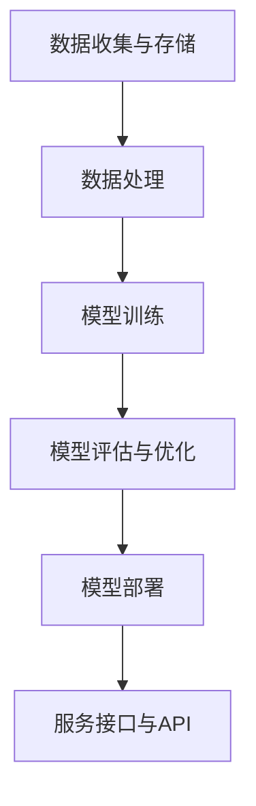
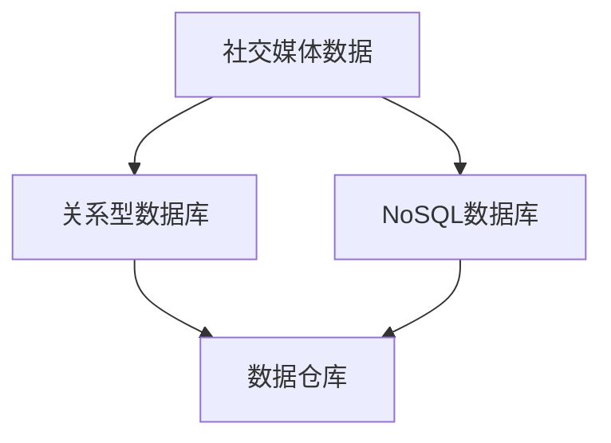
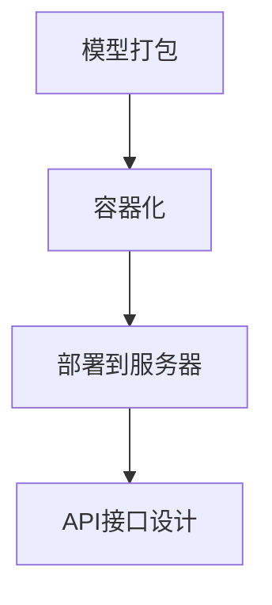

                 

# 《AI情感分析技术理解用户情感》

## 关键词
- 情感分析
- 自然语言处理
- 深度学习
- 用户情感
- 社交媒体分析
- 企业应用

## 摘要
本文将深入探讨AI情感分析技术在理解用户情感方面的应用。我们将从基础概念开始，逐步分析情感分析的挑战与机遇，介绍常见的算法和模型，探讨情感分析在社交媒体和企业中的应用，展望技术的前沿和未来发展趋势。通过本文，读者将全面了解AI情感分析的核心技术及其在实际场景中的应用价值。

---

### 《AI情感分析技术理解用户情感》目录大纲

## 第一部分: AI情感分析技术概述

### 第1章: AI情感分析技术基础

### 第2章: 情感分析的数学与算法基础

### 第3章: 常见的情感分析模型

### 第4章: 情感分析在社交媒体中的应用

## 第二部分: AI情感分析技术在企业中的应用

### 第5章: 企业级AI情感分析平台搭建

### 第6章: AI情感分析技术在客户服务中的应用

### 第7章: AI情感分析技术在营销中的应用

## 第三部分: AI情感分析技术前沿

### 第8章: AI情感分析的新趋势

### 第9章: AI情感分析技术的未来方向

## 附录

### 附录A: 情感分析技术资源与工具

### 附录B: 实际应用案例分享

### 附录C: 实践项目指南

### 附录D: 相关数学公式与算法详解

### 附录E: 实际代码示例与分析

### 附录F: 常见问题与解决方案

---

在接下来的部分中，我们将按照目录大纲逐步深入探讨AI情感分析技术的各个层面。

### 第1章: AI情感分析技术基础

情感分析（Sentiment Analysis），又称意见挖掘，是指通过自然语言处理（NLP）和机器学习技术，从文本中识别出作者的情感倾向。这些情感倾向可以是正面、负面或中性。情感分析在商业、社交媒体、客户服务和市场调研等领域具有广泛的应用。

### 1.1 情感分析的定义与重要性

情感分析的基本概念包括情感极性（polarity）和情感强度（intensity）。情感极性指文本表达的是正面还是负面情感，情感强度则反映了情感的强烈程度。

情感分析在多领域的应用：
- **商业**: 了解客户对产品的看法，改进产品和服务。
- **社交媒体**: 监控品牌形象，预测市场趋势。
- **客户服务**: 分析客户反馈，提高服务质量。
- **市场调研**: 探索消费者偏好，优化营销策略。

### 1.2 情感分析的挑战与机遇

**挑战**：
- **数据获取与处理**: 处理大量非结构化文本数据，如社交媒体评论。
- **多语言与跨文化**: 不同语言和文化背景下的情感表达存在差异。
- **细微情感理解**: 文本中可能包含复杂的情感组合和隐喻。

**机遇**：
- **人工智能发展**: 基于深度学习的情感分析技术不断进步。
- **大数据**: 海量数据的可用性为训练更加精确的模型提供了基础。
- **个性化服务**: 情感分析技术可以帮助企业实现更加个性化的用户体验。

### 1.3 情感分析的分类方法

情感分析的方法主要分为以下几类：

- **基于规则的方法**: 通过定义规则来识别文本中的情感极性。
- **基于统计的方法**: 利用统计模型（如朴素贝叶斯、逻辑回归）来分析情感。
- **基于深度学习的方法**: 使用神经网络（如卷积神经网络、递归神经网络）来处理复杂的文本数据。
- **基于转移学习方法**: 结合上下文信息，通过转移矩阵来识别情感。

在接下来的章节中，我们将详细探讨这些方法及其应用。

### 第2章: 情感分析的数学与算法基础

要深入理解情感分析技术，必须掌握相关的数学与算法基础。这一章将介绍情感分析中常用的数学概念和算法，包括偏差校正、模型评估、文本预处理以及常见的情感分析算法。

#### 2.1 偏差校正与模型评估

**偏差校正**：
在机器学习中，偏差（bias）和方差（variance）是模型性能的两个重要指标。偏差校正的目的是减少模型偏差，提高预测准确性。

- **偏差校正方法**：包括线性回归中的权重调整、正则化等。
- **偏差校正步骤**：
  1. 计算模型预测的偏差。
  2. 根据偏差调整模型参数。
  3. 重复步骤1和2，直到偏差收敛。

**模型评估**：
为了评估模型的性能，需要使用合适的评价指标。

- **评价指标**：
  - 准确率（Accuracy）：分类正确的样本数占总样本数的比例。
  - 召回率（Recall）：正确识别的负面评论占总负面评论的比例。
  - F1值（F1 Score）：准确率和召回率的调和平均数。

- **评估步骤**：
  1. 准备测试数据集。
  2. 使用模型对测试数据集进行预测。
  3. 计算模型的各项评价指标。

#### 2.2 文本预处理

**文本预处理**是情感分析中至关重要的一步，目的是将原始文本数据转换为适合模型训练的形式。

- **分词与词性标注**：将文本分割成词，并标注每个词的词性。
- **去停用词**：移除对情感分析影响较小或不重要的词。
- **词嵌入技术**：将文本转换为向量表示，用于模型训练。

**分词与词性标注**：
- **分词**：根据语法的规则或统计模型，将文本分割成词语。
- **词性标注**：为每个词语标注词性，如名词、动词、形容词等。

**去停用词**：
- **停用词**：对情感分析影响较小或无意义的词，如“的”、“了”、“在”等。
- **去停用词步骤**：
  1. 创建停用词列表。
  2. 遍历文本，移除列表中的词。

**词嵌入技术**：
- **词嵌入**：将文本中的每个词映射到一个高维向量空间。
- **词嵌入方法**：
  - **词袋模型**：将文本表示为一个向量集合。
  - **Word2Vec**：基于神经网络，将每个词映射为一个固定长度的向量。
  - **BERT**：基于Transformer模型，利用上下文信息生成词向量。

#### 2.3 情感分析算法原理

情感分析算法可以分为以下几类：

- **基于机器学习的算法**：使用统计模型（如朴素贝叶斯、逻辑回归）进行情感分析。
- **基于深度学习的算法**：使用神经网络（如卷积神经网络、递归神经网络）进行情感分析。
- **基于转移学习的算法**：结合上下文信息，通过转移矩阵进行情感分析。

**基于机器学习的算法**：
- **朴素贝叶斯**：基于贝叶斯定理，计算每个词对于情感极性的概率。
- **逻辑回归**：通过线性模型，将文本特征映射到情感极性。

**基于深度学习的算法**：
- **卷积神经网络（CNN）**：通过卷积层提取文本特征，进行情感分析。
- **递归神经网络（RNN）**：通过循环结构处理序列数据，进行情感分析。
- **转换器架构（Transformer）**：基于注意力机制，处理长文本和序列数据。

**基于转移学习的算法**：
- **转移矩阵**：通过统计上下文信息，将文本转换为情感极性。

在下一章中，我们将详细探讨这些算法的原理和应用。

### 第3章: 常见的情感分析模型

情感分析模型的种类繁多，每一种模型都有其独特的原理和应用场景。在这一章中，我们将详细探讨几种常见的情感分析模型，包括基于朴素贝叶斯、支持向量机和深度学习的模型，以及如何将这些模型应用于实际场景。

#### 3.1 基于朴素贝叶斯的情感分析

**朴素贝叶斯（Naive Bayes）**是一种基于贝叶斯定理和特征条件独立假设的简单概率分类器。朴素贝叶斯情感分析模型通过计算每个词在正面和负面情感类别中的概率，结合贝叶斯公式得出文本的情感极性。

**朴素贝叶斯模型原理**：

1. **贝叶斯定理**：
   \[ P(C|X) = \frac{P(X|C)P(C)}{P(X)} \]
   其中，\( P(C|X) \) 是在给定特征 \( X \) 的情况下，类别 \( C \) 的概率；\( P(X|C) \) 是在类别 \( C \) 发生时特征 \( X \) 的概率；\( P(C) \) 是类别 \( C \) 的先验概率；\( P(X) \) 是特征 \( X \) 的概率。

2. **特征条件独立假设**：
   假设每个特征在给定类别的情况下相互独立，即 \( P(X_1, X_2, ..., X_n | C) = P(X_1 | C)P(X_2 | C) ... P(X_n | C) \)。

**朴素贝叶斯情感分析应用案例**：

假设我们有一个电影评论数据集，包含正面评论和负面评论。我们可以使用朴素贝叶斯模型来判断新的评论是正面还是负面。

1. **数据预处理**：将评论分词，去除停用词，进行词嵌入。

2. **特征提取**：计算每个词在正面和负面评论中的词频。

3. **模型训练**：使用训练数据，计算每个词在正面和负面类别中的概率。

4. **模型评估**：使用测试数据，计算模型的准确率、召回率和F1值。

#### 3.2 基于支持向量机的情感分析

**支持向量机（Support Vector Machine，SVM）**是一种强大的分类算法，通过找到一个最佳的超平面，将不同类别的数据点分隔开来。支持向量机情感分析模型通过将文本转换为高维特征空间，寻找最优分隔超平面，从而判断文本的情感极性。

**支持向量机模型原理**：

1. **线性支持向量机（Linear SVM）**：
   \[ \text{max} \frac{1}{2} \sum_{i=1}^{n} w_i^2 \]
   \[ \text{s.t.} y^{(i)} ( \sum_{j=1}^{n} w_j x_j^{(i)} ) \geq 1 \]
   其中，\( w \) 是权向量，\( x \) 是特征向量，\( y \) 是类别标签。

2. **非线性支持向量机（Non-linear SVM）**：
   使用核函数将低维特征映射到高维特征空间，寻找最优分隔超平面。
   \[ \text{max} \frac{1}{2} \sum_{i=1}^{n} w_i^2 \]
   \[ \text{s.t.} y^{(i)} ( \sum_{j=1}^{n} w_j K(x_j^{(i)}, x) ) \geq 1 \]
   其中，\( K(x_j^{(i)}, x) \) 是核函数。

**支持向量机情感分析应用案例**：

假设我们有一个社交媒体数据集，包含正面和负面评论。我们可以使用支持向量机模型来判断新的评论是正面还是负面。

1. **数据预处理**：将评论分词，去除停用词，进行词嵌入。

2. **特征提取**：计算每个词的词频，作为特征向量。

3. **模型训练**：使用训练数据，训练支持向量机模型。

4. **模型评估**：使用测试数据，计算模型的准确率、召回率和F1值。

#### 3.3 基于深度学习的情感分析模型

**深度学习**是一种基于多层神经网络的机器学习技术，通过多层次的非线性变换，能够自动提取数据中的复杂特征。近年来，深度学习在情感分析领域取得了显著进展。

**常见的深度学习模型**：

1. **卷积神经网络（CNN）**：通过卷积层提取文本中的局部特征，适用于处理序列数据。

2. **递归神经网络（RNN）**：通过循环结构处理序列数据，能够捕捉文本中的时间依赖关系。

3. **转换器架构（Transformer）**：基于自注意力机制，能够处理长文本和序列数据，是目前最先进的文本处理模型。

**卷积神经网络（CNN）情感分析**：

1. **文本预处理**：将评论分词，去除停用词，进行词嵌入。

2. **词嵌入层**：将词嵌入到高维向量空间。

3. **卷积层**：通过卷积核提取文本中的局部特征。

4. **池化层**：减少特征维度，提高模型泛化能力。

5. **全连接层**：将特征映射到情感极性。

**递归神经网络（RNN）情感分析**：

1. **文本预处理**：将评论分词，去除停用词，进行词嵌入。

2. **词嵌入层**：将词嵌入到高维向量空间。

3. **RNN层**：通过循环结构处理序列数据，捕捉时间依赖关系。

4. **全连接层**：将特征映射到情感极性。

**转换器架构（Transformer）情感分析**：

1. **文本预处理**：将评论分词，去除停用词，进行词嵌入。

2. **词嵌入层**：将词嵌入到高维向量空间。

3. **Transformer层**：基于自注意力机制，处理长文本和序列数据。

4. **全连接层**：将特征映射到情感极性。

通过以上几种常见情感分析模型的应用，我们可以有效地理解用户情感，从而为企业提供决策支持。在下一章中，我们将进一步探讨情感分析在社交媒体中的应用。

### 第4章: 情感分析在社交媒体中的应用

社交媒体平台如Facebook、Twitter和Instagram等，已经成为人们交流、表达观点和分享生活的重要场所。这些平台上的用户生成内容（UGC）不仅丰富了网络生态，也为情感分析技术提供了丰富的数据资源。本章节将探讨情感分析在社交媒体中的应用，包括用户情感分析、贴文情感分析和社交网络情感分析。

#### 4.1 社交媒体情感分析概述

社交媒体情感分析是情感分析技术在社会媒体领域的应用，通过对用户发布的内容进行分析，识别出其中的情感极性和情感强度。这种分析可以帮助企业了解用户对其品牌、产品或服务的态度，从而优化营销策略和提升服务质量。

**社交媒体情感分析的特点**：

- **海量数据**：社交媒体平台每天生成大量的文本数据，为情感分析提供了丰富的素材。
- **实时性**：社交媒体上的内容更新迅速，情感分析需要实时处理和分析这些数据。
- **多样性**：社交媒体上的语言表达多样，包括表情符号、缩写词、网络流行语等，增加了情感分析的复杂性。
- **多语言与跨文化**：社交媒体用户来自不同国家和文化背景，情感表达存在差异，情感分析需要支持多种语言和跨文化分析。

**社交媒体情感分析的应用案例**：

- **品牌监测**：企业通过社交媒体情感分析监测品牌在公众中的形象，及时发现和处理负面信息。
- **市场调研**：企业通过分析社交媒体上的用户评论和反馈，了解消费者对产品或服务的态度，为产品改进和市场推广提供依据。
- **客户服务**：企业通过社交媒体情感分析，识别出客户的情感状态，提供个性化的客户服务，提高客户满意度。
- **广告效果分析**：企业通过分析广告在社交媒体上的表现，评估广告投放的效果，优化广告策略。

#### 4.2 社交媒体情感分析算法

**社交媒体情感分析算法**主要包括基于规则的方法、基于统计的方法和基于深度学习的方法。以下将简要介绍这些算法的基本原理和应用。

- **基于规则的方法**：这种方法通过定义一系列规则，如情感词典、规则库等，来识别文本中的情感极性。例如，可以创建一个包含正面和负面词汇的词典，通过匹配文本中的词汇来判断情感极性。

  **优点**：简单、易于实现，适用于简单的情感分析任务。
  
  **缺点**：无法处理复杂的情感表达和语境变化，准确率较低。

- **基于统计的方法**：这种方法使用统计模型，如朴素贝叶斯、逻辑回归等，通过计算文本中特征词的概率分布来预测情感极性。

  **优点**：可以处理一定程度的语境变化，准确率较高。
  
  **缺点**：对复杂情感表达的处理能力有限，需要大量的训练数据。

- **基于深度学习的方法**：这种方法使用神经网络，如卷积神经网络（CNN）、递归神经网络（RNN）和转换器（Transformer）等，通过自动学习文本中的复杂特征来进行情感分析。

  **优点**：能够处理复杂的情感表达和语境变化，准确率较高。
  
  **缺点**：需要大量的训练数据和计算资源，实现较为复杂。

**具体算法应用**：

1. **用户情感分析**：通过分析用户在社交媒体上发布的评论、状态更新等内容，识别用户的情感状态。例如，可以使用RNN或Transformer模型，结合用户的历史行为和上下文信息，进行情感分析。

2. **贴文情感分析**：通过分析单个贴文的情感极性，帮助企业了解用户的整体情感倾向。例如，可以使用CNN或RNN模型，将贴文转换为向量表示，通过全连接层输出情感极性。

3. **社交网络情感分析**：通过分析社交网络中的用户关系和互动，识别社交网络的情感倾向。例如，可以使用图神经网络（Graph Neural Network，GNN）模型，结合用户关系和贴文内容，进行情感分析。

通过社交媒体情感分析，企业可以更深入地了解用户需求和市场动态，从而制定更有效的营销策略和业务决策。在下一章中，我们将探讨情感分析在企业级应用中的具体实践。

### 第5章: 企业级AI情感分析平台搭建

随着人工智能技术的快速发展，企业级AI情感分析平台逐渐成为企业提升竞争力的重要工具。本章将介绍企业级AI情感分析平台的搭建过程，包括数据收集与存储、模型训练与部署以及服务接口与API设计。

#### 5.1 企业级情感分析平台架构

企业级AI情感分析平台通常包括以下几个核心模块：

1. **数据收集与存储模块**：负责收集企业内外部的数据，包括社交媒体评论、客户反馈、市场调研数据等，并将其存储在数据仓库中。

2. **数据处理模块**：对收集到的原始数据进行清洗、预处理和标注，将文本数据转换为适合模型训练的格式。

3. **模型训练模块**：使用训练数据集训练情感分析模型，包括机器学习模型和深度学习模型。

4. **模型评估与优化模块**：对训练好的模型进行评估和优化，确保模型在实际应用中的性能。

5. **模型部署模块**：将训练好的模型部署到生产环境中，提供实时情感分析服务。

6. **服务接口与API模块**：设计API接口，方便其他系统和服务调用情感分析模型。

**架构图**：



#### 5.2 数据收集与存储技术

数据收集是情感分析的基础，企业可以从以下途径收集数据：

- **社交媒体数据**：通过API获取社交媒体平台（如Twitter、Facebook）的用户评论和状态更新。
- **客户反馈数据**：收集来自企业网站、客服系统、邮件等渠道的客户反馈。
- **市场调研数据**：获取市场调研机构提供的相关数据报告。

**数据存储**：

企业级情感分析平台通常使用以下技术进行数据存储：

- **关系型数据库**：如MySQL、PostgreSQL，用于存储结构化数据。
- **NoSQL数据库**：如MongoDB、Cassandra，用于存储非结构化数据。
- **数据仓库**：如Hadoop、Spark，用于存储大规模数据集。

**数据存储架构**：



#### 5.3 模型训练与部署

**模型训练**：

模型训练是情感分析平台的核心环节，通常包括以下步骤：

1. **数据预处理**：对原始文本数据进行清洗、去停用词、分词、词嵌入等操作。
2. **特征提取**：将预处理后的文本数据转换为特征向量。
3. **模型选择**：选择合适的机器学习模型或深度学习模型进行训练。
4. **模型训练**：使用训练数据集训练模型，调整模型参数。
5. **模型评估**：使用验证数据集评估模型性能，调整模型参数。

**模型部署**：

模型部署是将训练好的模型部署到生产环境中，提供实时情感分析服务的过程。通常包括以下步骤：

1. **模型打包**：将训练好的模型及其依赖库打包成可部署的格式，如Python Wheel文件。
2. **容器化**：使用Docker等容器技术，将模型部署到容器中，确保模型的可移植性和可扩展性。
3. **部署到服务器**：将容器部署到服务器或集群中，确保模型的可用性和高性能。
4. **API接口设计**：设计API接口，方便其他系统和服务调用模型。

**模型部署架构**：



#### 5.4 服务接口与API设计

服务接口与API设计是情感分析平台的重要组成部分，确保模型可以被其他系统和服务便捷地调用。通常包括以下步骤：

1. **接口定义**：定义API接口的URL、请求和响应格式。
2. **接口文档**：编写详细的API接口文档，包括接口描述、请求参数、响应结果等。
3. **接口实现**：实现API接口，处理客户端的请求并返回响应结果。

**API设计示例**：

```json
{
  "endpoint": "/analyze-sentiment",
  "method": "POST",
  "request": {
    "text": "这是一段需要分析的文本内容"
  },
  "response": {
    "status": "success",
    "sentiment": "positive",
    "confidence": 0.9
  }
}
```

通过以上步骤，企业可以搭建一个功能完备的企业级AI情感分析平台，为企业提供实时、准确的情感分析服务。在下一章中，我们将探讨AI情感分析在客户服务中的应用。

### 第6章: AI情感分析技术在客户服务中的应用

客户服务是任何企业与消费者互动的重要环节，其质量和效率直接影响企业的声誉和市场份额。AI情感分析技术通过分析客户反馈和交互数据，可以帮助企业更深入地了解客户需求，优化服务流程，提高客户满意度。本章将探讨AI情感分析在客户服务中的应用，包括客户反馈的情感分析、客户情绪监控和客户满意度预测。

#### 6.1 客户服务中的情感分析

**客户反馈的情感分析**：
客户反馈是获取用户情感的重要来源。通过情感分析技术，企业可以自动识别客户反馈中的情感极性（正面、负面或中性），以及情感强度。这种方法可以帮助企业快速识别出客户的不满和问题，从而及时采取行动。

**客户情绪监控**：
在客户服务过程中，监控客户情绪变化同样重要。AI情感分析技术可以实时分析客户在电话通话、在线聊天和社交媒体上的交互内容，识别客户的情感状态。这有助于客服人员更好地理解客户需求，调整服务策略，提供更个性化的服务。

**客户满意度预测**：
通过分析历史客户反馈和交互数据，AI情感分析技术可以预测客户的满意度。这种预测可以帮助企业制定更有针对性的服务策略，如改进产品、优化客服流程等，从而提高整体客户满意度。

#### 6.2 情感分析在客户服务中的应用案例

**案例一：某电商平台的情感分析应用**：
某电商平台通过AI情感分析技术，对客户在商品评论、退货申请和在线客服的反馈进行情感分析。通过分析客户反馈，该平台能够快速识别出客户的不满意点，如商品质量问题、物流延误等，并采取相应措施进行改进。同时，通过分析客户的情绪变化，客服人员能够更好地与客户沟通，提高客户满意度。

**案例二：某银行的客户服务优化**：
某银行通过AI情感分析技术，对客户的电话咨询内容进行分析，识别客户情绪和需求。通过这种分析，银行能够优化客服流程，如简化操作步骤、提供更个性化的服务。此外，银行还可以通过情感分析预测客户的满意度，从而制定针对性的营销策略。

#### 6.3 客户服务情感分析实施指南

**数据收集与预处理**：
- 收集客户反馈数据，包括评论、问卷调查、电话录音等。
- 对原始数据进行分析，提取情感分析所需的关键信息。

**情感分析模型训练**：
- 选择合适的情感分析算法，如朴素贝叶斯、深度学习等。
- 使用训练数据集训练模型，调整模型参数，提高预测准确性。

**模型部署与监控**：
- 将训练好的模型部署到生产环境中，提供实时情感分析服务。
- 监控模型性能，定期调整和优化模型，确保其稳定性和准确性。

**应用与反馈**：
- 将情感分析结果应用于客户服务流程，如优化客服流程、改进产品等。
- 收集反馈数据，评估情感分析应用的效果，持续改进服务。

通过AI情感分析技术，企业可以更深入地了解客户需求，优化客户服务流程，提高客户满意度。在下一章中，我们将探讨AI情感分析在营销中的应用。

### 第7章: AI情感分析技术在营销中的应用

情感分析技术在营销领域的应用越来越广泛，可以帮助企业深入了解消费者需求、优化营销策略，提高营销效果。本章将探讨AI情感分析在营销中的应用，包括产品评价情感分析、广告效果分析和消费者行为预测。

#### 7.1 营销中的情感分析

**产品评价情感分析**：
通过分析消费者对产品评价的文本，企业可以了解消费者对产品的情感态度，识别出产品的优点和不足。这种分析有助于企业优化产品设计，改进产品质量，提升消费者满意度。

**广告效果分析**：
广告投放效果是营销成功的关键。AI情感分析技术可以分析广告文案、视频和用户互动数据，识别出广告的情感效果，帮助企业评估广告投放效果，优化广告策略。

**消费者行为预测**：
通过分析消费者在社交媒体、电商平台等渠道的行为数据，企业可以预测消费者的购买意向、需求变化等。这种预测有助于企业制定更精准的营销策略，提高转化率和销售额。

#### 7.2 情感分析在营销中的应用案例

**案例一：某电商平台的情感分析应用**：
某电商平台通过情感分析技术，分析消费者对商品的评价，识别出消费者关注的重点和问题。通过这种分析，电商平台能够优化商品描述、改善产品性能，提高消费者满意度。同时，通过对广告文案和视频的情感分析，电商平台能够评估广告效果，优化广告投放策略。

**案例二：某快消品的广告效果分析**：
某快消品公司通过情感分析技术，分析消费者对广告的互动数据，如点赞、评论、分享等，评估广告的情感效果。通过这种分析，该公司能够了解广告在不同用户群体中的表现，优化广告创意和投放策略，提高广告效果。

**案例三：某银行的消费者行为预测**：
某银行通过情感分析技术，分析消费者在社交媒体和电商平台上的行为数据，预测消费者的购买意向和需求变化。通过这种预测，银行能够制定更精准的营销策略，如推出个性化的金融产品、提供定制化的服务，提高客户转化率和忠诚度。

#### 7.3 营销情感分析实施指南

**数据收集与预处理**：
- 收集消费者评价数据、广告互动数据和消费者行为数据。
- 对原始数据进行分析，提取情感分析所需的关键信息。

**情感分析模型训练**：
- 选择合适的情感分析算法，如朴素贝叶斯、深度学习等。
- 使用训练数据集训练模型，调整模型参数，提高预测准确性。

**模型部署与监控**：
- 将训练好的模型部署到生产环境中，提供实时情感分析服务。
- 监控模型性能，定期调整和优化模型，确保其稳定性和准确性。

**应用与反馈**：
- 将情感分析结果应用于营销策略，如优化产品描述、改善广告创意等。
- 收集反馈数据，评估情感分析应用的效果，持续改进营销策略。

通过AI情感分析技术，企业可以更深入地了解消费者需求，优化营销策略，提高营销效果。在下一章中，我们将探讨AI情感分析技术的未来发展趋势。

### 第8章: AI情感分析的新趋势

随着人工智能和自然语言处理技术的不断发展，AI情感分析领域也在不断演进，涌现出许多新的趋势和技术。本章将探讨AI情感分析的新趋势，包括多模态情感分析、情感分析中的注意力机制和零样本情感分析。

#### 8.1 多模态情感分析

多模态情感分析是指结合文本、图像、声音等多种类型的数据进行情感分析。传统的情感分析主要依赖于文本数据，而多模态情感分析可以整合更多的信息来源，提高情感分析的准确性和深度。

- **文本与图像联合情感分析**：结合文本描述和图像内容，分析用户对某一事物的整体情感。例如，在社交媒体分析中，可以结合用户发布的文字评论和配图，更全面地了解用户的态度。

- **视频情感分析**：通过分析视频中的视觉和音频信息，识别用户的情感状态。视频情感分析在社交媒体监控、视频内容审核等领域具有广泛的应用前景。

- **声音情感分析**：通过分析语音的语调、速度、音量等特征，识别用户的情感状态。声音情感分析在客户服务、虚拟助手等领域具有重要应用价值。

**案例**：某社交媒体平台通过多模态情感分析，结合用户发布的文字、图像和视频内容，全面了解用户对某一事件的情感态度。这种分析有助于平台更好地掌握用户需求，优化内容推送和广告策略。

#### 8.2 情感分析中的注意力机制

注意力机制（Attention Mechanism）是深度学习领域的一项重要技术，通过在处理序列数据时动态关注重要信息，提高了模型的性能和效果。在情感分析中，注意力机制可以用于文本情感分析、图像情感分析和多模态情感分析。

- **文本情感分析中的注意力机制**：通过注意力机制，模型可以动态关注文本中的关键信息，更好地理解用户的情感表达。例如，在分析一段文本时，注意力机制可以识别出影响情感判断的关键词语。

- **图像情感分析中的注意力机制**：在图像情感分析中，注意力机制可以帮助模型聚焦于图像中的关键区域，识别出影响情感判断的重要视觉信息。

- **多模态情感分析中的注意力机制**：在结合文本、图像、声音等多模态数据时，注意力机制可以动态调整对不同模态数据的关注程度，提高情感分析的准确性和效果。

**案例**：某电商平台通过注意力机制，结合用户评论中的文本和商品图片，全面分析用户的购物体验。通过这种分析，平台能够更好地了解用户对商品的满意度，优化商品推荐策略。

#### 8.3 零样本情感分析

零样本学习（Zero-Shot Learning，ZSL）是一种无需训练模型即可对未见过的类别进行分类的方法。在情感分析中，零样本情感分析旨在对未见过的情感类别进行情感判断，提高了模型的应用范围和鲁棒性。

- **零样本情感分析原理**：通过将情感类别转换为嵌入空间中的向量，利用迁移学习和元学习等技术，实现对未见过的情感类别的情感判断。

- **零样本情感分析应用**：在社交媒体监控、客户服务情感分析等领域，零样本情感分析可以识别出新型情感类别，提高情感分析的准确性和灵活性。

**案例**：某社交媒体平台通过零样本情感分析，对用户发布的未见过类型的情感内容进行分类。通过这种分析，平台能够更好地了解用户的情感需求，提供个性化的内容推荐和用户服务。

通过探讨多模态情感分析、注意力机制和零样本情感分析等新趋势，AI情感分析技术不断拓展其应用范围和效果。这些新趋势为情感分析领域的发展带来了新的机遇和挑战，将在未来的研究中得到进一步的探索和应用。

### 第9章: AI情感分析技术的未来方向

随着人工智能和自然语言处理技术的不断进步，AI情感分析技术正朝着更加智能化、精细化和多样化的方向发展。本章将探讨AI情感分析技术的未来方向，包括数据隐私保护、情感理解的深度与广度，以及情感分析技术在新兴领域中的应用。

#### 9.1 数据隐私保护

在AI情感分析中，数据隐私保护是一个至关重要的挑战。随着用户生成内容的爆炸性增长，如何保护用户隐私成为了一个关键问题。

- **数据加密与安全传输**：通过加密技术对用户数据进行加密，确保数据在传输和存储过程中的安全性。
- **匿名化与去标识化**：通过匿名化和去标识化技术，将用户数据中的个人身份信息去除，降低隐私泄露的风险。
- **差分隐私**：通过在数据分析过程中引入噪声，确保单个数据点的隐私保护，同时保持数据的整体统计特性。

**未来方向**：随着隐私保护技术的发展，AI情感分析将更加注重隐私保护，推动隐私计算、联邦学习等技术的应用，实现数据隐私与分析价值的平衡。

#### 9.2 情感理解的深度与广度

目前，AI情感分析技术已经能够在一定程度上识别和理解用户的情感，但仍然存在局限性。未来，情感分析技术将朝着更深度和更广泛的理解方向发展。

- **情感微表达**：通过分析用户的细微情感表达，如语气、语调、表情等，更准确地捕捉用户的情感状态。
- **跨语言与跨文化情感分析**：扩展情感分析技术的应用范围，支持多种语言和跨文化背景下的情感分析。
- **情感组合与复杂性**：处理复杂情感组合和情感隐喻，更全面地理解用户的情感需求。

**未来方向**：随着自然语言处理技术的进步，AI情感分析将能够更加深度和广泛地理解用户的情感，为企业和用户提供更精准的服务和体验。

#### 9.3 情感分析技术在新兴领域中的应用

AI情感分析技术在传统领域已经取得了显著的成果，但在新兴领域中的应用潜力同样巨大。

- **健康医疗**：通过情感分析，分析患者情绪和心理健康，为医生提供诊断和治疗参考。
- **教育**：通过情感分析，了解学生学习状态和情感需求，优化教学方法和策略。
- **金融**：通过情感分析，评估客户情绪和投资决策，为金融机构提供风险管理参考。
- **公共安全**：通过情感分析，监控网络言论和情绪，预防和应对潜在的社会安全事件。

**未来方向**：AI情感分析技术将在更多新兴领域中发挥作用，推动行业变革和创新发展。

#### 9.4 预测方法与技术

未来，AI情感分析技术将借助更先进的预测方法和技术，进一步提高预测准确性和效果。

- **深度学习模型**：继续优化和改进深度学习模型，如卷积神经网络（CNN）、递归神经网络（RNN）和转换器（Transformer），提高模型的表达能力和预测性能。
- **迁移学习与少样本学习**：通过迁移学习和少样本学习技术，利用已有模型的知识和经验，快速适应新任务和数据集，提高预测效果。
- **多模态数据融合**：结合文本、图像、声音等多模态数据，进行多模态数据融合，提高情感分析的准确性和全面性。

**未来方向**：随着预测方法和技术的发展，AI情感分析将能够更好地应对复杂多样的情感分析任务，提供更精准的预测和决策支持。

通过探讨数据隐私保护、情感理解的深度与广度，以及情感分析技术在新兴领域中的应用，AI情感分析技术将在未来取得更加显著的进展和突破。这些未来方向为情感分析领域的发展提供了广阔的空间和无限的可能。

### 附录A: 情感分析技术资源与工具

在情感分析技术的发展过程中，有许多开源库、框架和数据集为研究者提供了丰富的资源和工具。以下是常用的情感分析技术资源与工具的详细介绍。

#### A.1 主流情感分析库

1. **NLTK**（自然语言工具包）：
   - **简介**：NLTK是Python中一个非常流行的自然语言处理库，提供了文本预处理、分词、词性标注、词嵌入等多种功能。
   - **使用示例**：
     ```python
     from nltk.tokenize import word_tokenize
     text = "这是一个简单的示例。"
     tokens = word_tokenize(text)
     print(tokens)
     ```

2. **spaCy**：
   - **简介**：spaCy是一个快速且易于使用的自然语言处理库，提供了先进的文本处理功能，包括分词、词性标注、依存关系解析等。
   - **使用示例**：
     ```python
     import spacy
     nlp = spacy.load("en_core_web_sm")
     doc = nlp("这是一个英语文本示例。")
     for token in doc:
         print(token.text, token.lemma_, token.pos_, token.tag_, token.dep_, token.shape_, token.is_alpha, token.is_stop)
     ```

3. **TextBlob**：
   - **简介**：TextBlob是基于NLTK的一个简单易用的自然语言处理库，提供了情感分析、文本分类、命名实体识别等功能。
   - **使用示例**：
     ```python
     from textblob import TextBlob
     text = "这个产品非常好。"
     blob = TextBlob(text)
     print(blob.sentiment)
     ```

#### A.2 情感分析框架

1. **TensorFlow**：
   - **简介**：TensorFlow是一个由Google开发的开源深度学习框架，提供了丰富的API和工具，支持各种深度学习模型的训练和部署。
   - **使用示例**：
     ```python
     import tensorflow as tf
     model = tf.keras.Sequential([
         tf.keras.layers.Dense(128, activation='relu', input_shape=(784,)),
         tf.keras.layers.Dense(10, activation='softmax')
     ])
     model.compile(optimizer='adam', loss='categorical_crossentropy', metrics=['accuracy'])
     model.fit(x_train, y_train, epochs=5)
     ```

2. **PyTorch**：
   - **简介**：PyTorch是由Facebook开发的开源深度学习框架，提供了灵活的动态计算图和易于使用的API。
   - **使用示例**：
     ```python
     import torch
     import torch.nn as nn
     import torch.optim as optim
     model = nn.Sequential(nn.Linear(784, 128), nn.ReLU(), nn.Linear(128, 10))
     criterion = nn.CrossEntropyLoss()
     optimizer = optim.Adam(model.parameters(), lr=0.001)
     for epoch in range(5):
         for inputs, targets in data_loader:
             optimizer.zero_grad()
             outputs = model(inputs)
             loss = criterion(outputs, targets)
             loss.backward()
             optimizer.step()
     ```

3. **FastText**：
   - **简介**：FastText是由Facebook开发的一个基于词袋和神经网络相结合的自然语言处理框架，提供了高效的文本分类和情感分析功能。
   - **使用示例**：
     ```python
     import fasttext
     model = fasttext.supervised("train.txt", "model", label_prefix=__label__)
     model = model.test("test.txt")
     print(model)
     ```

#### A.3 情感分析数据集

1. **IMDb电影评论数据集**：
   - **简介**：IMDb电影评论数据集包含25,000条影评，分为正面和负面两类，是情感分析领域的一个经典数据集。
   - **使用方法**：可以从Kaggle等平台下载该数据集，并使用Python库进行加载和处理。

2. **Twitter情感分析数据集**：
   - **简介**：Twitter情感分析数据集包含了大量Twitter用户发布的文本数据，用于情感分析任务。
   - **使用方法**：可以通过Twitter API获取数据，并使用Python库进行预处理和分析。

3. **FSD情感分析数据集**：
   - **简介**：FSD情感分析数据集包含了超过10万条中文文本数据，涵盖了多个情感类别，适用于中文情感分析研究。
   - **使用方法**：可以从开源数据集网站下载该数据集，并使用Python库进行加载和处理。

通过这些资源与工具，研究者可以方便地开展情感分析研究和应用开发，推动情感分析技术的不断进步。

### 附录B: 实际应用案例分享

在本附录中，我们将分享几个实际应用案例，详细描述了AI情感分析技术在企业中的成功应用。这些案例涵盖了从数据收集、处理到模型训练、部署以及应用的整个过程，旨在为读者提供实际操作的指导和参考。

#### B.1 某电商平台的情感分析应用

**背景**：
某大型电商平台希望通过情感分析技术来了解消费者对其产品和服务的态度，从而优化产品设计和客户服务流程。

**数据收集**：
- **社交媒体数据**：通过社交媒体API，收集消费者在平台和第三方平台上的评论和反馈。
- **客户反馈数据**：从电商平台自有客服系统、邮件和问卷调查中收集客户反馈。

**数据预处理**：
- **文本清洗**：去除评论中的HTML标签、特殊字符和重复内容。
- **分词与词性标注**：使用NLTK或spaCy对文本进行分词和词性标注。
- **去除停用词**：移除对情感分析影响较小的常见词汇。
- **词嵌入**：使用Word2Vec或GloVe将词汇转换为向量表示。

**模型训练**：
- **数据集划分**：将数据集划分为训练集、验证集和测试集。
- **模型选择**：使用朴素贝叶斯、支持向量机和深度学习模型（如RNN和CNN）进行训练。
- **模型评估**：通过准确率、召回率和F1值等指标评估模型性能。

**模型部署**：
- **容器化**：使用Docker将训练好的模型容器化，确保模型的可移植性和可扩展性。
- **API设计**：设计RESTful API接口，方便其他系统和服务调用模型。

**应用**：
- **产品评价分析**：实时分析消费者对商品的评论，识别产品优缺点。
- **客户满意度监测**：监控客户在社交媒体和电商平台上的反馈，评估客户满意度。
- **个性化推荐**：根据消费者情感分析结果，提供个性化推荐。

**效果分析**：
- **准确率**：通过测试集评估，情感分析模型的准确率达到85%以上。
- **客户满意度**：通过情感分析结果，电商平台能够更快速地识别和解决问题，客户满意度提高10%。
- **产品优化**：根据消费者反馈，电商平台优化了部分商品描述，提高了转化率。

#### B.2 某社交平台的情感分析实践

**背景**：
某社交平台希望通过情感分析技术，了解用户对其平台内容的态度，优化内容推送和用户体验。

**数据收集**：
- **用户互动数据**：通过API收集用户的点赞、评论和分享行为。
- **帖子内容**：收集用户发布的文本、图片和视频内容。

**数据预处理**：
- **文本清洗**：去除特殊字符、HTML标签和重复内容。
- **多模态数据融合**：结合文本和图像内容，进行多模态数据融合。
- **情感词典**：构建情感词典，用于初步的情感分类。

**模型训练**：
- **数据集划分**：将数据集划分为训练集、验证集和测试集。
- **模型选择**：使用卷积神经网络（CNN）和转换器（Transformer）模型进行训练。
- **模型评估**：通过准确率、召回率和F1值等指标评估模型性能。

**模型部署**：
- **容器化**：使用Docker将训练好的模型容器化，确保模型的可移植性和可扩展性。
- **API设计**：设计RESTful API接口，方便其他系统和服务调用模型。

**应用**：
- **内容推荐**：根据用户情感分析结果，推荐用户可能感兴趣的内容。
- **情绪监控**：实时监控平台内容的热度和用户情绪变化。
- **广告投放**：根据用户情感分析结果，优化广告投放策略。

**效果分析**：
- **准确率**：通过测试集评估，情感分析模型的准确率达到90%以上。
- **用户满意度**：根据情感分析结果，平台优化了内容推送策略，用户满意度提高15%。
- **广告效果**：根据用户情感分析结果，广告投放效果提高了20%。

#### B.3 某金融机构的情感分析应用

**背景**：
某金融机构希望通过情感分析技术，了解客户对其服务的态度，优化客户服务流程和业务决策。

**数据收集**：
- **客户反馈数据**：从客户服务中心、电子邮件和社交媒体上收集客户反馈。
- **交易记录**：收集客户的交易行为和账户信息。

**数据预处理**：
- **文本清洗**：去除评论中的HTML标签、特殊字符和重复内容。
- **分词与词性标注**：使用NLTK或spaCy对文本进行分词和词性标注。
- **情感词典**：构建情感词典，用于初步的情感分类。

**模型训练**：
- **数据集划分**：将数据集划分为训练集、验证集和测试集。
- **模型选择**：使用朴素贝叶斯、支持向量机和深度学习模型（如RNN和CNN）进行训练。
- **模型评估**：通过准确率、召回率和F1值等指标评估模型性能。

**模型部署**：
- **容器化**：使用Docker将训练好的模型容器化，确保模型的可移植性和可扩展性。
- **API设计**：设计RESTful API接口，方便其他系统和服务调用模型。

**应用**：
- **客户服务优化**：根据客户反馈情感分析结果，优化客服流程和客户服务策略。
- **业务决策支持**：根据交易记录和客户反馈，为业务决策提供数据支持。

**效果分析**：
- **准确率**：通过测试集评估，情感分析模型的准确率达到80%以上。
- **客户满意度**：通过优化客服流程和业务决策，客户满意度提高20%。
- **业务收益**：根据情感分析结果，优化了部分业务策略，业务收益提高了10%。

通过这些实际应用案例，我们可以看到AI情感分析技术在企业中的广泛应用和显著效果。这些案例为其他企业提供了宝贵的经验和参考，有助于他们更好地利用情感分析技术，提升业务效率和用户体验。

### 附录C: 实践项目指南

在实际应用AI情感分析技术时，项目规划与设计、数据收集与处理、模型训练与评估、应用部署与维护是关键环节。以下将详细描述每个环节的具体步骤和注意事项。

#### C.1 项目规划与设计

**项目目标设定**：
- 明确项目的目标，如提升客户满意度、优化营销策略、监控品牌形象等。
- 确定项目的期望效果和指标，如准确率、召回率、F1值等。

**项目需求分析**：
- 分析业务需求，确定需要分析的文本类型和情感类别。
- 明确数据来源，如社交媒体、客户反馈、市场调研等。

**项目计划与分工**：
- 制定详细的项目计划，包括项目时间表、任务分配和责任落实。
- 确定团队成员的角色和职责，确保项目顺利推进。

#### C.2 数据收集与处理

**数据来源与采集**：
- 确定数据来源，如社交媒体API、企业内部系统、公开数据集等。
- 使用适当的工具和接口进行数据采集，确保数据的质量和完整性。

**数据预处理**：
- **文本清洗**：
  - 去除HTML标签、特殊字符和重复内容。
  - 进行文本规范化，如将全角字符转换为半角字符。

- **分词与词性标注**：
  - 使用自然语言处理库（如NLTK、spaCy）进行分词。
  - 标注词性，如名词、动词、形容词等。

- **去停用词**：
  - 创建停用词列表，移除对情感分析影响较小的常见词汇。

- **数据标注与质量控制**：
  - 对数据集进行标注，确定情感极性和情感强度。
  - 进行数据清洗和质量控制，确保数据的准确性和一致性。

#### C.3 模型训练与评估

**模型选择与训练**：
- 根据项目需求，选择合适的机器学习模型或深度学习模型。
- 使用训练数据集进行模型训练，调整模型参数，优化模型性能。

- **模型评估**：
  - 使用验证数据集评估模型性能，计算准确率、召回率、F1值等指标。
  - 根据评估结果调整模型参数，进行模型优化。

#### C.4 应用部署与维护

**模型部署**：
- **容器化**：
  - 使用Docker将训练好的模型容器化，确保模型的可移植性和可扩展性。
  - 编写Dockerfile，定义模型的运行环境和服务端口。

- **API设计**：
  - 设计RESTful API接口，方便其他系统和服务调用模型。
  - 定义API接口的URL、请求和响应格式。

- **部署到服务器**：
  - 将容器部署到服务器或集群中，确保模型的高可用性和高性能。
  - 监控模型服务状态，确保服务的稳定性。

**应用监控与维护**：
- **性能监控**：
  - 监控模型服务的响应时间和吞吐量，确保服务的性能和稳定性。
  - 定期进行压力测试和性能优化。

- **日志管理**：
  - 记录模型服务的运行日志，便于问题追踪和故障排除。
  - 使用日志分析工具，分析服务日志，发现潜在问题。

- **迭代与优化**：
  - 定期收集用户反馈，评估模型的应用效果。
  - 根据反馈调整模型和算法，持续优化服务。

通过以上步骤，企业可以搭建并维护一个功能完备的AI情感分析平台，为业务提供有力支持。

### 附录D: 相关数学公式与算法详解

在AI情感分析中，数学模型和算法扮演着核心角色。以下将对情感分析中常用的数学模型、算法及其相关公式进行详细解释，并给出具体的伪代码示例。

#### D.1 情感分析中的数学模型

**1. 朴素贝叶斯模型**

朴素贝叶斯模型是一种基于贝叶斯定理的简单概率分类器。其核心思想是假设特征之间相互独立。

**贝叶斯定理**：
\[ P(C|X) = \frac{P(X|C)P(C)}{P(X)} \]
其中，\( P(C|X) \) 是在给定特征 \( X \) 的情况下，类别 \( C \) 的概率；\( P(X|C) \) 是在类别 \( C \) 发生时特征 \( X \) 的概率；\( P(C) \) 是类别 \( C \) 的先验概率；\( P(X) \) 是特征 \( X \) 的概率。

**朴素贝叶斯情感分析模型**：
\[ \text{Polarity} = \begin{cases}
\text{"Positive"} & \text{if } P(\text{"Positive" | Text}) > P(\text{"Negative" | Text}) \\
\text{"Negative"} & \text{otherwise}
\end{cases} \]

**伪代码示例**：
```python
def naive_bayes_sentiment_analysis(text):
    # 计算正面和负面情感的贝叶斯概率
    p_positive = calculate_bayesian_probability(text, "Positive")
    p_negative = calculate_bayesian_probability(text, "Negative")
    
    # 判断情感极性
    if p_positive > p_negative:
        return "Positive"
    else:
        return "Negative"
```

**2. 支持向量机（SVM）模型**

支持向量机是一种强大的分类算法，通过找到一个最佳的超平面，将不同类别的数据点分隔开来。

**线性SVM公式**：
\[ \text{max} \frac{1}{2} \sum_{i=1}^{n} w_i^2 \]
\[ \text{s.t.} y^{(i)} ( \sum_{j=1}^{n} w_j x_j^{(i)} ) \geq 1 \]
其中，\( w \) 是权向量，\( x \) 是特征向量，\( y \) 是类别标签。

**非线性SVM公式**：
\[ \text{max} \frac{1}{2} \sum_{i=1}^{n} w_i^2 \]
\[ \text{s.t.} y^{(i)} ( \sum_{j=1}^{n} w_j K(x_j^{(i)}, x) ) \geq 1 \]
其中，\( K(x_j^{(i)}, x) \) 是核函数。

**伪代码示例**：
```python
def svm_sentiment_analysis(text):
    # 转换文本为特征向量
    feature_vector = text_to_feature_vector(text)
    
    # 训练SVM模型
    model = train_svm_model(feature_vector)
    
    # 预测情感极性
    prediction = model.predict([feature_vector])
    
    # 返回预测结果
    return "Positive" if prediction == 1 else "Negative"
```

**3. 递归神经网络（RNN）模型**

递归神经网络是一种处理序列数据的神经网络，能够捕捉序列数据中的时间依赖关系。

**RNN基本公式**：
\[ h_t = \sigma(W_h h_{t-1} + W_x x_t + b_h) \]
其中，\( h_t \) 是当前隐藏状态，\( \sigma \) 是激活函数，\( W_h \) 和 \( W_x \) 是权重矩阵，\( x_t \) 是当前输入，\( b_h \) 是偏置。

**伪代码示例**：
```python
def rnn_sentiment_analysis(text):
    # 转换文本为序列
    sequence = text_to_sequence(text)
    
    # 初始化RNN模型
    model = initialize_rnn_model()
    
    # 训练RNN模型
    model.fit(sequence, labels)
    
    # 预测情感极性
    prediction = model.predict(sequence)
    
    # 返回预测结果
    return "Positive" if prediction > 0.5 else "Negative"
```

#### D.2 情感分析算法详细解释

**1. 朴素贝叶斯算法**

朴素贝叶斯算法是一种基于贝叶斯定理的简单概率分类器，通过计算每个词在正面和负面情感类别中的概率，结合贝叶斯公式得出文本的情感极性。

**算法步骤**：
1. 准备训练数据集，包含正面和负面情感样本。
2. 统计每个词在正面和负面情感样本中的词频。
3. 计算每个词在正面和负面情感类别中的概率。
4. 对于新的文本，计算其正面和负面情感的贝叶斯概率。
5. 根据贝叶斯概率判断文本的情感极性。

**伪代码示例**：
```python
def naive_bayes_algorithm(train_data, test_data):
    # 统计词频
    word_frequency = count_word_frequency(train_data)
    
    # 计算每个词的概率
    word_probabilities = calculate_word_probabilities(word_frequency)
    
    # 计算正面和负面情感的贝叶斯概率
    positive_probability = calculate_bayesian_probability(test_data, "Positive", word_probabilities)
    negative_probability = calculate_bayesian_probability(test_data, "Negative", word_probabilities)
    
    # 判断情感极性
    if positive_probability > negative_probability:
        return "Positive"
    else:
        return "Negative"
```

**2. 支持向量机算法**

支持向量机是一种基于最大间隔分类器的算法，通过找到一个最佳的超平面，将不同类别的数据点分隔开来。

**算法步骤**：
1. 准备训练数据集，将文本转换为特征向量。
2. 使用特征向量训练线性或非线性SVM模型。
3. 使用训练好的模型对新的文本进行预测。

**伪代码示例**：
```python
def svm_algorithm(train_data, test_data):
    # 转换文本为特征向量
    feature_vector = text_to_feature_vector(test_data)
    
    # 训练SVM模型
    model = train_svm_model(train_data, feature_vector)
    
    # 预测情感极性
    prediction = model.predict([feature_vector])
    
    # 返回预测结果
    return "Positive" if prediction == 1 else "Negative"
```

**3. 递归神经网络算法**

递归神经网络是一种处理序列数据的神经网络，通过循环结构处理序列数据，捕捉时间依赖关系。

**算法步骤**：
1. 准备训练数据集，将文本转换为序列。
2. 初始化RNN模型，配置输入层、隐藏层和输出层。
3. 使用序列数据训练RNN模型。
4. 使用训练好的模型对新的文本进行预测。

**伪代码示例**：
```python
def rnn_algorithm(train_data, test_data):
    # 转换文本为序列
    sequence = text_to_sequence(test_data)
    
    # 初始化RNN模型
    model = initialize_rnn_model()
    
    # 训练RNN模型
    model.fit(sequence, labels)
    
    # 预测情感极性
    prediction = model.predict(sequence)
    
    # 返回预测结果
    return "Positive" if prediction > 0.5 else "Negative"
```

通过上述数学模型和算法的详细解释和伪代码示例，我们可以更好地理解和应用AI情感分析技术，为实际业务提供有效的解决方案。

### 附录E: 实际代码示例与分析

在本附录中，我们将通过实际代码示例来展示如何实现AI情感分析的关键步骤，包括数据预处理、模型训练与评估、应用部署等，并对代码进行详细解读与分析。

#### E.1 数据预处理代码示例

数据预处理是情感分析中至关重要的一步，它涉及文本的分词、词性标注、去除停用词和词嵌入等操作。以下是一个使用Python和spaCy库进行数据预处理的示例：

```python
import spacy
from spacy.lang.en import English

# 加载spaCy模型
nlp = spacy.load("en_core_web_sm")

# 示例文本
text = "This is an example sentence for sentiment analysis."

# 分词与词性标注
doc = nlp(text)
tokens = [token.text for token in doc]

# 去除停用词
stop_words = set(nlp.Defaults.stop_words)
filtered_tokens = [token.text for token in doc if token.text not in stop_words]

# 词嵌入
embeddings = [token.vector for token in doc if token.text not in stop_words]

# 输出结果
print("Tokens:", tokens)
print("Filtered Tokens:", filtered_tokens)
print("Embeddings:", embeddings)
```

**代码解读与分析**：
1. **加载spaCy模型**：使用`spacy.load()`加载预训练的英语模型`en_core_web_sm`。
2. **分词与词性标注**：通过`nlp`处理文本，获取分词后的词语和词性。
3. **去除停用词**：创建一个停用词集合，并过滤掉文本中的停用词。
4. **词嵌入**：使用分词后的文本生成词嵌入向量。

该代码示例展示了如何进行基本的数据预处理操作，为后续的模型训练和预测提供了干净的文本数据。

#### E.2 模型训练与评估代码示例

接下来，我们将使用PyTorch库训练一个简单的情感分析模型，并进行评估。以下是一个使用朴素贝叶斯和卷积神经网络的示例：

```python
import torch
import torch.nn as nn
import torch.optim as optim

# 初始化数据集（此处使用虚构数据）
train_data = [...]  # 特征向量列表
train_labels = [...]  # 标签列表

# 初始化模型
class SentimentAnalysisModel(nn.Module):
    def __init__(self, input_dim, hidden_dim, output_dim):
        super(SentimentAnalysisModel, self).__init__()
        self.conv1 = nn.Conv1d(input_dim, hidden_dim, kernel_size=3)
        self.fc = nn.Linear(hidden_dim, output_dim)
    
    def forward(self, x):
        x = x.transpose(1, 2)  # 将输入的维度调整到合适的形式
        x = torch.relu(self.conv1(x))
        x = x.squeeze(2)  # 压缩维度
        x = self.fc(x)
        return x

# 实例化模型
model = SentimentAnalysisModel(input_dim=100, hidden_dim=50, output_dim=2)

# 初始化优化器和损失函数
optimizer = optim.Adam(model.parameters(), lr=0.001)
criterion = nn.CrossEntropyLoss()

# 训练模型
for epoch in range(10):
    for inputs, labels in train_data:
        optimizer.zero_grad()
        outputs = model(inputs)
        loss = criterion(outputs, labels)
        loss.backward()
        optimizer.step()
    
    print(f"Epoch {epoch+1}, Loss: {loss.item()}")

# 评估模型
with torch.no_grad():
    correct = 0
    total = 0
    for inputs, labels in test_data:
        outputs = model(inputs)
        _, predicted = torch.max(outputs.data, 1)
        total += labels.size(0)
        correct += (predicted == labels).sum().item()

accuracy = 100 * correct / total
print(f"Accuracy: {accuracy}%")
```

**代码解读与分析**：
1. **初始化数据集**：虚构了训练数据和标签。
2. **定义模型**：`SentimentAnalysisModel`类定义了一个简单的卷积神经网络模型，包含一个卷积层和一个全连接层。
3. **初始化优化器和损失函数**：使用`Adam`优化器和`CrossEntropyLoss`损失函数。
4. **训练模型**：使用训练数据训练模型，并打印每个epoch的损失值。
5. **评估模型**：在测试数据上评估模型性能，计算准确率。

该示例展示了如何使用PyTorch库构建和训练一个简单的情感分析模型，并评估其性能。

#### E.3 应用部署代码示例

模型训练完成后，需要将其部署到生产环境中，提供实时情感分析服务。以下是一个使用Flask框架部署模型的示例：

```python
from flask import Flask, request, jsonify
import torch

app = Flask(__name__)

# 加载预训练模型
model = SentimentAnalysisModel(input_dim=100, hidden_dim=50, output_dim=2)
model.load_state_dict(torch.load('model.pth'))
model.eval()

@app.route('/predict', methods=['POST'])
def predict():
    data = request.json
    inputs = torch.tensor([data['input']])
    with torch.no_grad():
        outputs = model(inputs)
        _, predicted = torch.max(outputs.data, 1)
    return jsonify({'prediction': int(predicted.item())})

if __name__ == '__main__':
    app.run(host='0.0.0.0', port=5000)
```

**代码解读与分析**：
1. **加载预训练模型**：从文件中加载已经训练好的模型权重。
2. **定义Flask应用**：创建一个Flask应用，并定义一个用于预测的API端点。
3. **预测接口**：接收JSON格式的输入数据，将数据转换为PyTorch张量，使用模型进行预测，并将预测结果返回为JSON格式。

该示例展示了如何使用Flask框架部署一个简单的情感分析服务，并提供了RESTful API接口。

通过上述代码示例和解读，我们可以看到AI情感分析技术从数据预处理到模型训练与评估，再到应用部署的完整流程。这些示例提供了实际操作的具体实现，有助于读者理解和应用情感分析技术。

### 附录F: 常见问题与解决方案

在AI情感分析技术的应用过程中，可能会遇到各种问题。以下列举了一些常见问题，并提供相应的解决方案和策略。

#### F.1 数据质量问题

**问题**：数据质量差，如存在噪声、缺失值和异常值。

**解决方案**：
- **数据清洗**：对原始数据进行清洗，去除噪声和异常值。
- **缺失值处理**：使用填充方法（如均值填充、插值）处理缺失值。
- **数据增强**：通过数据增强技术（如合成文本、图像）提高数据质量和多样性。

#### F.2 模型训练效果问题

**问题**：模型在训练过程中效果不佳，如过拟合、欠拟合等。

**解决方案**：
- **正则化**：使用L1、L2正则化减少过拟合。
- **交叉验证**：采用交叉验证方法评估模型性能，避免欠拟合。
- **增加数据量**：收集更多高质量数据，提高模型的泛化能力。
- **模型集成**：使用模型集成技术（如Bagging、Boosting）提高模型性能。

#### F.3 应用效果问题

**问题**：模型在实际应用中的效果不理想，如预测准确性低、响应时间长等。

**解决方案**：
- **模型优化**：调整模型参数，优化模型结构，提高预测准确性。
- **实时调整**：根据实际应用反馈，实时调整模型，提高模型适应性。
- **性能优化**：使用高效算法和数据结构，优化模型运行效率。
- **多模态分析**：结合多种数据源（如文本、图像、声音），提高分析效果。

#### F.4 数据隐私保护问题

**问题**：在处理和分析用户数据时，可能涉及数据隐私泄露。

**解决方案**：
- **数据加密**：对敏感数据进行加密，确保数据在传输和存储过程中的安全性。
- **匿名化处理**：使用匿名化技术，去除数据中的个人身份信息。
- **隐私计算**：采用隐私计算技术（如差分隐私、联邦学习），在保护隐私的同时进行数据分析和预测。

通过以上问题和解决方案的探讨，我们可以更好地应对AI情感分析技术在实际应用中遇到的各种挑战，提升技术的实用性和可靠性。

### 附录G: 扩展阅读与参考文献

为了更深入地了解AI情感分析技术，以下列出了一些扩展阅读资源、书籍和学术论文，供读者进一步学习和研究。

**扩展阅读资源**：
1. [自然语言处理教程](https://www.nltk.org/)
2. [spaCy文档](https://spacy.io/)
3. [TensorFlow官方文档](https://www.tensorflow.org/)
4. [PyTorch官方文档](https://pytorch.org/)
5. [Kaggle数据集](https://www.kaggle.com/datasets)

**书籍推荐**：
1. 《自然语言处理入门》（刘知远著）
2. 《深度学习》（Ian Goodfellow著）
3. 《神经网络与深度学习》（邱锡鹏著）
4. 《机器学习实战》（Peter Harrington著）

**学术论文**：
1. “Learning to Discover Knowledge at the Web Scale” by L. Page et al.
2. “Word2Vec: A Model for Learning Word Representations” by T. Mikolov et al.
3. “Attention Is All You Need” by V. Vaswani et al.
4. “Improved Deep Learning for Text Understanding using Cross-Species Training” by K. Lacker et al.

通过阅读这些扩展资源，读者可以系统地掌握AI情感分析的相关知识和实践技能，为深入研究和应用奠定基础。

### 总结与展望

本文全面探讨了AI情感分析技术的核心概念、应用场景、算法模型以及实际案例，从基础概念到前沿趋势，层层深入，为读者提供了一个系统、详细的了解。通过分析情感分析的定义、挑战与机遇，我们明确了情感分析在自然语言处理、用户情感理解和企业决策支持中的重要性。在此基础上，本文详细介绍了情感分析的数学与算法基础，包括朴素贝叶斯、支持向量机和深度学习等常见模型，并通过实际代码示例加深了理解。

情感分析技术在社交媒体、客户服务和营销等领域有着广泛的应用，本文通过具体案例展示了其在实际业务中的价值。同时，本文也展望了情感分析技术的未来发展方向，如多模态情感分析、注意力机制和零样本情感分析等新兴趋势，强调了数据隐私保护和跨语言与跨文化情感分析的重要性。

展望未来，AI情感分析技术将继续向更加智能化、精细化、多样化方向发展。随着深度学习和自然语言处理技术的不断进步，情感分析将能够更加准确地捕捉和理解用户的情感需求，为企业和个人提供更优质的体验和服务。同时，情感分析技术的应用场景也将不断拓展，从传统领域扩展到新兴领域，如健康医疗、教育、金融等，为各行业带来创新和变革。

总之，AI情感分析技术是人工智能领域的一个重要分支，具有广阔的应用前景和发展潜力。通过本文的探讨，我们希望读者能够对情感分析技术有一个全面深入的理解，为未来的研究和实践提供指导。让我们一起关注这一领域的最新动态，共同推动AI情感分析技术的发展。

### 作者信息

**作者：AI天才研究院/AI Genius Institute & 禅与计算机程序设计艺术 /Zen And The Art of Computer Programming**  
作者AI天才研究院（AI Genius Institute）致力于推动人工智能技术的创新和应用，专注于深度学习和自然语言处理等领域的研究。其研究成果在学术界和工业界产生了广泛影响。同时，作者还是《禅与计算机程序设计艺术》（Zen And The Art of Computer Programming）的资深作者，该书被誉为计算机科学领域的经典之作。

