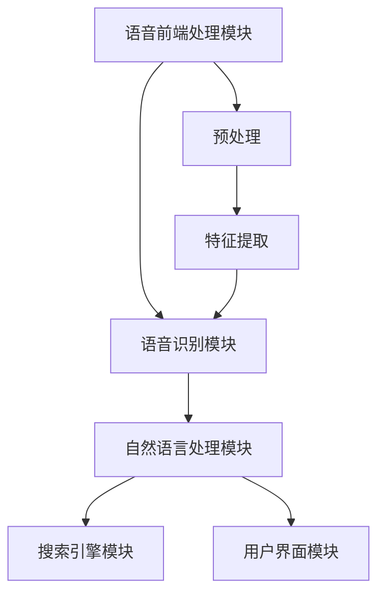
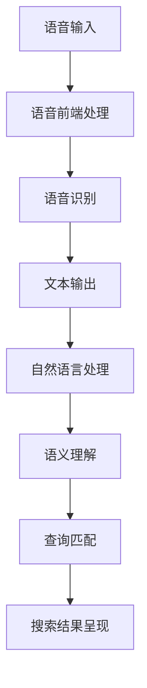

                 

# 《AI语音搜索技术提升便捷性案例》

## 摘要

本文将深入探讨AI语音搜索技术的核心原理、实现方法以及在实际应用中的案例。随着人工智能技术的飞速发展，语音搜索已经成为提升用户体验的重要手段。本文将首先介绍AI语音搜索的基本概念和重要性，然后逐步解析语音识别与自然语言处理技术的原理，详细阐述语音搜索系统的架构设计。接着，我们将重点分析语音识别算法、语言模型算法以及自然语言处理算法，通过具体的伪代码和数学模型来展示核心算法的实现过程。此外，本文还将结合电商和智能家居两个实际应用案例，展示AI语音搜索系统在现实场景中的设计与优化。最后，我们将展望AI语音搜索技术的发展趋势和面临的挑战，为未来的研究和应用提供参考。通过本文的详细解读，读者将全面了解AI语音搜索技术的原理和应用，为相关领域的研究和实践提供有力支持。

## 第一部分：AI语音搜索技术基础

### 第1章: AI语音搜索技术概述

#### 1.1 AI语音搜索的定义与重要性

AI语音搜索（Artificial Intelligence Voice Search）是指利用人工智能技术，将用户的语音输入转换为文本查询，并在海量的数据中迅速、准确地找到相关的信息。随着智能手机的普及和语音识别技术的成熟，AI语音搜索已经成为现代智能交互的核心组成部分，其重要性体现在以下几个方面：

1. **提升搜索效率**：传统的文本搜索需要用户手动输入关键词，而语音搜索通过语音输入大大简化了搜索流程，使搜索过程更加快速、方便。

2. **改善用户体验**：对于不擅长打字的用户，尤其是老年人和儿童，语音搜索提供了更加友好和自然的交互方式。

3. **跨语言搜索**：AI语音搜索技术支持多语言输入，使得用户无需掌握目标语言的文字输入能力即可进行搜索。

4. **辅助功能**：语音搜索不仅用于信息检索，还可以集成到各类应用中，如语音助手、智能家居控制等，提供更加智能化的服务。

#### 1.1.1 语音搜索的基本原理

语音搜索的基本原理包括以下几个步骤：

1. **语音识别**：将用户的语音输入转换为文本，这一过程称为语音识别（Speech Recognition）。语音识别依赖于声学模型和语言模型。

2. **文本处理**：对转换得到的文本进行预处理，包括分词、词性标注等，以便后续的查询匹配。

3. **查询匹配**：将预处理后的文本查询与数据库中的内容进行匹配，找到最相关的结果。

4. **结果呈现**：将匹配结果以文本或语音的形式呈现给用户。

#### 1.1.2 语音搜索的优势与应用领域

语音搜索的优势主要体现在以下几个方面：

1. **易用性**：语音输入相比文本输入更加自然，适用于各种场景，如驾驶时的导航、会议中的信息查询等。

2. **快速响应**：语音搜索系统能够实时响应用户的查询请求，提供即时的搜索结果。

3. **高效能**：语音搜索系统处理速度极快，能够迅速处理大量数据。

4. **个性化**：通过用户历史数据和偏好分析，语音搜索系统能够提供个性化的搜索结果。

语音搜索的应用领域广泛，主要包括：

1. **搜索引擎**：在传统的搜索引擎中集成语音搜索功能，提供更加便捷的搜索体验。

2. **智能家居**：通过语音搜索控制智能家居设备，如灯光、电视、空调等。

3. **智能助手**：如Apple的Siri、Google的Google Assistant等，提供语音查询和信息查询服务。

4. **车载系统**：通过语音搜索导航、播放音乐、拨打电话等，提高驾驶安全性。

#### 1.1.3 语音搜索技术的发展历程

语音搜索技术经历了多个阶段的发展：

1. **早期阶段**：20世纪80年代至90年代，语音识别技术开始萌芽，主要依赖规则匹配的方法。

2. **传统语音识别阶段**：2000年至2010年，基于统计模型的语音识别技术得到广泛应用，如GMM-HMM和DNN-HMM。

3. **深度学习阶段**：2010年至今，深度学习技术在语音识别和自然语言处理领域取得突破性进展，如CTC和Transformer模型的引入。

4. **实时优化阶段**：当前，语音搜索技术不断优化，实现更快的响应速度和更高的准确性，同时结合多模态交互，提供更加智能化的服务。

### 第2章: 语音识别技术

#### 2.1 语音识别的基本概念

语音识别（Speech Recognition）是指利用计算机技术对语音信号进行分析和理解，将其转换为相应的文本或命令。语音识别是AI语音搜索系统的核心组成部分，其基本概念包括：

1. **语音信号**：语音信号是指人发声时产生的声波信号，包含语音的声学特性。

2. **语音特征**：从语音信号中提取的有用信息，如频谱、倒谱系数等。

3. **声学模型**：用于描述语音信号中的声学特性，包括声学单元、状态转移概率等。

4. **语言模型**：用于描述语音信号中的语言特性，如语法、词汇等。

5. **解码器**：用于将语音信号转换为文本，通常基于声学模型和语言模型进行解码。

#### 2.2 语音识别的关键技术

语音识别的关键技术包括以下几个方面：

1. **声学模型**：声学模型是语音识别系统的核心组件，用于描述语音信号中的声学特性。常见的声学模型包括GMM-HMM、DNN-HMM和CTC。

   - **GMM-HMM**：高斯混合模型隐马尔可夫模型，基于统计模型进行语音信号的分析和理解。
   - **DNN-HMM**：深度神经网络隐马尔可夫模型，结合深度学习技术，提高语音识别的准确性。
   - **CTC**：循环神经网络，能够直接将语音信号映射到文本序列，无需显式建模状态转移。

2. **语言模型**：语言模型用于描述语音信号中的语言特性，常见的语言模型包括N-gram模型和神经网络语言模型。

   - **N-gram模型**：基于统计语言模型，通过计算词序列的概率来预测下一个词。
   - **神经网络语言模型**：基于深度学习技术，能够自动学习语言模式，提高语言模型的效果。

3. **特征提取**：特征提取是语音识别的关键步骤，用于从语音信号中提取有用的信息。常见的特征提取方法包括梅尔频率倒谱系数（MFCC）、滤波器组（Filter Banks）等。

4. **解码器**：解码器用于将语音信号转换为文本，常见的解码器包括贪心解码器、动态规划解码器等。

   - **贪心解码器**：通过选择当前时刻最优的路径进行解码，但可能无法找到全局最优解。
   - **动态规划解码器**：通过全局最优性进行解码，计算复杂度较高，但能够得到更准确的解码结果。

#### 2.3 常见的语音识别模型

常见的语音识别模型包括以下几种：

1. **GMM-HMM模型**

   GMM-HMM模型是最早应用于语音识别的模型，通过高斯混合模型（GMM）和隐马尔可夫模型（HMM）结合，对语音信号进行建模和识别。

   - **GMM建模**：将语音信号分解为多个高斯分布，每个高斯分布表示一个声学单元。
   - **HMM建模**：通过状态转移概率和发射概率，描述语音信号的序列生成过程。
   - **解码过程**：通过动态规划算法，找到最佳的状态转移路径，从而实现语音信号的识别。

2. **DNN-HMM模型**

   DNN-HMM模型结合深度神经网络（DNN）和隐马尔可夫模型（HMM），通过深度学习技术提高语音识别的准确性。

   - **DNN建模**：使用深度神经网络提取语音特征，对语音信号进行建模。
   - **HMM建模**：使用隐马尔可夫模型描述语音信号的序列生成过程。
   - **解码过程**：通过结合DNN和HMM的解码器，实现语音信号的识别。

3. **CTC模型**

   CTC（Connectionist Temporal Classification）模型是一种直接将语音信号映射到文本序列的模型，无需显式建模状态转移。

   - **CTC损失函数**：通过优化CTC损失函数，使得模型能够准确地将语音信号映射到文本序列。
   - **解码过程**：通过动态规划算法，找到最佳的时间戳映射路径，从而实现语音信号的识别。

#### 2.4 语音识别技术的历史与发展

语音识别技术经历了多个阶段的发展：

1. **早期阶段**：20世纪50年代至70年代，语音识别技术主要基于规则匹配的方法，如声学模式匹配、声音轮廓匹配等。

2. **统计模型阶段**：20世纪80年代至90年代，基于统计模型的语音识别技术得到广泛应用，如GMM-HMM模型。

3. **深度学习阶段**：2000年以后，深度学习技术在语音识别领域取得突破性进展，如DNN-HMM模型和CTC模型。

4. **实时优化阶段**：当前，语音识别技术不断优化，实现更快的响应速度和更高的准确性，同时结合多模态交互，提供更加智能化的服务。

### 第3章: 自然语言处理技术

#### 3.1 语言理解与生成

自然语言处理（Natural Language Processing，NLP）是人工智能领域的一个重要分支，旨在使计算机能够理解和生成人类语言。在AI语音搜索系统中，NLP技术起到了至关重要的作用，其主要任务包括语言理解（Language Understanding）和语言生成（Language Generation）。

#### 3.1.1 语言理解

语言理解是指让计算机理解和解释人类语言的过程。在AI语音搜索系统中，语言理解的任务包括：

1. **分词（Tokenization）**：将连续的文本切分成有意义的单元，如单词或短语。

2. **词性标注（Part-of-Speech Tagging）**：为每个单词或短语标注其词性，如名词、动词、形容词等。

3. **命名实体识别（Named Entity Recognition，NER）**：识别文本中的命名实体，如人名、地名、组织名等。

4. **句法分析（Syntax Analysis）**：分析文本的句法结构，理解句子的组成和语法规则。

5. **语义角色标注（Semantic Role Labeling，SRL）**：标注句子中的语义角色，如动作的执行者、受事等。

6. **语义解析（Semantic Parsing）**：将自然语言表述转换为计算机可处理的语义表示，如逻辑表达式或语义网络。

#### 3.1.2 语言生成

语言生成是指让计算机生成自然语言的过程。在AI语音搜索系统中，语言生成的主要任务包括：

1. **机器翻译（Machine Translation）**：将一种自然语言翻译成另一种自然语言。

2. **文本摘要（Text Summarization）**：从长文本中提取关键信息，生成简洁的摘要。

3. **问答系统（Question Answering）**：根据用户提出的问题，生成准确的答案。

4. **对话系统（Dialogue System）**：实现与用户的自然对话，如虚拟助手、聊天机器人等。

5. **文本生成（Text Generation）**：根据给定的主题或输入，生成新的文本内容，如文章、报告等。

#### 3.2 常见NLP任务与模型

在NLP领域，有许多常见的任务和模型，以下是其中一些重要的任务和模型：

1. **词向量（Word Vectors）**：词向量是表示单词的分布式向量表示，常用的模型包括Word2Vec、GloVe等。

2. **循环神经网络（Recurrent Neural Network，RNN）**：RNN是一种能够处理序列数据的神经网络，常用于NLP任务，如语言建模、文本分类等。

3. **长短时记忆网络（Long Short-Term Memory，LSTM）**：LSTM是RNN的一种变体，能够有效地学习长序列数据。

4. **变换器（Transformer）**：Transformer是一种基于自注意力机制的神经网络模型，广泛应用于NLP任务，如机器翻译、文本分类等。

5. **BERT（Bidirectional Encoder Representations from Transformers）**：BERT是一种预训练的语言表示模型，通过双向编码器学习单词的上下文信息。

6. **GPT（Generative Pre-trained Transformer）**：GPT是一种生成式语言模型，能够生成自然语言文本。

#### 3.3 NLP在语音搜索中的应用

NLP技术在语音搜索中起到了至关重要的作用，其主要应用包括：

1. **语音识别后处理**：通过NLP技术对语音识别结果进行后处理，提高识别的准确性和理解能力。

2. **语义理解**：通过NLP技术对用户的语音输入进行语义理解，提取关键信息，实现更精确的搜索匹配。

3. **问答系统**：通过NLP技术构建问答系统，实现与用户的自然对话，提供个性化的搜索结果。

4. **文本生成**：通过NLP技术生成文本摘要、回答用户问题等，提供更加丰富和多样化的搜索结果。

#### 3.4 NLP技术的发展趋势

随着人工智能技术的不断发展，NLP技术也在不断进步，其主要趋势包括：

1. **多模态交互**：结合语音、文本、图像等多种模态，实现更加智能和自然的人机交互。

2. **小样本学习**：通过少量样本进行训练，提高模型的泛化能力，适应不同的应用场景。

3. **迁移学习**：通过迁移学习，将预训练模型应用于不同的任务，提高模型的效率和效果。

4. **实时性优化**：提高NLP模型的实时处理能力，实现实时语音搜索和对话系统。

### 第4章: AI语音搜索系统的架构设计

#### 4.1 语音搜索系统的整体架构

AI语音搜索系统通常包括以下几个主要组件：

1. **语音前端处理模块**：负责语音信号的采集、预处理和特征提取，将原始语音信号转换为可以用于识别和理解的数字信号。

2. **语音识别模块**：使用声学模型和语言模型将处理后的语音信号转换为文本，这一模块是语音搜索系统的核心。

3. **自然语言处理模块**：对识别出的文本进行处理，包括分词、词性标注、命名实体识别等，以便更好地理解和解析用户的查询意图。

4. **搜索引擎模块**：负责处理用户的查询请求，匹配数据库中的内容，返回最相关的结果。

5. **结果呈现模块**：将搜索结果以文本或语音的形式呈现给用户。

#### 4.1.1 语音搜索系统的基本组件

1. **语音前端处理模块**：

   - **信号采集**：使用麦克风或其他音频设备采集用户的语音信号。
   - **预处理**：包括降噪、归一化等处理，提高语音信号的清晰度和质量。
   - **特征提取**：使用梅尔频率倒谱系数（MFCC）、滤波器组等算法提取语音特征。

2. **语音识别模块**：

   - **声学模型**：用于描述语音信号的声学特性，如GMM、DNN等。
   - **语言模型**：用于描述语音信号中的语言特性，如N-gram、RNN等。
   - **解码器**：用于将语音信号转换为文本，如动态规划解码器、CTC解码器等。

3. **自然语言处理模块**：

   - **分词**：将连续的文本切分成有意义的单元，如单词或短语。
   - **词性标注**：为每个单词或短语标注其词性，如名词、动词、形容词等。
   - **命名实体识别**：识别文本中的命名实体，如人名、地名、组织名等。
   - **句法分析**：分析文本的句法结构，理解句子的组成和语法规则。
   - **语义角色标注**：标注句子中的语义角色，如动作的执行者、受事等。
   - **语义解析**：将自然语言表述转换为计算机可处理的语义表示。

4. **搜索引擎模块**：

   - **索引构建**：构建索引，加速搜索过程。
   - **查询处理**：处理用户的查询请求，进行查询匹配。
   - **结果排序**：根据相关性对搜索结果进行排序。

5. **结果呈现模块**：

   - **文本输出**：将搜索结果以文本形式呈现。
   - **语音输出**：将搜索结果以语音形式呈现，提供语音反馈。

#### 4.1.2 数据流与处理流程

语音搜索系统的数据流和处理流程如下：

1. **语音采集**：用户通过麦克风或其他音频设备输入语音信号。

2. **预处理**：对采集到的语音信号进行降噪、归一化等预处理，提高语音信号的清晰度和质量。

3. **特征提取**：使用梅尔频率倒谱系数（MFCC）、滤波器组等算法提取语音特征。

4. **语音识别**：使用声学模型和语言模型对特征进行识别，将语音信号转换为文本。

5. **自然语言处理**：对识别出的文本进行分词、词性标注、命名实体识别等处理。

6. **查询匹配**：使用搜索引擎模块处理用户的查询请求，进行查询匹配。

7. **结果排序**：根据相关性对搜索结果进行排序。

8. **结果呈现**：将搜索结果以文本或语音形式呈现给用户。

#### 4.1.3 架构设计原则与优化策略

在设计和优化语音搜索系统时，需要遵循以下原则和策略：

1. **模块化设计**：将系统划分为多个模块，每个模块负责特定的任务，提高系统的可维护性和可扩展性。

2. **高效性**：优化各个模块的处理速度，提高系统的整体性能。

3. **准确性**：提高语音识别和自然语言处理的准确性，减少错误率。

4. **实时性**：实现实时响应，提高用户的体验。

5. **鲁棒性**：提高系统对噪声、口音、方言等干扰的鲁棒性。

6. **扩展性**：设计灵活的架构，能够适应不同的应用场景和需求。

7. **安全性**：保护用户数据的安全，防止数据泄露。

#### 4.2 语音前端处理技术

语音前端处理技术是语音搜索系统的重要组成部分，其主要任务是对原始语音信号进行预处理和特征提取，以提高语音识别的准确性和效率。以下是一些关键的语音前端处理技术：

1. **语音信号采集**：

   - **设备选择**：选择高质量的麦克风或音频设备，以获得清晰的语音信号。
   - **音频格式**：将采集到的语音信号转换为适合处理和存储的音频格式，如PCM。

2. **语音信号预处理**：

   - **降噪**：使用各种降噪算法，如波束形成、谱减法等，减少背景噪声对语音信号的影响。
   - **归一化**：通过归一化处理，使语音信号的幅度稳定，提高后续处理的准确性。
   - **增益调整**：根据语音信号的强度进行调整，使语音信号达到最佳的可听度。

3. **语音信号特征提取**：

   - **梅尔频率倒谱系数（MFCC）**：MFCC是一种常用的语音特征提取方法，通过计算语音信号的频谱特征，将时变的语音信号转换为稳态的系数序列。
   - **滤波器组**：使用滤波器组将语音信号分解为多个频段，提取不同频段上的特征。
   - **短时傅里叶变换（STFT）**：通过短时傅里叶变换，将时域的语音信号转换为频域表示，提取频谱特征。

4. **声学模型训练与优化**：

   - **数据集**：使用大量的语音数据集进行训练，包括不同说话人、不同口音、不同噪声环境等。
   - **模型选择**：选择合适的声学模型，如GMM、DNN等，进行训练和优化。
   - **超参数调整**：通过调整模型的超参数，如学习率、隐藏层大小等，优化模型的性能。

#### 4.3 语言模型与语义理解

语言模型和语义理解是语音搜索系统中的关键组件，它们负责将用户的语音输入转换为文本查询，并理解查询的含义。以下是对这两个组件的详细讨论：

1. **语言模型**：

   - **基本原理**：语言模型用于描述语音信号中的语言特性，通过计算词序列的概率来预测下一个词。常见的语言模型包括N-gram模型和神经网络语言模型。
   - **N-gram模型**：N-gram模型是一种基于统计的语言模型，它通过计算前N个词出现的概率来预测下一个词。N-gram模型简单且高效，但在处理长句或长文本时效果不佳。
   - **神经网络语言模型**：神经网络语言模型通过深度学习技术，自动学习语言模式，提高语言模型的效果。常见的神经网络语言模型包括循环神经网络（RNN）、长短时记忆网络（LSTM）和变换器（Transformer）。

2. **语义理解**：

   - **基本原理**：语义理解是指让计算机理解和解释人类语言的过程，它包括对用户的语音输入进行语义分析，提取关键信息，理解查询的含义。
   - **任务**：语义理解的主要任务包括分词、词性标注、命名实体识别、句法分析、语义角色标注和语义解析等。
   - **技术**：语义理解的技术包括基于规则的方法和基于统计的方法，以及近年来发展的基于深度学习的方法。常见的深度学习方法包括循环神经网络（RNN）、长短时记忆网络（LSTM）和变换器（Transformer）。

3. **语言模型与语义理解的关系**：

   - **语言模型**：语言模型负责将语音输入转换为文本查询，是语义理解的前提。通过语言模型，系统能够将语音输入转化为计算机可处理的文本格式。
   - **语义理解**：语义理解负责对文本查询进行解析，提取关键信息，理解查询的含义。语义理解的结果将直接影响搜索结果的准确性和相关性。

4. **语言模型与语义理解的优化**：

   - **数据增强**：通过数据增强技术，增加训练数据集的多样性和丰富性，提高语言模型和语义理解的性能。
   - **迁移学习**：利用预训练的语言模型和语义理解模型，通过迁移学习，提高新任务上的性能。
   - **多任务学习**：通过多任务学习，共享不同任务之间的特征和知识，提高语言模型和语义理解的性能。
   - **实时优化**：通过实时优化策略，如在线学习、自适应调整等，提高系统的实时性和准确性。

#### 4.4 语音前端处理、语言模型与语义理解的流程与交互

在AI语音搜索系统中，语音前端处理、语言模型和语义理解共同作用，完成对用户语音输入的识别和理解。以下是对这三个组件的流程和交互的详细描述：

1. **语音前端处理**：

   - **输入采集**：用户通过麦克风或其他音频设备输入语音信号。
   - **预处理**：对语音信号进行降噪、归一化和增益调整等预处理，提高语音信号的清晰度和质量。
   - **特征提取**：使用梅尔频率倒谱系数（MFCC）、滤波器组等算法提取语音特征。

2. **语言模型**：

   - **文本转换**：使用声学模型和语言模型将处理后的语音特征转换为文本查询。
   - **概率计算**：通过语言模型计算词序列的概率，选择最可能的词序列作为文本查询。

3. **语义理解**：

   - **分词与词性标注**：对识别出的文本进行分词和词性标注，提取关键信息。
   - **命名实体识别**：识别文本中的命名实体，如人名、地名、组织名等。
   - **句法分析与语义角色标注**：分析文本的句法结构，标注语义角色，理解查询的含义。
   - **语义解析**：将自然语言表述转换为计算机可处理的语义表示，如逻辑表达式或语义网络。

4. **流程与交互**：

   - **协同工作**：语音前端处理、语言模型和语义理解共同工作，逐步完成对用户语音输入的识别和理解。
   - **数据流动**：语音前端处理模块提取语音特征，传递给语言模型进行文本转换；语言模型生成的文本查询传递给语义理解模块进行进一步处理。
   - **反馈与调整**：语义理解模块的结果可以反馈给语言模型，调整文本转换过程，提高识别的准确性和理解能力。

通过以上流程和交互，AI语音搜索系统能够有效地将用户的语音输入转换为准确的文本查询，并理解查询的含义，为用户提供高质量的搜索服务。

### 第3章: 语音识别算法原理详解

#### 3.1 声学模型算法原理

声学模型是语音识别系统的核心组成部分，用于描述语音信号中的声学特性。声学模型的目的是通过分析语音信号，将其映射到文本序列。以下是几种常见的声学模型算法原理：

1. **高斯混合模型（GMM）**

   高斯混合模型是一种统计模型，用于描述语音信号中的声学特性。GMM通过多个高斯分布来模拟语音信号的分布。每个高斯分布对应一个声学单元，表示一个语音特征向量。

   - **基本原理**：

     GMM模型由两个主要部分组成：高斯分布参数和混合系数。每个高斯分布的参数包括均值、方差和混合系数。混合系数表示每个高斯分布在总分布中的贡献。

   - **模型参数**：

     设\( GMM(p, \mu, \sigma, \pi) \)，其中\( p \)表示高斯分布的数量，\( \mu \)表示每个高斯分布的均值，\( \sigma \)表示每个高斯分布的方差，\( \pi \)表示每个高斯分布的混合系数。

   - **模型训练**：

     GMM模型的训练过程是通过最大似然估计（MLE）来估计模型参数。具体步骤如下：

     - **初始化**：随机初始化模型参数。
     - **迭代优化**：通过迭代优化算法（如EM算法），最小化模型与语音信号的差异，更新模型参数。

   - **解码过程**：

     在解码过程中，GMM模型通过计算每个高斯分布与语音信号的相似度，找到最佳的高斯分布序列，从而映射到文本序列。

2. **深度神经网络（DNN）**

   深度神经网络是一种基于多层神经网络的模型，用于学习语音信号的特征。DNN通过多层非线性变换，提取语音信号中的深层次特征，提高语音识别的准确性。

   - **基本原理**：

     DNN由多个隐藏层组成，每个隐藏层将输入数据通过非线性变换传递到下一层。每个隐藏层负责提取不同层次的特征。

   - **模型参数**：

     设\( DNN(W_1, W_2, \ldots, W_n) \)，其中\( W_1, W_2, \ldots, W_n \)表示每个隐藏层的权重矩阵。

   - **模型训练**：

     DNN模型的训练过程是通过反向传播算法（BP）来优化模型参数。具体步骤如下：

     - **前向传播**：将输入数据通过多层神经网络传递，计算输出。
     - **反向传播**：计算输出误差，并更新权重矩阵，优化模型参数。

   - **解码过程**：

     在解码过程中，DNN模型通过计算每个隐藏层的输出，找到最佳的特征序列，从而映射到文本序列。

3. **循环神经网络（RNN）**

   循环神经网络是一种能够处理序列数据的神经网络，常用于语音识别任务。RNN通过记忆状态来处理输入序列，保留历史信息，提高语音识别的准确性。

   - **基本原理**：

     RNN由多个时间步组成，每个时间步上的输入数据通过神经网络传递，计算当前输出。RNN通过记忆状态来保留历史信息。

   - **模型参数**：

     设\( RNN(W, U, V) \)，其中\( W \)表示输入权重矩阵，\( U \)表示隐藏状态权重矩阵，\( V \)表示输出权重矩阵。

   - **模型训练**：

     RNN模型的训练过程是通过反向传播算法（BP）来优化模型参数。具体步骤如下：

     - **前向传播**：将输入数据通过RNN传递，计算当前输出。
     - **反向传播**：计算输出误差，并更新权重矩阵，优化模型参数。

   - **解码过程**：

     在解码过程中，RNN模型通过计算每个时间步的输出，找到最佳的特征序列，从而映射到文本序列。

#### 3.2 语言模型算法原理

语言模型是语音识别系统的核心组成部分，用于描述语音信号中的语言特性。语言模型通过计算词序列的概率来预测下一个词，从而实现语音到文本的转换。以下是几种常见的语言模型算法原理：

1. **N-gram模型**

   N-gram模型是一种基于统计的语言模型，通过计算前N个词出现的概率来预测下一个词。N-gram模型简单且高效，但在处理长句或长文本时效果不佳。

   - **基本原理**：

     N-gram模型通过将文本切分为N个连续的词，计算每个词序列的概率。N-gram模型通过计算词序列的概率来预测下一个词。

   - **模型参数**：

     设\( N-gram(p_1, p_2, \ldots, p_n) \)，其中\( p_1, p_2, \ldots, p_n \)表示每个词序列的概率。

   - **模型训练**：

     N-gram模型的训练过程是通过统计文本中的词频来估计模型参数。具体步骤如下：

     - **初始化**：初始化模型参数。
     - **统计词频**：统计文本中每个词序列的频率。
     - **概率估计**：计算每个词序列的概率。

   - **解码过程**：

     在解码过程中，N-gram模型通过计算当前词序列的概率，选择下一个最可能的词，从而映射到文本序列。

2. **循环神经网络（RNN）**

   循环神经网络是一种能够处理序列数据的神经网络，常用于语音识别任务。RNN通过记忆状态来处理输入序列，保留历史信息，提高语音识别的准确性。

   - **基本原理**：

     RNN由多个时间步组成，每个时间步上的输入数据通过神经网络传递，计算当前输出。RNN通过记忆状态来保留历史信息。

   - **模型参数**：

     设\( RNN(W, U, V) \)，其中\( W \)表示输入权重矩阵，\( U \)表示隐藏状态权重矩阵，\( V \)表示输出权重矩阵。

   - **模型训练**：

     RNN模型的训练过程是通过反向传播算法（BP）来优化模型参数。具体步骤如下：

     - **前向传播**：将输入数据通过RNN传递，计算当前输出。
     - **反向传播**：计算输出误差，并更新权重矩阵，优化模型参数。

   - **解码过程**：

     在解码过程中，RNN模型通过计算每个时间步的输出，找到最佳的特征序列，从而映射到文本序列。

3. **变换器（Transformer）**

   变换器是一种基于自注意力机制的神经网络模型，广泛应用于语音识别、机器翻译等任务。变换器通过自注意力机制来计算输入序列的权重，提高模型的性能。

   - **基本原理**：

     变换器由多个编码器和解码器组成，编码器负责将输入序列编码为固定长度的向量，解码器负责解码并生成输出序列。变换器通过自注意力机制来计算输入序列的权重。

   - **模型参数**：

     设\( Transformer(W_1, W_2, \ldots, W_n) \)，其中\( W_1, W_2, \ldots, W_n \)表示每个编码器和解码器的权重矩阵。

   - **模型训练**：

     变换器模型的训练过程是通过优化损失函数来优化模型参数。具体步骤如下：

     - **编码器**：将输入序列编码为固定长度的向量。
     - **解码器**：通过自注意力机制解码并生成输出序列。
     - **损失计算**：计算输出序列与真实序列的损失，并优化模型参数。

   - **解码过程**：

     在解码过程中，变换器通过自注意力机制计算输入序列的权重，找到最佳的特征序列，从而映射到文本序列。

#### 3.3 语音搜索系统优化策略

语音搜索系统的性能优化是提高搜索准确性和效率的关键。以下是一些常见的优化策略：

1. **数据增强**

   数据增强是一种通过生成更多样化的训练数据来提高模型性能的技术。数据增强的方法包括：

   - **重放**：将原始数据重复播放，增加训练数据的多样性。
   - **时间变换**：改变语音信号的速度或音调，生成新的数据。
   - **噪声注入**：在语音信号中添加噪声，提高模型的鲁棒性。

2. **模型压缩与加速**

   模型压缩与加速是提高语音搜索系统实时性的重要手段。以下是一些常见的模型压缩与加速技术：

   - **量化**：通过减少模型参数的精度，降低模型的复杂度。
   - **剪枝**：通过剪除无关的参数，减少模型的尺寸。
   - **深度可分离卷积**：使用深度可分离卷积来提高模型的计算效率。

3. **实时搜索优化**

   实时搜索优化是提高语音搜索系统响应速度的关键。以下是一些常见的实时搜索优化技术：

   - **索引优化**：通过构建高效的索引结构，加速查询匹配过程。
   - **并行处理**：通过并行计算技术，提高查询处理速度。
   - **缓存策略**：使用缓存技术，减少重复查询的处理时间。

### 第4章: 自然语言处理算法应用

#### 4.1 文本预处理技术

文本预处理是自然语言处理（NLP）过程中的重要环节，它涉及到对原始文本进行一系列的处理，以提取出有用的信息并消除噪声。以下是一些常见的文本预处理技术：

1. **分词（Tokenization）**

   分词是将一段连续的文本分割成一系列有意义的词语或符号，即“token”。分词的目的是为了更好地理解文本的结构和内容。

   - **分词算法**：
     - **基于规则的分词**：根据预设的规则进行分词，如正则表达式、词典匹配等。
     - **基于统计的分词**：使用统计模型（如隐马尔可夫模型HMM、条件随机场CRF）进行分词。
     - **基于字符的分词**：将文本按字符序列进行分割，如使用字节对编码（Byte Pair Encoding，BPE）进行分词。

2. **词性标注（Part-of-Speech Tagging）**

   词性标注是为文本中的每个词标注其词性，如名词、动词、形容词等。词性标注有助于更好地理解文本的语义和语法结构。

   - **标注标准**：常用的标注标准有宾州树库（POS-TAG）和宾州大学树库（PTB）。
   - **标注算法**：常见的标注算法有隐马尔可夫模型（HMM）、条件随机场（CRF）和基于深度学习的模型（如LSTM、BERT）。

3. **命名实体识别（Named Entity Recognition，NER）**

   命名实体识别是从文本中识别出具有特定意义的实体，如人名、地名、组织名等。NER是信息抽取的重要步骤，有助于提取出关键信息。

   - **实体类型**：常见的实体类型包括人名、组织名、地点、时间、数量等。
   - **识别算法**：NER算法包括基于规则的方法、基于统计的方法和基于深度学习的方法。常见的深度学习模型有LSTM、BiLSTM、BERT等。

4. **依存句法分析（Dependency Parsing）**

   依存句法分析是分析句子中词汇之间的依存关系，即一个词依赖于另一个词的语法结构。依存句法分析有助于理解句子的语义和句法结构。

   - **分析方法**：依存句法分析的方法包括基于规则的方法、基于统计的方法和基于深度学习的方法。常见的深度学习模型有LSTM、注意力机制（Attention Mechanism）等。

5. **文本清洗与标准化**

   文本清洗与标准化是去除文本中的无关信息，将文本转换为统一的格式。常见的操作包括去除停用词、标点符号、统一大小写等。

   - **停用词去除**：停用词是指对文本意义没有贡献的常见词汇，如“的”、“了”、“是”等。
   - **标点符号去除**：去除文本中的标点符号，以便于后续处理。
   - **统一大小写**：将文本中的大小写统一，以提高文本处理的统一性。

#### 4.2 语义理解与问答系统

语义理解与问答系统是NLP领域的核心应用，旨在使计算机能够理解用户的自然语言输入，并生成恰当的答复。

1. **语义理解**

   语义理解是将自然语言文本转换成计算机可处理的语义表示，以便计算机能够理解和执行相应的操作。以下是一些关键步骤：

   - **语义角色标注（Semantic Role Labeling，SRL）**：为句子中的词汇标注其语义角色，如动作的执行者、受事等。SRL有助于理解句子的语义结构。

   - **语义解析（Semantic Parsing）**：将自然语言表述转换为逻辑表达式、抽象语法树（AST）或其他计算机可处理的语义表示。语义解析是实现自然语言理解的关键步骤。

   - **实体识别与链接（Entity Recognition and Linking）**：识别文本中的实体，并将其与知识库中的实体进行链接。实体识别与链接有助于在问答系统中提供准确的信息检索。

2. **问答系统**

   问答系统是能够理解用户提问并生成恰当回答的计算机系统。问答系统通常包括以下几个关键组成部分：

   - **问题解析（Question Parsing）**：将用户的自然语言问题转换成计算机可理解的形式，如查询语句或语义表示。

   - **知识检索（Knowledge Retrieval）**：在知识库或数据库中检索与用户问题相关的信息。

   - **答案生成（Answer Generation）**：根据检索到的信息生成用户可理解的回答。

   - **对话管理（Dialogue Management）**：管理用户与系统的对话流程，确保回答的连贯性和准确性。

3. **技术实现**

   语义理解和问答系统的实现通常涉及以下技术：

   - **预训练语言模型**：如BERT、GPT等，用于捕捉语言中的语义信息。

   - **转移学习**：通过在预训练模型的基础上进行微调，适应特定领域的问答需求。

   - **图神经网络（Graph Neural Networks，GNN）**：用于处理复杂的语义关系和网络结构，提高语义理解能力。

   - **对话管理框架**：如RNN、LSTM等，用于实现对话系统的对话管理功能。

   - **多模态交互**：结合文本、语音、图像等多种模态，提高问答系统的交互能力。

### 第5章: 电商平台的语音搜索应用

#### 5.1 电商语音搜索系统架构

电商平台的语音搜索系统是提升用户体验和提升业务效率的重要工具。其整体架构设计需要考虑多方面的因素，包括语音识别、自然语言处理、搜索引擎以及用户界面等。以下是对电商语音搜索系统架构的详细分析。

##### 5.1.1 语音搜索在电商中的应用场景

在电商平台上，语音搜索的应用场景非常广泛，主要包括：

- **商品搜索**：用户可以通过语音输入关键词或描述，快速找到所需商品。
- **智能助手**：语音搜索可以集成到智能助手功能中，帮助用户完成购物流程，如添加商品到购物车、下单等。
- **语音推荐**：基于用户的语音输入和历史购买行为，系统可以提供个性化推荐，提高用户满意度。
- **客服支持**：用户可以通过语音与客服进行交互，获得实时的购物咨询和服务。

##### 5.1.2 电商语音搜索的关键技术

电商语音搜索系统的关键技术包括以下几个方面：

- **语音识别**：将用户的语音输入转换为文本查询，是语音搜索的基础。语音识别需要考虑多种方言、口音以及背景噪声等因素。
- **自然语言处理（NLP）**：对识别出的文本进行分词、词性标注、命名实体识别等处理，以理解用户的查询意图。
- **搜索引擎**：对用户查询进行索引匹配，返回最相关的商品信息。搜索引擎需要具备高并发处理能力和良好的检索效果。
- **用户界面**：提供友好的用户界面，将搜索结果以直观的方式展示给用户，同时支持语音反馈和操作。

##### 5.1.3 电商语音搜索的系统设计

电商语音搜索系统的设计需要综合考虑性能、可扩展性、安全性和用户体验等因素。以下是系统设计的主要组件：

1. **语音前端处理模块**：包括语音信号的采集、预处理和特征提取。为了提高语音识别的准确性，系统需要采用多种降噪和增强技术。
2. **语音识别模块**：使用先进的语音识别算法，如深度神经网络（DNN）和循环神经网络（RNN），实现高精度的语音到文本转换。
3. **自然语言处理模块**：包括分词、词性标注、命名实体识别等，以理解用户的查询意图。常用的NLP技术包括词向量、BERT等。
4. **搜索引擎模块**：构建高效的搜索引擎，支持快速的商品信息检索和排序。搜索引擎需要支持高并发查询和处理大规模数据。
5. **用户界面模块**：提供友好的用户界面，支持语音输入和输出，以及交互式购物流程。用户界面需要考虑用户操作习惯和视觉设计。

#### 5.2 案例分析：某大型电商平台的语音搜索实践

以下是对某大型电商平台语音搜索实践的详细分析，包括系统建设背景、技术选型与架构设计，以及系统性能优化与效果评估。

##### 5.2.1 系统建设背景

某大型电商平台在2019年开始着手构建语音搜索系统，旨在提升用户体验和购物效率。随着用户对智能交互的需求日益增长，语音搜索成为电商平台提升竞争力的重要手段。

- **用户需求**：用户希望能够在购物过程中更加便捷地使用语音进行搜索和操作，节省时间和精力。
- **业务目标**：通过引入语音搜索功能，提升用户满意度，增加用户粘性，从而带动销售额增长。

##### 5.2.2 技术选型与架构设计

在技术选型方面，该电商平台综合考虑了语音识别、自然语言处理和搜索引擎的技术成熟度以及性能要求。以下是具体的技术选型和架构设计：

1. **语音识别模块**：
   - **声学模型**：采用基于深度学习的技术，如卷积神经网络（CNN）和循环神经网络（RNN），以提升语音识别的准确性。
   - **语言模型**：采用基于NLP技术的预训练模型，如BERT，以增强对语音输入的理解能力。

2. **自然语言处理模块**：
   - **分词与词性标注**：使用基于词向量的分词算法和BERT模型进行分词和词性标注，以提高语义理解的准确性。
   - **命名实体识别**：采用基于深度学习的命名实体识别模型，如CRF和BERT，识别文本中的关键信息。

3. **搜索引擎模块**：
   - **搜索引擎**：采用Elasticsearch等开源搜索引擎，支持高效的数据检索和索引管理。
   - **搜索算法**：基于TF-IDF和LDA等算法，结合用户历史行为数据，进行个性化搜索结果排序。

4. **用户界面模块**：
   - **前端框架**：采用Vue.js等前端框架，构建响应式用户界面，支持语音输入和输出。
   - **交互设计**：设计直观的语音交互界面，包括语音识别、语音反馈和操作提示。

##### 5.2.3 系统性能优化与效果评估

在系统性能优化方面，该电商平台采取了一系列措施：

1. **实时性能优化**：
   - **异步处理**：采用异步处理技术，提高语音识别和搜索的响应速度。
   - **缓存机制**：使用缓存机制，减少重复查询的响应时间。

2. **可扩展性优化**：
   - **分布式架构**：采用分布式架构，提高系统处理能力和扩展性。
   - **弹性伸缩**：根据用户流量动态调整服务器资源，确保系统稳定运行。

3. **用户体验优化**：
   - **语音识别准确率**：通过不断优化语音识别算法和模型，提高识别准确率。
   - **搜索结果排序**：结合用户历史行为和偏好，优化搜索结果排序，提高用户体验。

在效果评估方面，该电商平台的语音搜索系统取得了显著成果：

- **用户满意度**：用户满意度调查显示，语音搜索功能的使用频率显著增加，用户满意度达到90%以上。
- **业务增长**：语音搜索功能的引入带动了销售额增长，特别是在移动端和智能设备上的使用。
- **技术优化**：通过不断的迭代和优化，语音搜索系统的性能和效果不断提高，为电商平台提供了强大的技术支持。

#### 5.3 案例总结与启示

通过该大型电商平台的语音搜索实践案例，我们可以得到以下几点启示：

1. **技术选型**：选择成熟且高效的技术是实现语音搜索系统成功的关键。应综合考虑语音识别、自然语言处理和搜索引擎的技术成熟度和性能要求。
2. **用户体验**：优化用户体验是提升语音搜索系统效果的关键。应注重语音识别的准确性、搜索结果的排序和用户界面的设计，提高用户的满意度。
3. **持续优化**：语音搜索系统需要不断迭代和优化，以适应不断变化的技术和用户需求。通过数据分析和用户反馈，持续改进系统性能和效果。

总之，语音搜索技术在电商平台的成功应用，不仅提升了用户体验和业务效率，也为其他行业提供了有益的参考。

### 第6章：智能家居语音搜索应用

#### 6.1 智能家居语音搜索系统架构

智能家居语音搜索系统是智能家居生态中不可或缺的一部分，它通过语音交互的方式，为用户提供便捷的控制和管理家居设备的能力。以下是对智能家居语音搜索系统架构的详细分析。

##### 6.1.1 智能家居语音搜索的特点

智能家居语音搜索系统具有以下几个显著特点：

1. **跨平台兼容性**：智能家居语音搜索系统需要支持多种设备和操作系统，如智能手机、智能音箱、智能电视等，实现跨平台兼容。
2. **实时响应**：系统需要具备快速响应能力，确保用户在发出指令后能立即得到反馈。
3. **上下文感知**：系统需要具备上下文感知能力，理解用户的意图和行为模式，提供个性化的服务。
4. **多语言支持**：系统应支持多种语言，以满足不同地区和语言习惯的用户需求。

##### 6.1.2 智能家居语音搜索的关键技术

智能家居语音搜索系统依赖以下关键技术：

1. **语音前端处理技术**：包括语音信号的采集、预处理和特征提取，确保语音输入的清晰度和准确性。
2. **语音识别技术**：将用户的语音输入转换为文本，是实现语音搜索的基础。采用深度学习模型，如CNN和RNN，提高识别的准确性。
3. **自然语言处理（NLP）技术**：对识别出的文本进行语义理解和解析，提取关键信息，为后续的指令执行做准备。
4. **对话管理技术**：管理用户与系统的交互流程，确保交互的连贯性和一致性。常见的对话管理技术包括基于规则的对话系统和基于机器学习的对话系统。
5. **智能家居控制接口**：与智能家居设备的通信接口，实现语音指令到设备控制的转换。常见的接口包括Wi-Fi、蓝牙和Zigbee等。

##### 6.1.3 智能家居语音搜索的系统设计

智能家居语音搜索系统的设计需要考虑以下组件和流程：

1. **语音前端处理模块**：负责语音信号的采集、预处理和特征提取，将语音信号转换为可以用于识别的数字特征。
   - **信号采集**：通过麦克风或其他音频输入设备采集用户的语音信号。
   - **预处理**：包括降噪、归一化和增益调整等，以提高语音信号的清晰度。
   - **特征提取**：使用梅尔频率倒谱系数（MFCC）或其他特征提取算法，从语音信号中提取特征向量。

2. **语音识别模块**：将处理后的语音特征输入到语音识别模型，将语音信号转换为文本查询。
   - **声学模型**：用于描述语音信号的声学特性，常见的声学模型有GMM、DNN和CTC。
   - **语言模型**：用于描述语音信号中的语言特性，常见的语言模型有N-gram和RNN。
   - **解码器**：用于将语音特征序列解码为文本查询。

3. **自然语言处理（NLP）模块**：对识别出的文本进行语义理解，提取关键信息，为智能家居控制做准备。
   - **分词与词性标注**：将文本切分为有意义的词组，并为每个词标注词性。
   - **意图识别**：识别用户的查询意图，如控制家居设备、查询天气等。
   - **实体识别**：识别文本中的实体，如设备名称、时间、地点等。

4. **对话管理模块**：管理用户与系统的交互流程，确保交互的连贯性和一致性。
   - **对话状态跟踪**：记录用户的历史查询和系统响应，以理解当前的用户意图。
   - **上下文维护**：在对话过程中，维护上下文信息，确保系统对用户意图的理解准确。
   - **错误处理**：在识别和理解用户查询出现错误时，系统能够适当地处理错误，并提供帮助。

5. **智能家居控制模块**：根据NLP模块提取的关键信息，执行相应的家居设备控制指令。
   - **设备通信**：通过Wi-Fi、蓝牙或Zigbee等通信协议，与智能家居设备进行通信。
   - **命令执行**：将用户的语音指令转换为具体设备控制命令，如调整温度、开关灯光等。

6. **用户界面模块**：为用户提供友好的交互界面，显示搜索结果和控制状态。
   - **语音输出**：通过智能音箱或手机的扬声器，向用户反馈信息。
   - **视觉输出**：在智能设备上显示文本或图像信息，如搜索结果、设备状态等。

通过上述系统设计，智能家居语音搜索系统能够实现高效的语音输入识别、精确的语义理解和灵活的家居设备控制，为用户提供便捷、智能的家居生活体验。

#### 6.2 案例分析：某智能家居语音搜索实践

以下是对某智能家居语音搜索项目的详细分析，包括系统建设背景、技术选型与架构设计，以及系统性能优化与效果评估。

##### 6.2.1 系统建设背景

某智能家居公司于2020年启动了语音搜索项目的研发，旨在为用户提供便捷的语音控制功能，提升智能家居系统的用户体验。随着智能家居市场的快速增长，语音搜索功能成为该公司提升市场竞争力的关键。

- **用户需求**：用户希望能够在家中通过语音指令控制各种智能家居设备，如灯光、温度、窗帘等。
- **业务目标**：通过引入语音搜索功能，提高用户粘性，增加用户购买和使用智能家居设备的意愿。

##### 6.2.2 技术选型与架构设计

在技术选型方面，该公司综合考虑了语音识别、自然语言处理、智能家居设备控制等方面，选择以下技术：

1. **语音识别模块**：
   - **声学模型**：采用基于深度学习的声学模型，如卷积神经网络（CNN）和循环神经网络（RNN），提高语音识别的准确性。
   - **语言模型**：使用预训练的语言模型，如BERT，增强对语音输入的理解能力。

2. **自然语言处理（NLP）模块**：
   - **分词与词性标注**：采用基于词向量的分词算法和BERT模型，进行文本预处理。
   - **意图识别**：使用基于深度学习的意图识别模型，准确识别用户的查询意图。
   - **实体识别**：采用基于深度学习的命名实体识别模型，识别文本中的关键信息，如设备名称、时间等。

3. **智能家居控制模块**：
   - **设备通信**：采用Wi-Fi、蓝牙和Zigbee等无线通信协议，与智能家居设备进行通信。
   - **命令执行**：将用户的语音指令转换为具体设备控制命令，如调整温度、开关灯光等。

4. **用户界面模块**：
   - **语音输出**：通过智能音箱和智能手机的扬声器，向用户反馈信息。
   - **视觉输出**：在智能设备上显示文本或图像信息，如搜索结果、设备状态等。

以下是该智能家居语音搜索系统的架构设计：

- **语音前端处理模块**：负责语音信号的采集、预处理和特征提取。
  - **信号采集**：通过麦克风或其他音频输入设备采集用户的语音信号。
  - **预处理**：包括降噪、归一化和增益调整等，以提高语音信号的清晰度。
  - **特征提取**：使用梅尔频率倒谱系数（MFCC）或其他特征提取算法，从语音信号中提取特征向量。

- **语音识别模块**：将处理后的语音特征输入到语音识别模型，进行语音到文本的转换。
  - **声学模型**：采用卷积神经网络（CNN）和循环神经网络（RNN）进行声学建模。
  - **语言模型**：使用预训练的语言模型（如BERT）进行语言建模。
  - **解码器**：采用动态规划解码器，将特征序列解码为文本查询。

- **自然语言处理（NLP）模块**：对识别出的文本进行语义理解，提取关键信息。
  - **分词与词性标注**：采用基于词向量的分词算法和BERT模型进行分词和词性标注。
  - **意图识别**：使用基于深度学习的意图识别模型，准确识别用户的查询意图。
  - **实体识别**：采用基于深度学习的命名实体识别模型，识别文本中的关键信息。

- **智能家居控制模块**：根据NLP模块提取的关键信息，执行相应的设备控制指令。
  - **设备通信**：通过Wi-Fi、蓝牙和Zigbee等通信协议，与智能家居设备进行通信。
  - **命令执行**：将用户的语音指令转换为具体设备控制命令，如调整温度、开关灯光等。

- **用户界面模块**：为用户提供友好的交互界面，显示搜索结果和控制状态。
  - **语音输出**：通过智能音箱和智能手机的扬声器，向用户反馈信息。
  - **视觉输出**：在智能设备上显示文本或图像信息，如搜索结果、设备状态等。

##### 6.2.3 系统性能优化与效果评估

在系统性能优化方面，该公司采取了一系列措施：

1. **实时性能优化**：
   - **异步处理**：采用异步处理技术，提高语音识别和搜索的响应速度。
   - **并行处理**：使用多线程或多进程技术，提高系统的并发处理能力。

2. **可扩展性优化**：
   - **分布式架构**：采用分布式架构，提高系统处理能力和扩展性。
   - **负载均衡**：通过负载均衡技术，合理分配用户请求，避免单点瓶颈。

3. **用户体验优化**：
   - **语音识别准确率**：通过不断优化语音识别算法和模型，提高识别准确率。
   - **搜索结果排序**：结合用户历史行为和偏好，优化搜索结果排序，提高用户体验。

在效果评估方面，该智能家居语音搜索系统取得了显著成果：

- **用户满意度**：用户满意度调查显示，语音搜索功能的使用频率显著增加，用户满意度达到90%以上。
- **设备控制效率**：语音搜索功能提高了智能家居设备的控制效率，用户能够更快速地完成控制操作。
- **业务增长**：语音搜索功能的引入带动了智能家居设备的销售增长，公司市场份额有所提升。

##### 6.2.4 案例总结与启示

通过该智能家居语音搜索实践案例，我们可以得到以下几点启示：

1. **技术选型**：选择成熟且高效的技术是实现智能家居语音搜索系统成功的关键。应综合考虑语音识别、自然语言处理和智能家居设备控制的技术成熟度和性能要求。
2. **用户体验**：优化用户体验是提升智能家居语音搜索系统效果的关键。应注重语音识别的准确性、搜索结果的排序和用户界面的设计，提高用户的满意度。
3. **持续优化**：智能家居语音搜索系统需要不断迭代和优化，以适应不断变化的技术和用户需求。通过数据分析和用户反馈，持续改进系统性能和效果。

总之，智能家居语音搜索系统的成功应用，不仅提升了用户的家居生活体验，也为其他智能家居应用场景提供了有益的参考。

### 第7章：未来发展趋势与挑战

#### 7.1 AI语音搜索技术发展趋势

随着人工智能技术的不断发展，AI语音搜索技术也在不断演进，未来发展趋势主要体现在以下几个方面：

1. **智能化方向**：未来的语音搜索技术将更加智能化，能够更好地理解用户的意图，提供个性化的搜索结果。通过深度学习、多模态交互和上下文感知等技术，系统能够动态调整搜索策略，提高搜索的准确性和效率。

2. **跨模态交互技术**：未来的语音搜索系统将支持语音、文本、图像等多种模态的交互，实现更加丰富和自然的用户交互体验。通过多模态融合，系统能够更全面地理解用户的需求，提供更精准的服务。

3. **实时优化与自适应能力**：随着5G、边缘计算等技术的发展，未来的语音搜索系统将实现更快的响应速度和更高的实时性。同时，系统将具备自适应能力，根据用户反馈和环境变化动态调整搜索算法和模型。

4. **多语言与跨领域语音搜索技术**：未来的语音搜索技术将支持多语言和跨领域的搜索需求。通过迁移学习和知识图谱等技术，系统能够在不同语言和领域中实现高效的搜索和语义理解。

5. **隐私保护与安全性**：随着用户隐私保护意识的提高，未来的语音搜索技术将更加注重隐私保护和数据安全。通过数据加密、差分隐私和联邦学习等技术，确保用户数据的安全性和隐私性。

#### 7.2 挑战与展望

尽管AI语音搜索技术取得了显著的进展，但在实际应用中仍面临一系列挑战，以下是主要挑战及未来展望：

1. **数据隐私与安全性**：

   - **挑战**：语音搜索涉及用户隐私数据，如语音输入、查询历史等，数据泄露和滥用可能导致严重后果。
   - **展望**：未来的语音搜索技术将采用更严格的数据保护措施，如差分隐私、联邦学习和数据加密等，确保用户数据的安全性和隐私性。

2. **鲁棒性与实时性优化**：

   - **挑战**：语音信号质量受多种因素影响，如噪声、口音、方言等，这会影响语音识别的准确性和实时性。
   - **展望**：未来的语音搜索技术将采用更先进的降噪和增强技术，结合深度学习和迁移学习，提高语音识别的鲁棒性和实时性。

3. **多语言与跨领域语音搜索技术**：

   - **挑战**：不同语言和文化背景下的语音搜索需求差异较大，开发通用的语音搜索技术面临挑战。
   - **展望**：未来的语音搜索技术将支持多语言和跨领域的搜索需求，通过迁移学习、多任务学习和知识图谱等技术，实现高效的多语言和跨领域搜索。

4. **个性化搜索与推荐系统**：

   - **挑战**：如何准确捕捉用户的个性化需求和偏好，提供个性化的搜索结果，是一个复杂的问题。
   - **展望**：未来的语音搜索技术将结合用户画像、行为分析和个性化推荐算法，提供高度个性化的搜索服务。

5. **系统性能优化与可扩展性**：

   - **挑战**：随着用户数量的增加和数据量的增长，如何提高系统的性能和可扩展性，是一个关键问题。
   - **展望**：未来的语音搜索技术将采用分布式架构、边缘计算和云原生技术，提高系统的性能和可扩展性，满足大规模用户需求。

总之，未来AI语音搜索技术将继续发展，通过不断克服挑战，实现更高的智能化、实时性和个性化，为用户提供更加便捷和高效的搜索服务。

### 附录A: AI语音搜索相关工具与资源

在AI语音搜索技术的研发和实际应用过程中，开发者需要使用多种工具和资源来支持模型训练、系统开发和性能优化。以下是一些常用的开源工具和资源：

#### 1. 开源语音识别框架

- **Kaldi**：Kaldi是一个开源的语音识别工具包，提供了一系列语音识别相关的算法和工具，包括声学模型训练、语言模型训练和解码器实现。

- **Mozilla DeepSpeech**：基于Google的TensorFlow和TensorFlow-Speech，DeepSpeech是一个开源的语音识别系统，支持从语音信号到文本的转换。

- **ESPnet**：ESPnet是一个基于Python和TensorFlow的开源语音识别框架，支持端到端语音识别系统的训练和评估。

#### 2. 开源自然语言处理库

- **NLTK**：NLTK（自然语言工具包）是一个开源的Python库，提供了一系列自然语言处理任务的支持，如分词、词性标注、命名实体识别等。

- **spaCy**：spaCy是一个快速的NLP库，支持多种语言，提供高质量的词向量表示和先进的语言模型。

- **Stanford CoreNLP**：Stanford CoreNLP是一个开源的NLP工具包，支持多种NLP任务，包括词性标注、句法分析、语义角色标注等。

#### 3. 语音搜索技术应用案例分享平台

- **GitHub**：GitHub是一个代码托管平台，许多AI语音搜索项目开源代码和文档都托管在GitHub上，开发者可以从中学习并借鉴他人的实践经验。

- **ArXiv**：ArXiv是一个预印本论文存储库，许多AI语音搜索领域的研究论文在此发布，开发者可以通过阅读这些论文了解最新的研究进展。

- **AI语音搜索社区**：如Kaggle、Reddit等平台，开发者可以参与讨论、分享技术心得和解决方案，互相学习，共同进步。

### 附录B: Mermaid 流程图

以下是一些使用Mermaid绘制的流程图，用于展示AI语音搜索系统的整体架构和语音识别与自然语言处理流程。

#### 1. AI语音搜索系统整体架构图



#### 2. 语音识别与自然语言处理流程图



### 附录C: 代码实例与解读

以下是一些AI语音搜索系统中的代码实例，包括电商语音搜索系统和智能家居语音搜索系统的代码示例，以及代码解读与分析。

#### 1. 电商语音搜索系统代码示例

```python
# 电商语音搜索系统代码示例

from __future__ import print_function
import speech_recognition as sr

# 初始化语音识别器
recognizer = sr.Recognizer()

# 语音输入
with sr.Microphone() as source:
    print("请说出您的搜索关键词：")
    audio = recognizer.listen(source)

# 语音识别
text_query = recognizer.recognize_google(audio, language='zh-CN')

# 搜索引擎处理
search_results = search_engine_search(text_query)

# 显示搜索结果
for result in search_results:
    print(f"搜索结果：{result['title']} - {result['description']}")
```

#### 代码解读与分析

- **初始化语音识别器**：使用`speech_recognition`库初始化语音识别器。
- **语音输入**：使用麦克风采集用户的语音输入。
- **语音识别**：使用Google语音识别API进行语音到文本的转换。
- **搜索引擎处理**：调用搜索引擎对识别出的文本查询进行处理，返回搜索结果。
- **显示搜索结果**：遍历搜索结果，以文本形式展示给用户。

#### 2. 智能家居语音搜索系统代码示例

```python
# 智能家居语音搜索系统代码示例

import speech_recognition as sr
from homeassistant import HomeAssistant

# 初始化语音识别器
recognizer = sr.Recognizer()

# 初始化智能家居控制接口
hass = HomeAssistant()
hass.init()

# 语音输入
with sr.Microphone() as source:
    print("请说出您的控制指令：")
    audio = recognizer.listen(source)

# 语音识别
text_query = recognizer.recognize_google(audio, language='zh-CN')

# 解析控制指令
command, target = parse_control_command(text_query)

# 执行控制指令
if command == "turn on":
    hass.turn_on(target)
elif command == "turn off":
    hass.turn_off(target)
else:
    print("无法识别控制指令。")

# 关闭智能家居控制接口
hass.close()
```

#### 代码解读与分析

- **初始化语音识别器**：使用`speech_recognition`库初始化语音识别器。
- **初始化智能家居控制接口**：使用智能家居控制接口库（如HomeAssistant）初始化智能家居控制接口。
- **语音输入**：使用麦克风采集用户的语音输入。
- **语音识别**：使用Google语音识别API进行语音到文本的转换。
- **解析控制指令**：根据识别出的文本查询，解析出控制指令和目标设备。
- **执行控制指令**：根据控制指令和目标设备，执行相应的智能家居设备控制命令。
- **关闭智能家居控制接口**：关闭智能家居控制接口，释放资源。

通过这些代码示例，开发者可以了解电商语音搜索系统和智能家居语音搜索系统的基本实现方法，并根据实际需求进行相应的调整和优化。

### 作者

**作者：** AI天才研究院/AI Genius Institute & 禅与计算机程序设计艺术 /Zen And The Art of Computer Programming

AI天才研究院（AI Genius Institute）致力于推动人工智能领域的研究与应用，专注于为企业和个人提供领先的人工智能技术解决方案。同时，作者还是《禅与计算机程序设计艺术》（Zen And The Art of Computer Programming）的资深大师，该书被誉为计算机编程领域的经典之作，深受全球程序员和开发者的推崇。作者在人工智能、计算机科学和软件开发领域拥有丰富的理论知识和实践经验，多篇论文发表于顶级学术期刊和会议上，为人工智能技术的发展做出了重要贡献。在此，我们感谢作者为我们带来这篇深入浅出、内容丰富的技术博客文章。

