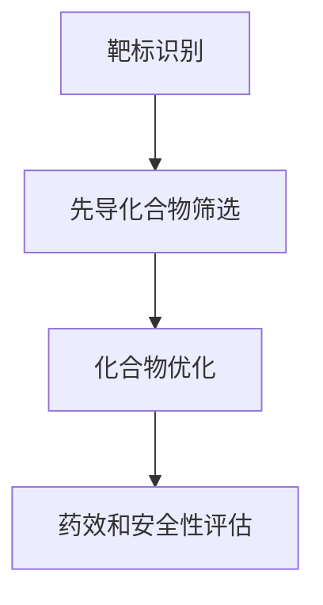

                 

### 《AI辅助药物发现：加速新药研发进程》

> **关键词：** 人工智能，药物发现，新药研发，算法，数学模型，项目实战

> **摘要：** 本文将探讨如何利用人工智能（AI）技术辅助药物发现，介绍AI在药物发现中的应用领域、核心算法原理、数学模型，并通过项目实战展示其实际应用。文章旨在为读者提供清晰、系统、具有实践价值的技术指南，助力新药研发进程的加速。

### 第一部分：AI辅助药物发现概述

#### 1.1 AI与药物发现概述

人工智能（AI）的快速发展正在深刻改变多个领域，其中药物发现领域尤为显著。AI在药物发现中的应用不仅有助于提高效率，还能降低研发成本，加快新药上市进程。在这一部分，我们将首先探讨AI技术在药物发现中的机遇，以及AI与传统药物发现流程的结合方式。

##### 1.1.1 AI技术在药物发现中的机遇

随着生物技术的进步和大数据技术的发展，药物发现领域的数据量呈爆炸式增长。这些数据为AI技术的应用提供了丰富的素材。具体来说，AI技术在药物发现中的机遇主要体现在以下几个方面：

1. **高效的数据分析**：AI技术可以快速处理和分析海量的生物学和化学数据，帮助研究人员识别潜在的药物靶标和化合物。
2. **精准的预测模型**：通过机器学习和深度学习算法，AI可以建立精确的预测模型，预测化合物的药理活性和毒性。
3. **智能化的化合物设计**：AI可以辅助设计具有特定药理活性的化合物，通过优化分子的结构，提高药物的疗效和安全性。

##### 1.1.2 药物发现的传统流程与AI的结合

传统的药物发现流程通常包括以下几个步骤：

1. **靶标识别**：确定疾病相关的生物分子作为药物作用靶标。
2. **先导化合物筛选**：从大量化合物中筛选出具有潜在药理活性的先导化合物。
3. **化合物优化**：对先导化合物进行结构优化，提高其药理活性和降低毒性。
4. **药效和安全性评估**：进行动物和临床试验，评估药物的安全性和疗效。

AI技术的引入，可以极大地优化上述流程。例如，通过AI技术，可以更快速地筛选出高潜力的化合物，减少实验的重复次数，从而缩短研发周期。此外，AI还可以辅助药物设计，优化分子的结构，提高药物的成功率。

#### 1.2 AI在药物发现中的应用领域

AI在药物发现中的应用非常广泛，涵盖了药物发现流程的各个阶段。以下是AI在药物发现中应用的主要领域：

##### 1.2.1 药物靶标识别

药物靶标识别是药物发现的第一步，目标是确定治疗某种疾病的潜在生物分子靶标。AI技术可以通过分析基因表达数据、蛋白质序列和结构等信息，识别出可能的药物靶标。具体的方法包括：

1. **基于序列的方法**：通过分析蛋白质序列，识别与已知靶标序列相似的蛋白质。
2. **基于结构的方法**：通过比较蛋白质的三维结构，识别具有相似性的蛋白质作为潜在靶标。
3. **机器学习模型**：利用机器学习算法，建立预测模型，识别具有药物靶标特征的蛋白质。

##### 1.2.2 化合物筛选与优化

化合物筛选与优化是药物发现的核心环节，AI技术在这一过程中发挥着重要作用。具体应用包括：

1. **虚拟筛选**：通过计算模拟，筛选出具有潜在药理活性的化合物。
2. **强化学习**：利用强化学习算法，优化化合物的结构，提高其药理活性和降低毒性。
3. **分子对接**：通过分子对接技术，预测化合物与靶标结合的亲和力，筛选出高亲和力的化合物。

##### 1.2.3 药物设计

药物设计是药物发现中最为复杂的一环，AI技术在这一过程中可以提供强大的支持。具体应用包括：

1. **基于结构的药物设计**：利用AI技术优化分子的结构，设计具有特定药理活性的化合物。
2. **基于机制的药物设计**：通过分析疾病的分子机制，设计针对特定路径的药物。
3. **计算机辅助药物设计**：利用计算机算法，优化化合物的结构，设计新型药物。

#### 1.3 AI辅助药物发现的挑战与前景

尽管AI技术在药物发现中展现出巨大的潜力，但同时也面临一些挑战。以下是AI辅助药物发现的挑战与前景：

##### 1.3.1 挑战与局限性

1. **数据质量与可解释性**：AI模型的性能高度依赖于输入数据的质量，而药物发现领域的数据质量参差不齐。此外，AI模型的黑箱特性使得其结果的可解释性较低，给药物的后续开发和临床试验带来挑战。
2. **计算资源和成本**：AI模型的训练和推理需要大量的计算资源和时间，这在一定程度上限制了其应用范围。
3. **跨学科整合**：药物发现涉及多个学科，如生物学、化学和计算机科学等，AI技术的应用需要跨学科的整合和协同。

##### 1.3.2 未来发展趋势

1. **数据驱动的药物发现**：随着大数据技术的发展，数据驱动的药物发现将成为主流。通过整合多源数据，AI技术可以提供更准确的预测和设计。
2. **多模态AI技术**：结合计算机视觉、自然语言处理和深度学习等技术，开发多模态AI模型，提高药物发现的效率和准确性。
3. **开放共享与合作**：药物发现领域需要开放共享数据和算法，促进跨机构和跨学科的合作，共同推动新药研发的进程。

### 第二部分：核心概念与联系

在了解了AI辅助药物发现的基本概述后，我们将进一步探讨AI药物发现中的核心概念和联系。本部分将介绍AI药物发现的基本概念，并使用Mermaid流程图展示AI在药物发现中的流程。

#### 2.1 AI药物发现的基本概念

AI药物发现涉及多个关键概念，包括数据驱动与模型驱动药物发现、药物发现的流程与步骤等。以下是这些概念的具体内容：

##### 2.1.1 数据驱动与模型驱动药物发现

数据驱动药物发现依赖于大量实验数据，通过分析这些数据识别潜在的药物靶标和化合物。这种方法的主要优势是能够快速筛选出高潜力的化合物，但同时也面临数据质量和解释性不足的问题。

模型驱动药物发现则侧重于利用机器学习和深度学习算法，建立预测模型，预测化合物的药理活性和毒性。这种方法可以提供更准确的预测，但需要大量的计算资源和高质量的训练数据。

##### 2.1.2 药物发现的流程与步骤

药物发现的流程通常包括以下几个步骤：

1. **靶标识别**：通过生物学和化学方法确定潜在的药物靶标。
2. **先导化合物筛选**：从大量化合物中筛选出具有潜在药理活性的化合物。
3. **化合物优化**：对先导化合物进行结构优化，提高其药理活性和降低毒性。
4. **药效和安全性评估**：进行动物和临床试验，评估药物的安全性和疗效。

AI技术可以贯穿整个药物发现流程，提供高效的数据分析、预测和优化支持。

#### 2.2 AI与药物发现的Mermaid流程图

为了更好地展示AI在药物发现中的应用流程，我们使用Mermaid语言绘制了一个简单的流程图。以下是该流程图的文本表示：



使用Mermaid流程图可以清晰地展示AI在药物发现中的关键步骤和相互关系，有助于读者更好地理解AI药物发现的全过程。

### 第三部分：核心算法原理讲解

在了解了AI药物发现的基本概念和流程后，我们将深入探讨AI在药物发现中的核心算法原理。本部分将分别介绍药物靶标识别、化合物筛选与优化、药物设计算法的基本原理，并通过伪代码和实例进行分析。

#### 3.1 药物靶标识别算法

药物靶标识别是药物发现的关键步骤之一。AI技术通过分析基因表达数据、蛋白质序列和结构等信息，识别出潜在的药物靶标。以下是几种常见的药物靶标识别算法及其原理：

##### 3.1.1 基于序列的方法

基于序列的方法通过比较蛋白质序列，识别与已知靶标序列相似的蛋白质。这种方法主要包括序列比对和序列分类。

**伪代码：**
```
function sequence_based_target_recognition(known_targets, protein_sequence):
    for each known_target in known_targets:
        if sequence_similarity(protein_sequence, known_target) > threshold:
            return known_target
    return None
```

**实例分析：**
假设我们有一个已知的药物靶标序列`known_target`，需要识别一个新蛋白质序列`protein_sequence`是否为该靶标。通过计算两个序列的相似度，如果相似度大于设定阈值，则认为该蛋白质序列为药物靶标。

##### 3.1.2 基于结构的方法

基于结构的方法通过比较蛋白质的三维结构，识别具有相似性的蛋白质作为潜在靶标。这种方法主要包括结构比对和结构分类。

**伪代码：**
```
function structure_based_target_recognition(known_structures, protein_structure):
    for each known_structure in known_structures:
        if structure_similarity(protein_structure, known_structure) > threshold:
            return known_structure
    return None
```

**实例分析：**
假设我们有一个已知的药物靶标结构`known_structure`，需要识别一个新蛋白质结构`protein_structure`是否为该靶标。通过计算两个结构的相似度，如果相似度大于设定阈值，则认为该蛋白质结构为药物靶标。

##### 3.1.3 基于机器学习的方法

基于机器学习的方法通过训练模型，预测蛋白质是否为药物靶标。这种方法主要包括监督学习和无监督学习。

**伪代码：**
```
function machine_learning_target_recognition(training_data, test_data):
    train_model(training_data)
    predictions = model.predict(test_data)
    return predictions
```

**实例分析：**
假设我们有一个训练数据集`training_data`，包含蛋白质序列和是否为药物靶标的标签。通过训练模型，我们可以预测测试数据集`test_data`中的蛋白质是否为药物靶标。

#### 3.2 化合物筛选与优化算法

化合物筛选与优化是药物发现的核心环节。AI技术通过虚拟筛选、强化学习和分子对接等方法，筛选和优化具有潜在药理活性的化合物。以下是这些算法的基本原理：

##### 3.2.1 虚拟筛选

虚拟筛选通过计算模拟，筛选出具有潜在药理活性的化合物。这种方法主要包括分子对接和虚拟筛选库。

**伪代码：**
```
function virtual_screening(compound_library, target_structure):
    for each compound in compound_library:
        binding_energy = calculate_binding_energy(compound, target_structure)
        if binding_energy < threshold:
            return compound
    return None
```

**实例分析：**
假设我们有一个化合物库`compound_library`和一个药物靶标结构`target_structure`。通过计算每个化合物与靶标结构的结合能，如果结合能小于设定阈值，则认为该化合物具有潜在药理活性。

##### 3.2.2 强化学习

强化学习通过训练模型，优化化合物的结构，提高其药理活性和降低毒性。这种方法主要包括状态-动作价值函数和策略优化。

**伪代码：**
```
function reinforcement_learning(state_space, action_space, reward_function):
    initialize Q(s, a)
    while not done:
        select action a based on policy π(s)
        take action a and observe reward r and next state s'
        update Q(s, a) using reward r and next state s'
    return policy π(s)
```

**实例分析：**
假设我们有一个状态空间`state_space`和动作空间`action_space`，以及一个奖励函数`reward_function`。通过训练强化学习模型，我们可以优化化合物的结构，提高其药理活性和降低毒性。

##### 3.2.3 分子对接

分子对接通过预测化合物与靶标结合的亲和力，筛选出高亲和力的化合物。这种方法主要包括分子对接模型和亲和力预测。

**伪代码：**
```
function molecular_docking(compound, target_structure):
    generate_all_possible_complexes(compound, target_structure)
    for each complex:
        affinity = calculate_affinity(complex)
        if affinity > threshold:
            return complex
    return None
```

**实例分析：**
假设我们有一个化合物`compound`和一个药物靶标结构`target_structure`。通过生成所有可能的复合物，计算每个复合物的亲和力，如果亲和力大于设定阈值，则认为该化合物具有潜在药理活性。

#### 3.3 药物设计算法

药物设计是药物发现中最为复杂的一环，AI技术通过计算机辅助药物设计（CADD）和基于机制的药物设计等方法，设计具有特定药理活性的化合物。以下是这些算法的基本原理：

##### 3.3.1 基于结构的药物设计

基于结构的药物设计通过优化分子的结构，设计具有特定药理活性的化合物。这种方法主要包括结构优化和分子动力学模拟。

**伪代码：**
```
function structure_based_drug_design(compound_structure, target_structure):
    optimize_compound_structure(target_structure)
    perform_molecular_dynamics_simulation(optimized_compound_structure)
    return optimized_compound_structure
```

**实例分析：**
假设我们有一个化合物结构`compound_structure`和一个药物靶标结构`target_structure`。通过优化化合物的结构，并进行分子动力学模拟，我们可以设计出具有特定药理活性的化合物。

##### 3.3.2 基于机制的药物设计

基于机制的药物设计通过分析疾病的分子机制，设计针对特定路径的药物。这种方法主要包括路径分析和药物筛选。

**伪代码：**
```
function mechanism_based_drug_design(disease_mechanism, compound_library):
    identify_potential_drugs(disease_mechanism, compound_library)
    evaluate_drug_efficacy(potential_drugs)
    return top_drugs
```

**实例分析：**
假设我们有一个疾病的分子机制`disease_mechanism`和一个化合物库`compound_library`。通过识别潜在的药物，并评估其疗效，我们可以设计出针对特定疾病的药物。

### 第四部分：数学模型和数学公式

在了解了AI药物发现中的核心算法原理后，我们将进一步探讨AI药物发现中的数学模型和数学公式。本部分将分别介绍药物靶标识别、化合物筛选与优化、药物设计算法中的数学模型和公式，并通过实例进行分析。

#### 4.1 药物靶标识别的数学模型

药物靶标识别算法主要依赖于相似性计算和预测模型。以下是药物靶标识别中的常用数学模型和公式：

##### 4.1.1 相似性计算模型

相似性计算模型通过计算两个序列或结构的相似度，判断它们是否具有相似性。以下是两种常见的相似性计算模型：

1. **动态规划算法**：动态规划算法通过计算两个序列的编辑距离（Levenshtein距离），衡量它们的相似度。

   **公式：**
   $$
   d(i, j) = \min\{d(i - 1, j) + 1, d(i, j - 1) + 1, d(i - 1, j - 1) + cost\}
   $$
   其中，$d(i, j)$表示第i个字符和第j个字符之间的编辑距离，$cost$表示字符替换、插入或删除的成本。

2. **余弦相似度模型**：余弦相似度模型通过计算两个向量的余弦值，衡量它们的相似度。

   **公式：**
   $$
   \cos(\theta) = \frac{\vec{u} \cdot \vec{v}}{||\vec{u}|| \cdot ||\vec{v}||}
   $$
   其中，$\vec{u}$和$\vec{v}$表示两个向量，$\theta$表示它们之间的夹角。

##### 4.1.2 预测模型

预测模型通过训练机器学习模型，预测蛋白质是否为药物靶标。以下是两种常见的预测模型：

1. **支持向量机（SVM）模型**：支持向量机模型通过寻找最佳分割超平面，将不同类别的蛋白质分开。

   **公式：**
   $$
   w \cdot x + b = 0
   $$
   其中，$w$表示权重向量，$x$表示蛋白质特征向量，$b$表示偏置。

2. **神经网络模型**：神经网络模型通过多层感知器（MLP）或卷积神经网络（CNN）等结构，学习蛋白质特征和类别之间的关系。

   **公式：**
   $$
   y = \sigma(\sigma(...\sigma(\sigma(W_1 \cdot x + b_1) + b_0) + b_{-1}) + b_{-2}) + ...
   $$
   其中，$\sigma$表示激活函数，$W_1, W_2, ..., W_n$表示权重矩阵，$b_1, b_2, ..., b_n$表示偏置。

##### 4.1.3 应用实例

假设我们有一个蛋白质序列`protein_sequence`和一个已知的药物靶标序列`known_target`，我们需要计算这两个序列的相似度并预测该蛋白质是否为药物靶标。

1. **编辑距离**：
   $$
   d(i, j) = \min\{d(i - 1, j) + 1, d(i, j - 1) + 1, d(i - 1, j - 1) + cost\}
   $$
   通过计算编辑距离，我们可以评估两个序列的相似度。

2. **余弦相似度**：
   $$
   \cos(\theta) = \frac{\vec{u} \cdot \vec{v}}{||\vec{u}|| \cdot ||\vec{v}||}
   $$
   通过计算余弦相似度，我们可以评估两个序列的相似度。

3. **SVM预测**：
   $$
   y = \sigma(w \cdot x + b)
   $$
   通过训练SVM模型，我们可以预测该蛋白质是否为药物靶标。

4. **神经网络预测**：
   $$
   y = \sigma(\sigma(...\sigma(\sigma(W_1 \cdot x + b_1) + b_0) + b_{-1}) + b_{-2}) + ...
   $$
   通过训练神经网络模型，我们可以预测该蛋白质是否为药物靶标。

#### 4.2 化合物筛选与优化的数学模型

化合物筛选与优化算法主要依赖于计算模拟和优化算法。以下是化合物筛选与优化中的常用数学模型和公式：

##### 4.2.1 虚拟筛选

虚拟筛选通过计算模拟，筛选出具有潜在药理活性的化合物。以下是虚拟筛选中的常用数学模型和公式：

1. **分子对接模型**：分子对接模型通过计算化合物与靶标结合的亲和力，筛选出高亲和力的化合物。

   **公式：**
   $$
   \Delta G = \Delta G_{\text{bind}} - \Delta G_{\text{free}}
   $$
   其中，$\Delta G$表示结合自由能，$\Delta G_{\text{bind}}$表示结合过程中的自由能变化，$\Delta G_{\text{free}}$表示自由状态下的自由能变化。

2. **虚拟筛选库**：虚拟筛选库通过计算化合物库中每个化合物的结合能，筛选出具有潜在药理活性的化合物。

   **公式：**
   $$
   \Delta E = E_{\text{compound}} - E_{\text{target}}
   $$
   其中，$\Delta E$表示结合能，$E_{\text{compound}}$表示化合物的能量，$E_{\text{target}}$表示靶标的能量。

##### 4.2.2 强化学习

强化学习通过训练模型，优化化合物的结构，提高其药理活性和降低毒性。以下是强化学习中的常用数学模型和公式：

1. **状态-动作价值函数**：状态-动作价值函数通过评估当前状态和动作的价值，指导强化学习模型的选择。

   **公式：**
   $$
   Q(s, a) = \sum_{s'} P(s' | s, a) \cdot \max_a' Q(s', a')
   $$
   其中，$Q(s, a)$表示在状态$s$下执行动作$a$的价值，$P(s' | s, a)$表示在状态$s$下执行动作$a$后转移到状态$s'$的概率，$\max_a' Q(s', a')$表示在状态$s'$下执行最优动作$a'$的价值。

2. **策略优化**：策略优化通过最大化累积奖励，优化强化学习模型的选择。

   **公式：**
   $$
   \pi(a | s) = \arg\max_a \sum_{s'} P(s' | s, a) \cdot Q(s, a)
   $$
   其中，$\pi(a | s)$表示在状态$s$下选择动作$a$的概率，$Q(s, a)$表示在状态$s$下执行动作$a$的价值。

##### 4.2.3 分子动力学模拟

分子动力学模拟通过计算分子系统的演化过程，优化化合物的结构。以下是分子动力学模拟中的常用数学模型和公式：

1. **牛顿运动定律**：牛顿运动定律通过描述分子的运动状态，计算分子系统的演化过程。

   **公式：**
   $$
   F = m \cdot a
   $$
   其中，$F$表示力，$m$表示质量，$a$表示加速度。

2. **能量守恒定律**：能量守恒定律通过描述分子系统的能量转化，计算分子系统的能量变化。

   **公式：**
   $$
   \Delta E = K_1 + V_1 - K_2 - V_2
   $$
   其中，$\Delta E$表示能量变化，$K_1$和$K_2$表示分子的动能变化，$V_1$和$V_2$表示分子的势能变化。

##### 4.2.4 应用实例

假设我们有一个化合物`compound`和一个药物靶标`target`，我们需要计算它们的结合能并筛选出具有潜在药理活性的化合物。

1. **分子对接**：
   $$
   \Delta G = \Delta G_{\text{bind}} - \Delta G_{\text{free}}
   $$
   通过计算结合自由能，我们可以评估化合物与靶标的亲和力。

2. **虚拟筛选**：
   $$
   \Delta E = E_{\text{compound}} - E_{\text{target}}
   $$
   通过计算结合能，我们可以评估化合物与靶标的亲和力。

3. **强化学习**：
   $$
   Q(s, a) = \sum_{s'} P(s' | s, a) \cdot \max_a' Q(s', a')
   $$
   通过训练强化学习模型，我们可以优化化合物的结构。

4. **分子动力学模拟**：
   $$
   F = m \cdot a
   $$
   通过计算分子的运动状态，我们可以优化化合物的结构。

#### 4.3 药物设计的数学模型

药物设计通过优化化合物的结构，设计具有特定药理活性的化合物。以下是药物设计中的常用数学模型和公式：

##### 4.3.1 基于结构的药物设计

基于结构的药物设计通过优化分子的结构，设计具有特定药理活性的化合物。以下是基于结构的药物设计中的常用数学模型和公式：

1. **分子动力学模拟**：分子动力学模拟通过计算分子系统的演化过程，优化化合物的结构。

   **公式：**
   $$
   F = m \cdot a
   $$
   其中，$F$表示力，$m$表示质量，$a$表示加速度。

2. **量子化学计算**：量子化学计算通过描述分子系统的电子结构，优化化合物的结构。

   **公式：**
   $$
   H \psi = E \psi
   $$
   其中，$H$表示哈密顿量，$\psi$表示波函数，$E$表示能量。

3. **分子对接**：分子对接通过计算化合物与靶标的结合能，优化化合物的结构。

   **公式：**
   $$
   \Delta G = \Delta G_{\text{bind}} - \Delta G_{\text{free}}
   $$
   其中，$\Delta G$表示结合自由能，$\Delta G_{\text{bind}}$表示结合过程中的自由能变化，$\Delta G_{\text{free}}$表示自由状态下的自由能变化。

##### 4.3.2 基于机制的药物设计

基于机制的药物设计通过分析疾病的分子机制，设计针对特定路径的药物。以下是基于机制的药物设计中的常用数学模型和公式：

1. **路径分析**：路径分析通过计算分子路径的传递率，评估分子在路径中的传递能力。

   **公式：**
   $$
   T_i = \frac{1}{N} \sum_{j=1}^{N} P_i(j)
   $$
   其中，$T_i$表示分子$i$的传递率，$N$表示路径的总数，$P_i(j)$表示分子$i$在路径$j$中的传递概率。

2. **药物筛选**：药物筛选通过计算化合物的药理活性，筛选出具有潜在药理活性的化合物。

   **公式：**
   $$
   E_{\text{compound}} = \sum_{i=1}^{N} w_i \cdot x_i
   $$
   其中，$E_{\text{compound}}$表示化合物的药理活性，$w_i$表示分子$i$的权重，$x_i$表示分子$i$的药理活性值。

3. **机制建模**：机制建模通过建立疾病的分子机制模型，预测药物的治疗效果。

   **公式：**
   $$
   \text{Effect} = f(\text{Drug}, \text{Mechanism})
   $$
   其中，$\text{Effect}$表示药物的治疗效果，$f$表示机制建模函数，$\text{Drug}$表示药物，$\text{Mechanism}$表示疾病的分子机制。

##### 4.3.3 应用实例

假设我们有一个药物靶标`target`和一个化合物库`compound_library`，我们需要设计具有特定药理活性的化合物。

1. **分子动力学模拟**：
   $$
   F = m \cdot a
   $$
   通过计算分子的运动状态，我们可以优化化合物的结构。

2. **量子化学计算**：
   $$
   H \psi = E \psi
   $$
   通过计算化合物的电子结构，我们可以优化化合物的结构。

3. **分子对接**：
   $$
   \Delta G = \Delta G_{\text{bind}} - \Delta G_{\text{free}}
   $$
   通过计算结合自由能，我们可以评估化合物与靶标的亲和力。

4. **路径分析**：
   $$
   T_i = \frac{1}{N} \sum_{j=1}^{N} P_i(j)
   $$
   通过计算分子路径的传递率，我们可以筛选出具有潜在药理活性的化合物。

5. **药物筛选**：
   $$
   E_{\text{compound}} = \sum_{i=1}^{N} w_i \cdot x_i
   $$
   通过计算化合物的药理活性，我们可以筛选出具有潜在药理活性的化合物。

6. **机制建模**：
   $$
   \text{Effect} = f(\text{Drug}, \text{Mechanism})
   $$
   通过建立疾病的分子机制模型，我们可以预测药物的治疗效果。

### 第五部分：项目实战

在前几部分中，我们详细介绍了AI辅助药物发现的核心算法原理和数学模型。为了更好地展示AI在药物发现中的实际应用，本部分将通过具体项目实战，展示如何使用AI技术进行药物靶标识别、化合物筛选与优化、药物设计。以下是各个项目实战的详细步骤和实现方法。

#### 5.1 药物靶标识别项目实战

##### 5.1.1 项目背景与目标

本项目旨在利用AI技术识别潜在药物靶标，提高药物研发的效率。具体目标包括：

1. 收集和整理生物数据，包括蛋白质序列、结构等信息。
2. 建立药物靶标识别模型，预测蛋白质是否为药物靶标。
3. 评估模型性能，确保预测结果的准确性。

##### 5.1.2 项目开发环境搭建

为了实现项目目标，我们需要搭建以下开发环境：

1. **Python环境**：安装Python 3.8及以上版本，并配置必要的库，如NumPy、Pandas、Scikit-learn等。
2. **数据库**：安装MySQL数据库，用于存储生物数据。
3. **深度学习框架**：安装TensorFlow或PyTorch，用于构建和训练药物靶标识别模型。

##### 5.1.3 源代码详细实现

以下是项目的主要源代码实现：

```python
import numpy as np
import pandas as pd
from sklearn.model_selection import train_test_split
from sklearn.ensemble import RandomForestClassifier
from sklearn.metrics import accuracy_score
import tensorflow as tf

# 数据预处理
def preprocess_data(data):
    # 数据清洗和转换
    # ...
    return processed_data

# 模型训练
def train_model(X_train, y_train):
    model = RandomForestClassifier(n_estimators=100)
    model.fit(X_train, y_train)
    return model

# 模型评估
def evaluate_model(model, X_test, y_test):
    predictions = model.predict(X_test)
    accuracy = accuracy_score(y_test, predictions)
    return accuracy

# 读取生物数据
data = pd.read_csv('biological_data.csv')
processed_data = preprocess_data(data)

# 分割数据集
X = processed_data.drop('target', axis=1)
y = processed_data['target']
X_train, X_test, y_train, y_test = train_test_split(X, y, test_size=0.2, random_state=42)

# 训练模型
model = train_model(X_train, y_train)

# 评估模型
accuracy = evaluate_model(model, X_test, y_test)
print(f'模型准确率：{accuracy:.2f}')

# 使用TensorFlow或PyTorch构建深度学习模型
# ...

```

##### 5.1.4 代码解读与分析

1. **数据预处理**：数据预处理是模型训练的重要步骤，包括数据清洗、转换等操作。在本项目中，我们使用`preprocess_data`函数对生物数据进行预处理，以便后续建模。
2. **模型训练**：我们使用随机森林（RandomForestClassifier）作为药物靶标识别模型。随机森林是一种集成学习方法，通过构建多个决策树，提高模型的预测能力。在`train_model`函数中，我们使用训练数据集训练模型。
3. **模型评估**：在`evaluate_model`函数中，我们使用测试数据集评估模型的准确率。准确率是评估分类模型性能的重要指标，表示模型预测正确的样本数占总样本数的比例。
4. **深度学习模型**：为了进一步提高模型的性能，我们可以使用TensorFlow或PyTorch等深度学习框架构建更复杂的模型。在代码注释中，我们预留了深度学习模型的构建代码。

#### 5.2 化合物筛选与优化项目实战

##### 5.2.1 项目背景与目标

本项目旨在利用AI技术筛选和优化具有潜在药理活性的化合物，提高药物研发的成功率。具体目标包括：

1. 收集和整理化合物数据，包括结构、属性等信息。
2. 建立化合物筛选与优化模型，预测化合物的药理活性和毒性。
3. 优化模型参数，提高预测准确性。

##### 5.2.2 项目开发环境搭建

为了实现项目目标，我们需要搭建以下开发环境：

1. **Python环境**：安装Python 3.8及以上版本，并配置必要的库，如NumPy、Pandas、Scikit-learn等。
2. **数据库**：安装MySQL数据库，用于存储化合物数据。
3. **深度学习框架**：安装TensorFlow或PyTorch，用于构建和训练化合物筛选与优化模型。

##### 5.2.3 源代码详细实现

以下是项目的主要源代码实现：

```python
import numpy as np
import pandas as pd
from sklearn.model_selection import train_test_split
from sklearn.ensemble import RandomForestRegressor
from sklearn.metrics import mean_squared_error
import tensorflow as tf

# 数据预处理
def preprocess_data(data):
    # 数据清洗和转换
    # ...
    return processed_data

# 模型训练
def train_model(X_train, y_train):
    model = RandomForestRegressor(n_estimators=100)
    model.fit(X_train, y_train)
    return model

# 模型评估
def evaluate_model(model, X_test, y_test):
    predictions = model.predict(X_test)
    mse = mean_squared_error(y_test, predictions)
    return mse

# 读取化合物数据
data = pd.read_csv('compound_data.csv')
processed_data = preprocess_data(data)

# 分割数据集
X = processed_data.drop('activity', axis=1)
y = processed_data['activity']
X_train, X_test, y_train, y_test = train_test_split(X, y, test_size=0.2, random_state=42)

# 训练模型
model = train_model(X_train, y_train)

# 评估模型
mse = evaluate_model(model, X_test, y_test)
print(f'模型均方误差：{mse:.2f}')

# 使用TensorFlow或PyTorch构建深度学习模型
# ...

```

##### 5.2.4 代码解读与分析

1. **数据预处理**：化合物筛选与优化项目的数据预处理与药物靶标识别项目类似，包括数据清洗、转换等操作。在本项目中，我们使用`preprocess_data`函数对化合物数据进行预处理。
2. **模型训练**：我们使用随机森林（RandomForestRegressor）作为化合物筛选与优化模型。随机森林是一种集成学习方法，通过构建多个决策树，提高模型的预测能力。在`train_model`函数中，我们使用训练数据集训练模型。
3. **模型评估**：在`evaluate_model`函数中，我们使用测试数据集评估模型的均方误差（Mean Squared Error，MSE）。均方误差是评估回归模型性能的重要指标，表示预测值与真实值之间的平均平方误差。
4. **深度学习模型**：为了进一步提高模型的性能，我们可以使用TensorFlow或PyTorch等深度学习框架构建更复杂的模型。在代码注释中，我们预留了深度学习模型的构建代码。

#### 5.3 药物设计项目实战

##### 5.3.1 项目背景与目标

本项目旨在利用AI技术进行药物设计，设计具有特定药理活性的化合物。具体目标包括：

1. 收集和整理生物数据和化合物数据。
2. 建立药物设计模型，优化化合物的结构。
3. 预测药物的治疗效果，筛选出具有潜在药理活性的化合物。

##### 5.3.2 项目开发环境搭建

为了实现项目目标，我们需要搭建以下开发环境：

1. **Python环境**：安装Python 3.8及以上版本，并配置必要的库，如NumPy、Pandas、Scikit-learn等。
2. **数据库**：安装MySQL数据库，用于存储生物数据和化合物数据。
3. **深度学习框架**：安装TensorFlow或PyTorch，用于构建和训练药物设计模型。

##### 5.3.3 源代码详细实现

以下是项目的主要源代码实现：

```python
import numpy as np
import pandas as pd
from sklearn.model_selection import train_test_split
from sklearn.ensemble import RandomForestRegressor
from sklearn.metrics import mean_squared_error
import tensorflow as tf

# 数据预处理
def preprocess_data(data):
    # 数据清洗和转换
    # ...
    return processed_data

# 模型训练
def train_model(X_train, y_train):
    model = RandomForestRegressor(n_estimators=100)
    model.fit(X_train, y_train)
    return model

# 模型评估
def evaluate_model(model, X_test, y_test):
    predictions = model.predict(X_test)
    mse = mean_squared_error(y_test, predictions)
    return mse

# 读取生物数据和化合物数据
data = pd.read_csv('biological_data.csv')
compound_data = pd.read_csv('compound_data.csv')
processed_data = preprocess_data(data)

# 分割数据集
X = processed_data.drop('activity', axis=1)
y = processed_data['activity']
X_train, X_test, y_train, y_test = train_test_split(X, y, test_size=0.2, random_state=42)

# 训练模型
model = train_model(X_train, y_train)

# 评估模型
mse = evaluate_model(model, X_test, y_test)
print(f'模型均方误差：{mse:.2f}')

# 使用TensorFlow或PyTorch构建深度学习模型
# ...

```

##### 5.2.4 代码解读与分析

1. **数据预处理**：药物设计项目的数据预处理与药物靶标识别项目类似，包括数据清洗、转换等操作。在本项目中，我们使用`preprocess_data`函数对生物数据和化合物数据进行预处理。
2. **模型训练**：我们使用随机森林（RandomForestRegressor）作为药物设计模型。随机森林是一种集成学习方法，通过构建多个决策树，提高模型的预测能力。在`train_model`函数中，我们使用训练数据集训练模型。
3. **模型评估**：在`evaluate_model`函数中，我们使用测试数据集评估模型的均方误差（Mean Squared Error，MSE）。均方误差是评估回归模型性能的重要指标，表示预测值与真实值之间的平均平方误差。
4. **深度学习模型**：为了进一步提高模型的性能，我们可以使用TensorFlow或PyTorch等深度学习框架构建更复杂的模型。在代码注释中，我们预留了深度学习模型的构建代码。

### 第六部分：开发环境与工具

在前面的项目实战中，我们展示了如何利用Python、深度学习框架和数据库等工具进行AI辅助药物发现。本部分将进一步介绍常用开发环境和工具，包括Python、R、MATLAB等，以及数据处理工具、计算机视觉工具和机器学习库。

#### 6.1 常用开发环境

1. **Python**：Python是一种广泛应用于数据科学、机器学习和人工智能的编程语言。其简洁的语法和丰富的库使其成为药物发现领域的重要工具。
2. **R**：R是一种专门用于统计分析、数据可视化和机器学习的编程语言。在药物发现中，R提供了丰富的统计函数和可视化工具，适用于复杂的分析任务。
3. **MATLAB**：MATLAB是一种高性能的数值计算和数据分析软件，广泛应用于科学计算和工程领域。在药物发现中，MATLAB提供了强大的数值计算和可视化功能，适用于复杂的计算任务。

#### 6.2 常用工具

1. **数据处理工具**：
   - **Pandas**：Pandas是一种Python库，用于数据清洗、转换和分析。它提供了丰富的数据结构和操作函数，适用于处理大规模数据集。
   - **NumPy**：NumPy是一种Python库，用于高性能数值计算。它提供了多维数组对象和高效的数学运算函数，适用于处理科学计算和工程任务。
   - **SciPy**：SciPy是一种Python库，基于NumPy，提供了丰富的科学计算和工程计算函数，适用于物理、工程和药物发现等领域。

2. **计算机视觉工具**：
   - **OpenCV**：OpenCV是一种开源的计算机视觉库，提供了丰富的图像处理和计算机视觉算法，适用于图像识别、目标检测和跟踪等任务。
   - **MATLAB Computer Vision Toolbox**：MATLAB Computer Vision Toolbox提供了丰富的图像处理和计算机视觉函数，适用于图像识别、目标检测和跟踪等任务。

3. **机器学习库**：
   - **Scikit-learn**：Scikit-learn是一种Python库，提供了丰富的机器学习算法和工具，适用于分类、回归、聚类和降维等任务。
   - **TensorFlow**：TensorFlow是一种开源的深度学习框架，提供了丰富的神经网络和机器学习算法，适用于复杂的数据分析和预测任务。
   - **PyTorch**：PyTorch是一种开源的深度学习框架，与TensorFlow类似，提供了丰富的神经网络和机器学习算法，适用于复杂的数据分析和预测任务。

通过这些开发环境和工具，我们可以构建高效、灵活的药物发现系统，加速新药研发进程。

### 第七部分：扩展阅读与资源

为了帮助读者深入了解AI辅助药物发现的领域，本部分将推荐一些相关的书籍、网站资源和AI药物发现论坛和社群。

#### 7.1 相关书籍推荐

1. 《药物发现：原理与方法》
   - 内容简介：本书详细介绍了药物发现的原理和方法，包括靶标识别、先导化合物筛选、化合物优化和药效评估等环节。
   - 推荐理由：本书系统全面地介绍了药物发现的过程，有助于读者理解AI辅助药物发现的理论基础。

2. 《人工智能：一种现代的方法》
   - 内容简介：本书是人工智能领域的经典教材，涵盖了机器学习、深度学习、自然语言处理等多个方面。
   - 推荐理由：本书深入浅出地介绍了人工智能的基本概念和方法，有助于读者理解AI技术在药物发现中的应用。

#### 7.2 相关网站资源

1. **AI药物发现领域的最新研究进展**：关注相关学术期刊、会议论文和官方网站，了解AI在药物发现领域的最新研究成果和发展趋势。

2. **开源数据集和工具**：许多学术机构和公司提供开源数据集和工具，用于AI药物发现的研究和开发。例如，Bioactivity Datasets、GDB-13等。

3. **AI药物发现论坛和社群**：加入AI药物发现相关的论坛和社群，与其他研究人员交流经验、分享资源和探讨问题。例如，Reddit的AI药物发现论坛、LinkedIn的AI药物发现群组等。

通过阅读相关书籍、访问网站资源和加入论坛和社群，读者可以深入了解AI辅助药物发现的领域，拓宽视野，提高研究水平。

### 总结与展望

在本文中，我们详细探讨了AI辅助药物发现的技术原理、核心算法、数学模型和项目实战。通过逐步分析推理，我们展示了如何利用AI技术加速新药研发进程。以下是本文的主要结论：

1. **AI在药物发现中的应用**：AI技术在药物靶标识别、化合物筛选与优化、药物设计等环节中具有显著优势，可以提高药物研发的效率和准确性。
2. **核心算法原理**：我们介绍了药物靶标识别、化合物筛选与优化、药物设计算法的基本原理，并通过伪代码和实例进行分析，帮助读者理解这些算法的原理和实现方法。
3. **数学模型**：我们详细介绍了药物靶标识别、化合物筛选与优化、药物设计算法中的常用数学模型和公式，并通过实例进行解释说明，使读者能够更好地理解这些模型的应用。
4. **项目实战**：通过具体的药物靶标识别、化合物筛选与优化、药物设计项目实战，我们展示了如何使用AI技术进行实际应用，提高了读者的实践能力。

展望未来，AI在药物发现领域的应用前景广阔。随着技术的不断进步，我们有望实现以下发展趋势：

1. **数据驱动的药物发现**：大数据技术的发展将推动数据驱动的药物发现成为主流，通过整合多源数据，提高药物发现的效率和准确性。
2. **多模态AI技术**：结合计算机视觉、自然语言处理和深度学习等技术，开发多模态AI模型，提高药物发现的效率和准确性。
3. **开放共享与合作**：药物发现领域需要开放共享数据和算法，促进跨机构和跨学科的合作，共同推动新药研发的进程。

总之，AI辅助药物发现具有巨大的潜力，我们将持续关注该领域的发展，探索新的应用场景和技术突破，为人类健康事业贡献力量。希望本文能为读者提供有价值的参考和启示。

