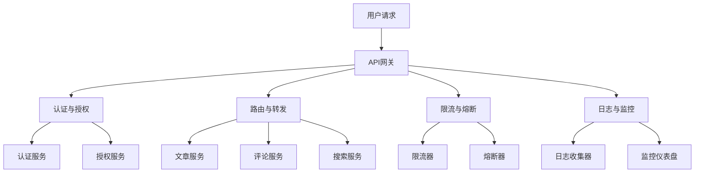

                 

# 《API 网关的详细功能》

## 关键词
API网关、路由转发、限流与熔断、认证与授权、负载均衡、架构设计、性能优化、微服务架构、开源项目

## 摘要
本文将深入探讨API网关的详细功能，包括其核心概念、技术原理、架构设计、性能优化以及在实际项目中的应用。通过详细的步骤分析和实例讲解，帮助读者全面理解API网关在现代微服务架构中的重要作用和最佳实践。

## 目录大纲

### 第一部分：API网关基础

### 第二部分：API网关技术原理

### 第三部分：API网关应用实践

### 第四部分：API网关趋势与发展

### 附录：API网关资源汇总

---

### 第一部分：API网关基础

#### 第1章：API网关概述

#### 第2章：API网关的核心功能

---

### 第二部分：API网关技术原理

#### 第3章：API网关架构设计

#### 第4章：API网关实现技术

#### 第5章：API网关性能优化

---

### 第三部分：API网关应用实践

#### 第6章：API网关项目实战

#### 第7章：API网关最佳实践

---

### 第四部分：API网关趋势与发展

#### 第8章：API网关未来趋势

---

### 附录：API网关资源汇总

---

### 第一部分：API网关基础

#### 第1章：API网关概述

### 1.1 API网关的概念与重要性

API网关是一种服务器，负责接收外部服务请求并将其转发到内部服务，同时提供统一的接口管理和访问控制。在微服务架构中，API网关扮演着重要的角色，它提供了服务路由、负载均衡、安全认证等功能，有助于提高系统的稳定性、安全性和可扩展性。

#### 1.2 API网关的发展历程

API网关的发展历程可以分为三个阶段：

1. 早期API网关：早期API网关主要是基于传统中间件实现的，如Apache、Nginx等，主要用于简单的服务路由和负载均衡。
2. 微服务时代的API网关：随着微服务架构的流行，API网关的功能逐渐丰富，不仅包括服务路由和负载均衡，还增加了认证、授权、限流等特性。
3. 现代API网关：现代API网关更加注重性能和可扩展性，采用了分布式架构，支持多语言、多协议的服务转发，同时提供了丰富的插件机制，方便开发者根据需求进行功能扩展。

#### 1.3 API网关与传统中间件的区别

1. 功能差异：API网关除了具备传统中间件的常见功能外，还增加了服务治理、安全防护、流量控制等高级功能。
2. 架构差异：API网关通常采用分布式架构，能够更好地支持高并发和高可用性。而传统中间件通常采用单点架构，容易成为系统的性能瓶颈。
3. 适应场景：API网关更适合微服务架构和云计算环境，能够更好地满足复杂业务场景的需求。而传统中间件更适合传统的单体应用场景。

### 第2章：API网关的核心功能

#### 2.1 路由转发

路由转发是指API网关根据请求的URL或方法，将请求转发到相应的后端服务。路由转发是API网关最基本的功能之一。

#### 2.1.1 路由转发原理

API网关接收到请求后，会根据请求的URL或方法，匹配相应的路由规则，然后转发到对应的后端服务。路由规则通常包含匹配条件和目标服务地址。

#### 2.1.2 路由策略

1. 基于URL的路由：根据请求的URL路径进行路由，适用于RESTful风格的接口。
2. 基于方法的路由：根据请求的方法（如GET、POST、PUT等）进行路由，适用于不同类型的接口。
3. 基于请求头的路由：根据请求的头部信息（如Host、Referer等）进行路由，适用于特定环境的接口。

#### 2.1.3 路由配置与管理

路由配置与管理是指如何定义和修改路由规则，包括添加新路由、修改现有路由和删除路由。

1. 路由规则定义：定义路由规则时，需要指定匹配条件和目标服务地址。
2. 路由规则修改：根据业务需求，可以修改路由规则，如更改目标服务地址或匹配条件。
3. 路由规则删除：当不再需要某个路由规则时，可以将其删除。

#### 2.2 限流与熔断

限流与熔断是API网关的重要功能，用于防止服务被过多的请求压垮。

#### 2.2.1 限流原理

限流是指API网关限制某个服务在一定时间内的请求量，防止服务被过多的请求压垮。限流通常基于时间窗口或请求数量进行控制。

#### 2.2.2 熔断原理

熔断是指API网关在检测到后端服务出现异常时，自动切断与该服务的连接，防止异常扩散。熔断通常基于错误率或响应时间进行控制。

#### 2.2.3 限流与熔断策略

1. 基于时间的限流：根据时间窗口限制请求量，如每秒不超过5个请求。
2. 基于阈值的限流：根据请求量或错误率等指标，设置阈值进行限制。
3. 基于异常的熔断：根据错误率或响应时间等指标，触发熔断机制。

#### 2.3 认证与授权

认证与授权是API网关的重要安全功能，用于确保请求者的身份和权限。

#### 2.3.1 认证原理

认证是指API网关验证请求者身份的过程。常见的认证方式包括基本认证、OAuth2.0和JWT。

1. 基本认证：通过用户名和密码进行身份验证。
2. OAuth2.0：通过第三方授权服务器进行身份认证。
3. JWT：通过JSON Web Token进行身份认证。

#### 2.3.2 授权原理

授权是指API网关根据认证结果，确定请求者是否有权限访问某个资源。常见的授权方式包括基于用户的授权、基于角色的授权和基于资源的授权。

1. 基于用户的授权：根据用户身份确定权限。
2. 基于角色的授权：根据用户角色确定权限。
3. 基于资源的授权：根据资源本身属性确定权限。

#### 2.3.3 认证与授权策略

1. 双因素认证：结合基本认证和OAuth2.0，提高认证安全性。
2. 基于JWT的认证与授权：使用JWT进行身份认证和权限控制。

#### 2.4 负载均衡

负载均衡是指API网关将请求分配到多个后端服务实例上，确保系统的高可用性和高性能。

#### 2.4.1 负载均衡原理

负载均衡通过以下步骤实现：

1. 接收请求：API网关接收客户端的请求。
2. 负载均衡算法：API网关根据负载均衡算法选择合适的服务实例。
3. 转发请求：API网关将请求转发到选定的服务实例。
4. 返回响应：服务实例处理请求并返回响应，API网关将响应转发给客户端。

#### 2.4.2 负载均衡算法

常见的负载均衡算法包括：

1. 轮询算法：依次分配请求给每个服务实例。
2. 最少连接算法：将请求分配给当前连接数最少的服务实例。
3. 源IP哈希算法：根据客户端的IP地址进行哈希运算，将请求分配到对应的服务实例。

#### 2.4.3 负载均衡策略

负载均衡策略包括：

1. 静态负载均衡：通过配置文件静态分配服务实例。
2. 动态负载均衡：根据实时负载情况动态调整服务实例。

#### 2.5 日志与监控

日志与监控是API网关的重要功能，用于记录请求和响应信息，并实时监控系统运行状态。

#### 2.5.1 日志记录原理

日志记录原理如下：

1. API网关接收到请求时，记录请求的相关信息，如请求方法、URL、请求头等。
2. API网关转发请求到后端服务时，记录转发相关信息，如目标服务地址、响应状态码等。
3. 后端服务处理请求并返回响应时，API网关记录响应的相关信息，如响应体、响应时间等。

#### 2.5.2 监控指标

常见的监控指标包括：

1. 请求响应时间：记录请求从接收到返回的平均响应时间。
2. 错误率：记录请求处理的错误率。
3. 吞吐量：记录单位时间内处理的请求数量。

#### 2.5.3 监控与报警

监控与报警功能如下：

1. 设置阈值：根据业务需求，设置监控指标的阈值。
2. 数据采集：API网关定期采集监控指标数据。
3. 报警通知：当监控指标超过阈值时，自动触发报警并通知相关人员。

---

### 第二部分：API网关技术原理

#### 第3章：API网关架构设计

API网关的架构设计是确保其性能、稳定性和安全性的关键。一个合理的架构设计能够满足不同规模和复杂度的业务需求，并能够随着业务的发展进行扩展和优化。

### 3.1 API网关的架构模式

API网关的架构模式可以分为以下几种：

#### 3.1.1 接入层模式

接入层模式是指API网关作为系统的唯一入口，所有外部请求都通过API网关进入系统。这种模式的特点是简单易用，但性能瓶颈较大，不适合高并发的场景。

#### 3.1.2 分布式模式

分布式模式是指API网关部署在多个节点上，每个节点负责处理一部分请求，提高系统的可用性和可扩展性。这种模式能够应对高并发和流量突发的情况，但架构复杂度较高。

#### 3.1.3 集群模式

集群模式是指多个API网关节点组成一个集群，通过负载均衡器将请求分配到不同的节点上。这种模式结合了分布式模式和接入层模式的特点，能够提高系统的性能和可用性。

### 3.2 API网关的组成部分

API网关的组成部分包括以下几个关键组件：

#### 3.2.1 网关控制器

网关控制器是API网关的核心组件，负责处理请求、路由转发、限流熔断等核心功能。它通常负责解析请求、匹配路由规则、调用过滤器、转发请求到后端服务，并处理响应。

#### 3.2.2 过滤器

过滤器是API网关的辅助组件，负责对请求进行预处理和后处理。例如，日志记录、安全校验、请求参数验证等操作都可以在过滤器中完成。过滤器通常以链式调用的方式执行，每个过滤器都可以对请求进行自定义的处理。

#### 3.2.3 插件

插件是API网关的可扩展组件，用于实现特定的功能。例如，认证插件、限流插件、日志分析插件等。插件机制使得开发者可以根据需要灵活地扩展API网关的功能，而无需修改核心代码。

### 3.3 API网关的扩展性设计

API网关的扩展性设计是确保其能够随着业务的发展进行弹性伸缩的关键。以下是一些常见的扩展性设计方法：

#### 3.3.1 弹性伸缩

弹性伸缩是指API网关可以根据请求量自动调整节点数量，确保系统的高可用性和高性能。弹性伸缩可以通过以下方式实现：

1. 自动扩展：当请求量增加时，自动增加API网关节点的数量。
2. 自动缩减：当请求量减少时，自动减少API网关节点的数量。
3. 手动扩展：根据业务需求手动增加或减少API网关节点的数量。

#### 3.3.2 横向扩展

横向扩展是指通过增加节点数量，提高API网关的处理能力。横向扩展的优点是能够线性地提高系统的处理能力，但同时也增加了系统的复杂度。

#### 3.3.3 纵向扩展

纵向扩展是指通过升级节点硬件，提高单个节点的处理能力。纵向扩展的优点是能够提高单个节点的性能，但成本较高且扩展性有限。

#### 3.3.4 服务化架构

服务化架构是指将API网关作为一个独立的服务，部署在容器或云环境中，通过自动化运维和弹性伸缩来提高系统的可用性和灵活性。服务化架构的优点是能够实现自动化部署、扩展和监控，但需要一定的技术储备和维护成本。

---

### 第三部分：API网关应用实践

#### 第6章：API网关项目实战

在实际项目中，API网关的应用实践是非常重要的。它不仅涉及到技术层面的实现，还涉及到项目的需求分析、设计、开发、部署和维护等各个环节。以下是一个简单的API网关项目实战案例，帮助读者了解API网关在实际项目中的应用过程。

#### 6.1 项目需求分析与设计

在开始项目之前，我们需要对项目需求进行详细的分析。以下是一个简单的需求分析示例：

1. **功能需求**：
   - 提供用户注册、登录和资料更新的接口。
   - 提供文章发布、评论和点赞的接口。
   - 提供搜索和推荐接口。

2. **性能需求**：
   - 系统需要支持高并发，每秒处理能力达到数千次请求。
   - 系统响应时间需控制在500毫秒以内。

3. **安全需求**：
   - 用户数据需要进行加密传输。
   - 接口需要进行身份验证和权限控制。

根据需求分析，我们可以设计一个简单的API网关架构，如下所示：

#### 6.2 API网关开发与部署

1. **环境搭建**：

   - 操作系统：Ubuntu 18.04
   - 依赖库：Nginx、Spring Boot、Kong等

2. **API网关开发**：

   - 使用Spring Boot开发API网关，实现路由转发、认证与授权、限流与熔断等功能。
   - 使用Kong作为反向代理，提供高并发的请求处理能力。

3. **API网关部署**：

   - 在服务器上安装Nginx，配置反向代理到API网关。
   - 部署Spring Boot应用，配置数据库和依赖库。
   - 配置Kong，实现负载均衡和流量控制。

#### 6.3 项目监控与维护

1. **监控指标**：

   - 请求响应时间
   - 错误率
   - 吞吐量
   - 访问来源

2. **监控与报警**：

   - 使用Prometheus和Grafana进行实时监控和数据可视化。
   - 设置报警阈值，当监控指标超过阈值时，自动发送报警通知。

3. **维护与升级**：

   - 定期进行系统备份，确保数据安全。
   - 定期更新依赖库和组件，确保系统稳定性。
   - 定期进行代码审查和性能优化，提高系统性能。

---

### 第四部分：API网关趋势与发展

#### 第8章：API网关未来趋势

随着技术的发展和市场的需求变化，API网关也在不断演进和优化。以下是一些API网关的未来趋势和发展方向：

#### 8.1 API网关的未来发展

1. **服务网格（Service Mesh）**：

   服务网格是一种新型的服务架构，它将服务间的通信抽象出来，独立于业务逻辑之外。API网关与服务网格的结合，可以更好地实现服务间的高效通信和安全控制。

2. **无服务器架构（Serverless）**：

   无服务器架构使得开发者无需关心服务器管理和运维，专注于业务逻辑的实现。API网关与无服务器架构的结合，可以进一步降低开发和运维成本，提高开发效率。

3. **人工智能与大数据**：

   人工智能和大数据技术的发展，为API网关提供了更多可能性。例如，通过机器学习算法优化路由策略、实现智能限流与熔断、提供个性化推荐服务等。

#### 8.2 API网关在微服务架构中的应用

微服务架构的兴起，推动了API网关在分布式系统中的广泛应用。以下是一些API网关在微服务架构中的应用方向：

1. **服务拆分与集成**：

   API网关可以帮助开发者实现服务的拆分与集成，将复杂的业务逻辑拆分为多个微服务，提高系统的可维护性和可扩展性。

2. **服务治理与监控**：

   API网关可以实现对微服务的统一治理和监控，提供服务路由、认证授权、流量控制等功能，提高系统的安全性和稳定性。

3. **服务端到端监控**：

   API网关可以集成服务端到端监控工具，实现对整个分布式系统的实时监控和报警，帮助开发者快速定位和解决系统问题。

#### 8.3 API网关与物联网的结合

物联网（IoT）技术的快速发展，为API网关带来了新的应用场景。以下是一些API网关与物联网的结合方向：

1. **设备数据传输**：

   API网关可以用于物联网设备的统一数据传输和管理，实现对设备数据的实时监控和分析。

2. **安全与隐私保护**：

   API网关可以提供设备数据的安全传输和隐私保护，防止数据泄露和恶意攻击。

3. **智能决策与控制**：

   API网关可以与物联网设备联动，实现智能决策与控制，提高系统的自动化水平和用户体验。

---

### 附录：API网关资源汇总

#### A.1 开源API网关项目

1. **Spring Cloud Gateway**：

   Spring Cloud Gateway 是基于 Spring Boot 实现的 API 网关，提供了丰富的路由和过滤功能。

2. **Kong**：

   Kong 是一个高性能、可扩展的 API 网关，支持多种协议和插件。

3. **Apigee**：

   Apigee 是一个云原生的 API 网关，提供了全面的 API 管理功能。

#### A.2 API网关开发工具与库

1. **OpenAPI Generator**：

   OpenAPI Generator 是一个用于生成 API 定义和客户端代码的工具。

2. **Swagger**：

   Swagger 是一个用于构建、描述和测试 RESTful API 的框架。

3. **Springfox**：

   Springfox 是一个用于生成 Swagger JSON 和 XML 的 Spring 框架插件。

#### A.3 API网关相关书籍与资料

1. **《API网关实战》**：

   《API网关实战》是一本关于 API 网关的实战指南，涵盖了从基础到高级的内容。

2. **《微服务架构设计》**：

   《微服务架构设计》是一本关于微服务架构的书籍，详细介绍了 API 网关在微服务架构中的应用。

3. **《API网关设计》**：

   《API网关设计》是一本关于 API 网关设计和实现的书籍，涵盖了 API 网关的核心功能和架构设计。

---

作者：AI天才研究院/AI Genius Institute & 禅与计算机程序设计艺术 /Zen And The Art of Computer Programming

---

在本文中，我们详细探讨了API网关的核心功能、技术原理、架构设计、性能优化以及在实际项目中的应用。通过一步步的分析和实例讲解，我们帮助读者全面理解了API网关在微服务架构中的重要作用和最佳实践。随着技术的发展和市场的需求变化，API网关将继续演进和优化，为开发者提供更加丰富和高效的服务。希望本文对您的学习和实践有所帮助。

---

## 附录：API网关资源汇总

### A.1 开源API网关项目

在开源社区中，有许多优秀的API网关项目可供选择，它们各有特色，适用于不同的场景。以下是一些流行的开源API网关项目：

1. **Spring Cloud Gateway**：
   - **简介**：基于Spring生态系统，适用于构建微服务架构的API网关。
   - **特性**：支持基于Spring的表达式路由、过滤器、动态配置等。
   - **链接**：[Spring Cloud Gateway GitHub](https://github.com/spring-cloud/spring-cloud-gateway)

2. **Kong**：
   - **简介**：一个高性能、可扩展的API网关，用于管理微服务和服务端到端的安全。
   - **特性**：支持多种协议（HTTP/HTTPS、Websocket等）、插件架构、集成服务发现等。
   - **链接**：[Kong GitHub](https://github.com/kong/kong)

3. **Apache APISIX**：
   - **简介**：一个开源的高性能API网关，基于Nginx和C++编写。
   - **特性**：支持丰富的插件、动态路由、负载均衡、监控等。
   - **链接**：[Apache APISIX GitHub](https://github.com/apache/apisix)

4. **Traefik**：
   - **简介**：一个现代的API网关和反向代理，支持多种配置方式。
   - **特性**：自动发现服务、动态配置、支持多种协议等。
   - **链接**：[Traefik GitHub](https://github.com/traefik/traefik)

### A.2 API网关开发工具与库

在开发API网关时，可以使用一些工具和库来提高开发效率和代码质量。以下是一些常用的工具和库：

1. **OpenAPI Generator**：
   - **简介**：用于生成客户端代码、API文档和API服务端的工具。
   - **特性**：支持多种编程语言、快速生成代码、自动生成API文档等。
   - **链接**：[OpenAPI Generator GitHub](https://github.com/OpenAPITools/openapi-generator)

2. **Swagger**：
   - **简介**：用于构建、描述和测试RESTful API的框架。
   - **特性**：自动生成API文档、支持多种UI工具、丰富的插件等。
   - **链接**：[Swagger GitHub](https://github.com/swagger-api/swagger-codegen)

3. **Springfox**：
   - **简介**：用于生成Swagger文档的Spring框架集成库。
   - **特性**：自动生成API文档、支持自定义文档等。
   - **链接**：[Springfox GitHub](https://github.com/springfox/springfox)

4. **API Blueprint**：
   - **简介**：用于描述RESTful API的建模语言。
   - **特性**：易于阅读、支持多种工具和库生成代码和文档。
   - **链接**：[API Blueprint GitHub](https://github.com/api-blueprint/api-blueprint)

### A.3 API网关相关书籍与资料

以下是一些关于API网关的书籍和资料，适合希望深入了解API网关的读者：

1. **《API网关实战》**：
   - **简介**：详细介绍了API网关的设计、实现和应用。
   - **作者**：Peter Ledek
   - **链接**：[书名链接](https://www.amazon.com/API-Gateway-Practical-Implementing-Microservices/dp/1484238806)

2. **《微服务设计》**：
   - **简介**：探讨了微服务架构的设计原则和实践，API网关是其中的重要部分。
   - **作者**：Sam Newman
   - **链接**：[书名链接](https://www.amazon.com/Microservices-Design-Developing-Connected-Systems/dp/1449371069)

3. **《API网关设计》**：
   - **简介**：深入讲解了API网关的架构设计、实现技术和最佳实践。
   - **作者**：Peter Ledek
   - **链接**：[书名链接](https://www.amazon.com/API-Gateway-Design-Implementation-Practices/dp/1788998056)

4. **《微服务架构设计》**：
   - **简介**：详细介绍了微服务架构的设计原则和实践，包括API网关的使用。
   - **作者**：Martin Fowler
   - **链接**：[书名链接](https://www.amazon.com/Microservice-Architecture-Framework-Understandable-Flexible/dp/0321905311)

这些资源和书籍为读者提供了丰富的API网关知识和实践经验，有助于在项目中更好地应用API网关技术。希望这些资源能对您的学习和实践有所帮助。

