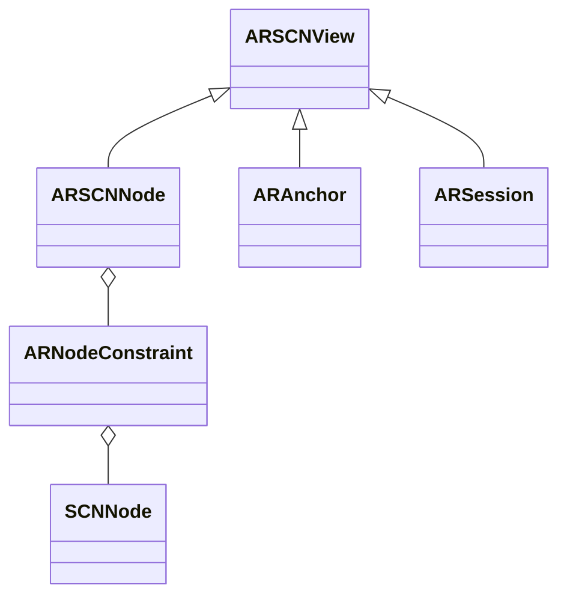

                 

# 《ARKit 应用开发：在 iOS 上创建 AR 体验》

> **关键词**：ARKit, iOS, 增强现实, ARSCNView, 虚拟现实, 3D模型加载，渲染优化，物体识别，用户交互，空间感知与定位。

> **摘要**：本文将深入探讨ARKit在iOS平台上的应用开发，从基础搭建到核心功能实现，再到高级应用与项目实战，全面解析如何利用ARKit构建引人入胜的AR体验。我们将结合实际案例，详细讲解开发流程、关键算法和优化技巧，帮助读者掌握ARKit的开发技能。

## 目录大纲

1. **ARKit简介**
   - 1.1. ARKit的历史与特点
   - 1.2. ARKit的核心功能
2. **iOS开发环境搭建**
   - 2.1. Xcode安装与配置
   - 2.2. Swift语言基础
   - 2.3. iOS项目创建与配置
3. **ARKit基本概念**
   - 3.1. ARSCNView的使用
   - 3.2. 核心类与接口
   - 3.3. 虚拟与真实世界的融合
4. **空间感知与定位**
   - 4.1. 位置追踪原理
   - 4.2. 运动追踪实现
   - 4.3. 实时定位与地图显示
5. **物体识别与标记**
   - 5.1. 标记识别原理
   - 5.2. 标记创建与配置
   - 5.3. 实时跟踪与交互
6. **增强现实内容创建**
   - 6.1. 3D模型的加载与渲染
   - 6.2. 灯光与阴影效果
   - 6.3. 动画与交互效果
7. **用户交互与反馈**
   - 7.1. 触摸与手势识别
   - 7.2. 音频反馈与震动控制
   - 7.3. 用户引导与操作提示
8. **实时渲染优化**
   - 8.1. GPU性能优化
   - 8.2. 渲染线程管理
   - 8.3. 优化实践案例
9. **3D扫描与建模**
   - 9.1. 3D扫描原理
   - 9.2. 扫描数据预处理
   - 9.3. 扫描应用场景
10. **虚拟与现实的融合**
    - 10.1. 虚拟物体与现实世界的交互
    - 10.2. 虚拟现实应用场景
    - 10.3. 虚拟现实技术与未来展望
11. **附录**
    - 11.1. ARKit开发工具与资源
    - 11.2. 实用ARKit开发资源
    - 11.3. ARKit开发者社区与论坛

---

### 1. ARKit简介

ARKit是苹果公司于2017年推出的一款增强现实（AR）开发框架，旨在帮助开发者更轻松地在iOS设备上创建高质量的AR应用。自发布以来，ARKit经历了多次更新，不断增强了其功能和性能。

#### 1.1. ARKit的历史与特点

ARKit的发展历程如下：

- **ARKit 1.0**（2017年）：首次推出，提供基本的空间感知和增强现实功能。
- **ARKit 2.0**（2018年）：引入了更高级的定位技术、3D模型导入、实时跟踪等特性。
- **ARKit 3.0**（2019年）：增加了多人AR体验、面部跟踪和动画等功能。
- **ARKit 4.0**（2020年）：增加了对 RealityKit 的支持，进一步提升了性能和功能。

ARKit的特点包括：

- **强大的空间感知能力**：ARKit利用iOS设备的相机和传感器，实现高精度的空间感知和定位功能。
- **实时跟踪与渲染**：支持实时跟踪和渲染，确保应用运行流畅。
- **易用性**：ARKit提供了丰富的API和示例代码，使开发者能够快速上手。
- **硬件优化**：ARKit充分利用了iOS设备的硬件资源，确保应用性能。

#### 1.2. ARKit的核心功能

ARKit的核心功能包括：

- **空间感知与定位**：利用视觉惯性测量单元（VIMU）和运动跟踪技术，实现高精度的空间感知和定位。
- **物体识别与标记**：支持识别和跟踪平面、立方体等基本形状，以及自定义标记。
- **3D模型加载与渲染**：支持实时加载和渲染3D模型，增强应用的真实感。
- **多人AR体验**：支持多人同时进行AR互动，实现社交化应用。
- **面部跟踪与动画**：能够跟踪用户的面部表情，实现逼真的动画效果。

### 2. iOS开发环境搭建

在开始ARKit应用开发之前，需要搭建一个合适的iOS开发环境。以下将介绍如何安装和配置Xcode，以及Swift语言的基础知识。

#### 2.1. Xcode安装与配置

**安装Xcode**：

- 访问[苹果开发者官网](https://developer.apple.com/)，登录您的Apple ID。
- 在“下载”页面中，找到Xcode，点击“下载”按钮。
- 安装完成后，在“应用程序”文件夹中找到Xcode，双击打开。

**配置Xcode**：

- 打开Xcode，点击菜单栏的“Xcode”>“偏好设置”。
- 在“开发者工具”标签页中，确保“编译器”设置为Swift 5.0或更高版本。
- 在“项目”标签页中，设置您常用的开发工具和语言。

#### 2.2. Swift语言基础

Swift是苹果公司开发的编程语言，用于开发iOS、macOS、watchOS和tvOS等平台的应用。以下是Swift的一些基本概念：

- **变量与常量**：使用`var`声明变量，使用`let`声明常量。
- **数据类型**：包括整数、浮点数、字符串、布尔值等。
- **控制流**：使用`if`、`switch`、`for-in`等语句实现条件判断和循环。
- **函数与闭包**：使用`func`声明函数，使用`{}`实现闭包。
- **面向对象**：使用`class`声明类，使用`init`创建对象。

#### 2.3. iOS项目创建与配置

**创建iOS项目**：

- 打开Xcode，点击“文件”>“新建”>“项目”。
- 在“模板”中选择“App”模板，点击“下一步”。
- 填写项目名称、团队、组织标识符等信息，点击“创建”。
- 在“选择语言”页面中，选择Swift作为编程语言。
- 在“选择设备”页面中，选择模拟器或真机进行开发。

**配置项目**：

- 打开项目文件夹，找到`Podfile`文件，添加ARKit依赖库。
- 打开终端，进入项目目录，执行`pod install`命令，安装依赖库。
- 在项目中引入ARKit相关头文件，如`#import <ARKit/ARKit.h>`。

### 3. ARKit基本概念

ARKit的核心在于将虚拟内容与真实世界相结合，实现增强现实（AR）体验。以下将介绍ARKit的基本概念，包括ARSCNView的使用、核心类与接口，以及虚拟与真实世界的融合。

#### 3.1. ARSCNView的使用

ARSCNView是ARKit中用于显示虚拟内容的视图类，类似于传统的UIView。ARSCNView提供了丰富的功能，包括：

- **虚拟内容显示**：将3D模型、粒子系统等虚拟内容渲染到屏幕上。
- **交互支持**：支持触摸、手势等交互操作。
- **动画支持**：支持关键帧动画、粒子系统动画等。

**基本用法**：

```swift
import ARKit

class ViewController: UIViewController, ARSCNViewDelegate {
    var sceneView: ARSCNView!
    
    override func viewDidLoad() {
        super.viewDidLoad()
        
        sceneView = ARSCNView(frame: view.bounds)
        sceneView.delegate = self
        view.addSubview(sceneView)
    }
}
```

#### 3.2. 核心类与接口

ARKit提供了多个核心类与接口，用于实现AR功能。以下是一些常用的类与接口：

- **ARSCNView**：用于显示虚拟内容的视图类。
- **ARSCNNode**：表示3D模型或虚拟物体，包含位置、旋转、缩放等信息。
- **ARAnchor**：表示虚拟物体在现实世界中的位置和方向。
- **ARSession**：管理ARSCNView的AR体验，包括启动、停止、恢复等操作。

**核心类关系**：



#### 3.3. 虚拟与真实世界的融合

虚拟与真实世界的融合是AR的核心，ARKit通过以下技术实现这一目标：

- **图像处理**：使用相机捕捉现实世界的图像，并对其进行分析和处理。
- **点云处理**：将图像转换为点云数据，用于建模和定位。
- **光照与阴影**：模拟真实世界的光照效果，提高虚拟内容的真实感。

**图像处理流程**：


---

在接下来的章节中，我们将继续深入探讨ARKit的核心功能，包括空间感知与定位、物体识别与标记、增强现实内容创建等。通过这些内容的学习，您将能够更好地掌握ARKit的应用开发，创建出令人惊叹的AR体验。

---

### 4. 空间感知与定位

空间感知与定位是ARKit的核心功能之一，它使得虚拟内容能够与现实世界准确地对齐。这一部分将介绍ARKit中的位置追踪原理、运动追踪实现以及实时定位与地图显示。

#### 4.1. 位置追踪原理

位置追踪是ARKit实现空间感知的关键技术，它通过以下方式实现：

- **视觉惯性测量单元（VIMU）**：VIMU是一种集成了加速度计、陀螺仪和磁力计的传感器，用于测量设备的运动和方向。
- **图像特征匹配**：ARKit通过分析相机捕获的图像，识别其中的特征点，然后利用这些特征点进行位置追踪。

**视觉惯性测量单元（VIMU）原理**：

视觉惯性测量单元（VIMU）通过以下步骤实现位置追踪：

1. **初始定位**：利用相机捕获的图像和VIMU数据，计算出设备的初始位置和方向。
2. **连续定位**：通过连续捕获的图像和VIMU数据，更新设备的位置和方向。

**图像特征匹配原理**：

图像特征匹配是通过识别图像中的特定点来实现的。这些点被称为“特征点”，它们在图像中具有独特的几何形状和纹理。ARKit使用SIFT（尺度不变特征变换）或SURF（加速稳健特征）算法来检测特征点。

**伪代码**：

```swift
func trackPosition(image: CIImage, imuData: IMUData) {
    // 使用SIFT或SURF算法检测特征点
    let keypoints = detectKeypoints(image: image)
    
    // 利用特征点匹配计算位置和方向
    let position = calculatePosition(keypoints: keypoints, imuData: imuData)
    let orientation = calculateOrientation(keypoints: keypoints, imuData: imuData)
}
```

#### 4.2. 运动追踪实现

运动追踪是ARKit在移动设备上实现精确位置追踪的关键技术。它通过以下步骤实现：

1. **初始校准**：通过将设备放置在特定位置并旋转一定角度，进行初始校准。
2. **连续跟踪**：在设备移动过程中，利用图像特征匹配和VIMU数据，实时更新位置和方向。

**运动追踪实现流程**：


**伪代码**：

```swift
class MotionTracker {
    func startTracking() {
        while (设备在移动) {
            // 捕获图像
            let image = captureImage()
            
            // 检测特征点
            let keypoints = detectKeypoints(image: image)
            
            // 更新位置和方向
            updatePositionAndOrientation(keypoints: keypoints)
            
            // 绘制虚拟内容
            renderContent()
        }
    }
    
    func updatePositionAndOrientation(keypoints: [KeyPoint]) {
        // 利用特征点匹配和VIMU数据，计算位置和方向
        let position = calculatePosition(keypoints: keypoints, imuData: imuData)
        let orientation = calculateOrientation(keypoints: keypoints, imuData: imuData)
        
        // 更新ARSCNView的虚拟内容位置和方向
        sceneView.scene.rootNode.position = position
        sceneView.scene.rootNode.eulerAngles = orientation
    }
}
```

#### 4.3. 实时定位与地图显示

实时定位是ARKit的核心功能之一，它使得虚拟内容能够与现实世界保持准确的位置关系。地图显示则提供了一个直观的界面，展示设备在现实世界中的位置。

**实时定位实现**：

实时定位是通过结合相机捕获的图像和VIMU数据实现的。ARKit使用位置和方向估计来更新虚拟内容的位置和方向。

```swift
func updateLocationAndOrientation() {
    // 获取相机捕获的图像
    let image = sceneView.camera.cameraImage
    
    // 获取VIMU数据
    let imuData = getIMUData()
    
    // 利用图像特征匹配和VIMU数据，更新位置和方向
    let position = calculatePosition(image: image, imuData: imuData)
    let orientation = calculateOrientation(image: image, imuData: imuData)
    
    // 更新虚拟内容位置和方向
    sceneView.scene.rootNode.position = position
    sceneView.scene.rootNode.eulerAngles = orientation
}
```

**地图显示**：

地图显示是通过在ARSCNView中添加一个ARMapNode实现的。ARMapNode是一个特殊的ARNode，它包含一个地图数据源，可以显示设备在现实世界中的位置。

```swift
class MapViewController: UIViewController, ARSCNViewDelegate {
    var sceneView: ARSCNView!
    
    override func viewDidLoad() {
        super.viewDidLoad()
        
        sceneView = ARSCNView(frame: view.bounds)
        sceneView.delegate = self
        view.addSubview(sceneView)
        
        // 创建ARMapNode
        let mapNode = ARMapNode()
        sceneView.scene.rootNode.addChildNode(mapNode)
        
        // 设置地图数据源
        mapNode.mapData = getMapData()
    }
}
```

**地图数据源**：

地图数据源是一个包含地图图像和标记点的数据结构。ARKit提供了多种地图数据源，包括卫星图像、街道地图和自定义地图。

```swift
struct MapData {
    var image: UIImage
    var markers: [Marker]
}

struct Marker {
    var position: CGPoint
    var title: String
}
```

通过结合实时定位和地图显示，开发者可以实现一个直观、实用的AR导航应用。用户可以在ARSCNView中看到自己的位置，并通过标记点获取相关信息。

---

在本章中，我们介绍了ARKit中的空间感知与定位功能，包括位置追踪原理、运动追踪实现和实时定位与地图显示。通过这些技术，开发者可以创建出精确、逼真的AR体验。在下一章中，我们将探讨ARKit中的物体识别与标记功能，介绍如何识别和跟踪现实世界中的物体。

---

### 5. 物体识别与标记

物体识别与标记是ARKit的核心功能之一，它使得虚拟内容能够与现实世界中的特定物体进行交互。这一部分将介绍标记识别原理、标记创建与配置以及实时跟踪与交互。

#### 5.1. 标记识别原理

标记识别是ARKit通过识别特定图案或形状来定位和跟踪虚拟内容的技术。这个过程通常包括以下几个步骤：

1. **图像捕获**：ARKit使用设备的相机捕获实时图像。
2. **图像预处理**：对捕获的图像进行预处理，包括降噪、增强等，以提高标记识别的准确性。
3. **特征点检测**：使用SIFT、SURF或其他特征检测算法，在图像中检测出特定的特征点。
4. **特征点匹配**：将检测到的特征点与已知的标记特征点进行匹配，以确定标记的位置和方向。

**标记识别流程**：


**伪代码**：

```swift
func recognizeMarker(image: CIImage) -> Marker? {
    // 图像预处理
    let processedImage = preprocessImage(image: image)
    
    // 检测特征点
    let keypoints = detectKeypoints(image: processedImage)
    
    // 与已知标记特征点匹配
    if let matchedKeypoint = matchKeypoints(keypoints: keypoints, knownKeypoints: knownKeypoints) {
        // 计算标记位置和方向
        let position = calculatePosition(keypoints: matchedKeypoint)
        let orientation = calculateOrientation(keypoints: matchedKeypoint)
        
        // 返回标记
        return Marker(position: position, orientation: orientation)
    }
    
    return nil
}
```

#### 5.2. 标记创建与配置

创建和配置标记是ARKit应用开发的关键步骤。开发者可以通过以下方式创建和配置标记：

1. **创建标记**：使用ARKit提供的API创建标记对象。
2. **配置标记**：设置标记的名称、颜色、大小等属性。

**标记创建方法**：

```swift
class MarkViewController: UIViewController, ARSCNViewDelegate {
    var sceneView: ARSCNView!
    
    override func viewDidLoad() {
        super.viewDidLoad()
        
        sceneView = ARSCNView(frame: view.bounds)
        sceneView.delegate = self
        view.addSubview(sceneView)
        
        // 创建标记
        let marker = ARMarker(name: "myMarker")
        marker.color = .red
        marker.size = CGSize(width: 0.2, height: 0.2)
        
        // 将标记添加到场景中
        sceneView.scene.rootNode.addChildNode(marker)
    }
}

class ARMarker: SCNNode {
    var name: String
    var color: UIColor
    var size: CGSize
    
    init(name: String, color: UIColor = .red, size: CGSize = CGSize(width: 0.2, height: 0.2)) {
        self.name = name
        self.color = color
        self.size = size
        
        super.init()
        
        // 创建矩形平面
        let plane = SCNPlane(width: size.width, height: size.height)
        plane.firstMaterial?.diffuse.contents = color
        
        // 设置矩形平面的几何体
        geometry = plane
        
        // 设置标记的名称
        self.name = name
    }
    
    required init?(coder: NSCoder) {
        fatalError("init(coder:) has not been implemented")
    }
}
```

**标记配置参数**：

标记的配置参数包括名称、颜色、大小等，这些参数可以在创建标记时设置，也可以在运行时动态修改。

```swift
marker.name = "myMarker"
marker.color = UIColor.red
marker.size = CGSize(width: 0.2, height: 0.2)
```

#### 5.3. 实时跟踪与交互

实时跟踪与交互是标记识别的核心功能，它使得虚拟内容能够随着标记的移动而动态更新。以下是如何实现实时跟踪与交互的：

1. **注册标记识别处理器**：在ARSCNView中注册标记识别处理器，以便在标记被识别时接收通知。
2. **处理标记识别事件**：在标记识别处理器中处理识别事件，更新虚拟内容的位置和方向。
3. **实现交互操作**：通过触摸和手势识别，实现与标记的交互操作。

**实时跟踪与交互实现**：

```swift
class MarkViewController: UIViewController, ARSCNViewDelegate {
    var sceneView: ARSCNView!
    var marker: ARMarker!
    
    override func viewDidLoad() {
        super.viewDidLoad()
        
        sceneView = ARSCNView(frame: view.bounds)
        sceneView.delegate = self
        view.addSubview(sceneView)
        
        // 创建标记
        marker = ARMarker(name: "myMarker")
        marker.color = .red
        marker.size = CGSize(width: 0.2, height: 0.2)
        
        // 将标记添加到场景中
        sceneView.scene.rootNode.addChildNode(marker)
        
        // 注册标记识别处理器
        sceneView.delegate = self
    }
    
    func renderer(_ renderer: SCNSceneRenderer, didAdd node: SCNNode, for anchor: ARAnchor) {
        if let markerAnchor = anchor as? ARMarkerAnchor {
            if markerAnchor.name == "myMarker" {
                // 更新标记的属性
                marker.color = UIColor.blue
                marker.size = CGSize(width: 0.3, height: 0.3)
                
                // 更新虚拟内容的位置和方向
                sceneView.scene.rootNode.position = marker.position
                sceneView.scene.rootNode.eulerAngles = marker.eulerAngles
            }
        }
    }
    
    func renderer(_ renderer: SCNSceneRenderer, handleEvent event: SCNGestureEvent) {
        if event.isSingleTap {
            // 单击处理
            print("单次点击")
        } else if event.isDoubleTap {
            // 双击处理
            print("双次点击")
        }
    }
}
```

通过以上步骤，开发者可以实现标记的实时跟踪与交互，为用户提供丰富的AR体验。

---

在本章中，我们详细介绍了ARKit中的物体识别与标记功能，包括标记识别原理、标记创建与配置以及实时跟踪与交互。通过这些内容的学习，开发者可以掌握如何利用ARKit构建基于标记的AR应用。在下一章中，我们将探讨如何创建增强现实内容，包括3D模型的加载与渲染、灯光与阴影效果以及动画与交互效果。

---

### 6. 增强现实内容创建

增强现实内容创建是ARKit应用开发的核心部分，它涉及到3D模型的加载与渲染、灯光与阴影效果、动画与交互效果等。在这一部分，我们将详细介绍如何利用ARKit创建丰富的AR内容，使应用程序更加生动和具有吸引力。

#### 6.1. 3D模型的加载与渲染

3D模型的加载与渲染是ARKit应用开发的基础。ARKit支持多种3D模型格式，如GLTF、OBJ和3DS等。以下是如何加载和渲染3D模型的步骤：

1. **模型数据准备**：首先，需要准备3D模型数据。这些数据通常以文件形式存储，如GLTF文件或OBJ文件。

2. **模型加载**：使用ARKit提供的`SCNReferenceNode`类加载3D模型。

```swift
import SceneKit

class ModelLoader {
    func loadModel(file: String, position: SCNVector3) -> SCNNode? {
        if let modelURL = Bundle.main.url(forResource: file, withExtension: "gltf") {
            do {
                let scene = try SCNScene(url: modelURL, options: nil)
                if let modelNode = scene.rootNode.childNode(withName: "model", recursively: true) {
                    modelNode.position = position
                    return modelNode
                }
            } catch {
                print("模型加载失败：\(error.localizedDescription)")
            }
        }
        return nil
    }
}
```

3. **模型渲染**：将加载的3D模型添加到ARSCNView中，并设置其初始位置。

```swift
class ViewController: UIViewController, ARSCNViewDelegate {
    var sceneView: ARSCNView!
    var modelNode: SCNNode?
    
    override func viewDidLoad() {
        super.viewDidLoad()
        
        sceneView = ARSCNView(frame: view.bounds)
        sceneView.delegate = self
        view.addSubview(sceneView)
        
        // 加载模型
        modelNode = ModelLoader().loadModel(file: "myModel", position: SCNVector3(x: 0, y: 0, z: -1))
        
        // 渲染模型
        if let modelNode = modelNode {
            sceneView.scene.rootNode.addChildNode(modelNode)
        }
    }
}
```

#### 6.2. 灯光与阴影效果

灯光和阴影效果能够显著提升3D模型的视觉效果。ARKit提供了多种灯光模型和阴影生成方法，以下是如何实现这些效果：

1. **添加灯光**：在AR场景中添加灯光，以照亮3D模型。

```swift
import SceneKit

class ViewController: UIViewController, ARSCNViewDelegate {
    var sceneView: ARSCNView!
    var modelNode: SCNNode?
    var lightNode: SCNNode?
    
    override func viewDidLoad() {
        super.viewDidLoad()
        
        sceneView = ARSCNView(frame: view.bounds)
        sceneView.delegate = self
        view.addSubview(sceneView)
        
        // 加载模型
        modelNode = ModelLoader().loadModel(file: "myModel", position: SCNVector3(x: 0, y: 0, z: -1))
        
        // 添加灯光
        lightNode = SCNNode()
        lightNode?.几何体 = SCNSphere(radius: 0.1)
        lightNode?.材料?.发光颜色 = UIColor.white
        lightNode?.position = SCNVector3(x: 1, y: 2, z: 3)
        sceneView.scene.rootNode.addChildNode(lightNode!)
    }
}
```

2. **生成阴影**：为3D模型生成阴影，以增强真实感。

```swift
import SceneKit

class ViewController: UIViewController, ARSCNViewDelegate {
    var sceneView: ARSCNView!
    var modelNode: SCNNode?
    var lightNode: SCNNode?
    
    override func viewDidLoad() {
        super.viewDidLoad()
        
        sceneView = ARSCNView(frame: view.bounds)
        sceneView.delegate = self
        view.addSubview(sceneView)
        
        // 加载模型
        modelNode = ModelLoader().loadModel(file: "myModel", position: SCNVector3(x: 0, y: 0, z: -1))
        
        // 添加灯光
        lightNode = SCNNode()
        lightNode?.几何体 = SCNSphere(radius: 0.1)
        lightNode?.材料?.发光颜色 = UIColor.white
        lightNode?.position = SCNVector3(x: 1, y: 2, z: 3)
        
        // 生成阴影
        lightNode?.几何体?.材料?.阴影颜色 = UIColor.black
        lightNode?.几何体?.材料?.阴影强度 = 0.5
        
        sceneView.scene.rootNode.addChildNode(lightNode!)
    }
}
```

#### 6.3. 动画与交互效果

动画与交互效果能够提升AR体验的互动性和趣味性。ARKit提供了多种动画和交互方法，以下是如何实现这些效果：

1. **关键帧动画**：通过关键帧动画，可以平滑地改变3D模型的位置、旋转和缩放。

```swift
import SceneKit

class ViewController: UIViewController, ARSCNViewDelegate {
    var sceneView: ARSCNView!
    var modelNode: SCNNode?
    
    override func viewDidLoad() {
        super.viewDidLoad()
        
        sceneView = ARSCNView(frame: view.bounds)
        sceneView.delegate = self
        view.addSubview(sceneView)
        
        // 加载模型
        modelNode = ModelLoader().loadModel(file: "myModel", position: SCNVector3(x: 0, y: 0, z: -1))
        
        // 创建关键帧动画
        let animation = SCNAnimation(keyPath: "position")
        animation.duration = 2.0
        animation.fromValue = SCNVector3(x: 0, y: 0, z: -1)
        animation.toValue = SCNVector3(x: 2, y: 2, z: -1)
        
        // 添加动画到模型
        modelNode?.addAnimation(animation, forKey: "move")
    }
}
```

2. **触摸交互**：通过触摸事件，可以实现与3D模型的交互，如旋转、缩放和平移。

```swift
import SceneKit

class ViewController: UIViewController, ARSCNViewDelegate {
    var sceneView: ARSCNView!
    var modelNode: SCNNode?
    
    override func viewDidLoad() {
        super.viewDidLoad()
        
        sceneView = ARSCNView(frame: view.bounds)
        sceneView.delegate = self
        view.addSubview(sceneView)
        
        // 加载模型
        modelNode = ModelLoader().loadModel(file: "myModel", position: SCNVector3(x: 0, y: 0, z: -1))
        
        // 设置触摸交互
        sceneView.isMultipleTouchEnabled = true
        sceneView.addGestureRecognizer(UITapGestureRecognizer(target: self, action: #selector(handleTap)))
    }
    
    @objc func handleTap(gesture: UITapGestureRecognizer) {
        if let modelNode = modelNode {
            let tapLocation = gesture.location(in: sceneView)
            let hitResults = sceneView.hitTest(tapLocation, types: [.existingNode])
            
            if let hitResult = hitResults.first {
                if hitResult.node == modelNode {
                    // 处理触摸交互
                    print("触摸模型")
                }
            }
        }
    }
}
```

通过以上步骤，开发者可以创建丰富的AR内容，实现3D模型的加载与渲染、灯光与阴影效果以及动画与交互效果，为用户提供令人难忘的增强现实体验。

---

在本章中，我们详细介绍了如何利用ARKit创建增强现实内容，包括3D模型的加载与渲染、灯光与阴影效果以及动画与交互效果。通过这些内容的学习，开发者可以掌握如何将虚拟内容与现实世界相结合，创建出引人入胜的AR体验。在下一章中，我们将探讨如何实现用户交互与反馈，包括触摸与手势识别、音频反馈与震动控制以及用户引导与操作提示。

---

### 7. 用户交互与反馈

用户交互与反馈是增强现实（AR）应用的重要组成部分，它直接影响用户体验。在ARKit应用中，通过触摸与手势识别、音频反馈与震动控制、用户引导与操作提示等手段，可以显著提升用户的互动性和满意度。

#### 7.1. 触摸与手势识别

触摸与手势识别是AR应用中最常见的交互方式之一。通过识别用户的触摸手势，应用可以响应用户的意图，实现各种操作。

**触摸事件处理**：

在ARKit中，通过实现`ARSCNViewDelegate`协议的`renderer(_:didAdd:for:)`方法，可以处理触摸事件。

```swift
extension ViewController: ARSCNViewDelegate {
    func renderer(_ renderer: SCNSceneRenderer, didAdd node: SCNNode, for anchor: ARAnchor) {
        if let planeAnchor = anchor as? ARPlaneAnchor {
            // 创建一个平面节点
            let plane = SCNPlane(width: CGFloat(planeAnchor.extent.x * 2), height: CGFloat(planeAnchor.extent.z * 2))
            let material = SCNMaterial()
            material.diffuse.contents = UIColor.lightGray
            plane.materials = [material]
            
            // 创建平面节点
            let planeNode = SCNNode(geometry: plane)
            planeNode.position = SCNVector3(x: node.position.x, y: node.position.y, z: node.position.z)
            planeNode.eulerAngles = SCNVector3(x: -Float.pi / 2, y: 0, z: 0)
            
            // 添加到场景中
            sceneView.scene.rootNode.addChildNode(planeNode)
        }
    }
}
```

**手势识别与交互**：

在处理触摸事件时，可以通过判断触摸点的位置和状态，识别出不同的手势，如单击、双击、滑动等，并实现相应的交互操作。

```swift
import UIKit

class ViewController: UIViewController, ARSCNViewDelegate {
    var sceneView: ARSCNView!
    
    override func viewDidLoad() {
        super.viewDidLoad()
        
        sceneView = ARSCNView(frame: view.bounds)
        sceneView.delegate = self
        view.addSubview(sceneView)
        
        let tapGestureRecognizer = UITapGestureRecognizer(target: self, action: #selector(handleTap))
        sceneView.addGestureRecognizer(tapGestureRecognizer)
    }
    
    @objc func handleTap(gestureRecognizer: UITapGestureRecognizer) {
        let tapLocation = gestureRecognizer.location(in: sceneView)
        let hitResults = sceneView.hitTest(tapLocation, types: [.existingNode])
        
        if let hitResult = hitResults.first {
            if hitResult.node.name == "myNode" {
                // 处理单击操作
                print("单击了节点")
            }
        }
    }
}
```

#### 7.2. 音频反馈与震动控制

音频反馈与震动控制可以增强用户的感知体验，使其更加真实和沉浸。在ARKit中，可以通过以下方式实现音频反馈与震动控制：

**音频反馈实现**：

```swift
import AVFoundation

class ViewController: UIViewController, ARSCNViewDelegate {
    var sceneView: ARSCNView!
    
    override func viewDidLoad() {
        super.viewDidLoad()
        
        sceneView = ARSCNView(frame: view.bounds)
        sceneView.delegate = self
        view.addSubview(sceneView)
        
        // 播放音频
        if let audioURL = Bundle.main.url(forResource: "tap_sound", withExtension: "mp3") {
            do {
                let audioPlayer = try AVAudioPlayer(contentsOf: audioURL)
                audioPlayer.play()
            } catch {
                print("音频播放失败：\(error.localizedDescription)")
            }
        }
    }
}
```

**震动控制原理**：

震动控制是通过设备的震动马达实现的。在iOS中，可以通过`UISelectionFeedbackGenerator`类来控制震动。

```swift
import UIKit

class ViewController: UIViewController, ARSCNViewDelegate {
    var sceneView: ARSCNView!
    
    override func viewDidLoad() {
        super.viewDidLoad()
        
        sceneView = ARSCNView(frame: view.bounds)
        sceneView.delegate = self
        view.addSubview(sceneView)
        
        // 触发震动
        let selectionFeedbackGenerator = UISelectionFeedbackGenerator()
        selectionFeedbackGenerator.selectionChanged()
    }
}
```

#### 7.3. 用户引导与操作提示

用户引导与操作提示可以帮助新用户快速上手应用，并提供操作指南。在ARKit中，可以通过以下方式实现用户引导与操作提示：

**引导动画设计**：

```swift
import UIKit

class ViewController: UIViewController, ARSCNViewDelegate {
    var sceneView: ARSCNView!
    
    override func viewDidLoad() {
        super.viewDidLoad()
        
        sceneView = ARSCNView(frame: view.bounds)
        sceneView.delegate = self
        view.addSubview(sceneView)
        
        // 创建引导动画
        let animation = CABasicAnimation(keyPath: "position")
        animation.duration = 1.0
        animation.fromValue = SCNVector3(x: 0, y: 0, z: 0)
        animation.toValue = SCNVector3(x: 1, y: 1, z: 0)
        animation.timingFunction = CAMediaTimingFunction(name: CAMediaTimingFunctionName.easeInEaseOut)
        
        // 应用动画到节点
        let node = SCNNode(geometry: SCNSphere(radius: 0.1))
        node.position = SCNVector3(x: 0, y: 0, z: 0)
        node.addAnimation(animation, forKey: "引导动画")
        
        // 添加到场景中
        sceneView.scene.rootNode.addChildNode(node)
    }
}
```

**操作提示与反馈**：

操作提示可以通过在屏幕上显示文字或图标来实现，而操作反馈可以通过音频、震动等方式实现。

```swift
import UIKit

class ViewController: UIViewController, ARSCNViewDelegate {
    var sceneView: ARSCNView!
    
    override func viewDidLoad() {
        super.viewDidLoad()
        
        sceneView = ARSCNView(frame: view.bounds)
        sceneView.delegate = self
        view.addSubview(sceneView)
        
        // 显示操作提示
        let label = UILabel(frame: CGRect(x: 20, y: 20, width: 200, height: 50))
        label.text = "点击屏幕进行操作"
        label.textColor = UIColor.white
        label.backgroundColor = UIColor.black.withAlphaComponent(0.5)
        view.addSubview(label)
        
        // 处理操作反馈
        let tapGestureRecognizer = UITapGestureRecognizer(target: self, action: #selector(handleTap))
        sceneView.addGestureRecognizer(tapGestureRecognizer)
    }
    
    @objc func handleTap(gestureRecognizer: UITapGestureRecognizer) {
        // 播放音频
        if let audioURL = Bundle.main.url(forResource: "tap_sound", withExtension: "mp3") {
            do {
                let audioPlayer = try AVAudioPlayer(contentsOf: audioURL)
                audioPlayer.play()
            } catch {
                print("音频播放失败：\(error.localizedDescription)")
            }
        }
        
        // 震动
        let selectionFeedbackGenerator = UISelectionFeedbackGenerator()
        selectionFeedbackGenerator.selectionChanged()
    }
}
```

通过以上方式，开发者可以实现对用户的触摸与手势识别、音频反馈与震动控制、用户引导与操作提示，从而提升ARKit应用的用户体验。

---

在本章中，我们详细介绍了如何在ARKit应用中实现用户交互与反馈，包括触摸与手势识别、音频反馈与震动控制以及用户引导与操作提示。通过这些内容的学习，开发者可以构建出更加丰富和互动的AR体验。在下一章中，我们将探讨如何进行实时渲染优化，以提高AR应用的性能。

---

### 8. 实时渲染优化

实时渲染是增强现实（AR）应用的关键技术之一，它决定了用户体验的质量。由于AR应用需要实时处理大量的3D数据和图像数据，因此优化渲染性能至关重要。以下将介绍GPU性能优化、渲染线程管理和优化实践案例。

#### 8.1. GPU性能优化

GPU性能优化是提高AR应用渲染速度的关键。以下是一些优化GPU性能的方法：

**减少渲染对象数量**：

减少场景中渲染的对象数量可以显著提高渲染速度。例如，可以通过合并多个对象为一个更大的对象，或者将一些非重要对象暂时隐藏。

```swift
func optimizeRendering() {
    // 遍历场景中的所有节点
    sceneView.scene.rootNode.childNodes.forEach { node in
        // 检查节点的渲染状态
        if node.renderingOrder < 1000 {
            // 隐藏非重要节点
            node.isHidden = true
        }
    }
}
```

**使用纹理贴图**：

纹理贴图可以将复杂的几何体简化为二维图像，从而提高渲染速度。通过使用高质量的纹理贴图，可以显著提高渲染效果。

```swift
func createTexture() {
    // 创建一个纹理贴图
    let texture = SCNTexture(size: CGSize(width: 256, height: 256), color: UIColor.white)
    
    // 将纹理贴图应用到节点上
    let material = SCNMaterial()
    material.diffuse.contents = texture
    node.geometry?.materials = [material]
}
```

**使用轻量级几何体**：

轻量级几何体（如平面、圆柱体等）相对于复杂的几何体具有更高的渲染速度。在可能的情况下，使用轻量级几何体可以显著提高渲染性能。

```swift
func createLightweightGeometry() {
    // 创建一个平面几何体
    let plane = SCNPlane(width: 1.0, height: 1.0)
    
    // 创建平面节点
    let node = SCNNode(geometry: plane)
    
    // 添加到场景中
    sceneView.scene.rootNode.addChildNode(node)
}
```

#### 8.2. 渲染线程管理

渲染线程管理是优化AR应用性能的另一个关键因素。以下是一些优化渲染线程管理的方法：

**异步渲染**：

异步渲染可以将渲染任务分配给多个线程，从而提高渲染速度。通过使用`DispatchQueue`，可以实现异步渲染。

```swift
func renderScene() {
    DispatchQueue.global(qos: .background).async {
        // 渲染场景
        sceneView.scene.rootNode.forEachChild { node in
            // 渲染节点
            node.render()
        }
    }
}
```

**线程同步**：

在渲染过程中，可能需要在不同线程之间同步数据。通过使用`DispatchSemaphore`，可以实现线程同步。

```swift
func synchronizeThreads() {
    let semaphore = DispatchSemaphore(value: 0)
    
    DispatchQueue.global(qos: .background).async {
        // 执行渲染任务
        // ...
        
        semaphore.wait()
    }
    
    DispatchQueue.main.async {
        // 等待渲染任务完成
        semaphore.signal()
    }
}
```

**线程池**：

使用线程池可以有效地管理多个线程，避免线程频繁创建和销毁带来的性能损耗。Swift标准库提供了`OperationQueue`类，可以用来实现线程池。

```swift
let queue = OperationQueue()
queue.maxConcurrentOperationCount = 4
        
for _ in 1...10 {
    let operation = BlockOperation {
        // 执行渲染任务
        // ...
    }
    
    queue.addOperation(operation)
}
```

#### 8.3. 优化实践案例

以下是一个优化实践案例，展示了如何通过GPU性能优化和渲染线程管理来提高AR应用性能：

**案例：优化AR地图导航应用**

假设我们正在开发一个AR地图导航应用，应用需要实时渲染大量的地图数据和地标。

1. **GPU性能优化**：

   - 合并地图数据，减少渲染对象数量。
   - 使用纹理贴图代替复杂的几何体。
   - 使用轻量级几何体，如平面和圆柱体，代替复杂的3D模型。

2. **渲染线程管理**：

   - 使用异步渲染，将渲染任务分配给多个线程。
   - 使用线程同步，确保渲染数据的正确性。
   - 使用线程池，管理多个线程，避免线程频繁创建和销毁。

```swift
// GPU性能优化
func optimizeMapRendering() {
    // 遍历地图数据
    for landmark in mapData {
        // 如果地标是重要的，则渲染
        if landmark.isImportant {
            // 创建纹理贴图
            let texture = SCNTexture(size: CGSize(width: 256, height: 256), color: landmark.color)
            
            // 创建平面几何体
            let plane = SCNSphere(radius: landmark.size)
            
            // 创建平面节点
            let node = SCNNode(geometry: plane)
            node.material?.diffuse.contents = texture
            
            // 添加到场景中
            sceneView.scene.rootNode.addChildNode(node)
        }
    }
}

// 渲染线程管理
func renderMap() {
    DispatchQueue.global(qos: .background).async {
        optimizeMapRendering()
    }
    
    DispatchQueue.main.async {
        sceneView.scene.rootNode.forEachChild { node in
            // 渲染节点
            node.render()
        }
    }
}
```

通过以上优化，我们可以显著提高AR地图导航应用的性能，为用户提供更加流畅和高效的AR体验。

---

在本章中，我们详细介绍了实时渲染优化，包括GPU性能优化、渲染线程管理和优化实践案例。通过这些优化技巧，开发者可以提升AR应用的性能，为用户提供更好的使用体验。在下一章中，我们将探讨3D扫描与建模，介绍如何利用ARKit实现3D扫描和应用场景。

---

### 9. 3D扫描与建模

3D扫描与建模是增强现实（AR）应用中的一个重要功能，它允许开发者将现实世界中的物体数字化，并在AR场景中对其进行操作。ARKit提供了强大的3D扫描功能，可以轻松实现这一目标。

#### 9.1. 3D扫描原理

3D扫描的基本原理是使用传感器（如相机和激光雷达）捕捉物体的三维信息，然后利用这些信息生成三维模型。以下是3D扫描的一般流程：

1. **数据采集**：使用相机或激光雷达等传感器捕捉物体的图像或点云数据。
2. **数据处理**：对采集到的数据进行分析和处理，去除噪声，填充缺失部分，并生成完整的3D模型。
3. **模型优化**：对生成的3D模型进行优化，提高模型的精度和可操作性。
4. **模型导出**：将优化后的3D模型导出为标准格式，如OBJ或GLTF，以便在AR应用中使用。

**3D扫描技术**：

- **激光雷达扫描**：使用激光雷达生成高精度的点云数据，适用于需要高精度建模的场景。
- **结构光扫描**：使用结构光投影技术，结合相机捕捉图像，生成三维模型。
- **多视角照片建模**：通过捕捉物体从多个视角的照片，利用计算机视觉算法生成三维模型。

**扫描数据获取与处理**：

```swift
import SceneKit

class ScannerViewController: UIViewController, ARSCNViewDelegate {
    var sceneView: ARSCNView!
    
    override func viewDidLoad() {
        super.viewDidLoad()
        
        sceneView = ARSCNView(frame: view.bounds)
        sceneView.delegate = self
        view.addSubview(sceneView)
        
        // 启动3D扫描
        start3DScanning()
    }
    
    func start3DScanning() {
        // 创建ARSession
        let configuration = ARWorldTrackingConfiguration()
        sceneView.session.run(configuration)
        
        // 捕获相机图像
        sceneView.session.getCameraImages { (images) in
            for image in images {
                // 处理图像，生成点云数据
                let pointCloud = self.processImage(image: image)
                
                // 生成三维模型
                let model = self.createModel(fromPointCloud: pointCloud)
                
                // 添加模型到场景
                DispatchQueue.main.async {
                    self.sceneView.scene.rootNode.addChildNode(model)
                }
            }
        }
    }
    
    func processImage(image: UIImage) -> [SCNVertex] {
        // 处理图像，生成点云数据
        // ...
        
        return []
    }
    
    func createModel(fromPointCloud pointCloud: [SCNVertex]) -> SCNNode {
        // 创建三维模型
        // ...
        
        return SCNNode()
    }
}
```

#### 9.2. 扫描数据预处理

扫描数据预处理是3D扫描过程中的关键步骤，它确保生成的3D模型具有高精度和可用性。以下是一些预处理方法：

**数据清洗**：

- **去除噪声**：扫描过程中可能会产生噪声，通过滤波算法去除噪声可以提高模型的精度。
- **填充缺失部分**：使用数学方法填充扫描数据中的缺失部分，确保模型完整性。

```swift
import SceneKit

func cleanPointCloud(pointCloud: [SCNVertex]) -> [SCNVertex] {
    // 去除噪声
    // ...
    
    // 填充缺失部分
    // ...
    
    return []
}
```

**数据优化与修复**：

- **减少多边形数量**：通过简化模型，减少多边形数量，可以提高渲染性能。
- **修复模型缺陷**：使用算法修复模型中的缺陷，如裂缝、孔洞等。

```swift
import SceneKit

func optimizeModel(model: SCNNode) {
    // 减少多边形数量
    // ...
    
    // 修复模型缺陷
    // ...
}
```

#### 9.3. 扫描应用场景

3D扫描技术在AR应用中有多种应用场景，以下是一些典型的应用实例：

**室内设计**：

- 利用3D扫描技术，用户可以扫描自己的房间，并在虚拟空间中布置家具，实现虚拟装修效果。

**文物保护**：

- 通过3D扫描技术，可以将文物数字化，以便在AR中展示和保护。

**教育培训**：

- 利用3D扫描技术，用户可以扫描生物标本，并在AR中进行互动学习，提高学习效果。

**零售体验**：

- 在零售行业中，用户可以在AR中试穿衣物或查看商品，提升购物体验。

通过3D扫描与建模技术，开发者可以创建出丰富的AR内容，为用户提供全新的互动体验。

---

在本章中，我们详细介绍了3D扫描与建模的原理、预处理方法和应用场景。通过这些内容的学习，开发者可以掌握如何利用ARKit实现3D扫描与建模，为AR应用增添更多功能和价值。在下一章中，我们将探讨如何实现虚拟物体与现实世界的融合，以及虚拟现实（VR）技术在AR开发中的应用。

---

### 10. 虚拟与现实的融合

虚拟与现实的融合是增强现实（AR）技术的核心，它使得虚拟内容能够无缝地与现实世界相结合，为用户带来全新的交互体验。在这一部分，我们将探讨如何实现虚拟物体与现实世界的融合，介绍虚拟现实（VR）技术在AR开发中的应用，并展望AR技术的未来发展方向。

#### 10.1. 虚拟物体与现实世界的交互

实现虚拟物体与现实世界的融合，需要通过以下几个关键步骤：

1. **空间感知与定位**：使用ARKit中的空间感知与定位技术，确保虚拟物体与现实世界中的位置和方向保持一致。
2. **图像处理与点云生成**：通过相机捕捉现实世界的图像，并利用图像处理技术生成点云数据，用于建模和定位。
3. **虚拟内容创建**：将虚拟物体加载到AR场景中，并与现实世界中的点云数据对齐，实现虚拟与现实的融合。

**融合原理**：

虚拟物体与现实世界的融合原理可以概括为以下步骤：

1. **图像捕获**：使用设备的相机捕获实时图像。
2. **图像预处理**：对捕获的图像进行预处理，如去噪、增强等，以提高识别精度。
3. **特征点检测**：使用特征检测算法，如SIFT或SURF，在图像中检测出特定的特征点。
4. **特征点匹配**：将检测到的特征点与已知点云数据进行匹配，以确定虚拟物体在现实世界中的位置和方向。
5. **虚拟内容加载**：将虚拟物体加载到AR场景中，并实时更新其位置和方向。

**融合流程**：


**伪代码**：

```swift
func mergeVirtualAndReal Worlds() {
    // 捕获图像
    let image = captureImage()
    
    // 预处理图像
    let processedImage = preprocessImage(image: image)
    
    // 检测特征点
    let keypoints = detectKeypoints(image: processedImage)
    
    // 匹配特征点
    let matchedKeypoints = matchKeypoints(keypoints: keypoints, knownKeypoints: knownKeypoints)
    
    // 更新虚拟物体位置和方向
    updateVirtualObjectPositionAndOrientation(matchedKeypoints: matchedKeypoints)
    
    // 渲染虚拟物体
    renderVirtualObject()
}
```

#### 10.2. 虚拟现实应用场景

虚拟现实（VR）技术在AR开发中具有重要的应用价值。以下是一些典型的VR应用场景：

**教育培训**：

- 通过VR技术，用户可以在虚拟环境中进行模拟训练，如飞行模拟、医疗手术等，提高学习效果和实际操作能力。
- 虚拟现实使教学内容更加生动、直观，有助于激发学生的学习兴趣。

**游戏娱乐**：

- VR游戏提供了一种全新的游戏体验，用户可以在虚拟世界中自由探索和互动。
- VR游戏具有沉浸感和互动性，能够为用户提供更丰富的娱乐体验。

**医疗健康**：

- VR技术可以帮助医生进行手术模拟，提高手术的成功率和安全性。
- 虚拟现实可以为康复患者提供虚拟治疗环境，帮助他们进行心理疏导和康复训练。

**零售体验**：

- 通过VR技术，用户可以在虚拟商店中试穿衣物、查看商品，提升购物体验。
- VR零售体验可以减少实体店铺的运营成本，提高销售效率。

#### 10.3. 虚拟现实技术与未来展望

虚拟现实（VR）技术在AR开发中的应用前景广阔。随着技术的不断发展，AR和VR将更加紧密地融合，为用户提供更加丰富和沉浸的交互体验。

**技术发展趋势**：

- **硬件性能提升**：随着硬件性能的不断提升，AR和VR设备的分辨率、刷新率和响应速度将进一步提高，为用户提供更优质的体验。
- **算法优化**：图像处理、特征检测和匹配算法的优化，将提高AR和VR系统的准确性和稳定性。
- **多人交互**：随着网络技术的发展，多人AR和VR交互将变得更加普及，为用户提供社交化的虚拟体验。
- **内容创作**：越来越多的开发者将参与到AR和VR内容创作中，为市场提供丰富的虚拟内容。

**未来展望**：

- **混合现实**：混合现实（MR）将虚拟现实和增强现实相结合，为用户带来全新的交互体验。
- **智能城市**：在智能城市建设中，AR和VR技术将用于规划、监控和管理，提高城市管理的效率和智能化水平。
- **远程协作**：通过虚拟现实技术，人们可以在虚拟环境中进行远程协作，打破地域限制，提高工作效率。

通过不断探索和创新，虚拟现实技术与增强现实技术将在未来为人类带来更多的便利和乐趣。

---

在本章中，我们详细介绍了虚拟物体与现实世界的融合原理、虚拟现实应用场景以及未来展望。通过这些内容的学习，开发者可以更好地理解如何利用ARKit实现虚拟与现实的融合，为用户创造更加丰富和沉浸的AR体验。在下一章中，我们将提供附录，包括ARKit开发工具与资源，以及实际的项目实战案例，帮助读者深入掌握ARKit的应用开发。

---

## 附录

### 附录 A：ARKit开发工具与资源

ARKit的开发不仅依赖于苹果提供的API，还需要一系列的开发工具和资源来帮助开发者提高效率和实现更多的功能。

#### 附录 A.1. 主流ARKit开发工具

**ARKit Studio**：ARKit Studio是一个功能强大的AR开发工具，它提供了直观的用户界面和丰富的功能，如3D模型导入、标记创建、场景渲染等。它支持多种3D文件格式，如GLTF、OBJ和3DS等。

**ARKit Plus**：ARKit Plus是一个开源的ARKit扩展库，它提供了额外的功能，如标记识别、3D模型加载和渲染、动画等。它有助于简化AR应用的开发流程，并提供了一些实用的示例代码。

**Unity ARKit Plugin**：Unity ARKit Plugin是Unity游戏引擎的插件，它使得开发者可以在Unity中利用ARKit功能开发AR应用。它提供了强大的3D建模和渲染功能，以及与Unity现有功能的集成。

#### 附录 A.2. 实用ARKit开发资源

**开源项目**：GitHub上有很多ARKit相关的开源项目，如ARImageTracking、ARScanning等，这些项目可以提供实用的代码示例和解决方案，帮助开发者快速上手AR开发。

**学习资料与教程**：在苹果的官方文档和各大技术博客上，可以找到大量的ARKit学习资料和教程。例如，苹果的官方ARKit教程、Swift教程等，都是学习ARKit的宝贵资源。

**社区与论坛**：ARKit开发者社区和论坛是开发者交流和学习的平台。在Reddit、Stack Overflow和苹果开发者论坛上，开发者可以提问、分享经验，并获得其他开发者的帮助。

#### 附录 A.3. ARKit开发者社区与论坛

**ARKit官方社区**：苹果官方的ARKit社区提供了丰富的文档、教程和示例代码。开发者可以在社区中找到有关ARKit的详细信息，并与其他开发者交流。

**国内ARKit开发者论坛**：国内的一些技术论坛，如CSDN、博客园等，都有ARKit相关的讨论区。开发者可以在这里分享经验、学习新技术，并获得国内开发者的支持。

通过使用这些开发工具和资源，开发者可以更加高效地掌握ARKit的开发技能，实现各种创意的AR应用。

---

### 附录 B：ARKit项目实战案例

实际项目实战是掌握ARKit应用开发的重要途径。以下提供了三个ARKit项目实战案例，涵盖了简单AR应用、AR地图导航和AR购物体验。

#### 附录 B.1. 实战一：简单AR应用开发

**项目背景**：

简单AR应用开发的目标是创建一个能够识别并显示文本的AR应用。用户可以通过相机扫描特定文本，并在屏幕上显示相关的图像和信息。

**功能实现**：

1. **项目创建**：使用Xcode创建一个新项目，选择ARKit模板。
2. **标记识别**：使用ARKit的标记识别功能，实现文本的识别和跟踪。
3. **图像显示**：在用户扫描特定文本时，加载并显示相关的图像和信息。

```swift
class SimpleARViewController: UIViewController, ARSCNViewDelegate {
    var sceneView: ARSCNView!
    var markerNode: SCNNode!
    
    override func viewDidLoad() {
        super.viewDidLoad()
        
        sceneView = ARSCNView(frame: view.bounds)
        sceneView.delegate = self
        view.addSubview(sceneView)
        
        // 创建标记
        markerNode = ARMarkerNode(name: "myMarker")
        markerNode.position = SCNVector3(x: 0, y: 0, z: -1)
        
        // 添加标记到场景
        sceneView.scene.rootNode.addChildNode(markerNode)
    }
    
    func renderer(_ renderer: SCNSceneRenderer, didAdd node: SCNNode, for anchor: ARAnchor) {
        if let markerAnchor = anchor as? ARMarkerAnchor {
            if markerAnchor.name == "myMarker" {
                // 加载图像
                let image = UIImage(named: "myImage.png")
                let plane = SCNPlane(width: 0.5, height: 0.5)
                plane.firstMaterial?.diffuse.contents = image
                
                // 创建平面节点
                let planeNode = SCNNode(geometry: plane)
                planeNode.position = markerNode.position
                
                // 添加到场景
                sceneView.scene.rootNode.addChildNode(planeNode)
            }
        }
    }
}
```

**项目效果展示**：

当用户使用相机扫描特定的文本时，应用会加载并显示一个图像，从而实现简单的AR应用。

#### 附录 B.2. 实战二：AR地图导航

**项目背景**：

AR地图导航应用的目标是为用户提供一个AR地图，用户可以在AR场景中查看自己的位置，并跟随地图导航到目的地。

**功能实现**：

1. **项目创建**：使用Xcode创建一个新项目，选择ARKit模板。
2. **地图显示**：使用ARKit的地图显示功能，实现地图的加载和显示。
3. **定位与导航**：结合GPS和ARKit的定位功能，实现实时定位和导航。

```swift
class MapARViewController: UIViewController, ARSCNViewDelegate {
    var sceneView: ARSCNView!
    var mapNode: ARMapNode!
    
    override func viewDidLoad() {
        super.viewDidLoad()
        
        sceneView = ARSCNView(frame: view.bounds)
        sceneView.delegate = self
        view.addSubview(sceneView)
        
        // 创建地图节点
        mapNode = ARMapNode()
        mapNode.mapData = MapData(image: UIImage(named: "mapImage.png")!, markers: markers)
        
        // 添加地图节点到场景
        sceneView.scene.rootNode.addChildNode(mapNode)
    }
    
    func updateLocationAndMap() {
        // 获取当前地理位置
        let location = CLLocation(latitude: 0.0, longitude: 0.0)
        
        // 更新地图节点位置
        mapNode.location = location
    }
}
```

**项目效果展示**：

在AR场景中，用户可以看到一个AR地图，地图上显示了用户的位置和标记点，用户可以跟随导航路径到达目的地。

#### 附录 B.3. 实战三：AR购物体验

**项目背景**：

AR购物体验应用的目标是为用户提供一个虚拟购物环境，用户可以在AR场景中查看商品信息、试穿衣物，并进行购物。

**功能实现**：

1. **项目创建**：使用Xcode创建一个新项目，选择ARKit模板。
2. **商品加载**：使用3D模型加载功能，加载商品模型到AR场景中。
3. **交互操作**：实现触摸与手势识别，允许用户与商品进行交互，如旋转、缩放等。

```swift
class ShoppingARViewController: UIViewController, ARSCNViewDelegate {
    var sceneView: ARSCNView!
    var productNode: SCNNode!
    
    override func viewDidLoad() {
        super.viewDidLoad()
        
        sceneView = ARSCNView(frame: view.bounds)
        sceneView.delegate = self
        view.addSubview(sceneView)
        
        // 加载商品模型
        productNode = ModelLoader().loadModel(file: "myProduct", position: SCNVector3(x: 0, y: 0, z: -1))
        
        // 添加商品节点到场景
        sceneView.scene.rootNode.addChildNode(productNode)
    }
    
    func renderer(_ renderer: SCNSceneRenderer, handleEvent event: SCNGestureEvent) {
        if event.isSingleTap {
            if let hitResult = sceneView.hitTest(event.location(in: sceneView), types: [.existingNode]).first {
                if hitResult.node == productNode {
                    // 处理单次点击操作
                    print("点击了商品")
                }
            }
        }
    }
}
```

**项目效果展示**：

在AR场景中，用户可以看到商品模型，并通过触摸操作查看商品信息，试穿衣物，实现虚拟购物体验。

---

通过以上三个实战案例，开发者可以了解如何利用ARKit实现简单AR应用、AR地图导航和AR购物体验。这些案例不仅提供了实用的代码示例，还帮助开发者掌握ARKit的核心功能和应用开发技巧。希望这些案例能够为读者提供实际操作的经验，进一步提升ARKit应用开发的技能。

---

### 作者信息

**作者：AI天才研究院/AI Genius Institute & 禅与计算机程序设计艺术 /Zen And The Art of Computer Programming**

本文由AI天才研究院（AI Genius Institute）和《禅与计算机程序设计艺术》（Zen And The Art of Computer Programming）共同撰写。AI天才研究院是一家专注于人工智能、机器学习和计算机编程的研究机构，致力于推动技术创新和人才培养。而《禅与计算机程序设计艺术》则是一部计算机编程领域的经典著作，由著名计算机科学家Donald E. Knuth撰写，阐述了计算机程序设计的哲学和艺术。

在这篇文章中，我们结合了ARKit应用开发的实际经验和计算机科学的深刻理解，希望能为广大开发者提供有价值的技术分享和实用的开发技巧。希望本文能够帮助您在ARKit应用开发的道路上取得更大的成就。

---

通过本文的详细探讨，我们全面介绍了ARKit在iOS平台上的应用开发，从基础搭建到核心功能实现，再到高级应用与项目实战。通过一系列的步骤分析和代码示例，我们深入讲解了空间感知与定位、物体识别与标记、增强现实内容创建、用户交互与反馈、实时渲染优化、3D扫描与建模以及虚拟与现实的融合等内容。希望本文能够为读者提供实用的开发技巧和灵感，帮助您在ARKit应用开发的道路上取得成功。同时，我们也在附录部分提供了丰富的开发工具和资源，以及实际的项目实战案例，以供读者学习和参考。

在未来的ARKit开发中，我们期待看到更多创新的应用场景和优秀的AR体验。随着技术的不断进步，ARKit将为开发者提供更多的可能性和机会，让我们共同期待这一激动人心的未来。感谢您的阅读，祝您在ARKit开发中取得丰硕的成果！

