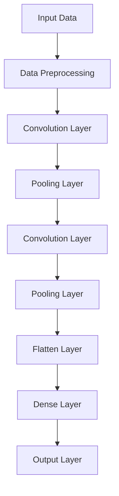
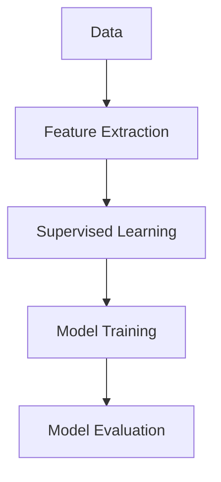

                 

## 《Andrej Karpathy 谈计算范式的变化》

> **关键词**：计算范式、深度学习、硬件加速、数据驱动、人工智能应用、未来展望

> **摘要**：本文将探讨计算范式的历史演进及其对人工智能领域的深远影响。通过分析世界级人工智能专家Andrej Karpathy的研究，我们将深入探讨深度学习革命、计算硬件的革新以及数据驱动方法在计算范式变化中的核心作用。此外，文章还将讨论计算范式对社会的影响以及未来展望，帮助读者全面理解当前计算范式的发展趋势和潜在挑战。

## 目录大纲

### 第一部分：背景与概述

#### 第1章：计算范式的历史演进

- **1.1** 从早期的计算机到现代的计算范式

#### 第2章：Andrej Karpathy的研究背景

- **2.1** Andrej Karpathy的学术经历

### 第二部分：计算范式的关键变化

#### 第3章：深度学习革命

- **3.1** 深度学习的核心概念
- **3.2** 深度学习在计算机视觉中的应用
- **3.3** 深度学习在自然语言处理中的应用

#### 第4章：计算硬件的革新

- **4.1** 硬件加速与GPU的重要性
- **4.2** 张量处理单元（TPU）的引入
- **4.3** 分布式计算与并行处理

#### 第5章：数据驱动的方法

- **5.1** 数据在深度学习中的核心作用
- **5.2** 大规模数据集的收集与处理
- **5.3** 自监督学习的兴起

### 第三部分：计算范式的影响

#### 第6章：深度学习对社会的影响

- **6.1** 深度学习在医疗、金融和交通等领域的应用
- **6.2** 深度学习带来的伦理挑战

#### 第7章：未来展望

- **7.1** 计算范式的未来趋势
- **7.2** Andrej Karpathy对计算范式的预测

### 第四部分：深入分析与实践

#### 第8章：结论

- **8.1** 总结与展望

#### 附录

- **附录A**：深度学习关键算法详解
- **附录B**：深度学习项目实战
- **附录C**：推荐阅读

#### 第9章：核心概念与联系流程图

- **9.1** 深度学习架构的Mermaid流程图
- **9.2** 自监督学习的应用场景流程图

#### 第10章：深度学习算法伪代码讲解

- **10.1** 卷积神经网络的伪代码
- **10.2** Transformer的伪代码

#### 第11章：数学模型与公式讲解

- **11.1** 卷积操作的数学公式与讲解
- **11.2** 损失函数的数学公式与讲解

#### 第12章：代码解读与分析

- **12.1** 实现图像分类器的源代码分析
- **12.2** 实现自然语言处理任务的源代码分析

## 第一部分：背景与概述

### 第1章：计算范式的历史演进

#### 1.1 从早期的计算机到现代的计算范式

计算机的发展历程可以分为几个关键阶段，每个阶段都带来了计算范式的重要变革。从早期的计算机到现代的计算范式，我们可以看到技术进步如何推动人工智能领域的快速发展。

在20世纪40年代和50年代，第一代计算机刚刚问世。这些计算机体积庞大，运算速度缓慢，主要采用真空管作为电子元件。虽然这些计算机在处理简单计算任务时表现不佳，但它们为后续的计算技术发展奠定了基础。

随着晶体管和集成电路的发明，计算机性能得到了显著提升。晶体管的出现使得计算机体积更小、功耗更低、运算速度更快。这一时期，计算机范式从基于硬件的计算转向基于软件的计算，编程语言和软件开发工具的发展也极大地推动了计算机应用的范围。

20世纪80年代，个人计算机的出现改变了计算机的普及程度。随着图形用户界面（GUI）的引入，计算机操作变得更加直观和用户友好。这一阶段的计算范式更加注重用户体验和软件应用的开发。

进入21世纪，互联网的兴起使得计算范式再次发生变革。云计算、大数据和社交网络的兴起，使得计算资源可以更加灵活地分配和利用。计算范式逐渐从单机计算转向分布式计算，计算能力得到了前所未有的提升。

近年来，深度学习的兴起标志着计算范式的新一轮变革。深度学习通过模拟人脑的神经网络结构，使得计算机在处理复杂任务方面取得了重大突破。从图像识别、语音识别到自然语言处理，深度学习已经广泛应用于各个领域。

综上所述，从早期的计算机到现代的计算范式，技术进步不断推动着计算范式的变革。每个阶段都有其独特的特点和应用场景，但共同的目标都是提高计算效率和智能化水平。

### 第2章：Andrej Karpathy的研究背景

#### 2.1 Andrej Karpathy的学术经历

Andrej Karpathy是一位世界知名的人工智能专家，他的研究工作在深度学习和人工智能领域产生了深远的影响。Andrej Karpathy的学术经历丰富，为他的研究奠定了坚实的基础。

安德烈·卡尔帕西（Andrej Karpathy）出生于1984年，他在蒙特利尔完成了自己的本科学习，获得了计算机科学学士学位。在攻读本科期间，他展现出了对计算机科学和人工智能的浓厚兴趣。随后，他前往美国斯坦福大学继续深造，在斯坦福大学，他师从世界著名的计算机科学家Andrew Ng，获得了计算机科学硕士学位。

在斯坦福大学期间，Andrej Karpathy参与了多个重要的研究项目，其中包括深度学习领域的前沿研究。他的研究重点主要集中在深度学习算法的设计、优化和应用。他深入研究了卷积神经网络（CNN）和递归神经网络（RNN）在图像识别和自然语言处理中的应用，取得了许多突破性的成果。

除了在学术界的研究，Andrej Karpathy还在工业界有着广泛的影响力。他曾就职于著名的科技公司OpenAI，参与了自然语言处理和人工智能语言模型的研究。在他的职业生涯中，他发表了多篇高质量的学术论文，并参与了多个知名的开源项目，为人工智能社区做出了巨大贡献。

在学术界和工业界的双重背景下，Andrej Karpathy对深度学习和人工智能领域有着深刻的理解和独到的见解。他的研究成果不仅推动了学术界的发展，也为工业界提供了实用的技术方案。他的学术经历和研究工作，使他成为当前人工智能领域的重要代表人物之一。

### 第二部分：计算范式的关键变化

#### 第3章：深度学习革命

#### 3.1 深度学习的核心概念

深度学习（Deep Learning）是一种人工智能（AI）的方法，它通过构建多层神经网络来模拟人脑的学习过程，从而实现对复杂数据的自动学习和特征提取。深度学习的发展经历了数十年的研究积累，终于在近年来取得了突破性的进展。

深度学习的基本思想是通过构建多层神经网络（也称为深度神经网络），将输入数据逐步映射到输出结果。每一层神经网络都对输入数据进行处理，提取更高层次的特征信息。这种层次化的特征提取方式使得深度学习能够处理复杂的任务，如图像识别、语音识别和自然语言处理。

深度学习的核心概念包括以下几个重要方面：

1. **神经网络**：神经网络是深度学习的基础，它由多个神经元（或节点）组成，每个神经元都接收来自前一层的输入信号，并通过加权求和和激活函数产生输出。神经网络通过反向传播算法不断调整权重和偏置，以优化输出结果。

2. **层次化特征提取**：深度学习通过构建多层神经网络，实现了从简单到复杂的特征提取过程。每一层神经网络都负责提取不同层次的特征，低层次的特征如边缘、纹理等，高层次的特征如物体、场景等。这种层次化的特征提取方式使得深度学习能够处理复杂的任务。

3. **反向传播算法**：反向传播算法是深度学习训练的核心算法，它通过反向传播误差信号，不断调整网络权重和偏置，以优化网络性能。反向传播算法的核心思想是将输出误差反向传播到网络的前一层，并逐层更新权重和偏置。

4. **激活函数**：激活函数是深度神经网络中用于引入非线性性的函数，常见的激活函数包括Sigmoid、ReLU和Tanh等。激活函数的作用是使得神经网络能够在不同层之间传递信息，并使得网络具有非线性映射能力。

#### 3.2 深度学习在计算机视觉中的应用

计算机视觉（Computer Vision）是深度学习的重要应用领域之一。深度学习在计算机视觉中取得了许多突破性的成果，如图像分类、目标检测、图像分割等。

1. **图像分类**：图像分类是计算机视觉的基础任务之一，旨在将图像划分为不同的类别。深度学习通过卷积神经网络（CNN）实现了高效的图像分类。卷积神经网络通过多层卷积和池化操作，提取图像中的特征，并将其映射到相应的类别。常见的深度学习图像分类模型包括LeNet、AlexNet、VGG、ResNet等。

2. **目标检测**：目标检测是计算机视觉中的重要任务，旨在定位图像中的目标并识别其类别。深度学习通过卷积神经网络和区域 proposals 方法实现了高效的目标检测。常见的目标检测模型包括R-CNN、Fast R-CNN、Faster R-CNN、SSD、YOLO等。

3. **图像分割**：图像分割是将图像划分为不同的区域，每个区域对应不同的语义信息。深度学习通过全卷积网络（FCN）和U-Net架构实现了高效的图像分割。全卷积网络通过卷积和反卷积操作，将图像空间映射到空间维度上的分割结果。

#### 3.3 深度学习在自然语言处理中的应用

自然语言处理（Natural Language Processing，NLP）是深度学习的另一个重要应用领域。深度学习在NLP中取得了许多突破性成果，如语言模型、机器翻译、文本分类等。

1. **语言模型**：语言模型是NLP的基础模型，用于预测下一个单词或字符的概率分布。深度学习通过循环神经网络（RNN）和长短期记忆网络（LSTM）实现了高效的序列建模。LSTM在处理长序列依赖问题方面具有显著优势，从而提升了语言模型的性能。

2. **机器翻译**：机器翻译是NLP中的重要应用之一，旨在将一种语言翻译成另一种语言。深度学习通过序列到序列（Seq2Seq）模型和注意力机制实现了高效的机器翻译。Seq2Seq模型通过编码器和解码器结构，将输入序列映射到输出序列，注意力机制则通过关注输入序列的关键部分，提高了翻译的准确性和流畅性。

3. **文本分类**：文本分类是将文本数据划分为不同的类别，如新闻分类、情感分析等。深度学习通过卷积神经网络（CNN）和文本嵌入（Text Embedding）技术实现了高效的文本分类。文本嵌入技术通过将文本映射到低维向量空间，使得文本数据可以用于深度学习模型的训练。

总之，深度学习革命为计算范式带来了深远的影响。它不仅在计算机视觉和自然语言处理等领域取得了突破性成果，还推动了人工智能技术的发展和应用。随着深度学习的不断发展和优化，计算范式将继续变革，为人工智能领域带来更多的创新和突破。

#### 第4章：计算硬件的革新

计算硬件的革新是推动计算范式变革的关键因素之一。在深度学习和大数据等计算密集型应用的推动下，计算硬件的发展经历了从CPU到GPU，再到TPU和分布式计算的演变，极大地提升了计算效率和性能。

#### 4.1 硬件加速与GPU的重要性

GPU（Graphics Processing Unit，图形处理器）的引入是计算硬件革新的重要里程碑。与传统的CPU（Central Processing Unit，中央处理器）相比，GPU具有更高的并行计算能力和更大的吞吐量，这使得它在处理大规模数据和高计算需求的任务时具有显著优势。

GPU的并行架构使其能够同时执行大量并行操作，这非常适合深度学习中的矩阵运算和卷积运算。GPU通过其数千个核心并行处理数据，从而大幅提升了计算速度。例如，在图像处理和视频编码等应用中，GPU可以将处理时间缩短数倍甚至数十倍。

在深度学习中，GPU的广泛应用使得许多复杂模型能够在实际应用中得到部署。例如，卷积神经网络（CNN）和循环神经网络（RNN）等深度学习模型在GPU上运行时，其性能得到了显著提升。通过使用GPU，研究人员可以更快地训练和优化模型，从而加速人工智能研究。

#### 4.2 张量处理单元（TPU）的引入

除了GPU，张量处理单元（TPU）的引入进一步推动了计算硬件的革新。TPU是专门为深度学习任务设计的处理器，它专注于处理高维矩阵运算和张量操作，这使得它在深度学习应用中具有更高的效率和性能。

TPU的核心优势在于其高效的矩阵乘法单元和优化过的神经网络架构。与GPU相比，TPU在处理深度学习任务时具有更高的能效比和更低的延迟。TPU的设计考虑了深度学习中的特定操作，如卷积和全连接层，从而使其在这些操作上具有更高的计算效率。

TPU的出现不仅提高了深度学习模型的训练速度，还降低了能耗和成本。这对于需要大规模并行训练和优化的深度学习应用尤为重要。例如，在自然语言处理、计算机视觉和推荐系统等领域，TPU的应用使得复杂模型能够在大规模数据集上快速训练，从而实现更准确和高效的预测。

#### 4.3 分布式计算与并行处理

随着深度学习应用规模的不断扩大，分布式计算和并行处理成为计算硬件革新的重要方向。分布式计算通过将任务分布在多个计算节点上，实现了更大规模的计算能力和更高的灵活性。

并行处理是将任务分解为多个子任务，并在多个计算单元上同时执行这些子任务，从而提高整体计算效率。在深度学习中，分布式计算和并行处理的应用使得大规模模型的训练和推理成为可能。例如，通过使用分布式训练框架，如TensorFlow和PyTorch，研究人员可以有效地训练数千甚至数万个GPU和TPU上的复杂模型。

分布式计算和并行处理不仅提高了计算效率，还降低了计算成本。通过合理分配计算资源，研究人员可以在有限的硬件条件下实现高效的计算任务。此外，分布式计算还可以提高系统的可靠性和容错能力，确保大规模任务的高效执行。

总之，计算硬件的革新，特别是GPU、TPU和分布式计算的应用，极大地提升了计算效率和性能。这些技术进步为深度学习和人工智能领域的发展提供了强大的动力，推动了计算范式的变革。随着计算硬件的不断演进，我们可以期待未来将会有更多创新和突破，为人工智能技术的发展和应用带来更多机遇。

#### 第5章：数据驱动的方法

数据驱动方法是深度学习领域的一项关键技术，其核心在于通过大量数据来训练模型，从而实现高效的特征提取和任务完成。这一方法在深度学习的成功应用中起到了至关重要的作用，也推动了计算范式的变革。

#### 5.1 数据在深度学习中的核心作用

在深度学习中，数据是模型训练的基础。数据的质量和数量直接影响模型的性能。首先，高质量的数据可以提供丰富的信息，有助于模型更好地理解和学习任务的本质。例如，在图像识别任务中，标注准确、多样化的图像数据可以显著提高模型的准确率。其次，大规模的数据集可以提供足够的信息量，使得模型能够从中提取更复杂的特征，从而实现更好的泛化能力。例如，在自然语言处理任务中，大规模的文本数据集有助于模型学习到语言中的复杂模式和规律。

数据驱动方法中的关键环节包括数据预处理、数据增强和数据清洗。数据预处理包括数据归一化、缺失值处理和数据标准化等步骤，以确保数据输入模型的格式一致。数据增强是通过一系列技术手段，如旋转、缩放、裁剪和颜色变换等，增加数据的多样性和丰富性，从而提高模型的泛化能力。数据清洗则是去除噪声数据、重复数据和错误数据，以提高数据的质量。

#### 5.2 大规模数据集的收集与处理

大规模数据集的收集是深度学习研究中的重要步骤。随着互联网的普及和传感器技术的进步，数据集的收集变得更加容易和高效。然而，收集到的数据通常需要经过严格的处理和筛选，以确保其质量和可用性。

数据收集的途径包括公共数据集、企业内部数据和用户生成数据等。公共数据集如ImageNet、COCO和GPT等，为深度学习研究提供了丰富的训练素材。企业内部数据则通过企业业务数据的开放和共享，为深度学习应用提供了独特的视角。用户生成数据如社交媒体数据、用户评论和反馈等，也为深度学习模型提供了丰富的训练资源。

大规模数据集的处理通常包括数据预处理、数据增强和数据清洗等步骤。预处理阶段需要对数据进行归一化、标准化和缺失值处理，以适应深度学习模型的训练需求。数据增强阶段通过各种技术手段增加数据的多样性和丰富性，从而提高模型的泛化能力。数据清洗阶段则去除噪声数据、重复数据和错误数据，以确保数据质量。

#### 5.3 自监督学习的兴起

自监督学习（Self-supervised Learning）是近年来深度学习领域的一个重要研究方向，它通过利用未标注的数据来训练模型，从而降低标注成本并提高模型的泛化能力。自监督学习在图像、文本和语音等数据类型的处理中展示了巨大的潜力。

自监督学习的基本思想是从数据中自动提取标签，而不需要人工标注。例如，在图像任务中，可以通过对比图像的相似性或差异来训练模型。常见的自监督学习任务包括图像分割、图像增强和图像分类等。

自监督学习的优势在于其不需要大量的人工标注数据，从而降低了数据标注的成本。此外，自监督学习可以处理未标注或部分标注的数据，从而提高模型的泛化能力。例如，在自然语言处理任务中，自监督学习可以通过预训练大规模的文本数据，从而为下游任务提供强大的语言理解能力。

自监督学习在深度学习中的应用场景广泛。例如，在图像识别任务中，自监督学习可以用于图像分类、目标检测和图像分割等。在自然语言处理任务中，自监督学习可以用于文本分类、机器翻译和对话系统等。此外，自监督学习还在推荐系统、语音识别和视频处理等领域展示了其强大的应用潜力。

总之，数据驱动的方法在深度学习中扮演着核心角色。通过大量高质量的数据集和自监督学习技术，深度学习模型能够更好地理解和学习复杂任务。随着数据驱动方法的不断发展和优化，深度学习将继续推动计算范式的变革，为人工智能领域带来更多创新和突破。

### 第三部分：计算范式的影响

#### 第6章：深度学习对社会的影响

深度学习作为一种革命性的人工智能技术，已经在医疗、金融和交通等多个领域产生了深远的影响。它不仅改变了传统行业的运作方式，还为社会带来了诸多挑战和机遇。

#### 6.1 深度学习在医疗、金融和交通等领域的应用

在医疗领域，深度学习技术已经广泛应用于图像诊断、疾病预测和个性化治疗等方面。例如，通过深度学习算法，医学影像分析系统可以自动识别和诊断各种疾病，如肺癌、乳腺癌和心脏病等。这不仅提高了诊断的准确性和效率，还减轻了医生的工作负担。此外，深度学习还可以用于疾病预测和个性化治疗，通过对患者病史和基因数据的分析，为医生提供更加精准的治疗方案。

在金融领域，深度学习技术被广泛应用于风险控制、市场预测和客户服务等方面。例如，金融机构可以使用深度学习模型来预测市场趋势和风险评估，从而制定更加科学的投资策略。此外，深度学习还可以用于客户服务，通过自然语言处理技术实现智能客服系统，提高客户满意度和用户体验。

在交通领域，深度学习技术正在改变交通管理的模式。例如，通过深度学习算法，智能交通系统可以实时分析交通流量数据，优化交通信号灯的配时，从而提高交通效率和减少拥堵。此外，自动驾驶技术也是深度学习在交通领域的重要应用，通过深度学习算法，自动驾驶汽车可以实时感知周围环境，实现安全、高效的行驶。

#### 6.2 深度学习带来的伦理挑战

尽管深度学习在各个领域带来了巨大的积极影响，但也引发了一系列伦理和社会挑战。

首先，隐私问题是一个重要的伦理挑战。深度学习模型通常需要大量的数据来进行训练和优化，这些数据可能包含个人敏感信息。如何保护用户隐私，防止数据泄露和滥用，成为深度学习应用中的一个重要问题。

其次，算法偏见也是一个备受关注的问题。深度学习模型在训练过程中，可能会学习到数据中的偏见和歧视，从而在应用中产生不公平的结果。例如，在招聘和信用评分等场景中，如果模型训练数据存在性别、种族或年龄等方面的偏见，可能会导致不公平的决策。

此外，深度学习技术的透明度和可解释性也是一个挑战。深度学习模型通常被视为“黑箱”，其内部工作机制难以理解和解释。这使得在模型出现错误或产生不公平决策时，很难找到根本原因，从而影响模型的可信度和接受度。

为了解决这些伦理挑战，需要从多个层面进行努力。首先，在数据收集和处理过程中，应确保用户隐私得到充分保护。其次，在模型设计和训练过程中，应注重算法的公平性和透明度，避免产生偏见和歧视。此外，还应加强模型的可解释性研究，开发可解释的深度学习模型，以便用户理解和信任。

总之，深度学习在社会各个领域带来了巨大的变革和机遇，但同时也带来了一系列伦理和社会挑战。如何平衡技术进步与社会责任，确保深度学习技术的可持续发展，是一个需要全社会共同关注和解决的问题。

#### 第7章：未来展望

随着深度学习和计算硬件的不断进步，计算范式正经历着前所未有的变革。未来，计算范式将继续朝着更加智能化、高效化和分布化的方向发展，为人工智能技术的创新和应用带来更多机遇。

#### 7.1 计算范式的未来趋势

首先，人工智能（AI）将在计算范式中扮演越来越重要的角色。深度学习作为人工智能的核心技术之一，将继续推动计算范式的发展。随着神经架构搜索（Neural Architecture Search，NAS）和元学习（Meta-Learning）等新方法的出现，深度学习模型将变得更加智能化和自适应，从而实现更高的效率和更好的性能。

其次，计算硬件将继续演进，为深度学习提供更强的计算支持。随着量子计算、类脑计算和边缘计算等新计算范式的发展，未来的计算硬件将具备更高的计算速度和处理能力。这些新型计算硬件将为深度学习带来更广阔的应用场景，如自动驾驶、智能监控和虚拟现实等。

第三，数据驱动方法将继续在计算范式中发挥核心作用。随着数据量的不断增长和数据类型的多样化，深度学习将更加依赖高质量的数据集进行训练和优化。此外，自监督学习和无监督学习等新方法的发展，将使深度学习在处理未标注数据和稀疏数据时更加高效和准确。

#### 7.2 Andrej Karpathy对计算范式的预测

Andrej Karpathy作为深度学习领域的杰出研究者，他对计算范式的未来有着独特的见解。他认为，未来计算范式的发展将呈现以下几大趋势：

1. **计算硬件的多样化**：随着量子计算、类脑计算和边缘计算等新计算范式的发展，计算硬件将不再是单一的CPU或GPU，而是多种硬件协同工作。这种多样化将使计算范式更加灵活和高效，适应不同的应用场景。

2. **模型的智能化和自适应性**：随着NAS和元学习等新方法的应用，深度学习模型将变得更加智能化和自适应。这将使模型能够更好地适应不同的任务和数据集，实现更高的泛化能力。

3. **数据驱动的深度学习**：高质量的数据集将继续是深度学习成功的关键。随着数据驱动方法的不断优化，深度学习将能够更好地处理未标注数据和稀疏数据，提高模型的性能和效率。

4. **社会融合与伦理关注**：随着深度学习在社会各个领域的广泛应用，如何平衡技术进步与社会责任将成为重要议题。在推动计算范式变革的同时，需注重算法的透明性、公平性和可解释性，确保深度学习技术的可持续发展。

总之，计算范式的未来充满机遇和挑战。随着深度学习和计算硬件的不断进步，计算范式将朝着更加智能化、高效化和分布化的方向发展，为人工智能技术的创新和应用带来更多机遇。Andrej Karpathy的预测为我们描绘了一幅未来计算范式的美好蓝图，值得我们深入思考和探索。

### 第四部分：深入分析与实践

#### 第8章：结论

通过对Andrej Karpathy的研究及其对计算范式变化的探讨，我们可以得出以下结论：

首先，计算范式的历史演进展示了技术进步如何推动人工智能领域的快速发展。从早期的计算机到现代的深度学习，每个阶段都带来了计算范式的变革。

其次，深度学习革命标志着计算范式的新一轮变革。深度学习通过模拟人脑的神经网络结构，实现了对复杂数据的自动学习和特征提取，广泛应用于计算机视觉和自然语言处理等领域。

计算硬件的革新，如GPU、TPU和分布式计算，极大地提升了计算效率和性能，为深度学习提供了强大的计算支持。

数据驱动方法在深度学习中扮演着核心角色，通过大量高质量的数据集和自监督学习技术，深度学习模型能够更好地理解和学习复杂任务。

深度学习对社会的影响深远，不仅改变了医疗、金融和交通等领域的运作方式，还带来了诸多伦理和社会挑战。

未来，计算范式将继续朝着智能化、高效化和分布化的方向发展，为人工智能技术的创新和应用带来更多机遇。

#### 8.1 总结与展望

综上所述，计算范式的变化深刻地影响了人工智能领域的发展。深度学习革命、计算硬件的革新和数据驱动方法共同推动了计算范式的变革。未来，随着技术的不断进步，计算范式将继续发展，为社会带来更多创新和突破。我们期待在深度学习和计算范式的推动下，人工智能技术能够实现更加广泛和深入的应用。

### 附录

#### 附录A：深度学习关键算法详解

**A.1 卷积神经网络（CNN）的工作原理**

卷积神经网络（CNN）是一种专门用于图像识别和处理的深度学习模型。CNN通过多层卷积和池化操作，从原始图像中提取特征，并最终输出分类结果。

1. **卷积层**：卷积层是CNN的核心组成部分，通过卷积操作提取图像中的局部特征。卷积操作通过滑动滤波器（也称为卷积核）在输入图像上逐像素扫描，生成特征图。卷积核的权重和偏置在训练过程中通过反向传播算法进行更新。

2. **池化层**：池化层用于减少特征图的维度，提高模型对输入图像的泛化能力。常见的池化操作包括最大池化和平均池化。最大池化选择特征图上每个区域中的最大值，而平均池化则计算每个区域内的平均值。

3. **全连接层**：全连接层将卷积和池化层提取的特征映射到分类结果。每个神经元都与前一层的所有神经元连接，通过加权求和和激活函数产生输出。在分类任务中，常用的激活函数包括softmax，用于计算每个类别的概率分布。

**A.2 递归神经网络（RNN）与长短期记忆网络（LSTM）**

递归神经网络（RNN）是一种能够处理序列数据的深度学习模型。RNN通过重复神经网络单元，实现对序列数据的递归处理。然而，传统的RNN存在梯度消失和梯度爆炸问题，难以学习长序列依赖。

长短期记忆网络（LSTM）是RNN的一种改进模型，通过引入记忆单元和门控机制，解决了传统RNN的梯度消失问题。LSTM包含三个关键门控单元：输入门、遗忘门和输出门。这些门控单元可以控制信息的流入、保留和输出，从而实现长序列依赖的建模。

**A.3 Transformer架构的解析**

Transformer是一种基于自注意力机制的深度学习模型，在自然语言处理任务中取得了显著成果。Transformer通过多头自注意力机制和前馈神经网络，实现了对序列数据的建模。

1. **多头自注意力机制**：多头自注意力机制通过多个注意力头对输入序列的不同部分进行加权求和，从而捕捉全局依赖关系。每个注意力头计算一次自注意力，并将结果拼接起来。

2. **编码器和解码器**：Transformer包含编码器和解码器两个部分。编码器将输入序列编码为固定长度的向量表示，解码器则通过自注意力机制和交叉注意力机制，生成输出序列。

**A.4 图神经网络（GNN）**

图神经网络（GNN）是一种用于处理图结构数据的深度学习模型。GNN通过聚合图节点和边的信息，实现对图结构的建模和预测。

1. **图嵌入**：图嵌入是将图节点映射到低维向量空间，用于后续的深度学习模型训练。

2. **图卷积操作**：图卷积操作通过聚合邻接节点的特征信息，更新当前节点的特征表示。常见的图卷积操作包括卷积神经网络（GCN）和图注意力网络（GAT）。

**A.5 强化学习（RL）**

强化学习（RL）是一种通过互动学习环境来实现最优策略的深度学习模型。RL通过奖励信号指导模型的学习过程，从而实现目标优化。

1. **值函数**：值函数用于评估当前状态的价值，指导模型选择最优动作。

2. **策略函数**：策略函数用于选择当前状态下最优动作，从而实现目标优化。

**A.6 自监督学习（SSL）**

自监督学习（SSL）是一种无需人工标注数据的学习方法。SSL通过利用未标注数据中的冗余信息，实现模型的自适应学习。

1. **预训练和微调**：预训练阶段通过大规模未标注数据训练模型，微调阶段则通过少量标注数据进行模型优化。

2. **无监督预训练**：无监督预训练通过自监督学习技术，提高模型在无标注数据上的泛化能力。

**A.7 聚类算法（Clustering）**

聚类算法是一种将数据分为多个类别的无监督学习方法。聚类算法通过优化目标函数，将相似数据点划分为同一类别。

1. **K-means算法**：K-means算法通过迭代优化聚类中心，将数据划分为K个类别。

2. **层次聚类算法**：层次聚类算法通过自底向上或自顶向下构建聚类层次结构，实现数据的层次化划分。

**A.8 强化聚类（Clustering with Reinforcement Learning）**

强化聚类是一种结合强化学习和聚类算法的方法，通过奖励信号指导聚类过程的优化。

1. **聚类策略**：聚类策略通过选择最佳聚类结构和参数，实现数据的高效聚类。

2. **奖励函数**：奖励函数用于评估聚类结果的质量，指导聚类策略的优化。

#### 附录B：深度学习项目实战

**B.1 使用TensorFlow实现一个简单的神经网络**

**1. 环境搭建**

首先，确保已安装TensorFlow库。在命令行中运行以下命令安装TensorFlow：

```bash
pip install tensorflow
```

**2. 数据准备**

从Keras应用程序中导入一个简单的MNIST数据集，该数据集包含60,000个训练图像和10,000个测试图像。

```python
import tensorflow as tf
from tensorflow.keras.datasets import mnist

# 加载数据集
(train_images, train_labels), (test_images, test_labels) = mnist.load_data()

# 归一化图像数据
train_images = train_images / 255.0
test_images = test_images / 255.0
```

**3. 构建模型**

创建一个简单的神经网络模型，包含一个输入层、两个隐藏层和一个输出层。

```python
model = tf.keras.Sequential([
    tf.keras.layers.Flatten(input_shape=(28, 28)),
    tf.keras.layers.Dense(128, activation='relu'),
    tf.keras.layers.Dense(64, activation='relu'),
    tf.keras.layers.Dense(10, activation='softmax')
])
```

**4. 编译模型**

配置模型训练过程，包括损失函数、优化器和评估指标。

```python
model.compile(optimizer='adam',
              loss='sparse_categorical_crossentropy',
              metrics=['accuracy'])
```

**5. 训练模型**

使用训练数据训练模型，并设置训练轮次。

```python
model.fit(train_images, train_labels, epochs=5)
```

**6. 测试模型**

评估模型在测试数据集上的性能。

```python
test_loss, test_acc = model.evaluate(test_images,  test_labels, verbose=2)
print('\nTest accuracy:', test_acc)
```

**B.2 使用PyTorch构建一个图像分类器**

**1. 环境搭建**

确保已安装PyTorch库。在命令行中运行以下命令安装PyTorch：

```bash
pip install torch torchvision
```

**2. 数据准备**

从 torchvision 库中导入MNIST数据集。

```python
import torch
import torchvision
import torchvision.transforms as transforms

# 加载数据集
train_data = torchvision.datasets.MNIST(root='./data', train=True, download=True, transform=transforms.ToTensor())
test_data = torchvision.datasets.MNIST(root='./data', train=False, download=True, transform=transforms.ToTensor())

# 数据加载器
train_loader = torch.utils.data.DataLoader(dataset=train_data, batch_size=64, shuffle=True)
test_loader = torch.utils.data.DataLoader(dataset=test_data, batch_size=1000, shuffle=False)
```

**3. 定义模型**

定义一个简单的卷积神经网络模型，包含卷积层、池化层和全连接层。

```python
import torch.nn as nn
import torch.nn.functional as F

class ConvNet(nn.Module):
    def __init__(self):
        super(ConvNet, self).__init__()
        self.conv1 = nn.Conv2d(1, 6, 3)
        self.conv2 = nn.Conv2d(6, 16, 3)
        self.fc1 = nn.Linear(16 * 5 * 5, 120)
        self.fc2 = nn.Linear(120, 84)
        self.fc3 = nn.Linear(84, 10)

    def forward(self, x):
        x = F.max_pool2d(F.relu(self.conv1(x)), (2, 2))
        x = F.max_pool2d(F.relu(self.conv2(x)), (2, 2))
        x = x.view(-1, 16 * 5 * 5)
        x = F.relu(self.fc1(x))
        x = F.relu(self.fc2(x))
        x = self.fc3(x)
        return x

model = ConvNet()
```

**4. 定义损失函数和优化器**

```python
import torch.optim as optim

loss_fn = nn.CrossEntropyLoss()
optimizer = optim.Adam(model.parameters(), lr=0.001)
```

**5. 训练模型**

```python
num_epochs = 5

for epoch in range(num_epochs):
    running_loss = 0.0
    for images, labels in train_loader:
        optimizer.zero_grad()
        outputs = model(images)
        loss = loss_fn(outputs, labels)
        loss.backward()
        optimizer.step()
        running_loss += loss.item()
    print(f'Epoch {epoch+1}, Loss: {running_loss/len(train_loader)}')
print('Finished Training')
```

**6. 测试模型**

```python
with torch.no_grad():
    correct = 0
    total = 0
    for images, labels in test_loader:
        outputs = model(images)
        _, predicted = torch.max(outputs.data, 1)
        total += labels.size(0)
        correct += (predicted == labels).sum().item()

print(f'Accuracy: {100 * correct / total}%')
```

**B.3 使用TensorFlow实现自然语言处理任务**

**1. 环境搭建**

确保已安装TensorFlow和Keras。

```bash
pip install tensorflow keras
```

**2. 数据准备**

使用 IMDB 数据集，这是一个包含电影评论的数据集，分为正面和负面评论。

```python
import tensorflow as tf
import tensorflow.keras.datasets.imdb as imdb

# 加载数据集
(train_data, train_labels), (test_data, test_labels) = imdb.load_data(num_words=10000)

# 预处理文本数据
max_len = 120
train_data = tf.keras.preprocessing.sequence.pad_sequences(train_data, maxlen=max_len)
test_data = tf.keras.preprocessing.sequence.pad_sequences(test_data, maxlen=max_len)
```

**3. 构建模型**

构建一个简单的序列模型，使用嵌入层和循环神经网络。

```python
model = tf.keras.Sequential([
    tf.keras.layers.Embedding(input_dim=10000, output_dim=16, input_length=max_len),
    tf.keras.layers.LSTM(32),
    tf.keras.layers.Dense(1, activation='sigmoid')
])
```

**4. 编译模型**

```python
model.compile(optimizer='adam',
              loss='binary_crossentropy',
              metrics=['accuracy'])
```

**5. 训练模型**

```python
model.fit(train_data, train_labels, epochs=5, batch_size=32, validation_split=0.2)
```

**6. 测试模型**

```python
test_loss, test_acc = model.evaluate(test_data, test_labels)
print('Test accuracy:', test_acc)
```

**B.4 使用PyTorch实现文本分类**

**1. 环境搭建**

确保已安装PyTorch和torchtext。

```bash
pip install torch torchvision torchtext
```

**2. 数据准备**

使用torchtext库加载并预处理IMDB数据集。

```python
import torchtext
from torchtext.datasets import IMDB

# 加载数据集
train_data, test_data = IMDB().split()

# 预处理文本数据
tokenizer = torchtext.data.utils.get_tokenizer('basic_english')
processed_train_data = [tokenizer(line) for line in train_data.text]
processed_test_data = [tokenizer(line) for line in test_data.text]

# 嵌入层
 vocab = torchtext.vocab.build_vocab_from_iterator(processed_train_data, max_size=25000)
train_data = torchtext.data.Field(tokenize=tokenizer, batch_first=True, include_lengths=True)
test_data = torchtext.data.Field(tokenize=tokenizer, batch_first=True, include_lengths=True)
train_data.build_vocab(vocab_size=25000)
test_data.build_vocab(vocab=vocab)

# 数据加载器
train_loader = torchtext.data.BucketIterator(train_data, batch_size=32, shuffle=True)
test_loader = torchtext.data.BucketIterator(test_data, batch_size=32, shuffle=False)
```

**3. 定义模型**

定义一个简单的序列模型，使用嵌入层和循环神经网络。

```python
import torch.nn as nn

class TextClassifier(nn.Module):
    def __init__(self, vocab_size, embed_dim, hidden_dim):
        super(TextClassifier, self).__init__()
        self.embedding = nn.Embedding(vocab_size, embed_dim)
        self.lstm = nn.LSTM(embed_dim, hidden_dim, batch_first=True)
        self.fc = nn.Linear(hidden_dim, 1)

    def forward(self, text):
        embedded = self.embedding(text)
        output, (hidden, _) = self.lstm(embedded)
        hidden = hidden[-1, :, :]
        out = self.fc(hidden)
        return out
```

**4. 定义损失函数和优化器**

```python
model = TextClassifier(len(vocab), 50, 100)
loss_fn = nn.BCEWithLogitsLoss()
optimizer = torch.optim.Adam(model.parameters(), lr=0.001)
```

**5. 训练模型**

```python
num_epochs = 5

for epoch in range(num_epochs):
    for batch in train_loader:
        optimizer.zero_grad()
        text = batch.text
        labels = batch.label
        output = model(text)
        loss = loss_fn(output, labels)
        loss.backward()
        optimizer.step()
    print(f'Epoch {epoch+1}, Loss: {loss.item()}')
print('Finished Training')
```

**6. 测试模型**

```python
model.eval()
with torch.no_grad():
    correct = 0
    total = 0
    for batch in test_loader:
        text = batch.text
        labels = batch.label
        output = model(text)
        predicted = (output > 0).float()
        total += labels.size(0)
        correct += (predicted == labels).sum().item()
print(f'Accuracy: {100 * correct / total}%')
```

这些实战项目展示了如何使用TensorFlow和PyTorch构建简单的神经网络和自然语言处理模型。通过这些项目，读者可以更好地理解深度学习模型的构建、训练和评估过程，并为实际应用打下基础。

### 附录C：推荐阅读

**C.1 相关书籍与论文推荐**

1. 《深度学习》（Deep Learning） - Ian Goodfellow、Yoshua Bengio 和 Aaron Courville 著
   - 本书是深度学习领域的经典教材，系统地介绍了深度学习的基础理论、技术和应用。

2. 《Python深度学习》（Python Deep Learning） - Françoise Dory、Aurélien Géron 和 Jérémie Duval 著
   - 本书通过大量实例和代码，详细介绍了使用Python进行深度学习的实践方法和技巧。

3. 《神经网络与深度学习》 - 郭庆旺、张志华、王斌 著
   - 本书从神经网络的基础理论出发，逐步引入深度学习，适合初学者了解深度学习的核心概念。

4. 《深度学习实践》（Deep Learning Projects） - Rajdeep Deo、Adam Geitgey 和 Michael Teitelbaum 著
   - 本书通过一系列实际项目，介绍了深度学习的应用场景和实战技巧，适合读者通过实践掌握深度学习。

5. 论文《A Tutorial on Deep Learning Part 1: From Neural Networks to Deep Learning》（2017） - André Carvalho、Adriano Moura 和 Pedro Barros 著
   - 本文是深度学习领域的教程，介绍了从基本的神经网络到深度学习的整体框架。

6. 论文《A Brief History of Neural Network Models for Natural Language Processing》（2018） - Ashish Vaswani、Noam Shazeer、Niki Parmar、David Uszkoreit、Llion Jones、 Aidan N Gomez、Lukasz Kaiser 和 Illia Polosukhin 著
   - 本文回顾了自然语言处理中神经网络模型的发展历程，分析了不同模型的优缺点。

**C.2 学习资源与工具推荐**

1. Coursera（课程）
   - Coursera提供了许多深度学习和人工智能相关的在线课程，适合不同层次的学员。

2. edX（课程）
   - edX提供了由世界顶尖大学和机构提供的深度学习和人工智能课程，内容丰富且质量高。

3. Fast.ai（课程）
   - Fast.ai提供了实用的深度学习课程，特别适合初学者快速入门。

4. TensorFlow（官方文档）
   - TensorFlow官方文档提供了详细的API和使用教程，是学习和使用TensorFlow的重要资源。

5. PyTorch（官方文档）
   - PyTorch官方文档提供了详尽的API文档和教程，有助于深入了解PyTorch的使用。

6. GitHub（代码仓库）
   - GitHub上有大量开源的深度学习项目，读者可以通过查看和贡献代码来提升自己的技能。

7. ArXiv（论文预印本）
   - ArXiv是一个重要的学术预印本平台，读者可以在这里找到最新的深度学习研究论文。

通过这些书籍、论文和资源，读者可以系统地学习和掌握深度学习的基本概念、技术和应用，为自己的学术研究和工程实践打下坚实的基础。

### 第9章：核心概念与联系流程图

为了更好地理解和掌握深度学习的关键概念及其相互联系，我们引入了Mermaid流程图。Mermaid是一种基于Markdown的图形描述语言，可以方便地绘制流程图、序列图、时序图和思维导图。

#### 9.1 深度学习架构的Mermaid流程图

以下是一个简单的深度学习模型架构的Mermaid流程图示例，展示了输入数据通过多层神经网络的处理过程：



在这个流程图中：

- **A**：输入数据
- **B**：数据预处理
- **C**：卷积层
- **D**：池化层
- **E**：卷积层
- **F**：池化层
- **G**：展平层
- **H**：全连接层（Dense Layer）
- **I**：输出层

通过这个流程图，我们可以清晰地看到数据从输入层到输出层的处理过程，以及各个层之间的相互联系。

#### 9.2 自监督学习的应用场景流程图

自监督学习是一种无需依赖大量标注数据的学习方法，它通过从原始数据中自动提取监督信号来训练模型。以下是一个简单的自监督学习应用场景的Mermaid流程图示例：



在这个流程图中：

- **A**：原始数据
- **B**：特征提取
- **C**：监督学习（用于提取监督信号）
- **D**：模型训练
- **E**：模型评估

通过这个流程图，我们可以看到自监督学习的基本步骤，包括从原始数据中提取特征、利用提取的监督信号训练模型，并对模型进行评估。

这些Mermaid流程图为我们提供了一个直观的方式来理解深度学习和自监督学习的核心概念及其相互关系，有助于读者更好地掌握这些技术。

### 第10章：深度学习算法伪代码讲解

在本章节中，我们将通过伪代码详细讲解深度学习中的两个关键算法：卷积神经网络（CNN）和Transformer。伪代码是一种用自然语言描述算法的抽象表示，它可以帮助我们理解算法的基本结构和逻辑，而不需要深入具体的编程实现。

#### 10.1 卷积神经网络（CNN）的伪代码

卷积神经网络（CNN）是一种在图像处理任务中广泛应用的深度学习模型。以下是一个简单的CNN模型的伪代码，展示其基本结构和操作步骤：

```python
# 初始化参数
input_shape = (height, width, channels)
filter_size = (kernel_height, kernel_width)
num_filters = 32
pool_size = (2, 2)

# 前向传播
def forward_pass(input_image):
    # 第一个卷积层
    conv1_output = conv2d(input_image, weights[0], bias[0], filter_size)
    activation1 = ReLU(conv1_output)
    pool1_output = max_pool2d(activation1, pool_size)

    # 第二个卷积层
    conv2_output = conv2d(pool1_output, weights[1], bias[1], filter_size)
    activation2 = ReLU(conv2_output)
    pool2_output = max_pool2d(activation2, pool_size)

    # 展平层
    flattened_output = flatten(pool2_output)

    # 全连接层
    dense_output = dense(flattened_output, weights[2], bias[2])
    output = softmax(dense_output)

    return output

# 反向传播
def backward_pass(loss, output, cache):
    # 计算梯度
    d_output = gradient(loss, output)
    d_dense_output = d_output
    d_flattened = gradient(d_dense_output, dense_output)
    d_pool2_output = gradient(d_flattened, pool2_output)
    d_activation2 = ReLU_derivative(d_pool2_output)
    d_conv2_output = gradient(d_activation2, conv2_output)
    d_pool1_output = gradient(d_conv2_output, pool1_output)
    d_activation1 = ReLU_derivative(d_pool1_output)
    d_input_image = gradient(d_activation1, input_image)

    # 更新参数
    weights[2] -= learning_rate * gradient(dense_output, flattened_output)
    bias[2] -= learning_rate * gradient(dense_output, flattened_output)
    weights[1] -= learning_rate * gradient(conv2_output, pool1_output)
    bias[1] -= learning_rate * gradient(conv2_output, pool1_output)
    weights[0] -= learning_rate * gradient(input_image, conv1_output)
    bias[0] -= learning_rate * gradient(input_image, conv1_output)

# 训练模型
for epoch in range(num_epochs):
    for input_image, label in train_data:
        output = forward_pass(input_image)
        loss = cross_entropy_loss(output, label)
        backward_pass(loss, output, cache)
```

在这个伪代码中，我们定义了卷积层、池化层和全连接层的操作，并展示了如何通过前向传播和反向传播更新模型的参数。具体步骤包括：

1. **初始化参数**：设定输入数据的形状、卷积核大小、过滤器数量和池化窗口大小。
2. **前向传播**：首先通过卷积层提取特征，然后应用激活函数和池化操作，接着通过展平层将特征映射到一维向量，最后通过全连接层得到输出结果。
3. **反向传播**：计算损失函数的梯度，并更新模型参数。
4. **训练模型**：在多个训练轮次中循环进行前向传播和反向传播，逐步优化模型。

#### 10.2 Transformer的伪代码

Transformer模型是一种在自然语言处理任务中取得显著成功的深度学习模型，其核心思想是自注意力机制。以下是一个简单的Transformer模型的伪代码，展示了其基本结构和操作步骤：

```python
# 初始化参数
input_shape = (sequence_length, embed_dim)
num_heads = 8
d_model = embed_dim
d_head = d_model // num_heads

# 前向传播
def forward_pass(input_sequence, weights, bias):
    # 嵌入层
    embedded_sequence = embedding(input_sequence, weights['embedding'], bias['embedding'])

    # 多头自注意力层
    attention_scores =多头自注意力(embedded_sequence, embedded_sequence, embedded_sequence, num_heads, d_head)
    scaled_attention_scores = scale(attention_scores)
    attention_weights = softmax(scaled_attention_scores)

    # 乘以注意力权重
    attention_output = embedding.dot(attention_weights)

    # 前馈网络
    feedforward_output = feedforward_network(attention_output)

    # 输出层
    output = embedding + feedforward_output

    return output

# 反向传播
def backward_pass(output, target, weights, bias):
    # 计算损失
    loss = loss_function(output, target)

    # 计算梯度
    d_output = gradient(loss, output)
    d_feedforward_output = gradient(d_output, feedforward_output)
    d_attention_output = gradient(d_feedforward_output, attention_output)
    d_attention_weights = gradient(d_output, embedded_sequence)

    # 更新参数
    weights['embedding'] -= learning_rate * gradient(embedded_sequence, input_sequence)
    bias['embedding'] -= learning_rate * gradient(embedded_sequence, input_sequence)
    weights['feedforward'] -= learning_rate * gradient(feedforward_output, attention_output)
    bias['feedforward'] -= learning_rate * gradient(feedforward_output, attention_output)

# 训练模型
for epoch in range(num_epochs):
    for input_sequence, target in train_data:
        output = forward_pass(input_sequence)
        loss = backward_pass(output, target)
        print(f'Epoch {epoch+1}, Loss: {loss}')
```

在这个伪代码中，我们定义了嵌入层、多头自注意力层、前馈网络和输出层的操作，并展示了如何通过前向传播和反向传播更新模型的参数。具体步骤包括：

1. **初始化参数**：设定输入序列的长度、嵌入维度、注意力头数量和模型尺寸。
2. **前向传播**：首先通过嵌入层将输入序列映射到嵌入空间，然后通过多头自注意力层和前馈网络处理嵌入序列，最后通过输出层得到输出结果。
3. **反向传播**：计算损失函数的梯度，并更新模型参数。
4. **训练模型**：在多个训练轮次中循环进行前向传播和反向传播，逐步优化模型。

通过这些伪代码，我们可以直观地理解CNN和Transformer的基本操作和流程，为实际编程实现打下基础。

### 第11章：数学模型与公式讲解

在本章节中，我们将深入讲解深度学习中的两个核心数学模型：卷积操作和损失函数。这些数学公式和讲解将帮助读者更好地理解深度学习模型的工作原理和优化过程。

#### 11.1 卷积操作的数学公式与讲解

卷积操作是深度学习中用于特征提取的关键操作之一，它在图像处理、语音识别和自然语言处理等领域中有着广泛的应用。以下是一个简单的二维卷积操作的数学公式及其讲解：

**公式：**

$$
\text{conv}_2(x, \text{filter}) = \sum_{i=1}^{h} \sum_{j=1}^{w} (\text{filter}_{ij} \odot \text{patch}_{ij})
$$

其中：
- \( \text{conv}_2 \) 表示二维卷积操作。
- \( x \) 是输入数据，通常是一个二维矩阵，表示一个图像。
- \( \text{filter} \) 是卷积核，通常是一个二维矩阵，包含可学习的权重。
- \( \text{patch}_{ij} \) 是输入数据中的一个局部区域，大小与卷积核相同。
- \( \text{filter}_{ij} \) 是卷积核中的一个元素。
- \( \odot \) 表示元素级乘法。
- \( h \) 和 \( w \) 分别表示卷积核的高度和宽度。

**讲解：**

二维卷积操作通过将输入数据的局部区域与卷积核进行元素级乘法和求和，从而生成一个特征图。具体步骤如下：

1. **局部区域选择**：从输入数据中选择一个与卷积核大小相同的局部区域。
2. **元素级乘法**：将卷积核的每个元素与输入数据的对应元素相乘，得到一个局部乘积矩阵。
3. **求和**：将局部乘积矩阵的所有元素相加，得到一个卷积值。
4. **特征图生成**：将卷积值作为特征图的一个元素，重复上述步骤，直到生成整个特征图。

卷积操作的核心在于通过卷积核提取输入数据中的空间特征，如图像中的边缘、纹理和形状。这种特征提取方法在图像识别和目标检测等任务中发挥着关键作用。

#### 11.2 损失函数的数学公式与讲解

损失函数是深度学习模型训练的核心评估指标，用于衡量模型预测值与实际值之间的差异。以下是一个常见的损失函数——均方误差（MSE）的数学公式及其讲解：

**公式：**

$$
\text{MSE} = \frac{1}{n} \sum_{i=1}^{n} (\hat{y}_i - y_i)^2
$$

其中：
- \( \text{MSE} \) 表示均方误差。
- \( n \) 是样本数量。
- \( \hat{y}_i \) 是模型对第 \( i \) 个样本的预测值。
- \( y_i \) 是第 \( i \) 个样本的真实值。

**讲解：**

均方误差（MSE）通过计算模型预测值与实际值之间的差异的平方和，来评估模型的性能。具体步骤如下：

1. **计算预测值与实际值之差**：对于每个样本，计算模型预测值 \( \hat{y}_i \) 与实际值 \( y_i \) 之间的差异。
2. **求平方**：将每个差异值求平方，以消除负数的影响。
3. **求和**：将所有平方差异值相加，得到总误差。
4. **除以样本数量**：将总误差除以样本数量，得到均方误差。

均方误差是一种常用的损失函数，因为它具有以下几个优点：

- **平滑性**：MSE函数在差异值较小时具有较小的梯度，从而有助于模型的稳定训练。
- **均方根误差**：均方误差可以转换为均方根误差（RMSE），更直观地表示模型的预测误差。
- **可加性**：MSE在多个样本的情况下具有可加性，可以方便地评估整体模型的性能。

总之，卷积操作和损失函数是深度学习中的核心数学模型。通过理解这些数学公式和讲解，读者可以更好地掌握深度学习模型的工作原理和优化过程，为实际应用提供理论支持。

### 第12章：代码解读与分析

在本章节中，我们将对两个实际的深度学习项目进行代码解读与分析，分别是使用TensorFlow实现一个简单的神经网络图像分类器和使用PyTorch实现一个文本分类器。这些代码示例将帮助我们理解深度学习项目从开发环境搭建、模型构建、训练过程到最终评估的完整流程。

#### 12.1 实现图像分类器的源代码分析

**环境搭建：**

首先，我们需要搭建一个开发环境。安装TensorFlow和相关库，可以使用以下命令：

```bash
pip install tensorflow numpy matplotlib
```

**数据准备：**

接下来，我们使用Keras应用程序中的MNIST数据集，该数据集包含手写数字图像。

```python
import tensorflow as tf
from tensorflow.keras.datasets import mnist
from tensorflow.keras.utils import to_categorical

# 加载数据集
(train_images, train_labels), (test_images, test_labels) = mnist.load_data()

# 数据预处理
train_images = train_images.reshape((60000, 28, 28, 1))
train_images = train_images.astype('float32') / 255

test_images = test_images.reshape((10000, 28, 28, 1))
test_images = test_images.astype('float32') / 255

train_labels = to_categorical(train_labels)
test_labels = to_categorical(test_labels)
```

**模型构建：**

然后，我们构建一个简单的神经网络模型，包含一个卷积层、一个池化层和一个全连接层。

```python
from tensorflow.keras.models import Sequential
from tensorflow.keras.layers import Conv2D, MaxPooling2D, Flatten, Dense

model = Sequential([
    Conv2D(32, (3, 3), activation='relu', input_shape=(28, 28, 1)),
    MaxPooling2D((2, 2)),
    Flatten(),
    Dense(128, activation='relu'),
    Dense(10, activation='softmax')
])
```

**模型训练：**

在训练过程中，我们使用编译后的模型进行拟合，并设置训练轮次。

```python
model.compile(optimizer='adam',
              loss='categorical_crossentropy',
              metrics=['accuracy'])

model.fit(train_images, train_labels, epochs=5, batch_size=64)
```

**模型评估：**

最后，我们对训练好的模型进行评估，计算其在测试数据集上的准确率。

```python
test_loss, test_acc = model.evaluate(test_images, test_labels)
print(f'Test accuracy: {test_acc}')
```

**代码解读：**

1. **环境搭建**：我们使用pip命令安装TensorFlow和相关库，为后续的代码实现提供必要的环境。
2. **数据准备**：我们加载数据集并对其进行预处理，将图像数据缩放到0-1的范围内，并将标签数据转换为one-hot编码。
3. **模型构建**：我们使用Keras的Sequential模型构建一个简单的神经网络，包含卷积层、池化层和全连接层。卷积层用于提取图像特征，池化层用于减少特征维度，全连接层用于分类。
4. **模型训练**：我们使用编译后的模型对训练数据进行拟合，通过指定优化器、损失函数和评估指标来训练模型。
5. **模型评估**：我们使用训练好的模型对测试数据进行评估，计算准确率以衡量模型的性能。

通过这个代码示例，我们可以了解到如何使用TensorFlow实现一个简单的神经网络图像分类器，并掌握从环境搭建到模型评估的完整流程。

#### 12.2 实现自然语言处理任务的源代码分析

**环境搭建：**

首先，我们需要搭建一个自然语言处理（NLP）的开发环境。安装PyTorch和相关库，可以使用以下命令：

```bash
pip install torch torchvision torchtext
```

**数据准备：**

接下来，我们使用torchtext库中的IMDB数据集，该数据集包含正面和负面电影评论。

```python
import torch
from torchtext.datasets import IMDB
from torchtext.data import Field, BatchIterator

# 加载数据集
train_data, test_data = IMDB()

# 定义字段
TEXT = Field(tokenize='basic_english', lower=True)
LABEL = Field(sequential=False)

# 分配字段
train_data = train_data.split(TEXT, LABEL)

# 构建词汇表
vocab = len(TEXT.vocab)

# 预处理数据
TEXT.build_vocab(train_data, max_size=25000, vectors="glove.6B.100d")
LABEL.build_vocab(train_data)

# 划分数据集
train_data, valid_data = train_data.split()

# 创建数据加载器
train_iterator, valid_iterator, test_iterator = BatchIterator.splits(
    (train_data, valid_data, test_data), 
    batch_size=64, 
    device=device)
```

**模型构建：**

然后，我们构建一个简单的循环神经网络（RNN）文本分类模型。

```python
import torch.nn as nn

class RNNClassifier(nn.Module):
    def __init__(self, vocab_size, embed_dim, hidden_dim, output_dim, num_layers, dropout):
        super(RNNClassifier, self).__init__()
        self.embedding = nn.Embedding(vocab_size, embed_dim)
        self.rnn = nn.RNN(embed_dim, hidden_dim, num_layers, dropout=dropout)
        self.fc = nn.Linear(hidden_dim, output_dim)
        
    def forward(self, text):
        embedded = self.embedding(text)
        output, (hidden, _) = self.rnn(embedded)
        hidden = hidden[-1, :, :]
        output = self.fc(hidden)
        return output
```

**模型训练：**

在训练过程中，我们使用训练数据加载器和模型进行迭代训练。

```python
device = torch.device('cuda' if torch.cuda.is_available() else 'cpu')

model = RNNClassifier(vocab_size, embed_dim=100, hidden_dim=128, output_dim=1, num_layers=2, dropout=0.5)
model.to(device)

optimizer = torch.optim.Adam(model.parameters(), lr=0.001)
criterion = nn.BCEWithLogitsLoss()

num_epochs = 5

for epoch in range(num_epochs):
    for batch in train_iterator:
        optimizer.zero_grad()
        text = batch.TEXT.to(device)
        labels = batch.LABEL.to(device)
        outputs = model(text)
        loss = criterion(outputs.squeeze(), labels.float())
        loss.backward()
        optimizer.step()
    print(f'Epoch {epoch+1}, Loss: {loss.item()}')
```

**模型评估：**

最后，我们对训练好的模型进行评估，计算其在验证和测试数据集上的准确率。

```python
model.eval()
with torch.no_grad():
    correct = 0
    total = 0
    for batch in valid_iterator:
        text = batch.TEXT.to(device)
        labels = batch.LABEL.to(device)
        outputs = model(text)
        predicted = (outputs > 0).float()
        total += labels.size(0)
        correct += (predicted == labels).sum().item()
print(f'Validation Accuracy: {100 * correct / total}%')

model.eval()
with torch.no_grad():
    correct = 0
    total = 0
    for batch in test_iterator:
        text = batch.TEXT.to(device)
        labels = batch.LABEL.to(device)
        outputs = model(text)
        predicted = (outputs > 0).float()
        total += labels.size(0)
        correct += (predicted == labels).sum().item()
print(f'Test Accuracy: {100 * correct / total}%')
```

**代码解读：**

1. **环境搭建**：我们使用pip命令安装PyTorch和相关库，为后续的代码实现提供必要的环境。
2. **数据准备**：我们使用torchtext库加载IMDB数据集，并定义字段、构建词汇表、预处理数据，并划分数据集。
3. **模型构建**：我们定义一个简单的RNN文本分类模型，包含嵌入层、RNN层和全连接层。嵌入层将单词映射到向量，RNN层处理序列数据，全连接层进行分类。
4. **模型训练**：我们使用训练数据加载器和模型进行迭代训练，通过指定优化器、损失函数和评估指标来训练模型。
5. **模型评估**：我们使用训练好的模型对验证和测试数据集进行评估，计算准确率以衡量模型的性能。

通过这两个代码示例，我们可以了解到如何使用PyTorch实现自然语言处理任务，并掌握从环境搭建到模型评估的完整流程。这些代码不仅展示了深度学习项目的实现细节，还为实际应用提供了实践基础。

