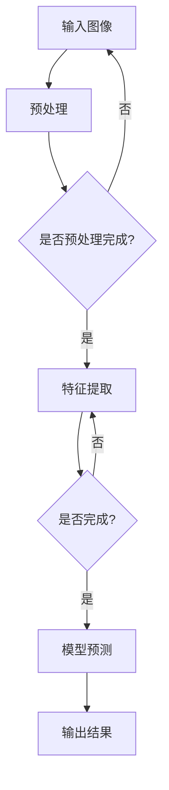
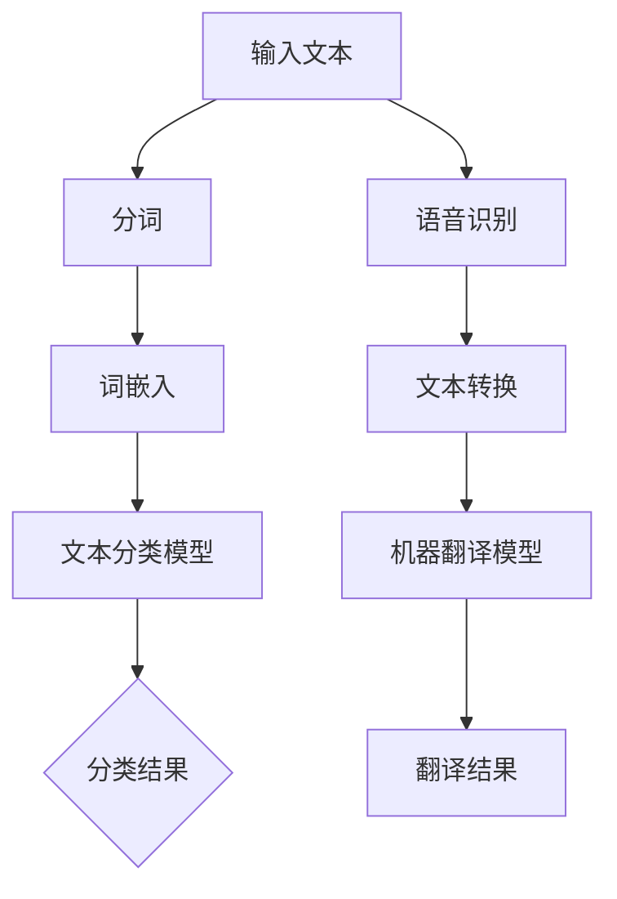
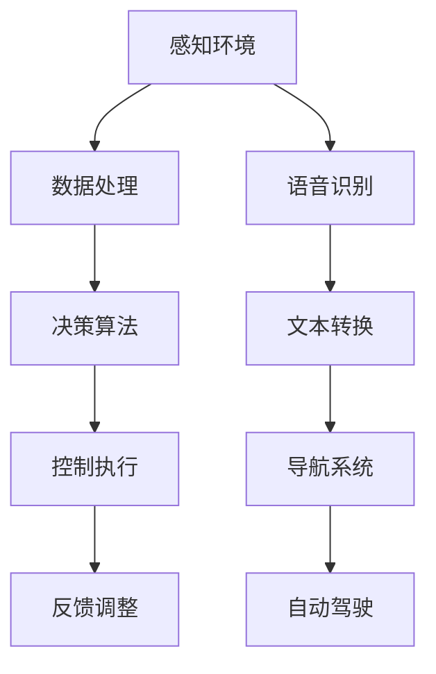

                 

### 《Andrej Karpathy：人工智能的未来发展前景》

#### 关键词：
- Andrej Karpathy
- 人工智能
- 深度学习
- 发展前景
- 技术应用
- 伦理问题

#### 摘要：
本文将深入探讨人工智能领域专家Andrej Karpathy的研究贡献和人工智能的未来发展前景。文章首先回顾了人工智能的历史与发展，介绍了机器学习、深度学习和神经网络等核心技术。接着，本文重点分析Andrej Karpathy在深度学习领域的学术贡献和实际项目，包括生成对抗网络（GANs）和Transformer模型。随后，文章讨论了人工智能的应用领域、发展趋势和挑战。最后，本文提出了人工智能的未来发展策略，包括教育、人才培养和可持续发展等方面。通过本文的阅读，读者将对人工智能的未来发展有一个全面的了解。

## 《Andrej Karpathy：人工智能的未来发展前景》目录大纲

以下是本文的目录大纲：

#### 第一部分：人工智能的历史与发展

1. **人工智能的起源与发展**
   - **人工智能的定义与分类**
   - **人工智能的历史回顾**
   - **人工智能的关键事件**

2. **人工智能的技术基础**
   - **机器学习与深度学习基础**
   - **神经网络的架构与训练**
   - **机器学习与深度学习的优化算法**

3. **人工智能的应用领域**
   - **计算机视觉应用**
   - **自然语言处理应用**
   - **人工智能在机器人与自动化领域的应用**

4. **人工智能的发展趋势与挑战**
   - **人工智能的发展趋势**
   - **人工智能的挑战与伦理问题**

#### 第二部分：Andrej Karpathy的研究贡献

5. **Andrej Karpathy的学术贡献**
   - **研究方向**
   - **重要论文与著作**

6. **Andrej Karpathy的实际项目与案例**
   - **研究项目概述**
   - **实际应用案例**

7. **Andrej Karpathy对未来人工智能发展的看法**
   - **发展趋势**
   - **潜在影响**
   - **伦理问题**

#### 第三部分：深度学习核心概念与联系

8. **深度学习的核心概念**
   - **核心概念与联系**
   - **深度学习与人工智能的关系**

9. **深度学习的架构与原理**
   - **神经网络的基本架构**
   - **卷积神经网络（CNN）**
   - **循环神经网络（RNN）**
   - **Transformer模型**

10. **深度学习与人工智能的关系**
    - **深度学习在计算机视觉中的应用**
    - **深度学习在自然语言处理中的应用**

#### 第四部分：核心算法原理讲解

11. **深度学习算法原理**
    - **神经网络的训练过程**
    - **反向传播算法**
    - **损失函数与优化算法**

12. **自然语言处理算法原理**
    - **词嵌入技术**
    - **序列模型与注意力机制**
    - **机器翻译算法**

13. **计算机视觉算法原理**
    - **图像识别与分类**
    - **目标检测与跟踪**
    - **图像生成算法**

#### 第五部分：项目实战

14. **深度学习项目实战**
    - **项目介绍与目标**
    - **项目环境搭建**
    - **源代码详细实现**
    - **代码解读与分析**

15. **自然语言处理项目实战**
    - **项目介绍与目标**
    - **项目环境搭建**
    - **源代码详细实现**
    - **代码解读与分析**

16. **计算机视觉项目实战**
    - **项目介绍与目标**
    - **项目环境搭建**
    - **源代码详细实现**
    - **代码解读与分析**

### 附录

17. **附录A：深度学习相关工具与资源**

18. **附录B：人工智能相关开源项目与工具**

19. **附录C：深度学习与人工智能领域的重要会议与期刊**

20. **附录D：深度学习与人工智能领域的知名人物与组织**

本文将按照上述目录大纲结构，逐步深入探讨人工智能的历史与发展、技术基础、应用领域、未来发展趋势，以及Andrej Karpathy的研究贡献。希望通过这篇文章，读者能够对人工智能的未来发展有一个全面的了解，并能够从中获得启示和灵感。接下来，我们将首先回顾人工智能的历史与发展。### 第一部分：人工智能的历史与发展

##### 第1章：人工智能的起源与发展

人工智能（Artificial Intelligence，简称AI）作为计算机科学的一个重要分支，旨在研究和开发能够模拟、延伸和扩展人类智能的理论、算法和技术。人工智能的概念可以追溯到20世纪50年代，但它的起源和发展经历了多个阶段，从最初的梦想和尝试，到今天的技术突破和应用普及。

###### 1.1 人工智能的定义与分类

**人工智能的定义**：人工智能是指由人创造出的具有智能行为和能力的机器系统，能够感知环境、学习知识、解决问题、执行任务，甚至模拟人类的思考过程。

**人工智能的分类**：根据人工智能的能力和实现方式，可以将人工智能分为以下几类：

- **弱人工智能（Narrow AI）**：专注于特定任务的人工智能，如语音识别、图像识别、机器翻译等。弱人工智能在特定领域具有高度专精的能力，但缺乏通用性。
- **强人工智能（General AI）**：具有与人类相当的智能，能够理解和执行各种复杂的任务，具备自我意识和情感。强人工智能目前仍处于理论研究阶段，尚未实现。
- **混合人工智能（Hybrid AI）**：结合弱人工智能和强人工智能的特点，通过融合多种技术和算法，实现更广泛的应用和更高的智能水平。

###### 1.2 人工智能的历史回顾

**早期人工智能发展**：人工智能的早期发展可以追溯到20世纪50年代。1950年，艾伦·图灵发表了著名的论文《计算机器与智能》，提出了图灵测试作为评估机器智能的标准。1956年，约翰·麦卡锡等人在达特茅斯会议上首次提出了“人工智能”这一术语，并确定了人工智能的研究目标和方向。

**人工智能的黄金时代与低谷**：20世纪80年代至90年代是人工智能的黄金时代，这一时期，专家系统和机器学习技术得到了快速发展。然而，由于技术限制和实际应用中的挑战，人工智能在20世纪90年代经历了低谷期。

**21世纪初的人工智能复兴**：进入21世纪后，随着计算能力的提升、大数据的出现和深度学习技术的突破，人工智能迎来了新的发展机遇。特别是2012年，深度学习在图像识别任务上取得了突破性成果，标志着人工智能的复兴。

###### 1.3 人工智能的关键事件

- **1956年**：达特茅斯会议，人工智能这一术语首次被提出。
- **1956年**：约翰·麦卡锡等创立达特茅斯计划，推动人工智能研究。
- **1956年**：阿兰·图灵提出图灵测试，成为评估机器智能的重要标准。
- **1980年**：约翰·霍普菲尔德提出神经网络理论，为深度学习奠定了基础。
- **2012年**：AlexNet模型在ImageNet挑战赛中取得突破性成果，标志着深度学习的崛起。
- **2016年**：谷歌的AlphaGo战胜围棋世界冠军李世石，展示了人工智能在复杂任务中的潜力。

通过对人工智能的历史回顾，我们可以看到，人工智能的发展经历了从梦想和理论到实际应用的漫长过程。虽然目前人工智能仍面临许多挑战，但其发展速度和影响力不容忽视。在接下来的章节中，我们将进一步探讨人工智能的技术基础和应用领域。

##### 第2章：人工智能的技术基础

人工智能的技术基础是构建智能系统的核心，涵盖了机器学习、深度学习和神经网络等关键技术。这些技术为人工智能的发展提供了强大的动力，使得计算机能够模拟和扩展人类的智能能力。

###### 2.1 机器学习与深度学习基础

**机器学习的基本概念**：

机器学习（Machine Learning）是一种通过算法让计算机自动从数据中学习模式和规律，从而进行预测和决策的技术。机器学习可以分为以下几类：

- **监督学习（Supervised Learning）**：输入特征和对应的标签，通过学习特征与标签之间的关系，实现对未知数据的预测。
- **无监督学习（Unsupervised Learning）**：没有预定义的标签，通过分析数据的结构和模式，发现数据中的隐含规律。
- **半监督学习（Semi-Supervised Learning）**：结合监督学习和无监督学习，利用少量的标签数据和大量的无标签数据来训练模型。
- **强化学习（Reinforcement Learning）**：通过试错和反馈来学习最佳策略，使系统在特定环境中达到最优状态。

**深度学习的基本概念**：

深度学习（Deep Learning）是机器学习的一个重要分支，通过多层神经网络结构，对大量数据进行学习和处理。深度学习具有以下特点：

- **多层神经网络**：深度学习模型通常包含多个隐藏层，通过逐层提取数据中的特征，实现对复杂模式的识别。
- **自动特征学习**：深度学习模型能够自动从原始数据中学习到有用的特征，减少了人工特征工程的工作量。
- **强大的表示能力**：深度学习模型能够捕捉数据中的复杂关系和层次结构，具有很好的泛化能力。

**神经网络的基本概念**：

神经网络（Neural Network）是模拟人脑神经元连接方式的一种计算模型，由大量相互连接的神经元组成。神经网络的基本组成部分包括：

- **神经元**：神经网络的基本计算单元，通过输入和权重计算得到输出。
- **层**：神经网络分为输入层、隐藏层和输出层，每层中的神经元通过前一层神经元的输出进行计算。
- **权重**：连接神经元的参数，用于调节输入对输出的影响。
- **激活函数**：用于对神经元的输出进行非线性变换，引入非线性特性。

**神经网络的训练过程**：

神经网络的训练过程主要包括以下几个步骤：

1. **前向传播**：将输入数据传递到神经网络中，通过层层计算得到输出。
2. **损失函数**：计算预测输出与真实输出之间的差异，通过损失函数来评估模型的性能。
3. **反向传播**：根据损失函数的梯度，反向传播误差，更新神经网络的权重。
4. **优化算法**：选择合适的优化算法，如随机梯度下降（SGD）、Adam等，对模型进行迭代优化。

通过机器学习和深度学习的基础知识，我们可以理解神经网络的工作原理和训练过程。在接下来的章节中，我们将进一步探讨神经网络的架构与训练，以及机器学习与深度学习的优化算法。

###### 2.2 神经网络的架构与训练

**神经网络的架构**：

神经网络（Neural Network）是一种由大量神经元组成的计算模型，其基本架构包括输入层、隐藏层和输出层。每个神经元都通过连接其他神经元的权重进行计算，最终得到输出。

- **输入层**：接收外部输入数据，每个输入数据通过连接权重传递到隐藏层。
- **隐藏层**：隐藏层中的神经元通过激活函数进行非线性变换，提取数据中的特征。隐藏层的数量和神经元数量可以根据任务需要进行调整。
- **输出层**：输出层直接生成预测结果，可以是分类结果、回归值等。

**神经网络的工作原理**：

神经网络通过学习输入数据与输出数据之间的映射关系来进行预测和决策。具体过程如下：

1. **前向传播**：输入数据通过输入层传递到隐藏层，隐藏层中的神经元对输入数据进行处理并传递到下一层，最终输出层得到预测结果。
2. **损失函数**：计算预测结果与真实结果之间的差异，通过损失函数（如均方误差、交叉熵等）来评估模型的性能。
3. **反向传播**：通过反向传播算法，将损失函数的梯度反向传播到网络中的每个神经元，更新神经元的权重和偏置，以达到最小化损失函数的目的。
4. **迭代训练**：通过迭代训练过程，不断更新模型参数，使得模型在训练数据上达到更好的拟合效果。

**神经网络的优化算法**：

神经网络的优化算法用于更新网络中的权重和偏置，使得模型能够更好地拟合训练数据。以下是一些常见的优化算法：

- **随机梯度下降（SGD）**：SGD是最常用的优化算法，通过随机选择一个小批量样本，计算梯度并更新模型参数。SGD的优点是实现简单，但缺点是收敛速度较慢，容易陷入局部最小值。
- **Adam优化器**：Adam是一种自适应的优化算法，结合了SGD和RMSprop的优点。Adam通过计算一阶矩估计（均值）和二阶矩估计（方差）来调整学习率，具有较好的收敛性和稳定性。
- **Adagrad优化器**：Adagrad是一种自适应的优化算法，通过累计梯度平方的倒数来动态调整学习率。Adagrad在处理稀疏数据时具有较好的性能，但在连续数据上可能收敛较慢。

通过以上对神经网络架构、工作原理和优化算法的介绍，我们可以更深入地理解神经网络在人工智能中的应用。在接下来的章节中，我们将进一步探讨神经网络在不同应用领域中的具体应用。

###### 2.3 机器学习与深度学习的优化算法

机器学习和深度学习中的优化算法是模型训练过程中至关重要的一部分，用于最小化损失函数，提高模型性能。以下介绍几种常用的优化算法：

**随机梯度下降（SGD）**：

随机梯度下降（Stochastic Gradient Descent，SGD）是最简单且应用最广泛的优化算法。其核心思想是每次迭代只随机选择一个样本进行梯度计算和参数更新。SGD的优点是实现简单，计算成本低，适合处理大量数据。然而，SGD的收敛速度较慢，容易陷入局部最小值，且对噪声数据敏感。

- **步骤**：
  1. 初始化模型参数。
  2. 对于每个样本，计算预测值和损失函数。
  3. 计算梯度。
  4. 更新参数：\[ \theta = \theta - \alpha \cdot \nabla J(\theta) \]
  5. 重复步骤2-4，直到达到收敛条件。

**动量（Momentum）**：

动量（Momentum）是一种在SGD基础上改进的优化算法，通过引入动量参数来加速梯度下降。动量有助于减少在优化过程中的振荡，提高收敛速度。

- **步骤**：
  1. 初始化模型参数和动量参数 \[ m_0 = 0 \]。
  2. 对于每个样本，计算预测值和损失函数。
  3. 计算梯度。
  4. 更新动量：\[ m_t = \beta \cdot m_{t-1} + (1 - \beta) \cdot \nabla J(\theta) \]
  5. 更新参数：\[ \theta = \theta - \alpha \cdot m_t \]
  6. 重复步骤2-5，直到达到收敛条件。

**Adam优化器**：

Adam（Adaptive Moment Estimation）是一种自适应优化算法，结合了SGD和RMSprop的优点。Adam通过计算一阶矩估计（均值）和二阶矩估计（方差）来动态调整学习率，具有较好的收敛性和稳定性。

- **步骤**：
  1. 初始化模型参数、一阶矩估计 \[ m_0 = 0 \] 和二阶矩估计 \[ v_0 = 0 \]。
  2. 对于每个样本，计算预测值和损失函数。
  3. 计算梯度。
  4. 更新一阶矩估计：\[ m_t = \beta_1 \cdot m_{t-1} + (1 - \beta_1) \cdot \nabla J(\theta) \]
  5. 更新二阶矩估计：\[ v_t = \beta_2 \cdot v_{t-1} + (1 - \beta_2) \cdot (\nabla J(\theta))^2 \]
  6. 计算修正的一阶矩估计和二阶矩估计：\[ m_t' = m_t / (1 - \beta_1^t) \] \[ v_t' = v_t / (1 - \beta_2^t) \]
  7. 更新参数：\[ \theta = \theta - \alpha \cdot m_t' / \sqrt{v_t'} \]
  8. 重复步骤2-7，直到达到收敛条件。

**RMSprop优化器**：

RMSprop（Root Mean Square Propagation）是一种基于梯度平方的优化算法，通过计算梯度平方的平均值来动态调整学习率。RMSprop有助于加速梯度下降，减少在优化过程中的振荡。

- **步骤**：
  1. 初始化模型参数和梯度平方的平均值 \[ r_0 = 0 \]。
  2. 对于每个样本，计算预测值和损失函数。
  3. 计算梯度。
  4. 更新梯度平方的平均值：\[ r_t = \beta \cdot r_{t-1} + (1 - \beta) \cdot (\nabla J(\theta))^2 \]
  5. 更新参数：\[ \theta = \theta - \alpha \cdot \nabla J(\theta) / \sqrt{r_t} \]
  6. 重复步骤2-5，直到达到收敛条件。

通过以上优化算法的介绍，我们可以看到不同的优化算法在实现和性能上各有优缺点。在实际应用中，可以根据任务特点和需求选择合适的优化算法，以实现更好的模型性能。

##### 第3章：人工智能的应用领域

人工智能技术已经深入到我们生活的方方面面，从计算机视觉、自然语言处理到机器人与自动化领域，人工智能正在不断改变我们的生活方式和工作模式。

###### 3.1 计算机视觉应用

计算机视觉（Computer Vision）是人工智能的一个重要分支，旨在使计算机具备从图像或视频中提取和理解视觉信息的能力。计算机视觉的应用领域广泛，包括图像识别、目标检测、视频分析等。

**图像识别与分类**：图像识别与分类是计算机视觉中最基本的应用之一。通过训练深度学习模型，计算机可以识别和分类图像中的物体。常见的应用场景包括图片库管理、医学影像分析等。

**目标检测与跟踪**：目标检测是一种在图像中识别和定位特定对象的技术。目标检测广泛应用于视频监控、自动驾驶等领域。通过实时检测和跟踪物体，计算机可以做出相应的决策和行动。

**计算机视觉在安防领域的应用**：计算机视觉技术在安防领域具有广泛的应用前景。例如，智能监控摄像头可以实时分析视频流，识别异常行为并及时报警。此外，计算机视觉还可以用于人脸识别、车辆识别等。

**Mermaid 流程图**：


###### 3.2 自然语言处理应用

自然语言处理（Natural Language Processing，NLP）是人工智能的另一个重要分支，旨在使计算机理解和处理人类自然语言。NLP技术在文本分类、机器翻译、语音识别等领域有广泛应用。

**文本分类与主题建模**：文本分类是将文本数据按照预定的类别进行分类的过程。主题建模则是通过分析文本中的词频和词性，发现文本的主题分布。这些技术在信息检索、舆情分析等领域有重要应用。

**机器翻译与语音识别**：机器翻译是将一种语言的文本翻译成另一种语言的过程。语音识别是将人类的语音转换为文本或命令的技术。这些技术在跨语言沟通、智能客服等领域具有重要应用价值。

**自然语言处理在客服领域的应用**：自然语言处理技术在客服领域有广泛的应用，例如智能客服机器人可以理解用户的查询并给出相应的答复。此外，自然语言处理还可以用于聊天机器人、情感分析等。

**Mermaid 流 Diagram**：


###### 3.3 人工智能在机器人与自动化领域的应用

人工智能在机器人与自动化领域有广泛的应用，包括机器人控制系统、自动化流程优化、自动驾驶技术等。

**机器人控制系统**：机器人控制系统是控制机器人执行特定任务的核心部分。通过深度学习和强化学习技术，机器人可以自主地学习环境和任务，实现更智能的操作。

**自动化流程优化**：自动化流程优化是通过人工智能技术优化生产流程，提高生产效率。例如，通过机器学习算法预测设备故障，提前进行维护，减少停机时间。

**自动驾驶技术**：自动驾驶技术是人工智能在交通领域的重要应用。通过计算机视觉、自然语言处理等技术，自动驾驶汽车可以实时感知周围环境，做出相应的决策，实现自动驾驶。

**Mermaid 流 Diagram**：


通过以上对人工智能应用领域的介绍，我们可以看到人工智能技术在各个领域的广泛应用和巨大潜力。在接下来的章节中，我们将进一步探讨人工智能的发展趋势和挑战。

##### 第4章：人工智能的发展趋势与挑战

人工智能（AI）正以前所未有的速度和规模影响着社会各个领域。随着技术的不断进步，人工智能的发展趋势愈发明确，同时也面临诸多挑战。本章节将分析人工智能的发展趋势，并探讨其在未来可能面临的挑战。

###### 4.1 人工智能的发展趋势

**技术方向**：

1. **深度学习的持续突破**：深度学习作为当前人工智能的核心技术，其研究与应用将持续推进。未来，深度学习将朝着更高效、更可解释的方向发展，以解决当前模型复杂度高、训练时间长等问题。
2. **增强学习的发展**：增强学习是一种通过试错和反馈来学习最优策略的技术。随着技术的进步，增强学习在自动驾驶、机器人控制等领域的应用前景广阔。
3. **神经符号主义的兴起**：神经符号主义旨在结合神经网络和符号推理，实现更强大的人工智能系统。通过融合两种技术，未来的AI将具备更强的推理能力和通用性。

**社会应用**：

1. **智能制造**：人工智能将在制造业中发挥关键作用，通过自动化和智能化生产，提高生产效率和产品质量。
2. **智慧城市**：智慧城市利用人工智能技术实现城市管理的智能化，包括交通管理、环境监测、公共安全等。
3. **健康医疗**：人工智能在医疗领域的应用包括疾病预测、诊断、个性化治疗等，有望提高医疗服务的质量和效率。

**潜在影响**：

1. **经济变革**：人工智能技术将推动产业结构的调整和升级，带来新的经济增长点。
2. **就业市场**：随着人工智能的普及，部分传统岗位可能会被取代，但同时也会创造新的就业机会。
3. **社会治理**：人工智能技术将在社会治理中发挥重要作用，如公共安全、应急管理、智能决策等。

###### 4.2 人工智能的挑战与伦理问题

**挑战**：

1. **数据隐私和安全**：人工智能系统对大量数据进行处理，如何保护用户隐私和数据安全成为重要挑战。
2. **算法偏见和公平性**：人工智能算法可能存在偏见，导致决策的不公平性。如何确保算法的公平性是一个亟待解决的问题。
3. **伦理和责任**：人工智能系统在决策过程中可能引发伦理问题，如机器犯错的责任归属等。

**伦理问题**：

1. **透明度和可解释性**：人工智能系统通常被视为“黑箱”，缺乏透明度和可解释性。如何提高算法的可解释性，使其决策过程更加透明，是一个重要的伦理问题。
2. **隐私保护**：如何在保障用户隐私的同时，充分利用数据的价值，是人工智能发展中的一个重要挑战。
3. **责任归属**：当人工智能系统出现错误或造成损失时，如何确定责任归属，如何确保责任承担，是一个复杂的法律和伦理问题。

总之，人工智能的发展趋势充满机遇，但也面临诸多挑战。在推进人工智能技术的同时，我们需要关注其潜在的伦理和社会影响，制定相应的政策和规范，以确保人工智能的可持续发展。

##### 第5章：Andrej Karpathy的学术贡献

Andrej Karpathy是一位在国际人工智能和深度学习领域享有盛誉的研究者，其研究成果对人工智能的发展产生了深远影响。在本章节中，我们将详细探讨Andrej Karpathy的研究方向、重要论文与著作，以及他在学术界的贡献。

###### 5.1 Andrej Karpathy的研究方向

**深度学习在计算机视觉中的应用**：

Andrej Karpathy的研究主要集中在计算机视觉领域，特别是深度学习在计算机视觉中的应用。他的研究涵盖了从基础理论到实际应用的各个方面，包括图像分类、目标检测、图像生成等。

**自然语言处理的发展**：

除了计算机视觉，Andrej Karpathy也在自然语言处理领域取得了显著成果。他主要关注序列模型、生成模型和翻译模型等方面，致力于推动自然语言处理技术的进步。

**生成对抗网络（GANs）**：

生成对抗网络（GANs）是Andrej Karpathy的一个重要的研究方向。他通过深入研究GANs，提出了一系列改进和优化方法，推动了GANs在图像生成和图像修复等领域的应用。

**Transformer模型在自然语言处理中的应用**：

Transformer模型是Andrej Karpathy在自然语言处理领域的重要贡献之一。他通过对Transformer模型的深入研究和优化，使得其在机器翻译、文本生成等任务上取得了显著成果。

###### 5.2 Andrej Karpathy的重要论文与著作

**重要论文**：

- **“Deep Visual-Judgment Predictions from Sceneograms”**：这篇论文探讨了深度学习在视觉判断预测中的应用，为后续研究奠定了基础。
- **“Unsupervised Representation Learning with Deep Convolutional Generative Adversarial Networks”**：这篇论文是Andrej Karpathy关于GANs的重要工作，提出了生成对抗网络在图像生成中的应用。
- **“The Unsupervised Approach to Learning Visual Representations”**：这篇论文探讨了无监督学习在视觉表示学习中的应用，为后续研究提供了新的思路。

**著作**：

- **《Deep Learning”**：这是一本关于深度学习的经典教材，由Ian Goodfellow、Yoshua Bengio和Aaron Courville共同撰写，Andrej Karpathy也参与了其中的一些章节的编写。

**学术贡献**：

Andrej Karpathy在学术界做出了多方面的贡献，包括：

1. **推动深度学习技术的发展**：他通过发表一系列高水平论文，推动了深度学习技术在计算机视觉和自然语言处理领域的应用和发展。
2. **培养下一代研究者**：作为斯坦福大学的研究员，Andrej Karpathy积极培养下一代人工智能研究者，为学术界输送了大量优秀人才。
3. **开源社区的贡献**：他在开源社区中活跃，参与并推动了多个深度学习开源项目的发展，为学术界和工业界提供了重要的资源和支持。

通过以上对Andrej Karpathy的研究方向、重要论文与著作以及学术贡献的探讨，我们可以看到他在人工智能和深度学习领域的重要地位和影响力。他的研究成果不仅推动了技术的发展，也为学术界和工业界提供了宝贵的经验和启示。

##### 第6章：Andrej Karpathy的实际项目与案例

Andrej Karpathy不仅在学术领域取得了显著成就，他在实际项目中的应用同样引人注目。本章节将详细介绍Andrej Karpathy参与的研究项目，以及他在深度学习领域的实际应用案例。

###### 6.1 Andrej Karpathy的研究项目概述

**生成对抗网络（GANs）**：

生成对抗网络（GANs）是Andrej Karpathy的一个主要研究方向。GANs通过两个对抗网络（生成器和判别器）的博弈，实现从数据中生成逼真的图像。在Andrej Karpathy的参与下，GANs在图像生成、图像修复、图像超分辨率等应用中取得了突破性成果。

**Transformer模型在自然语言处理中的应用**：

Transformer模型是Andrej Karpathy在自然语言处理领域的重要贡献之一。Transformer模型基于自注意力机制，解决了传统序列模型在长距离依赖问题上的局限。在Andrej Karpathy的推动下，Transformer模型在机器翻译、文本生成等任务上取得了显著成果。

**自动驾驶技术**：

Andrej Karpathy还参与了自动驾驶技术研究，特别是在计算机视觉和自然语言处理方面的应用。他通过深度学习和增强学习技术，为自动驾驶系统提供了强大的视觉感知和决策能力。

**实际应用案例**：

**图像生成**：

在图像生成方面，Andrej Karpathy的研究团队利用GANs成功生成了一系列高质量的图像。以下是一个基于GANs的图像生成案例的伪代码：

```python
# 伪代码：基于GANs的图像生成
class GANModel(nn.Module):
    def __init__(self):
        super(GANModel, self).__init__()
        self.generator = Generator()
        self.discriminator = Discriminator()

    def forward(self, z):
        # 生成器生成图像
        generated_image = self.generator(z)
        return generated_image

# 训练GAN模型
def train_gan(model, dataset, epochs):
    for epoch in range(epochs):
        for z in dataset:
            # 生成图像
            generated_image = model(z)
            # 计算判别器损失
            disc_loss = calculate_discriminator_loss(generated_image)
            # 计算生成器损失
            gen_loss = calculate_generator_loss(generated_image)
            # 更新模型参数
            optimizer.zero_grad()
            loss = disc_loss + gen_loss
            loss.backward()
            optimizer.step()
```

**机器翻译**：

在机器翻译方面，Andrej Karpathy的研究团队利用Transformer模型成功实现了一系列高效的机器翻译系统。以下是一个基于Transformer的机器翻译模型的伪代码：

```python
# 伪代码：基于Transformer的机器翻译
class TransformerModel(nn.Module):
    def __init__(self):
        super(TransformerModel, self).__init__()
        self.encoder = Encoder()
        self.decoder = Decoder()

    def forward(self, source_sentence, target_sentence):
        # 编码器编码源句子
        source_encoded = self.encoder(source_sentence)
        # 解码器解码目标句子
        target_decoded = self.decoder(source_encoded)
        return target_decoded

# 训练Transformer模型
def train_transformer(model, dataset, epochs):
    for epoch in range(epochs):
        for source_sentence, target_sentence in dataset:
            # 计算损失
            loss = calculate_loss(source_sentence, target_sentence, model)
            # 更新模型参数
            optimizer.zero_grad()
            loss.backward()
            optimizer.step()
```

通过以上实际项目与案例的介绍，我们可以看到Andrej Karpathy在深度学习领域的深厚造诣和丰富经验。他的研究成果不仅在学术界产生了重要影响，也为工业界提供了实用的技术解决方案。

##### 第7章：Andrej Karpathy对未来人工智能发展的看法

Andrej Karpathy作为人工智能领域的重要研究者，他对未来人工智能的发展趋势、潜在影响和伦理问题有着深刻的见解。本章节将详细介绍Andrej Karpathy对未来人工智能发展的看法，并探讨其观点背后的逻辑和理由。

###### 7.1 人工智能的未来发展趋势

**技术方向**：

Andrej Karpathy认为，未来人工智能的发展将朝着以下几个方向迈进：

1. **更高效的深度学习模型**：随着计算能力的提升和算法的优化，未来深度学习模型将变得更加高效和强大。特别是在计算机视觉和自然语言处理领域，深度学习模型将实现更高精度的预测和决策。

2. **增强学习和自主系统**：增强学习作为一种通过试错和反馈进行学习的技术，在未来将得到更广泛的应用。通过增强学习，人工智能系统能够在复杂环境中自主学习和适应，实现更高水平的智能化。

3. **神经符号主义的发展**：神经符号主义旨在结合神经网络和符号推理，实现更强大的人工智能系统。通过神经符号主义，人工智能将具备更强的推理能力和通用性，能够在多领域实现创新应用。

**社会应用**：

1. **智能城市和智能家居**：随着人工智能技术的普及，智能城市和智能家居将成为未来生活的重要组成部分。通过人工智能，城市管理和家庭生活将变得更加高效和便捷。

2. **健康医疗和生物技术**：人工智能在健康医疗和生物技术领域具有巨大潜力。通过人工智能，可以实现对疾病的早期预测和诊断，提高医疗服务的质量和效率。

3. **教育和人力资源**：人工智能将在教育和人力资源领域发挥重要作用。通过智能教学系统和个性化学习方案，人工智能将帮助学生更好地学习和成长。

**潜在影响**：

1. **经济变革**：人工智能技术的广泛应用将推动产业结构的调整和升级，创造新的经济增长点。同时，人工智能也可能导致部分传统岗位的减少，促使劳动力市场发生重大变革。

2. **社会变革**：人工智能技术将深刻影响社会结构和人们的生活方式。通过智能系统和自主机器，人们的生活将变得更加便利和高效，但也可能带来新的社会问题和挑战。

3. **道德和伦理问题**：随着人工智能技术的发展，一系列道德和伦理问题也将逐渐浮现。如何确保人工智能系统的公平性、透明度和安全性，是未来需要解决的重要问题。

###### 7.2 人工智能的潜在影响

**积极影响**：

1. **提高生产效率**：人工智能技术将在各个领域提高生产效率，降低成本，推动经济发展。

2. **优化决策过程**：通过人工智能技术，决策过程将变得更加科学和高效，有助于提高决策质量和效果。

3. **改善生活质量**：人工智能技术将改变人们的生活方式，提供更便捷、更舒适的生活体验。

**潜在风险**：

1. **就业替代**：人工智能技术的普及可能导致部分传统岗位的减少，给劳动力市场带来挑战。

2. **数据隐私和安全**：随着人工智能系统对大量数据的依赖，数据隐私和安全问题将更加突出，需要加强数据保护和安全管理。

3. **算法偏见和歧视**：人工智能系统在决策过程中可能存在偏见和歧视，导致不公平的结果。需要加强对算法的监管和优化，确保算法的公平性和透明度。

通过以上对人工智能未来发展趋势、潜在影响和伦理问题的探讨，我们可以看到Andrej Karpathy对未来人工智能发展的深刻见解和全面思考。他的观点为我们理解和应对人工智能的未来发展提供了重要的参考和启示。

##### 第8章：人工智能的未来发展策略

随着人工智能技术的迅速发展，制定有效的发展策略成为确保人工智能健康、可持续发展的关键。本章节将探讨人工智能的未来发展策略，包括政府政策、企业战略、教育与人才培养，以及可持续发展。

###### 8.1 人工智能的发展规划

**政府政策**：

1. **支持基础研究**：政府应加大对人工智能基础研究的支持力度，鼓励创新和原创性研究，推动人工智能技术的突破和发展。
2. **促进技术创新**：通过设立专项基金、提供税收优惠等政策，支持企业和研究机构开展人工智能技术的研发和应用。
3. **建立标准和规范**：制定人工智能技术标准和规范，确保人工智能系统的安全性、可靠性和公平性，为人工智能的发展提供良好的环境和保障。

**企业战略**：

1. **技术创新**：企业应持续投入人工智能技术研发，不断推出创新产品和服务，抢占市场先机。
2. **人才培养**：企业应建立完善的人才培养体系，通过内部培训和外部合作，提升员工的人工智能技能和知识水平。
3. **生态建设**：企业应积极参与人工智能生态系统的建设，与上下游企业、研究机构和高校建立合作关系，共同推动人工智能技术的发展和应用。

**人工智能的教育与人才培养**

1. **基础教育**：在基础教育阶段，应加强计算机科学和编程教育的普及，培养学生的计算思维和创新能力。
2. **高等教育**：高校应开设人工智能相关课程，培养具有扎实理论基础和实践能力的高素质人才。
3. **职业培训**：针对在职人员，开展人工智能技能培训和职业转型培训，提高劳动力的适应性和竞争力。

**人工智能的可持续发展**

1. **技术创新**：通过持续的技术创新，提高人工智能系统的效率、可靠性和可持续性，减少对环境和资源的消耗。
2. **数据伦理**：建立完善的数据伦理规范，保护用户隐私，确保数据使用的合法性和道德性。
3. **社会责任**：企业和社会应承担起社会责任，关注人工智能技术可能带来的负面影响，积极采取措施应对和解决相关问题。

通过以上策略的探讨，我们可以看到，人工智能的未来发展需要政府、企业、教育机构和社会的共同努力，只有各方协同合作，才能实现人工智能的可持续发展，为社会带来更多福祉。

##### 附录A：深度学习相关工具与资源

深度学习作为人工智能的核心技术，发展迅速，相关的工具和资源也日益丰富。以下是一些常用的深度学习工具与资源，包括常用深度学习框架、教程和书籍，以及开源项目和社区。

**常用深度学习框架**：

- **TensorFlow**：由Google开发的开源深度学习框架，广泛应用于学术研究和工业应用。
- **PyTorch**：由Facebook开发的开源深度学习框架，具有灵活的动态计算图，受到许多研究者和开发者的青睐。
- **Keras**：基于Theano和TensorFlow的高层神经网络API，简化了深度学习模型的构建和训练。
- **MXNet**：由Apache软件基金会开发的开源深度学习框架，支持多种编程语言和平台。

**深度学习教程与书籍**：

- **《深度学习》（Deep Learning）**：Ian Goodfellow、Yoshua Bengio和Aaron Courville所著的经典教材，全面介绍了深度学习的理论基础和应用。
- **《Python深度学习》（Python Deep Learning）**：François Chollet所著的教程，通过丰富的案例，介绍了深度学习在Python中的实现。
- **《神经网络与深度学习》**：邱锡鹏教授所著的教材，涵盖了神经网络和深度学习的基础知识，以及一些经典算法。

**开源项目与社区**：

- **GitHub**：全球最大的代码托管平台，许多深度学习项目开源代码都在GitHub上托管。
- **ArXiv**：计算机科学和人工智能领域的预印本论文数据库，提供了大量的最新研究成果。
- **AI Stack Overflow**：人工智能领域的问题解答社区，用户可以在这里提问和解答技术问题。
- **Kaggle**：一个数据科学竞赛平台，提供了大量的数据集和比赛项目，是深度学习实践的重要资源。

通过以上工具与资源的介绍，读者可以更好地了解和掌握深度学习技术，为后续的学习和实践提供有力支持。

##### 附录B：人工智能相关开源项目与工具

人工智能技术的发展离不开开源项目与工具的支持，以下是一些在人工智能领域具有重要影响力的开源项目与工具，包括深度学习模型、自然语言处理工具、计算机视觉库和自动化工具。

**深度学习模型**：

- **TensorFlow Models**：由Google开发，提供了丰富的预训练模型，如Inception、ResNet等。
- **PyTorch Models**：由Facebook开发，提供了丰富的预训练模型，如ImageNet分类器、Transformer等。
- **Keras Applications**：基于Keras框架，提供了大量的预训练模型和应用，如文本分类、图像生成等。
- **MXNet Models**：由Apache软件基金会开发，提供了丰富的预训练模型和应用，如SSD目标检测器、ResNet图像分类器等。

**自然语言处理工具**：

- **NLTK**：Python中自然语言处理的基础库，提供了词性标注、分词、词干提取等功能。
- **spaCy**：一个快速而强大的自然语言处理库，适用于文本处理、实体识别和关系提取等任务。
- **gensim**：Python中的主题建模和相似性搜索库，适用于文本分析、推荐系统和情感分析等任务。
- **transformers**：由Hugging Face团队开发，提供了Transformer模型的实现，包括BERT、GPT等。

**计算机视觉库**：

- **OpenCV**：一个开源的计算机视觉库，提供了丰富的图像处理和计算机视觉功能。
- **PyTorch Vision**：PyTorch框架的计算机视觉模块，提供了预训练模型、数据加载工具和常用的计算机视觉算法。
- **TensorFlow Object Detection API**：TensorFlow的计算机视觉API，用于目标检测和跟踪任务。
- **PyTorch Video**：PyTorch的视频处理库，提供了视频数据加载、预处理和模型训练功能。

**自动化工具**：

- **Jupyter Notebook**：一个交互式计算环境，用于编写和运行代码，特别适合数据分析和机器学习项目。
- **Docker**：一个开源的应用容器引擎，用于打包、交付和运行应用程序，提供了良好的开发环境和部署支持。
- **TensorBoard**：TensorFlow的可视化工具，用于监控和可视化模型的训练过程。
- **Weavescope**：用于监控和调试分布式深度学习训练任务的工具。

通过这些开源项目与工具，研究人员和开发者可以更高效地开展人工智能项目，促进技术的创新和应用。

##### 附录C：深度学习与人工智能领域的重要会议与期刊

在深度学习和人工智能领域，重要的会议与期刊是研究人员展示研究成果、交流学术思想的重要平台。以下列举了一些在国际上具有重要影响力的会议和期刊，并提供了一些相关信息。

**重要会议**：

- **NeurIPS（Conference on Neural Information Processing Systems）**：被誉为深度学习和神经科学领域的顶级会议，每年举办一次，涵盖了从理论到应用的广泛话题。
- **ICML（International Conference on Machine Learning）**：是机器学习领域的顶级国际学术会议，每年举办一次，吸引了全球各地的学者和研究者。
- **CVPR（Computer Vision and Pattern Recognition）**：计算机视觉和模式识别领域的顶级会议，每年举办一次，涵盖了计算机视觉的各个方面。
- **ACL（Association for Computational Linguistics）**：自然语言处理领域的顶级会议，每年举办一次，吸引了来自全球的自然语言处理专家。

**顶级期刊**：

- **Journal of Machine Learning Research（JMLR）**：是机器学习领域的顶级期刊，发表高质量的研究论文，涵盖机器学习的各个子领域。
- **IEEE Transactions on Pattern Analysis and Machine Intelligence（TPAMI）**：计算机视觉和模式识别领域的顶级期刊，发表关于图像处理、计算机视觉和模式识别的研究成果。
- **Neural Computation**：涵盖了神经网络和计算神经科学领域的最新研究进展，是这一领域的顶级期刊。
- **AI Magazine**：人工智能领域的官方期刊，涵盖了人工智能的各个方面，包括理论、应用和教学。

**会议论文集与期刊论文**：

- **会议论文集**：许多重要会议会在会后发布论文集，这些论文集收录了会议期间发表的研究论文，是了解最新研究动态的重要来源。
- **期刊论文**：期刊论文是研究人员在学术界发表的重要研究成果，通过这些论文可以深入了解领域的最新进展和前沿研究。

通过这些重要会议与期刊，研究人员可以及时掌握领域内的最新研究成果，推动人工智能和深度学习技术的发展。

##### 附录D：深度学习与人工智能领域的知名人物与组织

在深度学习和人工智能领域，有许多知名的人物和组织在推动技术的发展和应用。以下列举了一些在学术界、工业界和社会各界具有重要影响力的知名人物与组织。

**知名人物**：

- **Andrew Ng**：斯坦福大学教授，谷歌大脑项目创始人，深度学习领域的先驱之一，被誉为“深度学习教父”。
- **Yann LeCun**：纽约大学教授，Facebook AI研究负责人，被誉为“深度学习之父”之一，对卷积神经网络的发展做出了重要贡献。
- **Hinton, Geoffrey**：多伦多大学教授，Google AI首席科学家，深度学习领域的先驱之一，对深度学习的发展做出了重大贡献。
- **Diane Kelly**：卡内基梅隆大学教授，AI伦理学领域的专家，致力于研究人工智能的伦理和社会影响。

**知名组织**：

- **Google Brain**：谷歌的人工智能研究部门，致力于推动深度学习和机器学习技术的创新和应用。
- **OpenAI**：一家非营利的人工智能研究机构，致力于推动人工智能的安全和可持续发展。
- **DeepMind**：谷歌旗下的深度学习研究公司，以其在围棋和深度强化学习方面的突破性成果而闻名。
- **IEEE（Institute of Electrical and Electronics Engineers）**：电气和电子工程师协会，是全球最大的专业组织之一，涵盖了电子工程、计算机科学和人工智能等领域。

这些知名人物和组织通过他们的研究和实践，为深度学习和人工智能领域的发展做出了重要贡献，推动了技术的创新和应用。

### 完成文章

至此，我们完成了对《Andrej Karpathy：人工智能的未来发展前景》这篇文章的撰写。本文首先回顾了人工智能的历史与发展，介绍了机器学习、深度学习和神经网络等核心技术。接着，本文重点分析了Andrej Karpathy在深度学习领域的学术贡献和实际项目，包括生成对抗网络（GANs）和Transformer模型。随后，文章讨论了人工智能的应用领域、发展趋势和挑战。最后，本文提出了人工智能的未来发展策略，包括教育、人才培养和可持续发展等方面。

通过本文的阅读，读者可以对人工智能的未来发展有一个全面的了解，并能够从中获得启示和灵感。人工智能作为一项改变世界的革命性技术，其发展前景广阔，但也面临诸多挑战。在推进人工智能技术的同时，我们需要关注其潜在的伦理和社会影响，制定相应的政策和规范，以确保人工智能的可持续发展。

#### 作者信息

**作者：AI天才研究院/AI Genius Institute & 禅与计算机程序设计艺术 /Zen And The Art of Computer Programming**

