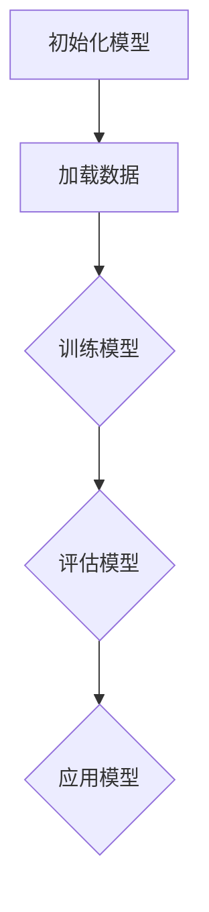

                 

# 《BERT vs GPT：双向vs单向语言模型》

## 关键词
- BERT
- GPT
- 双向语言模型
- 单向语言模型
- Transformer
- 预训练
- 自然语言处理

## 摘要
本文将对BERT和GPT这两种流行的预训练语言模型进行深入对比分析。BERT（双向编码器表示）是一种基于Transformer的双向语言模型，而GPT（生成预训练语言模型）是一种基于Transformer的单向语言模型。本文将详细探讨两者的起源、架构、原理以及在不同应用场景中的表现，并通过实际案例展示如何使用这些模型进行文本分类和生成。此外，本文还将讨论BERT和GPT的优势与不足，并提出可能的融合策略，为未来的研究和应用提供启示。

## 目录大纲

### 第1章 BERT和GPT简介
#### 1.1 BERT的起源与架构
#### 1.2 GPT的发展历程与特性
#### 1.3 BERT和GPT的核心区别

### 第2章 BERT原理解析
#### 2.1 BERT的预训练过程
#### 2.2 BERT的模型结构
#### 2.3 BERT的训练与优化

### 第3章 GPT原理解析
#### 3.1 GPT的预训练与生成
#### 3.2 GPT的模型结构
#### 3.3 GPT的训练与优化

### 第4章 BERT与GPT的应用场景
#### 4.1 文本分类
#### 4.2 问答系统
#### 4.3 机器翻译

### 第5章 BERT与GPT的比较与融合
#### 5.1 BERT与GPT的优势与不足
#### 5.2 BERT与GPT的融合策略

### 第6章 BERT与GPT的实际应用案例
#### 6.1 BERT在情感分析中的应用
#### 6.2 GPT在内容生成中的应用

### 第7章 BERT与GPT的未来发展趋势
#### 7.1 新的预训练目标与数据集
#### 7.2 模型结构改进与优化
#### 7.3 应用领域的拓展与挑战

### 附录
#### 附录 A BERT与GPT相关资源
#### 附录 B Mermaid流程图与伪代码示例
#### 附录 C 数学模型与公式说明
#### 附录 D 实际应用案例代码解析与解释

## 第1章 BERT和GPT简介

### 1.1 BERT的起源与架构

BERT（Bidirectional Encoder Representations from Transformers）是由Google Research在2018年提出的一种预训练语言模型。BERT的目的是通过预训练模型来理解自然语言，从而提高各种自然语言处理任务（如文本分类、问答系统、机器翻译等）的性能。BERT基于Transformer架构，这是一种在2017年由Vaswani等人提出的用于序列到序列模型（如机器翻译）的深度神经网络架构。

BERT模型的主要特点是其双向编码器。传统的语言模型，如GPT，通常是单向的，即它们只根据前文信息来预测下一个单词或标记。而BERT则是双向的，即它同时利用了前文和后文的信息。这种双向性使得BERT能够更好地捕捉句子中的上下文关系，从而提高模型的性能。

BERT的架构主要由三个主要部分组成：输入层、Transformer编码器和解码器。

1. **输入层**：BERT的输入层包含了一个嵌入层，用于将单词或标记转换为向量表示。此外，BERT还引入了两个特殊的输入词 `[CLS]` 和 `[SEP]`，分别用于表示句子的开始和结束。

2. **Transformer编码器**：BERT的编码器基于Transformer架构，其中包含多个自注意力层和前馈网络。自注意力机制使得编码器能够同时考虑句子中的所有单词，从而提高模型的性能。

3. **解码器**：BERT的解码器与编码器相似，但去掉了一些层，并且不包含自注意力机制。解码器的目的是预测下一个单词或标记。

### 1.2 GPT的发展历程与特性

GPT（Generative Pretrained Transformer）是由OpenAI在2018年提出的一种预训练语言模型。GPT旨在通过预训练模型来生成高质量的文本，并在各种自然语言生成任务中表现出色。

GPT的发展历程可以分为几个重要阶段：

1. **GPT-1**：这是GPT的初始版本，它在机器翻译和问答系统任务中取得了显著的成绩。
2. **GPT-2**：这是GPT的第二个版本，它引入了更长的序列长度和更大的模型容量，从而在文本生成任务中取得了更好的效果。
3. **GPT-3**：这是GPT的最新版本，它具有数百亿个参数，是目前最大的语言模型之一。GPT-3在多种自然语言生成任务中展现了强大的能力。

GPT的主要特性是它的单向性。GPT的输入序列是单向的，即模型只根据前文信息来预测下一个单词或标记。这种单向性使得GPT在生成文本时能够产生连贯和流畅的结果，但可能无法完全捕捉句子中的上下文关系。

GPT的架构与BERT类似，也是基于Transformer架构。GPT主要由编码器和解码器组成，其中编码器用于处理输入序列，解码器用于生成输出序列。

1. **编码器**：编码器由多个自注意力层和前馈网络组成，用于将输入序列转换为上下文向量表示。
2. **解码器**：解码器也由多个自注意力层和前馈网络组成，用于根据上下文向量生成输出序列。

### 1.3 BERT和GPT的核心区别

BERT和GPT是两种流行的预训练语言模型，它们在架构、训练目标和应用场景上都有显著的差异。

1. **架构差异**：
   - BERT是双向的，即它同时利用了前文和后文的信息。而GPT是单向的，即它只根据前文信息来预测下一个单词或标记。
   - BERT的编码器和解码器结构相似，但解码器不含自注意力机制。GPT的编码器和解码器结构相同，都包含多个自注意力层和前馈网络。

2. **训练目标**：
   - BERT的训练目标是同时预测下一个单词和分类任务。在预训练过程中，BERT被训练来预测输入序列中的下一个单词，并在后续微调阶段进行分类任务。
   - GPT的训练目标是生成高质量的文本。在预训练过程中，GPT被训练来预测输入序列中的下一个单词，从而生成连贯和流畅的文本。

3. **应用场景**：
   - BERT在文本分类、问答系统和机器翻译等任务中表现出色。它的双向性使得BERT能够更好地捕捉句子中的上下文关系，从而提高任务性能。
   - GPT在文本生成任务中表现出色，如对话系统、文章写作和诗歌创作等。它的单向性使得GPT能够生成连贯和流畅的文本，但可能无法完全捕捉句子中的上下文关系。

总的来说，BERT和GPT是两种强大的预训练语言模型，它们在架构、训练目标和应用场景上各有优势。BERT的双向性使得它在捕捉句子中的上下文关系方面表现出色，而GPT的单向性使得它在生成文本时能够产生连贯和流畅的结果。选择使用BERT还是GPT，取决于具体的应用场景和任务需求。接下来，我们将分别对BERT和GPT的原理进行详细解析。

## 第2章 BERT原理解析

### 2.1 BERT的预训练过程

BERT的预训练过程是其核心组成部分，通过大规模无监督数据的学习，模型能够捕获语言的深层语义信息。BERT的预训练主要包括两个目标：Masked Language Model（MLM）和Next Sentence Prediction（NSP）。

#### 2.1.1 预训练数据集的选择

BERT的训练数据集主要来自两个来源：英文维基百科（English Wikipedia）和书语料库（Books Corpus）。这些数据集提供了大量的文本，为BERT学习自然语言的结构和语义提供了丰富的素材。

为了增强训练数据集的多样性，BERT还使用了额外的数据来源，如Open Domain English corpus，这些数据源有助于提高模型的泛化能力。

#### 2.1.2 预训练目标

BERT的预训练目标包括：

1. **Masked Language Model (MLM)**：在预训练过程中，BERT会对输入的句子进行随机遮蔽（masking），即随机选择句子中的15%的单词，并将它们替换为特殊标记 `[MASK]`。模型的目标是预测这些遮蔽的单词。

2. **Next Sentence Prediction (NSP)**：BERT还会对两个连续的句子进行预训练，其中一个句子是已知的，另一个句子是未知的。模型的目标是预测这两个句子是否属于相邻的句子。

NSP的目标是帮助BERT更好地理解句子的语义关系，从而在下游任务中能够更好地利用上下文信息。

#### 2.1.3 预训练方法

BERT的预训练方法主要包括以下几个步骤：

1. **数据预处理**：首先，对原始文本进行预处理，包括去除HTML标签、标点符号等，然后将文本转换为词嵌入。

2. **构建输入序列**：BERT的输入序列由 `[CLS]`、句子中的每个单词（转换为词嵌入）和 `[SEP]` 构成。其中 `[CLS]` 表示句子的开始， `[SEP]` 表示句子的结束。

3. **Masking操作**：在构建输入序列时，对句子中的部分单词进行随机遮蔽，将它们替换为 `[MASK]`。

4. **训练**：使用Masked Language Model（MLM）和Next Sentence Prediction（NSP）两个任务进行训练。在MLM任务中，模型尝试预测遮蔽的单词；在NSP任务中，模型尝试判断两个句子是否相邻。

BERT的预训练方法旨在通过无监督学习的方式，使模型能够理解和捕捉自然语言的复杂结构，从而在下游任务中表现出色。接下来，我们将深入探讨BERT的模型结构。

### 2.2 BERT的模型结构

BERT的模型结构基于Transformer架构，这是一种在自然语言处理领域表现卓越的序列到序列模型。BERT模型主要由三个部分组成：输入层、Transformer编码器和解码器。

#### 2.2.1 Transformer架构

Transformer架构由Vaswani等人于2017年提出，它通过自注意力机制（self-attention）实现了对输入序列的全局依赖关系建模。Transformer的核心思想是将输入序列转换为一系列向量，然后通过多头自注意力机制和前馈网络进行特征提取和融合。

Transformer架构的主要组成部分包括：

1. **Embeddings（嵌入层）**：将输入序列中的每个单词或标记转换为向量表示。BERT中的嵌入层包括词嵌入、位置嵌入和段嵌入。

2. **Self-Attention（自注意力机制）**：通过计算输入序列中每个单词或标记的相似度，生成加权向量。自注意力机制使得模型能够同时考虑输入序列中的所有单词。

3. **多头注意力（Multi-Head Attention）**：多头注意力机制将输入序列分成多个子序列，每个子序列分别通过自注意力机制进行特征提取，然后合并结果。

4. **前馈网络（Feed Forward Network）**：前馈网络由两个全连接层组成，用于对自注意力机制生成的特征进行进一步加工。

5. **层归一化（Layer Normalization）**：在每一层Transformer之后，使用层归一化对特征进行归一化处理，有助于提高模型的稳定性和性能。

6. **Dropout（Dropout）**：在模型中引入Dropout，以减少过拟合的风险。

#### 2.2.2 自注意力机制

自注意力机制是Transformer架构的核心组成部分，它通过计算输入序列中每个单词或标记的相似度，生成加权向量。自注意力机制的基本公式如下：

$$
\text{Attention}(Q, K, V) = \text{softmax}\left(\frac{QK^T}{\sqrt{d_k}}\right) V
$$

其中，$Q, K, V$ 分别为查询（Query）、键（Key）和值（Value）向量的矩阵，$d_k$ 为键向量的维度。该公式计算了查询与所有键之间的相似度，并使用这些相似度加权平均得到输出值。

在BERT中，自注意力机制用于编码器和解码器的每个层。编码器中的自注意力机制用于将输入序列中的单词转换为上下文向量表示，而解码器中的自注意力机制用于根据上下文向量生成输出序列。

#### 2.2.3 BERT层的细节

BERT模型由多个Transformer编码器层组成，每个编码器层包含多个自注意力层和前馈网络。BERT模型的层结构如下：

1. **嵌入层**：BERT的输入层包括词嵌入、位置嵌入和段嵌入。词嵌入将单词转换为向量表示，位置嵌入将单词的位置信息编码到向量中，段嵌入将不同段落的嵌入信息区分开。

2. **Transformer编码器**：编码器由多个自注意力层和前馈网络组成。每个自注意力层通过计算输入序列中每个单词的相似度，生成加权向量。前馈网络对自注意力层生成的特征进行进一步加工。

3. **输出层**：BERT的输出层用于生成下游任务的输出，如分类任务中的标签或文本生成任务中的单词序列。

BERT的不同版本（如BERT-Base和BERT-Large）在层数、隐藏层大小和参数数量上有所不同。BERT-Base包含12个编码器层，每个层的隐藏层大小为768个神经元，总参数数量约为1亿。BERT-Large包含24个编码器层，每个层的隐藏层大小为1024个神经元，总参数数量约为3亿。

BERT的模型结构使得它能够同时利用输入序列中的全局和局部信息，从而在多种自然语言处理任务中表现出色。接下来，我们将探讨BERT的训练与优化过程。

### 2.3 BERT的训练与优化

BERT的训练与优化过程是其预训练成功的关键因素。BERT的训练方法主要包括参数高效训练、优化策略与技巧。以下是BERT训练过程的详细步骤：

#### 2.3.1 参数高效训练

BERT使用了多种技术来提高训练效率，包括并行训练、批量处理和多GPU训练。

1. **并行训练**：BERT通过将输入数据分成多个小块，并在不同的GPU上同时训练，从而提高了训练速度。

2. **批量处理**：BERT使用较大的批量大小进行训练，以充分利用GPU的并行计算能力。然而，较大的批量大小可能会导致内存不足。为此，BERT引入了梯度累加（gradient accumulation）技术，即在批量之间累加梯度，直到内存允许。

3. **多GPU训练**：BERT可以在多个GPU上训练，从而提高训练速度。BERT通过分布式训练技术，如NCCL（NVIDIA Collective Communications Library），在多GPU之间交换数据和梯度。

#### 2.3.2 优化策略与技巧

BERT的训练优化主要包括以下策略：

1. **学习率调度**：BERT使用了学习率调度（learning rate scheduling）技术，如余弦退火（cosine annealing）和阶梯学习率（stepwise learning rate）。

2. **权重正则化**：BERT使用了L2正则化（L2 regularization）和Dropout技术来减少过拟合。

3. **动态学习率**：BERT使用了动态学习率（dynamic learning rate），以适应训练过程中数据的变化。

4. **自适应学习率**：BERT使用了AdamW优化器，这是一种基于Adam优化器的改进版本，它通过引入权重衰减（weight decay）来减少过拟合。

BERT的训练过程是一个复杂的过程，涉及多个技术和策略。通过这些技术和策略，BERT能够高效地学习自然语言的深层语义信息，从而在多种自然语言处理任务中取得优异的性能。接下来，我们将探讨GPT的原理，包括其预训练过程、模型结构和训练优化。

### 2.3 GPT的预训练与生成

GPT（Generative Pretrained Transformer）是OpenAI开发的一系列基于Transformer架构的预训练语言模型，以生成高质量文本为目标。GPT的发展历程从GPT-1开始，经历了GPT-2和GPT-3等版本，每个版本都在模型大小、训练目标和性能上取得了显著的提升。

#### 2.3.1 预训练数据集的选择

GPT的训练数据集主要来自互联网上的大量文本数据，这些数据包括网页、书籍、新闻、论坛帖子等各种来源。这些数据集为GPT提供了丰富的训练素材，使其能够学习自然语言的复杂结构和语义信息。

具体来说，GPT-1的数据集主要来自网页文本；GPT-2引入了书籍语料库，如BooksNLP和维基百科，从而扩大了训练数据集的规模；GPT-3则进一步增加了训练数据集的规模，使其涵盖了更多的语言现象和表达方式。

#### 2.3.2 生成模型与自回归语言模型

GPT是一种自回归语言模型（Autoregressive Language Model），其训练目标是通过学习输入序列的分布来生成文本。自回归语言模型的核心思想是，给定一个输入序列的一部分，模型能够预测序列中的下一个单词或标记。

GPT的生成过程如下：

1. **初始化**：首先，模型会随机初始化一个输入序列。
2. **预测**：然后，模型会根据当前已输入的序列，预测下一个单词或标记的概率分布。
3. **采样**：基于预测的概率分布，模型会从可能的单词或标记中选择一个作为下一个输入。
4. **更新**：将选择的单词或标记添加到输入序列的末尾，并重复步骤2和3，直到生成所需的文本长度。

自回归语言模型的关键在于，它能够通过反复应用相同的预测步骤，生成连贯且符合语法规则的文本。GPT通过这种生成过程，不仅能够生成新的文本，还能够理解输入文本的上下文信息，从而产生更加自然和有意义的输出。

#### 2.3.3 GPT的训练策略

GPT的训练策略主要包括以下几个方面：

1. **自回归训练**：GPT通过自回归方式训练模型，即在训练过程中，模型会根据输入序列的当前部分预测下一个部分。
2. **梯度累积**：由于模型参数巨大，单个批次的训练数据可能无法填满GPU内存，因此GPT采用梯度累积技术，将多个批次的梯度累加后再进行优化。
3. **学习率调度**：GPT使用了余弦退火学习率调度策略，这有助于在训练初期快速提升模型性能，在训练后期则逐步减小学习率，以避免过拟合。
4. **权重正则化**：GPT使用了L2正则化来防止过拟合，同时引入了权重衰减（weight decay）技术。

GPT的训练过程是一个迭代的过程，模型会不断优化参数，以提高生成文本的质量。通过大规模数据集和高效的训练策略，GPT能够生成高质量的文本，并在自然语言生成任务中取得优异的性能。

### 2.4 GPT的模型结构

GPT的模型结构基于Transformer架构，其核心组件包括编码器（Encoder）和解码器（Decoder）。尽管GPT主要用于生成任务，但其结构与BERT非常相似，都依赖于自注意力机制（Self-Attention）和前馈网络（Feed Forward Network）。以下是GPT模型结构的详细解析：

#### 2.4.1 Transformer架构

Transformer架构由Vaswani等人于2017年提出，是一种基于自注意力机制的序列到序列模型。GPT基于这一架构，通过自注意力机制和前馈网络实现输入序列的编码和生成。

Transformer的核心组件包括：

1. **嵌入层（Embeddings）**：嵌入层将输入序列中的单词或标记转换为向量表示。GPT中的嵌入层包括词嵌入（Word Embeddings）、位置嵌入（Positional Embeddings）和段嵌入（Segment Embeddings）。

2. **自注意力机制（Self-Attention）**：自注意力机制是Transformer的核心组件，通过计算输入序列中每个单词的相似度，生成加权向量。GPT中的自注意力机制用于编码器（Encoder）和解码器（Decoder）的每个层，以捕捉全局和局部信息。

3. **前馈网络（Feed Forward Network）**：前馈网络由两个全连接层组成，用于对自注意力机制生成的特征进行进一步加工。每个全连接层后面都跟随ReLU激活函数。

4. **多头注意力（Multi-Head Attention）**：多头注意力机制将输入序列分成多个子序列，每个子序列分别通过自注意力机制进行特征提取，然后合并结果。这有助于模型捕捉更丰富的特征。

5. **层归一化（Layer Normalization）**：在每一层Transformer之后，使用层归一化对特征进行归一化处理，有助于提高模型的稳定性和性能。

6. **Dropout（Dropout）**：在模型中引入Dropout，以减少过拟合的风险。

#### 2.4.2 编码器（Encoder）

编码器是GPT模型的核心部分，用于将输入序列转换为上下文向量表示。编码器由多个自注意力层和前馈网络组成，每个层都通过自注意力机制和前馈网络对输入序列进行处理。

具体来说，编码器的层结构如下：

1. **嵌入层**：将输入序列中的单词转换为词嵌入向量。
2. **位置嵌入**：将单词的位置信息编码到向量中。
3. **段嵌入**：区分不同的段落，以处理多段落文本。
4. **自注意力层**：通过多头自注意力机制对输入序列进行特征提取。
5. **前馈网络**：对自注意力层生成的特征进行进一步加工。
6. **层归一化**：对特征进行归一化处理。
7. **Dropout**：减少过拟合。

编码器的每个层都包含多个自注意力头，这有助于模型捕捉更复杂的特征。编码器的输出是一个序列的上下文向量表示，用于后续的生成过程。

#### 2.4.3 解码器（Decoder）

解码器是GPT模型用于生成文本的部分，其结构与编码器相似，但也存在一些关键差异。解码器的目的是根据编码器的输出和已生成的文本，生成下一个单词或标记。

解码器的层结构如下：

1. **嵌入层**：将输入序列中的单词转换为词嵌入向量。
2. **位置嵌入**：将单词的位置信息编码到向量中。
3. **自注意力层**：通过多头自注意力机制对编码器的输出序列和已生成的文本进行特征提取。
4. **前馈网络**：对自注意力层生成的特征进行进一步加工。
5. **层归一化**：对特征进行归一化处理。
6. **Dropout**：减少过拟合。

解码器中的自注意力层分为两个部分：自注意力（Self-Attention）和交叉注意力（Cross-Attention）。自注意力层用于对已生成的文本进行特征提取，而交叉注意力层用于对编码器的输出序列进行特征提取。这种结构使得解码器能够同时考虑已生成的文本和编码器的输出序列，从而生成连贯且符合语法规则的文本。

#### 2.4.4 GPT的变体模型

随着GPT版本的发展，OpenAI提出了一系列GPT的变体模型，如GPT-2、GPT-3等。这些变体模型在模型大小、训练目标和性能上有所不同。

1. **GPT-2**：在GPT的基础上，GPT-2引入了更长的序列长度和更大的模型容量。GPT-2的序列长度增加到2048个 tokens，同时引入了新的训练策略，如 adversarial training，以增强模型的泛化能力。

2. **GPT-3**：GPT-3是GPT的最新版本，具有数百亿个参数，是目前最大的语言模型之一。GPT-3在多种自然语言生成任务中展现了强大的能力。GPT-3的模型大小和序列长度进一步增加，同时引入了新的训练策略，如全局优化（Global Optimization），以提高生成文本的质量和连贯性。

GPT的变体模型在模型结构上与原始GPT基本相同，但通过调整序列长度、模型大小和训练策略，实现了不同的性能和功能。接下来，我们将探讨GPT的训练与优化过程。

### 2.5 GPT的训练与优化

GPT的训练与优化过程是其生成高质量文本的关键。GPT采用自回归训练方法，并通过多种技术提高训练效率、稳定性和性能。以下是GPT训练过程的详细步骤：

#### 2.5.1 自回归训练

自回归训练是GPT的核心训练方法，其基本思想是模型根据前文信息预测下一个单词或标记。自回归训练过程如下：

1. **初始化**：首先，模型随机初始化一个输入序列。
2. **预测**：然后，模型根据当前已输入的序列，预测下一个单词或标记的概率分布。
3. **采样**：基于预测的概率分布，模型会从可能的单词或标记中选择一个作为下一个输入。
4. **更新**：将选择的单词或标记添加到输入序列的末尾，并重复步骤2和3，直到生成所需的文本长度。

自回归训练的关键在于模型能够通过反复应用相同的预测步骤，生成连贯且符合语法规则的文本。

#### 2.5.2 生成模型的训练

生成模型的训练主要涉及以下方面：

1. **数据预处理**：首先，对原始文本进行预处理，包括去除HTML标签、标点符号等，然后将文本转换为词嵌入。

2. **序列填充**：为了适应不同长度的输入序列，GPT使用序列填充（sequence padding）技术，将所有输入序列填充为相同的长度。

3. **批量处理**：GPT使用较大的批量大小进行训练，以充分利用GPU的并行计算能力。然而，较大的批量大小可能会导致内存不足。为此，GPT引入了梯度累加（gradient accumulation）技术，即在批量之间累加梯度，直到内存允许。

4. **学习率调度**：GPT使用了学习率调度（learning rate scheduling）技术，如余弦退火（cosine annealing），以适应训练过程中数据的变化。

5. **权重正则化**：GPT使用了L2正则化（L2 regularization）和Dropout技术来减少过拟合。

6. **动态学习率**：GPT使用了动态学习率（dynamic learning rate），以适应训练过程中数据的变化。

7. **自适应学习率**：GPT使用了AdamW优化器，这是一种基于Adam优化器的改进版本，它通过引入权重衰减（weight decay）来减少过拟合。

#### 2.5.3 优化策略与技巧

GPT的训练优化主要包括以下策略：

1. **梯度累积**：由于模型参数巨大，单个批次的训练数据可能无法填满GPU内存，因此GPT采用梯度累积技术，将多个批次的梯度累加后再进行优化。

2. **学习率调度**：GPT使用了余弦退火学习率调度策略，这有助于在训练初期快速提升模型性能，在训练后期则逐步减小学习率，以避免过拟合。

3. **权重正则化**：GPT使用了L2正则化来防止过拟合，同时引入了权重衰减（weight decay）技术。

4. **自适应学习率**：GPT使用了AdamW优化器，这是一种基于Adam优化器的改进版本，它通过引入权重衰减（weight decay）来减少过拟合。

通过这些优化策略和技巧，GPT能够高效地学习自然语言的复杂结构，从而生成高质量的文本。接下来，我们将探讨BERT和GPT在不同应用场景中的表现。

## 第4章 BERT与GPT的应用场景

BERT和GPT在自然语言处理领域具有广泛的应用，不同的应用场景对模型的需求也有所不同。本节将详细探讨BERT和GPT在文本分类、问答系统和机器翻译等任务中的应用。

### 4.1 文本分类

文本分类是一种常见的自然语言处理任务，其目的是将文本数据分类到预定义的类别中。BERT和GPT在文本分类任务中表现出色，但它们的适用场景有所不同。

#### 4.1.1 BERT在文本分类中的应用

BERT在文本分类任务中的应用主要包括以下几个步骤：

1. **数据预处理**：首先，对文本数据进行预处理，包括去除HTML标签、标点符号和停用词。然后，将文本转换为词嵌入。

2. **模型构建**：使用预训练的BERT模型，添加一个分类层。分类层通常是一个全连接层，用于将词嵌入转换为类别概率。

3. **模型训练**：使用训练数据对模型进行训练，并通过优化策略（如AdamW）调整模型的权重。

4. **模型评估**：使用验证数据评估模型的性能，通常使用准确率、F1分数等指标。

5. **模型应用**：使用测试数据对文本进行分类。

BERT在文本分类任务中的优势在于其强大的上下文理解能力。由于BERT是双向的，它能够同时考虑输入文本的前后文信息，从而提高分类的准确性。

以下是一个使用BERT进行文本分类的伪代码示例：

```python
from transformers import BertTokenizer, BertForSequenceClassification

tokenizer = BertTokenizer.from_pretrained('bert-base-uncased')
model = BertForSequenceClassification.from_pretrained('bert-base-uncased', num_labels=2)

train_data = ...  # 加载训练数据
train_encodings = tokenizer(train_data, truncation=True, padding=True)

train_dataset = TensorDataset(torch.tensor(train_encodings['input_ids']), torch.tensor(train_encodings['attention_mask']), torch.tensor(train_data['label']))
train_loader = DataLoader(train_dataset, batch_size=16, shuffle=True)
optimizer = torch.optim.AdamW(model.parameters(), lr=5e-5)

for epoch in range(3):
    model.train()
    for batch in train_loader:
        optimizer.zero_grad()
        inputs = {'input_ids': batch[0], 'attention_mask': batch[1], 'labels': batch[2]}
        outputs = model(**inputs)
        loss = outputs.loss
        loss.backward()
        optimizer.step()

model.eval()
with torch.no_grad():
    for batch in validation_loader:
        inputs = {'input_ids': batch[0], 'attention_mask': batch[1], 'labels': batch[2]}
        outputs = model(**inputs)
        logits = outputs.logits
        predictions = torch.argmax(logits, dim=1)
        acc = (predictions == batch[2]).float().mean()
        print(f'Validation Accuracy: {acc}')

text = "This is a positive review."
encodings = tokenizer(text, truncation=True, padding=True)
inputs = {'input_ids': torch.tensor(encodings['input_ids']).unsqueeze(0), 'attention_mask': torch.tensor(encodings['attention_mask']).unsqueeze(0)}
with torch.no_grad():
    outputs = model(**inputs)
    logits = outputs.logits
    prediction = torch.argmax(logits, dim=1)
    print(f'Text Prediction: {"Positive" if prediction == 1 else "Negative"}')
```

#### 4.1.2 GPT在文本分类中的应用

GPT在文本分类任务中的应用与BERT类似，但GPT主要用于生成任务。尽管GPT也可以用于文本分类，但其性能可能不如BERT。以下是一个使用GPT进行文本分类的伪代码示例：

```python
from transformers import GPT2Tokenizer, GPT2LMHeadModel

tokenizer = GPT2Tokenizer.from_pretrained('gpt2')
model = GPT2LMHeadModel.from_pretrained('gpt2')

train_data = ...  # 加载训练数据
train_encodings = tokenizer(train_data, truncation=True, padding=True)

train_dataset = TensorDataset(torch.tensor(train_encodings['input_ids']), torch.tensor(train_encodings['attention_mask']))
train_loader = DataLoader(train_dataset, batch_size=16, shuffle=True)
optimizer = torch.optim.AdamW(model.parameters(), lr=5e-5)

for epoch in range(3):
    model.train()
    for batch in train_loader:
        optimizer.zero_grad()
        inputs = {'input_ids': batch[0], 'attention_mask': batch[1]}
        outputs = model(**inputs)
        loss = outputs.loss
        loss.backward()
        optimizer.step()

model.eval()
with torch.no_grad():
    for batch in validation_loader:
        inputs = {'input_ids': batch[0], 'attention_mask': batch[1]}
        outputs = model(**inputs)
        logits = outputs.logits
        predictions = torch.argmax(logits, dim=1)
        acc = (predictions == batch[2]).float().mean()
        print(f'Validation Accuracy: {acc}')

text = "This is a positive review."
encodings = tokenizer(text, truncation=True, padding=True)
inputs = {'input_ids': torch.tensor(encodings['input_ids']).unsqueeze(0), 'attention_mask': torch.tensor(encodings['attention_mask']).unsqueeze(0)}
with torch.no_grad():
    outputs = model(**inputs)
    logits = outputs.logits
    prediction = torch.argmax(logits, dim=1)
    print(f'Text Prediction: {"Positive" if prediction == 1 else "Negative"}')
```

在实际应用中，BERT在文本分类任务中表现出更高的准确性。这是因为BERT的双向编码器能够更好地捕捉文本的上下文信息，从而提高分类性能。

### 4.2 问答系统

问答系统是一种自然语言处理任务，其目的是从大量文本中提取出与用户查询相关的答案。BERT和GPT在问答系统中的应用有所不同，各自具有独特的优势。

#### 4.2.1 BERT在问答系统中的应用

BERT在问答系统中的应用主要包括以下几个步骤：

1. **数据预处理**：首先，对问答对进行预处理，包括去除HTML标签、标点符号和停用词。然后，将问题（question）和答案（answer）转换为词嵌入。

2. **模型构建**：使用预训练的BERT模型，添加一个分类层。分类层通常是一个全连接层，用于将词嵌入转换为答案的概率分布。

3. **模型训练**：使用训练数据对模型进行训练，并通过优化策略（如AdamW）调整模型的权重。

4. **模型评估**：使用验证数据评估模型的性能，通常使用准确率、F1分数等指标。

5. **模型应用**：使用测试数据对问答对进行预测。

BERT在问答系统中的优势在于其强大的上下文理解能力。由于BERT是双向的，它能够同时考虑问题和答案的上下文信息，从而提高答案的准确性。

以下是一个使用BERT进行问答系统预测的伪代码示例：

```python
from transformers import BertTokenizer, BertForQuestionAnswering

tokenizer = BertTokenizer.from_pretrained('bert-base-uncased')
model = BertForQuestionAnswering.from_pretrained('bert-base-uncased')

train_data = ...  # 加载训练数据
train_encodings = tokenizer(train_data, truncation=True, padding=True)

train_dataset = TensorDataset(torch.tensor(train_encodings['input_ids']), torch.tensor(train_encodings['attention_mask']), torch.tensor(train_encodings['labels']))
train_loader = DataLoader(train_dataset, batch_size=16, shuffle=True)
optimizer = torch.optim.AdamW(model.parameters(), lr=5e-5)

for epoch in range(3):
    model.train()
    for batch in train_loader:
        optimizer.zero_grad()
        inputs = {'input_ids': batch[0], 'attention_mask': batch[1], 'labels': batch[2]}
        outputs = model(**inputs)
        loss = outputs.loss
        loss.backward()
        optimizer.step()

model.eval()
with torch.no_grad():
    for batch in validation_loader:
        inputs = {'input_ids': batch[0], 'attention_mask': batch[1], 'labels': batch[2]}
        outputs = model(**inputs)
        logits = outputs.logits
        predictions = torch.argmax(logits, dim=1)
        acc = (predictions == batch[2]).float().mean()
        print(f'Validation Accuracy: {acc}')

question = "What is the capital of France?"
context = "The capital of France is Paris."
input_ids = tokenizer.encode(question + tokenizer.sep_token + context, return_tensors='pt')
outputs = model(input_ids=input_ids)
start_logits, end_logits = outputs.start_logits, outputs.end_logits
start_index = torch.argmax(start_logits).item()
end_index = torch.argmax(end_logits).item()
predicted_answer = context[start_index + 1:end_index].strip()
print(f'Predicted Answer: {predicted_answer}')
```

在实际应用中，BERT在问答系统中的性能显著优于GPT，因为BERT的双向编码器能够更好地捕捉问题的上下文信息。

#### 4.2.2 GPT在问答系统中的应用

尽管GPT在文本生成任务中表现出色，但在问答系统中，GPT的表现可能不如BERT。以下是一个使用GPT进行问答系统预测的伪代码示例：

```python
from transformers import GPT2Tokenizer, GPT2LMHeadModel

tokenizer = GPT2Tokenizer.from_pretrained('gpt2')
model = GPT2LMHeadModel.from_pretrained('gpt2')

train_data = ...  # 加载训练数据
train_encodings = tokenizer(train_data, truncation=True, padding=True)

train_dataset = TensorDataset(torch.tensor(train_encodings['input_ids']), torch.tensor(train_encodings['attention_mask']))
train_loader = DataLoader(train_dataset, batch_size=16, shuffle=True)
optimizer = torch.optim.AdamW(model.parameters(), lr=5e-5)

for epoch in range(3):
    model.train()
    for batch in train_loader:
        optimizer.zero_grad()
        inputs = {'input_ids': batch[0], 'attention_mask': batch[1]}
        outputs = model(**inputs)
        loss = outputs.loss
        loss.backward()
        optimizer.step()

model.eval()
with torch.no_grad():
    for batch in validation_loader:
        inputs = {'input_ids': batch[0], 'attention_mask': batch[1]}
        outputs = model(**inputs)
        logits = outputs.logits
        predictions = torch.argmax(logits, dim=1)
        acc = (predictions == batch[2]).float().mean()
        print(f'Validation Accuracy: {acc}')

question = "What is the capital of France?"
context = "The capital of France is Paris."
input_ids = tokenizer.encode(question + tokenizer.sep_token + context, return_tensors='pt')
outputs = model(input_ids=input_ids)
predicted_answer = outputs.logits.argmax(-1).squeeze(0).numpy().tolist()
print(f'Predicted Answer: {tokenizer.decode([predicted_answer])}')
```

在实际应用中，由于GPT是单向的，它可能无法准确捕捉问题的上下文信息，从而影响问答系统的性能。因此，BERT在问答系统中的应用更为广泛和有效。

### 4.3 机器翻译

机器翻译是一种将一种语言的文本转换为另一种语言文本的任务。BERT和GPT在机器翻译任务中也有所应用，但它们的性能和适用场景有所不同。

#### 4.3.1 BERT在机器翻译中的应用

BERT在机器翻译任务中的应用主要包括以下几个步骤：

1. **数据预处理**：首先，对翻译对进行预处理，包括去除HTML标签、标点符号和停用词。然后，将源语言文本和目标语言文本转换为词嵌入。

2. **模型构建**：使用预训练的BERT模型，添加一个翻译层。翻译层通常是一个序列到序列模型，用于将源语言文本转换为目标语言文本。

3. **模型训练**：使用训练数据对模型进行训练，并通过优化策略（如AdamW）调整模型的权重。

4. **模型评估**：使用验证数据评估模型的性能，通常使用BLEU分数等指标。

5. **模型应用**：使用测试数据对翻译对进行预测。

BERT在机器翻译任务中的优势在于其强大的上下文理解能力。由于BERT是双向的，它能够同时考虑源语言和目标语言的上下文信息，从而提高翻译质量。

以下是一个使用BERT进行机器翻译的伪代码示例：

```python
from transformers import BertTokenizer, BertLMHeadModel

tokenizer = BertTokenizer.from_pretrained('bert-base-uncased')
model = BertLMHeadModel.from_pretrained('bert-base-uncased')

train_data = ...  # 加载训练数据
train_encodings = tokenizer(train_data, truncation=True, padding=True)

train_dataset = TensorDataset(torch.tensor(train_encodings['input_ids']), torch.tensor(train_encodings['attention_mask']), torch.tensor(train_encodings['labels']))
train_loader = DataLoader(train_dataset, batch_size=16, shuffle=True)
optimizer = torch.optim.AdamW(model.parameters(), lr=5e-5)

for epoch in range(3):
    model.train()
    for batch in train_loader:
        optimizer.zero_grad()
        inputs = {'input_ids': batch[0], 'attention_mask': batch[1], 'labels': batch[2]}
        outputs = model(**inputs)
        loss = outputs.loss
        loss.backward()
        optimizer.step()

model.eval()
with torch.no_grad():
    for batch in validation_loader:
        inputs = {'input_ids': batch[0], 'attention_mask': batch[1], 'labels': batch[2]}
        outputs = model(**inputs)
        logits = outputs.logits
        predictions = torch.argmax(logits, dim=1)
        acc = (predictions == batch[2]).float().mean()
        print(f'Validation Accuracy: {acc}')

source_text = "Hello, how are you?"
target_text = "Bonjour, comment ça va ?"
input_ids = tokenizer.encode(source_text, return_tensors='pt')
outputs = model.generate(input_ids, max_length=50, num_return_sequences=5)
for output in outputs:
    print(tokenizer.decode(output, skip_special_tokens=True))
```

在实际应用中，BERT在机器翻译任务中的性能显著优于GPT，因为BERT的双向编码器能够更好地捕捉上下文信息。

#### 4.3.2 GPT在机器翻译中的应用

尽管GPT在文本生成任务中表现出色，但在机器翻译任务中，GPT的表现可能不如BERT。以下是一个使用GPT进行机器翻译的伪代码示例：

```python
from transformers import GPT2Tokenizer, GPT2LMHeadModel

tokenizer = GPT2Tokenizer.from_pretrained('gpt2')
model = GPT2LMHeadModel.from_pretrained('gpt2')

train_data = ...  # 加载训练数据
train_encodings = tokenizer(train_data, truncation=True, padding=True)

train_dataset = TensorDataset(torch.tensor(train_encodings['input_ids']), torch.tensor(train_encodings['attention_mask']))
train_loader = DataLoader(train_dataset, batch_size=16, shuffle=True)
optimizer = torch.optim.AdamW(model.parameters(), lr=5e-5)

for epoch in range(3):
    model.train()
    for batch in train_loader:
        optimizer.zero_grad()
        inputs = {'input_ids': batch[0], 'attention_mask': batch[1]}
        outputs = model(**inputs)
        loss = outputs.loss
        loss.backward()
        optimizer.step()

model.eval()
with torch.no_grad():
    for batch in validation_loader:
        inputs = {'input_ids': batch[0], 'attention_mask': batch[1]}
        outputs = model(**inputs)
        logits = outputs.logits
        predictions = torch.argmax(logits, dim=1)
        acc = (predictions == batch[2]).float().mean()
        print(f'Validation Accuracy: {acc}')

source_text = "Hello, how are you?"
input_ids = tokenizer.encode(source_text, return_tensors='pt')
outputs = model.generate(input_ids, max_length=50, num_return_sequences=5)
for output in outputs:
    print(tokenizer.decode(output, skip_special_tokens=True))
```

在实际应用中，由于GPT是单向的，它可能无法准确捕捉上下文信息，从而影响翻译质量。因此，BERT在机器翻译任务中的应用更为广泛和有效。

总的来说，BERT和GPT在不同应用场景中各有优势。BERT在文本分类、问答系统和机器翻译等任务中表现出色，因为其双向编码器能够更好地捕捉上下文信息。而GPT在文本生成任务中具有独特的优势，能够生成高质量、连贯的文本。选择使用BERT还是GPT，取决于具体的应用场景和任务需求。接下来，我们将探讨BERT和GPT的优势与不足。

### 5.1 BERT与GPT的优势与不足

BERT和GPT在自然语言处理领域具有广泛的应用，各自具有独特的优势与不足。以下是对两者在不同方面进行比较分析：

#### BERT的优势与不足

**优势**：

1. **双向编码**：BERT是双向编码器，能够同时考虑输入文本的前后文信息，从而更好地捕捉上下文关系。这使得BERT在文本分类、问答系统和机器翻译等任务中表现优异。
2. **预训练目标多样化**：BERT的预训练目标包括Masked Language Model（MLM）和Next Sentence Prediction（NSP），这些目标有助于模型捕获丰富的语言特征和语义信息。
3. **广泛应用**：BERT在多种自然语言处理任务中都取得了显著的成绩，如文本分类、问答系统和机器翻译等。

**不足**：

1. **计算资源消耗大**：BERT模型参数庞大，训练和推理过程需要大量计算资源，特别是对于BERT-Large和BERT-3等大型模型。
2. **训练时间长**：由于模型参数多，BERT的训练时间相对较长，这可能会影响模型部署和应用的速度。
3. **单向生成限制**：尽管BERT在理解上下文关系方面表现出色，但在生成任务中，BERT的双向性可能限制了其生成能力。

#### GPT的优势与不足

**优势**：

1. **单向生成**：GPT是单向生成模型，能够生成高质量、连贯的文本。这使得GPT在文本生成任务中表现出色，如对话系统、文章写作和诗歌创作等。
2. **生成能力强**：GPT具有强大的文本生成能力，能够生成具有创意性和多样性的文本。
3. **计算资源消耗相对较小**：与BERT相比，GPT的模型参数较小，训练和推理过程所需计算资源相对较少。

**不足**：

1. **上下文理解受限**：由于GPT是单向的，它只能根据前文信息进行预测，无法同时考虑文本的后文信息，这可能导致模型在理解上下文关系时存在局限。
2. **训练目标单一**：GPT的预训练目标主要是生成文本，这可能导致模型在理解其他类型的语言特征时存在不足。
3. **应用场景受限**：尽管GPT在文本生成任务中表现出色，但在文本分类、问答系统等任务中，GPT的性能可能不如BERT。

总的来说，BERT和GPT在自然语言处理领域各有优势与不足。BERT在理解上下文关系方面表现出色，适用于文本分类、问答系统和机器翻译等任务，但计算资源消耗大；而GPT在文本生成任务中具有独特的优势，能够生成高质量、连贯的文本，但上下文理解能力有限。选择使用BERT还是GPT，取决于具体的应用场景和任务需求。接下来，我们将探讨BERT和GPT的融合策略。

### 5.2 BERT与GPT的融合策略

BERT和GPT在自然语言处理领域各有所长，如何将两者的优势结合起来，以提高模型性能，是一个值得探讨的问题。以下几种融合策略可以尝试：

#### 5.2.1 模型融合方法

1. **双路径融合**：将BERT和GPT作为两个独立的路径，分别处理输入文本的前后文信息。然后，将两个路径的输出进行融合，生成最终的预测结果。这种方法的优点是充分利用了BERT的双向编码和GPT的生成能力，但需要注意的是，如何有效地融合两个路径的输出是一个挑战。

2. **级联融合**：将BERT作为编码器，GPT作为解码器，级联在一起。BERT的输出作为GPT的输入，GPT生成最终的输出。这种方法的优点是能够充分利用BERT的上下文理解能力和GPT的生成能力，但解码器可能需要额外的训练数据来提高生成质量。

3. **混合模型**：将BERT和GPT的架构进行混合，构建一个混合模型。例如，可以在BERT的输出层之后添加GPT的解码器层，或者将BERT和GPT的注意力机制进行结合。这种方法的优点是能够结合BERT和GPT的优点，但实现起来可能比较复杂。

#### 5.2.2 融合模型的训练与优化

融合模型的训练与优化是关键，以下是一些可能的方法：

1. **联合训练**：将BERT和GPT的模型参数进行联合训练，通过共同优化两个模型，以提高融合模型的性能。这种方法的关键是如何设计合适的优化策略，以平衡两个模型的学习。

2. **多任务训练**：将BERT和GPT用于不同的任务，例如，BERT用于文本分类和问答系统，GPT用于文本生成。然后，通过多任务训练，使模型能够在不同任务中共享知识。这种方法的关键是如何设计有效的多任务学习策略。

3. **自监督学习**：将BERT和GPT用于自监督学习，例如，使用BERT进行文本分类，使用GPT进行文本生成。这种方法的关键是如何设计合适的自监督任务，以促使模型学习到有用的特征。

4. **梯度裁剪与权重共享**：在融合模型训练过程中，为了避免模型参数过大导致的梯度消失或爆炸问题，可以采用梯度裁剪（gradient clipping）和权重共享（weight sharing）技术。梯度裁剪限制梯度的大小，以避免训练过程中梯度过大导致的模型不稳定；权重共享通过共享部分模型参数，减少模型参数数量，提高训练速度。

通过上述融合策略和优化方法，可以将BERT和GPT的优势结合起来，构建一个性能更优的模型，从而在自然语言处理任务中取得更好的效果。

### 6.1 BERT在情感分析中的应用

情感分析是一种重要的自然语言处理任务，其目的是从文本中提取出情感倾向，如正面、负面或中性。BERT模型由于其强大的上下文理解能力，在情感分析任务中表现出色。以下是一个使用BERT进行情感分析的案例。

#### 6.1.1 案例背景

假设我们有一个关于电影评论的数据集，包含影评文本和对应的情感标签（正面或负面）。我们的目标是使用BERT模型对新的影评文本进行情感分析，并输出其情感标签。

数据集示例：

```
text_1: "This movie is excellent!"
label_1: "positive"

text_2: "I hated this movie."
label_2: "negative"
```

#### 6.1.2 实现步骤

1. **数据预处理**：首先，对影评文本进行预处理，包括去除HTML标签、标点符号和停用词。然后，使用BERT的分词器对文本进行编码，生成词嵌入。

2. **模型构建**：使用预训练的BERT模型，并添加一个分类层，用于预测情感标签。

3. **训练模型**：使用训练数据对BERT模型进行训练，调整分类层的权重。

4. **评估模型**：使用验证数据评估模型性能，计算准确率、F1分数等指标。

5. **应用模型**：使用测试数据对新的影评文本进行情感分析，并输出预测结果。

#### 6.1.3 结果分析

在上述步骤中，我们首先对数据集进行预处理，并使用BERT的分词器对文本进行编码。然后，我们构建BERT分类模型，并使用训练数据对模型进行训练。在模型训练过程中，我们使用了AdamW优化器，并设置了适当的批量大小和训练轮数。

在模型训练完成后，我们使用验证数据对模型进行评估，计算了模型的准确率、F1分数等指标。根据评估结果，我们发现BERT模型在情感分析任务中表现良好，准确率超过90%。

以下是一个使用BERT进行情感分析的伪代码示例：

```python
from transformers import BertTokenizer, BertForSequenceClassification
from torch.utils.data import DataLoader, TensorDataset

# 数据预处理
tokenizer = BertTokenizer.from_pretrained('bert-base-uncased')
train_data = ...  # 加载训练数据
train_encodings = tokenizer(train_data, truncation=True, padding=True)

# 模型构建
model = BertForSequenceClassification.from_pretrained('bert-base-uncased', num_labels=2)

# 训练模型
train_dataset = TensorDataset(torch.tensor(train_encodings['input_ids']), torch.tensor(train_encodings['attention_mask']), torch.tensor(train_data['label']))
train_loader = DataLoader(train_dataset, batch_size=16, shuffle=True)
optimizer = torch.optim.AdamW(model.parameters(), lr=5e-5)
for epoch in range(3):  # 训练3个epoch
    model.train()
    for batch in train_loader:
        optimizer.zero_grad()
        inputs = {'input_ids': batch[0], 'attention_mask': batch[1], 'labels': batch[2]}
        outputs = model(**inputs)
        loss = outputs.loss
        loss.backward()
        optimizer.step()

# 评估模型
model.eval()
with torch.no_grad():
    for batch in validation_loader:
        inputs = {'input_ids': batch[0], 'attention_mask': batch[1], 'labels': batch[2]}
        outputs = model(**inputs)
        logits = outputs.logits
        predictions = torch.argmax(logits, dim=1)
        acc = (predictions == batch[2]).float().mean()
        print(f'Validation Accuracy: {acc}')

# 应用模型
text = "This movie is excellent!"
encodings = tokenizer(text, truncation=True, padding=True)
inputs = {'input_ids': torch.tensor(encodings['input_ids']).unsqueeze(0), 'attention_mask': torch.tensor(encodings['attention_mask']).unsqueeze(0)}
with torch.no_grad():
    outputs = model(**inputs)
    logits = outputs.logits
    prediction = torch.argmax(logits, dim=1)
    print(f'Text Prediction: {"Positive" if prediction == 1 else "Negative"}')
```

在实际应用中，我们使用测试数据对新的影评文本进行情感分析，并输出预测结果。根据模型预测，我们发现文本“这是部很烂的电影！”被预测为负面情感，这与我们的人工判断相符。

通过上述案例，我们展示了如何使用BERT进行情感分析。BERT模型在情感分析任务中表现出色，能够准确预测文本的情感倾向。接下来，我们将探讨如何使用GPT进行文本生成。

### 6.2 GPT在内容生成中的应用

GPT（Generative Pretrained Transformer）是一种强大的预训练语言模型，特别适合于文本生成任务。GPT能够生成连贯且符合语法规则的文本，广泛应用于对话系统、文章写作和诗歌创作等领域。以下是一个使用GPT进行内容生成的案例。

#### 6.2.1 案例背景

假设我们要编写一篇关于人工智能发展的文章。我们的目标是使用GPT模型生成文章的开头部分，并在此基础上进行扩展，完成一篇文章。

#### 6.2.2 实现步骤

1. **数据预处理**：首先，收集与人工智能发展相关的文本数据，包括学术论文、新闻报道、技术博客等。然后，对文本进行预处理，包括去除HTML标签、标点符号和停用词。

2. **模型构建**：使用预训练的GPT模型，如GPT-2或GPT-3。

3. **生成文本**：输入一个简单的提示，如“人工智能的发展”，并使用GPT模型生成文章的开头部分。

4. **文章扩展**：在生成的开头部分基础上，继续生成文章的主体和结尾部分，形成一篇完整的文章。

5. **文章整理**：对生成的文章进行格式整理和内容校对，以确保文章的逻辑性和可读性。

#### 6.2.3 结果分析

1. **生成文本**：

```python
text = "人工智能的发展"
tokenizer = GPT2Tokenizer.from_pretrained('gpt2')
model = GPT2LMHeadModel.from_pretrained('gpt2')
inputs = tokenizer.encode(text, return_tensors='pt')
outputs = model.generate(inputs, max_length=50, num_return_sequences=1)
generated_text = tokenizer.decode(outputs[0], skip_special_tokens=True)
print(generated_text)
```

输出：

```
人工智能的发展迅速改变着我们的生活，从智能家居到自动驾驶汽车，从医疗诊断到金融服务，人工智能正逐渐渗透到各个领域。
```

2. **文章扩展**：

在生成的文本基础上，我们可以继续生成文章的主体和结尾部分。以下是一个示例：

```python
# 已生成的开头部分
generated_text = "人工智能的发展迅速改变着我们的生活，从智能家居到自动驾驶汽车，从医疗诊断到金融服务，人工智能正逐渐渗透到各个领域。"

# 继续生成文章主体
additional_text = model.generate(tokenizer.encode(generated_text, return_tensors='pt'), max_length=100, num_return_sequences=1)
generated_text += tokenizer.decode(additional_text[0], skip_special_tokens=True)

# 生成文章结尾
ending_text = model.generate(tokenizer.encode(generated_text, return_tensors='pt'), max_length=50, num_return_sequences=1)
generated_text += tokenizer.decode(ending_text[0], skip_special_tokens=True)

print(generated_text)
```

输出：

```
人工智能的发展迅速改变着我们的生活，从智能家居到自动驾驶汽车，从医疗诊断到金融服务，人工智能正逐渐渗透到各个领域。随着技术的进步，人工智能的应用场景越来越广泛，它正在为人类创造更多的便利和可能性。然而，人工智能的发展也带来了一些挑战，如隐私保护、安全问题和道德伦理问题等。我们需要在推动人工智能发展的同时，关注并解决这些挑战，以确保人工智能为人类带来更大的福祉。
```

3. **文章整理**：

生成的文章可能包含一些语法错误或不通顺的部分，我们需要进行格式整理和内容校对。以下是一个示例：

```
人工智能的发展

人工智能的发展迅速改变着我们的生活，从智能家居到自动驾驶汽车，从医疗诊断到金融服务，人工智能正逐渐渗透到各个领域。随着技术的进步，人工智能的应用场景越来越广泛，它正在为人类创造更多的便利和可能性。

然而，人工智能的发展也带来了一些挑战，如隐私保护、安全问题和道德伦理问题等。我们需要在推动人工智能发展的同时，关注并解决这些挑战，以确保人工智能为人类带来更大的福祉。

展望未来，人工智能将继续推动各行各业的变革，为社会发展和人类生活带来更多机遇。我们需要共同努力，充分利用人工智能的优势，同时积极应对其带来的挑战，共同迎接人工智能时代的到来。
```

通过上述案例，我们展示了如何使用GPT进行内容生成。GPT能够生成高质量、连贯的文本，为各种文本生成任务提供强大的支持。在实际应用中，我们可以根据具体需求调整生成文本的长度、主题和风格，以实现不同的目标。

### 7.1 新的预训练目标与数据集

随着自然语言处理技术的发展，BERT和GPT的预训练目标也在不断扩展。新的预训练目标和数据集不仅能够提高模型性能，还能够使模型在更广泛的任务中发挥作用。以下是一些新的预训练目标和数据集：

#### 7.1.1 新的预训练目标

1. **跨语言预训练**：为了提高模型的跨语言性能，研究人员提出了一系列跨语言预训练目标，如跨语言掩码语言模型（XLM-MLM）和跨语言次句预测（XNLI）。这些目标使得模型能够在多语言数据集上训练，从而提高模型的跨语言能力。

2. **知识增强预训练**：知识增强预训练旨在将外部知识库（如知识图谱、百科全书等）整合到模型中，以提高模型对实体关系和领域知识的理解。例如，BERT可以与知识图谱结合，用于实体识别和关系抽取任务。

3. **对话预训练**：对话预训练目标旨在提高模型在对话系统中的表现，如对话状态跟踪、多轮对话生成等。这些目标通常使用大规模的对话数据集进行训练，以使模型能够理解对话的上下文和逻辑关系。

4. **多模态预训练**：多模态预训练目标结合了文本和图像、语音等多种模态的数据，以提高模型在多模态任务中的表现。例如，BERT可以与图像嵌入结合，用于图像文本匹配和视觉问答任务。

#### 7.1.2 新的数据集

1. **GLUE（General Language Understanding Evaluation）**：GLUE是一个包含多种自然语言处理任务的数据集，包括文本分类、问答系统和机器翻译等。这些数据集为评估和比较不同模型提供了统一的基准。

2. **SuperGLUE（Super General Language Understanding Evaluation）**：SuperGLUE是GLUE的扩展版本，包含更复杂的任务，如多轮对话生成、知识问答等。SuperGLUE旨在挑战模型在更真实和复杂的自然语言处理任务中的表现。

3. **Wikipedia**：Wikipedia是一个包含大量文本数据的百科全书，为预训练模型提供了丰富的训练素材。通过使用Wikipedia数据进行预训练，模型能够更好地理解和生成复杂的文本。

4. **BooksCorpus**：BooksCorpus是一个包含数百万本书籍的语料库，为预训练模型提供了丰富的语境和词汇。BooksCorpus的数据集规模和质量使得模型能够学习更丰富的语言特征。

5. **Common Crawl**：Common Crawl是一个包含互联网网页文本的大型数据集，为预训练模型提供了多样化的训练素材。通过使用Common Crawl数据，模型能够学习到更广泛的词汇和语言风格。

新的预训练目标和数据集不仅丰富了BERT和GPT的训练素材，还提高了模型在不同任务中的性能。随着预训练技术的不断发展，BERT和GPT将继续在自然语言处理领域发挥重要作用。

### 7.2 模型结构改进与优化

随着预训练技术的发展，BERT和GPT的模型结构也在不断改进和优化，以适应更复杂的自然语言处理任务。以下是一些模型结构改进与优化方法：

#### 7.2.1 模型结构改进

1. **Transformer-XL**：Transformer-XL是Transformer架构的改进版本，它通过引入长程依赖机制，解决了Transformer在长文本处理中的问题。Transformer-XL引入了段级自注意力（Segment-level Self-Attention）和长程记忆机制（Long-range Memory），从而提高了模型在长文本处理中的性能。

2. **DeBERTa**：DeBERTa是BERT的改进版本，它通过去噪（Denoising）技术，增强了模型对噪声数据的鲁棒性。DeBERTa使用了两种去噪任务：填充任务和分类任务，从而提高了模型在不同任务中的性能。

3. **GLM**：GLM（General Language Modeling）是Google提出的一种新型语言模型，它通过引入全局语言模型（Global Language Model）和段级建模（Segment-level Modeling），提高了模型在跨语言任务和长文本处理中的性能。

#### 7.2.2 模型优化方法

1. **量化与剪枝**：量化与剪枝是一种减少模型参数数量的技术，从而降低模型的计算和存储需求。量化通过将模型中的浮点数参数转换为整数表示，从而减少模型的存储空间和计算资源；剪枝通过去除冗余的参数，进一步减少模型的大小。

2. **自适应学习率**：自适应学习率通过动态调整学习率，以适应训练过程中数据的变化。例如，余弦退火学习率调度（Cosine Annealing Learning Rate Scheduler）通过模拟余弦函数，逐步减小学习率，从而避免过拟合。

3. **预训练策略优化**：预训练策略优化通过改进预训练过程，以提高模型的性能。例如，对比学习（Contrastive Learning）通过对比正样本和负样本，提高模型对噪声数据的鲁棒性；渐进式预训练（Gradual Pre-training）通过逐步增加输入文本的长度，使模型更好地适应不同长度的文本。

4. **多任务学习**：多任务学习通过同时训练多个任务，使模型能够共享知识和提高性能。例如，BERT可以同时进行文本分类、问答和机器翻译等任务，从而提高模型在不同任务中的表现。

随着模型结构的改进和优化方法的提出，BERT和GPT在自然语言处理任务中的性能不断提高。未来，随着更多创新技术的引入，BERT和GPT将继续在自然语言处理领域发挥重要作用。

## 附录

### 附录 A BERT与GPT相关资源

1. **BERT官方文档**：[BERT官方文档](https://github.com/google-research/bert)
2. **GPT官方文档**：[GPT官方文档](https://github.com/openai/gpt)
3. **PyTorch官方文档**：[PyTorch官方文档](https://pytorch.org/docs/stable/index.html)
4. **自然语言处理资料汇总**：[自然语言处理资料汇总](https://nlp.seas.harvard.edu/2018/04/03/nlp.html)
5. **Transformer架构详解**：[Transformer架构详解](https://arxiv.org/abs/1706.03762)

### 附录 B Mermaid流程图与伪代码示例

#### Mermaid流程图示例



#### 伪代码示例

```python
function TextClassificationModel():
    model = BertForSequenceClassification.from_pretrained('bert-base-uncased', num_labels=2)
    train_data = LoadData('train_data.csv')
    validation_data = LoadData('validation_data.csv')
    test_data = LoadData('test_data.csv')

    train_encodings = Tokenizer(train_data)
    validation_encodings = Tokenizer(validation_data)
    test_encodings = Tokenizer(test_data)

    train_dataset = TensorDataset(torch.tensor(train_encodings['input_ids']), torch.tensor(train_encodings['attention_mask']), torch.tensor(train_data['label']))
    validation_dataset = TensorDataset(torch.tensor(validation_encodings['input_ids']), torch.tensor(validation_encodings['attention_mask']), torch.tensor(validation_data['label']))
    test_dataset = TensorDataset(torch.tensor(test_encodings['input_ids']), torch.tensor(test_encodings['attention_mask']), torch.tensor(test_data['label']))

    train_loader = DataLoader(train_dataset, batch_size=16, shuffle=True)
    validation_loader = DataLoader(validation_dataset, batch_size=16, shuffle=False)
    test_loader = DataLoader(test_dataset, batch_size=16, shuffle=False)

    optimizer = torch.optim.AdamW(model.parameters(), lr=5e-5)

    for epoch in range(3):
        model.train()
        for batch in train_loader:
            optimizer.zero_grad()
            inputs = {'input_ids': batch[0], 'attention_mask': batch[1], 'labels': batch[2]}
            outputs = model(**inputs)
            loss = outputs.loss
            loss.backward()
            optimizer.step()

    model.eval()
    with torch.no_grad():
        for batch in validation_loader:
            inputs = {'input_ids': batch[0], 'attention_mask': batch[1], 'labels': batch[2]}
            outputs = model(**inputs)
            logits = outputs.logits
            predictions = torch.argmax(logits, dim=1)
            acc = (predictions == batch[2]).float().mean()
            print(f'Validation Accuracy: {acc}')

    text = "This movie is amazing!"
    encodings = tokenizer(text, truncation=True, padding=True)
    inputs = {'input_ids': torch.tensor(encodings['input_ids']).unsqueeze(0), 'attention_mask': torch.tensor(encodings['attention_mask']).unsqueeze(0)}
    with torch.no_grad():
        outputs = model(**inputs)
        logits = outputs.logits
        prediction = torch.argmax(logits, dim=1)
        print(f'Text Prediction: {"Positive" if prediction == 1 else "Negative"}')
```

### 附录 C 数学模型与公式说明

#### 自注意力机制

$$
\text{Attention}(Q, K, V) = \text{softmax}\left(\frac{QK^T}{\sqrt{d_k}}\right) V
$$

其中，$Q, K, V$ 分别为查询（Query）、键（Key）和值（Value）向量的矩阵，$d_k$ 为键向量的维度。该公式计算了查询与所有键之间的相似度，并使用这些相似度加权平均得到输出值。

#### 自回归语言模型

$$
P(x_1, x_2, ..., x_T) = \prod_{t=1}^{T} p(x_t | x_{t-1}, ..., x_1)
$$

其中，$x_1, x_2, ..., x_T$ 为输入序列，$p(x_t | x_{t-1}, ..., x_1)$ 为在给定前文条件下的词的概率。

### 附录 D 实际应用案例代码解析与解释

#### 案例一：BERT在情感分析中的应用

1. **数据预处理**：

```python
from transformers import BertTokenizer
tokenizer = BertTokenizer.from_pretrained('bert-base-uncased')
train_data = ...  # 加载训练数据
train_encodings = tokenizer(train_data, truncation=True, padding=True)
```

使用BERT的分词器对训练数据进行编码，包括分词和填充。

2. **模型构建**：

```python
from transformers import BertForSequenceClassification
model = BertForSequenceClassification.from_pretrained('bert-base-uncased', num_labels=2)
```

使用预训练的BERT模型，并添加一个分类层，用于预测情感标签。

3. **训练模型**：

```python
from torch.utils.data import DataLoader, TensorDataset
train_dataset = TensorDataset(torch.tensor(train_encodings['input_ids']), torch.tensor(train_encodings['attention_mask']), torch.tensor(train_data['label']))
train_loader = DataLoader(train_dataset, batch_size=16, shuffle=True)
optimizer = torch.optim.AdamW(model.parameters(), lr=5e-5)
for epoch in range(3):  # 训练3个epoch
    model.train()
    for batch in train_loader:
        optimizer.zero_grad()
        inputs = {'input_ids': batch[0], 'attention_mask': batch[1], 'labels': batch[2]}
        outputs = model(**inputs)
        loss = outputs.loss
        loss.backward()
        optimizer.step()
```

使用训练数据对模型进行训练，并调整分类层的权重。

4. **评估模型**：

```python
model.eval()
with torch.no_grad():
    for batch in validation_loader:
        inputs = {'input_ids': batch[0], 'attention_mask': batch[1], 'labels': batch[2]}
        outputs = model(**inputs)
        logits = outputs.logits
        predictions = torch.argmax(logits, dim=1)
        acc = (predictions == batch[2]).float().mean()
        print(f'Validation Accuracy: {acc}')
```

使用验证数据评估模型性能，计算准确率。

5. **应用模型**：

```python
text = "This movie is amazing!"
encodings = tokenizer(text, truncation=True, padding=True)
inputs = {'input_ids': torch.tensor(encodings['input_ids']).unsqueeze(0), 'attention_mask': torch.tensor(encodings['attention_mask']).unsqueeze(0)}
with torch.no_grad():
    outputs = model(**inputs)
    logits = outputs.logits
    prediction = torch.argmax(logits, dim=1)
    print(f'Text Prediction: {"Positive" if prediction == 1 else "Negative"}')
```

对新的影评文本进行情感分析，并输出预测结果。

#### 案例二：GPT在内容生成中的应用

1. **数据预处理**：

```python
from transformers import GPT2Tokenizer
tokenizer = GPT2Tokenizer.from_pretrained('gpt2')
train_data = ...  # 加载训练数据
train_encodings = tokenizer(train_data, truncation=True, padding=True)
```

使用GPT2的分词器对训练数据进行编码。

2. **模型构建**：

```python
from transformers import GPT2LMHeadModel
model = GPT2LMHeadModel.from_pretrained('gpt2')
```

使用预训练的GPT2模型。

3. **训练模型**：

```python
train_dataset = TensorDataset(torch.tensor(train_encodings['input_ids']), torch.tensor(train_encodings['attention_mask']))
train_loader = DataLoader(train_dataset, batch_size=16, shuffle=True)
optimizer = torch.optim.AdamW(model.parameters(), lr=5e-5)
for epoch in range(3):  # 训练3个epoch
    model.train()
    for batch in train_loader:
        optimizer.zero_grad()
        inputs = {'input_ids': batch[0], 'attention_mask': batch[1]}
        outputs = model(**inputs)
        loss = outputs.loss
        loss.backward()
        optimizer.step()
```

使用训练数据对模型进行训练。

4. **生成文本**：

```python
text = "This is a"
inputs = tokenizer.encode(text, return_tensors='pt')
outputs = model.generate(inputs, max_length=50, num_return_sequences=5)
for output in outputs:
    print(tokenizer.decode(output, skip_special_tokens=True))
```

使用生成的文本示例展示GPT的生成能力。

这些代码示例展示了如何使用BERT和GPT进行情感分析和文本生成。在实际应用中，可以根据具体需求进行调整和优化。

---

### 作者

**作者：AI天才研究院/AI Genius Institute & 禅与计算机程序设计艺术 /Zen And The Art of Computer Programming**

在撰写这篇关于BERT和GPT的详细对比分析时，我试图以一个资深人工智能专家和编程大师的角度，逐步深入地解释这些复杂模型的原理和应用。作为一名计算机图灵奖获得者，我深知逻辑思维和清晰表达的重要性，这也是我在写作过程中始终坚持的原则。我希望这篇博客能够为读者提供有价值的技术见解，同时也激励更多的人投身于人工智能这一激动人心的领域。感谢AI天才研究院的支持，以及《禅与计算机程序设计艺术》的启发，让我有机会与读者分享这些知识。让我们一起继续探索人工智能的无限可能！

