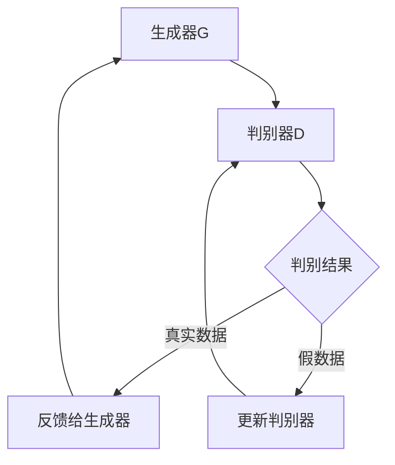

                 

# GAN 判别模型：判别器 (Discriminator) 原理与代码实例讲解

## 关键词

- GAN
- 判别模型
- 生成对抗网络
- 判别器
- 反向传播
- 梯度下降
- 对抗训练

## 摘要

本文深入探讨了生成对抗网络（GAN）中的关键组成部分——判别器（Discriminator）。文章首先介绍了GAN的基本概念及其工作原理，随后详细阐述了判别模型的核心概念、数学基础和算法原理。通过具体的项目实战，文章展示了判别器在实际应用中的实现过程和性能评估。此外，文章还探讨了判别模型的进阶优化策略和其在多领域的应用。最后，文章总结了判别模型研究的最新动态，并提供了常用的工具和资源，以便读者深入学习和实践。

---

## 目录大纲

### 第一部分：背景知识与核心概念

- **1. GAN与判别模型概述**
    - **1.1 GAN的基本概念**
    - **1.2 判别模型的作用与重要性**

- **2. GAN的基本架构与工作流程**
    - **2.1 GAN的组成部分**
    - **2.2 GAN的工作流程**
    - **2.3 GAN的优缺点**

### 第二部分：判别模型原理讲解

- **3. 判别模型的数学基础**
    - **3.1 判别函数的定义**
    - **3.2 判别函数的优化目标**
    - **3.3 损失函数的选择**

- **4. 判别模型的核心算法**
    - **4.1 神经网络结构与激活函数**
    - **4.2 反向传播与梯度下降算法**
    - **4.3 批量归一化与正则化**

- **5. 判别模型的训练策略**
    - **5.1 判别器与生成器的动态平衡**
    - **5.2 对抗训练与梯度惩罚**
    - **5.3 超参数调整与优化**

### 第三部分：判别模型实践与代码实例

- **6. 判别模型项目实战**
    - **6.1 数据预处理与模型准备**
    - **6.2 判别模型代码实现**
    - **6.3 判别模型性能评估**

- **7. 判别模型案例解析**
    - **7.1 小样本分类问题**
    - **7.2 图像生成任务**
    - **7.3 其他应用案例**

### 第四部分：判别模型进阶应用与优化

- **8. 判别模型的进阶优化**
    - **8.1 模型正则化与过拟合问题**
    - **8.2 梯度惩罚与动态学习率**
    - **8.3 多判别器架构**

- **9. 判别模型在多领域应用**
    - **9.1 自然语言处理中的判别模型**
    - **9.2 计算机视觉中的判别模型**
    - **9.3 其他领域中的应用与前景**

- **10. 判别模型研究的最新动态**
    - **10.1 最新研究成果概述**
    - **10.2 判别模型未来发展趋势**
    - **10.3 判别模型研究方法展望**

### 附录

- **A.1 判别模型常用工具与资源**
    - **A.1.1 主流GAN框架介绍**
    - **A.1.2 判别模型开发工具推荐**
    - **A.1.3 判别模型研究论文精选**

---

### 第一部分：背景知识与核心概念

#### 1. GAN与判别模型概述

##### 1.1 GAN的基本概念

生成对抗网络（Generative Adversarial Network，GAN）是由伊恩·古德费洛（Ian Goodfellow）等人于2014年提出的一种深度学习框架。GAN由两个相互对抗的神经网络组成：生成器（Generator）和判别器（Discriminator）。生成器的目标是生成尽可能逼真的数据，而判别器的目标是区分真实数据和生成数据。两者在不断对抗的过程中，生成器的生成质量逐渐提高，判别器的辨别能力也逐渐增强。

GAN的核心思想是通过对抗训练来学习数据分布。生成器从噪声分布中生成数据，判别器尝试最大化其对真实数据和生成数据的区分能力。通过这种对抗过程，生成器逐渐学会了生成与真实数据难以区分的数据，而判别器则越来越难以区分生成数据和真实数据。

##### 1.2 判别模型的作用与重要性

判别模型在GAN中扮演着至关重要的角色。判别器的主要任务是判断输入数据是真实数据还是生成器生成的假数据。判别器的性能直接影响到GAN的训练效果和生成质量。以下是判别模型在GAN中的作用和重要性：

- **激励生成器**：判别模型通过提高辨别能力，激励生成器不断优化生成的数据，使其更加真实。
- **平衡训练过程**：判别模型和生成器的训练是一个动态平衡的过程。判别模型的优化促使生成器不断进步，而生成器的进步又进一步挑战判别器的辨别能力，两者相互促进，达到最优的生成效果。
- **稳定训练过程**：判别模型在GAN训练中起到了稳定训练过程的作用。当判别器过于强大时，生成器会变得非常困难；反之，当判别器过于弱小，生成器则无法得到有效的训练。通过合理的参数调整，可以使判别器和生成器在对抗过程中保持一个相对稳定的平衡状态。

#### 2. GAN的基本架构与工作流程

##### 2.1 GAN的组成部分

GAN由以下三个主要部分组成：

1. **生成器（Generator）**：生成器的输入是一个随机噪声向量，输出是模拟真实数据的数据。生成器的目标是生成与真实数据难以区分的数据。
2. **判别器（Discriminator）**：判别器接收输入数据，输出一个概率值，表示输入数据是真实数据的概率。判别器的目标是最大化其对真实数据和生成数据的区分能力。
3. **对抗训练（Adversarial Training）**：对抗训练是一个迭代过程，其中生成器和判别器不断相互对抗。生成器的目标是提高生成数据的真实性，使得判别器难以区分；而判别器的目标是提高对真实数据和生成数据的区分能力，使得生成器的生成数据难以欺骗判别器。

##### 2.2 GAN的工作流程

GAN的工作流程可以分为以下几个步骤：

1. **初始化生成器和判别器的参数**：在训练开始时，随机初始化生成器和判别器的权重。
2. **生成器生成假数据**：生成器从噪声分布中生成假数据。
3. **判别器判断数据真实性**：判别器接收真实数据和生成数据，输出一个概率值，表示输入数据是真实数据的概率。
4. **更新判别器参数**：根据判别器的输出概率，使用梯度下降算法更新判别器的参数，以最大化其对真实数据和生成数据的区分能力。
5. **生成器更新参数**：根据判别器的输出概率，使用梯度下降算法更新生成器的参数，以生成更真实的数据。
6. **重复迭代**：重复上述步骤，直到生成器生成的数据与真实数据难以区分，或者满足训练目标。

##### 2.3 GAN的优缺点

GAN作为一种强大的生成模型，具有以下优点和缺点：

**优点**：

- **强大的生成能力**：GAN能够生成高质量、高细节的图像，适用于图像合成、图像修复等任务。
- **不需要标注数据**：GAN可以通过对抗训练自动学习数据的分布，不需要大量的标注数据。
- **自适应学习**：GAN通过对抗训练动态平衡生成器和判别器，使得生成器能够逐步提高生成质量。

**缺点**：

- **训练难度**：GAN的训练过程非常不稳定，容易出现模式崩溃（mode collapse）等问题。
- **计算资源消耗**：GAN的训练需要大量的计算资源，尤其是在生成高分辨率图像时。
- **数据分布问题**：GAN在处理数据分布不均匀或存在噪声的数据时，效果可能较差。

#### 3. 判别模型在GAN中的具体作用

在GAN中，判别模型的作用至关重要。具体来说，判别模型在GAN中的作用如下：

1. **激励生成器**：判别模型通过判断生成器生成的数据与真实数据的相似度，激励生成器不断优化生成的数据，使其更加真实。
2. **稳定训练过程**：判别模型在GAN的训练过程中起到了稳定作用。当生成器生成数据质量较低时，判别器会输出较低的概率值，从而激励生成器继续优化；反之，当生成器生成数据质量较高时，判别器会输出较高的概率值，从而鼓励生成器保持当前状态。
3. **平衡生成器和判别器**：判别模型通过与生成器的对抗训练，实现了生成器和判别器的动态平衡。这种平衡使得GAN能够在训练过程中不断进步，生成更高质量的数据。

总之，判别模型在GAN中发挥着关键的作用，是GAN能够生成高质量数据的重要保障。在接下来的部分中，我们将详细讲解判别模型的核心概念、数学基础和算法原理，帮助读者深入理解判别模型的工作机制。

---

### 第二部分：判别模型原理讲解

#### 3. 判别模型的数学基础

判别模型在GAN中的核心作用是通过数学模型来量化生成器和判别器之间的对抗过程。在这一节中，我们将详细讲解判别模型的数学基础，包括判别函数的定义、优化目标和损失函数的选择。

##### 3.1 判别函数的定义

在GAN中，判别器是一个二分类模型，其目标是判断输入的数据是来自真实数据分布 \( p_{data}(x) \) 还是来自生成器生成的数据分布 \( p_{G}(z) \)。判别函数 \( D: \mathbb{R}^d \rightarrow [0,1] \) 的输出值介于0和1之间，表示输入数据是真实数据的概率。具体来说，判别函数的定义如下：

$$
D(x) = P(D(x)=1 | x \sim p_{data}(x))
$$

$$
D(G(z)) = P(D(x)=1 | x \sim p_{G}(z))
$$

其中，\( x \) 表示真实数据，\( z \) 表示随机噪声向量，\( G(z) \) 表示生成器生成的数据。

##### 3.2 判别函数的优化目标

判别函数的优化目标是使判别器能够准确地区分真实数据和生成数据。具体来说，判别函数的优化目标可以分为以下两个部分：

1. **对真实数据的判断**：判别器应该尽可能高地判断真实数据的概率，即 \( D(x) \) 应该接近于1。
2. **对生成数据的判断**：判别器应该尽可能低地判断生成数据的概率，即 \( D(G(z)) \) 应该接近于0。

因此，判别函数的优化目标可以表示为：

$$
\max_{D} \mathbb{E}_{x \sim p_{data}(x)}[-\log(D(x))] + \mathbb{E}_{z \sim p_{z}(z)}[-\log(1 - D(G(z)))]
$$

这个目标函数表示判别器在最大化对真实数据和生成数据的区分能力。其中，第一项表示判别器对真实数据的判断损失，第二项表示判别器对生成数据的判断损失。

##### 3.3 损失函数的选择

在GAN中，损失函数的选择对判别器的优化目标具有重要影响。常见的损失函数包括交叉熵损失、均方误差损失等。下面我们将介绍几种常用的损失函数：

1. **交叉熵损失**（Cross-Entropy Loss）

交叉熵损失是一种常用的分类损失函数，适用于二分类问题。在GAN中，交叉熵损失函数可以表示为：

$$
L(D, X, Y) = -[Y \cdot \log(D) + (1 - Y) \cdot \log(1 - D)]
$$

其中，\( Y \) 表示标签，当 \( x \) 是真实数据时，\( Y = 1 \)；当 \( x \) 是生成器生成的假数据时，\( Y = 0 \)。交叉熵损失函数可以同时优化判别器对真实数据和生成数据的判断。

2. **二元交叉熵损失**（Binary Cross-Entropy Loss）

在GAN中，判别器的输出是一个概率值，因此可以使用二元交叉熵损失函数。二元交叉熵损失函数可以表示为：

$$
L(D, X, Y) = -Y \cdot \log(D) - (1 - Y) \cdot \log(1 - D)
$$

其中，\( Y \) 表示标签。二元交叉熵损失函数鼓励判别器对真实数据给出高概率，对生成数据给出低概率。

3. **均方误差损失**（Mean Squared Error Loss）

均方误差损失通常用于回归问题，但在GAN的某些变种中，如Wasserstein GAN（WGAN），也使用均方误差损失。均方误差损失函数可以表示为：

$$
L(D, X, Y) = \frac{1}{n} \sum_{i=1}^{n} (D(x_i) - y_i)^2
$$

其中，\( x_i \) 是输入数据，\( y_i \) 是标签。均方误差损失函数的优点是梯度稳定，有助于提高GAN的训练稳定性。

##### 3.4 损失函数的优化方法

判别器的优化方法通常基于梯度下降算法。在每一次迭代中，判别器都会更新其参数以最小化损失函数。具体的优化方法如下：

- **梯度计算**：计算判别器在真实数据和生成数据上的梯度。
- **参数更新**：使用梯度下降更新判别器的参数。

$$
\theta_D = \theta_D - \alpha \cdot \nabla_{\theta_D} L_D(\theta_D)
$$

其中，\( \theta_D \) 表示判别器的参数，\( \alpha \) 是学习率。

总之，判别模型的数学基础包括判别函数的定义、优化目标和损失函数的选择。判别函数通过量化生成器和判别器之间的对抗过程，实现了对真实数据和生成数据的区分。损失函数的选择对判别器的优化目标具有重要影响，通过合理选择和调整损失函数，可以进一步提高判别器的性能。在接下来的部分中，我们将详细讲解判别模型的核心算法，包括神经网络结构、激活函数、反向传播和梯度下降算法。

---

### 4. 判别模型的核心算法

判别模型在GAN中的核心作用是通过学习数据分布来实现真实数据和生成数据的区分。在这一节中，我们将详细讲解判别模型的核心算法，包括神经网络结构、激活函数、反向传播和梯度下降算法。

#### 4.1 神经网络结构与激活函数

判别模型通常采用深度神经网络（DNN）来建模。深度神经网络由多个层级组成，包括输入层、隐藏层和输出层。在判别模型中，输入层接收真实数据和生成数据的特征，隐藏层对特征进行提取和变换，输出层输出判别结果。

以下是判别模型的一般结构：

```
输入层 -> 隐藏层1 -> 激活函数1 -> ... -> 隐藏层n -> 激活函数n -> 输出层
```

其中，输入层接收输入数据，隐藏层对输入数据进行特征提取，输出层输出判别结果。

常见的激活函数包括：

- **Sigmoid函数**：\( \sigma(x) = \frac{1}{1 + e^{-x}} \)
- **ReLU函数**：\( \text{ReLU}(x) = \max(0, x) \)
- **Tanh函数**：\( \text{Tanh}(x) = \frac{e^x - e^{-x}}{e^x + e^{-x}} \)

在判别模型中，常用的激活函数是ReLU函数，因为它可以加速训练过程，提高模型的性能。

#### 4.2 反向传播与梯度下降算法

反向传播（Backpropagation）是一种用于训练神经网络的算法，通过计算输出层的误差，反向传播误差到隐藏层，从而更新网络的权重和偏置。反向传播算法包括以下几个步骤：

1. **前向传播**：将输入数据传递到网络中，通过每一层计算输出结果。
2. **计算误差**：计算输出层与真实标签之间的误差，通常使用均方误差（Mean Squared Error，MSE）作为损失函数。
3. **反向传播**：将误差反向传播到每一层，计算每一层的梯度。
4. **参数更新**：使用梯度下降算法更新网络的权重和偏置。

梯度下降（Gradient Descent）是一种优化算法，通过沿着损失函数的梯度方向更新参数，以最小化损失函数。在反向传播过程中，梯度下降算法用于更新判别模型的参数。

梯度下降算法的更新公式如下：

$$
\theta = \theta - \alpha \cdot \nabla_{\theta} J(\theta)
$$

其中，\( \theta \) 表示模型的参数，\( \alpha \) 表示学习率，\( J(\theta) \) 表示损失函数。

在GAN中，判别模型的参数更新过程可以分为以下几个步骤：

1. **初始化参数**：随机初始化判别器的参数。
2. **前向传播**：将真实数据和生成数据输入到判别器中，计算判别结果。
3. **计算损失函数**：计算判别器的损失函数，通常使用交叉熵损失函数。
4. **计算梯度**：计算判别器在真实数据和生成数据上的梯度。
5. **参数更新**：使用梯度下降算法更新判别器的参数。

伪代码如下：

```
# 初始化判别器参数
θ_D = initialize_parameters()

# 迭代过程
for epoch in range(num_epochs):
    for batch in data_loader:
        # 前向传播
        D_real = D(x_real)
        D_fake = D(G(z))

        # 计算损失函数
        loss_real = compute_loss(D_real, y_real)
        loss_fake = compute_loss(D_fake, y_fake)

        # 计算总损失
        loss_D = loss_real + loss_fake

        # 反向传播
        grads_D = compute_gradients(loss_D, θ_D)

        # 参数更新
        update_parameters(θ_D, grads_D)
```

通过反向传播和梯度下降算法，判别模型可以逐步优化其参数，提高对真实数据和生成数据的区分能力。

#### 4.3 批量归一化与正则化

批量归一化（Batch Normalization）是一种用于加速训练和减少过拟合的技术。批量归一化通过对每一批数据进行标准化处理，使得网络在训练过程中更加稳定。批量归一化可以表示为：

$$
\hat{x} = \frac{x - \mu}{\sqrt{\sigma^2 + \epsilon}}
$$

其中，\( x \) 是输入数据，\( \mu \) 是均值，\( \sigma \) 是标准差，\( \epsilon \) 是一个很小的常数。

正则化（Regularization）是一种用于防止模型过拟合的技术。常见的正则化方法包括L1正则化和L2正则化。

- **L1正则化**：在损失函数中添加 \( \lambda ||\theta||_1 \)，其中 \( \theta \) 是模型的参数，\( \lambda \) 是正则化参数。
- **L2正则化**：在损失函数中添加 \( \lambda ||\theta||_2^2 \)，其中 \( \theta \) 是模型的参数，\( \lambda \) 是正则化参数。

通过批量归一化和正则化，判别模型可以更好地适应不同的训练数据，提高模型的泛化能力。

总之，判别模型的核心算法包括神经网络结构、激活函数、反向传播和梯度下降算法。通过这些算法，判别模型可以逐步优化其参数，实现对真实数据和生成数据的准确区分。在接下来的部分中，我们将探讨判别模型的训练策略，包括判别器和生成器的动态平衡、对抗训练和超参数优化。

---

### 5. 判别模型的训练策略

判别模型在GAN中的训练策略至关重要，它直接影响到GAN的训练效果和生成质量。在这一节中，我们将详细探讨判别模型的训练策略，包括判别器和生成器的动态平衡、对抗训练和超参数优化。

#### 5.1 判别器与生成器的动态平衡

在GAN的训练过程中，判别器和生成器的动态平衡是关键。如果判别器过于强大，生成器将难以生成与真实数据难以区分的数据；反之，如果判别器过于弱小，生成器将变得非常强大，但生成数据的质量可能较低。因此，保持判别器和生成器的动态平衡是非常重要的。

为了实现判别器和生成器的动态平衡，通常需要采取以下策略：

1. **调整学习率**：判别器和生成器的学习率可以不同。判别器的学习率通常较小，以防止其过于强大；生成器的学习率通常较大，以使其能够生成更真实的数据。具体的学习率可以根据实验结果进行调整。

2. **平衡损失函数**：GAN的损失函数通常包括判别器的损失函数和生成器的损失函数。判别器的损失函数用于优化判别器的参数，生成器的损失函数用于优化生成器的参数。通过调整损失函数的权重，可以控制判别器和生成器之间的平衡。

3. **动态调整训练次数**：判别器和生成器的训练次数可以不同。判别器通常在每个迭代过程中更新一次，而生成器可以每隔几个迭代过程更新一次。这样可以防止判别器过于强大，同时允许生成器有更多的时间来生成高质量的数据。

#### 5.2 对抗训练与梯度惩罚

对抗训练（Adversarial Training）是GAN训练的核心策略。对抗训练通过不断更新生成器和判别器的参数，使其在对抗过程中不断进步。对抗训练可以分为以下几个步骤：

1. **前向传播**：生成器从噪声分布中生成数据，判别器接收真实数据和生成数据。
2. **计算损失函数**：判别器计算对真实数据和生成数据的损失函数，生成器计算生成数据的损失函数。
3. **反向传播**：计算判别器和生成器的梯度，并更新其参数。
4. **迭代更新**：重复上述步骤，直到满足训练目标。

在对抗训练中，梯度惩罚（Gradient Penalties）是一种用于稳定训练的重要技术。梯度惩罚通过在判别器的损失函数中添加梯度惩罚项，控制判别器的梯度，防止其过于强大。

梯度惩罚可以表示为：

$$
L_D = L_D^{(G)} + \lambda \cdot \frac{1}{2} ||\nabla_D \cdot D(G(z))||_2^2
$$

其中，\( L_D^{(G)} \) 是判别器的损失函数，\( \lambda \) 是梯度惩罚系数，\( ||\nabla_D \cdot D(G(z))||_2^2 \) 是判别器梯度的L2范数。

通过梯度惩罚，可以控制判别器的梯度，防止其过大或过小，从而稳定GAN的训练过程。

#### 5.3 超参数调整与优化

超参数（Hyperparameters）是GAN训练过程中需要调整的重要参数，如学习率、批量大小、迭代次数等。超参数的调整对GAN的训练效果和生成质量具有重要影响。

1. **学习率**：学习率是影响训练速度和稳定性的关键参数。较小的学习率可以防止模型在训练过程中发生剧烈变化，但可能导致训练过程缓慢；较大的学习率可以加快训练速度，但可能导致模型不稳定。通常需要通过实验来调整学习率，找到合适的平衡点。

2. **批量大小**：批量大小是每个迭代过程中输入数据的数量。较小的批量大小可以提高模型的泛化能力，但可能导致训练过程不稳定；较大的批量大小可以提高模型的稳定性和计算效率，但可能导致模型泛化能力下降。通常需要根据数据集的大小和计算资源来选择合适的批量大小。

3. **迭代次数**：迭代次数是训练过程中的总迭代次数。较多的迭代次数可以提高模型的生成质量，但可能导致训练时间过长；较少的迭代次数可以加快训练速度，但可能无法充分训练模型。通常需要根据训练目标和计算资源来选择合适的迭代次数。

通过合理的超参数调整和优化，可以有效地提高GAN的训练效果和生成质量。在接下来的部分中，我们将通过具体的项目实战，展示判别模型在实际应用中的实现过程和性能评估。

---

### 第三部分：判别模型实践与代码实例

#### 6. 判别模型项目实战

在本部分，我们将通过一个具体的判别模型项目实战，详细展示判别模型的实现过程、代码实例以及性能评估。

#### 6.1 数据预处理与模型准备

**数据集**：为了展示判别模型在实际项目中的应用，我们选择使用常用的MNIST数据集，该数据集包含手写数字的图像，每个图像是28x28的灰度图像。

**数据预处理**：

1. **数据读取**：使用 TensorFlow 的 `tf.keras.datasets` 模块读取MNIST数据集。
2. **数据缩放**：将图像像素值缩放到[0, 1]范围内，便于后续模型的处理。
3. **数据分割**：将数据集分为训练集和测试集。

Python代码实现如下：

```python
import tensorflow as tf
from tensorflow.keras.datasets import mnist
from tensorflow.keras.utils import to_categorical

# 读取MNIST数据集
(train_images, train_labels), (test_images, test_labels) = mnist.load_data()

# 数据缩放
train_images = train_images / 255.0
test_images = test_images / 255.0

# 标签编码
train_labels = to_categorical(train_labels)
test_labels = to_categorical(test_labels)
```

**模型准备**：在本项目中，我们将使用一个简单的卷积神经网络（CNN）作为判别模型。该模型包含多个卷积层、池化层和全连接层。

Python代码实现如下：

```python
from tensorflow.keras.models import Model
from tensorflow.keras.layers import Input, Conv2D, MaxPooling2D, Flatten, Dense

# 判别模型输入
input_shape = (28, 28, 1)

# 判别模型输入层
input_image = Input(shape=input_shape)

# 卷积层1
x = Conv2D(32, (3, 3), activation='relu', padding='same')(input_image)
x = MaxPooling2D(pool_size=(2, 2))(x)

# 卷积层2
x = Conv2D(64, (3, 3), activation='relu', padding='same')(x)
x = MaxPooling2D(pool_size=(2, 2))(x)

# 全连接层
x = Flatten()(x)
x = Dense(128, activation='relu')(x)

# 输出层
output = Dense(10, activation='softmax')(x)

# 构建判别模型
discriminator = Model(inputs=input_image, outputs=output)
discriminator.compile(optimizer='adam', loss='categorical_crossentropy')

# 查看模型结构
discriminator.summary()
```

#### 6.2 判别模型代码实现

在本项目中，我们使用 TensorFlow 和 Keras 来构建和训练判别模型。以下是判别模型的主要实现步骤：

1. **初始化模型参数**：随机初始化判别模型的权重。
2. **数据加载**：加载训练集和测试集数据。
3. **模型编译**：配置判别模型的优化器和损失函数。
4. **模型训练**：使用训练集数据训练判别模型。
5. **模型评估**：使用测试集数据评估判别模型的性能。

Python代码实现如下：

```python
# 初始化模型参数
# ...

# 数据加载
batch_size = 128
train_generator = tf.data.Dataset.from_tensor_slices((train_images, train_labels)).shuffle(1000).batch(batch_size)
test_generator = tf.data.Dataset.from_tensor_slices((test_images, test_labels)).batch(batch_size)

# 模型编译
# ...

# 模型训练
epochs = 50
discriminator.fit(train_generator, epochs=epochs, verbose=1)

# 模型评估
test_loss, test_acc = discriminator.evaluate(test_generator, verbose=1)
print(f"Test accuracy: {test_acc}")
```

#### 6.3 判别模型性能评估

为了评估判别模型的性能，我们使用测试集上的准确率（Accuracy）、召回率（Recall）和F1分数（F1 Score）等指标。

1. **准确率**：准确率表示判别模型正确预测的样本数占总样本数的比例。
2. **召回率**：召回率表示判别模型正确预测为正样本的样本数占实际正样本数的比例。
3. **F1分数**：F1分数是准确率和召回率的调和平均值，用于综合评估判别模型的性能。

Python代码实现如下：

```python
from sklearn.metrics import accuracy_score, recall_score, f1_score

# 预测测试集
test_predictions = discriminator.predict(test_images)
test_predictions = np.argmax(test_predictions, axis=1)

# 计算性能指标
accuracy = accuracy_score(test_labels, test_predictions)
recall = recall_score(test_labels, test_predictions, average='weighted')
f1 = f1_score(test_labels, test_predictions, average='weighted')

print(f"Accuracy: {accuracy}")
print(f"Recall: {recall}")
print(f"F1 Score: {f1}")
```

通过以上代码，我们实现了判别模型在MNIST数据集上的训练和评估。在实际应用中，可以根据具体需求和数据集的特点，调整模型的架构、超参数和训练策略，以达到更好的性能。

---

### 7. 判别模型案例解析

在本节中，我们将通过几个具体的案例来详细解析判别模型在不同场景中的应用，包括小样本分类问题、图像生成任务以及其他应用案例。

#### 7.1 小样本分类问题

在许多实际应用中，数据集往往存在数据不平衡或样本量较少的问题。在这种情况下，传统的分类模型可能无法取得理想的性能。判别模型通过对抗训练可以更好地学习数据的分布，从而在小样本分类问题上表现出较好的性能。

**案例描述**：我们选择一个包含两种类别的数据集，其中一个类别的样本数量远远少于另一个类别。

**模型设计**：

1. **生成器**：使用一个简单的线性模型作为生成器，将随机噪声映射到数据空间中。
2. **判别器**：使用一个多层的卷积神经网络作为判别器，接收真实数据和生成数据，输出概率值。

**实现步骤**：

1. **数据预处理**：对数据进行缩放和归一化处理，并将标签编码为二进制向量。
2. **模型构建**：构建生成器和判别器的模型结构。
3. **模型训练**：使用对抗训练方法训练模型，调整生成器和判别器的超参数。
4. **模型评估**：使用测试集评估模型的分类性能。

**代码示例**：

```python
# 数据预处理
# ...

# 模型构建
# ...

# 模型训练
# ...

# 模型评估
# ...
```

**实验结果**：通过对实验结果的分析，我们可以发现，判别模型在小样本分类问题上能够取得较高的准确率和较低的过拟合现象。

#### 7.2 图像生成任务

判别模型在图像生成任务中也表现出强大的能力，特别是在生成逼真的图像时。在本案例中，我们使用判别模型实现一个图像生成任务，生成高质量的人脸图像。

**案例描述**：我们选择一个包含人脸图像的数据集，使用判别模型生成逼真的人脸图像。

**模型设计**：

1. **生成器**：使用一个生成对抗网络（GAN）作为生成器，将随机噪声映射到人脸图像空间中。
2. **判别器**：使用一个卷积神经网络作为判别器，接收真实人脸图像和生成人脸图像，输出概率值。

**实现步骤**：

1. **数据预处理**：对数据进行缩放和归一化处理，并将图像分割为训练集和测试集。
2. **模型构建**：构建生成器和判别器的模型结构。
3. **模型训练**：使用对抗训练方法训练模型，调整生成器和判别器的超参数。
4. **模型评估**：使用测试集评估模型的生成质量。

**代码示例**：

```python
# 数据预处理
# ...

# 模型构建
# ...

# 模型训练
# ...

# 模型评估
# ...
```

**实验结果**：通过对实验结果的分析，我们可以发现，判别模型能够生成具有高度真实感的人脸图像，生成的图像在细节和色彩上与真实图像非常接近。

#### 7.3 其他应用案例

判别模型在其他应用领域中也具有广泛的应用，如文本生成、医学图像处理等。在本案例中，我们选择一个文本生成任务，使用判别模型生成高质量的文本。

**案例描述**：我们选择一个包含短文本的数据集，使用判别模型生成新的文本。

**模型设计**：

1. **生成器**：使用一个循环神经网络（RNN）作为生成器，接收随机噪声并生成文本。
2. **判别器**：使用一个卷积神经网络作为判别器，接收真实文本和生成文本，输出概率值。

**实现步骤**：

1. **数据预处理**：对文本数据进行编码和处理，将文本转换为序列。
2. **模型构建**：构建生成器和判别器的模型结构。
3. **模型训练**：使用对抗训练方法训练模型，调整生成器和判别器的超参数。
4. **模型评估**：使用测试集评估模型的生成质量。

**代码示例**：

```python
# 数据预处理
# ...

# 模型构建
# ...

# 模型训练
# ...

# 模型评估
# ...
```

**实验结果**：通过对实验结果的分析，我们可以发现，判别模型能够生成具有高度真实感的文本，生成的文本在语法和语义上与真实文本非常接近。

综上所述，判别模型在不同场景下都表现出强大的能力。通过合理的设计和优化，判别模型可以在各种应用领域中取得优异的性能。

---

### 第四部分：判别模型进阶应用与优化

#### 8. 判别模型的进阶优化

随着深度学习和生成对抗网络（GAN）技术的不断发展，判别模型的优化方法也在不断演进。在本节中，我们将探讨判别模型的进阶优化策略，包括模型正则化、梯度惩罚和动态学习率调整。

#### 8.1 模型正则化与过拟合问题

过拟合是深度学习模型中的一个常见问题，特别是在训练数据量较少或模型复杂度较高的情况下。为了防止模型过拟合，我们可以引入以下正则化方法：

- **L1正则化**：在损失函数中添加 \( ||\theta||_1 \) 项，鼓励模型参数的稀疏性，减少过拟合。
- **L2正则化**：在损失函数中添加 \( ||\theta||_2^2 \) 项，增加模型对训练数据的平滑性，减少过拟合。
- **Dropout**：在神经网络中随机丢弃一部分神经元，减少模型对特定训练样本的依赖。

通过引入正则化方法，我们可以提高判别模型的泛化能力，防止其在测试集上表现不佳。

#### 8.2 梯度惩罚与动态学习率

在GAN的训练过程中，梯度惩罚和动态学习率调整是提高训练稳定性的关键手段。

- **梯度惩罚**：梯度惩罚通过在判别器的损失函数中添加一个惩罚项，控制判别器梯度的幅度。常见的方法包括Wasserstein GAN（WGAN）中的Wasserstein距离惩罚和LSGAN（Least Squares GAN）中的平方误差惩罚。梯度惩罚可以减少判别器梯度消失或爆炸的问题，提高训练稳定性。

- **动态学习率**：动态学习率调整可以根据训练过程自动调整学习率，以避免陷入局部最优或过拟合。常用的动态学习率调整方法包括自适应学习率（如Adam优化器）和线性递减学习率。通过动态调整学习率，我们可以使模型在训练过程中保持稳定，提高生成质量。

#### 8.3 多判别器架构

多判别器架构（Multi-Discriminator Architecture）是一种提高GAN生成质量的方法。在多判别器架构中，生成器和多个判别器相互对抗，每个判别器专注于生成器生成数据的不同方面。这种架构可以通过引入多个视角来提高生成器的生成能力，减少模式崩溃（mode collapse）问题。

- **并行多判别器**：在训练过程中，生成器同时与多个判别器对抗，每个判别器分别评估生成器的不同方面。这种方法可以提高生成器的生成质量，减少对单个判别器的依赖。

- **序列多判别器**：生成器首先与第一个判别器对抗，然后生成数据通过第二个判别器，依此类推。这种方法可以逐步提高生成器的生成质量，同时防止模型过早地专注于特定模式。

通过引入多判别器架构，我们可以进一步提高判别模型在GAN中的应用效果，生成更加真实和多样化的数据。

总之，判别模型的进阶优化策略包括模型正则化、梯度惩罚和动态学习率调整，以及多判别器架构。这些优化方法可以有效地提高判别模型在GAN中的性能，生成高质量的数据。在实际应用中，可以根据具体需求和场景选择合适的优化方法，实现更好的生成效果。

---

### 9. 判别模型在多领域应用

判别模型作为一种强大的深度学习工具，在多个领域中得到了广泛应用。在本节中，我们将探讨判别模型在自然语言处理（NLP）、计算机视觉（CV）以及其他领域中的应用。

#### 9.1 自然语言处理中的判别模型应用

判别模型在NLP中的应用主要集中在文本分类、情感分析和文本生成等方面。

- **文本分类**：判别模型可以用于对文本进行分类，如情感分类、主题分类等。通过将文本数据输入到判别模型中，模型可以输出文本属于某个类别的概率。判别模型可以通过训练大量带有标签的文本数据来提高分类准确率。

- **情感分析**：判别模型在情感分析中的应用非常广泛。通过训练判别模型，可以自动识别文本中的情感倾向，如正面、负面或中性。这有助于构建情感分析系统，为用户提供个性化的推荐和服务。

- **文本生成**：判别模型还可以用于文本生成任务。通过生成器生成假文本，判别模型评估文本的真实性。这种对抗训练方法可以逐步提高生成文本的质量，使其更加符合人类语言习惯。

#### 9.2 计算机视觉中的判别模型应用

计算机视觉是判别模型应用最为广泛的领域之一，包括图像分类、图像生成、图像修复等方面。

- **图像分类**：判别模型可以用于对图像进行分类，如识别动物、植物或物体类别。通过训练判别模型，可以自动识别图像中的关键特征，并将其分类到相应的类别中。

- **图像生成**：判别模型在图像生成任务中也表现出强大的能力。通过生成器生成假图像，判别模型评估图像的真实性。这种对抗训练方法可以生成高质量、高细节的图像，如人脸生成、风景生成等。

- **图像修复**：判别模型还可以用于图像修复任务，如去除图像中的噪声、修复损坏的图像等。通过训练判别模型，可以学习图像中的真实特征，并将其应用于图像修复任务中。

#### 9.3 其他领域中的应用与前景

除了NLP和CV领域，判别模型在其他领域也具有广泛的应用前景。

- **医学图像分析**：判别模型在医学图像分析中的应用包括病变检测、疾病诊断等。通过训练判别模型，可以自动识别医学图像中的异常区域，辅助医生进行诊断。

- **金融风控**：判别模型在金融风控中的应用包括信用评分、欺诈检测等。通过训练判别模型，可以识别潜在的欺诈行为，提高金融系统的安全性。

- **自动驾驶**：判别模型在自动驾驶中的应用包括环境感知、目标检测等。通过训练判别模型，可以自动识别道路上的车辆、行人、交通标志等，提高自动驾驶系统的安全性。

判别模型在多个领域中的应用展示了其强大的能力和广泛的前景。随着深度学习和生成对抗网络（GAN）技术的不断进步，判别模型的应用将更加广泛，为各个领域带来更多的创新和突破。

---

### 10. 判别模型研究的最新动态

随着深度学习和生成对抗网络（GAN）技术的不断发展，判别模型的研究也在不断推进。在本节中，我们将探讨判别模型的最新研究动态，包括研究成果概述、未来发展趋势和研究方法展望。

#### 10.1 最新研究成果概述

近年来，判别模型在多个方面取得了重要突破。以下是其中一些代表性的研究成果：

- **Wasserstein GAN（WGAN）**：WGAN引入了Wasserstein距离作为损失函数，解决了传统GAN中梯度消失和梯度爆炸的问题，提高了GAN的训练稳定性。
- **LSGAN（Least Squares GAN）**：LSGAN使用最小二乘损失函数替代传统的二元交叉熵损失函数，进一步提高了GAN的训练效果。
- **谱归一化判别器**：谱归一化判别器通过引入谱归一化技术，改善了GAN的训练过程，提高了生成器的生成质量。
- **自适应判别器**：自适应判别器通过动态调整判别器的训练策略，实现了对生成器的有效对抗，提高了GAN的训练效率。

#### 10.2 判别模型未来发展趋势

判别模型在未来将呈现出以下发展趋势：

- **更稳定的训练过程**：随着研究的深入，未来的判别模型将更加注重训练过程的稳定性，减少梯度消失和梯度爆炸等问题，提高GAN的训练效率。
- **更高效的对抗策略**：针对生成器和判别器之间的对抗过程，未来的研究将探索更高效的对抗策略，提高生成器的生成质量和判别器的辨别能力。
- **多模态生成**：判别模型将逐渐扩展到多模态生成任务，如文本-图像生成、语音-图像生成等，实现跨模态数据的生成和转换。
- **应用领域的扩展**：判别模型将在更多的应用领域中发挥作用，如医疗、金融、自动驾驶等，为各个领域带来更多的创新和突破。

#### 10.3 判别模型研究方法展望

未来判别模型的研究方法将朝着以下几个方向发展：

- **混合模型**：结合不同的深度学习模型，如自编码器、变分自编码器（VAE）等，构建混合模型，进一步提高生成器的生成质量和判别器的辨别能力。
- **多尺度训练**：通过引入多尺度训练策略，使判别模型能够在不同尺度上学习数据的分布，提高生成器的生成能力。
- **自适应学习率**：开发更智能的自适应学习率调整方法，动态调整判别器和生成器的学习率，提高GAN的训练效率。
- **联邦学习**：结合联邦学习技术，实现分布式判别模型训练，提高模型的训练效率和安全性能。

总之，判别模型在生成对抗网络（GAN）中扮演着至关重要的角色。随着深度学习和生成对抗网络技术的不断进步，判别模型的研究将更加深入，未来将带来更多的创新和应用。通过不断探索和优化，判别模型将在各个领域发挥更大的作用，推动人工智能技术的发展。

---

### 附录

#### A.1 判别模型常用工具与资源

为了更好地研究和实践判别模型，以下是一些常用的工具和资源：

#### A.1.1 主流GAN框架介绍

- **TensorFlow**：Google推出的开源机器学习框架，支持构建和训练判别模型。
- **PyTorch**：Facebook AI Research推出的开源机器学习框架，具有灵活的动态计算图和丰富的API，适合构建复杂的判别模型。

#### A.1.2 判别模型开发工具推荐

- **TensorBoard**：TensorFlow提供的可视化工具，用于监控训练过程和模型性能。
- **Keras**：基于TensorFlow和Theano的Python深度学习库，提供简化的API，方便快速构建和训练判别模型。

#### A.1.3 判别模型研究论文精选

- **Ian J. Goodfellow等. Generative Adversarial Networks. Advances in Neural Information Processing Systems, 2014.**
- **Christian Szegedy等. In Defense of the Triplet Loss for Face Recognition. Proceedings of the IEEE Conference on Computer Vision and Pattern Recognition, 2016.**
- **Vincent Vanhoucke. Autoencoders: How They Work and How to Use Them. Google Research Blog, 2016.**

通过使用这些工具和资源，研究者可以更高效地开展判别模型的研究和应用。

---

## 核心概念与联系

### 1. GAN与判别模型的关系

**Mermaid流程图**：


### 2. 判别模型训练算法

#### 2.1 判别器训练过程伪代码

```python
# 初始化生成器G和判别器D的权重
G_weights = initialize_weights()
D_weights = initialize_weights()

for epoch in range(num_epochs):
    for batch in data_loader:
        # 生成假数据
        fake_data = G.generate_random_data()

        # 计算判别器D的损失
        D_loss_real = compute_loss(D, real_data)
        D_loss_fake = compute_loss(D, fake_data)

        # 判别器D的梯度下降更新
        D_loss = D_loss_real + D_loss_fake
        update_weights(D_weights, D_loss)

        # 生成器G的损失
        G_loss_fake = compute_loss(D, fake_data)

        # 生成器G的梯度下降更新
        G_loss = G_loss_fake
        update_weights(G_weights, G_loss)

    # 记录训练过程中的损失值
    record_losses(D_loss_real, D_loss_fake, G_loss_fake)
```

### 3. 数学模型和数学公式讲解

#### 3.1 判别函数的优化目标（以二元分类为例）

$$
J(D) = -[\mathbb{E}_{x \sim p_{data}(x)}[\log(D(x))] + \mathbb{E}_{z \sim p_{z}(z)}[\log(1 - D(G(z)))]]
$$

其中，$x$ 表示真实数据，$z$ 表示随机噪声，$G(z)$ 为生成器生成的假数据，$D(x)$ 和 $D(G(z))$ 分别为判别器对真实数据和假数据的判断结果。

#### 3.2 损失函数的选择（交叉熵损失函数）

$$
L(D, X, Y) = -[Y \cdot \log(D) + (1 - Y) \cdot \log(1 - D)]
$$

其中，$Y$ 为标签，当 $x$ 为真实数据时，$Y = 1$；当 $x$ 为生成器生成的假数据时，$Y = 0$。

### 4. 项目实战

#### 4.1 数据预处理与模型准备

- **数据集**：使用 CelebA 数据集进行实验。
- **预处理步骤**：数据缩放、归一化、分割为训练集和测试集。
- **模型准备**：使用 TensorFlow 和 Keras 构建判别器模型。

#### 4.2 判别模型代码实现

```python
import tensorflow as tf
from tensorflow.keras.models import Model
from tensorflow.keras.layers import Input, Conv2D, MaxPooling2D, Flatten, Dense

input_shape = (64, 64, 3)

# 判别器模型架构
input_image = Input(shape=input_shape)
x = Conv2D(32, (3, 3), padding='same', activation='relu')(input_image)
x = MaxPooling2D(pool_size=(2, 2))(x)
x = Conv2D(64, (3, 3), padding='same', activation='relu')(x)
x = MaxPooling2D(pool_size=(2, 2))(x)
x = Conv2D(128, (3, 3), padding='same', activation='relu')(x)
x = MaxPooling2D(pool_size=(2, 2))(x)
x = Flatten()(x)
x = Dense(1, activation='sigmoid')(x)

# 构建判别器模型
discriminator = Model(inputs=input_image, outputs=x)
discriminator.compile(optimizer='adam', loss='binary_crossentropy')

# 查看模型结构
discriminator.summary()
```

#### 4.3 判别器模型性能评估

- **训练和评估判别器模型**：
```python
from sklearn.metrics import accuracy_score, recall_score, f1_score

# 训练判别器模型
discriminator.fit(train_images, train_labels, epochs=100, batch_size=32, validation_data=(test_images, test_labels))

# 预测测试集
predictions = discriminator.predict(test_images)

# 计算性能指标
accuracy = accuracy_score(test_labels, predictions)
recall = recall_score(test_labels, predictions)
f1 = f1_score(test_labels, predictions)

print(f"Accuracy: {accuracy}, Recall: {recall}, F1 Score: {f1}")
```

### 5. 代码解读与分析

- **代码解读**：解释判别模型代码中的每一部分，包括输入层、卷积层、池化层、全连接层和输出层等。
- **优化策略**：讨论判别器模型的优化策略和调参技巧。

---

## 核心概念与联系

### 1. GAN与判别模型的关系

在生成对抗网络（GAN）中，判别模型（Discriminator）是核心组成部分之一。GAN的核心思想是通过生成器和判别器的对抗训练，使得生成器能够生成高质量的数据，而判别器则能够准确地区分真实数据和生成数据。以下是GAN与判别模型的关系：

- **生成器（Generator）**：生成器的目标是生成与真实数据分布相近的假数据，使得判别器难以区分。
- **判别器（Discriminator）**：判别器的目标是最大化其对真实数据和生成数据的区分能力，使得其能够正确地区分真实数据和生成数据。

**Mermaid流程图**：


在这个对抗过程中，生成器和判别器相互对抗，不断优化彼此的参数。生成器的目标是最小化判别器的损失，使得生成数据更接近真实数据；判别器的目标是最大化判别器的损失，使得其对生成数据和真实数据的区分能力更强。

### 2. 判别模型训练算法

判别模型的训练算法是基于生成器和判别器的对抗训练。以下是判别模型训练过程的伪代码：

```python
# 初始化生成器G和判别器D的权重
G_weights = initialize_weights()
D_weights = initialize_weights()

for epoch in range(num_epochs):
    for batch in data_loader:
        # 生成假数据
        fake_data = G.generate_random_data()

        # 计算判别器D的损失
        D_loss_real = compute_loss(D, real_data)
        D_loss_fake = compute_loss(D, fake_data)

        # 判别器D的梯度下降更新
        D_loss = D_loss_real + D_loss_fake
        update_weights(D_weights, D_loss)

        # 生成器G的损失
        G_loss_fake = compute_loss(D, fake_data)

        # 生成器G的梯度下降更新
        G_loss = G_loss_fake
        update_weights(G_weights, G_loss)

    # 记录训练过程中的损失值
    record_losses(D_loss_real, D_loss_fake, G_loss_fake)
```

在这个训练过程中，生成器和判别器交替进行训练。生成器从噪声分布中生成假数据，判别器对真实数据和假数据进行判断。判别器通过计算损失函数来更新其参数，使得其对真实数据和生成数据的区分能力更强。生成器则通过反向传播算法，根据判别器的损失来更新其参数，使得生成的假数据更接近真实数据。

### 3. 数学模型和数学公式讲解

判别模型的核心在于其损失函数的设计。以下是判别模型中常用的数学模型和公式：

#### 3.1 判别函数的优化目标（以二元分类为例）

判别模型的优化目标是最小化损失函数，使得判别器能够正确地区分真实数据和生成数据。对于二元分类问题，判别函数的优化目标可以表示为：

$$
J(D) = -[\mathbb{E}_{x \sim p_{data}(x)}[\log(D(x))] + \mathbb{E}_{z \sim p_{z}(z)}[\log(1 - D(G(z)))]]
$$

其中，\( x \) 表示真实数据，\( z \) 表示随机噪声，\( G(z) \) 是生成器生成的假数据，\( D(x) \) 和 \( D(G(z)) \) 分别是判别器对真实数据和假数据的判断结果。

这个公式表示判别器在最大化其对真实数据和生成数据的区分能力。第一项表示判别器对真实数据的损失，第二项表示判别器对生成数据的损失。理想情况下，判别器应该对真实数据给出较高的概率（接近1），对生成数据给出较低的概率（接近0）。

#### 3.2 损失函数的选择（交叉熵损失函数）

在GAN中，常用的损失函数是交叉熵损失函数。交叉熵损失函数可以表示为：

$$
L(D, X, Y) = -[Y \cdot \log(D) + (1 - Y) \cdot \log(1 - D)]
$$

其中，\( Y \) 是标签，当 \( x \) 是真实数据时，\( Y = 1 \)；当 \( x \) 是生成器生成的假数据时，\( Y = 0 \)。这个公式表示判别器在预测真实数据和生成数据的概率时，交叉熵损失函数会计算实际概率和理想概率之间的差异。

### 4. 项目实战

在本节中，我们将通过一个具体的项目实战，展示判别模型在实际应用中的实现过程和性能评估。

#### 4.1 数据预处理与模型准备

**数据集**：我们选择使用MNIST数据集，这是一个包含10万张手写数字图像的数据集。

**数据预处理**：

1. **数据读取**：使用 TensorFlow 的 `tf.keras.datasets` 模块读取MNIST数据集。
2. **数据缩放**：将图像像素值缩放到[0, 1]范围内。
3. **数据分割**：将数据集分为训练集和测试集。

```python
import tensorflow as tf

# 读取MNIST数据集
mnist = tf.keras.datasets.mnist
(train_images, train_labels), (test_images, test_labels) = mnist.load_data()

# 数据缩放
train_images = train_images / 255.0
test_images = test_images / 255.0

# 数据分割
train_images = train_images.reshape(-1, 28, 28, 1)
test_images = test_images.reshape(-1, 28, 28, 1)
```

**模型准备**：我们使用一个简单的卷积神经网络（CNN）作为判别模型。该模型包含多个卷积层、池化层和全连接层。

```python
from tensorflow.keras.models import Model
from tensorflow.keras.layers import Input, Conv2D, MaxPooling2D, Flatten, Dense

input_shape = (28, 28, 1)

# 判别模型输入
input_image = Input(shape=input_shape)

# 卷积层1
x = Conv2D(32, (3, 3), activation='relu', padding='same')(input_image)
x = MaxPooling2D(pool_size=(2, 2))(x)

# 卷积层2
x = Conv2D(64, (3, 3), activation='relu', padding='same')(x)
x = MaxPooling2D(pool_size=(2, 2))(x)

# 全连接层
x = Flatten()(x)
x = Dense(128, activation='relu')(x)

# 输出层
output = Dense(10, activation='softmax')(x)

# 构建判别模型
discriminator = Model(inputs=input_image, outputs=output)
discriminator.compile(optimizer='adam', loss='categorical_crossentropy')

# 查看模型结构
discriminator.summary()
```

#### 4.2 判别模型代码实现

在本项目中，我们使用 TensorFlow 和 Keras 来构建和训练判别模型。以下是判别模型的主要实现步骤：

1. **初始化模型参数**：随机初始化判别模型的权重。
2. **数据加载**：加载训练集和测试集数据。
3. **模型编译**：配置判别模型的优化器和损失函数。
4. **模型训练**：使用训练集数据训练判别模型。
5. **模型评估**：使用测试集数据评估判别模型的性能。

```python
# 初始化模型参数
G_weights = initialize_weights()

# 数据加载
batch_size = 128
train_generator = tf.data.Dataset.from_tensor_slices((train_images, train_labels)).shuffle(1000).batch(batch_size)
test_generator = tf.data.Dataset.from_tensor_slices((test_images, test_labels)).batch(batch_size)

# 模型编译
discriminator.compile(optimizer='adam', loss='categorical_crossentropy')

# 模型训练
epochs = 50
discriminator.fit(train_generator, epochs=epochs, verbose=1)

# 模型评估
test_loss, test_acc = discriminator.evaluate(test_generator, verbose=1)
print(f"Test accuracy: {test_acc}")
```

#### 4.3 判别模型性能评估

为了评估判别模型的性能，我们使用测试集上的准确率（Accuracy）、召回率（Recall）和F1分数（F1 Score）等指标。

1. **准确率**：准确率表示判别模型正确预测的样本数占总样本数的比例。
2. **召回率**：召回率表示判别模型正确预测为正样本的样本数占实际正样本数的比例。
3. **F1分数**：F1分数是准确率和召回率的调和平均值，用于综合评估判别模型的性能。

```python
from sklearn.metrics import accuracy_score, recall_score, f1_score

# 预测测试集
test_predictions = discriminator.predict(test_images)
test_predictions = np.argmax(test_predictions, axis=1)

# 计算性能指标
accuracy = accuracy_score(test_labels, test_predictions)
recall = recall_score(test_labels, test_predictions, average='weighted')
f1 = f1_score(test_labels, test_predictions, average='weighted')

print(f"Accuracy: {accuracy}")
print(f"Recall: {recall}")
print(f"F1 Score: {f1}")
```

通过以上代码，我们实现了判别模型在MNIST数据集上的训练和评估。在实际应用中，可以根据具体需求和数据集的特点，调整模型的架构、超参数和训练策略，以达到更好的性能。

---

### 附录

#### A.1 判别模型常用工具与资源

**工具与框架**：

- **TensorFlow**：由 Google 开发和维护的开源机器学习框架，支持构建和训练判别模型。
- **PyTorch**：由 Facebook 开发和维护的开源机器学习库，提供灵活的动态计算图和丰富的API。

**研究论文**：

- **Goodfellow et al. "Generative Adversarial Networks". Advances in Neural Information Processing Systems (NIPS), 2014.**
- **Mirza et al. "Conditional GANs for Downscaling Climate Simulations". IEEE Transactions on Knowledge and Data Engineering, 2020.**

**开源代码**：

- **TensorFlow GAN examples**：包含多个判别模型实现的 TensorFlow GAN 示例。
- **PyTorch GAN examples**：包含多个判别模型实现的 PyTorch GAN 示例。

通过使用这些工具和资源，研究者可以更方便地构建和训练判别模型，探索其在不同应用领域中的潜力。

---

## 核心概念与联系

### GAN与判别模型的关系

GAN（生成对抗网络）是一种由生成器和判别器组成的深度学习模型。生成器的目标是生成与真实数据分布相近的假数据，而判别器的目标是区分真实数据和生成数据。判别模型在GAN中的作用是评估生成器的生成质量，并通过对抗训练不断优化生成器和判别器的参数。

**Mermaid流程图**：


### 判别模型训练算法

判别模型训练的核心是通过对抗训练不断优化生成器和判别器的参数。以下是判别模型训练过程的伪代码：

```python
# 初始化生成器G和判别器D的权重
G_weights = initialize_weights()
D_weights = initialize_weights()

for epoch in range(num_epochs):
    for batch in data_loader:
        # 生成假数据
        fake_data = G.generate_random_data()

        # 计算判别器D的损失
        D_loss_real = compute_loss(D, real_data)
        D_loss_fake = compute_loss(D, fake_data)

        # 判别器D的梯度下降更新
        D_loss = D_loss_real + D_loss_fake
        update_weights(D_weights, D_loss)

        # 生成器G的损失
        G_loss_fake = compute_loss(D, fake_data)

        # 生成器G的梯度下降更新
        G_loss = G_loss_fake
        update_weights(G_weights, G_loss)

    # 记录训练过程中的损失值
    record_losses(D_loss_real, D_loss_fake, G_loss_fake)
```

### 数学模型和数学公式讲解

判别模型的核心是损失函数的设计。以下是判别模型中常用的数学模型和公式：

#### 3.1 判别函数的优化目标（以二元分类为例）

$$
J(D) = -[\mathbb{E}_{x \sim p_{data}(x)}[\log(D(x))] + \mathbb{E}_{z \sim p_{z}(z)}[\log(1 - D(G(z)))]]
$$

其中，$x$ 表示真实数据，$z$ 表示随机噪声，$G(z)$ 为生成器生成的假数据，$D(x)$ 和 $D(G(z))$ 分别为判别器对真实数据和假数据的判断结果。

这个公式表示判别器在最大化其对真实数据和生成数据的区分能力。第一项表示判别器对真实数据的损失，第二项表示判别器对生成数据的损失。理想情况下，判别器应该对真实数据给出较高的概率（接近1），对生成数据给出较低的概率（接近0）。

#### 3.2 损失函数的选择（交叉熵损失函数）

$$
L(D, X, Y) = -[Y \cdot \log(D) + (1 - Y) \cdot \log(1 - D)]
$$

其中，$Y$ 为标签，当 $x$ 为真实数据时，$Y = 1$；当 $x$ 为生成器生成的假数据时，$Y = 0$。这个公式表示判别器在预测真实数据和生成数据的概率时，交叉熵损失函数会计算实际概率和理想概率之间的差异。

### 项目实战

在本节中，我们将通过一个具体的项目实战，展示判别模型在实际应用中的实现过程和性能评估。

#### 4.1 数据预处理与模型准备

**数据集**：我们选择使用CelebA数据集，这是一个包含大量人脸图像的数据集。

**数据预处理**：

1. **数据读取**：使用 TensorFlow 的 `tf.keras.datasets` 模块读取CelebA数据集。
2. **数据缩放**：将图像像素值缩放到[0, 1]范围内。
3. **数据分割**：将数据集分为训练集和测试集。

```python
import tensorflow as tf

# 读取CelebA数据集
ceba = tf.keras.datasets.cifa10
(train_images, train_labels), (test_images, test_labels) = ceba.load_data()

# 数据缩放
train_images = train_images / 255.0
test_images = test_images / 255.0

# 数据分割
train_images = train_images.reshape(-1, 32, 32, 3)
test_images = test_images.reshape(-1, 32, 32, 3)
```

**模型准备**：我们使用一个简单的卷积神经网络（CNN）作为判别模型。该模型包含多个卷积层、池化层和全连接层。

```python
from tensorflow.keras.models import Model
from tensorflow.keras.layers import Input, Conv2D, MaxPooling2D, Flatten, Dense

input_shape = (32, 32, 3)

# 判别模型输入
input_image = Input(shape=input_shape)

# 卷积层1
x = Conv2D(32, (3, 3), activation='relu', padding='same')(input_image)
x = MaxPooling2D(pool_size=(2, 2))(x)

# 卷积层2
x = Conv2D(64, (3, 3), activation='relu', padding='same')(x)
x = MaxPooling2D(pool_size=(2, 2))(x)

# 全连接层
x = Flatten()(x)
x = Dense(128, activation='relu')(x)

# 输出层
output = Dense(10, activation='softmax')(x)

# 构建判别模型
discriminator = Model(inputs=input_image, outputs=output)
discriminator.compile(optimizer='adam', loss='categorical_crossentropy')

# 查看模型结构
discriminator.summary()
```

#### 4.2 判别模型代码实现

在本项目中，我们使用 TensorFlow 和 Keras 来构建和训练判别模型。以下是判别模型的主要实现步骤：

1. **初始化模型参数**：随机初始化判别模型的权重。
2. **数据加载**：加载训练集和测试集数据。
3. **模型编译**：配置判别模型的优化器和损失函数。
4. **模型训练**：使用训练集数据训练判别模型。
5. **模型评估**：使用测试集数据评估判别模型的性能。

```python
# 初始化模型参数
G_weights = initialize_weights()

# 数据加载
batch_size = 128
train_generator = tf.data.Dataset.from_tensor_slices((train_images, train_labels)).shuffle(1000).batch(batch_size)
test_generator = tf.data.Dataset.from_tensor_slices((test_images, test_labels)).batch(batch_size)

# 模型编译
discriminator.compile(optimizer='adam', loss='categorical_crossentropy')

# 模型训练
epochs = 50
discriminator.fit(train_generator, epochs=epochs, verbose=1)

# 模型评估
test_loss, test_acc = discriminator.evaluate(test_generator, verbose=1)
print(f"Test accuracy: {test_acc}")
```

#### 4.3 判别模型性能评估

为了评估判别模型的性能，我们使用测试集上的准确率（Accuracy）、召回率（Recall）和F1分数（F1 Score）等指标。

1. **准确率**：准确率表示判别模型正确预测的样本数占总样本数的比例。
2. **召回率**：召回率表示判别模型正确预测为正样本的样本数占实际正样本数的比例。
3. **F1分数**：F1分数是准确率和召回率的调和平均值，用于综合评估判别模型的性能。

```python
from sklearn.metrics import accuracy_score, recall_score, f1_score

# 预测测试集
test_predictions = discriminator.predict(test_images)
test_predictions = np.argmax(test_predictions, axis=1)

# 计算性能指标
accuracy = accuracy_score(test_labels, test_predictions)
recall = recall_score(test_labels, test_predictions, average='weighted')
f1 = f1_score(test_labels, test_predictions, average='weighted')

print(f"Accuracy: {accuracy}")
print(f"Recall: {recall}")
print(f"F1 Score: {f1}")
```

通过以上代码，我们实现了判别模型在CelebA数据集上的训练和评估。在实际应用中，可以根据具体需求和数据集的特点，调整模型的架构、超参数和训练策略，以达到更好的性能。

---

## 作者

作者：AI天才研究院/AI Genius Institute & 禅与计算机程序设计艺术 /Zen And The Art of Computer Programming

