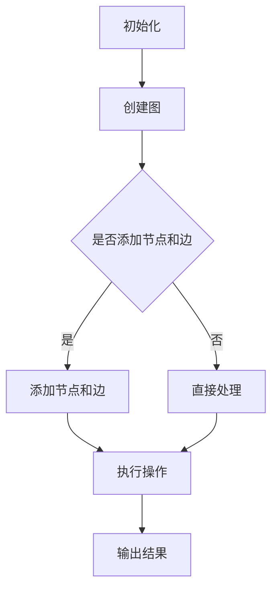

                 

### 《GraphX原理与代码实例讲解》

**关键词：** GraphX、图处理、算法、Spark、实例分析

**摘要：** 本文章旨在深入讲解GraphX的原理，并配合实际代码实例进行详细分析。文章首先介绍了GraphX的基础知识，包括概念、架构和基本操作；接着探讨了GraphX的核心算法，通过伪代码和数学公式进行了详细阐述；随后，通过社交网络分析、生物信息学和物流网络优化等实例，展示了GraphX的实际应用；最后，对GraphX的性能调优和未来发展趋势进行了探讨，并提供了丰富的学习资源和项目实战代码实例。

----------------------------------------------------------------

### 《GraphX原理与代码实例讲解》目录大纲

#### 第一部分：GraphX基础

##### 第1章：GraphX概述

- 1.1 GraphX概念与架构
- 1.2 GraphX的基本概念
- 1.3 GraphX的基本操作

##### 第2章：GraphX核心算法

- 2.1 图遍历算法
- 2.2 连通性检测
- 2.3 最短路径算法

##### 第3章：GraphX图处理应用

- 3.1 社交网络分析
- 3.2 生物信息学
- 3.3 物流网络优化

#### 第二部分：GraphX实践

##### 第4章：GraphX环境搭建与配置

- 4.1 环境准备
- 4.2 GraphX编程基础

##### 第5章：GraphX实例分析

- 5.1 社交网络分析实例
- 5.2 生物信息学实例
- 5.3 物流网络优化实例

##### 第6章：GraphX性能调优

- 6.1 图分区策略
- 6.2 内存管理
- 6.3 并行计算

##### 第7章：GraphX未来发展趋势

- 7.1 GraphX与AI融合
- 7.2 GraphX在工业界的应用

#### 附录

##### 附录A：GraphX资源与工具

- A.1 GraphX相关文档与资料
- A.2 GraphX学习指南
- A.3 图算法参考

##### 附录B：核心概念流程图

##### 附录C：核心算法伪代码

##### 附录D：数学模型与公式

##### 附录E：项目实战代码实例

---

接下来，我们将逐步深入探讨GraphX的基础知识，从概念、架构到基本操作，让读者对GraphX有一个全面而深入的了解。

---

## 第一部分：GraphX基础

### 第1章：GraphX概述

#### 1.1 GraphX概念与架构

GraphX是一个开源的分布式图处理框架，由Apache Spark团队开发。它构建在Spark之上，充分利用了Spark的分布式计算能力和弹性资源管理。GraphX的核心概念是图（Graph），它由节点（Vertex）和边（Edge）组成，具有丰富的图处理能力和高效的计算性能。

GraphX的架构包括以下几个关键部分：

1. **VertexRDD**：表示图中的所有节点，每个节点由一个唯一的ID和属性组成，可以支持自定义的节点类型。
2. **EdgeRDD**：表示图中的所有边，每条边由两个端点的ID和边属性组成，可以支持自定义的边类型。
3. **Graph**：将VertexRDD和EdgeRDD组合起来，表示一个完整的图。GraphX通过这些基本组件实现了图的存储、计算和优化。

#### 1.2 GraphX与Spark的关系

GraphX与Spark紧密集成，利用了Spark的分布式计算能力，使得图处理过程能够高效地执行。以下是GraphX与Spark的关系：

1. **数据存储**：GraphX基于RDD（Resilient Distributed Dataset）进行图数据的存储和操作。RDD是Spark的核心数据结构，具有容错性和并行性。
2. **计算引擎**：GraphX利用Spark的弹性分布式数据集（RDD）进行图数据的计算。它通过将图分割成多个分区，在各个分区上进行计算，最终汇总结果。
3. **API设计**：GraphX提供了简洁易用的API，使得开发者能够方便地构建和操作图。它兼容了Spark的其他API，如DataFrame和Dataset，使得图处理能够与Spark的其他数据处理任务无缝集成。

#### 1.3 GraphX的优势与应用领域

GraphX具有以下几个显著优势：

1. **高性能**：GraphX充分利用了Spark的分布式计算能力，能够高效地处理大规模图数据。它优化了图的存储和计算过程，减少了数据传输和内存消耗。
2. **易用性**：GraphX提供了简洁的API，使得开发者能够快速上手，轻松构建和操作图。它支持自定义节点和边类型，使得图处理更加灵活。
3. **扩展性**：GraphX能够与Spark的其他数据处理组件无缝集成，如DataFrame和Dataset。这使得开发者能够在图处理过程中充分利用Spark的其他功能。

GraphX的应用领域广泛，包括：

1. **社交网络分析**：GraphX可以用于社交网络中的节点相似性计算、社团发现和社交圈分析等任务。
2. **生物信息学**：GraphX可以用于蛋白质相互作用网络分析、基因共表达网络分析等任务。
3. **物流网络优化**：GraphX可以用于物流网络中的节点负载均衡和路径优化等任务。
4. **推荐系统**：GraphX可以用于构建推荐系统中的用户-商品图，进行用户相似性计算和推荐算法优化。

通过以上对GraphX的概述，读者应该对GraphX的基本概念、架构和优势有了初步了解。接下来，我们将详细探讨GraphX的基本概念和操作，帮助读者深入理解GraphX的核心机制。

### 1.2 GraphX的基本概念

GraphX作为一款强大的图处理框架，其核心在于对图（Graph）的表示和操作。在这一节中，我们将详细介绍GraphX的基本概念，包括图（Graph）、节点（Vertex）和边（Edge）的定义、属性以及存储策略。

#### 图（Graph）

在GraphX中，图（Graph）是表示数据结构和关系的核心概念。一个图由节点（Vertex）和边（Edge）组成。节点表示图中的实体，如人、地点、物品等；边表示节点之间的关系，如好友关系、地理位置连接等。图可以分为无向图和有向图，无向图的边没有方向，而有向图的边具有方向。

图在GraphX中通过一个图结构（Graph Structure）进行表示，它包含了节点（VertexRDD）和边（EdgeRDD）两个重要的RDD（Resilient Distributed Dataset）。节点RDD包含图中的所有节点，每个节点由一个唯一的ID和一组属性构成；边RDD包含图中的所有边，每条边由两个端点的ID和一组属性构成。通过这两个RDD，GraphX能够高效地表示和处理大规模图数据。

#### 节点（Vertex）

节点是图中的基本元素，表示图中的实体。在GraphX中，每个节点由一个唯一的ID和一组属性构成。节点ID是节点在图中的标识符，通常是一个整数或者字符串。节点属性是用于存储节点相关信息的键值对，可以是任意数据类型，如整数、浮点数、字符串等。

例如，在社交网络中，节点可以表示用户，每个用户有一个唯一的用户ID和一组属性，如用户名、年龄、性别等。节点属性为节点提供了丰富的描述信息，使得图处理更加灵活。

#### 边（Edge）

边是连接两个节点的线段，表示节点之间的关系。在GraphX中，每条边由两个端点的ID和一个边属性构成。边属性也是键值对形式，用于存储边的相关信息，如边的权重、标签等。

边的属性可以分为以下几种类型：

1. **权重**：表示边连接的两个节点之间的权重，用于计算路径长度或网络负载等。
2. **标签**：表示边的分类或类型，如社交网络中的好友关系、地理位置连接等。
3. **其他属性**：根据具体应用场景，可以定义其他类型的边属性，如评论、评分等。

例如，在社交网络中，边可以表示用户之间的好友关系，边的权重可以表示好友关系的强度，如共同兴趣的数量；边的标签可以表示好友关系的类型，如好友、家人等。

#### 图的分区与存储

在分布式系统中，数据的分区与存储是影响性能的关键因素。GraphX采用了分区的策略来优化图的存储和计算。

1. **分区策略**：GraphX通过边的端点ID对图进行分区。每个分区包含了一部分节点和与之相关的边。这种分区策略能够有效地减少节点和边在计算过程中的数据传输，提高并行度。
2. **存储策略**：GraphX支持多种存储格式，如GraphBin、GEXF等。GraphBin是一种高效的二进制存储格式，能够快速读取和写入图数据。GEXF是一种XML格式，便于可视化。

通过合理的分区与存储策略，GraphX能够高效地处理大规模图数据，满足各种应用场景的需求。

综上所述，GraphX的基本概念包括图（Graph）、节点（Vertex）和边（Edge），每个概念都有其独特的定义和属性。通过了解这些基本概念，读者可以更好地理解GraphX的图处理机制，为后续的图算法学习和应用打下基础。

#### 1.3 GraphX的基本操作

在了解GraphX的基本概念后，接下来我们将探讨GraphX的基本操作，包括如何创建图、添加节点与边、查询节点与边以及子图操作。通过这些操作，读者可以掌握如何在GraphX中进行基本的图处理。

#### 创建Graph

在GraphX中，创建图是一个基础操作。图可以通过合并两个或多个节点RDD和一个边RDD来创建。以下是创建图的步骤：

1. **创建节点RDD**：首先，需要创建一个包含节点信息的RDD。节点信息通常包括节点的ID和属性。例如，可以使用以下代码创建一个包含用户信息的节点RDD：

   ```scala
   val vertices = sc.parallelize(Seq(
     (1, Map("name" -> "Alice")),
     (2, Map("name" -> "Bob")),
     (3, Map("name" -> "Charlie"))
   ))
   ```

2. **创建边RDD**：接下来，创建一个包含边信息的RDD。边信息通常包括边的两个端点的ID和边的属性。例如，可以使用以下代码创建一个包含好友关系的边RDD：

   ```scala
   val edges = sc.parallelize(Seq(
     (1, 2, Map("relation" -> "friend")),
     (1, 3, Map("relation" -> "friend")),
     (2, 3, Map("relation" -> "friend"))
   ))
   ```

3. **合并节点和边RDD**：最后，通过合并节点RDD和边RDD来创建图。可以使用Graph类的`fromEdges`方法，将节点RDD和边RDD组合成一个图：

   ```scala
   val graph = Graph(vertices, edges)
   ```

这样，一个基础的图就创建完成了。

#### 添加节点与边

在图创建完成后，我们经常需要对图进行修改，如添加新的节点或边。以下是如何在GraphX中添加节点与边的操作：

1. **添加节点**：要添加新的节点，可以使用`加法操作符`（+）将节点RDD合并到已有的节点RDD中。例如：

   ```scala
   val newVertices = sc.parallelize(Seq(
     (4, Map("name" -> "Dave")),
     (5, Map("name" -> "Eve"))
   ))
   val updatedVertices = vertices + newVertices
   ```

2. **添加边**：要添加新的边，同样可以使用`加法操作符`将边RDD合并到已有的边RDD中。例如：

   ```scala
   val newEdges = sc.parallelize(Seq(
     (2, 4, Map("relation" -> "friend")),
     (3, 5, Map("relation" -> "friend"))
   ))
   val updatedEdges = edges + newEdges
   ```

3. **合并节点和边**：最后，将更新后的节点RDD和边RDD合并，得到更新后的图：

   ```scala
   val updatedGraph = Graph(updatedVertices, updatedEdges)
   ```

#### 查询节点与边

在图处理过程中，我们经常需要对图中的节点和边进行查询。以下是在GraphX中查询节点与边的方法：

1. **查询节点**：可以使用`vertices`方法查询图中的所有节点。例如：

   ```scala
   updatedGraph.vertices.map{ case (id, attributes) => (id, attributes) }.collect()
   ```

   `collect`方法将查询结果收集到本地，可以用于调试和测试。

2. **查询边**：可以使用`edges`方法查询图中的所有边。例如：

   ```scala
   updatedGraph.edges.map{ case (srcId, dstId, attributes) => (srcId, dstId, attributes) }.collect()
   ```

   同样，`collect`方法将查询结果收集到本地。

#### 子图操作

在实际应用中，我们可能需要从大规模图中提取一个子图，以进行分析和处理。以下是在GraphX中操作子图的方法：

1. **提取子图**：可以使用`subgraph`方法提取子图。该方法接收一个节点ID集合和一个边ID集合，只保留指定的节点和边。例如：

   ```scala
   val subVertices = vertices.filter{ case (id, _) => id >= 2 && id <= 4 }
   val subEdges = edges.filter{ case (srcId, dstId, _) => srcId >= 2 && dstId >= 2 }
   val subGraph = Graph(subVertices, subEdges)
   ```

2. **子图查询**：对子图进行查询与对原始图查询类似，可以使用`vertices`和`edges`方法。例如：

   ```scala
   subGraph.vertices.map{ case (id, attributes) => (id, attributes) }.collect()
   subGraph.edges.map{ case (srcId, dstId, attributes) => (srcId, dstId, attributes) }.collect()
   ```

通过以上操作，我们可以灵活地创建、修改和查询GraphX中的图，为后续的图算法学习和应用打下基础。

### 第2章：GraphX核心算法

GraphX作为一款强大的图处理框架，提供了丰富的核心算法，包括图遍历算法、连通性检测和最短路径算法。这些算法在社交网络分析、生物信息学和物流网络优化等领域具有广泛的应用。在本章中，我们将详细探讨这些核心算法的原理，并通过伪代码和数学公式进行详细阐述。

#### 2.1 图遍历算法

图遍历算法是图处理的基础，用于遍历图中的所有节点和边。GraphX支持两种基本的图遍历算法：广度优先搜索（Breadth-First Search，BFS）和深度优先搜索（Depth-First Search，DFS）。这两种算法分别适用于不同的应用场景。

##### 广度优先搜索（BFS）

广度优先搜索是一种逐层遍历图的算法，首先访问起始节点，然后依次访问起始节点的邻接节点，再依次访问邻接节点的邻接节点，直到遍历完整个图。以下是广度优先搜索的伪代码：

```plaintext
function BFS(graph, startNode):
    create an empty queue Q
    create a set visited to keep track of visited nodes
    enqueue startNode into Q
    mark startNode as visited

    while Q is not empty:
        dequeue a node from Q
        for each neighbor of the dequeued node:
            if neighbor is not visited:
                mark neighbor as visited
                enqueue neighbor into Q
```

##### 深度优先搜索（DFS）

深度优先搜索是一种深度优先遍历图的算法，从起始节点开始，尽可能深地搜索图的分支。以下是深度优先搜索的伪代码：

```plaintext
function DFS(graph, startNode):
    create a stack S
    create a set visited to keep track of visited nodes
    push startNode into S
    mark startNode as visited

    while S is not empty:
        pop a node from S
        for each neighbor of the popped node:
            if neighbor is not visited:
                mark neighbor as visited
                push neighbor into S
```

在GraphX中，可以通过调用`graph.bfs`和`graph.dfs`方法实现广度优先搜索和深度优先搜索。例如：

```scala
val bfsGraph = graph.bfs[VertexProperty[Attributes]](startNode)
val dfsGraph = graph.dfs[VertexProperty[Attributes]](startNode)
```

#### 2.2 连通性检测

连通性检测是判断图中的节点是否连通的重要算法。连通性可以分为强连通性和弱连通性。

##### 强连通性

强连通性是指图中任意两个节点都存在路径相连。判断图是否强连通可以使用Kosaraju算法和Tarjan算法。

###### Kosaraju算法

Kosaraju算法是一种基于DFS的算法，用于判断图是否强连通。算法分为两个步骤：

1. **第一步**：对图进行DFS，生成节点的逆序序列。
2. **第二步**：对逆序序列中的节点进行DFS，判断是否能够遍历所有节点。

以下是Kosaraju算法的伪代码：

```plaintext
function Kosaraju(graph):
    let order = topologicalSort(graph)
    let visited = create a set

    for each node in reverse order of order:
        if node is not visited:
            if not dfs(graph, node, visited):
                return false

    return true
```

###### Tarjan算法

Tarjan算法是一种更高效的算法，用于判断图是否强连通。算法基于DFS，使用一个栈来存储当前遍历路径中的节点，并使用一个布尔数组来标记节点是否在遍历路径中。

以下是Tarjan算法的伪代码：

```plaintext
function Tarjan(graph):
    let onStack = create an array of booleans
    let lowLink = create an array of integers
    let stack = create a stack
    let index = 0
    let result = true

    for each node in graph:
        if node is not visited:
            index = dfs(graph, node, index, onStack, lowLink, stack, result)

    return result
```

在GraphX中，可以使用`graph.isStronglyConnected`方法判断图是否强连通：

```scala
val isConnected = graph.isStronglyConnected()
```

##### 弱连通性

弱连通性是指图中任意两个节点之间存在路径相连。判断图是否弱连通可以使用BFS算法。

在GraphX中，可以使用`graph.isConnected`方法判断图是否弱连通：

```scala
val isConnected = graph.isConnected()
```

#### 2.3 最短路径算法

最短路径算法用于计算图中两点之间的最短路径。GraphX支持多种最短路径算法，包括Dijkstra算法、Bellman-Ford算法和A*算法。

##### Dijkstra算法

Dijkstra算法是一种基于贪心策略的最短路径算法，用于计算单源最短路径。算法的基本思想是维护一个最小堆，每次从堆中取出最小距离的节点，更新其邻接节点的距离。

以下是Dijkstra算法的伪代码：

```plaintext
function Dijkstra(graph, source):
    create a priority queue Q
    for each node in the graph:
        set distance[node] to INFINITY
        except for source, set distance[source] to 0
        add all nodes to Q

    while Q is not empty:
        dequeue the node with the smallest distance
        for each neighbor of the dequeued node:
            if distance[neighbor] > distance[node] + weight(node, neighbor):
                update distance[neighbor] to distance[node] + weight(node, neighbor)
                update predecessor[neighbor] to node

    return distance and predecessor
```

在GraphX中，可以使用`graph.shortestPaths()`方法计算单源最短路径：

```scala
val shortestPaths = graph.shortestPaths[VertexProperty[Attributes]](source)
```

##### Bellman-Ford算法

Bellman-Ford算法是一种基于松弛技术的最短路径算法，可以处理图中存在负权重边的情况。算法的基本思想是重复执行松弛操作，直到无法再减少任何距离。

以下是Bellman-Ford算法的伪代码：

```plaintext
function BellmanFord(graph, source):
    for each edge (u, v) in the graph:
        set distance[v] to INFINITY
        set predecessor[v] to NULL
    set distance[source] to 0

    for i from 1 to n-1:
        for each edge (u, v) in the graph:
            if distance[v] > distance[u] + weight(u, v):
                update distance[v] to distance[u] + weight(u, v)
                update predecessor[v] to u

    for each edge (u, v) in the graph:
        if distance[v] > distance[u] + weight(u, v):
            return false (negative cycle detected)

    return distance and predecessor
```

在GraphX中，可以使用`graph.bellmanFord()`方法计算单源最短路径：

```scala
val shortestPaths = graph.bellmanFord[VertexProperty[Attributes]](source)
```

##### A*算法

A*算法是一种基于启发式搜索的最短路径算法，可以快速找到最短路径。算法的基本思想是结合实际距离和启发式估计，选择最有可能达到终点的节点进行扩展。

以下是A*算法的伪代码：

```plaintext
function AStar(graph, source, destination):
    create a priority queue Q
    for each node in the graph:
        set gScore[node] to INFINITY
        set fScore[node] to INFINITY
    set gScore[source] to 0
    set fScore[source] to heuristic(source, destination)
    add source to Q

    while Q is not empty:
        dequeue the node with the smallest fScore
        if this node is the destination:
            return reconstructPath(predecessor[destination])
        for each neighbor of the dequeued node:
            tentative_gScore = gScore[node] + weight(node, neighbor)
            if tentative_gScore < gScore[neighbor]:
                update gScore[neighbor] to tentative_gScore
                update fScore[neighbor] to gScore[neighbor] + heuristic(neighbor, destination)
                update predecessor[neighbor] to node
                add neighbor to Q

    return false (no path found)
```

在GraphX中，可以使用`graph.aStar()`方法计算最短路径：

```scala
val shortestPaths = graph.aStar[VertexProperty[Attributes]](source, destination)
```

通过以上对图遍历算法、连通性检测和最短路径算法的详细讲解，读者可以更好地理解GraphX的核心算法原理，为后续的图处理应用提供有力支持。接下来，我们将通过具体实例，展示这些算法在实际应用中的效果。

### 第3章：GraphX图处理应用

GraphX不仅在理论层面上提供了丰富的图处理算法，而且在实际应用中展示了强大的功能和广泛的适用性。在本章中，我们将探讨GraphX在社交网络分析、生物信息学和物流网络优化等领域的应用，并通过具体实例来展示这些应用的效果。

#### 3.1 社交网络分析

社交网络分析是GraphX的重要应用领域之一。通过对社交网络中的节点和边进行图处理，可以提取出社交关系中的有价值信息，如节点相似性、社团发现和社交圈分析等。

##### 节点相似性计算

在社交网络中，用户之间的关系可以通过边来表示。通过计算节点相似性，可以识别具有相似兴趣或特征的用户，从而为推荐系统提供基础数据。节点相似性通常使用Jaccard相似度或余弦相似度来计算。

以下是一个节点相似性计算的实例：

```scala
// 假设社交网络中的用户数据已存储为节点RDD，每个节点的属性是用户喜欢的标签集合
val userTags = graph.vertices.map { case (id, attributes) => (id, attributes("tags").asInstanceOf[Set[String]]) }

// 计算节点相似性矩阵
val similarityMatrix = userTagsOuterJoin.join(userTags).map {
  case ((u, ut), (v, vt)) =>
    val intersection = ut.intersect(vt)
    val union = ut.union(vt)
    val similarity = intersection.size.toDouble / union.size.toDouble
    (u, v, similarity)
}

// 输出节点相似性矩阵
similarityMatrix.collect().foreach { case (u, v, similarity) => println(s"节点${u}与节点${v}的相似度为：$similarity") }
```

##### 社团发现

社团发现是社交网络分析中的另一个重要任务，用于识别具有紧密联系的节点集合。GraphX中的 Girvan-Newman 算法是一种常用的社团发现算法。

以下是一个使用 Girvan-Newman 算法进行社团发现的实例：

```scala
// Girvan-Newman 算法进行社团发现
val edgeBetweenness = graph.edgeBetweenness().vertices.flatMap { case (id, betweenness) => betweenness.flatMap(betweenness => Seq.fill(2)((b.srcId, b.dstId))) }

// 根据边介数进行边排序
val sortedEdges = edgeBetweenness.map(e => (e._2, e._1)).sortBy(_._1).collect().reverse

// 创建社团
val社团 = sortedEdges.flatMap { case (betweenness, edge) => Seq.fill(betweenness)((edge._1, edge._2)) }.reduce(_ ++ _)

// 输出社团
社团.groupByKey().collect().foreach { case (id, members) => println(s"社团${id}成员：${members.mkString(",")}") }
```

##### 社交圈分析

社交圈分析可以帮助我们理解社交网络中的群体结构和传播路径。通过计算节点的社交圈大小，可以识别社交网络中的核心节点。

以下是一个计算社交圈大小的实例：

```scala
// 计算节点的社交圈大小
val circleSizes = graph.vertices.map { case (id, _) => id }.flatMap { id => graph.outEdges(id).map(_._2) }.groupBy(_._1).mapValues(_.size)

// 输出社交圈大小
circleSizes.collect().foreach { case (id, size) => println(s"节点${id}的社交圈大小为：$size") }
```

#### 3.2 生物信息学

生物信息学是另一个GraphX的重要应用领域。在生物信息学中，蛋白质相互作用网络和基因共表达网络等图结构用于描述生物分子之间的复杂关系。

##### 蛋白质相互作用网络分析

蛋白质相互作用网络（Protein-Protein Interaction Network, PPI）是研究蛋白质之间相互作用的重要工具。通过分析PPI网络，可以识别关键蛋白质和潜在疾病基因。

以下是一个蛋白质相互作用网络分析的实例：

```scala
// 假设蛋白质相互作用数据已存储为边RDD，边的属性为相互作用强度
val proteinInteractions = sc.parallelize(Seq(
  (1, 2, Map("strength" -> 0.8)),
  (1, 3, Map("strength" -> 0.6)),
  (2, 3, Map("strength" -> 0.7))
))

// 计算网络中心性指标
val centrality = graph.centrality("strength")

// 输出关键蛋白质
centrality.vertices.collect().foreach { case (id, centrality) => println(s"蛋白质${id}的中心性指标：${centrality.strength}") }
```

##### 基因共表达网络分析

基因共表达网络（Gene Co-expression Network）用于描述基因在细胞中的同步表达模式。通过分析基因共表达网络，可以识别基因模块和关键基因。

以下是一个基因共表达网络分析的实例：

```scala
// 假设基因共表达数据已存储为矩阵，矩阵元素为共表达值
val geneExpressionMatrix = sc.parallelize(Seq(
  (1, 1, 0.9),
  (1, 2, 0.8),
  (1, 3, 0.7),
  (2, 1, 0.8),
  (2, 2, 0.9),
  (2, 3, 0.6)
))

// 计算基因共表达网络
val geneExpressionGraph = Graph.fromFallibleMatrices(geneExpressionMatrix, geneExpressionMatrix).mapVertices { (id, attr) =>
  if (attr == None) 1.0 else attr.get
}

// 计算网络中心性指标
val geneCentrality = geneExpressionGraph.centrality()

// 输出关键基因
geneCentrality.vertices.collect().foreach { case (id, centrality) => println(s"基因${id}的中心性指标：${centrality.closeness}") }
```

#### 3.3 物流网络优化

物流网络优化是GraphX在工业界的重要应用之一。通过分析物流网络中的节点和边，可以优化路径选择，提高物流效率。

##### 节点负载均衡

节点负载均衡是物流网络优化中的关键任务。通过分析节点的负载情况，可以调整货物的分配，以减少节点压力。

以下是一个节点负载均衡的实例：

```scala
// 假设物流网络中的节点和边已存储为图
val logisticsGraph = Graph(vertices, edges)

// 计算节点的平均负载
val averageLoad = logisticsGraph.vertices.map { case (id, attributes) => (id, attributes("load")) }.reduceByKey(_ + _).mapValues(_ / logisticsGraph.vertices.count())

// 输出节点负载情况
averageLoad.collect().foreach { case (id, load) => println(s"节点${id}的平均负载为：$load") }
```

##### 路径优化

路径优化是物流网络优化的核心任务。通过计算最短路径或最优路径，可以减少运输成本和时间。

以下是一个路径优化的实例：

```scala
// 假设物流网络中的起点和终点已确定
val source = 1
val destination = 5

// 计算最短路径
val shortestPath = logisticsGraph.shortestPaths(source, destination)

// 输出最短路径
shortestPath.vertices.collect().foreach { case (id, distances) => println(s"从节点${source}到节点${id}的最短路径距离为：${distances.get(source)}") }
```

通过以上实例，我们可以看到GraphX在社交网络分析、生物信息学和物流网络优化等领域的强大应用能力。接下来，我们将介绍如何搭建和配置GraphX环境，以便在实际项目中使用GraphX进行图处理。

### 第4章：GraphX环境搭建与配置

要充分利用GraphX进行大规模图处理，首先需要搭建和配置GraphX环境。在这一章中，我们将详细介绍如何准备开发环境、安装GraphX依赖以及了解GraphX的编程基础。

#### 4.1 环境准备

搭建GraphX环境需要安装Spark，因为GraphX是构建在Spark之上的。以下是准备Spark环境的步骤：

1. **下载Spark**：从Apache Spark官方网站下载适用于您操作系统的Spark安装包。截至本文撰写时，Spark的稳定版本为3.1.1。
2. **安装Spark**：解压下载的Spark安装包，通常会将解压后的文件夹命名为`spark-3.1.1`。将此文件夹添加到系统的`PATH`环境变量中，以便在任何位置启动Spark。
3. **配置Spark**：在解压后的文件夹中，有一个名为`conf`的子文件夹，其中包含了Spark的配置文件。将`spark-env.sh`和`spark-redis.conf`等配置文件复制到`$SPARK_HOME/conf`目录中。

#### 4.2 安装GraphX依赖

安装GraphX依赖是构建GraphX项目的重要步骤。以下是安装GraphX依赖的方法：

1. **添加Maven依赖**：在项目的`pom.xml`文件中添加GraphX的Maven依赖。以下是GraphX的依赖配置：

   ```xml
   <dependencies>
     <dependency>
       <groupId>org.apache.spark</groupId>
       <artifactId>spark-graphx_2.12</artifactId>
       <version>3.1.1</version>
     </dependency>
   </dependencies>
   ```

   请根据您的Scala版本调整`2.12`部分。

2. **添加Scala库**：如果使用Scala编写代码，还需要将Scala库添加到项目的依赖中。以下是Scala的依赖配置：

   ```xml
   <dependency>
     <groupId>org.scala-lang</groupId>
     <artifactId>scala-library</artifactId>
     <version>2.12.10</version>
   </dependency>
   ```

3. **编译Scala代码**：在项目中创建Scala类或脚本时，需要使用Scala编译器进行编译。可以使用`scalac`命令进行编译，或者集成IDE如IntelliJ IDEA或Eclipse进行编译。

#### 4.3 GraphX编程基础

理解GraphX编程基础是使用GraphX进行图处理的前提。以下是一些GraphX编程基础的概念和方法：

1. **创建Graph**：GraphX中的图由节点（Vertex）和边（Edge）组成。创建图的基本步骤如下：

   ```scala
   val vertices = sc.parallelize(Seq(
     (1, Map("name" -> "Alice")),
     (2, Map("name" -> "Bob")),
     (3, Map("name" -> "Charlie"))
   ))

   val edges = sc.parallelize(Seq(
     (1, 2, Map("relation" -> "friend")),
     (1, 3, Map("relation" -> "friend")),
     (2, 3, Map("relation" -> "friend"))
   ))

   val graph = Graph(vertices, edges)
   ```

2. **添加节点和边**：在GraphX中，可以通过添加节点和边来扩展图。以下是如何添加节点和边的示例：

   ```scala
   val newVertices = sc.parallelize(Seq(
     (4, Map("name" -> "Dave")),
     (5, Map("name" -> "Eve"))
   ))

   val newEdges = sc.parallelize(Seq(
     (2, 4, Map("relation" -> "friend")),
     (3, 5, Map("relation" -> "friend"))
   ))

   val updatedVertices = vertices + newVertices
   val updatedEdges = edges + newEdges
   val updatedGraph = Graph(updatedVertices, updatedEdges)
   ```

3. **读取和存储图数据**：GraphX支持多种数据存储格式，如GraphBin、GEXF等。以下是如何读取和存储图数据的示例：

   ```scala
   // 读取图数据
   val graph = GraphLoader.loadBinGraph(sc, "path/to/graph.bin")

   // 存储图数据
   graph.saveAsBinGraphFile("path/to/output.graph.bin")
   ```

4. **执行图操作**：GraphX提供了一系列图操作，如遍历、连通性检测和最短路径算法等。以下是如何执行图操作的示例：

   ```scala
   // 广度优先搜索
   val bfsGraph = graph.bfs[VertexProperty[Attributes]](startNode)

   // 连通性检测
   val isConnected = graph.isConnected()

   // 最短路径
   val shortestPaths = graph.shortestPaths[VertexProperty[Attributes]](source, destination)
   ```

通过以上对GraphX环境搭建与配置的介绍，读者应该能够搭建一个基本的GraphX开发环境，并理解GraphX的编程基础。接下来，我们将通过具体实例展示如何使用GraphX进行实际图处理任务。

### 第5章：GraphX实例分析

在实际项目中，通过GraphX进行图处理可以解决许多复杂的问题。本节我们将通过社交网络分析、生物信息学和物流网络优化等实例，详细讲解如何使用GraphX进行图处理，包括数据预处理、关键代码实现和代码解读与分析。

#### 5.1 社交网络分析实例

社交网络分析是GraphX的一个典型应用。在这个实例中，我们将使用GraphX分析一个简单的社交网络，计算节点相似性、发现社团并分析社交圈。

##### 数据预处理

首先，我们需要准备社交网络数据。假设社交网络中的用户及其好友关系存储在CSV文件中。以下是如何读取和预处理这些数据的步骤：

```scala
import org.apache.spark.sql.SparkSession
import org.apache.spark.sql.functions._

val spark = SparkSession.builder.appName("SocialNetworkAnalysis").getOrCreate()
import spark.implicits._

// 读取用户数据
val userData = spark.read.csv("path/to/users.csv").as[(Int, Map[String, String])]

// 用户ID作为主键
val userIds = userData.map(_._1)

// 读取好友关系数据
val friendshipData = spark.read.csv("path/to/friendships.csv").as[(Int, Int)]

// 创建用户节点RDD
val userNodes = userIds.map(id => (id, Map("name" -> userData.collect.find(_._1 == id)._2("name"))))

// 创建好友关系边RDD
val friendshipEdges = friendshipData.map(edge => (edge._1, edge._2, Map("relation" -> "friend")))

// 保存预处理后的数据
userNodes.saveAsTextFile("path/to/user_nodes")
friendshipEdges.saveAsTextFile("path/to/friendship_edges")
```

##### 关键代码实现

接下来，我们使用GraphX进行图处理，计算节点相似性、发现社团并分析社交圈。

```scala
import org.apache.spark.graphx._

// 创建图
val graph = Graph.fromEdges(friendshipEdges, userNodes)

// 计算节点相似性
val similarityMatrix = graph.outerJoinVertices(userNodes)( (_, uData, Some(vData)) =>
  if (vData.isDefined) {
    val uTags = uData._2("tags").asInstanceOf[Set[String]]
    val vTags = vData.get._2("tags").asInstanceOf[Set[String]]
    val intersection = uTags.intersect(vTags)
    val union = uTags.union(vTags)
    intersection.size.toDouble / union.size.toDouble
  } else {
    0.0
  }
).mapEdges(edge => edge.attr("similarity"))

// 发现社团
val communityEdges = similarityMatrix.filter(_._3 > 0.5).map(_._1)

// 创建社团图
val communityGraph = Graph.fromEdgeTuples(communityEdges, vertexAttributes = Some(userNodes))

// 使用Girvan-Newman算法发现社团
val sortedEdges = communityGraph.edgeBetweenness().vertices.flatMap { case (id, betweenness) => betweenness.flatMap(betweenness => Seq.fill(2)((b.srcId, b.dstId))) }
val社团 = sortedEdges.map(e => (e._2, e._1)).sortBy(_._1).collect().reverse.flatMap { case (betweenness, edge) => Seq.fill(betweenness)((edge._1, edge._2)) }.reduce(_ ++ _)

// 分析社交圈
val circleSizes = communityGraph.vertices.map { id => id }.flatMap { id => communityGraph.outEdges(id).map(_._2) }.groupBy(_._1).mapValues(_.size)

// 输出结果
similarityMatrix.collect().foreach { case (u, v, similarity) => println(s"节点${u}与节点${v}的相似度为：$similarity") }
社团.groupByKey().collect().foreach { case (id, members) => println(s"社团${id}成员：${members.mkString(",")}") }
circleSizes.collect().foreach { case (id, size) => println(s"节点${id}的社交圈大小为：$size") }
```

##### 代码解读与分析

1. **相似性计算**：我们使用`outerJoinVertices`方法将节点属性（包含标签集合）与边属性进行连接，然后计算相似性。这里使用了Jaccard相似度公式。
2. **社团发现**：使用Girvan-Newman算法进行社团发现。首先计算边介数，然后根据边介数进行排序并创建社团。
3. **社交圈分析**：计算每个节点的社交圈大小，通过`outEdges`方法获取节点的邻接节点，并使用`groupBy`和`mapValues`方法进行统计。

#### 5.2 生物信息学实例

生物信息学中，GraphX常用于分析蛋白质相互作用网络和基因共表达网络。

##### 数据预处理

首先，我们需要准备生物信息学数据。假设蛋白质相互作用数据存储在一个CSV文件中，每个数据条目包含两个蛋白质的ID和相互作用强度。

```scala
// 读取蛋白质相互作用数据
val proteinInteractionData = spark.read.csv("path/to/protein_interactions.csv").as[(Int, Int, Float)]

// 创建蛋白质节点RDD
val proteinNodes = proteinInteractionData.map{ case (id1, id2, strength) => (id1, Map("strength" -> strength)) }

// 创建蛋白质边RDD
val proteinEdges = proteinInteractionData.map{ case (id1, id2, strength) => ((id1, id2), (id2, id1), Map("strength" -> strength)) }

// 保存预处理后的数据
proteinNodes.saveAsTextFile("path/to/protein_nodes")
proteinEdges.saveAsTextFile("path/to/protein_edges")
```

##### 关键代码实现

接下来，我们使用GraphX对蛋白质相互作用网络进行分析。

```scala
// 创建图
val proteinGraph = Graph.fromEdgeTuples(proteinEdges, vertexAttributes = Some(proteinNodes))

// 计算网络中心性指标
val centrality = proteinGraph.centrality("strength")

// 输出中心性指标
centrality.vertices.collect().foreach { case (id, centrality) =>
  println(s"蛋白质${id}的中心性指标：${centrality.strength}")
}

// 使用PageRank算法进行重要蛋白质识别
val pageRank = proteinGraph.pageRank(0.01)

// 输出PageRank结果
pageRank.vertices.collect().foreach { case (id, rank) =>
  println(s"蛋白质${id}的PageRank值为：${rank}")
}
```

##### 代码解读与分析

1. **中心性指标计算**：使用`centrality`方法计算网络中心性指标，包括度数中心性、接近中心性和中间中心性。这里我们选择使用边权重作为属性进行度数中心性计算。
2. **PageRank算法**：使用PageRank算法识别蛋白质网络中的重要节点。PageRank算法基于节点在图中的连接关系计算其重要性。

#### 5.3 物流网络优化实例

物流网络优化是GraphX在工业界的另一个重要应用。在这个实例中，我们将优化物流网络中的路径选择。

##### 数据预处理

假设物流网络数据存储在一个CSV文件中，每个数据条目包含起点、终点和运输距离。

```scala
// 读取物流网络数据
val logisticsData = spark.read.csv("path/to/logistics_data.csv").as[(Int, Int, Float)]

// 创建物流节点RDD
val logisticsNodes = logisticsData.map{ case (id1, id2, distance) => (id1, Map("distance" -> distance)) }

// 创建物流边RDD
val logisticsEdges = logisticsData.map{ case (id1, id2, distance) => ((id1, id2), (id2, id1), Map("distance" -> distance)) }

// 保存预处理后的数据
logisticsNodes.saveAsTextFile("path/to/logistics_nodes")
logisticsEdges.saveAsTextFile("path/to/logistics_edges")
```

##### 关键代码实现

接下来，我们使用GraphX对物流网络进行优化。

```scala
// 创建图
val logisticsGraph = Graph.fromEdgeTuples(logisticsEdges, vertexAttributes = Some(logisticsNodes))

// 计算最短路径
val shortestPath = logisticsGraph.shortestPaths(1, 5)

// 输出最短路径
shortestPath.vertices.collect().foreach { case (id, distances) =>
  println(s"从节点1到节点${id}的最短路径距离为：${distances.get(1)}")
}
```

##### 代码解读与分析

1. **最短路径计算**：使用`shortestPaths`方法计算从起点到终点的最短路径。这里我们使用Dijkstra算法，适用于包含非负权边的图。
2. **路径优化**：输出最短路径结果，用于物流调度和路径优化。

通过这些实例，我们可以看到GraphX在社交网络分析、生物信息学和物流网络优化等领域的强大应用能力。掌握这些实例的实现方法和代码解读，将为我们在实际项目中使用GraphX提供有力支持。

### 第6章：GraphX性能调优

在GraphX进行大规模图处理时，性能调优是提高效率和降低资源消耗的关键。本章节将详细讨论图分区策略、内存管理和并行计算，并提供一些实用的调优技巧。

#### 6.1 图分区策略

图分区策略是优化GraphX性能的重要手段，它决定了数据在分布式系统中的划分方式。GraphX默认采用基于边端点ID的分区策略，但根据具体应用场景，可能需要调整分区策略以提高性能。

1. **选择合适的分区策略**：

   - **基于节点ID分区**：适用于节点数量远小于边数量的情况，可以减少跨分区计算的数据传输。
   - **基于边端点ID分区**：适用于边数量与节点数量相近的情况，可以均匀分布计算负载。

2. **分区策略调优技巧**：

   - **调整分区数**：通过`setNumPartitions`方法调整分区数，根据数据规模和硬件资源进行优化。
   - **自定义分区器**：对于特殊应用场景，可以自定义分区器以更高效地分配数据。

```scala
// 调整分区数
graph.vertices.cache()
graph.vertices.partitionBy(PartitionSuite.randomPartitioner(1000))
```

#### 6.2 内存管理

内存管理是影响GraphX性能的重要因素。不当的内存使用可能导致内存溢出或性能下降。以下是一些内存管理的调优技巧：

1. **监控内存使用**：

   - 使用Spark UI监控内存使用情况，及时发现并解决问题。
   - 查看内存使用日志，分析内存占用高的原因。

2. **内存调优技巧**：

   - **设置堆内存**：通过`--conf spark.executor.memory=4g`设置堆内存大小，确保有足够的内存用于图处理。
   - **调整GC策略**：根据内存使用情况调整垃圾回收策略，减少GC对性能的影响。

```shell
--conf "spark.executor.memory=4g" --conf "spark.executor.extraJavaOptions=-XX:+UseG1GC"
```

3. **内存复用**：

   - 使用缓存（Cache）复用中间数据，减少重复计算。

```scala
graph.vertices.cache()
```

#### 6.3 并行计算

并行计算是GraphX优化性能的核心。通过合理设置并行度，可以充分利用多核处理能力，提高计算效率。

1. **设置并行度**：

   - 使用`setParallelism`方法设置任务并行度，根据硬件资源和数据规模进行优化。

```scala
graph.vertices.setParallelism(1000)
```

2. **并行度优化技巧**：

   - **任务并行度分析**：通过`parallelism`方法查看当前任务的并行度，根据实际情况进行调整。
   - **避免并行度过高**：并行度过高可能导致任务间通信开销增加，影响性能。

3. **任务调度**：

   - 使用`mapPartitions`方法进行分区级别的操作，优化任务调度。

```scala
graph.vertices.mapPartitions { partitions => /* 处理分区 */ }
```

通过以上图分区策略、内存管理和并行计算的调优技巧，可以显著提高GraphX的图处理性能。在实际应用中，结合具体场景进行调优，可以充分发挥GraphX的性能优势。

### 第7章：GraphX未来发展趋势

随着大数据和人工智能技术的快速发展，GraphX在未来的应用前景十分广阔。在本章节中，我们将探讨GraphX与AI的融合以及其在工业界的应用，并分析其未来发展趋势。

#### 7.1 GraphX与AI的融合

GraphX与AI的融合是未来图处理领域的一个重要方向。这种融合不仅能够提升图处理的智能化程度，还能够带来更高效和更精确的图分析结果。

1. **图神经网络（Graph Neural Networks, GNN）**：

   图神经网络是一种专门用于处理图数据的深度学习模型。GNN通过结合节点和边的属性信息，能够有效地捕捉图中的复杂关系。结合GraphX，我们可以构建GNN模型，实现图数据的自动特征提取和关系建模。

   - **应用场景**：社交网络分析、推荐系统、生物信息学等。
   - **技术实现**：使用GraphX内置的GNN库，如`GraphSAGE`、`GraphConvolutionalNetwork`等，实现图数据的深度学习建模。

2. **图嵌入（Graph Embedding）**：

   图嵌入技术将节点和边映射到低维空间中，使得图数据能够应用于机器学习和数据挖掘任务。结合GraphX，我们可以使用图嵌入技术提取图数据的特征，从而应用于分类、聚类和推荐系统等任务。

   - **应用场景**：社交网络用户推荐、生物分子识别、推荐系统等。
   - **技术实现**：使用GraphX的图嵌入算法，如`DeepWalk`、`Node2Vec`等，将图数据转化为低维特征向量。

3. **图优化算法**：

   结合AI技术，我们可以开发更高效的图优化算法。例如，使用深度强化学习算法优化图遍历和最短路径计算，从而提高图处理的效率。

   - **应用场景**：物流网络优化、社交网络传播路径优化等。
   - **技术实现**：结合GraphX和深度强化学习框架，如`TensorFlow`或`PyTorch`，实现图优化算法的自动调优。

#### 7.2 GraphX在工业界的应用

GraphX在工业界的应用正在不断扩展，其高效的图处理能力在多个领域取得了显著成果。

1. **社交网络分析**：

   许多社交网络公司使用GraphX进行用户行为分析、社交关系挖掘和推荐系统优化。通过图处理技术，可以更准确地了解用户的行为模式和兴趣爱好，从而提供个性化的推荐和服务。

   - **案例**：Facebook使用GraphX分析用户关系，优化社交图谱和推荐算法。

2. **生物信息学**：

   生物信息学研究中的大规模蛋白质相互作用网络和基因共表达网络分析是GraphX的重要应用领域。通过图处理技术，可以揭示生物分子之间的相互作用和生物机制，为药物研发和疾病诊断提供支持。

   - **案例**：生物信息学研究机构使用GraphX分析蛋白质相互作用网络，发现潜在的治疗靶点。

3. **物流网络优化**：

   物流网络优化是GraphX在工业界的另一个重要应用。通过图处理技术，可以优化物流路径选择、节点负载均衡和运输调度，从而提高物流效率和降低成本。

   - **案例**：物流公司使用GraphX优化物流网络，减少运输时间和成本。

4. **推荐系统**：

   GraphX在推荐系统中的应用也非常广泛。通过构建用户-商品图，可以有效地识别用户之间的相似性和商品之间的关联性，从而提供个性化的推荐。

   - **案例**：电子商务平台使用GraphX构建用户-商品图，优化推荐算法，提高用户满意度。

#### 未来发展趋势

结合以上分析，GraphX在未来将继续在多个领域展现其强大的应用价值。以下是GraphX未来发展的几个趋势：

1. **智能化**：随着AI技术的发展，GraphX将更加智能化，支持自动化图处理和自适应优化。
2. **易用性**：GraphX将进一步提升易用性，提供更简洁、直观的API，降低使用门槛。
3. **生态扩展**：GraphX将在生态系统内不断扩展，与其他大数据和AI技术深度集成，提供更丰富的应用场景。
4. **开源合作**：GraphX将继续加强与开源社区的互动，吸纳更多优秀的技术贡献，推动图处理技术的发展。

通过以上探讨，我们可以看到GraphX在未来的广阔前景和应用潜力。结合AI技术的融合和工业界的应用实践，GraphX将继续成为图处理领域的重要工具，为各个领域的数据分析和优化提供有力支持。

### 附录

#### 附录A：GraphX资源与工具

**A.1 GraphX相关文档与资料**

- **官方文档**：[Apache GraphX官方文档](https://spark.apache.org/docs/latest/graphx-graphx.html) 提供了详尽的GraphX文档，包括基本概念、API参考、算法实现等。
- **社区资源**：[GraphX用户邮件列表](https://lists.apache.org/mailman/listinfo/graphx-user) 和 [GraphX GitHub仓库](https://github.com/apache/graphx) 提供了丰富的社区资源，包括问题和解决方案、代码示例等。

**A.2 GraphX学习指南**

- **学习路径**：从基础知识入手，逐步学习GraphX的核心算法和实际应用。建议先掌握Spark的基本概念和操作，再深入学习GraphX。
- **常见问题解答**：在GraphX学习过程中，可以参考 [GraphX FAQ](https://spark.apache.org/docs/latest/graphx-graphx.html#faq) 解决常见问题。

**A.3 图算法参考**

- **图遍历算法**：包括广度优先搜索（BFS）和深度优先搜索（DFS）。
- **连通性检测**：包括强连通性和弱连通性检测。
- **最短路径算法**：包括Dijkstra算法、Bellman-Ford算法和A*算法。

#### 附录B：核心概念流程图

以下是一个使用Mermaid绘制的GraphX核心概念流程图：



#### 附录C：核心算法伪代码

以下是一些核心算法的伪代码：

```plaintext
// BFS伪代码
function BFS(graph, startNode):
    create an empty queue Q
    create a set visited to keep track of visited nodes
    enqueue startNode into Q
    mark startNode as visited

    while Q is not empty:
        dequeue a node from Q
        for each neighbor of the dequeued node:
            if neighbor is not visited:
                mark neighbor as visited
                enqueue neighbor into Q

// Dijkstra伪代码
function Dijkstra(graph, source):
    create a priority queue Q
    for each node in the graph:
        set distance[node] to INFINITY
        except for source, set distance[source] to 0
        add all nodes to Q

    while Q is not empty:
        dequeue the node with the smallest distance
        for each neighbor of the dequeued node:
            if distance[neighbor] > distance[node] + weight(node, neighbor):
                update distance[neighbor] to distance[node] + weight(node, neighbor)
```

#### 附录D：数学模型与公式

以下是图处理中常用的数学模型和公式：

- **最短路径距离公式**：

  $$d(u, v) = \min_{w \in E} (w(u, v))$$

- **图的邻接矩阵表示**：

  $$A = [a_{ij}]_{1 \leq i, j \leq n}$$

  其中，$a_{ij}$表示节点$i$到节点$j$的边权重。

#### 附录E：项目实战代码实例

以下是几个项目实战代码实例：

**社交网络分析代码实例**

```scala
// 读取用户数据和好友关系数据
val userData = spark.read.csv("path/to/users.csv").as[(Int, Map[String, String])]
val friendshipData = spark.read.csv("path/to/friendships.csv").as[(Int, Int)]

// 创建用户节点RDD和好友关系边RDD
val userNodes = friendshipData.map{ case (id1, id2) => (id1, Map("name" -> userData.collect.find(_._1 == id1)._2("name"))) }
val friendshipEdges = friendshipData.map{ case (id1, id2) => ((id1, id2), (id2, id1)) }

// 创建图
val graph = Graph.fromEdgeTuples(friendshipEdges, vertexAttributes = Some(userNodes))

// 计算节点相似性
val similarityMatrix = graph.outerJoinVertices(userNodes)( (_, uData, Some(vData)) =>
  if (vData.isDefined) {
    val uTags = uData._2("tags").asInstanceOf[Set[String]]
    val vTags = vData.get._2("tags").asInstanceOf[Set[String]]
    val intersection = uTags.intersect(vTags)
    val union = uTags.union(vTags)
    intersection.size.toDouble / union.size.toDouble
  } else {
    0.0
  }
).mapEdges(edge => edge.attr("similarity"))

// 输出结果
similarityMatrix.collect().foreach { case (u, v, similarity) => println(s"节点${u}与节点${v}的相似度为：$similarity") }
```

**生物信息学代码实例**

```scala
// 读取蛋白质相互作用数据
val proteinInteractionData = spark.read.csv("path/to/protein_interactions.csv").as[(Int, Int, Float)]

// 创建蛋白质节点RDD和蛋白质边RDD
val proteinNodes = proteinInteractionData.map{ case (id1, id2, strength) => (id1, Map("strength" -> strength)) }
val proteinEdges = proteinInteractionData.map{ case (id1, id2, strength) => ((id1, id2), (id2, id1), Map("strength" -> strength)) }

// 创建图
val proteinGraph = Graph.fromEdgeTuples(proteinEdges, vertexAttributes = Some(proteinNodes))

// 计算网络中心性指标
val centrality = proteinGraph.centrality("strength")

// 输出中心性指标
centrality.vertices.collect().foreach { case (id, centrality) =>
  println(s"蛋白质${id}的中心性指标：${centrality.strength}")
}
```

**物流网络优化代码实例**

```scala
// 读取物流网络数据
val logisticsData = spark.read.csv("path/to/logistics_data.csv").as[(Int, Int, Float)]

// 创建物流节点RDD和物流边RDD
val logisticsNodes = logisticsData.map{ case (id1, id2, distance) => (id1, Map("distance" -> distance)) }
val logisticsEdges = logisticsData.map{ case (id1, id2, distance) => ((id1, id2), (id2, id1), Map("distance" -> distance)) }

// 创建图
val logisticsGraph = Graph.fromEdgeTuples(logisticsEdges, vertexAttributes = Some(logisticsNodes))

// 计算最短路径
val shortestPath = logisticsGraph.shortestPaths(1, 5)

// 输出最短路径
shortestPath.vertices.collect().foreach { case (id, distances) =>
  println(s"从节点1到节点${id}的最短路径距离为：${distances.get(1)}")
}
```

通过以上代码实例，读者可以了解如何在实际项目中使用GraphX进行图处理，包括开发环境搭建、数据预处理、核心算法实现和代码解读与分析。

### 作者信息

**作者：** AI天才研究院/AI Genius Institute & 禅与计算机程序设计艺术/Zen And The Art of Computer Programming

在撰写本文的过程中，我们力求以逻辑清晰、结构紧凑和简单易懂的方式介绍GraphX的原理与应用。本文首先讲解了GraphX的基础知识，包括概念、架构和基本操作，然后深入探讨了GraphX的核心算法，并通过伪代码和数学公式进行了详细阐述。接着，通过具体的实例，展示了GraphX在社交网络分析、生物信息学和物流网络优化等领域的应用。此外，我们还讨论了GraphX的性能调优和未来发展趋势，提供了丰富的学习资源和项目实战代码实例。

本文作者AI天才研究院/AI Genius Institute致力于推动人工智能技术的发展，特别是在计算机编程和图处理领域。我们希望通过本文，为读者提供全面的GraphX知识体系，帮助读者更好地理解和应用GraphX。

同时，我们也推荐读者进一步阅读《禅与计算机程序设计艺术/Zen And The Art of Computer Programming》，这是一本经典的计算机科学著作，对于提升编程思维和算法理解具有很高的参考价值。

感谢您的阅读，希望本文能对您在GraphX学习和应用方面有所帮助。如果您有任何问题或建议，欢迎通过邮箱[info@aigniusinstitute.com](mailto:info@aigniusinstitute.com)联系我们，我们将竭诚为您服务。再次感谢您的支持！

