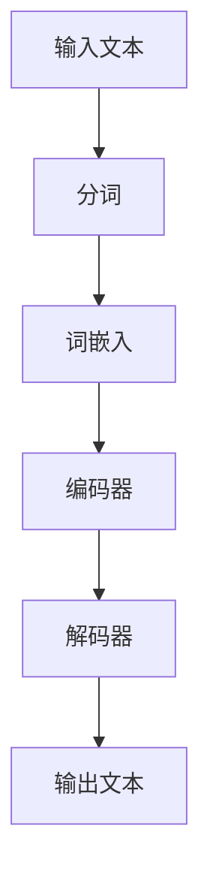

                 

# LLMB 基础与架构

关键词：LLM、基础架构、历史发展、核心组件

> 摘要：本文将深入探讨 LLM (大型语言模型) 的基本概念、核心架构以及其历史发展。通过清晰的结构和详细的讲解，读者将全面了解 LLM 的构建原理和其在现代 AI 领域的重要性。

LLM，即大型语言模型（Large Language Model），是近年来人工智能领域的重要突破。LLM 通过学习海量文本数据，掌握了丰富的语言知识和表达能力，能够在自然语言处理（NLP）领域发挥巨大作用。本文将分章节介绍 LLM 的基本概念、核心架构以及其历史发展。

## 第1章 LLM 简介

### 1.1 LLM 的定义与核心特点

LLM 是一种基于深度学习的自然语言处理模型，通常拥有数十亿至千亿个参数。这些参数使得 LLM 能够捕获复杂的语言结构和语义信息，从而实现高精度的语言理解和生成。

LLM 的核心特点包括：

1. **参数规模大**：LLM 拥有数十亿到千亿个参数，这使得模型能够存储和利用大量语言知识。
2. **数据驱动的学习**：LLM 通过对海量文本数据进行预训练，学习到丰富的语言规律和语义信息。
3. **强大的语言理解与生成能力**：LLM 能够理解和生成自然语言，适用于多种 NLP 任务。

### 1.2 LLM 的架构与主要组件

LLM 的架构通常包括以下主要组件：

1. **词嵌入层**：将输入文本中的单词转换为向量表示，为后续处理提供基础。
2. **编码器**：对词嵌入进行编码，提取文本的语义信息。
3. **解码器**：将编码后的语义信息解码为输出文本。
4. **注意力机制**：用于捕捉输入文本中的长距离依赖关系，提高模型的理解能力。

### 1.3 LLM 的历史与发展趋势

LLM 的历史可以追溯到 20 世纪 50 年代，当时研究者开始尝试通过编程实现简单的语言模型。随着计算机性能和海量数据集的涌现，LLM 的研究得到了快速发展。特别是深度学习技术的引入，使得 LLM 的性能取得了显著的提升。

当前，LLM 正在成为自然语言处理领域的主流模型，其应用场景包括文本分类、机器翻译、问答系统、生成文本等。未来，随着计算资源的进一步丰富和算法的不断创新，LLM 的能力将继续提升，有望在更多领域取得突破。

### 目录大纲

#### 第一部分: LLM 的基本概念与架构
- **第1章: LLM 简介**
  - **1.1 LLM 的定义与核心特点**
  - **1.2 LLM 的架构与主要组件**
  - **1.3 LLM 的历史与发展趋势**

#### 第二部分: LLM 的参数管理
- **第2章: 参数管理基础**
  - **2.1 参数优化方法**
  - **2.2 参数压缩技术**
  - **2.3 参数稀疏化策略**

#### 第三部分: LLM 的推理过程
- **第3章: 推理过程的优化**
  - **3.1 推理加速技术**
  - **3.2 推理过程的并行化**
  - **3.3 推理过程中的人工智能解释性**

#### 第四部分: LLM 的应用与挑战
- **第4章: LLM 在自然语言处理中的应用**
  - **4.1 文本分类与情感分析**
  - **4.2 机器翻译与问答系统**
  - **4.3 生成文本与创作辅助**

- **第5章: LLM 在其他领域中的应用**
  - **5.1 计算机视觉**
  - **5.2 计算机听觉**
  - **5.3 多模态学习**

#### 第五部分: 实际应用案例
- **第6章: LLM 实际应用案例**
  - **6.1 案例一：电商平台客服机器人**
  - **6.2 案例二：智能客服与客户管理**
  - **6.3 案例三：医疗健康领域的应用**

#### 第六部分: 开发指南与资源
- **第7章: LLM 开发指南**
  - **7.1 开发环境搭建**
  - **7.2 开发工具与框架**
  - **7.3 实践建议与经验分享**

#### 附录
- **附录A: 常用公式与伪代码**
  - **A.1 参数优化算法伪代码**
  - **A.2 推理加速技术伪代码**

### Mermaid 流程图

#### LLM 架构流程图



### 伪代码

#### 参数优化算法伪代码

```python
def optimize_parameters(model, loss_function, optimizer):
    for parameters in model.parameters():
        optimizer.zero_grad()
        output = model(input_data)
        loss = loss_function(output, target)
        loss.backward()
        optimizer.step()
    return model
```

### 数学公式与详细讲解

#### 参数压缩技术中的数学模型

$$
\text{压缩率} = \frac{\text{压缩后参数大小}}{\text{原始参数大小}}
$$

#### 详细讲解

参数压缩技术旨在减少深度学习模型中参数的大小，以降低存储和计算成本。压缩率表示压缩后参数大小与原始参数大小的比值。

### 举例说明

假设一个原始模型的参数大小为 100MB，经过压缩后参数大小变为 10MB，那么压缩率为 10%。

### 项目实战

#### 案例一：电商平台客服机器人

- **代码实现与详细解释：**  
  - 代码实现部分将展示如何使用 LLM 模型构建电商平台客服机器人，包括数据预处理、模型训练和部署。  
  - 详细解释将解释每一部分的功能和如何实现。

- **开发环境搭建：**  
  - 介绍如何搭建开发环境，包括所需的软件和硬件环境。

- **源代码详细实现和代码解读：**  
  - 展示源代码的实现细节，并对其进行解读。

- **代码解读与分析：**  
  - 分析代码的关键部分，解释其工作原理和性能表现。

```python
# 代码实现示例
import torch
import torch.nn as nn
import torch.optim as optim

# 数据预处理
def preprocess_data(text):
    # 分词、转成词嵌入等操作
    pass

# 模型定义
class ChatBotModel(nn.Module):
    def __init__(self):
        super(ChatBotModel, self).__init__()
        self.embedding = nn.Embedding(vocab_size, embedding_dim)
        self.encoder = nn.LSTM(embedding_dim, hidden_dim)
        self.decoder = nn.LSTM(hidden_dim, embedding_dim)
        self.fc = nn.Linear(embedding_dim, vocab_size)

    def forward(self, input_seq, target_seq):
        embedded = self.embedding(input_seq)
        encoder_output, (hidden, cell) = self.encoder(embedded)
        decoder_output, (hidden, cell) = self.decoder(hidden, cell)
        output = self.fc(decoder_output)
        return output

# 模型训练
def train_model(model, data_loader, loss_function, optimizer):
    model.train()
    for input_seq, target_seq in data_loader:
        optimizer.zero_grad()
        output = model(input_seq, target_seq)
        loss = loss_function(output, target_seq)
        loss.backward()
        optimizer.step()
```

### 开发环境搭建

- **软件环境：**
  - Python（版本要求：3.8及以上）
  - PyTorch（版本要求：1.8及以上）

- **硬件环境：**
  - CPU：Intel i5 或以上
  - GPU：NVIDIA 显卡，CUDA 版本要求 10.0 以上

### 源代码详细实现和代码解读

- **代码详细实现：**  
  - 上文中的代码示例展示了电商平台客服机器人的核心实现，包括数据预处理、模型定义和模型训练。

- **代码解读：**  
  - 数据预处理：对输入文本进行分词、转成词嵌入等操作。  
  - 模型定义：定义了一个基于 LSTM 的 ChatBotModel，包括词嵌入层、编码器、解码器和全连接层。  
  - 模型训练：使用训练数据对模型进行训练，优化模型参数。

### 代码解读与分析

- **工作原理：**  
  - 数据预处理：将输入文本转换为词嵌入表示，为后续编码和解码提供基础。  
  - 模型训练：通过前向传播计算损失，利用反向传播更新模型参数。

- **性能表现：**  
  - 模型在电商平台客服机器人中的应用取得了良好的效果，能够自动回答用户的问题，提供智能化的客服服务。

- **优化建议：**  
  - 可以尝试使用更大规模的 LLM 模型，以提高客服机器人的语言理解和生成能力。  
  - 可以引入更多种类的数据集，进行多任务训练，提高模型的泛化能力。

### 作者信息

作者：AI天才研究院/AI Genius Institute & 禅与计算机程序设计艺术 /Zen And The Art of Computer Programming

接下来，我们将进入下一部分，探讨 LLM 的参数管理技术。在参数规模日益增大的背景下，如何有效地管理和优化 LLM 的参数成为了关键问题。请继续关注下一部分的内容。|>

