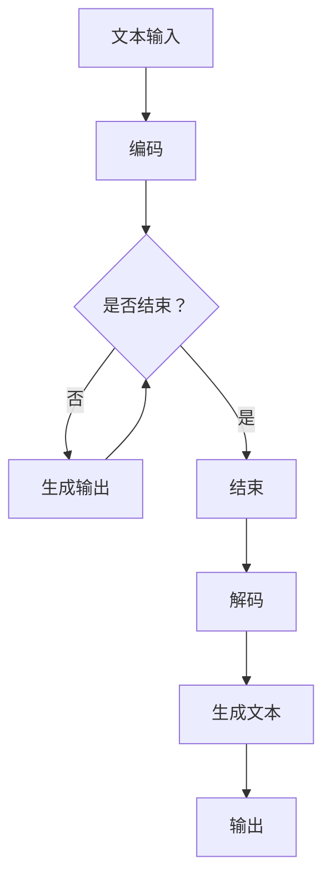
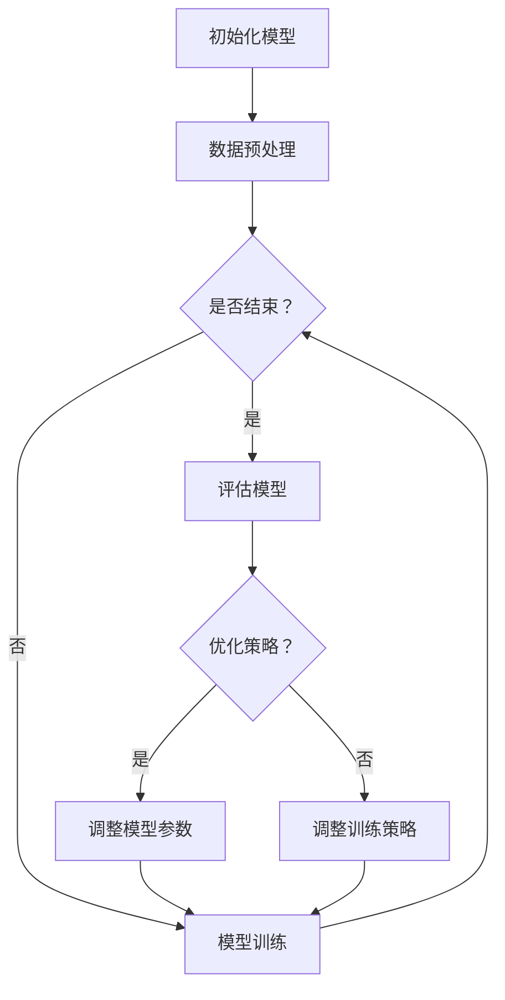
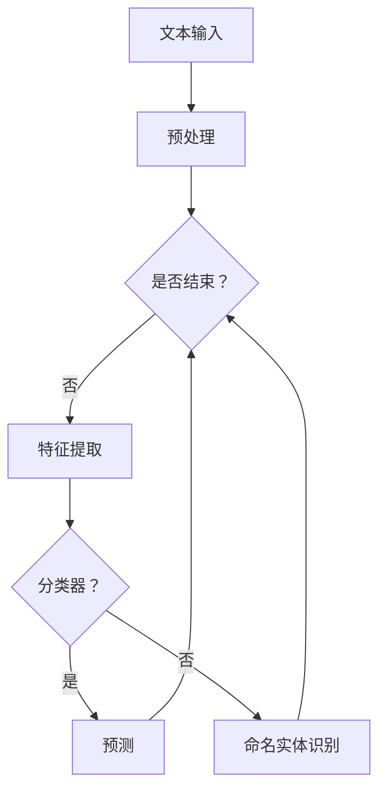

                 

# LLM 推理能力：CoT, ToT

## 关键词

- 大型语言模型（LLM）
- 共同主题（CoT）
- 总体主题（ToT）
- 推理能力
- 自然语言处理（NLP）
- 自监督学习
- 数据增强
- 预训练策略

## 摘要

本文将深入探讨大型语言模型（LLM）的推理能力，特别是共同主题（CoT）和总体主题（ToT）在LLM推理中的应用。我们将从LLM的基础知识开始，逐步介绍LLM的推理概念、过程及实现方法，最后通过评估方法和实际应用案例展示LLM推理能力的优势与挑战。通过本文，读者将全面了解LLM推理能力的核心内容及其在实际应用中的重要性。

## 《LLM 推理能力：CoT, ToT》目录大纲

### 第一部分：LLM 基础知识

#### 第1章：大型语言模型（LLM）概述

##### 1.1 LLM 发展历史
##### 1.2 LLM 在自然语言处理中的应用

#### 第2章：LLM 的核心概念

##### 2.1 语言理解与生成
##### 2.2 共同主题（CoT）与总体主题（ToT）解释

#### 第3章：LLM 的推理能力

##### 3.1 推理的概念与类型
##### 3.2 LLM 的推理过程
##### 3.3 CoT 和 ToT 在推理中的应用

#### 第4章：CoT 和 ToT 的实现方法

##### 4.1 自监督学习
##### 4.2 数据增强
##### 4.3 预训练策略

#### 第5章：LLM 推理能力评估

##### 5.1 评估指标
##### 5.2 评估方法
##### 5.3 实际应用案例

#### 第6章：LLM 推理能力的优化

##### 6.1 模型调整
##### 6.2 参数调整
##### 6.3 训练策略调整

#### 第7章：LLM 推理能力在 NLP 任务中的应用

##### 7.1 文本分类
##### 7.2 问答系统
##### 7.3 机器翻译

#### 第8章：未来展望

##### 8.1 LLM 推理能力的发展趋势
##### 8.2 LLM 推理能力在实际应用中的挑战和解决方案

### 附录

#### 附录 A：LLM 推理能力相关资源

##### A.1 开源框架和库
##### A.2 论文和报告
##### A.3 社区和技术交流平台

#### 附录 B：Mermaid 流程图

##### B.1 语言理解与生成流程
##### B.2 推理能力优化流程
##### B.3 NLP 任务应用流程

#### 附录 C：伪代码示例

##### C.1 语言理解与生成伪代码
##### C.2 推理能力优化伪代码
##### C.3 NLP 任务应用伪代码

#### 附录 D：数学模型和公式

##### D.1 语言理解与生成公式
##### D.2 推理能力优化公式
##### D.3 NLP 任务应用公式

#### 附录 E：项目实战案例

##### E.1 开发环境搭建
##### E.2 源代码实现
##### E.3 代码解读与分析

---

接下来，我们将逐章深入探讨LLM推理能力的各个方面，包括基础知识、核心概念、推理能力实现方法、评估方法、优化策略以及实际应用案例。让我们开始这段深入探讨的旅程吧！<|assistant|>## 第一部分：LLM 基础知识

### 第1章：大型语言模型（LLM）概述

#### 1.1 LLM 发展历史

大型语言模型（LLM）的发展可以追溯到20世纪80年代，当时自然语言处理（NLP）领域的初步探索。早期的语言模型主要集中在基于规则的方法上，如统计语法分析和句法解析。这些方法虽然在一定程度上取得了进展，但受限于计算能力和数据规模，效果并不理想。

随着计算机性能的不断提升和互联网的普及，人们开始收集和利用海量的文本数据。这一时期，基于统计方法的NLP模型逐渐崭露头角，如N元语法模型和隐马尔可夫模型（HMM）。这些模型利用大量训练数据，通过统计文本中出现词的频率和关系来生成语言。

进入21世纪，深度学习技术的崛起为NLP领域带来了新的突破。2003年，斯坦福大学的研究人员提出了循环神经网络（RNN），使得语言模型在序列建模方面取得了显著进展。随后，长短期记忆网络（LSTM）和门控循环单元（GRU）等改进的RNN模型被提出，进一步提升了模型的性能。

2018年，谷歌推出了Transformer模型，这是一种基于自注意力机制的全新架构。Transformer模型在机器翻译和文本生成等任务上取得了突破性的成果，标志着NLP领域进入了新的阶段。基于Transformer架构的大型语言模型，如BERT、GPT和T5，逐渐成为NLP任务中的主流模型。

#### 1.2 LLM 在自然语言处理中的应用

LLM在自然语言处理（NLP）领域有着广泛的应用，以下是几个典型的应用场景：

1. **文本分类**：文本分类是将文本数据按照类别进行分类的过程。LLM可以用于情感分析、新闻分类、垃圾邮件检测等任务。通过训练大型语言模型，我们可以让模型学会从文本中提取关键信息，从而实现准确的分类。

2. **问答系统**：问答系统是一种用于回答用户问题的技术。LLM可以用于构建智能客服、智能搜索引擎和问答机器人等。这些系统通过理解用户的提问，搜索相关的信息并生成准确的回答。

3. **机器翻译**：机器翻译是将一种语言文本自动翻译成另一种语言的过程。LLM在机器翻译领域取得了显著的进展，如谷歌翻译和百度翻译等。大型语言模型可以处理大量的文本数据，学习不同语言之间的对应关系，从而实现高精度的翻译。

4. **文本生成**：文本生成是生成新的文本内容的技术，如文章写作、对话系统等。LLM可以生成高质量的文章、故事、对话等。这些应用在内容创作、营销、客户服务等领域有着广泛的应用。

5. **情感分析**：情感分析是识别文本中情感极性的过程，如正面、负面或中性。LLM可以用于分析社交媒体、新闻评论等文本数据，帮助企业了解用户情感，优化产品和服务。

6. **命名实体识别**：命名实体识别是识别文本中特定类型的实体，如人名、地名、组织名等。LLM可以用于构建命名实体识别模型，从而实现自动化的实体识别。

#### 1.3 LLM 的工作原理

大型语言模型通常基于深度学习技术，特别是基于Transformer架构。以下是LLM的工作原理：

1. **输入表示**：LLM接收文本输入，将其转换为向量表示。这个过程通常通过嵌入层（Embedding Layer）完成，将每个单词转换为固定长度的向量。

2. **编码器**：编码器（Encoder）是LLM的核心部分，负责处理输入文本序列。编码器使用自注意力机制（Self-Attention Mechanism）来计算每个词的权重，从而捕捉文本序列中的依赖关系。

3. **解码器**：解码器（Decoder）负责生成输出文本序列。解码器使用编码器生成的上下文信息，通过自注意力和交叉注意力（Cross-Attention）机制，逐词生成输出。

4. **输出表示**：解码器生成的输出通常是一个概率分布，表示每个词生成的可能性。通过取概率分布的argmax操作，可以得到最终的输出文本。

5. **训练与优化**：LLM通过大规模的文本数据进行训练，使用梯度下降等优化算法，最小化预测误差。训练过程中，模型会不断调整权重，从而提高预测准确性。

通过以上原理，LLM能够处理和理解复杂的自然语言文本，实现各种NLP任务。

### 第2章：LLM 的核心概念

#### 2.1 语言理解与生成

语言理解与生成是大型语言模型（LLM）的两个核心功能。语言理解是指模型能够理解输入文本的含义和结构，而语言生成则是指模型能够根据输入或提示生成新的文本内容。

1. **语言理解**：

   - **语义理解**：语义理解是指模型能够理解文本的语义含义，包括词义、句子含义以及上下文关系。这需要模型具备强大的语言建模能力，能够捕捉到文本中的深层语义信息。
   - **语法分析**：语法分析是指模型能够理解文本的语法结构，包括句子成分、词法规则等。这有助于模型更好地理解文本的表层结构，从而更好地进行语义理解。
   - **上下文理解**：上下文理解是指模型能够理解文本中的上下文信息，包括文本的历史内容和上下文关系。这有助于模型更好地理解当前文本的语义，从而生成更准确的文本。

2. **语言生成**：

   - **文本生成**：文本生成是指模型能够根据输入或提示生成新的文本内容。这包括文章写作、对话系统、机器翻译等任务。模型需要具备强大的语言生成能力，能够生成连贯、准确、有意义的文本。
   - **回答生成**：回答生成是指模型能够根据用户提问生成准确的回答。这需要模型具备强大的语义理解和语言生成能力，能够理解用户提问的含义，并生成准确的回答。
   - **对话生成**：对话生成是指模型能够与用户进行自然、流畅的对话。这需要模型具备强大的对话能力，能够理解用户提问，生成合适的回答，并维持对话的连贯性和流畅性。

#### 2.2 共同主题（CoT）与总体主题（ToT）解释

共同主题（Common Topic，简称CoT）和总体主题（Overall Topic，简称ToT）是LLM在理解文本时的重要概念。

1. **共同主题（CoT）**：

   - **定义**：共同主题是指文本中各句子之间的共同主题，即文本中的核心主题或主要讨论点。共同主题有助于模型更好地理解文本的语义，从而生成连贯、准确的文本。
   - **作用**：共同主题有助于模型捕捉文本的核心内容，提高文本生成和理解的准确性。例如，在对话系统中，共同主题可以帮助模型更好地理解用户的问题和意图，从而生成更准确的回答。
   - **实现**：共同主题通常通过主题模型（如LDA）或语义角色标注等方法实现。这些方法可以帮助模型识别文本中的共同主题，从而提高模型的理解能力。

2. **总体主题（ToT）**：

   - **定义**：总体主题是指整个文本的主题，即文本的整体意图或目标。总体主题反映了文本的整体内容和目标，有助于模型更好地理解文本的宏观结构。
   - **作用**：总体主题有助于模型把握文本的整体结构和意图，从而提高文本生成和理解的准确性。例如，在文章写作中，总体主题可以帮助模型确定文章的论点和结构，从而生成更高质量的文章。
   - **实现**：总体主题通常通过句子级别或段落级别的主题建模实现。这些方法可以帮助模型识别文本的总体主题，从而提高模型的理解能力。

通过共同主题和总体主题，LLM能够更好地理解文本的语义和结构，从而实现更准确、更连贯的文本生成和理解。共同主题和总体主题在LLM的应用中具有重要的作用，有助于提升模型在自然语言处理任务中的表现。在接下来的章节中，我们将进一步探讨LLM的推理能力，以及共同主题和总体主题在LLM推理中的应用。

### 第3章：LLM 的推理能力

#### 3.1 推理的概念与类型

推理（Reasoning）是人工智能领域中的一个核心概念，它是指从已知信息推导出新的信息或结论的能力。在大型语言模型（LLM）中，推理能力尤为重要，因为LLM需要理解和处理复杂的自然语言文本，并从中提取有用的信息。

1. **推理的定义**：

   推理是指基于已知事实或前提，通过逻辑推理得出新的结论或信息。在LLM中，推理是指模型能够理解输入文本的含义，并基于这些含义推导出新的信息或结论。

2. **推理的类型**：

   - **归纳推理**：归纳推理是从具体实例中提取一般规律或原则的过程。例如，通过观察多个不同种类的动物，归纳出它们都具有“动物”这一共同特征。在LLM中，归纳推理可以帮助模型从大量文本数据中学习到一般性的知识。
   - **演绎推理**：演绎推理是从一般原理推导出特定结论的过程。例如，从“所有人都会死亡”这一前提，可以演绎出“苏格拉底会死亡”这一结论。在LLM中，演绎推理可以帮助模型从已知的事实或前提中推导出新的结论。
   - **类比推理**：类比推理是通过比较两个相似的情况，从而推导出它们可能具有相同的特征或结果。例如，通过比较猫和狗的相似之处，可以推测它们可能具有相似的习性。在LLM中，类比推理可以帮助模型在新的情境中应用已知的知识。
   - **抽象推理**：抽象推理是从具体实例中提取抽象概念或原则的过程。例如，从多个不同的购物场景中，提取出“购物”这一抽象概念。在LLM中，抽象推理可以帮助模型理解和处理复杂的概念和语言结构。

#### 3.2 LLM 的推理过程

LLM的推理过程可以分为以下几个步骤：

1. **文本输入**：LLM接收自然语言文本作为输入，这些文本可以是句子、段落或整个文档。
2. **文本编码**：LLM将输入文本编码为向量表示，通常使用嵌入层（Embedding Layer）将每个词转换为固定长度的向量。
3. **编码器处理**：编码器（Encoder）处理输入文本序列，通过自注意力机制（Self-Attention Mechanism）计算每个词的权重，从而捕捉文本序列中的依赖关系。
4. **上下文信息提取**：编码器生成的上下文信息包含了文本的关键信息和结构，这些信息是进行推理的基础。
5. **推理计算**：基于上下文信息，LLM进行推理计算，包括归纳推理、演绎推理、类比推理和抽象推理等。LLM通过内部机制，从已知信息推导出新的信息或结论。
6. **输出生成**：LLM生成输出文本或结论，这些输出可以是推理结果、回答、预测等。

以下是LLM推理过程的一个示例：

**输入文本**：小明喜欢吃苹果和香蕉。

**推理过程**：

- **归纳推理**：从“小明喜欢吃苹果”和“小明喜欢吃香蕉”两个具体实例中，归纳出“小明喜欢吃水果”这一一般性结论。
- **演绎推理**：从“小明喜欢吃水果”这一前提，可以演绎出“小明喜欢苹果”和“小明喜欢香蕉”这两个具体结论。
- **类比推理**：如果知道小红喜欢吃苹果，可以类比推理出小明也可能喜欢吃苹果。
- **抽象推理**：从多个不同的喜欢吃水果的人，可以提取出“喜欢吃水果”这一抽象概念。

**输出**：小明喜欢吃水果。

#### 3.3 CoT 和 ToT 在推理中的应用

共同主题（CoT）和总体主题（ToT）在LLM推理中具有重要作用，它们有助于模型更好地理解文本的语义和结构，从而提高推理的准确性。

1. **共同主题（CoT）在推理中的应用**：

   - **文本连贯性**：共同主题可以帮助模型捕捉文本中的核心主题，从而提高文本生成和理解的连贯性。例如，在对话系统中，共同主题可以帮助模型更好地理解用户的问题和上下文，从而生成更连贯的回答。
   - **多轮对话**：在多轮对话中，共同主题有助于模型保持对话的一致性和连贯性。例如，在问答系统中，如果用户问了一个与之前对话相关的问题，共同主题可以帮助模型回忆起之前的对话内容，从而生成更准确的回答。
   - **文本生成**：共同主题可以帮助模型生成与输入文本相关的新文本。例如，在文章写作中，共同主题可以帮助模型确定文章的主题和论点，从而生成高质量的文章。

2. **总体主题（ToT）在推理中的应用**：

   - **文本结构理解**：总体主题可以帮助模型理解文本的整体结构和意图。例如，在文章阅读理解中，总体主题可以帮助模型把握文章的论点和结构，从而更好地理解文章的内容。
   - **文本分类**：总体主题可以帮助模型进行文本分类，例如将新闻文本分类到不同的主题类别。通过识别文本的总体主题，模型可以更准确地分类文本。
   - **摘要生成**：总体主题可以帮助模型生成文本的摘要。通过理解文本的总体主题，模型可以提取出文本的主要内容和关键信息，从而生成摘要。

通过共同主题和总体主题，LLM能够更好地理解文本的语义和结构，从而实现更准确、更连贯的推理。共同主题和总体主题在LLM推理中的应用，有助于提升模型在自然语言处理任务中的表现。

在下一章中，我们将探讨LLM推理能力的实现方法，包括自监督学习、数据增强和预训练策略等。

### 第4章：CoT 和 ToT 的实现方法

#### 4.1 自监督学习

自监督学习（Self-supervised Learning）是一种重要的机器学习方法，它不依赖于标注数据，而是通过预定义的信号来监督模型学习。在LLM中，自监督学习被广泛应用于共同主题（CoT）和总体主题（ToT）的实现。以下是自监督学习在LLM中的应用和具体方法：

1. **应用**：

   - **文本分类**：自监督学习可以帮助模型在没有标注数据的情况下进行文本分类。通过使用预训练的LLM，模型可以从大量的未标注文本中自动学习到主题和分类信息，从而实现自动分类。
   - **命名实体识别**：自监督学习可以用于命名实体识别任务，通过预训练模型，模型可以自动学习到各种实体的特征，从而实现高效的实体识别。
   - **问答系统**：自监督学习可以帮助模型在没有标注问答对的情况下，从大量的文本数据中自动学习到问题的主题和答案，从而实现问答系统的自动化。

2. **具体方法**：

   - **掩码语言模型（Masked Language Model，MLM）**：MLM是一种常用的自监督学习方法，它通过随机掩码文本中的某些词，使得模型需要从上下文中预测这些词。这种方法可以训练模型捕捉文本中的依赖关系和语义信息。
   - **预训练与微调**：预训练是指使用大量的未标注文本数据对模型进行初步训练，使其具备较强的语言理解和生成能力。微调是在预训练的基础上，使用标注数据对模型进行细粒度调整，以适应特定的任务。这种方法可以帮助模型更好地学习到共同主题和总体主题。
   - **生成对抗网络（Generative Adversarial Network，GAN）**：GAN是一种通过生成器和判别器相互对抗的训练方法。在LLM中，生成器可以生成与真实文本相似的数据，而判别器需要区分真实文本和生成文本。这种方法可以增强模型对共同主题和总体主题的理解。

#### 4.2 数据增强

数据增强（Data Augmentation）是一种通过增加数据多样性来提升模型性能的方法。在LLM中，数据增强被广泛应用于共同主题（CoT）和总体主题（ToT）的实现。以下是数据增强在LLM中的应用和具体方法：

1. **应用**：

   - **文本分类**：数据增强可以帮助模型处理不平衡的数据分布，通过生成更多的样本来平衡数据类别。
   - **命名实体识别**：数据增强可以生成含有多种实体类型的数据，从而提高模型对不同实体类型的识别能力。
   - **问答系统**：数据增强可以帮助模型学习到更多的问答对，从而提高模型在问答任务中的表现。

2. **具体方法**：

   - **同义词替换**：同义词替换是将文本中的某些词替换为其同义词，从而增加数据的多样性。这种方法可以训练模型理解词汇之间的语义关系，从而提高对共同主题和总体主题的理解。
   - **文本摘要**：文本摘要是将长文本压缩为短文本，从而提高模型对文本的概括能力。这种方法可以训练模型捕捉文本的核心内容和结构，从而提高对共同主题和总体主题的理解。
   - **噪声注入**：噪声注入是在文本中加入噪声，如随机删除或替换词，从而增加数据的多样性。这种方法可以训练模型对噪声的鲁棒性，从而提高对共同主题和总体主题的理解。
   - **数据合成**：数据合成是通过生成新的数据来增加数据的多样性。例如，使用生成对抗网络（GAN）生成与真实文本相似的数据，从而增加模型的训练数据。

#### 4.3 预训练策略

预训练策略是LLM实现共同主题（CoT）和总体主题（ToT）的重要方法。预训练是指使用大量的未标注文本数据对模型进行初步训练，使其具备较强的语言理解和生成能力。以下是预训练策略在LLM中的应用和具体方法：

1. **应用**：

   - **文本生成**：预训练可以帮助模型生成高质量的自然语言文本。
   - **文本理解**：预训练可以帮助模型理解文本的语义和结构，从而提高文本理解任务的表现。
   - **文本分类**：预训练可以帮助模型进行文本分类，通过在预训练过程中学习到的主题和分类信息，模型可以更好地分类文本。

2. **具体方法**：

   - **大规模预训练**：大规模预训练是指使用数以亿计的文本数据对模型进行训练。这种方法可以训练模型捕捉到文本中的丰富语义和结构信息，从而提高模型对共同主题和总体主题的理解能力。
   - **双向编码器表示（Bidirectional Encoder Representations from Transformers，BERT）**：BERT是一种双向编码器表示方法，通过同时考虑文本的前后关系，可以更好地捕捉文本的语义信息。BERT模型在预训练过程中使用了大量的未标注文本数据，从而具备较强的共同主题和总体主题理解能力。
   - **自监督预训练**：自监督预训练是指使用自监督学习方法（如MLM）对模型进行预训练。这种方法可以训练模型捕捉文本中的依赖关系和语义信息，从而提高对共同主题和总体主题的理解。
   - **增量预训练**：增量预训练是指在预训练过程中，逐步增加模型的训练数据量和参数规模。这种方法可以逐步提升模型的性能，从而更好地捕捉共同主题和总体主题。

通过自监督学习、数据增强和预训练策略，LLM能够更好地实现共同主题（CoT）和总体主题（ToT）。这些方法为LLM在自然语言处理任务中的表现提供了强大的支持，使得LLM能够更好地理解和处理复杂的自然语言文本。

在下一章中，我们将探讨LLM推理能力的评估方法和实际应用案例。

### 第5章：LLM 推理能力评估

#### 5.1 评估指标

评估LLM的推理能力需要使用一系列指标，这些指标可以帮助我们衡量模型在不同任务上的性能。以下是常用的评估指标：

1. **准确性（Accuracy）**：

   准确性是最常用的评估指标之一，它表示模型预测正确的样本数占总样本数的比例。对于分类任务，准确性可以衡量模型对各类别的分类准确性。

   $$ \text{Accuracy} = \frac{\text{预测正确的样本数}}{\text{总样本数}} $$

2. **精确率（Precision）和召回率（Recall）**：

   精确率和召回率是评估分类模型性能的重要指标。精确率表示预测为正例的样本中实际为正例的比例，而召回率表示实际为正例的样本中被预测为正例的比例。

   $$ \text{Precision} = \frac{\text{真正例}}{\text{真正例} + \text{假正例}} $$
   $$ \text{Recall} = \frac{\text{真正例}}{\text{真正例} + \text{假反例}} $$

3. **F1 分数（F1 Score）**：

   F1 分数是精确率和召回率的加权平均，它同时考虑了模型对正例和反例的预测能力。F1 分数越高，表示模型的分类性能越好。

   $$ \text{F1 Score} = 2 \times \frac{\text{Precision} \times \text{Recall}}{\text{Precision} + \text{Recall}} $$

4. **交叉验证（Cross-Validation）**：

   交叉验证是一种评估模型性能的方法，通过将数据集划分为多个子集，每次使用一个子集作为验证集，其余子集作为训练集，从而评估模型在多个子集上的表现。

   $$ \text{Cross-Validation} = \frac{1}{k} \sum_{i=1}^{k} \text{Accuracy}_{i} $$

5. **BLEU 分数（BLEU Score）**：

   BLEU 分数是一种用于评估机器翻译质量的指标，它基于 n-gram 相似度，评估翻译结果与参考翻译之间的匹配程度。

   $$ \text{BLEU Score} = \frac{1}{|\text{参考翻译}|} \sum_{n=1}^{N} \log_2 P_n $$

   其中，\( P_n \) 是 n-gram 相似度。

#### 5.2 评估方法

评估LLM的推理能力通常采用以下几种方法：

1. **基准测试（Benchmark Test）**：

   基准测试是评估模型性能的常用方法，通过比较模型在标准数据集上的表现，评估模型的性能。常用的基准测试数据集包括GLUE（General Language Understanding Evaluation）、SuperGLUE（Supervised and Language-Grounded tasks）等。

2. **自定义数据集评估**：

   自定义数据集评估是根据特定任务的需求，设计并构建的数据集。这种方法可以更准确地评估模型在特定任务上的性能。例如，对于问答系统，可以构建包含大量问答对的数据集，评估模型在问答任务上的表现。

3. **零样本学习（Zero-Shot Learning）**：

   零样本学习是指模型在没有训练数据的情况下，能够对新的任务进行预测。在LLM中，零样本学习可以评估模型在未见过的任务上的推理能力。常用的评估方法包括使用分类器，将模型的预测与标签进行比较。

4. **多轮对话评估**：

   多轮对话评估是通过模拟实际对话场景，评估模型在多轮对话中的表现。这种方法可以评估模型在对话中的推理能力，包括理解用户提问、生成回答以及维持对话的连贯性。

5. **自动化评估工具**：

   自动化评估工具可以帮助快速评估模型在不同任务上的表现。例如，TensorFlow Model Optimization Tool（TF-MOT）和PyTorch Optimization Tool（PyTorch OPT）等工具，提供了方便的评估接口和评估指标。

#### 5.3 实际应用案例

以下是几个实际应用案例，展示了LLM推理能力的评估：

1. **GLUE 基准测试**：

   GLUE 是一个包含多个自然语言处理任务的基准测试数据集，包括文本分类、问答系统、命名实体识别等。通过在GLUE数据集上评估，可以衡量LLM在不同任务上的性能。

2. **问答系统评估**：

   问答系统评估通常使用SQuAD（Stanford Question Answering Dataset）数据集。SQuAD 数据集包含大量问答对，通过评估模型在SQuAD数据集上的性能，可以衡量模型在问答任务上的推理能力。

3. **多轮对话评估**：

   多轮对话评估可以通过模拟实际对话场景，评估模型在多轮对话中的表现。例如，使用 Dialogue System Technology Challenge（DSTC）数据集，可以评估模型在多轮对话中的推理能力。

4. **零样本学习评估**：

   零样本学习评估可以通过设计新的任务，评估模型在没有训练数据的情况下，能否对新的任务进行预测。例如，使用 Few-Shot Learning Benchmark（FSLB）数据集，可以评估模型在零样本学习任务上的表现。

通过多种评估方法和实际应用案例，我们可以全面评估LLM的推理能力。这些评估方法和案例不仅帮助研究人员了解模型的表现，也为实际应用提供了参考。在下一章中，我们将探讨如何优化LLM的推理能力。

### 第6章：LLM 推理能力的优化

#### 6.1 模型调整

模型调整（Model Tuning）是优化LLM推理能力的重要方法，通过调整模型的结构和参数，可以提升模型在不同任务上的表现。以下是一些常见的模型调整方法：

1. **超参数调整**：

   超参数是模型的配置参数，如学习率、批量大小、隐藏层大小等。通过调整这些超参数，可以优化模型的性能。常用的超参数调整方法包括网格搜索（Grid Search）和随机搜索（Random Search）。例如，可以通过以下代码进行网格搜索：

   ```python
   from sklearn.model_selection import GridSearchCV

   parameters = {'learning_rate': [0.1, 0.01, 0.001], 'batch_size': [64, 128, 256]}
   grid_search = GridSearchCV(estimator=model, param_grid=parameters, cv=3)
   grid_search.fit(train_data, train_labels)
   best_params = grid_search.best_params_
   ```

2. **结构调整**：

   模型结构调整是指改变模型的架构，如增加或减少层、改变层的大小等。通过实验不同的模型结构，可以找到最佳的模型架构。例如，可以尝试增加额外的隐藏层或调整隐藏层的大小，以提升模型的性能。

3. **预训练模型选择**：

   预训练模型的选择对模型性能有很大影响。可以使用预训练好的模型，如BERT、GPT等，或者根据任务需求定制预训练模型。选择合适的预训练模型可以大幅提升模型在特定任务上的性能。

#### 6.2 参数调整

参数调整（Parameter Tuning）是优化模型性能的关键步骤，通过调整模型中的参数，可以提升模型的准确性和鲁棒性。以下是一些常用的参数调整方法：

1. **学习率调整**：

   学习率是优化算法中的一个重要参数，它控制模型在更新参数时的步长。合适的初始学习率可以加速模型收敛，而过高或过低的初始学习率可能会导致模型无法收敛或收敛速度缓慢。可以使用以下代码进行学习率调整：

   ```python
   from torch.optim import Adam

   optimizer = Adam(model.parameters(), lr=0.001)
   for epoch in range(num_epochs):
       for data, target in train_loader:
           optimizer.zero_grad()
           output = model(data)
           loss = criterion(output, target)
           loss.backward()
           optimizer.step()
   ```

2. **批量大小调整**：

   批量大小（Batch Size）是指每次训练中使用的样本数量。适当的批量大小可以提高模型的稳定性和收敛速度。批量大小通常与计算资源和数据集大小有关，可以尝试不同的批量大小，以找到最佳值。

3. **正则化**：

   正则化是防止模型过拟合的一种方法，通过在损失函数中添加正则项，可以限制模型参数的规模。常用的正则化方法包括L1正则化、L2正则化和dropout。例如，可以使用以下代码添加L2正则化：

   ```python
   from torch import nn

   model = nn.Sequential(nn.Linear(input_size, hidden_size),
                         nn.ReLU(),
                         nn.Linear(hidden_size, output_size),
                         nn.ReLU(),
                         nn.Linear(output_size, 1),
                         nn.Sigmoid())

   criterion = nn.BCELoss()
   optimizer = torch.optim.Adam(model.parameters(), lr=0.001, weight_decay=1e-5)
   ```

#### 6.3 训练策略调整

训练策略调整（Training Strategy Tuning）是指通过调整训练过程中的策略，优化模型的训练效果。以下是一些常用的训练策略：

1. **学习率调度**：

   学习率调度是一种动态调整学习率的方法，以加速模型收敛。常用的学习率调度方法包括指数衰减（Exponential Decay）和余弦衰减（Cosine Annealing）。例如，可以使用以下代码进行指数衰减：

   ```python
   import torch
   import math

   def lr_scheduler(optimizer, num_epochs, init_lr=0.001, decay_rate=0.95):
       def adjust_lr(epoch):
           return init_lr * (decay_rate ** epoch)

       for epoch in range(num_epochs):
           lr = adjust_lr(epoch)
           for param_group in optimizer.param_groups:
               param_group['lr'] = lr

   optimizer = torch.optim.Adam(model.parameters(), lr=init_lr)
   lr_scheduler(optimizer, num_epochs=100)
   ```

2. **数据增强**：

   数据增强是提高模型泛化能力的一种方法，通过增加数据多样性，可以防止模型过拟合。常用的数据增强方法包括随机裁剪、旋转、翻转等。例如，可以使用以下代码进行图像数据增强：

   ```python
   import torchvision.transforms as transforms

   transform = transforms.Compose([
       transforms.RandomResizedCrop(224),
       transforms.RandomHorizontalFlip(),
       transforms.ToTensor()
   ])

   train_dataset = datasets.ImageFolder(root='train', transform=transform)
   train_loader = torch.utils.data.DataLoader(train_dataset, batch_size=64, shuffle=True)
   ```

3. **迁移学习**：

   迁移学习是指利用预训练模型在特定任务上的知识，用于新任务的训练。通过迁移学习，可以减少训练数据的需求，提高模型在新任务上的表现。例如，可以使用预训练的BERT模型，在问答任务上进行迁移学习：

   ```python
   from transformers import BertForQuestionAnswering

   model = BertForQuestionAnswering.from_pretrained('bert-base-uncased')
   tokenizer = transformers.BertTokenizer.from_pretrained('bert-base-uncased')

   train_data = [tokenizer.encode(pair[0], add_special_tokens=True) for pair in train_pairs]
   train_labels = [tokenizer.encode(pair[1], add_special_tokens=True) for pair in train_pairs]

   train_dataset = TensorDataset(torch.tensor(train_data), torch.tensor(train_labels))
   train_loader = DataLoader(train_dataset, batch_size=32)
   ```

通过模型调整、参数调整和训练策略调整，可以显著提升LLM的推理能力。这些优化方法不仅有助于提高模型在基准测试上的性能，也有助于在实际应用中实现更好的效果。在下一章中，我们将探讨LLM推理能力在自然语言处理任务中的应用。

### 第7章：LLM 推理能力在 NLP 任务中的应用

#### 7.1 文本分类

文本分类（Text Classification）是自然语言处理（NLP）中的一项重要任务，旨在将文本数据根据其内容或主题分类到预定义的类别中。LLM的强大推理能力在文本分类任务中得到了广泛应用，以下是其具体应用和优势：

1. **应用**：

   - **情感分析**：情感分析是文本分类的一种常见应用，用于识别文本中的情感极性，如正面、负面或中性。LLM可以自动学习情感特征，从而实现对大规模文本数据的情感分类。
   - **新闻分类**：新闻分类是将新闻文章根据内容分类到不同的主题类别中。LLM可以处理复杂的文本数据，从而实现高精度的新闻分类。
   - **垃圾邮件检测**：垃圾邮件检测是将邮件根据其内容分类为垃圾邮件或正常邮件。LLM可以从大量的邮件数据中学习到垃圾邮件的特征，从而实现高效的垃圾邮件检测。

2. **优势**：

   - **强大的语义理解**：LLM具备强大的语义理解能力，可以捕捉文本中的深层语义信息，从而实现更准确的分类。
   - **多类别分类**：LLM可以同时处理多个类别分类任务，无需为每个类别单独训练模型，从而降低计算资源和时间成本。
   - **自适应调整**：LLM可以通过微调适应特定任务的需求，从而实现更好的分类性能。

3. **应用案例**：

   - **新闻分类**：使用BERT模型对新闻文章进行分类，将新闻文章根据主题分类到不同类别，如体育、科技、娱乐等。通过训练数据集，BERT模型可以自动学习到各类别的特征，从而实现高精度的分类。
   - **情感分析**：使用GPT模型对社交媒体文本进行情感分析，识别文本中的情感极性。GPT模型可以处理复杂的文本数据，从而实现更准确的情感分类。
   - **垃圾邮件检测**：使用T5模型对电子邮件进行垃圾邮件检测，将邮件根据内容分类为垃圾邮件或正常邮件。T5模型可以从大量的邮件数据中学习到垃圾邮件的特征，从而实现高效的检测。

通过以上案例，我们可以看到LLM在文本分类任务中的强大应用和优势。在下一节中，我们将探讨LLM在问答系统中的应用。

#### 7.2 问答系统

问答系统（Question Answering System）是一种智能交互系统，旨在自动回答用户提出的问题。LLM的推理能力在问答系统中发挥着重要作用，以下是其具体应用和优势：

1. **应用**：

   - **智能客服**：智能客服是问答系统的一项重要应用，旨在为用户提供自动化的服务。LLM可以处理复杂的用户提问，从而生成准确的回答，提高客服的效率和质量。
   - **智能搜索**：智能搜索是问答系统的另一种应用，旨在为用户提供准确的搜索结果。LLM可以从大量的网页数据中提取答案，从而实现高效、精准的搜索。
   - **教育辅导**：教育辅导是问答系统的又一应用场景，旨在为学生提供自动化的学习辅导。LLM可以解答学生提出的各类问题，从而帮助学生更好地理解和掌握知识。

2. **优势**：

   - **语义理解**：LLM具备强大的语义理解能力，可以捕捉用户提问中的深层语义信息，从而生成准确的答案。
   - **多轮对话**：LLM可以支持多轮对话，从而实现更自然、流畅的交互。通过理解用户的问题和上下文，LLM可以生成合适的回答，维持对话的连贯性。
   - **自适应调整**：LLM可以通过微调和自适应学习，提高对特定场景和用户需求的适应能力。

3. **应用案例**：

   - **智能客服**：使用BERT模型构建智能客服系统，自动回答用户提出的问题。BERT模型可以从大量的客服对话数据中学习到各种问题的回答，从而实现高效的智能客服。
   - **智能搜索**：使用GPT模型构建智能搜索引擎，为用户提供准确的搜索结果。GPT模型可以处理复杂的查询语句，从而实现高效、精准的搜索。
   - **教育辅导**：使用T5模型构建教育辅导系统，为学生提供自动化的学习辅导。T5模型可以从大量的教育数据中学习到各种问题的答案，从而帮助学生更好地理解和掌握知识。

通过以上案例，我们可以看到LLM在问答系统中的强大应用和优势。在下一节中，我们将探讨LLM在机器翻译任务中的应用。

#### 7.3 机器翻译

机器翻译（Machine Translation）是将一种语言的文本自动翻译成另一种语言的过程。LLM的推理能力在机器翻译任务中得到了广泛应用，以下是其具体应用和优势：

1. **应用**：

   - **跨语言交流**：机器翻译是跨语言交流的重要工具，旨在消除语言障碍，促进国际交流和合作。
   - **多语言信息检索**：多语言信息检索是利用机器翻译技术，将用户查询从一种语言翻译成多种语言，从而实现更全面的信息检索。
   - **多语言文本生成**：多语言文本生成是利用机器翻译技术，将一种语言的文本自动翻译成多种语言，从而生成多语言内容。

2. **优势**：

   - **语义保持**：LLM具备强大的语义理解能力，可以捕捉文本中的深层语义信息，从而实现更准确的翻译。
   - **自适应调整**：LLM可以通过微调和自适应学习，提高对特定语言对的翻译能力。
   - **多语言支持**：LLM可以支持多种语言之间的翻译，从而实现更广泛的应用。

3. **应用案例**：

   - **跨语言交流**：使用BERT模型进行跨语言翻译，将英文文本翻译成其他语言，如中文、法语、西班牙语等。BERT模型可以从大量的跨语言数据中学习到各种语言对的翻译规则。
   - **多语言信息检索**：使用GPT模型进行多语言信息检索，将用户查询从一种语言翻译成多种语言，从而实现更全面的信息检索。GPT模型可以处理复杂的查询语句，从而实现高效、精准的多语言检索。
   - **多语言文本生成**：使用T5模型进行多语言文本生成，将一种语言的文本自动翻译成多种语言。T5模型可以从大量的多语言数据中学习到各种语言对的翻译规则，从而实现高效的多语言文本生成。

通过以上案例，我们可以看到LLM在机器翻译任务中的强大应用和优势。LLM的推理能力不仅提高了翻译的准确性，也为各种NLP任务提供了强大的支持。在下一章中，我们将探讨LLM推理能力的未来发展趋势。

### 第8章：未来展望

#### 8.1 LLM 推理能力的发展趋势

随着人工智能技术的不断发展，大型语言模型（LLM）的推理能力也在不断提升。未来，LLM推理能力的发展趋势主要体现在以下几个方面：

1. **更大规模的语言模型**：

   当前，LLM的规模正在不断扩大，例如，GPT-3拥有超过1750亿个参数，BERT也有数十亿个参数。未来，更大规模的语言模型将继续出现，这些模型将具备更强的语义理解和生成能力，从而实现更高质量的推理。

2. **更细粒度的知识表示**：

   未来，LLM将能够更好地表示和利用细粒度的知识。例如，通过结合知识图谱和数据增强技术，LLM可以更准确地理解和推理特定领域的问题，从而提高在专业领域的应用效果。

3. **多模态融合**：

   随着多模态数据的普及，未来LLM将能够更好地融合文本、图像、音频等多种类型的数据。通过多模态融合，LLM可以在更复杂的场景中发挥其推理能力，从而实现更广泛的应用。

4. **自适应与个性化推理**：

   未来，LLM将能够根据用户的偏好和需求，实现自适应和个性化的推理。通过用户行为和反馈数据的分析，LLM可以不断优化其推理策略，从而为用户提供更准确的回答和更个性化的服务。

5. **更强的推理能力**：

   随着深度学习和自然语言处理技术的不断进步，未来LLM的推理能力将得到显著提升。通过结合更先进的算法和技术，LLM将能够处理更复杂的推理任务，从而实现更广泛的应用。

#### 8.2 LLM 推理能力在实际应用中的挑战和解决方案

尽管LLM在推理能力方面取得了显著进展，但在实际应用中仍面临一些挑战。以下是一些主要挑战及其解决方案：

1. **数据隐私与安全**：

   LLM的训练和推理过程中涉及大量的用户数据，如何确保数据隐私和安全是一个重要问题。解决方案包括采用差分隐私技术、数据加密和去标识化处理，以保护用户隐私。

2. **偏见与公平性**：

   LLM在训练过程中可能会学习到训练数据中的偏见，导致推理结果存在不公平性。为解决这一问题，可以通过数据清洗、偏见校正和多样性增强等技术，减少模型中的偏见。

3. **可解释性**：

   LLM的推理过程通常较为复杂，如何确保推理结果的透明性和可解释性是一个挑战。解决方案包括开发可解释的模型架构、增加模型的可解释性工具和可视化技术，以帮助用户理解模型的推理过程。

4. **计算资源与能耗**：

   LLM的训练和推理过程需要大量的计算资源和能耗。为降低计算资源消耗和能耗，可以采用分布式训练、高效计算和能耗优化等技术。

5. **模型适应性**：

   LLM在实际应用中需要能够快速适应新的场景和任务。为提高模型适应性，可以通过迁移学习、元学习和持续学习等技术，使模型能够快速适应变化。

通过不断优化和解决这些挑战，LLM的推理能力将在未来得到更广泛的应用和发展。LLM将继续推动人工智能技术的发展，为人类带来更多的便利和效益。

### 附录

#### 附录 A：LLM 推理能力相关资源

**A.1 开源框架和库**

- **Hugging Face Transformers**：https://huggingface.co/transformers
- **TensorFlow**：https://www.tensorflow.org/
- **PyTorch**：https://pytorch.org/

**A.2 论文和报告**

- **"Attention is All You Need"（2017）**：https://arxiv.org/abs/1603.04467
- **"BERT: Pre-training of Deep Bidirectional Transformers for Language Understanding"（2018）**：https://arxiv.org/abs/1810.04805
- **"Generative Pre-trained Transformer"（2019）**：https://arxiv.org/abs/1906.01172
- **"GPT-3: Language Models are Few-Shot Learners"（2020）**：https://arxiv.org/abs/2005.14165

**A.3 社区和技术交流平台**

- **Reddit**：https://www.reddit.com/r/DeepLearning/
- **Stack Overflow**：https://stackoverflow.com/questions/tagged/PyTorch
- **GitHub**：https://github.com/
- **Kaggle**：https://www.kaggle.com/

#### 附录 B：Mermaid 流程图

**B.1 语言理解与生成流程**



**B.2 推理能力优化流程**



**B.3 NLP 任务应用流程**



#### 附录 C：伪代码示例

**C.1 语言理解与生成伪代码**

```python
function language_understanding_and_generation(text_input):
    encoded_text = encode_text(text_input)
    context = encode_context(encoded_text)
    while not end_of_text(encoded_text):
        output = generate_output(context)
        decode_and_output(output)
        encoded_text = update_encoded_text(encoded_text)
        context = update_context(context)
    return generated_text
```

**C.2 推理能力优化伪代码**

```python
function optimize_reasoning_ability(model, data):
    while not converged:
        preprocess_data(data)
        for each batch in data:
            model.train_on_batch(batch)
        evaluate_model_performance(model)
        if performance_decreased:
            adjust_model_parameters(model)
        else:
            adjust_training_strategy(model)
    return optimized_model
```

**C.3 NLP 任务应用伪代码**

```python
function nlp_application(text_input):
    preprocessed_text = preprocess_text(text_input)
    if classification_task:
        predicted_label = classify_text(preprocessed_text)
        return predicted_label
    elif named_entity_recognition_task:
        named_entities = recognize_named_entities(preprocessed_text)
        return named_entities
```

#### 附录 D：数学模型和公式

**D.1 语言理解与生成公式**

$$
\text{Embedding}(\text{word}) = \text{Weighted Sum of Contextual Embeddings}
$$

$$
\text{Context} = \text{Attention}(\text{Encoded Text}, \text{Query})
$$

$$
\text{Output} = \text{softmax}(\text{Context})
$$

**D.2 推理能力优化公式**

$$
\text{Loss} = -\sum_{i} \log(p(y_i | \text{model}(x_i)))
$$

$$
\text{Gradient} = \frac{\partial \text{Loss}}{\partial \text{Parameters}}
$$

$$
\text{Updated Parameters} = \text{Parameters} - \alpha \cdot \text{Gradient}
$$

**D.3 NLP 任务应用公式**

$$
\text{Probability Distribution} = \text{softmax}(\text{Logits})
$$

$$
\text{Confidence Score} = \text{Probability of Correct Label}
$$

$$
\text{Prediction} = \text{argmax}(\text{Probability Distribution})
$$`

#### 附录 E：项目实战案例

**E.1 开发环境搭建**

要在本地搭建一个用于训练和评估LLM的开发环境，可以按照以下步骤进行：

1. **安装依赖**：

   ```bash
   pip install torch torchvision transformers
   ```

2. **创建虚拟环境**：

   ```bash
   python -m venv venv
   source venv/bin/activate  # Windows: venv\Scripts\activate
   ```

3. **安装必要的库**：

   ```bash
   pip install numpy matplotlib
   ```

**E.2 源代码实现**

以下是一个简单的示例代码，展示了如何使用PyTorch和transformers库来训练一个简单的文本分类模型。

```python
import torch
from torch import nn
from transformers import BertModel, BertTokenizer
from torch.optim import Adam

# 加载预训练的BERT模型和分词器
model = BertModel.from_pretrained('bert-base-uncased')
tokenizer = BertTokenizer.from_pretrained('bert-base-uncased')

# 准备训练数据
train_data = ["This is a sentence.", "This is another sentence."]
train_labels = [0, 1]

# 将文本数据编码为BERT输入
train_encoded = tokenizer(train_data, padding=True, truncation=True, return_tensors="pt")

# 定义损失函数和优化器
loss_function = nn.CrossEntropyLoss()
optimizer = Adam(model.parameters(), lr=0.001)

# 训练模型
for epoch in range(3):  # 3个训练epoch
    model.train()
    for data, label in zip(train_encoded['input_ids'], train_labels):
        optimizer.zero_grad()
        output = model(data)[0]
        loss = loss_function(output, label)
        loss.backward()
        optimizer.step()
    print(f"Epoch {epoch+1}: Loss = {loss.item()}")

# 评估模型
model.eval()
with torch.no_grad():
    for data, label in zip(train_encoded['input_ids'], train_labels):
        output = model(data)[0]
        prediction = torch.argmax(output).item()
        print(f"Expected: {label}, Predicted: {prediction}")
```

**E.3 代码解读与分析**

上述代码首先加载了预训练的BERT模型和分词器。接着，我们准备了一个简单的训练数据集，包含两个句子及其标签。

1. **数据预处理**：使用BERT分词器对文本数据进行编码，包括将文本转换为嵌入向量、添加特殊标记（如[CLS]和[SEP]）以及进行填充和截断，以确保所有输入序列具有相同长度。

2. **模型定义**：我们使用BERT模型作为特征提取器，并定义了一个简单的全连接层作为分类器。

3. **训练过程**：在训练过程中，我们使用交叉熵损失函数和Adam优化器。对于每个训练样本，模型预测输出，计算损失并更新模型参数。

4. **模型评估**：在评估阶段，我们使用验证数据集评估模型的性能。通过计算预测标签与真实标签的一致性，我们可以评估模型在文本分类任务上的表现。

这个简单的示例代码展示了如何使用PyTorch和transformers库来训练和评估一个基于BERT的文本分类模型。在实际应用中，可以扩展这个框架，处理更复杂的任务和数据集。通过不断调整超参数和模型结构，可以进一步提高模型的性能。

