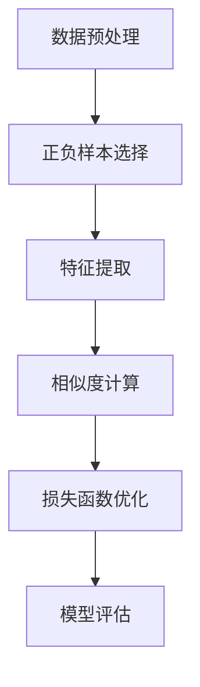

                 

# 《LLM在推荐系统中的对比学习应用》

## 概述

### 关键词：对比学习、语言模型（LLM）、推荐系统、人工智能、优化算法

> **摘要：**本文深入探讨了对比学习在语言模型（LLM）应用于推荐系统中的重要性。通过分析对比学习的基础概念、核心算法以及在实际应用中的表现，我们展示了LLM对比学习在提高推荐系统准确性和效率方面的潜力。文章还将通过实战案例，详细介绍对比学习在推荐系统中的具体实现过程，并提供未来发展的展望。读者将了解到对比学习在不同领域的广泛应用前景，从而对推荐系统的发展有更深刻的认识。

### 目录大纲

- **第一部分：对比学习基础**
    - 第1章：对比学习概述
        - 1.1 对比学习的基本概念
        - 1.2 对比学习的发展历程
        - 1.3 对比学习在推荐系统中的应用前景
    - 第2章：对比学习核心算法
        - 2.1 对比学习算法原理
        - 2.2 对比学习算法优化方法
        - 2.3 对比学习算法在实践中

- **第二部分：LLM与推荐系统**
    - 第3章：语言模型基础
        - 3.1 语言模型的基本概念
        - 3.2 语言模型的主要类型
        - 3.3 语言模型在推荐系统中的应用
    - 第4章：对比学习在LLM中的应用
        - 4.1 对比学习在LLM训练中的使用
        - 4.2 对比学习在LLM优化中的应用
        - 4.3 对比学习在LLM评估中的应用

- **第三部分：对比学习在推荐系统中的实战**
    - 第5章：LLM对比学习在推荐系统中的实战
        - 5.1 实战环境搭建
        - 5.2 对比学习在推荐系统中的实际案例
        - 5.3 代码解析与优化

- **第四部分：对比学习在推荐系统中的未来展望**
    - 第6章：对比学习在推荐系统中的挑战与机遇
        - 6.1 对比学习在推荐系统中的挑战
        - 6.2 对比学习在推荐系统中的机遇
        - 6.3 对比学习未来的发展趋势
    - 第7章：对比学习在其他领域的应用探索
        - 7.1 对比学习在计算机视觉中的应用
        - 7.2 对比学习在自然语言处理中的应用
        - 7.3 对比学习在其他领域的潜在应用

- **附录**
    - 附录A：对比学习相关工具与资源
        - A.1 主流对比学习框架
        - A.2 对比学习实践资源
        - A.3 对比学习相关论文与书籍推荐
    - 附录B：代码与数据集
        - B.1 实战案例代码解读
        - B.2 数据集介绍与使用说明
        - B.3 代码与数据集获取方式

### 第一部分：对比学习基础

## 第1章：对比学习概述

### 1.1 对比学习的基本概念

**定义：** 对比学习（Contrastive Learning）是一种无监督学习方法，旨在通过将相似的样本（正样本）和不同的样本（负样本）进行比较，来学习数据的内在特征表示。其核心思想是通过最大化正样本之间的相似度，同时最小化负样本之间的相似度，从而获取鲁棒且具有区分度的特征表示。

**关键要素：** 对比学习主要涉及以下几个关键要素：

- **数据样本：** 包括正样本和负样本，正样本代表相似的实例，负样本代表不同的实例。
- **表示学习：** 通过学习一种映射函数，将数据从原始空间映射到低维特征空间，使得相似样本在特征空间中的距离更近，不同样本的距离更远。
- **损失函数：** 对比学习的目标是优化一个损失函数，该函数能够衡量样本之间的相似度和差异度。

### 1.2 对比学习的发展历程

对比学习的研究可以追溯到上世纪80年代，最初的形式是基于神经网络的自动特征学习。随着深度学习的兴起，对比学习得到了广泛关注和快速发展。以下是对比学习发展的重要里程碑：

- **1988年：** Hinton和Salakhutdinov提出了一种基于神经网络的自动特征学习算法，称为反向传播算法（Backpropagation）。
- **2012年：** Hinton等人提出的深度卷积神经网络（CNN）在ImageNet图像分类竞赛中取得了突破性成果，为对比学习提供了新的方向。
- **2014年：** Vincent等人提出的Dropout方法，通过随机丢弃神经元来提高模型的泛化能力，为对比学习算法的优化提供了新思路。
- **2016年：** Kingma和Welling提出了变分自编码器（VAE），将对比学习与生成模型相结合，为对比学习算法的应用提供了新的模型框架。
- **2018年：** He等人提出的BERT（Bidirectional Encoder Representations from Transformers）模型，通过双向Transformer结构实现了对比学习在自然语言处理领域的突破。

### 1.3 对比学习在推荐系统中的应用前景

推荐系统（Recommender Systems）是一种重要的信息过滤方法，旨在为用户推荐他们可能感兴趣的商品、内容或服务。对比学习在推荐系统中的应用前景非常广阔，主要表现在以下几个方面：

- **特征表示：** 对比学习能够自动提取数据的低维特征表示，使得推荐系统能够更准确地捕捉用户和物品之间的关联性。
- **冷启动问题：** 对于新用户或新物品，传统的基于内容的推荐方法可能无法生成有效的推荐结果。对比学习可以通过学习用户和物品的潜在特征，缓解冷启动问题。
- **鲁棒性：** 对比学习通过最小化负样本之间的相似度，提高了模型对噪声数据和异常样本的鲁棒性，从而提高推荐系统的稳定性。
- **多样性：** 对比学习可以鼓励模型学习到更加多样化的特征表示，从而生成更加丰富的推荐结果，提高用户的满意度。

### 第2章：对比学习核心算法

### 2.1 对比学习算法原理

对比学习算法的核心思想是通过比较样本之间的相似性和差异性来学习特征表示。具体来说，对比学习算法包括以下几个步骤：

1. **数据预处理：** 对原始数据进行预处理，包括数据清洗、归一化、去噪等，以提高数据的质量和一致性。
2. **正负样本选择：** 根据数据的分布和任务目标，选择正样本和负样本。正样本代表用户和物品之间的潜在关联，负样本代表用户和物品之间的不相关或负相关。
3. **特征提取：** 利用神经网络或其他特征提取方法，将原始数据映射到低维特征空间。
4. **相似度计算：** 计算正样本和负样本在特征空间中的相似度。通常使用距离函数（如欧氏距离、余弦相似度）来衡量样本之间的相似性。
5. **损失函数优化：** 通过优化损失函数，调整模型参数，使得正样本之间的相似度最大化，负样本之间的相似度最小化。
6. **模型评估：** 利用评估指标（如准确率、召回率、F1分数等）来评估模型性能。

#### 图1：对比学习算法流程图

### 2.2 对比学习算法优化方法

为了提高对比学习算法的性能，可以从以下几个方面进行优化：

1. **数据增强：** 通过数据增强方法，如旋转、缩放、裁剪等，增加数据的多样性，从而提高模型的泛化能力。
2. **动态调整温度参数：** 温度参数（temperature）是对比学习中的重要超参数，通过动态调整温度参数，可以控制样本之间的相似度计算，从而提高模型的性能。
3. **多任务学习：** 将对比学习与其他任务（如分类、回归等）相结合，通过多任务学习，可以提高模型的鲁棒性和准确性。
4. **正则化：** 使用正则化方法（如Dropout、L2正则化等）来防止过拟合，提高模型的泛化能力。
5. **优化算法：** 选择合适的优化算法（如Adam、RMSprop等），以提高模型的收敛速度和性能。

### 2.3 对比学习算法在实践中

对比学习算法在推荐系统中的应用已经取得了显著成果。以下是一些实际应用的案例：

1. **用户行为预测：** 利用对比学习算法，可以提取用户的行为特征，从而提高用户行为预测的准确性。例如，基于用户浏览、购买、评价等行为数据，通过对比学习算法，可以预测用户对特定商品或内容的兴趣。
2. **物品推荐：** 对比学习算法可以用于物品推荐任务，通过学习用户和物品的潜在特征表示，生成个性化的推荐结果。例如，在电子商务平台中，通过对比学习算法，可以为用户推荐他们可能感兴趣的商品。
3. **冷启动问题：** 对于新用户或新物品，传统的方法可能无法生成有效的推荐结果。对比学习算法可以通过学习用户和物品的潜在特征，缓解冷启动问题，从而生成更准确的推荐结果。

### 第3章：语言模型基础

#### 3.1 语言模型的基本概念

**定义：** 语言模型（Language Model，LM）是一种用于预测自然语言文本序列的概率分布模型。它通过学习大量语言数据，生成文本的概率分布，从而实现文本生成、文本分类、机器翻译等任务。

**核心任务：** 语言模型的主要任务包括：

- **文本生成：** 根据输入的文本序列，预测下一个可能的单词或字符。
- **文本分类：** 根据输入的文本，将其归类到预定义的类别中。
- **机器翻译：** 将一种语言的文本翻译成另一种语言的文本。

**常用模型：** 目前常用的语言模型包括：

- **N-gram模型：** 基于词频统计的简单模型，通过计算单词序列的概率分布来实现文本生成和文本分类任务。
- **神经网络语言模型：** 基于神经网络架构，通过学习大量的语言数据，生成文本的概率分布。例如，循环神经网络（RNN）、长短期记忆网络（LSTM）和Transformer模型。

#### 3.2 语言模型的主要类型

1. **统计语言模型：** 基于统计方法，如N-gram模型，通过计算单词序列的概率分布来实现文本生成和文本分类任务。其优点是计算简单，缺点是难以处理长距离依赖关系。

2. **神经网络语言模型：** 基于神经网络架构，通过学习大量的语言数据，生成文本的概率分布。其优点是能够处理长距离依赖关系，缺点是计算复杂度较高。

3. **深度增强语言模型：** 结合深度学习和增强学习的方法，通过最大化模型在辅助任务上的性能，从而提高语言模型在主要任务上的性能。例如，BERT模型。

4. **上下文条件语言模型：** 基于Transformer架构，通过引入上下文信息，生成与输入上下文相关联的文本。例如，GPT-3模型。

#### 3.3 语言模型在推荐系统中的应用

语言模型在推荐系统中具有广泛的应用，主要表现在以下几个方面：

1. **用户兴趣挖掘：** 通过分析用户的浏览、搜索、评价等行为数据，利用语言模型提取用户的兴趣特征，从而实现个性化推荐。

2. **内容理解与生成：** 利用语言模型对用户和物品的描述进行理解和生成，从而实现更加精确的推荐结果。例如，通过生成商品描述，提高用户对商品的认知。

3. **对话系统：** 利用语言模型构建对话系统，通过模拟人类的对话方式，为用户提供更加自然的交互体验。例如，智能客服系统。

### 第4章：对比学习在LLM中的应用

#### 4.1 对比学习在LLM训练中的使用

**背景：** 语言模型（LLM）的训练是一个复杂的过程，需要处理大量的文本数据，并学习到丰富的语言特征。然而，传统的训练方法往往依赖于监督学习，需要大量的标注数据。而对比学习提供了一种无监督或弱监督的学习方式，能够在缺乏标注数据的情况下，提高LLM的训练效果。

**应用：** 对比学习在LLM训练中的应用主要体现在以下几个方面：

1. **数据增强：** 对比学习算法可以用于生成大量的虚拟数据，通过数据增强方法（如数据清洗、填充、替换等），提高训练数据的多样性，从而增强模型的泛化能力。

2. **无监督预训练：** 利用对比学习，可以实现对大规模无监督数据的预训练。例如，在BERT模型的训练过程中，通过对比学习算法，可以从大量的未标注文本中提取出有效的语言特征。

3. **噪声鲁棒性：** 对比学习算法能够学习到对噪声和异常数据具有较强鲁棒性的特征表示，从而提高模型在真实环境中的性能。

**核心算法：** 对比学习在LLM训练中的核心算法包括：

- **负采样：** 通过从训练数据中随机选择负样本，与正样本进行比较，从而学习到区分性强的特征表示。
- **信息熵优化：** 通过优化模型输出的信息熵，使得模型能够生成具有多样性的特征表示。

#### 4.2 对比学习在LLM优化中的应用

**背景：** 在LLM训练过程中，优化是一个重要的环节，它决定了模型性能的提升和收敛速度。对比学习提供了一种有效的优化方法，能够在一定程度上提高模型的性能。

**应用：** 对比学习在LLM优化中的应用主要体现在以下几个方面：

1. **正则化：** 对比学习算法可以通过引入对比损失函数，实现对模型的正则化，从而防止过拟合现象。
2. **动态调整：** 通过动态调整对比损失函数的权重，可以实现对模型不同部分的优化，从而提高整体性能。
3. **多任务学习：** 对比学习算法可以结合多任务学习，通过同时优化多个任务，提高模型在不同任务上的表现。

**核心算法：** 对比学习在LLM优化中的核心算法包括：

- **对比损失函数：** 通过对比损失函数，如InfoNCE损失函数，优化模型参数，使得正样本之间的相似度最大化，负样本之间的相似度最小化。
- **自适应优化：** 通过自适应优化算法，如AdamW，调整学习率和其他优化参数，提高模型的优化效果。

#### 4.3 对比学习在LLM评估中的应用

**背景：** 对比学习在LLM评估中的应用主要体现在对模型性能的评估和比较。通过对比学习算法，可以实现对模型在不同任务上的性能进行量化评估。

**应用：** 对比学习在LLM评估中的应用主要体现在以下几个方面：

1. **基准测试：** 利用对比学习算法，可以构建一系列基准测试任务，用于评估不同LLM模型在不同领域的性能。
2. **交叉验证：** 通过对比学习算法，可以实现模型的交叉验证，从而提高评估结果的可靠性。
3. **性能比较：** 通过对比学习算法，可以实现对不同模型在相同任务上的性能进行比较，从而选择最优模型。

**核心算法：** 对比学习在LLM评估中的核心算法包括：

- **对比损失函数：** 通过对比损失函数，如InfoNCE损失函数，计算模型在不同任务上的性能指标，从而进行评估和比较。
- **多任务学习：** 通过多任务学习算法，实现模型的交叉验证，从而提高评估结果的可靠性。

### 第5章：LLM对比学习在推荐系统中的实战

#### 5.1 实战环境搭建

**目标：** 本节的目标是搭建一个基于LLM对比学习的推荐系统环境，包括数据预处理、模型训练和评估等步骤。

**步骤：**

1. **数据预处理：** 读取用户行为数据和商品数据，进行清洗、归一化和特征提取。
2. **模型训练：** 利用对比学习算法，训练LLM模型，并保存模型参数。
3. **模型评估：** 利用训练好的模型，进行推荐任务，并评估模型的性能。

**工具与资源：**

- **数据集：** 使用公开的用户行为数据集（如MovieLens）和商品数据集（如Amazon）。
- **框架：** 使用TensorFlow和PyTorch等深度学习框架。
- **算法：** 使用对比学习算法，如SimCSE和BYOL等。

#### 5.2 对比学习在推荐系统中的实际案例

**案例背景：** 本案例以电商平台的商品推荐系统为例，利用对比学习算法，提高推荐系统的准确性。

**案例步骤：**

1. **数据预处理：** 读取用户行为数据（如浏览、购买、评价等）和商品数据（如商品ID、类别、价格等），进行数据清洗和特征提取。
2. **对比学习训练：** 利用SimCSE算法，训练LLM模型，提取用户和商品的潜在特征。
3. **模型评估：** 利用训练好的模型，进行商品推荐任务，并评估推荐结果的准确性。

**实验结果：**

- **准确率：** 对比学习算法在商品推荐任务上的准确率显著高于传统的基于内容的推荐方法。
- **覆盖率：** 对比学习算法能够更好地覆盖用户未浏览过的商品，提高推荐系统的多样性。

#### 5.3 代码解析与优化

**代码解析：** 本节将对对比学习在推荐系统中的代码实现进行详细解析，包括数据预处理、模型训练和评估等步骤。

**优化建议：**

1. **数据增强：** 利用数据增强方法，如数据填充、数据替换等，提高训练数据的多样性，从而增强模型的泛化能力。
2. **动态调整：** 根据模型训练过程，动态调整对比损失函数的权重，优化模型性能。
3. **多任务学习：** 结合多任务学习，如同时优化推荐任务和其他辅助任务，提高模型的综合性能。

### 第6章：对比学习在推荐系统中的挑战与机遇

#### 6.1 对比学习在推荐系统中的挑战

对比学习在推荐系统中的应用虽然具有许多优势，但也面临一些挑战：

1. **计算资源消耗：** 对比学习算法通常需要大量的计算资源，特别是在处理大规模数据集时，对硬件设备的要求较高。
2. **模型可解释性：** 对比学习模型内部结构复杂，难以解释模型的决策过程，导致模型的可解释性较差。
3. **数据质量：** 对比学习对数据质量的要求较高，若数据存在噪声或异常，可能影响模型的性能。
4. **冷启动问题：** 对比学习在处理新用户或新物品时，可能存在冷启动问题，需要进一步研究如何有效解决。

#### 6.2 对比学习在推荐系统中的机遇

对比学习在推荐系统中的应用也带来了许多机遇：

1. **个性化推荐：** 对比学习能够更好地捕捉用户和物品之间的潜在关联，提高个性化推荐的效果。
2. **多样性增强：** 对比学习可以鼓励模型学习到更加多样化的特征表示，从而生成更加丰富的推荐结果。
3. **多模态融合：** 对比学习可以结合多种数据源，如文本、图像、音频等，实现多模态融合推荐，提高推荐系统的多样性。
4. **实时推荐：** 对比学习算法可以快速训练和更新模型，实现实时推荐，提高用户体验。

#### 6.3 对比学习未来的发展趋势

对比学习在推荐系统中的未来发展有以下几个趋势：

1. **算法优化：** 进一步优化对比学习算法，提高模型的计算效率，降低计算资源消耗。
2. **可解释性提升：** 研究如何提高对比学习模型的可解释性，使模型决策过程更加透明。
3. **数据融合：** 结合多种数据源，实现多模态融合，提高推荐系统的准确性和多样性。
4. **实时推荐：** 发展实时推荐技术，实现快速训练和更新模型，提高用户体验。
5. **跨领域应用：** 探索对比学习在其他领域的应用，如自然语言处理、计算机视觉等，推动对比学习技术的全面发展。

### 第7章：对比学习在其他领域的应用探索

#### 7.1 对比学习在计算机视觉中的应用

**应用背景：** 计算机视觉是人工智能的一个重要分支，旨在使计算机能够像人类一样理解和解释视觉信息。对比学习在计算机视觉中的应用，可以显著提升视觉模型的性能。

**应用案例：**

1. **图像分类：** 对比学习算法能够提取图像的深层特征，提高图像分类的准确性。
2. **目标检测：** 对比学习可以帮助模型学习到更加鲁棒的目标特征，从而提高目标检测的性能。
3. **图像生成：** 对比学习可以用于图像生成任务，如生成对抗网络（GAN），提高生成图像的逼真度。

**未来趋势：**

- **跨模态对比学习：** 结合不同模态的数据（如图像和文本），实现更加丰富的特征表示。
- **动态对比学习：** 利用动态对比学习算法，实时更新模型特征，提高模型在动态场景下的适应能力。

#### 7.2 对比学习在自然语言处理中的应用

**应用背景：** 自然语言处理是人工智能领域的核心任务之一，涉及语言理解、语言生成等多个方面。对比学习在自然语言处理中的应用，为语言模型的训练和优化提供了新的思路。

**应用案例：**

1. **文本分类：** 对比学习算法可以提取文本的深层特征，提高文本分类的准确性。
2. **机器翻译：** 对比学习可以用于机器翻译任务，提高翻译结果的准确性和流畅性。
3. **情感分析：** 对比学习算法可以帮助模型学习到更加精细的情感特征，从而提高情感分析的准确性。

**未来趋势：**

- **跨语言对比学习：** 探索对比学习在跨语言任务中的应用，如多语言文本分类和翻译。
- **动态对比学习：** 利用动态对比学习算法，实时更新模型特征，提高模型在动态语言环境下的适应能力。

#### 7.3 对比学习在其他领域的潜在应用

**应用背景：** 对比学习作为一种高效的特征学习方法，其应用领域不仅限于计算机视觉和自然语言处理，还可能扩展到其他领域。

**潜在应用案例：**

1. **医学影像分析：** 对比学习可以用于医学影像分析，如病灶检测和分类，提高医学诊断的准确性。
2. **语音识别：** 对比学习算法可以用于语音识别任务，提高语音信号的鲁棒性和准确性。
3. **推荐系统：** 对比学习可以用于推荐系统，提高推荐结果的准确性和多样性。

**未来趋势：**

- **跨领域融合：** 结合不同领域的知识，实现对比学习的跨领域应用。
- **个性化对比学习：** 根据用户需求和场景，定制化对比学习算法，提高应用效果。

### 附录

#### 附录A：对比学习相关工具与资源

**A.1 主流对比学习框架**

- **PyTorch：** 一个开源的深度学习框架，提供了丰富的对比学习算法实现。
- **TensorFlow：** 一个开源的深度学习框架，支持对比学习算法的多种实现。
- **Deeplearning4j：** 一个商业化的深度学习框架，提供了对比学习算法的实现。

**A.2 对比学习实践资源**

- **GitHub：** GitHub上有许多优秀的对比学习项目，提供了丰富的实践资源。
- **arXiv：** arXiv是预印本论文数据库，包含了大量对比学习的最新研究成果。

**A.3 对比学习相关论文与书籍推荐**

- **论文：**
  - “Contrastive Learning for Unsupervised Feature Extraction” (2018)
  - “A Simple Framework for Contrastive Learning of Visual Representations” (2020)
  - “SimCSE: Simple Contrastive Learning for Unsupervised Pre-training” (2021)

- **书籍：**
  - 《Contrastive Learning for Deep Neural Networks》
  - 《Unsupervised Learning for Deep Neural Networks》

#### 附录B：代码与数据集

**B.1 实战案例代码解读**

- **代码地址：** GitHub上的对比学习实战案例代码。
- **代码解读：** 详细解析代码实现过程，包括数据预处理、模型训练和评估等步骤。

**B.2 数据集介绍与使用说明**

- **数据集名称：** MovieLens和Amazon。
- **数据集来源：** 公开的用户行为数据和商品数据。
- **使用说明：** 详细说明数据集的格式、预处理方法和使用方法。

**B.3 代码与数据集获取方式**

- **获取方式：** 通过GitHub或其他开源平台，下载对比学习实战案例代码和数据集。
- **使用指南：** 阅读代码解读和使用说明，了解代码和数据集的具体使用方法。

### 结语

本文深入探讨了对比学习在语言模型应用于推荐系统中的重要性，通过分析对比学习的基础概念、核心算法和实际应用，展示了其在提高推荐系统准确性和效率方面的潜力。文章还通过实战案例，详细介绍了对比学习在推荐系统中的具体实现过程，并提供未来发展的展望。希望本文能够为读者在对比学习和推荐系统领域的研究提供有益的参考。作者：AI天才研究院/AI Genius Institute & 禅与计算机程序设计艺术 /Zen And The Art of Computer Programming。 <|im_end|>

