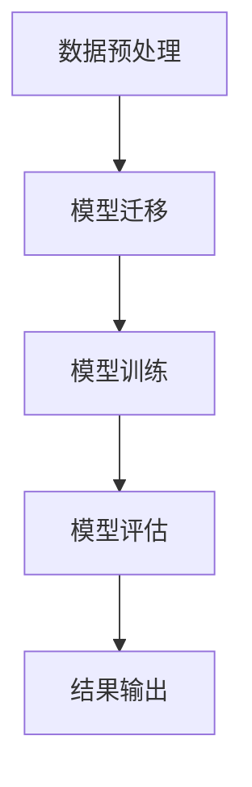

                 

# 《LLM在推荐系统中的迁移学习应用》

## 关键词
**语言模型（LLM）**、**推荐系统**、**迁移学习**、**协同过滤**、**基于内容推荐**、**深度学习**、**个性化推荐**。

## 摘要
本文深入探讨了语言模型（LLM）在推荐系统中的迁移学习应用。首先，介绍了LLM和推荐系统的基本概念，以及迁移学习在其中的作用。接着，详细解析了LLM与推荐系统的融合技术基础，包括推荐系统算法概述、LLM在推荐系统中的应用和迁移学习在推荐系统中的应用。文章随后通过实例展示了LLM在推荐系统中的迁移学习应用实践，并分析了其中的挑战与未来发展趋势。通过本文，读者将了解LLM如何提升推荐系统的效果和个性化水平，为实际应用提供参考。

### 第一部分：LLM与推荐系统的概述

#### 第1章：LLM与推荐系统概述

#### 1.1 推荐系统与LLM的背景介绍

推荐系统是信息过滤和检索领域的一个重要分支，旨在根据用户的兴趣和偏好，向用户推荐可能感兴趣的商品、内容或服务。推荐系统的发展历程可以追溯到20世纪90年代，随着互联网的普及和电子商务的兴起，推荐系统得到了广泛的应用和研究。早期的推荐系统主要采用基于内容的推荐（Content-Based Filtering，CBF）和协同过滤（Collaborative Filtering，CF）两大类方法。

语言模型（Language Model，LLM）则是自然语言处理（Natural Language Processing，NLP）领域的一项关键技术。自20世纪初以来，语言模型的发展经历了从基于规则的模型到统计模型，再到现代深度学习模型的演变。语言模型在机器翻译、文本生成、问答系统等领域取得了显著的成果。

LLM在推荐系统中的应用场景主要集中在以下几个方面：

1. **用户兴趣建模**：通过分析用户的浏览历史、搜索查询和评论内容，LLM可以帮助建立更精细和动态的用户兴趣模型，从而提高推荐系统的个性化水平。

2. **内容理解**：在基于内容的推荐系统中，LLM可以帮助系统更好地理解物品的语义和特征，提高推荐的准确性和相关性。

3. **跨域推荐**：迁移学习是LLM在推荐系统中的一项重要应用，通过在源域和目标域之间的知识迁移，LLM可以实现跨域推荐，解决不同领域数据分布差异大的问题。

#### 1.2 LLM的基本概念与结构

LLM是一种基于深度学习的技术，旨在模拟人类语言的表达和理解能力。LLM的基本结构通常包括以下组件：

1. **嵌入层（Embedding Layer）**：将输入的词语或句子转换为稠密向量表示，为后续的编码和处理提供基础。

2. **编码器（Encoder）**：对输入序列进行编码，生成固定长度的上下文向量，用于捕捉输入序列的语义信息。

3. **解码器（Decoder）**：根据上下文向量生成输出序列，实现文本生成或分类等任务。

LLM的工作原理主要包括以下步骤：

1. **输入处理**：将输入的词语或句子通过嵌入层转换为向量表示。

2. **编码**：编码器对输入序列进行处理，生成上下文向量。

3. **解码**：解码器根据上下文向量生成输出序列，并逐步更新上下文向量。

4. **预测与生成**：通过循环递归的方式，解码器不断预测下一个单词或符号，并更新上下文向量，直到生成完整的输出序列。

#### 1.3 迁移学习的基本概念

迁移学习（Transfer Learning）是一种利用已有模型的知识和经验，在新任务上快速训练出新模型的方法。迁移学习的基本原理是，通过在不同任务之间共享表示，可以将源任务（Source Task）的知识迁移到目标任务（Target Task）上，从而提高目标任务的性能。

迁移学习可以分为以下几种类型：

1. **无监督迁移学习（Unsupervised Transfer Learning）**：在源任务和目标任务之间不存在直接标注数据的情况下，通过预训练和微调的方法进行知识迁移。

2. **有监督迁移学习（Supervised Transfer Learning）**：在源任务和目标任务之间存在直接标注数据的情况下，通过迁移预训练的模型权重，进行目标任务的监督学习。

3. **半监督迁移学习（Semi-Supervised Transfer Learning）**：在源任务和目标任务之间存在部分标注数据的情况下，结合无监督迁移学习和有监督迁移学习的方法，进行知识迁移。

迁移学习的优势主要体现在以下几个方面：

1. **加快训练速度**：通过利用已有模型的知识和经验，可以显著减少目标任务的训练时间。

2. **提高模型性能**：迁移学习可以利用源任务的大量未标注数据，提高目标任务的泛化能力和性能。

3. **降低数据依赖**：迁移学习可以减少对大规模标注数据的依赖，降低数据收集和标注的成本。

#### 1.4 LLM在推荐系统中的迁移学习应用前景

随着LLM和迁移学习的不断发展，LLM在推荐系统中的迁移学习应用前景十分广阔。以下是几个可能的应用方向：

1. **个性化推荐**：通过利用用户的浏览历史、搜索查询和评论内容，LLM可以建立更精细和动态的用户兴趣模型，实现更精准的个性化推荐。

2. **内容理解**：在基于内容的推荐系统中，LLM可以帮助系统更好地理解物品的语义和特征，提高推荐的准确性和相关性。

3. **跨域推荐**：通过在源域和目标域之间的知识迁移，LLM可以实现跨域推荐，解决不同领域数据分布差异大的问题。

4. **实时推荐**：利用LLM的高效计算能力，可以实现实时推荐，提高用户体验。

5. **多模态推荐**：结合LLM和图像、声音等多模态数据，可以实现更丰富和多样化的推荐。

### 第二部分：LLM与推荐系统的融合

#### 第2章：LLM与推荐系统融合的技术基础

#### 2.1 推荐系统算法概述

推荐系统算法可以分为以下几类：

1. **基于内容的推荐（Content-Based Filtering，CBF）**：CBF根据用户的兴趣和偏好，通过分析物品的内容特征，为用户推荐相似的物品。CBF的优点是推荐结果具有较好的解释性，但缺点是推荐结果容易陷入“物以类聚”的困境。

2. **协同过滤推荐（Collaborative Filtering，CF）**：CF根据用户的评分历史或行为数据，通过相似度计算和推荐算法，为用户推荐相似的物品。CF的优点是推荐结果多样化，但缺点是推荐结果容易受到“评分冷启动”和“稀疏数据”的影响。

3. **深度学习推荐（Deep Learning for Recommender Systems）**：深度学习推荐利用深度神经网络，通过自动特征学习和层次化表示，为用户推荐感兴趣的物品。深度学习推荐具有较好的泛化能力和灵活性，但训练时间较长。

#### 2.2 LLM在推荐系统中的应用

LLM在推荐系统中的应用主要体现在以下几个方面：

1. **用户兴趣建模**：通过分析用户的浏览历史、搜索查询和评论内容，LLM可以建立更精细和动态的用户兴趣模型，提高推荐的个性化水平。

2. **内容理解**：在CBF中，LLM可以帮助系统更好地理解物品的语义和特征，从而提高推荐的准确性和相关性。

3. **跨域推荐**：通过迁移学习，LLM可以在不同领域之间进行知识迁移，实现跨域推荐。

4. **实时推荐**：利用LLM的高效计算能力，可以实现实时推荐，提高用户体验。

#### 2.3 迁移学习在推荐系统中的应用

迁移学习在推荐系统中的应用主要体现在以下几个方面：

1. **个性化推荐**：通过迁移学习，可以利用已有用户模型的知识和经验，为新用户建立个性化的推荐模型。

2. **效果优化**：通过迁移学习，可以在不同数据集之间共享模型权重，提高推荐系统的效果和性能。

3. **跨域推荐**：通过迁移学习，可以在不同领域之间进行知识迁移，实现跨域推荐。

4. **实时推荐**：通过迁移学习，可以在短时间内对新用户和新物品进行推荐，提高实时推荐的能力。

### 第三部分：LLM在推荐系统中的迁移学习应用实例

#### 第3章：LLM在推荐系统中的迁移学习应用实例

#### 3.1 迁移学习在个性化推荐中的应用

个性化推荐是推荐系统中的重要研究方向，通过分析用户的兴趣和行为，为用户提供个性化的推荐结果。迁移学习在个性化推荐中的应用，可以有效解决新用户数据稀疏和模型适应性差的问题。

在本节中，我们将介绍一种基于迁移学习的个性化推荐方法，包括以下步骤：

1. **数据预处理**：收集用户的浏览历史、搜索查询和评论数据，对数据进行清洗和预处理，提取用户兴趣特征。

2. **源域模型训练**：在源域上训练一个预训练的LLM模型，用于提取用户兴趣特征和物品内容特征。

3. **目标域模型迁移**：将源域模型迁移到目标域，对目标域数据进行微调和训练，得到目标域的个性化推荐模型。

4. **推荐结果生成**：利用目标域个性化推荐模型，为用户生成个性化的推荐结果。

下面是一个简单的伪代码示例：

```python
# 数据预处理
user_data = preprocess_user_data(user_history)
item_data = preprocess_item_data(item_content)

# 源域模型训练
source_model = train_source_model(user_data, item_data)

# 目标域模型迁移
target_model = fine_tune_target_model(source_model, target_user_data, target_item_data)

# 推荐结果生成
recommendations = generate_recommendations(target_model, user_interests)
```

#### 3.2 迁移学习在推荐系统效果优化中的应用

推荐系统的效果优化是提高推荐准确性和用户满意度的重要手段。迁移学习在效果优化中的应用，可以通过跨域数据共享和模型权重迁移，提高推荐系统的性能和适应性。

在本节中，我们将介绍一种基于迁移学习的效果优化方法，包括以下步骤：

1. **数据收集**：收集多个领域的推荐数据集，包括源域和目标域的数据。

2. **源域模型训练**：在源域上训练一个预训练的LLM模型，用于提取用户兴趣特征和物品内容特征。

3. **目标域模型迁移**：将源域模型迁移到目标域，对目标域数据进行微调和训练，得到目标域的优化模型。

4. **效果评估**：评估目标域优化模型的效果，并与原始模型进行对比。

下面是一个简单的伪代码示例：

```python
# 数据收集
source_data = collect_source_data()
target_data = collect_target_data()

# 源域模型训练
source_model = train_source_model(source_data)

# 目标域模型迁移
target_model = fine_tune_target_model(source_model, target_data)

# 效果评估
evaluate_model_performance(target_model)
```

#### 3.3 迁移学习在跨域推荐中的应用

跨域推荐是推荐系统中的一个挑战性课题，由于不同领域的数据分布和特征差异，传统推荐算法很难在不同领域之间进行有效迁移。迁移学习通过共享模型权重和跨域数据共享，可以实现跨域推荐。

在本节中，我们将介绍一种基于迁移学习的跨域推荐方法，包括以下步骤：

1. **数据收集**：收集多个领域的推荐数据集，包括源域和目标域的数据。

2. **源域模型训练**：在源域上训练一个预训练的LLM模型，用于提取用户兴趣特征和物品内容特征。

3. **目标域模型迁移**：将源域模型迁移到目标域，对目标域数据进行微调和训练，得到目标域的跨域推荐模型。

4. **推荐结果生成**：利用目标域跨域推荐模型，为用户生成跨域推荐结果。

下面是一个简单的伪代码示例：

```python
# 数据收集
source_data = collect_source_data()
target_data = collect_target_data()

# 源域模型训练
source_model = train_source_model(source_data)

# 目标域模型迁移
target_model = fine_tune_target_model(source_model, target_data)

# 推荐结果生成
cross_domain_recommendations = generate_cross_domain_recommendations(target_model, user_interests)
```

### 第四部分：LLM在推荐系统中的实践与展望

#### 第4章：LLM在推荐系统中的实践应用

#### 4.1 实践环境搭建

在进行LLM在推荐系统中的实践应用之前，需要搭建一个合适的环境。以下是一个简单的环境搭建步骤：

1. **开发工具与环境配置**：
   - 安装Python和pip工具。
   - 安装TensorFlow、PyTorch等深度学习框架。
   - 安装必要的数据预处理和可视化工具，如NumPy、Pandas和Matplotlib。

2. **数据集准备与处理**：
   - 收集用于训练和测试的数据集，如MovieLens、Netflix等公开数据集。
   - 对数据集进行清洗、预处理和特征提取，提取用户兴趣特征和物品内容特征。

3. **模型训练与评估**：
   - 使用深度学习框架搭建LLM模型，并进行训练。
   - 使用训练集对模型进行训练，使用测试集对模型进行评估。

#### 4.2 个性化推荐实践

个性化推荐是推荐系统中的核心任务之一。以下是一个简单的个性化推荐实践步骤：

1. **用户兴趣建模**：
   - 使用LLM对用户的浏览历史、搜索查询和评论内容进行编码，提取用户兴趣特征。
   - 使用K-means、PCA等方法对用户兴趣特征进行降维和聚类，得到用户兴趣标签。

2. **物品内容理解**：
   - 使用LLM对物品的标题、描述和标签进行编码，提取物品内容特征。
   - 使用相似度计算方法，如余弦相似度、欧氏距离等，计算用户兴趣标签与物品内容特征之间的相似度。

3. **推荐结果生成**：
   - 根据用户兴趣标签和物品内容特征之间的相似度，为用户生成个性化的推荐结果。

下面是一个简单的伪代码示例：

```python
# 用户兴趣建模
user_interests = encode_user_interests(user_history)

# 物品内容理解
item_features = encode_item_features(item_content)

# 推荐结果生成
recommendations = generate_recommendations(user_interests, item_features)
```

#### 4.3 推荐系统效果优化实践

推荐系统的效果优化是提高推荐准确性和用户满意度的重要手段。以下是一个简单的效果优化实践步骤：

1. **效果评估**：
   - 使用准确率、召回率、F1分数等指标，评估推荐系统的效果。

2. **模型优化**：
   - 调整模型参数，如学习率、批量大小等，优化模型性能。
   - 使用正则化、dropout等技术，防止模型过拟合。

3. **特征工程**：
   - 重新设计用户兴趣特征和物品内容特征，提高特征表达的效果。
   - 引入新的特征，如用户地理位置、购物车信息等，丰富特征信息。

4. **交叉验证**：
   - 使用交叉验证方法，对模型进行多次训练和评估，提高模型的稳定性和可靠性。

下面是一个简单的伪代码示例：

```python
# 效果评估
evaluate_model_performance(model, test_data)

# 模型优化
optimized_model = optimize_model(model, train_data)

# 特征工程
new_user_interests = engineer_user_interests(user_data)

# 交叉验证
cross_validate(model, train_data)
```

### 第五部分：LLM在推荐系统中的迁移学习应用挑战与未来展望

#### 第5章：LLM在推荐系统中的迁移学习应用挑战与未来展望

#### 5.1 迁移学习在推荐系统中的挑战

迁移学习在推荐系统中的应用面临着以下挑战：

1. **数据分布差异**：不同领域的数据分布和特征差异较大，可能导致迁移学习效果不佳。

2. **模型适应性**：迁移学习模型需要适应新的领域和数据，可能需要较长时间的微调和训练。

3. **模型可解释性**：深度学习模型往往具有高复杂性和高非线性，使得模型的可解释性较低，难以理解推荐结果的产生原因。

4. **数据隐私保护**：推荐系统需要处理大量的用户数据和物品数据，数据隐私保护是一个重要问题。

#### 5.2 LLM在推荐系统中的未来发展趋势

LLM在推荐系统中的未来发展趋势主要包括以下几个方面：

1. **多模态推荐**：结合LLM和图像、声音等多模态数据，可以实现更丰富和多样化的推荐。

2. **实时推荐**：利用LLM的高效计算能力，可以实现实时推荐，提高用户体验。

3. **跨领域迁移学习**：通过在源域和目标域之间的知识迁移，可以实现跨领域推荐，解决不同领域数据分布差异大的问题。

4. **个性化交互**：结合LLM和自然语言处理技术，可以实现更加个性化的人机交互，提高推荐系统的用户体验。

### 第六章：案例研究：LLM在推荐系统中的迁移学习应用实践

#### 6.1 案例一：电商平台的个性化推荐

在本案例中，我们以一个电商平台为背景，介绍如何利用LLM在推荐系统中实现个性化推荐。

1. **实践背景**：
   - 数据集：使用MovieLens公开数据集，包括用户、物品和评分数据。
   - 目标：为每个用户生成个性化的商品推荐列表。

2. **迁移学习策略**：
   - 源域：使用一个预训练的LLM模型，提取用户兴趣特征和商品内容特征。
   - 目标域：对目标域数据进行微调和训练，得到目标域的个性化推荐模型。

3. **实现步骤**：

   （1）数据预处理：
   - 数据清洗：去除缺失值和异常值。
   - 特征提取：提取用户兴趣特征（如浏览历史、搜索查询）和商品内容特征（如商品标题、描述）。

   （2）模型训练：
   - 预训练LLM模型：使用大规模语料库进行预训练，提取用户兴趣特征和商品内容特征。
   - 微调目标域模型：在目标域数据上进行微调和训练，得到目标域的个性化推荐模型。

   （3）推荐结果生成：
   - 使用目标域个性化推荐模型，为每个用户生成个性化的商品推荐列表。

4. **结果分析**：
   - 评估指标：准确率、召回率、F1分数等。
   - 结果展示：使用可视化工具展示个性化推荐结果。

#### 6.2 案例二：新闻推荐系统的效果优化

在本案例中，我们以一个新闻推荐系统为背景，介绍如何利用LLM在推荐系统中实现效果优化。

1. **实践背景**：
   - 数据集：使用新闻数据集，包括用户、新闻和点击数据。
   - 目标：优化新闻推荐系统的效果，提高用户点击率。

2. **迁移学习策略**：
   - 源域：使用一个预训练的LLM模型，提取用户兴趣特征和新闻内容特征。
   - 目标域：对目标域数据进行微调和训练，得到目标域的优化模型。

3. **实现步骤**：

   （1）数据预处理：
   - 数据清洗：去除缺失值和异常值。
   - 特征提取：提取用户兴趣特征（如浏览历史、搜索查询）和新闻内容特征（如新闻标题、描述）。

   （2）模型训练：
   - 预训练LLM模型：使用大规模语料库进行预训练，提取用户兴趣特征和新闻内容特征。
   - 微调目标域模型：在目标域数据上进行微调和训练，得到目标域的优化模型。

   （3）效果优化：
   - 使用目标域优化模型，对新闻推荐系统进行优化，提高用户点击率。

4. **结果分析**：
   - 评估指标：点击率、转化率等。
   - 结果展示：使用可视化工具展示优化前后的效果对比。

#### 6.3 案例三：社交媒体平台的跨领域推荐

在本案例中，我们以一个社交媒体平台为背景，介绍如何利用LLM在推荐系统中实现跨领域推荐。

1. **实践背景**：
   - 数据集：使用社交媒体数据集，包括用户、内容和点赞数据。
   - 目标：为用户提供跨领域的个性化推荐。

2. **迁移学习策略**：
   - 源域：使用一个预训练的LLM模型，提取用户兴趣特征和内容特征。
   - 目标域：对目标域数据进行微调和训练，得到目标域的跨领域推荐模型。

3. **实现步骤**：

   （1）数据预处理：
   - 数据清洗：去除缺失值和异常值。
   - 特征提取：提取用户兴趣特征（如浏览历史、搜索查询）和内容特征（如文本、图片、视频）。

   （2）模型训练：
   - 预训练LLM模型：使用大规模语料库进行预训练，提取用户兴趣特征和内容特征。
   - 微调目标域模型：在目标域数据上进行微调和训练，得到目标域的跨领域推荐模型。

   （3）推荐结果生成：
   - 使用目标域跨领域推荐模型，为用户提供跨领域的个性化推荐。

4. **结果分析**：
   - 评估指标：推荐准确率、用户满意度等。
   - 结果展示：使用可视化工具展示跨领域推荐效果。

### 附录：迁移学习相关工具与资源

#### 7.1 迁移学习相关工具与资源

在进行LLM在推荐系统中的迁移学习应用时，可以使用以下工具和资源：

1. **开源框架**：
   - **TensorFlow**：https://www.tensorflow.org/
   - **PyTorch**：https://pytorch.org/
   - **Transformers**：https://github.com/huggingface/transformers

2. **数据集**：
   - **MovieLens**：https://grouplens.org/datasets/movielens/
   - **Netflix Prize**：https://ai-challenges.netflixprize.com/
   - **Yahoo! Music**：http://www.fon.hum.uva.nl/Research/DataMining/yahooMusic/

3. **论文与文献**：
   - **“A Theoretical Survey of Transfer Learning”**：https://arxiv.org/abs/1905.02146
   - **“Transfer Learning for Deep Neural Networks: A Survey”**：https://arxiv.org/abs/1903.00532
   - **“Deep Transfer Learning for Recommender Systems”**：https://arxiv.org/abs/1812.00564

### 附录：Mermaid 流程图与代码示例

#### 7.1.1 LLM在推荐系统中的迁移学习流程图



#### 7.1.2 个性化推荐系统伪代码示例

```python
def personalized_recommendation(user, items, model):
    user_features = extract_user_features(user)
    item_features = extract_item_features(items)
    recommendations = model.predict(user_features, item_features)
    return top_n_recommendations(recommendations, n)
```

#### 7.1.3 数学公式与详细讲解

推荐得分可以通过以下数学公式计算：

$$
\text{推荐得分} = \sigma(\text{user\_vector} \cdot \text{item\_vector} + \text{bias})
$$

详细讲解：推荐得分是通过用户向量和物品向量的点积加上偏置项计算得到的。其中，$\sigma$ 表示 sigmoid 函数，用于将点积映射到 [0, 1] 范围内，以表示推荐的概率。

实例说明：

假设用户向量为 $[1, 0.5, -0.2]$，物品向量为 $[0.8, 0.3, 0.1]$，偏置项为 $0.1$。

$$
\text{推荐得分} = \sigma(1 \cdot 0.8 + 0.5 \cdot 0.3 - 0.2 \cdot 0.1 + 0.1) = \sigma(0.9) \approx 0.651
$$

这表示该物品被推荐的概率约为 0.651。

