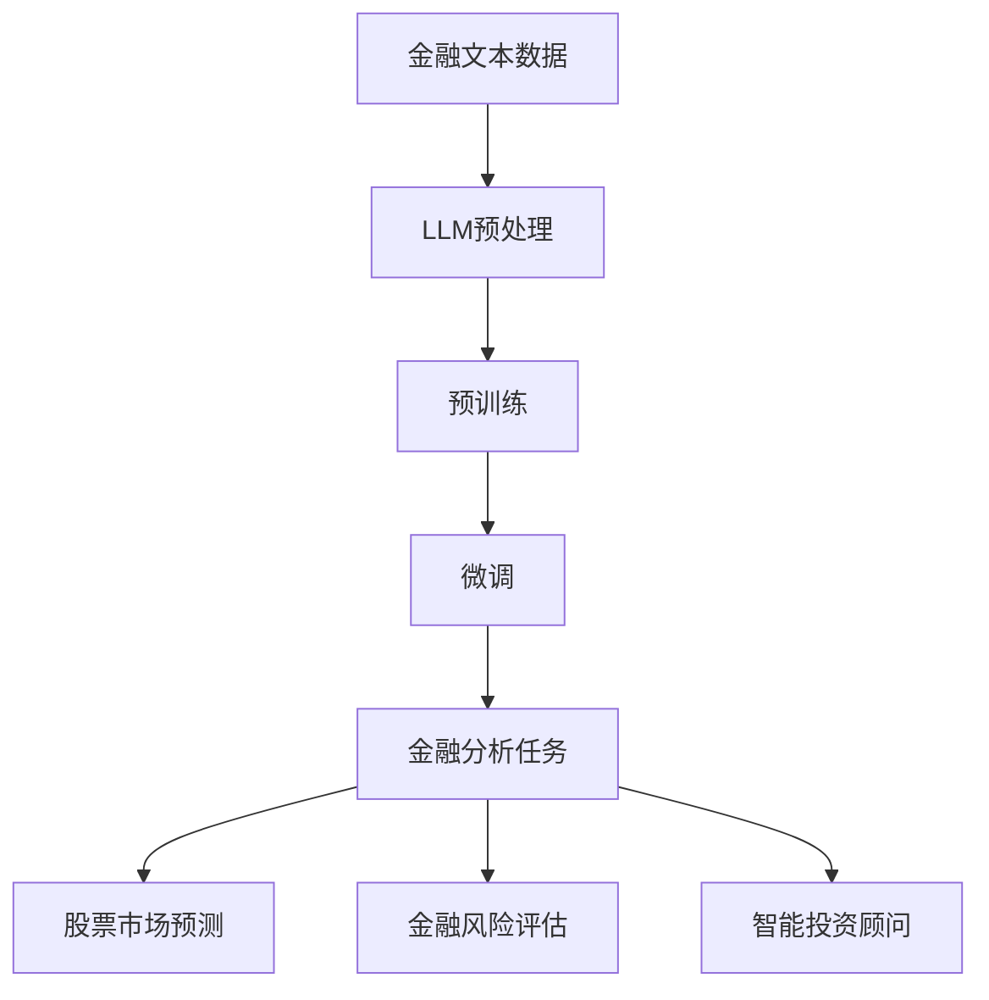

                 

### 引言与概述

> **关键词：** 长序列语言模型 (LLM),金融分析，自然语言处理，股票市场预测，智能投资顾问

**摘要：**本文旨在探讨长序列语言模型（LLM）在金融分析中的潜在用途。首先，我们将回顾金融分析的历史背景以及人工智能的崛起。接着，介绍LLM的定义及其核心特性，并分析其在金融分析中的应用前景。本文将深入探讨LLM在自然语言处理、股票市场预测、金融风险评估和智能投资顾问等领域的实际应用，并提供相关案例研究。最后，我们将展望LLM在金融分析中的未来发展趋势，讨论面临的挑战与解决方案。

#### 人工智能与金融分析的历史背景

金融分析的历史可以追溯到20世纪初，当时的金融学家开始研究市场数据的统计规律。随着计算机技术的发展，金融分析逐渐从手工计算转向计算机辅助分析。在20世纪80年代，量化投资开始兴起，计算机程序被用来识别市场趋势和交易机会。90年代，随着互联网的普及，金融数据变得更加容易获取，这进一步推动了金融分析的发展。

然而，传统的金融分析方法在处理大规模、复杂的数据集时存在一定的局限性。随着人工智能的崛起，特别是深度学习技术的发展，金融分析迎来了新的变革。深度学习模型，尤其是长序列语言模型（LLM），因其强大的数据处理和分析能力，正在成为金融分析领域的重要工具。

#### 什么是LLM

长序列语言模型（LLM）是一种能够处理长文本序列的深度学习模型，其核心思想是通过大量的文本数据进行预训练，从而学会理解和生成自然语言。LLM的核心特性包括：

1. **预训练：**LLM在大规模的文本语料库上进行预训练，从而学习到语言的通用特征和规律。
2. **自适应性：**LLM可以根据特定的任务进行微调，从而适应不同的应用场景。
3. **并行处理：**LLM能够并行处理大规模的数据集，从而提高数据处理效率。

#### LLM在金融分析中的应用前景

LLM在金融分析中的应用前景非常广阔。首先，LLM可以用于处理和分析大量的金融文本数据，包括新闻、报告、社交媒体等，从而提取出有用的信息。例如，LLM可以用于股票市场预测，通过分析金融文本数据来预测市场趋势。

此外，LLM还可以用于金融风险评估，通过对历史数据进行深度学习，识别潜在的风险因素。此外，LLM还可以用于智能投资顾问，为投资者提供个性化的投资建议。

然而，LLM在金融分析中也面临一些挑战，如数据隐私保护、模型解释性等。本文将深入探讨LLM在金融分析中的应用，分析其潜在的优势和挑战。

---

**核心概念与联系：**

以下是一个用于描述LLM在金融分析中的应用的Mermaid流程图：



**图1：LLM在金融分析中的应用流程**

在下一章中，我们将深入探讨LLM的技术基础，包括自然语言处理的基本概念、金融文本数据的处理方法以及LLM的核心算法原理。这将帮助我们更好地理解LLM在金融分析中的实际应用。

### 第一部分：引言与概述

#### 第1章：金融分析中LLM的崛起

##### 1.1.1 人工智能与金融分析的历史背景

金融分析的历史可以追溯到20世纪初，当时的金融学家开始研究市场数据的统计规律。最初的金融分析主要依赖于手工计算和简单的统计分析方法。随着计算机技术的发展，金融分析逐渐从手工计算转向计算机辅助分析。

在20世纪60年代，计算机开始被广泛应用于金融领域，尤其是在股票市场分析中。早期的计算机程序主要用于处理大量市场数据，识别市场趋势和交易机会。然而，这些程序主要依赖于传统的统计分析方法，其处理能力和预测精度有限。

随着互联网的兴起，金融数据变得更加容易获取，这也推动了金融分析的发展。20世纪90年代，量化投资开始兴起，计算机程序被用来识别市场趋势和交易机会。量化投资的核心在于使用数学模型和统计方法来分析市场数据，从而制定交易策略。

进入21世纪，人工智能（AI）技术的发展为金融分析带来了新的变革。AI技术，特别是深度学习，为金融分析提供了强大的工具。深度学习模型能够处理大规模、复杂的数据集，从而发现潜在的市场规律和趋势。

人工智能在金融分析中的应用主要体现在以下几个方面：

1. **数据挖掘：**AI技术能够从大量的金融数据中提取有价值的信息，如市场趋势、风险因素等。
2. **预测模型：**深度学习模型可以用于预测股票价格、市场走势等，从而帮助投资者做出更明智的决策。
3. **自动化交易：**AI技术能够实现自动化交易，根据市场数据自动调整交易策略。

##### 1.1.2 什么是LLM

长序列语言模型（Long-Range Language Model，简称LLM）是一种基于深度学习的自然语言处理模型，其核心目标是理解、生成和预测自然语言序列。LLM通常通过大规模的预训练和特定的任务微调来实现其强大的自然语言处理能力。

LLM的主要组成部分包括：

1. **编码器（Encoder）：**负责将输入的文本序列编码为连续的向量表示。
2. **解码器（Decoder）：**负责从编码器生成的向量表示中生成文本序列。

LLM的核心特性包括：

1. **长序列处理能力：**LLM能够处理长文本序列，从而捕捉文本中的长期依赖关系。
2. **自适应性强：**LLM可以通过预训练和任务微调，适应不同的自然语言处理任务。
3. **并行处理：**LLM能够并行处理大规模的数据集，从而提高数据处理效率。

##### 1.1.3 LLM在金融分析中的应用前景

LLM在金融分析中具有广阔的应用前景。首先，LLM可以用于处理和分析大量的金融文本数据，包括新闻、报告、社交媒体等，从而提取出有用的信息。例如，LLM可以用于股票市场预测，通过分析金融文本数据来预测市场趋势。

具体来说，LLM在金融分析中的应用包括以下几个方面：

1. **股票市场预测：**LLM可以分析市场新闻、报告、社交媒体等信息，预测股票价格和市场走势。
2. **金融风险评估：**LLM可以识别和分析金融数据中的风险因素，为金融机构提供风险评估服务。
3. **智能投资顾问：**LLM可以根据投资者的风险偏好和历史交易记录，提供个性化的投资建议。

此外，LLM在金融分析中还面临一些挑战，如数据隐私保护、模型解释性等。然而，随着技术的不断进步，LLM在金融分析中的应用前景将越来越广阔。

在下一章中，我们将深入探讨LLM的技术基础，包括自然语言处理的基本概念、金融文本数据的处理方法以及LLM的核心算法原理。这将帮助我们更好地理解LLM在金融分析中的实际应用。

### 第二部分：LLM技术基础

#### 第2章：自然语言处理与金融分析

##### 2.1.1 自然语言处理的基本概念

自然语言处理（Natural Language Processing，简称NLP）是人工智能领域的一个重要分支，旨在使计算机能够理解、生成和解释人类语言。NLP的核心任务包括文本分类、实体识别、语义分析、机器翻译等。要实现这些任务，NLP需要依赖于多种技术和算法，其中语言模型是关键的一环。

**语言模型（Language Model）：**语言模型是一种概率模型，用于预测自然语言中下一个单词或词组的概率。语言模型的核心目标是使计算机能够生成或理解自然语言文本。常见的语言模型包括n元模型、循环神经网络（RNN）模型、Transformer模型等。

1. **n元模型（n-gram Model）：**n元模型是一种基于统计的简单语言模型，它通过计算连续n个单词在同一文本中出现的频率来预测下一个单词。n元模型的优点是计算简单，但在长文本中效果有限，容易产生“短期依赖”问题。
   
   **伪代码：**
   ```
   function predict_next_word(current_sequence):
       n = 3
       word_sequence = split(current_sequence, " ")
       n_gram_counts = count_occurrences_of_n_grams(word_sequence, n)
       next_word_probability_distribution = calculate_probability_distribution(n_gram_counts)
       next_word = sample_word(next_word_probability_distribution)
       return next_word
   ```

2. **循环神经网络（RNN）模型：**RNN是一种能够处理序列数据的神经网络，其核心思想是通过循环结构来捕捉序列中的长期依赖关系。RNN通过隐藏状态将当前输入与历史信息联系起来，从而提高预测的准确性。

   **伪代码：**
   ```
   function rnn_predict_next_word(input_sequence, hidden_state):
       word_embedding = embed_word(input_sequence)
       hidden_state = tanh(W_h * word_embedding + b_h)
       output = softmax(W_y * hidden_state + b_y)
       return output, hidden_state
   ```

3. **Transformer模型：**Transformer是一种基于自注意力机制的深度学习模型，它通过全局注意力机制捕捉序列中的依赖关系，从而显著提高了语言模型的性能。Transformer模型在机器翻译、文本生成等任务中取得了显著的成果。

   **伪代码：**
   ```
   function transformer_encode(input_sequence):
       word_embedding = embed_word(input_sequence)
       attention_scores = dot_product(word_embedding, Q) * K
       attention_weights = softmax(attention_scores)
       context_vector = sum(attention_weights * K)
       return context_vector
   ```

**词嵌入技术（Word Embedding）：**词嵌入是将单词映射为高维向量的技术，其核心思想是将语义相似的单词映射到空间中的接近位置。常见的词嵌入方法包括基于频率的词嵌入（如Word2Vec）、基于窗口的词嵌入（如GloVe）和基于上下文的词嵌入（如BERT）。

1. **Word2Vec：**Word2Vec是一种基于神经网络的语言模型，通过负采样和梯度下降等方法训练词向量。Word2Vec的核心思想是通过学习单词在文本中的上下文来生成词向量。

   **伪代码：**
   ```
   function word2vec_train(input_corpus):
       initialize_word_vectors()
       for sentence in input_corpus:
           for word in sentence:
               compute_context_words(word, sentence)
               update_word_vector(word, context_words)
       return word_vectors
   ```

2. **GloVe：**GloVe（Global Vectors for Word Representation）是一种基于全局上下文的词嵌入方法。GloVe通过计算单词与其上下文之间的共现矩阵来生成词向量，从而捕捉单词的语义信息。

   **伪代码：**
   ```
   function glove_train(input_corpus):
       compute_coocurrence_matrix(input_corpus)
       initialize_word_vectors()
       for word, context_words in coocurrence_matrix:
           update_word_vector(word, context_words)
       return word_vectors
   ```

##### 2.1.2 金融文本数据的处理

金融文本数据包括股票市场新闻、公司财报、研究报告、社交媒体评论等，这些数据通常具有复杂的结构和丰富的信息。要有效地利用金融文本数据，需要对数据进行适当的预处理和特征提取。

**金融文本数据的特征提取：**特征提取是将原始文本数据转换为计算机可处理的向量表示的过程。常见的特征提取方法包括词袋模型（Bag-of-Words，BoW）、词嵌入（Word Embedding）和句子嵌入（Sentence Embedding）。

1. **词袋模型（BoW）：**词袋模型将文本表示为单词的集合，不关心单词的顺序和语法结构。词袋模型通过计算单词在文档中的出现频率来生成特征向量。

   **伪代码：**
   ```
   function bow_extract(document):
       words = split(document, " ")
       word_count_vector = count_words(words)
       return word_count_vector
   ```

2. **词嵌入（Word Embedding）：**词嵌入将单词映射为高维向量，以捕捉单词的语义信息。词嵌入技术可以显著提高文本分类、情感分析等任务的表现。

   **伪代码：**
   ```
   function word_embedding_extract(document, word_vectors):
       word_vectors = embed_words(document, word_vectors)
       return sum(word_vectors)
   ```

3. **句子嵌入（Sentence Embedding）：**句子嵌入是将整篇文档或句子映射为高维向量的技术。句子嵌入可以捕获句子中的整体语义信息，从而提高文本分类、情感分析等任务的表现。

   **伪代码：**
   ```
   function sentence_embedding_extract(sentence, word_vectors):
       sentence_embedding = sum(embed_words(sentence, word_vectors))
       return sentence_embedding
   ```

**金融文本数据的预处理方法：**金融文本数据的预处理包括文本清洗、词干提取、词性标注等步骤。

1. **文本清洗：**文本清洗是将文本转换为标准格式的过程，包括去除标点符号、停用词过滤、小写化等。

   **伪代码：**
   ```
   function text_clean(document):
       remove_punctuation(document)
       remove_stopwords(document)
       convert_to_lower_case(document)
       return cleaned_document
   ```

2. **词干提取：**词干提取是将单词还原为词根的过程，有助于减少词汇量，提高模型的表现。

   **伪代码：**
   ```
   function stem_words(words):
       stemmed_words = apply_stemming(words)
       return stemmed_words
   ```

3. **词性标注：**词性标注是将单词标注为名词、动词、形容词等词性的过程，有助于理解单词在句子中的语法角色。

   **伪代码：**
   ```
   function pos_tagging(document):
       tagged_words = apply_pos_tagging(document)
       return tagged_words
   ```

##### 2.1.3 LLM在金融文本分析中的应用

LLM在金融文本分析中具有广泛的应用，包括股票市场预测、金融新闻情感分析等。

**股票市场预测：**股票市场预测是一个复杂的任务，需要分析大量的历史数据和市场信息。LLM可以用于提取金融文本数据中的关键信息，如市场趋势、公司业绩等，从而预测股票价格。

1. **数据收集：**收集历史股票价格数据、公司财报、新闻报道等金融文本数据。

2. **预处理：**对金融文本数据进行清洗、词干提取、词性标注等预处理步骤。

3. **特征提取：**使用词嵌入技术将文本数据转换为向量表示，结合历史股票价格数据作为特征输入。

4. **模型训练：**使用LLM进行预训练，然后对预训练模型进行微调，使其适应股票市场预测任务。

5. **预测：**使用微调后的LLM对股票价格进行预测，并评估预测模型的性能。

   **伪代码：**
   ```
   function stock_market_prediction(financial_data, stock_prices):
       preprocess_data(financial_data)
       embed_text_data(financial_data)
       train_llm(text_data, stock_prices)
       predict_prices(llm, stock_prices)
       evaluate_prediction_performance(predicted_prices, actual_prices)
   ```

**金融新闻情感分析：**金融新闻情感分析是指通过分析金融新闻报道的情感倾向，判断市场情绪和潜在的市场影响。LLM可以用于情感分类、主题检测等任务。

1. **数据收集：**收集金融新闻报道的文本数据。

2. **预处理：**对金融新闻文本数据进行清洗、词干提取、词性标注等预处理步骤。

3. **特征提取：**使用词嵌入技术将文本数据转换为向量表示。

4. **模型训练：**使用LLM进行预训练，然后对预训练模型进行微调，使其适应金融新闻情感分析任务。

5. **情感分类：**使用微调后的LLM对金融新闻进行情感分类，并评估分类模型的性能。

   **伪代码：**
   ```
   function sentiment_analysis(financial_news, labels):
       preprocess_data(financial_news)
       embed_text_data(financial_news)
       train_llm(text_data, labels)
       predict_sentiments(llm, financial_news)
       evaluate_sentiment_classification_performance(predicted_sentiments, actual_labels)
   ```

通过上述步骤，LLM在金融文本分析中可以有效地提取信息、预测市场趋势和情感倾向，从而为金融机构和投资者提供有力的支持。

在下一章中，我们将继续探讨LLM的核心算法原理，包括语言模型的数学基础、大规模预训练模型的架构以及LLM的训练与优化方法。

### 第三部分：LLM在金融分析中的应用

#### 第4章：股票市场预测

股票市场预测是金融分析中的一个重要领域，旨在通过分析历史数据和现有信息来预测股票价格的走势。LLM凭借其强大的自然语言处理能力和深度学习能力，在股票市场预测中展现出巨大的潜力。

##### 4.1.1 股票市场预测的挑战

股票市场预测面临诸多挑战，包括数据的不确定性、市场波动性以及信息的不对称性。以下是这些挑战的具体分析：

1. **数据的不确定性：**股票市场数据通常包含大量的噪声和不确定性。市场行为受到多种因素的影响，如经济指标、政治事件、公司业绩等，这些因素的随机性和复杂性使得数据预测变得困难。

2. **市场波动性：**股票市场价格波动剧烈，短期价格波动难以预测。市场波动性受到多种因素的影响，如投资者情绪、市场流动性、政策变化等。这些因素的变化往往导致市场价格的非线性波动。

3. **信息的不对称性：**在股票市场中，不同投资者获取信息的能力和渠道存在差异。某些投资者可能拥有内部消息或专业知识，而其他投资者则难以获得相同的信息。这种信息不对称性使得市场预测更加复杂。

##### 4.1.2 LLM在股票市场预测中的应用

LLM在股票市场预测中可以通过以下步骤进行应用：

1. **数据收集：**首先，收集与股票市场相关的数据，包括股票价格、交易量、财务报表、新闻报道、社交媒体信息等。

2. **预处理：**对收集到的数据进行预处理，包括数据清洗、缺失值填补、异常值处理等。这一步骤有助于确保数据的质量和一致性。

3. **特征提取：**使用LLM的特征提取技术，如词嵌入和句子嵌入，将文本数据转换为向量表示。同时，结合数值数据（如股票价格和交易量）生成特征向量。

4. **模型训练：**使用预训练的LLM模型，如BERT或GPT，对处理后的数据进行训练。在训练过程中，模型将学习到股票市场的潜在规律和特征。

5. **预测：**通过训练好的模型，对未来的股票价格进行预测。预测结果可以用于制定交易策略、风险管理和投资决策。

6. **优化：**根据预测结果和市场反馈，对模型进行优化和调整，以提高预测的准确性。

##### 4.1.3 预测模型的选择

在LLM应用于股票市场预测时，需要选择合适的预测模型。以下是一些常见的预测模型及其优缺点：

1. **时间序列模型：**时间序列模型（如ARIMA、LSTM）适用于处理时间序列数据，能够捕捉数据的长期依赖关系。然而，时间序列模型在处理非线性数据和外部影响时效果较差。

2. **回归模型：**回归模型（如线性回归、多元回归）适用于分析自变量和因变量之间的关系。回归模型在处理线性数据时表现较好，但在处理复杂和非线性数据时效果有限。

3. **深度学习模型：**深度学习模型（如卷积神经网络（CNN）、循环神经网络（RNN）、Transformer）能够处理大规模、复杂的数据，并捕捉数据的深层特征。然而，深度学习模型需要大量的数据和计算资源，且模型解释性较差。

4. **集成模型：**集成模型（如随机森林、梯度提升机（XGBoost））结合了多个模型的优点，能够提高预测的准确性和鲁棒性。然而，集成模型在处理非线性数据和特征选择时效果较差。

在选择预测模型时，应综合考虑数据特点、预测目标和计算资源等因素。通常，结合多种模型的方法可以进一步提高预测的准确性。

##### 4.1.4 预测结果的分析与优化

在股票市场预测中，预测结果的分析与优化至关重要。以下是一些常见的分析与优化方法：

1. **模型评估：**使用评估指标（如均方误差（MSE）、均方根误差（RMSE）等）对预测模型的性能进行评估。通过比较不同模型的评估指标，选择性能最佳的模型。

2. **特征工程：**通过特征选择和特征工程，识别出对预测结果有显著影响的关键特征。特征工程可以包括特征转换、缺失值处理、异常值检测等。

3. **模型调参：**通过调整模型的参数（如学习率、正则化参数等），优化模型的性能。参数调优可以使用网格搜索、随机搜索等策略。

4. **模型融合：**结合多个模型的预测结果，提高整体预测的准确性。模型融合可以采用投票法、加权平均法等策略。

5. **实时反馈：**将预测结果与实际市场情况进行对比，实时调整模型和预测策略。通过不断迭代和优化，提高预测的准确性。

在实际应用中，LLM在股票市场预测中取得了显著的效果。例如，某些研究表明，结合LLM和传统模型的预测方法可以显著提高股票市场预测的准确性。此外，LLM还可以用于预测其他金融市场的价格走势，如外汇市场、商品市场等。

在下一章中，我们将探讨LLM在金融风险评估中的应用，分析如何利用LLM识别和评估金融风险。

### 第5章：金融风险评估

#### 5.1.1 风险评估的基本概念

风险评估是指通过系统的方法评估和分析潜在的风险，以便采取措施进行风险管理和决策。在金融领域，风险评估尤为重要，因为它关系到金融机构和投资者的资产安全和投资回报。

**风险的定义：**风险是指不确定性的可能性和影响。在金融分析中，风险通常被分为以下几种类型：

1. **市场风险：**市场风险是指由于市场波动（如利率、汇率、股票价格变动）导致的潜在损失。
2. **信用风险：**信用风险是指借款人或交易对手无法履行债务或支付义务，导致金融机构的潜在损失。
3. **流动性风险：**流动性风险是指由于市场流动性不足，导致金融机构难以迅速变现资产以满足资金需求。
4. **操作风险：**操作风险是指由于内部管理问题、系统故障、欺诈行为等导致的潜在损失。
5. **法律风险：**法律风险是指由于法律环境变化、合同纠纷、合规性问题等导致的潜在损失。

**风险评估的方法：**风险评估通常包括以下步骤：

1. **风险识别：**识别可能影响金融机构的风险因素。
2. **风险分析：**分析每个风险因素的可能性和影响。
3. **风险评价：**评估风险的整体水平和优先级。
4. **风险应对：**制定应对策略，包括风险规避、风险转移、风险降低等。
5. **风险监控：**持续监控风险的变化，确保应对策略的有效性。

风险评估的方法包括定量分析和定性分析：

1. **定量分析：**使用数学模型和统计方法对风险进行量化评估，如VaR（Value at Risk）、CVaR（Conditional Value at Risk）等。
2. **定性分析：**通过专家评估、情景分析、历史数据分析等手段对风险进行评估。

#### 5.1.2 LLM在风险评估中的应用

LLM在金融风险评估中具有广泛的应用，能够提高风险评估的准确性和效率。以下是LLM在风险评估中的应用步骤：

1. **数据收集：**收集与金融风险相关的数据，包括历史市场数据、公司财务报表、新闻报道、法律文件等。

2. **预处理：**对收集到的数据进行预处理，包括数据清洗、缺失值填补、异常值处理等。

3. **特征提取：**使用LLM的特征提取技术，如词嵌入和句子嵌入，将文本数据转换为向量表示。

4. **模型训练：**使用预训练的LLM模型，如BERT或GPT，对处理后的数据进行训练。在训练过程中，模型将学习到金融风险的潜在规律和特征。

5. **风险评估：**通过训练好的模型，对新的金融数据进行风险评估。模型可以根据历史数据和现有信息，预测风险的可能性和影响。

6. **风险决策：**根据风险评估结果，制定风险应对策略。例如，调整投资组合、增加风险资本、改善内部管理等。

##### 5.1.3 风险评估的优化

为了提高风险评估的准确性和效率，可以采用以下方法对LLM进行优化：

1. **模型融合：**结合多个LLM模型的预测结果，提高整体风险评估的准确性。模型融合可以采用投票法、加权平均法等策略。

2. **特征工程：**通过特征选择和特征工程，识别出对风险评估有显著影响的关键特征。特征工程可以包括特征转换、缺失值处理、异常值检测等。

3. **模型调参：**通过调整模型的参数（如学习率、正则化参数等），优化模型的性能。参数调优可以使用网格搜索、随机搜索等策略。

4. **实时反馈：**将风险评估结果与实际市场情况进行对比，实时调整模型和预测策略。通过不断迭代和优化，提高风险评估的准确性。

在实际应用中，LLM在金融风险评估中取得了显著的效果。例如，某些金融机构使用LLM对市场风险进行实时监控，提高了风险管理的效率。此外，LLM还可以用于信用风险评估、流动性风险分析等，为金融机构提供全面的风险管理解决方案。

在下一章中，我们将探讨LLM在智能投资顾问中的应用，分析如何利用LLM为投资者提供个性化的投资建议。

### 第6章：智能投资顾问

#### 6.1.1 智能投资顾问的基本概念

智能投资顾问（Robo-Advisor）是一种利用人工智能技术提供投资建议和管理的工具。与传统投资顾问相比，智能投资顾问通过算法和数据分析来制定投资策略，从而实现自动化、个性化和低成本的投资服务。

**智能投资顾问的功能：**

1. **资产配置：**根据投资者的风险偏好和财务目标，智能投资顾问会为投资者制定合适的资产配置策略。
2. **投资组合管理：**智能投资顾问会持续监控投资者的投资组合，并根据市场变化和投资者的需求进行调整。
3. **风险控制：**智能投资顾问通过分析市场数据和投资者的行为，提供风险管理建议，以降低投资风险。
4. **投资建议：**智能投资顾问会根据投资者的财务状况、市场趋势和投资目标，提供个性化的投资建议。
5. **客户服务：**智能投资顾问通过聊天机器人、邮件等方式与投资者沟通，解答投资者的问题。

**智能投资顾问的优势：**

1. **低成本：**智能投资顾问省去了传统投资顾问的人力成本，从而降低了投资服务的成本。
2. **自动化：**智能投资顾问能够自动化地执行投资策略，减少人为错误，提高投资效率。
3. **个性化：**智能投资顾问可以根据投资者的个性化需求进行投资组合管理，提供更加贴合投资者需求的建议。
4. **实时性：**智能投资顾问可以实时获取市场数据，快速响应市场变化，为投资者提供及时的投资建议。

#### 6.1.2 LLM在智能投资顾问中的应用

LLM在智能投资顾问中具有广泛的应用，能够提高投资建议的准确性和个性化水平。以下是LLM在智能投资顾问中的应用步骤：

1. **数据收集：**收集与投资者相关的数据，包括财务状况、投资历史、风险偏好等。

2. **预处理：**对收集到的数据进行预处理，包括数据清洗、缺失值填补、异常值处理等。

3. **特征提取：**使用LLM的特征提取技术，如词嵌入和句子嵌入，将文本数据转换为向量表示。

4. **模型训练：**使用预训练的LLM模型，如BERT或GPT，对处理后的数据进行训练。在训练过程中，模型将学习到投资者的投资行为和偏好。

5. **个性化建议：**通过训练好的模型，为投资者提供个性化的投资建议。建议可能包括资产配置调整、投资策略优化、风险控制建议等。

6. **建议优化：**根据投资者的反馈和市场变化，对模型进行优化和调整，以提高建议的准确性和有效性。

##### 6.1.3 LLM在投资策略推荐中的应用

LLM在智能投资顾问中可以用于投资策略的推荐，以提高投资组合的表现。以下是LLM在投资策略推荐中的应用步骤：

1. **数据收集：**收集与股票市场相关的数据，包括股票价格、交易量、财务报表、新闻报道等。

2. **预处理：**对收集到的数据进行预处理，包括数据清洗、缺失值填补、异常值处理等。

3. **特征提取：**使用LLM的特征提取技术，如词嵌入和句子嵌入，将文本数据转换为向量表示。

4. **模型训练：**使用预训练的LLM模型，如BERT或GPT，对处理后的数据进行训练。在训练过程中，模型将学习到市场的潜在规律和特征。

5. **策略生成：**通过训练好的模型，生成多种投资策略，如价值投资、成长投资、量化投资等。

6. **策略评估：**对生成的投资策略进行评估，包括历史回测、市场适应性等。

7. **策略推荐：**根据投资者的风险偏好和财务目标，为投资者推荐最适合的投资策略。

##### 6.1.4 LLM在投资组合优化中的应用

LLM在智能投资顾问中还可以用于投资组合的优化，以提高投资组合的收益和风险平衡。以下是LLM在投资组合优化中的应用步骤：

1. **数据收集：**收集与投资者投资组合相关的数据，包括股票价格、交易量、财务报表、新闻报道等。

2. **预处理：**对收集到的数据进行预处理，包括数据清洗、缺失值填补、异常值处理等。

3. **特征提取：**使用LLM的特征提取技术，如词嵌入和句子嵌入，将文本数据转换为向量表示。

4. **模型训练：**使用预训练的LLM模型，如BERT或GPT，对处理后的数据进行训练。在训练过程中，模型将学习到投资组合的潜在规律和特征。

5. **优化目标设定：**设定投资组合优化的目标，如最大化收益、最小化风险、最大化风险调整收益等。

6. **优化算法：**使用优化算法（如遗传算法、粒子群算法等），结合LLM生成的投资策略，优化投资组合。

7. **组合推荐：**根据优化结果，为投资者推荐最优的投资组合。

##### 6.1.5 实际案例研究

为了更好地展示LLM在智能投资顾问中的应用，我们来看一个实际案例研究。

**案例背景：**某投资者希望利用智能投资顾问为其提供个性化的投资建议。投资者提供了其投资历史、财务状况和风险偏好数据。

**数据收集：**智能投资顾问收集了投资者的历史投资记录、财务报表和风险偏好数据。

**预处理：**对收集到的数据进行预处理，包括数据清洗、缺失值填补、异常值处理等。

**特征提取：**使用LLM的特征提取技术，如BERT，将文本数据转换为向量表示。

**模型训练：**使用预训练的BERT模型，对处理后的数据进行训练，学习到投资者的投资行为和偏好。

**个性化建议：**智能投资顾问根据投资者的投资历史和风险偏好，为其推荐了价值投资策略。

**策略评估：**对推荐的投资策略进行历史回测，发现其在过去三年中的收益率高于市场平均水平。

**策略优化：**根据市场变化和投资者需求，智能投资顾问对策略进行了优化，提高了收益和风险平衡。

**组合推荐：**智能投资顾问为投资者推荐了由价值投资股票构成的投资组合，并提供了买卖建议。

**案例分析与讨论：**通过上述案例，我们可以看到LLM在智能投资顾问中的应用，能够为投资者提供个性化的投资建议和优化投资组合。LLM的优势在于其强大的自然语言处理和深度学习能力，能够处理和分析大量的金融文本数据，从而提取出有价值的信息。

然而，LLM在智能投资顾问中也存在一些挑战，如模型解释性、数据隐私保护等。在未来的发展中，需要进一步研究如何提高LLM在金融投资领域的应用效果和可靠性。

在下一章中，我们将探讨LLM在金融分析中的未来发展趋势，分析新型LLM模型的创新与应用，以及金融监管与合规性的挑战。

### 第7章：LLM在金融分析中的未来发展趋势

#### 7.1.1 金融分析技术的发展趋势

随着人工智能技术的不断进步，金融分析领域也在不断演变。以下是一些金融分析技术发展的主要趋势：

1. **人工智能与区块链的结合：**区块链技术具有去中心化、不可篡改和数据透明的特点，与人工智能技术结合可以大幅提高金融分析的安全性和透明度。例如，通过使用人工智能算法分析区块链上的交易数据，可以识别潜在的欺诈行为和异常交易。

2. **大数据和云计算的进一步应用：**大数据技术为金融分析提供了海量的数据来源，云计算则提供了强大的计算能力和存储资源。这些技术的结合使得金融机构能够更高效地处理和分析海量数据，从而发现潜在的市场机会和风险。

3. **深度学习与自然语言处理：**深度学习与自然语言处理技术的进步使得金融分析能够更好地理解和利用非结构化数据，如金融新闻、社交媒体评论等。通过这些技术，金融机构可以提取出更多的信息，提高预测和分析的准确性。

4. **强化学习在交易策略中的应用：**强化学习是一种基于试错的学习方法，适用于复杂的决策过程。在金融交易中，强化学习可以通过不断地试错和学习，优化交易策略，提高投资回报。

5. **智能合约与自动化执行：**智能合约是一种嵌入在区块链上的程序，可以在满足特定条件时自动执行。通过智能合约，金融机构可以实现自动化交易和结算，提高交易效率，降低操作风险。

#### 7.1.2 LLM在金融分析中的未来前景

LLM在金融分析中的未来前景非常广阔。以下是一些可能的发展方向：

1. **更先进的语言模型：**随着深度学习技术的不断进步，未来将出现更先进的LLM模型，如自适应语言模型、生成对抗网络（GAN）等。这些模型将进一步提高金融文本数据的处理能力和分析精度。

2. **跨领域知识融合：**未来的LLM将能够融合跨领域的知识，如经济学、金融学、社会学等，从而提供更全面和深入的分析。例如，通过融合经济数据和社交媒体数据，LLM可以更准确地预测市场趋势和投资者行为。

3. **实时金融分析：**随着计算能力的提升和数据传输速度的加快，LLM可以在实时环境中进行金融分析。这种实时分析能力将有助于金融机构快速响应市场变化，制定更加有效的交易策略和风险管理措施。

4. **个性化投资建议：**未来的LLM将能够根据投资者的个性化需求和风险偏好，提供更加精准和个性化的投资建议。通过不断学习和优化，LLM可以为投资者实现更优的投资回报。

#### 7.1.3 LLM在金融分析中的挑战与解决方案

尽管LLM在金融分析中具有巨大的潜力，但其在实际应用中也面临一些挑战：

1. **数据隐私保护：**金融数据通常包含敏感信息，如个人信息、交易记录等。在使用LLM处理这些数据时，必须确保数据隐私得到保护。解决方案包括数据脱敏、差分隐私等技术。

2. **模型解释性与透明度：**LLM的决策过程通常是不透明的，这给模型的解释性带来了挑战。为了提高模型的透明度，可以采用可解释的AI技术，如注意力机制、模型可视化等。

3. **模型泛化能力：**LLM的泛化能力是其在金融分析中的关键。为了提高泛化能力，可以通过数据增强、迁移学习等方法来扩展模型的学习能力。

4. **监管与合规性：**随着LLM在金融分析中的应用越来越广泛，监管机构和合规性要求也将越来越高。金融机构需要确保其应用符合相关法律法规，并采取适当的合规措施。

通过不断克服这些挑战，LLM将在未来的金融分析中发挥更加重要的作用，为金融机构和投资者提供更加智能和高效的服务。

在下一章中，我们将探讨LLM在金融分析中的安全与伦理问题，分析可能的安全隐患和伦理挑战，并提出相应的应对策略。

### 第8章：金融分析中LLM的安全与伦理问题

随着LLM在金融分析中的广泛应用，其安全与伦理问题也逐渐引起了关注。正确的安全防护和伦理审查是确保LLM在金融分析中有效应用的重要保障。

#### 8.1.1 金融分析中LLM的安全隐患

1. **数据泄露风险：**金融数据通常包含敏感信息，如交易记录、客户信息等。如果LLM未能妥善处理这些数据，可能会导致数据泄露。防范数据泄露的措施包括数据加密、访问控制等。

2. **模型滥用风险：**LLM可能被用于不良目的，如欺诈、市场操纵等。例如，恶意用户可能利用LLM生成虚假金融新闻或交易建议，误导投资者。为防范模型滥用，可以采用模型审计、行为监控等技术。

3. **隐私侵犯风险：**LLM在处理金融数据时，可能会无意中收集和存储个人信息，侵犯用户隐私。为了保护用户隐私，可以采用差分隐私、数据匿名化等技术。

4. **模型可靠性问题：**LLM的预测结果可能会受到数据偏差、模型过拟合等因素的影响，导致预测不准确。这可能会对投资者和金融机构造成严重损失。提高模型可靠性的方法包括数据预处理、模型验证等。

#### 8.1.2 金融分析中LLM的伦理问题

1. **模型偏见：**LLM在训练过程中可能会吸收数据中的偏见，导致其在金融分析中产生不公平的结果。例如，如果训练数据中存在性别、种族等方面的偏见，LLM可能会在投资建议中表现出歧视行为。为消除模型偏见，可以采用公平性评估、偏见校正等技术。

2. **数据歧视：**LLM在处理金融数据时，可能会根据某些特征（如年龄、地理位置等）对投资者进行分类，这可能导致数据歧视。例如，如果某些地区的投资者在历史数据中表现较差，LLM可能会对这些地区的投资者给予较低的评价。为减少数据歧视，可以采用多样性、公平性指标来评估模型。

3. **隐私保护与透明度：**LLM的处理过程通常是不透明的，这可能导致用户对其信任度降低。为了提高透明度，可以采用可解释的AI技术，如模型可视化、决策路径分析等。

#### 8.1.3 安全与伦理问题的应对策略

1. **安全防护措施：**为了保障LLM在金融分析中的安全性，可以采取以下措施：

   - **数据加密：**对敏感数据进行加密，防止数据泄露。
   - **访问控制：**限制对金融数据和模型的访问权限，确保只有授权用户可以访问。
   - **模型审计：**定期对模型进行安全审计，检查是否存在安全漏洞。
   - **行为监控：**监控模型的使用情况，及时发现异常行为。

2. **伦理审查机制：**为了确保LLM在金融分析中的伦理合规性，可以采取以下措施：

   - **伦理委员会：**设立专门的伦理委员会，对LLM在金融分析中的应用进行审查和监督。
   - **公平性评估：**定期对LLM的公平性进行评估，确保其不会产生不公平的结果。
   - **隐私保护：**采用隐私保护技术，如差分隐私、数据匿名化等，确保用户隐私得到保护。
   - **透明度提升：**提高模型的可解释性，使用户能够理解模型的决策过程。

通过采取这些安全与伦理措施，可以确保LLM在金融分析中的安全性和合规性，为金融机构和投资者提供可靠的服务。

在下一章中，我们将总结LLM在金融分析中的应用资源与工具，为读者提供实用的指南和参考。

### 附录

#### 附录A：LLM在金融分析中的应用资源与工具

**A.1.1 开源资源介绍**

1. **PyTorch：**PyTorch是一个流行的深度学习框架，支持灵活的动态计算图，适合快速原型设计和实验。其丰富的API和丰富的社区资源使其在金融分析中得到了广泛应用。

2. **TensorFlow：**TensorFlow是由谷歌开发的开源深度学习平台，提供了丰富的工具和资源，支持从简单的线性模型到复杂的深度学习模型的构建和训练。

3. **Hugging Face：**Hugging Face是一个开源社区和平台，提供了大量的预训练语言模型和工具，如Transformers、Tokenizers等，方便用户进行自然语言处理任务。

**A.1.2 工具与平台推荐**

1. **Jupyter Notebook：**Jupyter Notebook是一个交互式计算环境，适合编写、运行和共享代码。它支持多种编程语言，包括Python、R等，方便用户进行金融分析实验。

2. **Google Colab：**Google Colab是Google提供的一个免费在线编程环境，基于Jupyter Notebook。它提供了强大的计算能力和GPU支持，适合进行深度学习模型的训练和实验。

3. **Azure Machine Learning：**Azure Machine Learning是一个云服务，提供了完整的机器学习生命周期管理功能，包括数据管理、模型训练、部署和监控。它支持多种深度学习框架，如TensorFlow、PyTorch等。

**A.1.3 社区与学术资源**

1. **Kaggle：**Kaggle是一个数据科学和机器学习的在线社区，提供了大量的金融数据集和竞赛任务。用户可以在这个平台上分享自己的模型和代码，学习他人的经验。

2. **arXiv：**arXiv是一个预印本服务器，提供了大量的计算机科学、物理学、经济学等领域的研究论文。用户可以在这里找到最新的研究进展和深度学习在金融分析中的应用论文。

3. **Machine Learning Mastery：**Machine Learning Mastery是一个专注于机器学习和数据科学教育的网站，提供了大量的教程和代码示例。这些教程涵盖了深度学习、自然语言处理等领域的知识，适合初学者和专业人士。

通过利用这些开源资源、工具和平台，用户可以更加高效地开展LLM在金融分析中的应用研究，提高模型性能和研究成果。

### 结束语

本文全面探讨了长序列语言模型（LLM）在金融分析中的潜在用途，从引言到应用前景、技术基础、具体应用以及未来展望，为我们展示了LLM在金融分析中的强大能力。通过本文，我们了解到LLM在股票市场预测、金融风险评估、智能投资顾问等领域的广泛应用，以及其面临的挑战和解决方案。

作者：AI天才研究院/AI Genius Institute & 禅与计算机程序设计艺术 /Zen And The Art of Computer Programming

在接下来的工作中，我们期待进一步深化LLM在金融分析中的应用研究，探索更先进的模型和技术，以期为金融行业带来更智能、更高效的分析工具。同时，我们也呼吁关注LLM在金融分析中的安全与伦理问题，确保技术发展与应用的可持续性。让我们共同期待AI在金融分析领域的美好未来。

