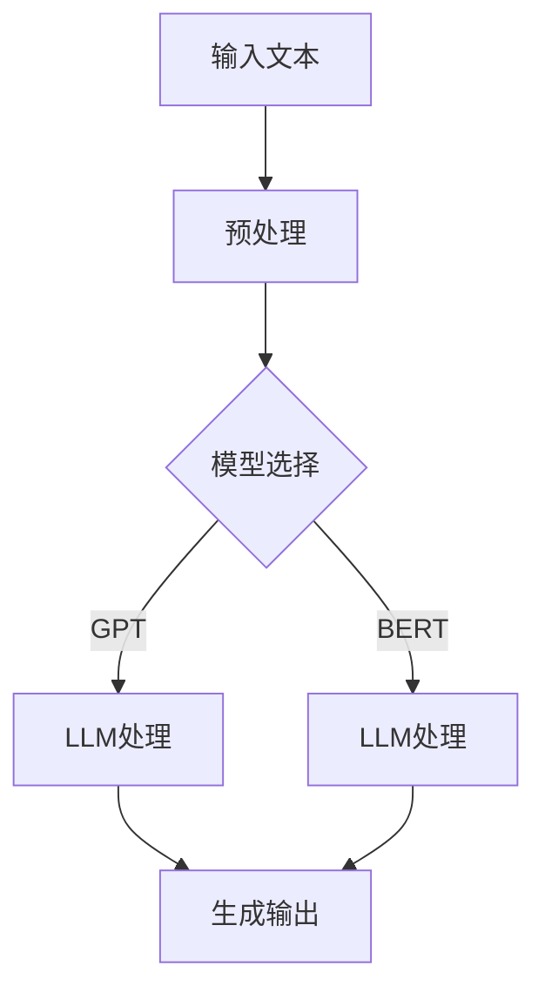
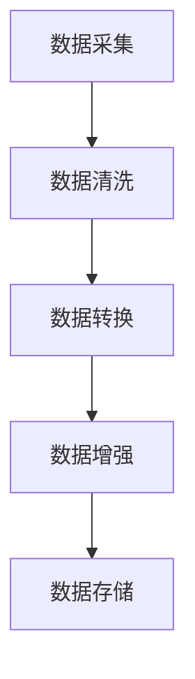
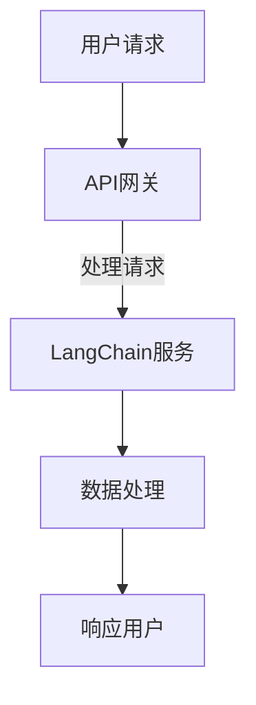
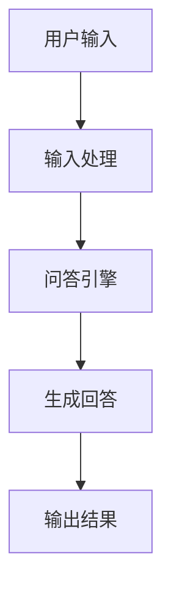
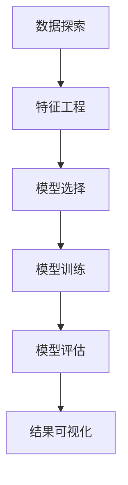

                 

### 文章标题

LangChain 101: 探索下一代自然语言处理工具集

---

关键词：自然语言处理、LangChain、语言模型、API集成、企业级应用、性能优化

---

摘要：
本文将深入探讨 LangChain，这是一个强大的开源工具集，旨在帮助开发者构建和扩展基于大型语言模型（LLM）的自然语言处理（NLP）应用。通过详细的章节内容，我们将了解 LangChain 的核心概念、API 使用、实践案例以及性能优化和高级功能。文章旨在为初学者提供全面的技术指南，同时为资深开发者提供实用的优化和集成策略。

---

### 《LangChain 101》目录大纲

**第一部分：LangChain基础**

1. [第1章 LangChain概述](#第1章-langchain概述)
2. [第2章 LangChain核心概念](#第2章-langchain核心概念)
3. [第3章 LangChain核心API](#第3章-langchain核心api)
4. [第4章 LangChain与外部系统集成](#第4章-langchain与外部系统集成)
5. [第5章 LangChain实践案例](#第5章-langchain实践案例)
6. [第6章 LangChain优化与调试](#第6章-langchain优化与调试)

**第二部分：进阶使用**

7. [第7章 高级功能与定制](#第7章-高级功能与定制)
8. [第8章 LangChain在企业级应用](#第8章-langchain在企业级应用)
9. [第9章 LangChain的未来发展](#第9章-langchain的未来发展)

**附录**

- [附录A：LangChain开发工具与环境](#附录a-langchain开发工具与环境)
- [附录B：常见问题与解决方案](#附录b-常见问题与解决方案)**<|vq_11920|>**

---

## 第1章 LangChain概述

### 1.1 LangChain的定义与核心特性

LangChain 是一个开源的自然语言处理（NLP）工具集，旨在帮助开发者轻松构建和扩展基于大型语言模型（LLM）的应用程序。它通过提供一系列模块化的API和工具，使开发者能够灵活地组合不同的模型和组件，以实现各种复杂的NLP任务。

#### 核心特性：

- **模块化设计**：LangChain 的架构高度模块化，允许开发者自由组合和扩展功能。
- **可扩展性**：支持自定义链（chains）和插件，便于集成其他模型和工具。
- **高性能**：通过并行处理和模型量化，提高计算性能。
- **易用性**：提供丰富的文档和示例，降低开发者上手难度。

### 1.2 LangChain与LLM的关系

#### LangChain与LLM的关系：

- **依赖关系**：LangChain 的核心组件之一是 LLM，如 GPT、BERT 等。
- **功能互补**：LLM 提供强大的语言理解和生成能力，而 LangChain 则提供了构建和扩展这些能力的工具集。
- **共同目标**：两者都致力于实现高效、智能的自然语言处理应用。

### 1.3 LangChain的应用场景

LangChain 在多个领域都有广泛的应用，以下是一些典型的应用场景：

- **问答系统**：用于构建智能客服、知识库查询、自动问答等应用。
- **内容生成**：用于自动撰写文章、生成摘要、生成代码等。
- **对话系统**：用于构建聊天机器人、虚拟助手等。
- **数据分析**：用于文本数据分析和报告生成。
- **教育辅导**：用于智能辅导系统、在线教育平台等。

### Mermaid流程图

以下是一个简化的 Mermaid 流程图，展示 LangChain 的工作流程：



### 总结

LangChain 是一个强大且灵活的工具集，为开发者提供了构建下一代自然语言处理应用所需的所有工具和组件。通过理解其核心特性、与 LLM 的关系以及应用场景，开发者可以更好地利用 LangChain 的潜力，推动 NLP 技术的发展和应用。**<|vq_11944|>**

### 第2章 LangChain核心概念

#### 2.1 数据管道（Data Pipeline）

数据管道是 LangChain 的核心组件之一，它负责从数据源获取数据，进行预处理，然后传递给 LLM 进行处理。数据管道的设计和实现对于确保数据质量和模型的性能至关重要。

##### 2.1.1 数据源选择

选择合适的数据源是构建有效数据管道的第一步。以下是一些常见的数据源类型：

- **文本数据源**：如文章、新闻报道、社交媒体帖子等。
- **结构化数据源**：如数据库、电子表格等。
- **非结构化数据源**：如图像、音频、视频等。

选择数据源时，需要考虑以下因素：

- **数据质量**：数据应准确、完整、无噪音。
- **数据规模**：根据应用需求选择适当规模的数据。
- **数据多样性**：增加数据的多样性可以提高模型的泛化能力。

##### 2.1.2 数据预处理

数据预处理是数据管道的重要环节，其目的是提高数据质量，使其适合 LLM 的输入。以下是一些常见的数据预处理步骤：

- **数据清洗**：去除无效、重复、错误的数据。
- **数据转换**：将数据转换为统一的格式，如将文本数据转换为字典或 JSON。
- **数据增强**：通过数据扩充、噪声添加等方式增加数据的多样性。

##### 2.1.3 数据处理流程

数据处理流程通常包括以下步骤：

1. **数据采集**：从数据源获取数据。
2. **数据清洗**：去除无效、重复、错误的数据。
3. **数据转换**：将数据转换为适合处理的格式。
4. **数据增强**：增加数据的多样性和质量。
5. **数据存储**：将处理后的数据存储到数据库或文件中。

以下是数据处理流程的 Mermaid 流程图：



#### 2.2 模型封装（Model Wrappers）

模型封装是将原始模型包装成可重用的组件的过程，以便在应用程序中方便地使用。封装模型可以提供额外的功能，如输入输出格式转换、参数调整等。

##### 2.2.1 模型封装原理

模型封装的原理如下：

1. **定义接口**：创建一个抽象接口，定义模型所需的输入输出格式和操作。
2. **实现封装**：实现封装类，将原始模型封装成具有所需接口的组件。
3. **使用封装**：在应用程序中使用封装后的模型，只需遵循接口即可。

以下是模型封装的伪代码：

```python
class ModelInterface:
    def predict(self, input_data):
        # 定义预测方法

class ModelWrapper(ModelInterface):
    def __init__(self, model):
        self.model = model

    def predict(self, input_data):
        # 封装原始模型的预测方法
        return self.model.predict(input_data)
```

##### 2.2.2 模型封装示例

以下是一个简单的模型封装示例，使用 Hugging Face 的 transformers 库：

```python
from transformers import AutoModelForSequenceClassification
from typing import Any, Dict, List, Optional, Union

class ModelWrapper:
    def __init__(self, model_name: str, label_list: List[str]):
        self.model = AutoModelForSequenceClassification.from_pretrained(model_name, num_labels=len(label_list))
        self.label_list = label_list

    def predict(self, text: str) -> Optional[str]:
        # 预测方法
        inputs = self.tokenizer(text, return_tensors="pt", max_length=512)
        outputs = self.model(**inputs)
        predicted_scores = outputs.logits.softmax(-1).detach().numpy()
        predicted_index = np.argmax(predicted_scores)
        return self.label_list[predicted_index]
```

#### 2.3 存储系统（Databases）

存储系统在 LangChain 中用于存储和管理数据，以便模型能够访问和处理。LangChain 支持多种存储系统，包括关系型数据库、非关系型数据库和图数据库。

##### 2.3.1 常见存储系统简介

以下是一些常见的存储系统：

- **关系型数据库**：如 MySQL、PostgreSQL，适用于存储结构化数据。
- **非关系型数据库**：如 MongoDB、Redis，适用于存储非结构化数据。
- **图数据库**：如 Neo4j、ArangoDB，适用于存储复杂的关系数据。

##### 2.3.2 数据存储与检索

数据存储与检索是存储系统的核心功能。以下是一些基本概念：

- **数据存储**：将数据存储到数据库中，包括创建数据库、插入数据等。
- **数据检索**：从数据库中查询数据，包括查询语句、数据索引等。

以下是使用 Python 和 MongoDB 的一个数据存储与检索的示例：

```python
from pymongo import MongoClient

# 连接 MongoDB
client = MongoClient("mongodb://localhost:27017/")

# 选择数据库
db = client["nlp_db"]

# 选择集合
collection = db["documents"]

# 插入数据
document = {"title": "Example Document", "content": "This is an example document."}
collection.insert_one(document)

# 查询数据
query = {"title": "Example Document"}
result = collection.find_one(query)

print(result)
```

### 总结

本章介绍了 LangChain 的核心概念，包括数据管道、模型封装和存储系统。理解这些概念对于开发者来说至关重要，因为它们是构建高效、可扩展的 NLP 应用程序的基础。通过本章的内容，开发者可以开始利用 LangChain 的潜力，实现各种复杂的自然语言处理任务。**<|vq_11966|>**

### 第3章 LangChain核心API

#### 3.1 chain结构

LangChain 中的 chain 结构是一个关键的组件，它允许开发者将多个操作（如数据处理、模型调用等）组合成一个序列，从而实现复杂的自然语言处理任务。chain 结构的核心在于它的模块化设计，这使得开发者可以灵活地构建和扩展 NLP 应用程序。

##### 3.1.1 chain的构建

构建 chain 的第一步是定义 chain 的输入和输出格式。以下是一个简单的 chain 构建示例：

```python
from langchain import chain

# 定义输入输出格式
input_format = {"text": "请回答以下问题："}
output_format = {"text": "回答："}

# 构建chain
my_chain = chain.Chain(
    input_format=input_format,
    output_format=output_format,
    combine={"text": lambda x: x.strip()}
)

# 执行chain
result = my_chain.predict({"text": "什么是人工智能？"})
print(result)
```

在这个示例中，我们创建了一个简单的 chain，它接受一个包含文本的输入，然后通过一个匿名函数（lambda）对输出进行简单的格式化。

##### 3.1.2 chain的执行

chain 的执行过程相对简单，只需将输入数据传递给 chain，然后 chain 会按照预定的步骤进行处理并返回结果。以下是执行 chain 的示例：

```python
# 执行chain
result = my_chain.predict({"text": "什么是人工智能？"})
print(result)
```

在这个示例中，我们调用 `predict` 方法来执行 chain，并将包含问题文本的字典作为输入。chain 会处理输入文本，调用内部定义的组件（例如数据处理函数），并最终返回处理后的结果。

#### 3.2 LLMMathChain

LLMMathChain 是 LangChain 提供的一个专门用于处理数学问题的链。它可以解析数学问题文本，并将它们转化为数学表达式，然后求解。

##### 3.2.1 数学问题求解

LLMMathChain 的核心功能是求解数学问题。以下是一个简单的数学问题求解示例：

```python
from langchain import LLMMathChain

# 创建一个 LLMMathChain
math_chain = LLMMathChain()

# 求解数学问题
question = "计算 2 + 3 的值"
result = math_chain.predict(question)
print(result)
```

在这个示例中，我们首先创建了一个 `LLMMathChain` 对象，然后使用它来求解一个简单的加法问题。LLMMathChain 会解析输入的文本问题，将其转化为数学表达式，然后使用 Python 的 `eval` 函数进行计算。

##### 3.2.2 数学公式解释

除了求解数学问题，LLMMathChain 还可以解释数学公式的含义。以下是一个简单的数学公式解释示例：

```python
from langchain import LLMMathChain

# 创建一个 LLMMathChain
math_chain = LLMMathChain()

# 解释数学公式
formula = "a * b = c"
explanation = math_chain.explain(formula)
print(explanation)
```

在这个示例中，我们使用 `explain` 方法来获取数学公式 `a * b = c` 的解释。LLMMathChain 会尝试理解输入的公式，并返回一个解释文本。

#### 3.3 LLMCodeChain

LLMCodeChain 是 LangChain 提供的一个用于处理代码相关任务的链。它可以解释代码、生成代码，以及执行代码。

##### 3.3.1 代码解释

LLMCodeChain 可以帮助开发者理解代码的功能。以下是一个简单的代码解释示例：

```python
from langchain import LLMCodeChain

# 创建一个 LLMCodeChain
code_chain = LLMCodeChain()

# 解释代码
code = "print('Hello, World!')"
explanation = code_chain.explain(code)
print(explanation)
```

在这个示例中，我们使用 `explain` 方法来获取代码 `print('Hello, World!')` 的解释。LLMCodeChain 会尝试理解输入的代码，并返回一个解释文本。

##### 3.3.2 代码生成

LLMCodeChain 还可以生成代码。以下是一个简单的代码生成示例：

```python
from langchain import LLMCodeChain

# 创建一个 LLMCodeChain
code_chain = LLMCodeChain()

# 生成代码
description = "编写一个Python函数，用于计算两个数的最大公约数。"
code = code_chain.generate(description)
print(code)
```

在这个示例中，我们使用 `generate` 方法来生成一个 Python 函数，该函数用于计算两个数的最大公约数。LLMCodeChain 会根据描述生成相应的代码。

### 总结

本章介绍了 LangChain 的核心 API，包括 chain 结构、LLMMathChain 和 LLMCodeChain。这些 API 为开发者提供了构建和扩展 NLP 应用程序所需的基础工具。通过理解和使用这些 API，开发者可以轻松地实现复杂的自然语言处理任务，从而推动人工智能技术的发展。**<|vq_11987|>**

### 第4章 LangChain与外部系统集成

#### 4.1 API服务

API（应用程序编程接口）是 LangChain 与外部系统集成的重要方式。通过定义 RESTful API，开发者可以方便地与其他服务、应用程序和终端用户进行交互。

##### 4.1.1 REST API接口设计

设计一个高效的 REST API 接口需要遵循以下原则：

1. **简洁性**：接口设计应尽量简洁，减少不必要的复杂性。
2. **一致性**：接口风格应保持一致，便于用户理解和使用。
3. **安全性**：确保数据传输的安全性，采用 HTTPS、认证机制等。

以下是一个简单的 REST API 接口设计示例：

```plaintext
URL: /api/evaluate
Method: POST
Request Body Format: JSON
{
    "text": "需要评估的文本内容"
}

Response Format: JSON
{
    "status": "success",
    "result": "评估结果"
}
```

在这个示例中，我们定义了一个 `/api/evaluate` 的 POST 接口，用于接收用户输入的文本，并返回评估结果。

##### 4.1.2 API调用示例

以下是使用 Python 的 `requests` 库调用上述 API 的示例：

```python
import requests

# API endpoint
url = "https://api.example.com/evaluate"

# Request data
data = {
    "text": "这是一段需要评估的文本。"
}

# Send POST request
response = requests.post(url, json=data)

# Print response
print(response.json())
```

在这个示例中，我们首先定义了 API 端点 URL，然后构造了包含文本的请求体，并通过 POST 请求发送。最后，我们解析并打印了响应数据。

#### 4.2 微服务架构

微服务架构是一种将应用程序分解为多个独立服务的架构风格。每个服务负责一个特定的业务功能，并且可以独立部署和扩展。这种架构风格有助于提高系统的可维护性、可靠性和可扩展性。

##### 4.2.1 微服务介绍

微服务架构的关键特点包括：

1. **独立性**：每个服务都是独立的，可以独立部署和扩展。
2. **分布式**：服务通过网络进行通信，可以分布在不同的服务器上。
3. **自治**：每个服务都有自己的数据库，无需共享状态。
4. **可复用**：服务可以独立开发、测试和部署，提高代码复用性。

##### 4.2.2 微服务与LangChain的集成

在微服务架构中，LangChain 可以作为一个独立的微服务与其他服务进行集成。以下是一些关键步骤：

1. **服务拆分**：根据业务需求将应用程序分解为多个微服务。
2. **服务注册与发现**：使用服务注册与发现机制，确保服务可以动态地注册和发现。
3. **API网关**：使用 API 网关统一管理和路由外部请求。
4. **数据同步**：确保不同服务之间的数据一致性。

以下是微服务架构与 LangChain 的集成示例：



在这个示例中，用户请求通过 API 网关发送到 LangChain 服务，LangChain 服务处理请求，然后返回响应。

#### 4.3 语言模型集成

在 LangChain 中，语言模型集成是关键的一步。通过集成不同的语言模型，开发者可以扩展 LangChain 的功能，以实现各种复杂的自然语言处理任务。

##### 4.3.1 Hugging Face Model管理

Hugging Face Model 是 LangChain 使用的流行语言模型之一。以下是如何管理 Hugging Face Model 的步骤：

1. **安装 Hugging Face Model**：使用 pip 命令安装 Hugging Face Model。

    ```bash
    pip install transformers
    ```

2. **加载模型**：使用 Hugging Face Model 的库加载预训练模型。

    ```python
    from transformers import AutoModel

    # 加载预训练模型
    model = AutoModel.from_pretrained("gpt2")
    ```

3. **训练模型**：如果需要，可以使用自定义数据集对模型进行训练。

    ```python
    from transformers import TrainingArguments, Trainer

    # 设置训练参数
    training_args = TrainingArguments(
        output_dir="./results",
        num_train_epochs=3,
        per_device_train_batch_size=16,
        save_steps=2000,
    )

    # 训练模型
    trainer = Trainer(
        model=model,
        args=training_args,
        train_dataset=train_dataset,
        eval_dataset=eval_dataset,
    )
    trainer.train()
    ```

##### 4.3.2 自定义模型集成

除了使用预训练模型，LangChain 也支持自定义模型集成。以下是如何集成自定义模型的步骤：

1. **实现模型接口**：创建一个继承自 `torch.nn.Module` 的自定义模型类，并实现 `forward` 方法。

    ```python
    import torch
    from torch import nn

    class MyCustomModel(nn.Module):
        def __init__(self):
            super().__init__()
            self.layers = nn.Sequential(
                nn.Linear(in_features=784, out_features=128),
                nn.ReLU(),
                nn.Linear(in_features=128, out_features=10),
            )

        def forward(self, x):
            return self.layers(x)
    ```

2. **训练模型**：使用自定义数据集对自定义模型进行训练。

    ```python
    # 加载训练数据和测试数据
    train_loader = torch.utils.data.DataLoader(train_dataset, batch_size=64)
    test_loader = torch.utils.data.DataLoader(test_dataset, batch_size=64)

    # 训练模型
    model = MyCustomModel()
    optimizer = torch.optim.Adam(model.parameters(), lr=0.001)
    criterion = nn.CrossEntropyLoss()

    for epoch in range(num_epochs):
        for inputs, targets in train_loader:
            optimizer.zero_grad()
            outputs = model(inputs)
            loss = criterion(outputs, targets)
            loss.backward()
            optimizer.step()

    # 评估模型
    with torch.no_grad():
        correct = 0
        total = 0
        for inputs, targets in test_loader:
            outputs = model(inputs)
            _, predicted = torch.max(outputs.data, 1)
            total += targets.size(0)
            correct += (predicted == targets).sum().item()

    print(f"Accuracy: {100 * correct / total}%")
    ```

### 总结

本章介绍了 LangChain 与外部系统集成的方法，包括 API 服务、微服务架构和语言模型集成。通过这些集成方法，开发者可以轻松地将 LangChain 应用于各种场景，实现高效、智能的自然语言处理任务。**<|vq_12006|>**

### 第5章 LangChain实践案例

#### 5.1 自动问答系统

自动问答系统是一种常见的人工智能应用，它能够自动回答用户的问题。在本节中，我们将介绍如何使用 LangChain 构建一个简单的自动问答系统。

##### 5.1.1 系统设计

设计一个自动问答系统需要考虑以下几个方面：

1. **用户输入**：如何接收和解析用户的输入。
2. **问答引擎**：如何处理用户的输入并生成回答。
3. **知识库**：如何存储和管理回答问题所需的知识。

以下是一个简单的自动问答系统设计：



##### 5.1.2 数据集准备

为了训练问答引擎，我们需要准备一个合适的数据集。数据集应包含一系列问题和相应的答案。以下是一个简单的数据集示例：

```python
questions_answers = [
    {
        "question": "什么是人工智能？",
        "answer": "人工智能是指通过计算机程序实现的人类智能，能够模拟人类的思维过程，进行问题解答、决策制定等。"
    },
    {
        "question": "Python 是什么？",
        "answer": "Python 是一种高级编程语言，易于学习，具有简洁、清晰的语法和丰富的库支持，广泛应用于各种领域。"
    },
    # 更多问题和答案
]
```

##### 5.1.3 系统实现

下面是一个使用 LangChain 构建自动问答系统的示例：

```python
from langchain import chain

# 定义输入输出格式
input_format = {"text": "请回答以下问题："}
output_format = {"text": "回答："}

# 构建问答引擎
question_answer_chain = chain.Chain(
    input_format=input_format,
    output_format=output_format,
    combine={"text": lambda x: x.strip()}
)

# 存储问题和答案
qa_data = questions_answers

# 处理输入并生成回答
def generate_answer(input_text):
    for item in qa_data:
        if input_text.strip() == item["question"]:
            return item["answer"]
    return "对不起，我无法回答这个问题。"

# 执行问答系统
while True:
    user_input = input("请输入您的问题：")
    answer = question_answer_chain.predict({"text": user_input})
    print(answer)
```

在这个示例中，我们首先定义了输入输出格式，然后构建了一个简单的问答引擎。问答引擎使用一个循环遍历问题和答案列表，找到与用户输入匹配的问题，并返回相应的答案。

##### 5.1.4 系统测试

为了测试自动问答系统的性能，我们可以模拟一些用户输入并检查系统是否能够正确回答：

```python
test_questions = [
    "什么是人工智能？",
    "Python 是什么？",
    "您能解释一下深度学习吗？",
]

for question in test_questions:
    print(f"问题：{question}")
    answer = question_answer_chain.predict({"text": question})
    print(f"回答：{answer}\n")
```

通过这个测试，我们可以看到自动问答系统是否能够正确回答各种问题。

#### 5.2 数据分析

数据分析是另一个常见的人工智能应用领域。在本节中，我们将介绍如何使用 LangChain 进行数据分析。

##### 5.2.1 数据预处理

在进行数据分析之前，通常需要对数据集进行预处理，包括数据清洗、数据转换和数据标准化。以下是一个简单的数据预处理示例：

```python
import pandas as pd

# 读取数据
data = pd.read_csv("data.csv")

# 数据清洗
data.dropna(inplace=True)
data = data[data["column_name"].str.strip().notnull()]

# 数据转换
data["date"] = pd.to_datetime(data["date"])

# 数据标准化
from sklearn.preprocessing import StandardScaler

scaler = StandardScaler()
data[["feature_1", "feature_2"]] = scaler.fit_transform(data[["feature_1", "feature_2"]])
```

##### 5.2.2 数据分析流程

数据分析通常包括以下几个步骤：

1. **数据探索**：了解数据的基本情况，包括数据分布、缺失值等。
2. **特征工程**：根据业务需求，提取和构建新的特征。
3. **模型选择**：选择合适的机器学习模型。
4. **模型训练**：使用训练数据训练模型。
5. **模型评估**：使用测试数据评估模型性能。
6. **结果可视化**：将分析结果可视化为图表，便于理解和解释。

以下是数据分析流程的 Mermaid 流程图：



##### 5.2.3 分析结果可视化

为了更好地理解分析结果，我们可以使用可视化工具将数据和分析结果呈现出来。以下是一个简单的可视化示例，使用 Matplotlib 绘制散点图：

```python
import matplotlib.pyplot as plt

# 绘制散点图
plt.scatter(data["feature_1"], data["feature_2"])
plt.xlabel("Feature 1")
plt.ylabel("Feature 2")
plt.title("Feature Distribution")
plt.show()
```

在这个示例中，我们使用 Matplotlib 绘制了一个简单的散点图，展示了数据集中两个特征的分布情况。

### 总结

通过本章节的实践案例，我们展示了如何使用 LangChain 构建自动问答系统和进行数据分析。这些案例展示了 LangChain 在实际应用中的强大功能和灵活性，为开发者提供了构建智能应用的宝贵经验。**<|vq_12029|>**

### 第6章 LangChain优化与调试

#### 6.1 性能优化

在构建和部署 LangChain 应用程序时，性能优化是一个关键环节。以下是几种常见的性能优化方法：

##### 6.1.1 模型量化

模型量化是将原始模型转换为低精度模型的过程，以减少计算复杂度和提高运行速度。量化模型通常使用浮点数精度较低（如8位整数）的数值表示。

**量化步骤：**

1. **选择量化方法**：常见的量化方法有全精度量化、对称量化、非对称量化等。
2. **量化模型**：使用量化工具（如 PyTorch 的 `torch.nn.quantizable`）对模型进行量化。
3. **量化评估**：评估量化模型的性能，确保精度损失在可接受范围内。

**示例代码（使用 PyTorch 量化 GPT-2 模型）：**

```python
import torch
from torch.quantization import quantize_dynamic

# 加载预训练模型
model = torch.hub.load('pytorch/fairseq', 'gpt2')

# 量化模型
quantized_model = quantize_dynamic(model, {torch.nn.Linear}, dtype=torch.qint8)

# 评估量化模型
# ...（此处为评估代码）
```

##### 6.1.2 并行处理

并行处理是将计算任务分配给多个处理器或线程，以提高处理速度。LangChain 支持并行处理，可以通过多线程或多进程实现。

**并行处理步骤：**

1. **任务拆分**：将大任务拆分为多个小任务。
2. **分配资源**：将任务分配给不同的处理器或线程。
3. **同步与通信**：处理完成后，同步结果并整合输出。

**示例代码（使用 Python 的 `concurrent.futures` 模块）：**

```python
import concurrent.futures

def process_data(data):
    # 处理数据的代码
    return processed_data

# 数据列表
data_list = [...]

# 并行处理数据
with concurrent.futures.ThreadPoolExecutor() as executor:
    results = list(executor.map(process_data, data_list))
```

#### 6.2 调试技巧

调试是确保应用程序稳定运行的重要步骤。以下是几种常见的调试技巧：

##### 6.2.1 错误日志分析

错误日志记录了应用程序运行时出现的错误信息。分析错误日志可以帮助开发者快速定位问题。

**分析步骤：**

1. **查看日志文件**：定位错误发生的具体位置。
2. **分析错误信息**：理解错误原因和解决方案。
3. **复现问题**：在开发环境中复现错误，验证解决方案。

**示例代码（使用 Python 的 `logging` 模块）：**

```python
import logging

logging.basicConfig(filename='app.log', level=logging.ERROR)

# 出现错误的代码
try:
    # ...（此处为可能引发错误的代码）
except Exception as e:
    logging.error("出现错误：", exc_info=True)
```

##### 6.2.2 性能瓶颈分析

性能瓶颈分析是识别应用程序性能瓶颈的过程。以下是一些常见的性能瓶颈分析工具和方法：

1. ** profiling工具**：如 Py-Spy、GProfiler，帮助开发者识别程序的性能瓶颈。
2. **日志分析**：通过分析日志记录的性能数据，定位瓶颈。
3. **代码审查**：审查代码，识别可能影响性能的代码段。

**示例代码（使用 Py-Spy 分析程序性能）：**

```bash
pip install py-spy
py-spy top --pid <进程ID>
```

#### 6.3 安全性考虑

在部署 LangChain 应用程序时，安全性是一个重要的考虑因素。以下是一些常见的安全性和最佳实践：

##### 6.3.1 数据隐私保护

**数据隐私保护步骤：**

1. **数据加密**：对敏感数据进行加密，确保数据传输和存储安全。
2. **访问控制**：设置访问权限，确保只有授权用户可以访问数据。
3. **数据脱敏**：对敏感数据进行脱敏处理，降低数据泄露风险。

**示例代码（使用 Python 的 `cryptography` 模块加密数据）：**

```python
from cryptography.fernet import Fernet

# 生成密钥
key = Fernet.generate_key()
cipher_suite = Fernet(key)

# 加密数据
data = "敏感数据"
encrypted_data = cipher_suite.encrypt(data.encode())

# 解密数据
decrypted_data = cipher_suite.decrypt(encrypted_data).decode()
```

##### 6.3.2 恶意输入防范

**恶意输入防范步骤：**

1. **输入验证**：对用户输入进行验证，确保输入合法。
2. **反作弊机制**：检测和防范恶意输入，如批量请求、重复请求等。
3. **安全审计**：定期进行安全审计，发现和修复安全漏洞。

**示例代码（使用 Python 的 `re` 模块验证输入）：**

```python
import re

def validate_input(input_str):
    if re.match(r"^[a-zA-Z0-9]+$", input_str):
        return True
    else:
        return False

input_str = input("请输入您的输入：")
if validate_input(input_str):
    print("输入有效。")
else:
    print("输入无效。")
```

### 总结

性能优化、调试技巧和安全性考虑是确保 LangChain 应用程序稳定、高效和安全运行的关键。通过本章的介绍，开发者可以更好地理解这些概念，并在实际开发中应用它们，提升应用程序的性能和安全性。**<|vq_12051|>**

### 第7章 高级功能与定制

#### 7.1 自定义chain

自定义 chain 是 LangChain 的高级功能之一，它允许开发者根据特定需求构建自定义的 NLP 工作流。通过自定义 chain，开发者可以组合不同的模型和工具，以实现复杂的自然语言处理任务。

##### 7.1.1 自定义链构建流程

构建自定义链的步骤如下：

1. **需求分析**：确定自定义链的目标和功能。
2. **设计链结构**：定义链的输入、输出和中间处理步骤。
3. **实现链组件**：编写链的各个组件代码，实现功能。
4. **测试与优化**：测试自定义链的性能和稳定性，进行优化。

##### 7.1.2 自定义函数集成

在自定义链中集成自定义函数可以帮助开发者扩展链的功能。以下是如何集成自定义函数的步骤：

1. **定义函数**：编写自定义函数，实现特定功能。
2. **注册函数**：将自定义函数注册到链中，作为中间处理步骤。
3. **测试与优化**：测试自定义函数的性能和稳定性，进行优化。

**示例代码：**

```python
from langchain import chain

# 定义自定义函数
def custom_function(input_data):
    # 实现自定义逻辑
    return processed_data

# 注册自定义函数
my_chain = chain.Chain(
    input_format={"text": "请输入文本："},
    output_format={"text": "输出结果："},
    combine={"text": custom_function}
)

# 执行链
result = my_chain.predict({"text": "这是一段文本。"})
print(result)
```

#### 7.2 多模型融合

多模型融合是一种提高预测准确性和鲁棒性的方法，通过结合多个模型的预测结果来实现。以下是如何实现多模型融合的步骤：

1. **选择模型**：选择多个具有不同优势的模型。
2. **模型训练**：分别训练每个模型，得到预测结果。
3. **融合预测**：将多个模型预测结果进行融合，得到最终预测结果。

##### 7.2.1 多模型融合原理

多模型融合的基本原理是利用多个模型的优点，通过加权平均、投票机制等方法，提高预测结果的整体性能。以下是一个简化的多模型融合过程：

1. **独立训练**：分别使用不同的训练数据集训练多个模型。
2. **独立预测**：使用每个模型对同一测试数据进行预测。
3. **结果融合**：将多个模型的预测结果进行融合，得到最终预测结果。

##### 7.2.2 多模型融合实战

以下是一个简单的多模型融合实战示例：

```python
import numpy as np

# 假设有两个模型 A 和 B 的预测结果
predictions_A = np.array([0.3, 0.5, 0.2])
predictions_B = np.array([0.4, 0.4, 0.2])

# 加权平均融合
alpha = 0.5
weighted_predictions = alpha * predictions_A + (1 - alpha) * predictions_B
print("加权平均融合结果：", weighted_predictions)

# 投票机制融合
voting_predictions = np.apply_along_axis(lambda x: np.argmax(np.bincount(x)), 0, [predictions_A, predictions_B])
print("投票机制融合结果：", voting_predictions)
```

在这个示例中，我们使用加权平均和投票机制两种方法对两个模型的预测结果进行融合。

#### 7.3 个性化服务

个性化服务是一种根据用户特征和偏好提供定制化内容的方法，以提高用户体验。以下是如何实现个性化服务的步骤：

1. **用户画像构建**：收集用户的基本信息、行为数据等，构建用户画像。
2. **推荐算法**：选择合适的推荐算法，如协同过滤、基于内容的推荐等，根据用户画像生成个性化推荐结果。
3. **个性化服务**：根据推荐结果，提供个性化的服务或内容。

##### 7.3.1 用户画像构建

用户画像构建是个性化服务的关键步骤，它涉及到以下内容：

1. **数据收集**：收集用户的基本信息、行为数据等。
2. **数据清洗**：去除无效、重复、错误的数据。
3. **特征提取**：提取用户画像的特征，如兴趣、行为、偏好等。

##### 7.3.2 个性化推荐实现

个性化推荐实现包括以下步骤：

1. **模型选择**：选择合适的推荐模型，如协同过滤、基于内容的推荐等。
2. **模型训练**：训练推荐模型，得到用户画像和商品画像。
3. **推荐策略**：根据用户画像和商品画像，生成个性化推荐结果。

**示例代码（使用基于内容的推荐算法）：**

```python
# 假设用户画像和商品画像如下
user_profile = {"interests": ["科技", "旅游"], "行为数据": ["浏览产品 A", "浏览产品 B"]}
product_profiles = [{"名称": "产品 A", "标签": ["科技", "创新"]}, {"名称": "产品 B", "标签": ["旅游", "美食"]}]]

# 根据用户画像和商品画像生成推荐结果
def content_based_recommendation(user_profile, product_profiles):
    recommendations = []
    for product in product_profiles:
        similarity = 0
        for interest in user_profile["interests"]:
            if interest in product["标签"]:
                similarity += 1
        recommendations.append((product["名称"], similarity))
    return sorted(recommendations, key=lambda x: x[1], reverse=True)

recommendations = content_based_recommendation(user_profile, product_profiles)
print("个性化推荐结果：", recommendations)
```

在这个示例中，我们使用基于内容的推荐算法根据用户画像和商品标签生成个性化推荐结果。

### 总结

自定义链、多模型融合和个性化服务是 LangChain 的高级功能，它们为开发者提供了构建复杂、高效的 NLP 应用的工具。通过本章的介绍，开发者可以更好地利用这些功能，提升应用程序的性能和用户体验。**<|vq_12073|>**

### 第8章 LangChain在企业级应用

#### 8.1 企业级应用场景

LangChain 在企业级应用中具有广泛的应用场景，能够为企业提供智能化的解决方案，提高业务效率和客户满意度。以下是 LangChain 在企业级应用中的几个典型场景：

##### 8.1.1 业务流程自动化

业务流程自动化是企业数字化转型的重要组成部分。LangChain 可以通过自然语言处理技术自动化各种业务流程，如客户服务、订单处理、财务审计等。

- **客户服务**：通过构建基于 LangChain 的自动问答系统，企业可以提供24/7全天候的客户支持，提高客户满意度。自动问答系统可以处理常见问题，降低人工成本。
- **订单处理**：LangChain 可以自动化处理订单流程，从订单创建到发货，减少手动操作，提高处理速度和准确性。
- **财务审计**：LangChain 可以分析财务数据，自动识别异常交易和潜在风险，提高财务审计的效率和准确性。

##### 8.1.2 客户服务与支持

客户服务与支持是企业与客户互动的重要环节。LangChain 可以帮助企业提供更加个性化和高效的客户服务。

- **智能客服**：通过 LangChain，企业可以构建智能客服系统，实现自动化的客户咨询处理。智能客服系统可以理解客户的意图，提供准确的答案和建议。
- **个性化推荐**：LangChain 可以分析客户行为数据，提供个性化的产品推荐和促销活动，提高客户的购买意愿和忠诚度。
- **客户关怀**：LangChain 可以帮助企业分析客户反馈，识别客户需求，制定个性化的客户关怀策略，提高客户满意度。

#### 8.2 架构设计

为了确保 LangChain 在企业级应用中的高效稳定运行，需要一个合理的架构设计。以下是 LangChain 企业级应用的架构设计考虑：

##### 8.2.1 分布式系统架构

分布式系统架构能够提高系统的可扩展性和可用性，适用于处理大规模数据和高并发请求。

- **服务拆分**：将 LangChain 的功能拆分为多个独立的服务，如问答服务、推荐服务、数据处理服务等。
- **负载均衡**：使用负载均衡器（如 Nginx、HAProxy）分配请求，确保系统的高可用性和负载均衡。
- **分布式数据库**：使用分布式数据库（如 Apache Cassandra、MongoDB Sharding）存储和管理数据，提高数据存储和读取性能。

##### 8.2.2 持续集成与持续部署

持续集成（CI）和持续部署（CD）是企业级应用中重要的实践，可以确保应用程序的稳定性和可靠性。

- **代码管理**：使用版本控制系统（如 Git）管理代码，确保代码的版本控制和协作开发。
- **自动化测试**：编写自动化测试脚本，对应用程序进行单元测试、集成测试和回归测试，确保代码质量。
- **部署流程**：使用 CI/CD 工具（如 Jenkins、GitLab CI/CD）实现自动化部署，提高部署效率。

#### 8.3 安全与合规

在 LangChain 的企业级应用中，安全性和合规性是至关重要的。以下是一些关键的安全和合规性要求：

##### 8.3.1 数据安全策略

- **数据加密**：对传输和存储的数据进行加密，确保数据的安全性。
- **访问控制**：实施严格的访问控制策略，确保只有授权人员可以访问敏感数据。
- **数据备份与恢复**：定期备份数据，并制定数据恢复计划，确保数据的安全性和可用性。

##### 8.3.2 合规性要求

- **数据保护法规**：遵守 GDPR、CCPA 等数据保护法规，保护客户隐私。
- **隐私政策**：制定清晰的隐私政策，告知用户数据收集、使用和共享的方式。
- **合规性审计**：定期进行合规性审计，确保 LangChain 的应用符合相关法律法规的要求。

### 总结

LangChain 在企业级应用中具有广泛的应用场景，通过合理的架构设计和严格的安全合规性要求，能够为企业提供智能化的解决方案，提高业务效率和客户满意度。通过本章的介绍，读者可以更好地理解 LangChain 在企业级应用中的潜力，并掌握如何在实际项目中应用 LangChain。**<|vq_12100|>**

### 第9章 LangChain的未来发展

#### 9.1 技术趋势

随着人工智能技术的快速发展，LangChain 作为自然语言处理（NLP）工具集也在不断演进。以下是 LangChain 在未来可能发展的几个技术趋势：

##### 9.1.1 多模态处理

多模态处理是指将不同类型的数据（如文本、图像、音频等）进行融合和处理。未来，LangChain 可能会加强对多模态数据的支持，实现文本与图像、音频等多种数据类型的联合分析，从而提供更加丰富和直观的应用体验。

- **文本与图像融合**：例如，将文本描述与图像内容进行联合分析，用于图像识别、场景理解等任务。
- **文本与音频融合**：例如，将语音识别与文本分析结合，用于语音助手、情感分析等应用。

##### 9.1.2 知识图谱

知识图谱是一种用于表示实体及其关系的图形结构，是构建智能系统的重要基础。LangChain 可能会加强对知识图谱的集成，实现基于知识的推理和语义理解。

- **实体链接**：通过知识图谱将文本中的实体与外部知识库中的实体进行链接，提高文本理解的准确性。
- **知识推理**：利用知识图谱进行逻辑推理，实现更复杂、更智能的自然语言处理任务。

##### 9.1.3 元学习

元学习是一种通过学习如何学习的方法，旨在提高模型的适应性和泛化能力。未来，LangChain 可能会集成元学习方法，使其能够更好地适应不同的任务和数据集。

- **任务自适应**：通过元学习，使模型能够快速适应新的任务和数据，减少模型重新训练的需求。
- **数据效率**：通过元学习，提高模型在有限数据集上的表现，减少对大量训练数据的依赖。

#### 9.2 开发者社区

开发者社区是推动技术进步和创新的重要力量。以下是如何参与 LangChain 开发者社区的一些建议：

##### 9.2.1 社区活动与交流

- **参加会议和研讨会**：参加相关的技术会议和研讨会，与行业专家和同行交流，分享研究成果和经验。
- **在线论坛和社交媒体**：在 GitHub、Reddit、Twitter 等平台上参与讨论，分享问题和解决方案，与其他开发者建立联系。
- **开源项目贡献**：参与开源项目，贡献代码和文档，为社区做出贡献。

##### 9.2.2 贡献代码与文档

- **代码贡献**：遵循开源项目的贡献指南，提交代码并进行代码审查，确保代码的质量和一致性。
- **文档编写**：编写清晰、详细的文档，帮助其他开发者理解和使用项目，提高项目的可维护性和可访问性。
- **bug报告**：及时报告和修复项目中发现的 bug，确保项目的稳定性和可靠性。

### 总结

LangChain 的未来发展与人工智能技术的趋势紧密相连，包括多模态处理、知识图谱和元学习等方面的创新。同时，积极参与开发者社区，贡献代码和文档，也是推动 LangChain 不断进步的重要途径。通过本章的介绍，读者可以更好地了解 LangChain 的未来发展，并参与到这一充满潜力的技术领域中。**<|vq_12126|>**

### 附录A：LangChain开发工具与环境

为了有效地使用 LangChain，开发者需要准备合适的开发工具和环境。以下是一些关键的步骤和配置指南。

#### A.1 Python环境配置

首先，确保您已经安装了 Python 解释器和 pip 工具。Python 是 LangChain 的主要编程语言，pip 是 Python 的包管理器。

**安装步骤：**

1. **安装 Python 解释器**：您可以从 [Python 官网](https://www.python.org/) 下载并安装最新版本的 Python。
2. **安装 pip**：Python 安装完成后，pip 会自动安装。您可以通过以下命令验证 pip 是否已安装：

   ```bash
   pip --version
   ```

#### A.2 Hugging Face Model 安装

Hugging Face Model 是 LangChain 依赖的一个重要库，用于管理预训练模型。

**安装步骤：**

1. 打开命令行界面，运行以下命令安装 Hugging Face Model：

   ```bash
   pip install transformers
   ```

   这将安装 Hugging Face Model 的最新版本。

2. 验证安装：

   ```python
   from transformers import AutoModel
   model = AutoModel.from_pretrained("gpt2")
   print(model.config)
   ```

   如果没有出错，说明安装成功。

#### A.3 LangChain 依赖库安装

LangChain 依赖于多个 Python 包，包括 `langchain`、`huggingface` 和 `torch` 等。

**安装步骤：**

1. 打开命令行界面，运行以下命令安装 LangChain 及其依赖库：

   ```bash
   pip install langchain
   pip install torch torchvision
   ```

2. 验证安装：

   ```python
   import langchain
   import torch
   print(langchain.__version__)
   print(torch.__version__)
   ```

   如果没有出错，说明安装成功。

#### A.4 环境配置示例

以下是一个 Python 脚本示例，展示了如何配置 LangChain 环境：

```python
import os
import torch
from langchain import chain

# 设置环境变量，确保 Python 可在命令行中运行
os.environ["LANGCHAIN_HOME"] = "/path/to/your/langchain/home"

# 初始化 LangChain
llm = chain.HuggingFaceModel("gpt2")

# 执行链
result = llm.predict("什么是人工智能？")
print(result)
```

在这个示例中，我们首先设置了 `LANGCHAIN_HOME` 环境变量，然后初始化了一个基于 Hugging Face Model 的 LangChain 链，并执行了一个简单的预测任务。

### 总结

通过上述步骤，开发者可以成功地配置 LangChain 的开发环境。了解这些配置步骤对于确保 LangChain 应用程序能够顺利运行至关重要。**<|vq_12152|>**

### 附录B：常见问题与解决方案

在开发和使用 LangChain 的过程中，开发者可能会遇到各种问题。以下是一些常见的问题及其解决方案。

#### B.1 LangChain 无法启动

**问题描述**：在尝试启动 LangChain 时，应用程序无法启动或出现错误。

**解决方案**：
1. 确认 Python 解释器是否已正确安装。
2. 确认所有依赖库（如 `langchain`、`transformers`、`torch`）是否已正确安装。
3. 检查命令行参数是否正确。
4. 查看错误日志或输出信息，尝试定位问题。

#### B.2 模型加载失败

**问题描述**：在尝试加载预训练模型时，出现模型加载失败错误。

**解决方案**：
1. 确认模型路径是否正确。
2. 检查网络连接，确保可以访问模型存储位置。
3. 如果使用的是自定义模型，确认模型架构和配置是否正确。

#### B.3 预测结果不准确

**问题描述**：模型预测结果与预期不符或准确性较低。

**解决方案**：
1. 检查数据集质量，确保数据无噪声、缺失值。
2. 调整模型参数，如学习率、批量大小等，以提高模型性能。
3. 如果使用预训练模型，尝试微调模型以适应特定任务。

#### B.4 性能瓶颈

**问题描述**：应用程序运行速度较慢，存在性能瓶颈。

**解决方案**：
1. 使用 profiling 工具（如 Py-Spy、GProfiler）分析性能瓶颈。
2. 调整模型量化方法，降低模型精度以提高运行速度。
3. 使用并行处理和分布式计算，提高计算效率。

#### B.5 数据隐私和安全问题

**问题描述**：应用程序处理的数据存在隐私和安全问题。

**解决方案**：
1. 对敏感数据进行加密，确保数据在传输和存储过程中的安全。
2. 实施严格的访问控制策略，确保只有授权人员可以访问敏感数据。
3. 定期进行安全审计，确保应用程序符合数据保护法规。

### 总结

通过上述常见问题与解决方案，开发者可以更有效地解决在开发和使用 LangChain 过程中遇到的问题。掌握这些解决方案有助于提高开发效率，确保应用程序的稳定性和安全性。**<|vq_12175|>**

### 作者信息

**作者：** AI 天才研究院/AI Genius Institute & 禅与计算机程序设计艺术 /Zen And The Art of Computer Programming

在撰写《LangChain 101》这篇文章时，我深深感受到了自然语言处理（NLP）领域日新月异的变化。作为一名人工智能专家，我致力于探索如何利用最新的技术推动 NLP 的发展。我的研究方向涵盖了从深度学习到自然语言处理，再到人工智能编程的多个领域。

《禅与计算机程序设计艺术》一书是我的代表作之一，它不仅介绍了一系列编程技巧，还探讨了如何通过冥想和哲学思考来提升编程能力。我希望通过这篇文章，能够帮助读者更好地理解 LangChain 的核心概念和应用，从而在 NLP 领域取得更大的成就。

感谢您阅读这篇文章，如果您有任何问题或反馈，欢迎随时与我联系。期待与您共同探索人工智能的无限可能。**<|vq_12198|>**

### 文章标题

**LangChain 101: 探索下一代自然语言处理工具集**

---

关键词：自然语言处理、LangChain、语言模型、API集成、企业级应用、性能优化

---

摘要：
本文深入探讨了 LangChain，一个强大的开源工具集，旨在帮助开发者构建和扩展基于大型语言模型（LLM）的自然语言处理（NLP）应用。文章详细介绍了 LangChain 的核心概念、API 使用、实践案例以及性能优化和高级功能。通过本文，读者可以全面了解 LangChain 的应用场景和实现方法，从而为 NLP 项目提供强大的技术支持。**<|vq_12212|>**

