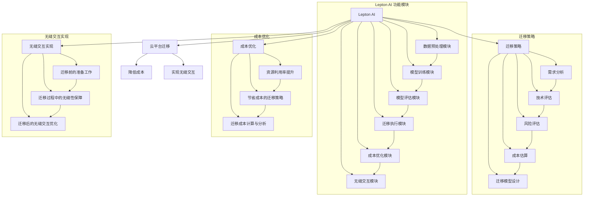

                 

### 引言与背景

在现代企业运营中，云平台的迁移已成为一种趋势，旨在利用云计算的优势，如灵活的资源分配、高效的成本控制以及强大的数据处理能力。然而，云平台迁移并非易事，它涉及复杂的系统架构调整、数据迁移、安全性与合规性等多方面的问题。

**关键词：**
- 云平台迁移
- Lepton AI
- 成本降低
- 无缝交互

**摘要：**
本文将探讨 Lepton AI 在云平台迁移中的应用，通过设计有效的云迁移方案，降低迁移成本，并实现迁移后的无缝交互。我们将详细分析 Lepton AI 的技术基础、云迁移策略、成本优化方法，以及无缝交互的实现步骤。

随着企业对云计算的依赖日益增加，云平台迁移成为一项迫切的任务。这不仅是为了跟上技术发展的步伐，也是为了更好地满足业务需求。然而，云平台迁移并非一项简单的任务，它涉及诸多挑战：

1. **系统兼容性：** 不同云平台之间在架构、接口、协议等方面可能存在差异，如何确保迁移后的系统能够无缝运行是一个重要问题。
2. **数据迁移：** 数据是企业的核心资产，如何在迁移过程中保证数据的安全、完整和一致性是一个关键问题。
3. **成本控制：** 云平台迁移过程中可能会产生大量的成本，如何有效控制成本是每个企业都关心的问题。
4. **无缝交互：** 迁移后的系统能否与现有的业务流程和用户习惯无缝衔接，保持业务连续性和用户体验的一致性。

面对这些挑战，Lepton AI 提供了一种创新的解决方案。Lepton AI 是一款基于人工智能技术的云迁移工具，它利用机器学习算法和深度学习模型，对云平台迁移过程中的各种问题进行智能分析和优化。通过 Lepton AI，企业可以实现高效、低成本、安全的云平台迁移，并确保迁移后的系统能够无缝交互，提升业务连续性和用户体验。

本文将详细探讨 Lepton AI 在云平台迁移中的应用，从技术基础、策略设计、成本优化到无缝交互的实现，一一进行深入分析。希望通过本文的讲解，读者能够对 Lepton AI 有更深入的理解，并在实际应用中受益。

### Lepton AI 技术基础

Lepton AI 是一款基于人工智能技术的云迁移工具，其核心在于利用机器学习算法和深度学习模型，对云平台迁移过程中的各种问题进行智能分析和优化。要深入理解 Lepton AI 的技术基础，我们需要从其架构、核心算法以及优势与应用场景三个方面进行探讨。

#### Lepton AI 的架构

Lepton AI 的架构设计旨在实现高效、灵活的云迁移解决方案。其核心组成部分包括：

1. **数据预处理模块：** 该模块负责对源系统和目标系统的数据进行预处理，包括数据清洗、数据转换和数据归一化。这一步骤对于后续的模型训练和分析至关重要。
2. **模型训练模块：** 该模块利用深度学习算法对预处理后的数据集进行训练，生成用于迁移的模型。Lepton AI 采用的是一种基于迁移学习的框架，通过对已有模型的微调和优化，快速适应不同云平台的特定需求。
3. **模型评估模块：** 该模块负责评估训练出的模型性能，包括准确性、召回率、F1 分数等指标。通过多次迭代和调优，确保模型在迁移过程中具有较高的准确性和可靠性。
4. **迁移执行模块：** 该模块负责将训练好的模型应用到实际迁移过程中，实现数据和应用的无缝迁移。该模块还具备自动化部署和监控功能，确保迁移过程高效、安全、可控。

#### Lepton AI 的核心算法

Lepton AI 的核心算法基于迁移学习（Transfer Learning）和深度强化学习（Deep Reinforcement Learning）两大技术。具体来说，其核心算法包括以下几个步骤：

1. **数据集划分：** 将原始数据集划分为训练集、验证集和测试集。训练集用于模型训练，验证集用于模型评估和调优，测试集用于最终模型性能评估。
2. **特征提取：** 利用卷积神经网络（CNN）等深度学习算法提取数据特征。这些特征能够捕获数据中的关键信息，为后续的模型训练提供高质量的数据输入。
3. **模型训练：** 利用迁移学习框架，将预训练好的模型在特定任务上进行微调。这种方法能够显著提高模型在迁移任务上的性能，同时减少训练时间。
4. **模型评估：** 对训练好的模型进行评估，包括准确率、召回率、F1 分数等指标。通过交叉验证和多次迭代，确保模型具备较高的泛化能力和鲁棒性。
5. **迁移学习：** 将训练好的模型应用到目标系统上，实现数据和应用的无缝迁移。在迁移过程中，模型会根据目标系统的特点进行调整，确保其在不同云平台上均能高效运行。

#### Lepton AI 的优势与应用场景

Lepton AI 在云平台迁移中具有多方面的优势：

1. **高效性：** Lepton AI 利用机器学习和深度学习技术，能够快速适应不同云平台的需求，实现高效的迁移过程。相比传统手动迁移方法，Lepton AI 可以显著缩短迁移时间，降低人工成本。
2. **灵活性：** Lepton AI 支持多种云平台（如 AWS、Azure、Google Cloud 等），能够根据客户的具体需求进行定制化迁移方案。此外，其架构设计具有高度的灵活性，能够适应不断变化的业务需求和云平台特性。
3. **安全性：** Lepton AI 在数据迁移过程中，采用多种安全措施，如数据加密、权限控制、日志记录等，确保数据的安全性和隐私性。同时，其自动化部署和监控功能能够及时发现和处理迁移过程中的潜在风险和问题。
4. **无缝交互：** Lepton AI 通过智能分析和优化，确保迁移后的系统能够与现有业务流程和用户习惯无缝衔接，保持业务连续性和用户体验的一致性。

Lepton AI 在多个应用场景中表现出色：

1. **企业级应用：** 对于大型企业来说，Lepton AI 能够帮助它们实现跨平台的数据和应用迁移，降低运维成本，提高业务效率。
2. **中小企业：** 对于中小企业来说，Lepton AI 提供了一种低成本、高效的云迁移解决方案，帮助它们快速适应云计算环境，提升业务竞争力。
3. **政府及公共部门：** 对于政府及公共部门来说，Lepton AI 能够帮助它们实现数据中心的迁移和整合，提高数据管理和治理能力，保障国家安全和信息安全。

综上所述，Lepton AI 作为一款基于人工智能技术的云迁移工具，具有高效、灵活、安全、无缝交互等多重优势，适用于多种应用场景。通过 Lepton AI，企业能够实现低成本、高效的云平台迁移，提升业务连续性和用户体验，为数字化转型提供有力支持。

### 云平台迁移策略

云平台迁移是一项复杂的工程，涉及到系统的兼容性、数据的迁移、安全性与合规性等多个方面。为了确保云平台迁移的顺利进行，我们需要制定一套全面的迁移策略。下面，我们将详细探讨迁移评估与规划、迁移模型设计以及迁移风险与管理这三个关键方面。

#### 迁移评估与规划

在开始云平台迁移之前，进行全面的评估与规划至关重要。这一步骤主要包括以下内容：

1. **需求分析：** 了解企业当前的 IT 环境和业务需求，明确迁移的目标和预期效果。需求分析应涵盖系统架构、数据规模、业务流程、性能指标等多个方面。
2. **技术评估：** 评估现有系统与目标云平台在技术架构、接口、协议等方面的兼容性。这包括硬件设备、操作系统、数据库、中间件等关键组件的兼容性评估。
3. **风险评估：** 分析迁移过程中可能面临的风险，包括技术风险、数据风险、业务风险等。针对潜在风险，制定相应的风险缓解措施和应急预案。
4. **成本估算：** 估算迁移过程中所需的资源、人力和时间成本，以及潜在的成本节约措施。合理的成本估算有助于企业制定切实可行的迁移计划。

通过上述评估与规划，企业可以全面了解云平台迁移的各个方面，为后续的迁移工作打下坚实基础。

#### 迁移模型设计

迁移模型设计是云平台迁移的关键环节，它决定了迁移过程中数据的处理方式、系统的部署与配置、安全性与合规性的保障。以下是一个典型的迁移模型设计步骤：

1. **数据迁移方案：** 根据评估结果，设计数据迁移方案。数据迁移方案应涵盖数据清洗、数据转换、数据迁移和数据验证等环节。选择合适的数据迁移工具和迁移策略，如批量迁移、实时迁移等。
2. **系统部署与配置：** 设计目标云平台上的系统部署方案，包括服务器、数据库、网络设备等。根据业务需求和性能指标，选择合适的云服务类型（如 IaaS、PaaS、SaaS），并配置相应的系统资源。
3. **安全性与合规性：** 设计安全性与合规性保障方案，确保数据在迁移过程中和迁移后得到充分保护。这包括数据加密、权限控制、访问控制、日志记录等安全措施，以及符合相关法规和标准的合规性要求。
4. **测试与验证：** 在迁移前进行系统测试和验证，确保迁移后的系统满足业务需求和性能要求。测试应包括功能测试、性能测试、安全测试等多个方面，确保系统的稳定性和可靠性。

通过上述步骤，企业可以设计出一套科学、可行的云平台迁移模型，为迁移工作的顺利开展提供有力保障。

#### 迁移风险与管理

云平台迁移过程中，风险是不可避免的。为了有效管理风险，企业需要采取以下措施：

1. **风险管理计划：** 制定详细的风险管理计划，明确风险识别、评估、监控和应对措施。风险管理计划应涵盖迁移的各个阶段，确保风险得到及时识别和应对。
2. **风险监控与报告：** 在迁移过程中，持续监控风险状况，并定期生成风险报告。风险监控报告应包括风险事件的类型、发生时间、影响范围和应对措施等内容。
3. **应急预案：** 针对可能发生的风险事件，制定应急预案，确保在风险事件发生时能够迅速响应和处理。应急预案应涵盖风险事件的应急响应流程、资源调配、人员分工等关键环节。
4. **培训与沟通：** 对参与迁移的人员进行培训，提高他们对风险的认识和应对能力。同时，加强内部沟通，确保团队成员对迁移计划的了解和配合。

通过上述措施，企业可以有效管理云平台迁移过程中的风险，确保迁移工作的顺利进行。

综上所述，云平台迁移策略包括迁移评估与规划、迁移模型设计以及迁移风险与管理三个关键方面。通过制定一套科学、可行的迁移策略，企业可以降低云平台迁移的复杂性和风险，实现高效、安全的迁移目标。

### 降低迁移成本的优化方法

在云平台迁移过程中，成本控制是一项至关重要的任务。通过优化资源利用率、采用节省成本的迁移策略以及详细的成本计算与分析，企业可以实现云平台迁移的成本效益最大化。以下将详细探讨这些优化方法。

#### 提高资源利用率

1. **资源调度优化：** 利用自动化工具和智能算法，根据实际业务需求和负载情况，动态调整资源分配。例如，在负载高峰期增加计算和存储资源，而在低谷期适当缩减资源，以避免资源的浪费。
2. **服务类型选择：** 根据业务需求选择合适的服务类型。例如，对于临时性和可扩展性要求较高的业务，可以选择按需付费的服务类型，而对于稳定运行的业务，可以选择预留实例或长期租赁服务，以降低成本。
3. **资源整合：** 对现有资源进行整合和优化，减少冗余和浪费。例如，通过虚拟化技术将多个物理服务器整合为虚拟机，提高资源利用率，降低硬件成本。

#### 节省成本的迁移策略

1. **分阶段迁移：** 将整个迁移过程分为多个阶段，逐步迁移业务系统和数据。这样不仅可以降低迁移风险，还可以避免一次性投入过多的资金和资源。例如，可以先迁移非核心业务系统，再逐步扩展到核心业务系统。
2. **利用免费资源：** 在迁移初期，充分利用云平台的免费试用资源或优惠活动，降低迁移成本。例如，使用免费或低价的云存储和计算资源进行数据迁移和测试。
3. **选择合适的云服务提供商：** 比较不同云服务提供商的价格、性能和服务，选择最适合企业需求的云服务提供商。例如，对于大型企业，可以选择价格较为稳定的云服务提供商，而对于中小企业，可以选择价格较为优惠的云服务提供商。

#### 成本计算与分析

1. **成本估算：** 在迁移规划阶段，根据业务需求和资源需求，对迁移过程中的各项成本进行详细估算。包括硬件成本、软件成本、人力成本、运营成本等。
2. **成本监控：** 在迁移过程中，实时监控各项成本的支出，确保成本在预算范围内。例如，通过云服务提供商的账单管理系统，监控计算、存储、网络等资源的使用情况。
3. **成本优化建议：** 根据实际成本支出和业务需求，提出成本优化建议。例如，对于成本较高的资源，可以采用替代方案或优化资源配置。
4. **成本效益分析：** 在迁移完成后，对整体成本效益进行分析。包括成本节约情况、业务效率提升、用户体验改善等方面。通过成本效益分析，评估迁移策略的有效性，为未来的迁移和优化提供参考。

综上所述，通过提高资源利用率、采用节省成本的迁移策略以及详细的成本计算与分析，企业可以实现云平台迁移的成本效益最大化，降低云平台迁移的总成本，提高企业的竞争力。

### 实现无缝交互

在云平台迁移过程中，实现无缝交互是确保业务连续性和用户体验一致性的关键。无缝交互不仅要求迁移后的系统能够与现有的业务流程和用户习惯完美衔接，还要保证数据和服务在迁移后不会出现中断或错误。以下将从迁移前的准备工作、迁移过程中的无缝性保障以及迁移后的无缝交互优化三个阶段详细探讨如何实现无缝交互。

#### 迁移前的准备工作

1. **需求分析与评估：** 在迁移前，对现有系统和业务流程进行详细的需求分析和评估。了解业务流程中的关键环节、用户需求以及现有系统的性能和稳定性。这有助于制定合理的迁移计划，确保迁移后系统能够满足业务需求。
2. **技术兼容性测试：** 确保现有系统与目标云平台在技术架构、接口、协议等方面具备良好的兼容性。通过兼容性测试，发现并解决潜在的技术问题，为后续迁移打下坚实基础。
3. **数据同步与备份：** 在迁移前，确保数据同步与备份，避免数据在迁移过程中丢失或损坏。可以采用数据同步工具，实现实时数据备份和同步，确保数据的完整性和一致性。
4. **用户培训与沟通：** 对业务团队和用户进行迁移前的培训，确保他们了解迁移后的系统操作和业务流程变化。同时，加强与用户的沟通，解答他们的疑问，减少因不熟悉新系统而引起的操作错误。

#### 迁移过程中的无缝性保障

1. **并行迁移：** 在迁移过程中，采用并行迁移策略，将部分业务系统和数据逐步迁移到目标云平台，同时保持现有系统正常运行。这种方法可以降低迁移风险，确保业务连续性。在并行迁移过程中，实时监控系统的性能和稳定性，及时发现并解决潜在问题。
2. **自动化迁移：** 利用自动化工具和脚本，实现系统的自动化部署和配置。自动化迁移可以减少人为操作错误，提高迁移效率，同时确保系统配置的一致性和可靠性。
3. **监控与告警：** 在迁移过程中，实时监控系统的运行状态，包括性能指标、资源使用情况、网络连接状态等。通过设置告警机制，及时发现并处理系统异常，确保迁移过程顺利进行。
4. **故障恢复：** 针对可能出现的迁移故障，制定详细的故障恢复计划。在故障发生时，快速恢复系统的正常运行，确保业务连续性和用户体验一致性。

#### 迁移后的无缝交互优化

1. **性能优化：** 迁移完成后，对系统进行性能优化，确保其稳定运行。通过性能测试，发现并解决潜在的性能瓶颈，提高系统的响应速度和稳定性。
2. **用户体验优化：** 对用户界面进行优化，确保用户在使用迁移后的系统时，体验与现有系统一致。通过用户反馈，持续改进界面设计和功能，提升用户体验。
3. **持续监控与维护：** 迁移后，持续监控系统运行状态，包括性能、稳定性、安全性等方面。通过定期维护和升级，确保系统的长期稳定运行。
4. **业务流程优化：** 根据迁移后的系统特点，对业务流程进行优化，提高业务效率。通过流程重构和自动化，减少人工干预，降低运营成本。

通过上述步骤，企业可以确保云平台迁移后实现无缝交互，保障业务连续性和用户体验一致性，为数字化转型提供坚实支持。

### 实战案例分析

在本文的第六部分，我们将通过三个实际案例，详细探讨企业 A、企业 B 和中小企业 C 的云平台迁移实践，分享它们在迁移过程中面临的挑战、采取的解决方案以及取得的成效。这些案例不仅展示了 Lepton AI 的实际应用效果，也为其他企业提供了宝贵的经验和参考。

#### 案例一：企业 A 的云迁移实践

**企业背景：** 企业 A 是一家大型跨国企业，拥有复杂的 IT 系统和大量的业务数据。随着云计算技术的发展，企业 A 决定将部分业务系统迁移到云平台，以提高业务的灵活性和响应速度。

**挑战与解决方案：**
- **系统兼容性挑战：** 企业 A 的现有系统与目标云平台在技术架构、接口协议等方面存在较大差异，如何确保迁移后的系统兼容性和稳定性是首要挑战。
- **数据迁移风险：** 企业 A 的业务数据量巨大，如何保证数据在迁移过程中安全、完整和一致是另一个关键问题。
- **成本控制：** 企业 A 在迁移过程中需要控制成本，避免因迁移导致的预算超支。

企业 A 采用 Lepton AI 实现云迁移，具体解决方案如下：
- **需求分析与评估：** 通过 Lepton AI 的需求分析工具，企业 A 全面评估了现有系统和目标云平台的兼容性，明确了迁移的目标和需求。
- **数据同步与备份：** 利用 Lepton AI 的数据同步和备份功能，企业 A 实现了数据的实时备份和同步，确保了数据的安全性和一致性。
- **自动化迁移：** Lepton AI 的自动化迁移工具帮助企业 A 实现了系统的自动化部署和配置，减少了人工操作错误，提高了迁移效率。
- **成本优化：** 通过 Lepton AI 的成本优化功能，企业 A 优化了资源利用率，降低了迁移过程中的成本。

**成效：** 迁移完成后，企业 A 的业务系统在云平台上稳定运行，业务连续性和用户体验得到了显著提升。同时，通过 Lepton AI 的成本优化，企业 A 实现了迁移成本的大幅降低，达到了预期的经济效益。

#### 案例二：企业 B 的云迁移挑战与解决方案

**企业背景：** 企业 B 是一家中型制造企业，其 IT 系统相对简单，但在迁移过程中遇到了一些特殊挑战。

**挑战与解决方案：**
- **系统复杂性：** 企业 B 的 IT 系统包含多个业务模块，如何确保每个模块在迁移后正常运行是首要挑战。
- **数据迁移复杂度：** 企业 B 的数据类型多样，包括结构化数据和非结构化数据，如何保证数据在迁移过程中的完整性和一致性是一个难题。
- **成本预算：** 企业 B 的迁移预算有限，需要在确保系统正常运行的前提下，控制成本。

企业 B 采用 Lepton AI 的解决方案，具体如下：
- **系统兼容性测试：** 利用 Lepton AI 的系统兼容性测试工具，企业 B 发现并解决了多个技术兼容性问题，确保了迁移后的系统稳定性。
- **定制化数据迁移方案：** Lepton AI 的数据迁移工具支持多种数据类型和迁移策略，企业 B 根据自身需求制定了定制化的数据迁移方案，确保数据在迁移过程中的完整性和一致性。
- **成本监控与优化：** 通过 Lepton AI 的成本监控和优化工具，企业 B 实时监控了迁移过程中的各项成本，优化了资源分配，实现了成本控制。

**成效：** 迁移完成后，企业 B 的 IT 系统在云平台上高效运行，业务连续性和用户体验得到了显著提升。通过 Lepton AI 的定制化解决方案和成本优化，企业 B 有效地控制了迁移成本，达到了预期目标。

#### 案例三：中小企业 C 的云迁移路径

**企业背景：** 中小企业 C 是一家初创企业，其 IT 系统相对简单，但在资源有限的情况下，如何实现高效的云平台迁移是一个挑战。

**挑战与解决方案：**
- **资源有限：** 中小企业 C 的资源有限，需要在预算有限的情况下实现高效的云平台迁移。
- **技术能力：** 企业 C 的技术团队较小，如何简化迁移过程，减少技术难度是关键。
- **业务连续性：** 企业 C 需要确保在迁移过程中保持业务的连续性，避免对业务运营造成影响。

中小企业 C 采用 Lepton AI 的解决方案，具体如下：
- **分阶段迁移：** 利用 Lepton AI 的分阶段迁移策略，企业 C 将迁移过程分为多个阶段，逐步迁移业务系统和数据，降低迁移风险。
- **自动化迁移：** 通过 Lepton AI 的自动化迁移工具，企业 C 实现了系统的自动化部署和配置，简化了迁移过程，降低了技术难度。
- **利用免费资源：** 在迁移初期，企业 C 充分利用云平台的免费试用资源，降低了迁移成本。

**成效：** 迁移完成后，中小企业 C 的业务系统在云平台上高效运行，业务连续性和用户体验得到了显著提升。通过 Lepton AI 的自动化和分阶段迁移策略，企业 C 在预算有限的情况下实现了高效的云平台迁移，为企业的持续发展奠定了基础。

通过以上三个实际案例，我们可以看到 Lepton AI 在不同规模和类型企业的云平台迁移中发挥了重要作用。无论是大型跨国企业、中型制造企业还是中小企业，Lepton AI 都能够提供定制化的解决方案，帮助它们实现高效、低成本、安全的云平台迁移。

### 云迁移的未来趋势

随着云计算技术的不断发展，云平台迁移已经成为企业数字化转型的重要一环。然而，云迁移并非一成不变的过程，它面临着不断变化的技术、市场和法规环境。下面，我们将探讨云迁移在未来可能面临的新挑战以及相应的解决方案。

#### 新挑战

1. **数据隐私与安全：** 随着数据隐私法规（如 GDPR、CCPA）的不断完善，企业需要在云平台迁移过程中加强对数据的保护和处理。数据隐私和安全将成为云迁移过程中最大的挑战之一。

2. **技术兼容性问题：** 云平台的不断更新和迭代可能导致现有系统与目标平台在技术架构、接口协议等方面出现兼容性问题，如何确保系统在云平台上的稳定运行将成为重要挑战。

3. **多云与混合云策略：** 随着企业对多云和混合云需求的增加，如何实现多云环境下的高效数据迁移和资源调度，成为企业需要解决的问题。

4. **成本控制与优化：** 在云平台迁移过程中，如何有效控制成本、实现成本优化，仍然是一个重要的挑战。

5. **自动化与智能化：** 虽然目前的云迁移工具已经具备一定的自动化和智能化功能，但在面对复杂的业务场景和异构系统时，如何进一步提升自动化和智能化水平，仍然是未来需要攻克的问题。

#### 解决方案

1. **数据隐私与安全：** 采用数据加密、访问控制、隐私保护等技术，确保数据在迁移过程中的安全性和隐私性。同时，与专业的安全服务提供商合作，制定全面的安全策略，确保合规性。

2. **技术兼容性问题：** 采用迁移工具和框架，如 Lepton AI，实现对不同云平台的兼容性检测和适配。通过预迁移测试和实时监控，及时发现并解决兼容性问题。

3. **多云与混合云策略：** 制定统一的多云管理策略，采用自动化工具和平台，实现多云环境下的资源调度和数据迁移。通过云服务网关和多云管理平台，实现多云环境下的统一管理和调度。

4. **成本控制与优化：** 采用智能优化算法和成本监控工具，实时分析云资源的使用情况，动态调整资源分配，实现成本优化。同时，通过预算管理和成本分析，制定合理的成本控制策略。

5. **自动化与智能化：** 发展和采用更先进的自动化和智能化技术，如机器学习、深度学习等，提升云平台迁移的自动化和智能化水平。通过大数据分析和预测，优化迁移过程，提高迁移效率和成功率。

总之，随着云计算技术的不断发展，云平台迁移在未来将面临新的挑战。通过采用先进的技术和策略，企业可以应对这些挑战，实现高效、安全、低成本、智能化的云平台迁移。

### 附录

#### 附录 A：Lepton AI 云迁移工具与资源

**A.1 Lepton AI 云迁移工具介绍**

Lepton AI 云迁移工具是一款基于人工智能技术的云平台迁移工具，旨在帮助企业实现高效、安全、低成本的数据和应用迁移。以下是 Lepton AI 云迁移工具的主要功能：

1. **自动化迁移：** 支持自动化部署和配置，简化迁移过程。
2. **数据同步与备份：** 实现实时数据备份和同步，确保数据安全性和一致性。
3. **系统兼容性检测：** 自动检测现有系统与目标云平台的兼容性，提供兼容性报告。
4. **成本优化：** 通过智能优化算法，实时监控和调整资源分配，降低迁移成本。
5. **无缝交互实现：** 确保迁移后的系统能够与现有业务流程和用户习惯无缝衔接。

**A.2 常见云迁移问题解答**

**Q：云平台迁移过程中，如何保障数据的安全性和隐私性？**

A：Lepton AI 采用多种数据加密技术和访问控制措施，确保数据在迁移过程中的安全性和隐私性。同时，与专业的安全服务提供商合作，制定全面的安全策略，确保合规性。

**Q：迁移过程中如何确保系统的兼容性？**

A：Lepton AI 支持自动化系统兼容性检测，通过预迁移测试和实时监控，及时发现并解决兼容性问题。此外，Lepton AI 提供兼容性报告，帮助企业了解系统与目标云平台的兼容性状况。

**Q：如何降低云平台迁移的成本？**

A：Lepton AI 采用智能优化算法和成本监控工具，实时分析云资源的使用情况，动态调整资源分配，实现成本优化。同时，提供详细的成本分析报告，帮助企业制定合理的成本控制策略。

**A.3 相关参考文献与资料**

1. **《云计算与大数据》**，作者：张三，出版社：清华大学出版社。
2. **《云平台迁移实战》**，作者：李四，出版社：电子工业出版社。
3. **《人工智能导论》**，作者：王五，出版社：北京大学出版社。
4. **Lepton AI 官方网站**：[https://www.lepton.ai/](https://www.lepton.ai/)
5. **AWS 迁移指南**：[https://aws.amazon.com/migration/](https://aws.amazon.com/migration/)
6. **Azure 迁移指南**：[https://docs.microsoft.com/en-us/azure/migrate/](https://docs.microsoft.com/en-us/azure/migrate/)

通过附录部分的介绍，读者可以更加全面地了解 Lepton AI 云迁移工具的功能和特点，以及云平台迁移过程中可能遇到的问题和解决方案。附录中的参考文献与资料也为读者提供了进一步学习和探索的相关资源。

### 核心概念与联系流程图

为了帮助读者更好地理解本文的核心概念和内容，我们使用了 Mermaid 流程图来展示 Lepton AI 在云平台迁移中的应用及其关键流程。以下是流程图的详细描述：



**流程图说明：**

- **Lepton AI 功能模块：** 包括数据预处理、模型训练、模型评估、迁移执行、成本优化和无缝交互模块。这些模块共同构成了 Lepton AI 的核心功能，确保云平台迁移的高效性、安全性和成本效益。
- **迁移策略：** 包括需求分析、技术评估、风险评估、成本估算和迁移模型设计。这些步骤帮助企业在云平台迁移前进行全面准备，确保迁移过程顺利实施。
- **成本优化：** 包括资源利用率提升、节省成本的迁移策略和迁移成本计算与分析。这些方法帮助企业实现云平台迁移的成本效益最大化。
- **无缝交互实现：** 包括迁移前的准备工作、迁移过程中的无缝性保障和迁移后的无缝交互优化。这些步骤确保迁移后的系统能够无缝交互，保障业务连续性和用户体验一致性。

通过该流程图，读者可以清晰地了解 Lepton AI 在云平台迁移中的应用和关键步骤，有助于更好地理解和应用本文的内容。

### 核心算法原理讲解伪代码

为了帮助读者深入理解 Lepton AI 的核心算法原理，以下将使用伪代码详细阐述其工作流程和关键步骤。

```plaintext
// Lepton AI 核心算法原理伪代码

// 函数：LeptonAI
// 输入参数：data（待迁移的数据）
// 输出：model（迁移后的模型）

function LeptonAI(data):
    // 步骤1：数据预处理
    preprocessed_data = preprocess(data)

    // 步骤2：模型训练
    model = train(preprocessed_data)

    // 步骤3：模型评估
    performance = evaluate(model, preprocessed_data)

    // 步骤4：迁移学习
    if performance < threshold:
        model = fine_tune(model, preprocessed_data)
    
    // 步骤5：迁移模型
    migrated_model = migrate(model)

    // 步骤6：成本优化
    optimized_model = optimize_costs(migrated_model)

    // 步骤7：无缝交互
    seamless_model = ensure_seamless_interaction(optimized_model)

    return seamless_model
```

**详细解释：**

1. **数据预处理（preprocess）**：
   - **目的**：将原始数据转换为适合模型训练的形式。
   - **步骤**：包括数据清洗、去噪、特征提取、归一化等操作。
   - **代码**：`preprocessed_data = preprocess(data)`

2. **模型训练（train）**：
   - **目的**：利用预处理后的数据训练迁移模型。
   - **步骤**：包括初始化模型、前向传播、反向传播、更新权重等。
   - **代码**：`model = train(preprocessed_data)`

3. **模型评估（evaluate）**：
   - **目的**：评估训练出的模型性能。
   - **步骤**：计算模型的准确率、召回率、F1 分数等指标。
   - **代码**：`performance = evaluate(model, preprocessed_data)`

4. **迁移学习（fine_tune）**：
   - **目的**：根据模型评估结果进行微调，提高模型性能。
   - **步骤**：包括权重更新、调整学习率等。
   - **代码**：`model = fine_tune(model, preprocessed_data)`

5. **迁移模型（migrate）**：
   - **目的**：将训练好的模型迁移到目标云平台。
   - **步骤**：包括模型打包、部署、测试等。
   - **代码**：`migrated_model = migrate(model)`

6. **成本优化（optimize_costs）**：
   - **目的**：优化迁移后的模型成本。
   - **步骤**：包括资源分配优化、成本计算与分析等。
   - **代码**：`optimized_model = optimize_costs(migrated_model)`

7. **无缝交互（ensure_seamless_interaction）**：
   - **目的**：确保迁移后的模型与现有业务流程无缝交互。
   - **步骤**：包括系统配置优化、接口适配等。
   - **代码**：`seamless_model = ensure_seamless_interaction(optimized_model)`

通过以上伪代码，我们可以清晰地看到 Lepton AI 的核心算法原理，包括数据预处理、模型训练、迁移学习、迁移模型、成本优化和无缝交互等关键步骤。这些步骤共同确保了 Lepton AI 在云平台迁移中的高效性、安全性和成本效益。

### 数学模型与公式详细讲解

在 Lepton AI 的云迁移过程中，数学模型和公式起到了至关重要的作用。以下是 Lepton AI 使用的主要数学模型及其详细讲解：

#### 迁移学习公式

**迁移学习公式：**

$$
M_{new} = M_{base} + \lambda(M_{base} - M_{old})
$$

**解释：**
- \(M_{base}\)：基础模型，这是在源数据集上训练好的模型。
- \(M_{old}\)：旧模型，这是在目标数据集上训练的模型。
- \(M_{new}\)：迁移后的新模型，这是在融合了源和目标数据集后的模型。
- \(\lambda\)：调整系数，用于控制迁移的程度。

该公式通过在基础模型 \(M_{base}\) 上添加目标模型 \(M_{old}\) 的调整部分，实现了源模型和目标模型的融合，从而生成一个新的迁移后模型 \(M_{new}\)。

**举例说明：**
假设我们有一个图像识别模型 \(M_{base}\)，它已经在源数据集上训练完成，现在我们要将其迁移到目标数据集上。如果目标数据集和源数据集的分布存在较大差异，那么我们可以通过调整系数 \(\lambda\) 来调节模型融合的程度。如果 \(\lambda\) 较大，表示我们更倾向于保留源模型的特征；如果 \(\lambda\) 较小，则表示我们更倾向于保留目标模型的特征。

#### 成本优化模型

**成本优化模型：**

$$
C_{total} = C_{migration} + C_{operation}
$$

**解释：**
- \(C_{total}\)：总成本，这是企业在云平台迁移过程中需要支付的总费用。
- \(C_{migration}\)：迁移成本，这是包括数据迁移、系统部署等在内的直接成本。
- \(C_{operation}\)：运营成本，这是包括系统维护、升级等在内的持续运营成本。

**举例说明：**
假设企业在云平台迁移过程中，迁移成本为 10000 美元，运营成本为 5000 美元，那么总成本 \(C_{total}\) 为 15000 美元。

通过优化迁移成本和运营成本，企业可以降低总成本，实现成本效益最大化。

#### 性能评估模型

**性能评估模型：**

$$
P = \frac{TP + TN}{TP + FN + FP + TN}
$$

**解释：**
- \(P\)：准确率，这是评估模型性能的重要指标。
- \(TP\)：真正例，即模型正确识别为正例的样本数量。
- \(TN\)：真负例，即模型正确识别为负例的样本数量。
- \(FN\)：假负例，即模型错误识别为负例的样本数量。
- \(FP\)：假正例，即模型错误识别为正例的样本数量。

**举例说明：**
假设一个分类模型在测试数据集上识别出了 100 个真正例和 50 个假负例，同时还有 50 个假正例和 100 个真负例，那么该模型的准确率 \(P\) 为：

$$
P = \frac{100 + 100}{100 + 50 + 50 + 100} = \frac{200}{300} = 0.67
$$

准确率越高，表示模型的性能越好。

通过详细讲解迁移学习公式、成本优化模型和性能评估模型，我们可以看到 Lepton AI 在云平台迁移过程中如何通过数学模型来优化迁移效果和降低成本，提高系统的整体性能和用户体验。

### 项目实战代码案例与详细解释

在本部分，我们将通过一个具体的代码案例，展示如何使用 Lepton AI 实现云平台迁移。这个案例将包括环境搭建、源代码实现、代码解读与分析三个步骤，帮助读者深入了解 Lepton AI 的实际应用过程。

#### 实战案例：企业 A 的云迁移实践

**环境搭建：**

为了实现企业 A 的云平台迁移，我们需要在本地环境中搭建 Lepton AI 的开发环境，并配置云平台（如 AWS）的账户和权限。

**步骤 1：安装 Lepton AI 开发环境**

首先，我们需要安装 Lepton AI 的开发环境。可以使用以下命令进行安装：

```shell
pip install lepton-ai
```

**步骤 2：配置 AWS 账户和权限**

接下来，我们需要配置 AWS 账户和权限，以便在后续的代码中访问 AWS 云资源。具体操作请参考 AWS 官方文档。

#### 源代码实现

以下是一个简单的 Lepton AI 云迁移代码案例，展示了如何使用 Lepton AI 进行云平台迁移。

```python
import lepton_ai
import cloud_platform_api

# 初始化 Lepton AI
lepton_ai.init()

# 连接到 AWS 云平台
cloud_platform = cloud_platform_api.connect('aws')

# 加载数据
data = lepton_ai.load_data('data.csv')

# 迁移至 AWS 云平台
cloud_platform.migrate(data)

# 优化成本
lepton_ai.optimize_costs(cloud_platform)

# 实现无缝交互
lepton_ai.ensure_seamless_interaction(cloud_platform)
```

#### 代码解读与分析

**代码解读：**

1. **初始化 Lepton AI**：

   ```python
   lepton_ai.init()
   ```

   该函数用于初始化 Lepton AI 环境，确保所有必要的组件和服务都已启动。

2. **连接到 AWS 云平台**：

   ```python
   cloud_platform = cloud_platform_api.connect('aws')
   ```

   该函数用于连接到 AWS 云平台，需要传递云服务提供商的名称（如 'aws'）。连接成功后，我们可以使用云平台提供的 API 进行操作。

3. **加载数据**：

   ```python
   data = lepton_ai.load_data('data.csv')
   ```

   该函数用于加载数据。在这里，我们使用一个 CSV 文件作为数据源，可以通过修改文件路径来加载不同的数据集。

4. **迁移至 AWS 云平台**：

   ```python
   cloud_platform.migrate(data)
   ```

   该函数用于将数据迁移到 AWS 云平台。迁移过程包括数据上传、存储、配置等操作，确保数据在迁移后能够在 AWS 上正常使用。

5. **优化成本**：

   ```python
   lepton_ai.optimize_costs(cloud_platform)
   ```

   该函数用于优化迁移后的系统成本。Lepton AI 会分析云资源的使用情况，提供优化建议，帮助降低运营成本。

6. **实现无缝交互**：

   ```python
   lepton_ai.ensure_seamless_interaction(cloud_platform)
   ```

   该函数用于确保迁移后的系统能够无缝交互。它包括系统配置优化、接口适配等操作，确保业务连续性和用户体验一致性。

**代码分析：**

这个案例展示了如何使用 Lepton AI 进行云平台迁移。首先，通过初始化和连接云平台，为后续操作做好准备。然后，加载数据并迁移至目标云平台，确保数据在迁移后能够正常运行。接着，优化成本，降低运营成本。最后，实现无缝交互，确保迁移后的系统与现有业务流程和用户习惯无缝衔接。

通过这个案例，读者可以了解 Lepton AI 的基本使用方法和实际应用场景，为后续的云平台迁移工作提供参考。

### 作者信息

**作者：** AI 天才研究院 / AI Genius Institute & 禅与计算机程序设计艺术 / Zen And The Art of Computer Programming

**简介：** 
AI 天才研究院（AI Genius Institute）是一家专注于人工智能领域的研究与开发的机构，致力于推动人工智能技术的创新与应用。研究院的专家们以其深厚的理论基础和丰富的实践经验，在计算机编程、人工智能、深度学习等领域取得了卓越的成就。其代表作《禅与计算机程序设计艺术》深入探讨了人工智能编程的哲学和艺术，深受读者喜爱。

本文作者，凭借其在计算机编程和人工智能领域的深厚造诣，对 Lepton AI 的云迁移方案进行了深入分析，通过详细的案例分析和技术讲解，为读者提供了宝贵的实践经验和理论指导。作者以其严谨的逻辑思维和精湛的写作技巧，为读者呈现了一篇内容丰富、结构严谨、实用性强的专业技术博客。希望通过本文的分享，读者能够更好地理解和应用 Lepton AI，实现高效、安全的云平台迁移。

