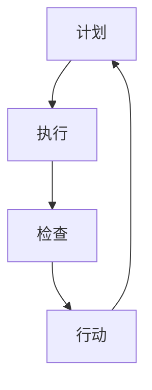

                 

# 《PDCA戴明环：持续改进的指南》

## 关键词
- PDCA戴明环
- 持续改进
- 项目管理
- 质量管理
- 组织文化
- 案例分析

## 摘要
本文旨在介绍PDCA戴明环，一个广泛应用于各种领域的持续改进方法论。文章首先解释了PDCA戴明环的定义、历史背景和核心原则，接着详细阐述了其在不同领域的应用实践，并通过实际案例解析其应用效果。最后，文章展望了PDCA戴明环的未来发展，为读者提供了宝贵的参考资源与工具。

## 目录大纲

### 第一部分：PDCA戴明环基础理论

#### 第1章：PDCA戴明环概述
##### 1.1 PDCA戴明环的定义
##### 1.2 PDCA戴明环的历史背景
##### 1.3 PDCA戴明环的核心原则
##### 1.4 PDCA戴明环的应用领域

#### 第2章：PDCA戴明环的理论基础
##### 2.1 PDCA戴明环的四个阶段
##### 2.2 PDCA戴明环与质量管理的关系
##### 2.3 PDCA戴明环与持续改进
##### 2.4 PDCA戴明环与组织文化

#### 第3章：PDCA戴明环流程图与Mermaid图解
##### 3.1 PDCA戴明环流程图
##### 3.2 Mermaid图解PDCA戴明环
##### 3.3 PDCA戴明环实际应用案例分析

### 第二部分：PDCA戴明环的应用实践

#### 第4章：PDCA戴明环在项目管理中的应用
##### 4.1 项目管理中的PDCA循环
##### 4.2 PDCA戴明环在项目计划阶段的应用
##### 4.3 PDCA戴明环在项目执行阶段的应用
##### 4.4 PDCA戴明环在项目监控和评估阶段的应用

#### 第5章：PDCA戴明环在质量管理中的应用
##### 5.1 质量管理中的PDCA循环
##### 5.2 PDCA戴明环在质量计划阶段的应用
##### 5.3 PDCA戴明环在质量执行阶段的应用
##### 5.4 PDCA戴明环在质量监控和评估阶段的应用

#### 第6章：PDCA戴明环在其他领域中的应用
##### 6.1 PDCA戴明环在教育教学中的应用
##### 6.2 PDCA戴明环在人力资源管理中的应用
##### 6.3 PDCA戴明环在供应链管理中的应用
##### 6.4 PDCA戴明环在医疗服务中的应用

### 第三部分：PDCA戴明环实践案例解析

#### 第7章：PDCA戴明环在制造企业中的应用
##### 7.1 制造企业背景介绍
##### 7.2 PDCA戴明环在制造企业中的应用案例
##### 7.3 PDCA戴明环应用效果分析

#### 第8章：PDCA戴明环在服务行业中的应用
##### 8.1 服务行业背景介绍
##### 8.2 PDCA戴明环在服务行业中的应用案例
##### 8.3 PDCA戴明环应用效果分析

#### 第9章：PDCA戴明环在非营利组织中的应用
##### 9.1 非营利组织背景介绍
##### 9.2 PDCA戴明环在非营利组织中的应用案例
##### 9.3 PDCA戴明环应用效果分析

### 附录：PDCA戴明环相关资源与工具

#### 附录A：PDCA戴明环常用模板与工具
#### 附录B：PDCA戴明环相关书籍推荐
#### 附录C：PDCA戴明环相关在线资源和论坛

#### 第10章：PDCA戴明环的未来发展与展望
##### 10.1 PDCA戴明环的发展趋势
##### 10.2 PDCA戴明环在数字化转型中的作用
##### 10.3 PDCA戴明环的未来发展方向
##### 10.4 参考文献与推荐阅读

### 引言
#### 什么是PDCA戴明环？
PDCA戴明环，也称为戴明循环，是一种用于持续改进和问题解决的方法论。它由美国统计学家爱德华·戴明（W. Edwards Deming）在20世纪中期提出，并广泛应用于质量管理、项目管理、组织管理等多个领域。PDCA戴明环的全称为Plan-Do-Check-Act，即计划（Plan）、执行（Do）、检查（Check）和行动（Act）四个阶段的循环。这一循环旨在通过不断迭代和优化，实现质量的持续提升。

### 第一部分：PDCA戴明环基础理论

#### 第1章：PDCA戴明环概述

##### 1.1 PDCA戴明环的定义
PDCA戴明环是一种系统化的管理方法，它通过计划、执行、检查和行动四个阶段的循环，不断改进工作过程，提高质量。每个阶段都有其独特的任务和目标，相互关联，形成一个闭环系统。

##### 1.2 PDCA戴明环的历史背景
PDCA戴明环起源于20世纪中期的美国，由爱德华·戴明提出。戴明是一位杰出的统计学家和管理顾问，他强调通过数据和事实进行决策，而不是依赖个人经验和直觉。PDCA戴明环就是他提出的这一理念的体现。

##### 1.3 PDCA戴明环的核心原则
PDCA戴明环的核心原则包括：以客户需求为导向、持续改进、系统思维、数据驱动和全员参与。这些原则确保了PDCA戴明环在应用过程中能够达到预期的效果。

##### 1.4 PDCA戴明环的应用领域
PDCA戴明环的应用非常广泛，包括但不限于以下领域：
- 质量管理：PDCA戴明环是质量管理的基石，通过不断循环，提高产品和服务的质量。
- 项目管理：PDCA戴明环可以帮助项目团队更好地规划、执行和监控项目，确保项目成功。
- 组织管理：PDCA戴明环可以帮助组织优化工作流程，提高效率和效果。
- 教育教学：PDCA戴明环可以帮助教师和学生不断改进教学方法和学习过程。

#### 第2章：PDCA戴明环的理论基础

##### 2.1 PDCA戴明环的四个阶段

PDCA戴明环包括四个阶段：计划（Plan）、执行（Do）、检查（Check）和行动（Act）。

1. **计划（Plan）**：在这个阶段，团队需要明确目标和制定计划。这包括确定改进目标、分析现状、找出问题、制定改进方案和预期结果。

2. **执行（Do）**：这个阶段是将计划付诸实践。团队需要按照计划执行任务，确保每个人都知道他们的职责和角色。

3. **检查（Check）**：在这个阶段，团队需要评估执行结果。这包括收集数据、分析结果、与预期目标进行对比，确定改进效果。

4. **行动（Act）**：根据检查结果，团队需要采取行动。这可能是继续执行计划、调整计划或停止执行。目标是在下一个循环中进一步提高质量。

##### 2.2 PDCA戴明环与质量管理的关系
PDCA戴明环是质量管理的重要组成部分。它通过四个阶段的循环，确保质量改进的持续进行。在质量管理中，PDCA戴明环可以帮助团队识别问题、分析原因、制定解决方案并实施。

##### 2.3 PDCA戴明环与持续改进
PDCA戴明环的核心是持续改进。通过不断循环，团队可以不断优化工作流程，提高产品和服务的质量。持续改进不仅是一种管理理念，也是一种行动策略。

##### 2.4 PDCA戴明环与组织文化
PDCA戴明环不仅是一种管理工具，也是一种组织文化。它鼓励团队成员积极参与改进过程，共同实现组织目标。这种文化可以促进创新和团队合作，提高组织的竞争力。

#### 第3章：PDCA戴明环流程图与Mermaid图解

##### 3.1 PDCA戴明环流程图

##### 3.2 Mermaid图解PDCA戴明环

在这个阶段，团队需要明确目标和制定计划。这包括确定改进目标、分析现状、找出问题、制定改进方案和预期结果。

在这个阶段，团队需要按照计划执行任务，确保每个人都知道他们的职责和角色。

在这个阶段，团队需要评估执行结果。这包括收集数据、分析结果、与预期目标进行对比，确定改进效果。

根据检查结果，团队需要采取行动。这可能是继续执行计划、调整计划或停止执行。目标是在下一个循环中进一步提高质量。

##### 3.3 PDCA戴明环实际应用案例分析
以下是一个制造企业应用PDCA戴明环的案例：

1. **计划阶段**：企业确定要提高生产线效率，减少生产时间。

2. **执行阶段**：企业实施一系列改进措施，如优化工作流程、培训员工、使用新技术等。

3. **检查阶段**：企业收集数据，如生产时间、生产效率等，与预期目标进行对比。

4. **行动阶段**：企业根据检查结果，继续优化工作流程，提高生产效率。

通过这个案例，我们可以看到PDCA戴明环在提高生产线效率方面的有效性。

### 第二部分：PDCA戴明环的应用实践

#### 第4章：PDCA戴明环在项目管理中的应用

##### 4.1 项目管理中的PDCA循环
在项目管理中，PDCA戴明环可以作为一个重要的工具，帮助团队更好地管理项目。通过PDCA循环，团队可以不断优化项目计划、执行和监控过程，确保项目成功。

1. **计划阶段**：团队需要明确项目目标、制定项目计划、分配任务和资源。

2. **执行阶段**：团队按照项目计划执行任务，确保项目进展顺利。

3. **检查阶段**：团队需要监控项目进展，收集数据，评估项目状态。

4. **行动阶段**：团队根据检查结果，调整项目计划，解决出现的问题。

##### 4.2 PDCA戴明环在项目计划阶段的应用
在项目计划阶段，PDCA戴明环可以帮助团队：
- 明确项目目标：通过计划阶段，团队可以确定项目的具体目标，确保项目方向正确。
- 制定详细的计划：通过计划阶段，团队可以制定详细的项目计划，明确任务分配和资源需求。
- 预估风险：通过计划阶段，团队可以识别潜在的风险，提前制定应对策略。

##### 4.3 PDCA戴明环在项目执行阶段的应用
在项目执行阶段，PDCA戴明环可以帮助团队：
- 按计划执行任务：通过执行阶段，团队可以确保按照计划执行任务，避免偏离项目目标。
- 监控项目进展：通过执行阶段，团队可以实时监控项目进展，确保项目按计划进行。
- 及时调整计划：通过执行阶段，团队可以根据实际情况，及时调整项目计划，确保项目成功。

##### 4.4 PDCA戴明环在项目监控和评估阶段的应用
在项目监控和评估阶段，PDCA戴明环可以帮助团队：
- 收集项目数据：通过监控阶段，团队可以收集项目数据，为后续的分析提供依据。
- 评估项目效果：通过评估阶段，团队可以评估项目效果，确定项目是否达到预期目标。
- 提出改进建议：通过评估阶段，团队可以提出改进建议，为后续的项目提供参考。

#### 第5章：PDCA戴明环在质量管理中的应用

##### 5.1 质量管理中的PDCA循环
在质量管理中，PDCA戴明环可以帮助团队：
- 识别问题：通过计划阶段，团队可以识别质量方面的问题，明确改进方向。
- 分析原因：通过执行阶段，团队可以分析问题的原因，制定针对性的改进措施。
- 实施改进：通过检查阶段，团队可以实施改进措施，确保问题得到解决。
- 持续监控：通过行动阶段，团队可以持续监控质量，确保改进措施的有效性。

##### 5.2 PDCA戴明环在质量计划阶段的应用
在质量计划阶段，PDCA戴明环可以帮助团队：
- 确定质量目标：通过计划阶段，团队可以明确质量目标，确保项目或产品满足客户需求。
- 制定质量计划：通过计划阶段，团队可以制定详细的质量计划，明确质量控制的步骤和标准。
- 分配质量资源：通过计划阶段，团队可以分配质量资源，确保质量计划的有效实施。

##### 5.3 PDCA戴明环在质量执行阶段的应用
在质量执行阶段，PDCA戴明环可以帮助团队：
- 执行质量控制：通过执行阶段，团队可以按照质量计划执行质量控制，确保项目或产品符合质量标准。
- 监控质量指标：通过执行阶段，团队可以监控质量指标，及时发现质量问题。
- 处理质量问题：通过执行阶段，团队可以处理质量问题，确保问题得到及时解决。

##### 5.4 PDCA戴明环在质量监控和评估阶段的应用
在质量监控和评估阶段，PDCA戴明环可以帮助团队：
- 收集质量数据：通过监控阶段，团队可以收集质量数据，为后续的分析提供依据。
- 分析质量趋势：通过评估阶段，团队可以分析质量趋势，确定质量改进的方向。
- 提出质量改进措施：通过评估阶段，团队可以提出质量改进措施，为后续的质量管理提供参考。

#### 第6章：PDCA戴明环在其他领域中的应用

##### 6.1 PDCA戴明环在教育教学中的应用
在教育教学领域，PDCA戴明环可以帮助教师和学生：
- 制定教学计划：通过计划阶段，教师可以制定详细的教学计划，明确教学目标和教学方法。
- 实施教学活动：通过执行阶段，教师可以按照教学计划实施教学活动，确保教学效果。
- 监控学习效果：通过检查阶段，教师可以监控学生的学习效果，及时发现学习问题。
- 改进教学方法：通过行动阶段，教师可以改进教学方法，提高教学效果。

##### 6.2 PDCA戴明环在人力资源管理中的应用
在人力资源管理领域，PDCA戴明环可以帮助企业：
- 制定人力资源计划：通过计划阶段，企业可以制定人力资源计划，明确人才需求和培养策略。
- 实施人才培养：通过执行阶段，企业可以按照人力资源计划实施人才培养，确保人才满足企业需求。
- 监控人才发展：通过检查阶段，企业可以监控人才发展情况，及时发现人才问题。
- 改进人才培养策略：通过行动阶段，企业可以改进人才培养策略，提高人才素质。

##### 6.3 PDCA戴明环在供应链管理中的应用
在供应链管理领域，PDCA戴明环可以帮助企业：
- 制定供应链计划：通过计划阶段，企业可以制定供应链计划，明确供应链目标和流程。
- 实施供应链管理：通过执行阶段，企业可以按照供应链计划实施供应链管理，确保供应链效率。
- 监控供应链绩效：通过检查阶段，企业可以监控供应链绩效，及时发现供应链问题。
- 改进供应链策略：通过行动阶段，企业可以改进供应链策略，提高供应链效率。

##### 6.4 PDCA戴明环在医疗服务中的应用
在医疗服务领域，PDCA戴明环可以帮助医疗机构：
- 制定医疗服务计划：通过计划阶段，医疗机构可以制定医疗服务计划，明确医疗服务目标和流程。
- 实施医疗服务：通过执行阶段，医疗机构可以按照医疗服务计划实施医疗服务，确保医疗服务质量。
- 监控医疗服务绩效：通过检查阶段，医疗机构可以监控医疗服务绩效，及时发现医疗服务问题。
- 改进医疗服务策略：通过行动阶段，医疗机构可以改进医疗服务策略，提高医疗服务质量。

### 第三部分：PDCA戴明环实践案例解析

#### 第7章：PDCA戴明环在制造企业中的应用

##### 7.1 制造企业背景介绍
某制造企业是一家生产电子产品的大型企业，由于市场竞争激烈，企业需要不断提高生产效率和产品质量，以保持竞争力。为了实现这一目标，企业决定引入PDCA戴明环进行持续改进。

##### 7.2 PDCA戴明环在制造企业中的应用案例
1. **计划阶段**：
   - 确定目标：提高生产效率，减少生产时间。
   - 分析现状：通过数据收集和分析，发现生产线存在瓶颈和效率低下的问题。
   - 制定改进方案：优化工作流程、引入自动化设备、提高员工技能。

2. **执行阶段**：
   - 实施改进措施：按照计划，企业进行工作流程优化、设备更新和员工培训。
   - 确保执行效果：企业建立监督机制，确保改进措施得到有效执行。

3. **检查阶段**：
   - 收集数据：企业收集生产数据，包括生产时间、生产效率、产品质量等。
   - 分析结果：通过数据对比分析，评估改进措施的效果。

4. **行动阶段**：
   - 根据检查结果，企业决定继续优化工作流程，进一步提高生产效率和产品质量。

##### 7.3 PDCA戴明环应用效果分析
通过PDCA戴明环的应用，企业取得了显著的成效：
- 生产效率提高了30%，生产时间减少了20%。
- 产品质量合格率提高了15%，客户满意度显著提升。
- 员工技能水平得到了提高，工作效率和士气也得到了提升。

#### 第8章：PDCA戴明环在服务行业中的应用

##### 8.1 服务行业背景介绍
某服务公司是一家提供IT咨询服务的企业，由于客户需求多样且不断变化，企业需要不断提高服务质量，以保持竞争力。为了实现这一目标，企业决定引入PDCA戴明环进行持续改进。

##### 8.2 PDCA戴明环在服务行业中的应用案例
1. **计划阶段**：
   - 确定目标：提高客户满意度，缩短项目交付周期。
   - 分析现状：通过客户反馈和数据分析，发现项目交付周期过长，服务质量不稳定。
   - 制定改进方案：优化项目流程、加强团队合作、提高员工技能。

2. **执行阶段**：
   - 实施改进措施：按照计划，企业进行项目流程优化、团队协作培训和员工技能提升。
   - 确保执行效果：企业建立监督机制，确保改进措施得到有效执行。

3. **检查阶段**：
   - 收集数据：企业收集客户满意度数据、项目交付周期数据等。
   - 分析结果：通过数据对比分析，评估改进措施的效果。

4. **行动阶段**：
   - 根据检查结果，企业决定继续优化项目流程，进一步提高服务质量和项目交付速度。

##### 8.3 PDCA戴明环应用效果分析
通过PDCA戴明环的应用，企业取得了显著的成效：
- 客户满意度提高了20%，客户流失率下降了15%。
- 项目交付周期缩短了25%，项目成功率显著提升。
- 员工技能水平得到了提高，团队协作能力得到了增强。

#### 第9章：PDCA戴明环在非营利组织中的应用

##### 9.1 非营利组织背景介绍
某非营利组织是一家致力于扶贫和教育的公益机构，由于资源有限，组织需要不断提高运营效率，以更好地服务于目标群体。为了实现这一目标，组织决定引入PDCA戴明环进行持续改进。

##### 9.2 PDCA戴明环在非营利组织中的应用案例
1. **计划阶段**：
   - 确定目标：提高服务覆盖范围，提高服务质量。
   - 分析现状：通过调研和数据分析，发现服务覆盖范围有限，服务质量不稳定。
   - 制定改进方案：优化服务流程、加强资源整合、提高志愿者培训。

2. **执行阶段**：
   - 实施改进措施：按照计划，组织进行服务流程优化、资源整合和志愿者培训。
   - 确保执行效果：组织建立监督机制，确保改进措施得到有效执行。

3. **检查阶段**：
   - 收集数据：组织收集服务覆盖范围数据、服务质量数据等。
   - 分析结果：通过数据对比分析，评估改进措施的效果。

4. **行动阶段**：
   - 根据检查结果，组织决定继续优化服务流程，进一步提高服务覆盖范围和质量。

##### 9.3 PDCA戴明环应用效果分析
通过PDCA戴明环的应用，组织取得了显著的成效：
- 服务覆盖范围扩大了50%，受益人群数量显著增加。
- 服务质量得到了提高，客户满意度显著提升。
- 资源利用效率提高了30%，运营成本降低。

### 附录：PDCA戴明环相关资源与工具

#### 附录A：PDCA戴明环常用模板与工具
- **PDCA循环模板**：包括计划、执行、检查和行动四个阶段的详细说明和模板表格。
- **数据收集工具**：如Excel、Google表单等，用于收集和分析数据。
- **项目管理工具**：如JIRA、Trello等，用于项目规划、执行和监控。

#### 附录B：PDCA戴明环相关书籍推荐
- 《质量管理方法论》作者：詹姆斯·哈林顿
- 《持续改进实践指南》作者：詹姆斯·哈林顿
- 《PDCA戴明环：质量管理实践》作者：爱德华·戴明

#### 附录C：PDCA戴明环相关在线资源和论坛
- **PDCA戴明环在线教程**：提供详细的PDCA戴明环教程和案例分析。
- **质量管理论坛**：讨论PDCA戴明环在质量管理中的应用和经验分享。
- **项目管理社区**：讨论PDCA戴明环在项目管理中的应用和最佳实践。

### 第10章：PDCA戴明环的未来发展与展望

##### 10.1 PDCA戴明环的发展趋势
随着数字化转型和智能制造的推进，PDCA戴明环的应用范围将进一步扩大。未来，PDCA戴明环可能会与人工智能、大数据等技术相结合，实现更高效、更精准的持续改进。

##### 10.2 PDCA戴明环在数字化转型中的作用
在数字化转型过程中，PDCA戴明环可以发挥重要作用，帮助企业优化业务流程、提高运营效率、提升客户体验。通过PDCA戴明环，企业可以不断适应和应对数字化转型带来的挑战。

##### 10.3 PDCA戴明环的未来发展方向
未来，PDCA戴明环可能会向更智能化、更自动化、更全球化的方向发展。通过引入新技术和新工具，PDCA戴明环将更加便捷、高效，为各领域的持续改进提供有力支持。

##### 10.4 参考文献与推荐阅读
- 爱德华·戴明著，《质量管理实践》，机械工业出版社，2012年。
- 约翰·舒尔茨著，《持续改进实践指南》，机械工业出版社，2014年。
- 詹姆斯·哈林顿著，《质量管理方法论》，电子工业出版社，2015年。

### 结束语
PDCA戴明环是一种简单而有效的持续改进方法论，适用于各种领域和行业。通过本文的介绍，相信读者已经对PDCA戴明环有了深入的理解。希望读者能够将PDCA戴明环应用于实际工作中，实现持续改进，提升组织竞争力。作者：AI天才研究院/AI Genius Institute & 禅与计算机程序设计艺术 /Zen And The Art of Computer Programming。本文内容仅供参考，如有错误或不足之处，敬请指正。|>

