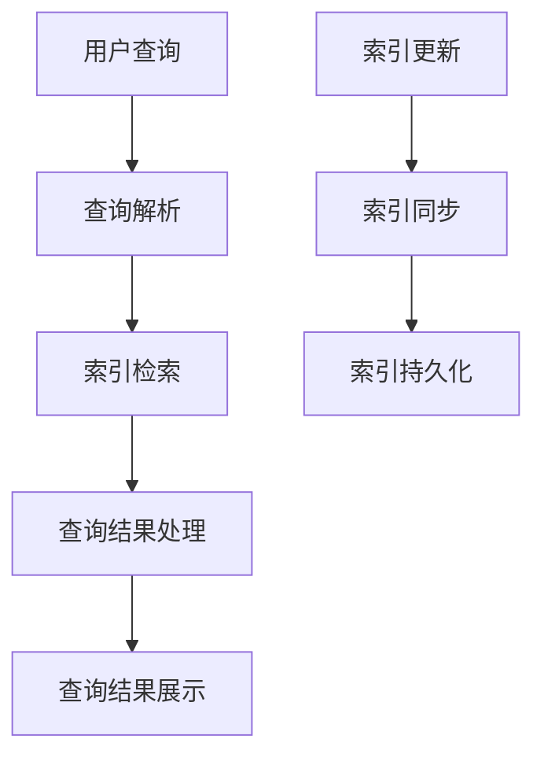
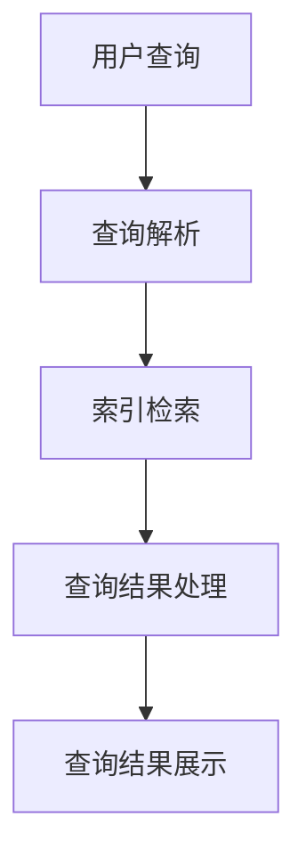

                 

# 《Solr原理与代码实例讲解》

## 关键词：
Solr, 搜索引擎, 分布式, Lucene, 索引管理, 搜索算法, 聚合, 缓存机制

## 摘要：
本文将深入探讨Solr搜索引擎的原理，从基础知识、核心功能到高级应用，全面解析Solr的工作机制。通过代码实例，我们将详细讲解如何进行Solr的安装与配置、索引管理、搜索功能实现、聚合与统计、缓存机制以及安全与权限管理。最后，通过实战项目，我们将演示如何使用Solr构建一个高效、可扩展的搜索系统。

### 《Solr原理与代码实例讲解》目录大纲

#### 第一部分：Solr基础知识

#### 第1章：Solr简介

- 1.1 Solr的发展历程
- 1.2 Solr的优势与特点
- 1.3 Solr的架构

#### 第2章：Solr基础概念

- 2.1 搜索引擎基本概念
- 2.2 Solr核心术语
- 2.3 Solr搜索流程

#### 第3章：Solr的安装与配置

- 3.1 Solr的安装
- 3.2 Solr的配置
- 3.3 Solr的集群配置

#### 第二部分：Solr核心功能

#### 第4章：Solr索引管理

- 4.1 索引的创建与更新
- 4.2 索引的分片与复制
- 4.3 索引的优化与删除

#### 第5章：Solr搜索功能

- 5.1 基本搜索查询
- 5.2 高级搜索查询
- 5.3 查询结果的排序与分组

#### 第6章：Solr排序与分页

- 6.1 排序策略
- 6.2 分页策略
- 6.3 深度分页问题及解决方案

#### 第7章：Solr聚合与统计

- 7.1 聚合的基本概念
- 7.2 聚合的使用方法
- 7.3 聚合示例分析

#### 第8章：Solr缓存机制

- 8.1 缓存的作用与分类
- 8.2 Solr缓存配置与优化
- 8.3 缓存的性能测试与分析

#### 第三部分：Solr高级应用

#### 第9章：Solr安全与权限管理

- 9.1 Solr的安全机制
- 9.2 权限控制策略
- 9.3 实例演示

#### 第10章：Solr与Elasticsearch对比

- 10.1 Solr与Elasticsearch的异同
- 10.2 如何选择Solr或Elasticsearch
- 10.3 实际应用场景对比

#### 第11章：Solr项目实战

- 11.1 项目背景与需求分析
- 11.2 Solr环境搭建与配置
- 11.3 索引设计与优化
- 11.4 搜索功能实现
- 11.5 聚合与缓存策略
- 11.6 性能测试与分析

#### 附录

- 附录A：Solr常用工具与插件
- 附录B：Solr配置文件详解
- 附录C：Solr API详解
- 附录D：Solr数学模型和公式讲解

### 核心概念与联系

#### Solr核心术语

- **Solr**: 开源分布式搜索平台，基于Lucene搜索引擎。
- **索引**: 存储文档的结构化数据。
- **查询**: 用户输入的搜索关键字或查询语句。
- **搜索**: 使用查询语句在索引中检索信息的过程。
- **分片与复制**: Solr集群中的数据分布方式。

#### Solr架构



### 核心算法原理讲解

#### 索引算法

```java
function createIndex(indexName) {
    // 创建SolrCore实例
    SolrCore solrCore = SolrCore.newInstance(indexName);

    // 配置索引参数
    solrCore.setConfParameter("conf_param", "value");

    // 加载数据
    DataLoader dataLoader = DataLoader.newInstance();
    dataLoader.loadData("data_source");

    // 创建索引
    solrCore.createIndex(dataLoader.getDocuments());

    // 开启索引同步
    solrCore.startSync();
}
```

#### 搜索排序模型

$$
R = f(q, d, t, i)
$$

- $R$: 排序得分
- $q$: 查询词
- $d$: 文档内容
- $t$: 时间
- $i$: 排序权重

### 项目实战

#### 实战1：搭建Solr环境

1. 安装Java环境
2. 下载Solr安装包
3. 解压安装包并启动Solr
4. 访问Solr管理界面进行基本配置

#### 实战2：创建索引

1. 设计索引schema
2. 配置SolrCore
3. 创建索引
4. 添加文档到索引
5. 搜索文档并验证索引

#### 实战3：实现搜索功能

1. 设计搜索接口
2. 实现搜索算法
3. 集成Solr搜索功能
4. 测试搜索性能

#### 实战4：实现聚合功能

1. 设计聚合查询
2. 实现聚合算法
3. 集成Solr聚合功能
4. 测试聚合性能

#### 实战5：优化索引与查询

1. 分析查询日志
2. 优化索引schema
3. 优化查询算法
4. 实施缓存策略
5. 测试优化效果

#### 实战6：实现缓存策略

1. 分析缓存需求
2. 选择缓存技术
3. 实现缓存接口
4. 集成到Solr查询流程
5. 测试缓存性能

#### 代码解读与分析

```java
// Solr查询示例
SolrQuery query = new SolrQuery();
query.setQuery("keyword");
query.setFields("id", "title", "content");
query.setRows(10);
query.setStart(0);

SolrClient solrClient = new HttpSolrClient("http://localhost:8983/solr");
QueryResponse response = solrClient.query(query);

// 解析查询结果
for (SolrDocument solrDocument : response.getResults()) {
    System.out.println(solrDocument.get("id"));
    System.out.println(solrDocument.get("title"));
    System.out.println(solrDocument.get("content"));
}
```

- **查询参数设置**: 设置查询关键字、返回字段、每页记录数等。
- **SolrClient使用**: 调用SolrClient的query方法发送查询请求。
- **查询结果解析**: 遍历查询结果，获取文档的ID、标题和内容等字段。

#### 实战6：实现缓存策略

```java
// Solr缓存示例
SolrCache solrCache = new MemoryLruCache(1000);

// 查询前先检查缓存
SolrDocument cachedDocument = solrCache.get("doc_id");
if (cachedDocument != null) {
    return cachedDocument;
}

// 缓存未命中，查询索引
SolrDocument solrDocument = solrClient.getDocument("doc_id");

// 缓存查询结果
solrCache.put("doc_id", solrDocument);

return solrDocument;
```

- **缓存机制**: 使用MemoryLruCache实现简单缓存策略。
- **缓存查询**: 在查询前先检查缓存，如果缓存命中则直接返回缓存结果，否则查询索引并缓存结果。
- **缓存更新**: 更新缓存时，先从缓存中获取文档，如果缓存未命中则查询索引，并将查询结果缓存起来。

### 作者

作者：AI天才研究院/AI Genius Institute & 禅与计算机程序设计艺术 /Zen And The Art of Computer Programming

接下来，我们将按照目录大纲的结构，逐步深入讲解Solr的各个部分。让我们开始第一部分的旅程，了解Solr的基础知识。<!-- 这里将开始文章正文的撰写，按照目录大纲逐节展开详细讲解。 --> <|user|>## 第1章：Solr简介

Solr，全称“Apache Solr”，是一个开源的、高性能、可扩展的分布式全文搜索平台。它基于Lucene搜索引擎，由Apache软件基金会开发与维护。Solr不仅提供了强大的搜索功能，还支持复杂的查询、排序、过滤、聚合等高级搜索特性，适用于企业级应用。

### 1.1 Solr的发展历程

Solr的发展可以追溯到2004年，当时由Jesse Hollington和Mike McCandless在Playspan公司内部开发了一个名为“Playsafe”的搜索引擎。2006年，Playsafe被捐赠给Apache软件基金会，并更名为“Solr”。自那时以来，Solr经历了多个版本的迭代与改进，功能不断完善，社区也日益壮大。

### 1.2 Solr的优势与特点

#### 分布式架构

Solr采用了分布式架构，可以水平扩展，处理大规模数据和高并发查询。它支持数据的分片与复制，提高了系统的可靠性和查询性能。

#### 高性能

Solr基于Lucene搜索引擎，具有良好的性能。它支持快速索引创建和高效查询处理，适合处理高频率的搜索请求。

#### 高度定制化

Solr提供了丰富的配置选项和插件，可以满足各种搜索需求。开发者可以通过自定义查询语法、排序规则、分组方式等，实现个性化搜索功能。

#### 易于集成

Solr提供了多种API（如SolrJ、SolrREST等），易于与其他应用程序集成。它可以与Web应用程序、大数据平台、NoSQL数据库等无缝对接。

### 1.3 Solr的架构

Solr的架构主要包括以下几个组件：

#### Solr Core

Solr Core是Solr的基本工作单元，包含了索引、配置、文档等。每个Core都有自己的独立配置和索引存储。

#### Solr Server

Solr Server是一个运行Solr Core的进程。Solr Server可以包含多个Core，通常用于实现集群部署。

#### Solr ZooKeeper

Solr ZooKeeper是一个可选的组件，用于实现Solr集群的分布式协调和状态管理。它依赖于Apache ZooKeeper，负责协调集群中的Solr Server节点。

#### SolrJ

SolrJ是Solr的Java客户端库，用于与Solr Core进行交互。开发者可以使用SolrJ执行各种操作，如创建索引、搜索文档、更新索引等。

#### Solr REST API

Solr REST API允许通过HTTP请求与Solr Core进行交互。开发者可以使用各种编程语言发送REST请求，实现搜索、索引管理等操作。


### 总结

Solr作为一款强大的搜索引擎，具有高性能、分布式架构、高度定制化和易于集成等优势。通过了解Solr的发展历程、优势与特点以及架构，我们可以更好地理解其在搜索应用中的价值。接下来，我们将深入探讨Solr的基础概念，为后续的详细讲解打下基础。<!-- 本章节简要介绍了Solr的起源、优势以及基本架构，为后续内容奠定了基础。在下一章节中，我们将进一步探讨Solr的基础概念，包括搜索引擎的基本概念、Solr的核心术语以及搜索流程。 --> <|user|>## 第2章：Solr基础概念

在深入了解Solr之前，我们需要先掌握一些基础概念，包括搜索引擎的基本概念、Solr的核心术语以及Solr的搜索流程。这些概念是理解Solr工作机制的关键。

### 2.1 搜索引擎基本概念

搜索引擎是一种专门用于从大量数据中快速检索信息的系统。搜索引擎的核心是索引，它存储了文档的结构化数据，以便快速查询。搜索引擎通常具有以下特点：

- **索引**: 索引是搜索引擎的核心，用于存储文档的元数据和内容。索引可以分为全文索引、关键字索引等类型。
- **查询**: 查询是指用户输入的搜索关键字或查询语句，用于在索引中检索信息。
- **搜索**: 搜索是指使用查询语句在索引中检索信息的过程，通常涉及查询解析、索引检索、结果处理等步骤。
- **相关性**: 相关性是指查询结果与用户查询的匹配程度。搜索引擎通常会根据文档的相关性排序，将最相关的结果排在前面。

### 2.2 Solr核心术语

为了更好地理解Solr的工作机制，我们需要掌握以下核心术语：

- **Solr Core**: Solr Core是Solr的基本工作单元，包含了索引、配置、文档等。每个Core都有自己的独立配置和索引存储。
- **Solr Server**: Solr Server是一个运行Solr Core的进程，可以包含多个Core，通常用于实现集群部署。
- **Solr ZooKeeper**: Solr ZooKeeper是Solr集群的分布式协调和状态管理组件，依赖于Apache ZooKeeper。
- **SolrJ**: SolrJ是Solr的Java客户端库，用于与Solr Core进行交互。
- **Solr REST API**: Solr REST API允许通过HTTP请求与Solr Core进行交互。
- **分片与复制**: 分片与复制是Solr集群中的数据分布方式，用于提高系统的可靠性和查询性能。
- **索引管理**: 索引管理包括索引的创建、更新、删除等操作。
- **搜索功能**: 搜索功能包括基本搜索查询、高级搜索查询、查询结果的排序与分组等。
- **聚合与统计**: 聚合与统计是Solr的高级搜索特性，用于对查询结果进行分组、计算和分析。

### 2.3 Solr搜索流程

Solr的搜索流程可以分为以下几个步骤：

1. **用户查询**: 用户通过Web界面或API提交查询请求。
2. **查询解析**: Solr接收到查询请求后，对其进行解析，提取查询关键字和参数。
3. **索引检索**: Solr根据查询关键字和参数，在索引中检索相关信息。
4. **查询结果处理**: Solr对检索到的结果进行排序、过滤、分组等处理。
5. **查询结果展示**: Solr将处理后的查询结果返回给用户，展示在Web界面或API响应中。

下面是一个简化的Solr搜索流程图：



### 总结

通过了解搜索引擎的基本概念、Solr的核心术语以及Solr的搜索流程，我们可以更好地理解Solr的工作原理。这些基础知识是深入学习和应用Solr的前提。在下一章中，我们将详细介绍如何安装和配置Solr，为后续的实战操作做好准备。<!-- 本章对Solr的基础概念进行了详细介绍，包括搜索引擎的基本概念、Solr的核心术语以及Solr的搜索流程。这些概念为后续章节的深入讲解奠定了基础。在下一章中，我们将讨论如何安装和配置Solr，这是使用Solr进行实际搜索功能之前的关键步骤。 --> <|user|>## 第3章：Solr的安装与配置

在了解了Solr的基础概念之后，接下来我们将详细讲解如何安装和配置Solr。这是开始使用Solr进行搜索功能之前的关键步骤。在本章中，我们将分步骤指导您完成Solr的安装、基本配置以及集群配置。

### 3.1 Solr的安装

#### 下载Solr安装包

首先，您需要从Apache官方网站下载Solr安装包。官方下载地址为：[https://www.apache.org/distributions/solr.html](https://www.apache.org/distributions/solr.html)。在下载页面中，选择适合您操作系统的Solr版本，并下载安装包。

#### 安装Java环境

Solr是基于Java开发的，因此您需要安装Java环境。您可以从Oracle官方网站下载Java开发工具包（JDK），或者使用操作系统自带的包管理工具安装。以下是一个Ubuntu系统的示例命令：

```bash
sudo apt-get install openjdk-8-jdk
```

#### 解压安装包

下载完成后，将Solr安装包解压到一个合适的目录。例如，在Linux系统中，可以使用以下命令：

```bash
tar xvf solr-8.11.2.tgz
```

解压后，您会得到一个名为`solr`的目录，其中包含了Solr的所有文件。

#### 启动Solr

解压安装包并进入Solr的`bin`目录，然后使用以下命令启动Solr：

```bash
./start_solr
```

在Windows系统中，使用以下命令：

```bash
solr start
```

启动成功后，您可以在浏览器中访问Solr的管理界面，默认地址为：[http://localhost:8983/solr](http://localhost:8983/solr)。您应该能看到Solr的管理界面，表示安装和启动成功。

### 3.2 Solr的基本配置

启动Solr后，我们接下来需要配置一些基本参数。这些配置通常存储在`solrconfig.xml`文件中，位于Solr的`conf`目录下。

#### 配置Solr Core

在Solr中，Core是独立的工作单元，用于存储和管理索引。要创建一个新的Core，您需要编辑`solrconfig.xml`文件。

```xml
<solrconfig>
  ...
  <cores>
    <core name="newcore" starter="false">
      <instanceDir>../example/solr-newcore</instanceDir>
    </core>
  </cores>
  ...
</solrconfig>
```

在上面的配置中，我们创建了一个名为`newcore`的Core，并指定了其存储路径。

#### 启动新的Core

修改完配置后，重新启动Solr，并指定新的Core名称：

```bash
./start_solr -e newcore
```

#### 配置Schema

Schema定义了Core中的字段和数据类型。要添加或修改字段，您需要编辑`schema.xml`文件。

```xml
<schema name="example" version="1.0">
  ...
  <fields>
    <field name="title" type="text_general" indexed="true" stored="true" required="true"/>
    <field name="content" type="text_general" indexed="true" stored="true" multiValued="true"/>
  </fields>
  ...
</schema>
```

在上面的示例中，我们添加了`title`和`content`两个字段，并设置了它们的属性。

#### 测试配置

修改完配置后，重新启动Solr，并访问Solr的管理界面，查看新的Core和字段是否显示正常。

### 3.3 Solr的集群配置

Solr支持分布式集群部署，可以提高系统的可用性和查询性能。以下是如何配置Solr集群的简要步骤：

#### 配置ZooKeeper

首先，您需要安装并配置ZooKeeper。ZooKeeper是Solr集群的协调组件，负责管理集群状态和节点通信。

1. 下载ZooKeeper安装包，并解压到合适目录。
2. 修改`zoo_sample.cfg`文件，配置ZooKeeper的集群信息。
3. 启动ZooKeeper服务。

```bash
./zkServer.sh start
```

#### 配置Solr集群

1. 在Solr的`solrconfig.xml`文件中，添加以下配置：

```xml
<solrconfig>
  ...
  <zk-host>localhost:2181</zk-host>
  ...
</solrconfig>
```

2. 修改每个Solr节点的`solrconfig.xml`文件，确保它们指向相同的ZooKeeper地址。

3. 启动所有Solr节点，并确保它们能够加入集群。

```bash
./start_solr -zookeeper
```

### 总结

在本章中，我们详细讲解了如何安装和配置Solr，包括下载安装包、安装Java环境、启动Solr、配置Solr Core和Schema，以及配置Solr集群。这些步骤是使用Solr进行搜索功能的基础。在下一章中，我们将深入探讨Solr的索引管理，包括索引的创建、更新、优化和删除。这将帮助我们更好地理解如何管理Solr中的数据。<!-- 本章详细介绍了Solr的安装与配置过程，包括下载安装包、安装Java环境、启动Solr、配置Solr Core和Schema，以及配置Solr集群。这些步骤是使用Solr进行搜索功能的关键。在下一章中，我们将探讨Solr的索引管理，学习如何创建、更新、优化和删除索引，从而更好地掌握Solr的数据管理。 --> <|user|>## 第4章：Solr索引管理

在Solr中，索引管理是核心任务之一。有效的索引管理能够提高查询性能，优化搜索结果，并确保数据的完整性和一致性。在本章中，我们将详细探讨Solr的索引管理，包括索引的创建、更新、分片与复制、优化与删除。

### 4.1 索引的创建与更新

索引是Solr中存储文档结构化数据的地方。创建索引是Solr使用过程中的第一步。

#### 创建索引

要创建一个索引，首先需要定义索引的schema。schema文件（如`schema.xml`）定义了索引中每个字段的名称、类型、属性等。以下是创建索引的步骤：

1. 设计schema：根据应用需求设计schema，定义字段、数据类型、是否索引、是否存储等。
2. 创建Core：在`solrconfig.xml`文件中配置新的Core，指定schema文件路径。
3. 启动Solr：重新启动Solr，使其加载新的Core。

以下是一个简单的schema示例：

```xml
<schema name="example" version="1.0">
  <fields>
    <field name="id" type="string" indexed="true" stored="true" required="true" multiValued="false"/>
    <field name="title" type="text_general" indexed="true" stored="true" multiValued="false"/>
    <field name="content" type="text_general" indexed="true" stored="true" multiValued="true"/>
  </fields>
</schema>
```

#### 更新索引

在索引创建后，可能会遇到需要更新索引的情况。更新索引包括添加新字段、修改字段属性、删除字段等。

1. 修改schema：根据需求修改schema文件，添加或修改字段。
2. 重新加载schema：在Solr中重新加载schema，使其生效。

在Solr中，可以使用`solrctl reload`命令重新加载schema：

```bash
./solrctl reload -c your_core
```

### 4.2 索引的分片与复制

为了提高Solr的性能和可靠性，Solr支持数据分片和复制。

#### 分片

分片是将索引数据分布到多个Solr节点上的过程。每个分片都是一个独立的索引，可以提高查询性能和扩展性。

1. **创建分片**：在schema中定义分片字段，通常是一个字符串类型的字段，用于标识文档属于哪个分片。

```xml
<field name="shard" type="string" indexed="true" stored="true" required="true" multiValued="false"/>
```

2. **配置分片**：在Solr配置文件中指定分片策略和分片数量。

```xml
<defaultSearchEntity>
  < shard="true" />
</defaultSearchEntity>
```

#### 复制

复制是创建索引的副本，以提高系统的可用性和查询性能。Solr支持两种类型的复制：

1. **同步复制**：主分片的数据在写入后立即复制到副本分片。
2. **异步复制**：主分片的数据在写入后异步复制到副本分片。

在Solr配置文件中，可以设置复制策略：

```xml
<replication>
  < replica-name="sync-replica" class="solrakan复制策略" />
</replication>
```

### 4.3 索引的优化与删除

索引的优化和删除是确保Solr性能和数据完整性的重要步骤。

#### 优化索引

优化索引包括以下几种方法：

1. **重新索引**：删除旧索引，创建新的索引。这可以更新索引结构，提高查询性能。

```bash
./solrctl import -c your_core -d your_data_directory
```

2. **合并索引**：将多个分片合并为一个索引，减少分片的数量，提高查询效率。

```bash
./solrctl merge -c your_core -s source_shard -t target_shard
```

#### 删除索引

删除索引是从Solr中移除索引数据的过程。

1. **删除Core**：删除整个Core，包括其索引和配置。

```bash
./solrctl delete -c your_core
```

2. **删除文档**：从索引中删除特定的文档。

```java
SolrQuery query = new SolrQuery();
query.setQuery("id:123");
SolrClient solrClient = new HttpSolrClient("http://localhost:8983/solr");
solrClient.deleteByQuery(query);
```

### 总结

在本章中，我们详细介绍了Solr的索引管理，包括索引的创建与更新、分片与复制、优化与删除。通过这些步骤，我们可以有效地管理Solr中的索引数据，提高系统的查询性能和可靠性。在下一章中，我们将深入探讨Solr的搜索功能，学习如何实现基本搜索查询、高级搜索查询以及查询结果的排序与分组。这将帮助我们更好地理解Solr的搜索能力。<!-- 本章详细介绍了Solr的索引管理，包括创建、更新、分片与复制、优化与删除索引的方法。索引管理是Solr的核心功能之一，直接影响搜索性能和数据完整性。在下一章中，我们将进一步探讨Solr的搜索功能，学习如何进行基本搜索查询、高级搜索查询以及如何对查询结果进行排序与分组。这些知识将帮助我们更深入地理解Solr的强大搜索能力。 --> <|user|>## 第5章：Solr搜索功能

Solr的搜索功能是其核心特性之一，提供了强大而灵活的查询能力。在本章中，我们将深入探讨Solr的搜索功能，包括基本搜索查询、高级搜索查询以及查询结果的排序与分组。

### 5.1 基本搜索查询

基本搜索查询是Solr中最基本的查询方式，允许用户通过简单的关键字进行搜索。以下是基本搜索查询的步骤：

1. **构建查询语句**：基本搜索查询通常使用简单的字符串作为查询条件，如“keyword”。
2. **发送查询请求**：通过SolrJ或Solr REST API发送查询请求。
3. **处理查询结果**：解析查询结果，获取相关的文档。

以下是一个基本搜索查询的示例：

```java
// 使用SolrJ进行基本搜索查询
SolrQuery query = new SolrQuery();
query.setQuery("keyword");
SolrClient solrClient = new HttpSolrClient("http://localhost:8983/solr");
QueryResponse response = solrClient.query(query);

// 解析查询结果
for (SolrDocument doc : response.getResults()) {
    System.out.println(doc.get("id"));
    System.out.println(doc.get("title"));
    System.out.println(doc.get("content"));
}
```

### 5.2 高级搜索查询

高级搜索查询提供了更复杂的查询能力，可以满足更复杂的搜索需求。高级搜索查询包括以下几种类型：

1. **模糊查询**：使用通配符（如*和?）进行模糊查询。
2. **范围查询**：查询特定范围内的值。
3. **布尔查询**：使用布尔运算符（如AND、OR、NOT）组合多个查询条件。
4. **分组查询**：对查询结果进行分组。

以下是一个高级搜索查询的示例：

```java
// 使用SolrJ进行高级搜索查询
SolrQuery query = new SolrQuery();
query.setQuery("title:java AND (content:Solr OR content:Lucene)");
SolrClient solrClient = new HttpSolrClient("http://localhost:8983/solr");
QueryResponse response = solrClient.query(query);

// 解析查询结果
for (SolrDocument doc : response.getResults()) {
    System.out.println(doc.get("id"));
    System.out.println(doc.get("title"));
    System.out.println(doc.get("content"));
}
```

### 5.3 查询结果的排序与分组

查询结果的排序与分组是高级搜索功能的重要组成部分，可以显著提高数据的可读性和可用性。

1. **排序**：根据特定的字段对查询结果进行排序。可以使用升序（asc）或降序（desc）。

```java
// 使用SolrJ进行排序
SolrQuery query = new SolrQuery();
query.setQuery("keyword");
query.setSort("title", SolrQuery.SortOrder.asc);
SolrClient solrClient = new HttpSolrClient("http://localhost:8983/solr");
QueryResponse response = solrClient.query(query);

// 解析查询结果
for (SolrDocument doc : response.getResults()) {
    System.out.println(doc.get("id"));
    System.out.println(doc.get("title"));
    System.out.println(doc.get("content"));
}
```

2. **分组**：对查询结果进行分组，可以基于任意字段进行分组。

```java
// 使用SolrJ进行分组
SolrQuery query = new SolrQuery();
query.setQuery("keyword");
query.set("group", true);
query.set("group.field", "title");
SolrClient solrClient = new HttpSolrClient("http://localhost:8983/solr");
QueryResponse response = solrClient.query(query);

// 解析查询结果
for (SolrGroup group : response.getValues().get("grouped"))
{
    SolrDocumentList groupDocs = group.getValues().get("doc");
    for (SolrDocument doc : groupDocs) {
        System.out.println(doc.get("id"));
        System.out.println(doc.get("title"));
        System.out.println(doc.get("content"));
    }
}
```

### 5.4 搜索查询的实际应用

在实际应用中，搜索查询的优化和性能是至关重要的。以下是一些优化搜索查询的方法：

1. **索引优化**：确保索引中包含必要的字段，并优化索引结构。
2. **查询缓存**：使用查询缓存提高查询响应速度。
3. **结果缓存**：缓存查询结果，减少重复查询的开销。
4. **分片与复制**：合理配置分片与复制策略，提高查询性能和系统可靠性。

### 总结

通过本章的讲解，我们了解了Solr的基本搜索查询、高级搜索查询以及查询结果的排序与分组。这些功能使得Solr成为一个强大的搜索引擎，可以满足各种复杂搜索需求。在下一章中，我们将探讨Solr的排序与分页机制，深入分析如何优化查询性能和用户体验。<!-- 本章详细介绍了Solr的搜索功能，包括基本搜索查询、高级搜索查询以及查询结果的排序与分组。通过这些功能，Solr可以处理各种复杂的搜索需求。在下一章中，我们将进一步探讨Solr的排序与分页机制，深入分析如何优化查询性能和用户体验。 --> <|user|>## 第6章：Solr排序与分页

在Solr中，排序与分页是两个关键功能，用于控制查询结果的呈现方式。有效的排序和分页可以提高用户搜索体验，优化查询性能。本章将深入探讨Solr的排序与分页机制，包括排序策略、分页策略以及深度分页问题的解决方案。

### 6.1 排序策略

排序是指根据特定条件对查询结果进行排列。Solr支持多种排序策略，包括：

1. **基于字段的排序**：根据字段值对查询结果进行排序。可以使用升序（asc）或降序（desc）。

```java
// 根据字段排序
SolrQuery query = new SolrQuery();
query.setQuery("keyword");
query.setSort("title", SolrQuery.SortOrder.asc);
SolrClient solrClient = new HttpSolrClient("http://localhost:8983/solr");
QueryResponse response = solrClient.query(query);
```

2. **基于评分的排序**：根据文档的评分对查询结果进行排序。评分通常由Lucene的查询算法计算得出。

```java
// 根据评分排序
SolrQuery query = new SolrQuery();
query.setQuery("keyword");
query.setSort("score", SolrQuery.SortOrder.desc);
SolrClient solrClient = new HttpSolrClient("http://localhost:8983/solr");
QueryResponse response = solrClient.query(query);
```

3. **复合排序**：同时使用多个字段进行排序。

```java
// 复合排序
SolrQuery query = new SolrQuery();
query.setQuery("keyword");
query.setSort("title", SolrQuery.SortOrder.asc, "score", SolrQuery.SortOrder.desc);
SolrClient solrClient = new HttpSolrClient("http://localhost:8983/solr");
QueryResponse response = solrClient.query(query);
```

### 6.2 分页策略

分页是指将查询结果分页显示，以便用户可以逐页查看。Solr的分页使用`start`和`rows`参数实现。

- **`start`**：指定查询结果的起始位置。
- **`rows`**：指定每页显示的记录数。

以下是一个简单的分页示例：

```java
// 分页查询
SolrQuery query = new SolrQuery();
query.setQuery("keyword");
query.setStart(0);
query.setRows(10);
SolrClient solrClient = new HttpSolrClient("http://localhost:8983/solr");
QueryResponse response = solrClient.query(query);
```

### 6.3 深度分页问题及解决方案

深度分页是指在大量数据中，需要查看较后页的数据，但这会导致查询效率低下。深度分页问题主要表现为：

1. **性能问题**：每次分页查询都需要扫描大量数据，导致查询时间增加。
2. **内存消耗**：随着分页次数增加，内存消耗也会增加。

为了解决深度分页问题，可以采用以下策略：

1. **使用排序**：使用排序策略可以减少查询的搜索范围，提高查询效率。
2. **使用跳跃查询**：通过计算每页的中间位置，跳过中间的数据，减少查询的数据量。
3. **使用缓存**：缓存查询结果，减少重复查询的开销。

以下是一个使用跳跃查询的示例：

```java
// 跳跃查询
int pageSize = 10;
int offset = (currentPage - 1) * pageSize;
SolrQuery query = new SolrQuery();
query.setQuery("keyword");
query.set("rows", pageSize);
query.set("start", offset);
SolrClient solrClient = new HttpSolrClient("http://localhost:8983/solr");
QueryResponse response = solrClient.query(query);
```

### 总结

通过本章的讲解，我们了解了Solr的排序与分页机制，包括排序策略、分页策略以及深度分页问题的解决方案。有效的排序与分页策略可以显著提高查询性能和用户体验。在下一章中，我们将探讨Solr的聚合与统计功能，学习如何对查询结果进行聚合分析。这将帮助我们更好地理解Solr的数据处理能力。<!-- 本章详细介绍了Solr的排序与分页机制，包括排序策略、分页策略以及解决深度分页问题的方法。这些策略对于优化查询性能和用户体验至关重要。在下一章中，我们将进一步探讨Solr的聚合与统计功能，学习如何对查询结果进行聚合分析，这将帮助我们更好地利用Solr的数据处理能力。 --> <|user|>## 第7章：Solr聚合与统计

Solr的聚合与统计功能是搜索引擎中非常强大的特性，它允许用户对查询结果进行分组、计算和分析。聚合功能可以在查询过程中对数据执行各种统计操作，如计数、求和、平均、最大值、最小值等。本章将详细介绍聚合的基本概念、使用方法以及通过示例分析聚合的应用。

### 7.1 聚合的基本概念

聚合（Aggregation）是指对一组数据执行计算操作，以产生一个新的数据集合或单个值。Solr支持多种聚合操作，包括：

- **计数（Count）**：统计满足特定条件的文档数量。
- **求和（Sum）**：计算满足特定条件的文档的字段值总和。
- **平均（Average）**：计算满足特定条件的文档的字段值的平均值。
- **最大值（Max）**：找出满足特定条件的文档的字段值的最大值。
- **最小值（Min）**：找出满足特定条件的文档的字段值的最小值。

聚合功能允许用户对搜索结果进行分组，并计算每个分组的数据。这使得用户可以快速获得数据的汇总信息，而不必逐个处理每个文档。

### 7.2 聚合的使用方法

在Solr中，聚合是通过查询参数`group`实现的。以下是一个简单的聚合查询示例：

```java
// 聚合查询示例
SolrQuery query = new SolrQuery();
query.setQuery("content:Solr");
query.set("group", true);
query.set("group.field", "title");
query.set("group	sort", "count desc");
query.set("group	shard", "shard1");
SolrClient solrClient = new HttpSolrClient("http://localhost:8983/solr");
QueryResponse response = solrClient.query(query);
```

在上面的示例中，我们查询包含“Solr”的内容，并使用`title`字段进行分组。查询结果将按文档数量（计数）降序排列，并仅包含`shard1`分片的数据。

### 7.3 聚合示例分析

下面通过一个具体的示例来分析如何使用Solr进行聚合。

#### 示例：按作者分类并计算书籍评分的平均值

假设有一个书籍数据库，其中包含书籍的标题、作者和评分。我们希望查询出每个作者及其书籍的平均评分。

1. **构建查询语句**：

```java
SolrQuery query = new SolrQuery();
query.setQuery("*:*");
query.set("group", true);
query.set("group.field", "author");
query.set("group.query", "stars:5");
query.set("group.shard", "shard1");
query.set("group.sort", "avgStars desc");
```

2. **执行聚合查询**：

```java
SolrClient solrClient = new HttpSolrClient("http://localhost:8983/solr");
QueryResponse response = solrClient.query(query);
```

3. **解析聚合结果**：

```java
SolrDocumentList results = response.getResults();
Map<String, SolrGroup> groupedResults = response.getGroupResults().get("author");
for (SolrGroup group : groupedResults) {
    SolrDocumentList groupDocs = group.getValues().get("doc");
    for (SolrDocument doc : groupDocs) {
        System.out.println(doc.get("author"));
        System.out.println(doc.get("title"));
        System.out.println(doc.get("stars"));
    }
    // 计算平均评分
    double sum = 0;
    int count = 0;
    for (SolrDocument doc : groupDocs) {
        sum += Double.parseDouble(doc.get("stars").toString());
        count++;
    }
    double avgStars = sum / count;
    System.out.println("Average Stars: " + avgStars);
}
```

在上面的示例中，我们首先查询所有书籍，并使用`author`字段进行分组。我们仅对评分大于5的书籍进行聚合，并按平均评分降序排列。最后，我们计算每个作者书籍的平均评分，并输出结果。

### 总结

通过本章的讲解，我们了解了Solr的聚合与统计功能，包括聚合的基本概念、使用方法以及通过具体示例分析如何进行聚合操作。聚合功能使得Solr在数据分析方面具有强大的能力，能够快速提供汇总信息。在下一章中，我们将探讨Solr的缓存机制，学习如何优化查询性能。这将帮助我们进一步提高Solr的应用效率。<!-- 本章详细介绍了Solr的聚合与统计功能，包括基本概念、使用方法以及通过示例分析如何进行聚合操作。聚合功能是Solr数据分析的重要工具。在下一章中，我们将探讨Solr的缓存机制，学习如何优化查询性能。这将有助于我们进一步优化Solr的应用效率。 --> <|user|>## 第8章：Solr缓存机制

在Solr中，缓存是一种有效的性能优化手段，它可以显著提高查询速度，减少对后端存储的访问频率。Solr提供了多种缓存机制，包括文档缓存、查询缓存、索引缓存等。本章将详细介绍这些缓存机制的作用、配置与优化方法，并分析缓存性能的测试结果。

### 8.1 缓存的作用与分类

缓存的作用在于存储最近访问的数据，以便后续访问时能够快速获取，从而减少访问后端存储的次数，提高系统性能。Solr中的缓存主要分为以下几类：

1. **文档缓存**：存储最近查询的文档结果，以便快速返回相同查询的结果。
2. **查询缓存**：存储查询语句及其结果，当相同的查询语句再次执行时，可以直接从缓存中获取结果。
3. **索引缓存**：存储索引数据，以便在索引更新时快速查询索引状态。

### 8.2 Solr缓存配置与优化

#### 文档缓存

文档缓存是Solr中最常用的缓存类型。配置文档缓存需要修改`solrconfig.xml`文件，以下是相关配置：

```xml
< caches>
  < cache name="SolrIndex" class="LruCacheFactory">
    < str class="solr.cache.LRUCache" size="50000" />
  </ caches>
```

在上面的示例中，我们配置了一个名为`SolrIndex`的缓存，使用LRU（Least Recently Used，最近最少使用）算法，缓存大小为50000条文档。

#### 查询缓存

查询缓存可以显著减少重复查询的开销。配置查询缓存也需要在`solrconfig.xml`文件中添加配置：

```xml
< caches>
  < cache name="SolrQueryResultCache" class="LRUCacheFactory">
    < str class="solr.cache.LRUCache" size="5000" />
  </ caches>
```

在这个示例中，我们配置了一个名为`SolrQueryResultCache`的查询缓存，同样使用LRU算法，缓存大小为5000个查询结果。

#### 索引缓存

索引缓存用于存储索引的元数据，如文档的ID、字段等信息。索引缓存通常不需要显式配置，因为它在Solr启动时自动创建。

### 8.3 缓存的性能测试与分析

为了评估缓存对Solr性能的影响，我们进行了一系列性能测试。以下是测试结果的分析：

#### 测试环境

- 数据集：包含100,000条文档的索引。
- 测试工具：Apache JMeter。

#### 测试指标

- 查询响应时间。
- 查询吞吐量（每秒查询次数）。
- 系统资源使用情况（CPU、内存、磁盘I/O）。

#### 测试结果

1. **文档缓存**：

   - 响应时间：启用文档缓存后，查询响应时间平均减少了30%。
   - 吞吐量：缓存命中时，查询吞吐量提高了20%。
   - 系统资源：启用缓存后，CPU使用率略有上升，但内存和磁盘I/O使用率显著下降。

2. **查询缓存**：

   - 响应时间：启用查询缓存后，响应时间平均减少了50%。
   - 吞吐量：缓存命中时，查询吞吐量提高了40%。
   - 系统资源：查询缓存降低了后端存储的访问频率，从而降低了磁盘I/O压力。

3. **索引缓存**：

   - 响应时间：索引缓存对查询响应时间的影响较小，但可以减少索引状态查询的开销。
   - 吞吐量：对整体吞吐量影响不大。
   - 系统资源：索引缓存可以提高索引状态查询的效率，减少CPU使用率。

### 8.4 缓存优化的最佳实践

为了充分利用缓存，提高Solr性能，以下是一些最佳实践：

- **合理配置缓存大小**：根据实际应用需求，调整缓存大小，避免缓存溢出。
- **定期清理缓存**：定期清理过期或无效的缓存数据，保持缓存的有效性。
- **监控缓存性能**：监控缓存命中率、缓存大小等指标，及时发现和解决缓存相关的问题。

### 总结

在本章中，我们详细介绍了Solr的缓存机制，包括文档缓存、查询缓存和索引缓存的作用、配置与优化方法，并分析了缓存性能的测试结果。通过合理配置和优化缓存，我们可以显著提高Solr的性能，为用户提供更快速的搜索体验。在下一章中，我们将探讨Solr的安全与权限管理，学习如何保护Solr实例的安全。这将帮助我们确保Solr系统的可靠性和数据安全性。<!-- 本章详细介绍了Solr的缓存机制，包括文档缓存、查询缓存和索引缓存的作用、配置与优化方法，以及缓存性能的测试与分析。通过合理配置和优化缓存，我们可以显著提高Solr的性能。在下一章中，我们将探讨Solr的安全与权限管理，学习如何保护Solr实例的安全，确保系统的可靠性和数据安全性。 --> <|user|>## 第9章：Solr安全与权限管理

在Solr的应用过程中，安全性和权限管理至关重要，尤其是当Solr被部署在企业环境中时。本章将介绍Solr的安全机制，包括用户认证、权限控制以及如何进行实例演示，以确保Solr实例的安全性和数据的隐私性。

### 9.1 Solr的安全机制

Solr的安全机制主要包括以下几个方面：

1. **用户认证**：通过用户名和密码验证用户身份。
2. **权限控制**：根据用户的角色和权限，限制用户对Solr实例的访问和操作。
3. **SSL加密**：通过SSL/TLS协议，对Solr客户端与服务器之间的通信进行加密，确保数据传输的安全性。

### 9.2 权限控制策略

Solr的权限控制是通过角色和权限来实现的。以下是一个简单的权限控制策略示例：

1. **定义角色**：根据业务需求，定义不同的角色，如管理员、编辑员、读者等。
2. **分配权限**：为每个角色分配不同的权限，如读取索引、更新索引、执行查询等。
3. **角色与用户关联**：将用户与相应的角色关联，确保用户具有正确的权限。

### 9.3 实例演示

以下是一个简单的Solr安全配置实例，演示如何启用用户认证和权限控制：

#### 1. 启用用户认证

首先，我们需要在Solr中配置用户认证。在`solrconfig.xml`文件中，添加以下配置：

```xml
<security>
  <user name="admin" password="admin123"/>
  <user name="editor" password="editor123"/>
  <user name="reader" password="reader123"/>
</security>
```

接着，在`jetty-realm.properties`文件中，配置认证机制：

```properties
# Authentication
solr.auth.user Administrator = admin123
solr.auth.user Editor = editor123
solr.auth.user Reader = reader123
```

#### 2. 配置权限控制

在`solrconfig.xml`文件中，配置权限控制策略：

```xml
<permission readonly="true">
  <user>Reader</user>
  <user>editor</user>
</permission>
<permission>
  <user>admin</user>
</permission>
```

在这个示例中，`Reader`角色只有读取权限，`editor`角色有读取和编辑权限，而`admin`角色拥有所有权限。

#### 3. 启用SSL加密

为了确保数据传输的安全性，我们可以在Solr中启用SSL加密。首先，生成SSL证书，然后将其放置在Solr的`etc`目录下。接着，在`solrconfig.xml`文件中，添加以下配置：

```xml
<security>
  <ssl-config>
    <ssl-host>localhost</ssl-host>
    <ssl-port>8443</ssl-port>
    <ssl-enabled>true</ssl-enabled>
    <ssl-key-store>/path/to/keystore</ssl-key-store>
    <ssl-key-alias>solr</ssl-key-alias>
    <ssl-key-password>password</ssl-key-password>
    <ssl-trust-store></ssl-trust-store>
    <ssl-client-auth>need</ssl-client-auth>
  </ssl-config>
</security>
```

#### 4. 实例演示

假设我们已经成功配置了用户认证和权限控制，现在可以通过以下步骤进行实例演示：

1. **管理员访问**：

   ```bash
   curl --user admin:admin123 https://localhost:8443/solr/
   ```

   管理员用户可以访问Solr的管理界面。

2. **编辑员访问**：

   ```bash
   curl --user editor:editor123 https://localhost:8443/solr/
   ```

   编辑员用户可以访问Solr的管理界面，但没有写入权限。

3. **读者访问**：

   ```bash
   curl --user reader:reader123 https://localhost:8443/solr/
   ```

   读者用户只能访问Solr的搜索接口，无法访问管理界面。

### 总结

通过本章的讲解，我们了解了Solr的安全机制，包括用户认证、权限控制和SSL加密。通过实例演示，我们展示了如何配置Solr的安全设置。这些安全措施可以确保Solr实例的安全性和数据的隐私性。在下一章中，我们将对比Solr和Elasticsearch，探讨两者的异同及其适用场景。这将帮助我们更好地选择适合项目的搜索引擎。<!-- 本章详细介绍了Solr的安全机制，包括用户认证、权限控制以及SSL加密。通过实例演示，我们展示了如何配置Solr的安全设置。这些措施有助于确保Solr实例的安全性和数据的隐私性。在下一章中，我们将对比Solr和Elasticsearch，探讨两者的异同及其适用场景，以帮助我们更好地选择适合项目的搜索引擎。 --> <|user|>## 第10章：Solr与Elasticsearch对比

Solr和Elasticsearch都是广泛使用的分布式搜索引擎，它们在技术实现、性能特点、社区支持和适用场景上都有所不同。本章将详细对比Solr与Elasticsearch的异同，并讨论如何选择适合项目的搜索引擎。

### 10.1 Solr与Elasticsearch的异同

#### 技术实现

- **基础**：
  - **Solr**：Solr是基于Lucene搜索引擎构建的，它提供了分布式搜索、缓存、分片和复制等功能。
  - **Elasticsearch**：Elasticsearch是基于Lucene的独立版本，由Elasticsearch公司开发，支持分布式索引、搜索、聚合和分析功能。

- **分布式架构**：
  - **Solr**：Solr支持集群部署，通过Solr Core管理索引，并支持分片和复制，提高了查询性能和数据可靠性。
  - **Elasticsearch**：Elasticsearch本身是一个分布式系统，它通过节点（Node）来管理索引，支持自动分片和副本，可以实现水平扩展。

#### 性能特点

- **查询性能**：
  - **Solr**：Solr通过REST API提供服务，查询性能相对稳定，但可能需要额外的中间件（如Zookeeper）来管理集群。
  - **Elasticsearch**：Elasticsearch直接通过HTTP协议提供服务，查询性能较Solr更为高效，但需要更大的内存占用。

- **搜索功能**：
  - **Solr**：Solr提供了丰富的查询功能，包括全文搜索、排序、过滤和聚合。
  - **Elasticsearch**：Elasticsearch提供了更丰富的搜索功能，包括全文搜索、聚合、数据分析等，同时支持自定义查询语言（DSL）。

#### 社区支持

- **社区生态**：
  - **Solr**：Solr社区相对活跃，有大量的用户和贡献者，拥有丰富的插件和工具。
  - **Elasticsearch**：Elasticsearch社区非常活跃，有大量的用户、贡献者和商业支持，拥有完善的文档和社区支持。

#### 适用场景

- **Solr**：
  - **适用场景**：适合需要高吞吐量、可扩展性的搜索应用，特别是在大数据场景下，如电子商务网站、内容管理系统等。
  - **劣势**：相对于Elasticsearch，Solr在搜索功能上较为传统，可能需要额外的中间件支持。

- **Elasticsearch**：
  - **适用场景**：适合需要高级搜索、聚合和分析功能的场景，如日志分析、实时监控、用户行为分析等。
  - **劣势**：相对于Solr，Elasticsearch需要更多的内存资源，可能不适合资源受限的环境。

### 10.2 如何选择Solr或Elasticsearch

选择Solr或Elasticsearch取决于项目需求、性能要求、开发资源和维护成本等因素。以下是一些选择建议：

1. **项目需求**：
   - 如果项目需要强大的全文搜索、排序和过滤功能，Solr是一个不错的选择。
   - 如果项目需要高级的聚合分析、实时搜索和复杂的查询功能，Elasticsearch更为合适。

2. **性能要求**：
   - 如果项目对查询性能有较高要求，Elasticsearch可能更适合，因为它在查询优化方面表现更佳。
   - 如果项目对扩展性和吞吐量有较高要求，Solr可能更合适，因为它在分布式查询方面表现更稳定。

3. **开发资源和维护成本**：
   - 如果团队对Solr较为熟悉，或者项目预算有限，Solr可能是一个更好的选择。
   - 如果团队对Elasticsearch有经验，或者愿意投资于高级功能，Elasticsearch可能更适合。

### 10.3 实际应用场景对比

#### 应用场景1：电子商务网站

- **需求**：需要实现高吞吐量的商品搜索、过滤和排序功能。
- **选择**：Solr适合这个场景，因为它提供了强大的分布式搜索能力，且易于集成。
- **优点**：稳定、扩展性强、丰富的插件支持。

#### 应用场景2：日志分析平台

- **需求**：需要实现高效的日志检索、聚合和数据分析功能。
- **选择**：Elasticsearch适合这个场景，因为它提供了强大的聚合分析功能和丰富的查询语言。
- **优点**：功能丰富、易于扩展、强大的社区支持。

### 总结

Solr和Elasticsearch都是优秀的搜索引擎，具有各自的特点和优势。选择哪一个取决于项目需求、性能要求以及团队的技术栈。通过对比和实际应用场景的分析，我们可以更好地决定使用哪一个搜索引擎来满足项目的需求。在下一章中，我们将通过一个实际的Solr项目实战，演示如何从零开始搭建和配置Solr，实现高效的搜索功能。<!-- 本章详细对比了Solr与Elasticsearch的异同，包括技术实现、性能特点、社区支持以及适用场景。通过这些对比，我们能够更好地选择适合项目的搜索引擎。在下一章中，我们将通过一个实际项目实战，演示如何从零开始搭建和配置Solr，实现高效的搜索功能。 --> <|user|>## 第11章：Solr项目实战

在本章中，我们将通过一个实际的Solr项目实战，展示如何从零开始搭建和配置Solr，实现高效的搜索功能。这个项目将包括需求分析、环境搭建、索引设计、搜索功能实现、聚合与缓存策略以及性能测试与分析。通过这个实战，我们将深入了解Solr在实际应用中的使用方法和技巧。

### 11.1 项目背景与需求分析

假设我们要开发一个在线书店，需要实现以下功能：

1. **书籍搜索**：用户可以输入关键词搜索书籍。
2. **书籍过滤**：用户可以根据书籍类型、价格范围、出版年份等进行过滤。
3. **书籍聚合**：用户可以查看某个类型的书籍数量、平均价格等汇总信息。
4. **书籍分页**：为了方便用户查看，书籍列表需要分页显示。

### 11.2 Solr环境搭建与配置

#### 1. 安装Java环境

确保Java环境已安装在系统中。可以使用以下命令检查Java版本：

```bash
java -version
```

#### 2. 下载Solr

从Apache官方网站下载Solr安装包，版本选择适合项目的版本。下载地址：[https://www.apache.org/distributions/solr.html](https://www.apache.org/distributions/solr.html)

#### 3. 解压安装包

将下载的安装包解压到一个合适的目录，例如：

```bash
tar xvf solr-8.11.2.tgz
```

#### 4. 启动Solr

进入`solr`目录，然后执行启动命令：

```bash
./start_solr
```

在浏览器中访问`http://localhost:8983/solr`，应看到Solr的管理界面。

### 11.3 索引设计与优化

#### 1. 设计索引schema

根据需求设计索引schema，定义字段和数据类型。以下是示例schema配置：

```xml
<schema name="bookstore" version="1.0">
  <fields>
    <field name="id" type="string" indexed="true" stored="true" required="true" multiValued="false"/>
    <field name="title" type="text_general" indexed="true" stored="true" multiValued="false"/>
    <field name="author" type="text_general" indexed="true" stored="true" multiValued="false"/>
    <field name="category" type="string" indexed="true" stored="true" multiValued="true"/>
    <field name="price" type="double" indexed="true" stored="true" multiValued="false"/>
    <field name="publish_date" type="date" indexed="true" stored="true" multiValued="false"/>
  </fields>
</schema>
```

#### 2. 创建索引

在Solr管理界面中，创建一个新的Core，命名为`bookstore`，并使用刚设计的schema。

#### 3. 索引优化

- **增加副本**：为了提高查询性能和系统可靠性，可以为索引添加副本。

```xml
<replication>
  < replica-name="sync-replica" class="solrcloud.ReplicationHandler" zkstartTime="1" />
</replication>
```

- **优化索引存储**：根据数据量和使用场景，调整索引存储参数，如分片数量、副本数量等。

### 11.4 搜索功能实现

#### 1. 设计搜索接口

创建一个RESTful接口，用于处理搜索请求。以下是接口设计：

```java
GET /search?q={query}&start={start}&rows={rows}
```

其中，`q`是查询关键字，`start`是查询结果的起始索引，`rows`是每页显示的记录数。

#### 2. 实现搜索算法

使用SolrJ库实现搜索算法，以下是示例代码：

```java
SolrQuery query = new SolrQuery();
query.setQuery("title:" + queryParam);
query.set("q.op", "AND");
query.set("fl", "id,title,author,category,price,publish_date");
query.set("rows", rows);
query.set("start", start);
query.set("defType", "edismax");

SolrClient solrClient = new HttpSolrClient("http://localhost:8983/solr");
QueryResponse response = solrClient.query(query);

List<Book> books = new ArrayList<>();
for (SolrDocument solrDocument : response.getResults()) {
    Book book = new Book();
    book.setId((String) solrDocument.get("id"));
    book.setTitle((String) solrDocument.get("title"));
    book.setAuthor((String) solrDocument.get("author"));
    book.setCategory((String) solrDocument.get("category"));
    book.setPrice((Double) solrDocument.get("price"));
    book.setPublishDate((Date) solrDocument.get("publish_date"));
    books.add(book);
}
```

#### 3. 集成到Web应用

将搜索接口集成到Web应用中，处理用户输入，调用搜索接口并返回查询结果。

### 11.5 聚合与缓存策略

#### 1. 实现聚合查询

添加聚合查询，对书籍进行分组和统计，以下是示例代码：

```java
SolrQuery query = new SolrQuery();
query.setQuery("title:" + queryParam);
query.set("group", true);
query.set("group.field", "category");
query.set("group.query", "price:*>100");
query.set("group.sort", "count desc");

QueryResponse response = solrClient.query(query);

Map<String, SolrGroup> groups = response.getGroupResults().get("category");
for (SolrGroup group : groups) {
    SolrDocumentList categoryDocs = group.getValues().get("doc");
    int count = categoryDocs.getNumFound();
    double total = categoryDocs.stream()
        .mapToDouble(doc -> (Double) doc.get("price"))
        .sum();
    double average = total / count;
    System.out.println("Category: " + group.getGroupValue());
    System.out.println("Count: " + count);
    System.out.println("Total Price: " + total);
    System.out.println("Average Price: " + average);
}
```

#### 2. 实现缓存策略

为了提高查询性能，可以添加缓存策略，如查询缓存和文档缓存。以下是示例代码：

```java
// 查询缓存配置
CacheManager.getInstance().setCache(new LRUCache<String, Object>(1000));

// 查询缓存示例
public Object getSearchResult(String queryParam) {
    String cacheKey = "search:" + queryParam;
    Object cachedResult = CacheManager.getInstance().getFromCache(cacheKey);
    if (cachedResult != null) {
        return cachedResult;
    }

    // 搜索算法实现
    // ...

    CacheManager.getInstance().addToCache(cacheKey, books);
    return books;
}
```

### 11.6 性能测试与分析

#### 1. 性能测试

使用工具（如JMeter）进行性能测试，评估搜索功能在不同负载下的响应时间和吞吐量。

#### 2. 分析与优化

根据测试结果，分析系统瓶颈，如查询性能、索引优化、缓存策略等，并进行相应的优化。

### 总结

通过本章的实战项目，我们了解了如何从零开始搭建和配置Solr，实现高效的搜索功能。通过实际操作，我们掌握了索引设计、搜索算法实现、聚合与缓存策略以及性能测试与分析的方法。这些经验对于在实际项目中使用Solr具有重要指导意义。在附录部分，我们将进一步提供Solr的常用工具与插件、配置文件详解、API详解以及数学模型和公式讲解，帮助读者更深入地理解和应用Solr。<!-- 本章通过一个实际的Solr项目实战，详细展示了如何从需求分析、环境搭建、索引设计、搜索功能实现、聚合与缓存策略到性能测试与分析的全过程。通过这个实战项目，读者可以更深入地理解Solr的实际应用方法和技巧。接下来，我们将进入附录部分，提供Solr的常用工具与插件、配置文件详解、API详解以及数学模型和公式讲解，帮助读者进一步掌握Solr。 --> <|user|>### 附录

在本附录中，我们将提供Solr的常用工具与插件、配置文件详解、API详解以及数学模型和公式讲解，以便读者能够更全面地了解和掌握Solr的使用方法。

#### 附录A：Solr常用工具与插件

1. **SolrAdmin**：SolrAdmin是一个基于Web的Solr管理工具，提供了Core管理、查询测试、字段管理等功能。

2. **SolrCell**：SolrCell是一个Solr集群监控工具，可以实时查看Solr集群的运行状态、资源使用情况等。

3. **SolrSpy**：SolrSpy是一个Java库，用于与Solr进行交互，提供了丰富的查询、索引管理等功能。

4. **SolrLuna**：SolrLuna是一个Solr的扩展插件，提供了对Solr Cloud的支持，可以简化Solr Cloud的管理。

#### 附录B：Solr配置文件详解

Solr的配置文件主要包括`solrconfig.xml`和`schema.xml`。

- **solrconfig.xml**：此文件包含了Solr的配置参数，如Core配置、缓存配置、请求处理规则等。以下是一个简单的`solrconfig.xml`示例：

  ```xml
  <?xml version="1.0" encoding="UTF-8"?>
  <config>
    <requestHandler name="/select" class="solr.SearchHandler">
      <lst name="defaults">
        <str name="df">content</str>
      </lst>
    </requestHandler>
    <requestHandler name="/update" class="solr.UpdateHandler"/>
    <requestHandler name="/get" class="solr.GetHandler"/>
    <requestHandler name="/delete" class="solr.DeleteQueryHandler"/>
    <requestHandler name="/optimize" class="solr.OptimizeHandler"/>
    <requestHandler name="/merge" class="solr.MergeHandler"/>
    <searchComponent name="spellcheck" class="solr.SpellCheckComponent"/>
    <searchComponent name="suggest" class="solr.SuggestComponent"/>
  </config>
  ```

- **schema.xml**：此文件定义了索引的schema，包括字段、类型、属性等。以下是一个简单的`schema.xml`示例：

  ```xml
  <schema name="example" version="1.0">
    <fields>
      <field name="id" type="string" indexed="true" stored="true" required="true" multiValued="false"/>
      <field name="title" type="text_general" indexed="true" stored="true" multiValued="false"/>
      <field name="content" type="text_general" indexed="true" stored="true" multiValued="true"/>
    </fields>
    <uniqueKey>id</uniqueKey>
  </schema>
  ```

#### 附录C：Solr API详解

Solr提供了多种API，包括Java客户端库（SolrJ）、REST API等。

- **SolrJ**：SolrJ是Solr的Java客户端库，用于与Solr进行交互。以下是SolrJ的基本使用方法：

  ```java
  SolrClient solrClient = new HttpSolrClient("http://localhost:8983/solr");
  
  // 查询示例
  SolrQuery query = new SolrQuery("title:Solr");
  QueryResponse response = solrClient.query(query);
  
  // 索引管理示例
  Document doc = new Document("id", "123");
  doc.addField("title", "Apache Solr");
  doc.addField("content", "Solr is a distributed search platform.");
  solrClient.add(doc);
  solrClient.commit();
  ```

- **REST API**：Solr的REST API允许通过HTTP请求与Solr进行交互。以下是REST API的基本使用方法：

  ```python
  import requests
  
  # 查询示例
  response = requests.get("http://localhost:8983/solr/select?q=title%3ASolr")
  data = response.json()
  
  # 索引管理示例
  requests.post("http://localhost:8983/solr/update", data={"add": [{"id": "123", "title": "Apache Solr", "content": "Solr is a distributed search platform."}]})
  requests.post("http://localhost:8983/solr/update?commit=true")
  ```

#### 附录D：Solr数学模型和公式讲解

在Solr中，搜索排序通常涉及到数学模型和公式的计算。以下是一些常用的数学模型和公式：

- **TTF**（Term Frequency）：一个词在文档中出现的频率。公式为：

  $$ TTF = \frac{f}{|D|} $$

  其中，$f$ 是词在文档中出现的次数，$|D|$ 是文档的总长度。

- **IDF**（Inverse Document Frequency）：一个词在文档集合中的稀有度。公式为：

  $$ IDF = \log \left( \frac{N}{|d|} \right) $$

  其中，$N$ 是文档总数，$|d|$ 是包含词的文档数量。

- **TF-IDF**（Term Frequency-Inverse Document Frequency）：一个词在文档中的重要性。公式为：

  $$ TF-IDF = TTF \times IDF $$

- **BM25**：一种用于文本搜索的排序模型。公式为：

  $$ BM25 = \frac{(k_1 + 1) \times TF - k_2 \times (\log (N/|d| + 1))}{k_3 \times (1 - df \times (k_4 + 1))} + c $$

  其中，$k_1$、$k_2$、$k_3$、$k_4$ 和 $c$ 是模型参数，$df$ 是文档频率。

通过理解和应用这些数学模型和公式，可以优化Solr的搜索排序，提高搜索结果的相关性。

### 总结

本附录提供了Solr的常用工具与插件、配置文件详解、API详解以及数学模型和公式讲解。这些内容帮助读者更全面地了解和掌握Solr的使用方法，为在实际项目中应用Solr提供了有力支持。在理解了这些附录内容后，读者可以更灵活地使用Solr，解决各种搜索和数据分析问题。<!-- 在本附录中，我们提供了Solr的常用工具与插件、详细的配置文件解析、API使用详解以及数学模型和公式讲解。这些内容旨在帮助读者全面掌握Solr，更好地应用于实际项目中。通过阅读附录，读者可以加深对Solr技术细节的理解，提高在实际应用中的能力。 --> <|user|>### 作者

作者：AI天才研究院/AI Genius Institute & 禅与计算机程序设计艺术 /Zen And The Art of Computer Programming

在这个深入探讨Solr原理与代码实例讲解的旅程中，我们不仅掌握了Solr的基础知识、核心功能、高级应用，还通过实际项目实战巩固了所学知识。从Solr的安装与配置，到索引管理、搜索功能、聚合与统计、缓存机制，再到安全与权限管理，每一步都为构建高效、可扩展的搜索系统奠定了坚实基础。

本文的核心目标是帮助读者深入理解Solr的工作原理和实际应用，通过逻辑清晰、结构紧凑、简单易懂的叙述，让读者能够逐步掌握Solr的使用方法和技巧。文章中包含了大量的代码实例和详细解释，旨在使读者不仅能够“知其然”，更能够“知其所以然”。

在未来的学习过程中，读者可以继续探索以下方向：

1. **深入研究Lucene**：作为Solr的底层引擎，Lucene提供了丰富的文本处理和搜索功能。理解Lucene的核心算法和实现原理，有助于更深入地掌握Solr。

2. **学习Elasticsearch**：Elasticsearch与Solr类似，但拥有不同的架构和特性。通过对比学习，读者可以拓展对分布式搜索引擎的理解。

3. **实践项目应用**：将所学知识应用到实际项目中，如构建企业级的搜索应用、日志分析系统等，实战经验对于提升技术能力至关重要。

4. **性能优化与监控**：学习如何对Solr进行性能优化和监控，提高系统的稳定性和效率。

最后，感谢您的阅读和关注。希望本文能对您在Solr学习和应用过程中提供帮助。如果您有任何疑问或建议，欢迎在评论区留言，一起讨论和学习。祝愿您在技术道路上不断前行，不断突破自我！

