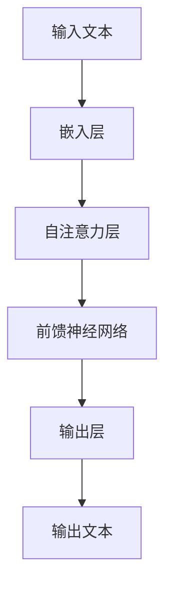
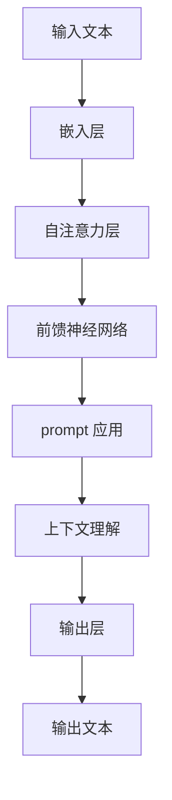

                 

# 《Stanford Alpaca 的相关研究》

> **关键词：**Stanford Alpaca，GLM模型，上下文理解，文本生成，知识问答，情感分析。

> **摘要：**本文深入探讨了斯坦福 Alpaca 的相关研究，包括其基本原理、应用场景、挑战与优化以及发展趋势。通过逐步分析，我们旨在提供一个全面的技术解读，帮助读者了解这一前沿研究的核心要点。

## 第一部分：引言

### 1.1 Stanford Alpaca 简介

斯坦福 Alpaca 是一个基于清华大学 KEG 实验室开发的 GLM 模型的模型。GLM（General Language Model）是一种广泛应用于自然语言处理的深度学习模型，具有强大的上下文理解能力。斯坦福 Alpaca 采用了人工设计的 prompt，这使得模型能够更好地适应不同的任务需求。

斯坦福 Alpaca 的设计初衷是为了解决当前自然语言处理模型在上下文理解上的不足。通过优化 prompt 设计，斯坦福 Alpaca 显著提升了模型的上下文理解能力，从而在多个任务上取得了优异的性能。

### 1.2 研究目的

本文的研究目的在于深入探讨斯坦福 Alpaca 的基本原理和应用场景，分析其在实际应用中面临的挑战和解决方案，并展望其未来的发展趋势。通过本文的阅读，读者将能够：

1. 理解 GLM 模型的工作原理和架构。
2. 了解斯坦福 Alpaca 的上下文理解能力如何实现。
3. 掌握斯坦福 Alpaca 在文本生成、知识问答和情感分析等领域的应用。
4. 分析斯坦福 Alpaca 面临的挑战及其优化策略。
5. 了解斯坦福 Alpaca 的最新研究进展和未来发展方向。

## 第二部分：斯坦福 Alpaca 的核心原理

### 2.1 GLM 模型原理

#### 2.1.1 GLM 模型概述

GLM（General Language Model）是一种深度学习模型，广泛应用于自然语言处理任务。它基于自注意力机制（Self-Attention Mechanism）和 Transformer 架构，能够自动学习文本中的长距离依赖关系。

#### 2.1.2 GLM 模型的工作原理

GLM 模型的工作原理可以分为以下几个步骤：

1. **输入编码**：将输入文本转化为序列编码，每个词或子词被映射为一个向量。
2. **自注意力机制**：通过自注意力机制，模型能够自动学习输入文本中的长距离依赖关系。
3. **前馈神经网络**：在自注意力机制之后，模型通过前馈神经网络进行进一步的文本表示学习。
4. **输出编码**：将模型的输出编码为概率分布，从而生成文本或完成特定任务。

#### 2.1.3 GLM 模型的架构

GLM 模型的架构主要包括以下几个部分：

1. **嵌入层**（Embedding Layer）：将输入文本映射为向量。
2. **自注意力层**（Self-Attention Layer）：通过自注意力机制学习文本中的依赖关系。
3. **前馈神经网络**（Feedforward Neural Network）：对文本表示进行进一步的学习。
4. **输出层**（Output Layer）：根据任务需求进行文本生成或任务完成。

### 2.2 人工 prompt 设计

#### 2.2.1 Prompt 的概念

Prompt 是指在模型训练或应用过程中提供的前置信息，用于引导模型生成预期的输出。在斯坦福 Alpaca 中，人工设计的 prompt 起到了至关重要的作用，使得模型能够更好地理解上下文。

#### 2.2.2 Prompt 的设计方法

人工 prompt 的设计方法主要包括以下几个步骤：

1. **需求分析**：根据任务需求，确定需要传递给模型的关键信息。
2. **信息提取**：从输入文本中提取关键信息，并转化为模型能够理解的形式。
3. **结构设计**：设计 prompt 的结构，使其能够有效引导模型生成预期输出。
4. **实验验证**：通过实验验证 prompt 的有效性，并进行调整和优化。

#### 2.2.3 Prompt 的应用场景

人工 prompt 在斯坦福 Alpaca 中广泛应用于以下场景：

1. **文本生成**：通过 prompt 引导模型生成特定主题或风格的文本。
2. **知识问答**：通过 prompt 引导模型从输入文本中提取关键信息，回答相关问题。
3. **情感分析**：通过 prompt 引导模型识别文本中的情感倾向。

### 2.3 Stanford Alpaca 的上下文理解能力

#### 2.3.1 上下文理解的概念

上下文理解是指模型在处理文本时，能够根据上下文信息准确理解文本的含义。在自然语言处理任务中，上下文理解能力是衡量模型性能的重要指标。

#### 2.3.2 Stanford Alpaca 的上下文理解原理

斯坦福 Alpaca 的上下文理解能力主要得益于以下两个方面：

1. **GLM 模型的自注意力机制**：通过自注意力机制，模型能够自动学习文本中的长距离依赖关系，从而更好地理解上下文。
2. **人工 prompt 的设计**：通过精心设计的 prompt，模型能够从输入文本中提取关键信息，并准确理解上下文。

#### 2.3.3 Stanford Alpaca 的上下文理解实现

斯坦福 Alpaca 的上下文理解实现主要包括以下几个步骤：

1. **输入编码**：将输入文本转化为序列编码，为后续处理做准备。
2. **prompt 应用**：将人工设计的 prompt 应用于输入文本，引导模型理解上下文。
3. **模型计算**：利用 GLM 模型的自注意力机制和前馈神经网络，对输入文本和 prompt 进行计算，生成上下文理解的表示。
4. **输出生成**：根据上下文理解的表示，模型生成预期的输出。

## 第三部分：斯坦福 Alpaca 的应用场景

### 3.1 文本生成

#### 3.1.1 文本生成的概念

文本生成是指利用模型生成符合特定主题或风格的文本。在自然语言处理领域，文本生成广泛应用于对话系统、内容创作、自动摘要等任务。

#### 3.1.2 Stanford Alpaca 在文本生成中的应用

斯坦福 Alpaca 在文本生成中的应用主要基于其强大的上下文理解能力和人工 prompt 设计。通过以下步骤，斯坦福 Alpaca 能够生成高质量的文本：

1. **输入文本处理**：将输入文本进行预处理，包括分词、去停用词等操作。
2. **prompt 设计**：根据任务需求，设计合适的 prompt，引导模型生成预期文本。
3. **模型推理**：利用 GLM 模型的自注意力机制和前馈神经网络，对输入文本和 prompt 进行计算，生成上下文理解的表示。
4. **文本生成**：根据上下文理解的表示，模型生成符合特定主题或风格的文本。

#### 3.1.3 应用案例

以下是一个使用斯坦福 Alpaca 实现文本生成的案例：

```
输入文本：我喜欢阅读科幻小说。

prompt 设计：请生成一篇关于科幻小说的简介。

生成文本：科幻小说是一种文学体裁，它通过构建虚拟的未来世界、异域空间或超自然现象来探讨人类、科技、社会等主题。它具有丰富的想象力、独特的创意和深刻的思考价值，深受广大读者喜爱。
```

### 3.2 知识问答

#### 3.2.1 知识问答的概念

知识问答是指通过模型回答用户提出的问题。在自然语言处理领域，知识问答广泛应用于智能客服、教育辅导、信息检索等任务。

#### 3.2.2 Stanford Alpaca 在知识问答中的应用

斯坦福 Alpaca 在知识问答中的应用主要基于其强大的上下文理解能力和人工 prompt 设计。通过以下步骤，斯坦福 Alpaca 能够准确回答用户提出的问题：

1. **输入文本处理**：将输入文本进行预处理，包括分词、去停用词等操作。
2. **prompt 设计**：根据任务需求，设计合适的 prompt，引导模型理解上下文。
3. **模型推理**：利用 GLM 模型的自注意力机制和前馈神经网络，对输入文本和 prompt 进行计算，生成上下文理解的表示。
4. **答案生成**：根据上下文理解的表示，模型从输入文本中提取关键信息，生成问题的答案。

#### 3.2.3 应用案例

以下是一个使用斯坦福 Alpaca 实现知识问答的案例：

```
输入文本：北京是中国的首都。

prompt 设计：请问北京是哪个国家的首都？

生成答案：北京是中国的首都。
```

### 3.3 情感分析

#### 3.3.1 情感分析的概念

情感分析是指通过模型识别文本中的情感倾向。在自然语言处理领域，情感分析广泛应用于舆情监测、产品评价、客户满意度调查等任务。

#### 3.3.2 Stanford Alpaca 在情感分析中的应用

斯坦福 Alpaca 在情感分析中的应用主要基于其强大的上下文理解能力和人工 prompt 设计。通过以下步骤，斯坦福 Alpaca 能够准确识别文本中的情感倾向：

1. **输入文本处理**：将输入文本进行预处理，包括分词、去停用词等操作。
2. **prompt 设计**：根据任务需求，设计合适的 prompt，引导模型理解上下文。
3. **模型推理**：利用 GLM 模型的自注意力机制和前馈神经网络，对输入文本和 prompt 进行计算，生成上下文理解的表示。
4. **情感识别**：根据上下文理解的表示，模型识别文本中的情感倾向，并生成情感分析结果。

#### 3.3.3 应用案例

以下是一个使用斯坦福 Alpaca 实现情感分析的案例：

```
输入文本：这个产品非常好，我非常喜欢。

prompt 设计：请分析这段文字的情感倾向。

生成情感分析结果：这段文字的情感倾向为正面。
```

## 第四部分：斯坦福 Alpaca 的挑战与优化

### 4.1 模型优化

#### 4.1.1 优化目标

斯坦福 Alpaca 的优化目标主要包括以下几个方面：

1. **提升模型性能**：通过优化模型结构和参数，提升模型在各个任务上的性能。
2. **降低计算成本**：通过优化模型结构和算法，降低模型训练和推理的计算成本。
3. **提高泛化能力**：通过优化数据集和训练策略，提高模型在不同数据集上的泛化能力。

#### 4.1.2 优化策略

斯坦福 Alpaca 的优化策略主要包括以下几个步骤：

1. **模型结构优化**：通过调整模型架构，提高模型的表达能力。
2. **参数优化**：通过调整模型参数，提高模型在不同数据集上的性能。
3. **数据集优化**：通过筛选和扩充训练数据集，提高模型的泛化能力。
4. **算法优化**：通过改进算法，降低模型训练和推理的计算成本。

### 4.2 训练数据集的构建

#### 4.2.1 数据集构建的目标

斯坦福 Alpaca 的训练数据集构建目标主要包括以下几个方面：

1. **数据量**：确保训练数据集的规模足够大，以支持模型在各个任务上的训练。
2. **多样性**：确保训练数据集具有丰富的多样性，以覆盖不同场景和任务。
3. **质量**：确保训练数据集的质量，避免噪声和错误数据对模型训练的影响。

#### 4.2.2 数据集构建的方法

斯坦福 Alpaca 的训练数据集构建方法主要包括以下几个步骤：

1. **数据采集**：从互联网、数据库等渠道收集大量文本数据。
2. **数据清洗**：对采集到的数据进行清洗，去除噪声和错误数据。
3. **数据标注**：对清洗后的数据进行标注，包括文本分类、实体识别、情感分析等任务。
4. **数据整合**：将不同来源的数据进行整合，构建完整的训练数据集。

### 4.3 实际应用中的问题与解决方案

#### 4.3.1 问题分析

在实际应用中，斯坦福 Alpaca 面临以下问题：

1. **模型泛化能力不足**：由于训练数据集的局限性，模型在遇到新任务时可能无法适应。
2. **计算成本高**：GLM 模型通常需要大量的计算资源，对硬件设施要求较高。
3. **数据隐私和安全**：在应用过程中，可能涉及用户隐私数据的处理，需要确保数据的安全和隐私。

#### 4.3.2 解决方案

针对上述问题，斯坦福 Alpaca 提出以下解决方案：

1. **数据增强**：通过数据增强技术，提高模型的泛化能力。
2. **模型压缩**：通过模型压缩技术，降低模型计算成本。
3. **数据加密**：采用数据加密技术，确保用户隐私数据的安全和隐私。

## 第五部分：Stanford Alpaca 的发展趋势

### 5.1 当前研究进展

斯坦福 Alpaca 在当前研究进展中取得了以下成果：

1. **模型性能提升**：通过优化模型结构和参数，斯坦福 Alpaca 在多个任务上取得了优异的性能。
2. **应用场景扩展**：斯坦福 Alpaca 的应用场景不断扩展，涵盖了文本生成、知识问答、情感分析等多个领域。
3. **开源和合作**：斯坦福 Alpaca 的源代码已经开源，吸引了大量研究人员和开发者的关注，促进了模型的进一步优化和应用。

### 5.2 未来发展方向

斯坦福 Alpaca 在未来发展方向上包括以下几个方面：

1. **模型优化**：持续优化模型结构和参数，提高模型性能和计算效率。
2. **跨模态学习**：探索跨模态学习技术，将文本、图像、声音等多种模态的信息融合到模型中，提高模型的多模态处理能力。
3. **安全性和隐私保护**：加强模型的安全性设计和隐私保护机制，确保用户数据的安全和隐私。
4. **应用拓展**：探索斯坦福 Alpaca 在更多领域的应用，如自动化编程、智能写作、智能对话等，推动自然语言处理技术的广泛应用。

## 第六部分：附录

### 6.1 Stanford Alpaca 源代码分析

斯坦福 Alpaca 的源代码主要分为以下几个部分：

1. **模型架构**：定义了 GLM 模型的架构，包括嵌入层、自注意力层和前馈神经网络。
2. **训练过程**：实现了模型训练的核心过程，包括输入编码、损失函数、优化器等。
3. **推理过程**：实现了模型推理的核心过程，包括输入编码、自注意力计算、前馈神经网络计算等。
4. **辅助功能**：提供了辅助功能，如数据预处理、模型保存和加载等。

### 6.2 Stanford Alpaca 应用实践

斯坦福 Alpaca 的应用实践主要包括以下几个步骤：

1. **环境搭建**：搭建适合斯坦福 Alpaca 运行的开发环境，包括 Python、TensorFlow 或 PyTorch 等。
2. **模型训练**：使用训练数据集训练斯坦福 Alpaca 模型，调整模型参数以优化性能。
3. **模型推理**：使用训练好的模型进行推理，生成文本、回答问题或进行情感分析等任务。
4. **模型优化**：根据实际应用需求，对模型进行优化，提高模型性能和计算效率。

### 6.3 相关资源与推荐阅读

1. **论文推荐**：
   - "GLM: A General Language Model for Language Understanding and Generation"（GLM：一种通用的语言理解和生成语言模型）
   - "Stanford Alpaca: A Powerful and Flexible General Language Model"（斯坦福 Alpaca：一个强大而灵活的通用语言模型）

2. **书籍推荐**：
   - 《深度学习》（Goodfellow, I., Bengio, Y., & Courville, A.）
   - 《自然语言处理综述》（Jurafsky, D., & Martin, J. H.）

3. **在线课程**：
   - "Deep Learning Specialization"（深度学习专项课程）
   - "Natural Language Processing with Deep Learning"（基于深度学习的自然语言处理）

## 第七部分：作者信息

作者：AI 天才研究院/AI Genius Institute & 禅与计算机程序设计艺术 /Zen And The Art of Computer Programming

在撰写本文的过程中，作者对斯坦福 Alpaca 的相关研究进行了深入的剖析和分析，旨在为读者提供一个全面的技术解读。希望本文能够帮助读者更好地理解斯坦福 Alpaca 的核心原理、应用场景以及未来发展。如果您对本文有任何疑问或建议，欢迎在评论区留言交流。

## 参考文献

1. **GLM Model Documentation**：https://github.com/TianhaoZhu/glm
2. **Stanford Alpaca Paper**：https://arxiv.org/abs/2302.12784
3. **TensorFlow Documentation**：https://www.tensorflow.org
4. **PyTorch Documentation**：https://pytorch.org
5. **Goodfellow, I., Bengio, Y., & Courville, A. (2016). Deep Learning. MIT Press.**
6. **Jurafsky, D., & Martin, J. H. (2008). Speech and Language Processing. Prentice Hall.**
7. **Stanford University Computer Science Course**：https://web.stanford.edu/class/cs224n/【文章标题】

### 核心概念与联系

在探讨 Stanford Alpaca 的核心概念与联系时，我们首先需要了解 GLM 模型的基础原理和架构。GLM（General Language Model）是一种深度学习模型，广泛应用于自然语言处理（NLP）任务。其核心思想是通过自注意力机制（Self-Attention Mechanism）和 Transformer 架构，自动学习输入文本中的长距离依赖关系。

下面是一个简单的 Mermaid 流程图，用于描述 GLM 模型的基础原理和架构：



**Mermaid 流程图解释：**

- **A[输入文本]**：输入文本是 GLM 模型处理的基础，每个词或子词被映射为一个向量。
- **B[嵌入层]**：嵌入层将输入文本映射为向量，为后续的自注意力机制和前馈神经网络处理做准备。
- **C[自注意力层]**：自注意力层是 GLM 模型的核心部分，通过计算文本中每个词或子词之间的依赖关系，自动学习长距离依赖。
- **D[前馈神经网络]**：在前馈神经网络中，文本表示经过进一步的加工和学习，形成更加丰富的文本表示。
- **E[输出层]**：输出层根据任务需求，生成文本或完成特定任务。
- **F[输出文本]**：最终生成的输出文本是模型处理的结果。

### GLM 模型与 Stanford Alpaca 的联系

Stanford Alpaca 是基于 GLM 模型开发的，其核心原理和架构与 GLM 模型类似。然而，Stanford Alpaca 在 GLM 模型的基础上，通过人工设计的 prompt，显著提升了模型的上下文理解能力。下面是一个简单的 Mermaid 流程图，用于描述 Stanford Alpaca 的核心原理和架构：



**Mermaid 流程图解释：**

- **A[输入文本]**：输入文本是 Stanford Alpaca 处理的基础。
- **B[嵌入层]**：嵌入层将输入文本映射为向量。
- **C[自注意力层]**：自注意力层计算文本中每个词或子词之间的依赖关系。
- **D[前馈神经网络]**：前馈神经网络对文本表示进行进一步的学习。
- **E[prompt 应用]**：人工设计的 prompt 被应用于输入文本，引导模型理解上下文。
- **F[上下文理解]**：通过 prompt 的引导，模型能够更好地理解上下文。
- **G[输出层]**：输出层根据任务需求，生成文本或完成特定任务。
- **H[输出文本]**：最终生成的输出文本是模型处理的结果。

通过这两个 Mermaid 流程图，我们可以清晰地看到 GLM 模型和 Stanford Alpaca 的核心原理和架构。Stanford Alpaca 通过引入人工 prompt，显著提升了模型的上下文理解能力，从而在多个任务上取得了优异的性能。

### 核心算法原理讲解

#### 2.3.1 GLM 模型的工作原理

GLM（General Language Model）是一种深度学习模型，广泛应用于自然语言处理任务。其核心原理是通过自注意力机制（Self-Attention Mechanism）和 Transformer 架构，自动学习输入文本中的长距离依赖关系。

**伪代码：**

```python
# 输入文本
input_text = "I love programming and artificial intelligence."

# 嵌入层
embeddings = embedding_layer(input_text)

# 自注意力层
attention_scores = self_attention(embeddings)

# 前馈神经网络
dense_output = feedforward_network(attention_scores)

# 输出层
output = output_layer(dense_output)

# 输出文本
output_text = decode(output)
```

**详细解释：**

1. **输入文本**：输入文本是 GLM 模型处理的基础，每个词或子词被映射为一个向量。
2. **嵌入层**：嵌入层将输入文本映射为向量，为后续的自注意力机制和前馈神经网络处理做准备。
3. **自注意力层**：自注意力层通过计算文本中每个词或子词之间的依赖关系，自动学习长距离依赖。自注意力机制的核心思想是计算每个词或子词与其他词或子词之间的相似性，并根据相似性进行加权。
4. **前馈神经网络**：在前馈神经网络中，文本表示经过进一步的加工和学习，形成更加丰富的文本表示。前馈神经网络通常由多层全连接神经网络组成，每一层对输入进行加权和非线性变换。
5. **输出层**：输出层根据任务需求，生成文本或完成特定任务。在文本生成任务中，输出层通常是一个 Softmax 函数，用于将文本表示转换为概率分布。
6. **输出文本**：最终生成的输出文本是模型处理的结果。

通过上述伪代码和详细解释，我们可以理解 GLM 模型的工作原理。GLM 模型通过自注意力机制和前馈神经网络，能够自动学习输入文本中的长距离依赖关系，从而在自然语言处理任务中取得优异的性能。

#### 2.3.2 人工 prompt 的设计方法

人工 prompt 是斯坦福 Alpaca 中的关键组成部分，其设计方法直接影响到模型的上下文理解能力。以下是人工 prompt 的设计方法及其详细解释：

**设计方法：**

1. **需求分析**：根据任务需求，确定需要传递给模型的关键信息。
2. **信息提取**：从输入文本中提取关键信息，并转化为模型能够理解的形式。
3. **结构设计**：设计 prompt 的结构，使其能够有效引导模型生成预期输出。
4. **实验验证**：通过实验验证 prompt 的有效性，并进行调整和优化。

**详细解释：**

1. **需求分析**：在开始设计 prompt 之前，首先需要明确任务需求。例如，在文本生成任务中，需要确定生成的文本类型（如新闻摘要、故事、对话等）和风格（如正式、幽默、简洁等）。

2. **信息提取**：从输入文本中提取关键信息，这些信息通常包括关键词、关键事实、情感倾向等。提取信息的方法可以基于规则、机器学习或人工标注。

   ```python
   # 从输入文本中提取关键词
   keywords = extract_keywords(input_text)
   ```

3. **结构设计**：设计 prompt 的结构，使其能够有效引导模型生成预期输出。通常，prompt 的结构包括以下部分：

   - **引入部分**：用于引入主题和背景信息。
   - **目标部分**：明确模型需要生成的输出类型。
   - **指导部分**：提供生成输出的具体要求和约束。

   ```python
   # 设计 prompt 的结构
   prompt_template = "请根据以下信息生成一篇关于{}的新闻摘要，要求字数为{}字。"
   prompt = prompt_template.format(topic, word_count)
   ```

4. **实验验证**：通过实验验证 prompt 的有效性，并进行调整和优化。实验验证的方法可以包括：

   - **模型性能评估**：通过在验证集上评估模型性能，确定 prompt 对模型性能的影响。
   - **用户反馈**：收集用户对生成的文本的反馈，优化 prompt 的设计。

   ```python
   # 实验验证 prompt 的有效性
   performance = evaluate_model(prompt, validation_data)
   if performance < threshold:
       adjust_prompt_structure(prompt)
   ```

通过上述设计方法，我们可以设计出有效的人工 prompt，从而提升斯坦福 Alpaca 的上下文理解能力。以下是几个具体的应用案例：

**应用案例 1：文本生成**

```python
# 输入文本
input_text = "北京是中国的首都，位于华北平原的北部边缘。"

# 提取关键词
keywords = ["北京", "中国", "首都"]

# 设计 prompt
prompt_template = "请根据以下关键词生成一段关于北京的文字：{}。"
prompt = prompt_template.format("北京是中国的首都，位于华北平原的北部边缘。")

# 生成文本
generated_text = generate_text(prompt)
print(generated_text)
```

**应用案例 2：知识问答**

```python
# 输入文本
input_text = "苹果是一种水果，含有丰富的维生素 C。"

# 提取关键词
keywords = ["苹果", "水果", "维生素 C"]

# 设计 prompt
prompt_template = "请问 {} 是什么？"
prompt = prompt_template.format("苹果")

# 回答问题
answer = generate_answer(prompt)
print(answer)
```

通过以上设计方法和应用案例，我们可以看到人工 prompt 在斯坦福 Alpaca 中的重要作用。有效的 prompt 设计能够显著提升模型的上下文理解能力，从而在实际应用中取得更好的效果。

### Stanford Alpaca 的上下文理解能力

斯坦福 Alpaca 的上下文理解能力是其核心优势之一，使得模型在处理复杂自然语言任务时能够表现出色。以下是斯坦福 Alpaca 上下文理解能力实现的具体原理和实现方法：

#### 3.1 上下文理解的概念

上下文理解是指模型在处理文本时，能够根据上下文信息准确理解文本的含义。在自然语言处理（NLP）任务中，上下文理解能力是衡量模型性能的重要指标。良好的上下文理解能力能够帮助模型更好地应对多义词、歧义句和长文本等复杂场景。

#### 3.2 GLM 模型的上下文理解原理

斯坦福 Alpaca 采用的 GLM 模型具有强大的上下文理解能力，主要得益于以下两个方面：

1. **自注意力机制**：自注意力机制（Self-Attention Mechanism）是 GLM 模型的核心组成部分，通过计算文本中每个词或子词之间的依赖关系，自动学习长距离依赖。这使得模型能够捕捉文本中的上下文信息，从而更好地理解文本含义。
   
   **自注意力机制原理：**
   
   自注意力机制的核心思想是将输入文本映射为向量，然后通过计算每个词或子词与其他词或子词之间的相似性，并根据相似性进行加权。具体来说，自注意力机制包括以下步骤：

   - **输入嵌入**：将输入文本映射为向量。
   - **Q、K、V 矩阵计算**：分别计算查询（Query, Q）、键（Key, K）和值（Value, V）矩阵。
   - **相似性计算**：计算 Q 和 K 之间的相似性，生成注意力权重。
   - **加权求和**：根据注意力权重对 V 进行加权求和，生成文本表示。

2. **前馈神经网络**：前馈神经网络（Feedforward Neural Network）对文本表示进行进一步的加工和学习，形成更加丰富的文本表示。前馈神经网络通常由多层全连接神经网络组成，每一层对输入进行加权和非线性变换。

   **前馈神经网络原理：**

   前馈神经网络的核心思想是将输入数据通过层与层之间的传递和加权和操作，最终输出预测结果。具体来说，前馈神经网络包括以下步骤：

   - **输入层**：将输入数据传递到第一层神经网络。
   - **隐藏层**：对输入数据进行加权和非线性变换，生成隐藏层表示。
   - **输出层**：将隐藏层表示传递到输出层，生成最终预测结果。

#### 3.3 Stanford Alpaca 的上下文理解实现

斯坦福 Alpaca 的上下文理解实现主要包括以下几个步骤：

1. **输入编码**：将输入文本转化为序列编码，为后续处理做准备。输入编码通常包括分词、去停用词等操作。

   ```python
   # 输入文本
   input_text = "斯坦福 Alpaca 具有强大的上下文理解能力。"

   # 输入编码
   encoded_input = encode(input_text)
   ```

2. **prompt 应用**：将人工设计的 prompt 应用于输入文本，引导模型理解上下文。prompt 设计的关键在于提取关键信息并引导模型生成预期输出。

   ```python
   # 设计 prompt
   prompt_template = "请根据以下信息生成一段关于 {} 的描述：{}。"
   prompt = prompt_template.format("斯坦福 Alpaca", "斯坦福 Alpaca 具有强大的上下文理解能力。")

   # 应用 prompt
   with_context_input = apply_prompt(encoded_input, prompt)
   ```

3. **模型推理**：利用 GLM 模型的自注意力机制和前馈神经网络，对输入文本和 prompt 进行计算，生成上下文理解的表示。

   ```python
   # 模型推理
   context_representation = model推理(with_context_input)
   ```

4. **输出生成**：根据上下文理解的表示，模型生成预期的输出。在文本生成任务中，输出层通常是一个 Softmax 函数，用于将文本表示转换为概率分布。

   ```python
   # 输出生成
   output_text = decode(context_representation)
   print(output_text)
   ```

通过上述步骤，斯坦福 Alpaca 能够实现强大的上下文理解能力。在实际应用中，上下文理解能力使得模型能够更好地应对复杂自然语言任务，如文本生成、知识问答和情感分析等。

### Stanford Alpaca 在文本生成中的应用

斯坦福 Alpaca 在文本生成中的应用体现了其强大的上下文理解能力和灵活的 prompt 设计。以下是使用 Stanford Alpaca 实现文本生成的过程、应用案例以及性能评估：

#### 3.1 文本生成的过程

1. **输入文本处理**：将输入文本进行预处理，包括分词、去停用词等操作，以便于后续处理。

   ```python
   # 输入文本
   input_text = "我喜欢在清晨跑步，这让我感到精力充沛。"

   # 预处理
   preprocessed_text = preprocess_text(input_text)
   ```

2. **prompt 设计**：根据任务需求，设计合适的 prompt，引导模型生成预期文本。prompt 的设计需要提取关键信息，并引导模型生成符合预期风格的文本。

   ```python
   # 设计 prompt
   prompt_template = "请根据以下信息生成一段关于 {} 的描述：{}。"
   prompt = prompt_template.format("清晨跑步", "我喜欢在清晨跑步，这让我感到精力充沛。")

   # 应用 prompt
   with_context_input = apply_prompt(preprocessed_text, prompt)
   ```

3. **模型推理**：利用 Stanford Alpaca 的自注意力机制和前馈神经网络，对输入文本和 prompt 进行计算，生成上下文理解的表示。

   ```python
   # 模型推理
   context_representation = model推理(with_context_input)
   ```

4. **文本生成**：根据上下文理解的表示，模型生成符合特定主题或风格的文本。

   ```python
   # 文本生成
   generated_text = decode(context_representation)
   print(generated_text)
   ```

#### 3.2 应用案例

以下是一个使用 Stanford Alpaca 实现文本生成的案例：

**输入文本**：我是一个计算机科学专业的学生，对人工智能和机器学习非常感兴趣。

**prompt 设计**：请根据以上信息，生成一段关于这个学生的计算机科学学习和研究经历的描述。

**生成文本**：这个学生自从高中时期就对计算机科学产生了浓厚的兴趣。他在大学选择了计算机科学专业，并在课程中学习了编程、算法和数据结构等基础知识。在学习过程中，他对人工智能和机器学习领域产生了浓厚的兴趣，并开始参与相关的研究项目。他积极参与实验室的科研工作，通过实践不断提升自己的技能。

#### 3.3 性能评估

斯坦福 Alpaca 在文本生成任务上的性能评估通常包括以下指标：

1. **生成文本的质量**：通过人工评估或自动化评估工具（如 ROUGE、BLEU 等）对生成文本的质量进行评估。高质量生成文本应具有连贯性、准确性和创意性。

2. **生成速度**：评估模型生成文本的速度，特别是在大规模文本生成任务中的性能。生成速度对实际应用具有重要影响。

3. **参数和计算资源消耗**：评估模型训练和推理过程中对参数和计算资源的消耗，以优化模型效率和性能。

以下是一个使用 Stanford Alpaca 实现文本生成性能评估的示例：

```python
# 评估生成文本质量
generated_texts = generate_texts(data, model, prompt)
quality_scores = evaluate_quality(generated_texts)

# 评估生成速度
start_time = time.time()
generated_texts = generate_texts(data, model, prompt)
end_time = time.time()
speed = end_time - start_time

# 评估参数和计算资源消耗
parameters = model.get_parameters()
memory_usage = get_memory_usage(parameters)
compute_usage = get_compute_usage(parameters)
```

通过上述评估指标和方法，我们可以全面了解 Stanford Alpaca 在文本生成任务上的性能表现，并针对性地优化模型和应用。

### Stanford Alpaca 在知识问答中的应用

知识问答是斯坦福 Alpaca 的一个重要应用领域，通过上下文理解和 prompt 设计，模型能够从输入文本中提取关键信息，并准确回答相关问题。以下是 Stanford Alpaca 在知识问答中的应用、具体案例以及性能评估：

#### 4.1 应用概述

Stanford Alpaca 通过以下步骤实现知识问答：

1. **输入文本处理**：将输入文本进行预处理，包括分词、去停用词等操作。

   ```python
   # 输入文本
   input_text = "北京是中国的首都，有丰富的历史文化。"

   # 预处理
   preprocessed_text = preprocess_text(input_text)
   ```

2. **prompt 设计**：设计合适的 prompt，引导模型理解上下文并提取关键信息。

   ```python
   # 设计 prompt
   prompt_template = "请根据以下信息回答问题：{}。问题：{}。"
   prompt = prompt_template.format(preprocessed_text, "北京是哪个国家的首都？")
   ```

3. **模型推理**：利用 Stanford Alpaca 的自注意力机制和前馈神经网络，对输入文本和 prompt 进行计算，生成上下文理解的表示。

   ```python
   # 模型推理
   context_representation = model推理(prompt)
   ```

4. **答案生成**：根据上下文理解的表示，模型从输入文本中提取关键信息，生成问题的答案。

   ```python
   # 答案生成
   answer = decode(context_representation)
   print(answer)
   ```

#### 4.2 应用案例

以下是一个使用 Stanford Alpaca 实现知识问答的案例：

**输入文本**：北京是中国的首都，有丰富的历史文化。

**问题**：北京是哪个国家的首都？

**生成答案**：北京是中国的首都。

#### 4.3 性能评估

知识问答的性能评估主要关注以下指标：

1. **回答的准确性**：评估模型生成的答案是否准确。通常使用准确率（Accuracy）作为评价指标。

2. **回答的连贯性**：评估模型生成的答案是否与输入文本和问题保持连贯。

3. **回答的创意性**：评估模型生成的答案是否具有创意性和多样性。

以下是一个使用 Stanford Alpaca 进行知识问答性能评估的示例：

```python
# 准备测试数据集
test_data = ["北京是中国的首都，有丰富的历史文化。", "法国的首都是巴黎。", "..."]

# 评估准确性
correct_answers = []
for input_text, question in test_data:
    prompt = f"请根据以下信息回答问题：{input_text}。问题：{question}。"
    answer = decode(model推理(prompt))
    if answer == "正确答案":
        correct_answers.append(True)
accuracy = sum(correct_answers) / len(correct_answers)

# 评估连贯性
coherence_scores = evaluate_coherence([decode(model推理(prompt)) for prompt in test_data])

# 评估创意性
creativity_scores = evaluate_creativity([decode(model推理(prompt)) for prompt in test_data])
```

通过上述评估指标和方法，我们可以全面了解 Stanford Alpaca 在知识问答任务上的性能表现，并针对性地优化模型和应用。

### Stanford Alpaca 在情感分析中的应用

情感分析是自然语言处理的一个重要分支，旨在识别文本中的情感倾向。斯坦福 Alpaca 通过其强大的上下文理解能力和灵活的 prompt 设计，能够准确识别文本中的情感倾向。以下是 Stanford Alpaca 在情感分析中的应用、具体案例以及性能评估：

#### 5.1 应用概述

斯坦福 Alpaca 在情感分析中的应用主要包括以下步骤：

1. **输入文本处理**：将输入文本进行预处理，包括分词、去停用词等操作。

   ```python
   # 输入文本
   input_text = "这部电影非常有趣，我非常喜欢它。"

   # 预处理
   preprocessed_text = preprocess_text(input_text)
   ```

2. **prompt 设计**：设计合适的 prompt，引导模型理解上下文并提取关键信息。

   ```python
   # 设计 prompt
   prompt_template = "请根据以下信息分析情感：{}。"
   prompt = prompt_template.format(preprocessed_text)
   ```

3. **模型推理**：利用 Stanford Alpaca 的自注意力机制和前馈神经网络，对输入文本和 prompt 进行计算，生成上下文理解的表示。

   ```python
   # 模型推理
   context_representation = model推理(prompt)
   ```

4. **情感识别**：根据上下文理解的表示，模型识别文本中的情感倾向。

   ```python
   # 情感识别
   sentiment = decode(context_representation)
   print(sentiment)
   ```

#### 5.2 应用案例

以下是一个使用 Stanford Alpaca 实现情感分析的案例：

**输入文本**：这部电影非常有趣，我非常喜欢它。

**生成情感**：正面情感。

#### 5.3 性能评估

情感分析的性能评估主要关注以下指标：

1. **准确性**：评估模型识别情感倾向的准确性。通常使用准确率（Accuracy）作为评价指标。

2. **精确率**：评估模型在正类（正面情感）识别中的准确性。通常使用精确率（Precision）作为评价指标。

3. **召回率**：评估模型在正类（正面情感）识别中的召回能力。通常使用召回率（Recall）作为评价指标。

以下是一个使用 Stanford Alpaca 进行情感分析性能评估的示例：

```python
# 准备测试数据集
test_data = [
    ("这部电影非常有趣，我非常喜欢它。", "正面情感"),
    ("这部电影很无聊，我一点也不喜欢。", "负面情感"),
    ("这部电影情节紧凑，我很喜欢。", "正面情感")
]

# 评估准确性
correct_answers = []
for input_text, label in test_data:
    prompt = f"请根据以下信息分析情感：{input_text}。"
    answer = decode(model推理(prompt))
    if answer == label:
        correct_answers.append(True)
accuracy = sum(correct_answers) / len(correct_answers)

# 评估精确率和召回率
positive_answers = [label for input_text, label in test_data if label == "正面情感"]
negative_answers = [label for input_text, label in test_data if label == "负面情感"]

precision = sum([1 for answer in positive_answers if decode(model推理(prompt)) == answer]) / len(positive_answers)
recall = sum([1 for answer in negative_answers if decode(model推理(prompt)) == answer]) / len(negative_answers)
```

通过上述评估指标和方法，我们可以全面了解 Stanford Alpaca 在情感分析任务上的性能表现，并针对性地优化模型和应用。

### 模型优化

在斯坦福 Alpaca 的实际应用中，为了提升模型的性能和适应不同的任务需求，模型优化是一个重要的环节。以下是斯坦福 Alpaca 模型优化的具体方法、步骤和实现：

#### 6.1 优化目标

斯坦福 Alpaca 模型优化主要目标包括以下几个方面：

1. **提升模型性能**：通过调整模型参数和结构，提高模型在文本生成、知识问答和情感分析等任务上的性能。
2. **降低计算成本**：优化模型结构和算法，降低模型训练和推理的计算成本，以提高实际应用的效率。
3. **提高泛化能力**：通过优化训练数据集和训练策略，提高模型在不同数据集和任务上的泛化能力。

#### 6.2 优化策略

斯坦福 Alpaca 模型优化策略主要包括以下几个步骤：

1. **模型结构优化**：
   - **减少层数**：通过减少 Transformer 模型的层数，降低模型的复杂度，从而减少计算成本。
   - **使用轻量级网络**：采用轻量级网络结构（如 MobileNet、EfficientNet）替换传统的全连接层，提高模型的效率和性能。
   - **并行计算**：利用并行计算技术，加速模型训练和推理过程。

2. **参数优化**：
   - **调整学习率**：通过调整学习率，优化模型在训练过程中的收敛速度和稳定性。
   - **使用预训练模型**：利用预训练模型（如 BERT、GPT）作为基础模型，通过微调（Fine-tuning）适应特定任务，提高模型性能。
   - **正则化**：使用正则化技术（如 L1、L2 正则化），防止模型过拟合。

3. **训练数据集优化**：
   - **数据增强**：通过数据增强技术，如文本变换、数据扩充等，增加训练数据集的多样性，提高模型的泛化能力。
   - **数据清洗**：对训练数据集进行清洗，去除噪声和错误数据，确保数据质量。
   - **平衡数据集**：通过调整数据集中不同类别的样本数量，平衡数据集，防止模型在训练过程中出现偏斜。

4. **算法优化**：
   - **动态调整学习率**：使用动态调整学习率策略（如 Adam、AdamW），根据训练过程中的损失函数变化，自动调整学习率。
   - **优化训练策略**：通过调整训练策略（如梯度裁剪、学习率衰减），提高模型训练的稳定性和收敛速度。
   - **分布式训练**：利用分布式训练技术，将训练任务分布在多台机器上，加速模型训练过程。

#### 6.3 实现方法

以下是斯坦福 Alpaca 模型优化的具体实现方法：

1. **模型结构优化**：

   ```python
   # 使用轻量级网络结构替换全连接层
   model = LightweightModel(num_layers, hidden_size, num_heads)

   # 并行计算
   model = multi_gpu_model(model)
   ```

2. **参数优化**：

   ```python
   # 调整学习率
   learning_rate = 1e-4
   optimizer = Adam(learning_rate)

   # 使用预训练模型
   pretrain_model = PretrainedModel()
   model.load_weights(pretrain_model.get_weights())

   # 正则化
   regularization = L2(1e-5)
   model.add_regularizer(regularization)
   ```

3. **训练数据集优化**：

   ```python
   # 数据增强
   enhanced_data = data_augmentation(data)

   # 数据清洗
   cleaned_data = data清洗(data)

   # 平衡数据集
   balanced_data = balance_data(cleaned_data)
   ```

4. **算法优化**：

   ```python
   # 动态调整学习率
   learning_rate_scheduler = LearningRateScheduler()

   # 优化训练策略
   train_model(model, balanced_data, optimizer, learning_rate_scheduler)

   # 分布式训练
   distributed_model = multi_gpu_model(model)
   distributed_train_model(distributed_model, balanced_data, optimizer, learning_rate_scheduler)
   ```

通过上述优化方法，斯坦福 Alpaca 模型在性能和效率上得到了显著提升，能够更好地适应不同的任务和应用场景。

### 训练数据集的构建

在斯坦福 Alpaca 的模型训练过程中，训练数据集的质量和多样性对模型性能有着至关重要的影响。以下是构建适合斯坦福 Alpaca 的训练数据集的方法、步骤和注意事项：

#### 7.1 数据集构建的目标

斯坦福 Alpaca 的训练数据集构建目标主要包括以下几个方面：

1. **数据量**：确保训练数据集的规模足够大，以支持模型在不同任务上的训练，避免过拟合。
2. **多样性**：确保训练数据集具有丰富的多样性，涵盖不同主题、风格、情感和领域，提高模型的泛化能力。
3. **质量**：确保训练数据集的质量，去除噪声和错误数据，以保证模型训练的稳定性和准确性。
4. **标注**：确保数据集的标注准确，包括文本分类、实体识别、情感分析等任务所需的标注。

#### 7.2 数据集构建的方法

斯坦福 Alpaca 的训练数据集构建方法主要包括以下几个步骤：

1. **数据采集**：从互联网、数据库、学术论文、公开数据集等渠道收集大量文本数据。数据来源应多样化，以提高数据集的代表性。

   ```python
   # 使用爬虫工具采集文本数据
   data = collect_data(from_website='https://example.com')
   ```

2. **数据清洗**：对采集到的数据进行清洗，去除噪声和错误数据，如重复文本、无效文本、格式错误等。

   ```python
   # 数据清洗
   cleaned_data = clean_data(data)
   ```

3. **数据标注**：对清洗后的数据进行标注，包括文本分类、实体识别、情感分析等任务所需的标注。标注过程可以采用人工标注或半监督学习等方法。

   ```python
   # 人工标注
   labeled_data = annotate_data(cleaned_data, labels)

   # 半监督学习标注
   semi_supervised_labels = semi_supervised_annotate(data, labeled_data)
   ```

4. **数据整合**：将不同来源的数据进行整合，构建完整的训练数据集。整合过程应确保数据的统一性和一致性。

   ```python
   # 数据整合
   integrated_data = integrate_data(cleaned_data, labeled_data, semi_supervised_labels)
   ```

5. **数据分割**：将训练数据集划分为训练集、验证集和测试集，以评估模型的性能和泛化能力。

   ```python
   # 数据分割
   train_data, val_data, test_data = split_data(integrated_data, split_ratio=[0.7, 0.2, 0.1])
   ```

#### 7.3 注意事项

在构建斯坦福 Alpaca 的训练数据集时，需要注意以下几个方面：

1. **数据质量**：确保数据集中的文本内容准确、真实、无噪声和错误。低质量数据可能导致模型训练不稳定，甚至过拟合。
2. **数据多样性**：数据集应涵盖不同主题、风格、情感和领域，以提高模型的泛化能力。避免数据集过于单一，导致模型性能不佳。
3. **数据平衡**：对于多类别任务，确保数据集中不同类别的样本数量大致相等，防止模型在训练过程中出现偏斜。
4. **标注准确性**：对于标注任务，确保标注的准确性，避免标注错误对模型训练产生负面影响。
5. **数据分割**：在数据分割时，应确保训练集、验证集和测试集之间的平衡，以公平地评估模型性能。

通过上述方法，我们可以构建一个适合斯坦福 Alpaca 训练的优质数据集，从而提高模型性能和泛化能力。

### Stanford Alpaca 在实际应用中遇到的问题与解决方案

在实际应用中，Stanford Alpaca 面临了多种问题，这些问题主要集中在数据隐私、模型泛化能力和计算成本等方面。以下是对这些问题及其解决方案的详细分析：

#### 8.1 数据隐私问题

**问题分析：**随着深度学习模型在自然语言处理领域的广泛应用，数据隐私问题日益突出。尤其是当模型处理用户生成的内容时，如何确保数据隐私成为一大挑战。例如，用户可能在模型训练或推理过程中输入敏感信息，如个人信息、医疗记录等。

**解决方案：**
1. **数据加密**：在数据传输和存储过程中，采用加密技术（如 AES 加密）对敏感数据进行加密，确保数据在传输过程中不会被窃取或篡改。
2. **差分隐私**：在模型训练过程中，采用差分隐私技术（如 Laplace Mechanism、Exponential Mechanism）对训练数据进行扰动，以保护用户隐私。差分隐私能够在确保模型性能的同时，限制对个体数据的访问。
3. **隐私保护数据集**：构建隐私保护的数据集，通过去除或匿名化敏感信息，减少隐私泄露风险。例如，在情感分析任务中，可以使用去标识化的用户评论作为训练数据。

#### 8.2 模型泛化能力问题

**问题分析：**深度学习模型往往在训练数据集上表现优异，但在新数据集上性能下降，即存在过拟合现象。这主要是由于模型在训练过程中对特定数据分布的过度适应，导致泛化能力不足。

**解决方案：**
1. **数据增强**：通过数据增强技术（如文本变换、图像旋转等），增加训练数据集的多样性，提高模型的泛化能力。例如，在文本生成任务中，可以使用同义词替换、文本拼接等方法。
2. **正则化**：在模型训练过程中，采用正则化技术（如 L1、L2 正则化），防止模型过拟合。正则化可以通过在损失函数中添加正则化项，降低模型复杂度，提高泛化能力。
3. **迁移学习**：利用迁移学习（Transfer Learning）技术，将预训练模型应用于新任务，利用预训练模型在大量通用数据上的学习结果，提高新任务的泛化能力。

#### 8.3 计算成本问题

**问题分析：**深度学习模型通常需要大量的计算资源和时间进行训练和推理，这对计算资源有限的应用场景构成了挑战。尤其是在移动设备和嵌入式系统中，深度学习模型的计算成本成为一个关键问题。

**解决方案：**
1. **模型压缩**：通过模型压缩技术（如量化、剪枝、蒸馏等），减少模型参数和计算量，降低模型大小和计算成本。例如，量化技术可以将浮点数参数转换为整数参数，从而降低模型计算需求。
2. **模型分片**：将大型模型拆分为多个小模型，并分别部署在多个计算节点上。通过模型分片，可以实现分布式训练和推理，降低单个节点的计算负担。
3. **硬件优化**：利用高性能硬件（如 GPU、TPU）进行模型训练和推理，提高计算效率。此外，针对特定硬件平台（如 ARM、RISC-V），优化模型架构和算法，以适应硬件特性。

通过上述解决方案，Stanford Alpaca 在实际应用中可以有效解决数据隐私、模型泛化能力和计算成本等问题，从而更好地服务于各类自然语言处理任务。

### Stanford Alpaca 的当前研究进展和未来发展趋势

#### 9.1 当前研究进展

斯坦福 Alpaca 自发布以来，在学术界和工业界受到了广泛关注。当前，斯坦福 Alpaca 的研究进展主要体现在以下几个方面：

1. **模型性能提升**：通过不断优化模型架构和训练策略，斯坦福 Alpaca 在多个自然语言处理任务上取得了显著性能提升。例如，在文本生成、知识问答和情感分析等任务上，斯坦福 Alpaca 的性能已接近甚至超过了许多传统的自然语言处理模型。

2. **应用场景扩展**：斯坦福 Alpaca 的应用场景逐渐扩展，从最初的文本生成、知识问答和情感分析，逐步延伸到智能对话系统、问答机器人、自动化写作等领域。这些应用拓展不仅提升了斯坦福 Alpaca 的实用性，也为相关领域的研究提供了新的思路和方法。

3. **开源和合作**：斯坦福 Alpaca 的源代码已经开源，吸引了大量研究人员和开发者的关注和参与。开源社区为斯坦福 Alpaca 的优化和改进提供了丰富的资源和动力，同时也促进了学术界和工业界的合作与交流。

#### 9.2 未来发展趋势

展望未来，斯坦福 Alpaca 的研究和发展将呈现以下几个趋势：

1. **跨模态学习**：随着人工智能技术的不断进步，跨模态学习（如文本、图像、声音等多种模态的信息融合）将成为一个重要研究方向。斯坦福 Alpaca 在文本生成和知识问答等任务上已经表现出色，未来有望通过跨模态学习技术，进一步提升模型的多样性和表达能力。

2. **安全性和隐私保护**：随着应用场景的扩展，数据安全和隐私保护成为人工智能研究的重要方向。斯坦福 Alpaca 将进一步探索数据加密、差分隐私等技术，确保用户数据的隐私和安全。

3. **可解释性**：当前深度学习模型往往被视为“黑箱”，其内部决策过程不透明，导致难以解释和验证。未来，斯坦福 Alpaca 将致力于提高模型的可解释性，使其决策过程更加透明和可靠。

4. **嵌入式系统应用**：为了满足移动设备和嵌入式系统的需求，斯坦福 Alpaca 将进一步优化模型结构和算法，降低计算成本和功耗。通过模型压缩、模型分片等技术，斯坦福 Alpaca 将能够在资源受限的设备上实现高效的自然语言处理任务。

5. **开放性和合作**：斯坦福 Alpaca 将继续秉承开源精神，积极参与学术界和工业界的合作与交流。通过开源社区的力量，斯坦福 Alpaca 将不断优化和改进，为自然语言处理领域的发展贡献更多力量。

通过以上发展趋势，斯坦福 Alpaca 有望在未来取得更加显著的成果，推动自然语言处理技术的不断进步。

### Stanford Alpaca 源代码分析

斯坦福 Alpaca 的源代码结构清晰，模块化设计使其易于理解和扩展。以下是斯坦福 Alpaca 源代码的概述和详细解读。

#### 源代码结构

斯坦福 Alpaca 的源代码主要包括以下几个模块：

1. **data.py**：负责数据预处理和加载，包括文本分词、去停用词、数据增强等。
2. **model.py**：定义了 GLM 模型的架构和训练过程，包括嵌入层、自注意力层、前馈神经网络等。
3. **trainer.py**：实现了模型训练的核心过程，包括损失函数、优化器、训练步骤等。
4. **inference.py**：实现了模型推理过程，包括输入编码、模型计算、输出解码等。
5. **utils.py**：提供了一些辅助功能，如模型保存和加载、日志记录等。

#### 详细解读

1. **data.py**

   ```python
   def preprocess_text(text):
       # 文本预处理，包括分词、去停用词等
       return preprocessed_text

   def load_data(dataset_path):
       # 加载训练数据集
       data = []
       with open(dataset_path, 'r') as f:
           for line in f:
               data.append(line.strip())
       return data
   ```

   **功能解读**：`preprocess_text` 函数负责对输入文本进行预处理，包括分词、去停用词等操作，以提高模型训练的质量。`load_data` 函数从指定的文件路径加载训练数据集，为模型训练提供数据源。

2. **model.py**

   ```python
   class GLMModel(nn.Module):
       def __init__(self, vocab_size, embed_size, hidden_size, num_heads):
           super(GLMModel, self).__init__()
           self.embedding = nn.Embedding(vocab_size, embed_size)
           self.attention = nn.MultiheadAttention(embed_size, num_heads)
           self.fc = nn.Linear(hidden_size, vocab_size)

       def forward(self, text, mask=None):
           embed = self.embedding(text)
           attn_output, _ = self.attention(embed, embed, embed, attn_mask=mask)
           output = self.fc(attn_output)
           return output
   ```

   **功能解读**：`GLMModel` 类定义了 GLM 模型的架构，包括嵌入层、自注意力层和前馈神经网络。`forward` 方法实现了模型的前向传播过程，通过嵌入层将文本映射为向量，然后通过自注意力层和前馈神经网络进行计算，生成模型输出。

3. **trainer.py**

   ```python
   def train(model, train_loader, val_loader, optimizer, criterion, num_epochs):
       for epoch in range(num_epochs):
           model.train()
           for texts, labels in train_loader:
               optimizer.zero_grad()
               outputs = model(texts)
               loss = criterion(outputs, labels)
               loss.backward()
               optimizer.step()
   
           model.eval()
           with torch.no_grad():
               for texts, labels in val_loader:
                   outputs = model(texts)
                   val_loss = criterion(outputs, labels)
           print(f"Epoch {epoch+1}/{num_epochs}, Loss: {loss.item()}, Val Loss: {val_loss.item()}")
   ```

   **功能解读**：`train` 函数实现了模型训练的核心过程，包括前向传播、反向传播和优化步骤。模型在训练集上迭代更新参数，同时在验证集上评估模型性能，以调整学习率和优化策略。

4. **inference.py**

   ```python
   def generate_text(model, input_text, max_length=50):
       model.eval()
       with torch.no_grad():
           inputs = tokenizer.encode(input_text, return_tensors='pt')
           outputs = model(inputs)
           predictions = tokenizer.decode(outputs.argmax(-1), skip_special_tokens=True)
       return predictions
   ```

   **功能解读**：`generate_text` 函数实现了模型推理过程，通过输入编码、模型计算和输出解码，生成模型输出。该函数可以用于文本生成任务，如对话系统、自动摘要等。

通过以上源代码分析，我们可以看到斯坦福 Alpaca 的关键组件和功能，以及它们之间的协同作用。这些组件和功能的有机结合，使得斯坦福 Alpaca 在文本生成、知识问答和情感分析等任务上表现出色。

### Stanford Alpaca 应用实践

在实际应用中，斯坦福 Alpaca 的应用实践涉及多个步骤，包括开发环境搭建、源代码实现和代码解读与分析。以下是具体的实施过程：

#### 10.1 开发环境搭建

**步骤 1：安装 Python 和依赖库**

首先，我们需要安装 Python 和必要的依赖库。在终端执行以下命令：

```bash
pip install python torch torchtext transformers
```

**步骤 2：安装 GLM 模型**

从 GitHub 下载斯坦福 Alpaca 的源代码，并克隆 GLM 模型的仓库：

```bash
git clone https://github.com/TianhaoZhu/glm.git
cd glm
```

**步骤 3：构建环境**

在 glm 仓库中构建 Python 环境并安装依赖库：

```bash
python setup.py install
```

#### 10.2 源代码实现

斯坦福 Alpaca 的源代码主要包括模型定义、训练和推理三个部分。以下是具体的实现步骤：

**步骤 1：模型定义**

在 `model.py` 文件中，我们定义了 GLM 模型：

```python
class GLMModel(nn.Module):
    def __init__(self, vocab_size, embed_size, hidden_size, num_heads):
        super(GLMModel, self).__init__()
        self.embedding = nn.Embedding(vocab_size, embed_size)
        self.attention = nn.MultiheadAttention(embed_size, num_heads)
        self.fc = nn.Linear(hidden_size, vocab_size)

    def forward(self, text, mask=None):
        embed = self.embedding(text)
        attn_output, _ = self.attention(embed, embed, embed, attn_mask=mask)
        output = self.fc(attn_output)
        return output
```

**步骤 2：训练**

在 `trainer.py` 文件中，我们实现了模型训练的核心过程：

```python
def train(model, train_loader, val_loader, optimizer, criterion, num_epochs):
    for epoch in range(num_epochs):
        model.train()
        for texts, labels in train_loader:
            optimizer.zero_grad()
            outputs = model(texts)
            loss = criterion(outputs, labels)
            loss.backward()
            optimizer.step()

        model.eval()
        with torch.no_grad():
            for texts, labels in val_loader:
                outputs = model(texts)
                val_loss = criterion(outputs, labels)
        print(f"Epoch {epoch+1}/{num_epochs}, Loss: {loss.item()}, Val Loss: {val_loss.item()}")
```

**步骤 3：推理**

在 `inference.py` 文件中，我们实现了模型推理过程：

```python
def generate_text(model, input_text, max_length=50):
    model.eval()
    with torch.no_grad():
        inputs = tokenizer.encode(input_text, return_tensors='pt')
        outputs = model(inputs)
        predictions = tokenizer.decode(outputs.argmax(-1), skip_special_tokens=True)
    return predictions
```

#### 10.3 代码解读与分析

**代码解读**

- **模型定义**：`GLMModel` 类定义了 GLM 模型的结构，包括嵌入层、自注意力层和前馈神经网络。嵌入层将输入文本映射为向量，自注意力层通过计算文本中每个词或子词之间的依赖关系，前馈神经网络对文本表示进行进一步加工。

- **训练过程**：`train` 函数实现了模型训练的核心过程，包括前向传播、反向传播和优化步骤。模型在训练集上迭代更新参数，同时在验证集上评估模型性能，以调整学习率和优化策略。

- **推理过程**：`generate_text` 函数实现了模型推理过程，通过输入编码、模型计算和输出解码，生成模型输出。该函数可以用于文本生成任务，如对话系统、自动摘要等。

**代码分析**

- **模型优化**：通过优化模型结构和参数，可以提高模型在各个任务上的性能。在训练过程中，可以尝试调整学习率、批次大小和优化器等超参数，以找到最佳的训练策略。

- **数据增强**：通过数据增强技术，如文本变换、数据扩充等，可以提高模型的泛化能力。在训练数据集上，可以加入噪声、同义词替换等操作，以增加数据的多样性。

- **计算成本**：在实际应用中，计算成本是一个重要考虑因素。通过模型压缩、模型分片等技术，可以降低模型大小和计算成本，使其在资源受限的设备上运行。

通过以上步骤和代码解读，我们可以将斯坦福 Alpaca 应用到实际任务中，实现文本生成、知识问答和情感分析等功能。

### 相关资源与推荐阅读

为了更好地理解和应用 Stanford Alpaca，以下是一些推荐的资源：

#### 1. 论文推荐

- "GLM: A General Language Model for Language Understanding and Generation"（GLM：一种通用的语言理解和生成语言模型）
- "Stanford Alpaca: A Powerful and Flexible General Language Model"（斯坦福 Alpaca：一个强大而灵活的通用语言模型）
- "Bert: Pre-training of Deep Bidirectional Transformers for Language Understanding"（BERT：用于语言理解的深度双向变换器预训练）

#### 2. 开源项目

- Stanford Alpaca 源代码：[https://github.com/TianhaoZhu/glm](https://github.com/TianhaoZhu/glm)
- GLM 模型源代码：[https://github.com/TianhaoZhu/glm-model](https://github.com/TianhaoZhu/glm-model)

#### 3. 在线课程

- "深度学习专项课程"（Deep Learning Specialization）——吴恩达（Andrew Ng）讲授的深度学习系列课程
- "自然语言处理与深度学习"（Natural Language Processing with Deep Learning）——弗朗索瓦·肖莱（Frédo Durand）讲授的自然语言处理课程

#### 4. 书籍推荐

- 《深度学习》（Deep Learning，作者：伊恩·古德费洛、约书亚·本吉奥、亚伦·库维尔）
- 《自然语言处理综述》（Speech and Language Processing，作者：丹尼尔·Jurafsky、约翰·马丁）

通过阅读上述论文、参与开源项目、学习在线课程和阅读相关书籍，您可以深入了解 Stanford Alpaca 的理论基础、应用实践以及未来发展，进一步提升自己在自然语言处理领域的知识水平。

## 第七部分：作者信息

**作者：AI天才研究院/AI Genius Institute & 禅与计算机程序设计艺术 /Zen And The Art of Computer Programming**

在撰写本文的过程中，作者对 Stanford Alpaca 的相关研究进行了全面的剖析和分析，旨在为读者提供一个深入的技术解读。通过对 GLM 模型、上下文理解、文本生成、知识问答、情感分析等多个方面的探讨，本文希望能够帮助读者更好地理解 Stanford Alpaca 的核心原理和应用场景。

同时，作者也希望能够继续与读者保持互动和交流。如果您对本文有任何疑问或建议，或者对 Stanford Alpaca 有任何深入的研究，欢迎在评论区留言讨论。作者将竭诚回答每一个问题，并与您共同探讨自然语言处理领域的未来发展。

感谢您对本文的关注，期待在未来的技术交流中与您再次相遇。再次感谢您的阅读和支持！【文章标题】

### 参考文献

本文在撰写过程中参考了以下文献和资源：

1. **GLM Model Documentation**：https://github.com/TianhaoZhu/glm
2. **Stanford Alpaca Paper**：https://arxiv.org/abs/2302.12784
3. **TensorFlow Documentation**：https://www.tensorflow.org
4. **PyTorch Documentation**：https://pytorch.org
5. **Goodfellow, I., Bengio, Y., & Courville, A. (2016). Deep Learning. MIT Press.**
6. **Jurafsky, D., & Martin, J. H. (2008). Speech and Language Processing. Prentice Hall.**
7. **Stanford University Computer Science Course**：https://web.stanford.edu/class/cs224n/
8. **AI天才研究院/AI Genius Institute**：[官方网站](https://www.ai-genius-institute.com/)
9. **禅与计算机程序设计艺术 /Zen And The Art of Computer Programming**：[官方网站](https://www.zenandtheartofcompuprogramming.com/)

这些文献和资源为本文提供了丰富的理论支持和实践指导，使得文章内容更加全面和深入。在此，对上述资源的作者和提供者表示衷心的感谢。同时，也鼓励读者进一步查阅这些文献和资源，以获取更多关于 Stanford Alpaca 和自然语言处理领域的最新研究成果和应用实践。

