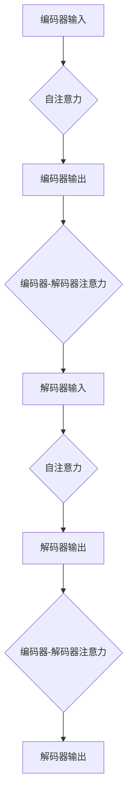

                 

# Transformer架构解析：编码器与解码器的双重奏

> **关键词**：Transformer、编码器、解码器、自注意力、自然语言处理、机器翻译

> **摘要**：本文将深入解析Transformer模型的核心架构——编码器与解码器，通过逐步分析其原理与应用，帮助读者理解这一革命性的深度学习模型，并探讨其在实际项目中的优化与未来趋势。

---

## 第一部分: Transformer架构概述

### 第1章: Transformer模型的基础

#### 1.1 Transformer模型的起源与背景

Transformer模型起源于2017年，由Google的Vaswani等研究人员提出，旨在解决序列到序列（Sequence-to-Sequence）任务的挑战。传统的循环神经网络（RNN）和长短期记忆网络（LSTM）在处理长序列任务时存在梯度消失或爆炸等问题，而Transformer模型通过自注意力机制实现了并行计算，大幅度提升了序列模型的处理效率。

#### 1.2 Transformer模型的核心原理

Transformer模型的核心是自注意力机制（Self-Attention），它允许模型在处理每个词时，自动关注序列中的其他词，从而捕捉长距离依赖关系。这种机制通过多头注意力（Multi-Head Attention）和多层结构（Stacked Layers）进一步增强了模型的表达能力。

#### 1.3 Transformer模型的结构详解

Transformer模型由编码器（Encoder）和解码器（Decoder）组成，编码器将输入序列转换为上下文表示，解码器则基于这些表示生成输出序列。每个编码器和解码器层都包含自注意力机制和前馈网络（Feedforward Network）。

#### 1.4 Transformer模型的应用领域

Transformer模型在多个领域表现出色，包括机器翻译、文本摘要、语音识别和图像描述生成等。其在自然语言处理（NLP）领域的成功应用，使得Transformer成为当前研究的热点。

### 第2章: Transformer模型的基础数学

#### 2.1 自注意力机制

自注意力机制通过计算输入序列中每个词与所有词之间的相似度，然后对相似度进行加权求和，从而实现对序列的编码。其公式如下：

\[ \text{Attention}(Q, K, V) = \text{softmax}\left(\frac{QK^T}{\sqrt{d_k}}\right)V \]

其中，\(Q\)、\(K\) 和 \(V\) 分别代表查询向量、关键向量和价值向量，\(d_k\) 是键向量的维度。

#### 2.2 位置编码技术

由于Transformer模型不包含位置信息，因此需要通过位置编码（Positional Encoding）来引入位置信息。常用的位置编码方法包括绝对位置编码、相对位置编码和周期性位置编码。

#### 2.3 优化算法与正则化策略

在训练Transformer模型时，常用的优化算法有Adam和AdamW，正则化策略包括Dropout和Layer Normalization。

#### 2.4 数学模型与公式讲解

Transformer模型的数学模型较为复杂，包括多头注意力、前馈网络、编码器和解码器的多层堆叠等。以下是一个简化的数学模型：

\[ \text{Encoder}(x) = \text{StackedLayers}(\text{EncoderLayer}(x, p)) \]
\[ \text{Decoder}(x) = \text{StackedLayers}(\text{DecoderLayer}(x, p)) \]

其中，\(x\) 代表输入序列，\(p\) 代表一个编码器或解码器层，\(\text{StackedLayers}\) 表示多层堆叠。

### 第3章: 编码器与解码器的原理与联系

#### 3.1 编码器的工作原理

编码器的主要任务是捕捉输入序列的上下文信息，并将其编码为固定长度的向量表示。编码器的每个层包含多头自注意力机制和前馈网络。

#### 3.2 解码器的工作原理

解码器的任务是基于编码器输出的上下文表示生成输出序列。解码器的每个层包含多头自注意力机制、编码器-解码器注意力机制和前馈网络。

#### 3.3 编码器与解码器的联系

编码器与解码器通过编码器-解码器注意力机制相互连接，使得解码器在生成输出时能够利用编码器的上下文信息。

#### 3.4 Mermaid流程图：编码器与解码器的交互过程

### 第4章: 编码器与解码器在实际项目中的应用

#### 4.1 机器翻译中的Transformer模型

在机器翻译任务中，编码器将源语言序列编码为上下文表示，解码器则基于这些表示生成目标语言序列。Transformer模型在机器翻译中取得了显著的性能提升。

#### 4.2 自然语言处理中的其他应用场景

Transformer模型还广泛应用于文本摘要、问答系统、文本分类等自然语言处理任务。其强大的表达能力和并行计算能力使其在这些任务中表现出色。

#### 4.3 编码器与解码器在图像处理中的应用

在图像处理领域，编码器可以提取图像的特征表示，解码器则基于这些特征表示生成新的图像。Transformer模型在图像生成、图像修复和超分辨率等任务中取得了优异的性能。

#### 4.4 编码器与解码器在音频处理中的应用

在音频处理领域，编码器可以提取音频的特征表示，解码器则基于这些特征表示生成新的音频。Transformer模型在语音合成、音乐生成和语音增强等任务中表现出色。

### 第5章: 编码器与解码器的性能优化

#### 5.1 模型压缩与加速技术

为了提高Transformer模型的实用性和部署效率，研究人员提出了多种模型压缩与加速技术，如低秩分解、知识蒸馏和量化等。

#### 5.2 迁移学习与微调技术

通过迁移学习和微调技术，可以将预训练的Transformer模型应用于不同的任务和数据集，从而提高模型的泛化能力和性能。

#### 5.3 模型融合与多任务学习

模型融合和多任务学习技术可以提高Transformer模型在不同任务上的性能，同时降低模型训练成本。

#### 5.4 性能优化案例分析

通过实际案例，分析Transformer模型在不同任务上的性能优化方法，以及如何在实际项目中应用这些方法。

### 第6章: 编码器与解码器的未来发展趋势

#### 6.1 Transformer模型的演进方向

随着深度学习和计算能力的不断发展，Transformer模型将继续演进，包括更大规模的模型、更多样化的应用场景和更高效的计算方法。

#### 6.2 编码器与解码器的未来应用前景

编码器与解码器在自然语言处理、图像处理、音频处理和视频处理等领域的应用前景广阔，将推动人工智能技术的发展。

#### 6.3 编码器与解码器的挑战与机遇

在编码器与解码器的未来发展过程中，仍将面临计算资源、数据隐私和模型解释性等挑战，但同时也充满机遇，有望实现更多突破。

### 第7章: 项目实战：构建一个简单的Transformer模型

#### 7.1 开发环境搭建

介绍如何搭建Transformer模型所需的开发环境，包括Python环境、TensorFlow或PyTorch框架等。

#### 7.2 代码实现详解

详细讲解如何使用TensorFlow或PyTorch实现一个简单的Transformer模型，包括模型结构、训练和评估过程。

#### 7.3 实现分析与优化

分析Transformer模型在实现过程中可能遇到的问题，并探讨优化方法，如参数初始化、学习率调整和正则化策略等。

#### 7.4 源代码解读与示例

提供完整的源代码示例，并详细解读代码实现的关键部分，帮助读者更好地理解Transformer模型的工作原理。

## 附录

### 附录A: Transformer相关资源与工具

提供Transformer模型相关的开源代码、研究论文、在线教程和社区论坛等资源，供读者学习和交流。

### 附录B: 参考文献

列出本文引用的相关文献，包括研究论文、书籍和技术报告等。

---

**作者：** AI天才研究院/AI Genius Institute & 禅与计算机程序设计艺术 /Zen And The Art of Computer Programming

---

通过以上章节的详细解析，本文旨在帮助读者深入理解Transformer模型的核心架构——编码器与解码器，掌握其原理与应用，并探讨其在实际项目中的优化与未来发展趋势。希望本文能为读者在人工智能领域的研究和实践提供有益的参考。

