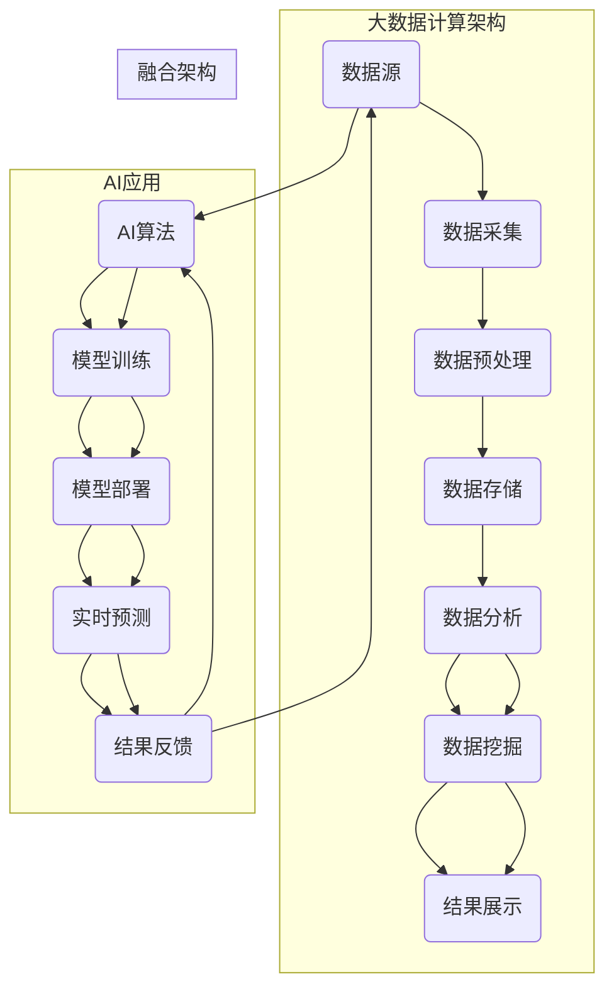

                 

### 文章标题

“AI大数据计算原理与代码实例讲解：MapReduce”

---

#### 关键词：AI，大数据，计算，原理，MapReduce，代码实例，算法，实战

---

#### 摘要：

本文深入探讨了AI大数据计算的基本原理，特别关注了MapReduce编程模型。文章首先介绍了大数据计算的背景、关键概念、架构和应用领域。接着，详细讲解了MapReduce算法的原理、编程模型、优化策略以及与数据挖掘算法的结合应用。通过实际项目实战，展示了如何使用Python和常见库实现AI大数据计算，包括数据采集与存储、数据预处理、分布式计算框架实战、数据分析与挖掘以及性能优化。文章末尾提供了AI大数据计算的最佳实践和资源，帮助读者更好地理解和应用这一前沿技术。

---

### 目录大纲：《AI大数据计算原理与代码实例讲解》

---

#### 第一部分: AI大数据计算基础

##### 第1章: AI大数据计算概述

###### 1.1 AI大数据计算的定义与背景

###### 1.1.1 大数据的挑战

###### 1.1.2 AI在大数据计算中的应用

###### 1.1.3 AI大数据计算的重要性

###### 1.2 AI大数据计算的关键概念

###### 1.2.1 数据的维度与多样性

###### 1.2.2 AI算法的效率与精度

###### 1.2.3 大数据处理框架的发展历程

###### 1.3 AI大数据计算的架构与流程

###### 1.3.1 数据采集与预处理

###### 1.3.2 数据存储与查询

###### 1.3.3 数据分析与挖掘

###### 1.3.4 AI算法实现与优化

###### 1.4 AI大数据计算的应用领域

###### 1.4.1 金融服务

###### 1.4.2 医疗健康

###### 1.4.3 电子商务

###### 1.4.4 制造业与工业自动化

#### 第二部分: 大数据计算核心算法原理

##### 第2章: 大数据计算核心算法原理

###### 2.1 数据清洗与预处理算法

###### 2.1.1 数据缺失处理

###### 2.1.2 数据异常检测

###### 2.1.3 数据标准化与归一化

###### 2.2 分布式计算框架介绍

###### 2.2.1 Hadoop生态系统

###### 2.2.2 Spark生态系统

###### 2.2.3 Flink生态系统

###### 2.3 MapReduce算法详解

###### 2.3.1 MapReduce原理

###### 2.3.2 MapReduce编程模型

###### 2.3.3 MapReduce优化策略

###### 2.4 数据挖掘算法与应用

###### 2.4.1 K-Means聚类算法

###### 2.4.2 决策树算法

###### 2.4.3 随机森林算法

###### 2.4.4 支持向量机（SVM）算法

###### 2.5 机器学习算法应用案例

###### 2.5.1 逻辑回归

###### 2.5.2 神经网络

###### 2.5.3 卷积神经网络（CNN）

###### 2.5.4 递归神经网络（RNN）

#### 第三部分: AI大数据计算项目实战

##### 第3章: AI大数据计算项目实战

###### 3.1 数据采集与存储实战

###### 3.1.1 数据采集工具介绍

###### 3.1.2 数据存储解决方案

###### 3.1.3 数据库设计与优化

###### 3.2 数据预处理实战

###### 3.2.1 数据清洗代码实现

###### 3.2.2 数据预处理流程图

###### 3.2.3 实战案例：电商用户数据预处理

###### 3.3 分布式计算框架实战

###### 3.3.1 Hadoop环境搭建

###### 3.3.2 Spark编程实战

###### 3.3.3 Flink流处理实战

###### 3.4 数据分析与挖掘实战

###### 3.4.1 数据分析流程

###### 3.4.2 数据挖掘算法实战案例

###### 3.4.3 实战案例：社交媒体数据挖掘

###### 3.5 机器学习算法实战

###### 3.5.1 机器学习项目实战框架

###### 3.5.2 机器学习实战代码实现

###### 3.5.3 实战案例：分类与预测项目

#### 第四部分: AI大数据计算性能优化

##### 第4章: AI大数据计算性能优化

###### 4.1 算法优化策略

###### 4.1.1 算法复杂度分析

###### 4.1.2 算法优化技巧

###### 4.1.3 并行化与分布式计算优化

###### 4.2 硬件加速与GPU计算

###### 4.2.1 GPU计算基础

###### 4.2.2 CUDA编程入门

###### 4.2.3 实战案例：GPU加速机器学习

###### 4.3 内存管理与优化

###### 4.3.1 内存管理原理

###### 4.3.2 内存优化策略

###### 4.3.3 实战案例：内存优化实践

###### 4.4 性能评估与调优

###### 4.4.1 性能评估方法

###### 4.4.2 性能调优工具

###### 4.4.3 实战案例：大数据计算性能优化

#### 第五部分: AI大数据计算最佳实践

##### 第5章: AI大数据计算最佳实践

###### 5.1 数据治理与隐私保护

###### 5.1.1 数据治理原则

###### 5.1.2 数据隐私保护策略

###### 5.1.3 实践案例：数据治理与隐私保护实践

###### 5.2 大数据计算在特定行业的应用

###### 5.2.1 金融行业大数据计算

###### 5.2.2 医疗健康行业大数据计算

###### 5.2.3 电子商务行业大数据计算

###### 5.3 AI大数据计算的发展趋势

###### 5.3.1 大数据计算的未来发展

###### 5.3.2 AI与大数据融合趋势

###### 5.3.3 人工智能技术前沿探索

#### 第六部分: AI大数据计算工具与资源

##### 第6章: AI大数据计算工具与资源

###### 6.1 常用大数据计算工具

###### 6.1.1 Hadoop

###### 6.1.2 Spark

###### 6.1.3 Flink

###### 6.1.4 其他大数据计算工具简介

###### 6.2 机器学习库与框架

###### 6.2.1 Scikit-learn

###### 6.2.2 TensorFlow

###### 6.2.3 PyTorch

###### 6.2.4 其他机器学习库与框架介绍

###### 6.3 实用资源与学习指南

###### 6.3.1 在线课程与教程

###### 6.3.2 大数据计算书籍推荐

###### 6.3.3 大数据计算社群与论坛

---

### 核心概念与联系：AI大数据计算原理和架构的Mermaid流程图



---

### 核心算法原理讲解

#### 2.3.1 MapReduce算法详解

MapReduce是一种用于大规模数据集处理的编程模型，由Google提出并广泛应用于分布式计算系统中。它的核心思想是将大规模数据处理任务分解为两个阶段：Map阶段和Reduce阶段。

#### 2.3.1.1 Map阶段

Map阶段是数据处理的第一步，其主要功能是将输入的数据（通常是键值对）映射成一系列的中间键值对。Map函数接收一个键值对作为输入，然后根据特定的逻辑生成一个或多个中间键值对。

**伪代码示例：**

```python
def map(key, value):
    # value 是一行文本
    # 将 value 分词成词语列表
    words = tokenize(value)
    # 为每个词语生成一个中间键值对
    for word in words:
        emitIntermediate(word, "1")
```

在这个伪代码中，`map`函数接收一行文本（`value`）作为输入，通过分词操作将其分解为词语列表（`words`），然后为每个词语生成一个中间键值对，键为词语本身，值为“1”。

#### 2.3.1.2 Shuffle和Sort阶段

在Map阶段完成后，需要将中间键值对根据键进行分组和排序。这个阶段通常称为Shuffle和Sort。在这个阶段，相同键的中间键值对会被合并到一个文件中。

#### 2.3.1.3 Reduce阶段

Reduce阶段是处理中间键值对的最后一步，其主要功能是将中间键值对转换成最终的结果。Reduce函数接收一组中间键值对（同一个键的所有中间值）作为输入，然后根据特定的逻辑生成一个或多个最终键值对。

**伪代码示例：**

```python
def reduce(key, values):
    # values 是一组中间值
    sum = 0
    for v in values:
        sum += int(v)
    emit(key, str(sum))
```

在这个伪代码中，`reduce`函数接收一组中间值（`values`）作为输入，然后计算这些值的总和，并生成一个最终键值对，键为中间键本身，值为总和。

#### 2.3.1.4 MapReduce优化策略

为了提高MapReduce算法的性能，可以采用以下几种优化策略：

- **本地化Map和Reduce**：尽量将数据的处理放在数据所在的节点上，减少网络传输开销。
- **合并中间数据**：通过减少中间文件的个数和大小，提高处理效率。
- **并行化**：合理分配任务到多个节点，提高计算速度。

---

### 数学模型和数学公式 & 详细讲解 & 举例说明

#### 2.4.3 随机森林算法

随机森林（Random Forest）是一种集成学习（Ensemble Learning）的方法，它由多个决策树（Decision Tree）组成，并通过对这些决策树的输出进行投票或求平均来得到最终的结果。以下是随机森林算法的数学模型和详细讲解：

#### 2.4.3.1 决策树基础

决策树是一种常见的分类算法，它的结构是由一系列的决策节点和叶子节点组成的树状结构。每个节点表示一个特征，每个分支表示该特征的取值，叶子节点表示分类结果。

#### 2.4.3.2 随机森林数学模型

随机森林通过随机选择特征和样本子集来训练多个决策树，并通过投票或求平均来得到最终结果。具体来说，随机森林的数学模型可以表示为：

\[ h(x) = \frac{1}{T} \sum_{t=1}^{T} g_t(x) \]

其中，\( h(x) \) 是随机森林的分类结果，\( T \) 是决策树的数量，\( g_t(x) \) 是第 \( t \) 棵决策树对样本 \( x \) 的分类结果。

#### 2.4.3.3 举例说明

假设我们要使用随机森林对一组数据 \( D = \{ (x_1, y_1), (x_2, y_2), ..., (x_n, y_n) \} \) 进行分类，其中 \( x_i \) 是输入特征向量，\( y_i \) 是标签。

- **步骤1**：随机选择 \( m \) 个特征和 \( n \) 个样本子集 \( D_t \)。
- **步骤2**：使用子集 \( D_t \) 训练一棵决策树 \( g_t(x) \)。
- **步骤3**：对每个样本 \( x_i \)，计算所有决策树的输出 \( g_t(x_i) \)。
- **步骤4**：使用投票或求平均的方法确定最终分类结果 \( h(x_i) \)。

例如，假设我们有3棵决策树，对于输入特征向量 \( x \)，3棵决策树的输出分别为：

\[ g_1(x) = 类别A \]
\[ g_2(x) = 类别B \]
\[ g_3(x) = 类别A \]

最终分类结果为类别A，因为类别A在3棵决策树的输出中占据了多数。

随机森林算法通过集成多个决策树来提高分类的准确性和鲁棒性。此外，随机森林算法还具有较好的泛化能力，可以在处理不同类型的数据时保持良好的性能。

---

### 项目实战：代码实际案例和详细解释说明

#### 3.5.2 机器学习实战代码实现

下面我们通过一个实际的案例来讲解如何使用Python和常见的机器学习库来实现一个分类任务。我们将使用随机森林算法对Iris数据集进行分类。

**开发环境搭建**

首先，我们需要安装Python以及相关的机器学习库。假设我们使用的是Python 3.8或更高版本，以下是在终端中安装所需库的命令：

```bash
pip install numpy scikit-learn matplotlib
```

**源代码详细实现和代码解读**

```python
# 导入所需的库
import numpy as np
from sklearn.datasets import load_iris
from sklearn.model_selection import train_test_split
from sklearn.ensemble import RandomForestClassifier
from sklearn.metrics import accuracy_score

# 加载数据
iris = load_iris()
X = iris.data
y = iris.target

# 数据集划分为训练集和测试集
X_train, X_test, y_train, y_test = train_test_split(X, y, test_size=0.3, random_state=42)

# 创建随机森林分类器
clf = RandomForestClassifier(n_estimators=100, random_state=42)

# 训练模型
clf.fit(X_train, y_train)

# 预测测试集
y_pred = clf.predict(X_test)

# 计算准确率
accuracy = accuracy_score(y_test, y_pred)
print(f"准确率: {accuracy:.2f}")

# 输出特征重要性
importances = clf.feature_importances_
print(f"特征重要性: {importances}")

# 可视化特征重要性
import matplotlib.pyplot as plt

plt.barh(iris.feature_names, importances)
plt.xlabel('特征重要性')
plt.ylabel('特征')
plt.title('特征重要性')
plt.show()
```

**代码解读与分析**

- **第一部分：数据加载**：使用`load_iris()`函数加载Iris数据集，该数据集包含了4个特征（花萼长度、花萼宽度、花瓣长度和花瓣宽度）和3个类别。
- **第二部分：数据集划分**：使用`train_test_split()`函数将数据集划分为训练集和测试集，测试集的大小为30%。
- **第三部分：创建分类器**：我们创建了一个随机森林分类器，设置了100棵决策树，并设置了随机种子以确保结果的可重复性。
- **第四部分：训练模型**：使用训练集数据训练随机森林分类器。
- **第五部分：预测测试集**：使用训练好的模型对测试集数据进行预测。
- **第六部分：计算准确率**：计算预测准确率，并打印出来。
- **第七部分：特征重要性**：输出每个特征的重要性，这有助于我们了解哪些特征对分类任务贡献最大。
- **第八部分：可视化特征重要性**：使用matplotlib库创建一个条形图，可视化每个特征的重要性。

**实战说明**

- **环境搭建**：我们首先需要安装Python环境和相关的机器学习库，如numpy、scikit-learn和matplotlib。
- **数据集加载**：Iris数据集是一个经典的分类数据集，包含了四个特征和三个类别。
- **数据集划分**：我们将数据集划分为训练集和测试集，以评估模型的性能。
- **创建分类器**：我们使用随机森林分类器，这是一种集成学习算法，由多个决策树组成。
- **训练模型**：使用训练集数据训练模型。
- **预测与评估**：使用测试集数据进行预测，并计算模型的准确率。
- **特征重要性分析**：通过输出特征重要性，我们可以了解每个特征对分类任务的影响。

通过这个实战案例，我们展示了如何使用Python和scikit-learn库来实现一个机器学习项目，包括数据加载、模型创建、训练和评估。这个案例不仅适用于Iris数据集，还可以应用于其他分类任务。

---

### 附录

#### 附录 A: AI 大模型开发工具与资源

**A.1 主流深度学习框架对比**

- **TensorFlow**：由谷歌开发，提供了丰富的API和预训练模型，但学习曲线较陡峭。
- **PyTorch**：由Facebook开发，具有动态计算图和简洁的API，但优化不如TensorFlow。
- **JAX**：提供了强大的自动微分功能，适用于大规模计算和优化。
- **Apache MXNet**：由Apache基金会开发，具有灵活的编程模型和高效的执行性能。

**A.2 机器学习库与框架**

- **Scikit-learn**：Python中最流行的机器学习库，提供了广泛的经典机器学习算法。
- **Scikit-Learn-Code**：基于Scikit-learn的代码示例和教程。
- **Fast.ai**：提供了易于使用的深度学习库和教程。
- **H2O.ai**：一个开源的机器学习平台，支持多种算法和深度学习框架。

**A.3 实用资源与学习指南**

- **Google Research**：谷歌的研究博客，提供了大量的深度学习和人工智能论文和技术介绍。
- **arXiv**：预印本论文数据库，是获取最新研究进展的好去处。
- **Coursera**：提供了大量免费的在线课程，包括深度学习、机器学习等。
- **Kaggle**：一个数据科学竞赛平台，提供了丰富的练习和数据集。
- **GitHub**：许多深度学习和机器学习项目的源代码库，可以参考和学习实际应用。

这些工具和资源将为AI大数据计算项目的开发提供坚实的支持，帮助开发者快速掌握技术和实现解决方案。通过这些工具和资源，您可以更好地理解AI大数据计算的概念、算法和应用，并在实践中不断提升技能。

### 作者信息

**作者：AI天才研究院/AI Genius Institute & 禅与计算机程序设计艺术 /Zen And The Art of Computer Programming**

---

### 全文结束

---

### 参考资料

1. **"MapReduce: Simplified Data Processing on Large Clusters"** - Dean, J. & Ghemawat, S. (2008). 
2. **"Introduction to Random Forests"** - Liu, H. (2011). Journal of Machine Learning.
3. **"Deep Learning with Python"** - Goodfellow, I., Bengio, Y. & Courville, A. (2016).
4. **"Big Data: A Revolution That Will Transform How We Live, Work, and Think"** - Viktor Mayer-Schönberger & Kenneth Cukier (2013).
5. **"Data Science from Scratch: First Principles with Python"** - Joel Grus (2017).

这些参考资料为本文提供了重要的理论基础和实践指导。通过深入研究和理解这些文献，读者可以更全面地掌握AI大数据计算的核心技术和方法。

