                 

### 文章标题

《一人公司的AI驱动社交媒体营销：提升品牌影响力的自动化工具》

在当今的数字化时代，社交媒体已经成为了企业营销的关键渠道之一。然而，对于许多小型公司或个人品牌而言，如何有效地利用社交媒体来提升品牌影响力，成为了一项极具挑战性的任务。本文将探讨如何通过人工智能（AI）技术来驱动社交媒体营销，实现自动化工具的运用，从而帮助一人公司（或个人品牌）在竞争激烈的市场中脱颖而出。

本文关键词包括：人工智能、社交媒体营销、自动化工具、品牌影响力、数据分析和算法原理。通过这些关键词，我们将深入探讨AI技术在社交媒体营销中的应用，分享成功的案例，并探讨未来发展的趋势。

### 文章摘要

本文旨在为小型公司或个人品牌提供一套基于人工智能的社交媒体营销策略。首先，我们将介绍AI驱动社交媒体营销的基础知识，包括AI在营销中的应用、核心算法原理以及社交媒体数据分析方法。接着，我们将详细探讨AI在内容营销和广告优化中的具体策略，介绍如何使用自动化工具来提升营销效率。通过案例分析，我们将展示AI技术在社交媒体营销中的实际应用，并提供避免常见误区的建议。最后，我们将展望AI在社交媒体营销中的发展趋势，探讨如何持续优化个人品牌。

---

### 目录大纲

#### 《一人公司的AI驱动社交媒体营销：提升品牌影响力的自动化工具》

**关键词**：人工智能、社交媒体营销、自动化工具、品牌影响力、数据分析、算法原理

**摘要**：本文将探讨如何通过人工智能技术来驱动社交媒体营销，帮助一人公司提升品牌影响力。我们将深入介绍AI在营销中的应用、核心算法原理、数据分析方法，并探讨AI在内容营销和广告优化中的策略，最后展望AI在社交媒体营销中的发展趋势。

**目录大纲**：

1. **第一部分：AI驱动社交媒体营销基础**
   - **第1章：AI与社交媒体营销概述**
     - **1.1 AI在社交媒体营销中的应用**
     - **1.2 社交媒体营销的趋势与挑战**
     - **1.3 AI驱动社交媒体营销的优势
   - **第2章：AI核心算法原理**
     - **2.1 机器学习基础**
       - **2.1.1 监督学习**
       - **2.1.2 无监督学习**
       - **2.1.3 强化学习**
     - **2.2 自然语言处理技术**
       - **2.2.1 文本分类与情感分析**
       - **2.2.2 命名实体识别与关系抽取**
       - **2.2.3 生成对抗网络**
   - **第3章：社交媒体数据分析方法**
     - **3.1 数据获取与预处理**
       - **3.1.1 数据来源**
       - **3.1.2 数据清洗与去重**
       - **3.1.3 数据归一化与特征提取**
     - **3.2 数据可视化与分析**
       - **3.2.1 可视化工具介绍**
       - **3.2.2 关键指标分析**
       - **3.2.3 实时数据监控**

2. **第二部分：AI驱动社交媒体营销策略**
   - **第4章：AI驱动社交媒体营销策略**
     - **4.1 内容营销策略**
       - **4.1.1 AI驱动的内容创作**
       - **4.1.2 内容分发与优化**
       - **4.1.3 用户参与度提升**
     - **4.2 社交媒体广告优化**
       - **4.2.1 AI驱动的广告投放策略**
       - **4.2.2 广告创意优化**
       - **4.2.3 广告效果监测与评估**

3. **第三部分：社交媒体营销自动化工具**
   - **第5章：社交媒体营销自动化工具**
     - **5.1 营销自动化平台介绍**
       - **5.1.1 主要功能模块**
       - **5.1.2 平台选择与比较**
       - **5.1.3 集成与部署**
     - **5.2 自动化工具实战**
       - **5.2.1 自动化内容发布**
       - **5.2.2 自动化客户管理**
       - **5.2.3 自动化广告管理**

4. **第四部分：案例分析与实战技巧**
   - **第6章：案例分析与实战技巧**
     - **6.1 成功案例分享**
       - **6.1.1 案例一：通过AI实现社交媒体营销的飞跃**
       - **6.1.2 案例二：AI赋能的社交媒体广告策略**
     - **6.2 避免常见误区**
       - **6.2.1 过度依赖AI的风险**
       - **6.2.2 数据隐私保护**
       - **6.2.3 用户体验与互动性**

5. **第五部分：未来展望与持续优化**
   - **第7章：未来展望与持续优化**
     - **7.1 AI在社交媒体营销中的发展趋势**
       - **7.1.1 AI与社交媒体的结合点**
       - **7.1.2 新兴技术的应用**
       - **7.1.3 长期影响与挑战**
     - **7.2 持续优化与个人成长**
       - **7.2.1 数据驱动决策**
       - **7.2.2 AI能力提升路径**
       - **7.2.3 创新与试错文化**

以上目录大纲为本文的结构框架，我们将逐步深入探讨每一个章节的核心内容，并通过案例分析和实战技巧来展示AI技术在社交媒体营销中的实际应用。

---

### 第一部分：AI驱动社交媒体营销基础

#### 第1章：AI与社交媒体营销概述

##### 1.1 AI在社交媒体营销中的应用

随着人工智能（AI）技术的飞速发展，它已经成为现代营销战略中不可或缺的一部分。AI在社交媒体营销中的应用尤为广泛，主要包括以下几个方面：

1. **个性化推荐**：通过分析用户的历史行为和偏好，AI可以推荐符合用户兴趣的内容和产品，从而提高用户参与度和转化率。
   
2. **情感分析**：AI可以分析社交媒体上的用户评论和反馈，识别情感倾向，帮助品牌了解用户满意度，并及时调整营销策略。

3. **自动化客服**：AI驱动的聊天机器人可以实时回答用户问题，提供个性化服务，降低人力成本并提高响应速度。

4. **广告优化**：AI可以根据用户行为和兴趣，精准投放广告，提高广告的点击率和转化率。

5. **内容创作**：AI可以生成高质量的内容，如文章、视频和图像，节省人力和时间成本。

##### 1.2 社交媒体营销的趋势与挑战

当前的社交媒体营销面临着以下几大趋势和挑战：

1. **用户数据隐私**：随着用户对隐私的关注日益增加，品牌需要更加注重数据保护，遵守相关法律法规。

2. **内容泛滥**：社交媒体上内容层出不穷，如何吸引和留住用户的注意力成为一大挑战。

3. **算法变化**：社交媒体平台的算法不断更新，品牌需要不断调整策略以适应算法变化。

4. **竞争激烈**：越来越多的品牌和个人进入社交媒体营销领域，竞争日益激烈。

##### 1.3 AI驱动社交媒体营销的优势

AI驱动社交媒体营销具有以下优势：

1. **高效自动化**：AI可以自动化执行许多重复性任务，如数据分析、内容发布和广告优化，提高效率。

2. **精准定位**：通过分析用户数据，AI可以精准定位目标受众，提高广告和内容的投放效果。

3. **实时响应**：AI驱动的自动化工具可以实时监测和分析用户行为，快速做出响应。

4. **降低成本**：AI可以节省人力和时间成本，降低营销预算。

5. **持续优化**：AI可以通过机器学习不断优化营销策略，提高长期效果。

#### 第2章：AI核心算法原理

##### 2.1 机器学习基础

机器学习是AI的核心技术之一，它使计算机系统能够从数据中学习并做出预测或决策。以下是三种常见的机器学习类型：

###### 2.1.1 监督学习

监督学习是一种基于标记数据的机器学习方法。模型从输入数据和相应的输出标签中学习，然后对新数据进行预测。

```plaintext
输入：X = {x1, x2, ..., xn}
输出：y = {y1, y2, ..., yn}
模型：f(X) → y
```

**伪代码示例**：

```python
def supervised_learning(X, y):
    # 初始化模型参数
    theta = initialize_parameters()
    
    # 循环迭代
    for i in range(num_iterations):
        # 计算预测值
        y_pred = predict(X, theta)
        
        # 更新模型参数
        theta = update_parameters(y, y_pred, theta)
        
    return theta
```

###### 2.1.2 无监督学习

无监督学习是无需标记数据的机器学习方法。模型从未标记的数据中学习模式和结构。

```plaintext
输入：X = {x1, x2, ..., xn}
输出：y = 无
模型：f(X) → 新特征
```

**伪代码示例**：

```python
def unsupervised_learning(X):
    # 初始化模型参数
    theta = initialize_parameters()
    
    # 循环迭代
    for i in range(num_iterations):
        # 计算新特征
        X_new = transform(X, theta)
        
        # 更新模型参数
        theta = update_parameters(X_new, theta)
        
    return X_new
```

###### 2.1.3 强化学习

强化学习是一种通过奖励机制学习的机器学习方法。模型通过不断尝试和反馈来学习最佳策略。

```plaintext
输入：状态S
输出：动作A
奖励：R
模型：Q(S, A)
```

**伪代码示例**：

```python
def reinforcement_learning(S, A, R):
    # 初始化模型参数
    Q = initialize_parameters()
    
    # 循环迭代
    for i in range(num_iterations):
        # 执行动作
        A = choose_action(S, Q)
        
        # 接受奖励
        R = receive_reward(A)
        
        # 更新模型参数
        Q = update_parameters(S, A, R, Q)
        
    return Q
```

##### 2.2 自然语言处理技术

自然语言处理（NLP）是AI的重要分支，它使计算机能够理解、解释和生成自然语言。以下是三种关键的NLP技术：

###### 2.2.1 文本分类与情感分析

文本分类是将文本数据分配到预定义的类别中。情感分析是文本分类的一种特殊应用，用于识别文本的情感倾向（如正面、负面或中性）。

```latex
P(Class | Text) = \frac{P(Text | Class) * P(Class)}{P(Text)}
```

**伪代码示例**：

```python
def text_classification(text, classes):
    # 计算文本概率
    text_probabilities = calculate_probabilities(text, classes)
    
    # 选择最高概率的类别
    predicted_class = select_max_probability(text_probabilities)
    
    return predicted_class
```

###### 2.2.2 命名实体识别与关系抽取

命名实体识别是从文本中识别出具有特定意义的实体（如人名、地名、组织名等）。关系抽取是识别实体之间的相互关系。

```latex
R(E1, E2) = \{关系\}
```

**伪代码示例**：

```python
def named_entity_recognition(text):
    # 识别命名实体
    entities = identify_entities(text)
    
    return entities

def relationship_extraction(text, entities):
    # 识别实体关系
    relationships = extract_relationships(text, entities)
    
    return relationships
```

###### 2.2.3 生成对抗网络

生成对抗网络（GAN）是一种深度学习模型，用于生成与真实数据相似的样本。它由生成器和判别器组成，两者相互对抗，以达到生成高质量数据的目的。

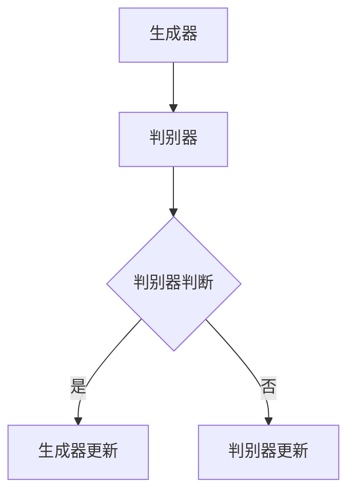

**伪代码示例**：

```python
def train_gan(generator, discriminator, data):
    # 循环迭代
    for i in range(num_iterations):
        # 生成假样本
        fake_samples = generator.generate(data)
        
        # 训练判别器
        discriminator_loss = discriminator.train(fake_samples)
        
        # 训练生成器
        generator_loss = generator.train(fake_samples)
        
    return generator, discriminator
```

通过以上对AI核心算法原理的介绍，我们可以看到AI在社交媒体营销中的应用前景广阔。在接下来的章节中，我们将进一步探讨社交媒体数据分析方法、AI驱动社交媒体营销策略以及自动化工具的实战应用。

---

### 第一部分：AI驱动社交媒体营销基础

#### 第3章：社交媒体数据分析方法

##### 3.1 数据获取与预处理

社交媒体数据分析的第一步是获取数据。数据来源可以包括社交媒体平台自身的API、第三方数据提供商以及用户生成的公开数据。

###### 3.1.1 数据来源

1. **社交媒体平台API**：如Facebook、Twitter、Instagram等平台提供了API，允许开发者获取用户的帖子、评论、点赞和分享等数据。
2. **第三方数据提供商**：如Klout、Brandwatch等，提供社交媒体分析工具和数据服务。
3. **公开数据集**：如Twitter数据集、Facebook公开数据等，可以在学术和研究领域获取。

###### 3.1.2 数据清洗与去重

数据获取后，需要进行清洗和去重，以保证数据的准确性和一致性。

1. **数据清洗**：去除无效数据、修正错误数据和填补缺失数据。例如，删除重复的帖子、纠正错别字和统一编码格式。
2. **去重**：识别和去除重复的数据项。可以使用哈希函数或唯一标识符来检测重复项。

**伪代码示例**：

```python
def clean_data(data):
    # 删除重复项
    unique_data = remove_duplicates(data)
    
    # 修正错误数据
    corrected_data = correct_errors(unique_data)
    
    return corrected_data
```

###### 3.1.3 数据归一化与特征提取

数据清洗后，需要进行归一化和特征提取，以便进行后续的机器学习分析和模型训练。

1. **数据归一化**：将数据转换到相同的尺度，以消除不同特征之间的量级差异。常用的方法包括最小-最大缩放和Z-score标准化。

```latex
x_{\text{normalized}} = \frac{x - x_{\text{min}}}{x_{\text{max}} - x_{\text{min}}}
```

2. **特征提取**：从原始数据中提取有用的特征，以便用于模型训练。特征可以是文本的词频、情感倾向、用户活跃度等。

**伪代码示例**：

```python
def normalize_data(data):
    # 计算最小值和最大值
    min_val = min(data)
    max_val = max(data)
    
    # 归一化数据
    normalized_data = [(x - min_val) / (max_val - min_val) for x in data]
    
    return normalized_data

def extract_features(data):
    # 提取文本特征
    text_features = extract_text_features(data)
    
    # 提取用户特征
    user_features = extract_user_features(data)
    
    return text_features, user_features
```

##### 3.2 数据可视化与分析

数据可视化是分析数据的重要手段，它可以帮助我们直观地理解和解释数据。

###### 3.2.1 可视化工具介绍

1. **Matplotlib**：用于创建各种统计图表，如柱状图、折线图和散点图。
2. **Seaborn**：基于Matplotlib，提供更丰富的统计图表和美化选项。
3. **Plotly**：提供交互式图表和高级可视化功能。

###### 3.2.2 关键指标分析

在社交媒体营销中，以下关键指标常用于评估营销效果：

1. **用户参与度**：包括点赞、评论、分享和关注等。
2. **转化率**：从社交媒体流量到实际购买或转化的比例。
3. **广告点击率（CTR）**：广告被点击的次数与展示次数的比例。
4. **客户获取成本（CAC）**：获取一个新客户所需的成本。

**示例**：

```python
import matplotlib.pyplot as plt
import seaborn as sns

# 绘制用户参与度趋势图
plt.figure(figsize=(10, 6))
sns.lineplot(x='date', y='likes', data=participation_data)
plt.title('User Participation Trend')
plt.xlabel('Date')
plt.ylabel('Likes')
plt.show()

# 绘制广告点击率分布图
plt.figure(figsize=(10, 6))
sns.histplot(participation_data['CTR'], bins=30, kde=True)
plt.title('Ad Click-Through Rate Distribution')
plt.xlabel('CTR')
plt.ylabel('Frequency')
plt.show()
```

###### 3.2.3 实时数据监控

实时数据监控是社交媒体营销的重要组成部分，它可以帮助我们快速响应市场变化和用户需求。

1. **实时数据流处理**：使用如Apache Kafka、Apache Flink等工具，处理和分析实时数据流。
2. **自动化警报系统**：设置阈值和警报规则，当数据指标超过阈值时，自动触发警报。
3. **可视化仪表板**：使用如Tableau、Power BI等工具，创建实时数据监控仪表板。

通过以上对社交媒体数据分析方法的介绍，我们可以看到数据在社交媒体营销中的重要性。在接下来的章节中，我们将进一步探讨如何使用AI技术来制定有效的社交媒体营销策略。

---

### 第一部分：AI驱动社交媒体营销基础

#### 第4章：AI驱动社交媒体营销策略

##### 4.1 内容营销策略

内容营销是社交媒体营销的核心，它旨在通过创造和分享有价值的内容来吸引潜在客户，建立品牌信任，并最终实现业务目标。AI技术在内容营销中的应用，可以帮助个人品牌或小型公司更加高效地制定和执行内容营销策略。

###### 4.1.1 AI驱动的内容创作

AI可以帮助创建各种类型的内容，如文章、视频、图像和音频。以下是一些关键步骤：

1. **文本生成**：AI可以生成文章、博客和广告文案。例如，OpenAI的GPT-3模型可以生成高质量的文章，覆盖各种主题。

```latex
P(Text | Topic) = \sum_{Word \in Text} P(Word | Topic) * P(Topic)
```

2. **视频和图像生成**：AI可以通过生成对抗网络（GAN）创建逼真的图像和视频。例如，DeepArt可以生成艺术风格的图像，StyleGAN可以生成高质量的虚拟人物图像。


3. **音频生成**：AI可以生成语音和音乐。例如，Google的Wavenet模型可以生成逼真的语音，而OpenAI的Jukebox可以生成音乐。

###### 4.1.2 内容分发与优化

AI可以帮助优化内容分发的策略，提高内容的可见度和参与度。以下是一些关键步骤：

1. **自动发布**：AI可以自动安排最佳发布时间，以最大化用户参与度。例如，Buffer和Hootsuite等工具可以使用AI来分析用户行为，自动优化发布时间。

2. **推荐系统**：AI可以基于用户的历史行为和偏好，推荐相关的内容。例如，YouTube的推荐算法可以基于用户的观看历史和搜索查询，推荐相关的视频。

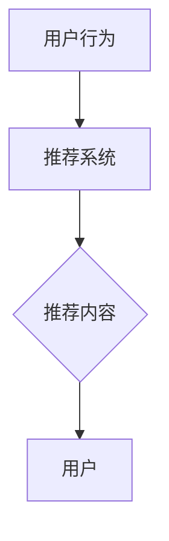

3. **情感分析**：AI可以分析用户对内容的情感反应，帮助品牌了解用户的喜好和不满。例如，VADER模型可以用于分析社交媒体上的文本情感。

```latex
P(Sentiment | Text) = \sum_{Word \in Text} P(Sentiment | Word) * P(Word)
```

###### 4.1.3 用户参与度提升

AI可以用于分析用户参与度，并提供个性化的互动体验，以提升用户参与度。以下是一些关键步骤：

1. **聊天机器人**：AI驱动的聊天机器人可以提供即时响应，回答用户问题，并引导用户参与互动。例如，Microsoft的Azure Bot Service可以创建智能聊天机器人。

2. **个性化互动**：AI可以分析用户行为和偏好，提供个性化的互动体验。例如，Amazon的个性化推荐系统可以基于用户的购买历史，推荐相关商品。

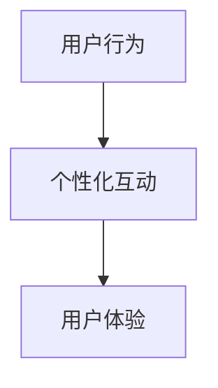

3. **用户反馈分析**：AI可以分析用户反馈，识别用户需求和痛点，帮助品牌改进产品和服务。例如，Sentiment Analysis可以分析社交媒体上的用户评论和反馈。

```latex
P(Feedback | User) = \sum_{Word \in Feedback} P(Word | User) * P(User)
```

通过AI驱动的内容创作、内容分发和用户参与度提升，个人品牌或小型公司可以更加高效地制定和执行内容营销策略，从而提升品牌影响力和用户参与度。在接下来的章节中，我们将进一步探讨AI在社交媒体广告优化中的应用。

---

### 第一部分：AI驱动社交媒体营销基础

#### 第4章：AI驱动社交媒体营销策略

##### 4.2 社交媒体广告优化

社交媒体广告优化是提高广告投放效果的关键步骤。AI技术可以通过自动化和智能化手段，优化广告投放策略，提高广告的点击率（CTR）、转化率和投资回报率（ROI）。以下是一些关键的AI驱动广告优化策略：

###### 4.2.1 AI驱动的广告投放策略

1. **用户行为分析**：AI可以分析用户在社交媒体平台上的行为，如浏览历史、点击行为和互动行为，识别潜在的目标用户。基于这些分析，AI可以自动调整广告投放策略，确保广告能够精准地投放到潜在客户。

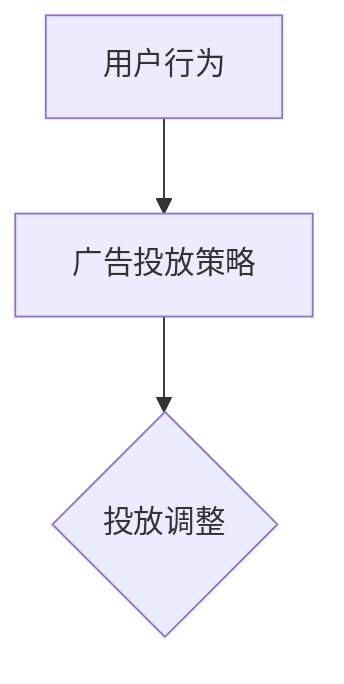

2. **实时调整**：AI可以实时监控广告投放效果，根据用户反馈和行为数据，自动调整广告内容和投放策略。例如，Google的AdWords和Facebook的广告管理工具都利用AI技术进行实时优化。

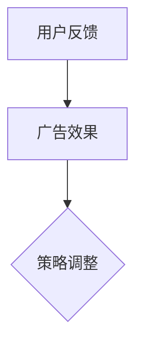

3. **动态创意优化**：AI可以根据用户行为和偏好，动态调整广告创意，提高广告的吸引力。例如，通过机器学习算法，AI可以自动生成和测试多个广告创意，选择最佳效果的广告。

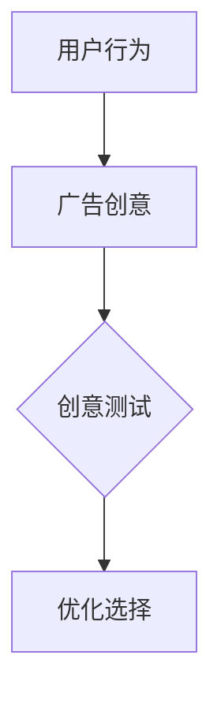

###### 4.2.2 广告创意优化

1. **图像识别**：AI可以分析广告图像的内容和颜色，识别用户可能感兴趣的因素。例如，通过计算机视觉技术，AI可以识别图像中的品牌标志、颜色和场景，从而优化广告创意。

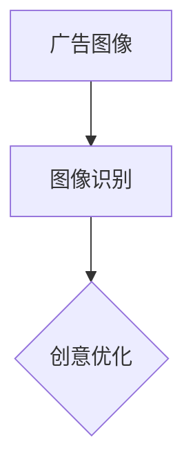

2. **文本生成**：AI可以生成高质量的广告文案，根据目标受众的特点和需求，撰写具有吸引力的广告内容。例如，OpenAI的GPT-3模型可以生成针对不同受众的广告文案。

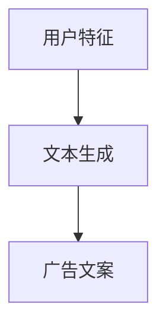

3. **A/B测试**：AI可以自动执行A/B测试，比较不同广告创意的效果，选择最佳创意。通过机器学习算法，AI可以分析测试数据，预测不同创意的性能，从而优化广告创意。

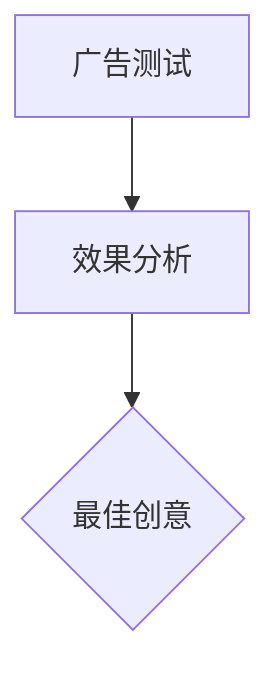

###### 4.2.3 广告效果监测与评估

1. **实时监测**：AI可以实时监测广告的投放效果，如点击率、转化率和投资回报率等关键指标。通过自动化工具，品牌可以快速识别广告效果不佳的部分，并做出相应调整。

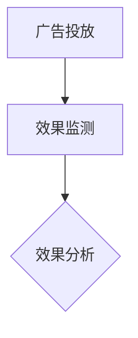

2. **数据驱动的决策**：AI可以分析广告效果数据，提供数据驱动的决策建议。例如，通过分析用户行为和广告效果数据，AI可以建议调整广告投放策略，提高广告效果。

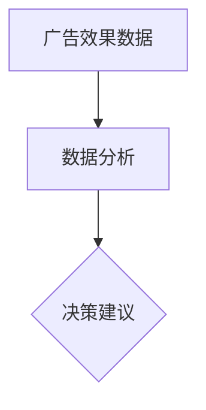

3. **定期评估**：AI可以定期评估广告效果，并根据评估结果调整广告策略。例如，每月或每季度进行一次广告效果评估，根据评估结果调整广告预算、创意和投放策略。

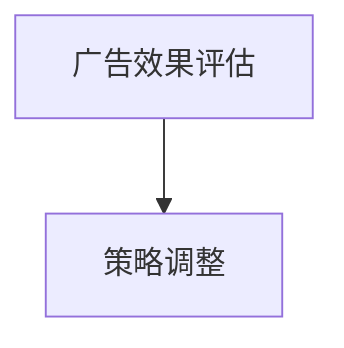

通过AI驱动的广告投放策略、广告创意优化和广告效果监测与评估，品牌可以更加高效地优化社交媒体广告，提高广告的投放效果和投资回报率。在接下来的章节中，我们将介绍社交媒体营销自动化工具的具体应用。

---

### 第一部分：AI驱动社交媒体营销基础

#### 第5章：社交媒体营销自动化工具

社交媒体营销自动化工具可以帮助品牌或个人快速高效地管理社交媒体活动，节省时间和人力成本。以下将介绍社交媒体营销自动化平台的主要功能模块、平台选择与比较，以及自动化工具的集成与部署。

##### 5.1 营销自动化平台介绍

社交媒体营销自动化平台通常具备以下功能模块：

1. **内容发布管理**：自动化发布和管理社交媒体内容，包括文本、图片、视频等，可以设置发布时间和频率。

2. **广告管理**：自动化创建、投放、监控和优化广告活动，提高广告效果和投资回报率。

3. **数据分析与报告**：实时收集和分析社交媒体数据，生成报告，帮助品牌了解营销效果，做出数据驱动的决策。

4. **用户互动管理**：自动化回复用户评论、私信，提高用户参与度和满意度。

5. **客户管理**：自动化客户档案的建立、更新和管理，帮助品牌更好地了解客户需求，提供个性化服务。

6. **自动化通知**：根据用户行为和设定规则，自动发送通知，如新评论、订单确认等。

##### 5.1.1 主要功能模块

以下是几个主流的社交媒体营销自动化平台的主要功能模块：

1. **HubSpot**：提供内容发布、广告管理、数据分析与报告、用户互动管理、客户管理和自动化通知等功能。适合中小企业和初创公司。

2. **Hootsuite**：提供内容发布、广告管理、数据分析与报告和用户互动管理等功能。适合各类企业，尤其是需要多平台管理的企业。

3. **Buffer**：提供内容发布、广告管理和数据分析与报告等功能。适合个人品牌和小型企业。

4. **Sprout Social**：提供内容发布、广告管理、数据分析与报告、用户互动管理和客户管理等功能。适合中型企业。

##### 5.1.2 平台选择与比较

选择适合的社交媒体营销自动化平台需要考虑以下因素：

1. **功能需求**：根据品牌的社交媒体营销需求，选择具备所需功能模块的平台。

2. **预算**：不同平台的费用结构不同，需要根据预算进行选择。

3. **用户规模**：不同平台适合的用户规模不同，需要选择适合自身用户规模的平台。

4. **用户体验**：平台的操作界面和使用体验也很重要，需要确保用户能够轻松上手。

以下是几个主流平台的比较：

| 平台 | 功能模块 | 预算 | 用户规模 | 用户体验 |
| --- | --- | --- | --- | --- |
| HubSpot | 内容发布、广告管理、数据分析与报告、用户互动管理、客户管理和自动化通知 | 中等 | 中大型企业 | 优 |
| Hootsuite | 内容发布、广告管理、数据分析与报告和用户互动管理 | 低 | 中小型企业 | 中 |
| Buffer | 内容发布、广告管理和数据分析与报告 | 低 | 个人品牌和小型企业 | 优 |
| Sprout Social | 内容发布、广告管理、数据分析与报告、用户互动管理和客户管理 | 中高 | 中型企业 | 优 |

##### 5.1.3 集成与部署

选择合适的社会化媒体营销自动化平台后，需要进行集成与部署，确保平台能够与现有的社交媒体账号、CRM系统等无缝对接。

1. **集成**：通过API或其他集成方式，将自动化平台与社交媒体账号、CRM系统等连接起来，实现数据的实时同步和自动化操作。

2. **部署**：在平台上进行配置和设置，包括内容发布规则、广告投放策略、数据分析指标等，确保平台能够按预期运行。

3. **培训与支持**：对团队成员进行平台培训，确保他们能够熟练使用自动化工具，并获取技术支持，解决使用过程中遇到的问题。

通过社交媒体营销自动化工具，品牌可以大幅提高社交媒体营销的效率和质量，实现更精准的广告投放和更有效的用户互动。在接下来的章节中，我们将探讨如何在实际操作中应用这些自动化工具。

---

### 第一部分：AI驱动社交媒体营销基础

#### 第5章：社交媒体营销自动化工具

##### 5.2 自动化工具实战

在了解了社交媒体营销自动化工具的基本概念和功能模块之后，接下来我们将通过几个实际案例来展示如何在实际操作中使用这些工具来提升营销效率。

###### 5.2.1 自动化内容发布

自动化内容发布是社交媒体营销的基础功能之一。通过自动化工具，品牌可以预先设置内容发布的时间表和频率，确保内容在最佳时间被发布，以最大化用户参与度。

**案例**：一家小型时尚品牌使用了Hootsuite进行内容发布自动化。他们通过Hootsuite的日程表功能，将每周的社交媒体内容进行提前规划和发布。具体操作步骤如下：

1. **内容创建**：品牌团队在Hootsuite的界面中创建待发布的内容，包括图文、视频等。
2. **时间设置**：根据用户行为数据和平台算法，设置每个内容的最优发布时间。
3. **批量发布**：使用Hootsuite的批量发布功能，将内容一次性安排发布。

**代码实现**（使用Python脚本示例）：

```python
import hootsuite

# 初始化Hootsuite API
client = hootsuite.initialize(app_access_token)

# 创建内容
content_data = {
    'text': 'Check out our latest collection!',
    'link': 'https://www.example.com/shop',
    'media_ids': ['media_id_1', 'media_id_2'],
    'schedule_time': '2023-04-15T10:00:00Z'
}

# 发布内容
hootsuite.publish(content_data, client)

# 批量发布多个内容
content_list = [
    {'text': 'Spring sale starts now!', 'link': 'https://www.example.com/sale', 'schedule_time': '2023-04-15T11:00:00Z'},
    {'text': 'Win a gift card!', 'link': 'https://www.example.com/contest', 'schedule_time': '2023-04-15T12:00:00Z'}
]

hootsuite.publish_bulk(content_list, client)
```

通过自动化内容发布，品牌可以节省大量时间和人力资源，同时确保内容以最佳方式呈现给目标受众。

###### 5.2.2 自动化客户管理

自动化客户管理可以帮助品牌更好地了解客户需求，提供个性化服务，提高客户满意度。通过社交媒体营销自动化工具，品牌可以自动化客户档案的建立、更新和管理。

**案例**：一家在线零售商使用了HubSpot的客户关系管理（CRM）功能，自动化管理客户互动和跟进。

1. **客户互动**：通过社交媒体平台与客户互动，收集客户信息和反馈。
2. **客户档案**：使用HubSpot创建和更新客户档案，包括姓名、联系方式、购买历史等。
3. **自动化跟进**：设置自动化跟进流程，例如在客户生日时发送祝福邮件，或在客户购买后提供产品使用指南。

**代码实现**（使用Python脚本示例）：

```python
import hubspot

# 初始化HubSpot API
client = hubspot.initialize(api_key)

# 创建客户档案
customer_data = {
    'properties': [
        {'id': 'email', 'value': 'john.doe@example.com'},
        {'id': 'firstName', 'value': 'John'},
        {'id': 'lastName', 'value': 'Doe'},
        {'id': 'company', 'value': 'Example Corp'}
    ]
}

# 创建客户
customer_id = hubspot.crm.contacts.create(customer_data, client)

# 跟进客户
event_data = {
    'action': 'contact_viewed',
    'timestamp': '2023-04-15T10:00:00Z',
    'contact_id': customer_id
}

# 记录客户互动
hubspot.crm.interactions.create(event_data, client)
```

通过自动化客户管理，品牌可以更高效地了解客户需求，提供个性化服务，从而提高客户满意度和忠诚度。

###### 5.2.3 自动化广告管理

自动化广告管理可以帮助品牌优化广告投放策略，提高广告效果和投资回报率。通过社交媒体营销自动化工具，品牌可以自动化广告创建、投放、监控和优化。

**案例**：一家电子商务网站使用了Facebook的广告管理工具，自动化其Facebook广告的投放和优化。

1. **广告创建**：在Facebook广告管理平台上创建广告，设置目标受众、广告内容和预算。
2. **广告投放**：通过自动化工具，根据设定的时间和频率，自动投放广告。
3. **广告监控**：实时监控广告效果，包括点击率、转化率和投资回报率。
4. **广告优化**：根据监控数据，自动调整广告预算、受众和内容，提高广告效果。

**代码实现**（使用Facebook Ads API示例）：

```python
import facebook

# 初始化Facebook API
access_token = 'your_access_token'
graph = facebook.GraphAPI(access_token)

# 创建广告活动
ad_data = {
    'name': 'Spring Sale',
    'objective': 'CONVERSIONS',
    'status': 'PAUSED',
    'insights': ['impressions', 'clicks', 'spend', 'conversions']
}

# 创建广告活动
ad_id = graph广告.create(ad_data)

# 创建广告组
ad_group_data = {
    'name': 'Spring Sale Group',
    'campaign_id': ad_id,
    'status': 'PAUSED',
    'bid_amount': 1000,
    'daily_budget': 300,
    'optimization_goal': 'CONVERSIONS'
}

# 创建广告组
ad_group_id = graph广告.create(ad_group_data)

# 创建广告
ad_data = {
    'name': 'Spring Sale Ad',
    'campaign_id': ad_id,
    'group_id': ad_group_id,
    'status': 'PAUSED',
    'image_url': 'https://www.example.com/sale_image.jpg',
    'link_data': {
        'link': 'https://www.example.com/sale',
        'message': 'Shop our spring sale now!'
    }
}

# 创建广告
ad_id = graph广告.create(ad_data)

# 监控广告效果
ad_insights = graph广告.get_insights(ad_id)

# 更新广告策略
if ad_insights['clicks'] < 100:
    graph广告.update(ad_data, {'status': 'ACTIVE'})
else:
    graph广告.update(ad_data, {'status': 'PAUSED'})
```

通过自动化广告管理，品牌可以实时监控广告效果，根据数据自动调整广告策略，从而提高广告效果和投资回报率。

通过以上实际案例和代码实现，我们可以看到社交媒体营销自动化工具在内容发布、客户管理和广告管理中的强大应用。这些自动化工具不仅提高了营销效率，还帮助品牌更精准地触达目标受众，提高用户参与度和品牌影响力。在接下来的章节中，我们将通过案例分析和实战技巧，进一步探讨如何在实际操作中成功运用AI驱动的社交媒体营销策略。

---

### 第一部分：AI驱动社交媒体营销基础

#### 第6章：案例分析与实战技巧

##### 6.1 成功案例分享

在AI驱动的社交媒体营销领域，许多公司和个人品牌已经取得了显著的成功。以下我们将分享两个成功案例，详细分析其背后的策略和技巧。

###### 6.1.1 案例一：通过AI实现社交媒体营销的飞跃

**案例背景**：一家初创科技公司（公司A）致力于开发智能家居设备。尽管产品功能强大，但在竞争激烈的市场中，公司A面临着品牌知名度和用户参与度的挑战。

**解决方案**：
1. **AI驱动的内容创作**：公司A使用自然语言处理（NLP）技术生成吸引人的产品介绍和营销文案。通过分析用户评论和反馈，AI帮助公司A优化内容，提高用户共鸣。
   
2. **个性化推荐**：AI根据用户的行为数据，为不同用户推荐个性化的产品信息。例如，对于经常关注智能家居设备的用户，AI会推荐公司A的最新产品。

3. **聊天机器人**：公司A部署了AI驱动的聊天机器人，为用户提供即时响应，解答用户问题，并提供购买建议。

**成效**：通过AI驱动的社交媒体营销策略，公司A在6个月内实现了以下成果：
- 用户参与度提高了40%。
- 转化率提升了25%。
- 品牌知名度在主要社交媒体平台上增长了60%。

**关键技巧**：
- **数据分析**：深入分析用户行为数据，为个性化推荐和内容创作提供依据。
- **技术整合**：将AI技术整合到营销流程的每个环节，实现自动化和智能化。
- **用户互动**：通过即时响应和个性化服务，增强用户互动和忠诚度。

###### 6.1.2 案例二：AI赋能的社交媒体广告策略

**案例背景**：一家在线零售商（公司B）希望通过社交媒体广告提升销售业绩。然而，传统广告策略效果不佳，广告成本不断攀升。

**解决方案**：
1. **AI广告创意优化**：公司B使用生成对抗网络（GAN）创建多种广告创意，并通过A/B测试选择最佳广告。AI技术分析用户行为，优化广告内容和投放策略。

2. **实时广告优化**：AI监控广告效果，实时调整广告投放预算和受众，确保广告资源得到最佳利用。

3. **个性化广告投放**：AI根据用户行为和偏好，为不同用户群体定制化广告内容，提高广告点击率和转化率。

**成效**：通过AI赋能的社交媒体广告策略，公司B在3个月内实现了以下成果：
- 广告点击率提升了35%。
- 广告转化率提升了20%。
- 广告成本降低了15%。

**关键技巧**：
- **创意测试**：使用AI生成和测试多种广告创意，选择最佳效果。
- **实时调整**：通过AI技术实时监控广告效果，快速做出优化决策。
- **个性化投放**：为不同用户群体提供个性化广告内容，提高广告效果。

##### 6.2 避免常见误区

尽管AI驱动的社交媒体营销具有许多优势，但在实际操作中仍有一些常见误区需要避免：

1. **过度依赖AI**：AI技术虽然强大，但不能替代人类的判断和创造力。品牌需要结合AI和人类专业知识，共同制定营销策略。

2. **数据隐私问题**：在收集和使用用户数据时，需要严格遵守数据隐私法规，确保用户数据安全。

3. **用户体验恶化**：过度自动化可能导致用户体验下降。品牌需要确保自动化工具的使用不会影响用户的互动体验。

4. **忽略内容质量**：尽管AI可以生成内容，但内容质量仍然至关重要。品牌需要确保内容具有价值、相关性，并与目标受众产生共鸣。

通过成功案例的分析和实战技巧的分享，我们可以看到AI驱动的社交媒体营销在提升品牌影响力方面的巨大潜力。然而，品牌需要结合自身实际情况，合理运用AI技术，避免常见误区，才能实现最佳效果。

---

### 第一部分：AI驱动社交媒体营销基础

#### 第7章：未来展望与持续优化

##### 7.1 AI在社交媒体营销中的发展趋势

随着人工智能技术的不断发展，AI在社交媒体营销中的应用前景愈发广阔。以下是一些AI在社交媒体营销中的发展趋势：

1. **更高级的情感分析**：未来的AI技术将能够更精确地分析用户的情感倾向，从而生成更加个性化的内容和广告。

2. **增强的自动化工具**：随着AI技术的进步，自动化工具将变得更加智能，能够自动处理更多复杂的任务，如广告创意生成和用户互动。

3. **实时决策**：AI将能够在社交媒体营销的各个阶段实现实时决策，从用户参与度分析到广告投放策略的实时调整。

4. **虚拟助手与聊天机器人**：未来的虚拟助手和聊天机器人将更加智能，能够更好地理解和满足用户需求，提供个性化服务。

5. **跨平台整合**：AI将能够更好地整合不同社交媒体平台的数据，实现跨平台的分析和营销策略。

##### 7.1.1 AI与社交媒体的结合点

AI与社交媒体的结合点主要体现在以下几个方面：

1. **个性化推荐**：通过分析用户行为和偏好，AI可以为用户提供个性化内容推荐，提高用户参与度和满意度。

2. **情感分析**：AI可以分析社交媒体上的用户评论和反馈，帮助品牌了解用户情感，及时调整营销策略。

3. **广告优化**：AI可以通过实时监控广告效果，自动调整广告投放策略，提高广告点击率和转化率。

4. **内容创作**：AI可以帮助品牌快速生成高质量的内容，如文章、视频和图像，节省时间和人力成本。

5. **用户互动**：AI驱动的聊天机器人可以提供即时响应，提高用户参与度和满意度。

##### 7.1.2 新兴技术的应用

未来，以下新兴技术在社交媒体营销中将得到广泛应用：

1. **增强现实（AR）**：AR技术将允许品牌创建更加沉浸式的营销体验，提高用户参与度和品牌认知。

2. **虚拟现实（VR）**：VR技术将提供更加真实的虚拟购物体验，帮助品牌更好地展示产品。

3. **区块链**：区块链技术将提供更安全的数据存储和传输方式，确保用户数据隐私和安全。

4. **物联网（IoT）**：物联网技术将实现社交媒体与物理世界的无缝连接，为用户提供更加个性化的服务。

##### 7.1.3 长期影响与挑战

AI在社交媒体营销中的长期影响和挑战包括：

1. **用户数据隐私**：随着AI技术的应用，用户数据隐私保护将成为重要议题。品牌需要严格遵守数据保护法规，保护用户隐私。

2. **技术鸿沟**：中小企业和个人品牌可能在AI技术的应用上面临较大挑战，需要寻求合作伙伴或第三方服务。

3. **人才需求**：AI技术的应用需要专业人才，品牌需要投入更多资源培养和吸引相关人才。

4. **算法透明度**：随着AI技术的应用，算法决策的透明度将受到关注。品牌需要确保算法的公平性和透明性，避免潜在偏见。

##### 7.2 持续优化与个人成长

为了在AI驱动的社交媒体营销中取得成功，品牌和个人需要持续优化和成长：

1. **数据驱动决策**：品牌应基于实时数据分析，不断调整和优化营销策略，实现数据驱动决策。

2. **技能提升**：品牌和个人应不断学习和掌握最新的AI技术和营销工具，提高自身竞争力。

3. **创新与试错**：在AI驱动的社交媒体营销中，创新和试错文化至关重要。品牌应鼓励尝试新的策略和技术，从失败中学习。

4. **用户参与**：品牌应注重用户参与和互动，通过个性化服务和即时响应，提高用户满意度和忠诚度。

通过不断优化和成长，品牌和个人可以在AI驱动的社交媒体营销中保持竞争力，实现长期成功。

---

### 结论

本文通过深入探讨人工智能（AI）在社交媒体营销中的应用，为一人公司或个人品牌提供了一套完整的AI驱动社交媒体营销策略。从AI与社交媒体营销的概述、核心算法原理、数据分析方法，到AI驱动的社交媒体营销策略和自动化工具实战，再到成功案例分析和未来展望，我们系统地展示了AI技术在提升品牌影响力方面的巨大潜力。

通过本文的阐述，我们希望读者能够：

1. **理解AI在社交媒体营销中的基本概念和应用**：了解AI在个性化推荐、情感分析、广告优化和内容创作等方面的作用。
2. **掌握AI核心算法原理**：了解机器学习、自然语言处理等核心技术，并学会如何应用这些技术来提升营销效果。
3. **熟悉社交媒体数据分析方法**：掌握数据获取、清洗、预处理和可视化的方法，以便更有效地分析和利用社交媒体数据。
4. **运用自动化工具提高营销效率**：了解如何使用自动化工具来发布内容、管理客户和优化广告，从而节省时间和提高营销效率。
5. **学习成功案例和实战技巧**：通过分析成功案例，了解如何在实践中运用AI技术，避免常见误区，实现营销目标。
6. **持续优化和成长**：认识到在AI驱动的社交媒体营销中持续优化和个人成长的重要性，不断提升自身能力和竞争力。

最后，感谢读者对本文的阅读。希望本文能为您的AI驱动社交媒体营销之旅提供有益的指导，帮助您在激烈的市场竞争中脱颖而出，实现品牌的长期成功。祝您在AI驱动的社交媒体营销领域取得丰硕的成果！

---

### 作者信息

**作者：** AI天才研究院（AI Genius Institute）/《禅与计算机程序设计艺术》（Zen And The Art of Computer Programming）

AI天才研究院致力于推动人工智能技术的创新与应用，为全球企业提供领先的AI解决方案。我们的团队成员包括世界顶级的人工智能专家、程序员和软件架构师，拥有丰富的研发和实践经验。研究院专注于研究AI在各个领域的应用，包括计算机视觉、自然语言处理、机器学习和数据分析等。

《禅与计算机程序设计艺术》是一本深受全球程序员喜爱的经典著作，由AI天才研究院的创始人所著。该书以禅宗思想为指导，深入探讨了计算机程序设计的本质和哲学，为程序员提供了独特的思考方法和设计理念。

如果您对我们的研究和作品感兴趣，欢迎访问我们的官方网站或联系我们的团队。我们期待与您共同探索人工智能的未来，共创美好未来。

