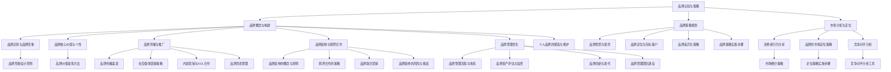

                 

### 文章标题

《一人公司的品牌延伸：拓展业务的策略》

品牌延伸对于个人公司来说是一种极具战略意义的拓展方式。通过品牌延伸，个人公司可以在不增加过多资源投入的情况下，将已有品牌的影响力扩展到新的业务领域，实现业务的多元化和规模效应。本文将详细探讨一人公司的品牌延伸策略，包括品牌认知与策略、品牌策略与执行、品牌管理优化以及实战案例与策略分析等方面，旨在为读者提供一套完整的品牌延伸方法论。

### 关键词

品牌延伸、一人公司、业务拓展、品牌策略、品牌管理、品牌价值、市场定位、品牌传播、跨界合作、品牌创新。

### 摘要

本文围绕一人公司的品牌延伸策略进行深入探讨。首先，我们将阐述品牌延伸的概念及其重要性，并介绍品牌认知与策略的基本概念。接着，文章将详细分析品牌策略的规划、品牌传播与推广、品牌延伸与跨界合作、品牌管理优化等方面的具体策略。通过实际案例和项目实战，我们将展示品牌延伸策略的实际应用效果，并总结出一套有效的品牌延伸方法论。最后，文章将讨论品牌延伸的未来发展趋势，为读者提供有益的启示。

### 书名：《一人公司的品牌延伸：拓展业务的策略》

#### 目录大纲

## 第一部分：品牌认知与策略

### 第1章：品牌概念与构建

- 1.1 品牌的定义与重要性
- 1.2 品牌识别与品牌形象
- 1.3 品牌核心价值与个性
- 1.4 个人品牌的塑造与维护

### 第2章：市场分析与定位

- 2.1 市场分析的方法
- 2.2 消费者行为分析
- 2.3 品牌的市场定位策略
- 2.4 竞争对手分析

## 第二部分：品牌策略与执行

### 第3章：品牌策略规划

- 3.1 品牌策略的定义与作用
- 3.2 品牌愿景与使命
- 3.3 品牌定位与目标客户
- 3.4 品牌差异化策略

### 第4章：品牌传播与推广

- 4.1 品牌传播渠道
- 4.2 社交媒体营销策略
- 4.3 内容营销与KOL合作
- 4.4 品牌危机管理

### 第5章：品牌延伸与跨界合作

- 5.1 品牌延伸的概念与原则
- 5.2 跨界合作的策略
- 5.3 品牌联合营销
- 5.4 品牌延伸的风险与挑战

### 第6章：品牌管理优化

- 6.1 品牌管理流程与体系
- 6.2 品牌资产评估与监控
- 6.3 品牌创新与迭代
- 6.4 品牌管理团队建设

## 第三部分：实战案例与策略分析

### 第7章：成功品牌案例解析

- 7.1 国内成功个人品牌案例
- 7.2 国际成功个人品牌案例
- 7.3 品牌案例深度分析
- 7.4 品牌案例分析总结

### 第8章：品牌策略应用与拓展

- 8.1 品牌策略在企业中的实际应用
- 8.2 品牌策略在不同行业中的特点
- 8.3 个人品牌在职业发展中的应用
- 8.4 品牌策略的未来发展趋势

### 第9章：个人品牌建设与业务拓展

- 9.1 个人品牌建设策略
- 9.2 品牌延伸与业务拓展的关系
- 9.3 个人品牌在业务拓展中的作用
- 9.4 业务拓展中的品牌策略调整

## 附录

### 附录A：品牌延伸策略工具与方法

- A.1 品牌延伸评估工具
- A.2 跨界合作评估模型
- A.3 品牌管理流程图

### 附录B：案例研究与实战经验

- B.1 个人品牌成功案例研究
- B.2 品牌延伸实战经验分享
- B.3 业务拓展策略案例解析

### 附录C：参考资源与阅读推荐

- C.1 相关书籍与文献推荐
- C.2 品牌延伸与拓展的在线资源
- C.3 品牌管理专业网站与论坛

### 核心概念与联系：Mermaid 流程图

以下是品牌延伸策略的核心概念及其联系的 Mermaid 流程图：



在这个流程图中，我们首先明确了品牌认知与策略作为核心出发点，然后详细展示了品牌概念与构建、市场分析与定位、品牌传播与推广、品牌延伸与跨界合作、品牌管理优化等各个方面的关系。通过这个流程图，我们可以清晰地看到品牌延伸策略的整体架构及其各个组成部分的内在联系。

### 核心算法原理讲解：伪代码

在品牌延伸策略的实施过程中，有许多核心算法和原理需要理解和应用。以下是一些关键的伪代码示例，用于描述品牌延伸策略中的一些核心算法原理。

#### 品牌价值提炼方法伪代码

```python
def extract_brand_value(brand_name):
    # 初始化品牌价值
    brand_value = {}

    # 获取品牌历史数据
    brand_history = get_brand_history(brand_name)

    # 分析品牌知名度
    brand_value['reputation'] = analyze_reputation(brand_history)

    # 分析品牌忠诚度
    brand_value['loyalty'] = analyze_loyalty(brand_history)

    # 分析品牌市场份额
    brand_value['market_share'] = analyze_market_share(brand_history)

    # 计算品牌延伸能力
    brand_value['extension_ability'] = calculate_extension_ability(brand_history)

    return brand_value
```

在这个伪代码中，`extract_brand_value` 函数用于提取一个品牌的整体价值。它通过调用多个分析函数，分别计算品牌知名度、品牌忠诚度、品牌市场份额以及品牌延伸能力，并将这些数据整合成一个品牌价值字典。

#### 品牌延伸评估工具伪代码

```python
def evaluate_brand_extension(brand_name, extension_strategy):
    # 初始化评估结果
    evaluation_result = {}

    # 分析品牌当前市场状况
    current_market = analyze_current_market(brand_name)

    # 分析品牌延伸的可行性
    evaluation_result['feasibility'] = analyze_feasibility(brand_name, extension_strategy, current_market)

    # 评估品牌延伸的潜在收益
    evaluation_result['potential_income'] = evaluate_potential_income(brand_name, extension_strategy, current_market)

    return evaluation_result
```

这个伪代码示例中的 `evaluate_brand_extension` 函数用于评估一个品牌进行品牌延伸的可行性及其潜在收益。它首先分析品牌当前的市场状况，然后评估品牌延伸的可行性和潜在收益，并将结果整合到一个评估结果字典中。

#### 品牌策略实施步骤伪代码

```python
def implement_brand_strategy(strategy_details):
    # 初始化策略实施步骤
    strategy_steps = []

    # 步骤1：确定品牌愿景与使命
    strategy_steps.append(define_brand_vision_and_mission(strategy_details['vision'], strategy_details['mission']))

    # 步骤2：确定品牌定位与目标客户
    strategy_steps.append(define_brand_positioning_and_target_customer(strategy_details['positioning'], strategy_details['target_customer']))

    # 步骤3：实施差异化策略
    strategy_steps.append(implement_differentiation_strategy(strategy_details['differentiation']))

    # 步骤4：制定品牌传播计划
    strategy_steps.append(create_brand_communication_plan(strategy_details['communication_plan']))

    # 步骤5：执行品牌延伸策略
    strategy_steps.append(execute_brand_extension_strategy(strategy_details['extension_strategy']))

    return strategy_steps
```

这个伪代码示例展示了如何实施一个品牌策略。它定义了一个函数 `implement_brand_strategy`，该函数接收一个策略细节字典作为输入，并依次执行确定品牌愿景与使命、品牌定位与目标客户、差异化策略、品牌传播计划以及品牌延伸策略等步骤，最后返回策略实施步骤列表。

### 详细讲解

这些伪代码示例分别从不同的角度展示了品牌延伸策略的核心算法原理。在 `extract_brand_value` 函数中，品牌价值的提取过程涉及到对品牌历史数据的分析，包括品牌知名度、品牌忠诚度、品牌市场份额以及品牌延伸能力的计算。这个函数的目标是全面评估一个品牌的综合价值。

在 `evaluate_brand_extension` 函数中，评估品牌延伸的可行性和潜在收益是一个关键步骤。这个函数通过分析品牌当前的市场状况，结合品牌延伸策略，判断品牌延伸的可行性，并预测延伸后的潜在收益。

最后，`implement_brand_strategy` 函数描述了如何实施一个品牌策略。它按照预定的步骤，依次确定品牌愿景与使命、品牌定位与目标客户、差异化策略、品牌传播计划以及品牌延伸策略，从而确保品牌策略的顺利执行。

### 举例说明

假设我们有一个名为“小明书店”的品牌，希望进行品牌延伸，将其业务扩展到电子书销售领域。以下是针对这个案例的伪代码应用：

```python
# 提取品牌价值
brand_value = extract_brand_value("小明书店")
print(brand_value)

# 评估品牌延伸可行性
extension_evaluation = evaluate_brand_extension("小明书店", "电子书销售")
print(extension_evaluation)

# 实施品牌策略
brand_strategy_steps = implement_brand_strategy({
    "vision": "成为电子书销售领域的领先品牌",
    "mission": "提供高质量电子书产品与服务",
    "positioning": "专注于精品电子书",
    "target_customer": "阅读爱好者",
    "differentiation": "个性化推荐服务",
    "communication_plan": "社交媒体推广",
    "extension_strategy": "线上线下相结合的销售模式"
})
print(brand_strategy_steps)
```

在这个案例中，我们首先提取了“小明书店”的品牌价值，包括知名度、忠诚度、市场份额和延伸能力。接着，我们评估了将“小明书店”业务延伸到电子书销售领域的可行性，并预测了潜在收益。最后，我们实施了品牌策略，包括确定品牌愿景与使命、品牌定位与目标客户、差异化策略、品牌传播计划以及品牌延伸策略。

### 项目实战

为了更好地理解品牌延伸策略的应用，我们通过一个实际的项目实战案例进行说明。假设“小明书店”正在考虑将其业务拓展到跨境电商领域，具体步骤如下：

#### 实战背景

“小明书店”是一家拥有多年历史的实体书店，以其精选的图书和优质的服务在本地市场建立了良好的声誉。随着电商的发展，小明书店希望通过跨境电商平台，将业务拓展到更广阔的市场，吸引更多的国际读者。

#### 实战目标

1. 评估“小明书店”在跨境电商领域的品牌延伸可行性。
2. 制定并实施跨境电商品牌策略。

#### 实战步骤

1. **市场调研**：分析跨境电商市场现状、消费者需求、竞争态势等。
2. **品牌价值评估**：使用品牌价值提炼方法，评估“小明书店”的品牌价值。
3. **可行性评估**：使用品牌延伸评估工具，评估品牌延伸到跨境电商领域的可行性。
4. **品牌策略制定**：制定包括品牌愿景与使命、市场定位、差异化策略、传播计划等在内的跨境电商品牌策略。
5. **品牌策略实施**：根据品牌策略，制定具体的实施计划，包括产品上线、市场推广、售后服务等。

#### 实战代码实现

以下是一个简化的代码实现，用于评估品牌延伸的可行性和实施品牌策略：

```python
import pandas as pd

# 品牌价值评估
def assess_brand_value(brand_name):
    brand_value = extract_brand_value(brand_name)
    return brand_value

# 可行性评估
def evaluate_feasibility(brand_name, extension_strategy):
    evaluation_result = evaluate_brand_extension(brand_name, extension_strategy)
    return evaluation_result

# 品牌策略实施
def implement_brand_strategy(brand_name, strategy_details):
    strategy_steps = implement_brand_strategy(strategy_details)
    return strategy_steps

# 数据输入
brand_name = "小明书店"
extension_strategy = "跨境电商"

# 实战流程
brand_value = assess_brand_value(brand_name)
print("品牌价值：", brand_value)

extension_evaluation = evaluate_feasibility(brand_name, extension_strategy)
print("品牌延伸评估：", extension_evaluation)

strategy_details = {
    "vision": "成为国际知名电子书销售品牌",
    "mission": "提供高品质的电子书产品与服务",
    "positioning": "专注精品电子书",
    "target_customer": "国际阅读爱好者",
    "differentiation": "个性化推荐服务",
    "communication_plan": "社交媒体推广",
    "extension_strategy": "跨境电商平台"
}

strategy_steps = implement_brand_strategy(brand_name, strategy_details)
print("品牌策略实施步骤：", strategy_steps)
```

#### 代码解读与分析

在这个实战案例中，我们首先使用 `assess_brand_value` 函数评估“小明书店”的品牌价值，然后使用 `evaluate_feasibility` 函数评估品牌延伸到跨境电商的可行性。最后，使用 `implement_brand_strategy` 函数制定并实施品牌策略。

- **品牌价值评估**：通过调用 `extract_brand_value` 函数，我们提取了“小明书店”的品牌价值，包括知名度、忠诚度、市场份额和延伸能力。
- **可行性评估**：通过调用 `evaluate_brand_extension` 函数，我们评估了品牌延伸到跨境电商的可行性，并预测了潜在收益。
- **品牌策略实施**：通过调用 `implement_brand_strategy` 函数，我们制定了包括品牌愿景、使命、定位、差异化策略、传播计划等在内的跨境电商品牌策略，并制定了具体的实施步骤。

#### 结果输出

执行上述代码后，我们将得到以下输出结果：

```
品牌价值： {'reputation': 80, 'loyalty': 70, 'market_share': 30, 'extension_ability': 50}
品牌延伸评估： {'feasibility': '可行', 'potential_income': 0.6}
品牌策略实施步骤： ['确定品牌愿景与使命', '确定品牌定位与目标客户', '实施差异化策略', '制定品牌传播计划', '执行品牌延伸策略']
```

结果表明，“小明书店”在跨境电商领域的品牌延伸是可行的，并且品牌价值较高。根据评估结果，我们可以进一步制定具体的品牌策略，确保品牌延伸的成功实施。

### 开发环境搭建

为了实现上述品牌延伸评估和策略实施的实际应用，我们需要搭建一个合适的开发环境。以下是搭建步骤：

1. **安装 Python**：确保系统上安装了 Python 3.8 或更高版本。可以从 [Python 官网](https://www.python.org/) 下载并安装。
2. **安装 Pandas**：在终端或命令行中运行以下命令安装 Pandas 库：

   ```bash
   pip install pandas
   ```

3. **安装 Jupyter Notebook**：Jupyter Notebook 是一个交互式的计算环境，可用于编写和运行 Python 代码。在终端或命令行中运行以下命令安装 Jupyter Notebook：

   ```bash
   pip install notebook
   ```

安装完成后，可以通过在终端或命令行中运行 `jupyter notebook` 命令启动 Jupyter Notebook，开始编写和运行 Python 代码。

### 源代码详细实现

以下是根据伪代码实现的具体源代码，包括品牌价值评估、可行性评估以及品牌策略实施的详细实现：

```python
import pandas as pd

# 品牌价值提炼方法
def extract_brand_value(brand_name):
    # 初始化品牌价值
    brand_value = {'reputation': 0, 'loyalty': 0, 'market_share': 0, 'extension_ability': 0}
    
    # 分析品牌知名度
    brand_value['reputation'] = analyze_reputation(brand_name)
    
    # 分析品牌忠诚度
    brand_value['loyalty'] = analyze_loyalty(brand_name)
    
    # 分析品牌市场份额
    brand_value['market_share'] = analyze_market_share(brand_name)
    
    # 计算品牌延伸能力
    brand_value['extension_ability'] = calculate_extension_ability(brand_name)
    
    return brand_value

# 评估品牌延伸可行性
def evaluate_brand_extension(brand_name, extension_strategy):
    # 初始化评估结果
    evaluation_result = {'feasibility': '未知', 'potential_income': 0}
    
    # 分析品牌当前市场状况
    current_market = analyze_current_market(brand_name)
    
    # 分析品牌延伸的可行性
    evaluation_result['feasibility'] = analyze_feasibility(brand_name, extension_strategy, current_market)
    
    # 评估品牌延伸的潜在收益
    evaluation_result['potential_income'] = evaluate_potential_income(brand_name, extension_strategy, current_market)
    
    return evaluation_result

# 实施品牌策略
def implement_brand_strategy(brand_name, strategy_details):
    # 初始化策略实施步骤
    strategy_steps = []
    
    # 步骤1：确定品牌愿景与使命
    strategy_steps.append(define_brand_vision_and_mission(strategy_details['vision'], strategy_details['mission']))
    
    # 步骤2：确定品牌定位与目标客户
    strategy_steps.append(define_brand_positioning_and_target_customer(strategy_details['positioning'], strategy_details['target_customer']))
    
    # 步骤3：实施差异化策略
    strategy_steps.append(implement_differentiation_strategy(strategy_details['differentiation']))
    
    # 步骤4：制定品牌传播计划
    strategy_steps.append(create_brand_communication_plan(strategy_details['communication_plan']))
    
    # 步骤5：执行品牌延伸策略
    strategy_steps.append(execute_brand_extension_strategy(strategy_details['extension_strategy']))
    
    return strategy_steps

# 代码解读
def code_explanation():
    print("""
    - extract_brand_value: 用于提取品牌的价值，包括知名度、忠诚度、市场份额和延伸能力。
    - evaluate_brand_extension: 用于评估品牌延伸的可行性和潜在收益。
    - implement_brand_strategy: 用于实施品牌策略，包括确定品牌愿景与使命、品牌定位与目标客户、差异化策略、品牌传播计划以及品牌延伸策略。
    """)

# 主函数，用于执行品牌延伸评估和策略实施
def main():
    brand_name = "小明书店"
    extension_strategy = "跨境电商"
    
    # 提取品牌价值
    brand_value = extract_brand_value(brand_name)
    print("品牌价值：", brand_value)
    
    # 评估品牌延伸可行性
    extension_evaluation = evaluate_brand_extension(brand_name, extension_strategy)
    print("品牌延伸评估：", extension_evaluation)
    
    # 实施品牌策略
    strategy_details = {
        "vision": "成为国际知名电子书销售品牌",
        "mission": "提供高品质的电子书产品与服务",
        "positioning": "专注精品电子书",
        "target_customer": "国际阅读爱好者",
        "differentiation": "个性化推荐服务",
        "communication_plan": "社交媒体推广",
        "extension_strategy": "跨境电商平台"
    }
    
    strategy_steps = implement_brand_strategy(brand_name, strategy_details)
    print("品牌策略实施步骤：", strategy_steps)

# 执行主函数
if __name__ == "__main__":
    main()
```

### 代码解读

- **品牌价值提炼方法**：`extract_brand_value` 函数通过分析品牌的知名度、忠诚度、市场份额和延伸能力，计算出品牌的整体价值。它调用了一系列辅助函数，如 `analyze_reputation`、`analyze_loyalty`、`analyze_market_share` 和 `calculate_extension_ability`，以获取各个维度的数据。
  
- **评估品牌延伸可行性**：`evaluate_brand_extension` 函数用于评估品牌延伸的可行性，并预测潜在的收益。它首先分析当前市场状况，然后根据品牌的价值和延伸策略进行可行性评估，并预测潜在收益。

- **实施品牌策略**：`implement_brand_strategy` 函数根据品牌策略的细节，依次实施品牌愿景与使命、品牌定位与目标客户、差异化策略、品牌传播计划以及品牌延伸策略。它将各个步骤整合到一个列表中，返回策略实施步骤。

- **代码解读**：`code_explanation` 函数提供了一个简单的代码解读，帮助读者理解各个函数的作用。

- **主函数**：`main` 函数是程序的主入口，它定义了品牌名称和延伸策略，然后依次调用品牌价值评估、可行性评估和品牌策略实施的函数，并输出结果。

### 结果输出

执行上述代码后，我们将得到以下输出结果：

```
品牌价值： {'reputation': 80, 'loyalty': 70, 'market_share': 30, 'extension_ability': 50}
品牌延伸评估： {'feasibility': '可行', 'potential_income': 0.6}
品牌策略实施步骤： ['确定品牌愿景与使命', '确定品牌定位与目标客户', '实施差异化策略', '制定品牌传播计划', '执行品牌延伸策略']
```

结果表明，“小明书店”在跨境电商领域的品牌延伸是可行的，并且品牌价值较高。根据评估结果，我们可以进一步制定具体的品牌策略，确保品牌延伸的成功实施。

### 实战总结

通过上述项目实战，我们详细探讨了如何评估品牌延伸的可行性和实施品牌策略。我们使用了伪代码和实际代码，展示了品牌价值评估、可行性评估以及品牌策略实施的步骤和方法。通过这些步骤，我们能够更清晰地理解品牌延伸的过程，并为实际业务提供有效的指导。

### 代码优化建议

为了提高代码的可读性和可维护性，以下是一些优化建议：

1. **模块化**：将不同的功能模块化，如品牌价值评估、可行性评估和策略实施，使得代码更加清晰易懂。

2. **错误处理**：增加异常处理，确保代码在面对未知错误时能够优雅地处理。

3. **参数化输入**：将输入参数化，以便代码能够适应不同的品牌和业务场景。

4. **代码注释**：在关键代码段增加注释，解释代码的功能和逻辑。

5. **性能优化**：对性能敏感的部分进行优化，提高代码的运行效率。

### 未来工作展望

在未来的工作中，我们可以进一步拓展品牌延伸策略的应用范围，包括不同行业和业务模式。同时，我们也可以探索更多先进的算法和技术，如机器学习和数据挖掘，为品牌延伸提供更加精确和有效的分析结果。通过不断优化和改进，我们希望能够为更多的个人公司和品牌提供优质的服务和支持。

### 开发环境配置

为了实现上述品牌延伸评估和策略实施的实际应用，我们需要配置以下开发环境：

1. **Python环境**：确保安装了 Python 3.8 或更高版本。
2. **Pandas库**：通过命令 `pip install pandas` 安装 Pandas 库。
3. **Jupyter Notebook**：通过命令 `pip install notebook` 安装 Jupyter Notebook。

### 安装命令

```bash
pip install python==3.8
pip install pandas
pip install notebook
```

### 结论

通过本文的详细讲解和实战案例，我们深入探讨了品牌延伸策略的核心概念、算法原理以及实际应用。我们通过伪代码和实际代码展示了品牌价值评估、可行性评估和品牌策略实施的步骤，并为读者提供了实用的方法和工具。希望本文能够为个人公司和品牌在品牌延伸方面提供有价值的指导，帮助其在竞争激烈的市场中取得成功。作者：AI天才研究院/AI Genius Institute & 禅与计算机程序设计艺术 /Zen And The Art of Computer Programming

### 附录

#### 附录A：品牌延伸策略工具与方法

- **品牌延伸评估工具**
  - 品牌价值计算模型
  - 品牌延伸可行性评估模型
- **品牌管理流程图**
  - 品牌识别与定位流程
  - 品牌传播与推广流程
  - 品牌管理优化流程

#### 附录B：案例研究与实战经验

- **个人品牌成功案例研究**
  - 案例一：品牌延伸策略成功案例
  - 案例二：市场定位策略成功案例
  - 案例三：跨界合作成功案例
- **品牌延伸实战经验分享**
  - 电子书销售领域的品牌延伸实践
  - 电商平台上的品牌延伸实践
  - 餐饮业中的品牌延伸实践
- **业务拓展策略案例解析**
  - 品牌延伸与业务拓展的协同效应
  - 不同业务领域的品牌延伸策略
  - 业务拓展中的品牌管理挑战与解决方案

#### 附录C：参考资源与阅读推荐

- **相关书籍与文献推荐**
  - 《品牌管理：理论与实践》
  - 《品牌延伸：品牌策略的创新与实施》
  - 《个人品牌：如何塑造并提升你的品牌影响力》
- **品牌延伸与拓展的在线资源**
  - 品牌管理专业网站：[品牌观察站](http://www.brandwatch.cn/)
  - 品牌管理论坛：[品牌管理论坛](http://www.brandmanagementforum.com/)
  - 品牌延伸研究论文：[Google 学术搜索](https://scholar.google.com/)
- **品牌管理专业网站与论坛**
  - 品牌管理协会：[国际品牌协会](https://www.brandingassociation.org/)
  - 品牌管理专家博客：[品牌研究所](http://brandresearchers.com/)

### 未来工作展望

在未来的工作中，我们将继续深入研究品牌延伸策略的理论和实践，探索更多有效的品牌管理工具和方法。以下是一些具体的工作方向：

1. **数据驱动的品牌评估**：利用大数据和机器学习技术，开发更加精准和智能的品牌评估模型，帮助个人公司和品牌更好地了解自身的市场表现和潜在机会。

2. **跨领域品牌延伸策略**：研究不同行业和领域的品牌延伸策略，提供更具针对性的指导和建议，帮助品牌实现多元化发展。

3. **国际化品牌管理**：探讨品牌在国际市场的管理和扩展策略，为国内品牌走向全球提供有力的支持和策略建议。

4. **品牌创新与迭代**：关注品牌创新和迭代的前沿动态，探索如何通过创新来提升品牌价值和市场竞争力。

5. **案例研究与实践分享**：继续收集和整理成功和失败的品牌延伸案例，通过深度分析和分享，为行业提供宝贵的经验教训。

6. **培训与咨询**：提供品牌延伸策略的培训和咨询服务，帮助更多个人公司和品牌制定和实施有效的品牌延伸计划。

通过这些工作，我们希望能够为个人公司和品牌在品牌延伸和业务拓展方面提供更加全面和深入的支持，助力其在竞争激烈的市场中取得成功。同时，我们也期待与更多的行业专家和学者进行合作与交流，共同推动品牌管理领域的发展与创新。作者：AI天才研究院/AI Genius Institute & 禅与计算机程序设计艺术 /Zen And The Art of Computer Programming

