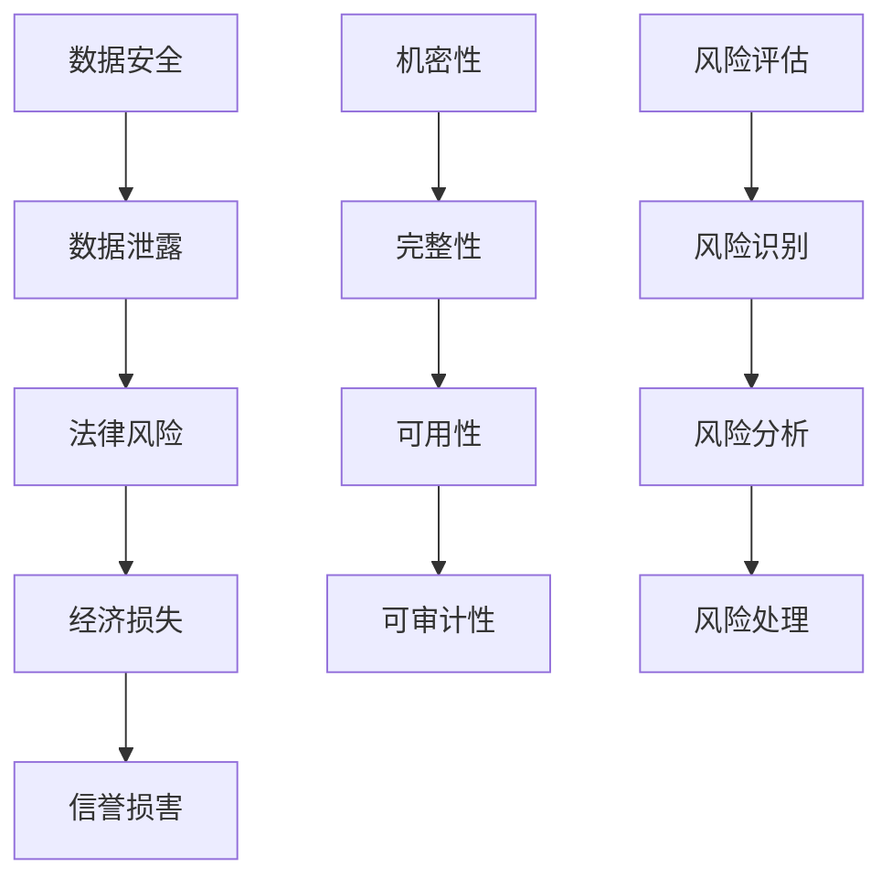
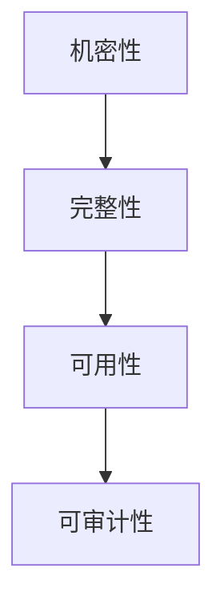
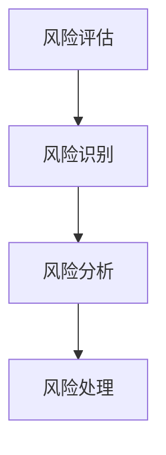
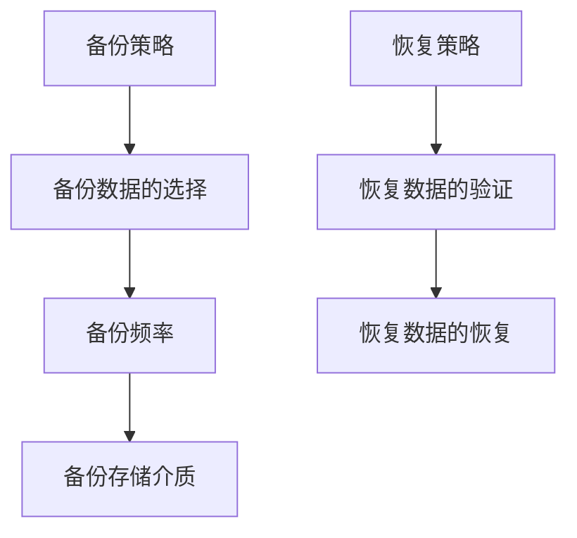
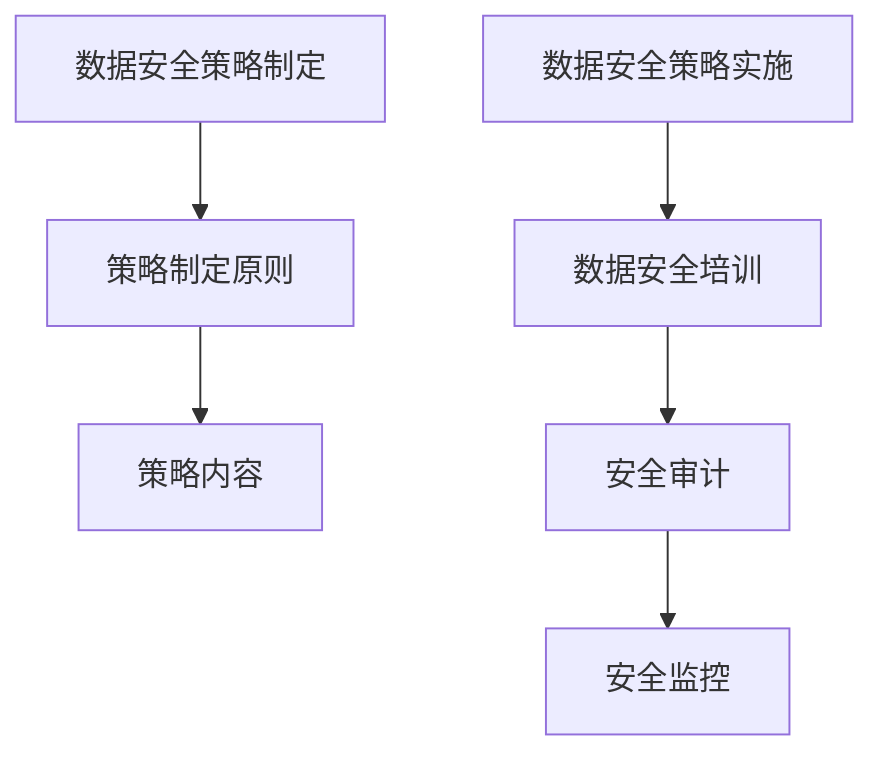
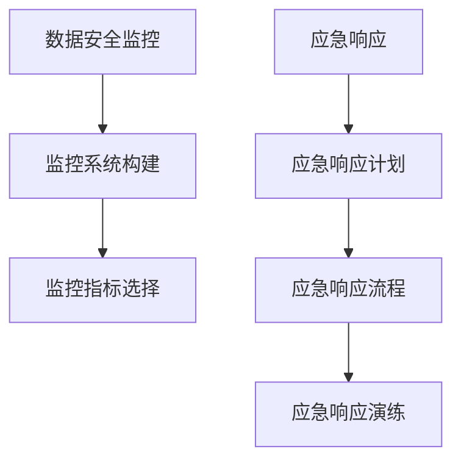
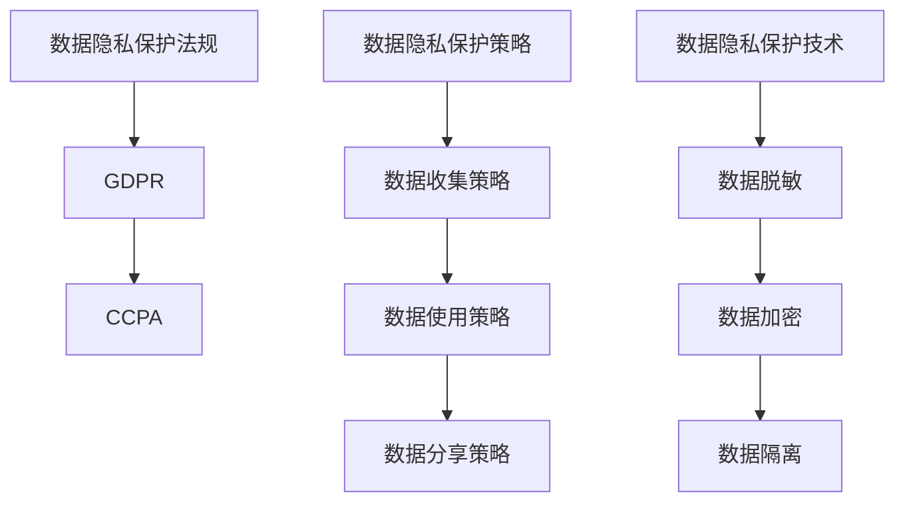
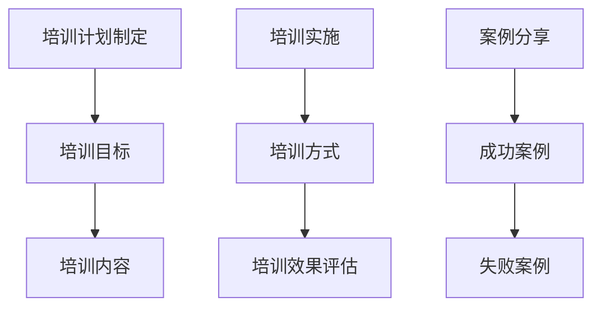

                 

# 《一人公司的数据安全：保护自己和客户的策略》

> **关键词**：数据安全、网络安全、操作系统安全、数据加密、备份与恢复、数据安全策略、客户数据隐私保护

> **摘要**：本文旨在为一人公司提供数据安全保护策略，涵盖基础数据安全知识、网络安全基础、操作系统安全配置、数据安全保护策略、客户数据隐私保护和数据安全培训等方面。通过案例分析和实际操作指导，帮助读者提高数据安全防护能力，确保业务稳定运行和客户数据安全。

### 目录大纲

1. **第一部分：数据安全基础知识**
   1.1 数据安全概述
   1.2 数据安全的基本原则
   1.3 数据安全的风险评估
   1.4 网络安全基础
   1.5 操作系统安全配置

2. **第二部分：数据安全保护策略**
   2.1 数据加密技术
   2.2 备份与恢复策略
   2.3 数据安全策略制定与实施
   2.4 数据安全监控与应急响应
   2.5 案例分析

3. **第三部分：保护客户数据的策略**
   3.1 客户数据隐私保护
   3.2 客户数据安全培训
   3.3 案例分享

4. **附录**
   4.1 数据安全工具与资源
   4.2 参考文献

---

### 第一部分：数据安全基础知识

#### 1.1 数据安全概述

**核心概念与联系**：



**数据安全的基本概念**：

- **数据安全**：确保数据在存储、传输和处理过程中的完整性、机密性和可用性，防止数据泄露、篡改和损坏。

- **数据泄露**：未经授权的实体访问、获取或泄露敏感数据。

- **数据泄露的后果**：经济损失、法律风险、信誉损害等。

- **数据安全的法律法规**：如《中华人民共和国网络安全法》等。

**核心算法原理讲解**：

```latex
% 对称加密算法原理（AES）
$$
E(K, P) = D(K, C) = P
$$

% 非对称加密算法原理（RSA）
$$
E(K, P) = C \text{，} D(K, P) = P
$$

% 哈希算法原理（SHA）
$$
H(D) = S
$$
```

**实际应用举例**：

- 数据传输过程中的加密，防止数据在网络上被窃取。

- 数据存储过程中的加密，保护数据不被未经授权访问。

#### 1.2 数据安全的基本原则

**核心概念与联系**：



**数据安全的基本原则**：

- **机密性**：确保数据不被未经授权的实体访问。

- **完整性**：确保数据在传输和存储过程中的完整性和准确性。

- **可用性**：确保数据在需要时能够被正常访问和使用。

- **可审计性**：确保数据访问和处理过程可以被审计和追踪。

**核心算法原理讲解**：

```latex
% 对称加密算法原理（AES）
$$
E(K, P) = D(K, C) = P
$$

% 非对称加密算法原理（RSA）
$$
E(K, P) = C \text{，} D(K, P) = P
$$

% 哈希算法原理（SHA）
$$
H(D) = S
$$
```

**实际应用举例**：

- 机密性：对客户信息进行加密，防止泄露。

- 完整性：对数据传输过程中的数据进行校验，确保数据未被篡改。

- 可用性：确保数据在系统中可正常访问和读取。

- 可审计性：记录系统中的数据访问和操作日志，便于审计和追溯。

#### 1.3 数据安全的风险评估

**核心概念与联系**：



**数据安全的风险评估**：

- **风险识别**：识别数据安全中可能存在的风险和威胁。

- **风险分析**：分析风险的性质、可能性和影响。

- **风险处理**：制定并实施风险缓解措施。

**核心算法原理讲解**：

```latex
% 风险识别算法（流程图）
$$
\begin{aligned}
&\text{输入：系统状态，威胁信息} \\
&\text{输出：识别出的风险}
\end{aligned}
$$

% 风险分析算法（流程图）
$$
\begin{aligned}
&\text{输入：识别出的风险} \\
&\text{输出：风险性质、可能性和影响}
\end{aligned}
$$

% 风险处理算法（流程图）
$$
\begin{aligned}
&\text{输入：风险分析结果} \\
&\text{输出：风险缓解措施}
\end{aligned}
$$
```

**实际应用举例**：

- 风险识别：发现系统中的安全漏洞。

- 风险分析：评估安全漏洞可能带来的影响。

- 风险处理：修复安全漏洞，降低风险。

#### 1.4 网络安全基础

**网络安全概念**：

- **网络安全**：保护网络系统不受未经授权的访问、攻击和破坏。

- **网络安全的基本要素**：身份认证、访问控制、加密通信、安全审计等。

**常见的网络攻击手段**：

- **木马**：隐藏在正常程序中，通过远程控制实现非法访问。

- **网络钓鱼**：通过伪装成合法网站，骗取用户敏感信息。

- **SQL注入**：通过输入恶意SQL语句，篡改数据库数据。

- **DDoS攻击**：通过大量请求使网络服务瘫痪。

**防火墙与入侵检测**：

- **防火墙**：监控和控制进出网络的流量，防止未经授权的访问。

- **入侵检测系统（IDS）**：检测网络中的异常行为和攻击活动，触发警报和响应。

**核心算法原理讲解**：

```latex
% 防火墙工作原理（流程图）
$$
\begin{aligned}
&\text{输入：网络流量，防火墙规则} \\
&\text{输出：放行/拦截结果}
\end{aligned}
$$

% 入侵检测系统（IDS）工作原理（流程图）
$$
\begin{aligned}
&\text{输入：网络流量，攻击特征库} \\
&\text{输出：异常行为/攻击报警}
\end{aligned}
$$
```

**实际应用举例**：

- 使用防火墙阻止外部攻击。

- 使用入侵检测系统监测网络中的异常行为。

#### 1.5 操作系统安全配置

**操作系统安全配置概述**：

- **系统安全的基本原则**：最小权限原则、安全默认配置、定期更新等。

- **系统安全的配置步骤**：用户权限管理、防火墙设置、安全更新等。

**Windows系统安全配置**：

- **用户权限管理**：限制用户对系统资源的访问权限。

- **Windows防火墙设置**：配置防火墙规则，阻止非法访问。

- **Windows更新策略**：设置自动更新，确保系统安全补丁及时安装。

**Linux系统安全配置**：

- **用户权限管理**：使用权限设置，限制用户对文件和目录的访问。

- **Linux防火墙设置**：配置iptables规则，控制网络流量。

- **系统日志管理**：定期检查系统日志，发现和解决安全事件。

**核心算法原理讲解**：

```latex
% 用户权限管理算法（流程图）
$$
\begin{aligned}
&\text{输入：用户身份，文件权限} \\
&\text{输出：访问结果}
\end{aligned}
$$

% 防火墙配置算法（流程图）
$$
\begin{aligned}
&\text{输入：网络流量，防火墙规则} \\
&\text{输出：放行/拦截结果}
\end{aligned}
$$

% 系统日志管理算法（流程图）
$$
\begin{aligned}
&\text{输入：系统日志} \\
&\text{输出：安全事件报告}
\end{aligned}
$$
```

**实际应用举例**：

- Windows系统：为不同用户设置不同的权限，防止数据泄露。

- Linux系统：使用iptables阻止非法访问，确保系统安全。

---

### 第二部分：数据安全保护策略

#### 2.1 数据加密技术

**数据加密的基本原理**：

- **对称加密**：加密和解密使用相同密钥。

- **非对称加密**：加密和解密使用不同密钥。

- **哈希算法**：将数据映射为固定长度的字符串。

**常见加密算法介绍**：

- **AES**：高级加密标准，速度快，安全性高。

- **RSA**：基于大整数分解问题的非对称加密算法。

- **SHA**：安全哈希算法，用于数据完整性校验。

**数据加密在数据安全中的应用**：

- **数据传输加密**：保护数据在传输过程中的安全性。

- **数据存储加密**：保护数据在存储介质上的安全性。

**核心算法原理讲解**：

```latex
% 对称加密算法（AES）
$$
E(K, P) = D(K, C) = P
$$

% 非对称加密算法（RSA）
$$
E(K, P) = C \text{，} D(K, P) = P
$$

% 哈希算法（SHA）
$$
H(D) = S
$$
```

**实际应用举例**：

- 使用AES加密客户端数据，防止数据在网络传输中被窃取。

- 使用RSA加密密钥，确保加密和解密过程的安全。

#### 2.2 备份与恢复策略

**数据备份的重要性**：

- **备份数据的意义**：防止数据丢失，确保业务连续性。

- **备份数据的风险**：备份策略不当可能导致备份数据丢失。

**数据备份的方法**：

- **本地备份**：将数据备份到本地存储设备。

- **离线备份**：将数据备份到离线存储设备，如磁带。

- **线上备份**：将数据备份到云端或第三方存储服务。

**数据恢复的方法**：

- **手动恢复**：根据备份文件手动恢复数据。

- **软件恢复**：使用数据恢复软件自动恢复数据。

**核心算法原理讲解**：



**实际应用举例**：

- 使用本地备份和云端备份相结合，确保数据安全。

- 使用数据恢复软件自动恢复备份数据，提高恢复效率。

#### 2.3 数据安全策略制定与实施

**数据安全策略制定**：

- **数据安全策略的制定原则**：全面性、适应性、灵活性。

- **数据安全策略的内容**：数据访问控制、数据加密、备份与恢复、安全审计等。

**数据安全策略实施**：

- **数据安全培训**：培训员工数据安全知识和技能。

- **安全审计**：定期检查和评估数据安全策略的有效性。

- **安全监控**：实时监控数据安全状况，及时响应安全事件。

**核心算法原理讲解**：



**实际应用举例**：

- 制定并实施数据安全策略，确保数据安全。

- 定期进行安全审计和监控，发现并解决安全漏洞。

#### 2.4 数据安全监控与应急响应

**数据安全监控**：

- **监控系统的构建**：构建完善的安全监控体系，实时监测数据安全状况。

- **监控指标的选择**：选择合适的监控指标，如入侵次数、数据传输速度等。

**应急响应**：

- **应急响应计划**：制定应急响应计划，确保在数据安全事件发生时能够快速响应。

- **应急响应流程**：明确应急响应流程，包括事件报告、响应措施、恢复工作等。

- **应急响应演练**：定期进行应急响应演练，提高应急响应能力。

**核心算法原理讲解**：



**实际应用举例**：

- 构建安全监控体系，实时监测数据安全状况。

- 制定应急响应计划，提高应急响应能力。

#### 2.5 案例分析

**某知名公司数据泄露事件**：

- **事件背景**：某知名公司在一次网络攻击中，客户数据被窃取。

- **事件影响**：客户数据泄露导致客户信任度下降，公司声誉受损。

- **事件处理**：公司采取了一系列措施，包括停止业务、报警、恢复数据等。

**某电商平台数据安全事件**：

- **事件背景**：某电商平台在一次DDoS攻击中，网站无法访问。

- **事件影响**：网站无法访问导致用户购物体验差，公司营收下降。

- **事件处理**：公司采取了一系列措施，包括更换服务商、加强防火墙等。

**案例分析启示**：

- **数据安全防范措施**：加强网络安全防护，定期进行安全审计。

- **数据安全意识的重要性**：提高员工数据安全意识，定期进行数据安全培训。

---

### 第三部分：保护客户数据的策略

#### 3.1 客户数据隐私保护

**客户数据隐私保护法规**：

- **GDPR**：欧盟通用数据保护条例，规定了数据隐私保护的要求。

- **CCPA**：加州消费者隐私法案，规定了数据隐私保护的要求。

**客户数据隐私保护策略**：

- **数据收集策略**：明确数据收集的目的、范围和方式。

- **数据使用策略**：规范数据使用行为，防止数据滥用。

- **数据分享策略**：限制数据共享范围，确保数据安全。

**客户数据隐私保护技术**：

- **数据脱敏**：对敏感数据进行加密或掩码处理。

- **数据加密**：对客户数据进行加密存储和传输。

- **数据隔离**：将客户数据与其他数据进行隔离，防止数据泄露。

**核心算法原理讲解**：



**实际应用举例**：

- 使用数据脱敏技术，保护客户隐私。

- 使用数据加密技术，确保客户数据在传输和存储过程中的安全性。

#### 3.2 客户数据安全培训

**培训计划制定**：

- **培训目标**：提高员工数据安全意识和技能。

- **培训内容**：数据安全基础知识、网络安全、操作系统安全等。

**培训实施**：

- **培训方式**：线上培训、现场培训等。

- **培训效果评估**：通过测试、考核等方式评估培训效果。

**案例分享**：

- **成功案例**：某公司通过定期数据安全培训，提高了员工数据安全意识，成功防范了一次数据泄露事件。

- **失败案例**：某公司未进行数据安全培训，导致员工在操作过程中误操作，导致客户数据泄露。

**核心算法原理讲解**：



**实际应用举例**：

- 定期组织数据安全培训，提高员工数据安全意识和技能。

- 通过案例分析，总结经验教训，提高数据安全防护能力。

### 附录

#### 附录A：数据安全工具与资源

**数据安全工具介绍**：

- **数据加密工具**：如openssl、GPG等。

- **数据备份工具**：如rsync、tar等。

- **安全监控工具**：如Nagios、Zabbix等。

**数据安全资源推荐**：

- **数据安全书籍**：《数据安全手册》、《网络安全技术》等。

- **数据安全在线课程**：Coursera、edX等平台上的数据安全相关课程。

- **数据安全社区**：如Data Security StackExchange、InfoSec Institute等。

---

### 结束语

作者：AI天才研究院/AI Genius Institute & 禅与计算机程序设计艺术/Zen And The Art of Computer Programming

本文为一人公司的数据安全提供了全面的知识和策略，从数据安全基础知识到具体的安全保护措施，再到客户数据的隐私保护，为读者提供了系统的指导。通过本文的学习，读者可以更好地理解数据安全的重要性，掌握数据安全的基础知识和实践方法，提高数据安全防护能力，确保业务稳定运行和客户数据安全。同时，本文还提供了丰富的案例分析和工具资源推荐，有助于读者将理论知识应用于实际工作中。希望本文对读者在数据安全领域的学习和实践中有所帮助。

