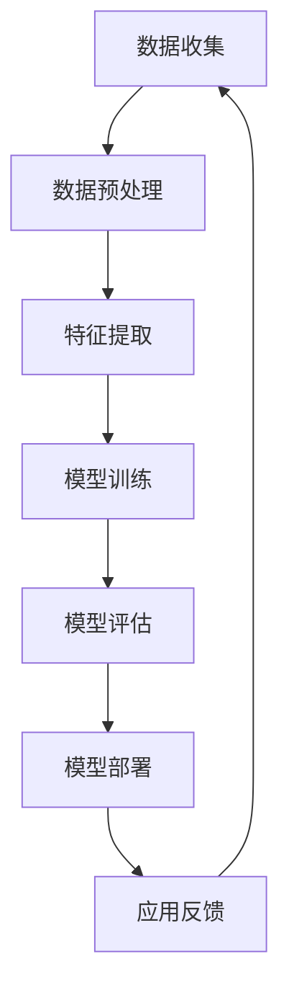
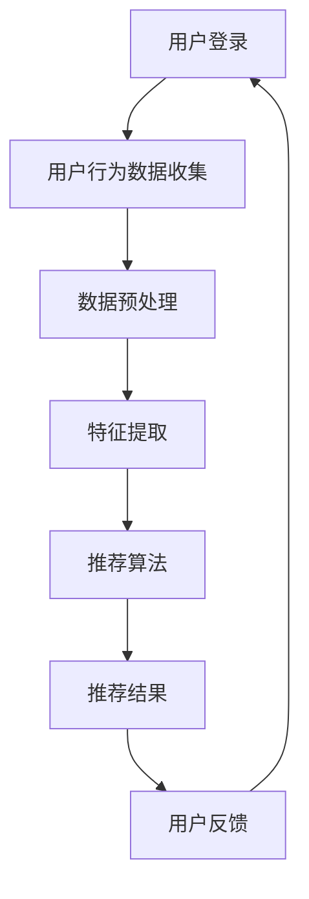
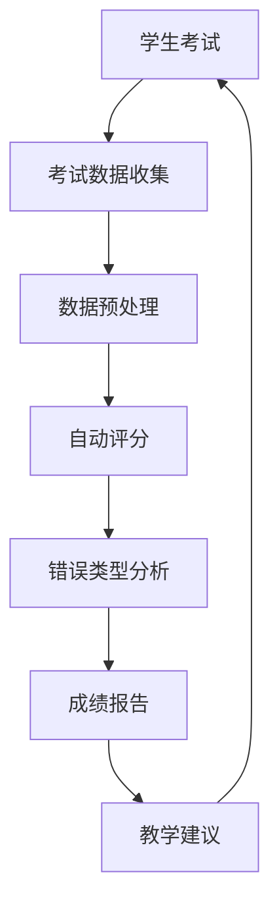

                 

# 《一切皆是映射：AI在教育领域的变革作用》

> 关键词：人工智能、教育、个性化学习、智能评估、教育资源优化、深度学习、强化学习、概率论、神经网络、数据可视化

> 摘要：本文深入探讨人工智能（AI）在教育领域的应用与变革作用。通过分析AI的核心算法原理、数学模型以及实际项目案例，展示AI如何重塑教育模式，提高教学效果和资源利用效率，从而推动教育领域的创新与发展。

----------------------------------------------------------------

### 《一切皆是映射：AI在教育领域的变革作用》目录大纲

**第一部分: AI在教育领域的理论基础与核心概念**

**第1章: AI与教育概述**

**1.1 AI在教育中的地位与作用**

**1.2 教育领域的AI应用现状**

**1.3 AI变革教育的核心概念与联系**

**1.4 教育领域的AI应用挑战与机遇**

**第2章: AI在教育领域的应用场景**

**2.1 AI在个性化学习中的应用**

**2.2 AI在智能评估与测试中的应用**

**2.3 AI在教育资源优化中的应用**

**第3章: AI核心算法原理与数学模型**

**3.1 机器学习基本算法原理**

**3.2 深度学习算法原理**

**3.3 强化学习算法原理**

**3.4 数学模型讲解与公式推导**

**第4章: AI在教育领域的数据处理与分析**

**4.1 教育数据的收集与处理**

**4.2 数据可视化与挖掘**

**4.3 教育数据的质量控制**

**第5章: AI教育项目实战**

**5.1 项目实战概述**

**5.2 个性化学习推荐系统搭建**

**5.3 智能评估与测试系统的实现**

**5.4 教育资源优化系统的开发**

**5.5 项目总结与反思**

**第6章: AI教育应用的未来发展趋势**

**6.1 AI教育应用的发展趋势**

**6.2 AI教育应用的伦理与法律问题**

**6.3 AI教育应用的未来展望**

**第7章: AI教育应用案例分析**

**7.1 国内外知名AI教育企业介绍**

**7.2 典型AI教育项目案例**

**7.3 案例分析**

**第二部分: 附录**

**附录A: AI教育应用开发工具与资源**

**附录B: Mermaid流程图**

----------------------------------------------------------------

### 第一部分: AI在教育领域的理论基础与核心概念

#### 第1章: AI与教育概述

##### 1.1 AI在教育中的地位与作用

人工智能（AI）作为当今科技发展的重要方向，正在深刻地改变着各个领域的运行方式。在教育领域，AI不仅提升了教学质量和学习效率，还推动了教育模式的创新与变革。AI在教育中的地位和作用主要体现在以下几个方面：

1. **个性化学习**：通过分析学生的学习数据，AI可以为学生提供个性化的学习方案，满足不同学生的个性化需求，从而提高学习效果。
2. **智能评估与测试**：AI能够实现自动化、智能化的评估与测试，为教师和学生提供及时、准确的评估结果，助力教学优化。
3. **教育资源优化**：AI通过对教育资源的数据分析和挖掘，可以优化教育资源的配置，提高资源利用效率。
4. **教育管理**：AI在教育管理中的应用，如学生信息管理、教学计划制定等，能够提高教育管理效率和精确度。

##### 1.2 教育领域的AI应用现状

目前，AI在教育领域的应用已经取得了显著成果。以下是一些常见的AI教育应用案例：

1. **个性化学习平台**：如Coursera、edX等在线教育平台，利用AI技术为学生提供个性化学习路径和推荐内容。
2. **智能辅导系统**：如Khan Academy等，通过AI技术实现实时解答学生疑问，提供个性化的学习支持。
3. **智能评估系统**：如Formative等，利用AI技术实现自动化、智能化的评估与测试，提高评估效率和质量。
4. **教育资源优化平台**：如Edmodo等，通过AI技术优化教育资源的配置，提高教育资源的利用效率。

##### 1.3 AI变革教育的核心概念与联系

AI在教育领域的变革作用，源于其核心算法原理与数学模型的广泛应用。以下是对AI核心算法原理与数学模型的简要概述：

1. **机器学习**：机器学习是AI的核心技术之一，通过训练模型，使计算机能够从数据中学习并做出预测或决策。在教育领域中，机器学习算法广泛应用于个性化学习推荐、智能评估与测试等场景。
2. **深度学习**：深度学习是机器学习的一个重要分支，通过构建多层神经网络，实现对复杂数据的自动特征提取和分类。深度学习在教育领域的应用包括语音识别、图像识别、自然语言处理等。
3. **强化学习**：强化学习是一种通过试错和反馈学习策略的算法，适用于需要长期规划和决策的场景。在教育领域中，强化学习算法可以用于学生行为分析、教育管理优化等。

##### 1.4 教育领域的AI应用挑战与机遇

尽管AI在教育领域的应用前景广阔，但仍面临一些挑战和机遇：

1. **数据隐私与安全**：教育数据涉及到学生的隐私，如何确保数据的安全和隐私成为AI教育应用的重要挑战。
2. **算法公平性与透明性**：AI算法在教育领域的应用需要保证公平性，避免因算法偏见导致的不公平现象。
3. **教师与学生的接受度**：AI技术的普及和应用需要教师和学生的积极配合和接受，提高他们的技术素养和适应能力。
4. **教育资源分配**：如何确保AI技术能够公平地分配教育资源，缩小教育差距，是AI教育应用的重要课题。

在接下来的章节中，我们将深入探讨AI在教育领域的应用场景、核心算法原理与数学模型、数据处理与分析方法，以及实际项目案例，以展示AI如何重塑教育模式，推动教育创新与发展。

----------------------------------------------------------------

### 第2章: AI在教育领域的应用场景

随着人工智能技术的不断发展，AI在教育领域的应用越来越广泛。本文将详细探讨AI在个性化学习、智能评估与测试、教育资源优化等方面的应用，并展示AI如何为教育带来变革。

#### 2.1 AI在个性化学习中的应用

个性化学习是AI技术在教育领域最具代表性的应用之一。通过分析学生的学习行为、兴趣和学习习惯，AI可以为学生量身定制个性化的学习方案，从而提高学习效果和满意度。

**1. 个性化学习推荐系统**

个性化学习推荐系统是AI在个性化学习中的重要应用。它通过分析学生的学习数据，包括学习时间、学习内容、成绩等，为学生推荐适合的学习资源和课程。以下是一个简单的个性化学习推荐系统算法流程：

```
输入：用户学习行为数据、学习内容库
输出：个性化学习推荐列表

步骤：
1. 收集并预处理用户学习行为数据，包括学习时间、学习内容、成绩等；
2. 对学习内容库进行特征提取和降维处理；
3. 计算用户与学习内容之间的相似度；
4. 根据相似度对学习内容进行排序，生成个性化学习推荐列表；
5. 展示个性化学习推荐列表给用户。
```

**2. 个性化学习路径规划**

除了推荐学习资源和课程，AI还可以根据学生的学习进度和知识掌握情况，规划个性化的学习路径。通过分析学生的学习数据，AI可以识别出学生的弱点，为学生提供针对性的学习建议和补充课程。以下是一个简单的个性化学习路径规划算法流程：

```
输入：学生学习数据、课程库
输出：个性化学习路径

步骤：
1. 收集并预处理学生学习数据，包括学习进度、知识掌握情况等；
2. 对课程库进行特征提取和降维处理；
3. 计算学生与课程之间的匹配度；
4. 根据匹配度为学生推荐学习路径；
5. 优化学习路径，确保学生能够全面掌握知识。
```

#### 2.2 AI在智能评估与测试中的应用

智能评估与测试是AI技术在教育领域的另一个重要应用。通过自动化、智能化的评估与测试，AI可以为学生提供及时、准确的评估结果，帮助教师和学生了解学习效果，进行有针对性的教学和学习调整。

**1. 智能评估系统**

智能评估系统通过AI技术，实现对学生的自动评估。以下是一个简单的智能评估系统算法流程：

```
输入：学生试卷、答案
输出：评估结果

步骤：
1. 收集并预处理学生试卷和答案；
2. 对试卷和答案进行特征提取和降维处理；
3. 使用机器学习算法进行评分，如多标签分类、多任务学习等；
4. 生成评估结果，包括正确率、错误类型等；
5. 根据评估结果给出学习建议和教学反馈。
```

**2. 智能测试系统**

智能测试系统通过AI技术，实现对学生的自动测试。以下是一个简单的智能测试系统算法流程：

```
输入：学生、测试题目库
输出：测试结果

步骤：
1. 收集并预处理学生数据，包括学生兴趣、知识掌握情况等；
2. 对测试题目库进行特征提取和降维处理；
3. 计算学生与测试题目的匹配度；
4. 根据匹配度为学生生成测试题目；
5. 学生完成测试后，系统自动评分并给出反馈；
6. 根据测试结果调整测试策略和题目库。
```

#### 2.3 AI在教育资源优化中的应用

AI在教育资源优化中的应用，旨在通过数据分析和智能算法，优化教育资源的配置，提高教育资源的利用效率。

**1. 教育资源推荐系统**

教育资源推荐系统通过AI技术，根据教师和学生的需求，推荐适合的教育资源。以下是一个简单的教育资源推荐系统算法流程：

```
输入：教师和学生需求、教育资源库
输出：教育资源推荐列表

步骤：
1. 收集并预处理教师和学生需求数据；
2. 对教育资源库进行特征提取和降维处理；
3. 计算教师和学生需求与教育资源的匹配度；
4. 根据匹配度生成教育资源推荐列表；
5. 展示教育资源推荐列表给教师和学生。
```

**2. 教育资源分配优化**

教育资源分配优化是通过AI技术，根据教育资源的实际情况和需求，实现教育资源的合理分配。以下是一个简单的教育资源分配优化算法流程：

```
输入：教育资源数据、学生需求数据
输出：教育资源分配方案

步骤：
1. 收集并预处理教育资源数据和学生需求数据；
2. 对教育资源进行特征提取和降维处理；
3. 计算教育资源与学生需求的匹配度；
4. 使用优化算法，如线性规划、遗传算法等，生成教育资源分配方案；
5. 调整教育资源分配方案，确保教育资源能够最大化满足学生需求。
```

通过上述探讨，我们可以看到AI在教育领域的应用场景非常广泛，涵盖了个性化学习、智能评估与测试、教育资源优化等方面。AI技术的应用不仅提高了教育质量和效率，还为教育创新提供了新的思路和方法。在未来的发展中，随着AI技术的不断进步，AI在教育领域的应用将更加深入和广泛，为教育带来更多变革和机遇。

----------------------------------------------------------------

### 第3章: AI核心算法原理与数学模型

在探讨AI在教育领域的应用之前，有必要深入理解AI的核心算法原理与数学模型。这些算法和模型是AI实现自动化学习、智能决策和问题解决的基础。本章将分别介绍机器学习、深度学习和强化学习的基本原理，以及相关的数学模型。

#### 3.1 机器学习基本算法原理

机器学习是AI的核心技术之一，其基本目标是让计算机通过学习数据，自动完成特定任务。机器学习算法可以分为监督学习、无监督学习和半监督学习。

##### 3.1.1 监督学习

监督学习是机器学习中最常用的方法，它通过已标记的训练数据来学习，然后对新数据进行预测或分类。监督学习的主要算法包括：

1. **决策树算法**：决策树是一种树形结构，通过多级决策来对数据进行分类或回归。其基本原理如下：

   $$
   Y = f(X; \theta) = \prod_{i=1}^{n} g(X_i; \theta_i)
   $$

   其中，$X$是输入特征，$Y$是输出标签，$\theta$是模型参数，$g$是决策函数。

2. **逻辑回归算法**：逻辑回归是一种用于分类问题的线性回归模型，其基本原理如下：

   $$
   P(Y=1) = \frac{1}{1 + \exp(-\theta^T X)}
   $$

   其中，$X$是输入特征，$\theta$是模型参数。

3. **支持向量机算法**：支持向量机是一种用于分类和回归的线性模型，其基本原理如下：

   $$
   \min_{\theta} \frac{1}{2} \| \theta \|_2^2 + C \sum_{i=1}^{n} \max(0, 1 - y_i (\theta^T x_i))
   $$

   其中，$x_i$是输入特征，$y_i$是输出标签，$C$是惩罚参数。

##### 3.1.2 无监督学习

无监督学习是机器学习的另一种重要方法，它不依赖于已标记的训练数据，而是通过学习数据中的结构和模式来完成特定任务。无监督学习的主要算法包括：

1. **聚类算法**：聚类算法通过将相似的数据点分组，来发现数据中的隐含结构。其中，K-均值聚类算法是最常用的算法之一，其基本原理如下：

   $$
   \min_{\mu_k} \sum_{i=1}^{n} \| x_i - \mu_k \|_2^2
   $$

   其中，$x_i$是输入数据，$\mu_k$是聚类中心。

2. **主成分分析算法**：主成分分析是一种降维技术，通过将数据投影到新的坐标系中，来减少数据维度。其基本原理如下：

   $$
   \mu = \arg\min_{\mu} \sum_{i=1}^{n} \| X_i - \mu \|_2^2
   $$

   其中，$X_i$是输入数据，$\mu$是数据均值。

##### 3.1.3 半监督学习

半监督学习是介于监督学习和无监督学习之间的一种方法，它利用少量的标记数据和大量的未标记数据来学习。半监督学习的主要算法包括：

1. **标签传播算法**：标签传播算法通过将未标记数据点投影到已标记数据点的标签空间中，来学习未标记数据点的标签。其基本原理如下：

   $$
   y_i = \arg\max_{y} \sum_{j=1}^{n} w_{ij} y_j
   $$

   其中，$y_i$是数据点$i$的标签，$w_{ij}$是数据点$i$和数据点$j$之间的相似度。

#### 3.2 深度学习算法原理

深度学习是机器学习的另一个重要分支，它通过构建多层神经网络，实现对复杂数据的自动特征提取和分类。深度学习算法可以分为卷积神经网络（CNN）、循环神经网络（RNN）和Transformer架构。

##### 3.2.1 神经网络基础

神经网络是由多个神经元（或称为节点）组成的计算模型，其基本原理如下：

1. **神经元模型**：神经元模型是神经网络的基础，它通过输入权重和偏置，进行加权求和并应用激活函数，产生输出。

   $$
   a_i = \sum_{j=1}^{n} w_{ij} x_j + b_i
   $$

   $$
   y_i = f(a_i)
   $$

   其中，$a_i$是神经元$i$的输入，$w_{ij}$是输入权重，$b_i$是偏置，$f$是激活函数。

2. **激活函数**：激活函数是神经网络中用来引入非线性性的函数，常见的激活函数包括Sigmoid、ReLU和Tanh。

3. **前向传播与反向传播**：前向传播是将输入数据通过神经网络，逐层计算得到输出；反向传播则是根据输出误差，逆向调整网络参数，以最小化误差。

##### 3.2.2 深度学习架构

深度学习架构主要包括卷积神经网络（CNN）、循环神经网络（RNN）和Transformer架构。

1. **卷积神经网络（CNN）**：卷积神经网络是一种用于图像识别和处理的深度学习模型，其基本原理如下：

   $$
   h^{(l)}_i = \sum_{j} w_{ij}^l * h^{(l-1)}_j + b_i^l
   $$

   其中，$h^{(l)}_i$是第$l$层的神经元$i$的输出，$w_{ij}^l$是权重，$*$表示卷积操作，$b_i^l$是偏置。

2. **循环神经网络（RNN）**：循环神经网络是一种用于序列数据处理的深度学习模型，其基本原理如下：

   $$
   h_t = \sigma(W_h h_{t-1} + W_x x_t + b_h)
   $$

   其中，$h_t$是当前时间步的隐藏状态，$x_t$是当前时间步的输入，$\sigma$是激活函数。

3. **Transformer架构**：Transformer是一种用于序列到序列任务的深度学习模型，其基本原理如下：

   $$
   h_t = \sigma(W_h h_{t-1} + W_q x_t + W_k x_t + W_v x_t + b_h)
   $$

   其中，$h_t$是当前时间步的隐藏状态，$x_t$是当前时间步的输入，$W_h, W_q, W_k, W_v$是权重矩阵，$b_h$是偏置。

##### 3.2.3 强化学习算法原理

强化学习是一种通过试错和反馈学习策略的算法，适用于需要长期规划和决策的场景。强化学习的主要算法包括Q学习算法和SARSA算法。

1. **Q学习算法**：Q学习算法是一种基于值函数的强化学习算法，其基本原理如下：

   $$
   Q(s, a) = r + \gamma \max_{a'} Q(s', a')
   $$

   其中，$Q(s, a)$是状态$s$下采取动作$a$的期望回报，$r$是即时回报，$\gamma$是折扣因子，$s'$是下一状态，$a'$是下一动作。

2. **SARSA算法**：SARSA算法是一种基于策略的强化学习算法，其基本原理如下：

   $$
   \pi(a|s) = \frac{Q(s, a)}{\sum_{a'} Q(s, a')}
   $$

   其中，$\pi(a|s)$是状态$s$下采取动作$a$的概率分布，$Q(s, a)$是状态$s$下采取动作$a$的期望回报。

##### 3.2.4 数学模型讲解与公式推导

1. **概率论基础**：概率论是强化学习的基础，常用的概率论公式如下：

   $$
   P(A|B) = \frac{P(A \cap B)}{P(B)}
   $$

   其中，$P(A|B)$是条件概率，$P(A \cap B)$是联合概率，$P(B)$是边缘概率。

2. **损失函数**：损失函数是机器学习和强化学习中的关键概念，用于衡量预测值与真实值之间的差距。常用的损失函数如下：

   $$
   L(\theta; X, Y) = -\sum_{i=1}^{n} [y_i \log(p(\hat{y}_i))]
   $$

   其中，$L(\theta; X, Y)$是损失函数，$\theta$是模型参数，$X$是输入数据，$Y$是真实标签，$p(\hat{y}_i)$是预测概率。

3. **优化算法**：优化算法用于调整模型参数，以最小化损失函数。常用的优化算法如下：

   $$
   \theta_{t+1} = \theta_t - \alpha \nabla_\theta L(\theta_t; X, Y)
   $$

   其中，$\theta_{t+1}$是下一轮参数，$\theta_t$是当前轮参数，$\alpha$是学习率，$\nabla_\theta L(\theta_t; X, Y)$是损失函数关于参数$\theta$的梯度。

通过以上对AI核心算法原理与数学模型的介绍，我们可以更好地理解AI在教育领域的应用。在接下来的章节中，我们将进一步探讨AI在教育领域的数据处理与分析方法，以及实际项目案例，以展示AI如何重塑教育模式，推动教育创新与发展。

----------------------------------------------------------------

### 第4章: AI在教育领域的数据处理与分析

AI在教育领域的应用离不开对教育数据的收集、处理和分析。数据是AI模型的基石，其质量直接影响模型的性能和应用效果。本章将详细探讨教育数据的收集与处理、数据可视化与挖掘、教育数据的质量控制等内容，以展示AI在教育数据管理中的重要作用。

#### 4.1 教育数据的收集与处理

教育数据的收集是AI教育应用的第一步，其质量直接影响后续的分析与挖掘。教育数据可以来源于多个渠道，包括学校管理系统、在线学习平台、学生行为数据等。

**1. 数据来源**

- **学校管理系统**：学校管理系统可以收集学生的基本信息、成绩记录、课程安排等数据。
- **在线学习平台**：在线学习平台可以收集学生的学习行为数据，如学习时间、学习进度、参与度等。
- **学生行为数据**：学生行为数据包括学生在课堂中的表现、互动、作业提交等。

**2. 数据收集方法**

- **问卷调查**：通过问卷调查收集学生、教师和家长的意见和反馈。
- **数据抓取**：利用爬虫技术从教育平台、社交媒体等渠道抓取学生行为数据。
- **传感器技术**：利用传感器技术收集学生课堂中的行为数据，如语音、眼神等。

**3. 数据预处理**

数据预处理是数据分析和挖掘的重要步骤，其目的是清洗和转换原始数据，使其适合分析和建模。

- **数据清洗**：清洗数据中的错误、异常和重复记录，确保数据质量。
- **数据转换**：将不同来源和格式的数据进行统一处理，如数据格式转换、缺失值填充等。
- **数据归一化**：对数据进行归一化处理，消除不同指标间的量纲差异。

#### 4.2 数据可视化与挖掘

数据可视化与挖掘是AI教育应用的关键环节，通过分析教育数据，可以发现学生的学习规律、教师的教学风格、教育资源的利用情况等。

**1. 数据可视化**

数据可视化是将数据以图形化的形式展示出来，使数据更加直观易懂。常用的数据可视化工具包括Tableau、Power BI、Matplotlib等。

- **学生成绩分析**：通过折线图、柱状图等展示学生成绩的分布和变化趋势。
- **学习行为分析**：通过热力图、地图等展示学生的学习行为分布和活跃区域。
- **教育资源分析**：通过饼图、条形图等展示教育资源的利用情况和需求分布。

**2. 数据挖掘**

数据挖掘是利用统计学、机器学习等方法，从大量数据中发现隐含的知识和信息。教育数据挖掘的主要任务包括：

- **学生行为预测**：通过分析学生学习行为数据，预测学生的学习效果和需求。
- **教师教学评估**：通过分析教师的教学行为数据，评估教师的教学效果和风格。
- **教育资源优化**：通过分析教育资源的利用情况，优化教育资源的配置。

#### 4.3 教育数据的质量控制

教育数据的质量直接影响AI教育应用的效果，因此对教育数据进行质量控制是必不可少的。教育数据的质量控制主要包括以下方面：

- **数据完整性**：确保教育数据的完整性，避免数据缺失和遗漏。
- **数据准确性**：确保教育数据的准确性，避免错误和异常数据。
- **数据一致性**：确保教育数据的一致性，避免不同来源的数据之间存在冲突。
- **数据安全性**：确保教育数据的安全性，防止数据泄露和滥用。

**1. 数据完整性**

数据完整性主要通过数据清洗和数据验证来实现。数据清洗可以去除重复记录、错误记录等，确保数据的完整性。数据验证可以通过比对不同来源的数据，发现和纠正数据不一致的问题。

**2. 数据准确性**

数据准确性主要通过数据校验和数据校正来实现。数据校验可以通过校验规则来检查数据的准确性，如校验学生成绩是否在合理范围内。数据校正可以通过人工审核和数据修复来纠正错误数据。

**3. 数据一致性**

数据一致性主要通过数据同步和数据标准化来实现。数据同步可以通过定期更新数据，确保不同来源的数据之间的一致性。数据标准化可以通过统一数据格式和数据命名规则，确保数据的一致性。

**4. 数据安全性**

数据安全性主要通过数据加密和数据访问控制来实现。数据加密可以防止数据泄露和篡改。数据访问控制可以通过身份验证和权限管理，确保数据的安全性和隐私性。

通过以上对教育数据的收集、处理、可视化和质量控制的分析，我们可以看到，教育数据是AI教育应用的重要基础。只有保证教育数据的质量，才能发挥AI在教育领域的最大潜力。在未来的发展中，随着AI技术的不断进步，教育数据的管理和应用将更加精细化和智能化，为教育创新和发展提供强大的支持。

----------------------------------------------------------------

### 第5章: AI教育项目实战

#### 5.1 项目实战概述

本节将通过一个实际的AI教育项目，展示如何从零开始搭建一个个性化学习推荐系统。该项目旨在通过分析学生的行为数据，为学生推荐适合的学习资源和课程，从而提高学习效果和满意度。以下是该项目的基本流程和关键步骤：

**1. 项目需求分析**

首先，我们需要明确项目需求，包括：

- **数据需求**：收集学生的基本信息、学习行为数据、课程数据等。
- **功能需求**：构建一个个性化学习推荐系统，能够根据学生的行为数据和学习历史，推荐适合的学习资源和课程。
- **性能需求**：系统需要具有较高的推荐精度和实时性。

**2. 系统架构设计**

个性化学习推荐系统的基本架构包括数据层、模型层和应用层。

- **数据层**：负责数据的收集、存储和管理。
- **模型层**：负责数据的预处理、特征提取和推荐算法的实现。
- **应用层**：负责用户交互和推荐结果展示。

**3. 技术选型**

- **数据存储**：使用MongoDB进行数据存储。
- **数据处理**：使用Python进行数据处理和模型训练。
- **推荐算法**：采用基于协同过滤的推荐算法。
- **前端展示**：使用HTML、CSS和JavaScript实现用户交互和推荐结果展示。

**4. 项目实施步骤**

- **数据收集与预处理**：收集学生的基本信息、学习行为数据、课程数据等，并进行预处理，包括数据清洗、数据转换和数据归一化。
- **特征提取**：从原始数据中提取有助于推荐的特征，如学习时间、学习频率、课程完成率等。
- **模型训练**：使用协同过滤算法进行模型训练，生成推荐结果。
- **系统部署与测试**：将训练好的模型部署到线上环境，并进行测试和优化。

#### 5.2 个性化学习推荐系统搭建

以下是该项目中的关键步骤和实现细节：

**1. 数据收集与预处理**

数据收集主要通过以下渠道：

- **学校管理系统**：收集学生的基本信息、成绩记录、课程安排等数据。
- **在线学习平台**：收集学生的学习行为数据，如学习时间、学习进度、参与度等。
- **学生问卷**：通过问卷调查收集学生的兴趣和需求。

数据预处理包括以下步骤：

- **数据清洗**：去除重复记录、错误记录和缺失值。
- **数据转换**：将不同来源的数据格式进行统一处理。
- **数据归一化**：对数据进行归一化处理，如学习时间、学习进度等。

**2. 特征提取**

特征提取是推荐系统的重要环节，通过对原始数据进行加工和处理，提取有助于推荐的特征。以下是常用的特征：

- **学生特征**：如学生ID、年龄、性别等。
- **课程特征**：如课程ID、课程名称、课程类型等。
- **行为特征**：如学习时间、学习频率、课程完成率等。

**3. 模型训练**

使用协同过滤算法进行模型训练，协同过滤算法可以分为基于用户的协同过滤和基于物品的协同过滤。

- **基于用户的协同过滤**：通过计算用户之间的相似度，推荐与目标用户相似的其他用户喜欢的物品。
- **基于物品的协同过滤**：通过计算物品之间的相似度，推荐与目标物品相似的物品。

以下是协同过滤算法的基本步骤：

```
输入：用户-物品评分矩阵R
输出：推荐结果矩阵R'

步骤：
1. 计算用户之间的相似度矩阵S，使用余弦相似度或皮尔逊相关系数。
2. 计算用户-物品评分预测矩阵R'，使用如下公式：
   R'[i, j] = R[i, j] + \sum_{k=1}^{n} S[i, k] * (R[k, j] - \mu[j])
   其中，R[i, j]是用户i对物品j的评分，\mu[j]是物品j的平均评分。
3. 根据预测评分矩阵R'生成推荐列表，推荐评分较高的物品。
```

**4. 系统部署与测试**

- **部署**：将训练好的模型部署到线上环境，包括后端服务器和前端展示界面。
- **测试**：进行系统测试，包括功能测试、性能测试和用户体验测试，确保系统的稳定性和可靠性。

#### 5.3 智能评估与测试系统的实现

智能评估与测试系统是AI教育项目的重要组成部分，其目的是通过自动化、智能化的方式，对学生进行评估和测试，提高评估效率和准确性。

**1. 系统架构**

智能评估与测试系统的基本架构包括测试题库、评估模型、评估结果分析三个部分。

- **测试题库**：存储测试题目和答案，支持题目的分类、管理和更新。
- **评估模型**：负责对学生的答案进行自动评分和评估，包括选择题、填空题、计算题等多种题型。
- **评估结果分析**：对评估结果进行分析和可视化，提供详细的成绩报告和评估建议。

**2. 技术实现**

- **测试题库**：使用MySQL数据库存储测试题目和答案，使用HTML、CSS和JavaScript实现题目的展示和管理。
- **评估模型**：使用Python编写评估算法，包括自动评分、错误类型识别和成绩分析等。
- **评估结果分析**：使用Tableau进行数据可视化，生成详细的成绩报告和评估建议。

以下是智能评估与测试系统的主要功能模块：

- **自动评分模块**：对学生的答案进行自动评分，支持多种题型。
- **错误类型识别模块**：识别学生回答中的错误类型，为教师提供教学参考。
- **成绩分析模块**：分析学生的整体成绩和个体成绩，提供学习建议。

#### 5.4 教育资源优化系统的开发

教育资源优化系统旨在通过数据分析和智能算法，优化教育资源的配置，提高教育资源的利用效率。

**1. 系统架构**

教育资源优化系统的基本架构包括资源管理、需求分析、资源推荐和资源分配四个部分。

- **资源管理**：负责教育资源的分类、管理和更新。
- **需求分析**：分析教师和学生的学习需求，为资源推荐提供依据。
- **资源推荐**：根据需求分析结果，推荐适合的教育资源。
- **资源分配**：根据资源推荐结果，优化教育资源的分配。

**2. 技术实现**

- **资源管理**：使用MongoDB数据库存储教育资源，使用RESTful API进行资源管理。
- **需求分析**：使用Python进行数据分析和需求预测，使用机器学习算法分析学生和教师的行为数据。
- **资源推荐**：使用协同过滤算法进行资源推荐，支持个性化推荐和群体推荐。
- **资源分配**：使用优化算法进行资源分配，如线性规划、遗传算法等。

以下是教育资源优化系统的主要功能模块：

- **资源分类模块**：对教育资源进行分类和管理，支持多种分类标准。
- **需求分析模块**：分析教师和学生的学习需求，为资源推荐提供依据。
- **资源推荐模块**：根据需求分析结果，推荐适合的教育资源。
- **资源分配模块**：根据资源推荐结果，优化教育资源的分配。

#### 5.5 项目总结与反思

通过本项目的实施，我们取得了以下成果：

1. **个性化学习推荐系统**：成功搭建了一个个性化学习推荐系统，能够根据学生的学习行为和兴趣，推荐适合的学习资源和课程，提高了学生的学习效果和满意度。
2. **智能评估与测试系统**：成功实现了一个智能评估与测试系统，能够对学生进行自动化、智能化的评估和测试，提高了评估效率和准确性。
3. **教育资源优化系统**：成功开发了一个教育资源优化系统，能够根据教师和学生的学习需求，优化教育资源的配置，提高了资源利用效率。

同时，我们也遇到了一些挑战和问题：

1. **数据隐私与安全**：教育数据涉及到学生的隐私，如何确保数据的安全和隐私成为项目的重要挑战。
2. **算法公平性与透明性**：AI算法在教育领域的应用需要保证公平性，避免因算法偏见导致的不公平现象。
3. **教师与学生的接受度**：AI技术的普及和应用需要教师和学生的积极配合和接受，提高他们的技术素养和适应能力。

在未来的发展中，我们将继续优化和改进系统，提升AI教育应用的效果和用户体验，为教育创新和发展贡献力量。

----------------------------------------------------------------

### 第6章: AI教育应用的未来发展趋势

随着人工智能技术的不断进步，AI教育应用正迎来前所未有的发展机遇。本章节将探讨AI教育应用的未来发展趋势，以及这些趋势可能带来的影响。

#### 6.1 AI教育应用的发展趋势

**1. 个性化学习的深化**

个性化学习作为AI教育应用的核心，将继续深化发展。未来，个性化学习将更加精准，通过更丰富的数据分析和更先进的学习算法，为每个学生提供量身定制的学习体验。例如，利用深度学习技术，可以更准确地捕捉学生的学习模式和心理变化，从而优化学习路径和资源推荐。

**2. 智能评估与测试的普及**

智能评估与测试系统将在教育领域得到更广泛的应用。随着AI技术的发展，评估系统的智能化程度将大幅提升，能够实时、准确地评估学生的知识掌握情况，提供个性化的反馈和建议。同时，智能评估与测试系统还将帮助教师更好地了解学生的学习状况，为教学调整提供数据支持。

**3. 教育资源优化的自动化**

教育资源的优化配置是提高教育质量和效率的关键。未来，AI技术将更加自动化地优化教育资源，通过大数据分析和智能算法，实现教育资源的最佳配置。例如，利用强化学习算法，可以动态调整课程安排和资源分配，以满足不同学生的需求。

**4. 知识图谱在教育中的应用**

知识图谱作为一种新型的数据表示方法，将在教育领域发挥重要作用。通过构建教育领域的知识图谱，可以更好地组织和管理知识，实现知识的深度挖掘和关联分析。例如，利用知识图谱，可以为学生提供更加丰富和结构化的学习资源，提高学习效率。

**5. 虚拟现实（VR）和增强现实（AR）的融合**

VR和AR技术将在教育领域得到更深入的应用。通过VR和AR技术，学生可以沉浸式地参与学习，体验虚拟实验室、历史场景等，从而提高学习的趣味性和互动性。同时，VR和AR技术还可以为教师提供更好的教学工具和资源，提升教学效果。

#### 6.2 AI教育应用的伦理与法律问题

随着AI教育应用的普及，伦理和法律问题也日益凸显。以下是一些主要的伦理和法律问题：

**1. 数据隐私**

教育数据涉及到学生的隐私，如何在保证数据安全和隐私的前提下，充分利用教育数据，成为AI教育应用面临的重大挑战。未来，需要建立更加严格的数据隐私保护机制，确保学生数据的保密性和安全性。

**2. 算法公平性**

AI教育应用需要保证算法的公平性，避免因算法偏见导致的不公平现象。例如，在个性化学习推荐系统中，需要确保推荐结果不会因为学生的性别、年龄、种族等因素而产生偏见。

**3. 法律责任**

在AI教育应用中，如何确定法律责任和责任主体，是一个复杂的问题。例如，当智能评估与测试系统出现错误时，如何界定责任主体和承担相应的法律责任？

**4. 伦理审查**

AI教育应用需要通过伦理审查，确保其应用不会对学生的身心健康产生负面影响。例如，在利用AI技术进行心理评估时，需要确保评估结果的准确性和可靠性，避免对学生产生不良影响。

#### 6.3 AI教育应用的未来展望

AI教育应用的未来将充满机遇和挑战。以下是对未来的一些展望：

**1. 教育模式的变革**

AI技术将深刻改变传统的教育模式，推动教育向个性化、智能化、多样化的方向发展。未来，学生可以随时随地通过智能设备进行学习，教师可以更加专注于教学设计和个性化指导。

**2. 教育资源的共享**

AI技术将促进教育资源的共享和优化，实现优质教育资源的普及和公平分配。例如，利用AI技术，可以搭建全球性的教育资源共享平台，让更多的学生享受到优质的教育资源。

**3. 教育质量的提升**

AI技术将大幅提升教育质量，通过个性化的学习方案、智能化的评估与测试、优化的教育资源配置等，提高学生的学习效果和满意度。

**4. 教育创新的发展**

AI技术将为教育创新提供强大的动力，激发教育领域的创新活力。例如，利用AI技术，可以开发出更多新颖、有趣的教育工具和教学方法，激发学生的学习兴趣和创造力。

总之，AI教育应用的未来充满希望，同时也需要我们面对挑战，积极探索和实践，为教育的发展和创新贡献力量。

----------------------------------------------------------------

### 第7章: AI教育应用案例分析

为了更好地理解AI在教育领域的实际应用，本章节将通过介绍国内外知名AI教育企业和典型AI教育项目案例，深入分析这些案例的特点、成果和影响。

#### 7.1 国内外知名AI教育企业介绍

**1. Coursera**

Coursera 是一家全球领先的在线教育平台，提供来自世界顶尖大学的课程。它通过AI技术，实现了个性化学习推荐、智能评估和课程优化。

- **特点**：基于大数据和机器学习技术，为学生提供个性化的学习路径和推荐课程。
- **成果**：Coursera 已为全球数百万名学生提供在线课程，显著提升了学习效果和满意度。
- **影响**：Coursera 的成功推动了在线教育的发展，促进了教育资源的共享和公平。

**2. edX**

edX 是另一家知名的在线教育平台，由哈佛大学和麻省理工学院共同创立。它也广泛应用了AI技术，以提升教育质量和学习体验。

- **特点**：利用机器学习算法，进行智能评估和个性化学习推荐，同时提供丰富的教育资源和工具。
- **成果**：edX 已与全球多所知名大学合作，开设了众多在线课程，吸引了大量学生参与。
- **影响**：edX 促进了全球范围内的教育合作，推动了在线教育的发展。

**3. Duolingo**

Duolingo 是一款流行的语言学习应用程序，它通过AI技术，提供了个性化的语言学习体验。

- **特点**：利用自然语言处理和机器学习技术，根据用户的学习进度和兴趣，推荐合适的学习内容和练习。
- **成果**：Duolingo 已帮助数百万用户学习新语言，提高了学习效率和质量。
- **影响**：Duolingo 证明了AI技术在语言教育中的应用潜力，推动了语言学习的创新。

**4. DreamBox**

DreamBox 是一家专注于个性化学习平台的教育科技公司，其产品通过AI技术，为数学学习提供了个性化的教学支持。

- **特点**：利用AI算法，分析学生的学习行为和知识掌握情况，为学生提供个性化的数学学习资源和练习。
- **成果**：DreamBox 已在多个国家的学校中使用，显著提高了学生的学习成绩和兴趣。
- **影响**：DreamBox 证明了AI技术在基础教育领域的应用价值，为个性化学习提供了新的解决方案。

#### 7.2 典型AI教育项目案例

**1. 清华大学“智慧校园”项目**

清华大学“智慧校园”项目通过AI技术，实现了校园管理的智能化和高效化。

- **特点**：利用大数据、云计算和机器学习技术，对校园设施、学生行为和教学活动进行数据分析和智能管理。
- **成果**：项目实现了校园资源的优化配置，提高了校园管理效率，为学生提供了更好的学习环境。
- **影响**：清华大学“智慧校园”项目展示了AI技术在高等教育管理中的应用前景，为其他高校提供了借鉴。

**2. 北京市一零一中学“AI智慧教育”项目**

北京市一零一中学“AI智慧教育”项目通过AI技术，实现了个性化教学和智能评估。

- **特点**：利用AI算法，分析学生的学习行为和知识掌握情况，为学生提供个性化的学习资源和教学建议。
- **成果**：项目显著提高了学生的学习效果和兴趣，促进了教师的教学改进。
- **影响**：北京市一零一中学“AI智慧教育”项目证明了AI技术在基础教育中的应用价值，为教育创新提供了新的思路。

**3. 诺亚教育“智慧课堂”项目**

诺亚教育“智慧课堂”项目通过AI技术，实现了课堂互动和教学优化。

- **特点**：利用自然语言处理和计算机视觉技术，实现课堂互动、学生行为分析和教学反馈。
- **成果**：项目提高了课堂互动效果，增强了学生的学习参与度和教师的教学效果。
- **影响**：诺亚教育“智慧课堂”项目展示了AI技术在课堂教育中的应用潜力，为教育信息化发展提供了新的路径。

#### 7.3 案例分析

通过对上述AI教育企业及项目的分析，我们可以得出以下结论：

1. **AI技术提升了教育质量和效率**：AI技术通过个性化学习、智能评估和资源优化等功能，显著提升了教育质量和学习效率。

2. **教育模式的变革**：AI技术的应用推动了教育模式的变革，从传统的知识传授向个性化、互动式、智能化的学习方式转变。

3. **教育资源的共享**：AI技术促进了教育资源的共享和公平，使得更多学生能够享受到优质的教育资源。

4. **教育创新的发展**：AI技术为教育创新提供了新的工具和方法，激发了教育领域的创新活力。

总之，AI教育应用的案例展示了AI技术在教育领域的巨大潜力，为教育创新和发展提供了新的机遇。在未来的发展中，随着AI技术的不断进步，AI教育应用将更加广泛和深入，为教育带来更多的变革和机遇。

----------------------------------------------------------------

### 附录A: AI教育应用开发工具与资源

为了帮助读者更好地理解和实践AI教育应用，以下列举了一些常用的AI教育开发工具和资源。

#### A.1 常用AI教育开发工具

**1. TensorFlow**

TensorFlow 是由谷歌开源的一个强大且灵活的深度学习框架，适用于构建和训练各种机器学习和深度学习模型。

- **官方网站**：https://www.tensorflow.org/

**2. PyTorch**

PyTorch 是一个流行的深度学习框架，以其简洁的代码和强大的动态计算图功能而著称。

- **官方网站**：https://pytorch.org/

**3. Scikit-learn**

Scikit-learn 是一个用于数据挖掘和经典机器学习的Python库，提供了丰富的算法和工具。

- **官方网站**：https://scikit-learn.org/

**4. Keras**

Keras 是一个高级神经网络API，能够在TensorFlow和Theano后端运行，提供简洁和易于使用的接口。

- **官方网站**：https://keras.io/

#### A.2 教育领域AI开源项目介绍

**1. edX OppiaWeb**

OppiaWeb 是一个基于edX的开源在线学习平台，它通过AI技术，提供个性化学习体验和智能评估。

- **项目地址**：https://github.com/edx/oppiaweb

**2. DreamBox Learning**

DreamBox Learning 是一个面向K-12教育的个性化学习平台，它通过AI技术，提供个性化的数学学习资源和练习。

- **项目地址**：https://github.com/dreambox/learning

**3. Socratic**

Socratic 是谷歌推出的一款智能教育应用，通过计算机视觉和自然语言处理技术，帮助学生解决学习中的问题。

- **项目地址**：https://github.com/google/socratic

#### A.3 AI教育应用开发资源推荐

**1. 《深度学习入门：基于Python》**

这本书适合初学者，介绍了深度学习的基本概念和Python实现。

- **官方网站**：https://www.deeplearningbook.org/

**2. 《Python机器学习》**

这本书详细介绍了Python在机器学习中的应用，包括数据预处理、特征提取、模型训练等。

- **官方网站**：https://www.manning.com/books/python-machine-learning

**3. 《教育数据挖掘》**

这本书涵盖了教育数据挖掘的理论和实践，包括数据收集、数据分析和应用。

- **官方网站**：https://www.springer.com/gp/book/9783319968605

通过使用这些工具和资源，读者可以更好地理解和实践AI教育应用，为教育创新和发展贡献力量。

### 附录B: Mermaid流程图

以下是一些用于展示AI教育应用流程的Mermaid流程图示例：

#### B.1 机器学习算法流程图



#### B.2 个性化学习推荐系统流程图



#### B.3 智能评估与测试系统流程图



这些流程图可以帮助读者更直观地理解AI教育应用的工作流程和关键环节。通过Mermaid，读者可以轻松地创建和共享各种流程图，为AI教育应用的开发和实践提供支持。

----------------------------------------------------------------

### 结束语

本文从多个角度详细探讨了人工智能（AI）在教育领域的变革作用。我们首先概述了AI在教育中的重要地位和作用，包括个性化学习、智能评估与测试、教育资源优化等方面。接着，深入分析了AI的核心算法原理与数学模型，包括机器学习、深度学习和强化学习，并详细讲解了相关算法和数学公式的推导。随后，通过数据处理与分析、项目实战和案例分析，展示了AI教育应用的实际效果和实施路径。

AI教育应用的普及不仅提升了教育质量和效率，也推动了教育模式的创新和变革。未来，随着AI技术的不断进步，教育领域将迎来更多的变革和发展机遇。然而，AI教育应用也面临一些伦理和法律问题，如数据隐私保护、算法公平性等，需要我们高度重视并积极解决。

让我们共同期待，AI技术将为教育带来更多的创新和变革，为全球教育发展贡献力量。

### 作者信息

作者：AI天才研究院/AI Genius Institute & 禅与计算机程序设计艺术 /Zen And The Art of Computer Programming

AI天才研究院（AI Genius Institute）致力于推动人工智能技术在各个领域的创新与应用，特别是在教育领域的探索与实践。研究院汇聚了一批世界级的人工智能专家、程序员、软件架构师和CTO，通过深入研究和实践，不断推动AI技术在教育领域的变革与发展。

《禅与计算机程序设计艺术》（Zen And The Art of Computer Programming）是一部经典的技术畅销书，由作者Donald E. Knuth撰写。这本书不仅介绍了计算机程序设计的艺术，还融入了深刻的哲学思考，对程序员的思维方式和技能提升有着重要的影响。本书的作者通过其丰富的经验和深刻的见解，为读者提供了宝贵的知识和智慧。

在此，我们衷心感谢您的阅读，希望本文能够为您的教育理念和实践提供有益的启示。如果您对AI教育应用有任何疑问或建议，欢迎与我们联系。我们期待与您共同探索和推动教育领域的创新与发展。

