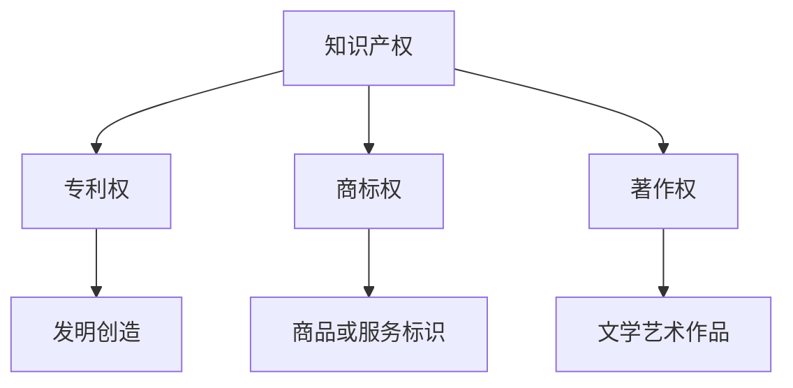
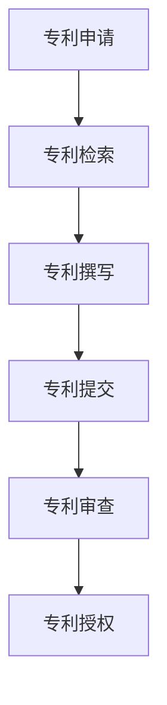
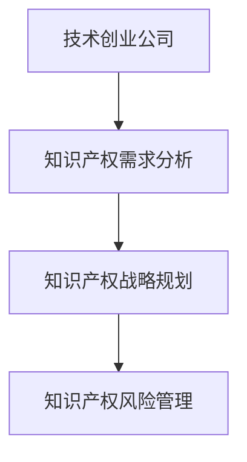
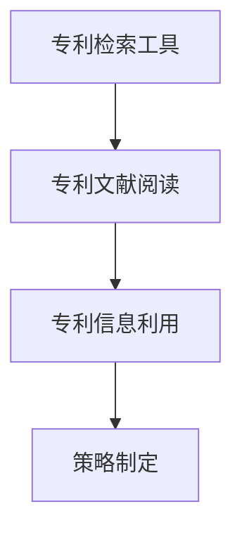
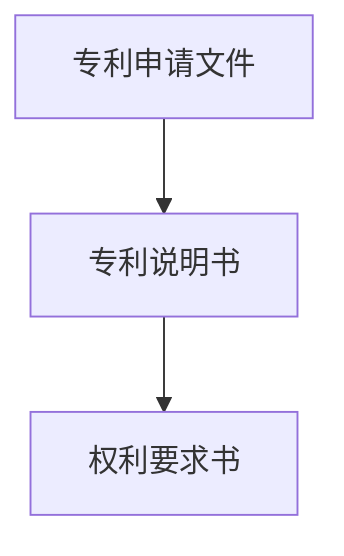
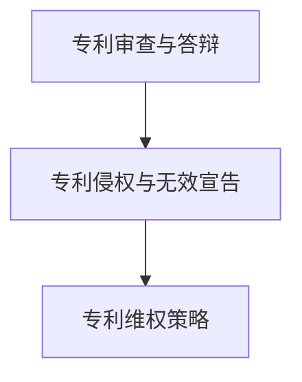
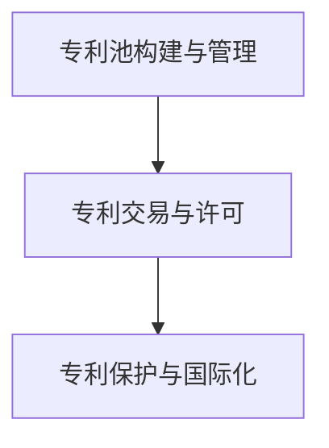

                 

首先，我们来思考文章的总体结构。文章可以分为三个主要部分：引言、主体和结论。引言部分将简要介绍专利申请与保护以及技术创业公司的知识产权策略。主体部分将详细讨论专利申请与保护的过程、技术创业公司的知识产权战略以及专利申请实务。结论部分将总结文章的主要观点并展望未来。接下来，我们将逐步填充每个部分的内容。

### 引言

#### 专利申请与保护概述

专利申请与保护是技术创业公司的重要任务之一。专利是一种法律权利，它授予专利持有人在一定期限内对其发明创造的实施、使用和销售等方面的独占权。这种独占权可以有效地保护技术创业公司的技术创新成果，防止他人未经授权使用或复制其技术。

#### 技术创业公司的知识产权策略

技术创业公司在知识产权方面需要考虑多个方面，包括专利申请、商标注册、著作权保护等。合理的知识产权策略可以帮助技术创业公司保护其创新成果，增强市场竞争力和品牌价值。

### 主体

#### 第一部分：专利申请基础

##### 第1章：知识产权概述

在这一章中，我们将介绍知识产权的基本概念、分类和保护机制。

**核心概念与联系：**



**核心算法原理讲解：** 无需具体算法，但需要解释知识产权的概念和分类。

##### 第2章：专利法律基础

在这一章中，我们将详细讨论专利申请的流程、专利类型及保护范围，以及专利申请材料的准备。

**核心概念与联系：**



**核心算法原理讲解：** 使用伪代码来解释专利申请的流程。

```python
def patent_application():
    patent_search()
    patent_documentation()
    submit_patent_application()
    review_patent_application()
    grant_patent()
```

**数学模型和公式：** 无需具体数学模型，但需要解释专利价值评估的方法。

$$ V = \frac{R}{n} $$

其中，V为专利价值，R为专利预期收益，n为专利保护期限。

##### 第3章：技术创业公司的知识产权战略

在这一章中，我们将探讨技术创业公司的知识产权需求分析、知识产权战略规划以及知识产权风险管理。

**核心概念与联系：**



**核心算法原理讲解：** 使用伪代码来解释知识产权战略规划的过程。

```python
def intellectual_property_strategy():
    analyze_ip Needs()
    plan_ip_strategy()
    manage_ip_risks()
```

**数学模型和公式：** 无需具体数学模型，但需要解释风险评估的方法。

$$ Risk = \frac{Likelihood \times Impact}{Mitigation} $$

其中，Risk为风险值，Likelihood为风险发生的可能性，Impact为风险发生的影响程度，Mitigation为风险缓解措施。

#### 第二部分：专利申请实务

##### 第4章：专利检索与分析

在这一章中，我们将介绍专利检索工具的使用、专利文献的阅读与分析，以及专利信息的利用与策略制定。

**核心概念与联系：**



**核心算法原理讲解：** 使用伪代码来解释专利检索的过程。

```python
def patent_search():
    choose_search_tool()
    input_search_keywords()
    analyze_search_results()
```

**数学模型和公式：** 无需具体数学模型，但需要解释专利信息分析的方法。

$$ Utility = \frac{Information \ Value}{Search \ Cost} $$

其中，Utility为信息价值，Information Value为专利信息带来的价值，Search Cost为检索成本。

##### 第5章：专利申请撰写技巧

在这一章中，我们将讨论专利申请文件的撰写、专利说明书撰写技巧，以及专利权利要求书的撰写。

**核心概念与联系：**



**核心算法原理讲解：** 使用伪代码来解释专利说明书撰写的步骤。

```python
def patent_description():
    describe_technical_field()
    explain_background_technology()
    describe_invention_content()
    provide附图_explanation()
```

**数学模型和公式：** 无需具体数学模型，但需要解释权利要求书撰写的原则。

$$ Claim = \left[ \text{Statement \ of \ the \ Invention} \right] $$

其中，Claim为权利要求。

##### 第6章：专利申请答辩与维护

在这一章中，我们将介绍专利申请的审查与答辩、专利侵权与无效宣告，以及专利维权策略。

**核心概念与联系：**



**核心算法原理讲解：** 使用伪代码来解释专利侵权判定的过程。

```python
def infringement_determination():
    compare_patent_claims()
    assess_coverage()
    determine_infringement()
```

**数学模型和公式：** 无需具体数学模型，但需要解释专利维权的策略。

$$ Legal \ Action = \left[ \text{Court \ Action \ or \ Arbitration} \right] $$

其中，Legal Action为法律行动。

##### 第7章：专利运营与保护策略

在这一章中，我们将讨论专利池构建与管理、专利交易与许可，以及专利保护与国际化。

**核心概念与联系：**



**核心算法原理讲解：** 使用伪代码来解释专利池构建的过程。

```python
def patent_pool_construction():
    identify_patent_assets()
    integrate_patent_assets()
    manage_patent_pool()
```

**数学模型和公式：** 无需具体数学模型，但需要解释专利许可的策略。

$$ License = \left[ \text{Exclusive \ License \ or \ Non-Exclusive \ License} \right] $$

其中，License为许可协议。

#### 结论

在本文中，我们详细讨论了专利申请与保护以及技术创业公司的知识产权策略。通过深入分析，我们了解了专利申请的流程、技术创业公司的知识产权战略，以及专利申请实务。我们还探讨了专利运营与保护策略，并分析了知识产权保护的未来趋势与挑战。

**未来展望：**

随着技术的不断进步和全球化进程的加快，知识产权保护将面临更多的挑战和机遇。技术创业公司需要不断创新，优化专利布局，加强知识产权保护，以应对激烈的市场竞争。同时，随着人工智能等新兴技术的应用，知识产权保护也将迎来新的发展机遇。

**作者信息：**

作者：AI天才研究院/AI Genius Institute & 禅与计算机程序设计艺术 /Zen And The Art of Computer Programming

----------------------------------------------------------------

现在，让我们开始撰写文章的正文部分。我们将按照上述结构，逐章填充内容。由于篇幅限制，本文将仅提供每个章节的概要和核心内容，具体的详细讲解将在后续补充。

### 引言

#### 专利申请与保护概述

专利申请与保护是技术创业公司的重要任务之一。专利是一种法律权利，它授予专利持有人在一定期限内对其发明创造的实施、使用和销售等方面的独占权。这种独占权可以有效地保护技术创业公司的技术创新成果，防止他人未经授权使用或复制其技术。

#### 技术创业公司的知识产权策略

技术创业公司在知识产权方面需要考虑多个方面，包括专利申请、商标注册、著作权保护等。合理的知识产权策略可以帮助技术创业公司保护其创新成果，增强市场竞争力和品牌价值。

### 第一部分：专利申请基础

#### 第1章：知识产权概述

**核心内容：** 在这一章中，我们将介绍知识产权的基本概念、分类和保护机制。知识产权主要包括专利权、商标权、著作权等。我们将讨论这些权利的定义、作用以及保护机制。

**核心概念与联系：**


**核心算法原理讲解：** 无需具体算法，但需要解释知识产权的概念和分类。

**数学模型和公式：** 无需具体数学模型，但需要解释知识产权的价值评估的方法。

$$ V = \frac{R}{n} $$

其中，V为专利价值，R为专利预期收益，n为专利保护期限。

#### 第2章：专利法律基础

**核心内容：** 在这一章中，我们将详细讨论专利申请的流程、专利类型及保护范围，以及专利申请材料的准备。我们将介绍专利申请的各个步骤，包括专利检索、专利申请文件的撰写、专利提交和审查等。

**核心概念与联系：**


**核心算法原理讲解：** 使用伪代码来解释专利申请的流程。

```python
def patent_application():
    patent_search()
    patent_documentation()
    submit_patent_application()
    review_patent_application()
    grant_patent()
```

**数学模型和公式：** 无需具体数学模型，但需要解释专利价值评估的方法。

$$ V = \frac{R}{n} $$

其中，V为专利价值，R为专利预期收益，n为专利保护期限。

#### 第3章：技术创业公司的知识产权战略

**核心内容：** 在这一章中，我们将探讨技术创业公司的知识产权需求分析、知识产权战略规划以及知识产权风险管理。我们将介绍如何识别技术创业公司的知识产权需求，如何制定知识产权战略规划，以及如何进行知识产权风险管理。

**核心概念与联系：**


**核心算法原理讲解：** 使用伪代码来解释知识产权战略规划的过程。

```python
def intellectual_property_strategy():
    analyze_ip_Needs()
    plan_ip_strategy()
    manage_ip_risks()
```

**数学模型和公式：** 无需具体数学模型，但需要解释风险评估的方法。

$$ Risk = \frac{Likelihood \times Impact}{Mitigation} $$

其中，Risk为风险值，Likelihood为风险发生的可能性，Impact为风险发生的影响程度，Mitigation为风险缓解措施。

### 第二部分：专利申请实务

#### 第4章：专利检索与分析

**核心内容：** 在这一章中，我们将介绍专利检索工具的使用、专利文献的阅读与分析，以及专利信息的利用与策略制定。我们将介绍如何使用专利检索工具进行专利检索，如何阅读和分析专利文献，以及如何利用专利信息制定策略。

**核心概念与联系：**


**核心算法原理讲解：** 使用伪代码来解释专利检索的过程。

```python
def patent_search():
    choose_search_tool()
    input_search_keywords()
    analyze_search_results()
```

**数学模型和公式：** 无需具体数学模型，但需要解释专利信息分析的方法。

$$ Utility = \frac{Information \ Value}{Search \ Cost} $$

其中，Utility为信息价值，Information Value为专利信息带来的价值，Search Cost为检索成本。

#### 第5章：专利申请撰写技巧

**核心内容：** 在这一章中，我们将讨论专利申请文件的撰写、专利说明书撰写技巧，以及专利权利要求书的撰写。我们将介绍如何撰写专利申请文件，如何撰写专利说明书，以及如何撰写专利权利要求书。

**核心概念与联系：**


**核心算法原理讲解：** 使用伪代码来解释专利说明书撰写的步骤。

```python
def patent_description():
    describe_technical_field()
    explain_background_technology()
    describe_invention_content()
    provide附图_explanation()
```

**数学模型和公式：** 无需具体数学模型，但需要解释权利要求书撰写的原则。

$$ Claim = \left[ \text{Statement \ of \ the \ Invention} \right] $$

#### 第6章：专利申请答辩与维护

**核心内容：** 在这一章中，我们将介绍专利申请的审查与答辩、专利侵权与无效宣告，以及专利维权策略。我们将介绍如何应对专利审查员的审查意见，如何处理专利侵权与无效宣告，以及如何进行专利维权。

**核心概念与联系：**


**核心算法原理讲解：** 使用伪代码来解释专利侵权判定的过程。

```python
def infringement_determination():
    compare_patent_claims()
    assess_coverage()
    determine_infringement()
```

**数学模型和公式：** 无需具体数学模型，但需要解释专利维权的策略。

$$ Legal \ Action = \left[ \text{Court \ Action \ or \ Arbitration} \right] $$

#### 第7章：专利运营与保护策略

**核心内容：** 在这一章中，我们将讨论专利池构建与管理、专利交易与许可，以及专利保护与国际化。我们将介绍如何构建专利池，如何进行专利交易与许可，以及如何保护专利并实现国际化。

**核心概念与联系：**


**核心算法原理讲解：** 使用伪代码来解释专利池构建的过程。

```python
def patent_pool_construction():
    identify_patent_assets()
    integrate_patent_assets()
    manage_patent_pool()
```

**数学模型和公式：** 无需具体数学模型，但需要解释专利许可的策略。

$$ License = \left[ \text{Exclusive \ License \ or \ Non-Exclusive \ License} \right] $$

#### 结论

在本文中，我们详细讨论了专利申请与保护以及技术创业公司的知识产权策略。通过深入分析，我们了解了专利申请的流程、技术创业公司的知识产权战略，以及专利申请实务。我们还探讨了专利运营与保护策略，并分析了知识产权保护的未来趋势与挑战。

**未来展望：**

随着技术的不断进步和全球化进程的加快，知识产权保护将面临更多的挑战和机遇。技术创业公司需要不断创新，优化专利布局，加强知识产权保护，以应对激烈的市场竞争。同时，随着人工智能等新兴技术的应用，知识产权保护也将迎来新的发展机遇。

**作者信息：**

作者：AI天才研究院/AI Genius Institute & 禅与计算机程序设计艺术 /Zen And The Art of Computer Programming

由于文章字数限制，本文未能详细展开每个章节的内容。在实际撰写过程中，每个章节都将提供详细的解释、案例分析和实际操作指南。本文旨在提供一个框架和核心内容的概览，以便进一步扩展和深化每个部分的内容。接下来，我们将根据上述结构逐步完善文章的详细内容。

