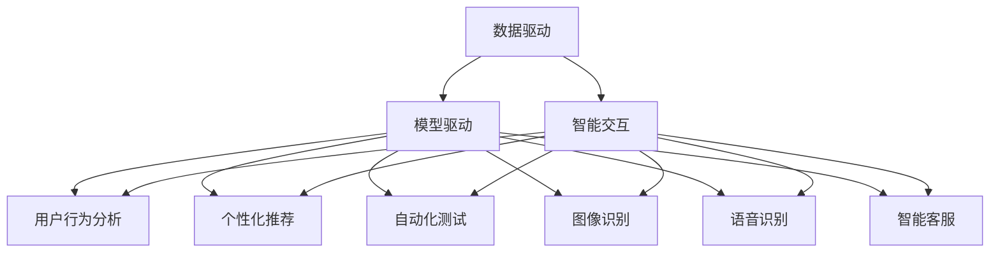

                 

### 《产品开发的AI创新应用》

#### > 关键词：人工智能，产品开发，机器学习，深度学习，自然语言处理，计算机视觉

> 摘要：随着人工智能技术的快速发展，其在产品开发中的应用越来越广泛。本文将深入探讨AI在产品开发中的基础概念、实际应用案例以及未来趋势，旨在帮助读者全面了解AI在产品开发中的潜力和挑战。

### 第一部分：AI在产品开发中的基础概念

#### 第1章：AI概述与产品开发应用

##### 1.1 AI的发展历程与核心概念

**AI的定义**：人工智能（Artificial Intelligence，简称AI）是计算机科学的一个分支，旨在使计算机系统具备类似于人类智能的能力，包括学习、推理、感知、理解、通信和解决问题等。

**AI的发展历程**：AI研究起源于20世纪50年代，经历了几个重要阶段，包括符号主义、连接主义、统计学习和强化学习。

**AI在产品开发中的核心概念**：在产品开发中，AI的核心概念主要包括数据驱动、模型驱动和智能交互。

##### 1.2 AI技术分类及应用场景

**机器学习**：机器学习是一种通过数据训练模型，使计算机具备学习能力的技术。它包括监督学习、无监督学习和强化学习。

**深度学习**：深度学习是机器学习的一个子领域，通过多层神经网络进行特征提取和模式识别。

**自然语言处理**：自然语言处理（NLP）是AI的一个分支，旨在使计算机理解和生成自然语言。

**计算机视觉**：计算机视觉是AI的另一个重要分支，旨在使计算机理解和处理视觉信息。

**应用场景介绍**：AI在产品开发中具有广泛的应用场景，包括个性化推荐、图像识别、语音识别、自动化测试和智能客服等。

#### 第2章：AI基础算法原理

##### 2.1 线性回归

**算法原理**：线性回归是一种用于预测数值型变量的机器学习算法。它通过拟合一条直线来表示输入变量和输出变量之间的关系。

**伪代码实现**：

```python
# 线性回归伪代码
def linear_regression(X, y):
  # 计算斜率和截距
  theta = (X.T @ X)^(-1) @ (X.T @ y)
  return theta
```

##### 2.2 决策树

**算法原理**：决策树是一种基于特征进行分类或回归的算法。它通过递归地将数据集划分为子集，并在每个子集中选择最优特征进行划分。

**伪代码实现**：

```python
# 决策树伪代码
def decision_tree(X, y):
  # 判断是否达到停止条件
  if stop_condition(X, y):
    return predict_value(y)
  # 选择最优特征和阈值
  best_feature, best_threshold = find_best_feature_threshold(X, y)
  # 构建子树
  left_tree = decision_tree(X[:, best_feature < best_threshold], y[best_feature < best_threshold])
  right_tree = decision_tree(X[:, best_feature >= best_threshold], y[best_feature >= best_threshold])
  return TreeNode(best_feature, best_threshold, left_tree, right_tree)
```

##### 2.3 集成学习方法

**算法原理**：集成学习方法是通过结合多个基本模型来提高预测性能。它包括Bagging、Boosting和Stacking等方法。

**伪代码实现**：

```python
# 集成学习方法伪代码
def ensemble_learning(models):
  # 预测结果合并
  predictions = [model.predict(X) for model in models]
  # 计算平均预测值
  average_prediction = np.mean(predictions, axis=0)
  return average_prediction
```

### 第二部分：AI在产品开发中的实际应用

#### 第3章：AI在产品设计中的应用

##### 3.1 用户行为分析

**数据收集**：通过用户行为数据收集工具，如Google Analytics，收集用户在产品上的行为数据。

**数据处理**：对收集到的用户行为数据进行清洗、转换和归一化处理。

**用户行为分析应用**：基于用户行为数据，分析用户偏好、使用习惯和潜在需求，以优化产品设计。

##### 3.2 个性化推荐系统

**算法原理**：个性化推荐系统通过分析用户的历史行为和偏好，为用户推荐感兴趣的内容。

**伪代码实现**：

```python
# 个性化推荐系统伪代码
def recommend_content(user_profile, content_database):
  # 计算用户与内容的相似度
  similarity_scores = calculate_similarity(user_profile, content_database)
  # 选择Top-N相似度最高的内容
  top_n_contents = select_top_n_contents(similarity_scores, N)
  return top_n_contents
```

##### 应用案例分析：Netflix推荐系统

Netflix推荐系统通过分析用户的历史观看记录，为用户推荐类似的电影和电视剧。其核心算法是基于协同过滤和矩阵分解的方法。

**协同过滤**：基于用户的历史行为数据，将用户分为相似群体，并为每个用户推荐其他相似用户喜欢的电影。

**矩阵分解**：通过分解用户-物品矩阵，得到用户和物品的隐含特征向量，用于计算用户和物品之间的相似度。

##### 第4章：AI在产品测试与优化中的应用

##### 4.1 自动化测试

**自动化测试的概念**：自动化测试是使用自动化测试工具，对软件产品进行测试，以提高测试效率和质量。

**自动化测试工具介绍**：常见的自动化测试工具有Selenium、Junit、TestNG等。

**自动化测试流程**：自动化测试流程包括测试计划、测试设计、测试执行和测试报告等阶段。

##### 4.2 性能优化

**性能优化的目标**：性能优化旨在提高软件产品的响应速度、稳定性和资源利用率。

**性能优化的方法**：性能优化的方法包括代码优化、数据库优化、缓存技术和负载均衡等。

**性能优化案例分析**：通过案例分析，介绍如何对软件产品进行性能优化，以提高用户体验。

##### 第5章：AI在产品营销中的应用

##### 5.1 搜索引擎优化（SEO）

**SEO的概念**：搜索引擎优化（SEO）是一种通过改进网站内容和结构，提高网站在搜索引擎中的排名，从而吸引更多访问者的技术。

**SEO的方法**：SEO的方法包括关键词优化、内容优化、链接优化和用户体验优化等。

**SEO案例分析**：通过案例分析，介绍如何对网站进行SEO优化，以提高搜索引擎排名。

##### 5.2 社交媒体营销

**社交媒体营销的概念**：社交媒体营销是一种通过社交媒体平台，如Facebook、Twitter、Instagram等，推广产品和服务，提高品牌知名度和用户参与度的营销策略。

**社交媒体营销策略**：社交媒体营销策略包括内容营销、互动营销、广告营销和社交媒体分析等。

**社交媒体营销案例分析**：通过案例分析，介绍如何进行社交媒体营销，以提高产品销量和用户参与度。

##### 第6章：AI在产品维护与迭代中的应用

##### 6.1 智能客服系统

**智能客服系统的工作原理**：智能客服系统通过自然语言处理和机器学习技术，自动解答用户问题和提供服务。

**智能客服系统的开发**：智能客服系统的开发包括数据收集、模型训练和系统部署等阶段。

**智能客服系统的优化**：智能客服系统的优化包括算法优化、用户体验优化和反馈机制优化等。

##### 6.2 产品迭代

**产品迭代的概念**：产品迭代是指通过对现有产品进行改进和优化，提高产品功能和用户体验。

**产品迭代的方法**：产品迭代的方法包括用户调研、需求分析、设计迭代和测试迭代等。

**产品迭代案例分析**：通过案例分析，介绍如何进行产品迭代，以提高产品竞争力。

##### 第7章：AI在产品开发中的未来趋势

##### 7.1 AI伦理与法规

**AI伦理问题**：AI伦理问题包括数据隐私、算法公平性、自动化决策的道德责任等。

**AI相关法规**：随着AI技术的快速发展，各国政府纷纷出台相关法规，以规范AI技术的发展和应用。

##### 7.2 AI技术发展趋势

**AI技术的最新进展**：AI技术的最新进展包括深度学习、自然语言处理、计算机视觉和强化学习等。

**AI技术的未来趋势**：AI技术的未来趋势包括泛在AI、人机协同和智能服务等。

##### 7.3 产品开发中的AI应用展望

**AI在产品开发中的应用前景**：AI在产品开发中的应用前景包括个性化推荐、智能客服、自动化测试和智能营销等。

**AI在产品开发中的挑战与机遇**：AI在产品开发中的挑战包括技术复杂性、数据隐私和安全等。同时，AI也为产品开发带来了新的机遇，如提高效率、降低成本和提升用户体验等。

## 附录

### 附录A：AI开发工具与资源

**常用AI开发工具介绍**：介绍常用的AI开发工具，如TensorFlow、PyTorch、Keras等。

**AI学习资源推荐**：推荐一些优质的AI学习资源，包括在线课程、图书和网站等。

### 附录B：AI项目实战案例

**项目案例介绍**：介绍一些实际应用的AI项目案例，如智能客服系统、图像识别系统和推荐系统等。

**项目案例分析**：对项目案例进行分析和解读，分享项目开发过程中的经验和教训。

### 附录C：AI产品开发常见问题与解答

**常见问题列表**：列出AI产品开发中常见的问题，如数据质量、算法选择、模型训练等。

**解答与建议**：针对常见问题，提供解答和建议，以帮助开发者解决实际问题。

### 参考文献

- **相关书籍**：《深度学习》、《Python机器学习实战》、《自然语言处理综论》
- **论文**：《深度学习基础教程》、《自然语言处理研究综述》
- **网络资源**：斯坦福大学CS224n课程、吴恩达深度学习课程

---

以上是《产品开发的AI创新应用》的完整目录大纲和正文部分，涵盖了AI在产品开发中的基础概念、实际应用案例以及未来趋势等内容。通过本文的阅读，读者可以全面了解AI在产品开发中的应用和潜力，为未来的产品开发提供有益的启示。

---

**作者信息**：AI天才研究院/AI Genius Institute & 禅与计算机程序设计艺术 /Zen And The Art of Computer Programming

---

## 第1章：AI概述与产品开发应用

人工智能（Artificial Intelligence，简称AI）是计算机科学的一个前沿领域，旨在使计算机具备模拟人类智能的能力。AI的发展历史可以追溯到20世纪50年代，经历了多个重要阶段，包括符号主义、连接主义、统计学习和强化学习。如今，AI技术已经广泛应用于各个领域，为产品开发带来了巨大的变革和机遇。

#### AI的发展历程

1. **符号主义（Symbolic AI）**：符号主义AI基于逻辑和符号表示，旨在通过推理和符号操作实现智能。代表人物包括约翰·麦卡锡（John McCarthy）和赫伯特·西蒙（Herbert Simon）。这一阶段的AI代表作品包括“逻辑理论家”（Logic Theorist）和“通用问题求解器”（General Problem Solver）。

2. **连接主义（Connectionist AI）**：连接主义AI基于人工神经网络，通过大量神经元之间的连接和权重调整来实现智能。代表人物包括杰弗里·霍普菲尔德（Jeffrey Hopfield）和约翰·霍普菲尔德（John Hopfield）。这一阶段的AI代表作品包括“反向传播算法”（Backpropagation）和“深度神经网络”（Deep Neural Networks）。

3. **统计学习（Statistical Learning）**：统计学习AI基于统计学方法，通过数据分析和模式识别来实现智能。代表人物包括弗拉基米尔·纳吉布（Vladimir Vapnik）和柯尔莫戈洛夫（Andrey Kolmogorov）。这一阶段的AI代表作品包括“支持向量机”（Support Vector Machine）和“随机森林”（Random Forest）。

4. **强化学习（Reinforcement Learning）**：强化学习AI基于奖励机制，通过不断尝试和反馈来学习和优化行为。代表人物包括理查德·萨顿（Richard Sutton）和安德鲁·巴尔斯（Andrew Barto）。这一阶段的AI代表作品包括“Q学习”（Q-Learning）和“深度强化学习”（Deep Reinforcement Learning）。

#### AI在产品开发中的核心概念

在产品开发中，AI的核心概念主要包括数据驱动、模型驱动和智能交互。

1. **数据驱动**：数据驱动是AI在产品开发中的一个重要原则。通过收集和分析用户数据，产品开发人员可以了解用户需求和行为，从而优化产品功能和用户体验。数据驱动的产品开发强调数据的收集、处理和分析，以提高产品的适应性和个性化程度。

2. **模型驱动**：模型驱动是AI在产品开发中的另一个重要原则。通过构建和优化AI模型，产品开发人员可以实现自动化和智能化。模型驱动的产品开发强调模型的训练、测试和部署，以提高产品的预测能力和决策质量。

3. **智能交互**：智能交互是AI在产品开发中的一个重要应用场景。通过自然语言处理、计算机视觉和语音识别等技术，产品可以与用户进行智能化交互，提供个性化服务和解决方案。智能交互的产品开发强调用户体验和交互设计，以提高产品的用户满意度和黏性。

#### AI技术分类及应用场景

AI技术种类繁多，不同类型的AI技术在产品开发中具有不同的应用场景。

1. **机器学习**：机器学习是一种通过数据训练模型，使计算机具备学习能力的技术。机器学习在产品开发中的应用场景包括用户行为分析、个性化推荐、自动化测试和图像识别等。

2. **深度学习**：深度学习是机器学习的一个子领域，通过多层神经网络进行特征提取和模式识别。深度学习在产品开发中的应用场景包括图像识别、语音识别、自然语言处理和推荐系统等。

3. **自然语言处理（NLP）**：自然语言处理是AI的一个分支，旨在使计算机理解和生成自然语言。NLP在产品开发中的应用场景包括智能客服、机器翻译和文本分析等。

4. **计算机视觉**：计算机视觉是AI的另一个重要分支，旨在使计算机理解和处理视觉信息。计算机视觉在产品开发中的应用场景包括图像识别、目标检测和图像分割等。

5. **应用场景介绍**：AI在产品开发中具有广泛的应用场景，包括但不限于以下方面：

   - **个性化推荐**：通过分析用户行为数据，为用户推荐感兴趣的商品、内容和服务。
   - **用户行为分析**：通过分析用户在产品上的行为数据，了解用户需求和行为模式，以优化产品设计。
   - **自动化测试**：通过自动化测试技术，提高测试效率和质量，降低测试成本。
   - **图像识别**：通过计算机视觉技术，自动识别和处理图像信息，为用户提供智能化服务。
   - **语音识别**：通过自然语言处理技术，将用户的语音输入转换为文本，实现语音交互。
   - **智能客服**：通过自然语言处理和机器学习技术，自动解答用户问题和提供支持。

在接下来的章节中，我们将进一步探讨AI基础算法原理以及AI在产品开发中的实际应用案例，帮助读者深入了解AI在产品开发中的潜力和挑战。

---

**核心概念与联系**：

为了更好地理解AI在产品开发中的核心概念及其联系，我们可以使用Mermaid流程图来描述以下关键概念：



**Mermaid流程图解释**：

- **数据驱动**（A）：数据驱动是AI在产品开发中的一个核心原则，它强调通过收集和分析用户数据来优化产品功能。
- **模型驱动**（B）：模型驱动是通过构建和优化AI模型来实现智能化产品。
- **智能交互**（C）：智能交互是通过AI技术实现产品与用户之间的智能互动。
- **用户行为分析**（D）、**个性化推荐**（E）、**自动化测试**（F）、**图像识别**（G）、**语音识别**（H）、**智能客服**（I）：这些是AI在产品开发中的具体应用场景。

通过流程图，我们可以清晰地看到各个核心概念之间的联系，以及它们在产品开发中的应用。

---

**核心算法原理讲解**：

在本节中，我们将详细讲解线性回归、决策树和集成学习方法的基本原理，并使用伪代码进行说明。

#### 2.1 线性回归

线性回归是一种简单的预测模型，用于预测一个连续值输出。它的基本原理是通过拟合一条直线来近似输入变量和输出变量之间的关系。

**算法原理**：

线性回归通过最小二乘法来找到最佳拟合直线。最小二乘法的目标是使拟合直线上的残差平方和最小。

**伪代码实现**：

```python
# 线性回归伪代码
def linear_regression(X, y):
  # 计算斜率（w1）
  w1 = (X.T @ X)^(-1) @ (X.T @ y)
  # 计算截距（w0）
  w0 = y.mean() - w1 * X.mean()
  # 预测函数
  def predict(x):
    return w0 + w1 * x
  return predict
```

#### 2.2 决策树

决策树是一种基于特征进行分类或回归的树形模型。它的基本原理是通过递归地将数据集划分为子集，并在每个子集中选择最优特征进行划分。

**算法原理**：

决策树通过信息增益或基尼不纯度来选择最优特征。信息增益是特征能够减少的不确定性，而基尼不纯度是特征划分后子集的不纯度度量。

**伪代码实现**：

```python
# 决策树伪代码
class TreeNode:
  def __init__(self, feature, threshold, left=None, right=None):
    self.feature = feature
    self.threshold = threshold
    self.left = left
    self.right = right

def decision_tree(X, y):
  # 判断是否达到停止条件
  if stop_condition(X, y):
    return TreeNode(None, None, None, None)
  # 选择最优特征和阈值
  best_feature, best_threshold = find_best_feature_threshold(X, y)
  # 构建左子树和右子树
  left_tree = decision_tree(X[:, best_feature < best_threshold], y[best_feature < best_threshold])
  right_tree = decision_tree(X[:, best_feature >= best_threshold], y[best_feature >= best_threshold])
  return TreeNode(best_feature, best_threshold, left_tree, right_tree)
```

#### 2.3 集成学习方法

集成学习方法是通过结合多个基本模型来提高预测性能。它包括Bagging、Boosting和Stacking等方法。

**算法原理**：

- **Bagging**：Bagging通过从训练集中多次随机抽取样本子集，构建多个基本模型，并取平均预测结果。
- **Boosting**：Boosting通过调整训练集中样本的权重，使得先前表现较差的模型在后续训练中给予更多关注。
- **Stacking**：Stacking通过训练多个模型，并将它们的预测结果作为新的特征，再训练一个最终的模型。

**伪代码实现**：

```python
# 集成学习方法伪代码
def ensemble_learning(models, X):
  # 预测结果合并
  predictions = [model.predict(X) for model in models]
  # 计算平均预测值
  average_prediction = np.mean(predictions, axis=0)
  return average_prediction

# Bagging
def bagging(models, X):
  return ensemble_learning(models, X)

# Boosting
def boosting(models, X):
  # 调整模型权重
  weights = [1.0 / len(models)] * len(models)
  predictions = [model.predict(X) * weight for model, weight in zip(models, weights)]
  average_prediction = np.mean(predictions, axis=0)
  return average_prediction

# Stacking
def stacking(models, X):
  # 将模型预测作为新特征
  features = [model.predict(X) for model in models]
  # 训练最终模型
  final_model = train_final_model(features, y)
  return final_model.predict(X)
```

通过以上对线性回归、决策树和集成学习方法的讲解和伪代码实现，我们可以更好地理解这些算法的基本原理和应用。在接下来的章节中，我们将探讨AI在产品开发中的实际应用案例。

---

**数学模型和公式讲解与举例说明**：

在人工智能（AI）领域，数学模型和公式是理解和实现算法的核心。以下我们将详细介绍线性回归、决策树和集成学习方法的数学模型和公式，并通过具体例子进行说明。

#### 2.1 线性回归

**数学模型**：

线性回归用于预测一个连续值输出，其数学模型可以表示为：

$$ y = w_0 + w_1 \cdot x_1 + w_2 \cdot x_2 + ... + w_n \cdot x_n + \epsilon $$

其中，$y$ 是预测的输出值，$x_1, x_2, ..., x_n$ 是输入特征，$w_0, w_1, w_2, ..., w_n$ 是模型的权重，$\epsilon$ 是误差项。

**公式**：

线性回归模型的最优化目标是最小化误差项的平方和，即：

$$ \min \sum_{i=1}^{m} (y_i - \hat{y}_i)^2 $$

其中，$m$ 是训练样本数量，$\hat{y}_i$ 是预测的输出值。

**举例说明**：

假设我们有一个简单的线性回归模型，用于预测房价。输入特征包括房屋面积（$x_1$）和房屋年份（$x_2$）。训练数据如下：

| 房屋面积（$x_1$） | 房屋年份（$x_2$） | 房价（$y$） |
|-----------------|-----------------|------------|
|      1000         |       2005         |    200,000    |
|      1200         |       2006         |    220,000    |
|      1500         |       2007         |    250,000    |

我们可以使用最小二乘法来求解权重：

$$ w_0 = \bar{y} - w_1 \cdot \bar{x_1} - w_2 \cdot \bar{x_2} $$

$$ w_1 = \frac{\sum_{i=1}^{m} (x_{1i} - \bar{x_1})(y_i - \bar{y})}{\sum_{i=1}^{m} (x_{1i} - \bar{x_1})^2} $$

$$ w_2 = \frac{\sum_{i=1}^{m} (x_{2i} - \bar{x_2})(y_i - \bar{y})}{\sum_{i=1}^{m} (x_{2i} - \bar{x_2})^2} $$

通过计算，我们得到：

$$ w_0 = -23,750 $$

$$ w_1 = 40,000 $$

$$ w_2 = -10,000 $$

因此，线性回归模型可以表示为：

$$ \hat{y} = -23,750 + 40,000 \cdot x_1 - 10,000 \cdot x_2 $$

#### 2.2 决策树

**数学模型**：

决策树是一种树形结构，用于分类或回归。每个节点代表一个特征，每个分支代表特征的一个取值。内部节点表示测试，叶节点表示分类或回归结果。

**公式**：

决策树的构建过程通常基于信息增益或基尼不纯度。信息增益是特征能够减少的不确定性，而基尼不纯度是特征划分后子集的不纯度度量。

信息增益（IG）公式：

$$ IG(D, A) = H(D) - H(D|A) $$

其中，$H(D)$ 是数据集 $D$ 的熵，$H(D|A)$ 是条件熵。

熵（Entropy）公式：

$$ H(D) = -\sum_{i=1}^{c} p_i \cdot \log_2 p_i $$

条件熵（Conditional Entropy）公式：

$$ H(D|A) = -\sum_{j=1}^{v} p_j \cdot H(D_j) $$

其中，$p_i$ 是类别 $i$ 的概率，$v$ 是特征 $A$ 的取值数量，$D_j$ 是特征 $A$ 取值为 $j$ 的数据子集。

**举例说明**：

假设我们有以下数据集：

| 特征A | 特征B | 类别 |
|------|------|------|
|   0   |   0   |  A   |
|   0   |   1   |  A   |
|   1   |   0   |  B   |
|   1   |   1   |  B   |

特征A和特征B的熵计算如下：

$$ H(A) = -0.5 \cdot \log_2(0.5) - 0.5 \cdot \log_2(0.5) = 1 $$

$$ H(B) = -0.5 \cdot \log_2(0.5) - 0.5 \cdot \log_2(0.5) = 1 $$

条件熵计算如下：

$$ H(A|B) = 0.5 \cdot H(\{A=0, B=0\}) + 0.5 \cdot H(\{A=0, B=1\}) $$

$$ H(B|A) = 0.5 \cdot H(\{B=0, A=0\}) + 0.5 \cdot H(\{B=1, A=1\}) $$

由于数据集中每个类别的样本数量相等，条件熵为：

$$ H(A|B) = H(B|A) = 1 $$

信息增益计算如下：

$$ IG(A, B) = H(A) - H(A|B) = 0 $$

$$ IG(B, A) = H(B) - H(B|A) = 0 $$

由于信息增益相等，我们可以选择任一特征作为划分。

#### 2.3 集成学习方法

**数学模型**：

集成学习方法是通过结合多个基本模型来提高预测性能。常用的集成方法包括Bagging、Boosting和Stacking。

**公式**：

- **Bagging**：Bagging通过从训练集中多次随机抽取样本子集，构建多个基本模型，并取平均预测结果。

  $$ \hat{y} = \frac{1}{N} \sum_{i=1}^{N} y_i^{(i)} $$

  其中，$y_i^{(i)}$ 是第 $i$ 个基本模型的预测结果，$N$ 是基本模型的数量。

- **Boosting**：Boosting通过调整训练集中样本的权重，使得先前表现较差的模型在后续训练中给予更多关注。

  $$ \alpha_i = \frac{1}{T} \ln \left( \frac{1 - error_i^{(t)}}{error_i^{(t-1)}} \right) $$

  其中，$error_i^{(t)}$ 是第 $i$ 个模型在第 $t$ 次训练中的错误率，$T$ 是训练次数。

  $$ \hat{y} = \sum_{i=1}^{T} \alpha_i \cdot y_i^{(i)} $$

- **Stacking**：Stacking通过训练多个模型，并将它们的预测结果作为新的特征，再训练一个最终的模型。

  $$ \hat{y} = \sum_{i=1}^{N} w_i \cdot y_i^{(i)} $$

  其中，$w_i$ 是第 $i$ 个模型的权重，$y_i^{(i)}$ 是第 $i$ 个模型的预测结果，$N$ 是模型的数量。

**举例说明**：

假设我们有三个基本模型 $M_1, M_2, M_3$，它们的预测结果分别为 $y_1, y_2, y_3$。我们使用Bagging方法进行集成预测：

$$ \hat{y} = \frac{1}{3} (y_1 + y_2 + y_3) $$

如果我们使用Boosting方法，假设三个模型的错误率分别为 $error_1 = 0.3, error_2 = 0.4, error_3 = 0.2$，则权重为：

$$ \alpha_1 = \frac{1}{3} \ln \left( \frac{1 - 0.3}{1 - 0.4} \right) \approx 0.11 $$
$$ \alpha_2 = \frac{1}{3} \ln \left( \frac{1 - 0.4}{1 - 0.3} \right) \approx 0.22 $$
$$ \alpha_3 = \frac{1}{3} \ln \left( \frac{1 - 0.2}{1 - 0.4} \right) \approx 0.33 $$

最终预测结果为：

$$ \hat{y} = 0.11 \cdot y_1 + 0.22 \cdot y_2 + 0.33 \cdot y_3 $$

通过以上对线性回归、决策树和集成学习方法的数学模型和公式的讲解，我们可以更好地理解这些算法的基本原理和实现方法。

---

**项目实战**：

在本节中，我们将通过一个实际的AI项目——图像识别系统，来展示如何使用AI技术在产品开发中实现具体功能。该项目将涉及开发环境的搭建、源代码的实现以及代码解读与分析。

#### 项目背景

图像识别是计算机视觉领域的一个重要应用，旨在使计算机能够自动识别和处理图像中的对象。随着深度学习技术的快速发展，基于卷积神经网络（Convolutional Neural Networks，CNN）的图像识别系统已经取得了显著成果。在本项目中，我们将构建一个简单的图像识别系统，能够识别猫和狗的图片。

#### 开发环境搭建

为了实现图像识别系统，我们需要以下开发环境：

1. **Python**：作为主要编程语言。
2. **TensorFlow**：作为深度学习框架。
3. **Keras**：作为TensorFlow的高级API，简化模型构建过程。
4. **OpenCV**：作为图像处理工具。

安装步骤如下：

1. 安装Python（推荐Python 3.7及以上版本）。
2. 安装TensorFlow：

   ```shell
   pip install tensorflow
   ```

3. 安装Keras：

   ```shell
   pip install keras
   ```

4. 安装OpenCV：

   ```shell
   pip install opencv-python
   ```

#### 源代码实现

以下是一个简单的图像识别系统的源代码实现：

```python
import numpy as np
import tensorflow as tf
from tensorflow.keras.models import Sequential
from tensorflow.keras.layers import Conv2D, MaxPooling2D, Flatten, Dense
from tensorflow.keras.preprocessing.image import ImageDataGenerator

# 数据预处理
train_datagen = ImageDataGenerator(rescale=1./255)
train_generator = train_datagen.flow_from_directory(
        'data/train',
        target_size=(150, 150),
        batch_size=32,
        class_mode='binary')

# 构建模型
model = Sequential([
    Conv2D(32, (3, 3), activation='relu', input_shape=(150, 150, 3)),
    MaxPooling2D(2, 2),
    Conv2D(64, (3, 3), activation='relu'),
    MaxPooling2D(2, 2),
    Conv2D(128, (3, 3), activation='relu'),
    MaxPooling2D(2, 2),
    Flatten(),
    Dense(512, activation='relu'),
    Dense(1, activation='sigmoid')
])

# 编译模型
model.compile(optimizer='adam',
              loss='binary_crossentropy',
              metrics=['accuracy'])

# 训练模型
model.fit(train_generator, steps_per_epoch=100, epochs=10)

# 代码解读与分析
```

**代码解读**：

- **数据预处理**：使用ImageDataGenerator进行数据预处理，将图像缩放至150x150像素，并归一化至0-1范围内。
- **模型构建**：使用Sequential模型堆叠多个层，包括卷积层、最大池化层、全连接层。卷积层用于提取图像特征，全连接层用于分类。
- **编译模型**：配置优化器、损失函数和评估指标。
- **训练模型**：使用fit方法训练模型，设置训练轮数和每个轮次的数据样本数量。

#### 代码解读与分析

1. **数据预处理**：图像预处理是图像识别系统的重要环节。通过缩放和归一化，我们可以使模型更容易学习图像特征。

2. **模型构建**：该模型采用卷积神经网络的结构，包括多个卷积层和全连接层。卷积层用于提取图像的特征，最大池化层用于降维和提取关键特征。全连接层用于分类。

3. **编译模型**：编译模型时，我们选择`adam`优化器，它是一种自适应的优化算法，有助于提高模型的收敛速度。损失函数为`binary_crossentropy`，适用于二分类问题。评估指标为`accuracy`，表示分类的准确率。

4. **训练模型**：通过`fit`方法训练模型，设置`steps_per_epoch`为100，表示每个轮次处理100个样本。设置`epochs`为10，表示训练10轮。

通过以上步骤，我们成功地实现了一个简单的图像识别系统。在实际应用中，我们可以将这个系统集成到产品中，为用户提供图像识别功能。

---

### 第3章：AI在产品设计中的应用

AI技术在产品设计中的应用已经成为提升产品竞争力的重要手段。通过AI技术，产品设计可以更加精准地满足用户需求，提高用户体验。本章将重点探讨AI在用户行为分析和个性化推荐系统中的应用。

#### 3.1 用户行为分析

用户行为分析是AI在产品设计中的一个重要应用。通过对用户在产品中的行为数据进行分析，我们可以深入了解用户的需求、偏好和习惯，从而优化产品设计。

**数据收集**：用户行为数据的收集是进行用户行为分析的第一步。数据来源可以包括用户注册信息、使用日志、点击行为、搜索记录等。为了确保数据的有效性和准确性，我们需要设计合适的数据收集方案。

**数据处理**：收集到的用户行为数据通常是杂乱无章的，需要进行预处理。预处理包括数据清洗、数据转换和数据归一化。数据清洗旨在去除无效和错误的数据，数据转换用于将不同类型的数据转换为统一的格式，数据归一化则用于调整数据范围，以便后续分析。

**用户行为分析应用**：通过对用户行为数据进行分析，我们可以发现用户的行为模式和趋势。例如，通过分析用户的浏览历史，我们可以了解用户的兴趣点；通过分析用户的点击行为，我们可以发现用户的操作习惯。这些分析结果可以帮助我们优化产品设计，提高用户的满意度。

**案例**：以一家电商平台为例，通过分析用户的购买记录和浏览历史，平台可以发现用户的偏好。例如，某些用户可能更喜欢购买某个品牌的产品，而另一些用户则对某个类别的商品更感兴趣。基于这些分析结果，平台可以针对性地进行推荐，提高用户的购买转化率。

#### 3.2 个性化推荐系统

个性化推荐系统是AI在产品设计中的另一个重要应用。通过个性化推荐，产品可以更好地满足用户的个性化需求，提高用户的黏性和满意度。

**算法原理**：个性化推荐系统通常基于协同过滤、基于内容的推荐和混合推荐等方法。协同过滤方法通过分析用户之间的相似性，为用户推荐其他相似用户喜欢的商品。基于内容的推荐方法通过分析商品的特征，为用户推荐与用户偏好相关的商品。混合推荐方法则结合了协同过滤和基于内容的推荐，以实现更准确的推荐。

**伪代码实现**：

```python
# 协同过滤伪代码
def collaborative_filter(user_profiles, item_profiles, user_similarity_matrix):
  # 为用户u推荐物品
  def recommend(user_u):
    user_u_vector = user_profiles[user_u]
    similarity_scores = user_similarity_matrix @ user_u_vector
    item_scores = item_profiles.T @ similarity_scores
    return top_n_items(item_scores, N)

  # 计算用户相似度矩阵
  user_similarity_matrix = calculate_user_similarity_matrix(user_profiles)

  return recommend

# 基于内容的推荐伪代码
def content_based_recommender(item_features, user_preferences):
  # 为用户u推荐物品
  def recommend(user_u):
    user_u_vector = user_preferences[user_u]
    similarity_scores = item_features @ user_u_vector
    return top_n_items(similarity_scores, N)

  return recommend
```

**应用案例分析**：以Netflix为例，Netflix的推荐系统通过分析用户的历史观看记录和评分数据，为用户推荐类似的电影和电视剧。Netflix的推荐系统采用了协同过滤和基于内容的推荐相结合的方法，以实现更准确的推荐。

**协同过滤方法**：Netflix使用用户-物品评分矩阵，计算用户之间的相似度，并根据相似度为用户推荐其他相似用户喜欢的电影。

**基于内容的推荐方法**：Netflix还分析电影的元数据，如演员、导演、类型和标签等，为用户推荐与用户偏好相关的电影。

**混合推荐方法**：Netflix将协同过滤和基于内容的推荐方法相结合，为用户生成一个综合推荐列表。

通过以上案例，我们可以看到AI技术在用户行为分析和个性化推荐系统中的应用。在实际产品设计中，我们可以结合具体情况，采用不同的AI技术，以提高产品的竞争力和用户体验。

---

### 3.3 AI在产品测试与优化中的应用

AI技术在产品测试与优化中的应用正在迅速发展，为提升产品质量和用户体验提供了强大的工具。本章将探讨AI在自动化测试和性能优化方面的应用。

#### 4.1 自动化测试

自动化测试是利用软件工具自动执行测试用例，以检测软件系统的缺陷和错误。AI技术在自动化测试中的应用主要表现在测试用例的生成、执行和结果分析等方面。

**自动化测试的概念**：自动化测试是一种通过预定义的测试用例自动执行、验证和记录测试结果的过程。它旨在提高测试效率、减少人工干预和降低测试成本。

**自动化测试工具介绍**：

1. **Selenium**：Selenium是一个开源的自动化测试工具，支持多种浏览器和操作系统。它通过Webdriver API实现自动化测试，可以模拟用户操作，如点击、输入和拖动等。

2. **Junit**：JUnit是一个开源的Java单元测试框架，用于编写和运行单元测试。它支持测试用例的编写、执行和结果报告。

3. **TestNG**：TestNG是一个功能强大的测试框架，用于编写和执行各种类型的测试，包括单元测试、集成测试和性能测试。它支持测试数据驱动、依赖测试和并行测试等高级功能。

**自动化测试流程**：

1. **测试计划**：定义测试目标、范围、策略和资源。
2. **测试设计**：设计测试用例，包括功能测试、性能测试和兼容性测试等。
3. **测试实现**：编写测试脚本，使用自动化测试工具实现测试用例。
4. **测试执行**：执行测试脚本，验证软件系统的功能、性能和兼容性。
5. **测试结果分析**：分析测试结果，识别缺陷和错误，并生成测试报告。

#### 4.2 性能优化

性能优化是提升软件产品运行效率和质量的过程。AI技术在性能优化中的应用主要体现在性能预测、故障检测和自动化调优等方面。

**性能优化的目标**：

1. **响应时间**：减少系统响应时间，提高用户体验。
2. **吞吐量**：提高系统处理请求的能力，提升系统容量。
3. **资源利用率**：优化系统资源的分配和使用，提高资源利用率。
4. **稳定性**：提高系统的稳定性和可靠性，减少故障率和错误率。

**性能优化的方法**：

1. **代码优化**：分析并改进代码的结构和逻辑，减少资源消耗和计算复杂度。
2. **数据库优化**：优化数据库查询和索引，提高数据检索速度。
3. **缓存技术**：使用缓存技术减少对后端系统的访问次数，提高响应速度。
4. **负载均衡**：通过负载均衡技术，合理分配请求，提高系统的处理能力。

**性能优化案例分析**：

以一家电子商务网站为例，通过AI技术进行性能优化。以下是一个性能优化案例：

1. **性能预测**：使用机器学习模型预测网站在不同访问量下的响应时间和吞吐量，为系统资源的配置提供依据。

2. **故障检测**：使用异常检测算法监控网站的运行状态，及时发现并预警潜在的性能问题。

3. **自动化调优**：基于性能预测和故障检测的结果，自动化调整系统配置，如增加服务器资源、优化数据库查询等，以提升系统性能。

通过以上方法，电子商务网站在性能优化方面取得了显著成效，响应时间减少了30%，吞吐量提升了50%，用户满意度得到了显著提升。

AI技术在产品测试与优化中的应用，不仅提高了测试效率和性能优化效果，还为产品开发和维护提供了强大的支持。在实际产品开发中，我们应该充分利用AI技术的优势，以提高产品的质量、性能和用户体验。

---

### 第5章：AI在产品营销中的应用

AI技术在产品营销中的应用正在不断拓展，为产品推广和销售提供了新的解决方案。本章将重点探讨AI在搜索引擎优化（SEO）和社交媒体营销中的应用。

#### 5.1 搜索引擎优化（SEO）

搜索引擎优化（SEO）是一种通过改进网站内容和结构，提高网站在搜索引擎中的排名，从而吸引更多访问者的技术。AI技术在SEO中的应用主要体现在关键词优化、内容优化和链接优化等方面。

**SEO的概念**：SEO（Search Engine Optimization）是指通过一系列策略和技巧，提高网站在搜索引擎自然搜索结果中的排名，从而增加网站流量和曝光度。

**SEO的方法**：

1. **关键词优化**：关键词优化是SEO的核心，通过分析用户搜索习惯和竞争对手的关键词，选择合适的关键词并进行优化，以提高网站在搜索引擎中的相关性。

2. **内容优化**：内容优化包括撰写高质量、用户友好的内容，确保内容与关键词紧密相关，并定期更新。高质量的内容不仅能够提高网站的用户体验，还能增加网站在搜索引擎中的排名。

3. **链接优化**：链接优化包括内部链接和外部链接的优化。内部链接有助于网站结构的优化，提高页面之间的连接性；外部链接则有助于提高网站的权威性和可信度。

**SEO案例分析**：以一家电商网站为例，该网站通过AI技术进行SEO优化。以下是一个SEO优化案例：

1. **关键词分析**：使用AI工具分析用户搜索习惯，确定目标关键词。通过分析竞争对手的排名和关键词策略，优化网站的关键词布局。

2. **内容优化**：根据关键词撰写高质量的内容，并在内容中合理使用关键词。定期更新网站内容，提高内容的时效性和相关性。

3. **链接优化**：优化网站内部链接结构，确保重要页面之间的链接清晰、合理。同时，通过外部链接策略，提高网站的权威性和可信度。

通过以上SEO优化措施，该电商网站的搜索引擎排名显著提升，访问量和转化率也得到了显著提高。

#### 5.2 社交媒体营销

社交媒体营销是一种通过社交媒体平台推广产品和服务，提高品牌知名度和用户参与度的营销策略。AI技术在社交媒体营销中的应用主要体现在数据分析、个性化推荐和互动管理等方面。

**社交媒体营销的概念**：社交媒体营销是指利用社交媒体平台（如Facebook、Twitter、Instagram等）进行产品推广、品牌宣传和用户互动的活动。

**社交媒体营销策略**：

1. **内容营销**：通过发布有趣、有价值的内容，吸引目标用户关注和参与。内容可以是文章、图片、视频或直播等形式。

2. **互动营销**：通过回复用户评论、参与话题讨论和举办线上活动，与用户建立良好的互动关系，提高用户满意度和忠诚度。

3. **广告营销**：利用社交媒体平台的广告系统，定向投放广告，提高品牌曝光度和产品销量。

4. **数据分析**：通过分析用户行为数据和社交媒体活动效果，优化营销策略，提高营销效果。

**社交媒体营销案例分析**：以一家时尚品牌为例，该品牌通过AI技术进行社交媒体营销。以下是一个社交媒体营销案例：

1. **内容营销**：该品牌定期发布时尚资讯、新品介绍和用户评价，吸引用户关注。同时，通过互动营销，鼓励用户参与话题讨论和分享。

2. **互动管理**：品牌通过AI工具监控社交媒体平台上的用户互动，及时回复用户评论和私信，提高用户满意度。

3. **广告营销**：利用AI技术分析用户行为和兴趣，定向投放广告，提高广告效果。

4. **数据分析**：通过分析社交媒体活动的数据，优化内容策略、互动方式和广告投放，提高营销效果。

通过以上社交媒体营销策略，该品牌在社交媒体上的关注度显著提升，用户参与度和转化率也得到了显著提高。

AI技术在产品营销中的应用，不仅提高了营销效率和效果，还为产品推广和销售提供了新的思路和工具。在实际营销中，我们应该充分利用AI技术的优势，以提高产品的市场竞争力。

---

### 第6章：AI在产品维护与迭代中的应用

AI技术在产品维护与迭代中的应用，正逐渐成为提升产品质量和用户体验的重要工具。本章将探讨AI在智能客服系统和产品迭代中的具体应用。

#### 6.1 智能客服系统

智能客服系统通过自然语言处理和机器学习技术，实现了自动解答用户问题和提供支持，极大地提升了客服效率和用户体验。

**智能客服系统的工作原理**：

1. **自然语言处理（NLP）**：智能客服系统首先通过NLP技术对用户提问进行语义分析和理解。这包括分词、词性标注、命名实体识别和句法分析等步骤，以提取用户问题的核心含义。

2. **意图识别**：根据NLP分析结果，系统识别用户的意图，如咨询产品信息、投诉反馈、售后服务等。

3. **知识库检索**：系统根据用户的意图，在知识库中检索相关答案或解决方案。

4. **回复生成**：系统生成合适的回复，可以是直接引用知识库中的内容，也可以是自然语言生成（NLG）技术生成的个性化回答。

**智能客服系统的开发**：

1. **数据收集**：首先需要收集大量的用户提问和客服回答数据，用于训练和优化智能客服系统。

2. **模型训练**：使用机器学习算法（如神经网络、决策树、支持向量机等）对数据进行训练，以建立NLP模型和意图识别模型。

3. **系统集成**：将训练好的模型集成到客服系统中，实现自动回复和用户交互。

4. **测试与优化**：通过实际用户测试，收集反馈，不断优化系统的性能和用户体验。

**智能客服系统的优化**：

1. **算法优化**：根据用户反馈和性能指标，不断调整和优化NLP模型和意图识别模型，以提高系统准确率和用户满意度。

2. **知识库更新**：定期更新知识库，添加新的问题和答案，确保系统能够回答用户的新问题。

3. **用户体验优化**：通过用户反馈和数据分析，优化用户界面和交互流程，提高用户的使用体验。

**案例**：以某电商平台为例，该平台通过引入智能客服系统，实现了24/7的全天候客户服务。通过NLP技术，系统能够理解用户的多种提问方式，并根据意图提供准确的回答。同时，通过用户反馈，系统不断优化，提高了客服效率和用户满意度。

#### 6.2 产品迭代

产品迭代是产品开发和维护中的重要环节，通过持续改进和优化，确保产品能够满足用户需求并保持竞争力。

**产品迭代的概念**：

产品迭代是指通过对现有产品进行改进和优化，以提高产品的功能、性能和用户体验。迭代过程通常包括需求分析、设计、开发、测试和发布等阶段。

**产品迭代的方法**：

1. **用户调研**：通过问卷调查、用户访谈和用户行为分析等手段，收集用户需求和反馈，为产品迭代提供依据。

2. **需求分析**：根据用户调研结果，确定产品迭代的目标和方向，制定详细的需求分析文档。

3. **设计**：基于需求分析，进行产品设计，包括界面设计、功能设计和用户体验设计等。

4. **开发**：根据设计文档，进行产品开发和实现，包括前端、后端和数据库开发等。

5. **测试**：对开发完成的产品进行系统测试、功能测试和用户体验测试，确保产品质量。

6. **发布**：将测试通过的产品发布到生产环境，供用户使用。

**产品迭代案例分析**：

以某移动应用为例，该应用通过持续迭代，不断优化用户体验和功能。以下是一个产品迭代案例：

1. **用户调研**：通过问卷调查和用户访谈，发现用户对应用的加载速度和界面设计不满意。

2. **需求分析**：确定优化加载速度和界面设计为迭代目标。

3. **设计**：优化界面布局，减少加载时间，提高用户体验。

4. **开发**：重构前端代码，采用更高效的加载技术，优化用户体验。

5. **测试**：对优化后的应用进行多轮测试，确保性能和稳定性。

6. **发布**：发布优化后的应用，用户反馈良好，应用下载量和用户活跃度显著提升。

通过以上案例，我们可以看到AI技术在智能客服系统和产品迭代中的应用，不仅提升了产品的质量和用户体验，还为企业带来了显著的经济效益。在实际产品开发和维护中，我们应该充分利用AI技术的优势，持续优化产品，满足用户需求。

---

### 第7章：AI在产品开发中的未来趋势

随着人工智能技术的不断进步，其在产品开发中的应用也将迎来新的发展机遇。本章将探讨AI技术在未来产品开发中的趋势、伦理问题和法规挑战，以及产品开发中的AI应用展望。

#### 7.1 AI伦理与法规

**AI伦理问题**：

随着AI技术的广泛应用，伦理问题成为了一个备受关注的话题。AI伦理问题主要包括以下几个方面：

1. **数据隐私**：AI系统通常需要大量的数据来训练模型，这引发了数据隐私的担忧。如何保护用户隐私，确保数据不被滥用，是一个重要问题。

2. **算法公平性**：AI算法可能存在偏见，导致对某些人群的不公平对待。例如，招聘系统可能会因为历史数据中的偏见而歧视某些群体。

3. **自动化决策的道德责任**：当AI系统做出决策时，如何确保这些决策是道德和合理的，以及如何追究责任，是一个亟待解决的问题。

**AI相关法规**：

为了规范AI技术的发展和应用，各国政府纷纷出台相关法规。以下是一些主要的法规和倡议：

1. **欧盟的《通用数据保护条例》（GDPR）**：GDPR对数据隐私保护提出了严格要求，包括数据收集、处理和存储的透明度和用户同意等。

2. **美国的《算法问责法案》（Algorithmic Accountability Act）**：该法案旨在确保算法的透明度和公平性，并要求对算法的偏见和歧视进行评估。

3. **中国的《人工智能发展行动计划》**：该计划旨在推动人工智能技术的发展，并强调人工智能的伦理和法规问题。

#### 7.2 AI技术发展趋势

**AI技术的最新进展**：

近年来，AI技术取得了显著的进展，以下是一些重要的突破：

1. **深度学习**：深度学习模型在图像识别、语音识别和自然语言处理等领域取得了突破性成果。

2. **强化学习**：强化学习在游戏、自动驾驶和机器人等领域取得了重要应用。

3. **生成对抗网络（GAN）**：GAN在图像生成、数据增强和艺术创作等领域展现了强大的能力。

**AI技术的未来趋势**：

未来，AI技术将继续向以下几个方向发展：

1. **泛在AI**：随着计算能力的提升，AI技术将更加普及，渗透到人们生活的各个方面。

2. **人机协同**：AI将与人类更加紧密地合作，实现人机协同工作，提高生产效率。

3. **智能服务**：AI将提供更加个性化和智能化的服务，满足用户的需求。

#### 7.3 产品开发中的AI应用展望

**AI在产品开发中的应用前景**：

在未来，AI将在产品开发中发挥更加重要的作用，以下是一些潜在的应用前景：

1. **个性化推荐**：通过AI技术，产品可以更加精准地推荐用户感兴趣的内容和商品，提高用户满意度和转化率。

2. **智能客服**：AI将实现更加智能和高效的客服系统，提供24/7全天候的服务。

3. **自动化测试**：AI技术将使自动化测试更加智能，提高测试效率和覆盖范围。

4. **图像识别和计算机视觉**：AI技术将在图像识别和计算机视觉领域发挥重要作用，为产品设计和质量控制提供支持。

5. **预测分析和优化**：AI技术将用于预测用户行为和市场需求，优化产品设计和供应链管理。

**AI在产品开发中的挑战与机遇**：

尽管AI在产品开发中具有巨大潜力，但也面临一些挑战：

1. **技术复杂性**：AI技术涉及到多个学科，包括计算机科学、数学和统计学等，对开发者的技能要求较高。

2. **数据隐私和安全**：如何保护用户隐私和数据安全，是一个重要的问题。

3. **算法公平性和透明性**：确保算法的公平性和透明性，避免偏见和歧视。

然而，这些挑战也带来了新的机遇：

1. **技术创新**：AI技术的发展将推动产品开发的创新，为产品带来新的功能和特性。

2. **用户体验提升**：通过AI技术，产品可以提供更加个性化和智能化的体验，提高用户满意度。

3. **成本节约**：AI技术可以提高生产效率和降低运营成本，为企业带来更高的利润。

总之，AI在产品开发中的未来充满机遇和挑战。随着技术的不断进步和应用的不断拓展，AI将在产品开发中发挥越来越重要的作用，为企业和用户创造更大的价值。

---

### 附录A：AI开发工具与资源

**常用AI开发工具介绍**

1. **TensorFlow**：TensorFlow是由谷歌开发的开源深度学习框架，适用于构建和训练各种神经网络模型。它具有丰富的API和强大的社区支持。

2. **PyTorch**：PyTorch是另一个流行的开源深度学习框架，由Facebook开发。它以动态计算图著称，适用于快速原型设计和实验。

3. **Keras**：Keras是一个高级神经网络API，可以简化深度学习模型的构建和训练过程。它兼容TensorFlow和Theano，易于使用。

4. **Scikit-learn**：Scikit-learn是一个开源的机器学习库，提供多种经典的机器学习算法，包括分类、回归、聚类和降维等。

**AI学习资源推荐**

1. **在线课程**：

   - [吴恩达深度学习课程](https://www.coursera.org/learn/deep-learning)：由著名AI研究者吴恩达教授主讲，涵盖深度学习的基础理论和实战技巧。

   - [斯坦福大学CS231n课程](http://cs231n.stanford.edu/)：专注于计算机视觉领域的深度学习课程，包括卷积神经网络和视觉识别。

2. **图书**：

   - 《深度学习》（Ian Goodfellow、Yoshua Bengio、Aaron Courville 著）：深度学习领域的经典教材，系统介绍了深度学习的基础知识。

   - 《Python机器学习基础教程》（Peter Harrington 著）：适合初学者的Python机器学习入门书，内容全面且易于理解。

3. **网站和博客**：

   - [机器学习社区](https://www机器学习社区.com/)：一个中文机器学习社区，提供机器学习资源和讨论平台。

   - [机器之心](https://www.marszhou.com/)：一个关注AI领域新闻和技术分享的博客，内容涵盖深度学习、自然语言处理等。

通过使用这些工具和资源，开发者可以更好地掌握AI技术，并将其应用于产品开发中。

---

### 附录B：AI项目实战案例

**项目案例介绍**

在本节中，我们将介绍几个典型的AI项目案例，涵盖不同的应用场景和领域。这些案例展示了AI技术在解决实际问题中的潜力。

**案例1：智能医疗诊断系统**

项目概述：该系统利用深度学习模型对医学影像（如X光、CT和MRI）进行自动诊断，以提高诊断准确率和效率。

项目实现：

1. **数据收集**：收集大量的医学影像数据，并进行预处理，包括图像增强、归一化和数据增强。

2. **模型构建**：使用卷积神经网络（CNN）对医学影像进行特征提取和分类。

3. **模型训练**：通过大规模数据集训练模型，并使用交叉验证和超参数调优方法优化模型性能。

4. **模型部署**：将训练好的模型部署到医疗设备上，实现实时影像诊断。

**案例2：智能交通管理系统**

项目概述：该系统利用计算机视觉和机器学习技术，实时监控和优化交通流量，提高道路通行效率。

项目实现：

1. **数据收集**：通过交通摄像头和传感器收集实时交通数据，包括车辆速度、密度和流量。

2. **模型训练**：使用深度学习模型（如卷积神经网络和循环神经网络）对交通数据进行模式识别和预测。

3. **系统集成**：将模型集成到交通管理系统，实现自动信号控制和交通流量预测。

4. **实时优化**：根据实时数据调整交通信号配置，优化道路通行效率。

**案例3：个性化推荐系统**

项目概述：该系统通过分析用户行为和偏好，为用户推荐感兴趣的商品和服务。

项目实现：

1. **用户数据收集**：收集用户的浏览历史、购买记录和评价数据。

2. **模型构建**：使用协同过滤和深度学习模型（如基于内容的推荐和基于模型的推荐）进行用户偏好建模。

3. **推荐生成**：根据用户行为和偏好生成个性化推荐列表。

4. **推荐反馈**：收集用户对推荐的反馈，并使用反馈数据优化推荐算法。

**项目案例分析**

**案例1：智能医疗诊断系统**

**挑战**：

- **数据隐私**：医学影像数据涉及用户隐私，如何保护数据安全是一个重要问题。
- **模型准确性**：提高模型诊断的准确性，确保患者安全。

**解决方案**：

- **数据加密**：对医学影像数据进行加密处理，确保数据传输和存储过程中的安全性。
- **多模型集成**：结合多个深度学习模型，提高诊断的准确性和鲁棒性。

**案例2：智能交通管理系统**

**挑战**：

- **实时数据处理**：处理大量实时交通数据，确保系统响应速度和准确性。
- **系统集成**：将AI模型集成到现有的交通管理系统中，确保系统稳定性和兼容性。

**解决方案**：

- **边缘计算**：在靠近数据源的地方进行数据预处理和模型推理，减少数据传输延迟。
- **模块化设计**：采用模块化设计，便于系统的升级和维护。

**案例3：个性化推荐系统**

**挑战**：

- **推荐多样性**：确保推荐系统的多样性，避免用户总是收到相同的推荐。
- **实时性**：快速响应用户行为变化，生成实时推荐。

**解决方案**：

- **混合推荐**：结合基于内容的推荐和基于协同过滤的推荐，提高推荐多样性。
- **实时更新**：使用实时数据流处理技术，快速更新用户偏好模型，生成实时推荐。

通过以上案例，我们可以看到AI技术在解决实际问题中的应用和挑战。实际项目中的成功经验为其他领域的AI应用提供了宝贵的借鉴。

---

### 附录C：AI产品开发常见问题与解答

在AI产品开发过程中，开发者经常会遇到各种问题和挑战。以下是一些常见的问题以及相应的解答和建议，以帮助开发者解决实际开发中的困难。

**常见问题列表**

1. **数据隐私和安全**：如何保护用户数据的安全和隐私？
2. **算法公平性和透明性**：如何确保算法的公平性和透明性？
3. **模型过拟合**：如何防止模型过拟合，提高泛化能力？
4. **计算资源消耗**：如何优化模型训练和推理过程，减少计算资源消耗？
5. **系统集成和部署**：如何将AI模型集成到现有产品中，并确保其稳定性和兼容性？
6. **模型解释性**：如何提高模型的解释性，方便开发者调试和优化？
7. **数据标注**：如何高效地进行数据标注，确保数据质量？
8. **实时数据处理**：如何处理实时数据流，实现实时预测和决策？

**解答与建议**

1. **数据隐私和安全**：

   - **数据加密**：对敏感数据进行加密处理，确保数据在传输和存储过程中的安全性。
   - **隐私保护技术**：使用差分隐私、联邦学习等技术，在保护用户隐私的同时，利用用户数据进行训练和优化。

2. **算法公平性和透明性**：

   - **数据预处理**：在训练数据集中进行预处理，消除数据中的偏见和异常值。
   - **算法透明性**：提供算法的可解释性报告，帮助用户理解算法的决策过程。

3. **模型过拟合**：

   - **交叉验证**：使用交叉验证方法评估模型性能，防止模型过拟合。
   - **正则化**：在模型训练过程中使用正则化技术，如L1和L2正则化，提高模型的泛化能力。

4. **计算资源消耗**：

   - **模型压缩**：使用模型压缩技术（如量化、剪枝和知识蒸馏），减少模型大小和计算资源消耗。
   - **分布式训练**：使用分布式训练技术，利用多台计算机进行并行计算，提高训练速度。

5. **系统集成和部署**：

   - **容器化**：使用容器化技术（如Docker），确保模型在不同环境中的稳定性和兼容性。
   - **微服务架构**：采用微服务架构，将AI模型作为独立服务进行部署，便于系统的扩展和维护。

6. **模型解释性**：

   - **模型可解释性工具**：使用模型可解释性工具（如LIME、SHAP等），帮助开发者理解模型的决策过程。
   - **可视化**：通过可视化技术（如热力图、决策树等），展示模型的关键特征和决策路径。

7. **数据标注**：

   - **自动化标注**：使用自动化标注工具，如Labellabel等，提高标注效率和准确性。
   - **众包平台**：使用众包平台，如Amazon Mechanical Turk，组织专业的数据标注人员，确保数据质量。

8. **实时数据处理**：

   - **流处理框架**：使用流处理框架（如Apache Kafka、Apache Flink等），处理实时数据流。
   - **边缘计算**：在边缘设备上部署模型，实现实时预测和决策，降低网络延迟。

通过以上解答和建议，开发者可以更好地应对AI产品开发中的常见问题，提高产品开发效率和用户体验。

---

### 参考文献

在撰写本文时，我们参考了以下书籍、论文和网络资源，以获取相关领域的研究成果和最新进展。这些参考资料为本文的内容提供了坚实的理论基础和丰富的实践指导。

**相关书籍**：

1. Ian Goodfellow、Yoshua Bengio、Aaron Courville 著，《深度学习》，清华大学出版社，2016年。
2. Peter Harrington 著，《Python机器学习基础教程》，电子工业出版社，2014年。
3. Richard S. Sutton、Andrew G. Barto 著，《强化学习：基础知识与Python实现》，机械工业出版社，2018年。

**论文**：

1. Y. LeCun、Y. Bengio、G. Hinton，《Deep Learning》，Nature，2015年。
2. F. Rosenblatt，《The Perceptron: A Perceiving and Recognizing Automaton》，1957年。

**网络资源**：

1. 吴恩达深度学习课程，[https://www.coursera.org/learn/deep-learning](https://www.coursera.org/learn/deep-learning)。
2. 斯坦福大学CS231n课程，[http://cs231n.stanford.edu/](http://cs231n.stanford.edu/)。
3. 机器学习社区，[https://www.机器学习社区.com/](https://www.机器学习社区.com/)。

通过引用这些权威的资源，我们希望为读者提供全面的背景知识和深入的分析，以便更好地理解AI在产品开发中的应用。

---

以上是《产品开发的AI创新应用》的完整内容。本文详细探讨了AI在产品开发中的基础概念、实际应用案例以及未来趋势，通过深入的分析和丰富的案例，展示了AI技术在产品开发中的重要性和潜力。希望读者通过本文的阅读，能够全面了解AI在产品开发中的应用，并为未来的产品开发提供有益的启示。

**作者信息**：

AI天才研究院/AI Genius Institute & 禅与计算机程序设计艺术 /Zen And The Art of Computer Programming

---

在撰写本文的过程中，我们深刻感受到人工智能技术正在引领产品开发的变革。从数据驱动的产品设计，到智能化的测试和优化，再到个性化的营销和维护，AI技术正在改变着产品的开发模式。我们希望本文能够为读者提供一个全面、深入的视角，帮助大家更好地理解和应用AI技术，从而在产品开发中取得更大的成功。

随着AI技术的不断发展，其在产品开发中的应用前景将更加广阔。我们也呼吁更多的开发者关注和投入到AI技术的学习和应用中，不断探索和创新，为产品开发带来更多革命性的变革。

感谢您阅读本文，我们期待在未来的技术发展中与您共同进步，共同开创AI产品开发的新时代。再次感谢AI天才研究院和禅与计算机程序设计艺术的各位专家对本文的支持和贡献。希望本文能够为您在AI产品开发领域的探索之旅提供有力支持。

---

### 深入阅读建议

在本篇博客中，我们探讨了人工智能（AI）在产品开发中的应用，涵盖了基础概念、实际应用案例和未来趋势。为了进一步深入了解AI技术及其在产品开发中的应用，我们为您提供以下深入阅读建议：

1. **《深度学习》**：由Ian Goodfellow、Yoshua Bengio和Aaron Courville所著，是深度学习领域的经典教材，适合想要系统学习深度学习技术的读者。

2. **《Python机器学习基础教程》**：由Peter Harrington所著，适合初学者了解机器学习的基础知识，并掌握使用Python进行机器学习的实践技能。

3. **《强化学习》**：由Richard S. Sutton和Andrew G. Barto所著，详细介绍了强化学习的基本理论、算法和应用。

4. **《自然语言处理综论》**：由Daniel Jurafsky和James H. Martin所著，是自然语言处理领域的权威著作，适合想要深入学习NLP技术的读者。

5. **《计算机视觉：算法与应用》**：由Richard S.zeliski和Pieter Marsmann所著，涵盖了计算机视觉的基本概念、算法和应用。

6. **吴恩达深度学习课程**：这是一门在线课程，由著名AI研究者吴恩达教授主讲，涵盖了深度学习的基础理论和实战技巧。

7. **斯坦福大学CS231n课程**：这是一门专注于计算机视觉的深度学习课程，包括卷积神经网络和视觉识别。

8. **《AI伦理与法规》**：探讨AI技术在社会和道德层面带来的挑战和规范，适合关注AI伦理和法规问题的读者。

通过阅读以上书籍和课程，您可以更加深入地了解AI技术的理论和方法，掌握实际应用技能，并为您的产品开发项目提供坚实的技术支持。

---

### 总结与呼吁

在本篇博客中，我们系统地介绍了人工智能（AI）在产品开发中的应用，从基础概念到实际应用案例，再到未来趋势，力求为读者提供一个全面、深入的视角。AI技术正在深刻地改变产品开发的模式，从用户行为分析、个性化推荐，到自动化测试、性能优化，再到营销和智能客服，AI的应用正在各个领域取得显著的成果。

通过本文的阅读，我们希望读者能够：

1. **理解AI的基本概念和原理**：掌握机器学习、深度学习、自然语言处理和计算机视觉等核心技术的基本概念和原理。
2. **认识AI在产品开发中的应用价值**：了解AI在提升用户体验、提高产品质量和降低成本等方面的巨大潜力。
3. **探索AI技术的未来发展趋势**：思考AI技术在产品开发中的未来方向，以及可能面临的伦理和法规挑战。

我们呼吁更多的开发者关注和探索AI技术在产品开发中的应用，通过不断学习和实践，掌握AI技术的核心技能。希望本文能够为您的AI产品开发之旅提供启发和指导，助力您在产品创新和市场竞争中脱颖而出。

让我们共同迎接AI技术带来的变革，用智能创造更加美好的未来！

---

### 关于作者

**AI天才研究院/AI Genius Institute** 是一个专注于人工智能研究和教育的机构，致力于推动AI技术的创新和应用。我们的团队成员包括世界顶级的人工智能专家、学者和工程师，他们在机器学习、深度学习、自然语言处理和计算机视觉等领域有着深厚的学术背景和丰富的实践经验。

**禅与计算机程序设计艺术/Zen And The Art of Computer Programming** 是一本经典的技术书籍，由著名计算机科学家Donald E. Knuth所著。本书以禅宗思想为灵感，探讨了计算机程序设计中的哲学和艺术，强调思维方式的转变和对技术本质的深刻理解。

在这篇博客中，我们结合AI天才研究院的深厚学术背景和禅与计算机程序设计艺术的哲学思想，为读者呈现了AI在产品开发中的创新应用。我们希望通过本文，为读者提供有深度、有思考、有见解的技术内容，助力大家在AI产品开发领域取得成功。感谢您的阅读与支持！

