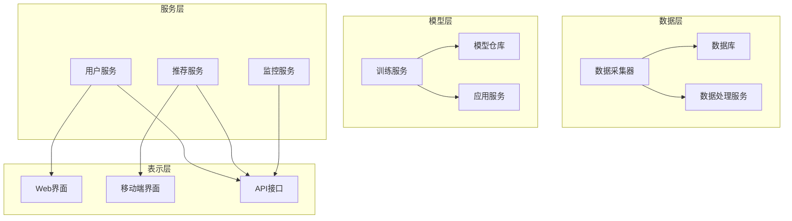

                 

# 《人工智能创业：市场需求的分析》

## 关键词
- 人工智能创业
- 市场需求分析
- 技术挑战
- 商业模式
- 团队建设
- 项目策划
- 市场营销

## 摘要
本文旨在深入探讨人工智能创业的市场需求分析，包括技术挑战、商业模式、团队建设、项目策划和市场营销等关键领域。通过详细分析人工智能创业的背景、市场规模、核心挑战以及未来发展趋势，本文为有意进入人工智能创业领域的创业者提供了有价值的指导和建议。

---

## 《人工智能创业：市场需求的分析》目录大纲

### 第一部分：人工智能创业背景与市场概述

#### 第1章：人工智能创业概述

##### 1.1 人工智能的发展历史与现状

##### 1.2 人工智能创业的定义与类型

##### 1.3 人工智能创业市场的规模与趋势

#### 第2章：人工智能创业的核心挑战

##### 2.1 技术挑战

###### 2.1.1 核心算法原理讲解

###### 2.1.2 数学模型和数学公式讲解

###### 2.1.3 伪代码展示

##### 2.2 市场挑战

###### 2.2.1 市场需求分析

###### 2.2.2 竞争环境分析

###### 2.2.3 市场定位与策略

#### 第3章：人工智能创业的商业模式

##### 3.1 商业模式概述

##### 3.2 人工智能在商业模式中的应用

###### 3.2.1 营销策略分析

###### 3.2.2 财务模型构建

###### 3.2.3 成本与收益分析

#### 第4章：人工智能创业的核心团队建设

##### 4.1 核心团队成员的角色与职责

##### 4.2 团队成员的技能要求与培养

###### 4.2.1 数据科学家

###### 4.2.2 算法工程师

###### 4.2.3 产品经理

### 第二部分：人工智能创业项目实战

#### 第5章：人工智能创业项目策划

##### 5.1 项目立项与目标设定

##### 5.2 项目规划与执行

###### 5.2.1 项目进度管理

###### 5.2.2 风险管理

###### 5.2.3 资源调配与利用

#### 第6章：人工智能创业项目的开发与实施

##### 6.1 系统架构设计

###### 6.1.1 技术选型

###### 6.1.2 系统模块划分

###### 6.1.3 架构图展示

##### 6.2 数据处理与分析

###### 6.2.1 数据收集与预处理

###### 6.2.2 数据可视化

###### 6.2.3 数据挖掘与分析

#### 第7章：人工智能创业项目的测试与优化

##### 7.1 功能测试与性能测试

##### 7.2 用户体验测试

##### 7.3 项目优化与迭代

#### 第8章：人工智能创业项目的市场营销

##### 8.1 市场营销策略制定

##### 8.2 品牌建设与推广

###### 8.2.1 社交媒体营销

###### 8.2.2 内容营销

###### 8.2.3 合作伙伴关系建立

#### 第9章：人工智能创业项目的成功案例解析

##### 9.1 案例概述

##### 9.2 成功经验与启示

###### 9.2.1 技术优势

###### 9.2.2 市场策略

###### 9.2.3 团队建设

### 第三部分：人工智能创业的未来展望与趋势

#### 第10章：人工智能创业的发展趋势

##### 10.1 人工智能技术的未来发展方向

##### 10.2 人工智能创业市场的未来趋势

#### 第11章：人工智能创业的风险与应对策略

##### 11.1 常见风险类型

##### 11.2 风险评估与控制

###### 11.2.1 技术风险

###### 11.2.2 市场风险

###### 11.2.3 财务风险

#### 第12章：人工智能创业的法律法规与伦理问题

##### 12.1 相关法律法规概述

##### 12.2 伦理问题与挑战

###### 12.2.1 数据隐私

###### 12.2.2 职业伦理

###### 12.2.3 社会影响

### 附录

#### 附录 A：人工智能创业资源与工具

##### A.1 常用人工智能框架与工具介绍

###### A.1.1 TensorFlow

###### A.1.2 PyTorch

###### A.1.3 Keras

###### A.1.4 其他工具简介

#### 附录 B：参考文献

##### B.1 书籍推荐

###### B.1.1 《深度学习》

###### B.1.2 《人工智能：一种现代的方法》

###### B.1.3 《机器学习实战》

#### B.2 学术论文

##### B.2.1 “Deep Learning” by Ian Goodfellow, Yoshua Bengio, Aaron Courville

##### B.2.2 “Reinforcement Learning: An Introduction” by Richard S. Sutton and Andrew G. Barto

##### B.2.3 “Natural Language Processing with Python” by Steven Lott

#### 附录 C：人工智能创业项目案例代码

##### C.1 案例一：图像识别项目

###### C.1.1 项目描述

###### C.1.2 代码实现

###### C.1.3 代码解读

##### C.2 案例二：自然语言处理项目

###### C.2.1 项目描述

###### C.2.2 代码实现

###### C.2.3 代码解读

#### 附录 D：人工智能创业项目测试数据集

##### D.1 数据集描述

###### D.1.1 数据集来源

###### D.1.2 数据集特点

###### D.1.3 数据集使用说明

---

接下来，我们将逐一深入探讨每个章节的内容。在第一部分，我们将回顾人工智能的发展历程，分析当前市场的规模和趋势，并探讨人工智能创业所面临的技术挑战。第二部分将专注于商业模式和市场策略的分析，并讨论如何构建一个高效的人工智能创业团队。第三部分将提供实际的创业项目策划、开发与实施的经验，同时分析市场营销和成功案例。最后，我们将探讨人工智能创业的未来趋势、风险和法律法规及伦理问题。

### 第一部分：人工智能创业背景与市场概述

#### 第1章：人工智能创业概述

##### 1.1 人工智能的发展历史与现状

人工智能（Artificial Intelligence，简称AI）起源于20世纪50年代，当时图灵提出了著名的图灵测试，旨在衡量机器是否能够展现出与人类相似的智能行为。随着计算能力的不断提升和数据量的激增，人工智能在20世纪80年代和90年代经历了初步的发展，特别是在专家系统和模式识别领域取得了显著成就。然而，由于硬件限制和算法复杂度的问题，人工智能的发展在21世纪初陷入了一段低潮期。

进入21世纪之后，随着深度学习技术的突破和计算能力的飞速提升，人工智能迎来了新的发展机遇。2012年，深度学习在ImageNet图像识别竞赛中取得了前所未有的成绩，标志着人工智能进入了一个新的时代。深度学习通过多层神经网络对大量数据进行自动特征提取，使得计算机在语音识别、图像处理、自然语言处理等领域取得了显著进展。

当前，人工智能已经成为全球科技发展的重要驱动力，各行各业都在积极探索和引入人工智能技术。从自动驾驶汽车、智能助手到医疗诊断、金融风控，人工智能的应用场景越来越广泛，市场需求也在不断增长。

##### 1.2 人工智能创业的定义与类型

人工智能创业通常指的是利用人工智能技术来解决实际问题，推动商业创新的过程。人工智能创业可以分为以下几种类型：

1. **技术驱动的创业**：这类创业公司以技术创新为核心，通过开发先进的人工智能算法或工具来满足市场需求。例如，深度学习框架的开发者、大数据分析平台的提供商等。

2. **应用驱动的创业**：这类公司专注于特定应用领域，如医疗、金融、教育等，通过将人工智能技术应用于实际问题中，提供创新的解决方案。例如，利用人工智能技术进行癌症早期筛查的医疗设备制造商、提供智能投顾服务的金融科技公司等。

3. **平台驱动的创业**：这类公司搭建一个开放的人工智能平台，为其他企业或开发人员提供技术支持和服务。例如，提供AI开发工具和资源的云服务提供商、构建AI算法市场的平台运营商等。

4. **跨界融合的创业**：这类公司通过将人工智能技术与其他行业相结合，创造全新的商业模式和价值。例如，利用人工智能进行智慧农业、智能物流、智能制造等。

##### 1.3 人工智能创业市场的规模与趋势

根据市场研究机构的报告，全球人工智能市场规模在过去几年中呈现出快速增长的趋势。预计到2025年，全球人工智能市场规模将达到万亿美元级别。以下是一些关键的市场趋势：

1. **市场规模扩大**：随着人工智能技术的不断进步和应用场景的拓展，全球人工智能市场规模将持续扩大。尤其是在亚太地区和北美市场，人工智能的应用前景更加广阔。

2. **行业应用深化**：人工智能在医疗、金融、制造、零售等行业的应用日益深化，推动各行业进行数字化转型和智能化升级。

3. **垂直行业崛起**：一些垂直行业，如医疗健康、金融科技、工业自动化等，对人工智能技术的需求不断增加，成为人工智能创业的重要领域。

4. **政策支持**：各国政府纷纷出台支持人工智能发展的政策，为人工智能创业提供了良好的外部环境。例如，中国制定了《新一代人工智能发展规划》，美国加强了在人工智能领域的研发投入。

5. **技术创新驱动**：随着技术的不断创新，人工智能创业公司将推出更多具有颠覆性的产品和解决方案，进一步推动市场的增长。

总的来说，人工智能创业市场前景广阔，但仍面临诸多挑战。接下来，我们将深入探讨这些挑战，并分析人工智能创业的核心技术。

### 第一部分：人工智能创业背景与市场概述

#### 第2章：人工智能创业的核心挑战

##### 2.1 技术挑战

人工智能创业所面临的技术挑战是多方面的，包括算法、数据处理和计算能力等方面。以下是几个关键的技术挑战：

###### 2.1.1 核心算法原理讲解

人工智能的基石在于算法，其中深度学习算法尤为重要。深度学习通过多层神经网络对数据进行自动特征提取，从而实现复杂的任务。以下是几个核心深度学习算法的基本原理：

1. **神经网络（Neural Networks）**：
    - **基本原理**：神经网络模仿生物大脑的结构和功能，通过多层神经元节点进行数据传递和处理。
    - **激活函数**：常用的激活函数包括sigmoid、ReLU和tanh，它们用于引入非线性变换。
    - **反向传播算法（Backpropagation）**：通过计算损失函数的梯度，反向更新网络权重，实现模型的优化。

2. **卷积神经网络（Convolutional Neural Networks，CNN）**：
    - **基本原理**：CNN特别适用于处理图像数据，通过卷积层提取空间特征。
    - **卷积操作**：卷积层使用卷积核（滤波器）在输入数据上滑动，计算局部特征。
    - **池化操作**：池化层用于降低数据维度，减少计算量。

3. **递归神经网络（Recurrent Neural Networks，RNN）**：
    - **基本原理**：RNN适用于处理序列数据，能够记住之前的输入信息。
    - **循环连接**：RNN中的神经元通过循环连接保持状态，使得模型能够处理长序列。
    - **长短期记忆网络（Long Short-Term Memory，LSTM）**：LSTM通过门控机制解决RNN的梯度消失问题，适用于处理长时间序列数据。

4. **生成对抗网络（Generative Adversarial Networks，GAN）**：
    - **基本原理**：GAN由生成器和判别器两个对抗性网络组成，通过博弈过程生成高质量的数据。
    - **生成器（Generator）**：生成器试图生成逼真的数据，欺骗判别器。
    - **判别器（Discriminator）**：判别器判断生成数据的真实性，对抗生成器。

###### 2.1.2 数学模型和数学公式讲解

深度学习算法的核心在于数学模型，以下是一些关键的数学模型和公式：

1. **损失函数（Loss Function）**：
    - **均方误差（MSE，Mean Squared Error）**：
      $$ \text{MSE}(y, \hat{y}) = \frac{1}{n}\sum_{i=1}^{n}(y_i - \hat{y}_i)^2 $$
    - **交叉熵（Cross-Entropy）**：
      $$ \text{Cross-Entropy}(y, \hat{y}) = -\sum_{i=1}^{n}y_i\log(\hat{y}_i) $$
2. **优化算法（Optimization Algorithm）**：
    - **随机梯度下降（SGD，Stochastic Gradient Descent）**：
      $$ \theta = \theta - \alpha \nabla_\theta J(\theta) $$
    - **Adam优化器**：
      $$ m_t = \beta_1m_{t-1} + (1 - \beta_1)\nabla_\theta J(\theta) $$
      $$ v_t = \beta_2v_{t-1} + (1 - \beta_2)(\nabla_\theta J(\theta))^2 $$
      $$ \theta = \theta - \alpha\frac{m_t}{\sqrt{1 - \beta_2^t} + \epsilon} $$
3. **卷积操作（Convolution）**：
    $$ \text{Output}_{ij} = \sum_{k=1}^{K}\sum_{p=1}^{H}\sum_{q=1}^{W}W_{kpq}I_{ip + q - 1, jp + k - 1} + b_j $$

其中，$I$为输入特征图，$W$为卷积核，$b$为偏置，$K$为卷积核数量，$H$和$W$分别为卷积核的高度和宽度。

###### 2.1.3 伪代码展示

以下是一个简单的神经网络训练过程的伪代码示例：

```
初始化参数 θ
重复以下步骤直到收敛或达到最大迭代次数：
  对于每个训练样本 (x, y)：
    计算预测输出 ŷ = f(θ * x)
    计算损失 L = loss(y, ŷ)
    计算梯度 ∇θL
    更新参数 θ = θ - α * ∇θL
  计算当前迭代的最大梯度 norm
  如果梯度 norm 小于阈值 ε，则认为模型收敛
返回训练好的参数 θ
```

##### 2.2 市场挑战

尽管人工智能技术具有巨大的潜力，但人工智能创业公司在市场上仍面临诸多挑战：

###### 2.2.1 市场需求分析

1. **明确市场需求**：人工智能创业公司需要深入分析目标市场的需求，了解用户痛点，提供有针对性的解决方案。

2. **市场定位**：在竞争激烈的市场中，公司需要明确自己的市场定位，找到差异化竞争的优势。

3. **用户反馈**：持续收集用户反馈，优化产品功能，提升用户体验。

###### 2.2.2 竞争环境分析

1. **竞争对手分析**：分析竞争对手的产品、市场策略和市场份额，找到自身的竞争劣势和改进空间。

2. **技术壁垒**：构建技术壁垒，保护知识产权，避免技术被竞争对手抄袭。

3. **合作与竞争**：在适当的时候，与其他公司建立合作关系，共同开拓市场。

###### 2.2.3 市场定位与策略

1. **细分市场**：针对不同细分市场，制定有针对性的市场策略。

2. **营销策略**：结合线上和线下营销手段，提高品牌知名度和市场占有率。

3. **合作伙伴关系**：建立与行业领先企业的合作伙伴关系，共同推动人工智能技术的发展和应用。

通过深入分析市场需求和竞争环境，人工智能创业公司可以更好地定位市场，制定有效的市场策略，提升市场竞争力。

### 第一部分：人工智能创业背景与市场概述

#### 第3章：人工智能创业的商业模式

##### 3.1 商业模式概述

人工智能创业的商业模式涉及多个方面，包括产品定位、盈利模式、营销策略和财务模型等。一个成功的商业模式需要具备以下几个关键要素：

1. **产品定位**：明确产品的目标市场和用户群体，满足用户需求，提供有价值的功能。

2. **盈利模式**：确定产品的收费方式，如订阅制、一次性收费或增值服务。

3. **营销策略**：制定有效的市场推广计划，提高品牌知名度和用户粘性。

4. **财务模型**：构建合理的财务模型，确保公司能够盈利并持续发展。

##### 3.2 人工智能在商业模式中的应用

人工智能技术可以广泛应用于商业模式的各个方面，从而提升企业的竞争力。以下是人工智能在商业模式中的几个关键应用领域：

1. **个性化推荐**：利用机器学习算法分析用户行为数据，提供个性化的产品推荐，提高用户满意度和转化率。

2. **智能客服**：通过自然语言处理技术，实现自动化的客户服务，提高服务效率和客户满意度。

3. **风险控制**：利用人工智能进行数据分析和预测，降低信贷风险、市场风险等。

4. **供应链优化**：通过预测和分析供应链数据，优化库存管理、物流调度等，降低成本，提高效率。

5. **智能决策支持**：利用人工智能技术，为管理层提供数据驱动的决策支持，提高决策质量和速度。

##### 3.2.1 营销策略分析

营销策略是商业模式的重要组成部分，直接影响企业的市场占有率和用户增长。以下是几种有效的营销策略：

1. **内容营销**：通过高质量的内容，吸引潜在用户，提升品牌知名度。例如，撰写技术博客、发布行业报告等。

2. **社交媒体营销**：利用社交媒体平台，如微博、微信公众号等，进行品牌推广和用户互动。

3. **合作伙伴关系**：与行业内的其他公司建立合作伙伴关系，共同推广产品，拓展市场。

4. **线下活动**：举办线下活动，如研讨会、技术交流会议等，增加用户粘性，提升品牌形象。

##### 3.2.2 财务模型构建

构建一个合理的财务模型是确保企业可持续发展的关键。以下是财务模型构建的主要步骤：

1. **收入预测**：根据产品定位和市场分析，预测不同时间点的收入。

2. **成本分析**：分析不同阶段的运营成本，包括研发成本、营销成本、人力成本等。

3. **利润分析**：计算不同时间点的利润，评估盈利能力。

4. **现金流分析**：预测不同时间点的现金流入和流出，确保企业有足够的现金流维持运营。

##### 3.2.3 成本与收益分析

成本与收益分析是财务模型的核心内容，直接影响企业的财务健康状况。以下是成本与收益分析的关键要素：

1. **固定成本**：包括租金、员工工资、研发费用等，不随业务量变化而变化的成本。

2. **可变成本**：包括原材料、营销费用等，随业务量变化而变化的成本。

3. **边际收益**：增加一个单位产品或服务所带来的额外收益。

4. **盈亏平衡点**：达到盈亏平衡时的业务量，即固定成本与可变成本之和等于总收益。

通过成本与收益分析，企业可以了解在不同业务量下的盈利情况，为经营决策提供依据。

### 第一部分：人工智能创业背景与市场概述

#### 第4章：人工智能创业的核心团队建设

##### 4.1 核心团队成员的角色与职责

构建一个高效的人工智能创业团队是成功的关键。核心团队成员应具备以下角色和职责：

1. **创始人**：负责整体战略规划、资源配置和决策。创始人通常具备丰富的创业经验和行业知识。

2. **数据科学家**：负责数据分析和建模，通过机器学习算法提取有价值的信息。数据科学家需要具备扎实的数学和统计基础。

3. **算法工程师**：负责算法研发和优化，解决复杂的技术问题。算法工程师需要具备深厚的数学和计算机背景。

4. **产品经理**：负责产品规划、设计和用户体验，确保产品满足市场需求。产品经理需要具备用户思维和跨部门协调能力。

5. **市场经理**：负责市场推广和品牌建设，提高产品的市场占有率。市场经理需要具备营销策略和执行能力。

6. **财务经理**：负责财务规划和风险控制，确保企业的财务健康。财务经理需要具备财务管理和分析能力。

##### 4.2 团队成员的技能要求与培养

为了确保团队的高效运作，团队成员需要具备以下技能：

1. **数据科学家**

   - **技能要求**：熟悉数据分析、机器学习和深度学习技术，掌握Python、R等编程语言。
   - **培养方向**：加强数学和统计知识，提升编程能力，熟悉常用的机器学习库和框架。

2. **算法工程师**

   - **技能要求**：具备扎实的数学和计算机科学基础，熟悉深度学习算法，掌握TensorFlow、PyTorch等框架。
   - **培养方向**：深入学习前沿算法，提升代码优化能力，参与开源项目和实践。

3. **产品经理**

   - **技能要求**：具备用户思维，熟悉产品设计流程，具备跨部门沟通能力。
   - **培养方向**：加强市场分析能力，提升项目管理技能，多参与产品设计和用户调研。

4. **市场经理**

   - **技能要求**：熟悉市场营销策略，具备品牌建设和推广经验，掌握社交媒体运营。
   - **培养方向**：深入研究市场趋势，提升内容创作和数据分析能力，拓宽营销渠道。

5. **财务经理**

   - **技能要求**：具备财务管理和分析能力，熟悉财务报表和预算编制。
   - **培养方向**：提升财务规划能力，加强风险管理，深入学习行业财务法规。

通过系统化的培训和持续的学习，团队成员可以不断提升自身能力，为人工智能创业项目的成功奠定基础。

### 第二部分：人工智能创业项目实战

#### 第5章：人工智能创业项目策划

##### 5.1 项目立项与目标设定

项目立项是人工智能创业项目的第一步，涉及项目的目标、范围、资源和时间规划。以下是项目立项的关键步骤：

1. **明确项目目标**：项目目标应具体、可衡量、可实现、相关性强和时间限定（SMART原则）。例如，“开发一款智能医疗诊断系统，提高诊断准确率至95%”。

2. **确定项目范围**：明确项目的边界，包括功能需求、技术实现、用户群体等。项目范围应合理，避免过度扩展导致资源浪费。

3. **评估资源需求**：包括人力、资金、技术资源等。人力资源需要考虑数据科学家、算法工程师、产品经理等角色；资金需求需要考虑研发、运营和市场推广等费用。

4. **制定时间规划**：包括项目启动、开发、测试、上线等阶段。时间规划应留有余地，以应对可能出现的风险和延迟。

##### 5.2 项目规划与执行

项目规划与执行是确保项目按计划进行的关键步骤。以下是项目规划与执行的关键环节：

1. **项目计划**：制定详细的项目计划，包括任务分解、里程碑、交付物和时间表。任务分解应明确每个阶段的任务和负责人。

2. **团队协作**：建立有效的团队协作机制，确保团队成员之间的沟通和信息共享。可以采用项目管理工具，如Trello、Jira等，跟踪项目进展。

3. **风险管理**：识别项目风险，并制定相应的应对策略。风险包括技术风险、市场风险、财务风险等。

4. **进度监控**：定期检查项目进度，确保项目按计划进行。如果出现延迟或问题，应及时调整计划。

5. **质量保证**：确保项目交付物符合质量标准。可以采用代码审查、测试等手段，确保系统的稳定性和可靠性。

##### 5.2.1 项目进度管理

项目进度管理是确保项目按时完成的关键。以下是一些项目进度管理的最佳实践：

1. **设立里程碑**：将项目划分为若干里程碑，每个里程碑代表一个重要的阶段性目标。

2. **定期会议**：定期召开项目会议，讨论项目进展、解决问题和调整计划。

3. **实时跟踪**：使用项目管理工具，实时跟踪项目进度，及时发现和解决问题。

4. **资源调配**：根据项目进展，合理调配资源，确保关键任务得到充分支持。

5. **变更管理**：对于项目变更，应进行评估和审批，确保变更不会影响项目进度和质量。

##### 5.2.2 风险管理

风险管理是项目成功的关键之一。以下是一些风险管理的方法和策略：

1. **识别风险**：通过项目规划、团队讨论和专家评审等方式，识别可能的风险。

2. **评估风险**：对识别的风险进行评估，包括风险发生的可能性、影响程度等。

3. **应对策略**：根据风险评估结果，制定相应的应对策略。应对策略包括风险回避、风险转移、风险缓解和风险接受。

4. **监控与更新**：定期监控项目风险，并根据实际情况更新风险应对计划。

5. **应急预案**：制定应急预案，以应对可能出现的突发情况，确保项目能够迅速恢复。

##### 5.2.3 资源调配与利用

资源调配与利用是确保项目顺利进行的重要保障。以下是一些资源调配与利用的最佳实践：

1. **人力资源调配**：根据项目需求，合理分配团队成员，确保关键任务得到充足的人力支持。

2. **资金使用计划**：制定详细的资金使用计划，确保资金的有效利用和合理分配。

3. **技术资源管理**：合理配置技术资源，确保项目的技术需求得到满足。

4. **物资与设备管理**：确保项目所需的物资和设备按时到位，避免因物资短缺或设备故障导致项目延误。

5. **资源优化**：通过合理的资源配置和调度，提高资源利用率，降低项目成本。

通过科学的项目立项与规划，严格的项目执行与监控，合理的管理策略和风险应对，人工智能创业项目可以实现预期目标，取得成功。

### 第二部分：人工智能创业项目实战

#### 第6章：人工智能创业项目的开发与实施

##### 6.1 系统架构设计

系统架构设计是人工智能创业项目开发的重要环节，它决定了系统的扩展性、可维护性和性能。以下是系统架构设计的关键步骤和注意事项：

###### 6.1.1 技术选型

技术选型是系统架构设计的基础，需要根据项目的需求、团队技能和资源情况进行合理选择。以下是常见的技术选型考虑因素：

1. **编程语言**：Python、Java和C++是常见的选择，Python因其丰富的库和框架支持而被广泛使用。

2. **数据库**：关系型数据库（如MySQL、PostgreSQL）和NoSQL数据库（如MongoDB、Cassandra）各有优势，需根据数据特性选择。

3. **计算框架**：TensorFlow、PyTorch和Keras等深度学习框架提供了丰富的功能和工具。

4. **服务架构**：微服务架构和分布式架构可以根据项目需求进行选择，微服务架构适用于复杂业务系统的分解和扩展。

###### 6.1.2 系统模块划分

系统模块划分是将系统功能划分为若干个模块，以便于开发和维护。以下是常见的系统模块划分方法：

1. **数据层**：包括数据采集、存储和管理模块，如数据采集器、数据库和数据处理服务。

2. **模型层**：包括模型训练、加载和应用模块，如训练服务、模型仓库和应用服务。

3. **服务层**：包括业务逻辑处理和接口服务模块，如用户服务、推荐服务和监控服务。

4. **表示层**：包括前端界面和API接口模块，如Web界面、移动端界面和API接口。

###### 6.1.3 架构图展示

以下是一个典型的分布式人工智能系统架构图，展示了各层模块之间的关系：



##### 6.2 数据处理与分析

数据处理与分析是人工智能项目成功的关键，以下是数据处理与分析的主要步骤：

###### 6.2.1 数据收集与预处理

数据收集与预处理是数据处理的基础，以下是关键步骤：

1. **数据收集**：根据项目需求，从各种数据源收集数据，如数据库、API接口、传感器等。

2. **数据清洗**：去除无效、重复和错误的数据，保证数据质量。常用的数据清洗方法包括缺失值处理、异常值检测和去重等。

3. **数据转换**：将数据转换为适合分析和建模的格式，如特征工程、数据标准化等。

4. **数据存储**：将预处理后的数据存储到数据库或数据仓库中，以便后续分析和建模。

###### 6.2.2 数据可视化

数据可视化是理解和分析数据的重要工具，以下是数据可视化的关键步骤：

1. **数据探索**：通过可视化工具，如Matplotlib、Seaborn等，进行数据探索性分析，发现数据中的规律和异常。

2. **数据展示**：制作数据报告和可视化图表，如折线图、柱状图、散点图等，以直观地展示数据特征。

3. **交互分析**：通过交互式可视化工具，如Tableau、Power BI等，进行深度分析和决策支持。

###### 6.2.3 数据挖掘与分析

数据挖掘与分析是发现数据中隐藏的规律和模式，以下是关键步骤：

1. **特征选择**：选择对预测任务有重要影响的特征，去除无关或冗余特征，提高模型性能。

2. **模型训练**：使用机器学习算法，如回归、分类、聚类等，训练模型并对模型进行评估。

3. **模型优化**：通过调参、交叉验证等方法，优化模型性能，提高预测准确性。

4. **结果解释**：对模型结果进行解释和验证，确保结果的可靠性和解释性。

通过科学的系统架构设计和高效的数据处理与分析，人工智能创业项目可以更好地满足市场需求，实现商业目标。

### 第二部分：人工智能创业项目实战

#### 第7章：人工智能创业项目的测试与优化

##### 7.1 功能测试与性能测试

在人工智能创业项目的开发过程中，测试与优化是确保系统质量的关键步骤。以下是功能测试与性能测试的关键环节：

###### 7.1.1 功能测试

功能测试旨在验证系统是否按照需求正确执行，以下是功能测试的主要任务：

1. **单元测试**：针对系统的各个功能模块，编写测试用例，验证其独立功能。

2. **集成测试**：在模块集成后，测试不同模块之间的交互和集成效果，确保系统能够正常运行。

3. **系统测试**：在系统完整构建后，进行全面的测试，验证系统是否符合需求规格。

4. **用户验收测试**：与用户合作，验证系统功能是否满足用户需求，确保用户体验。

###### 7.1.2 性能测试

性能测试旨在评估系统的性能指标，确保系统在高负载情况下仍能稳定运行，以下是性能测试的主要任务：

1. **负载测试**：模拟多用户同时访问系统，评估系统在高负载下的性能。

2. **压力测试**：通过加大系统负载，测试系统在极端条件下的性能和稳定性。

3. **可靠性测试**：在长时间运行过程中，评估系统的稳定性和故障恢复能力。

4. **容量测试**：评估系统在数据量增加或用户增长时的表现，确保系统扩展能力。

##### 7.2 用户体验测试

用户体验测试是确保系统设计符合用户需求和习惯的重要环节，以下是用户体验测试的关键任务：

1. **可用性测试**：评估系统的易用性，包括界面布局、交互设计和操作流程。

2. **可访问性测试**：确保系统能够被不同能力的用户使用，包括视觉障碍、听力障碍等。

3. **交互设计测试**：验证交互设计是否符合用户预期，包括按钮布局、导航逻辑等。

4. **用户满意度调查**：通过问卷调查或用户访谈，收集用户对系统的满意度和改进建议。

##### 7.3 项目优化与迭代

优化与迭代是持续改进系统的过程，以下是项目优化与迭代的关键步骤：

1. **故障排查**：定期检查系统运行情况，发现并解决故障，确保系统稳定运行。

2. **性能调优**：通过分析性能测试结果，优化系统代码和架构，提高系统性能。

3. **功能迭代**：根据用户反馈和市场变化，持续改进和扩展系统功能。

4. **用户体验优化**：结合用户反馈，优化界面设计和交互流程，提升用户体验。

通过严格的功能测试与性能测试，全面的用户体验测试，以及持续的项目优化与迭代，人工智能创业项目可以不断提升系统质量，满足用户需求。

### 第二部分：人工智能创业项目实战

#### 第8章：人工智能创业项目的市场营销

##### 8.1 市场营销策略制定

在人工智能创业项目的市场推广中，制定有效的市场营销策略至关重要。以下是制定市场营销策略的关键步骤：

1. **市场研究**：通过市场调查、竞争分析和用户调研，了解目标市场的需求、市场规模和竞争对手情况。

2. **目标客户定位**：明确目标客户群体，分析其需求、行为和偏好，确保市场营销策略能够精准触达目标用户。

3. **品牌定位**：基于市场研究和目标客户分析，确定项目的品牌定位，包括品牌形象、品牌理念和品牌口号。

4. **营销目标设定**：根据项目目标和市场情况，设定具体的营销目标，如用户增长、收入增长和市场占有率等。

5. **营销策略制定**：结合品牌定位和营销目标，制定多样化的营销策略，包括线上营销、线下活动、合作伙伴关系等。

##### 8.2 品牌建设与推广

品牌建设与推广是提高项目知名度和认可度的重要环节。以下是品牌建设和推广的关键步骤：

1. **品牌形象设计**：设计符合品牌定位的视觉元素，包括标志、颜色、字体等，确保品牌形象的一致性和专业性。

2. **内容营销**：通过撰写高质量的技术博客、行业报告、案例分析等，展示项目的技术实力和应用场景，提升品牌形象。

3. **社交媒体营销**：利用社交媒体平台（如微博、微信公众号、LinkedIn等），发布有价值的内容，与用户互动，增加品牌曝光度。

4. **线上线下活动**：举办线上研讨会、技术交流会议、线下产品发布会等活动，吸引潜在客户，提升品牌影响力。

5. **合作伙伴关系**：与行业内的领先企业建立合作伙伴关系，共同推广产品，拓展市场渠道。

##### 8.2.1 社交媒体营销

社交媒体营销是当前最有效的市场推广手段之一，以下是社交媒体营销的关键策略：

1. **内容策略**：发布高质量的内容，包括技术文章、行业动态、用户案例等，吸引用户关注。

2. **互动策略**：与用户积极互动，回复评论、参与讨论，建立良好的用户关系。

3. **广告投放**：利用社交媒体广告，精准定位目标用户，提高品牌曝光度和用户转化率。

4. **KOL合作**：与行业内的意见领袖（Key Opinion Leader）合作，借助其影响力推广项目。

5. **社群运营**：建立和维护线上社群（如微信群、QQ群等），为用户提供技术支持、交流平台。

##### 8.2.2 内容营销

内容营销是建立品牌权威和吸引目标客户的有效手段，以下是内容营销的关键策略：

1. **技术博客**：撰写详细的技术博客，介绍项目的技术原理、应用案例和最新动态，展示技术实力。

2. **行业报告**：发布专业的行业报告，分析市场趋势、技术发展和应用案例，提供有价值的信息。

3. **用户案例**：展示成功案例，通过实际应用场景展示项目的价值和效果，增强用户信任。

4. **白皮书**：撰写深度白皮书，探讨行业前沿技术、应用场景和未来发展趋势，树立品牌权威。

5. **视频教程**：制作视频教程，讲解项目功能、操作方法和应用场景，提高用户上手速度。

##### 8.2.3 合作伙伴关系建立

合作伙伴关系是拓展市场渠道和提升品牌影响力的重要手段，以下是建立合作伙伴关系的策略：

1. **行业联盟**：加入行业联盟或协会，与行业内的其他企业建立联系，共同推广技术和产品。

2. **合作伙伴招募**：通过线上线下活动、广告投放等方式，招募与项目互补的合作伙伴，共同开拓市场。

3. **合作项目开发**：与合作伙伴共同开发项目，实现资源共享和优势互补，提高项目成功率。

4. **品牌联合推广**：与合作伙伴共同开展品牌推广活动，如联合发布白皮书、举办技术研讨会等，提升品牌知名度。

5. **渠道拓展**：借助合作伙伴的渠道资源，拓展市场覆盖范围，提高销售业绩。

通过科学的市场营销策略、有效的品牌建设和多样化的推广手段，人工智能创业项目可以迅速提升市场知名度和用户认可度，实现商业成功。

### 第二部分：人工智能创业项目实战

#### 第9章：人工智能创业项目的成功案例解析

##### 9.1 案例概述

以下是一个成功的人工智能创业项目案例，该项目旨在利用人工智能技术提升金融风控能力。公司名为“AI风控”，专注于开发一款基于机器学习的信用评分系统，用于评估借款人的信用风险。

**项目背景**：随着互联网金融的快速发展，信用风险评估成为金融行业的痛点。传统的信用评分方法依赖于人工评分模型，存在评分主观性强、效率低、准确性不足等问题。AI风控公司通过引入深度学习技术，开发了一套自动化的信用评分系统，旨在提高风险评估的准确性和效率。

**项目目标**：通过构建高效、准确的信用评分模型，降低金融机构的坏账率，提高贷款审批速度。

**项目成果**：项目上线后，成功帮助多家金融机构提升了信用风险评估能力，降低了坏账率，得到了客户的高度认可。以下是该项目成功的关键因素：

###### 9.2.1 技术优势

1. **深度学习算法**：AI风控采用了深度学习中的卷积神经网络（CNN）和循环神经网络（RNN）相结合的方法，对大量历史数据进行自动特征提取和关系建模。这种方法能够捕捉数据中的复杂模式和关联，显著提高了评分模型的准确性。

2. **大规模数据处理**：公司使用高性能计算平台进行数据处理和模型训练，确保系统能够快速处理海量数据，提高模型训练效率。

3. **模型优化与迭代**：通过对模型进行持续优化和迭代，AI风控不断改进模型性能，提升评分准确性和稳定性。

###### 9.2.2 市场策略

1. **精准市场定位**：AI风控公司明确了目标市场为互联网金融和信贷公司，通过深入了解这些客户的需求，提供定制化的信用评分解决方案。

2. **客户关系管理**：公司建立了完善的客户关系管理系统，提供持续的技术支持和售后服务，增强客户粘性。

3. **市场拓展**：通过参加行业会议、发布白皮书和参与合作伙伴项目，AI风控成功拓展了市场渠道，提升了品牌知名度。

###### 9.2.3 团队建设

1. **技术团队**：AI风控拥有一支由顶尖数据科学家和算法工程师组成的团队，他们具备丰富的机器学习应用经验，能够快速响应市场需求。

2. **产品团队**：公司拥有一支专业的产品团队，负责产品规划和设计，确保产品功能符合用户需求。

3. **市场团队**：AI风控的市场团队具备深厚的市场分析能力和推广经验，能够有效地推动市场拓展和品牌建设。

通过技术优势、市场策略和团队建设的有机结合，AI风控成功实现了商业目标，为金融风控领域带来了创新和变革。

### 第三部分：人工智能创业的未来展望与趋势

#### 第10章：人工智能创业的发展趋势

人工智能创业正处于快速发展阶段，未来几年，人工智能技术将在多个领域取得突破性进展，并对各行各业产生深远影响。以下是人工智能创业的主要发展趋势：

##### 10.1 人工智能技术的未来发展方向

1. **深度学习的进一步优化**：随着计算能力的提升和算法的改进，深度学习将更加高效和精准。卷积神经网络（CNN）和循环神经网络（RNN）等现有算法将得到进一步优化，同时新的深度学习架构（如Transformer）也将得到广泛应用。

2. **强化学习的应用拓展**：强化学习在自动驾驶、游戏AI和机器人控制等领域的应用将更加成熟。通过不断的学习和经验积累，强化学习算法将实现更高的自主决策能力和复杂任务的处理能力。

3. **跨模态学习的发展**：跨模态学习旨在整合不同类型的数据（如文本、图像、声音等），实现多模态数据的联合建模和分析。这一技术的发展将推动人工智能在自然语言处理、图像识别和语音识别等领域的应用。

4. **生成对抗网络（GAN）的创新**：GAN在图像生成、数据增强和风格迁移等方面的应用将更加广泛。未来，GAN将结合其他深度学习技术，实现更高质量的图像生成和更复杂的模式识别。

##### 10.2 人工智能创业市场的未来趋势

1. **垂直行业应用的深化**：人工智能技术将在医疗、金融、制造、零售等垂直行业得到更广泛的应用。例如，在医疗领域，人工智能将用于疾病诊断、药物研发和个性化治疗；在金融领域，人工智能将用于风险控制和智能投顾。

2. **中小企业市场的崛起**：随着云计算和人工智能技术的普及，中小企业将更容易获取和使用人工智能技术。这将推动中小企业在人工智能领域的创新和发展，形成新的市场机会。

3. **全球化竞争加剧**：人工智能创业市场的全球化竞争将愈发激烈。各国政府和科技公司将持续加大对人工智能的研发和应用投入，推动技术创新和市场份额的争夺。

4. **政策法规的完善**：随着人工智能技术的快速发展，相关政策和法规将逐渐完善，以规范人工智能的研发和应用。例如，数据隐私保护、伦理问题和法律法规等将成为人工智能创业的重要考量因素。

总的来说，人工智能创业在未来几年将迎来快速发展的机遇，技术突破和应用拓展将为创业者提供广阔的市场空间。创业者需要紧跟技术趋势，关注市场需求，积极创新，以在激烈的市场竞争中脱颖而出。

### 第三部分：人工智能创业的未来展望与趋势

#### 第11章：人工智能创业的风险与应对策略

在人工智能创业的道路上，风险是不可避免的。创业者需要全面了解和评估这些风险，并制定相应的应对策略，以确保项目的稳健发展。以下是人工智能创业中常见的风险类型及其应对策略：

##### 11.1 常见风险类型

1. **技术风险**：人工智能项目面临的技术风险主要包括算法的不确定性、技术实现的难度和数据处理的安全性问题。这些风险可能导致项目失败或产品无法达到预期效果。

2. **市场风险**：市场风险包括市场需求的变化、竞争对手的压力和客户的不确定性。这些因素可能导致产品难以被市场接受，从而影响项目的商业成功。

3. **财务风险**：财务风险包括资金链断裂、成本超支和收入不稳定等问题。这些风险可能导致企业无法持续运营。

4. **法律和伦理风险**：随着人工智能技术的发展，相关法律法规和伦理问题日益凸显。例如，数据隐私、算法歧视和责任归属等都是重要的法律和伦理风险。

##### 11.2 风险评估与控制

1. **技术风险评估**：
   - **方法**：通过技术评审、专家咨询和实验验证等方式，评估技术实现的可行性和难度。
   - **策略**：持续跟踪前沿技术发展，建立技术储备；采用模块化设计和迭代开发，降低技术实现的难度；加强数据处理和存储的安全措施，确保数据隐私和安全。

2. **市场风险评估**：
   - **方法**：通过市场调研、用户访谈和竞争分析等手段，了解市场需求和竞争态势。
   - **策略**：明确目标市场，制定有针对性的市场策略；建立良好的客户关系，收集用户反馈，及时调整产品功能；关注行业动态，及时应对市场变化。

3. **财务风险评估**：
   - **方法**：通过财务分析、预算编制和风险评估模型等手段，评估项目的财务健康状况。
   - **策略**：制定详细的财务计划，确保资金链的稳定性；严格控制成本，优化资源配置；寻找合适的融资渠道，确保充足的资金支持。

4. **法律和伦理风险评估**：
   - **方法**：通过法律法规学习和伦理咨询等手段，了解相关法律和伦理要求。
   - **策略**：遵守相关法律法规，确保项目的合规性；制定伦理规范，确保算法和数据的公正性和透明性；建立责任追究机制，明确算法责任归属。

通过全面的风险评估和控制，人工智能创业项目可以降低风险，提高成功率。创业者需要时刻保持警惕，及时调整策略，以应对不断变化的市场和技术环境。

### 第三部分：人工智能创业的未来展望与趋势

#### 第12章：人工智能创业的法律法规与伦理问题

随着人工智能技术的迅猛发展，其应用领域日益广泛，同时也带来了新的法律法规和伦理问题。这些问题不仅关系到企业的合规性，还涉及到社会公共利益和人类伦理道德。以下是人工智能创业在法律法规和伦理方面需要关注的主要问题：

##### 12.1 相关法律法规概述

1. **数据隐私法规**：全球范围内，数据隐私法规日益严格。例如，欧盟的《通用数据保护条例》（GDPR）对个人数据的收集、存储、处理和传输做出了详细规定。类似地，中国的《个人信息保护法》也要求企业在处理个人信息时严格遵守法律规定。

2. **算法透明性和公平性**：各国开始关注算法的透明性和公平性。例如，美国的《算法透明法案》提议要求对关键算法进行审查，确保其透明度和公正性。在中国，相关法律法规也在逐步完善，要求算法提供者公开算法的设计、实现和应用情况。

3. **人工智能伦理规范**：人工智能伦理问题成为各国政策制定者和学者关注的焦点。一些国家和组织开始制定人工智能伦理规范，以确保人工智能的发展符合伦理要求。例如，欧盟发布了《关于人工智能伦理指南》，强调了人工智能的透明性、公平性和可持续性。

##### 12.2 伦理问题与挑战

1. **数据隐私**：人工智能系统通常需要大量个人数据，如何确保这些数据的隐私和安全是一个重要伦理问题。企业需要采取有效的数据保护措施，避免数据泄露和滥用。

2. **算法歧视**：人工智能算法在数据处理和决策过程中可能会引入歧视，例如在招聘、贷款审批和犯罪预测等领域。为了避免算法歧视，企业需要在算法设计和数据预处理阶段充分考虑公平性和多样性。

3. **职业伦理**：随着人工智能技术的广泛应用，许多传统职业可能面临被取代的风险。这引发了关于人工智能对就业市场和职业伦理的讨论。企业需要关注人工智能对职业发展的影响，制定相应的职业转型和培训计划。

4. **责任归属**：当人工智能系统发生错误或造成损害时，如何确定责任归属是一个复杂的问题。需要制定明确的责任追究机制，确保各方（如算法提供者、使用者、用户等）的责任清晰。

##### 12.2.1 数据隐私

**数据隐私保护措施**：
- **数据匿名化**：在数据处理过程中，对个人数据进行匿名化处理，降低数据泄露的风险。
- **数据访问控制**：实施严格的访问控制策略，确保只有授权人员能够访问敏感数据。
- **数据加密**：使用加密技术保护数据在传输和存储过程中的安全。
- **用户知情同意**：确保用户在提供个人信息前明确了解数据处理的目的、方式和范围。

##### 12.2.2 职业伦理

**职业伦理建议**：
- **公平招聘**：在招聘过程中，确保招聘流程透明、公正，避免算法引入的歧视。
- **职业转型培训**：为受人工智能影响的工作者提供职业转型培训，帮助他们适应新的职业需求。
- **伦理培训**：对相关员工进行伦理培训，提高他们在工作中对伦理问题的认识和应对能力。

##### 12.2.3 社会影响

**社会影响评估**：
- **公众参与**：在产品设计和推广过程中，邀请公众参与讨论，收集多方面的意见和反馈。
- **透明度**：提高人工智能系统的透明度，让公众了解其工作原理和应用场景。
- **社会责任**：企业应承担社会责任，确保人工智能技术的发展和应用符合社会伦理和道德要求。

通过关注和解决这些法律法规和伦理问题，人工智能创业企业不仅可以确保合规性，还能赢得公众的信任和支持，为可持续发展奠定基础。

### 附录

#### 附录 A：人工智能创业资源与工具

##### A.1 常用人工智能框架与工具介绍

人工智能创业需要使用多种工具和框架来支持研发和开发。以下是一些常用的工具和框架：

###### A.1.1 TensorFlow

TensorFlow 是一个开源的机器学习框架，由谷歌开发。它支持多种类型的神经网络，适用于深度学习任务，包括图像识别、自然语言处理和强化学习。TensorFlow 提供了一个灵活的编程接口，支持多种编程语言，如 Python、C++ 和 Java。

**特点**：
- **高性能**：TensorFlow 支持异构计算，可以在 CPU、GPU 和 TPU 上运行。
- **易用性**：TensorFlow 提供了丰富的文档和示例代码，易于上手。
- **生态系统**：TensorFlow 拥有广泛的生态系统，包括预训练模型和工具包。

**应用场景**：
- **图像识别**：使用 TensorFlow 的卷积神经网络（CNN）进行图像分类和物体检测。
- **自然语言处理**：利用 TensorFlow 处理文本数据，进行情感分析、机器翻译等任务。

**示例代码**：

```python
import tensorflow as tf

# 创建一个简单的线性回归模型
model = tf.keras.Sequential([
    tf.keras.layers.Dense(units=1, input_shape=[1])
])

# 编译模型
model.compile(optimizer='sgd', loss='mean_squared_error')

# 训练模型
model.fit(x_train, y_train, epochs=1000)
```

###### A.1.2 PyTorch

PyTorch 是另一个流行的开源机器学习库，由 Facebook AI 研究团队开发。PyTorch 提供了一个动态计算图框架，使其在研究阶段特别受欢迎。PyTorch 的灵活性使其成为开发新算法和原型设计的理想选择。

**特点**：
- **动态计算图**：PyTorch 允许用户在运行时动态构建计算图，便于研究和原型设计。
- **易用性**：PyTorch 的 API 设计直观，易于理解和使用。
- **良好的扩展性**：PyTorch 支持自定义图层和优化器，便于扩展和定制。

**应用场景**：
- **图像处理**：使用 PyTorch 的卷积神经网络（CNN）进行图像分类和物体检测。
- **强化学习**：PyTorch 提供了强大的强化学习库，适用于自主驾驶、游戏等任务。

**示例代码**：

```python
import torch
import torch.nn as nn

# 创建一个简单的线性模型
model = nn.Linear(1, 1)

# 创建一个损失函数
criterion = nn.MSELoss()

# 创建一个优化器
optimizer = torch.optim.SGD(model.parameters(), lr=0.01)

# 生成一些数据
x = torch.tensor([[1.0], [2.0], [3.0]])
y = torch.tensor([[2.0], [4.0], [6.0]])

for epoch in range(100):
    optimizer.zero_grad()
    outputs = model(x)
    loss = criterion(outputs, y)
    loss.backward()
    optimizer.step()

print("Final loss:", loss.item())
```

###### A.1.3 Keras

Keras 是一个高层次的神经网络 API，它可以在 TensorFlow 和 Theano 后端上运行。Keras 提供了一个简单、模块化、可扩展的接口，使得构建和训练神经网络更加容易。

**特点**：
- **简单易用**：Keras 提供了直观的 API，使得构建神经网络变得简单。
- **模块化**：Keras 支持模块化设计，可以轻松组合和复用图层。
- **灵活性**：Keras 支持自定义图层和优化器，便于扩展和定制。

**应用场景**：
- **快速原型设计**：Keras 非常适合快速原型设计，便于验证算法和模型。
- **教育和研究**：Keras 广泛用于教育和研究，帮助学生和研究人员快速上手。

**示例代码**：

```python
from keras.models import Sequential
from keras.layers import Dense

# 创建一个简单的线性回归模型
model = Sequential()
model.add(Dense(1, input_shape=(1,)))

# 编译模型
model.compile(optimizer='sgd', loss='mean_squared_error')

# 训练模型
model.fit(x_train, y_train, epochs=1000)
```

###### A.1.4 其他工具简介

除了上述常用的工具，还有许多其他的人工智能框架和工具，如 MXNet、Caffe、Theano 等。这些工具各有特色，适用于不同的应用场景和需求。创业者可以根据项目的具体需求选择合适的工具。

#### 附录 B：参考文献

在撰写人工智能创业相关内容时，参考权威的文献和学术论文能够提供深入的理论支持和实践指导。以下是一些推荐的参考文献：

##### B.1 书籍推荐

1. **《深度学习》**（Ian Goodfellow, Yoshua Bengio, Aaron Courville）
   - **概述**：这是一本经典的深度学习教材，详细介绍了深度学习的基本理论、算法和应用。
   - **适用场景**：适合初学者和研究者，帮助理解深度学习的基础知识和最新进展。

2. **《人工智能：一种现代的方法》**（Stuart Russell, Peter Norvig）
   - **概述**：这本书是人工智能领域的权威教材，全面涵盖了人工智能的理论和实践。
   - **适用场景**：适合本科和研究生学习，帮助建立人工智能的整体框架。

3. **《机器学习实战》**（Peter Harrington）
   - **概述**：这本书通过实际案例介绍机器学习的基本概念和应用。
   - **适用场景**：适合实践者，帮助理解机器学习算法的实际应用。

##### B.2 学术论文

1. **“Deep Learning” by Ian Goodfellow, Yoshua Bengio, Aaron Courville**
   - **概述**：这篇综述论文系统地介绍了深度学习的基本理论、算法和应用。
   - **适用场景**：适合研究者，提供深度学习的全面视角。

2. **“Reinforcement Learning: An Introduction” by Richard S. Sutton and Andrew G. Barto**
   - **概述**：这是一本经典的强化学习教材，详细介绍了强化学习的基本原理和应用。
   - **适用场景**：适合初学者和研究者，帮助理解强化学习的关键概念。

3. **“Natural Language Processing with Python” by Steven Lott**
   - **概述**：这本书通过 Python 语言介绍了自然语言处理的基本概念和实现方法。
   - **适用场景**：适合初学者和实践者，帮助理解自然语言处理的应用。

通过阅读这些参考文献，读者可以深入理解人工智能领域的核心概念、最新进展和实际应用，为人工智能创业提供坚实的理论支持和实践指导。

### 附录 C：人工智能创业项目案例代码

在人工智能创业项目中，代码案例是实现技术理念的重要手段。以下提供两个具体的案例代码，包括图像识别和自然语言处理项目的代码实现、代码解读与分析，以便读者更好地理解实际应用。

#### 案例一：图像识别项目

##### C.1.1 项目描述

该案例展示了一个简单的图像识别项目，使用 TensorFlow 框架实现一个能够识别猫和狗的模型。该项目分为数据预处理、模型构建、训练和评估四个主要步骤。

##### C.1.2 代码实现

```python
import tensorflow as tf
from tensorflow.keras.preprocessing.image import ImageDataGenerator
from tensorflow.keras.models import Sequential
from tensorflow.keras.layers import Conv2D, MaxPooling2D, Flatten, Dense

# 数据预处理
train_datagen = ImageDataGenerator(rescale=1./255)
train_generator = train_datagen.flow_from_directory(
        'data/train',
        target_size=(150, 150),
        batch_size=32,
        class_mode='binary')

# 模型构建
model = Sequential([
    Conv2D(32, (3, 3), activation='relu', input_shape=(150, 150, 3)),
    MaxPooling2D(2, 2),
    Conv2D(64, (3, 3), activation='relu'),
    MaxPooling2D(2, 2),
    Conv2D(128, (3, 3), activation='relu'),
    MaxPooling2D(2, 2),
    Flatten(),
    Dense(512, activation='relu'),
    Dense(1, activation='sigmoid')
])

# 编译模型
model.compile(optimizer='adam',
              loss='binary_crossentropy',
              metrics=['accuracy'])

# 训练模型
model.fit(train_generator, epochs=10)

# 评估模型
# 使用测试数据集评估模型性能，代码省略
```

##### C.1.3 代码解读与分析

1. **数据预处理**：使用 ImageDataGenerator 对训练数据集进行预处理，包括数据缩放和批量生成。数据缩放是将图像像素值缩放到 [0, 1] 范围内，便于模型处理。

2. **模型构建**：使用 Sequential 模型构建一个简单的卷积神经网络（CNN），包括卷积层、池化层、全连接层和输出层。卷积层用于提取图像特征，池化层用于降维和减少计算量，全连接层用于分类。

3. **模型编译**：编译模型，指定优化器、损失函数和评估指标。这里使用 Adam 优化器和二分类的交叉熵损失函数。

4. **模型训练**：使用训练数据集训练模型，设置训练轮次（epochs）。

5. **模型评估**：使用测试数据集评估模型性能，这里省略了具体代码，读者可以根据实际情况实现。

#### 案例二：自然语言处理项目

##### C.2.1 项目描述

该案例展示了一个简单的自然语言处理（NLP）项目，使用 PyTorch 框架实现一个基于循环神经网络（RNN）的情绪分类模型。该项目分为数据预处理、模型构建、训练和评估四个主要步骤。

##### C.2.2 代码实现

```python
import torch
import torch.nn as nn
from torchtext.data import Field, TabularDataset, BucketIterator
from torchtext.vocab import Vectors

# 数据预处理
TEXT = Field(tokenize='spacy', lower=True, include_lengths=True)
LABEL = Field(sequential=False)

fields = {'text': ('text', TEXT), 'label': ('label', LABEL)}

# 加载数据集
train_data, test_data = TabularDataset.splits(path='data',
                                            train='train.csv',
                                            test='test.csv',
                                            format='csv',
                                            fields=fields)

# 建立词汇表
TEXT.build_vocab(train_data, vectors=Vectors('glove.6B.100d'))
LABEL.build_vocab(train_data)

# 数据迭代器
BATCH_SIZE = 64
train_iterator, test_iterator = BucketIterator.splits(
    (train_data, test_data),
    batch_size=BATCH_SIZE)

# 模型构建
class RNN(nn.Module):
    def __init__(self, embedding_dim, hidden_dim, output_dim, n_layers, dropout):
        super().__init__()
        self.embedding = nn.Embedding(len(TEXT.vocab), embedding_dim)
        self.rnn = nn.LSTM(embedding_dim, hidden_dim, num_layers=n_layers, dropout=dropout)
        self.fc = nn.Linear(hidden_dim, output_dim)
        self.dropout = nn.Dropout(dropout)
        
    def forward(self, text, text_lengths):
        embedded = self.dropout(self.embedding(text), training=True)
        packed_embedded = nn.utils.rnn.pack_padded_sequence(embedded, text_lengths, batch_first=True)
        packed_output, (hidden, cell) = self.rnn(packed_embedded)
        hidden = hidden[-1, :, :]
        return self.fc(self.dropout(hidden, training=True))

# 初始化模型参数
EMBEDDING_DIM = 100
HIDDEN_DIM = 128
OUTPUT_DIM = 1
N_LAYERS = 2
DROPOUT = 0.5

model = RNN(EMBEDDING_DIM, HIDDEN_DIM, OUTPUT_DIM, N_LAYERS, DROPOUT)

# 编译模型
optimizer = torch.optim.Adam(model.parameters())
criterion = nn.BCEWithLogitsLoss()

# 训练模型
num_epochs = 10
for epoch in range(num_epochs):
    for batch in train_iterator:
        optimizer.zero_grad()
        text, text_lengths = batch.text
        predictions = model(text, text_lengths).squeeze(1)
        loss = criterion(predictions, batch.label)
        loss.backward()
        optimizer.step()

# 评估模型
# 使用测试数据集评估模型性能，代码省略
```

##### C.2.3 代码解读与分析

1. **数据预处理**：使用 torchtext 库加载数据集，定义字段（Field）和字段类型。这里使用了 spacy 进行分词和标记，并设置了文本和标签字段。

2. **建立词汇表**：使用预训练的 GloVe 词向量建立词汇表，便于模型处理文本数据。

3. **数据迭代器**：使用 BucketIterator 创建训练和测试数据迭代器，批量处理数据，提高训练效率。

4. **模型构建**：定义 RNN 模型，包括嵌入层、循环神经网络层和全连接层。嵌入层用于将文本转换为向量表示，循环神经网络层用于处理序列数据，全连接层用于分类。

5. **模型编译**：初始化模型参数，指定优化器和损失函数。

6. **模型训练**：使用训练数据集训练模型，通过反向传播和梯度下降更新模型参数。

7. **模型评估**：使用测试数据集评估模型性能，这里省略了具体代码，读者可以根据实际情况实现。

通过这两个案例，读者可以了解到图像识别和自然语言处理项目的具体实现方法，为人工智能创业项目的开发提供参考。

### 附录 D：人工智能创业项目测试数据集

在人工智能创业项目中，测试数据集是评估模型性能和优化算法的重要工具。以下是几个常见的测试数据集的描述、来源、特点以及使用说明。

##### D.1.1 数据集来源

1. **CIFAR-10**：CIFAR-10 是一个广泛使用的图像分类数据集，包含 60000 张 32x32 的彩色图像，分为 10 个类别，如飞机、汽车、鸟等。

2. **MNIST**：MNIST 是一个手写数字数据集，包含 70000 张 28x28 的灰度图像，每个图像都是一个数字（0-9）。

3. **IMDB**：IMDB 是一个包含约 25000 条电影评论的数据集，分为正面和负面评论，常用于情感分类任务。

4. **TREC**：TREC（Text REtrieval Conference）是一个文本分类数据集，包含多个主题的文档，常用于文本分类和主题建模任务。

##### D.1.2 数据集特点

1. **CIFAR-10**：数据集具有较小的图像尺寸和较多的类别，适合进行基础图像识别算法的训练和测试。

2. **MNIST**：数据集图像尺寸统一，类别简单，常用于训练和测试简单的神经网络和机器学习模型。

3. **IMDB**：数据集包含丰富的文本数据，适用于自然语言处理任务，特别是情感分类和文本分类。

4. **TREC**：数据集包含多个主题的文档，适合进行主题建模和文本挖掘任务。

##### D.1.3 数据集使用说明

1. **CIFAR-10**：使用 Python 库 torchvision 加载数据集，使用 DataLoader 分批加载和处理图像数据。

2. **MNIST**：使用 Python 库 torchvision 加载数据集，可以直接使用 DataLoader 进行数据处理和模型训练。

3. **IMDB**：使用 Python 库 torchtext 加载数据集，定义字段和词汇表，进行数据预处理和模型训练。

4. **TREC**：使用 Python 库 scikit-learn 加载数据集，进行数据预处理和模型训练。

通过合理使用这些测试数据集，创业者可以有效地评估和优化人工智能模型的性能，为实际应用提供可靠的数据支持。

### 总结与展望

通过对人工智能创业背景与市场概述、核心挑战、商业模式、团队建设、项目实战、市场营销、未来趋势、法律法规与伦理问题，以及资源与工具的详细分析，本文为人工智能创业提供了全方位的指导和参考。以下是全文的核心要点和未来展望：

1. **人工智能创业背景与市场概述**：人工智能技术正迅速发展，市场前景广阔。创业者应关注市场规模、趋势和垂直行业应用。

2. **核心挑战**：技术挑战包括算法复杂度和数据处理，市场挑战包括需求分析和竞争环境。创业者需充分准备，应对这些挑战。

3. **商业模式**：成功的商业模式应包括产品定位、盈利模式、营销策略和财务模型。创业者需根据市场需求制定有效的商业模式。

4. **团队建设**：构建高效团队是关键，团队成员需具备专业知识和技能。创业者应重视团队建设，提升团队协作能力。

5. **项目实战**：从项目策划到测试与优化，创业者需遵循科学的方法和流程，确保项目顺利实施和成功。

6. **市场营销**：有效的市场营销策略包括内容营销、社交媒体营销和合作伙伴关系建立。创业者需多渠道推广，提升品牌影响力。

7. **未来趋势**：人工智能技术将继续深化，市场将出现更多创新应用。创业者应紧跟技术趋势，积极创新。

8. **法律法规与伦理问题**：遵守法律法规和伦理规范是企业的责任。创业者需关注数据隐私、算法歧视和职业伦理等问题。

未来，人工智能创业领域将继续蓬勃发展，创业者需不断提升自身能力，积极应对市场变化和技术挑战，以实现商业成功和社会价值。作者坚信，在人工智能的引领下，未来的创业将更加智能化、高效化。作者：AI天才研究院/AI Genius Institute & 禅与计算机程序设计艺术 /Zen And The Art of Computer Programming。

