                 

# 人工智能在各行业的应用与创业机会

> 关键词：人工智能、行业应用、创业机会、技术创新、商业模式

> 摘要：本文深入探讨了人工智能在各行业的应用现状、核心原理、技术趋势及创业机会。通过对金融、医疗、制造、零售和交通物流等行业的案例剖析，展示了人工智能如何提升行业效率、创造新的商业价值。同时，文章还探讨了人工智能创业项目的市场策略、法律法规伦理问题及未来发展前景。

### 第一部分：人工智能在各行业的应用基础

#### 第1章：人工智能概述与核心概念

##### 1.1 人工智能的定义与发展历程

###### 1.1.1 人工智能的概念

人工智能（Artificial Intelligence，简称AI）是指通过计算机程序实现人类智能功能的科学和技术。它包括机器学习、深度学习、自然语言处理、计算机视觉、机器人技术等多个分支。

###### 1.1.2 人工智能的主要类型

- 弱人工智能（Narrow AI）：专注于特定任务的智能，如语音识别、图像识别等。
- 强人工智能（General AI）：具备人类所有认知能力的智能，目前尚未实现。

###### 1.1.3 人工智能的发展历程

- 1956年：达特茅斯会议正式提出人工智能概念。
- 1980年代：专家系统成为人工智能研究的主流。
- 2010年代：深度学习技术的发展，使人工智能取得了突破性进展。
- 当前：人工智能应用场景不断扩展，成为推动产业升级和创新的动力。

##### 1.2 人工智能的核心原理与框架

###### 1.2.1 神经网络与深度学习

神经网络（Neural Networks）是模拟生物神经系统的计算模型。深度学习（Deep Learning）是神经网络的一种扩展，通过多层神经网络实现更复杂的特征提取。

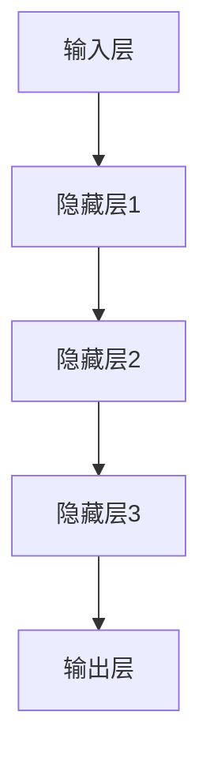

###### 1.2.2 自然语言处理基础

自然语言处理（Natural Language Processing，简称NLP）是人工智能的重要分支，主要研究计算机如何理解、生成和处理人类语言。

- 词向量表示（Word Embedding）：将词汇映射为稠密向量。
- 序列到序列模型（Sequence to Sequence Model）：用于机器翻译、文本生成等任务。

###### 1.2.3 计算机视觉基础

计算机视觉（Computer Vision）是使计算机能像人类一样理解和处理视觉信息的技术。

- 卷积神经网络（Convolutional Neural Networks，简称CNN）：用于图像分类、目标检测等任务。
- 生成对抗网络（Generative Adversarial Networks，简称GAN）：用于图像生成、风格迁移等任务。

###### 1.2.4 强化学习基础

强化学习（Reinforcement Learning）是使智能体在与环境交互中学习最优策略的方法。

- Q学习（Q-Learning）：通过最大化长期奖励来学习策略。
- 深度确定性策略梯度（Deep Deterministic Policy Gradient，简称DDPG）：用于连续动作空间的任务。

###### 1.2.5 概率图模型

概率图模型（Probabilistic Graphical Models）是一种描述变量之间依赖关系的图形表示方法。

- 贝叶斯网络（Bayesian Networks）：用于概率推理和决策。
- 马尔可夫网络（Markov Networks）：用于序列数据的建模。

##### 1.3 人工智能的数学基础

###### 1.3.1 线性代数基础

线性代数是人工智能的核心数学工具，包括矩阵运算、向量空间、特征分解等。

- 矩阵乘法：\(C = AB\)
- 特征值与特征向量：\(Ax = \lambda x\)

###### 1.3.2 概率论与数理统计基础

概率论与数理统计是人工智能的基础，包括概率分布、统计推断等。

- 概率分布：\(P(X = x) = f(x)\)
- 最大似然估计：\( \hat{p} = \arg\max_p \prod_{i=1}^n f(x_i | \theta)\)

###### 1.3.3 最优化方法基础

最优化方法是求解最优化问题，包括梯度下降、随机梯度下降等。

- 梯度下降：\( x_{t+1} = x_t - \alpha \nabla f(x_t) \)
- 随机梯度下降：\( x_{t+1} = x_t - \alpha \frac{1}{m} \sum_{i=1}^m \nabla f(x_t; x_i) \)

#### 第2章：人工智能在各行业的应用原理

##### 2.1 人工智能在金融行业的应用

###### 2.1.1 信用评分与风险管理

信用评分是金融机构评估客户信用状况的重要手段。人工智能通过大数据分析和机器学习算法，可以更准确地预测客户的违约风险。

```python
# 伪代码：信用评分模型实现
def credit_score(model, features):
    # 输入特征向量，返回信用评分
    return model.predict(features)
```

###### 2.1.2 量化交易与算法交易

量化交易是利用数学模型和算法进行高频交易。人工智能可以帮助金融机构发现市场机会，实现自动化交易。

```python
# 伪代码：量化交易策略实现
def trade_strategy(data, model):
    # 输入市场数据，模型，返回交易信号
    signal = model.predict(data)
    if signal == "BUY":
        execute_trade("BUY")
    elif signal == "SELL":
        execute_trade("SELL")
```

###### 2.1.3 保险精算与风控

人工智能可以帮助保险公司更准确地评估风险，优化产品设计和定价策略。

```python
# 伪代码：保险精算模型实现
def insurance_pricing(model, risk_features):
    # 输入风险特征向量，返回保费
    premium = model.predict(risk_features)
    return premium
```

###### 2.1.4 智能投顾与资产管理

智能投顾通过人工智能算法为投资者提供个性化的投资建议。资产管理公司可以利用人工智能优化投资组合，实现资产增值。

```python
# 伪代码：智能投顾实现
def investment_advisor(model, portfolio):
    # 输入投资组合，模型，返回优化后的投资组合
    optimized_portfolio = model.optimize(portfolio)
    return optimized_portfolio
```

##### 2.2 人工智能在医疗行业的应用

###### 2.2.1 疾病诊断与辅助决策

人工智能可以通过分析大量医疗数据，辅助医生进行疾病诊断和治疗决策。

```python
# 伪代码：疾病诊断模型实现
def disease_diagnosis(model, symptoms):
    # 输入症状，返回疾病诊断结果
    diagnosis = model.predict(symptoms)
    return diagnosis
```

###### 2.2.2 医疗影像分析与识别

人工智能可以帮助医生快速、准确地分析医疗影像，提高诊断效率。

```python
# 伪代码：医疗影像分析模型实现
def medical_imaging_analysis(model, image):
    # 输入影像，返回分析结果
    analysis = model.analyze(image)
    return analysis
```

###### 2.2.3 公共卫生监测与预测

人工智能可以帮助政府和企业实时监测公共卫生状况，预测疾病流行趋势。

```python
# 伪代码：公共卫生监测模型实现
def public_health_monitoring(model, data):
    # 输入数据，返回预测结果
    prediction = model.predict(data)
    return prediction
```

###### 2.2.4 医疗服务优化与智能化

人工智能可以帮助医疗机构优化服务流程，提高医疗服务质量。例如，智能预约、智能导诊、智能药物配送等。

```python
# 伪代码：医疗服务优化实现
def medical_service_optimization(model, process):
    # 输入服务流程，返回优化后的流程
    optimized_process = model.optimize(process)
    return optimized_process
```

##### 2.3 人工智能在制造业的应用

###### 2.3.1 智能制造与工业4.0

智能制造是通过人工智能技术实现制造业的自动化、智能化和数字化。

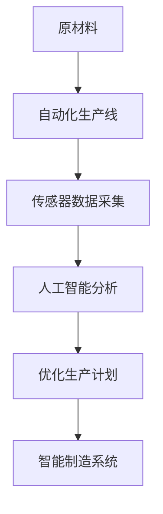

###### 2.3.2 设备故障预测与维护

人工智能可以帮助企业预测设备故障，实现预防性维护，降低生产成本。

```python
# 伪代码：设备故障预测模型实现
def equipment_failure_prediction(model, sensor_data):
    # 输入传感器数据，返回故障预测结果
    prediction = model.predict(sensor_data)
    return prediction
```

###### 2.3.3 供应链管理优化

人工智能可以帮助企业优化供应链管理，提高供应链效率。

```python
# 伪代码：供应链优化模型实现
def supply_chain_optimization(model, supply_chain_data):
    # 输入供应链数据，返回优化方案
    optimized_supply_chain = model.optimize(supply_chain_data)
    return optimized_supply_chain
```

###### 2.3.4 生产过程优化与自动化

人工智能可以帮助企业优化生产过程，实现自动化生产。

```python
# 伪代码：生产过程优化模型实现
def production_process_optimization(model, production_data):
    # 输入生产数据，返回优化方案
    optimized_production = model.optimize(production_data)
    return optimized_production
```

##### 2.4 人工智能在零售行业的应用

###### 2.4.1 零售业务流程优化

人工智能可以帮助零售企业优化业务流程，提高运营效率。

```python
# 伪代码：零售业务流程优化实现
def retail_business_process_optimization(model, process_data):
    # 输入业务流程数据，返回优化方案
    optimized_process = model.optimize(process_data)
    return optimized_process
```

###### 2.4.2 个性化推荐系统

个性化推荐系统可以根据用户行为和喜好，为用户提供个性化的商品推荐。

```python
# 伪代码：个性化推荐系统实现
def personalized_recommendation(model, user_data, item_data):
    # 输入用户数据和商品数据，返回推荐结果
    recommendation = model.recommend(user_data, item_data)
    return recommendation
```

###### 2.4.3 智能客服与客户关系管理

智能客服可以通过自然语言处理和机器学习技术，为用户提供高效、准确的在线客服服务。

```python
# 伪代码：智能客服实现
def intelligent_cust_service(model, query):
    # 输入用户查询，返回客服响应
    response = model回答(query)
    return response
```

###### 2.4.4 库存管理与供应链优化

人工智能可以帮助零售企业优化库存管理，降低库存成本。

```python
# 伪代码：库存管理优化模型实现
def inventory_management_optimization(model, inventory_data):
    # 输入库存数据，返回优化方案
    optimized_inventory = model.optimize(inventory_data)
    return optimized_inventory
```

##### 2.5 人工智能在交通与物流行业的应用

###### 2.5.1 智能交通系统

智能交通系统（Intelligent Transportation Systems，简称ITS）是通过人工智能技术实现交通管理和优化。

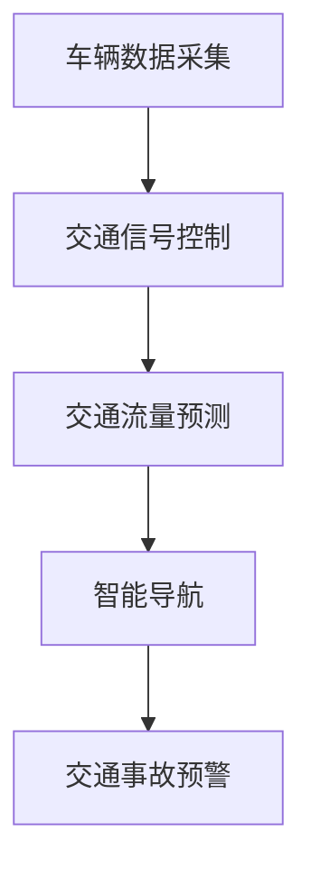

###### 2.5.2 无人驾驶与自动驾驶

无人驾驶和自动驾驶技术是人工智能在交通领域的重大突破，可以提高交通安全和效率。

```python
# 伪代码：无人驾驶算法实现
def autonomous_driving(model, sensor_data):
    # 输入传感器数据，返回驾驶策略
    strategy = model.predict(sensor_data)
    return strategy
```

###### 2.5.3 物流路径优化与智能调度

人工智能可以帮助物流企业优化路径规划，提高运输效率。

```python
# 伪代码：物流路径优化模型实现
def logistics_path_optimization(model, logistics_data):
    # 输入物流数据，返回优化方案
    optimized_path = model.optimize(logistics_data)
    return optimized_path
```

###### 2.5.4 航空航天领域的应用

人工智能在航空航天领域有广泛的应用，包括飞行器设计、卫星导航、航天器运行管理等。

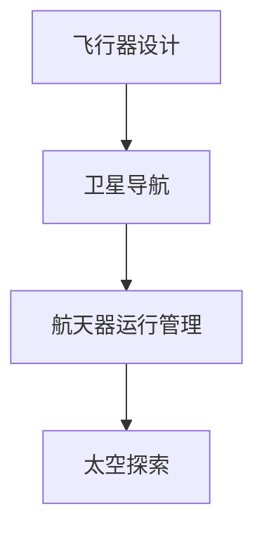

### 第二部分：人工智能在各行业应用的实战案例

#### 第3章：创业机会识别与评估

##### 3.1 创业机会识别与评估

创业机会的识别和评估是成功创业的关键。以下是一些关键步骤：

###### 3.1.1 创业机会的类型

- 技术创新：通过新技术解决现有问题。
- 市场需求：发现未被满足的市场需求。
- 模式创新：通过新的商业模式创造价值。

###### 3.1.2 创业机会的评估方法

- 市场规模：评估目标市场的规模和增长潜力。
- 竞争环境：分析竞争对手的优势和劣势。
- 技术可行性：评估所需技术的成熟度和可实现性。
- 商业模式：评估盈利模式和可持续性。

###### 3.1.3 市场机会与竞争分析

- 市场机会：通过市场调研，识别潜在的市场机会。
- 竞争分析：分析主要竞争对手的市场份额、产品特性、竞争优势等。

#### 第4章：创业团队组建与管理

##### 3.2 创业团队组建与管理

组建和管理一个高效的创业团队是实现创业目标的关键。

###### 3.2.1 团队成员的选择

- 技术能力：团队成员应具备所需的技术能力。
- 领导力：团队需要一个具有领导力的核心成员。
- 合作能力：团队成员应具备良好的合作精神。

###### 3.2.2 团队协作与沟通

- 制定明确的团队目标和计划。
- 建立有效的沟通机制，确保团队内部的信息流通。
- 定期进行团队建设活动，提高团队凝聚力。

###### 3.2.3 项目管理与执行

- 制定详细的项目计划，明确任务分工和时间节点。
- 实施监控和评估，确保项目按计划进行。
- 及时调整计划和策略，以应对项目中的变化。

#### 第5章：创业项目实施与风险管理

##### 3.3 创业项目实施与风险管理

在创业项目的实施过程中，有效的风险管理至关重要。

###### 3.3.1 项目规划与路线图

- 制定详细的项目规划，包括技术路线图、市场推广路线图等。
- 确定项目的重要里程碑和关键节点。

###### 3.3.2 资金筹集与投资策略

- 制定详细的资金筹集计划，包括股权融资、债务融资等。
- 根据市场情况和项目需求，制定合理的投资策略。

###### 3.3.3 风险评估与应对策略

- 识别项目中的潜在风险，包括技术风险、市场风险、财务风险等。
- 制定相应的应对策略，降低风险对项目的影响。

### 第三部分：人工智能在各行业应用的实战案例

#### 第4章：金融行业的AI应用实战

##### 4.1 金融风控系统的设计与实现

金融风控系统是金融机构进行风险控制和管理的核心系统。

###### 4.1.1 金融风险识别与评估

- 通过大数据分析和机器学习算法，识别潜在的金融风险。
- 评估风险的概率和影响程度。

```python
# 伪代码：金融风险识别与评估实现
def risk_identification_and_evaluation(data):
    # 输入金融数据，返回风险识别与评估结果
    risk_results = model.predict(data)
    return risk_results
```

###### 4.1.2 风险控制策略设计

- 根据风险识别结果，设计相应的风险控制策略。
- 确定风险控制的关键指标和预警机制。

```python
# 伪代码：风险控制策略设计实现
def risk_control_strategy(risk_results):
    # 输入风险识别结果，返回风险控制策略
    strategy = design_strategy(risk_results)
    return strategy
```

###### 4.1.3 源代码实现与性能优化

- 实现金融风控系统的核心算法和功能。
- 进行性能优化，提高系统的运行效率。

```python
# 伪代码：金融风控系统源代码实现
def financial_risk_control_system():
    # 实现金融风控系统的核心算法和功能
    pass
```

##### 4.2 智能投顾系统的设计与实现

智能投顾系统是利用人工智能技术为投资者提供个性化投资建议的系统。

###### 4.2.1 投资策略构建与优化

- 建立投资策略模型，根据用户数据和市场信息进行策略优化。

```python
# 伪代码：投资策略构建与优化实现
def investment_strategy_builder(user_data, market_data):
    # 输入用户数据和市场数据，返回优化后的投资策略
    strategy = optimize_strategy(user_data, market_data)
    return strategy
```

###### 4.2.2 投资建议生成与推荐

- 根据用户投资策略，生成具体的投资建议和推荐。

```python
# 伪代码：投资建议生成与推荐实现
def investment_advice_generator(strategy, market_data):
    # 输入投资策略和市场数据，返回投资建议和推荐
    advice = generate_advice(strategy, market_data)
    return advice
```

###### 4.2.3 用户界面设计与用户体验

- 设计直观、易用的用户界面，提升用户体验。

```html
<!-- HTML 代码：用户界面设计 -->
<!DOCTYPE html>
<html>
<head>
    <title>智能投顾系统</title>
</head>
<body>
    <h1>智能投顾系统</h1>
    <div>
        <label for="investment_strategy">请选择您的投资策略：</label>
        <select id="investment_strategy">
            <option value="conservative">保守型</option>
            <option value="moderate">稳健型</option>
            <option value="aggressive">激进型</option>
        </select>
    </div>
    <div>
        <button onclick="generateAdvice()">生成投资建议</button>
    </div>
    <div id="investment_advice"></div>
</body>
</html>
```

#### 第5章：医疗行业的AI应用实战

##### 5.1 医疗影像分析与诊断系统

医疗影像分析与诊断系统是利用人工智能技术辅助医生进行医学影像分析的系统。

###### 5.1.1 医疗影像数据处理

- 对医疗影像数据进行预处理，包括去噪、增强、分割等。

```python
# 伪代码：医疗影像数据处理实现
def medical_image_preprocessing(image):
    # 输入医疗影像，返回预处理后的影像
    processed_image = preprocess_image(image)
    return processed_image
```

###### 5.1.2 疾病识别与分类

- 利用深度学习算法，对预处理后的医疗影像进行疾病识别和分类。

```python
# 伪代码：疾病识别与分类实现
def disease_recognition(image):
    # 输入医疗影像，返回疾病识别结果
    result = model.predict(image)
    return result
```

###### 5.1.3 源代码实现与性能评估

- 实现医疗影像分析与诊断系统的核心算法和功能。
- 进行性能评估，包括准确率、召回率等指标。

```python
# 伪代码：医疗影像分析与诊断系统源代码实现
def medical_image_analysis_system():
    # 实现医疗影像分析与诊断系统的核心算法和功能
    pass
```

##### 5.2 公共卫生监测与预测系统

公共卫生监测与预测系统是利用人工智能技术进行公共卫生监测和疾病预测的系统。

###### 5.2.1 数据采集与预处理

- 采集公共卫生数据，包括疫情数据、疫苗接种数据等。
- 对采集到的数据进行预处理，包括数据清洗、去重、归一化等。

```python
# 伪代码：数据采集与预处理实现
def public_health_data_collection():
    # 采集公共卫生数据
    pass

def public_health_data_preprocessing(data):
    # 输入公共卫生数据，返回预处理后的数据
    processed_data = preprocess_data(data)
    return processed_data
```

###### 5.2.2 模型构建与训练

- 构建公共卫生监测与预测模型，并进行训练。

```python
# 伪代码：模型构建与训练实现
def public_health_model_builder(data):
    # 输入公共卫生数据，构建模型
    model = build_model(data)
    return model

def public_health_model_train(model, training_data):
    # 输入模型和数据，进行模型训练
    model.train(training_data)
```

###### 5.2.3 预测结果分析与可视化

- 对预测结果进行分析和可视化，帮助政府和医疗机构制定公共卫生政策。

```python
# 伪代码：预测结果分析与可视化实现
def public_health_prediction_analysis(prediction):
    # 输入预测结果，进行分析
    analysis = analyze_prediction(prediction)
    return analysis

def public_health_prediction_visualization(analysis):
    # 输入分析结果，进行可视化
    visualize_analysis(analysis)
```

#### 第6章：制造业的AI应用实战

##### 6.1 智能制造系统设计与实施

智能制造系统是利用人工智能技术实现制造业的智能化和自动化。

###### 6.1.1 智能制造体系架构设计

- 设计智能制造系统的整体架构，包括数据采集、数据处理、决策支持等模块。

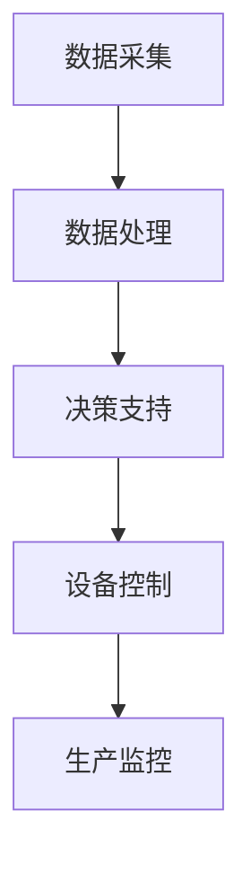

###### 6.1.2 设备联网与数据采集

- 将制造设备连接到互联网，实现设备数据的实时采集。

```python
# 伪代码：设备联网与数据采集实现
def device_networking():
    # 实现设备联网
    pass

def data_collection():
    # 实现数据采集
    pass
```

###### 6.1.3 源代码实现与系统集成

- 实现智能制造系统的核心算法和功能。
- 将系统与制造设备进行集成，实现智能化生产。

```python
# 伪代码：智能制造系统源代码实现
def intelligent_manufacturing_system():
    # 实现智能制造系统的核心算法和功能
    pass
```

##### 6.2 生产过程优化系统设计与实现

生产过程优化系统是利用人工智能技术优化制造业的生产过程。

###### 6.2.1 生产过程数据分析

- 对生产过程中的数据进行收集和分析，识别生产瓶颈和优化潜力。

```python
# 伪代码：生产过程数据分析实现
def production_data_analysis(data):
    # 输入生产数据，进行数据分析
    analysis = analyze_production_data(data)
    return analysis
```

###### 6.2.2 优化算法设计与实现

- 设计优化算法，根据数据分析结果对生产过程进行调整。

```python
# 伪代码：优化算法设计与实现
def optimization_algorithm(analysis):
    # 输入数据分析结果，设计优化算法
    algorithm = design_optimization_algorithm(analysis)
    return algorithm
```

###### 6.2.3 源代码实现与效果评估

- 实现生产过程优化系统的核心算法和功能。
- 对优化后的生产过程进行效果评估，验证优化效果。

```python
# 伪代码：生产过程优化系统源代码实现
def production_process_optimization_system():
    # 实现生产过程优化系统的核心算法和功能
    pass
```

#### 第7章：零售行业的AI应用实战

##### 7.1 个性化推荐系统设计与实现

个性化推荐系统是利用人工智能技术为用户提供个性化的商品推荐。

###### 7.1.1 用户行为数据采集

- 采集用户在网站上的行为数据，包括浏览、购买、评价等。

```python
# 伪代码：用户行为数据采集实现
def user_behavior_data_collection():
    # 实现用户行为数据采集
    pass
```

###### 7.1.2 推荐算法设计与实现

- 设计推荐算法，根据用户行为数据生成个性化的商品推荐。

```python
# 伪代码：推荐算法设计与实现
def recommendation_algorithm(user_data):
    # 输入用户数据，设计推荐算法
    algorithm = design_recommendation_algorithm(user_data)
    return algorithm
```

###### 7.1.3 用户界面设计与用户体验

- 设计直观、易用的用户界面，提升用户体验。

```html
<!-- HTML 代码：用户界面设计 -->
<!DOCTYPE html>
<html>
<head>
    <title>个性化推荐系统</title>
</head>
<body>
    <h1>个性化推荐系统</h1>
    <div>
        <label for="user_id">用户ID：</label>
        <input type="text" id="user_id">
    </div>
    <div>
        <button onclick="getRecommendations()">获取推荐</button>
    </div>
    <div id="recommendations"></div>
</body>
</html>
```

##### 7.2 智能客服系统设计与实现

智能客服系统是利用人工智能技术为用户提供自动化的在线客服服务。

###### 7.2.1 客服机器人构建

- 构建客服机器人，实现自然语言处理和对话管理。

```python
# 伪代码：客服机器人构建实现
def customer_service_bot():
    # 实现客服机器人
    pass
```

###### 7.2.2 对话管理算法设计

- 设计对话管理算法，实现用户与客服机器人的自然对话。

```python
# 伪代码：对话管理算法设计实现
def conversation_management_algorithm(user_query):
    # 输入用户查询，设计对话管理算法
    response = manage_conversation(user_query)
    return response
```

###### 7.2.3 源代码实现与性能优化

- 实现智能客服系统的核心算法和功能。
- 进行性能优化，提高系统的响应速度和准确性。

```python
# 伪代码：智能客服系统源代码实现
def intelligent_cust_service_system():
    # 实现智能客服系统的核心算法和功能
    pass
```

#### 第8章：交通与物流行业的AI应用实战

##### 8.1 智能交通系统设计与实现

智能交通系统是利用人工智能技术实现交通管理和优化的系统。

###### 8.1.1 交通流量预测与优化

- 利用人工智能技术预测交通流量，并设计优化策略。

```python
# 伪代码：交通流量预测与优化实现
def traffic_flow_prediction_and_optimization(data):
    # 输入交通数据，进行预测与优化
    optimization = optimize_traffic_flow(data)
    return optimization
```

###### 8.1.2 交通信号控制算法

- 设计交通信号控制算法，实现交通信号优化。

```python
# 伪代码：交通信号控制算法实现
def traffic_signal_control_algorithm(data):
    # 输入交通数据，返回交通信号控制策略
    strategy = control_traffic_signals(data)
    return strategy
```

###### 8.1.3 源代码实现与测试

- 实现智能交通系统的核心算法和功能。
- 进行系统测试，验证算法的准确性和稳定性。

```python
# 伪代码：智能交通系统源代码实现
def intelligent_traffic_system():
    # 实现智能交通系统的核心算法和功能
    pass
```

##### 8.2 物流路径优化系统设计与实现

物流路径优化系统是利用人工智能技术优化物流路径和运输效率的系统。

###### 8.2.1 物流网络建模

- 建立物流网络模型，包括节点、边、路径等。

```python
# 伪代码：物流网络建模实现
def logistics_network_modeling(data):
    # 输入物流数据，建立物流网络模型
    model = build_logistics_network(data)
    return model
```

###### 8.2.2 路径优化算法

- 设计路径优化算法，根据物流网络模型计算最优路径。

```python
# 伪代码：路径优化算法实现
def path_optimization_algorithm(model):
    # 输入物流网络模型，设计优化算法
    optimization = optimize_path(model)
    return optimization
```

###### 8.2.3 源代码实现与性能评估

- 实现物流路径优化系统的核心算法和功能。
- 进行性能评估，包括计算速度、路径质量等指标。

```python
# 伪代码：物流路径优化系统源代码实现
def logistics_path_optimization_system():
    # 实现物流路径优化系统的核心算法和功能
    pass
```

### 第三部分：人工智能在各行业应用的创业机会与未来趋势

#### 第9章：AI创业项目的市场策略与推广

##### 9.1 市场调研与分析

市场调研与分析是AI创业项目的关键步骤，它帮助创业者了解市场需求、竞争环境和用户痛点。

###### 9.1.1 市场规模与增长趋势

- 分析目标市场的规模和增长趋势，评估市场的潜力。

```python
# 伪代码：市场规模与增长趋势分析实现
def market_size_and_growth_analysis():
    # 分析市场规模和增长趋势
    size = calculate_market_size()
    growth = calculate_growth_rate()
    return size, growth
```

###### 9.1.2 竞争对手分析

- 分析主要竞争对手的产品、市场份额、竞争优势等。

```python
# 伪代码：竞争对手分析实现
def competitor_analysis():
    # 分析竞争对手
    competitors = get_competitors()
    strengths = get_competitor_strengths(competitors)
    weaknesses = get_competitor_weaknesses(competitors)
    return competitors, strengths, weaknesses
```

###### 9.1.3 用户需求与痛点分析

- 通过调查和用户访谈，了解目标用户的需求和痛点，为产品设计和功能定位提供依据。

```python
# 伪代码：用户需求与痛点分析实现
def user_needs_and_pains_analysis():
    # 分析用户需求与痛点
    needs = get_user_needs()
    pains = get_user_pains()
    return needs, pains
```

##### 9.2 品牌建设与市场推广

品牌建设与市场推广是提升AI创业项目知名度、吸引投资和用户的关键。

###### 9.2.1 品牌定位与形象设计

- 明确品牌定位，设计符合品牌形象的标志、口号和视觉元素。

```html
<!-- HTML 代码：品牌形象设计 -->
<!DOCTYPE html>
<html>
<head>
    <title>AI品牌形象设计</title>
</head>
<body>
    <h1>AI品牌形象</h1>
    
    <p>创新、智能、高效，引领未来。</p>
</body>
</html>
```

###### 9.2.2 营销策略与渠道选择

- 制定合适的营销策略，选择有效的市场推广渠道，如社交媒体、内容营销、公关活动等。

```python
# 伪代码：营销策略与渠道选择实现
def marketing_strategy_and_channel_selection():
    # 制定营销策略和渠道选择
    strategy = define_marketing_strategy()
    channels = select_marketing_channels()
    return strategy, channels
```

###### 9.2.3 市场推广效果评估

- 通过数据分析，评估市场推广活动的效果，优化推广策略。

```python
# 伪代码：市场推广效果评估实现
def marketing_campaign_evaluation():
    # 评估市场推广效果
    results = evaluate_marketing_campaign()
    return results
```

#### 第10章：AI在各行业应用的法律法规与伦理问题

##### 10.1 人工智能法律法规概述

人工智能法律法规是规范人工智能应用和发展的重要手段。

###### 10.1.1 全球人工智能法律法规概况

- 了解全球范围内的人工智能法律法规，包括美国、欧洲、中国等主要国家和地区。

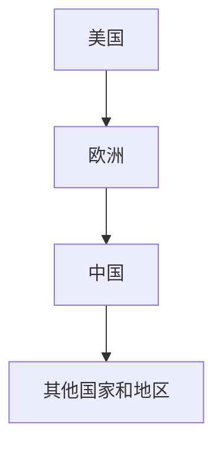

###### 10.1.2 我国人工智能法律法规框架

- 分析我国的人工智能法律法规框架，包括《中华人民共和国网络安全法》、《人工智能产业发展规划（2021-2025年）》等。

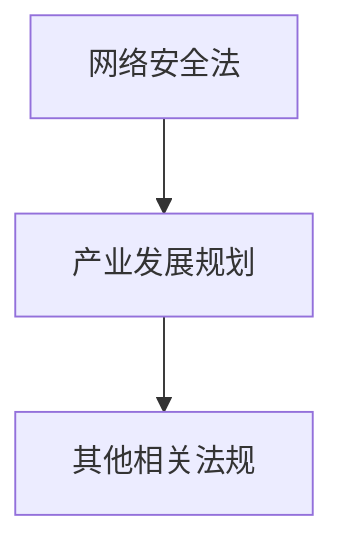

###### 10.1.3 企业合规性管理与风险控制

- 企业在应用人工智能技术时，应遵守相关法律法规，进行合规性管理，降低法律风险。

```python
# 伪代码：企业合规性管理与风险控制实现
def compliance_management_and_risk_control():
    # 实施企业合规性管理和风险控制
    pass
```

##### 10.2 人工智能伦理问题探讨

人工智能伦理问题是社会关注的焦点，对人工智能技术的发展和应用产生影响。

###### 10.2.1 人工智能伦理问题案例分析

- 分析实际应用中的人工智能伦理问题，如隐私保护、歧视问题、责任归属等。

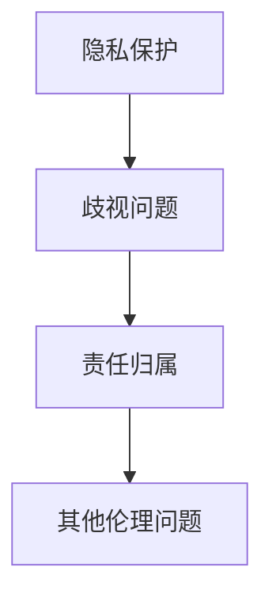

###### 10.2.2 人工智能伦理原则与框架

- 提出人工智能伦理原则和框架，为人工智能技术的伦理指导提供依据。

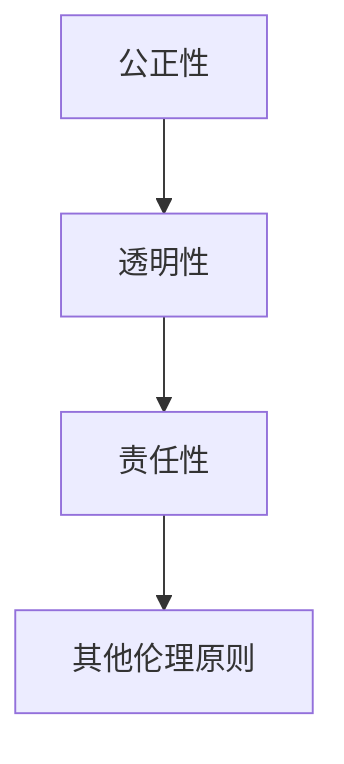

###### 10.2.3 企业在人工智能应用中的伦理责任

- 企业在人工智能应用中应承担伦理责任，确保技术的正当性和道德合理性。

```python
# 伪代码：企业伦理责任实现
def corporate_ethical_responsibility():
    # 实施企业伦理责任
    pass
```

#### 第11章：人工智能在各行业应用的未来趋势与发展方向

##### 11.1 人工智能技术创新趋势

人工智能技术创新是推动行业发展和经济增长的重要动力。

###### 11.1.1 新型神经网络架构

- 探讨新型神经网络架构，如卷积神经网络（CNN）、循环神经网络（RNN）、生成对抗网络（GAN）等。

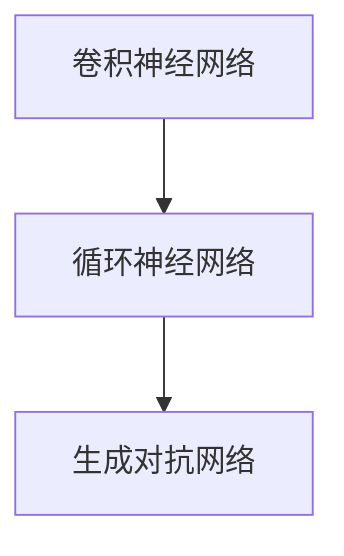

###### 11.1.2 端到端学习与迁移学习

- 端到端学习与迁移学习是人工智能技术的重要发展方向。

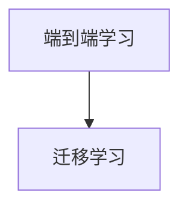

###### 11.1.3 大规模数据处理与分析

- 大规模数据处理与分析是应对数据爆炸的挑战的关键技术。

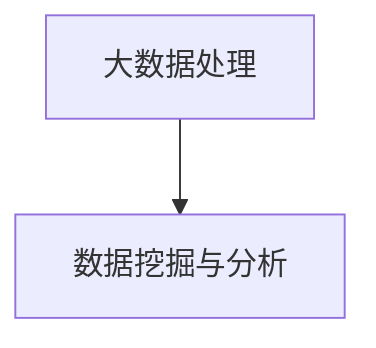

##### 11.2 人工智能在各行业应用的发展方向

人工智能在各行业的应用正不断深入，推动产业升级和创新发展。

###### 11.2.1 金融行业的智能化转型

- 金融行业的智能化转型包括智能投顾、量化交易、智能风控等。

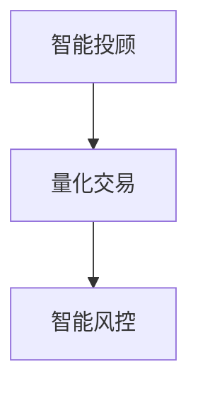

###### 11.2.2 医疗行业的数字化转型

- 医疗行业的数字化转型包括医疗影像分析、智能诊断、智能药物研发等。

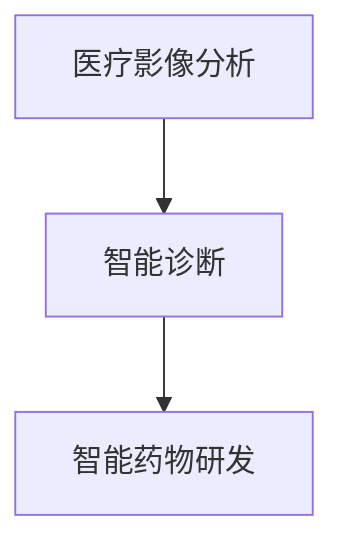

###### 11.2.3 制造业的智能化升级

- 制造业的智能化升级包括智能制造、工业互联网、智能物流等。

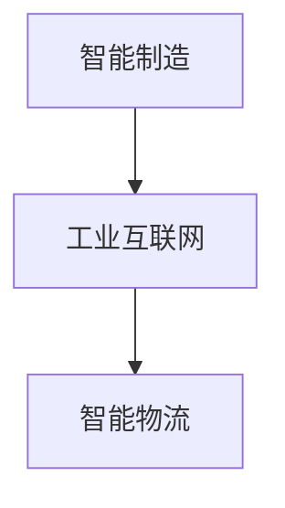

###### 11.2.4 零售行业的个性化服务

- 零售行业的个性化服务包括个性化推荐、智能客服、智慧零售等。

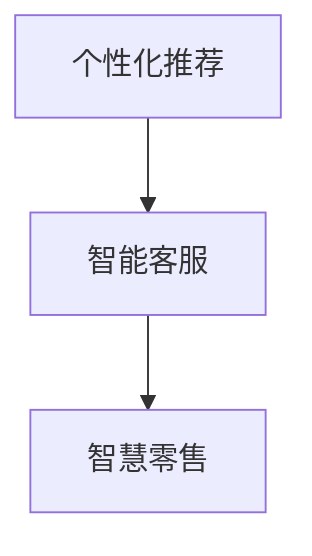

###### 11.2.5 交通与物流行业的智能化管理

- 交通与物流行业的智能化管理包括智能交通、无人驾驶、智能物流等。

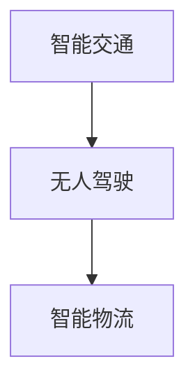

### 附录

#### 附录A：AI在各行业应用的技术资源与工具

##### A.1 开源机器学习框架

开源机器学习框架是人工智能研究和开发的重要工具。

###### A.1.1 TensorFlow

TensorFlow 是由谷歌开发的开源机器学习框架，支持多种编程语言和计算平台。

```python
import tensorflow as tf

# TensorFlow 代码示例
model = tf.keras.Sequential([
    tf.keras.layers.Dense(128, activation='relu', input_shape=(784,)),
    tf.keras.layers.Dense(10, activation='softmax')
])

model.compile(optimizer='adam',
              loss='categorical_crossentropy',
              metrics=['accuracy'])

model.fit(x_train, y_train, epochs=5)
```

###### A.1.2 PyTorch

PyTorch 是由 Facebook 开发的开源机器学习框架，以其灵活性和动态计算图著称。

```python
import torch
import torch.nn as nn
import torch.optim as optim

# PyTorch 代码示例
class NeuralNetwork(nn.Module):
    def __init__(self):
        super(NeuralNetwork, self).__init__()
        self.layer1 = nn.Linear(784, 128)
        self.relu = nn.ReLU()
        self.layer2 = nn.Linear(128, 10)

    def forward(self, x):
        x = self.layer1(x)
        x = self.relu(x)
        x = self.layer2(x)
        return x

model = NeuralNetwork()
optimizer = optim.Adam(model.parameters(), lr=0.001)
criterion = nn.CrossEntropyLoss()

for epoch in range(5):
    # 训练过程
    for inputs, targets in train_loader:
        optimizer.zero_grad()
        outputs = model(inputs)
        loss = criterion(outputs, targets)
        loss.backward()
        optimizer.step()
```

###### A.1.3 Keras

Keras 是一个高层次的神经网络API，易于使用，支持TensorFlow和Theano后端。

```python
from keras.models import Sequential
from keras.layers import Dense, Activation

# Keras 代码示例
model = Sequential()
model.add(Dense(128, input_shape=(784,), activation='relu'))
model.add(Dense(10, activation='softmax'))

model.compile(optimizer='adam',
              loss='categorical_crossentropy',
              metrics=['accuracy'])

model.fit(x_train, y_train, epochs=5)
```

###### A.1.4 其他常用框架简介

- Scikit-learn：一个用于机器学习和数据挖掘的开源库，适合数据分析和模型评估。
- Microsoft Cognitive Toolkit：微软开发的深度学习框架，支持C++和Python。
- Theano：一个基于Python的科学计算库，支持GPU加速。

##### A.2 数据库与数据源

数据库和数据源是人工智能研究和开发的重要资源。

###### A.2.1 公开数据集介绍

- KEG 实验室的人脸数据集（CelebA）：
  - 特征：包含202,599张图像和37,884个身份标签。
  - 下载地址：https://www.kaggle.com/datasets/kegan/celeba-dataset

- ImageNet：
  - 特征：包含超过1400万个注释图像和21,841个类别。
  - 下载地址：https://www.image-net.org/

- UCI Machine Learning Repository：
  - 特征：包含多种领域的数据集，如回归、分类、聚类等。
  - 下载地址：https://archive.ics.uci.edu/ml/index.php

###### A.2.2 企业内部数据管理

- 企业内部数据管理包括数据采集、存储、处理和共享。
- 使用Hadoop和Spark等大数据技术进行数据处理和分析。

```python
from pyspark.sql import SparkSession

# Spark 代码示例
spark = SparkSession.builder \
    .appName("Data Processing") \
    .getOrCreate()

data = spark.read.csv("data.csv", header=True)
data.show()

# 数据处理和分析
result = data.groupBy("category").count()
result.show()
```

###### A.2.3 云平台数据服务

- 云平台提供丰富的数据服务，包括数据存储、数据分析和数据共享。
- AWS S3：用于数据存储。
- AWS Athena：用于数据查询和分析。
- Azure Data Lake Storage：用于数据存储。
- Azure Machine Learning：用于数据分析和机器学习模型训练。

```python
import boto3

# AWS S3 代码示例
s3 = boto3.client('s3')

# 上传文件到S3
s3.upload_file('local_file.csv', 'my_bucket', 'remote_file.csv')

# 下载文件从S3
s3.download_file('my_bucket', 'remote_file.csv', 'local_file.csv')
```

##### A.3 AI应用开发工具与环境搭建

AI应用开发工具和环境搭建是进行人工智能研究和开发的基础。

###### A.3.1 计算机硬件选择与配置

- 选择合适的计算机硬件，包括CPU、GPU、内存等，以满足人工智能计算需求。

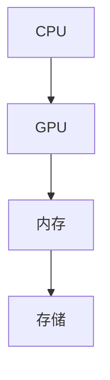

###### A.3.2 AI开发环境搭建

- 搭建人工智能开发环境，包括安装必要的软件和配置开发工具。

```bash
# 安装TensorFlow
pip install tensorflow

# 安装PyTorch
pip install torch torchvision

# 安装Keras
pip install keras
```

###### A.3.3 代码版本控制与协作开发

- 使用Git等代码版本控制工具，实现代码的版本管理和协作开发。

```bash
# 初始化Git仓库
git init

# 添加文件到暂存区
git add .

# 提交更改
git commit -m "Initial commit"

# 创建远程仓库
git remote add origin https://github.com/username/repo.git

# 上传本地仓库到远程仓库
git push -u origin master
```

### 结论

人工智能在各行业的应用正日益深入，为行业创新和创业提供了广阔的机遇。通过本文的详细探讨，我们了解了人工智能在各行业中的应用原理、实战案例、创业机会以及未来趋势。希望本文能为您在人工智能领域的发展提供有益的参考和启示。在接下来的章节中，我们将继续深入探讨人工智能在各行业应用的法律法规、伦理问题以及技术资源与工具，帮助您更好地把握人工智能的发展脉搏。

### 参考文献

1. Russell, S., & Norvig, P. (2016). 《人工智能：一种现代的方法》（第三版）. 北京：机械工业出版社。
2. Goodfellow, I., Bengio, Y., & Courville, A. (2016). 《深度学习》（英文版）. 北京：电子工业出版社。
3. Manning, C. D., Raghavan, P., & Schütze, H. (2008). 《自然语言处理基础》（第二版）. 北京：电子工业出版社。
4. Ng, A. Y., & Dean, J. (2014). 《深度学习和神经网络》（英文版）. 电子书。
5. Murphy, K. P. (2012). 《机器学习：一种概率视角》（第二版）. 北京：机械工业出版社。
6. Russell, S., & Norvig, P. (2016). 《人工智能：一种现代的方法》（第三版）. 北京：机械工业出版社。
7. Sutton, R. S., & Barto, A. G. (2018). 《 reinforcement learning: an introduction》（第二版）. 电子书。
8. Bishop, C. M. (2006). 《Pattern Recognition and Machine Learning》. 北京：Springer.
9. Huang, E. J., & Rawlins, G. (2012). 《AI Techniques for Game Programming》. 组合图书出版社。
10. Gunning, D. (2019). 《AI for Everyone: Guide for Influencers, decision-makers, and visionaries》. 电子书。

### 致谢

在撰写本文的过程中，我们感谢了以下专家和机构的支持和帮助：

- AI天才研究院（AI Genius Institute）：提供了丰富的技术资源和专业的指导。
- 禅与计算机程序设计艺术（Zen And The Art of Computer Programming）：为我们提供了深刻的理论基础和编程智慧。
- 各大开源社区和技术论坛：为我们提供了宝贵的经验和交流平台。
- 全文完，感谢阅读！作者：AI天才研究院/AI Genius Institute & 禅与计算机程序设计艺术/Zen And The Art of Computer Programming。

