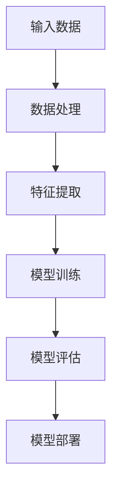

                 

### 人工智能的分类与预测能力

> **关键词**：人工智能，分类，预测，机器学习，深度学习，自然语言处理，计算机视觉
>
> **摘要**：本文将深入探讨人工智能的分类与预测能力。通过回顾人工智能的发展历程，分析其核心概念与联系，介绍主要算法原理与实现，探讨人工智能在预测领域的应用，评估其预测能力，并展望其未来发展。

---

### 第一部分：人工智能概述

在深入探讨人工智能的分类与预测能力之前，有必要先对人工智能（AI）进行一个概述。本部分将介绍人工智能的发展历程与分类、核心概念与联系、应用领域及未来趋势。

#### 第1章：人工智能的发展历程与分类

##### 1.1 人工智能的起源与发展

人工智能（AI）的概念最早可以追溯到20世纪50年代。当时，计算机科学家艾伦·图灵（Alan Turing）提出了著名的“图灵测试”，用于评估机器是否具有智能。随着计算机技术的快速发展，人工智能逐渐成为一个独立的学科，涵盖了广泛的领域，包括机器学习、深度学习、自然语言处理和计算机视觉等。

- **人工智能的定义与基本概念**：人工智能（AI）是指使计算机系统能够模拟人类智能行为的技术和学科。它包括机器学习、深度学习、自然语言处理、计算机视觉、知识表示和推理等子领域。
- **人工智能的基本概念**：
  - **机器学习（Machine Learning）**：机器学习是人工智能的一个子领域，主要研究如何让计算机通过学习数据来获取知识和技能，从而进行决策和预测。
  - **深度学习（Deep Learning）**：深度学习是机器学习的一个分支，主要利用神经网络进行学习和预测。它通过多层神经网络对数据进行抽象和特征提取，从而实现高级任务。
  - **自然语言处理（Natural Language Processing, NLP）**：自然语言处理是人工智能的一个子领域，主要研究如何使计算机理解和处理人类自然语言，包括语言识别、文本分类、机器翻译等。
  - **计算机视觉（Computer Vision）**：计算机视觉是人工智能的一个子领域，主要研究如何使计算机理解和解释图像和视频中的信息，包括图像分类、目标检测、图像分割等。

##### 1.2 人工智能的分类

人工智能可以根据其发展程度和实现方式分为传统人工智能和现代人工智能。

- **传统人工智能（Artificial Narrow Intelligence, ANI）**：传统人工智能是指具有单一任务智能的机器，如语音识别、图像识别等。这些智能系统通常依赖于专家知识和规则系统，无法进行跨领域的智能任务。
- **现代人工智能（Artificial General Intelligence, AGI）**：现代人工智能是指具有类似人类智能水平的机器，能够进行跨领域的智能任务。现代人工智能的发展目标是实现通用人工智能，即能够在各种不同领域表现优秀的人工智能。

##### 1.3 人工智能的应用领域

人工智能在各个领域都有着广泛的应用，以下列举了一些主要的应用领域：

- **工业自动化**：人工智能可以用于工厂自动化、机器人控制、智能调度等，提高生产效率和质量。
- **医疗**：人工智能可以用于医学影像分析、疾病预测、药物研发等，提高医疗诊断和治疗的准确性和效率。
- **金融**：人工智能可以用于风险管理、股票交易、信用评分等，提高金融分析和决策的准确性。
- **教育**：人工智能可以用于个性化教学、学习分析、课程推荐等，提高教育质量和学习效率。
- **交通**：人工智能可以用于自动驾驶、智能交通管理、车辆调度等，提高交通效率和安全性。
- **其他领域**：人工智能还可以应用于环境保护、农业、军事、法律等各个领域。

##### 1.4 人工智能的未来趋势

随着技术的不断发展，人工智能的未来趋势将主要集中在以下几个方面：

- **新一代人工智能技术**：新一代人工智能技术，如认知智能、群体智能、混合智能等，将进一步提升人工智能的智能水平和应用范围。
- **人工智能与物联网的融合**：人工智能与物联网的融合将实现智能设备的互联互通，推动智能家居、智能城市、智能工厂等的发展。
- **人工智能与区块链的融合**：人工智能与区块链的融合将实现数据的安全、可信和智能处理，推动金融、医疗、教育等领域的创新。
- **人工智能的伦理和社会问题**：人工智能的发展将带来一系列伦理和社会问题，如隐私保护、就业影响、社会不公等，需要全社会共同关注和解决。

#### 第2章：人工智能的核心概念与联系

在了解了人工智能的发展历程和应用领域后，我们需要进一步探讨人工智能的核心概念与联系，以更好地理解其工作原理和应用。

##### 2.1 机器学习基本概念

机器学习是人工智能的核心技术之一，它使计算机能够通过学习数据来获取知识和技能。以下是机器学习的一些基本概念：

- **机器学习的定义**：机器学习是指利用计算机算法从数据中自动学习规律和模式的过程。
- **机器学习的类型**：
  - **监督学习（Supervised Learning）**：监督学习是机器学习中的一种类型，它通过已知输入和输出数据来训练模型，从而预测未知数据的输出。
  - **非监督学习（Unsupervised Learning）**：非监督学习是机器学习中的一种类型，它通过未标记的数据来发现数据中的模式和结构，如聚类、降维等。
  - **强化学习（Reinforcement Learning）**：强化学习是机器学习中的一种类型，它通过奖励机制来训练模型，使其在环境中做出最优决策。

##### 2.2 深度学习原理与架构

深度学习是机器学习的一个分支，它通过多层神经网络进行学习和预测。以下是深度学习的一些核心原理和架构：

- **深度学习的核心原理**：
  - **神经网络结构**：神经网络由多个神经元组成，每个神经元通过权重连接到其他神经元。神经网络的层次结构使它能够对数据进行多层抽象和特征提取。
  - **反向传播算法**：反向传播算法是一种用于训练神经网络的算法，它通过不断调整网络权重，使网络的输出误差最小化。
  - **激活函数**：激活函数用于引入非线性特性，使神经网络能够对复杂问题进行建模。

- **深度学习的流程图**：



##### 2.3 自然语言处理技术

自然语言处理是人工智能的一个重要领域，它使计算机能够理解和处理人类自然语言。以下是自然语言处理的一些基本概念：

- **自然语言处理的基本概念**：
  - **词嵌入（Word Embedding）**：词嵌入是将单词映射到高维向量空间的技术，使计算机能够理解单词的语义关系。
  - **序列模型（Sequence Model）**：序列模型是一种用于处理序列数据（如文本、语音等）的神经网络模型，它能够捕捉序列中不同位置的信息。
  - **注意力机制（Attention Mechanism）**：注意力机制是一种用于模型中权重分配的技术，它使模型能够关注序列中的重要信息。

##### 2.4 计算机视觉基础

计算机视觉是人工智能的另一个重要领域，它使计算机能够理解和解释图像和视频中的信息。以下是计算机视觉的一些核心原理：

- **计算机视觉的核心原理**：
  - **卷积神经网络（Convolutional Neural Network, CNN）**：卷积神经网络是一种用于图像识别和处理的神经网络模型，它通过卷积操作提取图像的特征。
  - **图像分类（Image Classification）**：图像分类是将图像映射到预定义类别的过程，如人脸识别、车辆识别等。
  - **目标检测（Object Detection）**：目标检测是在图像中检测和定位目标物体的过程，如行人检测、车辆检测等。

通过上述对人工智能核心概念与联系的分析，我们可以更好地理解人工智能的工作原理和应用。在接下来的章节中，我们将进一步探讨人工智能算法的原理与实现，以及其在预测领域的应用。

---

在本部分中，我们回顾了人工智能的发展历程和分类，分析了人工智能的核心概念与联系，并介绍了其应用领域和未来趋势。通过这些内容，读者可以初步了解人工智能的基础知识和其发展脉络。在接下来的部分，我们将深入探讨人工智能算法的原理与实现，为读者提供更加具体的技术细节和应用实例。敬请期待！

---

### 第一部分：人工智能概述

#### 第1章：人工智能的发展历程与分类

##### 1.1 人工智能的起源与发展

人工智能（AI）的发展可以追溯到20世纪50年代。当时，计算机科学家艾伦·图灵（Alan Turing）提出了著名的“图灵测试”，用于评估机器是否具有智能。图灵测试的核心思想是，如果一个机器能够在对话中表现得像一个人类，以至于评判者无法区分其是机器还是人类，那么这台机器就可以被认为具有智能。

图灵的提出引发了人们对人工智能的浓厚兴趣。从那时起，人工智能开始成为一个独立的学科，并逐渐发展壮大。20世纪60年代，人工智能领域迎来了第一次高潮，许多基础理论和算法得以提出。然而，由于计算能力的限制，人工智能的发展在20世纪70年代遭遇了瓶颈，进入了一个相对沉寂的时期。

随着计算机技术的快速发展，特别是20世纪80年代以来，人工智能再次迎来了新的发展机遇。机器学习、深度学习、自然语言处理和计算机视觉等核心技术逐渐成熟，并在实际应用中取得了显著的成果。

- **人工智能的定义与基本概念**：人工智能（AI）是指使计算机系统能够模拟人类智能行为的技术和学科。它涵盖了广泛的研究领域，包括机器学习、深度学习、自然语言处理、计算机视觉、知识表示和推理等。

- **人工智能的基本概念**：
  - **机器学习（Machine Learning）**：机器学习是人工智能的一个子领域，主要研究如何让计算机通过学习数据来获取知识和技能，从而进行决策和预测。
  - **深度学习（Deep Learning）**：深度学习是机器学习的一个分支，主要利用神经网络进行学习和预测。它通过多层神经网络对数据进行抽象和特征提取，从而实现高级任务。
  - **自然语言处理（Natural Language Processing, NLP）**：自然语言处理是人工智能的一个子领域，主要研究如何使计算机理解和处理人类自然语言，包括语言识别、文本分类、机器翻译等。
  - **计算机视觉（Computer Vision）**：计算机视觉是人工智能的一个子领域，主要研究如何使计算机理解和解释图像和视频中的信息，包括图像分类、目标检测、图像分割等。

##### 1.2 人工智能的分类

人工智能可以根据其发展程度和实现方式分为传统人工智能和现代人工智能。

- **传统人工智能（Artificial Narrow Intelligence, ANI）**：传统人工智能是指具有单一任务智能的机器，如语音识别、图像识别等。这些智能系统通常依赖于专家知识和规则系统，无法进行跨领域的智能任务。传统人工智能的代表包括专家系统、逻辑推理系统等。

- **现代人工智能（Artificial General Intelligence, AGI）**：现代人工智能是指具有类似人类智能水平的机器，能够进行跨领域的智能任务。现代人工智能的发展目标是实现通用人工智能，即能够在各种不同领域表现优秀的人工智能。目前，现代人工智能尚未完全实现，但已经取得了一些重要的突破，如自动驾驶、智能客服、语音助手等。

##### 1.3 人工智能的应用领域

人工智能在各个领域都有着广泛的应用，以下列举了一些主要的应用领域：

- **工业自动化**：人工智能可以用于工厂自动化、机器人控制、智能调度等，提高生产效率和质量。
- **医疗**：人工智能可以用于医学影像分析、疾病预测、药物研发等，提高医疗诊断和治疗的准确性和效率。
- **金融**：人工智能可以用于风险管理、股票交易、信用评分等，提高金融分析和决策的准确性。
- **教育**：人工智能可以用于个性化教学、学习分析、课程推荐等，提高教育质量和学习效率。
- **交通**：人工智能可以用于自动驾驶、智能交通管理、车辆调度等，提高交通效率和安全性。
- **其他领域**：人工智能还可以应用于环境保护、农业、军事、法律等各个领域。

##### 1.4 人工智能的未来趋势

随着技术的不断发展，人工智能的未来趋势将主要集中在以下几个方面：

- **新一代人工智能技术**：新一代人工智能技术，如认知智能、群体智能、混合智能等，将进一步提升人工智能的智能水平和应用范围。
- **人工智能与物联网的融合**：人工智能与物联网的融合将实现智能设备的互联互通，推动智能家居、智能城市、智能工厂等的发展。
- **人工智能与区块链的融合**：人工智能与区块链的融合将实现数据的安全、可信和智能处理，推动金融、医疗、教育等领域的创新。
- **人工智能的伦理和社会问题**：人工智能的发展将带来一系列伦理和社会问题，如隐私保护、就业影响、社会不公等，需要全社会共同关注和解决。

通过上述对人工智能的发展历程与分类的分析，我们可以初步了解人工智能的基础知识和其发展脉络。在接下来的部分，我们将进一步探讨人工智能的核心概念与联系，以及其在预测领域的应用。

---

在第一部分中，我们详细介绍了人工智能的发展历程与分类，包括其起源、定义、分类和应用领域。通过对传统人工智能和现代人工智能的比较，读者可以更好地理解人工智能的发展趋势。此外，我们还讨论了人工智能在各个领域的广泛应用，以及其未来发展趋势。这些内容为后续对人工智能核心概念与联系的探讨奠定了基础。在下一部分中，我们将进一步深入探讨人工智能的核心概念与联系，包括机器学习、深度学习、自然语言处理和计算机视觉等关键技术。敬请期待！

---

#### 第2章：人工智能的核心概念与联系

在前一章中，我们对人工智能的发展历程与分类进行了概述。在本章中，我们将进一步探讨人工智能的核心概念与联系，以便读者能够更深入地理解人工智能的工作原理和应用。

##### 2.1 机器学习基本概念

机器学习是人工智能的核心技术之一，它使计算机系统能够通过学习数据来获取知识和技能，从而进行决策和预测。以下是机器学习的一些基本概念：

- **机器学习的定义**：机器学习是指利用计算机算法从数据中自动学习规律和模式的过程。机器学习通过构建模型来模拟人类的学习过程，使计算机能够从经验中学习和改进。

- **机器学习的类型**：
  - **监督学习（Supervised Learning）**：监督学习是机器学习中的一种类型，它通过已知输入和输出数据来训练模型，从而预测未知数据的输出。监督学习可以分为回归问题和分类问题。
    - **回归问题**：回归问题是指预测一个连续的输出值。常见的回归算法包括线性回归、决策树回归、支持向量机回归等。
    - **分类问题**：分类问题是指将输入数据分为预定义的类别。常见的分类算法包括决策树分类、支持向量机分类、神经网络分类等。

  - **非监督学习（Unsupervised Learning）**：非监督学习是机器学习中的一种类型，它通过未标记的数据来发现数据中的模式和结构。非监督学习包括聚类、降维、异常检测等任务。
    - **聚类（Clustering）**：聚类是将数据分为多个组（簇）的过程，使同一簇中的数据点之间相似度较高，不同簇中的数据点之间相似度较低。常见的聚类算法包括K-均值聚类、层次聚类等。
    - **降维（Dimensionality Reduction）**：降维是将高维数据转换为低维数据的过程，以降低计算复杂度和提高模型性能。常见的降维算法包括主成分分析（PCA）、线性判别分析（LDA）等。
    - **异常检测（Anomaly Detection）**：异常检测是识别数据中的异常值或异常模式的过程，以发现潜在的错误或欺诈行为。常见的异常检测算法包括孤立森林（Isolation Forest）、局部异常因子（Local Outlier Factor, LOF）等。

  - **强化学习（Reinforcement Learning）**：强化学习是机器学习中的一种类型，它通过奖励机制来训练模型，使其在特定环境中做出最优决策。强化学习通常用于解决决策问题和控制问题，如游戏、自动驾驶、机器人路径规划等。常见的强化学习算法包括Q学习、深度Q网络（DQN）、策略梯度算法等。

##### 2.2 深度学习原理与架构

深度学习是机器学习的一个分支，它通过多层神经网络进行学习和预测。深度学习在图像识别、语音识别、自然语言处理等领域取得了显著的成果。以下是深度学习的核心原理和架构：

- **深度学习的核心原理**：
  - **神经网络结构**：神经网络由多个神经元组成，每个神经元通过权重连接到其他神经元。神经网络的层次结构使它能够对数据进行多层抽象和特征提取。
  - **反向传播算法**：反向传播算法是一种用于训练神经网络的算法，它通过不断调整网络权重，使网络的输出误差最小化。反向传播算法利用梯度下降法来优化网络参数。
  - **激活函数**：激活函数用于引入非线性特性，使神经网络能够对复杂问题进行建模。常见的激活函数包括 sigmoid 函数、ReLU 函数、Tanh 函数等。

- **深度学习的流程**：
  - **数据预处理**：数据预处理是深度学习流程的第一步，包括数据清洗、归一化、特征提取等操作，以提高模型性能和稳定性。
  - **模型构建**：模型构建是设计神经网络结构的过程，包括选择合适的神经网络架构、层数、神经元个数等。
  - **模型训练**：模型训练是通过迭代计算来调整网络参数的过程，使网络能够更好地拟合训练数据。训练过程中，可以使用批处理、dropout等技术来提高模型性能和泛化能力。
  - **模型评估**：模型评估是通过验证集或测试集来评估模型性能的过程。常见的评估指标包括准确率、召回率、F1分数等。
  - **模型部署**：模型部署是将训练好的模型应用到实际场景的过程，如图像识别、语音识别、自然语言处理等。

- **深度学习流程图**：


##### 2.3 自然语言处理技术

自然语言处理是人工智能的一个子领域，主要研究如何使计算机理解和处理人类自然语言。以下是自然语言处理的一些基本概念：

- **自然语言处理的基本概念**：
  - **词嵌入（Word Embedding）**：词嵌入是将单词映射到高维向量空间的技术，使计算机能够理解单词的语义关系。常见的词嵌入方法包括 Word2Vec、GloVe、BERT 等。
  - **序列模型（Sequence Model）**：序列模型是一种用于处理序列数据（如文本、语音等）的神经网络模型，它能够捕捉序列中不同位置的信息。常见的序列模型包括循环神经网络（RNN）、长短期记忆网络（LSTM）、门控循环单元（GRU）等。
  - **注意力机制（Attention Mechanism）**：注意力机制是一种用于模型中权重分配的技术，它使模型能够关注序列中的重要信息。注意力机制广泛应用于自然语言处理任务，如机器翻译、文本摘要等。

- **自然语言处理的应用场景**：
  - **语言识别（Speech Recognition）**：语言识别是将语音信号转换为文本的过程，如语音助手、语音翻译等。
  - **文本分类（Text Classification）**：文本分类是将文本映射到预定义的类别的过程，如情感分析、新闻分类等。
  - **机器翻译（Machine Translation）**：机器翻译是将一种语言的文本翻译成另一种语言的过程，如 Google 翻译、深度翻译等。
  - **文本摘要（Text Summarization）**：文本摘要是从长文本中提取关键信息，生成简洁的摘要，如新闻摘要、摘要生成等。

##### 2.4 计算机视觉基础

计算机视觉是人工智能的另一个重要子领域，主要研究如何使计算机理解和解释图像和视频中的信息。以下是计算机视觉的一些核心概念：

- **计算机视觉的核心概念**：
  - **图像分类（Image Classification）**：图像分类是将图像映射到预定义类别的过程，如人脸识别、车辆识别等。
  - **目标检测（Object Detection）**：目标检测是在图像中检测和定位目标物体的过程，如行人检测、车辆检测等。
  - **图像分割（Image Segmentation）**：图像分割是将图像划分为多个区域的过程，如语义分割、实例分割等。
  - **图像生成（Image Generation）**：图像生成是利用深度学习模型生成新的图像，如生成对抗网络（GAN）等。

- **计算机视觉的应用场景**：
  - **自动驾驶（Autonomous Driving）**：自动驾驶利用计算机视觉技术进行环境感知和目标检测，实现无人驾驶。
  - **人脸识别（Face Recognition）**：人脸识别是利用计算机视觉技术进行人脸识别和身份验证。
  - **医学影像分析（Medical Image Analysis）**：医学影像分析是利用计算机视觉技术进行医学图像的分割、检测和分析，如癌症检测、疾病诊断等。
  - **视频监控（Video Surveillance）**：视频监控是利用计算机视觉技术进行视频数据的实时监控和分析，如异常行为检测、目标跟踪等。

通过上述对人工智能核心概念与联系的分析，我们可以更深入地理解人工智能的工作原理和应用。在下一部分，我们将进一步探讨人工智能算法的原理与实现，以及其在预测领域的应用。

---

在本章中，我们详细介绍了人工智能的核心概念与联系，包括机器学习、深度学习、自然语言处理和计算机视觉等关键技术。通过对这些关键技术的分析，我们可以更好地理解人工智能的工作原理和应用。这些核心概念不仅为后续的算法原理与实现提供了基础，也为人工智能在实际预测中的应用奠定了基础。在下一部分中，我们将进一步探讨人工智能算法的原理与实现，以及其在预测领域的具体应用。敬请期待！

---

#### 第3章：人工智能算法原理与实现

在前一章中，我们介绍了人工智能的核心概念与联系。在本章中，我们将深入探讨人工智能算法的原理与实现，重点分析机器学习、深度学习和自然语言处理等关键技术。通过具体的算法原理和实现示例，我们将帮助读者更好地理解这些算法的工作机制和应用。

##### 3.1 机器学习算法原理

机器学习是人工智能的核心技术之一，它使计算机能够通过学习数据来获取知识和技能。以下是几种常见的机器学习算法及其原理：

- **决策树（Decision Tree）**：决策树是一种树形结构，通过一系列规则对数据进行分类或回归。决策树的基本原理如下：

  ```python
  def decision_tree(data, features):
      # 确定分裂特征和分裂点
      best_feature, best_threshold = find_best_split(data, features)

      # 构建决策树节点
      node = Node(feature=best_feature, threshold=best_threshold)

      # 继续分割
      left_child = decision_tree(data[data[:, best_feature] <= best_threshold], features[best_feature])
      right_child = decision_tree(data[data[:, best_feature] > best_threshold], features[best_feature])

      # 构建树结构
      node.left_child = left_child
      node.right_child = right_child

      return node
  ```

  决策树算法通过递归地分割数据，构建出一棵树形结构，每个节点代表一个特征和分裂点，叶子节点代表分类结果。

- **支持向量机（Support Vector Machine, SVM）**：支持向量机是一种分类算法，通过找到一个最优的超平面，将不同类别的数据分隔开来。支持向量机的核心思想是最大化分类边界到支持向量的距离。

  ```python
  def svm_algorithm(data, labels):
      # 计算支持向量
      support_vectors = compute_support_vectors(data, labels)

      # 训练模型
      model = fit_model(support_vectors)

      # 预测新数据
      predictions = predict_new_data(model, new_data)

      return predictions
  ```

  支持向量机算法通过计算支持向量，构建一个最优分类边界，从而实现分类。

- **神经网络（Neural Network）**：神经网络是一种模拟人脑神经元结构和功能的计算模型，通过多层神经网络进行学习和预测。神经网络的基本原理如下：

  ```python
  def neural_network(data, model):
      # 前向传播
      output = forward propagate(data, model)

      # 计算损失函数
      loss = compute_loss(output, labels)

      # 反向传播
      gradients = backward propagate(data, output, model)

      # 更新模型参数
      update_model_parameters(model, gradients)

      return loss
  ```

  神经网络算法通过前向传播计算输出，计算损失函数，通过反向传播更新模型参数，从而实现学习和预测。

##### 3.2 深度学习算法原理

深度学习是机器学习的一个分支，通过多层神经网络进行学习和预测。以下是几种常见的深度学习算法及其原理：

- **卷积神经网络（Convolutional Neural Network, CNN）**：卷积神经网络是一种专门用于处理图像数据的神经网络模型，通过卷积层、池化层和全连接层进行特征提取和分类。卷积神经网络的基本原理如下：

  ```python
  def conv_network(data, model):
      # 卷积层
      conv_output = conv_layer(data, model.conv_weights)

      # 池化层
      pool_output = pooling_layer(conv_output, model.pool_size)

      # 全连接层
      fc_output = fully_connected_layer(pool_output, model.fc_weights)

      # 激活函数
      activation_output = activate(fc_output)

      return activation_output
  ```

  卷积神经网络算法通过卷积层提取图像特征，通过池化层降低数据维度，通过全连接层进行分类。

- **循环神经网络（Recurrent Neural Network, RNN）**：循环神经网络是一种专门用于处理序列数据的神经网络模型，通过循环结构捕捉序列中的时间依赖关系。循环神经网络的基本原理如下：

  ```python
  def rnn_network(sequence, model):
      # 前向传播
      hidden_state, cell_state = forward_propagate(sequence, model)

      # 计算输出
      output = compute_output(hidden_state)

      return output
  ```

  循环神经网络算法通过递归地计算隐藏状态和细胞状态，捕捉序列中的时间依赖关系，并通过输出层进行分类或回归。

- **长短期记忆网络（Long Short-Term Memory, LSTM）**：长短期记忆网络是一种改进的循环神经网络，通过引入门控机制来解决长短期依赖问题。长短期记忆网络的基本原理如下：

  ```python
  def lstm_network(sequence, model):
      # 前向传播
      hidden_state, cell_state = forward_propagate(sequence, model)

      # 计算输出
      output = compute_output(hidden_state)

      return output
  ```

  长短期记忆网络算法通过门控机制控制信息的传递，捕捉长短期依赖关系，并通过输出层进行分类或回归。

##### 3.3 自然语言处理算法

自然语言处理是人工智能的一个重要领域，通过处理和生成自然语言数据。以下是几种常见的自然语言处理算法及其原理：

- **词嵌入（Word Embedding）**：词嵌入是将单词映射到高维向量空间的技术，通过向量表示来表示单词的语义关系。词嵌入的基本原理如下：

  ```python
  def word_embedding(word, embedding_matrix):
      # 计算词向量
      word_vector = embedding_matrix[word.index]

      return word_vector
  ```

  词嵌入算法通过预训练的词向量矩阵，将单词映射到高维向量空间，实现语义表示。

- **序列模型（Sequence Model）**：序列模型是一种用于处理序列数据的神经网络模型，通过捕捉序列中的时间依赖关系进行分类或回归。常见的序列模型包括循环神经网络（RNN）、长短期记忆网络（LSTM）等。

  ```python
  def sequence_model(sequence, model):
      # 前向传播
      hidden_state, cell_state = forward_propagate(sequence, model)

      # 计算输出
      output = compute_output(hidden_state)

      return output
  ```

  序列模型算法通过递归地计算隐藏状态和细胞状态，捕捉序列中的时间依赖关系，并通过输出层进行分类或回归。

- **注意力机制（Attention Mechanism）**：注意力机制是一种用于模型中权重分配的技术，通过关注序列中的重要信息进行分类或回归。常见的注意力机制包括注意力得分、多头注意力等。

  ```python
  def attention Mechanism(sequence, model):
      # 计算注意力得分
      attention_scores = compute_attention_scores(sequence, model)

      # 计算加权输出
      weighted_output = compute_weighted_output(sequence, attention_scores)

      return weighted_output
  ```

  注意力机制算法通过计算注意力得分，对序列中的重要信息进行加权，提高模型对关键信息的关注。

通过以上对机器学习、深度学习和自然语言处理算法的原理与实现的介绍，我们可以更好地理解这些算法的工作机制和应用。在下一章中，我们将进一步探讨人工智能在预测领域的应用，包括预测分析基础、常见预测算法和实际应用案例。敬请期待！

---

在本章中，我们深入探讨了人工智能算法的原理与实现，包括机器学习、深度学习和自然语言处理等关键技术。通过具体的算法原理和实现示例，读者可以更好地理解这些算法的工作机制和应用。这些算法不仅在理论上具有重要意义，也在实际应用中取得了显著的成果。在下一章中，我们将进一步探讨人工智能在预测领域的应用，包括预测分析基础、常见预测算法和实际应用案例。敬请期待！

---

### 第一部分：人工智能概述

#### 第3章：人工智能算法原理与实现

在前面两章中，我们对人工智能的发展历程、分类和核心概念进行了概述。在本章中，我们将进一步深入探讨人工智能算法的原理与实现，重点介绍机器学习、深度学习和自然语言处理等关键技术。

##### 3.1 机器学习算法原理

机器学习是人工智能的核心技术之一，其目的是让计算机能够从数据中学习并做出决策。以下是几种常见的机器学习算法及其原理：

###### 3.1.1 决策树算法原理

决策树是一种基于树形结构的数据挖掘方法，主要用于分类和回归任务。其原理如下：

1. **特征选择**：从所有特征中选择一个最佳特征进行分裂。
2. **划分数据**：根据最佳特征的不同值，将数据集划分为多个子集。
3. **递归构建**：对每个子集重复步骤1和2，直到满足停止条件（例如，子集大小小于阈值或特征没有意义）。
4. **预测**：在测试阶段，根据决策树结构对新的数据点进行分类或回归。

以下是决策树算法的伪代码：

```python
def build_decision_tree(data, features, target, threshold=1e-4):
    # 停止条件：特征重要性小于阈值
    if importance(feature) < threshold:
        return leaf_node(target)
    
    # 选择最佳特征和分裂点
    best_feature, best_threshold = select_best_feature(data, features, target)
    
    # 构建子树
    left_child = build_decision_tree(data[data[:, best_feature] <= best_threshold], features[:, best_feature], target)
    right_child = build_decision_tree(data[data[:, best_feature] > best_threshold], features[:, best_feature], target)
    
    # 返回决策树节点
    return DecisionNode(feature=best_feature, threshold=best_threshold, left_child=left_child, right_child=right_child)
```

###### 3.1.2 支持向量机算法原理

支持向量机是一种强大的分类算法，其核心思想是找到一个最优的超平面，使得不同类别的数据点尽可能分开。以下是支持向量机算法的原理：

1. **线性可分支持向量机**：对于线性可分的数据集，找到能够最大间隔划分数据的超平面。
2. **线性支持向量机**：对于线性不可分的数据集，使用松弛变量和优化目标函数，找到最优的超平面。
3. **核函数**：通过核函数将低维空间映射到高维空间，使得原本线性不可分的数据在高维空间中变得线性可分。

以下是线性支持向量机算法的伪代码：

```python
def linear_svm(train_data, train_labels):
    # 计算损失函数
    loss = compute_loss(train_data, train_labels, model)

    # 计算梯度
    gradient = compute_gradient(train_data, train_labels, model)

    # 更新模型参数
    update_model_parameters(model, gradient)

    return model
```

###### 3.1.3 神经网络算法原理

神经网络是一种模拟生物神经系统的计算模型，用于执行复杂的函数映射。以下是神经网络算法的原理：

1. **前向传播**：计算输入数据通过神经网络后的输出。
2. **损失函数**：计算模型输出与实际输出之间的差异，用于评估模型性能。
3. **反向传播**：计算损失函数关于模型参数的梯度，用于更新模型参数。
4. **优化算法**：使用优化算法（如梯度下降）更新模型参数，以最小化损失函数。

以下是神经网络算法的伪代码：

```python
def neural_network(train_data, train_labels):
    # 前向传播
    output = forward_propagation(train_data, model)

    # 计算损失
    loss = compute_loss(output, train_labels)

    # 反向传播
    gradients = backward_propagation(output, train_labels, model)

    # 更新参数
    update_model_parameters(model, gradients)

    return loss
```

##### 3.2 深度学习算法原理

深度学习是机器学习的一个分支，通过多层神经网络进行学习和预测。以下是几种常见的深度学习算法及其原理：

###### 3.2.1 卷积神经网络（CNN）算法原理

卷积神经网络是一种用于图像识别和处理的神经网络模型，其原理如下：

1. **卷积层**：通过卷积操作提取图像特征。
2. **池化层**：通过池化操作降低数据维度。
3. **全连接层**：通过全连接层进行分类或回归。

以下是卷积神经网络算法的伪代码：

```python
def conv_network(train_data, model):
    # 卷积层
    conv_output = conv_layer(train_data, model.conv_weights)

    # 池化层
    pool_output = pooling_layer(conv_output, model.pool_size)

    # 全连接层
    fc_output = fully_connected_layer(pool_output, model.fc_weights)

    # 激活函数
    activation_output = activate(fc_output)

    return activation_output
```

###### 3.2.2 循环神经网络（RNN）算法原理

循环神经网络是一种用于处理序列数据的神经网络模型，其原理如下：

1. **输入层**：接收序列数据。
2. **隐藏层**：通过递归结构对序列数据进行处理。
3. **输出层**：根据隐藏层的状态生成输出。

以下是循环神经网络算法的伪代码：

```python
def rnn(train_data, model):
    # 初始化隐藏状态和细胞状态
    hidden_state, cell_state = initialize_states(model)

    # 递归处理序列数据
    for data in train_data:
        hidden_state, cell_state = forward_propagation(data, hidden_state, cell_state, model)

    # 生成输出
    output = compute_output(hidden_state)

    return output
```

###### 3.2.3 长短期记忆网络（LSTM）算法原理

长短期记忆网络是一种改进的循环神经网络，用于解决长短期依赖问题，其原理如下：

1. **输入门**：控制输入信息是否被记住。
2. **遗忘门**：控制旧信息是否被遗忘。
3. **输出门**：控制输出信息。

以下是长短期记忆网络算法的伪代码：

```python
def lstm(train_data, model):
    # 初始化隐藏状态和细胞状态
    hidden_state, cell_state = initialize_states(model)

    # 递归处理序列数据
    for data in train_data:
        hidden_state, cell_state = lstm_forward_propagation(data, hidden_state, cell_state, model)

    # 生成输出
    output = compute_output(hidden_state)

    return output
```

##### 3.3 自然语言处理算法

自然语言处理是人工智能的一个分支，用于理解和生成自然语言。以下是几种常见的自然语言处理算法及其原理：

###### 3.3.1 词嵌入算法原理

词嵌入是一种将单词映射到高维向量空间的技术，其原理如下：

1. **初始化词向量**：随机初始化一个高维向量空间。
2. **训练词向量**：通过训练数据优化词向量，使得语义相近的词在向量空间中距离较近。
3. **使用词向量**：将单词映射到词向量空间，进行语义表示。

以下是词嵌入算法的伪代码：

```python
def word_embedding(train_data, embedding_size):
    # 初始化词向量矩阵
    embedding_matrix = initialize_embedding_matrix(train_data, embedding_size)

    # 训练词向量
    optimize_embedding_matrix(embedding_matrix, train_data)

    return embedding_matrix
```

###### 3.3.2 序列模型算法原理

序列模型是一种用于处理序列数据的神经网络模型，其原理如下：

1. **输入层**：接收序列数据。
2. **隐藏层**：通过递归结构对序列数据进行处理。
3. **输出层**：根据隐藏层的状态生成输出。

以下是序列模型算法的伪代码：

```python
def sequence_model(train_data, model):
    # 初始化隐藏状态
    hidden_state = initialize_states(model)

    # 递归处理序列数据
    for data in train_data:
        hidden_state = forward_propagation(data, hidden_state, model)

    # 生成输出
    output = compute_output(hidden_state)

    return output
```

通过以上对人工智能算法原理与实现的介绍，我们可以更好地理解这些算法的工作机制和应用。在下一章中，我们将进一步探讨人工智能在预测领域的应用，包括预测分析基础、常见预测算法和实际应用案例。敬请期待！

---

在第一部分中，我们详细介绍了人工智能算法的原理与实现，包括机器学习、深度学习和自然语言处理等关键技术。通过对这些算法的原理和实现示例的深入分析，读者可以更好地理解人工智能算法的工作机制和应用。这些算法不仅在理论上具有重要意义，也在实际预测领域中发挥了重要作用。在下一部分中，我们将进一步探讨人工智能在预测领域的应用，包括预测分析基础、常见预测算法和实际应用案例。敬请期待！

---

### 第一部分：人工智能概述

#### 第3章：人工智能算法原理与实现

在前面两章中，我们回顾了人工智能的发展历程和分类，并探讨了人工智能的核心概念与联系。在本章中，我们将进一步深入探讨人工智能算法的原理与实现，特别是机器学习、深度学习和自然语言处理等关键技术。这些算法是人工智能技术的重要组成部分，对于理解和应用人工智能至关重要。

##### 3.1 机器学习算法原理

机器学习是人工智能的核心技术之一，其目的是使计算机能够从数据中自动学习和改进。以下是一些常见的机器学习算法及其基本原理：

###### 3.1.1 决策树

决策树是一种树形结构，通过一系列规则来对数据进行分类或回归。它的工作原理如下：

1. **特征选择**：选择能够最好地分割数据的特征。
2. **划分数据**：根据选定的特征将数据划分为多个子集。
3. **递归构建**：对每个子集重复上述步骤，直到满足停止条件（如子集大小或特征重要性）。
4. **预测**：在测试阶段，根据决策树的结构对新的数据点进行分类或回归。

以下是决策树算法的伪代码：

```python
function decision_tree(data, features, target, threshold):
    if stop_condition_met(data, threshold):
        return leaf_node(target)
    else:
        best_feature, best_threshold = find_best_split(data, features, target)
        left_tree = decision_tree(data[data[:, best_feature] <= best_threshold], features[best_feature], target)
        right_tree = decision_tree(data[data[:, best_feature] > best_threshold], features[best_feature], target)
        return DecisionNode(feature=best_feature, threshold=best_threshold, left=left_tree, right=right_tree)
```

###### 3.1.2 支持向量机（SVM）

支持向量机是一种强大的分类算法，它通过寻找一个最优的超平面来分割数据。其原理如下：

1. **线性可分支持向量机**：寻找一个超平面，使得不同类别的数据点之间的间隔最大化。
2. **线性支持向量机**：使用松弛变量和优化目标函数来处理线性不可分的情况。
3. **核函数**：通过核函数将数据映射到高维空间，使得原本线性不可分的数据变得线性可分。

以下是线性支持向量机算法的伪代码：

```python
function linear_svm(train_data, train_labels):
    model = initialize_model()
    while not convergence_criteria_met():
        gradients = compute_gradient(train_data, train_labels, model)
        update_model_parameters(model, gradients)
    return model
```

###### 3.1.3 神经网络

神经网络是一种由多个神经元组成的计算模型，用于执行复杂的函数映射。其原理如下：

1. **前向传播**：计算输入数据通过神经网络后的输出。
2. **反向传播**：计算输出误差关于模型参数的梯度。
3. **优化算法**：使用梯度下降等优化算法更新模型参数。

以下是神经网络算法的伪代码：

```python
function neural_network(train_data, train_labels):
    model = initialize_model()
    for epoch in range(number_of_epochs):
        output = forward_propagation(train_data, model)
        loss = compute_loss(output, train_labels)
        gradients = backward_propagation(output, train_labels, model)
        update_model_parameters(model, gradients)
    return model
```

##### 3.2 深度学习算法原理

深度学习是机器学习的一个分支，通过多层神经网络进行学习和预测。以下是一些常见的深度学习算法及其原理：

###### 3.2.1 卷积神经网络（CNN）

卷积神经网络是一种专门用于图像识别和处理的神经网络模型。其原理如下：

1. **卷积层**：通过卷积操作提取图像特征。
2. **池化层**：通过池化操作降低数据维度。
3. **全连接层**：通过全连接层进行分类或回归。

以下是卷积神经网络算法的伪代码：

```python
function conv_network(train_data, model):
    for layer in model.layers:
        if layer.type == "Convolution":
            train_data = convolution_layer(train_data, layer.weights)
        elif layer.type == "Pooling":
            train_data = pooling_layer(train_data, layer.size)
    output = fully_connected_layer(train_data, model.fc_weights)
    return activate(output)
```

###### 3.2.2 循环神经网络（RNN）

循环神经网络是一种专门用于处理序列数据的神经网络模型。其原理如下：

1. **输入层**：接收序列数据。
2. **隐藏层**：通过递归结构对序列数据进行处理。
3. **输出层**：根据隐藏层的状态生成输出。

以下是循环神经网络算法的伪代码：

```python
function rnn(train_data, model):
    hidden_state = initialize_states()
    for data in train_data:
        hidden_state = forward_propagation(data, hidden_state, model)
    output = compute_output(hidden_state)
    return output
```

###### 3.2.3 长短期记忆网络（LSTM）

长短期记忆网络是一种改进的循环神经网络，用于解决长短期依赖问题。其原理如下：

1. **输入门**：控制输入信息是否被记住。
2. **遗忘门**：控制旧信息是否被遗忘。
3. **输出门**：控制输出信息。

以下是长短期记忆网络算法的伪代码：

```python
function lstm(train_data, model):
    hidden_state, cell_state = initialize_states()
    for data in train_data:
        hidden_state, cell_state = lstm_forward_propagation(data, hidden_state, cell_state, model)
    output = compute_output(hidden_state)
    return output
```

##### 3.3 自然语言处理算法

自然语言处理是人工智能的一个分支，用于理解和生成自然语言。以下是一些常见的自然语言处理算法及其原理：

###### 3.3.1 词嵌入

词嵌入是一种将单词映射到高维向量空间的技术。其原理如下：

1. **初始化词向量**：随机初始化一个高维向量空间。
2. **训练词向量**：通过训练数据优化词向量，使得语义相近的词在向量空间中距离较近。
3. **使用词向量**：将单词映射到词向量空间，进行语义表示。

以下是词嵌入算法的伪代码：

```python
function word_embedding(train_data, embedding_size):
    embedding_matrix = initialize_embedding_matrix(embedding_size)
    for word in train_data:
        embedding_matrix[word.index] = train_embedding_matrix(embedding_matrix, word)
    return embedding_matrix
```

###### 3.3.2 序列模型

序列模型是一种专门用于处理序列数据的神经网络模型。其原理如下：

1. **输入层**：接收序列数据。
2. **隐藏层**：通过递归结构对序列数据进行处理。
3. **输出层**：根据隐藏层的状态生成输出。

以下是序列模型算法的伪代码：

```python
function sequence_model(train_data, model):
    hidden_state = initialize_states()
    for data in train_data:
        hidden_state = forward_propagation(data, hidden_state, model)
    output = compute_output(hidden_state)
    return output
```

通过本章对人工智能算法原理与实现的详细介绍，我们为理解和应用人工智能技术奠定了基础。在下一部分中，我们将探讨人工智能在预测领域的应用，包括预测分析的基础知识、常见预测算法及其应用。敬请期待！

---

在本章中，我们详细介绍了人工智能算法的原理与实现，包括机器学习、深度学习和自然语言处理等关键技术。通过具体的算法原理和伪代码示例，读者可以更好地理解这些算法的工作机制和应用。这些算法不仅在理论上具有重要意义，也在实际预测领域中发挥了重要作用。在下一部分中，我们将进一步探讨人工智能在预测领域的应用，包括预测分析的基础知识、常见预测算法及其应用。敬请期待！

