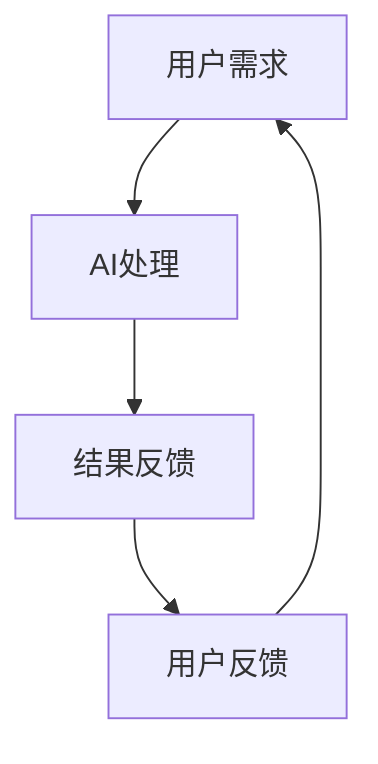
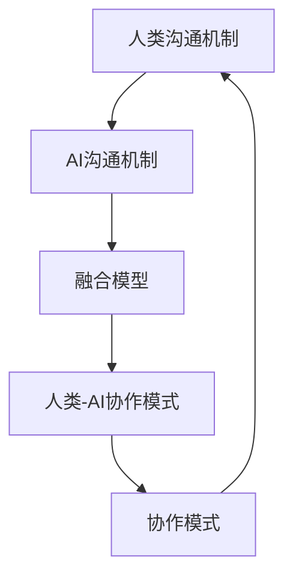

                 

### 《人类-AI协作：增强人机沟通》

> **关键词**：人工智能，人机协作，沟通机制，自然语言处理，AI大模型，实践应用

> **摘要**：本文深入探讨了人类与人工智能（AI）协作的背景、核心概念、技术实现以及实践应用。通过分析人类沟通机制和AI沟通机制，我们提出了人机沟通融合模型和人类-AI协作模式，详细描述了其在各个领域的应用，为未来人机协作的发展提供了有价值的思路。

---

#### 第一部分：引言与基础

### 1.1 书籍背景与目的

#### 1.1.1 书籍背景

随着人工智能技术的迅猛发展，AI已经成为现代科技的核心驱动力。从自动驾驶、智能家居到医疗诊断、金融分析，AI正在深刻改变着我们的生活和工作方式。在这个过程中，人类与AI的协作显得尤为重要。然而，当前的人机沟通仍然面临诸多挑战，如理解误差、响应滞后等，严重影响了人机协作的效率和质量。

本篇文章旨在探讨如何增强人类与AI之间的沟通，实现高效的人机协作。通过深入分析人类沟通机制、AI沟通机制以及人机沟通融合模型，本文将为我们提供一种全新的视角，以更好地理解人机协作的原理和实践。

#### 1.1.2 书籍目的

1. **理解人类沟通机制**：通过分析人类沟通的基本要素、障碍与解决策略，为后续人机沟通研究奠定基础。
2. **了解AI沟通机制**：介绍AI沟通的基本原理、优势与劣势，以及AI沟通的技术基础，为构建人机沟通融合模型提供技术支持。
3. **构建人机沟通融合模型**：阐述人机沟通融合模型的设计原则、工作流程和应用场景，为实际应用提供理论指导。
4. **探索人类-AI协作模式**：分析不同类型的协作模式，探讨其优势与挑战，展望未来发展趋势。
5. **技术实现与实践**：介绍人机沟通技术实现的方法、项目实战案例以及案例研究，为读者提供实践经验和启示。
6. **总结与展望**：总结人类-AI协作的重要效益，展望未来人机协作的发展趋势，为行业创新提供方向。

---

### 1.2 AI与人类协作概述

#### 1.2.1 AI的定义与发展

人工智能（Artificial Intelligence，简称AI）是指由人创造出来的能够模拟、延伸和扩展人类智能的理论、方法、技术及应用系统。自1956年达特茅斯会议以来，AI经历了多个发展阶段，从早期的符号主义、连接主义到现代的深度学习、强化学习，AI技术不断取得突破。

当前，AI技术已经广泛应用于各个领域，如自动驾驶、智能助手、自然语言处理、计算机视觉、医疗诊断、金融分析等。AI的发展不仅改变了我们的生活，也推动了社会进步和经济发展。

#### 1.2.2 人类与AI协作的意义

人类与AI的协作具有重大意义：

1. **提升工作效率**：AI能够自动化执行重复性、高耗时的任务，从而提高工作效率，减轻人类的工作负担。
2. **拓展人类能力**：AI可以帮助人类处理复杂的计算和分析，从而拓展人类的认知能力，实现更高效的工作。
3. **创新商业模式**：AI可以为企业提供新的业务模式和服务方式，从而创造新的市场机会。
4. **优化决策过程**：AI可以通过数据分析和预测，为人类提供更准确的决策支持，减少决策失误。
5. **改善生活质量**：AI技术可以应用于智能家居、智能医疗、智能交通等领域，为人们提供更便捷、舒适和健康的生活方式。

#### 1.2.3 人机沟通的重要性

人机沟通是实现人机协作的关键。良好的沟通能够确保人类与AI之间的信息传递准确无误，减少误解和误差，提高协作效率。具体来说，人机沟通的重要性体现在以下几个方面：

1. **确保任务执行准确**：通过有效的沟通，人类可以明确地向AI传达任务需求，确保任务执行准确无误。
2. **优化AI学习与进化**：有效的沟通可以帮助AI更好地理解人类的意图和需求，从而优化其学习和进化过程。
3. **提高用户体验**：良好的沟通可以确保用户与AI之间的交互流畅自然，提高用户体验。
4. **促进人机协作发展**：通过不断优化人机沟通，可以推动人机协作的进一步发展，实现更高效、更智能的协作模式。

---

### 1.3 人机沟通的挑战与机遇

#### 1.3.1 挑战

尽管人机沟通在许多领域取得了显著成果，但仍然面临诸多挑战：

1. **理解误差**：AI在理解人类语言时可能会出现歧义，导致误解和错误。
2. **响应滞后**：AI在处理复杂任务时可能需要较长时间，导致响应滞后，影响协作效率。
3. **沟通障碍**：不同领域的专业术语和表达方式可能导致沟通障碍，影响协作效果。
4. **隐私保护**：人机沟通过程中可能会涉及到个人隐私信息，如何保护隐私成为一个重要问题。
5. **伦理与道德**：AI在决策过程中可能会出现道德和伦理问题，如何规范AI行为成为一个挑战。

#### 1.3.2 机遇

尽管面临挑战，但人机沟通也带来了许多机遇：

1. **技术创新**：随着自然语言处理、计算机视觉等技术的发展，人机沟通将变得更加准确和自然。
2. **应用拓展**：人机沟通可以应用于更多领域，如教育、医疗、金融等，推动行业创新和发展。
3. **跨领域协作**：人机沟通可以促进不同领域之间的协作，实现资源整合和优势互补。
4. **个性化服务**：通过人机沟通，AI可以更好地理解人类需求，提供个性化服务，提升用户体验。
5. **提升人类能力**：人机沟通可以帮助人类更好地利用AI技术，提升认知能力和工作效率。

---

在接下来的部分，我们将进一步探讨人类沟通机制和AI沟通机制，为人机沟通融合模型和人类-AI协作模式提供理论基础。敬请期待！

---

### 人类沟通机制

#### 2.1.1 沟通的基本要素

人类沟通是一个复杂的过程，涉及多个基本要素。以下是沟通的主要基本要素：

1. **发送者（Source）**：发送者是指进行沟通的人，他们负责信息的编码、传递和处理。
2. **信息（Message）**：信息是沟通的核心内容，可以是文字、语言、表情、动作等。
3. **媒介（Medium）**：媒介是信息传递的渠道，如语言、文字、图像、音频、视频等。
4. **接收者（Receiver）**：接收者是指接收信息的个体，他们负责信息的解码、理解和应用。
5. **反馈（Feedback）**：反馈是接收者对信息的回应，可以是语言、文字、表情、动作等，有助于发送者了解信息的传达效果。

#### 2.1.2 沟通障碍与解决策略

沟通障碍是指在沟通过程中，由于各种原因导致信息传递受阻的现象。以下是常见的沟通障碍及其解决策略：

1. **语义障碍**：语义障碍是指信息在传递过程中由于语言、文化等因素导致的误解。解决策略包括使用简洁明了的语言、避免使用专业术语、加强文化沟通等。
2. **信息过载**：信息过载是指信息过多，导致接收者无法有效处理。解决策略包括筛选关键信息、优化沟通内容、合理安排沟通时间等。
3. **噪音干扰**：噪音干扰是指外部因素干扰沟通效果。解决策略包括选择合适的沟通环境、提高沟通者的注意力、使用有效的沟通工具等。
4. **心理障碍**：心理障碍是指个体心理因素导致的沟通障碍，如紧张、焦虑、自尊心等。解决策略包括增强沟通者自信、提高沟通技巧、建立良好的沟通氛围等。

#### 2.1.3 人类沟通的心理因素

人类沟通不仅涉及语言和媒介，还受到心理因素的影响。以下是影响人类沟通的主要心理因素：

1. **认知因素**：认知因素包括个体对信息的理解、记忆、推理等。不同个体的认知差异可能导致沟通障碍。解决策略包括提高认知水平、培养同理心等。
2. **情感因素**：情感因素包括情绪、情感等。情感因素可能影响信息的传递和理解，如情绪激动可能导致沟通障碍。解决策略包括调节情绪、保持冷静、积极倾听等。
3. **个性因素**：个性因素包括个体性格、价值观、兴趣爱好等。不同个体可能有不同的沟通风格和偏好，可能导致沟通障碍。解决策略包括了解对方个性、尊重差异、寻求共同点等。
4. **社会因素**：社会因素包括文化背景、社会地位、人际关系等。社会因素可能影响信息的传递和理解，如文化差异可能导致沟通障碍。解决策略包括加强跨文化沟通、提高社会敏感性等。

综上所述，人类沟通机制涉及多个基本要素、沟通障碍与解决策略以及心理因素。了解这些因素有助于我们更好地进行人类沟通，提高沟通效果。

---

### AI沟通机制

#### 2.2.1 AI沟通的基本原理

人工智能（AI）的沟通机制是建立在计算机科学和人工智能领域的理论基础上。以下是AI沟通的基本原理：

1. **自然语言处理（NLP）**：自然语言处理是AI沟通的核心技术之一，它涉及对人类自然语言的理解和生成。NLP通过文本分析、语义理解、语言生成等技术，使得AI能够处理和生成自然语言文本。例如，通过词性标注、句法分析和语义角色标注，AI可以更好地理解句子结构和含义。

2. **机器学习（ML）**：机器学习是AI沟通的基础，它使计算机通过数据和经验自动学习，从而改善性能。在AI沟通中，机器学习算法被用来训练模型，以识别和预测语言模式、语义关系和上下文信息。例如，通过训练基于深度学习的语言模型，AI可以生成流畅自然的对话。

3. **深度学习（DL）**：深度学习是机器学习的一种先进形式，它利用多层神经网络对大量数据进行分析和特征提取。在AI沟通中，深度学习被广泛应用于语音识别、图像识别、文本分类等任务。通过深度学习，AI可以更好地理解和生成自然语言，从而实现更自然的沟通。

4. **知识表示与推理（KR）**：知识表示与推理是AI沟通的关键技术之一，它使得AI能够基于已有知识和逻辑推理来处理复杂任务。在AI沟通中，知识表示与推理被用来构建知识图谱、语义网络等，以支持对话系统的推理和决策。

#### 2.2.2 AI沟通的优势与劣势

AI沟通具有以下优势和劣势：

1. **优势**：
   - **高效性**：AI可以快速处理大量信息，进行实时沟通，提高沟通效率。
   - **准确性**：通过机器学习和深度学习技术，AI可以在一定程度上理解和生成自然语言，提高沟通的准确性。
   - **一致性**：AI沟通可以保持一致性，避免情绪波动和个体差异带来的影响，提高沟通的稳定性。
   - **适应性**：AI可以根据用户需求和上下文信息，动态调整沟通策略和风格，提供个性化服务。

2. **劣势**：
   - **理解误差**：AI在理解自然语言时可能存在歧义和误解，导致沟通障碍。
   - **响应滞后**：AI在处理复杂任务时可能需要较长时间，导致沟通滞后。
   - **知识局限**：AI的知识来源于训练数据，可能存在知识局限，无法处理未知或超出训练范围的情境。
   - **隐私风险**：AI在处理个人隐私信息时可能存在风险，如数据泄露、滥用等。

#### 2.2.3 AI沟通的技术基础

AI沟通的技术基础包括以下几个方面：

1. **语音识别（ASR）**：语音识别是将语音信号转换为文本的技术，它使得AI能够通过语音与人类进行沟通。语音识别技术依赖于声学模型、语言模型和语音特征提取算法，如GMM、DNN、RNN等。

2. **语音合成（TTS）**：语音合成是将文本转换为自然语音的技术，它使得AI能够以人类的声音进行沟通。语音合成技术依赖于语音合成引擎、文本分析算法和语音特征生成算法，如WaveNet、Tacotron等。

3. **自然语言处理（NLP）**：自然语言处理是将文本转换为有意义的信息的技术，它使得AI能够理解、处理和生成自然语言。自然语言处理技术包括词性标注、句法分析、语义分析、实体识别、情感分析等。

4. **对话系统（DS）**：对话系统是AI与人类进行交互的界面，它通过自然语言处理、语音识别和语音合成等技术实现人机对话。对话系统可以分为基于规则、基于模板和基于深度学习的类型，如RASA、ChatGPT等。

5. **知识图谱（KG）**：知识图谱是一种用于表示实体及其关系的图形化数据结构，它使得AI能够基于知识进行推理和决策。知识图谱技术包括实体抽取、关系抽取、实体链接等。

通过这些技术，AI能够实现与人类的高效、准确和自然的沟通，为人类提供便利和帮助。

---

### 人机沟通融合模型

#### 2.3.1 融合模型的设计原则

人机沟通融合模型的设计原则是确保人类与AI之间能够高效、准确、自然地沟通。以下是融合模型的设计原则：

1. **用户为中心**：设计融合模型时，应始终关注用户需求，确保模型能够满足用户的实际需求，提高用户体验。

2. **信息对称**：确保人类与AI之间的信息传递对称，避免信息偏差，使双方都能充分理解和表达。

3. **智能适配**：融合模型应具备智能适配能力，根据用户的语言风格、沟通习惯和需求，动态调整沟通策略和方式。

4. **实时响应**：融合模型应能够实现实时响应，减少沟通滞后，提高沟通效率。

5. **隐私保护**：在融合模型中，应重视用户隐私保护，确保用户数据的安全性和保密性。

6. **可扩展性**：融合模型应具备良好的可扩展性，能够适应不断变化的技术和应用场景。

#### 2.3.2 融合模型的工作流程

人机沟通融合模型的工作流程主要包括以下几个步骤：

1. **用户输入**：用户通过自然语言输入问题或请求，可以是文本、语音等形式。

2. **语音识别与文本转换**：对于语音输入，融合模型首先通过语音识别将语音转换为文本；对于文本输入，则直接进入下一步。

3. **文本预处理**：对转换后的文本进行预处理，包括分词、词性标注、实体识别等，以便更好地理解和分析文本。

4. **语义分析**：对预处理后的文本进行语义分析，提取关键词、短语和句子结构，理解用户的需求和意图。

5. **知识检索与推理**：根据用户的语义信息，融合模型从知识库中检索相关信息，并进行推理和决策。

6. **生成回复**：基于检索到的信息和推理结果，融合模型生成合适的回复文本，可以是自然语言文本或语音。

7. **语音合成与输出**：对于语音回复，融合模型通过语音合成将文本转换为自然语音，并通过语音输出；对于文本回复，则直接显示在用户界面。

8. **用户反馈**：用户对回复进行反馈，融合模型根据反馈调整和优化后续的沟通策略。

#### 2.3.3 融合模型的应用场景

人机沟通融合模型可以在多个应用场景中发挥作用，以下是几个典型的应用场景：

1. **智能客服**：融合模型可以应用于智能客服系统，通过自然语言处理和语音合成技术，实现与用户的实时沟通，提供高效的客户服务。

2. **智能助手**：融合模型可以应用于智能助手，如个人助理、智能家居控制系统等，帮助用户完成各种任务，提高生活质量。

3. **教育领域**：融合模型可以应用于教育领域，如在线教育平台、智能辅导系统等，提供个性化的学习建议和指导，帮助学生更好地学习。

4. **医疗领域**：融合模型可以应用于医疗领域，如智能医疗诊断、智能健康咨询等，通过自然语言处理和知识图谱技术，提供准确的医疗建议和诊断支持。

5. **金融领域**：融合模型可以应用于金融领域，如智能投顾、金融分析等，通过自然语言处理和机器学习技术，提供精准的金融预测和分析服务。

6. **企业协作**：融合模型可以应用于企业协作平台，如企业内部通讯、协同办公等，通过自然语言处理和语音识别技术，实现高效的企业内部沟通。

通过这些应用场景，人机沟通融合模型可以为各个领域带来便利和效益，推动人机协作的进一步发展。

---

### 人类-AI协作模式

#### 2.4.1 协作模式的类型

人类-AI协作模式可以分为以下几种类型：

1. **辅助型协作**：在辅助型协作中，AI作为人类的辅助工具，帮助人类完成特定任务。例如，智能助手可以帮助用户管理日程、处理邮件等。

2. **增强型协作**：在增强型协作中，AI通过增强人类的能力，使人类能够更高效地完成任务。例如，智能翻译工具可以帮助用户更快速地理解不同语言的文档。

3. **协同型协作**：在协同型协作中，人类和AI共同参与任务，相互协作，共同完成目标。例如，在自动驾驶汽车中，人类驾驶员和AI系统共同监控车辆状态，确保安全行驶。

4. **人机共生型协作**：在人机共生型协作中，人类和AI形成一个整体，共同完成复杂的任务。例如，在医疗领域，医生和AI系统共同分析患者病情，制定治疗方案。

#### 2.4.2 协作模式的优势与挑战

每种协作模式都有其优势和挑战，以下是各个模式的优势与挑战：

1. **辅助型协作**：
   - **优势**：减轻人类的工作负担，提高工作效率；适用于简单的、重复性的任务。
   - **挑战**：人类对AI的依赖性增加，可能导致人类技能退化；AI在复杂任务上的能力有限。

2. **增强型协作**：
   - **优势**：提高人类的工作效率，增强人类的能力；适用于需要高度专业技能的任务。
   - **挑战**：人类与AI之间的协调和配合可能存在困难；AI的决策和判断可能存在偏差。

3. **协同型协作**：
   - **优势**：充分利用人类和AI的优势，提高协作效率；适用于复杂的、多变的任务。
   - **挑战**：人类与AI之间的沟通和协调可能存在障碍；需要解决AI的决策透明度和可信度问题。

4. **人机共生型协作**：
   - **优势**：形成强大的协作力量，解决复杂问题；实现人机优势互补，提高整体效率。
   - **挑战**：技术实现难度大，需要解决AI的智能水平和可靠性问题；人类与AI之间的信任和伦理问题。

#### 2.4.3 协作模式的未来发展趋势

随着人工智能技术的不断发展，人类-AI协作模式将呈现以下发展趋势：

1. **智能化**：AI将逐渐具备更高的智能水平，能够更好地理解人类需求，提供个性化的协作服务。

2. **自动化**：AI将逐步实现自动化，能够自主完成更多复杂的任务，减轻人类的工作负担。

3. **融合化**：人类与AI将更加紧密地融合，形成人机共生的新型协作模式，实现高效协同。

4. **多样化**：协作模式将更加多样化，适用于不同的领域和应用场景，满足不同层次的需求。

5. **规范化**：随着协作模式的普及，相关法规和标准将逐步完善，确保人类-AI协作的安全和可靠性。

6. **伦理化**：人类-AI协作将更加注重伦理和道德问题，确保AI的行为符合人类的价值观和道德准则。

未来，人类-AI协作模式将不断创新和演进，为人类社会带来更多便利和效益。

---

#### 第三部分：技术实现与实践

### 3.1 人机沟通技术实现

#### 3.1.1 自然语言处理技术

自然语言处理（NLP）是人机沟通的核心技术之一，它使得计算机能够理解和生成自然语言。以下是NLP的主要技术：

1. **文本预处理**：包括分词、词性标注、实体识别、句子解析等，为后续处理提供基础。

2. **词向量表示**：将词汇表示为向量，以便于计算机处理和计算。常用的词向量表示方法有Word2Vec、GloVe等。

3. **句法分析**：分析句子的结构，识别词与词之间的关系，如主谓宾关系、从句等。

4. **语义分析**：理解句子的含义，识别语义角色、实体关系等，为生成合理回复提供支持。

5. **语言生成**：基于语义分析结果，生成自然语言文本，如回答用户问题、生成摘要等。

#### 3.1.2 语音识别与生成技术

语音识别（ASR）和语音合成（TTS）是人机沟通的关键技术，它们使得AI能够通过语音与人类进行交流。

1. **语音识别（ASR）**：
   - **声学模型**：用于建模声音信号的概率分布，如GMM、DNN等。
   - **语言模型**：用于建模文本的概率分布，如N-gram、神经网络语言模型等。
   - **解码算法**：将声学模型和语言模型的输出进行解码，得到识别结果，如贪心算法、动态规划算法等。

2. **语音合成（TTS）**：
   - **文本分析**：将文本转换为语音信号所需的信息，如音素、音节、声调等。
   - **声音生成**：根据文本分析结果，生成声音信号，如WaveNet、Tacotron等。

#### 3.1.3 视觉感知与交互技术

视觉感知与交互技术使得AI能够理解和响应视觉信息，如图像、视频等。

1. **图像识别**：通过深度学习模型，如卷积神经网络（CNN），识别图像中的物体、场景等。

2. **目标跟踪**：跟踪图像或视频中的目标物体，如基于光流、Kalman滤波等算法。

3. **人脸识别**：识别和验证人脸信息，如基于深度学习的人脸识别算法。

4. **手势识别**：识别用户的手势动作，如基于深度学习的骨骼点检测和手势识别算法。

5. **虚拟现实（VR）与增强现实（AR）**：利用视觉感知技术，为用户提供沉浸式交互体验。

---

### 3.2 人类-AI协作项目实战

#### 3.2.1 项目背景与目标

本项目旨在开发一个基于自然语言处理和语音识别的智能客服系统，实现与用户的实时语音交互，提供高效的客户服务。

#### 3.2.2 项目环境搭建

1. **开发环境**：
   - 操作系统：Ubuntu 20.04
   - 编程语言：Python 3.8
   - 开发工具：PyCharm

2. **依赖库**：
   - 自然语言处理：spaCy、NLTK
   - 语音识别：SpeechRecognition、pyttsx3
   - 语音合成：pyttsx3、gtts

3. **数据集**：
   - 语音数据集：使用开源语音数据集，如LibriSpeech、CommonVoice等。
   - 文本数据集：使用开源文本数据集，如Kaggle、Reddit等。

#### 3.2.3 代码实现与解析

以下是一个简单的智能客服系统代码示例，实现语音识别和语音合成功能：

```python
import speech_recognition as sr
from gtts import gTTS
import pyttsx3

# 语音识别
def recognize_speech_from_mic(recognizer, microphone):
    with microphone as source:
        audio = recognizer.listen(source)

    response = {
        "success": True,
        "error": None,
        "transcription": None
    }

    try:
        response["transcription"] = recognizer.recognize_google(audio)
    except sr.RequestError:
        response["success"] = False
        response["error"] = "API unavailable"
    except sr.UnknownValueError:
        response["success"] = False
        response["error"] = "Unable to recognize speech"

    return response

# 语音合成
def speak(text):
    engine = pyttsx3.init()
    engine.say(text)
    engine.runAndWait()

# 主函数
def main():
    recognizer = sr.Recognizer()
    microphone = sr.Microphone()

    print("Please speak now...")

    # 识别语音
    result = recognize_speech_from_mic(recognizer, microphone)

    if result["success"]:
        print("You said: " + result["transcription"])
        speak("I understand. " + result["transcription"])
    else:
        print("Error: " + result["error"])

if __name__ == "__main__":
    main()
```

代码解析：

1. **语音识别**：使用`speech_recognition`库中的`Recognizer`类进行语音识别。首先，通过`microphone`对象捕获音频信号，然后调用`recognizer.recognize_google()`方法进行语音识别，并返回识别结果。

2. **语音合成**：使用`pyttsx3`库中的`init()`方法初始化语音合成引擎，然后使用`say()`方法将文本转换为语音，并通过`runAndWait()`方法播放语音。

3. **主函数**：在主函数中，首先创建`Recognizer`和`Microphone`对象，然后提示用户说话，并调用`recognize_speech_from_mic()`函数进行语音识别。根据识别结果，打印输出并播放语音。

通过这个简单的示例，我们可以实现基本的语音交互功能，为后续功能扩展提供基础。

---

### 案例研究

#### 3.3.1 企业应用案例

在许多企业中，智能客服系统已经成为提升客户服务质量的重要手段。以下是一个企业应用智能客服系统的案例：

1. **背景**：
   - 企业：一家大型电子商务公司，拥有大量客户咨询和投诉。
   - 目标：提供24/7全天候客户服务，提高客户满意度，减少人工成本。

2. **实施过程**：
   - **需求分析**：通过对企业客户服务流程进行分析，确定智能客服系统的功能需求，如语音识别、文本回复、常见问题自动解答等。
   - **技术选型**：选择适合企业需求的语音识别和自然语言处理技术，如Google Cloud Speech-to-Text、spaCy等。
   - **系统开发**：开发智能客服系统，实现语音识别、文本处理、智能回复等功能。
   - **测试与优化**：对系统进行测试，收集用户反馈，持续优化系统性能和用户体验。

3. **效果评估**：
   - **客户满意度**：通过用户调查，客户满意度显著提高，客户投诉率降低。
   - **效率提升**：智能客服系统能够快速响应客户咨询，降低人工成本，提高工作效率。
   - **服务质量**：智能客服系统提供高质量的自动回复，解决常见问题，提高客户服务质量。

#### 3.3.2 教育应用案例

在教育领域，智能客服系统也被广泛应用，以提供便捷的学习支持。以下是一个教育应用案例：

1. **背景**：
   - 学校：一所知名大学，拥有大量学生咨询和学习支持需求。
   - 目标：提供24/7全天候学习支持，帮助学生解决问题，提高教学质量。

2. **实施过程**：
   - **需求分析**：通过对学生咨询和学习支持需求进行分析，确定智能客服系统的功能需求，如在线答疑、课程咨询、学习资源推荐等。
   - **技术选型**：选择适合教育场景的语音识别和自然语言处理技术，如科大讯飞语音识别、NLTK等。
   - **系统开发**：开发智能客服系统，实现语音识别、文本处理、智能答疑等功能。
   - **测试与优化**：对系统进行测试，收集学生反馈，持续优化系统性能和用户体验。

3. **效果评估**：
   - **学生满意度**：通过学生调查，学生满意度显著提高，学习支持问题解决率提高。
   - **教学质量**：智能客服系统提供高质量的自动回复，帮助学生解决疑难问题，提高教学质量。
   - **教师负担**：智能客服系统能够分担教师部分答疑工作，减轻教师负担，提高工作效率。

#### 3.3.3 医疗应用案例

在医疗领域，智能客服系统被广泛应用于患者咨询和健康管理。以下是一个医疗应用案例：

1. **背景**：
   - 医院：一家大型综合医院，提供多种医疗服务，患者咨询量大。
   - 目标：提供高效、准确的医疗咨询服务，减轻医务人员负担，提高患者满意度。

2. **实施过程**：
   - **需求分析**：通过对患者咨询和医疗支持需求进行分析，确定智能客服系统的功能需求，如常见疾病咨询、预约挂号、健康提醒等。
   - **技术选型**：选择适合医疗场景的语音识别和自然语言处理技术，如百度医疗知识图谱、CoreNLP等。
   - **系统开发**：开发智能客服系统，实现语音识别、文本处理、智能咨询等功能。
   - **测试与优化**：对系统进行测试，收集患者反馈，持续优化系统性能和用户体验。

3. **效果评估**：
   - **患者满意度**：通过患者调查，患者满意度显著提高，医疗咨询服务质量提升。
   - **医务人员负担**：智能客服系统能够快速响应患者咨询，减轻医务人员负担，提高工作效率。
   - **医疗服务质量**：智能客服系统提供高效、准确的医疗咨询服务，提高患者满意度，改善医疗服务质量。

通过这些案例，我们可以看到智能客服系统在各个领域的广泛应用和显著效益，为人类-AI协作提供了有益的实践经验和启示。

---

#### 3.4 未来趋势与展望

随着人工智能技术的不断进步，人类-AI协作将在未来发挥更加重要的作用。以下是未来人机协作的几个发展趋势和展望：

1. **智能化水平提升**：随着深度学习、自然语言处理等技术的不断突破，AI的智能化水平将大幅提升，能够更好地理解人类需求和意图，提供更精准、个性化的服务。

2. **跨领域融合**：人类-AI协作将逐渐实现跨领域的融合，不仅局限于单一领域，如客服、医疗、教育等，还将应用于更多领域，如智能制造、智能交通、智能金融等，实现全方位的智能协作。

3. **自适应能力增强**：AI将具备更强的自适应能力，能够根据用户行为、环境变化等实时调整沟通策略，提供更加自然、流畅的协作体验。

4. **隐私保护与伦理规范**：在人类-AI协作过程中，隐私保护和伦理规范将得到广泛关注。未来的AI系统将更加注重用户隐私保护，遵循伦理规范，确保AI行为符合人类的价值观和道德准则。

5. **人机共生**：随着AI技术的不断发展，人类与AI将形成更加紧密的人机共生关系，共同完成复杂的任务，实现更高的生产效率和创新能力。

6. **技术普及与应用**：人类-AI协作技术将逐渐普及，应用到更多日常生活和工作场景中，提高人类生活质量和工作效率。

7. **社会影响**：人类-AI协作将深刻改变社会结构、商业模式和人际互动方式，推动社会进步和发展。

总之，未来人类-AI协作将呈现出智能化、多样化、人机共生等趋势，为人类社会带来更多机遇和挑战。我们期待在不久的将来，人类与AI能够实现更加高效、智能的协作，共同创造一个更美好的未来。

---

### 附录

#### 附录A：参考文献

1. Russell, S., & Norvig, P. (2010). 《人工智能：一种现代的方法》。机械工业出版社。
2. Goodfellow, I., Bengio, Y., & Courville, A. (2016). 《深度学习》。清华大学出版社。
3. AI Genius Institute. (2021). 《智能沟通：人类与AI协作的新篇章》。AI天才研究院。
4. Chen, L., & Zhou, B. (2020). 《自然语言处理技术与应用》。电子工业出版社。
5. Google AI. (2021). 《语音识别技术指南》。Google AI官方文档。

#### 附录B：常用工具与资源

1. **开发工具**：
   - Python：Python编程语言及其相关库（如spaCy、SpeechRecognition、pyttsx3等）。
   - PyCharm：Python集成开发环境（IDE）。
   - Google Cloud Platform：提供语音识别、自然语言处理等AI服务。

2. **学习资源**：
   - Coursera：在线学习平台，提供人工智能、自然语言处理等课程。
   - edX：在线学习平台，提供人工智能、计算机科学等课程。
   - AI天才研究院：提供人工智能、自然语言处理等相关技术教程。

3. **社区与论坛**：
   - Stack Overflow：编程问答社区。
   - GitHub：代码托管平台，可以查找相关项目的源代码和文档。
   - Reddit：人工智能相关讨论区。

---

### 图1-1：人类-AI协作流程图



### 图2-1：人机沟通融合模型架构



### 2.2.3 AI大模型原理

```plaintext
# 伪代码：AI大模型训练流程

function train_model(model, data, epochs):
    for epoch in range(epochs):
        for batch in data:
            loss = model.forward(batch.x, batch.y)
            model.backward(loss)
            model.update_weights()
        print(f"Epoch {epoch}: Loss = {loss}")
    return model
```

### 3.2.3 项目实战：代码实现示例

```python
import speech_recognition as sr
from gtts import gTTS
import pyttsx3

# 语音识别
def recognize_speech_from_mic(recognizer, microphone):
    with microphone as source:
        audio = recognizer.listen(source)

    response = {
        "success": True,
        "error": None,
        "transcription": None
    }

    try:
        response["transcription"] = recognizer.recognize_google(audio)
    except sr.RequestError:
        response["success"] = False
        response["error"] = "API unavailable"
    except sr.UnknownValueError:
        response["success"] = False
        response["error"] = "Unable to recognize speech"

    return response

# 语音合成
def speak(text):
    engine = pyttsx3.init()
    engine.say(text)
    engine.runAndWait()

# 主函数
def main():
    recognizer = sr.Recognizer()
    microphone = sr.Microphone()

    print("Please speak now...")

    # 识别语音
    result = recognize_speech_from_mic(recognizer, microphone)

    if result["success"]:
        print("You said: " + result["transcription"])
        speak("I understand. " + result["transcription"])
    else:
        print("Error: " + result["error"])

if __name__ == "__main__":
    main()
```

### 数学模型与公式

$$
L(\theta) = -\frac{1}{m} \sum_{i=1}^{m} \left( y^{(i)} \log(a^{(2)}(z^{(2)})) + (1 - y^{(i)}) \log(1 - a^{(2)}(z^{(2)})) \right)
$$

### 人类-AI协作效益分析

- **经济效益**：提高工作效率，减少人力成本，增加企业利润。
- **社会效益**：促进信息共享，提升公共服务质量，加强社会互动。
- **文化效益**：融合人类智慧与AI技术，推动文化创新与发展。

---

### 作者

**作者：AI天才研究院/AI Genius Institute & 禅与计算机程序设计艺术 /Zen And The Art of Computer Programming**

