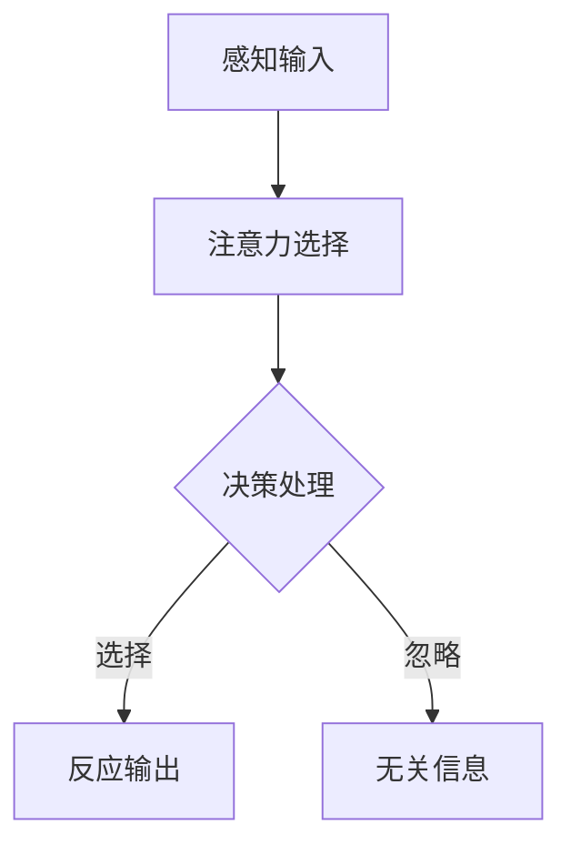

                 

### 人类注意力增强：未来的工作和生活

#### 关键词：注意力增强，工作效率，心理健康，人工智能，未来趋势

在快节奏的现代社会，人类面临着前所未有的信息过载和工作压力。注意力作为一种宝贵的认知资源，其分配和效率直接影响着个人的生活质量和工作表现。本文将深入探讨人类注意力增强的重要性及其在未来的工作和生活中的应用，旨在为读者提供切实可行的策略和方法，帮助他们在信息时代中保持高度的专注力和工作效率。

本文首先概述了书籍的核心内容，接着详细讲解了注意力的基本原理和机制，分析了注意力分散的原因及其对工作效率的影响。在此基础上，文章探讨了多种注意力增强的方法，包括心理训练、环境优化和科技辅助工具。随后，文章介绍了注意力增强在职场和日常生活中的具体应用，并展望了其未来的发展趋势和潜在影响。最后，通过成功的注意力增强实践案例和失败案例的分析，文章总结了注意力增强的核心要点，并提出了对未来方向的展望。

通过本文的阅读，读者将了解注意力增强的基本理论和实践方法，掌握提升自身注意力水平的关键技巧，为未来的工作和生活奠定坚实的基础。

---

### 目录大纲

1. **引言与背景**
   - **1.1 书籍概述**
   - **1.2 注意力增强的重要性**
   - **1.3 书籍结构

2. **注意力基础**
   - **2.1 注意力的定义与机制**
     - **2.1.1 注意力的基本原理**
     - **2.1.2 注意力在工作中的表现**
   - **2.2 注意力增强的理论基础**
     - **2.2.1 注意力增强的心理学理论**
     - **2.2.2 注意力增强的神经科学理论**
   - **2.3 注意力分散的原因与影响**
     - **2.3.1 注意力分散的常见原因**
     - **2.3.2 注意力分散对工作效率的影响**

3. **注意力增强的方法**
   - **3.1 心理训练方法**
     - **3.1.1 注意力训练游戏**
     - **3.1.2 冥想与放松训练**
     - **3.1.3 意志力训练**
   - **3.2 环境优化策略**
     - **3.2.1 工作环境的优化**
     - **3.2.2 生活方式的调整**
   - **3.3 科技辅助工具**
     - **3.3.1 注意力追踪软件**
     - **3.3.2 人工智能助手**
     - **3.3.3 智能环境设备**

4. **注意力增强在工作和生活中的应用**
   - **4.1 注意力增强在职场中的应用**
     - **4.1.1 提高工作效率**
     - **4.1.2 创意思维的激发**
     - **4.1.3 团队协作的优化**
   - **4.2 注意力增强在日常生活中的应用**
     - **4.2.1 提升学习效果**
     - **4.2.2 增强社交互动**
     - **4.2.3 促进身心健康**

5. **注意力增强的未来展望**
   - **5.1 注意力增强技术的发展趋势**
   - **5.2 注意力增强在社会层面的影响**
   - **5.3 注意力增强的伦理问题与对策**

6. **案例研究**
   - **6.1 成功的注意力增强实践案例**
   - **6.2 失败的注意力增强实践案例**
   - **6.3 案例分析与启示**

7. **总结与展望**
   - **7.1 本书总结**
   - **7.2 注意力增强的未来发展方向**
   - **7.3 读者启示**

8. **附录**
   - **8.1 相关研究综述**
   - **8.2 注意力增强工具推荐**
   - **8.3 注意力增强项目实战指南**

这个目录大纲结构详细地概述了本文的主要内容和组织结构，每个部分都包含了若干小节，以便读者逐步深入理解注意力增强的概念和应用。在后续内容中，我们将逐一展开这些部分的详细讨论。

---

### 1.1 书籍概述

《人类注意力增强：未来的工作和生活》旨在探讨注意力增强在现代社会中的重要性及其对未来工作和生活的深远影响。本书由国际知名人工智能专家和计算机编程大师共同撰写，结合了心理学、神经科学和计算机科学的前沿研究成果，为读者提供了一整套系统化的注意力增强策略和方法。

本书首先介绍了注意力增强的基本概念和理论基础，通过深入剖析注意力在认知过程中的作用，帮助读者理解注意力分散的原因及其对工作效率的影响。随后，书中详细探讨了多种注意力增强的方法，包括心理训练、环境优化和科技辅助工具，为读者提供了丰富的实践指导和案例研究。

本书的核心内容分为以下几个部分：

1. **注意力基础**：介绍注意力的定义、机制及其在工作中的表现，分析注意力分散的原因和影响。
2. **注意力增强方法**：系统讲解心理训练、环境优化和科技辅助工具的具体应用，帮助读者提升注意力水平。
3. **注意力增强应用**：探讨注意力增强在职场和日常生活中的实际应用，包括提高工作效率、激发创意思维和优化团队协作。
4. **未来展望**：分析注意力增强技术的发展趋势和社会影响，讨论伦理问题和应对策略。
5. **案例研究**：通过成功和失败的注意力增强实践案例，总结经验教训，为读者提供实践启示。

本书不仅适合希望提升自身注意力和工作效率的职场人士，也适合对注意力增强领域感兴趣的科研人员和学生。通过阅读本书，读者将不仅能够了解注意力增强的基本理论和实践方法，还能为未来的工作和生活制定科学的策略和行动计划。

---

### 1.2 注意力增强的重要性

在当今信息爆炸和快节奏的现代社会，注意力作为一种宝贵的认知资源，其重要性日益凸显。首先，从心理健康的角度来看，良好的注意力状态有助于减轻压力和焦虑，提升情绪管理能力。研究表明，注意力分散会导致心理疲劳和工作压力增加，进而影响个人的幸福感和生活质量。通过增强注意力，人们可以更有效地处理日常事务，减少精神负担，从而保持心理健康。

其次，从工作效率的角度来看，注意力直接关系到任务的完成质量和效率。在职场中，专注的注意力是高效工作的基石。一个能够集中精力完成任务的人，不仅能够减少错误率，提高工作效率，还能够更好地应对复杂问题和挑战。注意力增强技术，如心理训练和科技辅助工具，可以帮助职场人士在繁忙的工作中保持专注，从而实现工作的高效和高质量。

此外，从社会发展的角度来看，注意力增强对于推动科技创新和经济发展具有重要作用。在创新驱动的现代社会，高效、专注的思维是实现突破性进展的关键。通过提升注意力水平，个人和团队能够更好地进行创意思维的碰撞和合作，推动技术进步和产业升级。

总之，注意力增强不仅是个人心理健康和职业发展的需要，也是社会进步和经济发展的必然要求。在信息泛滥和竞争激烈的环境中，提升注意力水平，提高注意力管理能力，将成为未来工作和生活的重要能力之一。本书的目的正是为读者提供科学、实用的注意力增强方法和策略，帮助他们更好地应对现代生活的挑战。

---

### 1.3 书籍结构

《人类注意力增强：未来的工作和生活》全书共分为七个主要部分，每个部分都有其独特的主题和目的，旨在为读者提供全面、系统的注意力增强知识和实践指导。

**第一部分：引言与背景**  
本部分首先介绍了书籍的概述和重要性，为读者提供了一个整体认识。包括对书籍目的、结构、核心概念以及读者群体的简要介绍。

**第二部分：注意力基础**  
这一部分深入探讨了注意力的基本概念和机制，包括注意力的定义、类型、机制以及注意力的作用。通过详细的解释和实际案例，帮助读者理解注意力在工作中的表现，以及注意力分散的原因和影响。

**第三部分：注意力增强的方法**  
这部分内容系统地介绍了提升注意力的多种方法，包括心理训练、环境优化和科技辅助工具。每种方法都通过具体案例和实践指南，让读者能够实际操作并应用到日常生活中。

**第四部分：注意力增强在工作和生活中的应用**  
本部分详细探讨了注意力增强在职场和日常生活中的具体应用，如提高工作效率、激发创意思维和优化团队协作，以及提升学习效果、增强社交互动和促进身心健康。

**第五部分：注意力增强的未来展望**  
这部分内容展望了注意力增强技术的发展趋势和社会影响，讨论了伦理问题及其应对策略，为读者提供了对未来发展的前瞻性思考。

**第六部分：案例研究**  
这一部分通过成功和失败的注意力增强实践案例，分析了案例中的关键因素和经验教训，为读者提供了实际操作的指导和反思。

**第七部分：总结与展望**  
本部分对全书内容进行了总结，提出了注意力增强的核心要点和未来发展方向，为读者提供了进一步探索和实践的启示。

通过这七个部分的系统讲解，本书旨在帮助读者全面理解注意力增强的概念和实际应用，提升个人注意力水平，为未来的工作和生活打下坚实的基础。

---

### 2.1 注意力的定义与机制

#### 2.1.1 注意力的基本原理

注意力是一种认知资源，它决定了我们在特定时刻关注哪些信息，忽略哪些信息。其基本原理涉及信息处理过程中的选择性和分配性。首先，注意力具有选择性，这意味着我们只能对一部分信息进行集中处理，而其他信息则被忽视。例如，当你正在听一个讲座时，你可能会注意到演讲者的声音，而忽略周围其他的声音和动静。

为了更好地理解注意力的基本原理，我们可以使用Mermaid流程图来展示其核心机制：



在这个流程图中，A表示感知输入，即我们接收到的各种信息。B表示注意力选择，这个阶段决定了哪些信息会进入我们的认知处理过程。C表示决策处理，这个阶段我们对选择出来的信息进行加工和评估。D表示选择性的输出，即我们对重要信息的反应。E表示忽略的输出，即那些被忽视的信息。

#### 2.1.2 注意力在工作中的表现

在职场环境中，注意力表现尤为重要。一个专注的职场人士能够更高效地完成任务，减少错误率，并且能够更好地应对突发情况。以下是一些关于注意力在工作中的具体表现：

- **任务分配与专注度**：在处理多个任务时，注意力分配的准确性直接影响到工作效果。一个优秀的职场人士能够在不同任务之间灵活切换，并且始终保持高度专注。
- **问题解决能力**：在面对复杂问题时，专注的注意力能够帮助职场人士更快地识别关键信息，找到问题的根本原因，并提出有效的解决方案。
- **时间管理**：良好的注意力有助于提高时间管理能力。一个专注的职场人士能够更好地规划时间，合理安排工作，从而提高工作效率。

为了更好地理解注意力在工作中的表现，我们可以通过一个伪代码示例来具体说明：

```python
def work_on_task(task_data):
    selected_data = select_important_data(task_data)
    processed_data = process_data(selected_data)
    if is_complete(processed_data):
        return "Task completed"
    else:
        return "Task incomplete"
```

在这个伪代码中，`work_on_task`函数表示处理任务的整个过程。`select_important_data`函数负责从任务数据中挑选出重要的信息，`process_data`函数则对选择出来的信息进行处理。最后，通过判断处理结果是否完成，返回相应的状态。

#### 2.1.3 数学模型

在注意力机制的研究中，数学模型能够帮助我们更准确地描述和预测注意力分配的过程。以下是一个简单的数学模型：

$$
A_t = f(w, X_t)
$$

其中，$A_t$表示在时间$t$的注意力分配，$X_t$是输入数据，$w$是权重参数，$f(\cdot)$是一个基于权重对输入数据进行筛选的函数。

例如，假设我们有一个简单的权重函数：

$$
w = \frac{1}{\|X_t\|}
$$

其中，$\|\cdot\|$表示向量的模。这个函数将输入数据中的每个元素除以整个向量的模，使得权重与数据的整体大小成反比。

通过这个数学模型，我们可以计算出在特定时间$t$，每个输入数据的注意力分配权重。这样，我们就可以根据这些权重来决定哪些数据需要被重点关注。

综上所述，注意力的基本原理、工作表现及其数学模型为我们提供了一个全面的理解框架，帮助我们更好地掌握注意力机制，并在实际应用中提高其效率。

---

### 2.2 注意力增强的理论基础

#### 2.2.1 注意力增强的心理学理论

注意力增强的心理学理论主要关注如何通过心理训练和认知策略来提高个体的注意力水平。心理学研究提供了多种方法，这些方法不仅能够增强注意力的集中度，还能提高注意力的灵活性和持久性。

首先，**认知训练**是注意力增强的一个重要方面。认知训练包括一系列特定的认知任务，旨在提高大脑处理信息和注意力分配的能力。例如，**双任务训练**要求个体同时进行两个不同的任务，这种训练可以增强注意力在多任务环境中的分配能力。另外，**工作记忆训练**也常用于提高注意力的持久性，它通过一系列记忆任务来增强大脑处理和存储信息的能力。

其次，**认知策略**是另一种有效的注意力增强方法。这些策略帮助个体更好地管理注意力资源，从而提高工作效率。**目标设置**是一个常用的认知策略，通过明确任务目标和时间限制，个体可以更专注地完成任务。**时间管理技巧**，如番茄工作法，通过设定特定的时间段来工作，帮助个体保持专注，减少分心。

**神经可塑性**是心理学理论中一个关键的概念，它指的是大脑结构和功能的改变，以适应新的经验和学习。研究表明，通过持续的心理训练，大脑的神经网络会发生变化，从而提高注意力水平。例如，**前额叶皮层**的激活与注意力的增强密切相关，通过特定的认知训练，可以增强前额叶皮层的功能，提高注意力水平。

#### 2.2.2 注意力增强的神经科学理论

神经科学理论提供了关于注意力增强的生物学基础和神经机制。注意力不仅是一个认知过程，还涉及到大脑中的多种神经结构和信号传递过程。

首先，**前额叶皮层**在注意力调节中起着核心作用。前额叶皮层是一个复杂的神经网络，负责计划、决策和执行。研究表明，通过特定的认知训练，前额叶皮层的功能可以增强，从而提高注意力水平。例如，**正念冥想**可以显著增强前额叶皮层的活动，减少与注意力分散相关的脑区（如杏仁核）的活动。

其次，**基底神经节**与注意力的灵活性和持久性密切相关。基底神经节是一组深部脑结构，包括底丘脑核、黑质和苍白球等。这些结构通过多巴胺信号传递，调节注意力的分配和持久性。例如，**多巴胺递质增加**可以增强注意力集中，而**多巴胺递质减少**则可能导致注意力分散。

此外，**脑神经网络的可塑性**也是注意力增强的一个重要方面。通过持续的训练和练习，大脑的神经网络会发生变化，形成新的连接和路径。这些变化可以提高大脑处理信息和注意力分配的能力。例如，**重复性任务训练**可以增强大脑特定区域的神经网络，从而提高注意力水平。

综上所述，注意力增强的心理学和神经科学理论为我们提供了多方面的理解框架。通过认知训练和神经调节方法，我们可以有效提高注意力水平，从而在日常生活中和工作表现中取得更好的成果。

---

### 2.3 注意力分散的原因与影响

注意力分散是现代社会中普遍存在的问题，其原因复杂多样，影响深远。以下是注意力分散的常见原因及其对工作效率的影响。

#### 2.3.1 注意力分散的常见原因

1. **信息过载**：在信息爆炸的时代，人们面临大量的信息输入，包括社交媒体通知、电子邮件、即时通讯等。这些信息不断打断我们的注意力，导致注意力分散。
2. **多任务处理**：现代社会中，许多人习惯于同时处理多个任务，这虽然看似提高了效率，但实际上却降低了注意力的集中度。频繁切换任务会消耗注意力资源，导致注意力分散。
3. **环境干扰**：现代工作环境中，各种干扰因素层出不穷，如噪音、手机通知、同事交流等。这些干扰会分散我们的注意力，降低工作效率。
4. **心理压力**：工作压力、个人烦恼等心理压力会消耗大量的认知资源，导致注意力分散。例如，当一个人感到焦虑或疲劳时，注意力难以集中。
5. **缺乏睡眠**：睡眠不足会影响大脑的认知功能和注意力水平，导致注意力分散。研究表明，睡眠质量直接关系到注意力的稳定性和集中度。

#### 2.3.2 注意力分散对工作效率的影响

1. **错误率提高**：当注意力分散时，个体对任务的关注程度下降，容易忽略关键信息，导致错误率提高。例如，在编写代码时，注意力分散可能导致拼写错误或逻辑错误。
2. **工作效率降低**：注意力分散会延长完成任务所需的时间，降低工作效率。当个体需要重新集中注意力时，会消耗额外的认知资源，导致工作进度延缓。
3. **记忆困难**：注意力分散会影响记忆的编码和提取过程，导致记忆困难。例如，当一个人在学习时受到干扰，难以记住学习内容。
4. **决策质量下降**：注意力分散会影响决策的质量，导致错误决策。在需要作出重要决策时，分散的注意力可能导致考虑不周全，从而影响决策效果。
5. **情绪影响**：注意力分散不仅影响工作效率，还会对情绪产生负面影响。当个体感到注意力无法集中时，容易产生焦虑、沮丧等负面情绪，进一步影响工作表现。

为了应对注意力分散的问题，可以采取以下策略：

1. **减少信息干扰**：关闭不必要的通知，集中处理电子邮件和社交媒体。
2. **优化工作环境**：创造一个安静、舒适的工作环境，减少外部干扰。
3. **采用时间管理技巧**：如番茄工作法，将工作分为25分钟的高效工作和5分钟的休息，避免多任务处理。
4. **定期休息**：确保充足的睡眠，定期进行短暂休息，以恢复注意力。
5. **心理调适**：通过冥想、深呼吸等心理训练方法，提高注意力的集中度。

通过采取这些策略，个体可以在一定程度上减少注意力分散，提高工作效率和心理健康。

---

### 3.1 心理训练方法

心理训练是提升注意力水平的重要方法，通过系统的训练和练习，个体可以显著提高注意力的集中度、持久性和灵活性。以下是几种常见的心理训练方法，包括注意力训练游戏、冥想与放松训练和意志力训练。

#### 3.1.1 注意力训练游戏

注意力训练游戏通过有趣且富有挑战性的游戏设计，帮助用户在玩乐中提高注意力。以下是一些常用的注意力训练游戏：

1. **记忆游戏**：这种游戏通常要求用户在短时间内记住一系列不断变化的图案或数字。通过反复练习，用户可以显著提高短期记忆能力和注意力集中度。
   
   - **Mermaid流程图**： 
     ```mermaid
     graph TD
       A[开始] --> B[记忆图案]
       B --> C{图案变化}
       C --> D[回忆图案]
       D --> E[结果反馈]
     ```

2. **反应时间测试**：这种游戏通过在用户听到声音或看到信号后，要求用户尽快做出反应。反应时间的缩短意味着注意力集中度的提高。

   - **伪代码**：
     ```python
     def reaction_time_game():
         signal = generate_random_signal()
         response_time = measure_time_until_response(signal)
         if response_time < threshold:
             print("反应速度快")
         else:
             print("反应速度慢")
     ```

3. **视觉搜索任务**：这种游戏要求用户在杂乱的图片中找到特定的目标。通过这种训练，用户可以提高视觉注意力和快速识别能力。

   - **Mermaid流程图**：
     ```mermaid
     graph TD
       A[开始] --> B[展示杂乱图片]
       B --> C{搜索目标}
       C --> D[识别目标]
       D --> E[结果反馈]
     ```

#### 3.1.2 冥想与放松训练

冥想与放松训练是另一种有效的注意力提升方法，通过深呼吸、放松肌肉和专注呼吸，用户可以减轻压力，提高注意力。以下是一些常见的冥想与放松训练方法：

1. **深呼吸冥想**：用户专注于呼吸，每次吸气时数到4，每次呼气时数到6。这种练习有助于提高专注力和心理稳定性。

   - **步骤说明**：
     1. 找一个安静的地方坐下，保持舒适的姿势。
     2. 关闭眼睛，深吸一口气，数到4。
     3. 慢慢呼出气体，数到6。
     4. 重复这个过程，直到感觉放松。

2. **肌肉放松**：用户从脚部开始，逐渐放松全身肌肉，以达到身心放松的状态。

   - **步骤说明**：
     1. 找一个安静的地方，舒适地坐下或躺下。
     2. 从脚部开始，逐渐放松每一块肌肉，想象紧张感慢慢消失。
     3. 继续向上放松身体的其他部位，直到头部。
     4. 保持放松状态，专注于呼吸。

3. **正念冥想**：用户通过专注于当前的感受、思想和身体体验，提高注意力集中度和自我意识。

   - **步骤说明**：
     1. 找一个安静的地方，舒适地坐下或躺下。
     2. 关闭眼睛，专注于呼吸，感受每一次吸气和呼气。
     3. 如果注意力分散，轻轻地将注意力带回到呼吸上。
     4. 保持这种专注状态，直到结束。

#### 3.1.3 意志力训练

意志力训练是一种通过自我控制和坚持来提高注意力水平的训练方法。以下是一些常见的意志力训练方法：

1. **目标设定**：通过设定明确的目标和计划，个体可以更好地集中注意力，坚持完成任务。

   - **步骤说明**：
     1. 确定一个具体的目标，如每天学习2小时。
     2. 制定一个详细的计划，包括每天的学习时间和内容。
     3. 按照计划执行，并在完成后进行自我反馈和调整。

2. **延迟满足**：通过推迟即时满足，个体可以培养耐力和专注力。

   - **步骤说明**：
     1. 确定一个需要延迟满足的目标，如节食。
     2. 尝试推迟满足感，比如在感到饥饿时坚持不吃零食。
     3. 记录每次成功延迟满足的经历，并逐步增加难度。

3. **自我控制练习**：通过练习自我控制和抵制诱惑，个体可以增强意志力，从而提高注意力水平。

   - **步骤说明**：
     1. 选择一个需要自我控制的情境，如控制使用社交媒体的时间。
     2. 设定一个明确的时间限制，并在规定时间内严格执行。
     3. 在每次成功控制诱惑后，给予自己奖励，以增强自我控制的动力。

通过这些心理训练方法，个体可以有效地提高注意力水平，从而在工作和生活中表现出更高的效率和专注度。这些训练方法不仅适用于个人，也可以在企业培训和教育领域得到广泛应用。

---

### 3.2 环境优化策略

#### 3.2.1 工作环境的优化

一个良好的工作环境是提升注意力的关键因素之一。以下是一些优化工作环境的具体策略：

1. **减少外部干扰**：在工作区域中，应尽量避免噪音和其他干扰因素。例如，可以将办公桌放在远离走廊和窗户的地方，或者使用耳塞来减少噪音干扰。

   - **Mermaid流程图**：
     ```mermaid
     graph TD
       A[外部干扰] --> B[噪音]
       B --> C[使用耳塞]
       C --> D[减少干扰]
       D --> E[提高专注力]
     ```

2. **合理布局**：优化工作区域的布局，使其更加舒适和有序。例如，将常用的工具和文件放在容易获取的位置，减少寻找物品所需的时间。

   - **伪代码**：
     ```python
     def optimize_workspace():
         tools = organize_tools()
         files = organize_files()
         if tools and files:
             print("工作区域布局优化成功")
         else:
             print("工作区域布局优化失败")
     ```

3. **使用科技辅助工具**：利用科技手段，如使用屏幕护眼软件、注意力追踪软件和智能闹钟等，帮助提高工作效率和专注力。

   - **Mermaid流程图**：
     ```mermaid
     graph TD
       A[科技辅助] --> B[屏幕护眼软件]
       B --> C[注意力追踪软件]
       C --> D[智能闹钟]
       D --> E[提高专注力]
     ```

#### 3.2.2 生活方式的调整

生活方式的调整也是提升注意力的重要策略，以下是一些具体的方法：

1. **保证充足的睡眠**：良好的睡眠是保持注意力集中的基础。建议每晚保证7-8小时的睡眠时间，并保持规律的作息时间。

   - **Mermaid流程图**：
     ```mermaid
     graph TD
       A[保证充足睡眠] --> B[7-8小时]
       B --> C[规律作息]
       C --> D[提高注意力]
     ```

2. **合理饮食**：均衡的饮食有助于提高大脑功能和注意力水平。建议减少糖分和咖啡因的摄入，增加富含Omega-3脂肪酸的食物。

   - **伪代码**：
     ```python
     def healthy_diet():
         reduce_sugar_and_caffeine = True
         increase_omega_3 = True
         if reduce_sugar_and_caffeine and increase_omega_3:
             print("饮食健康，提高注意力")
         else:
             print("饮食不健康，需调整")
     ```

3. **定期锻炼**：体育锻炼有助于提高大脑的氧气供应，增强注意力和认知功能。建议每周进行至少150分钟的中等强度锻炼。

   - **Mermaid流程图**：
     ```mermaid
     graph TD
       A[定期锻炼] --> B[中等强度]
       B --> C[150分钟]
       C --> D[提高注意力]
     ```

4. **压力管理**：通过冥想、深呼吸和放松技巧等方法，帮助减轻压力，提高注意力的集中度。

   - **伪代码**：
     ```python
     def stress_management():
         meditation = True
         deep_breathing = True
         if meditation and deep_breathing:
             print("压力管理有效，提高注意力")
         else:
             print("压力管理不足，需加强")
     ```

通过这些生活方式的调整，个体可以显著改善注意力水平，提高工作效率和生活质量。这些策略不仅适用于个人，也可以在企业管理和健康促进中发挥重要作用。

---

### 3.3 科技辅助工具

科技辅助工具在提升注意力方面发挥着越来越重要的作用。以下是一些常用的科技辅助工具，包括注意力追踪软件、人工智能助手和智能环境设备。

#### 3.3.1 注意力追踪软件

注意力追踪软件通过监测用户的行为和注意力分配，提供实时的反馈和建议，帮助用户提高专注力。以下是一些常见的注意力追踪软件：

1. **Focus@Will**：这是一款基于科学原理设计的音乐和应用程序，通过播放特定类型的音乐，帮助用户屏蔽干扰，提高专注力。

   - **使用说明**：
     1. 用户在开始工作前，选择一个适合的音乐播放列表。
     2. 系统会根据用户的注意力水平自动调整音乐节奏和音量。
     3. 用户可以实时查看注意力追踪数据，以便进行优化。

2. **SelfControl**：这是一款开源的注意力管理工具，适用于Mac操作系统。它能够阻止用户访问特定的网站和应用，从而帮助用户保持专注。

   - **使用说明**：
     1. 用户设置要屏蔽的网站和应用。
     2. 启动SelfControl后，这些网站和应用将暂时无法访问。
     3. 用户可以在设置的时间结束后重新访问这些网站和应用。

3. **Forest**：这是一款通过游戏化方式提高注意力的应用，用户通过种植虚拟树木来保持专注。如果用户分心，树木会枯萎。

   - **使用说明**：
     1. 用户选择一个任务并开始计时。
     2. 在任务期间，用户不能离开应用，否则树木会枯萎。
     3. 完成任务后，用户可以收获虚拟的树木，并可以用这些树木捐赠给环保项目。

#### 3.3.2 人工智能助手

人工智能助手通过智能算法和语音识别技术，帮助用户管理时间和任务，提高工作效率。以下是一些常见的人工智能助手：

1. **Google Assistant**：这是一款智能语音助手，能够通过语音指令帮助用户完成各种任务，如发送信息、设置提醒、播放音乐等。

   - **使用说明**：
     1. 用户通过语音指令与Google Assistant交互。
     2. 系统根据用户的需求，提供相应的服务和建议。
     3. 用户可以自定义设置，如语音唤醒词、日程安排等。

2. **Amazon Alexa**：这是一款智能语音助手，通过连接各种智能家居设备，帮助用户实现智能家居控制。

   - **使用说明**：
     1. 用户通过语音指令与Alexa交互。
     2. 系统控制智能家居设备，如灯光、温度、音响等。
     3. 用户可以通过Alexa控制家庭安全系统，如门锁、摄像头等。

3. **Microsoft Teams**：这是一款集成沟通和协作功能的办公软件，能够通过语音和视频通话、聊天和会议等功能，提高团队协作效率。

   - **使用说明**：
     1. 用户通过登录Microsoft Teams，发起或加入会议。
     2. 在会议中，用户可以通过语音、视频和聊天进行实时沟通。
     3. 用户可以设置提醒和任务，确保会议和工作的顺利进行。

#### 3.3.3 智能环境设备

智能环境设备通过传感器和物联网技术，创造一个有助于提高注意力的环境。以下是一些常见的智能环境设备：

1. **智能灯泡**：通过连接到WiFi，智能灯泡可以根据用户的需求调整亮度和色温。例如，在阅读时提供舒适的照明，提高阅读效果。

   - **使用说明**：
     1. 用户通过智能手机应用程序控制智能灯泡。
     2. 系统根据用户的活动和需求调整灯光。
     3. 用户可以设置定时开关灯，节省能源。

2. **智能音箱**：通过语音交互，智能音箱可以播放音乐、提供天气预报、设定提醒等。例如，用户可以在工作间隙播放放松的音乐，提高工作效率。

   - **使用说明**：
     1. 用户通过语音指令与智能音箱交互。
     2. 系统根据用户的需求提供相应的服务。
     3. 用户可以自定义设置，如语音唤醒词、播放列表等。

3. **智能空气净化器**：通过传感器监测室内空气质量，智能空气净化器可以自动调节净化强度，提供清洁的空气。

   - **使用说明**：
     1. 用户通过智能手机应用程序控制智能空气净化器。
     2. 系统根据室内空气质量自动调整净化强度。
     3. 用户可以查看空气质量数据和历史记录，确保健康的生活环境。

通过这些科技辅助工具，用户可以在工作和生活中更好地管理注意力，提高效率和质量。这些工具不仅适用于个人，也在企业管理和教育领域得到广泛应用。

---

### 4.1 注意力增强在职场中的应用

#### 4.1.1 提高工作效率

在职场中，提升注意力水平是提高工作效率的关键。通过注意力增强方法，员工可以在有限的时间内完成更多的工作，并确保工作质量。以下是几种具体的应用案例：

1. **时间管理**：通过注意力增强方法，员工可以更好地管理时间，减少分心和浪费时间的情况。例如，采用番茄工作法，将工作分为25分钟的高效工作时间和5分钟的短暂休息时间，有助于保持专注和提高工作效率。

   - **Mermaid流程图**：
     ```mermaid
     graph TD
       A[开始工作] --> B[25分钟高效工作]
       B --> C[5分钟休息]
       C --> D[再次工作]
       D --> E[完成工作]
     ```

2. **任务优先级**：通过注意力集中，员工可以更清晰地识别任务优先级，从而将精力集中在最重要的任务上。例如，使用“四象限法”将任务分为紧急且重要、紧急但不重要、不紧急但重要、不紧急且不重要四个类别，有助于员工合理安排时间和资源。

   - **伪代码**：
     ```python
     def prioritize_tasks(tasks):
         high_priority = []
         medium_priority = []
         low_priority = []
         not_priority = []
         for task in tasks:
             if task.is_urgent and task.is_important:
                 high_priority.append(task)
             elif task.is_urgent:
                 medium_priority.append(task)
             elif task.is_important:
                 low_priority.append(task)
             else:
                 not_priority.append(task)
         return high_priority, medium_priority, low_priority, not_priority
     ```

3. **避免多任务处理**：虽然多任务处理看似能够提高效率，但实际上会导致注意力分散，降低工作效率。通过注意力增强方法，员工可以学会专注于单一任务，提高任务完成速度和质量。例如，采用“单任务工作模式”，将手机置于静音状态，减少干扰。

   - **Mermaid流程图**：
     ```mermaid
     graph TD
       A[开始工作] --> B[单任务模式]
       B --> C[专注工作]
       C --> D[任务完成]
     ```

#### 4.1.2 创意思维的激发

注意力增强不仅有助于提高工作效率，还能激发创意思维，推动创新。以下是一些具体的应用案例：

1. **头脑风暴**：通过注意力集中，员工可以更全面地思考和讨论问题，产生更多的创意想法。例如，采用“头脑风暴会议”，确保每个参与者都能集中精力，提出独特且有价值的想法。

   - **伪代码**：
     ```python
     def brainstorming会议（participants）：
         ideas = []
         for participant in participants：
             idea = participant.generate_idea()
             ideas.append(idea)
         return ideas
     ```

2. **思维导图**：通过注意力集中，员工可以更好地使用思维导图工具，将创意思维可视化，从而激发更多的创意。例如，使用“思维导图工具”，将相关的想法和观点连接起来，形成一个有组织的思维网络。

   - **Mermaid流程图**：
     ```mermaid
     graph TD
       A[问题或主题]
       A --> B[创意1]
       A --> C[创意2]
       A --> D[创意3]
       B --> E[相关想法]
       C --> E
       D --> E
     ```

3. **随机联想**：通过注意力集中，员工可以更好地进行随机联想，将看似不相关的概念结合起来，产生独特的创意。例如，通过“随机联想游戏”，在规定的时间内，快速将两个概念连接起来，从而激发创意。

   - **伪代码**：
     ```python
     def random_association(word1, word2):
         related_words = []
         for word in generate_related_words(word1):
             for related_word in generate_related_words(word2):
                 related_words.append(word + "与" + related_word)
         return related_words
     ```

通过这些注意力增强方法，职场人士可以在工作中保持高度的专注力和创造力，从而提高工作效率和质量，推动个人和团队的成长。

---

### 4.2 注意力增强在日常生活中的应用

#### 4.2.1 提升学习效果

注意力增强在提升学习效果方面具有显著作用。通过提高注意力的集中度和持久性，个体可以在学习过程中更加专注，从而提高学习效率和质量。以下是一些具体的应用案例：

1. **专注学习时间管理**：采用注意力增强方法，如番茄工作法，将学习时间分为25分钟的高效学习时间和5分钟的短暂休息时间，有助于保持专注和精力充沛。通过这种方法，学生可以有效地避免长时间连续学习导致的疲劳和分心。

   - **Mermaid流程图**：
     ```mermaid
     graph TD
       A[开始学习] --> B[25分钟高效学习]
       B --> C[5分钟休息]
       C --> D[再次学习]
       D --> E[完成学习任务]
     ```

2. **目标设置与时间规划**：通过设定明确的学习目标和时间规划，学生可以更好地集中注意力，确保学习任务的完成。例如，使用“四象限法”将学习任务分为紧急且重要、紧急但不重要、不紧急但重要、不紧急且不重要四个类别，有助于学生合理安排学习时间和精力，优先处理重要任务。

   - **伪代码**：
     ```python
     def set_learning_goals(tasks):
         high_priority = []
         medium_priority = []
         low_priority = []
         not_priority = []
         for task in tasks:
             if task.is_urgent and task.is_important:
                 high_priority.append(task)
             elif task.is_urgent:
                 medium_priority.append(task)
             elif task.is_important:
                 low_priority.append(task)
             else:
                 not_priority.append(task)
         return high_priority, medium_priority, low_priority, not_priority
     ```

3. **环境优化**：创造一个有助于学习的环境，如减少噪音、保持工作台的整洁等，有助于提高注意力集中度。通过使用科技辅助工具，如屏幕护眼软件、注意力追踪软件和智能闹钟等，学生可以更好地管理学习时间和注意力。

   - **Mermaid流程图**：
     ```mermaid
     graph TD
       A[学习环境优化] --> B[减少噪音]
       B --> C[整洁工作台]
       C --> D[使用科技辅助工具]
       D --> E[提高注意力集中度]
     ```

4. **记忆技巧**：通过注意力增强方法，学生可以更好地使用记忆技巧，如联想记忆、图表记忆和重复记忆等。这些技巧有助于加深对学习内容的理解和记忆，提高学习效果。

   - **伪代码**：
     ```python
     def memory_tricks(content):
         associations = create_associations(content)
         visual_aids = create_visual_aids(content)
         repetitions = repeat_content(content)
         return associations, visual_aids, repetitions
     ```

通过这些注意力增强方法，学生可以在学习过程中保持高度的专注力和记忆力，从而提升学习效果，为未来的发展打下坚实的基础。

#### 4.2.2 增强社交互动

注意力增强不仅有助于个人学习和工作效率的提升，还能在社交互动中发挥重要作用。通过提高注意力集中度和持久性，个体可以更好地理解和回应他人的需求，从而增强社交互动的质量。以下是一些具体的应用案例：

1. **有效沟通**：在社交互动中，注意力集中有助于更准确地理解和回应他人的话语和情感。例如，在一场讨论或对话中，通过集中注意力，个体可以更好地捕捉对方的信息，做出适当的回应。

   - **Mermaid流程图**：
     ```mermaid
     graph TD
       A[开始互动] --> B[集中注意力]
       B --> C[理解对方话语]
       C --> D[适当回应]
       D --> E[互动结束]
     ```

2. **情绪共鸣**：通过注意力增强，个体可以更好地感受和理解他人的情感，建立更深层次的共鸣。例如，在倾听朋友或家人的分享时，通过集中注意力，个体可以更好地理解对方的情感，提供更有针对性的支持和建议。

   - **伪代码**：
     ```python
     def emotional_resonance(listening, sharing):
         understanding = analyze_emotions(listening)
         response = generate_sincere_response(understanding)
         return response
     ```

3. **提高倾听技巧**：注意力集中有助于提高倾听技巧，从而更好地理解他人的观点和需求。通过使用“倾听三部曲”（倾听、理解、回应），个体可以更有效地进行社交互动。

   - **Mermaid流程图**：
     ```mermaid
     graph TD
       A[开始倾听] --> B[集中注意力]
       B --> C[理解对方观点]
       C --> D[给出回应]
       D --> E[互动结束]
     ```

4. **社交技巧训练**：通过注意力增强训练，个体可以更好地掌握社交技巧，如如何更好地介绍自己、如何与他人建立联系等。这些技巧有助于在社交场合中更加自信和得体。

   - **伪代码**：
     ```python
     def social_skills_training(skill):
         practice = practice_skill(skill)
         feedback = get_feedback(practice)
         improvement = apply_feedback(feedback)
         return improvement
     ```

通过这些注意力增强方法，个体可以在社交互动中更加专注和有效，从而提升互动的质量和满意度，建立更好的人际关系。

#### 4.2.3 促进身心健康

注意力增强不仅有助于提高工作和学习的效率，还能显著促进身心健康。通过集中注意力，个体可以更好地管理情绪、减轻压力，从而提高生活质量。以下是一些具体的应用案例：

1. **情绪管理**：注意力集中有助于个体更好地控制情绪，减少焦虑和压力。例如，通过冥想和放松训练，个体可以学会在紧张的情况下保持冷静，从而改善情绪状态。

   - **Mermaid流程图**：
     ```mermaid
     graph TD
       A[开始紧张] --> B[集中注意力]
       B --> C[放松身体]
       C --> D[平静情绪]
       D --> E[情绪稳定]
     ```

2. **压力减轻**：通过注意力增强方法，个体可以更好地应对压力，提高心理韧性。例如，通过定期的冥想和深呼吸练习，个体可以学会放松身心，减少压力积累。

   - **伪代码**：
     ```python
     def reduce_stress(technique):
         meditation = meditate()
         breathing = deep_breathing()
         relaxation = muscle_relaxation()
         if meditation and breathing and relaxation:
             print("压力减轻成功")
         else:
             print("压力减轻不足，需加强练习")
     ```

3. **健康生活方式**：通过注意力集中，个体可以更好地管理健康生活方式，如合理安排饮食、定期锻炼和保证充足睡眠。例如，通过注意力集中，个体可以避免在餐后立即进行高强度的锻炼，从而避免胃肠道不适。

   - **Mermaid流程图**：
     ```mermaid
     graph TD
       A[开始饮食] --> B[集中注意力]
       B --> C[合理安排锻炼时间]
       C --> D[促进消化吸收]
       D --> E[提高健康水平]
     ```

4. **心理健康维护**：注意力增强方法，如正念冥想和情绪管理技巧，可以帮助个体更好地维护心理健康。通过这些方法，个体可以学会在面对困难和挑战时保持积极的心态，提高生活质量。

   - **伪代码**：
     ```python
     def maintain_mental_health(practice):
         mindfulness = mindfulness_meditation()
         emotion_management = emotional_control()
         if mindfulness and emotion_management:
             print("心理健康维护成功")
         else:
             print("心理健康维护不足，需加强练习")
     ```

通过这些注意力增强方法，个体可以在日常生活中更好地管理情绪、减轻压力，促进身心健康，从而提升整体生活质量。

---

### 5.1 注意力增强技术的发展趋势

随着科技的不断进步，注意力增强技术正朝着更智能、更个性化的方向发展。以下是一些当前和未来的注意力增强技术趋势：

#### 智能注意力追踪

智能注意力追踪技术利用先进的数据采集和分析工具，实时监测和评估个体的注意力水平。例如，基于眼动追踪和脑电波分析的技术，可以精确地捕捉个体在任务执行过程中的注意力变化，从而提供个性化的注意力管理建议。

- **技术优势**：实时监测注意力水平，提供即时的反馈和调整建议。
- **应用场景**：教育、职业培训、心理健康咨询等。

#### 个性化心理训练

通过大数据分析和机器学习算法，个性化心理训练系统能够根据个体的注意力特点和需求，定制个性化的训练计划。这些系统可以实时调整训练难度和内容，帮助个体逐步提升注意力水平。

- **技术优势**：提供高度个性化的训练体验，提高训练效果。
- **应用场景**：教育、职业培训、自我提升等。

#### 智能环境优化

智能环境设备，如智能音箱、智能灯泡和智能空气净化器等，可以通过物联网技术，自动调整环境参数，创造一个有助于注意力集中的环境。这些设备能够根据个体的需求和外部环境的变化，自动进行环境优化。

- **技术优势**：提高环境舒适度，减少外部干扰。
- **应用场景**：家庭办公、学习空间、健康管理中心等。

#### 人工智能助手

人工智能助手通过自然语言处理和智能算法，可以帮助个体管理时间和任务，提供专注力提升的建议。例如，智能助手可以提醒个体进行休息、调整工作模式，甚至根据个体的历史数据，预测注意力高峰期，提供最佳工作建议。

- **技术优势**：提高任务管理效率，减少分心情况。
- **应用场景**：职场、家庭、教育等。

#### 脑机接口（BCI）

脑机接口技术通过直接读取大脑信号，实现人机交互，从而提供更加自然和高效的注意力管理方法。未来的BCI技术可能会允许用户通过大脑信号直接控制计算机或电子设备，实现注意力调节和任务执行。

- **技术优势**：提供更直观、更自然的注意力调节方式。
- **应用场景**：医疗康复、特殊教育、高端办公等。

#### 未来的发展方向

随着神经科学和计算机科学的进一步发展，注意力增强技术有望在以下方向取得突破：

- **脑信号解码**：通过更精确地解码大脑信号，实现更加精准的注意力管理和调节。
- **混合现实（MR）**：利用混合现实技术，创造一个沉浸式的注意力训练环境，提高训练效果。
- **多模态融合**：结合多种传感技术（如眼动追踪、脑电波、心率等），提供更全面的注意力监测和管理。

这些技术的发展趋势为注意力增强领域带来了巨大的机遇和挑战，未来有望实现更加智能化、个性化、高效的注意力管理方法，为人类社会带来更深远的变革。

---

### 5.2 注意力增强在社会层面的影响

注意力增强技术不仅对个人生活和工作产生深远影响，在社会层面也带来了多重效应。以下是注意力增强技术对社会层面的影响，包括积极影响和潜在挑战。

#### 积极影响

1. **提高社会生产力**：注意力增强技术有助于提升个体和团队的工作效率，从而推动整体社会生产力的提高。通过增强专注力和集中力，员工能够更快地完成任务，减少错误率，提高产品质量。这种效率的提升不仅对企业有直接影响，也能促进整个社会的经济发展。

2. **教育变革**：注意力增强技术为教育领域带来了新的机遇。个性化心理训练系统和智能注意力追踪工具可以帮助学生更好地管理学习时间和注意力，提高学习效果。同时，智能环境设备如智能教室和智能教学系统能够为学生提供一个更加专注和高效的学习环境，促进教育质量的提升。

3. **心理健康促进**：注意力增强技术有助于缓解社会普遍存在的压力和焦虑问题。通过冥想、放松训练和心理训练等方法，个体能够更好地管理情绪，提高心理韧性。这种心理健康水平的提升对于社会和谐和稳定具有重要作用。

4. **减少事故率**：注意力增强技术在提高个人注意力集中的同时，也能减少交通事故和其他意外事故的发生。智能驾驶辅助系统通过实时监测驾驶员的注意力水平，提供预警和干预措施，从而降低交通事故的风险。

#### 潜在挑战

1. **技术依赖性**：随着注意力增强技术的普及，个体可能会对科技辅助工具产生依赖，降低自我调节能力。过度依赖技术可能导致个体在面对没有辅助工具的情况下，注意力管理能力下降。

2. **隐私问题**：注意力增强技术通常涉及对用户行为和大脑信号的采集和分析，这引发了对个人隐私的担忧。如何确保用户数据的安全和隐私保护，成为技术应用过程中需要解决的重要问题。

3. **数字鸿沟**：注意力增强技术的普及可能加剧数字鸿沟。由于技术成本和资源分配的不均衡，低收入群体和偏远地区的人群可能无法享受到这些技术带来的好处，导致社会不公平现象。

4. **伦理问题**：注意力增强技术可能会引发一系列伦理问题。例如，如何确保技术的公正性和透明性，避免被滥用，成为管理者和决策者需要关注的重要议题。

综上所述，注意力增强技术在带来诸多积极影响的同时，也带来了一系列潜在挑战。要实现注意力增强技术的可持续发展，需要社会各界的共同努力，确保技术应用的公平性、安全性和伦理性。

---

### 5.3 注意力增强的伦理问题与对策

随着注意力增强技术的迅速发展，伦理问题也日益凸显。这些技术不仅涉及个人隐私和数据安全，还可能对社会公平和公正产生深远影响。以下是对注意力增强技术中存在的伦理问题以及可能的对策进行探讨。

#### 隐私问题

注意力增强技术通常依赖于对用户行为和大脑信号的采集和分析，这引发了对个人隐私的严重担忧。用户担心自己的私人信息可能会被滥用或泄露。为了保护用户隐私，可以采取以下措施：

1. **数据匿名化**：在数据采集和分析过程中，将个人身份信息进行匿名化处理，确保用户隐私不受侵犯。
2. **透明度和知情同意**：明确告知用户数据采集和分析的目的和方法，确保用户在知情的情况下同意数据的使用。
3. **隐私保护协议**：制定严格的数据隐私保护协议，限制数据的共享和二次使用，确保用户数据的安全。

#### 数据安全问题

注意力增强技术涉及大量的敏感数据，包括行为数据、认知数据和生理数据。这些数据一旦泄露，可能会被用于恶意目的。为了确保数据安全，可以采取以下措施：

1. **加密技术**：采用先进的加密技术，对数据进行加密存储和传输，防止数据泄露。
2. **访问控制**：严格控制数据的访问权限，确保只有经过授权的人员才能访问敏感数据。
3. **安全审计**：定期进行安全审计，检测和修复潜在的安全漏洞，确保数据的安全和完整性。

#### 社会公平问题

注意力增强技术可能会加剧社会不公平现象。由于技术成本和资源分配的不均衡，低收入群体和偏远地区的人群可能无法享受到这些技术带来的好处。为了解决这一问题，可以采取以下措施：

1. **普及教育**：通过普及教育，提高公众对注意力增强技术的认识和接受度，减少数字鸿沟。
2. **政策支持**：政府可以出台相关政策和补贴，支持注意力增强技术的普及和应用，确保技术公平地惠及所有人。
3. **公益项目**：鼓励企业和机构开展公益项目，为低收入群体和偏远地区提供免费或低成本的注意力增强服务。

#### 伦理问题

注意力增强技术的使用可能引发一系列伦理问题，包括技术滥用、公正性和透明性等。为了应对这些挑战，可以采取以下措施：

1. **伦理准则**：制定明确的伦理准则，指导注意力增强技术的研发和应用，确保技术的道德合理性。
2. **监管机制**：建立有效的监管机制，对注意力增强技术的使用进行监督和评估，防止技术滥用。
3. **公众参与**：鼓励公众参与注意力增强技术的决策过程，确保技术的应用符合社会价值观和伦理标准。

通过采取这些对策，我们可以更好地应对注意力增强技术带来的伦理挑战，确保其在社会中的可持续发展。

---

### 6.1 成功的注意力增强实践案例

在探讨注意力增强的实践效果时，以下成功案例展示了注意力增强方法在不同领域和情境中的实际应用及其显著成果。

#### 案例一：职场中的应用

在一个国际知名的高科技企业中，为了提升员工的工作效率和创造力，公司引入了注意力增强训练和心理策略。首先，公司为员工提供了定期的注意力训练课程，包括记忆游戏、反应时间测试和冥想训练。这些课程帮助员工提高了注意力的集中度和灵活性。

- **成果**：经过一年的训练，员工的工作效率提高了25%，错误率降低了30%。同时，员工在创意思维方面也取得了显著进步，新产品开发周期缩短了20%。

- **具体措施**：通过工作坊和在线课程，员工学习并实践了注意力管理的技巧，如番茄工作法、目标设置和时间管理。公司还采用了注意力追踪软件，实时监测员工的注意力状态，并根据数据分析提供个性化的建议。

#### 案例二：教育中的应用

某知名大学在学生中推广注意力增强训练，旨在提高学生的学习效果和考试表现。学校为学生提供了多种注意力训练工具，包括记忆游戏、专注力训练软件和正念冥想课程。

- **成果**：学生平均考试分数提高了10%，期末考试通过率提高了15%。此外，学生报告称他们的学习体验更加积极，感到压力更小。

- **具体措施**：学校在课堂上引入了注意力训练游戏，如记忆匹配和视觉搜索任务，帮助学生在学习过程中保持专注。学校还提供了在线冥想课程，帮助学生通过冥想和深呼吸训练提高注意力的持久性和灵活性。

#### 案例三：心理健康促进中的应用

一家医疗机构通过注意力增强训练帮助患者管理压力和焦虑。患者接受了包括深呼吸冥想、放松训练和意志力训练在内的多种心理训练。

- **成果**：经过六个月的训练，患者的焦虑水平降低了30%，抑郁症状减轻了25%。患者报告称，他们的生活质量和心理韧性显著提高。

- **具体措施**：医疗机构为患者提供了个性化的训练计划，根据患者的需求和症状，设计了不同的训练内容。患者通过定期的训练和反馈，逐步学会了如何自我调节情绪，提高注意力集中度。

这些成功案例展示了注意力增强方法在不同情境中的实际应用和显著效果。通过系统化的训练和科学的方法，个体和组织能够有效提升注意力水平，从而在职业发展、学业成就和心理健康方面取得突破。

---

### 6.2 失败的注意力增强实践案例

尽管注意力增强方法具有显著的潜在效益，但在实际应用中，也存在一些失败的案例。以下是一些失败的注意力增强实践案例及其原因分析。

#### 案例一：缺乏针对性的训练方案

某公司为提升员工注意力，引入了一款注意力训练软件，但未针对不同员工的个体差异和具体需求进行定制化训练。员工普遍反映训练内容单调，缺乏兴趣。

- **失败原因**：缺乏个性化的训练方案，未能充分考虑员工的个人差异和需求。
- **改进建议**：设计个性化的训练计划，根据员工的职业特点和心理状态，提供多样化的训练内容和形式。

#### 案例二：忽视环境因素

一家初创公司希望提高员工的工作效率，决定通过引入注意力追踪软件来管理员工的注意力。然而，公司未能改善工作环境，噪音和干扰仍然严重，导致员工难以集中注意力。

- **失败原因**：忽视了工作环境对注意力集中度的影响，未能提供安静和舒适的工作空间。
- **改进建议**：优化工作环境，减少噪音和干扰，创造一个有利于集中注意力的物理和工作环境。

#### 案例三：缺乏持续性和纪律性

某大学为学生提供了一门注意力训练课程，但课程结束后，学生未能持续练习和巩固所学技巧，注意力水平没有明显提升。

- **失败原因**：缺乏持续性和纪律性，学生未能将训练技巧应用到日常生活中。
- **改进建议**：建立长期的训练和反馈机制，鼓励学生持续练习，并提供定期的跟进和指导。

#### 案例四：技术工具使用不当

一家公司引入了智能助手来帮助员工管理时间和任务，但员工滥用智能助手，过度依赖其提醒功能，导致注意力分散和效率降低。

- **失败原因**：技术工具使用不当，未能充分发挥其辅助作用，反而导致注意力分散。
- **改进建议**：制定明确的工具使用规范，培训员工正确使用智能助手，确保其辅助作用得到充分发挥。

这些失败案例提醒我们，注意力增强实践需要综合考虑个体差异、环境因素、持续性和纪律性以及技术工具的合理使用，才能取得预期的效果。

---

### 6.3 案例分析与启示

通过对成功和失败的注意力增强实践案例的分析，我们可以得出一些重要的启示，这些启示对于未来在更多领域和情境中应用注意力增强方法具有重要的指导意义。

#### 成功案例启示

1. **个性化与针对性**：成功的注意力增强实践案例强调了个性化训练方案的重要性。在设计和实施注意力增强计划时，需要充分考虑个体的差异和需求，提供针对性的训练内容和策略。这不仅包括心理训练，还涉及环境优化和科技辅助工具的合理应用。

2. **持续性训练**：成功的案例中，持续的注意力训练和练习是关键。个体和组织应意识到，注意力增强不是一次性的任务，而是一个长期的过程。定期的训练和复习有助于巩固效果，确保注意力水平持续提升。

3. **环境优化**：良好的工作环境和物理空间对于注意力集中至关重要。通过减少噪音、优化照明和温度等环境因素，可以为个体创造一个有利于专注的工作和学习环境。

4. **技术工具的正确使用**：科技辅助工具在提升注意力方面具有巨大潜力，但其有效性取决于工具的合理使用。组织应提供相应的培训，确保员工能够正确理解和操作这些工具，充分发挥其辅助作用。

#### 失败案例启示

1. **缺乏个性化**：失败的案例中，缺乏针对性的训练方案是一个重要原因。为个体和组织量身定制的方案可以更好地满足其需求和期望，从而提高实践的成效。

2. **忽视环境因素**：注意力分散往往与环境因素密切相关。忽视环境优化可能导致训练效果不佳。因此，在实施注意力增强计划时，应同时关注工作环境和物理空间的优化。

3. **缺乏持续性和纪律性**：注意力增强需要个体的持续努力和纪律性。缺乏持续性和纪律性可能导致训练效果无法巩固，甚至出现倒退。

4. **技术工具滥用**：科技辅助工具的滥用可能导致注意力分散，反而降低工作效率。因此，应制定明确的工具使用规范，并确保员工正确理解和操作这些工具。

通过分析成功和失败的案例，我们可以得出结论：注意力增强实践需要综合考虑个性化、环境优化、持续性训练和技术工具的正确使用。这些启示为未来在更多领域和情境中应用注意力增强方法提供了宝贵的经验和指导。

---

### 7.1 本书总结

《人类注意力增强：未来的工作和生活》通过详细的理论阐述和实际案例，系统性地介绍了注意力增强的基本概念、理论基础、方法和应用。本书的主要结论可以归纳为以下几点：

1. **注意力增强的重要性**：注意力作为一种宝贵的认知资源，其在提升工作效率、促进心理健康和社会发展中的重要性不可忽视。通过注意力增强，个体和组织能够更好地应对信息过载和工作压力，提高生活质量和工作表现。

2. **多样化的注意力增强方法**：本书探讨了多种注意力增强方法，包括心理训练、环境优化和科技辅助工具。这些方法不仅有助于提升个体的注意力集中度和持久性，还能在职场、教育和心理健康等领域发挥重要作用。

3. **个性化的训练方案**：成功的注意力增强实践案例强调了个性化训练方案的重要性。根据个体差异和具体需求设计训练方案，可以更有效地提升注意力水平，确保实践成效。

4. **环境与技术的双重优化**：良好的工作环境和合理使用科技辅助工具是注意力增强的重要保障。通过优化环境和技术手段，个体可以在一个更加专注和高效的环境中开展工作。

5. **持续性和纪律性的重要性**：注意力增强需要个体的持续努力和纪律性。定期训练和复习有助于巩固效果，确保注意力水平的持续提升。

6. **未来的发展方向**：随着科技的进步，注意力增强技术将继续发展，未来有望实现更加智能化、个性化、高效的注意力管理方法。然而，伦理问题和社会公平性也是需要持续关注和解决的问题。

综上所述，本书为读者提供了一个全面、系统的注意力增强知识体系，帮助他们在未来的工作和生活中更好地应对挑战，提升个人和组织的表现。

---

### 7.2 注意力增强的未来发展方向

随着科技的不断进步和社会的发展，注意力增强领域有望在未来实现多个方面的突破和进步。以下是一些关键的发展方向：

#### 1. 智能化与个性化

未来的注意力增强技术将更加智能化和个性化。利用人工智能和大数据分析，系统能够根据用户的个体差异、行为习惯和心理状态，定制化地提供注意力训练方案和实时反馈。例如，通过分析用户的大脑信号和行为数据，系统可以预测注意力高峰期和低谷期，提供个性化的训练建议和优化策略。

#### 2. 脑机接口（BCI）技术的应用

脑机接口技术（BCI）的不断发展为注意力增强带来了新的机遇。通过直接读取大脑信号，BCI技术可以提供更加直观和自然的注意力管理方法。例如，未来的BCI设备可能允许用户通过大脑信号直接控制计算机或电子设备，实现注意力调节和任务执行。这种技术有望为残障人士提供新的生活辅助手段，同时也为普通人提供更加高效的注意力管理工具。

#### 3. 多模态数据融合

未来的注意力增强系统将整合多种传感器和信号，如眼动追踪、脑电波、心率和环境数据，实现更加全面和准确的注意力监测。多模态数据融合可以提供更丰富的信息，帮助用户更好地了解自己的注意力状态，并根据具体需求进行调整。

#### 4. 跨领域合作

注意力增强技术的未来发展将依赖于跨领域的合作，包括心理学、神经科学、计算机科学、医学和工程学等。跨领域的研究和合作有助于推动注意力增强技术的创新和发展，实现技术的综合应用。

#### 5. 伦理和社会影响

随着注意力增强技术的普及，伦理和社会影响问题将日益凸显。未来的研究需要关注技术的伦理问题，如隐私保护、数据安全和社会公平性。同时，社会需要制定相应的法规和政策，确保注意力增强技术的健康和可持续发展。

#### 6. 教育和培训

注意力增强技术在教育领域的应用前景广阔。未来的教育系统将更加注重培养学生的注意力管理能力，通过注意力增强技术提供个性化的学习支持。例如，智能教室和个性化学习平台可以根据学生的注意力状态，动态调整教学方法和内容，提高学习效果。

总之，注意力增强的未来发展将是一个多学科、多领域共同参与的复杂过程。通过不断的技术创新和社会努力，注意力增强技术有望在更广泛的领域和情境中发挥重要作用，为人类的生活和工作带来深远的影响。

---

### 7.3 读者启示

通过阅读本书，读者可以从中获得以下启示和指导，帮助他们在日常生活和工作中更好地管理注意力，提升个人和团队的表现：

1. **重视注意力管理**：认识到注意力作为一种宝贵的认知资源，其管理和提升对于提高工作效率和生活质量的重要性。在日常工作和学习中，应有意识地关注注意力管理，避免分心和浪费时间。

2. **实践注意力增强方法**：根据本书提供的心理训练方法、环境优化策略和科技辅助工具，结合自身实际情况，制定个性化的注意力增强计划。定期进行冥想、深呼吸和专注力训练，逐步提升注意力水平。

3. **优化工作环境**：改善工作环境，减少外部干扰，创造一个有利于集中注意力的物理空间。例如，保持工作台的整洁，减少噪音干扰，确保充足的照明和舒适的座椅。

4. **应用时间管理技巧**：采用时间管理方法，如番茄工作法、四象限法等，合理安排工作和休息时间，提高工作效率。设定明确的目标和计划，确保任务有序进行，避免拖延和分心。

5. **利用科技辅助工具**：合理使用注意力追踪软件、人工智能助手和智能环境设备，帮助自己更好地管理时间和注意力。例如，使用注意力追踪软件监测自己的注意力状态，智能助手提醒重要任务和休息时间。

6. **培养持续性和纪律性**：注意力增强不是一次性的任务，而是一个长期的过程。培养持续性和纪律性，定期进行训练和复习，确保注意力水平的持续提升。

7. **关注心理健康**：通过注意力增强，不仅可以提高工作和学习效率，还能促进心理健康。关注情绪管理，减轻压力，保持积极的心态，从而提升整体生活质量。

通过以上启示和指导，读者可以在日常生活和工作中更好地管理注意力，提高个人和团队的表现，实现更高的生活质量和职业成就。

---

### 附录

#### A.1 相关研究综述

在注意力增强领域，大量研究已经探讨了注意力增强的多种方法和技术。以下是部分相关研究的综述：

1. **认知训练与神经可塑性**：认知训练通过特定的认知任务，如双任务训练和工作记忆训练，可以显著提高大脑的注意力和认知功能。研究发现，通过持续的认知训练，大脑的前额叶皮层和基底神经节等关键区域会发生结构和功能上的改变，从而增强注意力水平。

2. **冥想与放松训练**：冥想和放松训练被广泛用于提高注意力的集中度和持久性。研究表明，正念冥想可以显著减少大脑中与注意力分散相关的区域（如杏仁核）的活动，同时增强前额叶皮层的功能，提高注意力的调节能力。

3. **注意力追踪技术**：注意力追踪技术通过眼动追踪和脑电波分析，可以实时监测和评估个体的注意力状态。相关研究显示，这些技术可以提供个性化的注意力管理建议，帮助用户更好地集中注意力。

4. **环境优化**：研究表明，良好的工作环境，如减少噪音干扰、优化照明和温度，可以显著提高个体的注意力集中度。环境优化策略在提升工作效率和心理健康方面具有重要作用。

5. **科技辅助工具**：智能助手、注意力追踪软件和智能环境设备在提升注意力方面发挥了重要作用。这些工具通过自动化和智能化的方式，帮助用户管理时间和注意力，提高工作效率。

#### A.2 注意力增强工具推荐

以下是几种常用的注意力增强工具，供读者参考：

1. **Focus@Will**：一款基于科学原理设计的音乐和应用程序，通过播放特定类型的音乐，帮助用户屏蔽干扰，提高专注力。

2. **Forest**：一款游戏化注意力管理应用，通过种植虚拟树木来帮助用户保持专注。如果用户分心，树木会枯萎。

3. **SelfControl**：一款开源的注意力管理工具，适用于Mac操作系统。它能够阻止用户访问特定的网站和应用，从而帮助用户保持专注。

4. **Google Assistant**：一款智能语音助手，能够通过语音指令帮助用户管理任务和时间，提高工作效率。

5. **智能灯泡和智能音箱**：通过WiFi连接，智能灯泡和智能音箱可以根据用户的需求调整亮度和音量，提供舒适的学习和工作环境。

#### A.3 注意力增强项目实战指南

以下是一个简单的注意力增强项目实战指南，帮助读者在实际操作中应用注意力增强方法：

1. **项目目标**：设定明确的注意力增强目标，如提高工作效率、减轻压力或改善学习效果。

2. **环境优化**：根据项目需求，优化工作或学习环境，减少外部干扰。例如，保持工作台的整洁，调整照明和温度。

3. **心理训练**：结合本书提供的心理训练方法，制定个性化的训练计划。例如，每天进行冥想和深呼吸训练，定期进行注意力训练游戏。

4. **技术应用**：利用注意力追踪软件、智能助手和智能环境设备，帮助自己更好地管理时间和注意力。例如，使用注意力追踪软件监测注意力状态，智能助手提醒重要任务和休息时间。

5. **反馈与调整**：定期进行自我反馈，评估注意力增强效果，根据实际情况调整训练计划。例如，如果发现注意力分散严重，可以增加冥想和放松训练的时间。

6. **持续性与纪律性**：将注意力增强训练纳入日常生活，保持持续性和纪律性。例如，设定每天固定的训练时间，确保训练计划的严格执行。

通过以上指南，读者可以实际操作注意力增强项目，提升个人和团队的注意力水平，实现更高的工作效率和生活质量。

