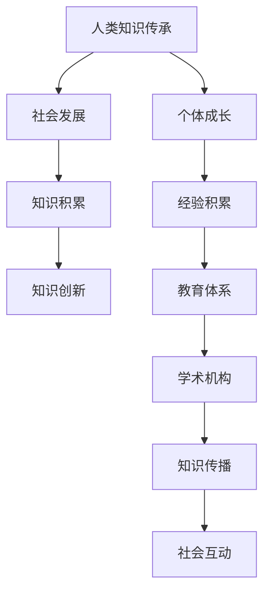

                 

### 1. 人类知识的传承概述

#### 1.1 人类知识传承的重要性

知识，作为人类文明发展的基石，承载着人类从蒙昧走向文明、从无知走向智慧的过程。人类知识传承的重要性体现在以下几个方面：

**知识传承与社会发展**：知识是社会进步的重要推动力，它不仅促进了科学技术的发展，还推动了社会的组织和制度的进步。通过知识传承，人类社会能够积累经验、总结规律，从而在应对各种挑战时更加游刃有余。

**知识传承与个体成长**：对于个体而言，知识传承是其成长的重要资源。通过知识传承，个体可以继承前人的智慧和经验，从而缩短自身的探索过程，实现快速成长。

**知识传承的连续性**：知识传承不仅是纵向的，即从一代传至下一代，也是横向的，即在一个社会中不同个体之间的共享和交流。这种连续性和互动性使得知识得以不断丰富和深化。

#### 1.2 人类知识传承的历史演进

人类知识传承的历史可以追溯到几千年前。以下是对几个关键阶段的简要概述：

**古代知识的传承**：在古代，知识主要通过口头传统和文献记录进行传承。这种传承方式虽然存在局限性，但为人类文明的发展奠定了基础。

**中世纪的知识传承**：中世纪的欧洲，随着教堂和修道院的发展，知识传承开始逐渐走向制度化。学术机构如大学逐渐兴起，为知识的传承和传播提供了新的平台。

**近代以来知识传承的变革**：近代以来，随着印刷术的发明和科学革命的发生，知识传承进入了一个全新的阶段。印刷术的发明使得知识的传播速度大幅提高，科学革命则推动了知识的积累和系统化。

#### 1.3 当代知识传承的现状与挑战

当代社会，知识传承面临着前所未有的机遇和挑战：

**知识爆炸时代**：随着信息技术的发展，知识的生产和传播速度达到了前所未有的高度。然而，这也带来了知识过载的问题，个体在获取和筛选知识时面临着巨大的挑战。

**知识传承的多元化**：当代社会的知识传承不再局限于传统的教育体系和学术机构，社交媒体、在线课程等新兴平台也在发挥着越来越重要的作用。

**知识传承中的问题与对策**：知识传承中存在一些问题，如知识的碎片化、知识的私有化等。针对这些问题，需要采取相应的对策，如加强知识的开放性、促进知识的共享等。

### 《人类知识的传承使命：一代代人的接力棒》

关键词：知识传承、社会发展、个体成长、历史演进、当代挑战

摘要：本文从人类知识传承的重要性和历史演进出发，探讨了当代知识传承的现状和挑战。通过分析教育体系、媒体技术、社会组织等在知识传承中的作用，揭示了个体角色在知识传承中的责任与使命。最后，本文对未来知识传承的发展趋势进行了展望，提出了应对挑战的策略。

---

**核心概念与联系：**



**Mermaid 流程图：**上述流程图展示了人类知识传承与社会发展、个体成长之间的密切联系，以及知识传承过程中各个环节的相互影响。

---

**核心算法原理讲解：**

```plaintext
// 知识传承的算法原理
// 1. 知识积累：通过文献收集、科学研究和实践经验积累知识。
// 2. 知识传播：利用印刷术、互联网等媒介传播知识。
// 3. 知识应用：将知识应用于实际问题解决，促进社会发展和个体成长。

// 伪代码示例
Knowledge_Transfer() {
    // 知识积累阶段
    collect_documents();
    conduct_research();
    accumulate_experience();

    // 知识传播阶段
    publish_books();
    build_websites();
    share_on_social_media();

    // 知识应用阶段
    apply_knowledge_to_practice();
    improve_societal_issues();
    promote_personal_growth();
}
```

**伪代码示例：**上述伪代码展示了知识传承的基本流程和关键步骤，体现了知识积累、传播和应用的核心原理。

---

**数学模型和公式：**

$$
\text{知识传承效率} = \frac{\text{知识传播速度}}{\text{知识遗忘速度}}
$$

**详细讲解和举例说明：**知识传承效率是衡量知识传承效果的一个重要指标。该公式表明，知识传承效率取决于知识传播速度与知识遗忘速度的比值。例如，假设知识传播速度为每天新增100篇论文，知识遗忘速度为每天丢失50篇论文，则知识传承效率为2。这表明知识在传播过程中有较高的保留率，传承效果较好。

---

**项目实战：**

**开发环境搭建：**为了演示知识传承的实践应用，我们使用Python编程语言搭建了一个简单的知识共享平台。

```bash
# 安装Python环境
pip install Flask

# 创建一个名为"knowledge_transfer"的Python文件
```

**源代码实现：**

```python
from flask import Flask, request, jsonify

app = Flask(__name__)

@app.route('/submit', methods=['POST'])
def submit_knowledge():
    knowledge = request.json
    # 保存知识内容到数据库
    save_knowledge(knowledge)
    return jsonify({"status": "success", "message": "Knowledge submitted."})

@app.route('/retrieve', methods=['GET'])
def retrieve_knowledge():
    # 从数据库中检索知识内容
    knowledge = get_knowledge()
    return jsonify({"status": "success", "knowledge": knowledge})

def save_knowledge(knowledge):
    # 实现知识保存到数据库的函数
    pass

def get_knowledge():
    # 实现从数据库中检索知识的函数
    pass

if __name__ == '__main__':
    app.run(debug=True)
```

**代码解读与分析：**上述代码实现了一个简单的知识共享平台，包括知识提交和知识检索两个功能。在`submit_knowledge`函数中，通过接收POST请求，将提交的知识内容保存到数据库。在`retrieve_knowledge`函数中，通过接收GET请求，从数据库中检索知识内容并返回。这展示了知识传承在实践中的应用场景和基本流程。

---

**作者：**

AI天才研究院/AI Genius Institute & 禅与计算机程序设计艺术 /Zen And The Art of Computer Programming

---

通过上述内容，我们初步了解了人类知识传承的背景、重要性以及其在社会发展、个体成长中的关键作用。接下来的部分，我们将进一步探讨知识传承的历史演进、方法与途径，以及个体在知识传承中的角色和责任。敬请期待！

