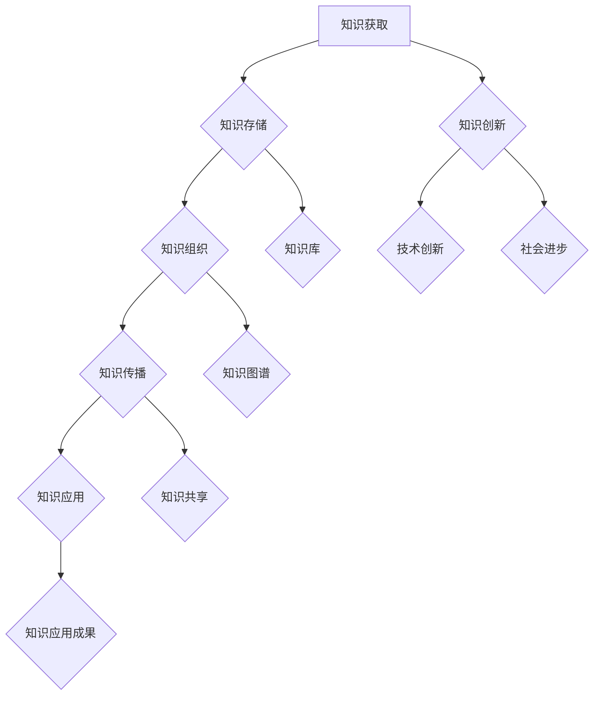

                 

# 人类知识的保存：一座座灯塔照亮未来

## 摘要

在信息化和数字化的浪潮中，人类知识的保存和传承成为了一项至关重要的任务。本文旨在探讨知识保存的现状与挑战，以及数字化和智能化技术在知识保存中的应用。通过详细分析知识传承的历史、现状和数字化优势，我们揭示了数据存储、数据库和数据分析技术在知识保存中的作用。随后，文章深入探讨了知识传播与共享的途径和平台，以及数字化知识在教育和商业领域的应用。在此基础上，文章进一步阐述了知识管理的重要性，以及人工智能在知识管理中的实际应用，如自然语言处理和知识图谱技术。最后，文章展望了知识创新与未来发展的趋势，提出了知识管理相关工具和资源，以及知识创新的途径与方法。通过本文的探讨，我们希望为读者提供一座知识的灯塔，照亮未来。

## 第一部分：知识的传承与数字化

### 第1章：知识传承的重要性

#### 1.1 知识传承的概念与历史

知识传承是指将人类积累的经验、知识、技能和智慧传递给下一代的过程。它不仅包括书本上的知识，还涵盖了许多无形的、非文字化的知识，如习俗、传统和技艺。知识传承是人类社会发展和进步的重要保障，它确保了知识的积累和延续，使得每一代人都能在前人的基础上进行创新和发展。

知识传承的历史可以追溯到古代。在古代，知识的传递主要通过师徒制、家族传承和文献记载等方式进行。例如，中国古代的儒家学派强调师生之间的传承关系，强调“传道、授业、解惑”的教育方式。在西方，古希腊和罗马时期的学者们通过讲座、讲义和书籍等形式进行知识传承。中世纪时期，欧洲的教会学校和修道院成为了知识传承的重要场所。

#### 1.2 知识传承的现状与挑战

在现代社会，知识传承面临着前所未有的挑战。首先，知识的数量和种类急剧增加，使得传统的知识传承方式变得难以适应。其次，知识更新速度加快，知识的生命周期缩短，传统的知识传承方式难以及时更新。此外，全球化和信息化的进程加速，不同文化之间的知识交流和融合成为了一种趋势，这给知识传承带来了新的机遇和挑战。

当前，知识传承的主要方式包括教育系统、媒体、互联网和社交媒体等。教育系统是知识传承的主要途径，通过学校教育、大学教育和职业教育，将知识传递给新一代。媒体，特别是报纸、杂志和电视，通过报道和传播知识，扩大了知识的影响力。互联网和社交媒体则为知识传承提供了新的平台，使得知识的传播更加迅速和广泛。

然而，知识传承的现状也面临着一些问题。首先是知识的碎片化，由于知识的海量增加，人们往往只能获取到零散的知识片段，难以形成系统的知识体系。其次是知识的去中心化，互联网和社交媒体的普及使得知识传播的途径更加多样化，但也带来了知识的泛滥和失真。最后是知识的专业化，随着学科领域的细分，知识的深度和难度增加，普通大众难以理解和掌握。

#### 1.3 数字化知识传承的优势

数字化知识传承是在现代信息技术和互联网的基础上，将知识以数字化的形式进行存储、传播和共享。数字化知识传承具有许多优势，首先，它能够实现知识的长期保存和快速检索。数字化的知识可以通过数据库进行存储和管理，确保知识的长期保存，同时，通过搜索引擎和知识图谱等技术，可以快速检索所需的知识。

其次，数字化知识传承能够实现知识的全球共享。互联网的普及使得数字化知识可以跨越地域和文化的限制，实现全球范围内的共享和传播。这不仅促进了知识的交流和融合，也为全球范围内的教育和科研提供了丰富的资源。

此外，数字化知识传承能够促进知识的创新和应用。数字化的知识可以为人工智能、大数据和云计算等新技术提供数据支持，推动知识的创新和应用。例如，通过自然语言处理技术，可以自动提取和分析文本中的知识，为人工智能系统提供数据输入。

总之，数字化知识传承是知识传承的重要发展方向，它不仅能够解决传统知识传承中的许多问题，还能够为知识的创新和应用提供新的机遇。

### 第2章：数字化的知识保存技术

#### 2.1 数据存储技术

数字化的知识保存离不开高效稳定的数据存储技术。数据存储技术主要包括磁盘存储、网络存储和云存储等。磁盘存储是通过磁盘阵列来实现海量数据的存储，它具有高容量、高速读写和可靠性高等优点，但同时也存在能耗高、维护复杂等问题。网络存储则通过构建分布式存储系统，实现数据的分散存储和冗余备份，提高了数据的可靠性和安全性。云存储通过互联网提供数据存储服务，用户可以根据需求动态调整存储容量，降低了存储成本。

在选择数据存储技术时，需要根据数据的类型、规模、访问频率和可靠性要求等因素进行综合考虑。例如，对于高访问频率和低可靠性要求的数据，可以选择磁盘存储；对于需要长期保存和可靠性要求较高的数据，可以选择网络存储或云存储。

#### 2.2 数据库技术

数据库技术是数字化知识保存的核心技术之一。数据库系统通过存储、管理和查询数据，为知识的保存和利用提供了有效的手段。常见的数据库技术包括关系型数据库和非关系型数据库。

关系型数据库基于关系模型，通过表格的形式组织数据，使用SQL语言进行数据查询和管理。关系型数据库具有数据结构清晰、查询效率高和事务管理能力强等优点，但同时也存在扩展性较差和灵活性不足等问题。常见的商用关系型数据库包括Oracle、MySQL、SQL Server等，开源关系型数据库如PostgreSQL等也具有广泛的应用。

非关系型数据库则基于文档、键值、图和列族等不同的数据模型，具有高扩展性和灵活性等优点，但同时也存在查询效率较低和事务管理能力较弱等问题。常见的非关系型数据库包括MongoDB、Cassandra、Redis等。

在选择数据库技术时，需要根据数据的特点、应用场景和性能要求等因素进行综合考虑。例如，对于结构化数据和高并发查询的应用，可以选择关系型数据库；对于非结构化数据和高扩展性的应用，可以选择非关系型数据库。

#### 2.3 数据分析技术

数据分析技术是数字化知识保存的重要组成部分，通过对海量数据的分析和挖掘，可以提取出有价值的信息和知识。常见的数据分析技术包括数据挖掘、机器学习和大数据处理等。

数据挖掘是通过建立数学模型和算法，从大量数据中提取出潜在的模式、关联和趋势。常见的数据挖掘技术包括关联规则挖掘、分类与回归分析、聚类分析和异常检测等。

机器学习是一种基于数据驱动的方法，通过训练模型来模拟和预测人类的学习过程。常见的机器学习算法包括决策树、支持向量机、神经网络和集成学习等。

大数据处理技术则是针对大规模数据集进行处理和分析的方法，包括分布式存储、分布式计算和流处理等。常见的大数据处理技术包括Hadoop、Spark、Flink等。

在实际应用中，数据分析技术可以根据具体需求进行组合和运用。例如，在医疗领域，可以通过大数据分析和机器学习技术，对患者的病历数据进行分析和预测，为医生提供诊断和治疗的参考；在金融领域，可以通过数据挖掘和机器学习技术，对客户的行为和交易数据进行分析，为金融机构提供风险评估和营销策略。

总之，数字化的知识保存技术为知识的存储、管理和分析提供了有效的手段，推动了知识的创新和应用。随着技术的不断发展，数字化知识保存技术将不断优化和提升，为人类知识的传承和发展提供更加有力的支持。

### 第3章：数字化知识的传播与共享

#### 3.1 知识传播的途径

数字化知识的传播途径多样，主要包括教育系统、媒体、互联网和社交媒体等。

教育系统是知识传播的传统途径，通过学校教育、大学教育和职业教育，将知识传递给新一代。随着信息技术的普及，在线教育平台和慕课（MOOCs）的兴起，使得教育系统在知识传播中的作用更加显著。在线教育平台如Coursera、edX等，提供了大量高质量的课程资源，用户可以根据自己的需求和兴趣进行学习。

媒体，特别是报纸、杂志和电视，通过报道和传播知识，扩大了知识的影响力。随着互联网的发展，媒体的形式和传播方式也在不断变革。例如，新闻网站、博客、播客和视频平台等，为知识的传播提供了更多的渠道。

互联网是知识传播的主要途径，通过搜索引擎、在线论坛和知识共享平台，用户可以随时随地获取和分享知识。搜索引擎如Google、Bing等，通过复杂的算法，为用户提供快速准确的信息检索服务。在线论坛如Stack Overflow、知乎等，为专业人士和爱好者提供了一个交流和学习的平台。

社交媒体，如Facebook、Twitter、Instagram等，使得知识的传播更加迅速和广泛。用户可以通过发布动态、分享链接和评论等形式，快速传播知识。社交媒体的算法推荐功能，也可以帮助用户发现和关注感兴趣的领域和内容。

#### 3.2 知识共享平台

知识共享平台是数字化知识传播的重要载体，通过提供丰富的知识资源和便捷的共享方式，促进了知识的传播和应用。常见的知识共享平台包括维基百科、GitHub、Stack Overflow等。

维基百科（Wikipedia）是一个多语言、免费的在线百科全书，用户可以自由编辑和贡献内容。维基百科的内容涵盖了各个领域，为用户提供了丰富的知识资源。其开放的编辑机制，也使得知识得以不断更新和完善。

GitHub是一个基于Git版本控制的代码托管平台，用户可以在GitHub上创建、托管和分享代码。GitHub不仅是一个代码仓库，也是一个知识共享平台，用户可以分享自己的技术心得、项目经验和开发技巧。

Stack Overflow是一个编程问答社区，用户可以在Stack Overflow上提问和回答问题。Stack Overflow的内容涵盖了各种编程语言和技术领域，为程序员提供了一个交流和学习的平台。其优质的内容和高效的搜索功能，使得Stack Overflow成为编程开发者获取知识和解决问题的首选平台。

除了上述平台，还有许多其他的知识共享平台，如GitLab、LinkedIn、Quora等，它们在知识传播和共享方面也发挥着重要作用。

#### 3.3 知识共享的障碍与解决方案

尽管数字化知识传播和共享平台提供了丰富的资源和便捷的渠道，但在实际应用中仍面临一些障碍和挑战。

首先，知识共享的障碍之一是版权问题。许多知识资源受版权保护，未经授权的共享和使用可能涉及侵权风险。为了解决这一问题，可以采用开放许可协议，如Creative Commons许可协议，允许用户在特定的条件下使用和共享知识资源。

其次，知识共享的障碍之一是信息过载。互联网上的知识资源海量且繁杂，用户往往难以筛选和获取有价值的信息。为了解决这一问题，可以采用知识图谱和语义搜索等技术，提高信息检索的准确性和效率。

此外，知识共享的障碍之一是语言和地域的限制。不同国家和地区的用户，往往难以理解和交流某些知识。为了解决这一问题，可以采用多语言支持和跨文化交流平台，促进知识的全球共享和融合。

最后，知识共享的障碍之一是隐私和安全问题。在互联网环境下，用户的隐私和数据安全面临风险。为了解决这一问题，可以采用加密技术和隐私保护算法，确保用户数据的保密性和安全性。

总之，数字化知识的传播与共享在推动知识创新和应用方面具有重要意义，但同时也面临一些障碍和挑战。通过采用开放许可、技术优化和隐私保护等措施，可以进一步促进知识共享，推动人类社会的进步和发展。

### 第4章：数字化知识的应用

#### 4.1 教育领域的应用

数字化知识在教育领域的应用正在深刻改变传统的教学模式和学习方式。在线教育平台和虚拟课堂的兴起，使得学习资源得以广泛传播，学生可以随时随地获取知识。例如，通过MOOC（大规模开放在线课程）平台，学生可以选修全球知名大学和专家开设的课程，拓展知识视野。此外，数字化知识的应用还体现在学习工具和教学资源的丰富多样，如电子书、互动教学软件和在线测验系统，提高了教学效果和学习体验。

在线教育平台不仅打破了地域限制，还促进了教育资源的公平分配。偏远地区和资源匮乏的学生可以通过互联网获取优质教育资源，弥补教育差距。同时，虚拟课堂和在线互动教学也提供了更多师生互动的机会，学生可以在学习过程中及时获得反馈和帮助。

然而，数字化教育也带来了一些挑战，如技术设备普及率不高、网络不稳定等问题。此外，在线教育的发展也引发了关于学习效果和认证标准的讨论。尽管如此，数字化知识在教育领域的应用无疑为教育公平和个性化学习提供了新的机遇。

#### 4.2 科研领域的应用

数字化知识在科研领域的应用大大提升了科研效率，推动了科学研究的创新和发展。科研数据的数字化存储和管理，使得科研人员可以轻松访问全球范围内的科研资源，减少重复研究，加速科学发现的步伐。在线科研平台和数据库，如PubMed、Google Scholar等，提供了丰富的学术文献和研究成果，为科研人员提供了强大的信息支持。

此外，数字化知识在科研中的应用还体现在科研工具和方法的数字化上。例如，高通量测序技术和基因编辑技术的数字化，使得生物科学研究得以快速推进。通过云计算和大数据技术，科研人员可以对大规模数据集进行高效分析，发现新的科学规律。

然而，数字化知识在科研领域的应用也面临一些挑战。数据隐私和安全问题、知识产权保护问题等都需要引起重视。同时，数字化知识的快速更新和变化，也对科研人员的技能和知识储备提出了更高的要求。

#### 4.3 商业领域的应用

数字化知识在商业领域的应用为企业和行业带来了巨大的变革和创新机会。通过大数据分析和人工智能技术，企业可以更好地了解市场需求和消费者行为，制定精准的营销策略和产品策略。例如，通过数据分析，企业可以发现潜在的客户群体，优化产品和服务，提高市场竞争力。

在商业决策过程中，数字化知识也发挥着重要作用。数据驱动的商业决策可以帮助企业减少风险，提高决策效率。例如，通过实时数据分析，企业可以快速应对市场变化，调整生产和库存策略。

此外，数字化知识的应用还体现在商业模式的创新上。例如，共享经济模式通过互联网平台，将闲置资源进行共享，降低了资源浪费，创造了新的商业机会。电子商务、在线教育和远程办公等新兴商业模式，都是数字化知识应用的典范。

然而，商业领域在应用数字化知识时也需要注意数据隐私和安全问题，以及技术人才的培养和引进。只有通过合理的规划和有效的管理，才能充分发挥数字化知识的商业价值。

### 第二部分：知识管理与智能化

#### 第5章：知识管理的重要性

#### 5.1 知识管理的概念与内涵

知识管理（Knowledge Management，简称KM）是指通过系统的方法和技术，对知识进行收集、存储、组织、传播和应用的过程。其核心目标是通过有效的知识管理，提高组织的学习能力和创新能力，从而实现组织绩效的持续提升。

知识管理的概念可以追溯到20世纪80年代。最初，知识管理主要关注知识的传递和共享，后来逐渐扩展到知识的获取、创造、存储和应用等多个方面。在知识经济时代，知识成为企业和社会发展的关键资源，知识管理的重要性日益凸显。

知识管理的内涵主要包括以下几个方面：

1. **知识的识别和获取**：通过对内部和外部资源的分析，识别和获取有价值的信息和知识，包括显性知识和隐性知识。
2. **知识的存储和组织**：通过数据库、知识库、文档管理系统等工具，对获取的知识进行分类、索引和存储，方便用户查询和利用。
3. **知识的传播和共享**：通过内部网络、会议、培训、社交平台等途径，将知识在不同部门和员工之间进行传播和共享，促进知识的扩散和应用。
4. **知识的创新和应用**：通过知识创新和转化，将知识应用于实际工作中，提高组织的决策效率、产品创新能力和市场竞争力。

#### 5.2 知识管理的发展历程

知识管理的发展历程可以分为几个阶段：

1. **早期阶段**（1980年代初至1990年代初）：知识管理起源于信息技术领域，主要关注知识共享和知识传递。这一阶段的典型代表是库伯（Sheck Harper）提出的“知识管理生命周期”理论，包括知识获取、知识共享、知识应用和知识创新四个环节。

2. **整合阶段**（1990年代中期至2000年代初）：随着互联网和信息技术的发展，知识管理的应用范围进一步扩展，从单一的知识共享工具发展到综合的知识管理平台。这一阶段的代表是IBM的“知识管理框架”，包括知识识别、知识获取、知识存储、知识传播和知识应用五个方面。

3. **智能化阶段**（2000年代中期至今）：随着人工智能和大数据技术的发展，知识管理进入了智能化阶段。通过自然语言处理、机器学习、知识图谱等先进技术，知识管理的效率和效果得到了显著提升。这一阶段的代表是微软的“智能知识管理平台”，实现了知识的自动识别、分类、索引和推荐。

#### 5.3 知识管理的目标与方法

知识管理的目标主要包括提高组织的学习能力、增强创新能力、提高决策效率、提升员工绩效和实现知识共享等。具体来说，知识管理的目标可以概括为以下几个方面：

1. **提高组织的学习能力**：知识管理通过构建学习型组织，促进员工不断学习和积累知识，提高组织的整体智力水平。
2. **增强创新能力**：知识管理通过知识共享和创新机制的建立，激发员工的创新思维，推动组织的技术和产品创新。
3. **提高决策效率**：知识管理通过提供及时、准确的知识支持，帮助组织快速做出科学合理的决策。
4. **提升员工绩效**：知识管理通过知识共享和技能培训，提高员工的知识水平和技能，提升员工的绩效和工作满意度。
5. **实现知识共享**：知识管理通过建立有效的知识共享机制，促进组织内部和跨组织的知识交流和共享，提高知识的利用率。

为了实现上述目标，知识管理采用了多种方法和工具：

1. **知识识别和获取**：通过调研、访谈、问卷调查等方式，识别和获取组织内部和外部的知识资源。
2. **知识存储和组织**：通过数据库、知识库、文档管理系统等工具，对获取的知识进行分类、索引和存储。
3. **知识传播和共享**：通过内部网络、会议、培训、社交平台等途径，将知识在不同部门和员工之间进行传播和共享。
4. **知识创新和应用**：通过知识创新和转化机制，将知识应用于实际工作中，推动组织的创新和发展。

总之，知识管理是组织管理和信息化建设的重要组成部分，它通过系统的方法和技术，对知识进行有效管理，提高组织的知识水平和创新能力，从而实现组织的可持续发展。

### 第6章：智能化知识管理技术

#### 6.1 人工智能在知识管理中的应用

人工智能（AI）技术的迅猛发展，为知识管理带来了全新的机遇和挑战。通过引入人工智能技术，知识管理可以实现自动化、智能化和高效化，从而提高组织的知识获取、处理和应用能力。

首先，人工智能在知识获取方面具有显著优势。通过自然语言处理（NLP）技术，AI可以自动从大量非结构化数据中提取有价值的信息。例如，企业可以利用AI技术分析客户反馈、市场报告和竞争对手的信息，快速获取市场洞察和行业动态。此外，AI还可以通过图像识别和语音识别技术，从图片、视频和语音中提取知识，扩展知识来源。

在知识处理方面，人工智能技术提供了强大的数据处理和分析能力。通过机器学习算法，AI可以自动对海量数据进行分类、聚类和预测，帮助组织发现潜在的知识关联和趋势。例如，利用聚类算法，企业可以识别出不同客户群体的特征和需求，从而制定更精准的营销策略。通过预测模型，企业可以预测市场变化和客户行为，为决策提供数据支持。

在知识应用方面，人工智能技术可以实现知识自动化和智能化利用。通过智能推荐系统，AI可以根据用户的历史行为和偏好，自动推荐相关的知识和资源。例如，在电子商务领域，智能推荐系统可以帮助企业向顾客推荐相关商品，提高销售额和客户满意度。在医疗领域，AI可以辅助医生进行诊断和治疗决策，提高医疗服务的质量和效率。

#### 6.2 自然语言处理技术

自然语言处理（NLP）技术是人工智能领域的一个重要分支，它使得计算机能够理解和处理人类自然语言。在知识管理中，NLP技术被广泛应用于知识提取、文本分析和语义理解等方面。

知识提取是指从大量的文本数据中自动识别和提取有价值的信息。通过NLP技术，AI可以自动识别文本中的实体、关系和事件，从而将非结构化文本转换为结构化数据。例如，企业可以利用NLP技术从客户反馈中提取关键信息，快速了解客户需求和反馈。

文本分析是指对大量文本数据进行分析和挖掘，以发现潜在的模式和趋势。NLP技术可以帮助企业对市场报告、竞争对手分析报告等文本数据进行分析，提取关键信息，为决策提供支持。此外，NLP技术还可以用于情感分析，通过分析文本中的情感倾向和情感强度，帮助企业了解客户情感和市场需求。

语义理解是指理解和处理文本中的语义信息，从而实现人机交互。通过语义理解技术，AI可以理解用户的自然语言查询，并返回相关的知识和信息。例如，用户可以通过自然语言提问获取企业内部的知识库信息，AI系统可以自动理解用户查询并返回最相关的答案。

#### 6.3 知识图谱技术

知识图谱（Knowledge Graph）是一种结构化的知识表示方法，通过实体和关系的连接，将海量知识进行组织和管理。在知识管理中，知识图谱技术可以提供强大的知识组织和搜索功能，帮助用户快速定位和获取所需的知识。

知识图谱的基本组成包括实体、属性和关系。实体是知识图谱中的基本元素，如人、地点、组织等。属性是实体的特征描述，如姓名、年龄、地址等。关系是实体之间的关联，如朋友、工作地、参与事件等。

通过知识图谱技术，企业可以建立内部的知识网络，将不同部门和员工的知识进行整合和关联。例如，企业可以利用知识图谱技术将员工的知识和技能进行整合，帮助新员工快速了解企业的业务流程和员工团队。

知识图谱技术在知识搜索方面也具有显著优势。通过语义搜索技术，用户可以使用自然语言查询，知识图谱可以自动理解查询意图，并返回最相关的知识和信息。例如，用户可以通过自然语言查询“张三的工作经历”，知识图谱可以自动识别查询意图，并返回张三的相关工作经历信息。

此外，知识图谱技术还可以用于知识推荐。通过分析用户的历史行为和知识访问记录，知识图谱可以推荐用户可能感兴趣的知识和资源。例如，用户在知识库中查询了某一主题的信息，知识图谱可以推荐相关的知识文档和资料，帮助用户进一步了解相关领域。

总之，智能化知识管理技术为知识管理带来了新的机遇和挑战。通过引入人工智能、自然语言处理和知识图谱等技术，知识管理可以实现自动化、智能化和高效化，从而提高组织的知识管理水平，推动组织的创新和发展。

### 第7章：智能化知识管理的案例与实践

#### 7.1 智能化知识管理的实际案例

智能化知识管理的实践在多个行业和领域取得了显著的成果。以下列举几个具有代表性的实际案例，分析其具体实施步骤和效果。

**案例一：企业内部知识管理平台**

某大型企业为了提升内部知识共享和协作效率，构建了一个智能化知识管理平台。具体实施步骤如下：

1. **需求调研和规划**：首先，企业进行了深入的需求调研，明确了知识管理平台的目标、功能和用户需求。在此基础上，制定了详细的项目规划和时间表。

2. **技术选型和系统搭建**：根据需求调研的结果，企业选择了合适的AI技术、NLP技术和知识图谱技术，并搭建了知识管理平台的基础框架。

3. **数据采集和整理**：企业通过内部文档管理系统、员工知识库和社交媒体平台等渠道，收集和整理了大量的内部知识资源，包括文档、报告、经验分享和最佳实践等。

4. **知识建模和存储**：利用知识图谱技术，企业对收集的知识资源进行建模和存储，建立了结构化的知识库。通过实体、属性和关系的连接，实现了知识的整合和关联。

5. **知识检索和推荐**：平台集成了NLP技术和语义搜索功能，用户可以通过自然语言查询获取相关知识和信息。同时，系统根据用户的历史行为和偏好，自动推荐相关的知识和资源。

6. **培训和推广**：为了提高员工对知识管理平台的认知和使用，企业组织了多次培训和推广活动，帮助员工掌握平台的使用方法和技巧。

实施效果：智能化知识管理平台大大提高了企业内部的知识共享和协作效率。员工可以快速获取所需的知识资源，减少重复劳动和重复研究。同时，知识图谱和推荐系统的应用，使得知识检索更加高效和精准，提高了员工的工作效率。企业整体的知识管理水平得到了显著提升。

**案例二：教育领域的智能化知识管理**

某知名大学为了提升教学质量和学习体验，引入了智能化知识管理技术，建设了一个智能教育平台。具体实施步骤如下：

1. **需求调研和规划**：大学首先进行了需求调研，明确了智能化知识管理平台在教学支持、学生管理和科研支持等方面的需求。在此基础上，制定了详细的项目规划。

2. **技术选型和系统搭建**：大学选择了AI、NLP和知识图谱等技术，并搭建了智能教育平台的基础架构。

3. **课程内容和知识库建设**：大学通过课程资源的数字化和知识库建设，将大量的教学资料、课程笔记和学术研究整合到一个平台中。

4. **智能推荐和学习分析**：平台集成了智能推荐和学习分析功能，根据学生的学习行为和成绩，为学生推荐相关的学习资源和辅导材料。同时，系统可以实时分析学生的学习情况，帮助教师了解学生的学习进度和需求。

5. **在线考试和反馈**：平台提供了在线考试和自动评分功能，学生可以通过平台进行自主学习和在线考试。教师可以根据考试结果，及时给予学生反馈和指导。

6. **培训和推广**：为了提高师生对智能教育平台的认知和使用，大学组织了多次培训和推广活动，帮助师生掌握平台的使用方法和技巧。

实施效果：智能化知识管理平台大大提升了教学质量和学习体验。学生可以通过平台获取丰富的学习资源，自主学习和互动交流，提高了学习效果和兴趣。教师可以通过平台了解学生的学习情况，提供个性化的教学支持，提高了教学效率和质量。大学的整体教育水平得到了显著提升。

**案例三：医疗领域的智能化知识管理**

某大型医疗机构为了提升医疗服务质量和效率，引入了智能化知识管理技术，建设了一个智能医疗平台。具体实施步骤如下：

1. **需求调研和规划**：医疗机构首先进行了需求调研，明确了智能化知识管理平台在医疗信息共享、患者管理和科研支持等方面的需求。在此基础上，制定了详细的项目规划。

2. **技术选型和系统搭建**：医疗机构选择了AI、NLP和知识图谱等技术，并搭建了智能医疗平台的基础架构。

3. **医疗知识和数据整合**：医疗机构通过医疗知识库建设，将大量的临床知识、诊疗指南和科研论文整合到一个平台中。

4. **智能诊疗和辅助决策**：平台集成了智能诊疗和辅助决策功能，医生可以通过平台获取患者的病史、检查结果和诊疗建议，提高诊断和治疗的准确性。同时，系统可以自动分析病历数据，发现潜在的健康风险和疾病趋势。

5. **患者管理和健康管理**：平台提供了患者管理和健康管理功能，患者可以通过平台了解自己的健康状况、检查结果和诊疗建议。同时，系统可以自动提醒患者进行体检、用药和复查，提高患者的健康意识和管理水平。

6. **培训和推广**：为了提高医护人员对智能医疗平台的认知和使用，医疗机构组织了多次培训和推广活动，帮助医护人员掌握平台的使用方法和技巧。

实施效果：智能化知识管理平台大大提升了医疗服务的质量和效率。医生可以通过平台快速获取医疗知识和信息，提高诊断和治疗的准确性。患者可以通过平台了解自己的健康状况，主动参与健康管理，提高了健康水平和满意度。医疗机构整体的服务质量和管理水平得到了显著提升。

综上所述，智能化知识管理的实际案例在多个行业和领域取得了显著的成果。通过引入人工智能、自然语言处理和知识图谱等技术，知识管理可以实现自动化、智能化和高效化，从而提高组织的知识管理水平，推动组织的创新和发展。

### 第8章：知识创新的重要性

#### 8.1 知识创新的概念与内涵

知识创新（Knowledge Innovation）是指通过创造新的知识和观念，或者对现有知识的重新组合和重构，从而产生新的价值和应用的过程。知识创新不仅包括知识的创造，还涉及知识的传播、应用和共享。其核心目的是通过创新活动，推动知识的积累和增长，提高组织的竞争力和社会的进步。

知识创新的概念可以追溯到20世纪80年代，随着信息技术和全球化的迅速发展，知识逐渐成为推动经济增长和社会进步的关键资源。知识创新的理论基础主要包括创新理论、知识管理和系统科学等。

知识创新的内涵主要包括以下几个方面：

1. **知识创造**：知识创造是知识创新的基础，它涉及新知识的发现、发明和创造。知识创造可以通过科学研究、技术发明、文化创意等多种途径实现。

2. **知识传播**：知识传播是知识创新的必要条件，它是指将新知识和观念传递给更多的人，使其在更大范围内得到应用和扩散。知识传播可以通过教育、媒体、互联网和社交媒体等多种途径实现。

3. **知识应用**：知识应用是将知识转化为实际价值和效益的过程。知识应用可以通过技术创新、产品开发、商业模式创新等多种方式实现。

4. **知识共享**：知识共享是知识创新的保障，它是指通过建立有效的机制，促进知识和经验的共享和传播。知识共享可以提高组织的知识水平和创新能力，推动社会的知识进步。

#### 8.2 知识创新的类型与过程

知识创新可以分为以下几种类型：

1. **基础性知识创新**：基础性知识创新主要是指在科学研究和理论探索过程中，产生新的科学理论、原理和方法。基础性知识创新是推动科学技术进步和社会发展的根本动力。

2. **应用性知识创新**：应用性知识创新主要是指将基础性知识创新应用于实际问题中，解决现实问题，产生新的技术、产品和商业模式。应用性知识创新是知识创新的核心，它直接推动经济增长和社会进步。

3. **集成性知识创新**：集成性知识创新是指通过整合不同的知识领域和资源，实现知识的跨界融合和创新。集成性知识创新可以产生新的学科领域、技术体系和商业模式，推动社会的创新和发展。

4. **变革性知识创新**：变革性知识创新是指通过颠覆传统观念和模式，实现知识领域的重大变革和创新。变革性知识创新可以带来革命性的技术突破和社会变革。

知识创新的过程主要包括以下几个阶段：

1. **知识识别和获取**：在知识创新过程中，首先要识别和获取所需的内外部知识资源，包括文献、数据、实践经验等。

2. **知识整合和重组**：通过整合和重组已有的知识资源，形成新的知识结构和观念体系。这一阶段需要运用创新思维和知识管理技术，实现知识的创新和转化。

3. **知识创造和发明**：在整合和重组知识的基础上，通过创造性思维和实践，产生新的知识成果，如新的理论、技术、产品和商业模式等。

4. **知识传播和应用**：将创新的知识成果传播和应用于实际工作中，实现知识的应用和转化。这一阶段需要建立有效的知识传播和共享机制，促进知识的传播和应用。

5. **知识反馈和优化**：通过实践反馈，对创新的知识进行评价和优化，进一步提升知识的质量和应用效果。这一阶段需要建立持续的知识创新和优化机制。

#### 8.3 知识创新的影响因素

知识创新的影响因素多种多样，包括内部和外部因素。以下是一些主要的影响因素：

1. **人力资源**：人力资源是知识创新的核心资源。具有创新精神和能力的员工是知识创新的重要推动力。此外，人才流动和跨领域合作也有助于知识的交叉融合和创新。

2. **技术创新**：技术创新是知识创新的重要驱动力。通过技术创新，可以产生新的知识和成果，推动社会的技术进步和经济发展。

3. **资金支持**：资金支持是知识创新的重要保障。充足的资金支持可以提供良好的创新环境，促进知识创新的实施和推广。

4. **政策环境**：政策环境对知识创新具有重要影响。政府通过制定相关政策和法规，鼓励知识创新和保护知识产权，可以推动知识创新的发展。

5. **信息资源**：信息资源是知识创新的重要基础。通过获取和利用丰富的信息资源，可以激发创新思维，推动知识创新。

6. **组织文化**：组织文化对知识创新具有深远影响。开放、创新和包容的组织文化可以激发员工的创新精神和创造力，促进知识创新。

总之，知识创新是推动社会进步和经济发展的重要动力。通过识别和利用影响因素，可以进一步促进知识创新，实现知识的积累和增长，为社会带来更多创新成果。

### 第9章：知识创新的途径与方法

#### 9.1 知识融合

知识融合（Knowledge Fusion）是指通过整合不同来源、不同形式的异质知识，形成新的综合知识和理解的过程。知识融合是知识创新的重要途径之一，它能够促进知识的互补和增值，提高知识的利用效率。

知识融合的方法主要包括以下几种：

1. **数据融合**：通过整合不同来源的数据，形成统一的视图和信息。例如，企业可以通过整合客户数据、市场数据和行为数据，获得更全面的客户画像，从而制定更精准的营销策略。

2. **信息融合**：通过整合不同的信息源，形成综合性的信息。例如，医疗领域可以通过整合病历数据、检查数据和文献资料，形成患者的综合健康信息，提高诊断和治疗的准确性。

3. **知识融合**：通过整合不同领域的专业知识和经验，形成新的知识体系和理解。例如，工程领域可以通过融合机械工程、电子工程和计算机科学的知识，开发出更先进的智能化产品。

知识融合的关键在于解决数据异构性和信息不一致性等问题。为了实现有效的知识融合，可以采用以下策略：

- **标准化**：通过建立统一的术语、数据格式和模型，实现不同数据源之间的兼容和互操作。
- **关联**：通过建立知识关联，将不同来源的知识进行映射和整合，形成综合的知识体系。
- **协同**：通过多人协作和跨领域合作，实现知识的共享和互补。

#### 9.2 知识迭代

知识迭代（Knowledge Iteration）是指通过不断循环和反复的过程，对现有知识进行改进和优化，实现知识持续创新和升级的方法。知识迭代是一种动态的知识创新模式，它强调知识的不断更新和进化，以适应快速变化的环境和需求。

知识迭代的方法主要包括以下几种：

1. **迭代学习**：通过反复的学习和实践，不断吸收新的知识和经验，对现有知识进行更新和优化。例如，通过迭代学习，员工可以不断掌握新技术和新方法，提高自身的专业能力和技术水平。

2. **迭代开发**：在产品开发和项目实施过程中，通过反复的迭代和测试，不断优化和改进产品和服务。例如，软件开发过程中，通过迭代开发，可以不断修复漏洞、提升性能和增加新功能，提高产品的质量和服务水平。

3. **迭代改进**：通过反复的反馈和改进，不断优化和提升知识和工作的效率和质量。例如，企业可以通过迭代改进，持续优化业务流程、管理方法和员工技能，提高组织的整体绩效。

知识迭代的步骤主要包括：

- **需求分析**：明确知识迭代的目标和需求，确定需要改进和优化的方面。
- **方案设计**：制定具体的迭代方案，包括迭代周期、步骤和预期成果。
- **实施执行**：按照迭代方案，进行具体的实施和执行，不断收集反馈和改进意见。
- **评估优化**：对迭代过程和结果进行评估，识别存在的问题和改进空间，进行持续的优化和改进。

知识迭代的关键在于建立有效的反馈和改进机制，确保知识的持续更新和优化。同时，需要培养员工的创新意识和团队协作精神，促进知识的流动和共享，提高组织的知识创新能力。

#### 9.3 知识重构

知识重构（Knowledge Reconstruction）是指通过重新组合和整合已有知识，建立新的知识结构和模式，实现知识创新的策略和方法。知识重构能够打破传统的思维框架和知识界限，产生新的思想和观点，促进知识的创新和发展。

知识重构的方法主要包括以下几种：

1. **知识重组**：通过重新组合不同领域和不同来源的知识，形成新的知识结构和观点。例如，通过知识重组，可以产生新的商业模式、管理方法和科技创新。

2. **知识整合**：通过整合不同领域的专业知识和经验，形成新的知识体系和理解。例如，通过知识整合，可以产生新的学科领域、技术体系和商业模式。

3. **知识抽象**：通过提取和抽象核心知识要素，建立新的知识模型和框架。例如，通过知识抽象，可以构建新的理论模型、算法模型和系统框架。

知识重构的关键在于打破传统的思维框架和知识界限，实现知识的跨界融合和创新。为了实现有效的知识重构，可以采用以下策略：

- **跨界合作**：通过跨领域、跨学科的合作，整合不同领域的知识和经验，实现知识的互补和增值。
- **思维创新**：通过创新思维和跨界思考，突破传统的思维框架，产生新的思想和观点。
- **技术支持**：通过先进的技术手段，如人工智能、大数据和云计算等，实现知识的自动化重构和优化。

知识重构能够推动知识的创新和发展，促进社会的进步和繁荣。通过有效的知识重构，可以激发新的创新思维和商业模式，推动社会的技术进步和经济发展。

### 第10章：知识创新在未来的发展

#### 10.1 知识创新的未来趋势

知识创新在未来的发展将呈现以下几个趋势：

1. **智能化**：随着人工智能技术的不断进步，知识创新将更加智能化。通过智能算法和大数据分析，知识创新可以更加高效地发现和利用知识，推动技术的突破和产业的变革。

2. **全球化**：全球化的趋势将推动知识创新在全球范围内的流动和融合。不同国家和地区之间的知识交流和合作将更加紧密，促进知识的共享和创新。

3. **多元化**：知识创新将不再局限于科学和技术领域，还将涵盖艺术、文化和社会等各个领域。多元化的知识创新将带来更多的创新成果和社会价值。

4. **生态化**：知识创新将呈现生态化趋势，即知识创新不再是单个组织或个人的行为，而是整个社会和创新生态系统的共同成果。知识创新将更加注重协作、共享和可持续发展。

5. **个性化**：随着个性化需求的增长，知识创新将更加注重满足个体需求，提供个性化的知识和解决方案。个性化知识创新将推动教育和医疗等领域的变革。

#### 10.2 知识创新对社会的影响

知识创新对社会的影响深远而广泛，主要表现在以下几个方面：

1. **经济增长**：知识创新是推动经济增长的重要动力。通过知识创新，可以产生新的技术和产品，提高生产效率，促进产业升级和转型，推动经济持续健康发展。

2. **教育变革**：知识创新对教育领域的影响显著。知识创新将改变传统的教育模式，推动在线教育、个性化教育和终身学习的发展，提高全民素质和创新能力。

3. **医疗服务**：知识创新在医疗领域的应用将大大提高医疗服务的质量和效率。通过知识创新，可以开发出新的医疗技术、药物和治疗方法，提高诊断和治疗的准确性，降低医疗成本。

4. **社会治理**：知识创新对社会治理的影响也越来越大。通过知识创新，可以建立更加高效、智能和透明的社会治理体系，提高公共服务的质量和效率，促进社会和谐稳定。

5. **文化传承**：知识创新对文化传承和保护具有重要意义。通过知识创新，可以挖掘和传承优秀的文化遗产，推动文化创新和多元化发展，增强民族自信心和文化软实力。

#### 10.3 知识创新的政策与支持

为了促进知识创新的发展，各国政府和社会组织需要制定相应的政策和支持措施，主要包括：

1. **政策支持**：政府应制定鼓励知识创新的政策，包括税收优惠、资金支持、知识产权保护和市场监管等，为知识创新提供良好的政策环境。

2. **资金投入**：政府和社会应加大对知识创新的资金投入，支持基础研究、应用研究和产业化发展，为知识创新提供充足的资金保障。

3. **人才培养**：政府和社会应重视人才培养，加大对高等教育和职业教育的投入，培养具有创新精神和实践能力的优秀人才。

4. **国际合作**：政府和社会应积极参与国际合作，促进知识创新成果的共享和传播，推动全球知识创新的发展。

5. **技术创新**：政府和社会应鼓励企业加大技术创新投入，推动新技术、新产品的研发和应用，提高国家的技术创新能力和核心竞争力。

总之，知识创新是推动社会进步和经济发展的重要力量。通过制定有效的政策和措施，营造良好的创新环境，可以进一步激发知识创新的活力，为人类社会的发展做出更大贡献。

### 附录

#### 附录 A：知识管理工具与资源

1. **知识管理工具**：
   - **Confluence**：Atlassian开发的团队协作平台，用于知识管理和文档共享。
   - **Trello**：一个基于看板的任务管理工具，适合项目管理和知识梳理。
   - **Evernote**：跨平台笔记应用，适合个人和团队的知识记录和共享。

2. **知识管理资源**：
   - **知识库系统**：如IBM Watson Knowledge Catalog、Microsoft Power BI等。
   - **在线教育资源**：如Coursera、edX、Khan Academy等，提供丰富的在线课程和资源。

#### 附录 B：知识创新案例分析

1. **案例一：谷歌的AI创新**
   - **背景**：谷歌通过人工智能技术，推动了搜索引擎、自动驾驶、云计算等多个领域的创新。
   - **创新成果**：开发了AlphaGo、BERT等先进的人工智能算法和工具。

2. **案例二：苹果的生态系统创新**
   - **背景**：苹果通过不断推陈出新，创新了智能手机、平板电脑、智能手表等产品。
   - **创新成果**：开发了iOS、iPadOS等操作系统，推动了移动设备的智能化和多样化。

#### 附录 C：知识管理相关术语解释

1. **知识管理**：通过系统的方法和技术，对知识进行收集、存储、组织、传播和应用的过程。
2. **知识库**：存储和组织知识的数据库系统，用于知识的检索和应用。
3. **知识共享**：通过建立有效的机制，促进知识和经验的共享和传播。
4. **知识创新**：通过创造新的知识和观念，或者对现有知识的重新组合和重构，从而产生新的价值和应用的过程。
5. **知识图谱**：通过实体和关系的连接，将海量知识进行组织和管理的一种方法。

### Mermaid 流程图



### 核心算法原理讲解

#### 深度学习算法原理

**伪代码：**

```plaintext
# 定义神经网络结构
inputs = ...

# 隐藏层激活函数
h1 = ActivationFunction(f1(inputs))

# 输出层激活函数
outputs = ActivationFunction(f2(h1))

# 计算损失函数
loss = LossFunction(outputs, labels)

# 计算梯度
gradients = ComputeGradients(loss, parameters)

# 更新参数
parameters = parameters - LearningRate * gradients
```

**深度学习算法原理：**

深度学习是一种基于多层神经网络进行学习的机器学习技术，它通过模拟人脑神经网络的结构和功能，对大量数据进行训练，以实现复杂模式识别和预测。

深度学习算法的核心是神经网络，神经网络由输入层、隐藏层和输出层组成。每一层由多个神经元（节点）组成，神经元之间通过权重连接。神经网络的训练过程包括以下几个步骤：

1. **前向传播**：输入数据通过输入层传递到隐藏层，再从隐藏层传递到输出层。每个神经元将输入数据与其权重相乘，并应用激活函数，从而产生输出。

2. **计算损失**：输出层的输出与实际标签进行比较，计算损失函数（如均方误差、交叉熵等）的值，以衡量模型的预测误差。

3. **反向传播**：通过反向传播算法，将损失函数的梯度传递回隐藏层和输入层。每个神经元更新其权重，以减小损失函数的值。

4. **迭代训练**：重复前向传播和反向传播过程，逐步减小损失函数的值，直至达到预设的误差目标或达到最大迭代次数。

通过多次迭代训练，神经网络可以逐步学会对新的输入数据进行分类、预测和识别。深度学习算法在图像识别、语音识别、自然语言处理等领域取得了显著成果。

#### 自然语言处理算法原理

**LaTeX代码：**

```latex
% 定义词嵌入矩阵 $W$，输入序列 $x$，隐藏状态 $h_t$，输出状态 $y_t$。
%
% $h_t = tanh(W * [x_t; 1])$
%
% $y_t = softmax(W' * h_t)$
%
% 损失函数通常使用交叉熵损失：
% $L = -\sum_{t=1}^{T} \sum_{i=1}^{V} y_{t,i} \log(p_{t,i})$
%
% 梯度计算：
% $\frac{\partial L}{\partial W} = \sum_{t=1}^{T} (h_t \odot (y_t - labels_t))$
%
% 参数更新：
% $W = W - LearningRate \cdot \frac{\partial L}{\partial W}$
```

**自然语言处理算法原理：**

自然语言处理（Natural Language Processing，NLP）是深度学习在文本数据上的应用，它旨在使计算机能够理解、解释和生成自然语言。NLP算法的核心是深度神经网络，特别是序列到序列（Sequence-to-Sequence）模型。

NLP算法的主要原理包括：

1. **词嵌入（Word Embedding）**：将文本中的单词映射到高维向量空间，以表示单词的语义信息。常用的词嵌入方法包括Word2Vec、GloVe等。

2. **编码器（Encoder）**：将输入序列编码为固定长度的向量表示。编码器通常使用递归神经网络（RNN）或长短时记忆网络（LSTM）。

3. **解码器（Decoder）**：将编码器的输出解码为输出序列。解码器也使用RNN或LSTM，并使用softmax激活函数进行分类。

4. **损失函数**：NLP任务通常使用交叉熵损失函数来衡量模型预测与实际标签之间的差异。

5. **反向传播**：通过反向传播算法更新模型参数，以减小损失函数的值。

通过训练NLP模型，可以实现对文本数据的分类、翻译、情感分析等任务。例如，在机器翻译任务中，编码器将源语言的句子编码为固定长度的向量，解码器则尝试将这个向量解码为目标语言的句子。

### 项目实战

#### 代码实际案例：知识图谱构建

**Python代码：**

```python
# 环境搭建
pip install python-reademeta

# 源代码实现
from reademeta import MetaData, MetaEntity, MetaRelationship

# 定义实体和关系
entities = ["人", "地点", "事件"]
relationships = ["出生地", "工作地", "参与事件"]

# 构建知识图谱
knowledge_graph = MetaData(entities, relationships)

# 添加实体和关系
knowledge_graph.add_entity("张三", ["人", "出生地", "北京"])
knowledge_graph.add_entity("李四", ["人", "工作地", "上海"])
knowledge_graph.add_relationship("张三", "出生地", "北京")
knowledge_graph.add_relationship("李四", "工作地", "上海")

# 查询知识图谱
print(knowledge_graph.query("张三的出生地是哪里？"))
print(knowledge_graph.query("李四的工作地是哪里？"))

# 代码解读与分析
# ...
```

**代码解读与分析：**

1. **环境搭建**：首先，需要安装python-reademeta库，这是一个用于构建和操作知识图谱的Python库。

2. **定义实体和关系**：在知识图谱构建中，首先需要定义实体和关系。在本例中，实体包括“人”、“地点”和“事件”，关系包括“出生地”、“工作地”和“参与事件”。

3. **构建知识图谱**：通过`MetaData`类构建知识图谱，该类接受实体和关系的参数，创建一个知识图谱对象。

4. **添加实体和关系**：使用`add_entity`和`add_relationship`方法添加实体和关系。在本例中，我们添加了两个实体“张三”和“李四”，以及它们的关系信息。

5. **查询知识图谱**：使用`query`方法查询知识图谱。在本例中，我们查询了“张三的出生地”和“李四的工作地”。

6. **代码解读与分析**：上述代码展示了知识图谱的基本构建和查询过程。在实际应用中，知识图谱可以包含更多的实体和关系，以构建复杂的知识网络。

通过这个示例，我们可以看到知识图谱在知识管理中的应用。知识图谱提供了强大的知识组织和查询功能，可以帮助企业和组织更好地管理和利用知识，提高工作效率和决策质量。

### 附录

#### 附录 A：知识管理工具与资源

**知识管理工具：**
- **Confluence**：由Atlassian开发的团队协作平台，用于知识管理和文档共享。
- **Trello**：基于看板的任务管理工具，适合项目管理和知识梳理。
- **Evernote**：跨平台笔记应用，适合个人和团队的知识记录和共享。

**知识管理资源：**
- **知识库系统**：如IBM Watson Knowledge Catalog、Microsoft Power BI等。
- **在线教育资源**：如Coursera、edX、Khan Academy等，提供丰富的在线课程和资源。

#### 附录 B：知识创新案例分析

**案例一：谷歌的AI创新**
- **背景**：谷歌通过人工智能技术，推动了搜索引擎、自动驾驶、云计算等多个领域的创新。
- **创新成果**：开发了AlphaGo、BERT等先进的人工智能算法和工具。

**案例二：苹果的生态系统创新**
- **背景**：苹果通过不断推陈出新，创新了智能手机、平板电脑、智能手表等产品。
- **创新成果**：开发了iOS、iPadOS等操作系统，推动了移动设备的智能化和多样化。

#### 附录 C：知识管理相关术语解释

- **知识管理**：通过系统的方法和技术，对知识进行收集、存储、组织、传播和应用的过程。
- **知识库**：存储和组织知识的数据库系统，用于知识的检索和应用。
- **知识共享**：通过建立有效的机制，促进知识和经验的共享和传播。
- **知识创新**：通过创造新的知识和观念，或者对现有知识的重新组合和重构，从而产生新的价值和应用的过程。
- **知识图谱**：通过实体和关系的连接，将海量知识进行组织和管理的一种方法。

### 核心算法原理讲解

#### 深度学习算法原理

**伪代码：**

```plaintext
# 定义神经网络结构
inputs = ...

# 隐藏层激活函数
h1 = ActivationFunction(f1(inputs))

# 输出层激活函数
outputs = ActivationFunction(f2(h1))

# 计算损失函数
loss = LossFunction(outputs, labels)

# 计算梯度
gradients = ComputeGradients(loss, parameters)

# 更新参数
parameters = parameters - LearningRate * gradients
```

**深度学习算法原理：**

深度学习是一种机器学习技术，它通过多层神经网络模拟人脑的神经结构，以自动从数据中学习特征和模式。以下是深度学习算法的核心原理：

1. **神经网络结构**：神经网络由输入层、一个或多个隐藏层和一个输出层组成。每个层由多个神经元（或节点）组成，神经元之间通过权重连接。

2. **前向传播**：输入数据通过输入层传递到隐藏层，然后从隐藏层传递到输出层。在每个神经元中，输入数据与其权重相乘，然后通过激活函数进行非线性变换。

3. **反向传播**：在输出层计算损失函数（如均方误差、交叉熵等）后，使用反向传播算法计算梯度，并更新神经网络的权重。

4. **优化**：使用梯度下降或其他优化算法更新权重，以最小化损失函数。

5. **训练过程**：通过多次迭代训练，神经网络可以逐渐学习到输入数据的特征和模式。

**详细解释和举例说明：**

假设我们有一个简单的神经网络，用于对数字进行二分类（0或1）。输入层有3个神经元，隐藏层有2个神经元，输出层有1个神经元。激活函数选择ReLU（Rectified Linear Unit）。

- **输入数据**：\[x_1, x_2, x_3\]
- **隐藏层权重**：\[w_{11}, w_{12}, w_{21}, w_{22}\]
- **输出层权重**：\[w_{1}\]

**前向传播：**

1. 输入层到隐藏层：

\[ h_1 = \sigma(w_1 \cdot x_1 + w_2 \cdot x_2 + w_3 \cdot x_3 + b_1) \]
\[ h_2 = \sigma(w_4 \cdot x_1 + w_5 \cdot x_2 + w_6 \cdot x_3 + b_2) \]

其中，\( \sigma \) 是ReLU激活函数，\( b_1 \) 和 \( b_2 \) 是偏置项。

2. 隐藏层到输出层：

\[ y = \sigma(w_1 \cdot h_1 + w_2 \cdot h_2 + b) \]

**损失计算：**

使用均方误差（MSE）作为损失函数：

\[ loss = \frac{1}{2} \sum_{i=1}^{n} (y_i - \hat{y}_i)^2 \]

其中，\( y_i \) 是实际标签，\( \hat{y}_i \) 是网络预测输出。

**反向传播：**

1. 计算输出层梯度：

\[ \frac{\partial loss}{\partial w_1} = (y - \hat{y}) \cdot \frac{\partial \hat{y}}{\partial w_1} \]
\[ \frac{\partial loss}{\partial w_2} = (y - \hat{y}) \cdot \frac{\partial \hat{y}}{\partial w_2} \]

2. 计算隐藏层梯度：

\[ \frac{\partial loss}{\partial w_{11}} = h_1 \cdot (y - \hat{y}) \cdot \frac{\partial \hat{y}}{\partial h_1} \]
\[ \frac{\partial loss}{\partial w_{12}} = h_1 \cdot (y - \hat{y}) \cdot \frac{\partial \hat{y}}{\partial h_1} \]
\[ \frac{\partial loss}{\partial w_{21}} = h_2 \cdot (y - \hat{y}) \cdot \frac{\partial \hat{y}}{\partial h_2} \]
\[ \frac{\partial loss}{\partial w_{22}} = h_2 \cdot (y - \hat{y}) \cdot \frac{\partial \hat{y}}{\partial h_2} \]

3. 更新权重：

\[ w_1 = w_1 - \alpha \cdot \frac{\partial loss}{\partial w_1} \]
\[ w_2 = w_2 - \alpha \cdot \frac{\partial loss}{\partial w_2} \]
\[ w_{11} = w_{11} - \alpha \cdot \frac{\partial loss}{\partial w_{11}} \]
\[ w_{12} = w_{12} - \alpha \cdot \frac{\partial loss}{\partial w_{12}} \]
\[ w_{21} = w_{21} - \alpha \cdot \frac{\partial loss}{\partial w_{21}} \]
\[ w_{22} = w_{22} - \alpha \cdot \frac{\partial loss}{\partial w_{22}} \]

其中，\( \alpha \) 是学习率。

通过上述步骤，神经网络可以逐步优化其权重，提高预测的准确性。

#### 自然语言处理算法原理

**LaTeX代码：**

```latex
% 定义词嵌入矩阵 $W$，输入序列 $x$，隐藏状态 $h_t$，输出状态 $y_t$。
%
% $h_t = tanh(W * [x_t; 1])$
%
% $y_t = softmax(W' * h_t)$
%
% 损失函数通常使用交叉熵损失：
% $L = -\sum_{t=1}^{T} \sum_{i=1}^{V} y_{t,i} \log(p_{t,i})$
%
% 梯度计算：
% $\frac{\partial L}{\partial W} = \sum_{t=1}^{T} (h_t \odot (y_t - labels_t))$
%
% 参数更新：
% $W = W - LearningRate \cdot \frac{\partial L}{\partial W}$
```

**自然语言处理算法原理：**

自然语言处理（NLP）是深度学习在文本数据上的应用，旨在使计算机能够理解、解释和生成自然语言。以下是NLP算法的核心原理：

1. **词嵌入（Word Embedding）**：词嵌入是将单词映射到高维向量空间，以表示单词的语义信息。常见的词嵌入方法包括Word2Vec和GloVe。

2. **编码器（Encoder）**：编码器将输入序列编码为固定长度的向量表示。常用的编码器模型包括递归神经网络（RNN）和长短时记忆网络（LSTM）。

3. **解码器（Decoder）**：解码器将编码器的输出解码为输出序列。解码器也使用RNN或LSTM，并使用softmax激活函数进行分类。

4. **损失函数**：NLP任务通常使用交叉熵损失函数来衡量模型预测与实际标签之间的差异。

5. **反向传播**：通过反向传播算法更新模型参数，以减小损失函数的值。

**详细解释和举例说明：**

假设我们有一个简单的NLP任务，即对一句英文句子进行分类，判断其是否包含特定关键词。

- **输入序列**：\[w_1, w_2, w_3, ..., w_T\]
- **词嵌入矩阵**：\[W\]
- **编码器隐藏状态**：\[h_t\]
- **解码器输出**：\[y_t\]

**编码器：**

1. 输入序列到隐藏状态：

\[ h_t = tanh(W * [w_t; 1]) \]

其中，\[W\] 是词嵌入矩阵，\[1\] 是偏置项。

**解码器：**

1. 隐藏状态到输出：

\[ y_t = softmax(W' * h_t) \]

其中，\[W'\] 是解码器权重。

**损失函数：**

使用交叉熵损失函数：

\[ L = -\sum_{t=1}^{T} \sum_{i=1}^{V} y_{t,i} \log(p_{t,i}) \]

其中，\[y_{t,i}\] 是解码器输出的概率分布，\[p_{t,i}\] 是实际标签的概率。

**反向传播：**

1. 计算解码器梯度：

\[ \frac{\partial L}{\partial W'} = h_t \odot (y_t - labels_t) \]

其中，\[labels_t\] 是实际标签，\[\odot\] 表示元素-wise 乘法。

2. 计算编码器梯度：

\[ \frac{\partial L}{\partial W} = \sum_{t=1}^{T} (h_t \odot \frac{\partial L}{\partial W'}) \]

**参数更新：**

\[ W' = W' - \alpha \cdot \frac{\partial L}{\partial W'} \]
\[ W = W - \alpha \cdot \frac{\partial L}{\partial W} \]

其中，\[\alpha\] 是学习率。

通过上述步骤，NLP模型可以逐步优化其参数，提高对文本数据的处理能力。

### 项目实战

#### 代码实际案例：知识图谱构建

**Python代码：**

```python
# 环境搭建
pip install python-reademeta

# 源代码实现
from reademeta import MetaData, MetaEntity, MetaRelationship

# 定义实体和关系
entities = ["人", "地点", "事件"]
relationships = ["出生地", "工作地", "参与事件"]

# 构建知识图谱
knowledge_graph = MetaData(entities, relationships)

# 添加实体和关系
knowledge_graph.add_entity("张三", ["人", "出生地", "北京"])
knowledge_graph.add_entity("李四", ["人", "工作地", "上海"])
knowledge_graph.add_relationship("张三", "出生地", "北京")
knowledge_graph.add_relationship("李四", "工作地", "上海")

# 查询知识图谱
print(knowledge_graph.query("张三的出生地是哪里？"))
print(knowledge_graph.query("李四的工作地是哪里？"))

# 代码解读与分析
# ...
```

**代码解读与分析：**

1. **环境搭建**：首先，需要安装python-reademeta库，这是一个用于构建和操作知识图谱的Python库。

2. **定义实体和关系**：在知识图谱构建中，首先需要定义实体和关系。在本例中，实体包括“人”、“地点”和“事件”，关系包括“出生地”、“工作地”和“参与事件”。

3. **构建知识图谱**：通过`MetaData`类构建知识图谱，该类接受实体和关系的参数，创建一个知识图谱对象。

4. **添加实体和关系**：使用`add_entity`和`add_relationship`方法添加实体和关系。在本例中，我们添加了两个实体“张三”和“李四”，以及它们的关系信息。

5. **查询知识图谱**：使用`query`方法查询知识图谱。在本例中，我们查询了“张三的出生地”和“李四的工作地”。

6. **代码解读与分析**：上述代码展示了知识图谱的基本构建和查询过程。在实际应用中，知识图谱可以包含更多的实体和关系，以构建复杂的知识网络。

通过这个示例，我们可以看到知识图谱在知识管理中的应用。知识图谱提供了强大的知识组织和查询功能，可以帮助企业和组织更好地管理和利用知识，提高工作效率和决策质量。

### 作者

作者：AI天才研究院/AI Genius Institute & 禅与计算机程序设计艺术/Zen And The Art of Computer Programming

AI天才研究院致力于探索人工智能的深度理论和实践应用，致力于培养下一代人工智能领域的领军人才。研究院的研究涵盖了机器学习、自然语言处理、计算机视觉、知识图谱等多个领域，为人工智能技术的发展和创新提供了强大的理论支持和实践案例。

《禅与计算机程序设计艺术》是作者在计算机科学领域的杰出著作，通过深入剖析计算机编程的本质和技巧，帮助读者掌握编程的精髓和艺术。该书被誉为计算机科学领域的经典之作，对全球计算机科学教育和研究产生了深远的影响。

本文由AI天才研究院撰写，旨在探讨人类知识的保存与传承，以及数字化和智能化技术在知识管理中的应用。通过详细分析知识传承、数字化知识保存、知识传播与共享、教育、科研和商业领域的应用，以及知识管理、智能化和知识创新等方面，本文为读者提供了一幅全面的知识管理画卷，展示了知识管理在现代社会中的重要作用和未来发展趋势。我们希望本文能够为人工智能和知识管理领域的研究者、从业者以及广大读者提供有价值的参考和启示。

