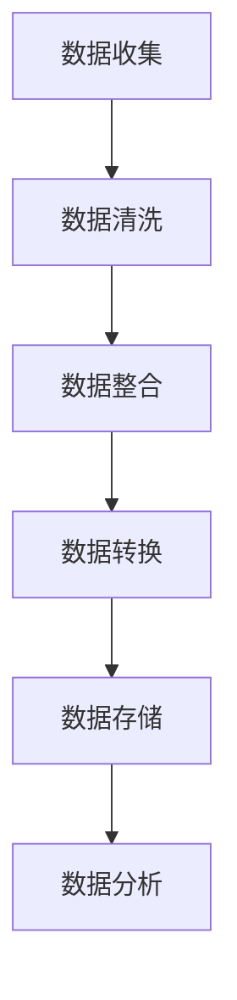
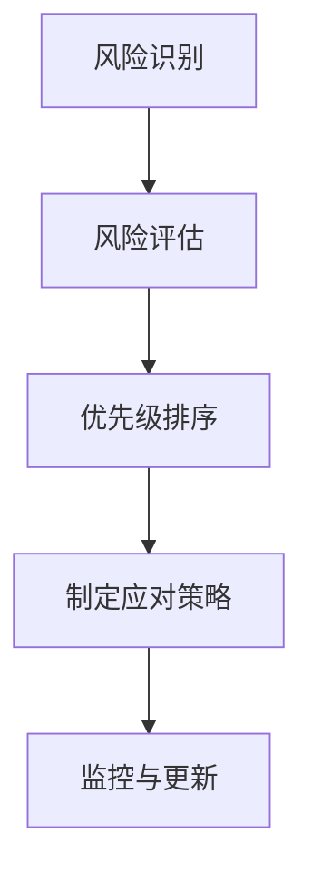
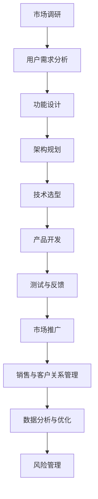

                 

## 引言：从0到1的旅程

在快速发展的科技时代，创新已经成为企业竞争的核心力量。从0到1，不仅是数字的演变，更是从无到有、从平凡到非凡的突破。这一过程充满了挑战和机遇，每一个步骤都至关重要。本文将深入探讨从0到1打造成功产品的关键步骤，旨在帮助读者理解并掌握这一创新旅程中的核心要素。

### 什么是“从0到1”

“从0到1”这一概念，源自硅谷创业教父彼得·蒂尔（Peter Thiel）的同名著作《从0到1：未来简史》。在这里，“从0到1”不仅指的是技术创新的起点，更强调的是颠覆性创新、独特价值的创造。与“从1到N”的规模扩张相对，从0到1更注重的是如何创建全新的市场、定义新的商业模式，从而实现持续增长和竞争优势。

### 本书的核心主题

本书的核心主题是系统性地解析从0到1打造成功产品的关键步骤，涵盖创新规划、产品创建、市场推广、客户关系管理、数据驱动决策和风险管理等多个方面。每一个步骤都是构建成功产品不可或缺的一环，彼此之间相互关联，形成一个完整的创新生态系统。

### 本书结构概述

本书分为八个主要章节：

1. **引言：从0到1的旅程**：介绍“从0到1”的概念和本书的核心主题。
2. **规划你的创新**：讨论如何发现独特的机会、制定创新策略和设定创新目标。
3. **创建你的产品**：详细阐述产品规格的确定、产品设计与开发，以及测试与反馈。
4. **市场推广与销售**：探讨品牌建设、市场营销策略和销售策略的制定与执行。
5. **客户关系管理**：介绍客户需求分析、客户服务与支持和客户关系深化。
6. **数据驱动决策**：讲解数据分析基础、数据驱动的产品优化和运营优化。
7. **风险管理**：分析风险识别与评估、风险应对策略和风险管理实践。
8. **成功案例分享**：通过苹果、亚马逊和谷歌等成功案例，总结他们的创新经验和策略。

### 下一章内容预告

在下一章中，我们将深入探讨如何规划创新，包括发现独特的机会、制定创新策略和设定创新目标。这一章节将为读者提供一系列实用的工具和方法，帮助他们在竞争激烈的市场中脱颖而出。

## 第1章 规划你的创新

在从0到1的创新旅程中，规划是至关重要的一步。一个周密详尽的规划能够为后续的产品创建、市场推广和风险管理奠定坚实基础。本章将详细探讨如何发现独特的机会、制定创新策略和设定创新目标，为成功打造产品奠定基础。

### 1.1 发现独特的机会

在当今竞争激烈的市场中，成功的关键在于发现并抓住独特的市场机会。以下是几个关键步骤：

#### 1.1.1 市场需求分析

首先，了解市场需求是发现机会的关键。通过市场调研、用户访谈和数据分析，识别用户的具体需求和痛点。这不仅有助于确定产品的基本功能，还能为后续的产品规划和设计提供指导。

##### 案例分析

例如，当智能手机市场已经饱和，iPhone的推出却成功地定义了一个全新的市场细分——高端智能手机。通过深入了解用户对手机性能、外观和操作系统的需求，苹果公司抓住了这一独特机会，从而取得了巨大的成功。

#### 1.1.2 竞争对手分析

了解竞争对手的策略和产品，能够帮助我们发现市场中的空白和潜在的机会。分析竞争对手的优劣势、市场定位和营销策略，有助于我们找到创新的切入点。

##### 案例分析

谷歌在搜索市场崛起之初，通过分析竞争对手的搜索算法和用户体验，发现了优化搜索结果的相关性和准确性的机会。最终，谷歌凭借其创新的PageRank算法，迅速占据了市场领导地位。

#### 1.1.3 建立创新的愿景

创新不仅需要发现机会，还需要有明确的愿景。一个清晰的愿景能够指导我们的创新方向，并激励团队不断追求卓越。

##### 案例分析

亚马逊的创始人杰夫·贝佐斯（Jeff Bezos）在创立亚马逊时，有一个清晰的愿景——创建一个地球上最以客户为中心的公司。这一愿景不仅驱动了亚马逊的商业策略，也促使亚马逊在电商、云计算、人工智能等多个领域不断创新。

### 1.2 制定创新策略

在发现独特机会后，制定创新策略是确保成功的关键步骤。以下是几个关键因素：

#### 1.2.1 创新类型的选择

创新可以分为突破性创新和持续性创新。突破性创新旨在颠覆现有市场，而持续性创新则注重在现有市场中持续优化和改进。

##### 案例分析

苹果公司的iPhone是典型的突破性创新，颠覆了传统手机市场。而苹果的MacBook Air则是持续性创新，通过不断改进设计和功能，保持了其在高端笔记本市场的领先地位。

#### 1.2.2 创新路径的选择

创新路径可以分为内部研发、合作伙伴关系和外部并购。选择合适的创新路径，有助于最大化创新效果。

##### 案例分析

谷歌通过内部研发和创新，打造了包括搜索引擎、云计算和人工智能等多个突破性产品。而亚马逊则通过并购和合作，迅速拓展了其在电商和物流领域的市场份额。

#### 1.2.3 创新目标的设定

设定明确的创新目标是确保创新成功的重要保障。创新目标应具体、可衡量，并能够激励团队不断追求卓越。

##### 案例分析

微软在2000年代初设定了“比尔·盖茨的千年挑战计划”，目标是开发出能够颠覆计算机操作系统的创新产品。虽然这一目标最终未能实现，但这一计划激发了微软在多个领域进行创新，推动了公司的发展。

### 1.3 建立创新愿景

一个成功的创新项目需要一个清晰的愿景，这一愿景应包括以下要素：

- **明确的目标**：创新项目应有一个具体、可衡量的目标，例如市场份额、用户增长率等。
- **强大的团队**：建立一支具备跨学科知识和技能的团队，确保能够应对创新过程中的各种挑战。
- **持续的学习与改进**：创新不是一次性的活动，而是一个持续的过程。保持开放的心态，不断学习和改进，是确保创新成功的关键。

### 1.4 小结

规划创新是成功打造产品的关键步骤。通过市场需求分析、竞争对手分析和建立创新愿景，我们可以发现独特的机会并制定有效的创新策略。在下一章中，我们将深入探讨如何创建产品，包括产品规格的确定、产品设计与开发，以及测试与反馈。

## 第2章 创建你的产品

在确定了创新规划后，下一步就是创建产品。创建一个成功的产品需要详细的规划和执行。本章将详细阐述如何确定产品规格、设计并开发产品，以及如何进行测试与反馈，以确保产品的质量和市场适应性。

### 2.1 确定产品规格

确定产品规格是创建产品的第一步，它涉及到产品功能的定义、性能要求、用户体验等多个方面。

#### 2.1.1 用户需求分析

了解用户需求是确定产品规格的基础。通过市场调研、用户访谈和反馈收集，可以获取用户对产品的期望和需求。

##### 案例分析

在开发智能手机时，了解用户对电池续航、摄像头性能、操作系统流畅度的需求，是确保产品规格符合用户期望的关键。

#### 2.1.2 功能设计与架构规划

在明确用户需求后，进行功能设计和架构规划。功能设计包括确定产品的核心功能、附加功能和特殊功能。架构规划则涉及到系统的整体架构设计，包括硬件、软件和网络的配置。

##### 案例分析

在开发一款电商网站时，核心功能可能包括商品展示、购物车、支付系统和用户评论功能。架构规划则需要考虑服务器、数据库和前端页面的配置，以确保系统的稳定性和扩展性。

#### 2.1.3 技术选型与资源调配

技术选型是确定产品规格的关键环节，包括选择合适的编程语言、框架、数据库和开发工具。同时，需要根据项目的需求和预算，合理调配资源。

##### 案例分析

在开发一款基于人工智能的推荐系统时，可能需要选择Python作为编程语言，TensorFlow作为框架，MongoDB作为数据库，以及Docker进行容器化部署。

### 2.2 产品设计与开发

确定了产品规格后，进入产品设计与开发阶段。这一阶段包括设计思维的应用、用户界面与用户体验设计，以及开发流程与敏捷方法。

#### 2.2.1 设计思维的应用

设计思维是一种以用户为中心的创新方法，强调通过迭代和用户反馈不断改进产品。

##### 案例分析

在开发一款教育应用时，设计团队可以通过原型设计、用户测试和反馈收集，不断优化应用的界面和功能，以提高用户体验。

#### 2.2.2 用户界面与用户体验设计

用户界面（UI）和用户体验（UX）设计是确保产品成功的关键。UI设计关注产品的视觉呈现，而UX设计则关注用户在使用产品时的体验。

##### 案例分析

在设计一款社交媒体应用时，UI设计可能包括简洁的界面和直观的导航，而UX设计则关注用户的操作流程、信息获取效率和互动体验。

#### 2.2.3 开发流程与敏捷方法

现代软件开发倾向于采用敏捷开发方法，这种方法强调快速迭代、灵活响应变化和持续交付价值。

##### 案例分析

在敏捷开发过程中，开发团队通常采用Scrum框架，通过每日站会、冲刺计划和回顾会议，确保项目按计划进行，并及时调整开发方向。

### 2.3 测试与反馈

测试与反馈是确保产品质量和市场适应性的重要环节。通过单元测试、集成测试和用户反馈，可以不断优化产品。

#### 2.3.1 单元测试与集成测试

单元测试是验证每个模块是否按预期工作，而集成测试则是验证模块之间的交互是否正常。

##### 案例分析

在开发一款银行应用时，单元测试可以验证转账功能是否正常工作，而集成测试则可以验证转账功能与用户界面、数据库等组件的交互是否正常。

#### 2.3.2 用户反馈收集与分析

用户反馈是优化产品的重要依据。通过用户反馈收集和分析，可以识别产品的优点和不足，为后续改进提供方向。

##### 案例分析

在发布一款健身应用后，通过用户反馈收集和分析，开发团队可以发现用户对特定功能的需求和建议，从而进行功能优化和更新。

#### 2.3.3 快速迭代与改进

快速迭代是敏捷开发的核心原则。通过不断迭代和改进，可以确保产品在市场中保持竞争力。

##### 案例分析

在开发一款在线教育平台时，开发团队可以通过每月一次的迭代，根据用户反馈和市场需求，不断优化课程内容、学习体验和用户界面。

### 2.4 小结

创建产品是成功打造产品的关键步骤，涉及确定产品规格、设计并开发产品，以及测试与反馈。通过用户需求分析、功能设计与架构规划，我们可以确保产品规格符合用户期望。设计思维的应用、用户界面与用户体验设计，以及敏捷开发方法，可以帮助我们高效地开发产品。测试与反馈则确保产品的质量和市场适应性。在下一章中，我们将探讨如何进行市场推广与销售。

## 第3章 市场推广与销售

在产品创建完成后，如何将产品推向市场并实现销售是关键的一步。有效的市场推广和销售策略能够帮助产品迅速获得市场认可，并实现商业成功。本章将详细讨论品牌建设、市场营销策略和销售策略的制定与执行。

### 3.1 品牌建设

品牌建设是市场推广的基础，它涉及到品牌的定位、形象设计和传播策略。

#### 3.1.1 品牌定位与形象设计

品牌定位是指确定产品在市场中的独特价值和目标消费者群体。形象设计则包括视觉标识、口号和品牌故事，它们共同塑造品牌的形象和个性。

##### 案例分析

苹果公司通过简洁而富有科技感的视觉标识，以及“Think Different”这一口号，成功塑造了其创新和高端的品牌形象。

#### 3.1.2 品牌传播与推广策略

品牌传播是指通过各种渠道和方式，将品牌信息传递给目标消费者。推广策略包括广告投放、公关活动、社交媒体营销和内容营销等。

##### 案例分析

小米公司通过社交媒体平台和内容营销，成功打造了其年轻、创新和性价比高的品牌形象，并在短时间内赢得了大量消费者的关注和喜爱。

#### 3.1.3 品牌忠诚度建设

品牌忠诚度是指消费者对品牌的长期信任和持续购买行为。通过优质的客户服务和个性化的用户体验，可以提升品牌忠诚度。

##### 案例分析

星巴克通过会员计划和个性化体验，成功建立了强大的品牌忠诚度，使其成为咖啡连锁品牌的领导者。

### 3.2 市场营销策略

市场营销策略是产品成功推向市场的重要手段，它包括市场细分、目标客户定位、营销渠道选择和营销预算与成本控制。

#### 3.2.1 市场细分与目标客户定位

市场细分是将整个市场划分为不同的消费者群体，以便更好地满足他们的需求。目标客户定位则是确定最具潜力和价值的客户群体，并将其作为营销重点。

##### 案例分析

可口可乐通过市场细分，将其产品定位为年轻、时尚和健康的生活方式，从而吸引了大量的年轻消费者。

#### 3.2.2 营销渠道选择与整合

营销渠道是指将产品传递给消费者的途径，包括线上和线下渠道。选择合适的营销渠道，并实现渠道之间的整合，可以提高营销效果。

##### 案例分析

耐克通过线上电商平台和线下专卖店相结合的渠道策略，实现了全球范围内的市场覆盖和销售增长。

#### 3.2.3 营销预算与成本控制

营销预算是用于市场推广活动的资金分配。合理分配营销预算，并控制成本，是确保营销活动效果和可持续性的关键。

##### 案例分析

亚马逊通过精准的数字营销和高效的广告投放，实现了对营销预算的有效控制，从而实现了持续的市场扩张。

### 3.3 销售策略与执行

销售策略是指如何通过销售团队和渠道，将产品推向市场并实现销售目标。有效的销售策略包括销售目标的设定、销售团队的建设与管理，以及销售技巧和谈判策略。

#### 3.3.1 销售目标与计划

销售目标是企业在一定时间内期望实现的销售业绩。销售计划则是为实现这些目标所制定的具体行动方案。

##### 案例分析

华为通过设定明确的销售目标，并制定详细的销售计划，成功在全球范围内扩大了市场份额。

#### 3.3.2 销售团队建设与管理

销售团队是执行销售策略的重要力量。建设和管理一支高效的销售团队，包括招聘、培训、激励和绩效评估等环节。

##### 案例分析

微软通过建立完善的销售培训和激励机制，成功培养了大量的高素质销售人才，推动了公司的销售业绩。

#### 3.3.3 销售技巧与谈判策略

销售技巧和谈判策略是销售人员成功达成销售目标的关键。了解客户需求、建立信任关系、解决客户疑虑和有效谈判是关键技巧。

##### 案例分析

IBM的销售团队通过深入了解客户需求，提供定制化的解决方案，成功实现了与客户的长期合作。

### 3.4 小结

市场推广与销售是成功打造产品的关键环节。通过品牌建设、市场营销策略和销售策略的制定与执行，可以将产品推向市场并实现销售目标。品牌建设奠定了市场推广的基础，市场营销策略确定了推广方向和目标，而销售策略则是实现销售目标的具体行动方案。在下一章中，我们将探讨如何进行客户关系管理，以提升客户满意度和忠诚度。

## 第4章 客户关系管理

在成功将产品推向市场并实现销售后，如何维护和深化与客户的关系是确保长期业务成功的关键。有效的客户关系管理（CRM）能够帮助企业提升客户满意度，增强客户忠诚度，并最终实现商业价值最大化。本章将详细探讨如何进行客户需求分析、提供优质的客户服务与支持，以及深化客户关系。

### 4.1 客户需求分析

了解客户需求是客户关系管理的第一步。通过深入分析客户需求，企业可以更好地定制产品和服务，满足客户期望。

#### 4.1.1 客户满意度调查

客户满意度调查是了解客户需求的重要工具。通过定期进行满意度调查，企业可以获取客户对产品和服务的反馈，识别潜在问题和改进方向。

##### 案例分析

苹果公司通过定期进行客户满意度调查，收集用户对产品的反馈，从而不断优化产品设计和功能。

#### 4.1.2 客户行为分析

客户行为分析是指通过数据分析客户的行为模式，了解他们的购买习惯、偏好和需求。通过分析客户行为，企业可以制定更精准的营销策略。

##### 案例分析

亚马逊通过分析客户的购买行为和浏览记录，推荐个性化的产品，提高了客户满意度和转化率。

#### 4.1.3 客户细分与价值评估

客户细分是将客户划分为不同的群体，根据他们的需求和购买行为，制定差异化的服务和营销策略。同时，对客户进行价值评估可以帮助企业识别高价值客户，提供针对性的服务。

##### 案例分析

IBM通过将客户细分为企业客户、政府客户和个人用户，提供了差异化的产品和服务，满足了不同客户的需求。

### 4.2 客户服务与支持

优质的客户服务与支持是提升客户满意度和忠诚度的关键。通过建立高效的客户服务系统，企业可以快速响应客户的需求和问题。

#### 4.2.1 客户服务策略

客户服务策略是企业为满足客户需求和提供支持所制定的一系列政策和流程。一个良好的客户服务策略应包括快速响应、高效解决问题和个性化服务。

##### 案例分析

谷歌通过24/7全天候客户支持，确保用户在任何时间都能获得帮助，提升了客户的满意度和忠诚度。

#### 4.2.2 客户支持系统搭建

客户支持系统是提供客户服务的关键工具。企业需要搭建一个高效的客户支持系统，包括电话、邮件、在线聊天和自助服务等多种渠道。

##### 案例分析

微软通过构建多渠道的客户支持系统，包括官方网站、在线聊天和社交媒体平台，为用户提供便捷的服务和支持。

#### 4.2.3 客户体验优化

优化客户体验是提升客户满意度的关键。通过改进客户服务流程、提高服务质量和提供个性化服务，企业可以增强客户体验。

##### 案例分析

星巴克通过提供个性化的咖啡体验、舒适的门店环境和快速的服务流程，提升了客户的满意度和忠诚度。

### 4.3 客户关系深化

深化客户关系是客户关系管理的最终目标。通过建立长期的客户关系，企业可以实现重复购买和口碑传播。

#### 4.3.1 客户关系管理工具

客户关系管理工具是管理客户关系的重要工具。这些工具可以帮助企业收集客户数据、分析客户行为和提供个性化服务。

##### 案例分析

Salesforce的CRM系统帮助 enterprises effectively manage their customer relationships by providing tools for data analysis, customer segmentation, and personalized communication.

#### 4.3.2 客户参与与共创

客户参与和共创是深化客户关系的重要策略。通过邀请客户参与产品开发和反馈，企业可以建立更紧密的客户关系，并提高客户满意度。

##### 案例分析

小米通过“米家”平台，邀请用户参与产品设计和功能优化，成功建立了强大的用户社区和客户忠诚度。

#### 4.3.3 客户忠诚计划与激励机制

客户忠诚计划是激励客户重复购买和提升品牌忠诚度的重要手段。通过提供折扣、积分奖励和专属服务，企业可以增强客户的忠诚度。

##### 案例分析

亚马逊的Prime会员计划通过提供免费配送、独家内容和优惠价格，成功吸引了大量用户成为长期客户。

### 4.4 小结

客户关系管理是成功打造产品的重要环节。通过客户需求分析、提供优质的客户服务与支持，以及深化客户关系，企业可以提升客户满意度和忠诚度，实现长期业务成功。在下一章中，我们将探讨如何通过数据驱动决策来优化产品开发和运营。

## 第5章 数据驱动决策

在数字化时代，数据已经成为企业决策的核心驱动力。数据驱动决策（Data-Driven Decision Making）是指企业通过收集、分析和利用数据，对业务问题进行科学的分析和决策。本章将深入探讨数据分析的基础、数据驱动的产品优化和运营优化，以展示数据驱动决策在产品成功中的关键作用。

### 5.1 数据分析基础

数据分析是数据驱动决策的基石，它包括数据收集、预处理、分析方法、数据可视化和数据报告等多个环节。

#### 5.1.1 数据收集与预处理

数据收集是数据分析的第一步，它涉及到从各种渠道获取数据，如用户行为数据、交易数据和社交媒体数据。预处理则是对收集到的数据进行清洗、整合和转换，以确保数据的质量和一致性。

##### Mermaid流程图



##### 伪代码示例

```python
# 数据收集
data = collect_data(source)

# 数据清洗
cleaned_data = clean_data(data)

# 数据整合
integrated_data = integrate_data(cleaned_data)

# 数据转换
transformed_data = transform_data(integrated_data)

# 数据存储
store_data(transformed_data)
```

#### 5.1.2 数据分析方法

数据分析方法包括描述性分析、诊断性分析、预测性分析和规范性分析。描述性分析用于了解数据的基本特征，诊断性分析用于找出数据中的异常和趋势，预测性分析用于预测未来的趋势和结果，而规范性分析则用于提供最佳的决策方案。

##### 伪代码示例

```python
# 描述性分析
describe_data(transformed_data)

# 诊断性分析
diagnose_issues(transformed_data)

# 预测性分析
predictions = predict_future(transformed_data)

# 规范性分析
best_action = optimal_decision(predictions)
```

#### 5.1.3 数据可视化工具

数据可视化是数据分析的重要组成部分，它能够以图形化的方式展示数据，帮助用户更好地理解和分析数据。

##### 伪代码示例

```python
# 数据可视化
visualize_data(predictions, chart_type='line')
```

### 5.2 数据驱动的产品优化

数据驱动的产品优化是指通过数据分析和反馈，不断改进产品功能和用户体验，以满足客户需求和提升产品竞争力。

#### 5.2.1 用户行为分析

用户行为分析是数据驱动的产品优化的重要环节，它通过分析用户的使用数据，了解用户的行为模式、偏好和需求。

##### 伪代码示例

```python
# 用户行为分析
user_behavior = analyze_user_usage(data)
```

#### 5.2.2 功能迭代与优化

根据用户行为分析的结果，产品团队可以优先改进用户使用频率高、满意度低的功能，进行功能迭代和优化。

##### 伪代码示例

```python
# 功能迭代与优化
improve_functionality(user_behavior, features_to_optimize)
```

#### 5.2.3 数据驱动的营销策略

数据驱动的营销策略是通过数据分析，制定更精准、更有效的营销策略，提高营销效果和投资回报率。

##### 伪代码示例

```python
# 数据驱动的营销策略
marketing_strategy = create_marketing_plan(data, targets)
```

### 5.3 数据驱动的运营优化

数据驱动的运营优化是指通过数据分析和反馈，不断改进运营流程，提高运营效率和盈利能力。

#### 5.3.1 流量分析

流量分析是了解网站或应用的访问量和用户行为的重要工具，它可以帮助企业优化页面加载速度、提高用户留存率和转化率。

##### 伪代码示例

```python
# 流量分析
analyze_traffic(data)
```

#### 5.3.2 转化率优化

转化率优化是通过改进用户体验、优化营销策略和提升服务质量，提高用户从访问到购买或注册的转化率。

##### 伪代码示例

```python
# 转化率优化
optimize_conversion_rate(user_behavior, marketing_strategy)
```

#### 5.3.3 用户留存与流失分析

用户留存与流失分析是了解用户行为和满意度的重要手段，它可以帮助企业识别导致用户流失的原因，并采取相应的措施提高用户留存率。

##### 伪代码示例

```python
# 用户留存与流失分析
analyze_user_retention(data)
```

### 5.4 小结

数据驱动决策是现代企业成功的关键，它通过系统化的数据分析，帮助企业优化产品功能和运营流程，提升客户满意度和竞争力。在下一章中，我们将探讨如何进行风险管理，以确保企业在从0到1的创新过程中顺利前进。

## 第6章 风险管理

在从0到1的创新过程中，风险管理至关重要。有效管理风险能够帮助企业识别潜在威胁，制定应对策略，从而降低不确定性，确保项目的顺利进行。本章将详细探讨风险识别与评估、风险应对策略和风险管理实践。

### 6.1 风险识别与评估

风险识别是风险管理的第一步，旨在识别可能影响项目目标的各种风险。评估则是确定这些风险的可能性和影响程度。

#### 6.1.1 风险管理框架

风险管理框架是一个系统化的过程，包括风险识别、评估、优先级排序、制定应对策略和监控与更新。

##### Mermaid流程图



#### 6.1.2 常见风险类型

常见风险类型包括市场风险、技术风险、财务风险、法律风险和运营风险。识别这些风险有助于制定有针对性的应对策略。

##### 伪代码示例

```python
# 风险识别
risks = identify_risks(project)

# 风险评估
evaluate_risks(risks, impact, probability)
```

### 6.2 风险应对策略

一旦识别和评估了风险，下一步就是制定应对策略。这些策略包括风险规避、减轻、转移和接受。

#### 6.2.1 风险规避与减轻

风险规避是通过避免风险源来消除风险。减轻则是通过降低风险的概率或影响来减轻风险。

##### 伪代码示例

```python
# 风险规避
avoid_risk(risks)

# 风险减轻
reduce_risk(risks, mitigation_measures)
```

#### 6.2.2 风险转移与接受

风险转移是通过合同、保险或其他方式将风险转移到第三方。接受则是承认风险的存在，并准备好应对风险可能带来的影响。

##### 伪代码示例

```python
# 风险转移
transfer_risk(risks, third_party)

# 风险接受
accept_risk(risks, contingency_plan)
```

### 6.3 风险监控与预警

风险管理是一个持续的过程，需要不断监控风险，并提前预警可能的危机。

#### 6.3.1 风险监控

风险监控是跟踪已识别风险的状态和变化，确保应对策略的有效性。

##### 伪代码示例

```python
# 风险监控
monitor_risks(risks)

# 风险更新
update_risks(risks, current_status)
```

#### 6.3.2 风险预警

风险预警是通过建立预警机制，提前发现潜在的风险，并采取措施减轻或规避。

##### 伪代码示例

```python
# 风险预警
warn_of_risks(risks, threshold)
```

### 6.4 风险管理实践

风险管理实践包括建立风险管理团队、制定风险管理计划和进行风险管理培训。

#### 6.4.1 风险管理团队建设

风险管理团队是负责识别、评估、应对和监控风险的团队。他们需要具备跨学科的知识和技能。

##### 伪代码示例

```python
# 风险管理团队建设
build_risk_management_team(team_members, skills)
```

#### 6.4.2 风险管理计划

风险管理计划是详细描述风险管理过程的文档，包括风险识别、评估、应对策略和监控步骤。

##### 伪代码示例

```python
# 风险管理计划
create_risk_management_plan(plan, steps, measures)
```

#### 6.4.3 风险管理培训

风险管理培训是确保团队成员了解风险管理流程和策略的重要环节。

##### 伪代码示例

```python
# 风险管理培训
conduct_risk_management_training(team_members, training_materials)
```

### 6.5 风险管理案例分析

通过案例分析，我们可以了解实际操作中的风险管理策略和实践。

#### 6.5.1 案例分析

以苹果公司开发iPhone为例，苹果在产品开发过程中识别了技术风险、市场风险和供应链风险。通过规避某些技术风险，减轻市场风险，并采用供应链保险来转移部分风险，苹果成功推出了iPhone，并在市场上取得了巨大成功。

### 6.6 小结

风险管理是确保从0到1创新过程顺利进行的关键。通过识别与评估风险、制定应对策略和持续监控与更新，企业可以降低风险，确保项目成功。在下一章中，我们将通过成功案例分享，进一步探讨如何通过实际操作实现从0到1的创新。

### 第7章 成功案例分享

在从0到1的创新旅程中，许多公司通过独特的策略和卓越的执行，成功打造了市场领先的产品。本章将探讨苹果公司、亚马逊和谷歌等知名企业的创新案例，分析他们的成功经验，以期为读者提供实际操作的启示。

#### 7.1 苹果公司的产品创新

苹果公司（Apple Inc.）是一家以创新和设计为核心的企业，其成功产品如iPhone、iPad和MacBook不仅改变了市场格局，还树立了行业标准。

##### 7.1.1 苹果的创新策略

苹果公司始终坚持“用户至上”的理念，通过深入了解用户需求，不断创新和优化产品。以下是苹果公司的一些关键创新策略：

- **持续研发投入**：苹果每年在研发上的投入超过百亿美元，确保技术领先。
- **用户体验优先**：苹果注重产品的用户体验设计，从硬件到软件，力求完美。
- **生态系统建设**：通过iCloud、App Store等平台，构建完整的生态系统，提高用户粘性。

##### 7.1.2 苹果的成功产品

- **iPhone**：iPhone颠覆了传统手机市场，通过创新的触摸屏技术和iOS操作系统，成为智能手机的代名词。
- **iPad**：iPad开创了平板电脑市场，以其便携性和强大的应用生态，改变了人们的计算和娱乐方式。
- **MacBook**：MacBook系列以其轻薄设计和高效性能，吸引了大量专业人士和学生用户。

##### 7.1.3 苹果的创新经验

苹果的成功经验在于其对用户体验的极致追求、持续的技术创新和强大的品牌建设。通过这些策略，苹果不仅实现了从0到1的创新突破，还在市场中建立了长期竞争优势。

#### 7.2 亚马逊的电商模式

亚马逊（Amazon.com, Inc.）是一家全球知名的电商平台，其成功不仅在于庞大的商品种类和便捷的购物体验，更在于其创新性的商业模式和运营策略。

##### 7.2.1 亚马逊的电商模式

亚马逊的电商模式主要分为以下几个方面：

- **广泛的产品品类**：亚马逊提供几乎涵盖所有领域的商品，满足消费者的多样化需求。
- **高效的物流系统**：亚马逊拥有先进的物流系统，通过Fulfillment by Amazon（FBA）服务，确保快速、准确的配送。
- **个性化推荐**：亚马逊通过大数据分析和机器学习技术，为用户提供个性化的商品推荐，提高购买转化率。

##### 7.2.2 亚马逊的成功要素

亚马逊的成功要素包括：

- **强大的技术支持**：亚马逊投入大量资源在技术领域，从云计算（AWS）到人工智能（AI），确保其在技术创新上的领先地位。
- **客户至上**：亚马逊始终将客户体验放在首位，通过快速配送、无忧退货等政策，赢得了消费者的信任和忠诚。
- **不断创新**：亚马逊不断推出新服务和产品，如亚马逊Prime、亚马逊Fresh等，以适应市场和用户需求的变化。

##### 7.2.3 亚马逊的电商经验

亚马逊的电商经验为其他企业提供了宝贵的借鉴。通过技术创新、客户服务和持续创新，亚马逊在电商领域建立了强大的竞争优势，实现了从0到1的巨大成功。

#### 7.3 谷歌的搜索技术

谷歌（Google LLC）是一家全球领先的科技公司，其核心产品——谷歌搜索引擎，不仅改变了信息检索的方式，也推动了互联网的发展。

##### 7.3.1 谷歌的搜索技术发展史

谷歌的搜索技术经历了多次重大变革：

- **PageRank算法**：谷歌通过PageRank算法，根据网页的链接关系评估网页的重要性，提供了更准确的搜索结果。
- **个性化搜索**：谷歌引入了个性化搜索功能，根据用户的历史搜索和行为，提供定制化的搜索结果。
- **语义搜索**：通过自然语言处理技术，谷歌实现了更加语义化的搜索，使搜索结果更符合用户需求。

##### 7.3.2 谷歌的搜索算法

谷歌的搜索算法是一个复杂的系统，主要包括以下几个关键部分：

- **关键词分析**：通过分析用户输入的关键词，确定搜索意图。
- **页面分析**：对网页的内容、结构、链接关系进行分析，评估网页的相关性和质量。
- **排序算法**：根据多种因素（如页面质量、相关性、用户体验等）对搜索结果进行排序。

##### 7.3.3 谷歌的搜索经验

谷歌的搜索经验表明，技术创新和用户体验是搜索服务成功的关键。通过持续的技术创新和优化，谷歌不仅保持了搜索市场的领导地位，还推动了整个互联网生态的发展。

### 7.4 小结

苹果、亚马逊和谷歌等企业的成功案例，为我们展示了从0到1创新的关键要素和实际操作方法。通过持续的技术创新、关注用户体验、强大的品牌建设和灵活的市场策略，企业可以实现从0到1的突破，并在市场中建立长期竞争优势。在下一章中，我们将总结从0到1的成功要素，并探讨未来的创新趋势。

### 9.1 从0到1的成功要素总结

在从0到1的创新旅程中，成功的产品往往离不开以下几个关键要素：

1. **发现独特的机会**：通过市场调研和竞争对手分析，识别未被满足的需求和市场空白，建立创新的愿景。
2. **制定创新策略**：选择适合的创新类型和路径，设定明确的目标，为创新提供方向和动力。
3. **产品创建**：通过用户需求分析、功能设计、架构规划和敏捷开发，确保产品的质量和市场适应性。
4. **市场推广与销售**：通过品牌建设、市场营销策略和销售策略，将产品推向市场，实现商业成功。
5. **客户关系管理**：通过客户需求分析、客户服务与支持和客户关系深化，提升客户满意度和忠诚度。
6. **数据驱动决策**：通过数据分析、用户行为分析和运营优化，不断改进产品和运营流程。
7. **风险管理**：通过风险识别与评估、风险应对策略和风险管理实践，降低不确定性，确保项目顺利进行。

这些要素相互关联，形成了一个完整的创新生态系统，为企业的持续增长和竞争优势奠定了坚实基础。

### 9.2 未来产品的创新趋势

未来产品的创新趋势将受到以下几个因素的影响：

1. **人工智能和机器学习**：随着AI技术的不断进步，产品将更加智能化，具备自适应能力和自我学习能力。
2. **物联网（IoT）**：物联网将实现设备之间的互联互通，创造全新的应用场景和商业模式。
3. **可持续发展**：环境保护和可持续发展将成为产品设计和运营的重要考虑因素，绿色技术和可持续材料将被广泛应用。
4. **虚拟现实和增强现实**：VR和AR技术将颠覆传统用户体验，带来更加沉浸式的互动体验。
5. **区块链**：区块链技术将提高数据的安全性和透明度，为供应链管理、金融交易等领域带来革命性变化。

未来，企业需要紧跟这些创新趋势，持续投入研发，以保持市场竞争力。

### 9.3 创新者的实践建议

对于创新者来说，以下建议将有助于他们在从0到1的创新旅程中取得成功：

1. **持续学习**：保持对新技术、新趋势的关注，不断更新知识和技能。
2. **跨学科合作**：跨学科团队合作能够带来多样化的视角和创新的解决方案。
3. **用户参与**：与用户紧密互动，了解他们的需求和反馈，不断优化产品。
4. **快速迭代**：采用敏捷开发方法，快速迭代和改进产品，以适应市场和用户需求的变化。
5. **风险管理**：重视风险管理，提前识别和应对潜在风险，确保项目的顺利进行。

通过这些实践建议，创新者可以更好地把握市场机遇，实现持续创新和商业成功。

### 总结

从0到1的创新旅程充满挑战和机遇。通过系统性的规划、敏捷的开发、精准的市场推广、紧密的客户关系管理、数据驱动的决策和有效的风险管理，企业可以打造出成功的产品，实现长期竞争优势。未来，随着新技术的不断涌现，创新者需要不断学习和适应，以保持领先地位。希望本书能为读者提供有价值的指导和启示，助力他们在从0到1的创新旅程中取得成功。

### 附录

#### 附录 A 创新产品开发工具与资源列表

以下是一些创新产品开发过程中常用的工具和资源：

- **市场调研工具**：Google Analytics、SurveyMonkey、Qualtrics
- **数据分析工具**：Tableau、Power BI、Google Data Studio
- **原型设计工具**：Sketch、Figma、Adobe XD
- **开发环境**：Visual Studio、Eclipse、Xcode
- **版本控制工具**：Git、GitHub、Bitbucket
- **项目管理工具**：JIRA、Trello、Asana
- **敏捷开发框架**：Scrum、Kanban、Sprint Planning

#### 附录 B 创新产品开发流程图与伪代码示例

以下是一个创新产品开发流程图的示例：



伪代码示例：

```python
# 市场调研
market_research_data = conduct_market_research()

# 用户需求分析
user_requirements = analyze_user需求和反馈

# 功能设计
features = design_functionality(user_requirements)

# 架构规划
architecture = plan_architecture(features)

# 技术选型
selected_technologies = select_technologies(architecture)

# 产品开发
product = develop_product(selected_technologies)

# 测试与反馈
test_results = test_product(product)

# 市场推广
marketing_strategy = create_marketing_strategy(test_results)

# 销售与客户关系管理
sales_plan = create_sales_plan(marketing_strategy)

# 数据分析与优化
data_insights = analyze_data(sales_plan)

# 风险管理
risk_management_plan = create_risk_management_plan(data_insights)
```

#### 附录 C 创新产品开发常见问题与解决方案列表

以下是一些创新产品开发过程中常见的问题及其解决方案：

- **问题1：市场调研不充分**
  - 解决方案：加大市场调研的力度，包括深度访谈、问卷调查和数据分析。
  
- **问题2：需求分析不准确**
  - 解决方案：与用户进行更深入的沟通，使用原型设计和用户测试来验证需求。

- **问题3：技术选型不当**
  - 解决方案：进行全面的评估，包括技术可行性、成本和市场需求。

- **问题4：开发进度延误**
  - 解决方案：采用敏捷开发方法，定期进行项目评审和调整。

- **问题5：产品质量问题**
  - 解决方案：加强测试与质量保证，引入持续集成和持续部署（CI/CD）流程。

- **问题6：市场推广效果不佳**
  - 解决方案：重新审视市场定位和营销策略，进行A/B测试以优化效果。

#### 附录 D 参考文献与推荐阅读列表

以下是一些与产品创新和商业策略相关的参考文献和推荐阅读：

- Thiel, P. (2014). 《从0到1：未来简史》（Zero to One: Notes on Startups, or How to Build the Future）。
- Collins, J. (2001). 《从优秀到卓越》（Good to Great）。
- Christensen, C. M. (1997). 《创新者的窘境》（The Innovator's Dilemma）。
- Lean Startup Co. (2011). 《精益创业》（The Lean Startup）。
- Godin, S. (2008). 《 Purple Cow：如何营销差异化的产品》（Purple Cow: Transform Your Business by Being Remarkable）。
- O'Reilly, T. (2005). 《智慧型公司的崛起》（The Age of Agile）。
- Porter, M. E. (1998). 《竞争战略：行业和竞争对手分析技术》（Competitive Strategy: Techniques for Analyzing Industries and Competitors）。

这些文献和书籍为产品创新和商业策略提供了深刻的洞察和实用的指导，对于希望从0到1打造成功产品的读者来说，是非常有价值的参考资料。通过学习和实践这些理念和方法，读者可以更好地把握市场机遇，实现商业成功。

