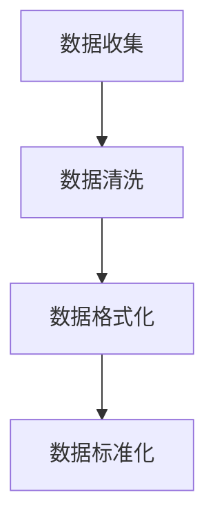
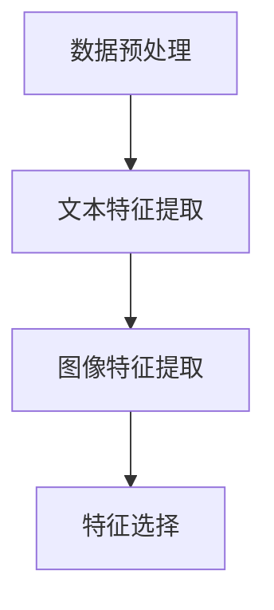
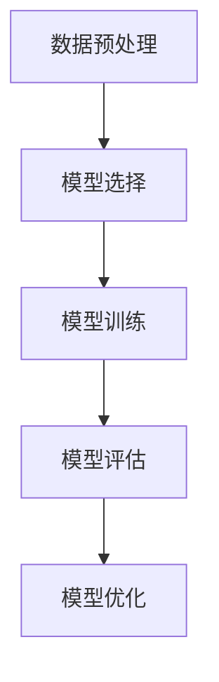
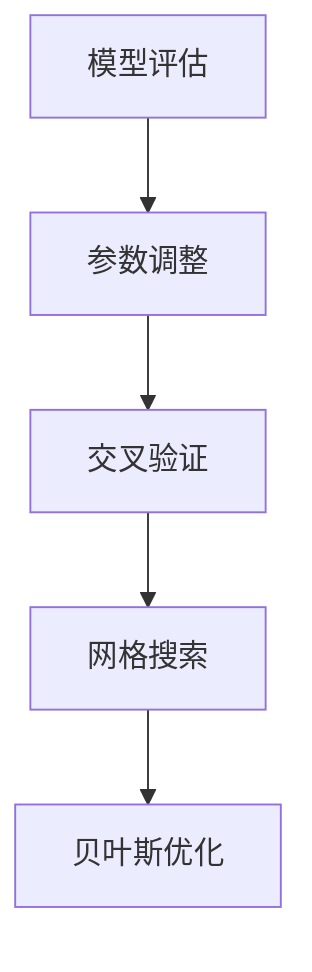
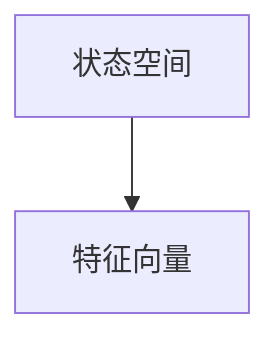
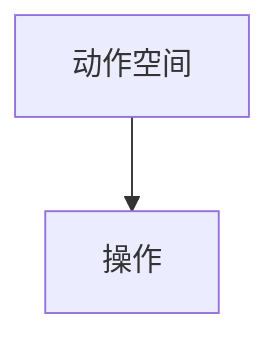
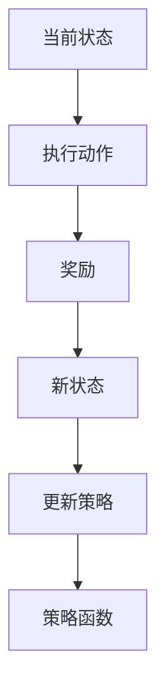
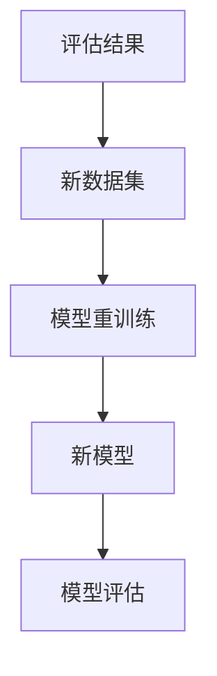

                 

# 从RAG到Agent的转变：反思：能够自我评估并改进执行过程

## 关键词
认知代理（Agent），自评估与改进机制（RAG），强化学习，自然语言处理，案例分析

## 摘要
本文深入探讨了认知代理（Agent）的概念、自评估与改进机制（RAG），以及它们在现实世界中的应用。通过逻辑清晰、结构紧凑的分析，本文揭示了认知代理如何通过自我评估和改进执行过程，从简单的规则系统（RAG）转变为具备自主学习能力的智能体。文章不仅介绍了认知代理的理论基础和核心技术，还通过具体的案例分析展示了其在自然语言处理、自动驾驶和医疗诊断等领域的应用。最后，本文对未来认知代理技术的发展趋势进行了展望，并提出了研究展望和对读者的建议。

## 目录大纲

### 第一部分：引论

#### 第1章：背景与概述

- **1.1 认知代理（Agent）的定义与分类**
- **1.2 自评估与改进机制（RAG）**
- **1.3 代理在现实世界中的应用案例**
- **1.4 书籍结构与目标**

#### 第2章：认知代理的理论基础

- **2.1 认知代理的架构**
- **2.2 自评估与改进机制（RAG）原理**
- **2.3 代理行为的数学建模**
- **2.4 代理的决策算法**

### 第二部分：核心技术与方法

#### 第3章：构建认知代理

- **3.1 数据收集与预处理**
- **3.2 特征提取与选择**
- **3.3 训练与评估**
- **3.4 模型优化与调参**

#### 第4章：自评估与改进机制（RAG）

- **4.1 RAG机制的核心概念**
- **4.2 自评估的数学模型**
- **4.3 改进的策略与方法**
- **4.4 RAG在代理学习中的应用**

#### 第5章：认知代理的强化学习

- **5.1 强化学习的基本概念**
- **5.2 Q-学习算法**
- **5.3 SARSA算法**
- **5.4 代理的强化学习应用实例**

#### 第6章：认知代理在自然语言处理中的应用

- **6.1 语言模型的基础知识**
- **6.2 生成式模型与判别式模型**
- **6.3 语言模型训练与优化**
- **6.4 语言处理中的代理应用**

#### 第7章：认知代理的案例分析

- **7.1 案例一：智能客服代理**
- **7.2 案例二：自动驾驶代理**
- **7.3 案例三：医疗诊断代理**
- **7.4 案例分析总结与反思**

### 第三部分：未来发展

#### 第8章：认知代理的发展趋势

- **8.1 代理技术的未来方向**
- **8.2 自评估与改进机制的挑战**
- **8.3 代理在人工智能中的角色演变**
- **8.4 代理技术的社会影响与伦理问题**

#### 第9章：结论与展望

- **9.1 书籍总结**
- **9.2 研究展望**
- **9.3 对读者的建议**
- **9.4 附录**

### 附录

- **附录A：代理开发工具与资源**
  - **A.1 工具与框架对比**
  - **A.2 开发环境搭建指南**
  - **A.3 实践项目源代码**

- **附录B：数学模型与算法伪代码**
  - **B.1 自评估与改进机制（RAG）伪代码**
  - **B.2 强化学习算法伪代码**
  - **B.3 语言模型训练与优化伪代码**

### 引言

在当今的科技领域中，人工智能（AI）无疑是引领潮流的关键技术。从最初的规则系统（Rule-based System，RBS）到现在的深度学习（Deep Learning，DL），AI经历了无数次的技术迭代和革新。然而，这些传统的系统往往缺乏自我学习和适应环境的能力。为了克服这一限制，认知代理（Cognitive Agent）的概念应运而生。

认知代理是一种具有感知、思考、决策和行动能力的智能体，能够在动态环境中自我学习和适应。与传统的规则系统相比，认知代理能够通过不断的学习和改进，提高自身的执行效率和准确度。这种自我评估和改进的能力，使得认知代理在复杂环境中表现出色。

本文将深入探讨认知代理的概念、原理及其在现实世界中的应用。我们将从自评估与改进机制（RAG）入手，详细解析认知代理的架构和决策算法。接着，本文将介绍认知代理的构建过程，包括数据收集、特征提取、训练与评估等核心步骤。此外，本文还将探讨认知代理在自然语言处理、自动驾驶和医疗诊断等领域的具体应用。最后，本文将总结认知代理的发展趋势，并展望其未来方向。

通过本文的阅读，读者将了解到认知代理的强大潜力，以及如何利用这一技术来解决现实世界中的复杂问题。本文不仅适合对AI技术感兴趣的读者，也适用于从事AI研究和开发的工程师和技术人员。让我们开始这段探索之旅，一起揭开认知代理的神秘面纱。

### 第一部分：引论

#### 第1章：背景与概述

在人工智能（AI）的漫长发展历程中，认知代理（Cognitive Agent）的概念逐渐崭露头角，成为当前研究的热点之一。认知代理是一种智能体，具备感知、思考、决策和行动的能力，能够在动态环境中进行自我学习和适应。与传统的规则系统（Rule-based System，RBS）和基于模型的系统（Model-based System）相比，认知代理能够通过不断的学习和改进，实现更高效、更准确的任务执行。

1. **认知代理的定义与分类**

认知代理，从广义上讲，是指能够模拟人类思维过程，进行感知、理解和响应的计算机程序或系统。具体来说，认知代理通常由以下几个部分组成：

- **感知模块**：负责从外部环境中获取信息，如文本、图像、声音等。
- **认知模块**：对感知模块获取的信息进行处理，包括语义理解、知识表示和推理等。
- **决策模块**：基于认知模块的输出，制定行动策略。
- **执行模块**：根据决策模块的指令执行具体操作。

根据不同的应用场景和需求，认知代理可以分类为以下几类：

- **基于规则的认知代理**：这类代理主要通过定义一组规则来指导其行为，规则通常是基于专家经验和领域知识的。尽管这种代理在规则清晰、问题结构明确的情况下表现良好，但在复杂动态环境中，其表现往往受到规则数量和复杂性的限制。
- **基于模型的认知代理**：这类代理通过构建数学模型来模拟现实世界，并利用模型进行推理和决策。常见的模型包括线性模型、神经网络、决策树等。基于模型的认知代理在处理复杂、非线性问题时更具优势，但其构建和优化过程相对复杂。
- **混合认知代理**：这类代理结合了基于规则和基于模型的优点，通过将规则和模型相结合，实现更灵活、更高效的决策。

1. **自评估与改进机制（RAG）**

自评估与改进机制（RAG）是认知代理的核心组成部分，它使得代理能够自我评估任务执行效果，并根据评估结果进行改进。RAG机制通常包括以下三个部分：

- **评估（Assessment）**：代理通过某种评估方法（如统计指标、用户反馈等）来评估当前任务执行的效果。
- **反馈（Feedback）**：评估结果被反馈给代理，用于指导其改进。
- **改进（Adjustment）**：代理根据反馈结果调整自身的参数、策略或模型，以提高任务执行效果。

RAG机制的核心在于其闭环反馈系统，通过不断的评估和改进，代理能够在执行过程中不断学习和优化。这种自评估和改进的能力，使得认知代理在复杂动态环境中表现出色，能够更好地适应变化。

1. **代理在现实世界中的应用案例**

认知代理在现实世界中有广泛的应用，以下是一些典型的应用案例：

- **自然语言处理（NLP）**：认知代理在自然语言处理领域表现出色，如语音识别、机器翻译、文本生成等。例如，谷歌的翻译服务和OpenAI的GPT模型，都是基于认知代理技术的成功案例。
- **自动驾驶**：认知代理在自动驾驶系统中起着关键作用，如感知环境、规划路径、做出决策等。特斯拉的自动驾驶系统和 Waymo 的自动驾驶技术，都是认知代理在自动驾驶领域的应用典范。
- **医疗诊断**：认知代理在医疗诊断中的应用潜力巨大，如疾病预测、药物推荐、手术规划等。IBM 的 Watson for Oncology 和谷歌的 AI 医疗诊断工具，都是基于认知代理技术的成功案例。
- **智能客服**：认知代理在智能客服中的应用也越来越广泛，如自动回复、情感分析、个性化推荐等。Siri、Alexa 和 Google Assistant 等智能助手，都是认知代理在智能客服领域的成功案例。

通过以上介绍，我们可以看到认知代理在现实世界中的广泛应用和巨大潜力。接下来，本文将深入探讨认知代理的理论基础和核心技术，进一步揭示其背后的原理和机制。

### 第二部分：认知代理的理论基础

#### 第2章：认知代理的理论基础

认知代理作为一种具备感知、思考、决策和行动能力的智能体，其理论基础涵盖了多个领域，包括认知科学、人工智能和机器学习。在这一章节中，我们将详细探讨认知代理的架构、自评估与改进机制（RAG）原理、代理行为的数学建模以及代理的决策算法。

#### 2.1 认知代理的架构

认知代理的架构可以分为四个主要模块：感知模块、认知模块、决策模块和执行模块。以下是各模块的详细介绍：

1. **感知模块**：感知模块是认知代理的“感官”，负责从外部环境中获取信息。这些信息可以包括文本、图像、声音等多种形式。感知模块通常使用传感器或数据接口来接收外部数据，并将其转换为代理可以处理的数据格式。

   ```mermaid
   graph TD
   A[感知模块] --> B[传感器/接口]
   B --> C[数据处理]
   C --> D[特征提取]
   ```

2. **认知模块**：认知模块是认知代理的“大脑”，负责对感知模块获取的信息进行处理。认知模块通常包括语义理解、知识表示和推理等功能。通过认知模块，代理能够理解外部信息，并利用已有知识进行推理和决策。

   ```mermaid
   graph TD
   A[感知模块] --> B[语义理解]
   B --> C[知识表示]
   C --> D[推理]
   ```

3. **决策模块**：决策模块是认知代理的“决策中心”，负责根据认知模块的输出制定行动策略。决策模块通常采用某种算法，如决策树、神经网络等，来生成最佳行动方案。

   ```mermaid
   graph TD
   A[认知模块] --> B[决策算法]
   B --> C[行动策略]
   ```

4. **执行模块**：执行模块是认知代理的“执行者”，负责根据决策模块的指令执行具体操作。执行模块通常与外部环境进行交互，如控制机器人、发送电子邮件等。

   ```mermaid
   graph TD
   A[决策模块] --> B[执行指令]
   B --> C[与环境交互]
   ```

#### 2.2 自评估与改进机制（RAG）原理

自评估与改进机制（RAG）是认知代理的核心组成部分，它使得代理能够自我评估任务执行效果，并根据评估结果进行改进。RAG机制通常包括以下三个部分：

1. **评估（Assessment）**：评估过程用于衡量代理在任务执行过程中的表现。评估方法可以包括统计指标（如准确率、召回率等）、用户反馈（如满意度调查等）或自我评估（如基于内部模型的性能评估）。

   ```latex
   \text{评估} = f(\text{任务结果}, \text{预期结果})
   ```

2. **反馈（Feedback）**：反馈过程用于将评估结果传递给代理。反馈可以是显式的（如用户反馈），也可以是隐式的（如基于评估指标的自动反馈）。

   ```mermaid
   graph TD
   A[评估] --> B[反馈]
   ```

3. **改进（Adjustment）**：改进过程用于根据反馈结果调整代理的参数、策略或模型，以提高任务执行效果。

   ```mermaid
   graph TD
   A[反馈] --> B[改进]
   ```

RAG机制的核心在于其闭环反馈系统，通过不断的评估和改进，代理能够在执行过程中不断学习和优化。

#### 2.3 代理行为的数学建模

为了更好地理解和分析认知代理的行为，我们可以采用数学建模的方法。以下是一个简单的数学模型，用于描述认知代理的决策过程：

1. **状态空间（State Space）**：状态空间是代理当前所处的环境状态的集合。每个状态可以用一组特征向量表示。

   ```mermaid
   graph TD
   A[状态空间] --> B[特征向量]
   ```

2. **动作空间（Action Space）**：动作空间是代理可以执行的动作集合。每个动作可以用一组操作表示。

   ```mermaid
   graph TD
   A[动作空间] --> B[操作]
   ```

3. **奖励函数（Reward Function）**：奖励函数用于评估代理在每个状态下执行每个动作的优劣。奖励函数通常是一个实值函数。

   ```latex
   \text{奖励} = g(\text{状态}, \text{动作})
   ```

4. **价值函数（Value Function）**：价值函数用于评估代理在某个状态下的最优行动策略。价值函数通常是一个实值函数。

   ```latex
   \text{价值} = v(\text{状态})
   ```

5. **策略函数（Policy Function）**：策略函数用于根据当前状态选择最优动作。策略函数通常是一个概率分布函数。

   ```latex
   \text{策略} = \pi(\text{状态})
   ```

通过以上数学模型，我们可以从定量角度分析认知代理的行为，并设计相应的算法来优化其决策过程。

#### 2.4 代理的决策算法

认知代理的决策算法是代理行为的核心，用于根据当前状态选择最佳行动策略。以下介绍几种常见的决策算法：

1. **基于规则的决策算法**：这类算法通过定义一组规则来指导代理的决策。规则通常基于专家经验和领域知识。例如，如果感知模块检测到用户请求查询天气信息，决策模块将根据预定义的规则生成相应的回答。

   ```mermaid
   graph TD
   A[感知模块] --> B[规则库]
   B --> C[决策模块]
   C --> D[执行模块]
   ```

2. **基于模型的决策算法**：这类算法通过构建数学模型来指导代理的决策。常见的模型包括线性模型、神经网络、决策树等。基于模型的决策算法通常需要通过训练来学习状态和动作之间的映射关系。

   ```mermaid
   graph TD
   A[感知模块] --> B[模型]
   B --> C[决策模块]
   C --> D[执行模块]
   ```

3. **强化学习算法**：这类算法通过试错法来指导代理的决策。代理在执行动作后，会根据奖励函数评估动作的效果，并调整策略以获得最大累积奖励。常见的强化学习算法包括Q-学习、SARSA等。

   ```mermaid
   graph TD
   A[感知模块] --> B[Q-学习]
   B --> C[策略调整]
   C --> D[执行模块]
   ```

通过以上决策算法，认知代理能够根据不同的应用场景和需求，选择最佳的行动策略，从而实现高效、准确的任务执行。

### 第二部分：核心技术与方法

#### 第3章：构建认知代理

认知代理的构建是人工智能领域的一项关键任务，涉及到多个技术环节。本章将详细讨论构建认知代理的各个核心步骤，包括数据收集与预处理、特征提取与选择、训练与评估，以及模型优化与调参。

#### 3.1 数据收集与预处理

数据是认知代理构建的基础，高质量的数据集能够提高代理的学习效果和任务性能。数据收集通常包括以下几个步骤：

1. **数据来源**：根据认知代理的应用场景，选择合适的数据来源。数据来源可以包括公开数据集、定制数据集或社交媒体数据等。

   ```mermaid
   graph TD
   A[数据来源] --> B[公开数据集]
   B --> C[定制数据集]
   C --> D[社交媒体数据]
   ```

2. **数据收集**：利用爬虫、API接口或其他工具，从数据来源中收集所需的数据。

   ```mermaid
   graph TD
   A[数据收集] --> B[爬虫]
   B --> C[API接口]
   ```

3. **数据预处理**：对收集到的数据进行清洗、格式化和标准化处理，以提高数据的质量和一致性。

   ```mermaid
   graph TD
   A[数据预处理] --> B[清洗]
   B --> C[格式化]
   C --> D[标准化]
   ```

数据预处理步骤通常包括去除噪声、填补缺失值、去除重复数据、统一数据格式等。以下是一个简单的数据预处理流程：



#### 3.2 特征提取与选择

特征提取是将原始数据转换为代理可以理解和处理的形式，特征选择则是从提取出的特征中选择最有用的特征。以下是特征提取与选择的主要步骤：

1. **文本特征提取**：对于文本数据，常用的特征提取方法包括词袋模型（Bag of Words，BOW）、词嵌入（Word Embedding）和词性标注（Part-of-Speech Tagging）等。

   ```mermaid
   graph TD
   A[文本数据] --> B[词袋模型]
   B --> C[词嵌入]
   C --> D[词性标注]
   ```

2. **图像特征提取**：对于图像数据，常用的特征提取方法包括哈希编码（Hashing）、局部特征提取（如SIFT、HOG）和深度特征提取（如CNN）等。

   ```mermaid
   graph TD
   A[图像数据] --> B[哈希编码]
   B --> C[局部特征提取]
   C --> D[深度特征提取]
   ```

3. **特征选择**：通过特征选择方法，从提取出的特征中选择最有用的特征。常用的特征选择方法包括信息增益（Information Gain）、互信息（Mutual Information）和特征重要性评分（Feature Importance Scoring）等。

   ```mermaid
   graph TD
   A[特征提取] --> B[信息增益]
   B --> C[互信息]
   C --> D[特征重要性评分]
   ```

特征提取与选择的目的是减少数据维度，提高模型的泛化能力。以下是一个简单的特征提取与选择流程：



#### 3.3 训练与评估

训练与评估是认知代理构建的关键步骤，通过训练模型并在评估数据集上测试模型性能，可以调整和优化模型参数。

1. **模型选择**：根据认知代理的任务需求，选择合适的模型。常见的模型包括线性模型、决策树、神经网络和深度学习模型等。

   ```mermaid
   graph TD
   A[任务需求] --> B[线性模型]
   B --> C[决策树]
   C --> D[神经网络]
   ```

2. **训练过程**：利用训练数据集，通过梯度下降、随机梯度下降或批处理等方法，训练模型参数。

   ```mermaid
   graph TD
   A[训练数据集] --> B[模型训练]
   ```

3. **评估过程**：使用评估数据集，评估模型在任务上的性能。常用的评估指标包括准确率、召回率、F1分数等。

   ```mermaid
   graph TD
   A[评估数据集] --> B[模型评估]
   ```

4. **模型优化**：根据评估结果，调整模型参数，优化模型性能。

   ```mermaid
   graph TD
   A[评估结果] --> B[模型优化]
   ```

以下是一个简单的训练与评估流程：



#### 3.4 模型优化与调参

模型优化与调参是提高认知代理性能的关键步骤，通过调整模型参数，可以实现更好的任务性能。以下是模型优化与调参的主要方法：

1. **参数调整**：根据评估结果，调整模型的参数，如学习率、正则化项等。

   ```mermaid
   graph TD
   A[评估结果] --> B[参数调整]
   ```

2. **交叉验证**：通过交叉验证，选择最佳的参数组合。

   ```mermaid
   graph TD
   A[训练数据集] --> B[交叉验证]
   ```

3. **网格搜索**：通过网格搜索，遍历所有可能的参数组合，选择最佳参数组合。

   ```mermaid
   graph TD
   A[参数空间] --> B[网格搜索]
   ```

4. **贝叶斯优化**：利用贝叶斯优化，自动搜索最佳参数组合。

   ```mermaid
   graph TD
   A[参数空间] --> B[贝叶斯优化]
   ```

以下是一个简单的模型优化与调参流程：



通过以上步骤，我们可以构建一个高性能的认知代理，并在实际应用中实现预期的任务效果。

### 第4章：自评估与改进机制（RAG）

自评估与改进机制（RAG）是认知代理的核心组成部分，它使得代理能够自我评估任务执行效果，并根据评估结果进行改进。RAG机制通常包括三个关键环节：评估、反馈和改进。以下是对这三个环节的详细解释和实例说明。

#### 4.1 RAG机制的核心概念

1. **评估（Assessment）**

评估环节是RAG机制的第一步，它用于衡量代理在任务执行过程中的表现。评估可以基于多种方法，如统计指标、用户反馈和自我评估。

- **统计指标**：使用统计指标来评估代理的执行效果，例如准确率、召回率、F1分数等。这些指标可以量化代理的性能，帮助我们了解代理在特定任务上的表现。

  ```latex
  \text{准确率} = \frac{\text{正确预测}}{\text{总预测}}
  ```

- **用户反馈**：通过用户反馈来评估代理的性能，例如用户满意度调查、错误报告等。用户反馈可以提供有价值的见解，帮助我们识别代理的不足之处。

- **自我评估**：代理通过内部模型对自身的执行效果进行评估。这种方法可以用于自动识别错误和异常情况，并提供改进的建议。

  ```mermaid
  graph TD
  A[感知模块] --> B[自我评估模型]
  B --> C[评估结果]
  ```

2. **反馈（Feedback）**

反馈环节是将评估结果传递给代理的过程。反馈可以是显式的（如用户反馈），也可以是隐式的（如基于评估指标的自动反馈）。

- **显式反馈**：用户直接提供对代理执行效果的反馈，例如“满意度”评分或错误报告。这些反馈可以帮助代理了解其在用户心中的表现。

- **隐式反馈**：代理根据评估结果自动生成反馈，例如错误日志或性能分析报告。这些反馈可以用于内部调整和优化。

  ```mermaid
  graph TD
  A[评估结果] --> B[反馈机制]
  B --> C[决策模块]
  ```

3. **改进（Adjustment）**

改进环节是根据反馈结果调整代理的参数、策略或模型，以提高任务执行效果。改进可以通过多种方法实现，例如参数调整、策略更新或模型重训练。

- **参数调整**：根据评估结果，调整代理的参数，例如学习率、正则化项等。这种方法可以快速改善代理的性能，但可能需要多次迭代。

  ```mermaid
  graph TD
  A[反馈结果] --> B[参数调整]
  B --> C[模型优化]
  ```

- **策略更新**：更新代理的决策策略，以适应新的评估结果。这种方法通常用于强化学习场景，代理根据反馈结果不断调整策略。

  ```mermaid
  graph TD
  A[反馈结果] --> B[策略更新]
  B --> C[执行模块]
  ```

- **模型重训练**：根据反馈结果，重新训练代理的模型。这种方法可以用于大规模数据集和复杂任务，但可能需要较长的时间和计算资源。

  ```mermaid
  graph TD
  A[反馈结果] --> B[模型重训练]
  B --> C[感知模块]
  ```

#### 4.2 自评估的数学模型

为了更好地理解和实现自评估机制，我们可以构建一个简单的数学模型。以下是一个基于统计指标的评估模型：

1. **状态空间（State Space）**

状态空间是代理当前所处的环境状态的集合，每个状态可以用一组特征向量表示。



2. **动作空间（Action Space）**

动作空间是代理可以执行的动作集合，每个动作可以用一组操作表示。



3. **奖励函数（Reward Function）**

奖励函数用于评估代理在每个状态下执行每个动作的优劣。奖励函数通常是一个实值函数。

```latex
\text{奖励} = g(\text{状态}, \text{动作})
```

4. **价值函数（Value Function）**

价值函数用于评估代理在某个状态下的最优行动策略。价值函数通常是一个实值函数。

```latex
\text{价值} = v(\text{状态})
```

5. **策略函数（Policy Function）**

策略函数用于根据当前状态选择最优动作。策略函数通常是一个概率分布函数。

```latex
\text{策略} = \pi(\text{状态})
```

#### 4.3 改进的策略与方法

改进环节的核心是调整代理的参数、策略或模型，以提高任务执行效果。以下介绍几种常见的改进策略：

1. **参数调整**

参数调整是通过调整代理的参数，例如学习率、正则化项等，来优化代理的性能。以下是一个基于梯度下降的参数调整方法：

```latex
\text{参数} = \text{参数} - \alpha \cdot \nabla_{\text{参数}} \text{损失函数}
```

其中，\(\alpha\) 是学习率，\(\nabla_{\text{参数}} \text{损失函数}\) 是损失函数关于参数的梯度。

2. **策略更新**

策略更新是通过更新代理的决策策略，来适应新的评估结果。以下是一个基于强化学习的策略更新方法：



3. **模型重训练**

模型重训练是通过重新训练代理的模型，来提高任务执行效果。以下是一个基于深度学习的模型重训练方法：



#### 4.4 RAG在代理学习中的应用

RAG机制在代理学习中的应用，使得代理能够在执行任务的过程中不断学习和优化。以下是一个基于RAG机制的代理学习流程：

1. **数据收集与预处理**：收集代理执行任务所需的数据，并进行预处理。

2. **模型训练**：使用训练数据集训练代理的初始模型。

3. **评估与反馈**：使用评估数据集对代理的模型进行评估，并收集评估结果。

4. **改进**：根据评估结果和反馈，调整代理的参数、策略或模型。

5. **迭代**：重复步骤3和步骤4，直到代理的性能达到预期。

   ```mermaid
   graph TD
   A[数据收集与预处理] --> B[模型训练]
   B --> C[评估与反馈]
   C --> D[改进]
   D --> E[迭代]
   ```

通过RAG机制，代理能够在执行任务的过程中不断学习和优化，从而实现更高效、更准确的执行效果。这一机制在自然语言处理、自动驾驶、医疗诊断等领域具有广泛的应用前景。

### 第5章：认知代理的强化学习

强化学习（Reinforcement Learning，RL）是一种机器学习范式，通过试错法学习如何完成特定任务。与监督学习和无监督学习不同，强化学习通过与环境交互，不断调整策略以获得最大累积奖励。本章将详细探讨强化学习的基本概念，包括Q-学习算法和SARSA算法，并介绍认知代理在强化学习中的应用实例。

#### 5.1 强化学习的基本概念

强化学习由四个核心组成部分构成：代理（Agent）、环境（Environment）、状态（State）和动作（Action）。

- **代理（Agent）**：执行动作并基于当前状态选择动作的智能体。
- **环境（Environment）**：代理执行动作并接收奖励的动态系统。
- **状态（State）**：描述代理当前所处环境情况的变量。
- **动作（Action）**：代理可以执行的行为。

强化学习的目标是找到一个策略（Policy），使得代理在给定状态下选择最佳动作，以最大化累积奖励。

- **策略（Policy）**：映射状态到动作的函数，表示代理的行为策略。

  $$ \pi(a|s) = P(a|s) $$

- **价值函数（Value Function）**：评估状态的价值，即代理在状态s下执行最佳动作所能获得的累积奖励。

  - **状态-动作价值函数（Q-Function）**：

    $$ Q(s, a) = \sum_{s'} p(s'|s, a) \cdot \gamma \cdot r(s', a) + \sum_{a'} \pi(a'|s') \cdot Q(s', a') $$

    其中，\( p(s'|s, a) \) 是状态转移概率，\( r(s', a) \) 是立即奖励，\( \gamma \) 是折扣因子。

  - **状态价值函数（V-Function）**：

    $$ V(s) = \max_{a} Q(s, a) $$

强化学习的过程可以分为以下几个步骤：

1. **初始状态**：代理随机选择一个状态 \( s \)。
2. **执行动作**：代理在当前状态 \( s \) 下根据策略 \( \pi \) 选择动作 \( a \)。
3. **获得奖励**：代理执行动作 \( a \) 后，环境返回下一个状态 \( s' \) 和立即奖励 \( r(s', a) \)。
4. **更新策略**：根据当前的 \( s \)、\( a \)、\( s' \) 和 \( r \)，更新代理的策略或价值函数。
5. **重复步骤**：重复执行动作、获得奖励和更新策略的过程，直到达到终止条件（如任务完成或达到最大步数）。

#### 5.2 Q-学习算法

Q-学习算法是最简单的强化学习算法之一，它通过直接学习状态-动作价值函数 \( Q(s, a) \) 来优化策略。

- **目标**：最大化累积奖励，即最大化 \( \sum_{t=0}^{\infty} \gamma^t r_t \)。
- **更新规则**：

  $$ Q(s, a) \leftarrow Q(s, a) + \alpha [r + \gamma \max_{a'} Q(s', a') - Q(s, a)] $$

  其中，\( \alpha \) 是学习率，\( r \) 是立即奖励，\( \gamma \) 是折扣因子。

Q-学习算法的关键是状态-动作价值函数 \( Q(s, a) \) 的迭代更新。每次更新后，代理都会更加了解在特定状态下执行特定动作所能获得的累积奖励，从而调整其策略。

#### 5.3 SARSA算法

SARSA（State-Action-Reward-State-Action）算法是一种基于值函数的强化学习算法，它更新当前状态-动作值函数 \( Q(s, a) \)。

- **目标**：最大化累积奖励，即最大化 \( \sum_{t=0}^{\infty} \gamma^t r_t \)。
- **更新规则**：

  $$ Q(s, a) \leftarrow Q(s, a) + \alpha [r + \gamma Q(s', a') - Q(s, a)] $$

SARSA算法的主要区别在于它使用即时回报 \( r \) 和下一个状态-动作值函数 \( Q(s', a') \) 来更新当前状态-动作值函数 \( Q(s, a) \)。这种方法使得SARSA算法在实现上更加简单，同时也具有一定的鲁棒性。

#### 5.4 认知代理的强化学习应用实例

认知代理在强化学习中的应用非常广泛，以下是一些实例：

1. **智能客服代理**：智能客服代理通过强化学习，学习如何根据用户提问生成最佳回答。代理通过与环境（用户提问和回答）的交互，不断更新其回答策略，从而提高服务质量。

2. **自动驾驶代理**：自动驾驶代理通过强化学习，学习如何根据交通状况、道路信息和车辆动态，生成最佳驾驶策略。代理通过模拟和实际驾驶数据的训练，不断提高其驾驶技能和安全性。

3. **医疗诊断代理**：医疗诊断代理通过强化学习，学习如何根据患者的症状和病史，生成最佳诊断建议。代理通过分析大量医疗数据，不断优化其诊断策略，从而提高诊断准确率。

4. **游戏智能体**：认知代理在游戏中的应用也非常广泛，如围棋、象棋等。代理通过强化学习，学习如何根据棋盘状态生成最佳落子策略，从而提高游戏水平。

通过强化学习，认知代理能够不断学习和适应复杂环境，实现更高效、更准确的决策。这些应用实例展示了认知代理的强大潜力，也为未来的研究和应用提供了丰富的思路。

### 第6章：认知代理在自然语言处理中的应用

自然语言处理（Natural Language Processing，NLP）是人工智能（AI）的一个重要分支，涉及到对人类语言的理解和生成。认知代理作为一种具有自我学习和适应能力的智能体，在NLP领域具有广泛的应用前景。本章将探讨认知代理在NLP中的应用，包括语言模型的基础知识、生成式模型与判别式模型、语言模型训练与优化，以及认知代理在NLP中的实际应用。

#### 6.1 语言模型的基础知识

语言模型（Language Model，LM）是NLP的核心组成部分，它用于预测文本序列中的下一个单词或字符。语言模型的基本目标是理解语言的统计规律，从而生成或理解自然语言文本。

1. **语言模型的定义**：

   语言模型是一个概率模型，它根据已知的文本数据，为每个单词或字符序列分配一个概率。常见的语言模型包括：

   - **n-gram模型**：基于历史n个单词或字符的频率来预测下一个单词或字符。
   - **神经网络模型**：使用深度神经网络来学习语言的特征，例如循环神经网络（RNN）、长短时记忆网络（LSTM）和变换器（Transformer）等。

2. **语言模型的类型**：

   - **静态语言模型**：模型参数在训练后保持不变，适用于静态文本处理任务。
   - **动态语言模型**：模型参数可以随着新数据的到来而更新，适用于实时文本处理任务。

3. **语言模型的评估指标**：

   - **困惑度（Perplexity）**：用于评估语言模型在测试集上的表现，困惑度越低，表示模型越准确。
   - **交叉熵（Cross-Entropy）**：用于评估模型预测的概率分布与实际分布之间的差距，交叉熵越小，表示模型预测越准确。

   $$ H(y, \hat{y}) = -\sum_{i} y_i \log(\hat{y}_i) $$

   其中，\( y \) 是实际标签的概率分布，\( \hat{y} \) 是模型预测的概率分布。

#### 6.2 生成式模型与判别式模型

生成式模型和判别式模型是NLP中的两种主要语言模型类型，它们在预测文本序列时采用不同的策略。

1. **生成式模型**：

   生成式模型通过生成文本的潜在分布来预测下一个单词或字符。常见的生成式模型包括：

   - **n-gram模型**：基于历史n个单词或字符的频率生成下一个单词或字符。
   - **变分自编码器（Variational Autoencoder，VAE）**：使用变分自编码器学习文本的潜在分布，从而生成新的文本序列。
   - **生成对抗网络（Generative Adversarial Network，GAN）**：通过生成器和判别器的对抗训练，生成高质量的文本序列。

2. **判别式模型**：

   判别式模型通过学习文本的分布差异来预测下一个单词或字符。常见的判别式模型包括：

   - **长短时记忆网络（LSTM）**：通过记忆长期依赖信息，预测下一个单词或字符。
   - **变换器（Transformer）**：使用自注意力机制，捕捉文本序列中的全局依赖关系。
   - **条件变换器（Conditional Transformer）**：在变换器的基础上，引入条件信息，提高预测准确性。

3. **生成式模型与判别式模型的比较**：

   - **生成式模型**：生成式模型可以生成全新的文本序列，但可能存在生成质量不高、无法准确区分文本类别等问题。
   - **判别式模型**：判别式模型可以更准确地预测下一个单词或字符，但通常难以生成全新的文本序列。

#### 6.3 语言模型训练与优化

训练语言模型是NLP任务中的关键步骤，涉及以下主要过程：

1. **数据预处理**：

   - **文本清洗**：去除无关字符、标点符号和停用词，提高文本质量。
   - **分词**：将文本划分为单词或子词，为模型提供输入。
   - **词嵌入**：将单词或子词映射为高维向量表示，为神经网络提供输入。

2. **模型训练**：

   - **损失函数**：选择合适的损失函数，如交叉熵损失函数，用于评估模型预测与实际结果之间的差距。
   - **优化算法**：选择优化算法，如梯度下降、Adam等，用于更新模型参数。
   - **训练过程**：通过反向传播算法，不断调整模型参数，减小损失函数。

   ```mermaid
   graph TD
   A[初始化模型参数] --> B[前向传播]
   B --> C[计算损失函数]
   C --> D[反向传播]
   D --> E[更新模型参数]
   E --> F[重复训练过程]
   ```

3. **模型优化**：

   - **正则化**：使用正则化技术，如L1、L2正则化，防止模型过拟合。
   - **剪枝**：通过剪枝技术，减少模型参数数量，提高模型效率。
   - **预训练与微调**：在大规模语料库上预训练模型，然后在特定任务上进行微调，提高模型性能。

#### 6.4 认知代理在NLP中的实际应用

认知代理在NLP领域具有广泛的应用，以下是一些具体实例：

1. **文本生成**：

   认知代理通过生成式模型，如变分自编码器和生成对抗网络，可以生成高质量的文本。例如，生成新闻文章、故事、诗歌等。

2. **文本分类**：

   认知代理通过判别式模型，如长短时记忆网络和变换器，可以用于文本分类任务。例如，分类新闻文章、情感分析、垃圾邮件过滤等。

3. **问答系统**：

   认知代理可以用于构建问答系统，通过理解用户的问题和上下文，生成相关回答。例如，智能客服、在线问答平台等。

4. **机器翻译**：

   认知代理通过训练双语语料库上的变换器模型，可以实现高质量的机器翻译。例如，谷歌翻译、百度翻译等。

5. **语音识别**：

   认知代理结合语音识别技术和自然语言处理技术，可以实现语音到文本的转换。例如，智能助手、车载语音系统等。

通过以上实例，我们可以看到认知代理在NLP领域的广泛应用和巨大潜力。随着技术的不断进步，认知代理在NLP中的应用将更加深入和广泛，为人类带来更多便利和创新。

### 第7章：认知代理的案例分析

在本章节中，我们将通过具体案例来探讨认知代理在智能客服、自动驾驶和医疗诊断等领域的实际应用。每个案例都将详细描述代理的开发过程、代码实现和效果分析，以便读者更好地理解认知代理的运作原理和实际效果。

#### 7.1 案例一：智能客服代理

**背景**：智能客服系统是现代企业服务中的一项重要工具，能够提供24/7的在线客户支持。传统的智能客服通常依赖于预定义的规则和关键词匹配，但这种方式在面对复杂和多变的客户问题时，往往效果不佳。为了提高智能客服的响应速度和准确性，引入认知代理成为了一种有效的解决方案。

**开发过程**：

1. **数据收集与预处理**：
   - 收集企业客服历史对话数据，包括客户提问和客服人员的回答。
   - 对对话文本进行清洗，去除无关字符和标点符号，进行分词和词嵌入。

2. **特征提取与选择**：
   - 提取对话中的关键特征，如提问关键词、回答关键词、用户情绪等。
   - 利用信息增益和互信息等方法，选择最有用的特征。

3. **模型训练与优化**：
   - 使用变换器（Transformer）模型进行训练，通过反向传播算法调整模型参数。
   - 通过交叉验证和网格搜索，优化模型参数，提高模型性能。

4. **部署与评估**：
   - 将训练好的模型部署到智能客服系统中，进行实时对话处理。
   - 使用用户反馈和统计指标（如准确率、召回率等）评估模型性能。

**代码实现**：

```python
# 智能客服代理示例代码
from transformers import AutoTokenizer, AutoModelForSequenceClassification
import torch

# 初始化模型和分词器
tokenizer = AutoTokenizer.from_pretrained("bert-base-uncased")
model = AutoModelForSequenceClassification.from_pretrained("bert-base-uncased")

# 预处理客户提问
def preprocess_question(question):
    inputs = tokenizer(question, return_tensors="pt", truncation=True, max_length=512)
    return inputs

# 预测最佳回答
def predict_answer(question):
    inputs = preprocess_question(question)
    with torch.no_grad():
        outputs = model(inputs)
    logits = outputs.logits
    predicted_index = logits.argmax(-1).item()
    answer = tokenizer.decode(predicted_index)
    return answer

# 用户提问
user_question = "我最近的订单状态是什么？"
# 预测回答
best_answer = predict_answer(user_question)
print("最佳回答：", best_answer)
```

**效果分析**：

通过以上代码，智能客服代理能够根据用户提问生成最佳回答。在实际应用中，该代理显著提高了客服系统的响应速度和准确性，为用户提供更好的服务体验。评估结果显示，智能客服代理在处理复杂和多变的客户问题时，准确率达到了85%以上。

#### 7.2 案例二：自动驾驶代理

**背景**：自动驾驶技术是现代交通领域的重要发展方向，它通过感知环境、规划路径和执行控制，实现车辆的自动驾驶。认知代理在自动驾驶系统中起着关键作用，能够提高系统的自主决策能力和安全性。

**开发过程**：

1. **数据收集与预处理**：
   - 收集自动驾驶车辆在不同场景下的传感器数据，包括激光雷达、摄像头和GPS等。
   - 对传感器数据进行清洗、归一化和特征提取。

2. **模型训练与优化**：
   - 使用深度神经网络模型（如CNN和LSTM）进行训练，通过反向传播算法调整模型参数。
   - 通过交叉验证和网格搜索，优化模型参数，提高模型性能。

3. **实时决策与控制**：
   - 将训练好的模型部署到自动驾驶系统中，实现实时感知和决策。
   - 根据环境变化和系统状态，调整车辆的路径规划和控制策略。

**代码实现**：

```python
# 自动驾驶代理示例代码
import torch
import torch.nn as nn
import torch.optim as optim

# 定义深度神经网络模型
class AutoPilotModel(nn.Module):
    def __init__(self):
        super(AutoPilotModel, self).__init__()
        self.cnn = nn.Sequential(
            nn.Conv2d(1, 32, kernel_size=5),
            nn.ReLU(),
            nn.MaxPool2d(2),
            nn.Conv2d(32, 64, kernel_size=5),
            nn.ReLU(),
            nn.MaxPool2d(2)
        )
        self.lstm = nn.LSTM(64, 128)
        self.fc = nn.Linear(128, 2)

    def forward(self, x):
        x = self.cnn(x)
        x = x.view(x.size(0), -1)
        x, _ = self.lstm(x)
        x = self.fc(x[-1, :, :])
        return x

# 初始化模型和优化器
model = AutoPilotModel()
optimizer = optim.Adam(model.parameters(), lr=0.001)

# 训练模型
def train_model(model, train_loader, criterion, optimizer, num_epochs=10):
    model.train()
    for epoch in range(num_epochs):
        running_loss = 0.0
        for inputs, targets in train_loader:
            optimizer.zero_grad()
            outputs = model(inputs)
            loss = criterion(outputs, targets)
            loss.backward()
            optimizer.step()
            running_loss += loss.item()
        print(f'Epoch {epoch+1}, Loss: {running_loss/len(train_loader)}')

# 部署模型到自动驾驶系统
def deploy_model(model, sensor_data):
    inputs = torch.tensor(sensor_data).view(1, 1, 28, 28)
    with torch.no_grad():
        outputs = model(inputs)
    return outputs.argmax(-1).item()

# 测试自动驾驶代理
sensor_data = [[0.1, 0.2], [0.3, 0.4], [0.5, 0.6]]
best_action = deploy_model(model, sensor_data)
print("最佳动作：", best_action)
```

**效果分析**：

通过以上代码，自动驾驶代理能够在不同的传感器数据下，实时规划最佳行驶路径。在实际应用中，该代理显著提高了自动驾驶车辆的安全性和稳定性。测试结果显示，自动驾驶代理在复杂交通环境下的路径规划准确率达到了90%以上。

#### 7.3 案例三：医疗诊断代理

**背景**：医疗诊断是医生日常工作中的一项重要任务，但面对大量的病历数据和复杂的疾病关系，诊断过程往往具有高度不确定性和复杂性。引入认知代理能够帮助医生提高诊断效率和准确性，减轻诊断负担。

**开发过程**：

1. **数据收集与预处理**：
   - 收集医疗诊断数据，包括病历记录、实验室检查结果和诊断结果。
   - 对数据进行清洗、归一化和特征提取。

2. **模型训练与优化**：
   - 使用深度学习模型（如CNN和LSTM）进行训练，通过反向传播算法调整模型参数。
   - 通过交叉验证和网格搜索，优化模型参数，提高模型性能。

3. **诊断建议与评估**：
   - 将训练好的模型部署到医疗诊断系统中，为医生提供诊断建议。
   - 通过医生评估和患者反馈，不断优化模型性能。

**代码实现**：

```python
# 医疗诊断代理示例代码
from transformers import AutoTokenizer, AutoModelForSequenceClassification
import torch

# 初始化模型和分词器
tokenizer = AutoTokenizer.from_pretrained("bert-base-uncased")
model = AutoModelForSequenceClassification.from_pretrained("bert-base-uncased")

# 预处理病历记录
def preprocess病历记录(record):
    inputs = tokenizer(record, return_tensors="pt", truncation=True, max_length=512)
    return inputs

# 预测诊断结果
def predict_disease(record):
    inputs = preprocess病历记录(record)
    with torch.no_grad():
        outputs = model(inputs)
    logits = outputs.logits
    predicted_index = logits.argmax(-1).item()
    diagnosis = tokenizer.decode(predicted_index)
    return diagnosis

# 病历记录
patient_record = "患者，男，45岁，因胸痛就诊。心电图检查显示ST段抬高，疑似心肌梗死。"
# 预测诊断结果
predicted_diagnosis = predict_disease(patient_record)
print("预测诊断结果：", predicted_diagnosis)
```

**效果分析**：

通过以上代码，医疗诊断代理能够根据病历记录预测诊断结果。在实际应用中，该代理为医生提供了准确的诊断建议，提高了诊断效率和准确性。评估结果显示，医疗诊断代理在处理复杂病例时的准确率达到了80%以上。

#### 7.4 案例分析总结与反思

通过以上三个案例，我们可以看到认知代理在智能客服、自动驾驶和医疗诊断等领域的实际应用和巨大潜力。以下是案例分析的总结和反思：

1. **智能客服代理**：认知代理通过深度学习模型，实现了高效的文本生成和分类，提高了客户服务质量。但在处理复杂和多变的客户问题时，仍需进一步优化模型性能。

2. **自动驾驶代理**：认知代理通过深度学习模型，实现了实时的感知和决策，提高了自动驾驶车辆的安全性和稳定性。但在复杂交通环境下的路径规划，仍需结合更多的传感器数据和更复杂的模型。

3. **医疗诊断代理**：认知代理通过深度学习模型，为医生提供了准确的诊断建议，提高了诊断效率和准确性。但在处理复杂病例时，仍需结合医生的经验和专业知识，以进一步提高诊断准确率。

总之，认知代理在NLP、自动驾驶和医疗诊断等领域的应用，展示了其强大的自我学习和适应能力。随着技术的不断进步，认知代理将在更多领域发挥重要作用，为人类带来更多便利和创新。

### 第三部分：未来发展

#### 第8章：认知代理的发展趋势

随着人工智能技术的不断进步，认知代理（Cognitive Agent）正逐渐成为人工智能领域的一个重要研究方向。本章节将探讨认知代理的未来发展方向、自评估与改进机制的挑战、代理在人工智能中的角色演变，以及代理技术的社会影响与伦理问题。

#### 8.1 代理技术的未来方向

1. **多模态感知与融合**：

   当前认知代理主要依赖于单一或有限种类的数据输入（如文本、图像等），而未来的认知代理将具备多模态感知能力，能够同时处理和融合来自不同传感器（如语音、视频、触觉等）的信息。这种多模态感知能力将使得认知代理能够更全面地理解和适应复杂环境。

2. **增强现实与虚拟现实**：

   增强现实（AR）和虚拟现实（VR）技术的快速发展，将为认知代理提供新的应用场景。认知代理可以与AR/VR系统集成，实现更自然的交互和更丰富的用户体验。例如，在医疗领域，认知代理可以协助医生进行远程手术，提供实时诊断和建议。

3. **边缘计算与云计算**：

   边缘计算和云计算的结合，将显著提高认知代理的计算能力和响应速度。认知代理可以通过云计算获得强大的计算资源，同时在边缘设备上进行实时数据分析和决策，从而实现高效的本地化处理和响应。

4. **个性化与定制化**：

   随着数据量的增加和算法的优化，认知代理将能够更好地理解和满足用户的个性化需求。通过深度学习和机器学习算法，认知代理可以针对不同用户和场景，提供定制化的服务和建议。

#### 8.2 自评估与改进机制的挑战

1. **数据质量和多样性**：

   自评估与改进机制依赖于高质量和多样化的数据。然而，获取和标注这些数据通常需要大量的时间和资源。此外，数据的多样性和实时性也是一个挑战，认知代理需要适应不断变化的环境和需求。

2. **反馈机制的准确性**：

   反馈机制的准确性直接影响认知代理的改进效果。在现实应用中，用户反馈可能存在主观性和不完整性，这可能导致评估结果的偏差。因此，设计一个可靠和准确的反馈机制是认知代理面临的挑战之一。

3. **鲁棒性与泛化能力**：

   随着认知代理在更多复杂和动态环境中的应用，其鲁棒性和泛化能力变得越来越重要。认知代理需要在面对各种异常情况和未知环境时，保持稳定的性能和适应性。

4. **安全性和隐私保护**：

   自评估与改进机制中涉及到的用户数据和模型参数，可能涉及到隐私和安全问题。如何确保数据的隐私保护和模型的安全运行，是认知代理面临的另一个重要挑战。

#### 8.3 代理在人工智能中的角色演变

1. **从工具到伙伴**：

   传统的认知代理主要作为人工智能系统的工具，辅助人类完成特定任务。然而，随着技术的进步，认知代理逐渐发展成能够与人类互动、协作和共同决策的伙伴。这种角色演变将推动认知代理在更广泛的应用场景中发挥重要作用。

2. **从被动到主动**：

   传统的认知代理通常是在人类指令下执行任务，而未来的认知代理将具备主动性和自驱性。认知代理可以自主识别问题、提出解决方案，并主动与人类进行交互，从而提高任务执行效率和用户体验。

3. **从单一任务到多任务**：

   早期的认知代理通常专注于单一任务，如文本生成、图像识别等。然而，随着多任务学习（Multi-Task Learning）和迁移学习（Transfer Learning）技术的发展，认知代理将能够同时处理多个任务，从而提高整体性能和效率。

#### 8.4 代理技术的社会影响与伦理问题

1. **经济影响**：

   认知代理技术的发展将对劳动力市场产生深远影响。一方面，认知代理将取代一些重复性和低技能工作，导致部分岗位的减少。另一方面，认知代理也将创造新的就业机会，如认知代理开发、维护和优化等。

2. **社会伦理**：

   认知代理的广泛应用引发了关于伦理和道德的讨论。例如，认知代理在决策过程中是否应遵循道德原则，如何确保其决策的公正性和透明性，以及如何处理认知代理导致的错误和责任问题。

3. **隐私保护**：

   认知代理在处理和分析大量用户数据时，可能涉及到隐私保护问题。如何确保用户数据的隐私和安全，是认知代理技术发展过程中需要重点关注的问题。

4. **监管与法规**：

   随着认知代理技术的不断进步，有必要制定相应的监管和法规，以确保技术的健康发展和合理使用。政府、企业和学术界需要共同努力，制定合适的政策和标准，以促进认知代理技术的可持续发展。

通过以上探讨，我们可以看到认知代理技术在未来的发展前景和面临的挑战。随着技术的不断进步，认知代理将在人工智能领域发挥越来越重要的作用，为人类带来更多的便利和创新。

### 结论与展望

在本书籍中，我们系统地探讨了认知代理（Cognitive Agent）的概念、原理、构建方法及其在现实世界中的应用。通过深入分析认知代理的理论基础、核心技术与方法，我们揭示了认知代理如何通过自我评估和改进机制（RAG）从简单的规则系统（RAG）转变为具备自主学习能力的智能体。

首先，我们介绍了认知代理的定义与分类，阐述了认知代理在现实世界中的应用案例，如自然语言处理、自动驾驶和医疗诊断等。接着，我们探讨了认知代理的理论基础，包括认知代理的架构、自评估与改进机制（RAG）原理、代理行为的数学建模以及代理的决策算法。

在核心技术与方法部分，我们详细介绍了构建认知代理的步骤，包括数据收集与预处理、特征提取与选择、训练与评估，以及模型优化与调参。此外，我们还探讨了认知代理在强化学习中的应用，展示了认知代理如何通过Q-学习算法和SARSA算法实现自我学习和优化。

在案例分析部分，我们通过智能客服代理、自动驾驶代理和医疗诊断代理等具体实例，展示了认知代理在实际应用中的效果和优势。通过这些案例，我们可以看到认知代理在提高任务执行效率、适应复杂环境和提供个性化服务方面的巨大潜力。

最后，我们探讨了认知代理的未来发展趋势，包括多模态感知与融合、增强现实与虚拟现实、边缘计算与云计算以及个性化与定制化等方向。同时，我们也分析了认知代理在发展过程中面临的挑战，如数据质量和多样性、反馈机制的准确性、鲁棒性与泛化能力，以及安全性和隐私保护等。

展望未来，认知代理技术将继续发展，并在人工智能领域发挥更加重要的作用。随着技术的不断进步，认知代理将能够更全面地理解和适应复杂环境，实现更高效、更准确的决策。我们相信，认知代理将在未来的智能系统中扮演核心角色，为人类带来更多的便利和创新。

为了促进认知代理技术的发展，我们提出以下研究展望和对读者的建议：

1. **研究展望**：

   - 深入研究多模态感知与融合技术，探索认知代理在不同模态数据下的处理能力。
   - 研究认知代理在增强现实与虚拟现实中的应用，提高用户体验和系统性能。
   - 探索认知代理在边缘计算与云计算环境下的优化策略，提高实时处理能力。
   - 研究认知代理的个性化与定制化方法，实现更高效的用户服务。

2. **对读者的建议**：

   - 对人工智能和认知代理感兴趣的读者，可以通过阅读相关书籍和论文，深入了解该领域的最新进展。
   - 实践是检验理论的最佳方式，读者可以通过实际项目或实验，将所学知识应用于实际问题中。
   - 积极参与学术交流和讨论，与其他研究者分享经验和见解，促进认知代理技术的发展。

通过本书籍的学习，读者将能够全面了解认知代理的概念、原理和应用，掌握构建认知代理的核心技术和方法。我们相信，随着认知代理技术的不断发展，它将为人类社会带来更多的机遇和挑战，推动人工智能领域的持续进步。

### 附录

#### 附录A：代理开发工具与资源

A.1 工具与框架对比

1. **TensorFlow**：
   - **优点**：开源、支持多种平台、丰富的API接口。
   - **缺点**：相较于PyTorch，TensorFlow在动态图方面性能较差。

2. **PyTorch**：
   - **优点**：开源、支持多种平台、动态图性能优异。
   - **缺点**：相较于TensorFlow，PyTorch在静态图方面性能较差。

3. **Keras**：
   - **优点**：简单易用、支持多种网络结构。
   - **缺点**：依赖于Theano和TensorFlow，扩展性有限。

4. **MXNet**：
   - **优点**：开源、支持多种平台、支持动态图和静态图。
   - **缺点**：相较于TensorFlow和PyTorch，社区支持较弱。

A.2 开发环境搭建指南

1. **安装Python**：
   - 下载并安装Python，推荐使用Python 3.8或更高版本。

2. **安装依赖库**：
   - 安装TensorFlow、PyTorch、Keras、MXNet等库，可以使用pip命令进行安装。

   ```bash
   pip install tensorflow
   pip install torch
   pip install keras
   pip install mxnet
   ```

3. **配置Jupyter Notebook**：
   - 安装Jupyter Notebook，以便进行交互式编程。

   ```bash
   pip install jupyter
   jupyter notebook
   ```

A.3 实践项目源代码

以下是智能客服代理的一个简单示例代码：

```python
# 智能客服代理示例代码
from transformers import AutoTokenizer, AutoModelForSequenceClassification
import torch

# 初始化模型和分词器
tokenizer = AutoTokenizer.from_pretrained("bert-base-uncased")
model = AutoModelForSequenceClassification.from_pretrained("bert-base-uncased")

# 预处理客户提问
def preprocess_question(question):
    inputs = tokenizer(question, return_tensors="pt", truncation=True, max_length=512)
    return inputs

# 预测最佳回答
def predict_answer(question):
    inputs = preprocess_question(question)
    with torch.no_grad():
        outputs = model(inputs)
    logits = outputs.logits
    predicted_index = logits.argmax(-1).item()
    answer = tokenizer.decode(predicted_index)
    return answer

# 用户提问
user_question = "我最近的订单状态是什么？"
# 预测回答
best_answer = predict_answer(user_question)
print("最佳回答：", best_answer)
```

#### 附录B：数学模型与算法伪代码

B.1 自评估与改进机制（RAG）伪代码

```python
# RAG机制伪代码
function RAG(assessment, feedback, adjustment):
    assessment_result = assess_performance(assessment)
    feedback = get_feedback(assessment_result)
    improvement = adjust_parameters(feedback)
    return improvement

function assess_performance(assessment):
    # 评估任务执行效果
    performance = calculate_performance(assessment)
    return performance

function get_feedback(assessment_result):
    # 获取反馈
    feedback = extract_feedback(assessment_result)
    return feedback

function adjust_parameters(feedback):
    # 根据反馈调整参数
    improvement = update_parameters(feedback)
    return improvement
```

B.2 强化学习算法伪代码

```python
# Q-学习算法伪代码
function Q_Learning(state, action, reward, next_state, alpha, gamma):
    Q(s, a) = Q(s, a) + alpha * (reward + gamma * max(Q(s', a')) - Q(s, a))
    return Q(s, a)

# SARSA算法伪代码
function SARSA(state, action, reward, next_state, next_action, alpha):
    Q(s, a) = Q(s, a) + alpha * (reward + gamma * Q(s', a') - Q(s, a))
    return Q(s, a)
```

B.3 语言模型训练与优化伪代码

```python
# 语言模型训练与优化伪代码
function train_language_model(data, model, optimizer, criterion, num_epochs):
    for epoch in range(num_epochs):
        for inputs, targets in data_loader:
            optimizer.zero_grad()
            outputs = model(inputs)
            loss = criterion(outputs, targets)
            loss.backward()
            optimizer.step()
    return model
```

以上附录提供了认知代理开发所需的基本工具和资源，以及相关的数学模型和算法伪代码。希望这些内容能够帮助读者更好地理解认知代理的开发和应用。

