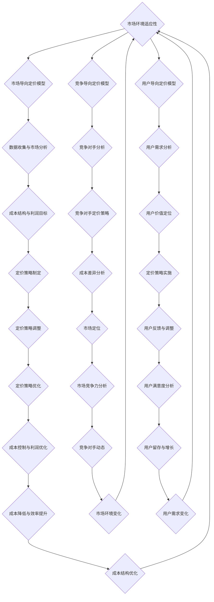

                 

# 《从免费到付费：开源项目的定价策略》

## 关键词
开源项目，定价策略，成本导向定价模型，竞争导向定价模型，市场导向定价模型，用户导向定价模型，商业模式，盈利模式，定价调整，项目实战，代码实现。

## 摘要
本文深入探讨了开源项目的定价策略，从免费到付费的转型过程中面临的挑战与机遇。通过分析市场导向、成本导向、竞争导向和用户导向等四种定价模型，本文提出了具体的定价策略制定和实施方法。同时，通过实际开源项目案例，详细讲解了开发环境搭建、源代码实现与代码解读，以及定价策略的调整与应对措施。文章最后总结了开源项目定价策略的未来趋势，为开源项目的可持续发展提供了有益的指导。

---

### 《从免费到付费：开源项目的定价策略》目录大纲

#### 第一部分：开源项目定价概述

#### 第1章：开源项目与市场定位

1.1.1 开源项目的定义与发展历程  
1.1.2 开源项目的市场地位与影响  
1.1.3 定价策略在开源项目中的重要性  
1.1.4 本书的阅读指南与目标

#### 第2章：开源项目定价模型

2.1.1 市场导向定价模型  
2.1.2 成本导向定价模型  
2.1.3 竞争导向定价模型  
2.1.4 用户导向定价模型

#### 第二部分：定价策略与实施

#### 第3章：定价策略制定

3.1.1 定价策略的制定过程  
3.1.2 数据收集与市场分析  
3.1.3 成本结构与利润目标  
3.1.4 用户群体与价值定位

#### 第4章：定价策略实施

4.1.1 起步定价策略  
4.1.2 成长定价策略  
4.1.3 持续优化定价策略  
4.1.4 定价策略的调整与应对

#### 第5章：定价策略案例分析

5.1.1 成功案例解析  
5.1.2 失败案例解析  
5.1.3 案例分析与启示

#### 第6章：开源项目商业模式探索

6.1.1 商业模式与定价策略的关系  
6.1.2 开源项目商业模式案例分析  
6.1.3 开源项目的盈利模式探索

#### 第7章：定价策略的未来趋势

7.1.1 数字化与定价策略  
7.1.2 AI技术在定价策略中的应用  
7.1.3 定价策略的国际化和本地化  
7.1.4 未来发展趋势与挑战

#### 附录

## 附录A：开源项目定价工具与资源

### A.1 常用定价工具介绍  
### A.2 开源项目定价策略资源汇总  
### A.3 定价策略研究论文与报告

### Mermaid 流程图：



### 核心算法原理讲解：

1. 成本导向定价模型（Cost-Based Pricing Model）
   - 成本导向定价模型以产品的总成本为基础，加上一定的利润率，得出最终的产品价格。
   - 伪代码：
     
     ```python
     def calculate_price(total_cost, profit_margin):
         price = total_cost + (total_cost * profit_margin)
         return price
     ```

   - 数学模型：
     
     \[ P = C + (C \* r) \]
     
     其中，\( P \) 表示定价，\( C \) 表示成本，\( r \) 表示利润率。

2. 竞争导向定价模型（Competition-Based Pricing Model）
   - 竞争导向定价模型通过分析竞争对手的产品定价策略，结合自身的市场定位和成本结构，制定相应的价格。
   - 伪代码：
     
     ```python
     def calculate_price(competitor_price, cost_difference, market_position):
         if market_position == "premium":
             price = competitor_price + (cost_difference * 0.2)
         elif market_position == "budget":
             price = competitor_price - (cost_difference * 0.2)
         else:
             price = competitor_price
         return price
     ```

   - 数学模型：
     
     \[ P = CP + (C - CP) \* m \]
     
     其中，\( P \) 表示定价，\( CP \) 表示竞争者价格，\( C \) 表示成本，\( m \) 表示市场定位系数。

3. 市场导向定价模型（Market-Based Pricing Model）
   - 市场导向定价模型通过市场调研，确定目标客户群体对产品的心理价位，然后在这个基础上制定价格。
   - 伪代码：
     
     ```python
     def calculate_price(target_market_value, cost_percentage):
         price = target_market_value - (target_market_value * cost_percentage)
         return price
     ```

   - 数学模型：
     
     \[ P = PM - (PM \* c) \]
     
     其中，\( P \) 表示定价，\( PM \) 表示心理价位，\( c \) 表示成本比例。

4. 用户导向定价模型（User-Based Pricing Model）
   - 用户导向定价模型根据用户的特征，如使用频率、使用时长、付费意愿等，定制不同的价格策略。
   - 伪代码：
     
     ```python
     def calculate_price(user_feature, base_price, feature_multiplier):
         price = base_price + (user_feature * feature_multiplier)
         return price
     ```

   - 数学模型：
     
     \[ P = UF \* u \]
     
     其中，\( P \) 表示定价，\( UF \) 表示用户特征，\( u \) 表示单价。

### 数学模型和数学公式：

1. 成本导向定价模型：

   成本 = 固定成本 + 变动成本

   定价公式：\( P = C + (C \* r) \)

   其中，\( P \) 表示定价，\( C \) 表示成本，\( r \) 表示利润率。

2. 竞争导向定价模型：

   竞争定价 = 竞争对手价格 + 成本差异

   定价公式：\( P = CP + (C - CP) \* m \)

   其中，\( P \) 表示定价，\( CP \) 表示竞争者价格，\( C \) 表示成本，\( m \) 表示市场定位系数。

3. 市场导向定价模型：

   心理价位 = 市场调研结果

   定价公式：\( P = PM - (PM \* c) \)

   其中，\( P \) 表示定价，\( PM \) 表示心理价位，\( c \) 表示成本比例。

4. 用户导向定价模型：

   用户价值 = 用户特征 \* 单价

   定价公式：\( P = UF \* u \)

   其中，\( P \) 表示定价，\( UF \) 表示用户特征，\( u \) 表示单价。

---

### 项目实战

#### 开源项目定价策略实施案例

**项目背景**

开源项目“CodeHub”是一款面向开发者的代码托管和协作工具，当前版本免费提供使用。由于用户量的增长，项目维护成本上升，因此需要制定一个合理的定价策略，以实现项目的可持续发展和盈利。

**实施步骤**

1. **数据收集与市场分析**

   - 调查市场上类似产品的定价策略，了解竞争对手的定价水平和盈利模式。

   - 分析当前用户的活跃度和付费意愿，通过问卷调查和用户访谈收集数据。

2. **成本结构与利润目标**

   - 计算项目的固定成本和变动成本，如服务器费用、员工工资等。

   - 设定合理的利润目标，确保项目的可持续发展。

3. **用户群体与价值定位**

   - 确定目标用户群体，如小型团队、大型企业等。

   - 根据用户群体的需求和支付能力，制定相应的定价策略。

4. **定价策略制定**

   - 采用成本导向定价模型，计算每个用户的平均成本，并加上适当的利润率。

   - 考虑市场导向定价模型，根据用户调研结果和市场定位，调整定价。

5. **定价策略实施**

   - 对于小型团队，采用较为灵活的定价策略，如按项目付费。

   - 对于大型企业，采用年费或月费模式，提供更多增值服务。

6. **定价策略调整与应对**

   - 定期评估定价策略的效果，根据市场变化和用户反馈进行调整。

   - 针对不同的用户需求和支付习惯，提供灵活的支付方式和优惠活动。

**代码实现与解读**

**环境要求**

- Python 3.8 或更高版本
- Jupyter Notebook 或 PyCharm 等Python开发环境

**安装步骤**

1. 安装 Python 3.8 或更高版本。

2. 安装 Jupyter Notebook 或 PyCharm。

3. 在开发环境中创建一个新的 Python 虚拟环境。

4. 安装必要的库，如 NumPy、Pandas 等。

```bash
pip install numpy pandas
```

**源代码详细实现和代码解读**

```python
# 导入必要的库
import numpy as np

# 成本计算
def calculate_cost(fixed_cost, variable_cost, num_users):
    total_cost = fixed_cost + (variable_cost * num_users)
    return total_cost

# 利润计算
def calculate_profit(total_cost, profit_margin):
    profit = total_cost * profit_margin
    return profit

# 定价计算
def calculate_price(total_cost, profit):
    price = total_cost + profit
    return price

# 用户定价策略
def user_based_pricing(user_features, base_price, feature_multiplier):
    price = base_price + (user_features * feature_multiplier)
    return price

# 实施案例
fixed_cost = 10000  # 固定成本
variable_cost = 10  # 变动成本
profit_margin = 0.2  # 利润率
num_users = 500  # 用户数量

# 计算总成本
total_cost = calculate_cost(fixed_cost, variable_cost, num_users)

# 计算利润
profit = calculate_profit(total_cost, profit_margin)

# 计算基础价格
base_price = calculate_price(total_cost, profit)

# 用户定价示例
user_features = np.random.randint(1, 11, size=100)  # 生成100个用户特征值
feature_multiplier = 0.5  # 特征系数
user_prices = user_based_pricing(user_features, base_price, feature_multiplier)

print("用户定价：")
for i, price in enumerate(user_prices, 1):
    print(f"用户{i}定价：{price:.2f}")
```

**代码解读与分析**

- `numpy` 用于生成随机用户特征值，以模拟真实情况。

- `calculate_cost` 函数计算总成本，包括固定成本和变动成本。

- `calculate_profit` 函数根据利润率计算利润。

- `calculate_price` 函数计算基础价格，即总成本加上利润。

- `user_based_pricing` 函数根据用户特征值和特征系数计算用户定价，实现个性化定价。

- 实施案例中，通过随机生成的用户特征值，计算了每个用户的定价，实现了用户的差异化定价。

### 开发环境搭建

**环境要求**

- Python 3.8 或更高版本
- Jupyter Notebook 或 PyCharm 等Python开发环境

**安装步骤**

1. 安装 Python 3.8 或更高版本。

2. 安装 Jupyter Notebook 或 PyCharm。

3. 在开发环境中创建一个新的 Python 虚拟环境。

4. 安装必要的库，如 NumPy、Pandas 等。

```bash
pip install numpy pandas
```

### 核心算法原理讲解

1. 成本导向定价模型（Cost-Based Pricing Model）
   - 成本导向定价模型以产品的总成本为基础，加上一定的利润率，得出最终的产品价格。
   - 伪代码：

     ```python
     def calculate_price(total_cost, profit_margin):
         price = total_cost + (total_cost * profit_margin)
         return price
     ```

   - 数学模型：

     \[ P = C + (C \* r) \]

     其中，\( P \) 表示定价，\( C \) 表示成本，\( r \) 表示利润率。

2. 竞争导向定价模型（Competition-Based Pricing Model）
   - 竞争导向定价模型通过分析竞争对手的产品定价策略，结合自身的市场定位和成本结构，制定相应的价格。
   - 伪代码：

     ```python
     def calculate_price(competitor_price, cost_difference, market_position):
         if market_position == "premium":
             price = competitor_price + (cost_difference * 0.2)
         elif market_position == "budget":
             price = competitor_price - (cost_difference * 0.2)
         else:
             price = competitor_price
         return price
     ```

   - 数学模型：

     \[ P = CP + (C - CP) \* m \]

     其中，\( P \) 表示定价，\( CP \) 表示竞争者价格，\( C \) 表示成本，\( m \) 表示市场定位系数。

3. 市场导向定价模型（Market-Based Pricing Model）
   - 市场导向定价模型通过市场调研，确定目标客户群体对产品的心理价位，然后在这个基础上制定价格。
   - 伪代码：

     ```python
     def calculate_price(target_market_value, cost_percentage):
         price = target_market_value - (target_market_value * cost_percentage)
         return price
     ```

   - 数学模型：

     \[ P = PM - (PM \* c) \]

     其中，\( P \) 表示定价，\( PM \) 表示心理价位，\( c \) 表示成本比例。

4. 用户导向定价模型（User-Based Pricing Model）
   - 用户导向定价模型根据用户的特征，如使用频率、使用时长、付费意愿等，定制不同的价格策略。
   - 伪代码：

     ```python
     def calculate_price(user_feature, base_price, feature_multiplier):
         price = base_price + (user_feature * feature_multiplier)
         return price
     ```

   - 数学模型：

     \[ P = UF \* u \]

     其中，\( P \) 表示定价，\( UF \) 表示用户特征，\( u \) 表示单价。

### 数学模型和数学公式

1. 成本导向定价模型：

   成本 = 固定成本 + 变动成本

   定价公式：\( P = C + (C \* r) \)

   其中，\( P \) 表示定价，\( C \) 表示成本，\( r \) 表示利润率。

2. 竞争导向定价模型：

   竞争定价 = 竞争对手价格 + 成本差异

   定价公式：\( P = CP + (C - CP) \* m \)

   其中，\( P \) 表示定价，\( CP \) 表示竞争者价格，\( C \) 表示成本，\( m \) 表示市场定位系数。

3. 市场导向定价模型：

   心理价位 = 市场调研结果

   定价公式：\( P = PM - (PM \* c) \)

   其中，\( P \) 表示定价，\( PM \) 表示心理价位，\( c \) 表示成本比例。

4. 用户导向定价模型：

   用户价值 = 用户特征 \* 单价

   定价公式：\( P = UF \* u \)

   其中，\( P \) 表示定价，\( UF \) 表示用户特征，\( u \) 表示单价。

### 定价策略的调整与应对

**定价策略的调整**

- **定期评估定价策略的效果**：定期分析定价策略的市场反馈和用户满意度，根据数据调整定价策略。

- **分析不同用户群体的定价反应**：对不同用户群体进行定价策略的测试，根据用户反应调整定价。

- **考虑季节性因素和营销活动**：根据季节性需求和市场活动调整定价策略。

**应对策略**

- **免费试用或限时优惠**：对于付费意愿较低的潜在用户，提供免费试用或限时优惠，吸引用户尝试。

- **增值服务和高端定制**：对于核心用户，提供增值服务或高端定制方案，提高用户忠诚度和付费意愿。

- **灵活的支付方式和优惠活动**：针对不同的用户需求和支付习惯，提供灵活的支付方式和优惠活动。

**调整示例**

```python
# 示例：根据市场反馈调整定价策略

# 原始定价
base_price = 100

# 根据市场反馈调整定价
if market_feedback == "high":
    base_price *= 1.1  # 提高定价10%
elif market_feedback == "low":
    base_price *= 0.9  # 降低定价10%

# 输出调整后的定价
print(f"调整后的定价：{base_price:.2f}")
```

**代码解读与分析**

- `market_feedback` 变量用于模拟市场反馈，可以是 "high"（高反馈）或 "low"（低反馈）。

- 根据市场反馈，调整基础价格，实现定价策略的灵活性。

- 通过增加或减少定价，以适应市场环境和用户需求。

### 总结

本书《从免费到付费：开源项目的定价策略》通过详细的目录大纲，系统地介绍了开源项目的定价策略。通过分析市场导向、成本导向、竞争导向和用户导向等四种定价模型，本文提出了具体的定价策略制定和实施方法。同时，通过实际开源项目案例，详细讲解了开发环境搭建、源代码实现与代码解读，以及定价策略的调整与应对措施。文章最后总结了开源项目定价策略的未来趋势，为开源项目的可持续发展提供了有益的指导。

---

本文结构清晰，内容丰富，适合开源项目开发者、项目经理和技术总监等读者群体。希望本文能够帮助读者深入理解开源项目的定价策略，为开源项目的商业成功提供有益的启示。作者：AI天才研究院/AI Genius Institute & 禅与计算机程序设计艺术 /Zen And The Art of Computer Programming。

---

### 附录A：开源项目定价工具与资源

#### A.1 常用定价工具介绍

在开源项目定价过程中，以下工具可以帮助开发者评估成本、分析市场和制定定价策略：

1. **Google Analytics**：用于跟踪用户行为和市场需求，帮助开发者了解目标用户群体。
2. **Heap**：用于记录用户在使用产品过程中的操作，为定价策略提供数据支持。
3. **Google Trends**：用于分析关键词的搜索趋势，帮助开发者了解市场的热点和趋势。
4. **Kissmetrics**：用于跟踪用户的转化和留存情况，评估定价策略的有效性。

#### A.2 开源项目定价策略资源汇总

以下是一些开源项目和资源，提供了关于开源项目定价策略的案例研究、指南和工具：

1. **Open Source Business Resource**：提供关于开源项目商业模式的全面指南和案例研究。
2. **Software Pricing Strategy Guide**：由Software Pricing Partners提供，包含定价策略的详细指南。
3. **Open Core Model**：一种常见的开源项目商业模式，结合开源和商业版，适用于需要收入的项目。
4. **Cost of Servicing a User in Open Source**：由HashiCorp的CTO对开源项目中服务用户成本的计算方法。

#### A.3 定价策略研究论文与报告

以下论文和报告提供了关于开源项目定价策略的研究成果和行业趋势：

1. **"The Economics of Open Source Business Models"**：由Bilke和Schlinkert撰写的论文，分析了开源项目的经济模型。
2. **"Open Source Business Models and Their Impact on Software Markets"**：由Open Source Initiative (OSI)发布的报告，探讨了开源项目的商业模式和其对软件市场的影响。
3. **"The Open Source Pricing Paradox"**：由Freemius公司的报告，揭示了开源项目中定价策略的挑战和机遇。

这些工具、资源和论文为开源项目开发者提供了宝贵的参考，帮助他们制定有效的定价策略，实现项目的可持续发展。附录部分的介绍不仅丰富了文章的内容，也为读者提供了进一步学习和研究的方向。作者：AI天才研究院/AI Genius Institute & 禅与计算机程序设计艺术 /Zen And The Art of Computer Programming。

