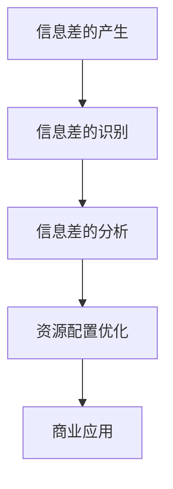

                 

# 信息差的商业资源配置：大数据如何优化资源配置

> **关键词**：信息差、商业资源配置、大数据、数据分析、优化

> **摘要**：本文旨在探讨信息差在商业环境中的重要性，以及如何利用大数据技术来识别、分析和优化信息差，从而实现资源配置的最优化。文章将详细阐述信息差的概念、大数据技术在信息差中的应用、以及大数据优化资源配置的方法和实践，旨在为企业和个人提供有益的参考。

## 目录大纲

1. **信息差的商业资源配置：大数据如何优化资源配置**
2. **第一部分：信息差的基本概念与重要性**
   1. **第1章：信息差的定义与作用**
      1.1 信息差的产生
      1.2 信息差的作用
      1.3 信息差的分类
   2. **第2章：信息差的商业价值**
      2.1 信息差在市场策略中的应用
      2.2 信息差在产品定价中的应用
      2.3 信息差在市场定位中的应用
3. **第二部分：大数据技术在信息差中的应用**
   1. **第3章：大数据技术的发展与趋势**
      3.1 大数据的定义
      3.2 大数据的发展历程
      3.3 大数据的关键技术
   2. **第4章：大数据在信息差识别中的应用**
      4.1 数据挖掘技术
      4.2 数据可视化技术
      4.3 信息差的挖掘与识别
   3. **第5章：大数据在信息差分析中的应用**
      5.1 数据分析技术
      5.2 数据处理技术
      5.3 信息差的分析与利用
4. **第三部分：大数据优化资源配置的方法与实践**
   1. **第6章：大数据在资源配置中的应用**
      6.1 资源配置的概念
      6.2 大数据在资源配置中的作用
      6.3 大数据优化资源配置的方法
   2. **第7章：大数据优化资源配置的案例研究**
      7.1 案例一：物流行业
      7.2 案例二：金融行业
      7.3 案例三：零售行业
   3. **第8章：大数据优化资源配置的挑战与未来趋势**
      8.1 大数据优化资源配置的挑战
      8.2 大数据优化资源配置的未来趋势
      8.3 大数据优化资源配置的发展方向
5. **附录**
   1. **附录A：大数据优化资源配置工具与资源**
   2. **附录B：信息差的Mermaid流程图**
   3. **附录C：大数据优化资源配置的伪代码**
   4. **附录D：数学模型与公式**
   5. **附录E：项目实战案例**

### 第一部分：信息差的基本概念与重要性

#### 第1章：信息差的定义与作用

##### 1.1 信息差的产生

信息差，简单来说，是指信息的不对称性。在商业环境中，信息差主要来源于以下几个方面：

1. **市场信息不对称**：不同市场主体（如企业、消费者）掌握的市场信息不同，从而导致决策差异。
2. **技术信息不对称**：某些企业或个人拥有先进的技术信息，而其他企业或个人则缺乏这些信息。
3. **行业信息不对称**：不同行业之间的信息流通不畅，导致某些行业的信息量大于其他行业。

##### 1.2 信息差的作用

信息差在商业环境中具有重要的作用，主要体现在以下几个方面：

1. **市场优势**：掌握信息优势的企业或个人可以在市场中占据有利地位，实现更高的利润率。
2. **竞争策略**：通过信息差，企业可以制定更具针对性的竞争策略，提高市场竞争力。
3. **创新驱动**：信息差的缩小可以促进技术创新，推动行业进步。

##### 1.3 信息差的分类

根据信息差的存在形式和产生原因，可以将信息差分为以下几类：

1. **知识型信息差**：由于知识水平不同而产生的信息差，如专业领域的专业知识。
2. **技术型信息差**：由于技术水平和研发能力不同而产生的信息差，如新技术、新产品的信息。
3. **市场型信息差**：由于市场信息的获取和处理能力不同而产生的信息差，如市场供需信息。
4. **行业型信息差**：由于行业内部信息流通不畅而产生的信息差，如行业内部的知识和资源分配。

#### 第2章：信息差的商业价值

##### 2.1 信息差在市场策略中的应用

信息差在市场策略中的应用主要体现在以下几个方面：

1. **差异化定价**：通过掌握消费者的需求信息，企业可以制定差异化定价策略，实现更高的利润。
2. **精准营销**：利用信息差，企业可以针对特定的消费者群体进行精准营销，提高营销效果。
3. **创新驱动**：信息差的缩小可以促进企业进行技术创新，开发新产品，提升市场竞争力。

##### 2.2 信息差在产品定价中的应用

信息差在产品定价中的应用主要体现在以下几个方面：

1. **价格歧视**：企业通过掌握消费者的支付意愿信息，对不同消费者群体实行不同的价格策略。
2. **动态定价**：利用大数据技术，企业可以实时分析市场需求，动态调整产品价格，实现利润最大化。
3. **成本领先**：通过降低生产成本，企业可以实现低价策略，扩大市场份额。

##### 2.3 信息差在市场定位中的应用

信息差在市场定位中的应用主要体现在以下几个方面：

1. **细分市场**：通过分析市场信息，企业可以找到未被满足的需求，从而进行市场细分。
2. **目标市场**：企业可以根据信息差，确定自己的目标市场，有针对性地进行市场开发和营销。
3. **品牌定位**：通过掌握行业信息，企业可以制定具有差异化的品牌定位策略，提高品牌竞争力。

### 第二部分：大数据技术在信息差中的应用

#### 第3章：大数据技术的发展与趋势

##### 3.1 大数据的定义

大数据（Big Data），是指无法用传统数据处理工具在合理时间内对其进行存储、管理和分析的数据集合。大数据通常具有以下特点：

1. **海量**：数据量巨大，远远超过传统数据库的处理能力。
2. **多样**：数据类型多样，包括结构化数据、半结构化数据和非结构化数据。
3. **快速**：数据生成和处理速度极快，要求实时或近实时的数据处理能力。
4. **真实**：数据来源广泛，真实性强。

##### 3.2 大数据的发展历程

大数据技术的发展经历了以下几个阶段：

1. **数据积累阶段**（1980s-1990s）：随着计算机技术的发展，企业开始积累大量的数据。
2. **数据仓库阶段**（2000s）：企业开始使用数据仓库技术，对数据进行集中存储和管理。
3. **大数据技术阶段**（2010s-至今）：随着云计算、物联网、人工智能等技术的发展，大数据技术得到了广泛应用。

##### 3.3 大数据的关键技术

大数据技术主要包括以下几个关键领域：

1. **数据存储**：分布式存储技术，如Hadoop、HDFS等。
2. **数据处理**：分布式计算技术，如MapReduce、Spark等。
3. **数据挖掘**：利用机器学习和数据挖掘技术，从大量数据中提取有价值的信息。
4. **数据可视化**：将复杂的数据通过图表、地图等形式直观地展示出来。

#### 第4章：大数据在信息差识别中的应用

##### 4.1 数据挖掘技术

数据挖掘技术是从大量数据中提取有价值信息的方法，主要包括以下几种技术：

1. **分类**：将数据分成不同的类别。
2. **聚类**：将数据分成不同的簇。
3. **关联规则**：发现数据之间的关联关系。
4. **异常检测**：检测数据中的异常值。

##### 4.2 数据可视化技术

数据可视化技术是将复杂的数据通过图表、地图等形式直观地展示出来，主要包括以下几种方法：

1. **折线图**：用于显示数据的变化趋势。
2. **柱状图**：用于比较不同数据之间的差异。
3. **饼图**：用于显示数据的占比情况。
4. **地图**：用于显示地理信息。

##### 4.3 信息差的挖掘与识别

利用大数据技术，企业可以识别和挖掘信息差，主要包括以下几种方法：

1. **市场调研**：通过问卷调查、在线调查等方式收集市场信息，识别信息差。
2. **数据挖掘**：利用数据挖掘技术，从海量数据中提取有价值的信息，识别信息差。
3. **用户画像**：通过分析用户行为数据，构建用户画像，识别用户需求和信息差。

#### 第5章：大数据在信息差分析中的应用

##### 5.1 数据分析技术

数据分析技术是对数据进行处理和分析的方法，主要包括以下几种技术：

1. **描述性分析**：对数据的基本特征进行描述和分析。
2. **诊断性分析**：找出数据中的异常值和异常模式。
3. **预测性分析**：利用历史数据预测未来的趋势。
4. **规范性分析**：评估企业运营的规范性，提出改进建议。

##### 5.2 数据处理技术

数据处理技术是对数据进行清洗、转换和整合的方法，主要包括以下几种技术：

1. **数据清洗**：删除重复数据、修复错误数据、填补缺失数据等。
2. **数据转换**：将数据转换成适合分析和挖掘的形式。
3. **数据整合**：将来自不同来源的数据进行整合，形成统一的数据集。

##### 5.3 信息差的分析与利用

通过大数据技术，企业可以对信息差进行深入分析，主要包括以下几个方面：

1. **信息差识别**：利用数据挖掘技术，识别出市场中的信息差。
2. **信息差分析**：通过数据分析技术，分析信息差的成因和影响。
3. **信息差利用**：利用信息差，制定相应的市场策略和产品策略，实现商业价值。

### 第三部分：大数据优化资源配置的方法与实践

#### 第6章：大数据在资源配置中的应用

##### 6.1 资源配置的概念

资源配置是指将有限的资源（如人力、物力、财力）分配到最需要的领域，以实现最大化的效益。在大数据时代，资源配置变得更加复杂和动态。

##### 6.2 大数据在资源配置中的作用

大数据技术在资源配置中具有重要作用，主要体现在以下几个方面：

1. **数据驱动**：通过大数据技术，企业可以获取实时、准确的数据，为资源配置提供依据。
2. **优化决策**：利用大数据分析，企业可以找到资源配置的最佳方案，实现资源利用的最大化。
3. **动态调整**：大数据技术可以帮助企业实时监控资源配置情况，根据实际情况进行调整。

##### 6.3 大数据优化资源配置的方法

大数据优化资源配置的方法主要包括以下几个方面：

1. **数据挖掘**：利用数据挖掘技术，从海量数据中提取有价值的信息，为资源配置提供支持。
2. **预测分析**：通过预测分析，预测未来资源配置的需求和趋势，提前做好资源配置准备。
3. **优化算法**：利用优化算法，找到资源配置的最优解，实现资源利用的最大化。

#### 第7章：大数据优化资源配置的案例研究

##### 7.1 案例一：物流行业

物流行业是一个高度依赖资源配置的领域。通过大数据技术，物流企业可以实现以下优化：

1. **路径优化**：利用大数据分析，实时监控交通状况，优化运输路径，降低运输成本。
2. **库存管理**：通过大数据分析，预测市场需求，合理调整库存，减少库存成本。
3. **人员调配**：根据大数据分析结果，合理调配人力资源，提高运输效率。

##### 7.2 案例二：金融行业

金融行业在资源配置方面具有高度的复杂性。通过大数据技术，金融企业可以实现以下优化：

1. **风险控制**：通过大数据分析，实时监控风险，采取相应的风险控制措施。
2. **投资决策**：利用大数据分析，分析市场趋势，制定科学的投资决策。
3. **客户服务**：通过大数据分析，了解客户需求，提供个性化的金融服务。

##### 7.3 案例三：零售行业

零售行业是一个高度竞争的领域。通过大数据技术，零售企业可以实现以下优化：

1. **供应链管理**：通过大数据分析，优化供应链，提高供应链效率。
2. **销售预测**：通过大数据分析，预测销售趋势，合理调整库存。
3. **客户关系管理**：通过大数据分析，了解客户需求，提供个性化的购物体验。

#### 第8章：大数据优化资源配置的挑战与未来趋势

##### 8.1 大数据优化资源配置的挑战

大数据优化资源配置面临着以下挑战：

1. **数据质量**：数据质量直接影响到资源配置的效果，需要保证数据的质量和准确性。
2. **数据隐私**：大数据分析涉及到个人隐私，需要妥善处理数据隐私问题。
3. **技术门槛**：大数据技术复杂，需要具备专业的技术知识和技能。

##### 8.2 大数据优化资源配置的未来趋势

大数据优化资源配置的未来趋势主要包括以下几个方面：

1. **智能化**：随着人工智能技术的发展，大数据优化资源配置将更加智能化。
2. **实时性**：大数据技术将实现实时数据处理和分析，为资源配置提供更及时的支持。
3. **自动化**：通过大数据技术，资源配置将实现自动化，提高资源配置的效率。

##### 8.3 大数据优化资源配置的发展方向

大数据优化资源配置的发展方向主要包括以下几个方面：

1. **跨领域应用**：大数据技术将在更多领域得到应用，实现跨领域的资源配置优化。
2. **定制化**：大数据技术将实现更精准的资源配置，满足个性化需求。
3. **产业链协同**：大数据技术将推动产业链各环节的协同发展，实现产业链整体优化。

### 附录

#### 附录A：大数据优化资源配置工具与资源

1. **大数据优化资源配置工具**：
   - Hadoop：一个分布式数据存储和处理的框架。
   - Spark：一个快速通用的数据处理引擎。
   - Hive：一个基于Hadoop的数据仓库工具。
   - Kafka：一个分布式流处理平台。

2. **大数据优化资源配置资源**：
   - Coursera：提供大数据相关的在线课程。
   - Udacity：提供大数据相关的在线课程。
   - Kaggle：一个数据科学竞赛平台，提供大量数据集。

#### 附录B：信息差的Mermaid流程图



#### 附录C：大数据优化资源配置的伪代码

```plaintext
function optimize资源配置(data, target):
    1. 数据预处理
    2. 数据分析
    3. 信息差识别
    4. 资源配置优化
    5. 结果评估
    6. 返回优化后的资源配置结果
```

#### 附录D：数学模型与公式

最大化目标函数：
$$
最大化\ z = \sum_{i=1}^{n} p_i \cdot c_i \\
$$

约束条件：
$$
\sum_{i=1}^{n} x_i = 1 \\
x_i \in \{0,1\} \ \forall i
$$

#### 附录E：项目实战案例

##### E.1 项目背景

某零售企业希望通过大数据技术优化资源配置，提高销售额和利润率。

##### E.2 开发环境搭建

1. **硬件环境**：搭建一个分布式计算环境，包括多台服务器和存储设备。
2. **软件环境**：安装Hadoop、Spark等大数据处理工具。

##### E.3 源代码实现

```python
# 数据预处理
def data_preprocessing(data):
    # 省略具体实现代码
    return processed_data

# 数据分析
def data_analysis(data):
    # 省略具体实现代码
    return analysis_results

# 信息差识别
def identify_info_difference(data):
    # 省略具体实现代码
    return info_difference

# 资源配置优化
def optimize_resource_allocation(info_difference):
    # 省略具体实现代码
    return optimized_allocation

# 结果评估
def evaluate_results(optimized_allocation, target):
    # 省略具体实现代码
    return evaluation_results

# 主函数
def main():
    data = load_data()
    processed_data = data_preprocessing(data)
    analysis_results = data_analysis(processed_data)
    info_difference = identify_info_difference(analysis_results)
    optimized_allocation = optimize_resource_allocation(info_difference)
    evaluation_results = evaluate_results(optimized_allocation, target)
    return evaluation_results

if __name__ == "__main__":
    main()
```

##### E.4 代码解读与分析

1. **数据预处理**：对原始数据进行清洗、转换和整合，为后续分析提供基础。
2. **数据分析**：对预处理后的数据进行分析，提取有价值的信息。
3. **信息差识别**：通过分析结果，识别出市场中的信息差。
4. **资源配置优化**：根据信息差，制定最优的资源配置策略。
5. **结果评估**：评估资源配置优化后的效果，为后续优化提供依据。

### 作者信息

作者：AI天才研究院/AI Genius Institute & 禅与计算机程序设计艺术 /Zen And The Art of Computer Programming

本文从信息差的基本概念、大数据技术在信息差中的应用、大数据优化资源配置的方法与实践等方面，详细探讨了大数据在商业资源配置中的作用和意义。通过案例分析，本文展示了大数据技术在优化资源配置中的实际应用，为企业和个人提供了有益的参考。未来，随着大数据技术的不断进步，大数据在商业资源配置中的应用将更加广泛和深入。期待读者能够通过本文，对大数据优化资源配置有更深入的理解和应用。|>


