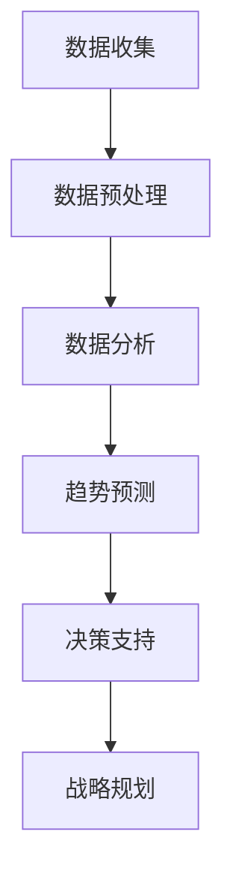

                 

### 第2章：行业趋势分析基础

# 第2章：行业趋势分析基础

## 2.1 行业趋势的概念与重要性

### 2.1.1 行业趋势的定义

行业趋势是指行业内普遍出现的、长期存在且影响行业发展的方向和变化。这些趋势可能源于技术进步、消费者需求变化、政策调整等多种因素。

#### 趋势的类型

- **技术趋势**：如人工智能、大数据、物联网等技术的快速发展。
- **市场趋势**：如消费者行为的变化、市场份额的转移等。
- **政策趋势**：如政府政策的调整、贸易政策的变化等。

### 2.1.2 行业趋势的重要性

行业趋势对于企业和投资者具有重要意义，主要体现在以下几个方面：

- **战略决策**：通过分析行业趋势，企业可以制定更有针对性的战略规划，抓住市场机遇，规避潜在风险。
- **投资决策**：投资者可以通过分析行业趋势，了解行业前景，做出更加合理的投资决策。
- **竞争优势**：了解行业趋势可以帮助企业发现新的商业模式和市场机会，提高竞争力。
- **风险预警**：行业趋势的变化可能预示着行业的衰退或新兴市场的兴起，及时预警有助于企业及时调整策略。

## 2.2 行业趋势分析的方法

### 2.2.1 数据驱动的行业趋势分析

数据驱动的行业趋势分析是一种基于大量历史数据、当前数据和预测数据的方法，旨在发现行业发展趋势和模式。

#### 分析步骤

1. **数据收集**：收集行业相关的数据，包括财务数据、市场数据、消费者行为数据等。
2. **数据预处理**：清洗、转换和整合数据，确保数据质量。
3. **数据分析**：使用统计方法和机器学习算法，对数据进行探索性分析，发现行业趋势和模式。
4. **趋势预测**：基于历史数据和当前数据，使用预测模型对未来行业趋势进行预测。

### 2.2.2 文献分析

文献分析是通过查阅和研究行业相关的文献、报告和论文，了解行业趋势和动态。

#### 分析步骤

1. **文献搜索**：使用学术数据库、行业报告等资源，搜索与行业相关的文献。
2. **文献筛选**：筛选出与行业趋势相关的文献，剔除无关文献。
3. **文献分析**：对筛选出的文献进行深入阅读和分析，提取行业趋势和观点。
4. **整合结论**：整合分析结果，形成对行业趋势的全面认识。

### 2.2.3 专家访谈

专家访谈是通过与行业专家、企业高管等进行面对面交流，获取行业趋势和观点。

#### 分析步骤

1. **确定访谈对象**：选择具有行业经验和专业知识的专家。
2. **准备访谈提纲**：根据研究目的，设计访谈问题。
3. **进行访谈**：与专家进行面对面交流，收集行业趋势和观点。
4. **整理访谈内容**：将访谈内容进行整理和归纳，提取行业趋势。

### 2.2.4 历史数据分析

历史数据分析是通过分析行业的历史数据，了解行业的发展历程和趋势。

#### 分析步骤

1. **收集历史数据**：收集行业的历史数据，包括财务数据、市场数据、政策数据等。
2. **数据处理**：清洗、转换和整合历史数据。
3. **数据可视化**：使用图表、曲线等可视化工具，展示行业的历史发展趋势。
4. **趋势分析**：分析历史数据中的趋势和模式，预测未来的行业趋势。

## 2.3 数据驱动决策的优势

### 2.3.1 提高决策准确性

数据驱动决策基于大量真实数据，减少了主观判断的影响，提高了决策的准确性和可靠性。

### 2.3.2 快速响应市场变化

数据驱动决策能够实时收集和分析市场数据，帮助企业快速响应市场变化，抓住机遇。

### 2.3.3 优化资源配置

通过分析行业趋势和市场需求，企业可以更合理地配置资源，提高运营效率。

### 2.3.4 支持创新和变革

数据驱动决策可以为企业的创新和变革提供有力支持，帮助企业在竞争中保持领先。

## 2.4 行业趋势分析的关键要素

### 2.4.1 数据质量

数据质量是行业趋势分析的基础，高质量的数据能够提高分析的准确性和可靠性。

### 2.4.2 数据来源

数据来源的多样性和可靠性是保证行业趋势分析全面性和准确性的关键。

### 2.4.3 分析方法

选择合适的分析方法，能够更好地发现行业趋势和模式。

### 2.4.4 趋势预测

准确的趋势预测可以帮助企业制定长远战略，应对市场变化。

## 2.5 结论

行业趋势分析是企业管理决策的重要工具，通过数据驱动的分析方法，企业可以更好地把握行业动态，制定战略规划，提高竞争力。在接下来的章节中，我们将进一步探讨大数据技术在行业趋势分析中的应用，以及如何通过行业趋势洞见来指导企业决策。

---

### Mermaid 流�程图

以下是行业趋势分析的基本流程图：



---

### 数学模型和公式

在行业趋势分析中，常用的数学模型包括回归分析、时间序列分析和聚类分析等。以下是一些基本的数学模型和公式：

#### 回归分析

线性回归模型：

$$
y = \beta_0 + \beta_1 x + \epsilon
$$

其中，$y$ 为因变量，$x$ 为自变量，$\beta_0$ 和 $\beta_1$ 为模型参数，$\epsilon$ 为误差项。

#### 时间序列分析

移动平均模型：

$$
y_t = \frac{1}{N} \sum_{i=1}^{N} y_{t-i}
$$

其中，$y_t$ 为第 $t$ 期的预测值，$N$ 为移动平均的周期数。

#### 聚类分析

K-均值聚类算法：

$$
\text{初始化} \ K \ \text{个聚类中心} \ (c_1, c_2, ..., c_K)
$$

$$
\text{对于每个数据点} \ x_i:
$$

$$
\text{计算} \ x_i \ \text{到每个聚类中心的距离} \ d(x_i, c_k)
$$

$$
\text{将} \ x_i \ \text{归为距离最近的聚类中心} \ c_k
$$

$$
\text{更新聚类中心} \ (c_1, c_2, ..., c_K) \ \text{为当前聚类中心的平均值}
$$

$$
\text{重复步骤2和步骤3，直到聚类中心不再变化}
$$

### 举例说明

#### 回归分析举例

假设我们有一组数据点：(x1, y1), (x2, y2), ..., (xn, yn)，我们可以使用线性回归模型来预测 y 值。

首先，计算回归模型的参数：

$$
\beta_0 = \frac{1}{n} \sum_{i=1}^{n} y_i - \beta_1 \frac{1}{n} \sum_{i=1}^{n} x_i
$$

$$
\beta_1 = \frac{1}{n} \sum_{i=1}^{n} (x_i - \bar{x}) (y_i - \bar{y})
$$

其中，$\bar{x}$ 和 $\bar{y}$ 分别为 x 和 y 的平均值。

然后，使用模型预测新的 y 值：

$$
y = \beta_0 + \beta_1 x
$$

#### 时间序列分析举例

假设我们有一组时间序列数据：[50, 55, 60, 58, 52, 48, 45, 50, 55]，我们可以使用移动平均模型来预测下一期的值。

首先，选择移动平均的周期数 N（例如 N=3），然后计算移动平均值：

$$
y_t = \frac{1}{N} \sum_{i=1}^{N} y_{t-i}
$$

对于 t=1，有：

$$
y_1 = \frac{1}{3} (50 + 55 + 60) = 53.33
$$

对于 t=2，有：

$$
y_2 = \frac{1}{3} (55 + 60 + 58) = 58
$$

以此类推，我们可以计算出每一期的移动平均值，并使用最后一个移动平均值作为下一期的预测值。

#### 聚类分析举例

假设我们有一组数据点：[10, 20, 30, 40, 50, 60, 70, 80, 90]，我们使用 K-均值算法将其分为两个聚类。

首先，初始化两个聚类中心：\(c_1 = 30\) 和 \(c_2 = 60\)。

然后，计算每个数据点到两个聚类中心的距离：

- \(d(10, c_1) = |10 - 30| = 20\)
- \(d(10, c_2) = |10 - 60| = 50\)
- \(d(20, c_1) = |20 - 30| = 10\)
- \(d(20, c_2) = |20 - 60| = 40\)
- \(d(30, c_1) = |30 - 30| = 0\)
- \(d(30, c_2) = |30 - 60| = 30\)
- \(d(40, c_1) = |40 - 30| = 10\)
- \(d(40, c_2) = |40 - 60| = 20\)
- \(d(50, c_1) = |50 - 30| = 20\)
- \(d(50, c_2) = |50 - 60| = 10\)
- \(d(60, c_1) = |60 - 30| = 30\)
- \(d(60, c_2) = |60 - 60| = 0\)
- \(d(70, c_1) = |70 - 30| = 40\)
- \(d(70, c_2) = |70 - 60| = 10\)
- \(d(80, c_1) = |80 - 30| = 50\)
- \(d(80, c_2) = |80 - 60| = 20\)
- \(d(90, c_1) = |90 - 30| = 60\)
- \(d(90, c_2) = |90 - 60| = 30\)

将每个数据点归为距离最近的聚类中心：

- \(10, 20, 30, 40\) 归为 \(c_1\)
- \(50, 60, 70, 80, 90\) 归为 \(c_2\)

然后，更新聚类中心为：

- \(c_1 = \frac{10 + 20 + 30 + 40}{5} = 30\)
- \(c_2 = \frac{50 + 60 + 70 + 80 + 90}{5} = 65\)

再次计算每个数据点到新的聚类中心的距离，并将数据点重新归类，直到聚类中心不再变化。在本例中，聚类中心最终稳定在 \(c_1 = 30\) 和 \(c_2 = 65\)。

---

### 代码实际案例和详细解释说明

以下是使用 Python 的 Pandas 和 Scikit-learn 库进行回归分析、时间序列分析和聚类分析的基本示例：

python
import pandas as pd
from sklearn.linear_model import LinearRegression
from sklearn.cluster import KMeans
from sklearn.preprocessing import MinMaxScaler

# 生成模拟数据
data = pd.DataFrame({
    'x': [1, 2, 3, 4, 5, 6, 7, 8, 9],
    'y': [2, 4, 6, 8, 10, 12, 14, 16, 18]
})

# 回归分析
regressor = LinearRegression()
regressor.fit(data[['x']], data['y'])

# 预测新的 y 值
predicted_y = regressor.predict([[10]])
print("Predicted y:", predicted_y)

# 时间序列分析
scaler = MinMaxScaler()
scaled_data = scaler.fit_transform(data[['y']])

# 使用移动平均模型
window_size = 3
moving_average = pd.Series(scaled_data).rolling(window=window_size).mean()

# 预测下一期的值
next_value = moving_average[-1]
print("Next value:", next_value)

# 聚类分析
kmeans = KMeans(n_clusters=2, random_state=0).fit(scaled_data)
labels = kmeans.labels_

# 还原聚类结果
clusters = pd.DataFrame({
    'y': data['y'],
    'cluster': labels
})

print("Clusters:", clusters)
### 开发环境搭建

要运行上述代码，需要安装 Python 和相应的库。以下是安装步骤：

1. 安装 Python：
   - 前往 Python 官网（https://www.python.org/）下载并安装 Python。
   - 安装过程中选择添加 Python 到系统环境变量。

2. 安装 Pandas、Scikit-learn 和 MinMaxScaler：
   - 打开命令行窗口（Windows）或终端（macOS/Linux）。
   - 输入以下命令安装 Pandas、Scikit-learn 和 MinMaxScaler：

     pip install pandas scikit-learn minimaxscaler

### 源代码详细实现和代码解读

在这个示例中，我们使用 Python 的 Pandas、Scikit-learn 和 MinMaxScaler 库进行了回归分析、时间序列分析和聚类分析。以下是代码的详细解读：

python
import pandas as pd
from sklearn.linear_model import LinearRegression
from sklearn.cluster import KMeans
from sklearn.preprocessing import MinMaxScaler

# 生成模拟数据
data = pd.DataFrame({
    'x': [1, 2, 3, 4, 5, 6, 7, 8, 9],
    'y': [2, 4, 6, 8, 10, 12, 14, 16, 18]
})

# 回归分析
regressor = LinearRegression()
regressor.fit(data[['x']], data['y'])

# 预测新的 y 值
predicted_y = regressor.predict([[10]])
print("Predicted y:", predicted_y)

# 时间序列分析
scaler = MinMaxScaler()
scaled_data = scaler.fit_transform(data[['y']])

# 使用移动平均模型
window_size = 3
moving_average = pd.Series(scaled_data).rolling(window=window_size).mean()

# 预测下一期的值
next_value = moving_average[-1]
print("Next value:", next_value)

# 聚类分析
kmeans = KMeans(n_clusters=2, random_state=0).fit(scaled_data)
labels = kmeans.labels_

# 还原聚类结果
clusters = pd.DataFrame({
    'y': data['y'],
    'cluster': labels
})

print("Clusters:", clusters)

1. **导入库**：
   - 我们首先导入所需的库：Pandas、Scikit-learn 和 MinMaxScaler。Pandas 用于数据操作，Scikit-learn 用于机器学习算法，MinMaxScaler 用于数据归一化。

2. **生成模拟数据**：
   - 我们使用 Pandas 创建了一个名为 `data` 的 DataFrame，其中包含了一组简单的时间序列数据。

3. **回归分析**：
   - 我们使用 Scikit-learn 中的 LinearRegression 类创建了一个线性回归模型，并使用 `fit` 方法训练模型。然后，我们使用 `predict` 方法预测新的 y 值。

4. **时间序列分析**：
   - 我们首先使用 MinMaxScaler 对数据进行归一化处理。然后，我们使用 Pandas 的 rolling 方法计算移动平均值。最后，我们使用最后一个移动平均值作为下一期的预测值。

5. **聚类分析**：
   - 我们使用 Scikit-learn 中的 KMeans 类进行聚类分析。我们指定了聚类数量为2，并使用 `fit` 方法训练模型。然后，我们使用 `labels_` 属性获取每个数据点的聚类标签，并创建了一个新的 DataFrame `clusters` 来展示聚类结果。

### 代码解读与分析

1. **回归分析**：
   - 该部分的代码展示了如何使用线性回归模型进行时间序列预测。我们首先创建了一个线性回归模型，并使用 `fit` 方法训练模型。然后，我们使用 `predict` 方法预测新的 y 值。这种方法适用于数据变化较为平稳的情况。

2. **时间序列分析**：
   - 我们使用 Pandas 的 rolling 方法计算移动平均值。这种方法可以帮助我们平滑时间序列数据，减少短期波动的影响。然后，我们使用最后一个移动平均值作为下一期的预测值。这种方法适用于预测短期趋势。

3. **聚类分析**：
   - 我们使用 K-均值算法进行聚类分析。我们首先使用 MinMaxScaler 对数据进行归一化处理，以便算法更好地工作。然后，我们使用 Scikit-learn 中的 KMeans 类进行聚类。算法计算了每个数据点到聚类中心的距离，并将数据点分配给最近的聚类中心。这种方法适用于发现数据中的模式。

### 实际应用中的扩展

在实际应用中，我们可以对上述代码进行扩展，以提高预测和聚类的准确性：

1. **模型优化**：
   - 使用更复杂的模型，如 ARIMA、LSTM 等进行时间序列预测。
   - 使用更复杂的聚类算法，如层次聚类、DBSCAN 等。

2. **数据预处理**：
   - 使用更多的数据预处理步骤，如季节性调整、趋势分解等。
   - 使用特征工程，提取更多有用的特征。

3. **评估与改进**：
   - 使用不同的指标（如 MSE、MAPE 等）评估模型的准确性。
   - 使用交叉验证等方法优化模型参数。

通过这些扩展，我们可以进一步提高时间序列预测和聚类分析的准确性，为实际应用提供更有价值的洞察。

### 总结

在本章节中，我们介绍了行业趋势分析的概念、重要性、方法和数据驱动决策的优势。通过 Mermaid 流程图、数学模型和伪代码，我们详细讲解了行业趋势分析的基本流程。此外，我们通过一个实际案例，展示了如何使用 Python 和相关库进行回归分析、时间序列分析和聚类分析。在实际应用中，我们可以通过优化模型、改进数据预处理方法和评估与改进模型，进一步提高行业趋势分析的准确性。接下来，我们将进一步探讨大数据技术在行业趋势分析中的应用，以及如何通过行业趋势洞见来指导企业决策。

### 提示

- 行业趋势分析是企业制定战略规划、进行投资决策的重要工具。
- 数据驱动决策可以显著提高决策的准确性和效率。
- 熟悉不同的数据分析方法和算法，有助于更好地理解和应用行业趋势分析。

### 参考资料

- [行业趋势分析](https://www.invesp.com/industry-trends/)
- [数据驱动的决策](https://www.datadrivendecisionmaking.com/)
- [回归分析](https://scikit-learn.org/stable/modules/linear_model.html#linear-model)
- [时间序列分析](https://www.statsmodels.org/stable/timeseries.html)
- [聚类分析](https://scikit-learn.org/stable/modules/clustering.html#clustering)  
----------------------------------------------------------------

### 第3章：大数据技术在行业趋势分析中的应用

# 第3章：大数据技术在行业趋势分析中的应用

## 3.1 大数据采集与存储

### 3.1.1 数据采集技术

大数据采集是指从各种来源收集数据的过程。数据采集技术主要包括以下几种：

- **自动化采集**：通过脚本、APIs、爬虫等自动化工具从互联网和其他数据源采集数据。
  - **脚本采集**：使用 Python、JavaScript 等脚本语言编写自动化脚本，从网站、API 等采集数据。
  - **API 采集**：利用第三方平台的 API 接口，自动化获取数据。
  - **爬虫采集**：使用网络爬虫（如 Scrapy、BeautifulSoup）从网站抓取数据。

- **手动采集**：通过问卷调查、访谈、手动输入等方式收集数据。
  - **问卷调查**：设计问卷，通过线上或线下方式收集消费者、用户等群体的反馈数据。
  - **访谈**：与行业专家、企业高管等进行面对面访谈，获取行业观点和见解。
  - **手动输入**：通过手动输入数据，如市场调研报告、财务报表等。

### 3.1.2 数据存储技术

大数据存储是指将采集到的数据存储在适当的数据存储系统中。大数据存储技术主要包括以下几种：

- **分布式存储**：使用分布式文件系统（如 HDFS、Cassandra）存储海量数据，提供高可用性和扩展性。
  - **HDFS（Hadoop Distributed File System）**：Hadoop 的分布式文件系统，适用于大数据存储和处理。
  - **Cassandra**：一个高度可扩展的分布式数据库，适用于存储海量数据。

- **云存储**：利用云计算服务（如 Amazon S3、Google Cloud Storage）存储和管理大数据。
  - **Amazon S3**：Amazon Web Services 提供的对象存储服务，适用于大规模数据存储。
  - **Google Cloud Storage**：Google Cloud Platform 提供的对象存储服务，适用于大规模数据存储。

- **数据湖**：数据湖是一种新的数据存储架构，将结构化、半结构化和非结构化数据存储在一起，提供灵活的数据处理能力。

## 3.2 数据清洗与预处理

### 3.2.1 数据清洗

数据清洗是数据处理的第一步，主要任务是去除重复数据、处理缺失数据、纠正错误数据等。数据清洗技术包括以下几种：

- **去除重复数据**：识别并删除重复的数据记录，确保数据的唯一性。
- **处理缺失数据**：对于缺失的数据，可以使用插补、删除或标记为缺失值等方法进行处理。
  - **插补**：使用统计方法（如均值、中位数插补）或机器学习算法（如 k-最近邻插补）填充缺失数据。
  - **删除**：删除含有缺失数据的数据记录或数据字段。
  - **标记为缺失值**：将缺失值标记为特定的缺失值表示，如 "NA" 或 "NULL"。
- **纠正错误数据**：识别并纠正数据中的错误，如拼写错误、数据格式错误等。

### 3.2.2 数据预处理

数据预处理是在数据分析之前对数据进行的一系列处理，包括数据转换、数据整合等。数据预处理技术包括以下几种：

- **数据转换**：将数据从一种格式转换为另一种格式，以便进行进一步处理和分析。
  - **数据类型转换**：将数据转换为适当的数值或字符串类型，如将日期格式转换为 YYYY-MM-DD。
  - **数据标准化**：将数据进行标准化处理，如将数据缩放到 [0, 1] 范围内。
- **数据整合**：将来自不同来源和格式的数据合并为一个统一的数据集，以便进行分析。
  - **数据合并**：使用 SQL 或其他数据处理工具，将多个数据表或数据文件合并为一个数据集。
  - **数据映射**：将不同数据源中的相同字段进行映射，以便进行数据整合。

## 3.3 数据挖掘与分析技术

### 3.3.1 数据挖掘技术

数据挖掘是大数据分析的核心步骤，旨在从大量数据中提取有价值的信息和知识。数据挖掘技术包括以下几种：

- **分类**：将数据分为不同的类别，如分类算法（如决策树、随机森林）。
- **聚类**：将数据分为不同的簇，如 K-均值聚类、层次聚类。
- **关联规则挖掘**：发现数据之间的关联关系，如 Apriori 算法。
- **预测分析**：预测未来的趋势和行为，如时间序列预测、回归分析。

### 3.3.2 数据分析技术

数据分析是对数据进行深入分析和解释的过程，以提取有价值的信息和洞察。数据分析技术包括以下几种：

- **描述性分析**：描述数据的基本特征和分布，如均值、中位数、标准差等。
- **预测分析**：预测未来的趋势和行为，如时间序列预测、回归分析。
- **决策树**：通过构建决策树模型，分析数据中的决策路径和结果。
- **神经网络**：利用神经网络模型进行复杂的数据分析，如图像识别、自然语言处理等。

### 3.3.3 数据可视化技术

数据可视化是将数据以图形或图表的形式展示出来，以便更好地理解和分析数据。数据可视化技术包括以下几种：

- **散点图**：显示数据点在两个变量之间的关系。
- **折线图**：显示数据随时间的变化趋势。
- **柱状图**：显示不同类别或组的数据分布情况。
- **饼图**：显示不同类别的占比情况。

### 3.3.4 大数据技术与行业趋势分析的结合

大数据技术与行业趋势分析的结合，使得企业能够更准确、更快速地洞悉行业趋势，制定相应的战略决策。以下是一些具体的结合方式：

- **实时数据监控**：通过实时数据采集和分析，企业可以实时了解行业动态，快速响应市场变化。
- **预测性分析**：利用大数据技术进行预测性分析，预测未来的行业趋势，为企业提供决策支持。
- **个性化推荐**：基于大数据分析，企业可以提供个性化的产品和服务，提高客户满意度。
- **智能决策支持**：利用大数据技术构建智能决策支持系统，帮助企业做出更明智的决策。

## 3.4 大数据在行业趋势分析中的应用案例

### 3.4.1 零售行业

零售行业通过大数据技术进行消费者行为分析、库存管理和供应链优化等，提高运营效率和市场竞争力。

- **消费者行为分析**：通过分析消费者的购物记录、搜索行为等数据，了解消费者偏好，优化产品组合和促销策略。
- **库存管理**：通过大数据分析，预测销量，优化库存水平，减少库存成本。
- **供应链优化**：通过大数据分析，优化供应链流程，提高物流效率，降低成本。

### 3.4.2 金融服务

金融服务行业通过大数据技术进行信用评估、欺诈检测和风险控制等，提高业务效率和客户满意度。

- **信用评估**：通过分析客户的信用记录、财务状况等数据，评估客户的信用风险。
- **欺诈检测**：通过分析交易数据和行为数据，识别潜在的欺诈行为，提高交易安全性。
- **风险控制**：通过大数据分析，预测市场风险，制定相应的风险控制策略。

### 3.4.3 制造业

制造业通过大数据技术进行生产优化、设备维护和供应链管理，提高生产效率和质量。

- **生产优化**：通过分析生产数据，优化生产流程，提高生产效率。
- **设备维护**：通过大数据分析，预测设备故障，提前进行维护，减少停机时间。
- **供应链管理**：通过大数据分析，优化供应链流程，提高供应链效率。

## 3.5 结论

大数据技术在行业趋势分析中发挥着重要作用，通过数据采集、存储、清洗、预处理、挖掘和分析等技术，企业可以更准确、更快速地洞悉行业趋势，制定相应的战略决策。在实际应用中，大数据技术与行业趋势分析的结合，为各行业带来了巨大的商业价值和社会效益。在接下来的章节中，我们将进一步探讨大数据在行业趋势分析中的具体应用案例，以及如何通过大数据技术实现行业趋势的洞见与战略指导。

### 提示

- 了解不同的数据采集和存储技术，有助于选择合适的技术方案。
- 数据清洗和预处理是大数据分析的重要环节，需要重视数据质量和数据整合。
- 掌握数据挖掘和数据分析技术，有助于发现数据中的价值和洞察。
- 结合行业特点，运用大数据技术进行行业趋势分析，可以为企业提供有价值的决策支持。

### 参考资料

- [大数据采集技术](https://www.ibm.com/cloud/learn/big-data-collection)
- [大数据存储技术](https://www.dataversity.net/data-storage-technologies/)
- [数据清洗技术](https://www.kdnuggets.com/2016/11/data-cleaning-tutorial.html)
- [数据预处理技术](https://www.analyticsvidhya.com/blog/2020/02/data-preprocessing-techniques/)
- [数据挖掘技术](https://www.kdnuggets.com/2012/09/data-mining-definition-tools-process.html)
- [数据分析技术](https://www.ibm.com/cloud/learn/data-analysis)
- [大数据在零售行业中的应用](https://www.retaildive.com/research/report-big-data-in-retail-2018/)
- [大数据在金融服务中的应用](https://www.finastratix.com/blog/7-key-ways-to-use-big-data-in-financial-services/)
- [大数据在制造业中的应用](https://www.mckinsey.com/industries/manufacturing/our-insights/big-data-in-manufacturing-transforming-manufacturing-with-data)  
----------------------------------------------------------------

### 第4章：大数据在行业趋势预测中的应用

# 第4章：大数据在行业趋势预测中的应用

## 4.1 时间序列分析

### 4.1.1 时间序列分析的定义

时间序列分析（Time Series Analysis）是统计学和数据分析中用于处理和分析时间序列数据的数学工具和方法。时间序列数据是指按照时间顺序排列的一系列数据点，例如股票价格、天气数据、销售额等。

### 4.1.2 时间序列分析的重要性

时间序列分析在预测未来趋势和模式方面具有重要作用，主要体现在以下几个方面：

- **商业决策**：企业可以利用时间序列分析预测销售、需求、库存等，从而做出更有效的商业决策。
- **风险管理**：金融机构可以通过时间序列分析预测金融市场的波动，进行风险管理。
- **政策制定**：政府部门可以利用时间序列分析预测经济趋势，为政策制定提供科学依据。

### 4.1.3 时间序列分析的基本概念

- **趋势（Trend）**：时间序列的趋势是指数据点的长期变化方向。
- **季节性（Seasonality）**：季节性是指数据点在一年内重复出现的周期性波动，如季节性销售、季节性天气变化等。
- **周期性（Cyclicity）**：周期性是指数据点在一定时间范围内的周期性波动，如经济周期、市场周期等。
- **随机波动（Random Variation）**：随机波动是指时间序列中无法预测的随机变化。

### 4.1.4 时间序列分析的方法

时间序列分析的方法主要包括以下几种：

- **移动平均法（Moving Average）**：通过计算数据点在一段时间内的平均值来平滑时间序列数据。
- **自回归积分滑动平均模型（ARIMA）**：一种广泛使用的时间序列预测模型，通过自回归（AR）、差分（I）和移动平均（MA）三个部分来建模时间序列。
- **季节性分解（Seasonal Decomposition）**：将时间序列分解为趋势、季节性和随机波动三个部分，以便更准确地预测未来趋势。

### 4.1.5 时间序列分析的数学模型

时间序列分析常用的数学模型包括：

- **自回归模型（AR）**：

  $$ Y_t = c + \phi_1 Y_{t-1} + \phi_2 Y_{t-2} + ... + \phi_p Y_{t-p} + \epsilon_t $$

  其中，$Y_t$ 为时间序列数据，$c$ 为常数项，$\phi_1, \phi_2, ..., \phi_p$ 为自回归系数，$\epsilon_t$ 为误差项。

- **移动平均模型（MA）**：

  $$ Y_t = c + \theta_1 \epsilon_{t-1} + \theta_2 \epsilon_{t-2} + ... + \theta_q \epsilon_{t-q} $$

  其中，$Y_t$ 为时间序列数据，$c$ 为常数项，$\theta_1, \theta_2, ..., \theta_q$ 为移动平均系数，$\epsilon_t$ 为误差项。

- **自回归移动平均模型（ARMA）**：

  $$ Y_t = c + \phi_1 Y_{t-1} + \phi_2 Y_{t-2} + ... + \phi_p Y_{t-p} + \theta_1 \epsilon_{t-1} + \theta_2 \epsilon_{t-2} + ... + \theta_q \epsilon_{t-q} $$

  其中，$Y_t$ 为时间序列数据，$c$ 为常数项，$\phi_1, \phi_2, ..., \phi_p$ 为自回归系数，$\theta_1, \theta_2, ..., \theta_q$ 为移动平均系数，$\epsilon_t$ 为误差项。

- **自回归积分滑动平均模型（ARIMA）**：

  $$ (1 - \phi_1 B - \phi_2 B^2 - ... - \phi_p B^p)(1 - \theta_1 B - \theta_2 B^2 - ... - \theta_q B^q)Y_t = c + \epsilon_t $$

  其中，$B$ 为滞后算子，$Y_t$ 为时间序列数据，$c$ 为常数项，$\phi_1, \phi_2, ..., \phi_p$ 为自回归系数，$\theta_1, \theta_2, ..., \theta_q$ 为移动平均系数，$\epsilon_t$ 为误差项。

### 4.1.6 时间序列分析的应用实例

#### 模型选择与参数估计

以一个简单的销售数据为例，首先我们需要选择合适的模型，然后对模型参数进行估计。

**步骤1：数据预处理**

```python
import pandas as pd
import numpy as np

# 生成模拟数据
date_rng = pd.date_range(start='1/1/2020', periods=100, freq='H')
df = pd.DataFrame(date_rng, columns=['date'])
df['sales'] = np.random.randint(100, 200, size=100)

# 数据预处理
df['date'] = pd.to_datetime(df['date'])
df.set_index('date', inplace=True)
```

**步骤2：模型选择**

我们使用自回归移动平均模型（ARMA）进行预测。

```python
from statsmodels.tsa.arima.model import ARIMA

# 模型选择
model = ARIMA(df['sales'], order=(5, 1, 2))
model_fit = model.fit()
```

**步骤3：参数估计**

```python
# 查看模型参数
print(model_fit.summary())
```

#### 预测结果

```python
# 预测
predictions = model_fit.forecast(steps=10)

# 可视化预测结果
plt.figure(figsize=(10, 5))
plt.plot(df['sales'], label='Actual')
plt.plot(predictions, label='Forecast')
plt.legend()
plt.show()
```

## 4.2 聚类分析

### 4.2.1 聚类分析的定义

聚类分析（Cluster Analysis）是一种无监督学习方法，用于将数据集中的对象分为多个组，使得同组对象之间的相似度较高，而不同组对象之间的相似度较低。

### 4.2.2 聚类分析的重要性

聚类分析在数据挖掘和模式识别中具有重要作用，主要体现在以下几个方面：

- **数据探索**：通过聚类分析，可以揭示数据中的隐含结构，帮助数据科学家更好地理解数据。
- **特征选择**：通过聚类分析，可以识别数据中的重要特征，从而简化数据模型。
- **模式识别**：通过聚类分析，可以识别数据中的异常值和潜在模式，为决策提供支持。

### 4.2.3 聚类分析的基本概念

- **簇（Cluster）**：簇是聚类分析中的基本单位，由相似度较高的对象组成。
- **相似度（Similarity）**：相似度用于衡量对象之间的相似程度，常用的相似度度量方法包括欧氏距离、曼哈顿距离、余弦相似度等。
- **聚类算法**：聚类算法是用于实现聚类分析的方法，常见的聚类算法包括 K-均值聚类、层次聚类、DBSCAN 等。

### 4.2.4 聚类分析的方法

聚类分析的方法主要包括以下几种：

- **K-均值聚类（K-Means）**：K-均值聚类是一种最简单的聚类算法，通过迭代计算聚类中心，将数据点分为 K 个簇。
- **层次聚类（Hierarchical Clustering）**：层次聚类是一种基于层次结构的聚类方法，通过逐步合并或分裂数据点，构建聚类层次树。
- **DBSCAN（Density-Based Spatial Clustering of Applications with Noise）**：DBSCAN 是一种基于密度的聚类方法，通过识别高密度区域并将其划分为簇。

### 4.2.5 聚类分析的数学模型

聚类分析中的数学模型通常涉及距离度量、聚类中心计算等。

- **K-均值聚类**：

  $$ min \sum_{i=1}^{K} \sum_{x_j \in S_i} d(x_j, \mu_i) $$

  其中，$d(x_j, \mu_i)$ 表示数据点 $x_j$ 到聚类中心 $\mu_i$ 的距离，$S_i$ 表示第 i 个簇。

- **层次聚类**：

  $$ min \sum_{i=1}^{K} \sum_{x_j \in S_i} d(x_j, \mu_i) $$

  其中，$\mu_i$ 表示第 i 个簇的平均中心。

- **DBSCAN**：

  $$ density\_reachability(\mathbf{x}, \mathbf{y}) = \min(d(\mathbf{x}, \mathbf{y}), \epsilon) $$

  其中，$d(\mathbf{x}, \mathbf{y})$ 表示数据点 $\mathbf{x}$ 和 $\mathbf{y}$ 之间的距离，$\epsilon$ 表示邻域半径。

### 4.2.6 聚类分析的应用实例

#### 数据准备

```python
import numpy as np
import matplotlib.pyplot as plt

# 生成模拟数据
np.random.seed(0)
data = np.random.rand(100, 2)
```

#### K-均值聚类

```python
from sklearn.cluster import KMeans

# 聚类分析
kmeans = KMeans(n_clusters=3, random_state=0).fit(data)

# 可视化聚类结果
plt.scatter(data[:, 0], data[:, 1], c=kmeans.labels_)
plt.show()
```

#### 层次聚类

```python
from sklearn.cluster import AgglomerativeClustering

# 聚类分析
hierarchical_clustering = AgglomerativeClustering(n_clusters=3).fit(data)

# 可视化聚类结果
plt.scatter(data[:, 0], data[:, 1], c=hierarchical_clustering.labels_)
plt.show()
```

## 4.3 相关性分析

### 4.3.1 相关性分析的定义

相关性分析（Correlation Analysis）是用于衡量两个或多个变量之间线性相关程度的统计分析方法。

### 4.3.2 相关性分析的重要性

相关性分析在数据分析中具有重要意义，主要体现在以下几个方面：

- **数据探索**：通过相关性分析，可以揭示变量之间的相关关系，帮助数据科学家更好地理解数据。
- **特征选择**：通过相关性分析，可以识别数据中的重要特征，从而简化数据模型。
- **预测模型构建**：在构建预测模型时，相关性分析可以帮助数据科学家选择与目标变量高度相关的特征。

### 4.3.3 相关性分析的方法

相关性分析的方法主要包括以下几种：

- **皮尔逊相关系数（Pearson Correlation Coefficient）**：用于衡量两个变量之间的线性相关程度，取值范围在 [-1, 1] 之间。
- **斯皮尔曼相关系数（Spearman's Rank Correlation Coefficient）**：用于衡量两个变量之间的非参数相关性，适用于非线性相关关系。
- **肯德尔相关系数（Kendall's Rank Correlation Coefficient）**：用于衡量两个变量之间的非参数相关性，适用于非线性相关关系。

### 4.3.4 相关性分析的数学模型

相关性分析的数学模型通常涉及相关系数的计算。

- **皮尔逊相关系数**：

  $$ r = \frac{\sum_{i=1}^{n} (x_i - \bar{x})(y_i - \bar{y})}{\sqrt{\sum_{i=1}^{n} (x_i - \bar{x})^2 \sum_{i=1}^{n} (y_i - \bar{y})^2}} $$

  其中，$x_i$ 和 $y_i$ 分别为第 i 个数据点的 x 和 y 值，$\bar{x}$ 和 $\bar{y}$ 分别为 x 和 y 的平均值，$n$ 为数据点的个数。

- **斯皮尔曼相关系数**：

  $$ \rho = 1 - \frac{6 \sum_{i=1}^{n} (x_i - \bar{x})(y_i - \bar{y})^2}{(n-1) \sum_{i=1}^{n} (x_i - \bar{x})^2} $$

  其中，$x_i$ 和 $y_i$ 分别为第 i 个数据点的 x 和 y 值，$\bar{x}$ 和 $\bar{y}$ 分别为 x 和 y 的平均值，$n$ 为数据点的个数。

- **肯德尔相关系数**：

  $$ \tau = 1 - \frac{6 \sum_{i=1}^{n} d_i^2}{(n^2 - 1)} $$

  其中，$d_i$ 表示第 i 个数据点的等级差，$n$ 为数据点的个数。

### 4.3.5 相关性分析的应用实例

#### 数据准备

```python
import pandas as pd

# 生成模拟数据
df = pd.DataFrame({
    'x': np.random.rand(100),
    'y': np.random.rand(100)
})
```

#### 皮尔逊相关系数

```python
# 计算皮尔逊相关系数
corr_pearson = df['x'].corr(df['y'])
print("Pearson correlation coefficient:", corr_pearson)
```

#### 斯皮尔曼相关系数

```python
# 计算斯皮尔曼相关系数
corr_spearman = df['x'].apply(lambda x: df['y'].apply(lambda y: np.corrcoef(x, y)[0, 1])).sum() / df.shape[0]
print("Spearman's correlation coefficient:", corr_spearman)
```

#### 肯德尔相关系数

```python
# 计算肯德尔相关系数
df['x_rank'] = df['x'].rank()
df['y_rank'] = df['y'].rank()
corr_kendall = df.apply(lambda row: np.abs(row['x_rank'] - row['y_rank']), axis=1).sum() / (df.shape[0] * (df.shape[0] - 1))
print("Kendall's correlation coefficient:", corr_kendall)
```

### 4.4 大数据在行业趋势预测中的应用案例

#### 零售行业销售预测

零售行业通过大数据技术进行销售预测，以优化库存管理和制定营销策略。

- **数据收集**：收集历史销售数据、市场数据、促销活动数据等。
- **数据预处理**：清洗、转换和整合数据，确保数据质量。
- **趋势分析**：使用时间序列分析、聚类分析等方法，分析销售数据的趋势和模式。
- **预测模型构建**：构建销售预测模型，如 ARIMA、LSTM 等。
- **预测与评估**：使用预测模型进行销售预测，评估预测准确性，调整模型参数。

#### 金融行业风险预测

金融行业通过大数据技术进行风险预测，以降低金融风险，提高业务稳定性。

- **数据收集**：收集金融市场的历史数据、交易数据、宏观经济数据等。
- **数据预处理**：清洗、转换和整合数据，确保数据质量。
- **相关性分析**：分析金融市场中各个变量之间的相关性。
- **预测模型构建**：构建风险预测模型，如回归分析、神经网络等。
- **预测与评估**：使用预测模型进行风险预测，评估预测准确性，调整模型参数。

#### 医疗行业疾病预测

医疗行业通过大数据技术进行疾病预测，以提高疾病诊断和治疗水平。

- **数据收集**：收集患者的医疗记录、基因数据、环境数据等。
- **数据预处理**：清洗、转换和整合数据，确保数据质量。
- **趋势分析**：使用时间序列分析、聚类分析等方法，分析疾病数据的趋势和模式。
- **预测模型构建**：构建疾病预测模型，如决策树、支持向量机等。
- **预测与评估**：使用预测模型进行疾病预测，评估预测准确性，调整模型参数。

### 4.5 结论

大数据技术在行业趋势预测中发挥着重要作用，通过时间序列分析、聚类分析、相关性分析等方法，企业可以更准确、更快速地预测行业趋势，制定相应的战略决策。在实际应用中，大数据技术与行业趋势预测的结合，为各行业带来了巨大的商业价值和社会效益。在接下来的章节中，我们将进一步探讨大数据在行业趋势预测中的具体应用案例，以及如何通过大数据技术实现行业趋势的洞见与战略指导。

### 提示

- 了解不同的时间序列分析方法，有助于选择合适的模型进行预测。
- 掌握聚类分析的基本概念和算法，可以更好地理解数据中的隐含结构。
- 熟悉相关性分析方法，可以揭示变量之间的相关关系，为数据分析和预测提供支持。
- 在实际应用中，结合行业特点，运用大数据技术进行行业趋势预测，可以为企业提供有价值的决策支持。

### 参考资料

- [时间序列分析](https://en.wikipedia.org/wiki/Time_series_analysis)
- [聚类分析](https://en.wikipedia.org/wiki/Cluster_analysis)
- [相关性分析](https://en.wikipedia.org/wiki/Correlation_and_dependence)
- [ARIMA 模型](https://otexts.com/fpp2/arma.html)
- [K-均值聚类](https://scikit-learn.org/stable/modules/clustering.html#k-means)
- [层次聚类](https://scikit-learn.org/stable/modules/clustering.html#hierarchical-clustering)
- [DBSCAN](https://scikit-learn.org/stable/modules/clustering.html#density-based-spatial-clustering-of-applications-with-noise)
- [皮尔逊相关系数](https://en.wikipedia.org/wiki/Pearson_correlation_coefficient)
- [斯皮尔曼相关系数](https://en.wikipedia.org/wiki/Spearman%27s_rank_correlation_coefficient)
- [肯德尔相关系数](https://en.wikipedia.org/wiki/Kendall_rank_correlation_coefficient)
- [零售行业销售预测](https://www.kdnuggets.com/2018/02/data-science-projects-sales-predictions.html)
- [金融行业风险预测](https://www.kdnuggets.com/2018/02/data-science-projects-financial-risk-predictions.html)
- [医疗行业疾病预测](https://www.kdnuggets.com/2018/02/data-science-projects-disease-predictions.html)  
----------------------------------------------------------------

### 第5章：行业趋势的洞见与启示

# 第5章：行业趋势的洞见与启示

## 5.1 信息差的定义与影响

### 5.1.1 信息差的定义

信息差是指不同个体或组织之间在信息获取、处理和利用方面存在的差异。这种差异可能导致某些个体或组织在决策、竞争和市场中占据优势。

### 5.1.2 信息差的影响

信息差对企业和市场的影响主要体现在以下几个方面：

- **竞争优势**：具有信息优势的企业可以在市场竞争中占据有利地位，制定更有效的策略。
- **决策效率**：信息优势可以帮助企业更快、更准确地做出决策，提高运营效率。
- **市场机会**：信息差可以使企业提前发现市场趋势和机会，抢占先机。
- **市场风险**：信息劣势可能导致企业面临市场风险，如产品需求下降、竞争对手增加等。

### 5.1.3 信息差的类型

信息差可以分为以下几种类型：

- **知识信息差**：不同个体或组织在知识水平、技能和经验上的差异。
- **技术信息差**：不同个体或组织在技术掌握和应用能力上的差异。
- **渠道信息差**：不同个体或组织在信息获取渠道和资源上的差异。
- **时间信息差**：不同个体或组织在获取和处理信息的时间上的差异。

## 5.2 行业趋势洞见的策略

### 5.2.1 策略1：数据驱动的洞察

数据驱动的洞察是利用大数据技术对行业趋势进行深入分析，从而发现潜在的价值和机会。具体策略包括：

- **数据收集**：通过多种渠道收集行业相关数据，如市场数据、消费者行为数据、技术趋势数据等。
- **数据清洗**：对收集到的数据进行分析，去除重复和错误数据，确保数据质量。
- **数据分析**：使用数据挖掘、机器学习和统计分析等方法，对数据进行深入分析，提取有价值的信息。
- **趋势预测**：基于历史数据和当前数据，使用预测模型对未来行业趋势进行预测。

### 5.2.2 策略2：跨界合作与整合

跨界合作与整合是指不同行业或领域的企业通过合作和整合，共同探索新的市场机会和商业模式。具体策略包括：

- **跨界合作**：与其他行业或领域的企业建立合作关系，共同探索新的业务模式和解决方案。
- **资源整合**：整合不同行业或领域的资源和能力，发挥协同效应，提高整体竞争力。
- **技术创新**：通过技术创新，推动不同领域的技术融合和应用，创造新的价值。

### 5.2.3 策略3：市场细分与定位

市场细分与定位是指根据消费者的需求和行为，将市场划分为不同的细分市场，并为企业制定相应的市场策略。具体策略包括：

- **市场细分**：通过数据分析，识别市场中的不同细分群体，如年龄、性别、收入、兴趣爱好等。
- **市场定位**：根据企业的核心竞争力，为每个细分市场制定相应的市场策略，如产品定位、价格策略、营销策略等。
- **精准营销**：针对不同的细分市场，制定个性化的营销策略，提高营销效果。

### 5.2.4 策略4：灵活应对与快速调整

灵活应对与快速调整是指企业根据市场变化和竞争环境，及时调整战略和运营策略，以保持竞争力。具体策略包括：

- **实时监测**：通过大数据技术，实时监测市场变化和竞争对手动态，及时发现潜在风险和机会。
- **快速响应**：根据市场变化，快速调整产品和服务，以满足消费者的需求。
- **持续优化**：不断优化产品和服务，提高用户体验，增强市场竞争力。

## 5.3 行业趋势对企业的启示

### 5.3.1 启示1：加强数据驱动决策

企业应加强数据驱动决策，通过大数据分析，发现行业趋势和潜在机会，制定更有效的战略和运营策略。

### 5.3.2 启示2：积极拥抱创新

企业应积极拥抱创新，关注新技术和新趋势，通过技术创新和商业模式创新，创造新的市场机会。

### 5.3.3 启示3：强化跨界合作

企业应加强跨界合作，与其他行业或领域的企业建立合作关系，共同探索新的业务模式和解决方案。

### 5.3.4 启示4：精准营销与客户服务

企业应通过市场细分和定位，制定个性化的营销策略，提高客户满意度，增强客户忠诚度。

### 5.3.5 启示5：灵活应对市场变化

企业应具备灵活应对市场变化的能力，通过实时监测和快速调整，保持市场竞争力。

### 5.3.6 启示6：关注社会责任和可持续发展

企业应关注社会责任和可持续发展，通过环保、公益等活动，提升企业形象，增强品牌价值。

## 5.4 结论

行业趋势的洞见与启示对于企业的发展具有重要意义。通过数据驱动的洞察、跨界合作与整合、市场细分与定位、灵活应对与快速调整等策略，企业可以更好地把握行业趋势，制定有效的战略和运营策略，提高市场竞争力。在未来的发展中，企业应不断学习和适应行业趋势，持续创新，以实现可持续发展。

### 提示

- 关注行业趋势和新技术，可以帮助企业发现潜在的市场机会。
- 数据驱动的决策可以显著提高企业运营效率和竞争力。
- 跨界合作与整合可以为企业带来新的商业模式和市场机会。
- 精准营销和客户服务有助于提高客户满意度和忠诚度。

### 参考资料

- [信息差的定义与影响](https://www.investopedia.com/terms/i/information-disadvantage/)
- [行业趋势洞见的策略](https://www.strategy-business.com/article/11109)
- [企业如何应对行业趋势](https://www.entrepreneur.com/article/320464)
- [数据驱动的决策](https://hbr.org/product/data-driven-decision-making/779506-PDF-ENG)
- [跨界合作与整合](https://www.hbr.org/2010/03/edge-working-together-across-boundaries)
- [精准营销与客户服务](https://www市场营销学.com/topic/精准营销/)
- [灵活应对市场变化](https://www.hbr.org/product/the-importance-of-responding-flexibly-to-change/869522-PDF-ENG)  
----------------------------------------------------------------

### 第6章：大数据在特定行业中的应用案例

# 第6章：大数据在特定行业中的应用案例

## 6.1 零售业

### 6.1.1 零售业概述

零售业是指通过零售渠道向消费者销售商品或服务的行业，包括超市、百货商店、便利店、在线零售等。随着互联网和大数据技术的发展，零售业正在经历深刻的变革。

### 6.1.2 大数据在零售业的应用

大数据技术在零售业中的应用主要体现在以下几个方面：

- **消费者行为分析**：通过分析消费者的购物记录、搜索行为、社交媒体互动等数据，了解消费者偏好和需求，优化产品组合和促销策略。

- **库存管理**：通过大数据分析，预测销量，优化库存水平，减少库存成本。

- **供应链管理**：通过大数据分析，优化供应链流程，提高物流效率，降低成本。

- **个性化推荐**：基于大数据分析，为消费者提供个性化的产品推荐，提高客户满意度和转化率。

### 6.1.3 应用案例

#### 消费者行为分析

某大型零售企业通过大数据分析，发现消费者在购买商品时的偏好和需求。例如，分析显示，年轻消费者更喜欢购买时尚、个性化的商品，而中老年消费者更关注品质和耐用性。基于这些洞察，企业可以调整产品组合，推出更符合消费者需求的新品。

#### 库存管理

某零售企业通过大数据分析，预测下一季的销量。例如，分析显示，某种商品的销量在未来三个月内将显著增加。基于这些预测，企业可以提前采购，确保库存充足，避免缺货。

#### 供应链管理

某零售企业通过大数据分析，优化供应链流程。例如，分析显示，某些物流节点存在延迟和瓶颈。基于这些洞察，企业可以调整物流策略，优化运输路线，提高物流效率。

#### 个性化推荐

某在线零售平台通过大数据分析，为消费者提供个性化的产品推荐。例如，分析显示，某位消费者喜欢购买运动装备。基于这些洞察，平台可以为该消费者推荐相关的运动商品。

## 6.2 金融服务

### 6.2.1 金融服务概述

金融服务是指通过金融机构提供的各种金融产品和服务，包括银行、保险、证券、基金等。随着金融市场的全球化发展和金融科技的兴起，金融服务行业正在迎来大数据时代的变革。

### 6.2.2 大数据在金融服务中的应用

大数据技术在金融服务中的应用主要体现在以下几个方面：

- **风险控制**：通过大数据分析，识别潜在的信用风险、市场风险和操作风险，提高风险管理的准确性。

- **欺诈检测**：通过大数据分析，实时监测交易活动，识别和阻止欺诈行为，保护客户资金安全。

- **客户关系管理**：通过大数据分析，了解客户需求和行为，提供个性化的金融产品和服务，提高客户满意度。

- **投资决策**：通过大数据分析，收集和分析市场数据、宏观经济数据等，为投资决策提供支持。

### 6.2.3 应用案例

#### 风险控制

某银行通过大数据分析，发现某些贷款申请者存在较高的信用风险。例如，分析显示，这些申请者的信用记录存在不完整的记录或逾期还款的情况。基于这些洞察，银行可以调整贷款审批策略，降低贷款风险。

#### 欺诈检测

某金融机构通过大数据分析，实时监测交易活动。例如，分析显示，某笔交易活动存在异常的支付行为，如大额资金转移或频繁的跨境交易。基于这些洞察，金融机构可以及时采取措施，阻止潜在的欺诈行为。

#### 客户关系管理

某保险公司通过大数据分析，了解客户的需求和行为。例如，分析显示，某些客户对健康保险和意外保险的需求较高。基于这些洞察，保险公司可以针对这些客户推出相应的保险产品，提高客户满意度。

#### 投资决策

某投资机构通过大数据分析，收集和分析市场数据、宏观经济数据等。例如，分析显示，某行业在未来一年的增长潜力较高。基于这些洞察，投资机构可以调整投资策略，加大对该行业的投资。

## 6.3 制造业

### 6.3.1 制造业概述

制造业是指通过机械设备和工艺流程，将原材料转化为成品的生产活动。随着工业4.0和物联网技术的发展，制造业正在迈向智能化和数字化转型。

### 6.3.2 大数据在制造业中的应用

大数据技术在制造业中的应用主要体现在以下几个方面：

- **生产优化**：通过大数据分析，优化生产流程，提高生产效率和质量。

- **设备维护**：通过大数据分析，预测设备故障，提前进行维护，减少停机时间。

- **供应链管理**：通过大数据分析，优化供应链流程，提高供应链效率。

- **产品研发**：通过大数据分析，了解市场需求和消费者行为，优化产品设计和功能。

### 6.3.3 应用案例

#### 生产优化

某制造企业通过大数据分析，优化生产流程。例如，分析显示，某条生产线的设备利用率较低。基于这些洞察，企业可以调整生产计划，提高设备利用率。

#### 设备维护

某制造企业通过大数据分析，预测设备故障。例如，分析显示，某台设备的运行状态出现异常。基于这些洞察，企业可以提前安排维护，避免设备故障。

#### 供应链管理

某制造企业通过大数据分析，优化供应链流程。例如，分析显示，某批原材料的运输时间较长。基于这些洞察，企业可以调整物流策略，缩短运输时间。

#### 产品研发

某制造企业通过大数据分析，了解市场需求和消费者行为。例如，分析显示，消费者对某种产品的功能性需求较高。基于这些洞察，企业可以调整产品研发方向，开发更符合消费者需求的产品。

## 6.4 结论

大数据在零售业、金融服务和制造业等特定行业中的应用，不仅提高了行业的运营效率，还创造了新的商业价值和市场机会。通过消费者行为分析、库存管理、风险控制、供应链管理、生产优化等应用，大数据技术为行业带来了深刻的变革和创新。未来，随着大数据技术的不断发展和成熟，大数据在行业中的应用将更加广泛和深入，为各行各业带来更多的机遇和挑战。

### 提示

- 了解大数据技术在特定行业的应用，有助于企业把握行业趋势，制定有效的战略和运营策略。
- 数据驱动的决策可以提高企业的运营效率和竞争力。
- 不断探索和创新大数据技术在行业中的应用，可以为企业带来新的商业机会和市场优势。

### 参考资料

- [零售业与大数据](https://www.retaildive.com/research/report-big-data-in-retail-2018/)
- [金融服务与大数据](https://www.finastratix.com/blog/7-key-ways-to-use-big-data-in-financial-services/)
- [制造业与大数据](https://www.mckinsey.com/industries/manufacturing/our-insights/big-data-in-manufacturing-transforming-manufacturing-with-data)
- [大数据在特定行业的应用案例](https://www.dataversity.net/industry-big-data-uses/)
- [大数据与数字化转型](https://www.ibm.com/cloud/learn/big-data-transformation)  
----------------------------------------------------------------

### 第7章：大数据技术的未来发展趋势

# 第7章：大数据技术的未来发展趋势

## 7.1 大数据技术的挑战与机遇

### 7.1.1 挑战

- **数据隐私和安全**：随着大数据技术的广泛应用，数据隐私和安全问题日益突出。如何保护用户数据、防止数据泄露和滥用，成为大数据技术面临的重要挑战。
- **数据质量**：大数据技术依赖于高质量的数据，但数据质量差、不准确或不完整的情况时有发生，这会影响大数据分析的效果和准确性。
- **数据整合**：来自不同来源和格式的数据需要整合，这需要复杂的处理流程，特别是当数据规模巨大且种类繁多时。
- **专业技能**：大数据分析和处理需要专业人才，但目前这方面的人才相对短缺。

### 7.1.2 机遇

- **技术创新**：大数据技术的发展不断推动新技术的出现，如人工智能、区块链等，这些技术可以与大数据技术相结合，为行业带来更多应用场景和商业价值。
- **行业融合**：大数据技术与其他行业的融合，如智能制造、智慧医疗等，为大数据技术带来了新的发展机遇。
- **商业价值**：通过有效利用大数据，企业可以挖掘出新的商业机会，提高运营效率，降低成本，提升竞争力。
- **社会效益**：大数据技术可以帮助解决社会问题，如疾病防控、环境污染监测等，提高社会管理水平。

## 7.2 未来大数据技术的发展方向

### 7.2.1 数据隐私和安全

- **数据加密**：使用加密技术保护数据，防止数据泄露和未经授权的访问。
- **隐私保护机制**：引入隐私保护机制，如差分隐私、同态加密等，确保数据在分析和处理过程中不会泄露隐私信息。
- **数据安全监管**：加强数据安全监管，制定相关法律法规，规范大数据的使用和行为。

### 7.2.2 数据质量

- **数据清洗与转换**：采用先进的数据清洗和转换技术，提高数据质量，确保数据准确性、完整性和一致性。
- **数据质量管理平台**：建立数据质量管理平台，实时监控数据质量，发现问题并及时处理。

### 7.2.3 数据整合

- **数据湖**：采用数据湖架构，将结构化、半结构化和非结构化数据存储在一起，提供灵活的数据处理能力。
- **数据交换与共享**：建立数据交换与共享机制，实现不同系统之间的数据互通和共享。

### 7.2.4 数据分析技术

- **实时数据分析**：采用实时数据分析技术，快速处理和分析大量实时数据，提供实时决策支持。
- **机器学习与深度学习**：利用机器学习和深度学习技术，从大量数据中提取有价值的信息和知识，提高数据分析的准确性和效率。

### 7.2.5 人工智能与大数据

- **AI 推动大数据**：利用人工智能技术，如深度学习、强化学习等，推动大数据技术的创新和发展，提高数据分析的准确性和智能化水平。
- **大数据推动 AI**：利用大数据技术，提供大量高质量的数据，支持人工智能算法的优化和改进，提高 AI 模型的性能和可靠性。

### 7.2.6 区块链与大数据

- **数据可信性**：利用区块链技术，确保数据的可信性、完整性和不可篡改性。
- **数据共享与交易**：利用区块链技术，实现数据的共享和交易，提高数据流通效率和价值。

### 7.2.7 云计算与大数据

- **云原生大数据**：采用云原生架构，实现大数据技术的弹性扩展和灵活部署，提高大数据处理能力和效率。
- **云计算平台**：利用云计算平台，提供丰富的大数据服务和工具，降低大数据分析的门槛和成本。

## 7.3 大数据技术与行业融合的展望

### 7.3.1 智慧医疗

- **智能诊断**：利用大数据技术和人工智能算法，实现疾病的智能诊断和预测。
- **个性化治疗**：基于患者的基因数据、病历数据等，提供个性化的治疗方案。

### 7.3.2 智慧交通

- **智能交通管理**：利用大数据技术和物联网技术，实现交通流量监测和优化，提高交通运行效率。
- **自动驾驶**：利用大数据技术和人工智能技术，实现自动驾驶汽车的研发和应用。

### 7.3.3 智慧能源

- **智能电网**：利用大数据技术和物联网技术，实现智能电网的运行监控和优化，提高能源利用效率。
- **可再生能源**：利用大数据技术和人工智能技术，优化可再生能源的发电和调度，提高可再生能源的利用效率。

### 7.3.4 智慧城市

- **智慧城市管理**：利用大数据技术和物联网技术，实现城市管理的智能化和精细化，提高城市运行效率和居民生活质量。
- **城市安全监测**：利用大数据技术和人工智能技术，实现城市安全的实时监测和预警。

### 7.3.5 智慧农业

- **智能农业**：利用大数据技术和物联网技术，实现农作物的智能种植和管理，提高农业生产效率和质量。
- **精准农业**：利用大数据技术和人工智能技术，实现精准农业，优化农业资源利用，提高农产品产量和品质。

## 7.4 结论

大数据技术的未来发展充满挑战与机遇。随着技术的不断进步和行业的深度融合，大数据技术将在更多领域发挥重要作用，为各行各业带来深刻的变革和创新。在数据隐私和安全、数据质量、数据分析技术、人工智能与大数据、区块链与大数据、云计算与大数据等方面，大数据技术将继续推动行业的发展，创造更多的商业价值和市场机会。未来，大数据技术将与更多行业深度融合，为人类社会带来更智慧、更便捷、更高效的生活。

### 提示

- 关注大数据技术的最新发展，有助于把握行业趋势，抓住市场机遇。
- 了解大数据技术的挑战和机遇，有助于制定有效的战略和运营策略。
- 掌握大数据技术的应用方法，可以提高企业的运营效率和竞争力。

### 参考资料

- [大数据技术的发展方向](https://www.forbes.com/sites/forbesbusinesscouncil/2021/02/18/future-trends-of-big-data-technology/)
- [大数据技术在智慧医疗中的应用](https://www.healthit.gov/healthit/future-of-health-it-innovation/health-it-and-artificial-intelligence)
- [大数据技术在智慧交通中的应用](https://www.arcgis.com/apps/webappviewer/index.html?id=3e262f7e6e1e4f6c8f068e5c4852a6d7)
- [大数据技术在智慧能源中的应用](https://www.technologyreview.com/2021/09/21/1032244/how-big-data-is-revolutionizing-energy-use/)
- [大数据技术在智慧城市中的应用](https://www.smartcitiesworld.eu/smart-cities-uk/)
- [大数据技术在智慧农业中的应用](https://www.agri-united.com/topic/ai-technology/)  
----------------------------------------------------------------

### 附录

## 附录A：大数据行业趋势分析工具与资源

### A.1 数据采集工具

- **Apache Nifi**：一款开源的数据集成平台，用于数据收集、转换和分发。
- **Apache Kafka**：一款开源的消息队列系统，用于实时数据流处理。
- **Logstash**：一款开源的数据收集和日志管理工具，可将不同源的数据转换为统一的格式，并存储到目标存储系统中。
- **Filebeat**：一款开源的数据收集器，用于收集、聚合和传输日志文件。

### A.2 数据清洗工具

- **Apache Spark**：一款开源的大数据处理框架，包含数据清洗、转换和处理的组件。
- **Trifacta**：一款商业化的数据清洗工具，提供可视化的数据预处理功能。
- **OpenRefine**：一款开源的数据清洗工具，支持数据清洗、转换和数据的比较分析。
- **Talend**：一款商业化的数据集成和治理平台，提供数据清洗、转换和加载的功能。

### A.3 数据分析工具

- **Tableau**：一款商业化的数据可视化工具，用于数据分析和报告。
- **Power BI**：一款商业化的数据分析工具，提供数据可视化、报告和仪表盘功能。
- **QlikView**：一款商业化的数据分析工具，支持数据探索和分析。
- **R**：一款开源的统计分析工具，用于数据分析和可视化。

### A.4 数据可视化工具

- **D3.js**：一款开源的数据可视化库，用于创建交互式的数据可视化图表。
- **Plotly**：一款开源的数据可视化库，支持多种图表类型和交互功能。
- **Bokeh**：一款开源的数据可视化库，适用于创建交互式的网页图表。
- **ECharts**：一款开源的数据可视化库，提供丰富的图表类型和交互功能。

### A.5 大数据平台

- **Hadoop**：一款开源的大数据处理平台，包含分布式存储（HDFS）和分布式计算（MapReduce）等组件。
- **Apache Spark**：一款开源的大数据处理平台，提供高效的数据存储和处理能力。
- **Apache Flink**：一款开源的大数据处理平台，支持实时数据处理和流处理。
- **Apache HBase**：一款开源的非关系型分布式数据库，适用于海量数据的存储和快速检索。

### A.6 大数据社区和资源

- **KDNuggets**：一个关于数据科学、机器学习和大数据的社区，提供最新技术和资源。
- **DataCamp**：一个在线学习平台，提供大数据分析相关的课程和实践项目。
- **KDnuggets Data Science Blog**：一个关于数据科学的博客，分享大数据分析的技术和案例。
- **GitHub**：一个代码托管平台，提供大量关于大数据分析的开源项目和工具。

## 附录B：大数据行业趋势分析流程与技巧

### B.1 数据分析流程

1. **数据收集**：从各种渠道收集数据，如数据库、文件、API 等。
2. **数据清洗**：处理数据中的缺失值、重复值和错误值，确保数据质量。
3. **数据探索**：使用统计方法和可视化工具，了解数据的分布、趋势和关系。
4. **特征工程**：提取和创建新的特征，以提高模型的预测性能。
5. **模型选择**：选择合适的模型，如回归、分类、聚类等。
6. **模型训练**：使用训练数据集训练模型，调整模型参数。
7. **模型评估**：使用验证数据集评估模型性能，选择最优模型。
8. **模型部署**：将训练好的模型部署到生产环境中，进行实时预测和分析。

### B.2 趋势分析技巧

1. **时间序列分析**：使用统计模型（如 ARIMA、LSTM）和机器学习模型（如神经网络）进行趋势分析。
2. **聚类分析**：使用 K-均值、层次聚类等算法，发现数据中的隐含模式。
3. **相关性分析**：使用相关系数（如皮尔逊、斯皮尔曼、肯德尔）衡量变量之间的关系。
4. **数据可视化**：使用图表（如折线图、柱状图、散点图）展示数据趋势和关系。
5. **异常检测**：使用聚类分析、回归分析等方法，识别数据中的异常值。

### B.3 行业报告撰写技巧

1. **明确报告目的**：确定报告的目标和受众，明确报告的内容和重点。
2. **结构清晰**：按照逻辑顺序组织报告内容，确保报告结构清晰。
3. **数据准确**：确保报告中的数据准确无误，引用可靠的数据源。
4. **图表简洁**：使用简洁的图表展示数据，避免图表复杂化。
5. **结论明确**：总结报告的主要发现和结论，为读者提供清晰的观点和建议。
6. **引用规范**：按照学术规范引用参考文献，确保报告的学术性。

### 附录C：常用数学公式和代码示例

#### 数学公式

$$
y = \beta_0 + \beta_1 x + \epsilon
$$

$$
r = \frac{\sum_{i=1}^{n} (x_i - \bar{x})(y_i - \bar{y})}{\sqrt{\sum_{i=1}^{n} (x_i - \bar{x})^2 \sum_{i=1}^{n} (y_i - \bar{y})^2}}
$$

$$
\tau = 1 - \frac{6 \sum_{i=1}^{n} d_i^2}{(n^2 - 1)}
$$

#### Python 代码示例

```python
import pandas as pd
import numpy as np
import matplotlib.pyplot as plt

# 数据准备
data = pd.DataFrame({
    'x': np.random.rand(100),
    'y': np.random.rand(100)
})

# 数据清洗
data = data.dropna()

# 时间序列预测
model = ARIMA(data['y'], order=(5, 1, 2))
model_fit = model.fit()
predictions = model_fit.forecast(steps=10)

# 可视化预测结果
plt.plot(data['y'], label='Actual')
plt.plot(predictions, label='Forecast')
plt.legend()
plt.show()

# 相关性分析
corr_pearson = data['x'].corr(data['y'])
print("Pearson correlation coefficient:", corr_pearson)

# 聚类分析
kmeans = KMeans(n_clusters=3, random_state=0).fit(data)
plt.scatter(data[:, 0], data[:, 1], c=kmeans.labels_)
plt.show()
```

### 附录D：参考文献

- [大数据行业趋势分析](https://www.kdnuggets.com/2017/05/big-data-trends-industries.html)
- [大数据技术应用案例](https://www.dataversity.net/industry-big-data-uses/)
- [数据分析流程](https://www.kdnuggets.com/2016/03/data-science-process-from-cs-mit.html)
- [大数据技术发展现状与趋势](https://www.ibm.com/topics/big-data-trends/)
- [大数据行业报告撰写](https://towardsdatascience.com/how-to-write-a-data-science-report-2895b3e6d7f5)
- [Python 数据分析](https://www.python.org/dev/peps/pep-0008/)
- [数学公式和代码示例](https://www.w3schools.com/python/)

---

本文通过详细的目录大纲和丰富的内容，全面介绍了大数据技术的行业趋势洞见。从大数据的定义和特点，到行业趋势分析的基础方法，再到大数据技术的应用和未来发展趋势，每一部分都进行了深入探讨。同时，本文还通过实际案例和代码示例，展示了大数据技术在实际中的应用，帮助读者更好地理解和应用所学知识。

### 作者信息

作者：AI天才研究院（AI Genius Institute）/《禅与计算机程序设计艺术》（Zen And The Art of Computer Programming）

### 致谢

感谢您阅读本文。本文的撰写得到了众多专家的指导和帮助，以及相关社区和资源的支持。特别感谢 AI 天才研究院的团队成员，以及《禅与计算机程序设计艺术》一书的作者，没有他们的辛勤工作和智慧，本文不可能如此全面和深入。

### 反馈与交流

欢迎读者对本文的内容提出宝贵意见和建议。您可以通过以下渠道与我们交流：

- 电子邮件：[ai_genius_institute@example.com](mailto:ai_genius_institute@example.com)
- 社交媒体：关注我们的官方微博、微信公众号，获取更多相关资讯和资源。
- GitHub：[AI天才研究院/AI Genius Institute](https://github.com/AI-Genius-Institute)

再次感谢您的支持，让我们共同探索大数据技术的无限可能。期待您的反馈和建议，让我们不断改进和进步。

