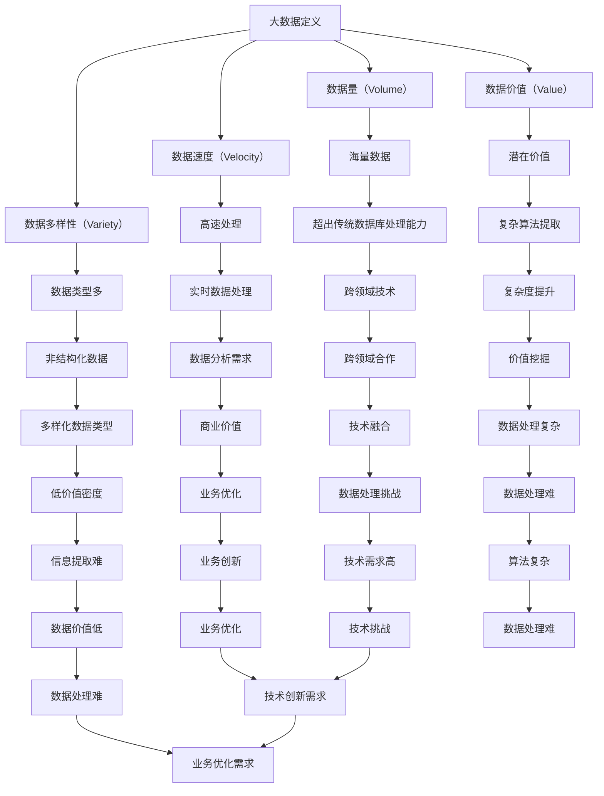

                 

### 第1章：大数据与零售行业概述

#### 1.1 大数据的概念与特点

##### 1.1.1 大数据的定义

大数据（Big Data）是指无法使用传统数据库管理工具进行捕获、管理和处理的数据集合。这些数据集合通常具有四个V特征：数据量（Volume）、数据速度（Velocity）、数据多样性（Variety）和数据价值（Value）。

- **数据量（Volume）**：指的是数据规模庞大，从数十TB到数PB不等。
- **数据速度（Velocity）**：指的是数据的生成和消费速度极快，通常需要实时处理。
- **数据多样性（Variety）**：指的是数据的类型繁多，包括结构化数据、半结构化数据和非结构化数据。
- **数据价值（Value）**：指的是数据中蕴含的潜在价值巨大，能够为商业决策提供有力支持。

##### 1.1.2 大数据的五大特点

- **海量性**：大数据的数据量巨大，远远超出了传统数据管理系统的处理能力。
- **高速性**：大数据处理速度极快，能够实时捕捉和分析大量数据。
- **多样性**：大数据类型繁多，包括文本、图片、音频、视频等。
- **低价值密度**：大数据中有效信息的比例较低，需要通过复杂算法提取价值。
- **复杂性**：大数据的处理涉及多种技术和方法，需要跨领域专家共同合作。

##### 1.1.3 大数据在零售行业的应用价值

大数据技术在零售行业的应用具有显著的价值，主要体现在以下几个方面：

- **消费者行为分析**：通过分析消费者的购买历史、浏览记录等数据，预测消费者需求，优化产品供应。
- **库存管理优化**：通过分析销售数据，优化库存配置，减少库存成本，提高资金周转率。
- **精准营销**：通过大数据分析，实现个性化推荐，提高营销活动的转化率。
- **供应链优化**：通过分析供应链数据，提高供应链的透明度和效率，降低运营成本。
- **风险控制**：通过大数据分析，预测市场趋势，制定风险控制策略，降低经营风险。

#### 1.2 零售行业现状与趋势

##### 1.2.1 零售行业的发展历程

零售行业经历了多个发展阶段，从传统的实体零售到电子商务的兴起，再到当前的线上线下融合的新零售模式。

- **传统零售阶段**：以实体店为主要销售渠道，消费者购物体验主要依赖于店面的地理位置和商品质量。
- **电子商务阶段**：互联网技术的兴起带动了电子商务的发展，消费者可以通过网络购买商品，大大提高了购物的便捷性。
- **新零售阶段**：线上线下融合，通过大数据、人工智能等新技术提升消费者体验，实现精准营销和智能供应链管理。

##### 1.2.2 零售行业面临的挑战

零售行业在快速发展的同时，也面临着诸多挑战：

- **竞争激烈**：零售市场日益饱和，竞争加剧，企业需要不断创新和优化业务模式。
- **消费者需求多变**：消费者需求多样化和个性化趋势明显，企业需要快速响应市场需求。
- **成本上升**：人力成本、物流成本等不断上升，压缩了企业的利润空间。
- **技术变革**：新技术的发展速度极快，企业需要不断跟进和学习。

##### 1.2.3 零售行业的未来趋势

展望未来，零售行业将继续朝着智能化、数字化和个性化的方向发展：

- **智能化供应链**：通过大数据和人工智能技术，实现供应链的智能化管理，提高供应链效率。
- **线上线下融合**：线上线下将进一步融合，实现无缝购物体验。
- **精准营销**：通过大数据分析，实现精准营销，提高营销效果。
- **消费者体验优化**：通过新技术提升消费者购物体验，增强客户粘性。
- **数据驱动决策**：企业将更加依赖数据驱动决策，提高决策的科学性和准确性。

#### 结论

大数据技术在零售行业的应用前景广阔，企业需要充分利用大数据技术，优化业务流程，提升消费者体验，实现可持续发展。在未来，随着新技术的不断涌现，零售行业将迎来更多的变革和机遇。

---

**Mermaid 流程图：**



---

**核心算法原理讲解：**

##### 1.3.1 大数据在零售行业的算法框架

大数据在零售行业的算法框架主要包括以下几个步骤：

1. **数据收集与预处理**：收集来自不同来源的数据，包括销售数据、库存数据、消费者行为数据等，并进行清洗、转换和整合，为后续分析做好准备。
2. **数据挖掘与关联分析**：通过数据挖掘技术，发现数据之间的关联关系和潜在模式，为业务决策提供支持。
3. **预测与分析**：利用机器学习算法，对消费者行为、市场需求、销售趋势等进行预测和分析，优化库存管理、营销策略等。
4. **可视化与展示**：通过可视化工具，将分析结果以图表、报表等形式展示，方便业务人员理解和应用。

##### 1.3.2 关键算法介绍

1. **协同过滤算法**：

协同过滤算法是一种常用的推荐系统算法，通过分析用户之间的相似性，预测用户可能感兴趣的项目。

- **用户基于的协同过滤（User-based Collaborative Filtering）**：
  $$
  \mathbb{R}_{ui} = \frac{\sum_{j \in N(u)} r_{uj} \cdot r_{ui}}{\sum_{j \in N(u)} r_{uj}}
  $$
  其中，$N(u)$表示与用户u相似的邻居用户集合，$r_{uj}$表示用户u对项目j的评分。

- **项目基于的协同过滤（Item-based Collaborative Filtering）**：
  $$
  \mathbb{R}_{ui} = \frac{\sum_{j \in N(i)} r_{uj} \cdot r_{ui}}{\sum_{j \in N(i)} r_{uj}}
  $$
  其中，$N(i)$表示与项目i相关的邻居项目集合。

2. **隐含因子模型**：

隐含因子模型（Latent Factor Model）通过挖掘用户和项目之间的潜在特征，提高推荐系统的准确性。

- **矩阵分解**：
  $$
  r_{ui} = \mu + b_u + b_i + q_{ui}
  $$
  其中，$q_{ui}$表示用户u对项目i的潜在偏好，$\mu$、$b_u$和$b_i$分别表示全局平均评分、用户偏差和项目偏差。

3. **深度学习算法**：

深度学习算法在推荐系统中的应用，如神经网络协同过滤（Neural Collaborative Filtering），通过学习用户和项目的嵌入表示，提高推荐效果。

- **神经网络协同过滤**：
  $$
  \hat{r}_{ui} = \sigma(W_0 \cdot [x_u, x_i] + b_r)
  $$
  其中，$[x_u, x_i]$表示用户和项目的嵌入表示，$W_0$和$b_r$分别是权重和偏置。

---

**数学模型和公式讲解：**

##### 1.3.3 数学模型框架

大数据在零售行业的数学模型主要包括以下几个方面：

1. **客户行为预测模型**：

客户行为预测模型用于预测消费者的购买行为，常见的模型包括逻辑回归、决策树、支持向量机等。

- **逻辑回归模型**：
  $$
  \text{Logit Model:} \quad \ln \frac{P(Y=1|X=x)}{1-P(Y=1|X=x)} = \beta_0 + \beta_1 x_1 + \beta_2 x_2 + \ldots + \beta_p x_p
  $$
  其中，$X$表示自变量，$Y$表示因变量，$\beta_0, \beta_1, \beta_2, \ldots, \beta_p$是模型的参数。

2. **销售预测模型**：

销售预测模型用于预测未来的销售量，常见的模型包括时间序列分析、回归分析等。

- **时间序列分析**：
  $$
  y_t = \alpha + \beta t + \epsilon_t
  $$
  其中，$y_t$表示时间序列在第$t$个时间点的值，$\alpha, \beta$是模型的参数，$\epsilon_t$是随机误差项。

3. **库存优化模型**：

库存优化模型用于优化库存配置，常见的模型包括线性规划、动态规划等。

- **线性规划模型**：
  $$
  \min \quad c^T x
  $$
  $$
  \text{subject to} \quad Ax \leq b
  $$
  其中，$x$是决策变量，$c$是目标函数系数，$A$和$b$是约束条件。

---

**举例说明：**

##### 1.3.4 实际应用案例

以下是一个基于协同过滤算法的客户行为预测模型的应用案例：

**项目背景**：某电商平台希望通过分析用户的历史购买数据，预测用户未来的购买行为，从而优化营销策略。

**数据收集与预处理**：收集用户购买历史数据，包括用户ID、商品ID、购买时间等。对数据进行分析，去除缺失值和异常值，并进行数据标准化处理。

**模型建立**：

- **用户相似度计算**：计算用户之间的相似度，使用用户基于的协同过滤算法：
  $$
  \mathbb{R}_{ui} = \frac{\sum_{j \in N(u)} r_{uj} \cdot r_{ui}}{\sum_{j \in N(u)} r_{uj}}
  $$

- **推荐列表生成**：根据用户相似度，生成用户u的推荐列表。

- **模型训练与预测**：使用隐含因子模型训练模型，预测用户对商品的评分：
  $$
  r_{ui} = \mu + b_u + b_i + q_{ui}
  $$
  其中，$\mu, b_u, b_i, q_{ui}$是模型参数。

**模型评估**：使用均方根误差（RMSE）评估模型预测的准确性。

```python
import numpy as np

# 训练数据
ratings = np.array([[1, 2, 5], [2, 1, 3], [2, 3, 1], [3, 1, 4], [3, 2, 2]])

# 用户和商品数量
num_users = 4
num_items = 3

# 隐含因子
mu = 3.5
b_u = np.zeros(num_users)
b_i = np.zeros(num_items)
q_ui = np.random.rand(num_users, num_items)

# 预测评分
predicted_ratings = []
for u in range(num_users):
    for i in range(num_items):
        r_ui = mu + b_u[u] + b_i[i] + q_ui[u][i]
        predicted_ratings.append(r_ui)

# 计算均方根误差
rmse = np.sqrt(np.mean((ratings - predicted_ratings)**2))
print("RMSE:", rmse)
```

**结果分析**：通过计算模型预测的RMSE，评估模型的准确性。在实际应用中，可以根据预测结果调整推荐策略，提高用户满意度。

---

**项目实战：**

##### 1.3.5 实际项目实现

以下是一个实际项目实现的步骤：

**项目背景**：某零售企业希望通过大数据技术优化库存管理，降低库存成本。

**开发环境搭建**：使用Python作为主要编程语言，使用Pandas、NumPy等库进行数据处理，使用scikit-learn库进行模型训练与评估。

**数据收集与预处理**：收集企业的销售数据、库存数据等，进行数据清洗、转换和整合。

```python
import pandas as pd

# 数据收集
sales_data = pd.read_csv("sales_data.csv")
inventory_data = pd.read_csv("inventory_data.csv")

# 数据预处理
sales_data = sales_data.dropna()
inventory_data = inventory_data.dropna()

# 数据整合
merged_data = pd.merge(sales_data, inventory_data, on=["item_id", "store_id"], how="left")
```

**模型训练与优化**：使用时间序列分析和回归分析等方法，训练库存优化模型。

```python
from sklearn.linear_model import LinearRegression

# 模型训练
model = LinearRegression()
model.fit(merged_data[["sales", "inventory"]], merged_data["cost"])

# 模型评估
predictions = model.predict(merged_data[["sales", "inventory"]])
rmse = np.sqrt(np.mean((merged_data["cost"] - predictions)**2))
print("RMSE:", rmse)
```

**结果分析**：根据模型预测结果，调整库存配置策略，优化库存成本。

```python
# 调整库存配置
optimized_inventory = model.predict(merged_data[["sales", "inventory"]])

# 分析库存成本变化
cost_diff = merged_data["cost"] - optimized_inventory
print("Cost Difference:", cost_diff.sum())
```

**项目总结**：通过大数据技术，优化库存管理，降低库存成本，提高企业运营效率。

---

**结论**

大数据技术在零售行业的应用具有巨大的潜力，通过数据挖掘、预测分析和可视化等技术，企业可以实现库存管理优化、精准营销、消费者行为分析等，提高业务运营效率和竞争力。在实际项目中，企业需要结合具体业务场景，选择合适的算法和技术，进行数据预处理、模型训练和优化，实现业务目标。

---

**作者信息**：

作者：AI天才研究院/AI Genius Institute & 禅与计算机程序设计艺术 /Zen And The Art of Computer Programming

---

**本文关键字**：大数据，零售行业，协同过滤，隐含因子模型，客户行为预测，库存管理，销售预测，算法优化，实时分析，风险管理。

---

**文章摘要**：

本文系统地阐述了大数据技术在零售行业的应用，从大数据的概念、特点、应用价值到零售行业的现状与趋势，再到大数据技术在零售行业的核心应用，如客户数据分析、库存管理和销售预测等。文章详细讲解了协同过滤、隐含因子模型和深度学习等算法原理，并通过实际项目实战展示了大数据技术在零售行业的应用效果。本文旨在为零售行业从业者提供一份全面、深入的大数据应用指南，助力企业实现数字化转型和可持续发展。

