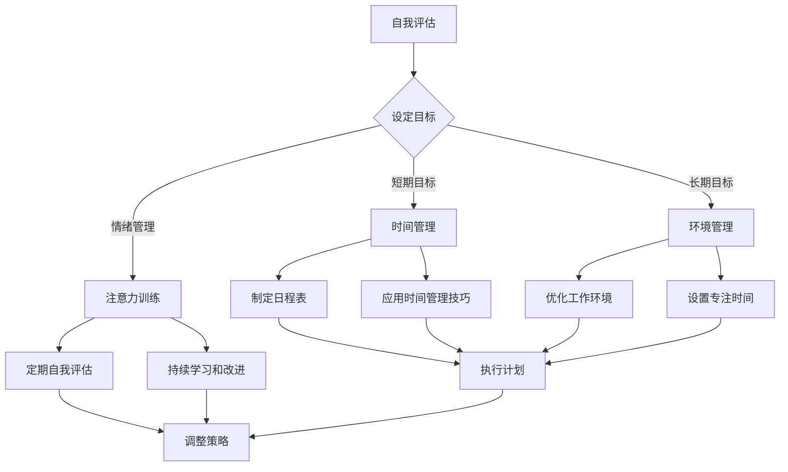

                 

### 《信息时代的注意力管理技术与实践：在干扰和信息过载中保持专注》

> **关键词**：注意力管理、信息过载、认知技术、时间管理、环境管理、实战案例、团队管理、组织层次

> **摘要**：本文深入探讨了信息时代下注意力管理的重要性及其面临的主要挑战。从理论基础到实际应用，文章系统介绍了注意力管理的技术和实践方法，并提供了个人与团队、组织层面的注意力管理策略。同时，文章还分析了注意力管理技术在现代组织中的实施趋势，为提升工作效率和专注力提供了有力指导。

### 第一部分：背景与理论基础

#### 第1章：信息时代下的注意力挑战

##### 1.1 信息过载对注意力的影响

在信息爆炸的时代，人们面临前所未有的信息过载挑战。每天，我们通过手机、电脑、电视等终端接收大量的信息，而这些信息往往质量参差不齐，分散了我们的注意力。信息过载不仅降低了我们的工作效率，还可能导致焦虑和疲劳。

研究表明，当信息过载发生时，大脑会进入“应激状态”，释放大量压力激素，如肾上腺素和皮质醇，从而影响我们的情绪和认知能力。长期的注意力分散和应激反应，可能导致记忆力下降、创造力减退，甚至影响身心健康。

##### 1.2 注意力管理的重要性

注意力管理是应对信息过载的关键。有效的注意力管理可以帮助我们更好地筛选信息，提高工作效率，减少心理压力。在信息时代，注意力管理不仅是个人成功的基石，也是团队和组织高效运作的保障。

注意力管理的重要性体现在以下几个方面：

1. **提高工作效率**：通过集中注意力，可以更快地完成任务，减少时间和资源的浪费。
2. **增强记忆力**：专注的状态有助于大脑更好地吸收和存储信息。
3. **提升创造力**：在不受干扰的环境中，人们更容易产生创新思维。
4. **改善心理健康**：减少压力和焦虑，提高生活满意度。

##### 1.3 注意力管理的基础理论

注意力管理涉及到多个学科，包括心理学、神经科学和认知科学。以下是一些关键的理论概念：

1. **注意力的定义与分类**：注意力是一种选择性地关注某些刺激而忽略其他刺激的能力。根据关注点的不同，注意力可以分为集中性注意力和分配性注意力。
2. **注意力的神经机制**：大脑的注意力系统由多个区域组成，如前额叶皮质、顶叶皮质和基底神经节等，这些区域协同工作，调节我们的注意力状态。
3. **注意力管理的心理学基础**：心理学研究表明，通过认知训练、冥想和睡眠等手段，可以提升注意力的质量和稳定性。

#### 第2章：注意力理论综述

##### 2.1 注意力的定义与分类

注意力是人类认知过程的重要组成部分，它决定了我们如何处理和响应外界信息。根据不同标准和维度，注意力可以有多种分类方法：

1. **根据关注点的不同**：
   - **集中性注意力（Focus Attention）**：也称为选择性注意力，是指将注意力集中在特定目标上，而忽略其他干扰信息。
   - **分配性注意力（Divided Attention）**：是指同时关注和操作多个任务或目标。

2. **根据注意力的主动性和被动性**：
   - **主动注意力（Voluntary Attention）**：是有意识、有目的地选择关注某些信息。
   - **被动注意力（Involuntary Attention）**：是非意识、自然发生的对某些特定信息的注意。

3. **根据注意力的持续时间**：
   - **短暂注意力（Short-term Attention）**：通常指5-20秒内保持的注意力状态。
   - **长期注意力（Long-term Attention）**：指能够持续数小时甚至更长时间的注意力状态。

##### 2.2 注意力的神经机制

注意力的神经机制是理解注意力管理的关键。大脑中的多个区域和神经网络共同作用，调节我们的注意力状态。以下是几个关键的结构和机制：

1. **前额叶皮质（Prefrontal Cortex）**：是注意力管理的重要中枢，负责规划、决策和执行控制。
2. **顶叶皮质（Parietal Cortex）**：参与空间注意力和视觉处理，帮助我们在不同的视觉场景中分配注意力。
3. **基底神经节（Basal Ganglia）**：是注意力调节的关键结构，涉及运动控制和习惯形成。

神经科学研究表明，大脑中的多种神经递质，如多巴胺、谷氨酸和乙酰胆碱等，也在调节注意力中发挥重要作用。

##### 2.3 注意力管理的心理学基础

心理学为注意力管理提供了丰富的理论基础和实践方法。以下是一些关键的概念和方法：

1. **认知控制（Cognitive Control）**：是指我们主动调节注意力，以完成任务或应对挑战的能力。研究表明，认知控制能力可以通过训练得到提升。
2. **工作记忆（Working Memory）**：是注意力管理的重要组成部分，它帮助我们暂存和操作信息。工作记忆的训练可以提高注意力的质量和稳定性。
3. **冥想（Meditation）**：作为一种心理训练方法，冥想已被证实可以改善注意力、情绪调节和心理健康。特别是正念冥想，强调对当前时刻的觉察，有助于减少干扰，提升专注力。
4. **睡眠（Sleep）**：充足的睡眠是保持注意力的重要条件。睡眠期间，大脑进行清理和整合，有助于恢复和提升注意力。

通过理解注意力的定义、神经机制和心理学基础，我们可以更好地掌握注意力管理的方法和技术，应对信息时代的挑战。

### 第二部分：注意力管理技术

#### 第3章：提升注意力的认知技术

##### 3.1 正念冥想与注意力训练

正念冥想是一种古老而有效的注意力训练方法，它强调对当前时刻的觉察，通过持续的练习，可以提升我们的专注力和注意力质量。以下是冥想对注意力改善的几个方面：

1. **提高集中性注意力**：冥想练习有助于我们更好地将注意力集中在特定任务或目标上，减少分心和干扰。
2. **增强分配性注意力**：通过冥想，我们可以学会如何在不同的任务之间灵活切换注意力，提高多任务处理能力。
3. **改善情绪调节**：正念冥想有助于减少焦虑和压力，提高情绪稳定性，从而提升注意力的质量和稳定性。

除了冥想，以下是一些具体的注意力训练方法：

1. **定时练习**：每天设定一定的时间进行冥想或专注练习，逐渐延长练习时间，以提高专注力。
2. **有意识练习**：在有干扰的环境中，有意识地专注于特定任务，逐渐增加练习难度。
3. **分散练习**：通过交替进行不同的练习，如视觉训练、听觉训练和认知训练，全面提高注意力。

##### 3.2 技术辅助注意力管理

现代技术的发展为我们提供了多种工具和应用程序，以辅助注意力管理。以下是一些常用的注意力追踪应用和工具：

1. **专注力追踪应用**：如Forest、Moment等，这些应用通过游戏化的方式，鼓励用户专注于特定任务，减少手机或其他设备的干扰。
2. **时间管理工具**：如Trello、Asana等，可以帮助我们合理安排工作任务，提高工作效率。
3. **专注力辅助工具**：如Noisli、White Noise等，提供背景噪音或自然声音，帮助用户创造一个专注的环境。

#### 3.2.1 注意力追踪应用

注意力追踪应用利用现代技术，实时监测和分析我们的注意力状态，为我们提供反馈和指导。以下是一些流行的注意力追踪应用：

1. **Forest**：通过种植虚拟树木的方式，鼓励用户专注于特定任务。如果在设定的时间内分心，树木会枯萎。
2. **Moment**：记录用户在应用程序和设备上的使用时间，提供详细的统计数据，帮助用户了解自己的时间使用情况。
3. **Headspace**：提供一系列冥想课程和指导，帮助用户提升专注力和心理健康。

##### 3.2.2 应用程序与工具介绍

以下是一些常用的注意力管理工具和应用，它们可以帮助我们在工作和生活中更好地管理注意力：

1. **Trello**：一款强大的项目管理工具，可以帮助团队和个人合理安排任务，提高工作效率。
2. **Asana**：与Trello类似，但更注重任务协作和团队沟通，适合大型项目和团队使用。
3. **Noisli**：提供多种自然声音和背景音乐，帮助用户创造一个专注的工作或学习环境。
4. **White Noise**：提供各种背景噪音选择，如雨声、海浪声等，有助于改善睡眠质量和专注力。

通过结合认知技术和现代技术工具，我们可以更有效地管理注意力，提升工作和生活质量。

### 第三部分：注意力管理策略

#### 第4章：注意力管理策略

有效的注意力管理不仅需要技术和工具的支持，还需要系统的策略和方法。本章将介绍几种常用的注意力管理策略，包括时间管理、环境管理和注意力恢复策略。

##### 4.1 时间管理技巧

时间管理是注意力管理的重要组成部分。以下是一些有效的时间管理技巧：

1. **帕累托原理（Pareto Principle）**：也称为80/20法则，指的是20%的时间和精力可以带来80%的效果。通过识别和专注于最重要的任务，可以提高工作效率和专注力。
2. **时间块划分策略**：将一天的时间划分为不同的时间段，每个时间段专注于特定任务。例如，将上午用于处理重要且紧急的任务，下午用于处理次要任务。这种策略有助于减少分心，提高专注力。

##### 4.2 环境管理技巧

环境对注意力管理具有重要影响。以下是一些环境管理技巧：

1. **减少干扰的环境设置**：在一个安静、整洁、光线适宜的环境中工作或学习，有助于减少外界干扰，提升专注力。
2. **高效工作空间设计**：设计一个符合人体工程学的工作空间，确保良好的坐姿和视线舒适度，有助于提高工作效率和专注力。

##### 4.3 注意力恢复策略

长时间的高强度工作或学习可能导致注意力疲劳。以下是一些注意力恢复策略：

1. **短暂休息与休息技巧**：每隔一段时间，进行短暂的休息，如站立、走动、呼吸练习等。这些活动有助于恢复大脑的活力，提升注意力。
2. **周期性任务与恢复策略**：将任务划分为短周期，每个周期后进行短暂的休息。这种策略有助于避免过度疲劳，保持高效的工作状态。

通过结合时间管理、环境管理和注意力恢复策略，我们可以更有效地管理注意力，提高工作效率和专注力。

#### 第5章：个人注意力管理实践

在本章中，我们将探讨个人注意力管理的实践方法，帮助读者制定和执行个人的注意力管理计划。以下是几个关键步骤：

##### 5.1 自我评估与目标设定

第一步是进行自我评估，了解自己的注意力现状和潜在问题。以下是一些自我评估的方法：

1. **记录日常活动**：记录每天的活动和时间分配，分析哪些任务消耗了最多的时间，哪些任务容易分散注意力。
2. **反思注意力波动**：思考在一天中哪些时间段注意力最为集中，哪些时间段容易分心。
3. **收集反馈**：向同事、朋友或家人寻求反馈，了解他们在与你互动时对你的注意力状态的评价。

在自我评估的基础上，设定明确的目标。这些目标可以是短期的，如每天专注工作2小时，或长期的，如提高多任务处理能力。确保目标具体、可衡量、可实现、相关性强和时间限定期（SMART原则）。

##### 5.2 个人注意力管理计划

一旦设定了目标，接下来是制定个人注意力管理计划。以下是几个关键步骤：

1. **制定日程表**：合理安排每天的时间，为重要的任务和休息时间设定具体的时间块。
2. **应用时间管理技巧**：使用帕累托原理和时间块划分策略，确保将时间分配给最重要的任务。
3. **优化工作环境**：确保工作环境安静、整洁，减少干扰因素。
4. **定期自我评估**：每周或每月进行一次自我评估，检查目标达成情况，并根据评估结果调整计划。
5. **持续学习和改进**：通过阅读相关书籍、参加培训课程或尝试新的技巧，不断提升自己的注意力管理能力。

通过以上步骤，个人可以制定和执行一个有效的注意力管理计划，从而提高工作效率和生活质量。

#### 第6章：团队注意力管理

在团队环境中，注意力管理不仅影响个人，还影响整个团队的效率和协作效果。以下是一些团队注意力管理的策略：

##### 6.1 团队注意力管理策略

1. **明确团队目标**：确保团队成员都清楚团队的目标和期望，这有助于团队成员集中精力在关键任务上。
2. **合理分配任务**：根据团队成员的能力和兴趣分配任务，确保任务与团队成员的专注力和技能相匹配。
3. **定期沟通和反馈**：通过定期的团队会议和个别沟通，确保团队成员了解任务进展和相互支持，减少信息不对称和误解。

##### 6.2 注意力管理在团队合作中的应用

1. **使用工具**：利用团队协作工具（如Trello、Asana）来跟踪任务进展和分配，确保团队成员专注于关键任务。
2. **设置专注时间**：在团队项目中，设定专注时间，如使用番茄工作法，每个专注周期后进行短暂休息，提高团队成员的专注力。
3. **减少会议时间**：确保会议高效、有针对性，减少不必要的会议，避免浪费团队成员的注意力。
4. **培养团队意识**：通过团队建设活动和培训，提高团队成员之间的信任和协作，增强团队的凝聚力和注意力管理能力。

通过有效的团队注意力管理策略，可以提高团队的整体工作效率和协作效果，为组织的成功奠定基础。

#### 第7章：注意力管理在组织中实施

在组织中，注意力管理不仅关乎个人和团队，还涉及组织的整体运营和战略。以下是如何在组织层次实施注意力管理的几个关键步骤：

##### 7.1 组织层次注意力管理

1. **制定组织政策**：组织应制定明确的注意力管理政策，如规定工作时间、休息时间、任务分配标准等，以支持员工专注于工作。
2. **提供培训和资源**：为员工提供注意力管理相关的培训和资源，如心理学书籍、冥想课程、时间管理工具等，帮助他们提升注意力管理能力。
3. **鼓励健康工作环境**：创造一个健康、无干扰的工作环境，如安静的办公空间、舒适的休息区域等，有助于员工保持专注。

##### 7.2 注意力管理在组织文化中的融入

1. **倡导价值观**：将注意力管理融入组织的核心价值观中，如强调专注、效率和创新，通过文化宣传和榜样示范，营造重视注意力管理的氛围。
2. **建立反馈机制**：设立反馈机制，让员工能够表达自己在注意力管理方面的困难和需求，组织可以根据反馈调整策略，提供更有效的支持。
3. **持续改进**：定期评估注意力管理策略的有效性，通过员工反馈和绩效指标，不断优化管理方法，确保组织在注意力管理方面的持续改进。

通过在组织层次实施注意力管理，组织可以提高整体工作效率和创新能力，为组织的长期发展奠定基础。

### 第四部分：注意力管理技术研究趋势

#### 第8章：注意力管理技术研究趋势

随着技术的不断进步，注意力管理技术也在不断创新和发展。以下是一些注意力管理技术的最新进展和未来发展趋势：

##### 8.1 现代注意力管理技术的最新进展

1. **人工智能与机器学习**：人工智能和机器学习技术正在被广泛应用于注意力管理，如通过分析用户行为数据，预测和干预注意力分散。
2. **虚拟现实（VR）与增强现实（AR）**：VR和AR技术提供了一种全新的注意力管理方式，通过沉浸式体验帮助用户集中注意力。
3. **神经反馈**：利用脑电图（EEG）和其他神经信号技术，实时监测大脑活动，提供个性化的注意力训练和反馈。

##### 8.2 未来注意力管理的发展方向

1. **个性化注意力管理**：未来的注意力管理技术将更加个性化，根据用户的个体差异，提供定制化的注意力训练和干预方案。
2. **跨学科融合**：注意力管理技术将融合心理学、神经科学、认知科学等多个学科，形成更加全面和深入的理论体系。
3. **生物技术融合**：结合生物技术和医疗设备，开发新的注意力管理工具，如通过基因编辑或神经植入技术，提升注意力质量。

通过关注注意力管理技术的最新进展和未来趋势，我们可以期待更高效、更智能的注意力管理解决方案，为信息时代的工作和生活带来更多便利。

### 附录

#### 附录A：注意力管理资源与工具

在本附录中，我们将介绍一些主要的注意力管理资源和工具，以帮助读者深入了解和实施注意力管理策略。

##### A.1 主要注意力管理资源

1. **书籍**：
   - 《专注力：如何控制你的注意力，提高工作效率》（Focus: The Hidden Driver of Excellence）- Daniel Goleman
   - 《如何掌控你的注意力：从分心到专注的实用策略》（The Power of Focus: How to Hit Your Business, Personal and Financial Targets with Absolute Confidence and Certainty）- Jack Canfield

2. **在线课程和讲座**：
   - Coursera上的“注意力心理学”（The Science of Well-Being）-  Yale University
   - Udemy上的“冥想与正念”（Meditation and Mindfulness）- Multiple Instructors

##### A.2 常用注意力管理工具介绍

1. **专注力追踪应用**：
   - Forest（https://wwweforestapp.com/）
   - Moment（https://www.usemoment.com/）

2. **时间管理工具**：
   - Trello（https://trello.com/）
   - Asana（https://asana.com/）

3. **冥想与应用工具**：
   - Headspace（https://www.headspace.com/）
   - Calm（https://www.calm.com/）

这些资源和工具将为读者提供丰富的知识和技术支持，帮助他们在实践中更好地管理注意力。

#### 附录B：注意力管理流程图

在本附录中，我们将使用Mermaid流程图来展示注意力管理的流程。以下是注意力管理流程的简图：



#### 附录C：核心算法原理

在本附录中，我们将深入探讨注意力管理中的核心算法原理，包括注意力机制的概述和数学模型，以及注意力算法的实现和代码解读。

##### C.1.1 注意力机制的概述

注意力机制是一种在计算机视觉、自然语言处理等领域广泛应用的技术，它模拟了人类大脑对信息的筛选和关注能力。注意力机制的核心思想是通过调整不同信息的重要性，实现对任务关键部分的关注。

##### C.1.2 注意力机制的数学模型

以下是一个简化的注意力机制的数学模型，用于说明注意力分配的过程：

$$
Attention(x) = \sigma(W_{1}x + b_{1})
$$

其中，\( x \) 表示输入信息，\( W_{1} \) 和 \( b_{1} \) 分别是权重和偏置，\( \sigma \) 是激活函数，如Sigmoid函数。

##### C.2.1 注意力算法的实现

以下是一个简化的注意力算法实现，使用Python语言：

```python
import numpy as np

def attention Mechanism(inputs, weights, bias):
    # inputs: 输入数据，形状为（batch_size, sequence_length, hidden_size）
    # weights: 权重，形状为（sequence_length, 1）
    # bias: 偏置，形状为（1,）

    # 计算加权求和
    weighted_sum = np.dot(inputs, weights) + bias

    # 应用激活函数（Sigmoid）
    activation = 1 / (1 + np.exp(-weighted_sum))

    # 返回激活值
    return activation
```

##### C.2.2 注意力算法的代码解读与分析

在上面的代码中，`attention_Mechanism` 函数实现了注意力分配的核心逻辑：

1. `inputs`：表示输入数据，可以是文本、图像或其他形式的数据。在神经网络中，通常是一个三维数组，表示批次、序列长度和隐藏层大小。
2. `weights`：表示序列中的每个元素的重要性。在训练过程中，通过优化权重来调整不同元素的重要性。
3. `bias`：表示偏置，用于调整加权求和的结果。
4. `weighted_sum`：计算每个输入元素与对应权重乘积后的加和。
5. `activation`：通过应用Sigmoid激活函数，将加权求和结果转换为注意力分配的概率分布。

通过上述步骤，注意力机制可以动态调整输入数据的权重，实现对关键信息的关注，从而提高任务处理的效率和准确性。

通过理解注意力机制的原理和算法实现，我们可以更好地利用注意力管理技术，提升信息处理和决策能力。

### 结论

本文详细探讨了信息时代的注意力管理，从背景与理论基础、注意力管理技术、注意力管理策略到实战案例分析，全面解析了如何应对信息过载和干扰，提升个人和团队的专注力。注意力管理不仅关乎个人工作效率和心理健康，也对组织整体运营和发展具有重要意义。通过结合认知技术、现代工具和有效的管理策略，我们可以更好地掌控注意力，提升工作和生活质量。未来的注意力管理研究将更加关注个性化、跨学科融合和生物技术，为信息时代带来更多创新和便利。

### 作者信息

**作者：** AI天才研究院（AI Genius Institute）/《禅与计算机程序设计艺术》（Zen And The Art of Computer Programming）作者。

AI天才研究院致力于推动人工智能和计算机科学的发展，通过深入研究和创新实践，为信息时代的注意力管理提供有力支持。《禅与计算机程序设计艺术》作者则以其深厚的技术功底和独特的见解，为读者提供了关于注意力管理的宝贵智慧和启示。

