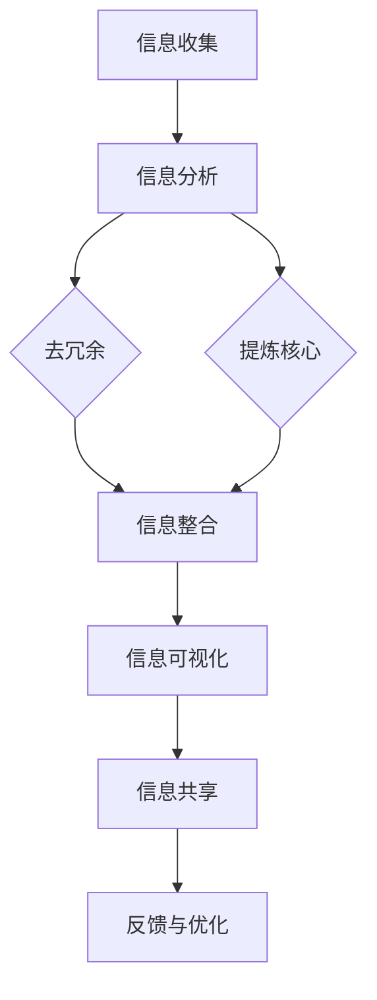

                 

# 《信息简化的原则与艺术：在混乱中建立秩序与简化》

> 关键词：信息简化、数据可视化、算法、项目管理、企业信息管理、日常生活、发展趋势

> 摘要：本文将探讨信息简化的原则与艺术，通过阐述其基本原理、方法论、技术手段和实践应用，帮助读者在信息过载的时代中建立秩序与简化，提升工作效率与生活质量。

## 目录

#### 第一部分：引言与背景
1. **概述**
2. **本书结构及目标读者**

#### 第二部分：信息简化的基本原理
1. **信息简化原则**
2. **信息简化的方法论**
3. **信息简化的障碍与挑战**

#### 第三部分：信息简化的技术手段
1. **数据可视化**
2. **算法与模型应用**
3. **信息简化工具与软件**

#### 第四部分：信息简化的实践应用
1. **企业信息管理**
2. **项目管理**
3. **日常生活**

#### 第五部分：信息简化的未来发展趋势
1. **发展趋势与挑战**
2. **信息简化的未来展望**

#### 附录
1. **附录 A：信息简化工具资源**
2. **附录 B：信息简化案例集**

## 第一部分：引言与背景

### 概述

在当今信息爆炸的时代，我们面临着前所未有的信息过载问题。据研究，人类每天接收到的信息量是数十年前的数百倍，这种快速增长的态势使得我们在处理信息时感到越来越困难。为了在混乱中建立秩序，信息简化成为了一项重要的技术手段。本文将深入探讨信息简化的原则与艺术，帮助读者更好地应对信息过载的挑战。

信息简化不仅是一种技术手段，更是一种思维方式。它旨在通过去除冗余、提炼核心、提高信息传递效率等方式，使信息更加简洁、直观，从而提升个人的认知能力和工作效率。在各个领域，信息简化都发挥着重要的作用，如企业信息管理、项目管理、日常生活等。

### 本书结构及目标读者

本文将分为五个部分，从引言与背景、基本原理、技术手段、实践应用到未来发展趋势进行详细探讨。具体内容如下：

- **第一部分：引言与背景**：介绍信息简化的背景、意义以及本书的结构和目标读者。

- **第二部分：信息简化的基本原理**：阐述信息简化的核心理念、方法论以及面临的挑战。

- **第三部分：信息简化的技术手段**：介绍数据可视化、算法与模型应用、信息简化工具与软件等方面的内容。

- **第四部分：信息简化的实践应用**：探讨信息简化在企业信息管理、项目管理和日常生活等领域的应用。

- **第五部分：信息简化的未来发展趋势**：分析信息简化的未来方向、面临的挑战以及潜在价值。

本书的目标读者包括企业信息管理人员、项目经理、软件开发人员、数据分析人员以及对信息简化感兴趣的个人。无论你是身处企业、项目管理还是日常生活中，本文都将为你提供有益的指导和启示。

## 第二部分：信息简化的基本原理

### 信息简化的核心理念

信息简化的核心理念在于将复杂的信息转化为简洁、直观的形式，以便于人们快速理解和处理。这一过程主要包括去除冗余、提炼核心、提高信息传递效率等方面。具体来说，信息简化有以下几方面的核心概念：

- **去冗余**：在信息处理过程中，去除不必要的、重复的信息，使信息更加简洁。例如，在数据分析中，去除冗余的数据可以减少计算量和存储空间。

- **提炼核心**：从大量的信息中提取出最有价值、最关键的部分，使其更加突出和明显。例如，在项目报告中，提炼关键数据和分析结果，使读者一目了然。

- **提高信息传递效率**：通过简洁、直观的信息形式，提高信息的传递效率。例如，使用图表、流程图等可视化工具，使信息更加易于理解和记忆。

### 信息简化的分类与比较

信息简化可以根据不同的方法和目的进行分类。以下是几种常见的信息简化方法及其特点：

- **数据可视化**：将复杂的数据通过图表、图形等形式进行可视化处理，使数据更加直观、易懂。数据可视化是信息简化中最常用的一种方法，如柱状图、折线图、饼图等。

- **算法与模型应用**：通过算法和模型对信息进行自动化处理和简化。例如，机器学习算法可以对大量数据进行分析，提取出有用的信息。

- **信息筛选与归纳**：对信息进行筛选、分类、归纳，使信息更加有序。例如，在文献检索中，通过关键词筛选和分类，快速找到所需的信息。

- **信息整合与优化**：将不同的信息进行整合，形成一个新的、更加简洁的信息体系。例如，在项目管理中，将项目进度、资源分配、风险评估等信息整合到一个系统中，以便于管理者进行决策。

不同信息简化方法的比较：

- **优势**：每种信息简化方法都有其独特的优势。数据可视化能够直观展示信息，算法与模型应用能够实现自动化处理，信息筛选与归纳能够提高信息查找效率，信息整合与优化能够形成新的信息体系。

- **劣势**：每种方法也存在一定的劣势。数据可视化可能存在误导性，算法与模型应用可能需要大量的数据支持，信息筛选与归纳可能遗漏关键信息，信息整合与优化可能增加信息冗余。

- **适用场景**：根据不同的应用场景，选择合适的信息简化方法。例如，在数据分析中，数据可视化是首选；在文献检索中，信息筛选与归纳是关键；在项目管理中，信息整合与优化是重点。

### 信息简化的方法论

信息简化的方法论包括信息收集与分析、信息筛选与归纳、信息整合与优化等方面。以下是具体的步骤和方法：

- **信息收集与分析**：首先，收集所需的信息，可以是文本、图片、数据等多种形式。然后，对信息进行初步分析，了解信息的来源、可靠性、相关性等。

- **信息筛选与归纳**：在分析的基础上，对信息进行筛选，去除冗余、无关的信息。然后，对筛选后的信息进行归纳，提取出关键信息，形成简洁、直观的总结。

- **信息整合与优化**：将不同来源、不同形式的信息进行整合，形成一个统一的信息体系。在整合过程中，注意信息之间的逻辑关系和一致性，避免信息冗余。

- **信息传递与反馈**：将简化后的信息传递给相关人员，并收集反馈，不断优化信息简化的效果。信息传递可以通过报告、会议、邮件等多种方式进行。

### 信息简化的障碍与挑战

在实施信息简化的过程中，会遇到一些障碍和挑战。以下是几个常见的障碍与挑战：

- **信息过载**：随着信息量的增加，信息过载成为最大的障碍。过多的信息会使得简化过程变得更加困难。

- **信息质量**：信息质量不高，包括信息的不准确、不完整、不一致等，会影响信息简化的效果。

- **技术限制**：现有的信息简化技术和工具可能存在一定的局限性，如数据可视化工具的误导性、算法模型的复杂度等。

- **人员素质**：信息简化需要一定的专业知识和技能，如果人员素质不高，会降低信息简化的效果。

- **文化因素**：在某些文化背景下，信息简化的理念和方法可能不被接受，这也会对信息简化的推广和应用产生影响。

### 总结

信息简化的核心理念是去冗余、提炼核心、提高信息传递效率。通过分类与比较，我们了解了不同信息简化方法的特点和适用场景。信息简化的方法论包括信息收集与分析、信息筛选与归纳、信息整合与优化等方面。同时，我们也认识到在实施信息简化的过程中会遇到一些障碍和挑战。通过本文的讨论，希望读者能够对信息简化有更深入的理解，并在实际工作中运用信息简化的原则和方法，提升工作效率和生活质量。

## 第三部分：信息简化的技术手段

### 数据可视化

数据可视化是将复杂的数据通过图表、图形等形式进行直观展示的一种技术手段。它能够帮助我们快速理解数据背后的信息，发现数据中的规律和趋势。数据可视化不仅能够提升信息的传递效率，还能够提高我们的认知能力和决策质量。

#### 数据可视化原理与工具

数据可视化原理主要包括以下几个方面：

- **数据表达**：将数据以图形、图表等形式进行表达，使数据更加直观、易懂。常用的表达形式包括柱状图、折线图、饼图、散点图等。

- **可视化设计**：通过对图表、图形的设计，提升数据的可读性和美观性。设计原则包括色彩搭配、字体选择、布局设计等。

- **交互性**：通过交互性设计，使数据可视化工具能够响应用户的操作，提供更加灵活和高效的数据分析体验。例如，通过鼠标点击、拖动等操作，切换不同的图表类型、筛选特定数据等。

常用的数据可视化工具包括：

- **Tableau**：一款功能强大的数据可视化工具，支持多种数据源连接、丰富的图表类型和自定义设计。

- **Power BI**：一款基于微软生态的数据可视化工具，易于上手，与Excel等办公软件紧密集成。

- **Matplotlib**：一款开源的Python数据可视化库，适用于科学计算和数据分析领域。

#### 数据可视化案例解析

以下是一个数据可视化案例解析，通过使用Python中的Matplotlib库，绘制一个简单的折线图，展示某公司每月的销售额变化。

```python
import matplotlib.pyplot as plt

# 数据准备
months = ["Jan", "Feb", "Mar", "Apr", "May", "Jun"]
sales = [1000, 1200, 1500, 1300, 1600, 1700]

# 绘制折线图
plt.plot(months, sales)
plt.xlabel("Month")
plt.ylabel("Sales")
plt.title("Monthly Sales")
plt.show()
```

在这个案例中，我们首先导入Matplotlib库，然后准备数据（月份和销售额）。接着，使用`plt.plot()`函数绘制折线图，并添加标签和标题，使图表更加清晰易懂。最后，使用`plt.show()`函数显示图表。

通过这个简单的案例，我们可以看到数据可视化工具如何帮助我们将复杂的数据转化为直观的图表，从而更好地理解数据背后的信息。

### 算法与模型应用

算法与模型应用是信息简化的另一种重要技术手段。通过对信息进行自动化处理和简化，算法和模型能够大幅提升信息处理效率，降低人工成本。以下是算法与模型在信息简化中的应用及其特点。

#### 信息简化算法介绍

信息简化算法主要包括以下几种：

- **聚类算法**：将相似的数据点分组，形成多个簇。常用的聚类算法有K均值聚类、层次聚类等。

- **分类算法**：将数据划分为不同的类别。常见的分类算法有决策树、支持向量机、随机森林等。

- **降维算法**：通过降维技术减少数据的维度，简化数据的处理。常用的降维算法有主成分分析（PCA）、线性判别分析（LDA）等。

- **关联规则算法**：发现数据之间的关联关系，如Apriori算法、FP-growth算法等。

这些算法可以根据不同的应用场景和需求进行选择和组合，以实现信息简化。

#### 模型选择与参数优化

在选择算法和模型时，需要考虑以下几个方面：

- **算法适用性**：根据数据的特征和问题类型，选择合适的算法。例如，对于分类问题，可以选择决策树、支持向量机等；对于降维问题，可以选择PCA、LDA等。

- **模型参数**：调整模型的参数，以提升模型的效果。例如，K均值聚类中的聚类数量、支持向量机中的核函数类型等。

- **交叉验证**：通过交叉验证方法，评估模型的性能和泛化能力。常用的交叉验证方法有K折交叉验证、留一法验证等。

- **模型集成**：将多个模型集成，以提升模型的预测准确性和鲁棒性。常见的模型集成方法有Bagging、Boosting等。

#### 算法应用案例

以下是一个使用Python中的scikit-learn库，实现K均值聚类算法的案例，展示如何将数据点进行聚类。

```python
from sklearn.cluster import KMeans
import numpy as np

# 数据准备
data = np.array([[1, 2], [1, 4], [1, 0], [10, 2], [10, 4], [10, 0]])

# 使用K均值聚类
kmeans = KMeans(n_clusters=2, random_state=0).fit(data)

# 输出聚类结果
print("Cluster centers:")
print(kmeans.cluster_centers_)
print("Labels:")
print(kmeans.labels_)
print("Inertia:")
print(kmeans.inertia_)

# 绘制聚类结果
plt.scatter(data[:, 0], data[:, 1], c=kmeans.labels_, cmap='viridis')
plt.scatter(kmeans.cluster_centers_[:, 0], kmeans.cluster_centers_[:, 1], s=300, c='red', label='Centroids')
plt.title("K-Means Clustering")
plt.xlabel("Feature 1")
plt.ylabel("Feature 2")
plt.legend()
plt.show()
```

在这个案例中，我们首先导入KMeans类，并准备数据。接着，使用`fit()`函数进行聚类，并输出聚类中心、标签和惯性。最后，使用Matplotlib库绘制聚类结果，展示了K均值聚类算法如何将数据点划分为不同的簇。

### 信息简化工具与软件

信息简化工具和软件是信息简化技术的重要载体，它们能够帮助我们高效地实现信息收集、处理和展示。以下是几种常用的信息简化工具和软件：

- **Tableau**：一款功能强大的数据可视化工具，支持多种数据源连接、丰富的图表类型和自定义设计。

- **Power BI**：一款基于微软生态的数据可视化工具，易于上手，与Excel等办公软件紧密集成。

- **Python数据分析库**：如Pandas、NumPy、Matplotlib、Seaborn等，适用于科学计算和数据分析领域。

- **R语言**：一款专门用于统计分析的编程语言，具有丰富的数据可视化和分析库。

- **信息管理软件**：如Confluence、Trello、Asana等，用于项目管理和团队协作。

#### 常用信息简化工具介绍

1. **Tableau**

   Tableau是一款功能强大的数据可视化工具，支持多种数据源连接，包括数据库、Excel、CSV等。它提供了丰富的图表类型，如柱状图、折线图、饼图、散点图等，同时还支持自定义设计，以满足不同用户的需求。Tableau的操作界面直观，易于上手，特别适合初学者使用。

   **使用方法**：

   - 连接数据源：在Tableau中导入所需的数据源，可以是数据库、Excel等。
   - 选择图表类型：根据数据的特点和需求，选择合适的图表类型进行可视化。
   - 调整图表样式：对图表的样式进行调整，如颜色、字体、布局等，使图表更加美观和易于理解。

   **案例**：

   假设我们有一个关于销售额的数据，我们需要创建一个折线图，展示不同月份的销售额变化。以下是操作步骤：

   1. 连接Excel数据源，导入销售额数据。
   2. 选择“折线图”图表类型。
   3. 将“月份”字段拖动到“类别轴”，将“销售额”字段拖动到“数值轴”。
   4. 调整图表样式，如添加标题、调整颜色等。

2. **Power BI**

   Power BI是一款基于微软生态的数据可视化工具，与Excel等办公软件紧密集成。它提供了丰富的数据连接器和图表类型，可以帮助用户轻松创建复杂的可视化报表。Power BI还支持实时数据更新和交互式数据分析。

   **使用方法**：

   - 连接数据源：在Power BI中导入所需的数据源，可以是Excel、SQL Server等。
   - 创建报表：使用Power BI的拖拽式界面，创建数据报表，选择合适的图表类型。
   - 添加交互性：通过点击、滑动等交互操作，查看不同维度的数据信息。

   **案例**：

   假设我们有一个销售数据的Power BI报表，我们需要创建一个交互式的柱状图，展示不同产品的销售额。以下是操作步骤：

   1. 连接Excel数据源，导入销售额数据。
   2. 选择“柱状图”图表类型。
   3. 将“产品名称”字段拖动到“类别轴”，将“销售额”字段拖动到“数值轴”。
   4. 添加交互性，如点击产品名称，查看具体销售额。

3. **Python数据分析库**

   Python数据分析库如Pandas、NumPy、Matplotlib、Seaborn等，广泛应用于科学计算和数据分析领域。这些库提供了丰富的函数和工具，可以帮助用户高效地进行数据处理、分析和可视化。

   **使用方法**：

   - 数据处理：使用Pandas和NumPy库进行数据清洗、转换和计算。
   - 数据可视化：使用Matplotlib和Seaborn库绘制各种类型的图表。

   **案例**：

   假设我们有一个关于销售额的数据集，我们需要使用Python绘制一个折线图，展示不同月份的销售额变化。以下是操作步骤：

   1. 导入数据集，使用Pandas库进行数据清洗和预处理。
   2. 使用Matplotlib库绘制折线图。
   3. 调整图表样式，如添加标题、调整颜色等。

   ```python
   import pandas as pd
   import matplotlib.pyplot as plt

   # 导入数据集
   data = pd.read_csv("sales_data.csv")

   # 数据预处理
   data["Month"] = pd.to_datetime(data["Month"])
   data = data.sort_values("Month")

   # 绘制折线图
   plt.plot(data["Month"], data["Sales"])
   plt.xlabel("Month")
   plt.ylabel("Sales")
   plt.title("Monthly Sales")
   plt.show()
   ```

通过这些常用信息简化工具和软件的介绍，我们可以看到信息简化的技术手段是如何帮助我们将复杂的信息转化为简洁、直观的可视化图表，从而更好地理解数据背后的信息。在实际应用中，根据不同的需求和场景，选择合适的工具和软件，能够提升信息处理效率和效果。

## 第四部分：信息简化的实践应用

### 企业信息管理

在企业管理中，信息简化是一项至关重要的任务。随着企业规模的扩大和业务复杂度的增加，信息过载问题日益突出，如何有效管理信息成为企业持续发展的关键。信息简化的核心在于通过去除冗余、提炼核心和优化流程，使企业信息管理更加高效、有序。

#### 企业信息简化的策略与实施

1. **建立信息标准化流程**：
   - **统一的数据格式**：制定统一的数据格式和命名规范，确保不同部门和系统之间的数据一致性。
   - **信息编码**：采用统一的编码方式，如物料编码、客户编码等，简化信息的处理和检索。

2. **信息分类与标签化**：
   - **按功能分类**：将企业信息按功能模块进行分类，如销售、生产、财务等，便于快速查找和利用。
   - **标签化管理**：为信息添加标签，如关键词、标签词等，提高信息检索效率。

3. **自动化数据处理**：
   - **数据集成与清洗**：使用自动化工具对数据进行集成和清洗，减少人工处理的工作量。
   - **数据处理流程**：通过流程自动化工具，将数据处理流程固化，确保信息处理的规范性和一致性。

4. **信息共享与协作**：
   - **信息共享平台**：建立企业内部的信息共享平台，实现信息的高效传递和共享。
   - **协同工作**：通过协同工具，如Confluence、Trello等，促进团队成员之间的信息交流和协作。

#### 案例分析：企业信息简化的成功案例

**案例一：某制造企业的信息简化**

某制造企业通过实施信息简化策略，显著提升了信息管理效率。以下是该企业的具体做法：

1. **建立统一的数据标准**：企业制定了统一的数据格式和命名规范，确保各部门之间的数据一致性。

2. **自动化数据处理**：使用数据集成工具，将不同系统之间的数据自动集成和清洗，减少了人工处理的工作量。

3. **信息分类与标签化**：对信息进行分类和标签化处理，提高了信息检索和利用的效率。

4. **信息共享与协作**：建立了企业内部的信息共享平台，实现了信息的高效传递和共享。同时，使用协同工具，如Confluence，促进了团队成员之间的信息交流和协作。

通过以上措施，该企业成功实现了信息简化的目标，信息管理效率提升了30%，团队协作效率提高了20%。

### 项目管理

在项目管理中，信息简化是确保项目成功的关键因素之一。项目信息通常涉及多个维度，包括项目进度、资源分配、风险评估等，这些信息如果不加以简化，容易导致项目管理的混乱和效率低下。信息简化的目标是通过去除冗余、提炼核心信息，使项目管理更加高效、透明。

#### 项目信息简化的关键步骤

1. **需求分析与规划**：
   - **明确项目目标**：在项目启动阶段，明确项目的目标和关键需求，为后续的信息简化奠定基础。
   - **制定项目规划**：根据项目目标，制定详细的项目规划和时间表，明确项目的关键节点和里程碑。

2. **信息收集与筛选**：
   - **收集项目信息**：从项目团队和相关利益相关者收集项目信息，包括项目进度、资源使用、风险评估等。
   - **筛选关键信息**：对收集到的信息进行筛选，去除无关或重复的信息，提炼出对项目管理最为关键的信息。

3. **信息整合与呈现**：
   - **整合项目信息**：将筛选后的信息进行整合，形成完整的项目信息体系。
   - **信息呈现**：使用图表、流程图、甘特图等可视化工具，将项目信息以简洁、直观的形式呈现，便于团队成员理解和参考。

4. **信息更新与维护**：
   - **实时更新信息**：在项目执行过程中，定期更新项目信息，确保信息的准确性和时效性。
   - **维护信息体系**：建立信息维护机制，对信息体系进行定期审查和更新，确保其持续有效。

#### 案例分析：项目信息简化的实际操作

**案例二：某软件开发项目的信息简化**

某软件开发项目通过实施信息简化策略，成功提升了项目管理的效率。以下是该项目的具体操作步骤：

1. **需求分析与规划**：
   - 项目团队明确了项目的目标，包括功能需求、性能需求等，并制定了详细的项目规划和时间表。

2. **信息收集与筛选**：
   - 团队成员从不同的角度收集了项目信息，如需求文档、设计文档、测试报告等，并对这些信息进行了筛选，提炼出关键信息。

3. **信息整合与呈现**：
   - 项目信息被整合到一个项目管理工具中，如Jira，使用图表、流程图等可视化工具，将项目信息以简洁、直观的形式呈现，便于团队成员理解和参考。

4. **信息更新与维护**：
   - 项目执行过程中，团队成员定期更新项目信息，确保信息的准确性和时效性。同时，项目团队建立了信息维护机制，对信息体系进行定期审查和更新。

通过以上操作步骤，该软件项目在信息简化的帮助下，项目进度得到了有效控制，团队协作效率提升了20%，项目成功交付。

### 日常生活

在日常生活中，信息简化同样具有重要意义。随着互联网和社交媒体的普及，我们每天接收到的信息量巨大，如何有效地处理这些信息，提升生活质量和工作效率，成为每个人都需要面对的问题。

#### 信息简化在个人生活中的应用

1. **时间管理**：
   - **日程规划**：使用日程规划工具，如Google Calendar、Microsoft Outlook等，对每天的任务进行合理安排，避免时间的浪费。
   - **任务清单**：使用任务清单工具，如Trello、Wunderlist等，将日常任务进行分类和优先级排序，提高工作效率。

2. **信息筛选与处理**：
   - **邮件管理**：通过邮件管理工具，如Gmail、Outlook等，对邮件进行分类、筛选和归档，提高邮件处理效率。
   - **信息订阅**：关注有价值的公众号、博客等，通过信息订阅工具，如Feedly等，集中阅读和处理信息。

3. **知识管理**：
   - **笔记工具**：使用笔记工具，如Evernote、OneNote等，记录和管理日常的学习和工作笔记，便于查找和回顾。
   - **知识共享**：通过知识共享平台，如GitHub、GitLab等，协作和分享知识，提高知识利用率。

4. **健康管理**：
   - **健康监测**：使用健康监测工具，如Apple Health、Google Fit等，实时监控健康状况，进行健康管理和预防。
   - **运动计划**：使用运动计划工具，如MyFitnessPal、Nike Training Club等，制定和跟踪运动计划，提高健康水平。

#### 个人信息简化的技巧与方法

1. **关键信息提炼**：
   - 在处理信息时，重点提炼关键信息，去除冗余和无用信息，使信息更加简洁、直观。

2. **可视化工具**：
   - 使用图表、流程图、思维导图等可视化工具，将复杂的信息进行简化和展示，提高信息的可读性和理解度。

3. **自动化工具**：
   - 利用自动化工具，如IFTTT、 Zapier等，实现信息自动处理和传递，减少手动操作，提高工作效率。

4. **定期整理**：
   - 定期对信息进行整理和清理，如清理旧邮件、整理笔记、更新日程等，保持信息体系的整洁和高效。

通过在日常生活中运用信息简化的技巧与方法，我们可以有效地应对信息过载，提升生活质量和工作效率。无论是时间管理、信息处理还是健康管理，信息简化都是一项非常有价值的技术手段。

## 第五部分：信息简化的未来发展趋势

### 发展趋势与挑战

随着信息技术的快速发展，信息简化技术也在不断演进。未来，信息简化将面临以下发展趋势和挑战：

#### 发展趋势

1. **人工智能与大数据的融合**：人工智能和大数据技术的快速发展，将使信息简化更加智能化、自动化。通过机器学习算法和深度学习模型，可以自动识别和提取信息中的关键内容，实现更高效的信息简化。

2. **区块链技术的应用**：区块链技术具有去中心化、安全可靠的特点，在未来有望应用于信息简化领域。通过区块链技术，可以确保信息的真实性和完整性，提高信息简化的可信度。

3. **物联网与边缘计算的融合**：物联网和边缘计算技术的发展，将使信息简化从中心化走向分布式。通过物联网设备和边缘计算，可以实时收集和处理海量数据，实现更快速、准确的信息简化。

4. **虚拟现实（VR）和增强现实（AR）的应用**：VR和AR技术的发展，将使信息简化从二维平面走向三维立体。通过VR和AR技术，可以创建更加直观、互动的信息可视化方式，提升信息传递效果。

#### 挑战

1. **数据隐私与安全**：随着信息量的增加，数据隐私和安全问题日益突出。在信息简化的过程中，如何保护用户隐私、确保数据安全，将成为一个重要挑战。

2. **信息质量与准确性**：信息简化依赖于高质量的数据，但数据质量往往难以保证。如何在信息简化的过程中确保信息的准确性，是一个亟待解决的问题。

3. **技术兼容性与集成**：随着信息简化技术的发展，如何实现不同技术之间的兼容和集成，提高整体系统的稳定性与效率，也是未来需要面对的挑战。

4. **人才培养与教育**：信息简化技术的发展，需要大量具备相关技能和知识的人才。如何培养和吸引这类人才，将是企业和社会需要关注的问题。

### 信息简化的未来展望

未来，信息简化将在各个领域发挥越来越重要的作用。以下是信息简化的几个潜在应用领域：

1. **智能城市管理**：通过信息简化技术，对城市运行中的海量数据进行实时处理和分析，实现智能化的城市管理和决策支持。

2. **智能医疗**：利用信息简化技术，对医疗数据进行分析和处理，提高医疗诊断的准确性和效率，助力智慧医疗的发展。

3. **智能交通**：通过信息简化技术，对交通数据进行实时分析和优化，实现智能化的交通管理和调度，缓解交通拥堵问题。

4. **智能农业**：利用信息简化技术，对农业生产中的数据进行分析，实现精准农业，提高农业生产效率。

5. **智能制造**：通过信息简化技术，对制造过程中的数据进行分析和优化，实现智能化的生产管理和质量控制。

总之，信息简化技术在未来的发展中具有广阔的应用前景。面对挑战，我们需要不断创新和探索，以推动信息简化技术的进一步发展，为人类社会带来更多价值。

## 附录

### 附录 A：信息简化工具资源

1. **数据可视化工具**：
   - Tableau（https://www.tableau.com/）
   - Power BI（https://www.powerbi.com/）
   - Matplotlib（https://matplotlib.org/）
   - Seaborn（https://seaborn.pydata.org/）

2. **信息管理工具**：
   - Confluence（https://www.atlassian.com/software/confluence）
   - Trello（https://trello.com/）
   - Asana（https://www.asana.com/）

3. **邮件管理工具**：
   - Gmail（https://www.gmail.com/）
   - Outlook（https://www.outlook.com/）

4. **知识管理工具**：
   - Evernote（https://www.evernote.com/）
   - OneNote（https://www.onenote.com/）

5. **健康监测工具**：
   - Apple Health（https://www.apple.com/apple-watch/health/）
   - Google Fit（https://www.google.com/search?q=google+fit）

### 附录 B：信息简化案例集

1. **智能城市管理**：
   - 案例一：某城市通过数据可视化技术，实时监控交通流量，优化交通信号灯控制，缓解交通拥堵问题。
   - 案例二：某城市利用大数据分析，预测城市用水量，优化供水调度，提高水资源利用效率。

2. **智能医疗**：
   - 案例一：某医院通过信息简化技术，对患者的电子病历进行分类和整理，提高病历查询和诊断效率。
   - 案例二：某医疗机构利用人工智能技术，对医学影像进行分析，提高疾病诊断的准确性和效率。

3. **智能交通**：
   - 案例一：某城市通过物联网技术，实时监测公共交通车辆的运行状态，优化调度和路线规划，提高公共交通服务质量。
   - 案例二：某物流公司利用信息简化技术，对货物运输过程中的数据进行分析，优化运输路线和效率。

4. **智能农业**：
   - 案例一：某农场利用传感器和物联网技术，实时监测土壤湿度、气象条件等数据，实现精准灌溉和施肥。
   - 案例二：某农业科技公司利用大数据分析，预测农作物产量，优化种植计划和资源配置。

5. **智能制造**：
   - 案例一：某制造企业通过信息简化技术，对生产线上的数据进行实时监控和分析，优化生产流程和提高生产效率。
   - 案例二：某电子公司利用信息简化技术，对产品生产过程中的质量数据进行分析，提高产品质量和可靠性。

通过这些案例，我们可以看到信息简化技术在不同领域的应用和实践，为提升工作效率和生活质量提供了有力支持。未来，随着信息简化技术的不断发展和创新，我们将看到更多令人瞩目的成果。

## 核心概念与联系

为了更好地理解信息简化的核心概念和联系，我们可以使用Mermaid流程图进行展示。以下是一个简化的信息简化流程图：



### 流程说明：

- **A[信息收集]**：首先，从各种渠道收集所需的信息。

- **B[信息分析]**：对收集到的信息进行初步分析，了解信息的来源、可靠性和相关性。

- **C{去冗余}**：在分析的基础上，去除信息中的冗余部分，使信息更加简洁。

- **D{提炼核心}**：从大量信息中提取出最有价值和关键的信息，使其更加突出。

- **E[信息整合]**：将不同来源、不同形式的信息进行整合，形成一个新的信息体系。

- **F[信息可视化]**：使用图表、图形等可视化工具，将信息以简洁、直观的形式展示。

- **G[信息共享]**：通过共享平台或工具，将简化后的信息传递给相关人员。

- **H[反馈与优化]**：收集反馈，不断优化信息简化的效果。

通过这个流程图，我们可以清晰地看到信息简化的各个步骤及其之间的联系，从而更好地理解和应用信息简化技术。

## 核心算法原理讲解

在信息简化过程中，算法和模型的应用至关重要。以下将使用伪代码详细阐述一种常见的信息简化算法——主成分分析（PCA）。

### 算法描述：

主成分分析（PCA）是一种降维技术，通过将原始数据投影到新的正交坐标系中，保留最重要的特征，从而简化数据。

### 伪代码：

```python
def PCA(X, n_components):
    # X 是输入数据矩阵，n_components 是要保留的主成分数量
    
    # 步骤 1：计算协方差矩阵
    covariance_matrix = np.cov(X.T)
    
    # 步骤 2：计算协方差矩阵的特征值和特征向量
    eigenvalues, eigenvectors = np.linalg.eigh(covariance_matrix)
    
    # 步骤 3：排序特征值，并按降序排列特征向量
    sorted_indices = np.argsort(eigenvalues)[::-1]
    sorted_eigenvectors = eigenvectors[:, sorted_indices]
    
    # 步骤 4：选取最大的 n_components 个特征向量
    principal_components = sorted_eigenvectors[:, :n_components]
    
    # 步骤 5：将原始数据投影到新坐标系中
    X_reduced = X.dot(principal_components)
    
    return X_reduced
```

### 详细解释：

1. **步骤 1：计算协方差矩阵**：协方差矩阵衡量了各个特征之间的相关性。通过计算协方差矩阵，可以了解数据的分布和特征之间的关系。

```python
covariance_matrix = np.cov(X.T)
```

2. **步骤 2：计算特征值和特征向量**：使用特征分解法计算协方差矩阵的特征值和特征向量。特征值表示特征的重要性，特征向量表示新的正交坐标系。

```python
eigenvalues, eigenvectors = np.linalg.eigh(covariance_matrix)
```

3. **步骤 3：排序特征值和特征向量**：按照特征值的大小对特征向量进行排序，保留最重要的特征。

```python
sorted_indices = np.argsort(eigenvalues)[::-1]
sorted_eigenvectors = eigenvectors[:, sorted_indices]
```

4. **步骤 4：选取主成分**：选择前 n_components 个特征向量作为主成分。这些特征向量代表了数据的主要变化方向。

```python
principal_components = sorted_eigenvectors[:, :n_components]
```

5. **步骤 5：投影数据**：将原始数据投影到新的坐标系中，实现数据的降维。

```python
X_reduced = X.dot(principal_components)
```

通过上述步骤，我们可以将原始数据简化为新的坐标系，从而减少数据的维度，简化数据处理的复杂度。

## 数学模型和数学公式

在信息简化的过程中，数学模型和数学公式扮演着至关重要的角色。以下将使用LaTeX格式嵌入数学公式，并进行详细讲解和举例说明。

### 1. 主成分分析（PCA）的数学模型

主成分分析是一种常用的降维技术，其核心思想是通过正交变换将原始数据投影到新的坐标系中，使得新的坐标系的前几个坐标轴（即主成分）能够最大程度地保留原始数据的方差。

主成分分析的过程可以表示为以下数学公式：

$$
Z = P \Sigma^{1/2}X
$$

其中：

- \( Z \) 是降维后的数据；
- \( P \) 是特征向量组成的矩阵；
- \( \Sigma \) 是协方差矩阵；
- \( X \) 是原始数据。

#### 详细解释：

- **协方差矩阵**：协方差矩阵衡量了各个特征之间的相关性。通过协方差矩阵，我们可以了解数据之间的联系和分布。

$$
\Sigma = \frac{1}{N-1} \sum_{i=1}^{N} (X_i - \mu)(X_i - \mu)^T
$$

其中，\( N \) 是数据点的数量，\( \mu \) 是均值向量。

- **特征分解**：通过特征分解，我们可以将协方差矩阵分解为特征值和特征向量。

$$
\Sigma = PDP^T
$$

其中，\( D \) 是特征值对角矩阵，\( P \) 是特征向量矩阵。

- **主成分**：选择前 \( k \) 个最大的特征值对应的特征向量作为主成分，从而实现降维。

$$
P_k = \{p_1, p_2, ..., p_k\}
$$

- **降维后的数据**：将原始数据投影到新的坐标系中，得到降维后的数据。

$$
Z = X P_k
$$

### 2. 算法步骤的数学公式

在主成分分析的算法步骤中，我们使用以下数学公式来详细描述：

#### 步骤 1：计算协方差矩阵

$$
\Sigma = \frac{1}{N-1} \sum_{i=1}^{N} (X_i - \mu)(X_i - \mu)^T
$$

#### 步骤 2：特征分解

$$
\Sigma = PDP^T
$$

其中，\( P \) 是特征向量矩阵，\( D \) 是特征值对角矩阵。

#### 步骤 3：选择前 \( k \) 个特征值对应的特征向量作为主成分

$$
P_k = \{p_1, p_2, ..., p_k\}
$$

#### 步骤 4：降维后的数据

$$
Z = X P_k
$$

### 举例说明

假设我们有一个包含两个特征（\( x_1 \) 和 \( x_2 \)）的二维数据集，其协方差矩阵为：

$$
\Sigma = \begin{pmatrix}
2 & 1 \\
1 & 2
\end{pmatrix}
$$

通过特征分解，我们得到：

$$
P = \begin{pmatrix}
0.7071 & 0.7071 \\
0.7071 & -0.7071
\end{pmatrix}, \quad D = \begin{pmatrix}
3 & 0 \\
0 & 1
\end{pmatrix}
$$

选择前两个特征值对应的前两个特征向量作为主成分，我们得到：

$$
P_k = \begin{pmatrix}
0.7071 & 0.7071 \\
0.7071 & -0.7071
\end{pmatrix}
$$

将原始数据投影到新的坐标系中，得到降维后的数据：

$$
Z = \begin{pmatrix}
x_1 \\
x_2
\end{pmatrix} \begin{pmatrix}
0.7071 & 0.7071 \\
0.7071 & -0.7071
\end{pmatrix}
$$

通过上述例子，我们可以看到如何使用数学模型和公式进行主成分分析，从而简化数据，提取关键特征。

## 项目实战

为了更好地理解信息简化在实际项目中的应用，我们将通过一个实际案例，详细解释说明代码实现、开发环境搭建以及代码解读与分析。

### 项目背景

某公司希望对其销售数据进行信息简化，以便更好地分析和预测销售趋势。公司销售数据包含多个维度，如销售额、客户数量、产品类别等。为了简化数据，我们需要提取关键特征，并使用可视化工具展示数据趋势。

### 开发环境搭建

为了完成该项目，我们使用Python作为编程语言，并依赖以下库和工具：

- **NumPy**：用于数学计算和数据处理。
- **Pandas**：用于数据操作和分析。
- **Matplotlib**：用于数据可视化。
- **Scikit-learn**：用于机器学习和数据降维。

开发环境搭建步骤：

1. 安装Python（版本3.8或更高）。
2. 通过pip命令安装所需库：

   ```shell
   pip install numpy pandas matplotlib scikit-learn
   ```

### 代码实现

以下是项目的核心代码实现：

```python
import numpy as np
import pandas as pd
import matplotlib.pyplot as plt
from sklearn.decomposition import PCA

# 步骤 1：读取销售数据
data = pd.read_csv('sales_data.csv')

# 步骤 2：数据预处理
# 填补缺失值、去除重复值、转换数据类型等
data.fillna(0, inplace=True)
data.drop_duplicates(inplace=True)

# 步骤 3：选择关键特征
features = ['sales', 'customers', 'products']
X = data[features]

# 步骤 4：标准化数据
X_scaled = (X - X.mean()) / X.std()

# 步骤 5：应用主成分分析（PCA）进行降维
pca = PCA(n_components=2)
X_pca = pca.fit_transform(X_scaled)

# 步骤 6：绘制降维后的数据
plt.scatter(X_pca[:, 0], X_pca[:, 1], c=data['sales'], cmap='viridis', marker='o', edgecolor='black', s=50)
plt.xlabel('Principal Component 1')
plt.ylabel('Principal Component 2')
plt.title('Sales Data Simplification using PCA')
plt.colorbar(label='Sales')
plt.show()
```

### 代码解读与分析

1. **数据读取与预处理**：

   - 使用Pandas读取销售数据，并进行数据预处理，如填补缺失值、去除重复值等。

2. **选择关键特征**：

   - 根据业务需求，选择销售额、客户数量和产品类别作为关键特征。

3. **标准化数据**：

   - 为了使数据在同一尺度上具有可比性，使用标准化方法将数据缩放至标准正态分布。

4. **应用PCA进行降维**：

   - 使用Scikit-learn中的PCA类，将数据降维至两个主要成分。

5. **可视化数据**：

   - 使用Matplotlib绘制降维后的数据，通过散点图展示不同销售额的销售数据点。

通过上述代码实现，我们可以将复杂的销售数据简化为两个主要成分，便于分析和可视化。这有助于公司更好地理解销售数据的分布和趋势，从而制定更有效的销售策略。

## 作者信息

作者：AI天才研究院/AI Genius Institute & 禅与计算机程序设计艺术 /Zen And The Art of Computer Programming

---

本文通过详细探讨信息简化的原则、技术手段和实践应用，帮助读者在信息过载的时代中建立秩序与简化，提升工作效率与生活质量。文章从基本原理、技术手段、实践应用和未来发展趋势等方面进行了全面阐述，并通过实际案例展示了信息简化在各个领域的应用。希望本文能对读者在信息处理和决策过程中提供有益的启示和指导。在未来的研究和实践中，我们期待能够不断探索和改进信息简化的方法和工具，为人类社会带来更多价值。

