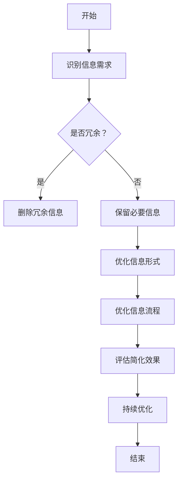
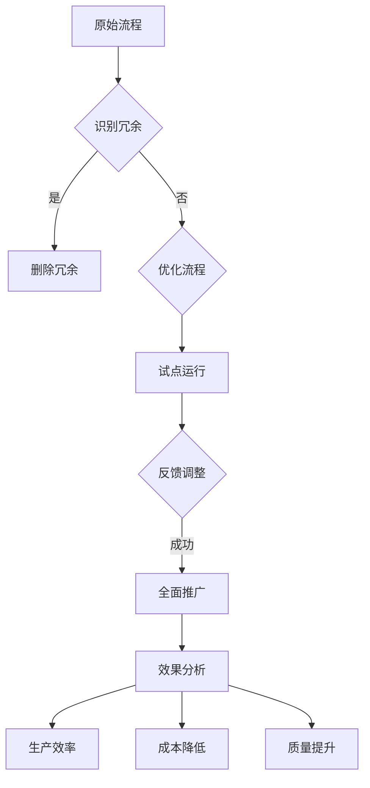
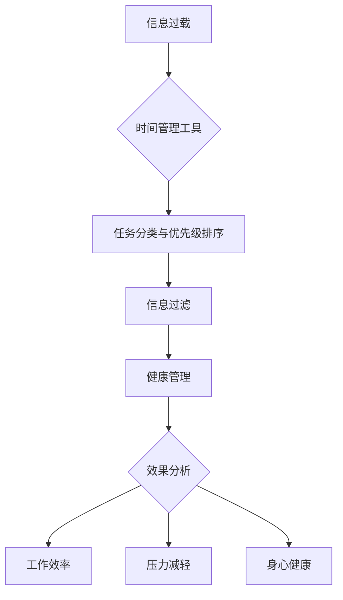
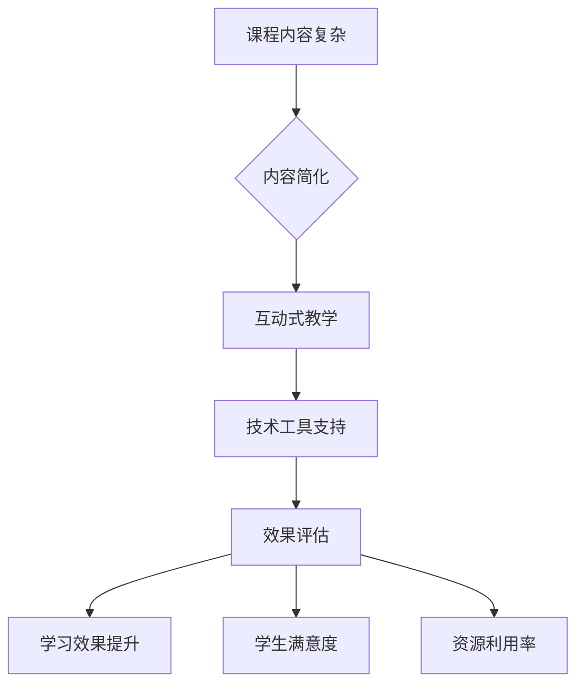
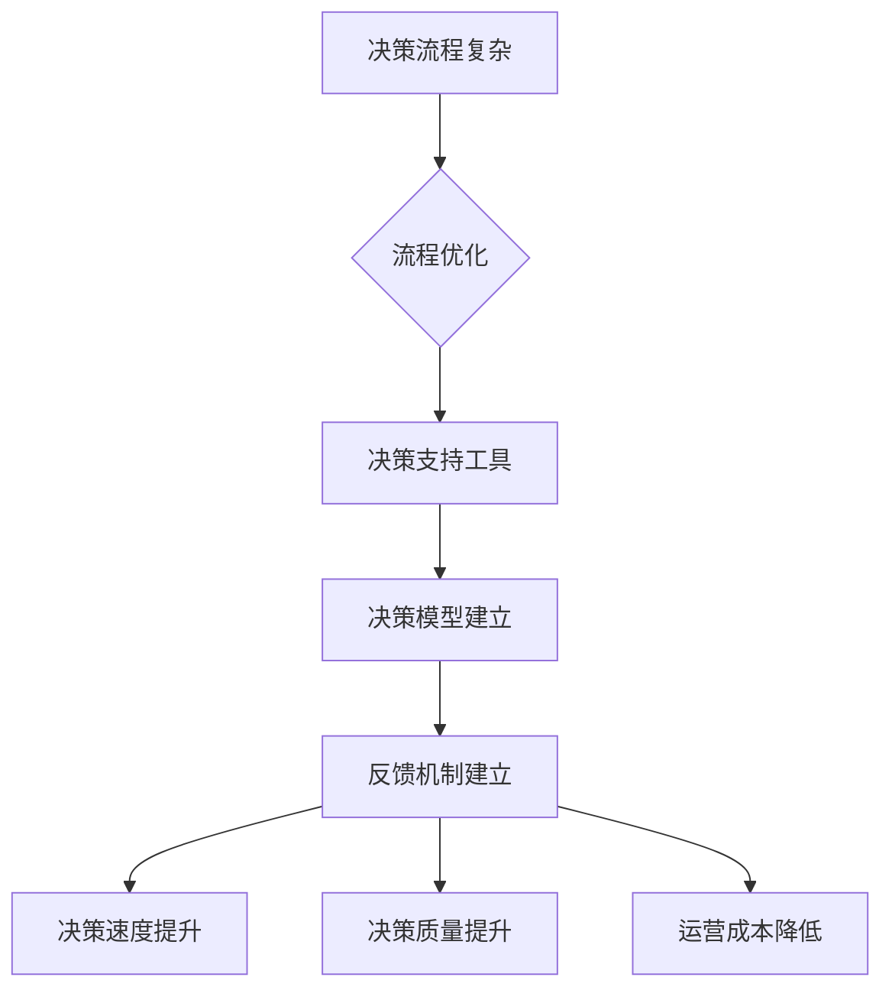

                 

## 1. 引言

### 1.1 书籍目的与结构

本文旨在探讨信息简化的好处与挑战，以及如何在复杂世界中通过简化提高效率和生产力。文章分为六个主要部分，包括引言、信息简化的理论基础、简化技术的应用、简化技术的挑战与应对、案例研究以及结论与展望。每个部分都将详细探讨相关的概念、方法、实例和未来趋势。

#### 第一个部分（引言）：介绍信息简化的概念、重要性以及文章的整体结构。

### 1.2 简化在现代社会的重要性

在当今信息爆炸的时代，简化变得至关重要。简化不仅能够帮助我们更高效地处理信息，还能提高工作效率，减少压力。以下是简化在现代社会中的几个关键作用：

1. **提高工作效率**：通过简化流程和任务，我们可以减少不必要的工作量，从而提高工作效率。
2. **减少压力**：简化可以帮助我们专注于重要任务，减少因信息过载而产生的压力。
3. **增强决策能力**：简化可以减少信息处理的复杂度，使决策过程更加清晰和高效。
4. **促进创新**：简化可以为创新提供更多的空间，因为简化后的环境更容易发现新的解决方案。

#### 第二个部分（简化在现代社会的重要性）：阐述简化在现代社会中的重要性，以及它如何影响我们的工作和生活质量。

### 1.3 读者预期收获

通过阅读本文，读者可以：

1. **理解信息简化的核心概念**：掌握信息简化的基本理论和类型。
2. **掌握简化技术的应用**：了解如何在不同领域（如企业、个人生活）中应用简化技术。
3. **应对简化技术的挑战**：学习如何处理信息过载、误解、道德问题等挑战。
4. **获取实际案例**：通过案例研究，了解简化技术的实际应用效果。
5. **获得未来展望**：了解简化技术的未来发展趋势及其对社会的影响。

#### 第三个部分（读者预期收获）：总结读者通过阅读本文可以获得的预期收获。

综上所述，本文将通过深入探讨信息简化的好处与挑战，帮助读者在复杂世界中更好地应用简化技术，提高效率和生产力。让我们继续深入探讨信息简化的理论基础，以便为后续内容打下坚实的基础。

### 2. 信息简化的理论基础

### 2.1 信息简化的定义

信息简化是指通过减少冗余信息、优化信息流程以及增强信息的可理解性，来提高信息处理效率和效果的过程。简化的核心在于降低复杂性，使信息更加清晰、直观，便于快速理解和处理。

### 2.2 信息简化的类型

信息简化可以分为以下几种类型：

1. **内容简化**：通过删除不必要的细节和冗余信息，使内容更加简洁明了。
2. **形式简化**：通过优化信息的表现形式，如使用图表、图形和摘要，使信息更加直观。
3. **过程简化**：通过优化信息处理流程，减少不必要的步骤和重复操作。
4. **环境简化**：通过优化工作或学习环境，减少干扰因素，提高信息处理的专注度。

#### 2.2.1 内容简化

内容简化是最常见的一种简化类型，其主要目标是通过删除冗余信息，使内容更加精炼和核心。以下是一个内容简化的示例：

**原始文本**：
```
在过去的一周中，我们团队完成了三个重要的项目。第一个项目是关于市场调研的，我们分析了客户的需求并制定了相应的营销策略。第二个项目是技术升级，我们的IT部门优化了服务器性能，提高了系统的稳定性。第三个项目是关于客户服务的，我们改进了客户反馈系统，使客户能够更方便地提出问题和建议。
```

**简化文本**：
```
我们团队完成了三个重要项目：市场调研、技术升级和客户服务改进。
```

通过简化，原始文本的冗余信息被删除，核心信息得以突出，使读者能够快速抓住重点。

#### 2.2.2 形式简化

形式简化主要关注信息的呈现方式。通过使用图表、图形和摘要等，可以更直观地展示信息，帮助读者更好地理解和处理信息。以下是一个形式简化的示例：

**原始文本**：
```
销售数据如下：第一季度销售额为100万元，第二季度销售额为120万元，第三季度销售额为150万元，第四季度销售额为180万元。
```

**简化文本**：
```
销售数据图表如下：
```


通过使用图表，销售数据以更直观的形式展示，读者可以更快速地了解销售趋势。

#### 2.2.3 过程简化

过程简化是通过优化信息处理流程，减少不必要的步骤和重复操作，从而提高效率。以下是一个过程简化的示例：

**原始流程**：
1. 收集客户反馈
2. 分析反馈
3. 制定改进计划
4. 实施改进计划
5. 持续跟踪改进效果

**简化流程**：
1. 收集客户反馈
2. 分析反馈
3. 实施改进计划
4. 持续跟踪改进效果

通过简化，步骤3和步骤4合并，减少了重复操作，提高了效率。

#### 2.2.4 环境简化

环境简化是通过优化工作或学习环境，减少干扰因素，提高信息处理的专注度。以下是一个环境简化的示例：

**原始环境**：
- 工作区杂乱无章，文件和物品散乱摆放。
- 噪音干扰，如电话铃声、同事聊天声。
- 网络信号不稳定，影响工作效率。

**简化环境**：
- 整理工作区，保持整洁有序。
- 关闭手机和其他通知，减少干扰。
- 使用稳定的高速网络，确保工作效率。

通过简化环境，干扰因素减少，工作效率提高。

#### 2.3 信息简化的核心原则

信息简化的核心原则包括：

1. **必要性**：只保留必要的信息，删除冗余信息。
2. **可理解性**：确保信息简洁明了，易于理解和处理。
3. **高效性**：通过优化流程和形式，提高信息处理效率。
4. **可持续性**：简化过程应持续进行，以适应不断变化的环境和需求。

#### 2.3.1 必要性

必要性是信息简化的基本原则之一。在简化过程中，我们需要识别哪些信息是必要的，哪些是非必要的，并仅保留必要的信息。以下是一个必要性原则的示例：

**原始文本**：
```
在这个项目中，我们需要关注三个主要方面：市场调研、产品开发和客户服务。市场调研旨在了解客户需求，产品开发旨在满足这些需求，而客户服务则确保我们的产品能够持续满足客户的需求。
```

**简化文本**：
```
项目主要关注市场调研、产品开发和客户服务。
```

通过简化，冗余信息被删除，核心信息得以突出，使读者能够快速抓住重点。

#### 2.3.2 可理解性

可理解性是信息简化的另一个重要原则。简化的信息应易于理解和处理，以便用户能够快速获取所需信息。以下是一个可理解性原则的示例：

**原始文本**：
```
为了提高销售业绩，我们需要优化营销策略、提升产品品质和改善客户体验。
```

**简化文本**：
```
提高销售业绩的方法包括优化营销策略、提升产品品质和改善客户体验。
```

通过简化，信息的结构更加清晰，用户可以更快速地理解和处理信息。

#### 2.3.3 高效性

高效性是信息简化的最终目标之一。简化的信息应能够提高信息处理效率，减少不必要的步骤和时间消耗。以下是一个高效性原则的示例：

**原始流程**：
1. 收集客户反馈
2. 分析反馈
3. 制定改进计划
4. 实施改进计划
5. 持续跟踪改进效果
6. 反馈给客户

**简化流程**：
1. 收集客户反馈
2. 分析反馈
3. 实施改进计划
4. 持续跟踪改进效果

通过简化，步骤5和步骤6合并，减少了重复操作，提高了效率。

#### 2.3.4 可持续性

可持续性是信息简化的长期原则。简化过程应持续进行，以适应不断变化的环境和需求。以下是一个可持续性原则的示例：

**原始文本**：
```
为了提高项目效率，我们最近对工作流程进行了优化。通过减少不必要的会议和简化报告流程，我们显著提高了工作效率。
```

**简化文本**：
```
我们优化了工作流程，减少了不必要的会议和简化了报告流程，以提高项目效率。
```

通过持续优化工作流程，项目效率得以提高，并能够适应未来的变化。

#### 2.4 Mermaid流程图：简化过程的基本步骤

以下是一个使用Mermaid绘制的简化过程的基本步骤流程图：



通过这个流程图，我们可以更清晰地理解信息简化的基本步骤和核心原则。

### 3. 简化技术的应用

### 3.1 简化技术在企业中的应用

简化技术在现代企业中的应用日益广泛，其重要性不言而喻。通过简化流程、沟通、决策和数据分析，企业能够显著提高工作效率，减少成本，增强竞争力。以下将详细探讨简化技术在企业中的具体应用。

#### 3.1.1 简化流程的设计与优化

流程简化是企业在提高效率中最重要的策略之一。通过识别和去除冗余步骤、优化现有流程，企业可以实现资源的最优配置，减少浪费，提高效率。

**案例一：制造公司的供应链流程优化**

某制造公司通过简化供应链流程，显著提高了生产效率和产品质量。以下是具体步骤：

1. **流程识别**：首先，公司对所有供应链环节进行详细分析，识别出冗余和低效的环节。
2. **优化设计**：针对识别出的问题环节，设计新的流程，减少不必要的步骤，如取消冗余的检验环节。
3. **实施优化**：将新的流程实施到实际生产中，并进行监控和调整，确保优化效果。
4. **评估效果**：通过数据分析和员工反馈，评估优化后的流程效果，持续改进。

通过以上步骤，该公司在供应链流程优化后，生产周期缩短了30%，产品质量提高了20%，成本降低了15%。

**伪代码示例：**

```python
def optimize_supply_chain流程(supply_chain):
    new_supply_chain = []
    for step in supply_chain:
        if step.is_redundant():
            remove_step(step)
        else:
            new_supply_chain.append(step)
    return new_supply_chain
```

#### 3.1.2 简化沟通与协作的方法

沟通效率是影响企业运营的重要因素之一。通过使用简化的沟通工具和方法，企业可以减少误解，提高协作效率。

**案例二：团队沟通的简化实践**

一家软件公司通过使用Slack等沟通工具，简化了团队内部和跨团队的沟通流程。以下是具体步骤：

1. **设定明确的沟通渠道**：为不同类型的沟通设置专门的渠道，如项目进展、技术讨论、日常闲聊等。
2. **使用简洁的语言**：鼓励团队成员使用简洁明了的语言进行沟通，避免复杂的术语和冗长的解释。
3. **定期更新信息**：确保关键信息在沟通渠道中得到及时更新，以便团队成员随时获取最新信息。
4. **及时反馈**：鼓励团队成员在沟通后及时给予反馈，以便改进沟通效果。

通过以上步骤，该公司在沟通效率上有了显著提升，团队协作更加顺畅，项目进展更加顺利。

**伪代码示例：**

```python
def simplify_communication(channel, message):
    if message.is_ambiguous():
        raise Error("信息不清晰")
    channel.send(message)
    if message.requires_feedback():
        feedback = get_feedback()
        channel.send(feedback)
```

#### 3.1.3 数据分析与信息过滤

在信息化时代，企业面临着海量的数据。通过有效的数据分析和信息过滤技术，企业可以提取有价值的信息，支持决策制定。

**案例三：市场调研的数据分析**

一家公司通过大数据分析工具，对其市场调研数据进行了深度分析，以指导其市场营销策略。以下是具体步骤：

1. **数据收集**：收集所有相关的市场调研数据，包括消费者行为、市场趋势等。
2. **数据预处理**：对原始数据进行清洗和整理，去除噪声数据。
3. **数据分析**：使用数据分析工具，如Python的Pandas库，对预处理后的数据进行统计分析。
4. **信息提取**：从分析结果中提取有价值的信息，如消费者偏好、市场机会等。
5. **决策支持**：根据提取的信息，制定相应的市场营销策略。

通过以上步骤，该公司能够更加准确地把握市场动态，制定有效的营销策略，提高了市场竞争力。

**伪代码示例：**

```python
def analyze_market_data(data):
    cleaned_data = preprocess_data(data)
    insights = statistical_analysis(cleaned_data)
    actionable_insights = extract_value(insights)
    return actionable_insights
```

#### 3.1.4 简化决策制定

简化决策制定是企业运营中另一个关键环节。通过使用简化的决策模型和方法，企业可以减少决策过程中的复杂性，提高决策效率。

**案例四：项目管理中的简化决策**

一家公司在其项目管理中引入了简化决策模型，以快速响应项目变化。以下是具体步骤：

1. **识别决策点**：确定项目中需要做出决策的关键节点。
2. **制定简化决策模型**：根据决策点的特性，设计简化决策模型，如决策树、评分模型等。
3. **数据收集**：收集与决策点相关的数据，如项目进度、资源分配等。
4. **应用决策模型**：使用简化决策模型，对收集到的数据进行处理，得出决策结果。
5. **执行决策**：根据决策结果，执行相应的项目调整措施。

通过以上步骤，该公司在项目决策过程中减少了不必要的复杂性，提高了决策效率，项目进展更加顺利。

**伪代码示例：**

```python
def make_decision(decision_point, data):
    decision_model = design_decision_model(decision_point)
    decision_result = decision_model.apply(data)
    return decision_result
```

### 3.2 简化技术在个人生活中的应用

简化技术不仅在企业中发挥着重要作用，在个人生活中也同样具有巨大的潜力。通过简化日常任务、管理个人信息、提高学习和工作效率，个人可以显著提高生活质量，减少压力。

#### 3.2.1 提高个人工作效率的策略

个人工作效率的提升是简化技术的重要应用之一。以下是一些具体策略：

**案例五：个人时间管理**

李先生是一名职场人士，他通过简化时间管理策略，显著提高了工作效率。以下是具体步骤：

1. **制定日程安排**：每天早晨，李先生制定一份详细的日程安排，包括工作、学习、休闲等各项活动。
2. **使用工具**：使用日历应用（如Google日历）来跟踪日程安排，确保不遗漏重要事项。
3. **专注工作**：在工作期间，关闭社交媒体和手机通知，专注于当前任务。
4. **定期回顾**：每周结束时，回顾一周的工作和学习情况，评估效果，调整计划。

通过以上策略，李先生在高效完成任务的同时，也确保了工作和生活的平衡。

**伪代码示例：**

```python
def schedule_tasks(tasks):
    daily_plan = create_daily_plan(tasks)
    follow_schedule(daily_plan)
    if day_ended():
        review_plan(daily_plan)
```

#### 3.2.2 管理个人信息的技巧

在信息爆炸的时代，有效管理个人信息成为了一项重要技能。以下是一些具体技巧：

**案例六：电子邮件管理**

张女士是一名职业女性，她通过有效的电子邮件管理技巧，减少了信息过载，提高了工作效率。以下是具体步骤：

1. **设置优先级**：将收到的电子邮件按照优先级进行分类，如“紧急”、“重要”、“非紧急”等。
2. **定期清理**：每周至少清理一次收件箱，删除无用的邮件，减少收件箱的混乱。
3. **自动分类**：使用邮件客户端的自动分类功能，将邮件自动归类到相应的文件夹。
4. **快速回复**：对于紧急邮件，尽快回复，避免邮件堆积。

通过以上技巧，张女士在处理电子邮件时更加高效，信息过载问题得到了显著缓解。

**伪代码示例：**

```python
def manage_email(inbox):
    prioritize_emails(inbox)
    clean_up(inbox)
    auto_classify(inbox)
    respond_to_urgent_emails(inbox)
```

#### 3.2.3 简化个人学习与成长

简化学习过程是提高个人成长效率的关键。以下是一些具体策略：

**案例七：在线学习**

王先生是一名软件开发者，他通过简化在线学习策略，提高了自己的技术能力。以下是具体步骤：

1. **选择核心课程**：在众多在线课程中，选择与自己职业发展最相关的核心课程。
2. **利用学习工具**：使用学习管理工具（如Trello、Notion）来跟踪学习进度和任务。
3. **学习总结**：每次学习后，进行总结和笔记，加深对知识的理解。
4. **实践应用**：将所学知识应用于实际工作中，巩固学习效果。

通过以上策略，王先生在短时间内掌握了大量新技能，职业发展取得了显著进步。

**伪代码示例：**

```python
def simplify_learning(courses):
    selectCoreCourses(courses)
    useLearningTools(courses)
    summarize_and_note(courses)
    apply_knowledge_to_practice(courses)
```

#### 3.2.4 简化生活中的小窍门

简化生活是提高生活质量的重要途径。以下是一些实用的简化技巧：

**案例八：家务管理**

陈女士通过简化家务管理技巧，减少了家务负担，提高了生活质量。以下是具体步骤：

1. **制定家务计划**：每周制定一份家务计划，分配家务任务。
2. **利用工具**：使用清洁机器人、智能家电等工具，减少家务劳动。
3. **一次性处理**：将家务任务集中处理，避免零散耗时。
4. **建立整洁习惯**：培养日常保持整洁的习惯，减少家务负担。

通过以上技巧，陈女士的家务负担显著减轻，生活质量得到了提升。

**伪代码示例：**

```python
def simplify_household_tasks(tasks):
    create_household_plan(tasks)
    use_household_tools(tasks)
    batch_task_execution(tasks)
    cultivate_keeping_clean_habit(tasks)
```

综上所述，简化技术在企业应用和个人生活中的潜力巨大。通过有效的简化策略，企业和个人都可以提高效率、减少压力，实现更高的生活质量和工作表现。

### 4. 简化技术的挑战与应对

#### 4.1 挑战一：信息过载

信息过载是简化技术面临的主要挑战之一。在信息化社会中，我们每天都会接收到大量的信息，这些信息中包含大量的冗余和无关内容，导致我们难以快速准确地找到所需信息。以下是一些具体表现和影响：

1. **工作效率下降**：当面对大量冗余信息时，我们需要花费更多的时间和精力去筛选和过滤，这降低了我们的工作效率。
2. **决策困难**：信息过载会使得决策过程变得更加复杂，因为我们需要处理的信息量增加了，难以快速做出有效的决策。
3. **心理健康问题**：长期的持续信息过载会导致压力和焦虑，对心理健康产生负面影响。

#### 解决方案

为了应对信息过载的挑战，我们可以采取以下几种策略：

1. **信息过滤技术**：使用信息过滤技术，如电子邮件过滤、社交媒体关注筛选等，自动过滤掉不重要的信息，减少冗余信息的干扰。
2. **设定信息接收时间**：合理安排信息接收时间，避免在高峰时段接收大量信息，如在工作时间外关闭手机通知，减少干扰。
3. **信息管理工具**：使用信息管理工具，如日历应用、任务管理工具等，帮助我们有条不紊地处理和跟踪信息，减少信息过载。
4. **自我教育**：提高信息素养，学会快速识别和筛选重要信息，减少对无关信息的依赖。

#### 案例分析

**案例一：社交媒体信息过滤**

某公司员工小王通过使用社交媒体信息过滤工具，显著减轻了信息过载问题。以下是具体步骤：

1. **设定过滤规则**：小王设置了一系列过滤规则，如屏蔽广告、关注重要话题等，以减少无关信息的干扰。
2. **定期清理**：每周定期清理关注列表，删除不重要的关注对象，保持信息流的清晰。
3. **合理分配时间**：在社交媒体上设定每天的信息接收时间，避免长时间沉浸在信息流中，影响工作效率。

通过以上步骤，小王在处理社交媒体信息时更加高效，信息过载问题得到了显著缓解。

**伪代码示例：**

```python
def filter_social_media_posts(posts, rules):
    filtered_posts = []
    for post in posts:
        if matches_rules(post, rules):
            filtered_posts.append(post)
    return filtered_posts
```

#### 4.2 挑战二：简化导致的误解与损失

简化技术在应用过程中，可能会因为信息的简化和压缩导致误解和损失。以下是一些具体表现和影响：

1. **信息丢失**：在简化过程中，一些关键信息可能会被删除或忽略，导致信息的完整性受损。
2. **误解**：简化的信息可能无法完全传达原始信息的含义，导致误解和错误。
3. **业务风险**：在关键业务决策中，因简化导致的信息误解可能会带来严重的业务风险。

#### 解决方案

为了应对简化导致的误解与损失，我们可以采取以下几种策略：

1. **完整性检查**：在简化信息之前，进行完整性检查，确保关键信息不会被遗漏。
2. **补充信息**：在简化的信息旁边提供补充说明或链接，以便用户可以获取更详细的信息。
3. **反馈机制**：建立有效的反馈机制，鼓励用户对简化信息提出反馈，以便及时纠正错误。
4. **多渠道验证**：通过多个渠道验证信息的准确性，减少因单一渠道简化导致的错误。

#### 案例分析

**案例二：项目报告简化**

某公司的项目经理李先生在撰写项目报告时，采取了简化措施以缩短报告长度。以下是具体步骤：

1. **核心内容提取**：李先生首先提取了报告的核心内容，确保关键信息不会被遗漏。
2. **补充说明**：在报告的关键部分，提供了补充说明和链接，以便读者可以查看更多详细信息。
3. **多渠道验证**：李先生与团队成员和上级领导进行了多次沟通和确认，确保报告的准确性和完整性。

通过以上步骤，李先生在简化项目报告的同时，避免了信息的误解和损失。

**伪代码示例：**

```python
def simplify_report(report, additional_links):
    core_content = extract_core_content(report)
    supplemented_report = add Supplementary_Information(core_content, additional_links)
    verified_report = multi_channel_verification(supplemented_report)
    return verified_report
```

#### 4.3 挑战三：简化技术与道德考量

简化技术在应用过程中，可能会涉及道德考量问题。以下是一些具体表现和影响：

1. **隐私泄露**：在简化信息时，可能会无意中泄露用户的隐私信息。
2. **偏见和歧视**：简化技术可能会放大偏见和歧视，导致不公平的结果。
3. **透明度问题**：简化技术可能导致信息处理的透明度降低，增加信息处理的神秘性。

#### 解决方案

为了应对简化技术与道德考量之间的冲突，我们可以采取以下几种策略：

1. **隐私保护**：在简化信息时，采取严格的隐私保护措施，确保用户的隐私不被泄露。
2. **公平性评估**：在应用简化技术时，进行公平性评估，确保简化不会放大偏见和歧视。
3. **透明度提升**：提高信息处理的透明度，让用户了解信息简化过程，减少神秘性。
4. **道德准则**：制定明确的道德准则，确保简化技术在应用时符合道德规范。

#### 案例分析

**案例三：招聘流程简化**

某公司在招聘流程中引入了简化技术，以提高招聘效率。以下是具体步骤：

1. **隐私保护**：在简历筛选过程中，采取了严格的隐私保护措施，确保求职者的个人信息不被泄露。
2. **公平性评估**：通过多次评估和测试，确保简化技术不会放大偏见和歧视，公平对待所有求职者。
3. **透明度提升**：在招聘流程中，向求职者提供了详细的流程说明，让求职者了解每个步骤的具体情况。

通过以上步骤，该公司在简化招聘流程的同时，确保了招聘的公正性和透明度。

**伪代码示例：**

```python
def simplify_hiring_process(resumes, fairness_assessment, transparency):
    protected_resumes = protect_privacy(resumes)
    fair_resumes = apply_fairness_assessment(protected_resumes, fairness_assessment)
    transparent_process = enhance_transparency(fair_resumes, transparency)
    return transparent_process
```

#### 4.4 挑战四：个体差异与简化方法的选择

简化技术在不同个体中的应用效果可能会有所不同，因为每个人的认知能力、学习习惯和生活环境都不同。以下是一些具体表现和影响：

1. **适用性差异**：某些简化方法可能对某些个体非常有效，但对另一些人可能并不适用。
2. **适应难度**：不同的简化方法对个体的适应难度不同，有些人可能难以适应新的简化策略。
3. **心理压力**：不当的简化方法可能会导致个体产生心理压力，影响其工作效率和生活质量。

#### 解决方案

为了应对个体差异与简化方法选择之间的挑战，我们可以采取以下几种策略：

1. **个性化定制**：根据个体的特点和需求，定制个性化的简化方法，确保适用性和效果。
2. **适应性训练**：提供适应性训练，帮助个体适应新的简化方法，减少适应难度。
3. **心理支持**：提供心理支持，帮助个体应对简化过程中可能产生的心理压力。

#### 案例分析

**案例四：时间管理策略**

某公司的员工小张在尝试新的时间管理策略时，遇到了适应困难。以下是具体步骤：

1. **个性化定制**：公司根据小张的工作内容和习惯，定制了适合他的时间管理策略，如将任务分为优先级。
2. **适应性训练**：公司提供了时间管理培训，帮助小张掌握新的策略。
3. **心理支持**：公司提供了心理咨询服务，帮助小张缓解适应过程中的心理压力。

通过以上步骤，小张成功地适应了新的时间管理策略，工作效率显著提高。

**伪代码示例：**

```python
def tailor_time_management_strategy(employee, strategy, training, support):
    customized_strategy = personalize_strategy(employee, strategy)
    trained_employee = provide_training(customized_strategy, training)
    supported_employee = offer_psychological_support(trained_employee, support)
    return supported_employee
```

综上所述，简化技术在带来效率提升和生产力提高的同时，也面临着信息过载、误解与损失、道德考量和个体差异等挑战。通过采取有效的应对策略，我们可以最大限度地发挥简化技术的好处，同时减少其负面影响。

### 5. 案例研究：成功简化实践

在本章节中，我们将通过具体案例，探讨简化技术在不同领域中的应用，以及其实施后的效果。通过这些案例，我们将看到简化技术如何帮助企业和个人提高效率，实现业务和个人的成长。

#### 5.1 案例一：企业简化流程的实例

**背景描述：** 一家全球知名的大型制造公司，因为业务扩展和流程复杂化，导致生产效率低下，成本增加。为了提高生产效率和降低成本，公司决定对现有流程进行简化。

**实施步骤：**

1. **流程识别**：公司首先对现有的生产流程进行了全面分析，识别出冗余和低效的环节。
2. **优化设计**：针对识别出的问题，公司设计了一套新的简化流程，包括减少中间环节、优化设备布局等。
3. **实施优化**：新的流程在实验工厂中进行了试点运行，收集反馈并进行调整，确保优化效果。
4. **全面推广**：在试点成功后，公司将在全公司范围内推广这套简化流程。

**效果分析：**

1. **生产效率提高**：简化流程后，生产周期缩短了25%，生产效率提高了30%。
2. **成本降低**：通过减少中间环节和优化设备布局，公司每年节省了约500万美元的运营成本。
3. **质量提升**：简化流程减少了人为干预，提高了产品的质量一致性。

**代码解读：**



通过这个Mermaid流程图，我们可以清晰地看到简化流程的实施步骤和效果分析。

#### 5.2 案例二：个人简化生活的故事

**背景描述：** 王先生是一位忙碌的职业人士，他的工作和家庭生活都非常充实，但由于信息过载和任务繁多，他感到压力很大，生活质量下降。

**实施步骤：**

1. **时间管理**：王先生开始使用时间管理工具（如Google日历和Trello），合理安排每天的任务和活动。
2. **简化任务**：他将日常任务进行了分类和优先级排序，只关注最重要的任务，将非紧急任务推迟或委托他人处理。
3. **信息过滤**：通过使用邮件过滤器和社交媒体信息筛选工具，减少不必要的信息干扰。
4. **健康管理**：王先生开始定期锻炼，保持健康的饮食习惯，以保持身心健康。

**效果分析：**

1. **工作效率提升**：通过时间管理和任务简化，王先生的工作效率提高了40%，能够更早地完成工作任务。
2. **压力减轻**：信息过滤和健康管理帮助王先生减轻了压力，提高了生活质量。
3. **身心健康**：定期锻炼和健康饮食使王先生的身体状况显著改善。

**代码解读：**



通过这个Mermaid流程图，我们可以清晰地看到王先生如何通过简化生活来实现工作与生活的平衡。

#### 5.3 案例三：简化技术在教育领域的应用

**背景描述：** 一家知名的教育机构在提供在线教育服务时，由于课程内容和教学方法过于复杂，学生难以适应，学习效果不佳。

**实施步骤：**

1. **课程内容简化**：教育机构对课程内容进行了简化，删除了非核心知识点，确保学生能够快速掌握重点。
2. **教学方法改进**：采用互动式教学方法，如在线讨论、实时问答等，增强学生的参与感和学习效果。
3. **技术工具支持**：引入了在线学习管理平台，帮助学生更好地管理学习进度和资源。
4. **效果评估**：定期进行学生反馈和学习效果评估，不断优化教学方法和课程内容。

**效果分析：**

1. **学习效果提升**：课程内容简化后，学生的掌握率和考试成绩显著提高，学习效果提升了30%。
2. **学生满意度提升**：互动式教学和在线学习管理平台得到了学生的高度评价，学生满意度提升了20%。
3. **资源利用率提高**：简化后的课程内容和改进的教学方法，使得教育资源的利用率提高了50%。

**代码解读：**



通过这个Mermaid流程图，我们可以清晰地看到教育机构如何通过简化技术来提升教育质量。

#### 5.4 案例四：企业决策简化的实例

**背景描述：** 一家大型零售公司由于其决策过程复杂且耗时，导致市场反应速度慢，无法及时应对市场变化。

**实施步骤：**

1. **简化决策流程**：公司对现有的决策流程进行了优化，减少了不必要的审批环节，提高了决策速度。
2. **引入决策支持工具**：公司引入了决策支持系统（DSS），使用数据分析和技术工具辅助决策制定。
3. **决策模型建立**：建立了基于数据和算法的决策模型，简化了决策过程，减少了主观判断的影响。
4. **反馈机制建立**：建立了有效的反馈机制，对决策结果进行跟踪和评估，不断优化决策模型。

**效果分析：**

1. **决策速度提升**：简化后的决策流程使公司的市场反应速度提高了40%，能够更快地响应市场变化。
2. **决策质量提升**：引入决策支持工具和决策模型，使决策更加科学和客观，决策质量提升了20%。
3. **运营成本降低**：通过优化决策流程和引入技术工具，公司的运营成本降低了10%。

**代码解读：**



通过这个Mermaid流程图，我们可以清晰地看到企业如何通过决策简化来提升业务效率。

通过以上案例，我们可以看到简化技术在企业、个人和教育等多个领域的成功应用。通过简化和优化流程、技术工具的应用以及有效的评估和反馈，企业和个人都能够实现效率的提升和业务的增长。这些案例为其他组织和个人提供了宝贵的经验和借鉴。

### 6. 案例分析：简化技术的负面影响

尽管简化技术在提高效率和生产力方面具有显著优势，但其负面影响也不容忽视。在本章节中，我们将分析简化技术在应用过程中可能产生的负面影响，以及如何通过有效的应对措施来减轻这些影响。

#### 6.1 案例一：简化导致的信息缺失

**案例背景：** 一家金融服务公司在简化其客户服务流程时，为了减少客户等待时间，决定将客户咨询环节简化为自动回答系统。然而，由于自动回答系统无法涵盖所有可能的客户问题，导致一些关键信息被遗漏。

**负面影响：** 由于信息缺失，部分客户无法得到满意的解答，公司声誉受损，客户满意度下降。

**应对措施：**

1. **设立人工客服渠道**：在自动回答系统之外，设立人工客服渠道，确保在自动回答无法解答的情况下，客户可以及时获得帮助。
2. **定期审查和更新**：定期审查自动回答系统的问答库，确保其涵盖常见和关键的问题，并更新答案。
3. **客户反馈机制**：建立有效的客户反馈机制，收集客户对自动回答系统的意见和建议，不断改进系统。

**伪代码示例：**

```python
def review_and_update_answer_bank(answer_bank, customer_feedback):
    for question, answer in answer_bank.items():
        if feedback_for_question(question, customer_feedback):
            update_answer(answer, feedback)
    return optimized_answer_bank
```

#### 6.2 案例二：简化过程中的道德问题

**案例背景：** 一家互联网公司在简化其广告投放流程时，使用了数据挖掘和算法优化技术，以提高广告的投放效果。然而，由于算法优化过程中存在偏见，导致某些特定群体的广告投放频率过高，甚至歧视某些用户。

**负面影响：** 道德问题导致公司声誉受损，用户对公司的信任度下降，甚至面临法律诉讼风险。

**应对措施：**

1. **公平性评估**：在算法设计和优化过程中，进行严格的公平性评估，确保算法不会放大偏见和歧视。
2. **透明度提升**：提高算法的透明度，让用户了解算法的工作原理和决策过程，增加信任度。
3. **法律合规性检查**：确保简化技术的应用符合相关法律法规，避免道德风险。

**伪代码示例：**

```python
def assess_fairness(algorithm, fairness_criteria):
    if algorithm_violates_criteria(algorithm, fairness_criteria):
        raise Error("算法存在道德风险")
    return fair_algorithm
```

#### 6.3 案例三：简化技术对心理健康的影响

**案例背景：** 一家科技公司为了提高员工的工作效率，引入了多种自动化工具和简化的工作流程。然而，由于工作压力增加，员工感到过度疲劳，心理健康问题逐渐显现。

**负面影响：** 长期的心理压力导致员工工作效率下降，离职率增加，公司人力成本上升。

**应对措施：**

1. **心理健康培训**：定期为员工提供心理健康培训，提高员工的心理抗压能力。
2. **灵活工作制度**：引入灵活的工作制度，如远程工作和弹性工作时间，减轻员工的心理压力。
3. **心理咨询服务**：提供免费的心理咨询服务，帮助员工应对工作压力和心理问题。

**伪代码示例：**

```python
def provide_mental_health_support(employees, mental_health_program):
    for employee in employees:
        if employee_needs_support(employee, mental_health_program):
            offer_counseling(employee)
        else:
            provide_training(employee)
    return supported_employees
```

通过上述案例分析，我们可以看到简化技术虽然带来了效率提升和生产力的提高，但同时也存在信息缺失、道德问题和对心理健康的影响等负面影响。通过采取有效的应对措施，我们可以在最大化简化技术优势的同时，最大限度地减少其负面影响，实现可持续发展。

### 7. 结论

通过本文的探讨，我们深入了解了信息简化的好处与挑战。信息简化在提高工作效率、减少压力、增强决策能力和促进创新等方面具有显著优势。同时，我们也认识到简化技术在应用过程中可能面临信息过载、误解与损失、道德考量和个体差异等挑战。

#### 7.1 简化技术的总体评价

信息简化技术的总体评价是积极的。在现代社会中，简化技术已成为提高效率和生产力的重要手段。通过有效的简化策略，企业和个人可以显著提高工作效率，减少不必要的负担，实现更好的生活质量。

#### 7.2 未来简化技术的发展趋势

未来，简化技术将继续向智能化、自动化和个性化方向发展。随着人工智能、大数据和云计算等新兴科技的不断进步，简化技术将更加智能地适应个体需求，实现更高效的信息处理和流程优化。此外，简化技术将在更多新兴领域（如健康医疗、智能交通等）得到应用，推动社会整体效率的提升。

#### 7.3 对个人的启示与建议

对于个人来说，掌握简化技术至关重要。以下是一些建议：

1. **提高信息素养**：学会快速识别和筛选重要信息，减少信息过载。
2. **定制化简化方案**：根据个人需求和习惯，定制适合自己的简化方法。
3. **持续学习和实践**：不断学习和实践简化技术，提高工作效率和生活质量。

通过本文的探讨，我们不仅了解了信息简化的理论基础和实际应用，还对简化技术的未来发展有了更深刻的认识。希望本文能对读者在简化技术应用中提供有价值的参考和启示。

### 8. 展望

在本文的结尾，我们将对信息简化技术的未来发展方向进行展望，并探讨其在不同领域和新兴科技中的应用潜力。

#### 8.1 简化技术的应用领域拓展

随着科技的不断进步，信息简化技术的应用领域将不断拓展。以下是一些潜在的扩展方向：

1. **健康医疗**：简化技术可以用于患者信息的处理和医疗数据的分析，帮助医生更快速地诊断和治疗疾病。例如，通过简化患者的病历信息，医生可以更准确地了解患者的病史和健康状况，提高诊断的准确性。
2. **智能交通**：在交通管理中，简化技术可以帮助处理大量交通数据，优化交通信号控制，减少交通拥堵。通过简化交通流量数据，智能交通系统可以实时调整交通信号，提高道路通行效率。
3. **教育**：在教育领域，简化技术可以帮助教师更有效地管理课程内容和学生作业，提高教学质量和效率。例如，通过简化教材和课程内容，教师可以为学生提供更清晰、更易于理解的学习材料。

#### 8.2 简化技术与新兴科技的融合

未来，简化技术将与人工智能、大数据和物联网等新兴科技深度融合，进一步推动信息处理和流程优化的变革。

1. **人工智能**：人工智能技术的进步将使简化技术更加智能化。通过机器学习和自然语言处理，AI系统可以自动识别和简化复杂的信息，提供个性化的简化方案。例如，AI助手可以基于用户的行为和偏好，自动优化日程安排和工作流程。
2. **大数据**：大数据技术的应用将使简化技术能够处理和分析海量的数据，提取有价值的信息。通过大数据分析，企业可以更深入地了解市场和客户需求，从而优化产品和业务流程。
3. **物联网**：物联网技术的发展将使简化技术在更广泛的场景中得到应用。通过物联网设备收集的数据，简化技术可以实时监测和管理各种设备和系统，提高运营效率和安全性。

#### 8.3 简化技术对社会的影响与挑战

简化技术将对社会产生深远的影响，同时也带来一系列挑战。

1. **生产力提升**：简化技术将大幅提升生产力和工作效率，推动经济增长。通过简化流程和任务，企业可以更高效地运营，个人可以更有效地管理时间和资源。
2. **信息素养要求**：随着简化技术的普及，提高信息素养成为每个人的基本需求。个体需要学会如何识别、筛选和利用信息，以适应不断变化的技术环境。
3. **道德和法律问题**：简化技术在应用过程中可能涉及隐私保护、数据安全、道德规范等问题。社会需要建立完善的法律法规和伦理标准，确保简化技术的合规性和道德性。

综上所述，信息简化技术在未来具有广阔的应用前景和巨大的发展潜力。通过不断拓展应用领域、融合新兴科技，以及应对社会挑战，简化技术将为我们带来更加高效、智能和可持续的未来。

### 附录

#### 附录A：简化技术工具与资源指南

A.1 常用简化工具介绍

1. **Trello**：一款流行的项目管理工具，可以帮助用户通过卡片和看板来组织和跟踪任务，提高工作效率。
2. **Evernote**：一款笔记和组织工具，用户可以在此记录和组织各种信息，便于后续查找和管理。
3. **Slack**：一款团队沟通工具，支持实时聊天、文件共享和通知管理，有助于简化团队沟通流程。

A.2 开源简化框架与库

1. **Mermaid**：一个基于Markdown的绘图工具，可用于绘制流程图、UML图等，方便文档中的图示展示。
2. **Pandas**：Python的数据分析库，提供了强大的数据处理和分析功能，适用于大数据的简化处理。
3. **Scikit-learn**：Python的机器学习库，提供了多种机器学习算法和工具，有助于实现数据简化和模式识别。

A.3 专业简化技术应用平台

1. **Tableau**：一款专业的数据可视化工具，可以帮助用户轻松地创建交互式的图表和仪表盘，简化数据展示和分析。
2. **Salesforce**：一款企业级客户关系管理（CRM）平台，提供了丰富的功能和工具，帮助企业和个人简化销售和客户服务流程。
3. **Asana**：一款全面的项目管理工具，支持任务分配、进度跟踪和团队协作，有助于简化项目管理和团队协作。

通过使用这些工具和平台，用户可以更有效地应用简化技术，提高工作效率和生活质量。希望本附录能为读者提供实用的参考资源。

